# 2023 新版华为认证HCIA+HCIP+HCIE全套视频讲解！一套视频让你从入门到精通！CCNA／CCNP／CCIE技术提升同样适用！ - P109：（持续更新）HCIE Datacom - 55.6to4隧道，Istap隧道，IPV6静态 - -Book思议8 - BV1W8411A7z8

电脑软件啊，然后这次应该会有声音。嗯，应该没问题啊，老师已经测过了。呃，前两节课没声音是吧，这两节课应该就有了。嗯，当我们这节课还是讲IPU6啊，然后剩下的内容比较少了，不多了啊，就剩下呃一点点。

没多少了啊，然后我们来看一下吧，就是。依然会去讲这个IPU6的隧道技术啊。呃，我们讲完这个IPU6之后呢，接下来会去讲一下这个呃三大协议对IPU6的支持啊。嗯，首先我们把这一些隧道技术看完啊。😊，嗯。

我们首先介绍的第一个啊，第一个叫做6凸四隧道。嗯，这个6凸4隧道呢，它是一种自动隧道啊，我们上节课讲到了两种隧道呃，这个一个是6224手动隧道呃，那么还有一种呢是这个。呃，叫叫叫叫叫叫叫叫叫什么来着？

啊，嘉义隧道对，没错是吧？以及说了这两种隧道的区别啊。嗯，那么他们还有一个相同点，就代表就是他们都是手动隧道是吧，都是静态隧道。嗯，静态隧道呢，我们就没有办法跟着网络的变化来进行调整是吧？嗯。

静态隧道所体现的一个缺陷是在哪里呢？嗯，就是我们得不断的去配置。对吧比如说我们新来了一个站点之后，现在假如说有一2两个站点，他俩之间建立了一个静态的隧道啊，来了一个三呢。

我们得在一上跟三再建立一个探道口是吧？二上呢跟三也跑一个探道口，对不对？嗯，就是我们得去做重复大量的配置。😊，对不对？嗯，那有没有更好的方式去解决掉它呢？比如说我新增了一个站点3，对吧？

而原有的站点呢不需要去做更多的配置。嗯，那由此呢就衍生出来的一种叫做六凸式隧道啊，它本身是一种自动隧道啊。呃，这六突寺隧道是怎么样的呢？就是他有一种单独的地址啊，叫做六突四地址。这略图斯地址呢？

都是以2002作为开头的。啊，大家就认为2002。冒号骂号杠16。那这个范围内的地址呢都叫做6凸4地址，这个地址格式大家不用看啊，这什么顶级聚合次激聚合啊，呃，这是很早的一款IFC嗯。

对IP6地址格式的一种编写。现在这个FC已经被废除了啊，所以说这里大家就不用去看了，大家只需要关注的是什么？就是6凸四地址是以2002作为开头的啊，只要主于这个范围内呢就前16比特只要是2002。

那么它都是6凸4地址。6通寺隧道是这样的啊。嗯，就是我们都会有一个啊，首先啊就是现在我们都会有一个网络啊，叫做六突四网络。什么是六突四网络呢？就是我们采用6突四地址规划它的IPV6的子网。啊。

或者说它里面呢用的都是6图4地址。那这种呢我们就把它叫做6图4网络。那现在我们2个IPU6网络要进行互通的时候，它是怎么样进行互通的呢？就首先我们这边的设备呢。

它会把IPU6报文发送到一个叫做6突4路由器。呀发送到6通4路由器之后。这时候我们的路由器呢不用去写呃，什么目的地址啊，不用去写它是怎么样呢？就是这台路由器呢，它会根据你所访问的这个6图4网络。

比如说你访问的是2002，对吧？后面呢紧跟着的32个比特。啊，就是16到48之间。这32个比特呢，他会把这32个比特转换成IPV4地址。对ya。转换成IP4地址。首先我们的源呢。

现在我们要去封装1个IP4包头嘛，对吧？圆呢是我们在路由器上自己去定好的。😊，而目的呢，他是根据你所访问IPV6地址的。16到48，这32个比特呢？转换成IPV4的目的地址。它是这样的啊。

就我们加了这个IPU4包头，原地址是我们手动配的，而目的地址就看你访问的是哪个IPU6网络。你访问哪一个呢？我就从你这后面32比特给你抠出来。就用这32比特呢转换成IPU6的地址。

那这时候我们来做个假设，什么样的假设呢？😊，比如说我现在呢。呃，在这台路由器上有一个公网地址是2。2。2。2。是吧这边有一个公网地址呢，是1。1。1。1。现在我们是这样的。😊，就是这台路由器2。

它身后的IPU6网络，我们采用的是2002冒号。2。2。2。2，但我写的是IP4地址的形式啊啊大家知道我们要在真正配置的时候，配的依然是IPU6地址的格式。只不过我写成IP4地址的话。

是让大家更容易去理解一点。现在呢我破了1个2。2。2。2，对吧？然后冒号冒号杠64。这是我当前的子网。对不对？那现在呢，假如说这边有个PC1，他去访问这边的PC2。那他首先会以原IP地址呢。

就是自己的IP6地址，而目的IP地址呢是2002冒号2。2。2。2冒号冒号，对吧？然后后面可能是123啊等等，都有可能就是那个主机的地址嘛。然后这是你的目的地址。😡，当你的报文发送到这台路由器之后。

路由器呢一看你是六凸四地址，对吧？因为你的目的地址呢是六图四地址，他就会指导进入到六凸四隧道中。而在这个是隧道里面呢，原地址就是它要加上IPU4的封装嘛，原地址是1。1。1。1，而目的地址是多少呢？

它会从你所访问的这个IPU6地址的16到32比特提取出来，一提取出来是不是正好是2。2。2，对吧？而目的IPU4地址就是2。2。2。2。那查找IPU4的公网路由表，最终是不是可以转发到这个设备啊？

对吧也就是说我们要去使用六突四隧道呢，提前要进行规划，怎么规划呢？就是我6图四地址的后32比特，对吧？就是16到48，这32个比特一定要跟我的公网地址是一样的。如果是一样的。

那么在这时候就可以去实现一个自动的转换。那这就是6凸四水道回报也是类似的。但这个我们通过实验啊去看的会就更加清晰一点。比如说现在呢呃我有两台路由器。然后后面呢，我拉2个PC。嗯。我们来看啊。这两边呢。

咱们用的是IP6地址啊，然后中间呢，咱们跑的是呢。IPV4。好吧。这里呢咱们用的是IPV4哈。这两边跑的都是IPU6。嗯嗯，我们先把IPU4的公网配一下。交换机的生成数我关一下啊。

STP disable。一。2。Sister name AR1。衣裳呢，我们跑好上去啊。然后二上面呢interface low back。然后我们在一上用这个。OSPF1。好吧，然后我们在一跟二上呢。

都去配了OSPF，咱们就模拟一个公网互通嘛啊，这里你也可以用SS啊都是可以的。我等他邻居建励一下啊。好，发了啊，人就一起来了。

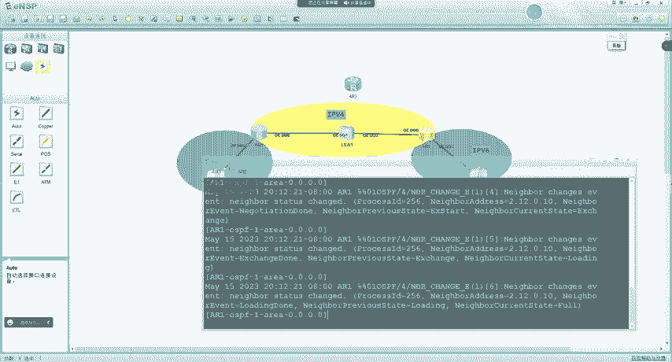

嗯，起来之后呢，我们现在是这样的啊。呃，首先一这边有个1。1。1。1，对吧？这是他的公网IP。嗯，然后二这边呢有1个2。2。2。2，这是他的公IP。然后我们根据二的公网IP呢去规划它的644网络。首先。

2002是。作为开头的对吧？这个肯定不变。而后面16到48比特呢是公网IP地址转换成的。对吧所以说这个二呢等于00000010。对不对？然后2。2。2。2。对不对？这是2。2。2。2呃。

然后我们把它转换成IP6地址的形式，这就是02。02码号0202。马哈马哈是吧。-48。也就是说呢，你这十子的巴比特一定是固定好的。对不对？这一定是固定好的啊，就是2002是6图斯地址，对吧？

然后这32个比特呢，是你根据自己的公IP转换过来的。那这是前48比特。对吧一般我们接口ID只用到64比特，对吧？所以说。呃，48加64实际上还剩16比特才能到128。也就是说剩下16比特呢。

你可以做内部的组网划分。对不对？比如说我采用的冒号FFF。马哈马哈刚流了事。呃，这是我在A21上的IP6地址段。那在。啊，AR2上的在AR1上就是2002冒号0101冒号0101冒号冒冒号FFFF。啊。

冒号码号杠64。好吧，然后这是在A21这边的网段。呃，不一定是48，你可以比48更小。你比如说我现在呢我用48中间48到64，中间这些比特呢做了总网划分。啊，但是不能再小于48了。哎。

比如说老师我三6行不行，那就不行，好吧。然后在这时候呢，我们怎么样去做呢？把这个网段规划好，我们在AR上。😊。

嗯，开启IP6功能。然后在他的G0-0-1呢，IPIP6dress2002冒号0202，冒号0202，冒号FFF。啊，然后马2号冒号254。好吧，这是我们给AR2去配置了1个IP6地址。

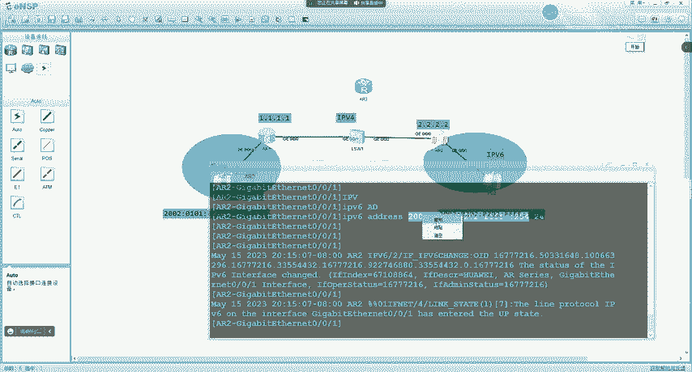

啊，他是64啊。64。对不对？然后在PC2这边呢，他的网关。前缀长度以及PCR自己的地址呢，我们用冒号冒号一。啊，给他应用一下。

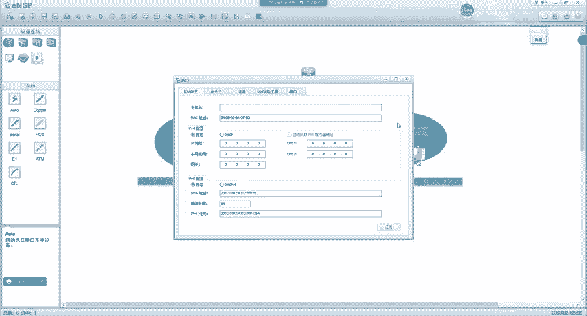

然后A21这边也是一样。IP6 enable。啊，IQ6啊interfaceG0-0-1IP6 enable。IP6dice2002冒号01010101。1234啊，冒号冒号一。啊，马哈马哈254。

然后64。然后这一段呢是在PCE上的。

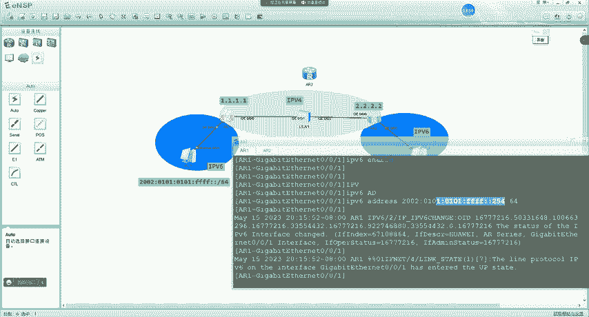

我给PCE呢。这是他的网关是吧，嗯64IP这个地址呢是马哈码一。

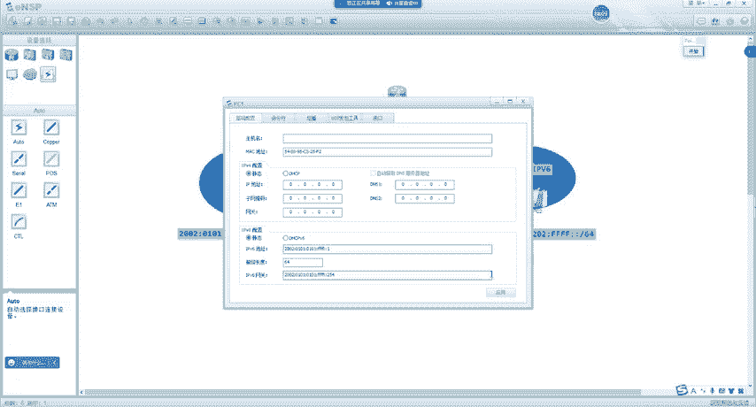

对不对？嗯，这时候我们做完之后呢，如果我用PC1去pinC2，肯定是拼不通的。

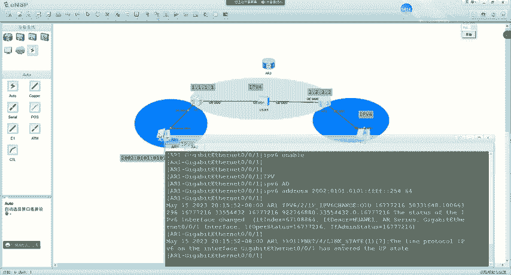

对，因为我们中间跑的是IPV4。

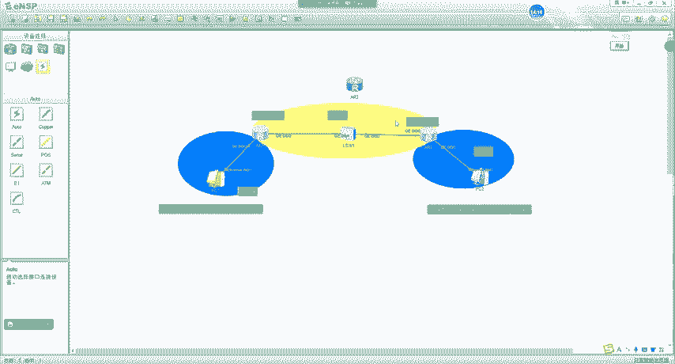

啊，这时候怎么让他拼通呢？我们就需要在一跟二上去构建1个IP啊，叫做6图斯隧道。这个6图隧道也很简单啊，就是interface tunnel创建一个tner口。然后tono particle呢是。

六图式隧道。好吧，然后原地址呢是1。1。1。1。然后目的地址呢是2。2。2。2。啊，目的地址我们不用写啊，目的地址不写好吧，因为你的目的地址呢，它是根据IPU6地址中提取出来的，不用写啊。

然后我们开启IPU6功能IPU6dress。😊，嗯，这个地址呢我们也配一个6图4地址啊，0101冒号0101冒号冒号一。好吧。64。行吧，这我没写啊，就目的地址我们不需要去写，能懂吗？😊。

当你配了协议类型是6wo4原地址，配上IP6地址之后呢，这接口就会up起来。

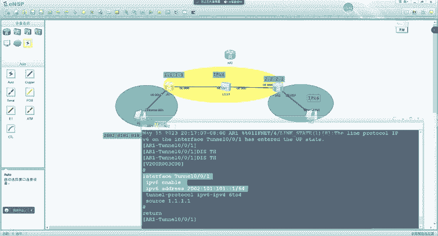

这是在A21上面的配置。

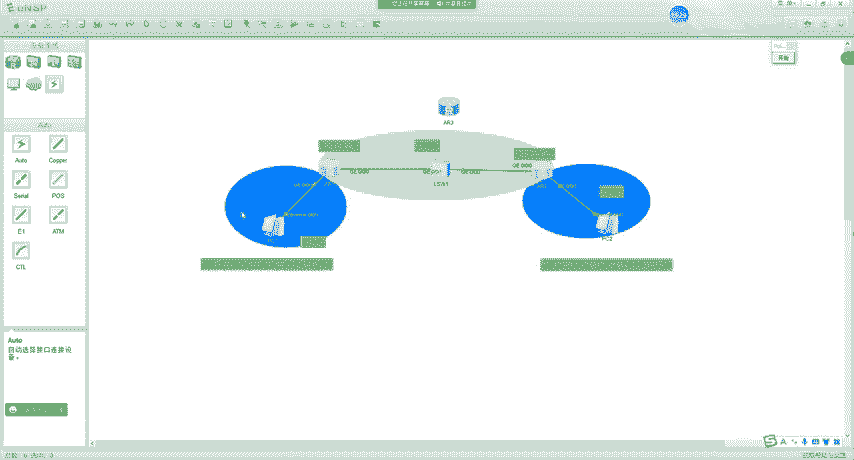

然后AR2呢是interface tunnel0-0-1。他al particle嗯是。柳图市。对，然后原地址呢是2。2。2。2，目的地址不用写IP0。IP6dress2002冒号0202。

冒号0202，冒号冒号1。这是我们在AR上的配置。

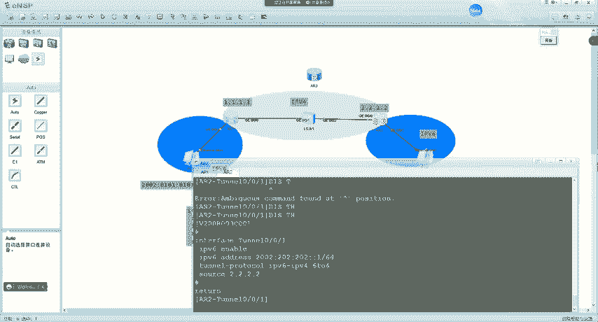

雅尔达。那这时候六图四是不是又配完了呢？嗯，实际上不是的是吧，比如说我们用PC1去拼一下PC2呢。

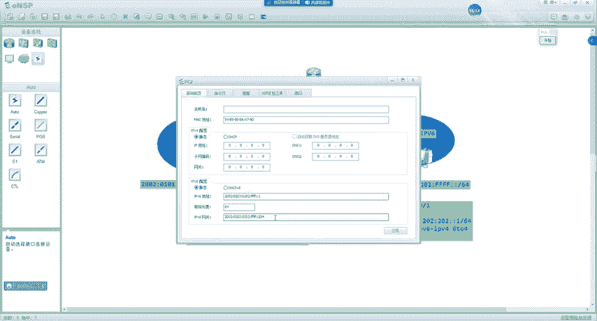

去骗一下，你又发现骗不通。

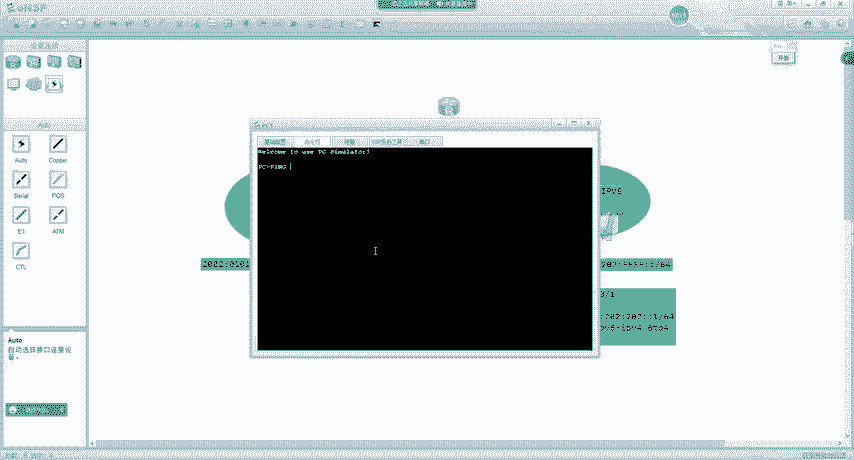

啊嗯，为什么拼不通呢？来给大家说一下啊，就你现在把数据包呢，对目的地址0202冒号FF1这个包发给A21之后呢，A21上面查找IP6的路由表。你发现呢他没有去往0202的路由。

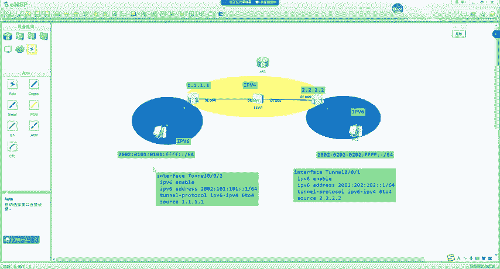

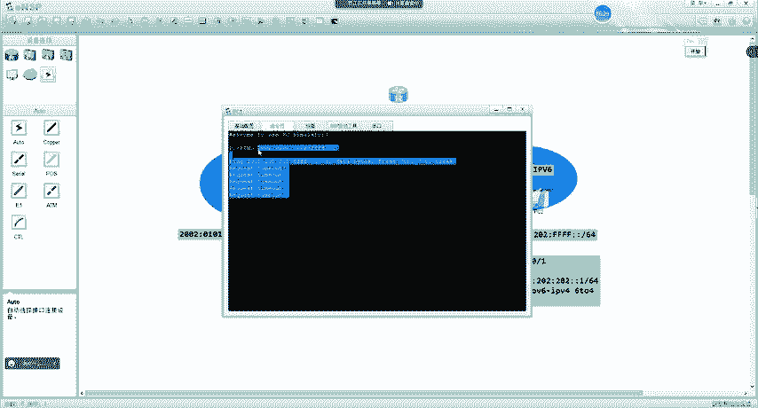

对不对？没有。没有怎么办呢？我们得写一条IPU6router2002冒号冒号。对吧。呃，16。16比套啊，然后扔到了tonno的0-0-1。

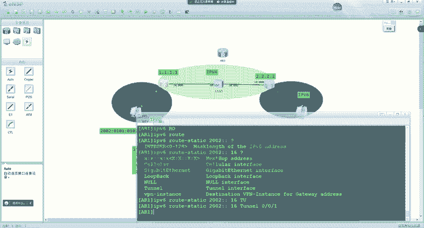

对呀，为什么是冒号冒号杠16呢？因为只要你是以2002冒号冒号杠16开头的都是6图四网络，对吧？所有的6图四网络我都是会扔到6图四隧道中。对吧所以说我们只写1个-16的啊，就可以了啊。

同的接口可以在一个地段可以。好吧。那对于反制AR2也一样，A2这边呢也得来这么一个。建台路由。

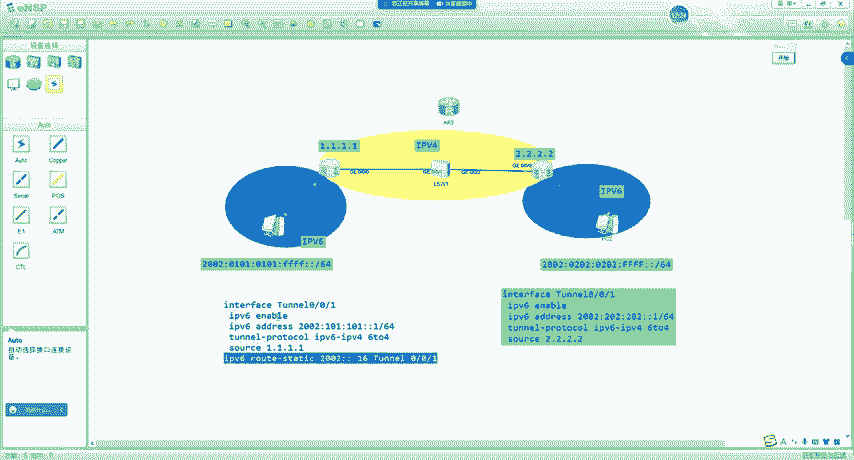

是吧就所有去往六图书网络的呢，你都去六图斯隧道。

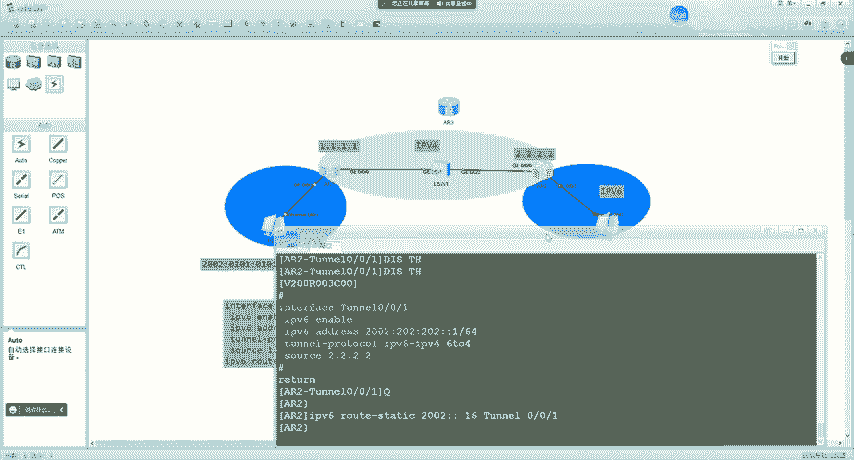

建了6突四隧道呢，你就按照6突四隧道的规则去封装目的IPS地址。比如说我们做完之后呢，我们用PC1去拼P3。

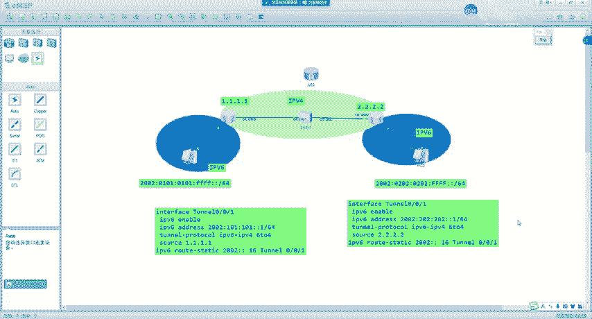

你发言能听通了。

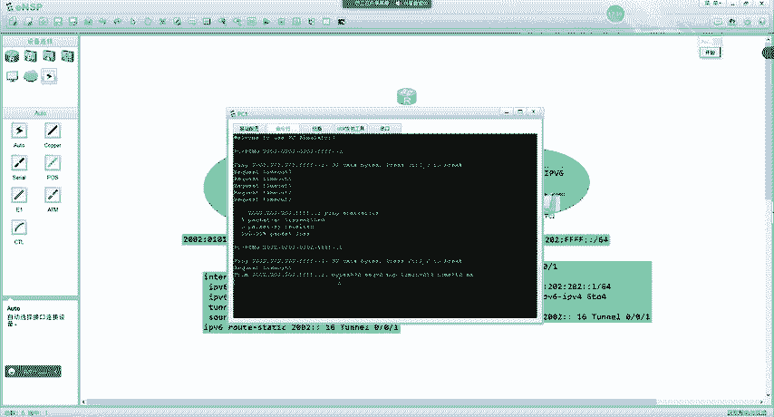

那他是怎么通的呢？实际上道理也很简单啊，就是我们的原IP呢。😊，原IP。首先呢他会使用。2001冒号0101，冒号FF冒号冒号一。啊，然后目的IP呢，他会使用PC2的IP地址。啊，这是最原始的。

IPV4数据。对不对？那这个报文到达A21之后呢，A21呢会查找IP6路由表，一看你去往2002。

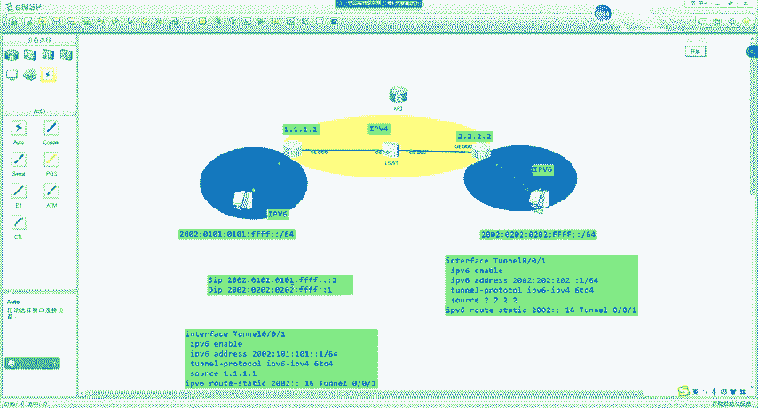

是吧我有一条。

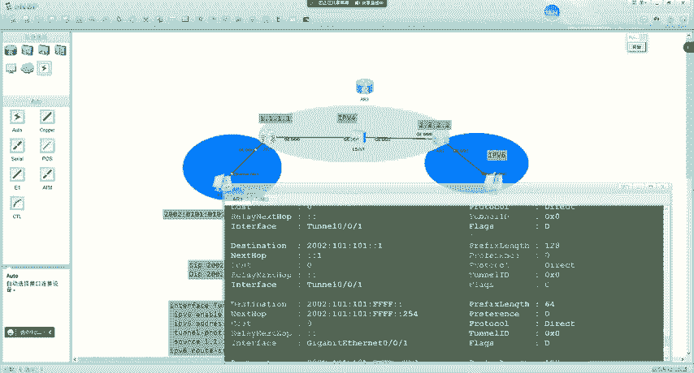

2002的路由对吧？都走to诺一啊，就进to诺一了。进to诺一呢，我一看哇，六图是隧道。是吧原IP地址呢？是。1。1。1。1啊，而目的IP呢，我一看我是6图四隧道类型啊。

6图四不配目的IP那目的IP怎么得来呢？我就看你IP6地址的。后32比特对吧？就16到48这32比特。我把这32比特转换成IPV4地址，正好就是。2。2。2。那这个6凸四的包就封装完了。封装完之后呢。

我会查找IPU4路由表。

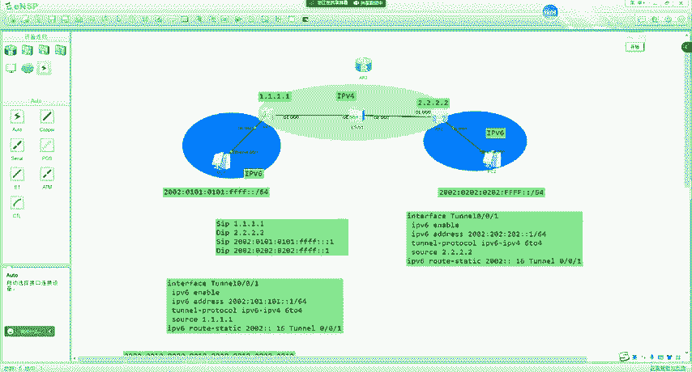

怎么要去往2。2呢？我一看通过0-0-0发出啊，我就给AR2了。所以如果我们去抓包的话，你就可以去看到。

嗯，在这里呢就会有一个。呃，2。2。2。2。他发给二了，二收到之后呢，一看给我的对吧，他又拆包。拆完之后呢，是吧，看到上层协议是IPU6啊，他就交给IPU6处理了。能明白吧？

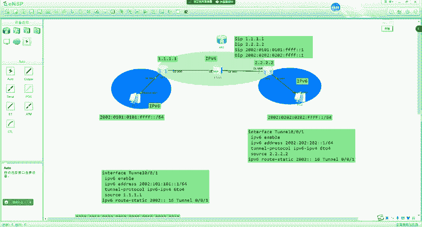

交给批露处理。查找IPU路由路由表。你要去往2002冒号0202。哦直联路由。

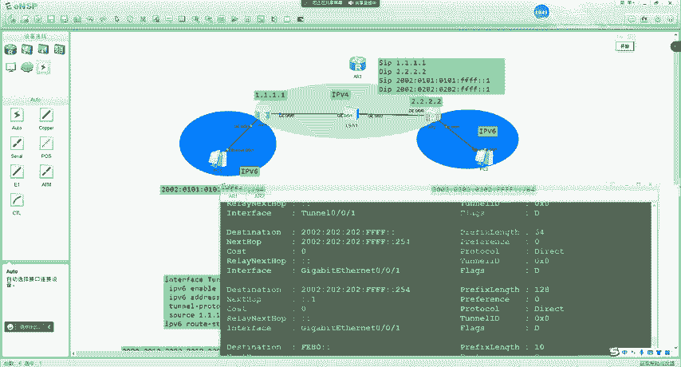

是吧最终发送给PCR。所以他是这样的啊。比如说我们用一呢P2，你发现能品通。能面通我们去抓包呢，我们就可以去看到。是吧。这是最原始的IPU6原。对吧IPU6的目的。IP6的目的。然后原IP地址1。

1访问2。2，原IP地址1。1到2。2。啊，这个包呢发给二之后，二最终查找IP录由表转发给PC2。那这样就能够实现一个6突四网络的互通，回包也是类似的啊，回包就是把原木调换出来。啊。这是目的IP。

这是原IP。这是目的IP。啊，不对，这什么DIP。这里面IP回包就调换过来嘛，调换过来到A21上也是最终先查找IPU6进隧道呃，根据隧道封装原地址2。2，目的地址1。1，然后查找IPU4转发给A21。

最终过来了。好吧。那这就是六图斯隧道。那6通是隧道的好处在哪里呢？比如说我未来有了一个3。对吧我举个例子，比如说我未来当我有了一个三之后。那大家觉得A21跟2要不要进行多余的配置啊？有没有？实际上不用。

为什么不用呢？因为我们只是把所有的6通4网络是吧，一下子给他都写过去了。那比如说A23这边呢，他还有一个6图素网络，假设说A23的地址。是吧。他是有1个3。3。3。3。我们只需要保证A23后面的。

6图丝网络的规划呢是2002冒号。0303冒号0303冒号码号。对吧杠48。只要A23渗后所有的IPU6的子网用的前48比特都是跟自己的根据自己公网IP规划出来的。那未来他自己就可以通呃。

我们在A23上也写这么一个隧道。当PC1去访问PC3的时候呢，也是一样。根据AR1根据2002的路由表。对吧进入到隧道中，原地是1。1，而目的IP呢看到0303对吧，他自己就转成3。3，发给3了。

对不对？那这样的话，我们只可以去发现啊，644网络它的一个好处是在哪里呢？当我们新增了任何的站点之后啊，其他的站点呢不需要做多余的配置，而且本质上只通过一个。啊，这个隧道接口就能够完成这种需求。对不对？

那这就是利图斯网络的好处。而像以前我们所学的静态呢，你还得去配你配什么呢？你配个通道口。对不对？当你站点百十来个的时候，其他站点都得配。那这个工作量可不容小觑啊。而且有些站点可能不在你的管理范围内。

对吧可能其他的工程师管理人呢。来这时候呢。嗯，你俩还不好协调。是吧啊，你得找领导啊，找领导领导再给他说。是吧因为你俩直接协调的话，这个不好说啊，呃，他那边没拿到指令，领导没给他说啊，他也不敢改配置。

对不对？所以说啊那6图斯网络呢就能解决这种问题，你只需要在新增的站点上。去做这种配置就行了，而不需要在其他站点上更改原有的配置，自动的就可以完成6图四网络的通讯。那这就是6图斯地址的好处。

是吧比静态呢便捷多了。那我们如果非要说有个难处呢，嗯就是他稍微理论比那个我们之前学的那种静态要复杂一点。

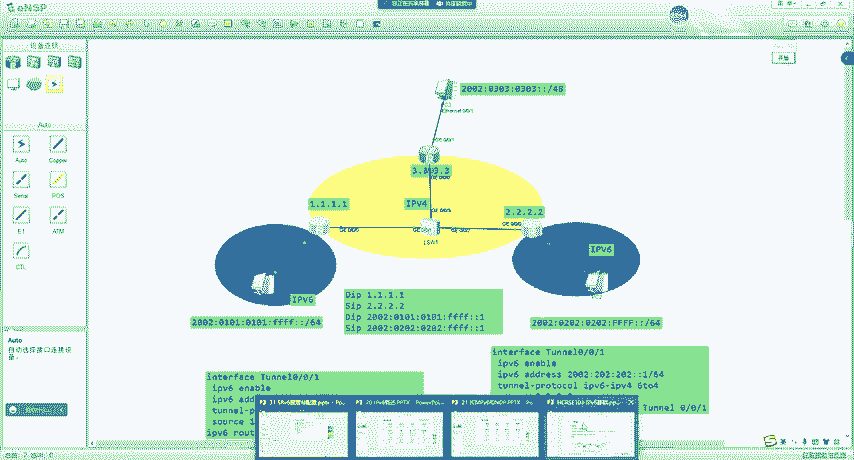

那咱们还得根据公IP去嗯进行换算。是吧。然后接下来我们要讲的呢。嗯，就不是一个普通的6初素网络了。好吧，就不是一个普通的了啊。😊，呃，我们接下来要讲的叫做六突四中击。呃，什么116图字中迹呢。

我们来注意啊。比如说现在呢我有了一个6图四网络，对吧？还有一个6图四网络。这两个6头丝网络呢可以按照我们刚刚配置的方式直接给它打通。但是有没有这种可能呢？是吧，就是老师啊。嗯，我这个企业换的比较早是吧。

老早就用IPV6了。那时候这个老板追时髦。对吧嗯啊老早就换为P6了嗯，但是呢我没有用6图4地址。对不对？就我们可能有些网络呢，他。并不是6头斯网络。那这时候怎么办呢？我们就涉及到一个问题，就是。

6、图是网络他怎么跟。普通的IPU6网络进行通讯的。是吧。比如说我们右边这里就是一个6头四耐他。那左边有个普通的IPU6网络，这时候我想让他俩同学。这时候怎么办呢？有没有办法去解决呢？实际上是有的。

这时候我们得依靠一种技术呢叫做六凸四的中击。这中迹是什么样的呢？就是。比如说。当我们的这台路由器，他去访问旁边这台路由器的时候。是吧。那这时候呢，他的吓一跳并不是6图四隧道。对不对？是吧。你吓一跳啊。

不对啊，就你的吓一跳呢，就你的目的IP6地址呢，并不是6图斯地址。😡，那这时候怎么办呢？我们依然是把这个数据流引导到他的六头四隧道。首先，原IP地址呢依然是2。2。2。2。

但是目的IP呢我们没有办法去提取。因为你的目标IP6地址不是6图司地址的，咱们没有办法从这个地址中提取出来。的目的站点呢公网IPS地址。找不到是吧，A为你2002开头的才能找到，你不是这段开头的。

你怎么能找到呢？😡，是找不到。对不对？那找不到怎么办呢？我们可以给这台路由器说。怎么说呢？我们可以去写一条静态路由。对呀。比如说在2001，我告诉你啊，去往2001的吓一跳。是吧是2002冒号0202。

冒号0啊0101冒号0101。对吧就是我们给这台路由器的他的接口去配个6图4地址，就配跟他公网地址一样吗。我们在这里呢不写出借口了，我直接写吓一跳。😊，就告诉你20022001的吓一跳啊。

就是这一个地址。但是这个地址对吧，就是我们发现。去往的。目的网络。不是一个6突四网络是吧，它是1个2001的网络。但是去往这个目的网络的吓一跳，就是去往200的吓一跳呢，是一个6图4地址。

我们直接会从下一跳的16到48比特提取出来。😡，直接会拿这个。充当目的IPV地址。那这种呢就叫做六图四中击。那具体怎么来的呢？我们以A23啊来给大家举例，来我们来看一下。

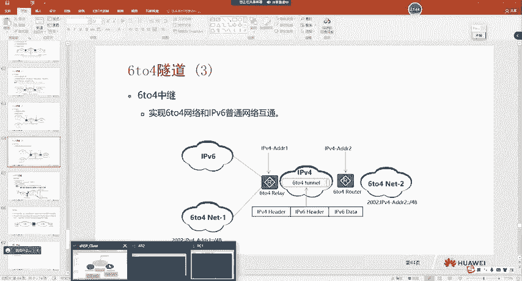

在A23的后面呢。我们就用一个普通的IPU的网络啊，我们用的是多少呢？是。2001冒号33，冒号码号3。好吧，这是P3的，然后A239是冒号254。2001冒号33，冒号冒号254。

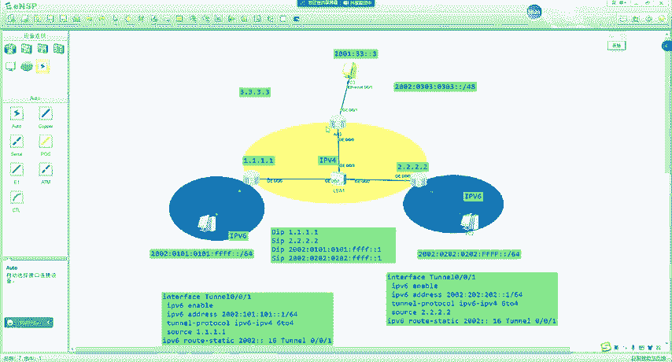

然后在A23上呢。改成A23。在三的G0-0-1接口。好。IPU6interfaceG0-0-1IPU6 enable IPPU6dress2001冒号33冒号冒号。254。

然后把三的公网IPV4给他打通。10。0。12。3。啊，我们再跑个OSPF。一、入台第3。3。ar0嗯network0。0。0。00。0。0。0。然后我们再算上几个环回口，3。3。3。3。啊。

就现在呢我们把三的公网打通了，他有一个公网地址是3。3。

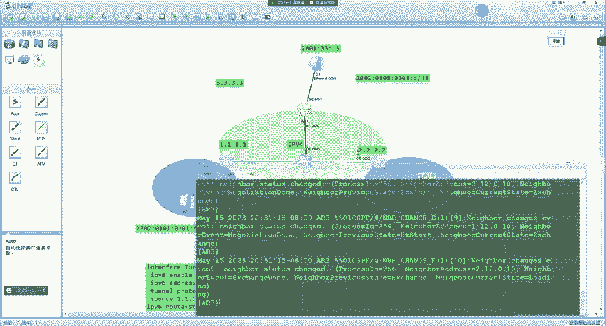

那有同学可能疑惑了用物理口行不行呢？也行。这结果先给大家说啊，就是可以的。但是我们为什么没有用物理口呢？因为他转换起来稍微麻烦一点。是吧他没有这种3。3。3啊，直接转换成0303，看着舒服对吧？

转换成0303呢，我们看着比较方便啊，所以说我就没有用用那个啥。😊，好吧。那现在我们可以去看到啊。那123公网都是互通的。对的。那基于这个公网互通呢，我们在A23后面用到了一个普通的。IPU6网络。

是吧。他不是6图诉网络，就是1个IPU6网络。呃，而下面的呢都是6头四网络。对不对？当我们涉及到6通出网络跟普通IPU6网络互通的时候。我们可以这样啊，就我在A23上面呢。

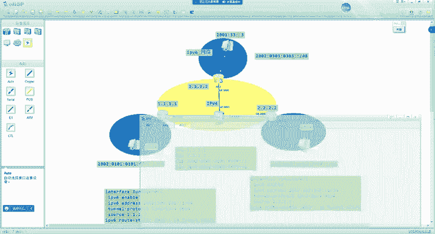

interface tunnel0-0-1。啊。IPV6 enableable。I呃不对啊，turn particle。呃，应然是六突四隧道。啊，原地址呢3。3。3。3啊，目的地址不用写。

然后IP6 enable IP6dress。注意啊，tonnel的地址呢是2002冒尔号。0303冒号0303，冒号冒号。一。对呀，就是tenno的地址呢，必须要是柳图斯地址。这是在A23上的配置。

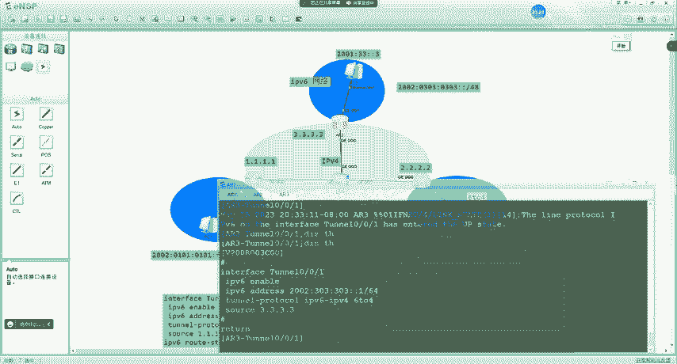

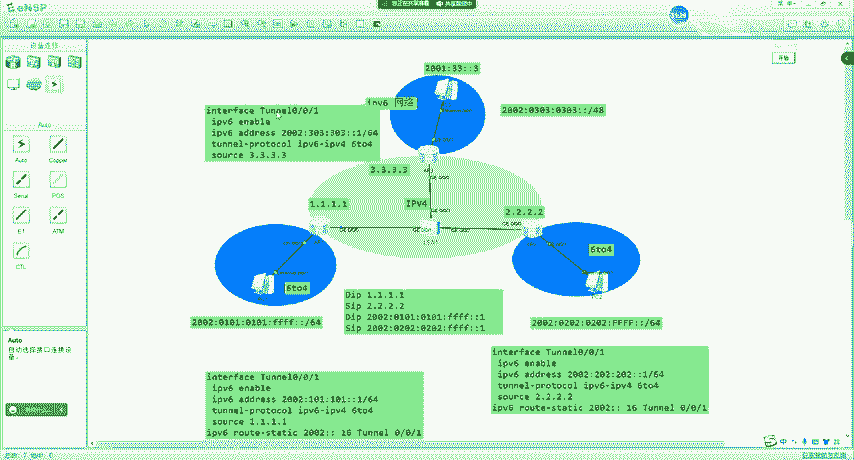

A23上我们配置完成之后呢。注意啊，A3未来要跟其他的64素网络互通，你得有路由啊，IP6ro2002冒号冒号16啊，扔到tonno0-0-1。

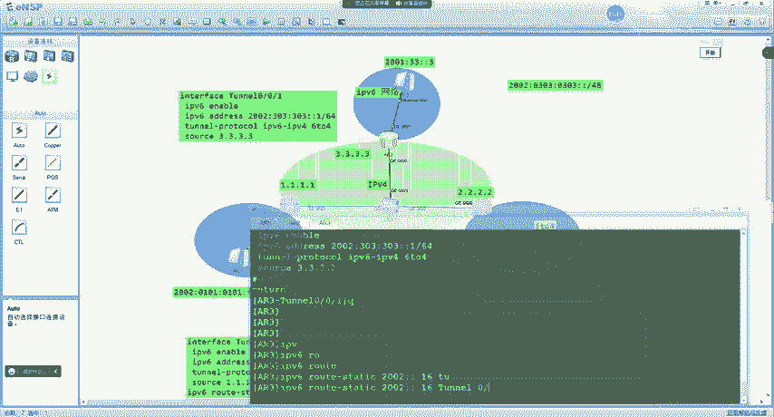

对不对？有人就问了，老师这看着好像没什么问题，跟普通跟都是那个图书网络一样。😊，对不对？确实是差不多。但是注意啊，现在比如说我们用二去聘三，能不能拼通呢？

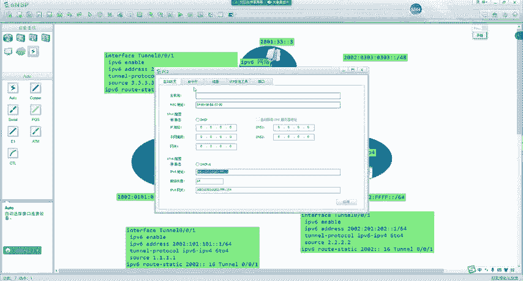

对吧我去骗一下啦。你发现呢拼不通，一定是拼不通的。是吧，拼通我就翻车了。有的。那为什么拼不通呢？😡，是因为你没有去往这个地址的路由啊。

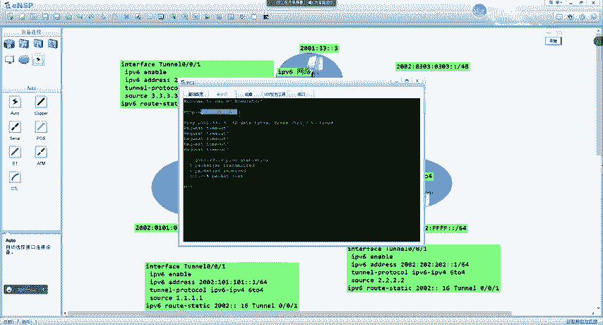

你怎么能拼通呢？肯定拼不通。是吧那这时候呢，我在二上去写一下。😊，注意啊，叫做IPV6router。注意啊，我这条路由啊就叫做六投四冲击。200。一、冒号33，冒号冒号。64。那么他的下一跳是2002。

注意啊，必须得写下一跳，你都不能写出借口。0303。冒号冒号一必须要是吓一跳。在PC2上面呢。

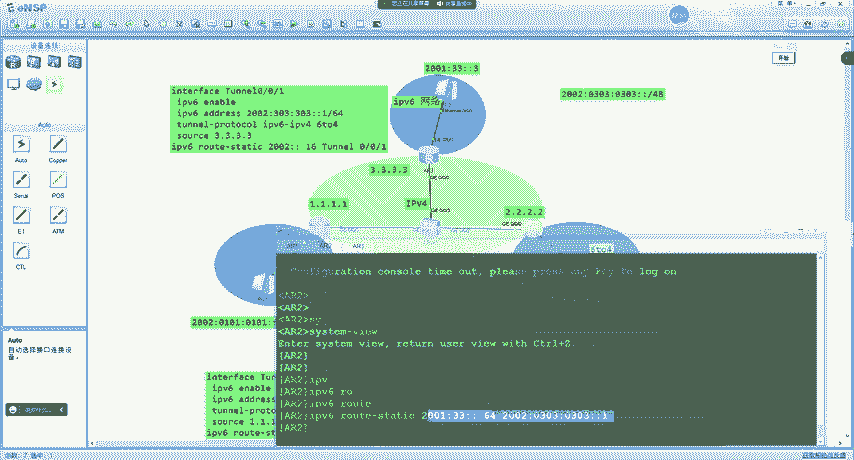

加了这么一条路由。

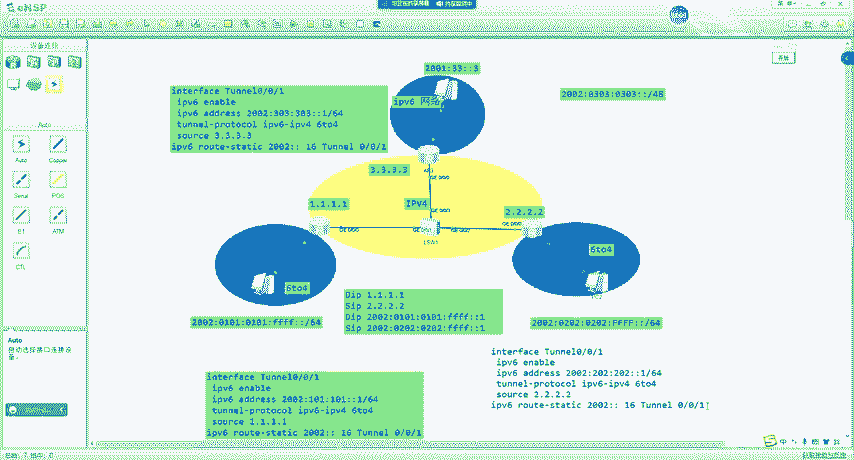

那这时候才去骗呢。😡，他就能够平通了。是吧。哎，选选那老师怎么说的呢？😡。

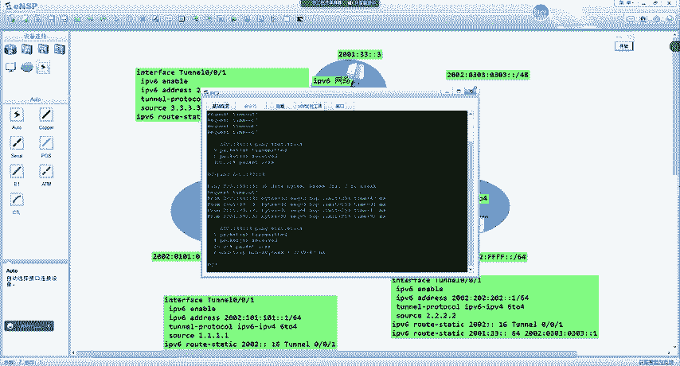

那我们就来分析一下。首先，原IP地址0202，目的IP地址呢是2001冒号33，冒号码号3。对不对？那这个豹纹呢，一旦到达了AR2之后，因为你根据网关发夹R2查找IPV6的路音表。

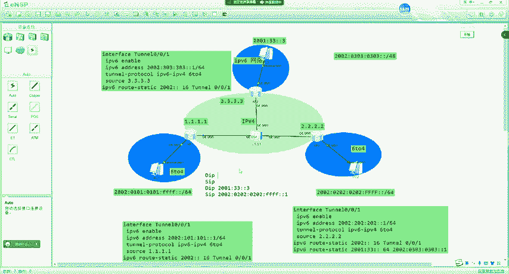

一看你的目的地址是2001冒号33。我就找啊找。2001码号33。是吧。那这时候呢，他要走隧道。

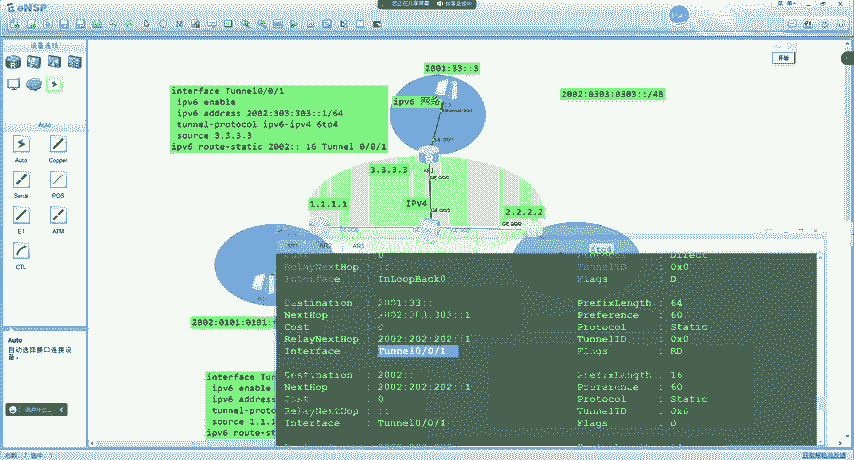

对不对？这个隧道呢叫做六头寺隧道。但那时候我又看呢。原地址是多少呢？2。2。2。2。是吧目的地址呢哎，目的地址是多少呢？那就懵逼了。😊，因为我没有办法从目的IP中提取出来。目的IP4地址。是吧。

这时怎么办呢？😡，我就会去查找，对呀。去往这条路由的吓一跳。那下一票是多少？是多少？是2002冒号03030303。对吧我就从这个吓一跳中提取出来3。3。3。3。对不对？那有同学可能问了是吧。

那老师2002又是干嘛的呢？注意啊，我给大家说一下这个逻辑，各位同学认真听。😡，首先呢我去往这个目的地址。他的吓一跳是2002。那我要不要查一下他的吓一跳怎么去啊，就跟BDP路由一样。😡。

我去往一个地址，吓一跳是4。4。4。4。我要不要看一下4。4怎么去啊哦，OSPF路由。是吧现在也一样，我去往一个地址吓一跳，是20022002怎么去呢？建路0-0-1。😊，能懂这个逻辑吗？

所以这两条路由如果少了一个，大家觉得还能不能通啊？能不能？一定是不行的。所以说这两条路由都要写带。好吧。那进了tono之后呢，我们就按照这条路由的吓一跳去封装一个目的地3。3。然后我在0-0-2抓包啊。

就是迭代了一下，好吧，这不就是路由迭代吗？

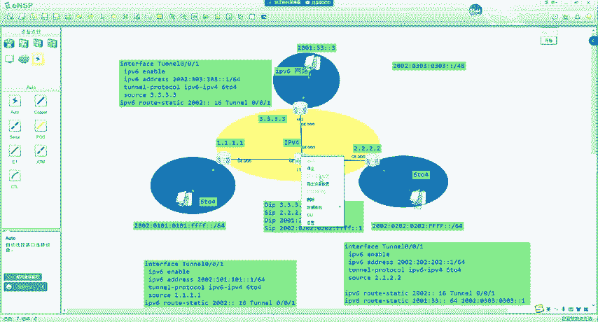

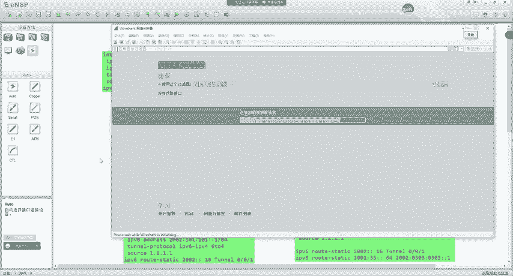

对吧。然后我在PC2上呢再去拼一下。你们能拼通。能品通这个包呢？嗯，在这儿啊。对吧。原IP地址。PC2的地址目的IP地址PC3的普通IPU的网络。你看原地是2。2，目的地是3。33。3从哪来的呢？

从这条路由他吓一跳来的。那这个包就发送给A23了，3收到之后发给PC3。PC3回包呢原IP地址是吧，2001目的IP地址2002。那这个包呢，他又发送给了A23。发给A23之后。A231看对吧。

查找IP录路表。0202进入到六图斯隧道中。原IP地址3。3。3。3。目的IP现在对于A23来说，他访问的是不是6图丝网络。😡，是不是？是吧我一看目的IP这不是六图四地址嘛，对不对？

我就把020202扣过来，目的地址2。2。2。2。😡，是吧。然后查找录由表又回到二了，然后又给PCR。所以说回邦他有六突四中迹吗？有没有？😡，是没有的。对吧回包就是一个普通的六苏四隧道的回报。而去包呢。

他是六苏四中地。所以这个大家搞明白了吗？明白的同学敲一啊。没问题吧。可以是吧。好。

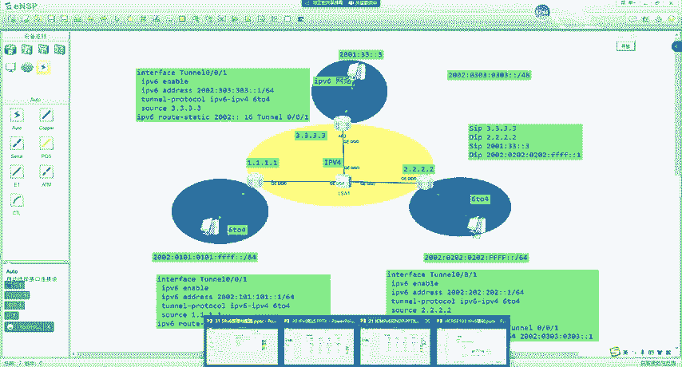

那这就是我们看到的啊六凸四中间。那接下来我们要讲的一个呢啊叫做S type隧的。😡，好吧，啊，6通斯网络什么意思啊？就是用了2002开头的这个。IP6地址所组成的网络啊，16图4网络。

比如说我们说用公网地址，那我们是不是叫公网，对吧？用私网地址的，我们叫私网。😡，是吧那用六凸四地址的，我们就把它叫做六突四网络。好吧，这么一个意思啊。

然后我们来看啊嗯接下来又一个技术呢叫做S type碎的。嗯，当然这个咱们做不了实验啊，就给大家说说原理。😡，他是干什么使用的呢？😡，S type隧道啊嗯它类似于一种简易的隧道。那这简易是怎么来的呢？

我来看一下啊。😡，首先，对于S type隧道呢，它有一种。叫做S type专用地址。呀。那么。😡，这个专用地址呢，它只有后面64比特的接口ID部分。作业各位同学。有没有钱赚？😡，有没有？没有前缀吧。

是没有前缀的。只有64比的接口ID部分。那这个接口ID什么时候会用到呢？我们先甭管。那首先我们要看的第一个就是它用在什么样的场景。😡，对吧。那我们来看一下。首先呢。如果对吧比如说老师我公司比较大。

我们现在换IPU6呢，得换很多设备。那老板说是吧，现在都用IPU6了，我们还用IPU4访问不了了，对吧？就我们有些站点呢，新公司都用IU6。是吧我们老公司还用那IP4呢啊，一群老头不会用。对不对。哎。

那这时候怎么办呢？大家要注意。我们可以这样。这一段呢这个网络依然是IPS，我不管，对吧？不动。啊，我的接入啊、汇聚啊，核心啊。是吧我都不动它，我怎么办呢？我找一台新的路由器。😡，这个路由器呢。

它支持IPV6，也支持IPV4。然后呢。我在这个IPS网络中。把这一段打通。就是首先呢我们的PC如果拥有IPS地址。😡，他给我路由器的IPS地址是能够通的。你甭管是二层通还是三层通。

反正PC到路由器的IPV4肯定是能够通的那这个大家能不能做到，一定是可以的。😡，是吧我只需要配个OSPF就完了。😡，对不对？就把IPU送到OSPF1旁。但是现在呢我路由器后面有个IPU6网络。😡。

我现在这边的PC呢，希望访问这边的IPU6。😡，但这件路由器呢又不支持IPU6。😡，我又不能换是吧，老板说太费钱了，公司马上要倒闭了。😡，对不对？就等了是吧？

各位同学可能就是等了倒闭了之后呢嗯去卖这些二手网络设备呢。😊，是吧。那这手怎么办呢？😡，哎，我的PC是支持IPU6的。对吧注意啊，你的PC必须要支持，因为你的PC不支持，你就没有办法访问了。😡。

对吧那这时候我们怎么办呢？我们可以这样。😊，我这样。哇啊。我在这个。路由器上配一个通道口。这他那口怎么办呢？😡，我给他配1个IPV6的地址段。注意啊，比如说是2001冒号冒号杠64。大家能明白吗？

我看1个2001冒号冒号杠64的一个前缀。然后呢。再去通过。S type专用地址。注意啊，给他补充借款的一部分。也就是说，S type专用地址，它能够补充的只有接口ID部分。😡，那么他怎么要补充的呢？

首先我2001冒号曼号杠64对，前缀完了。然后我指定隧道啊为S type隧道，它就自动生成1个64比特的接口ID。那这64比特呢，前16比特是固定的啊，这个UG大家不用去管啊。好吧，就是5EF1。

就是5EFE。然后0A。对吧然后后面32比特呢。是我这台路由器的IPS地址。好吗？就是我这个通道口呢，还有1个IPV4地址。😡，然后把这个IPV4地址呢转成后32米的。

包括这个t口的链路本地地址也是这样的，都是这样的格式转过来的。就这16比特呢就说白了就是这32比特对，前16比特固定，后32比特是IPS地址给他转过来，得到64比特的接口ID部分。😊。

那这时候我们来看啊。注意。如果我们的PC。知道了S type路由器的IPV4地址。那能不能知道他的IPU6地址？他告诉我能不能。能不能肯定可以。是吧为什么可以呢？他是这样的。😡，对那首先你IPV4地址。

就你后面接口ID是补充好的。😡，是吧前面32比特是固定的。那后面32就是路由器的地址。对就是你的IPV4D址肯定是可以的。所以基于这个原则呢，我们在电脑上有一条命令。CMD下敲一条命令，我给大家找一下。

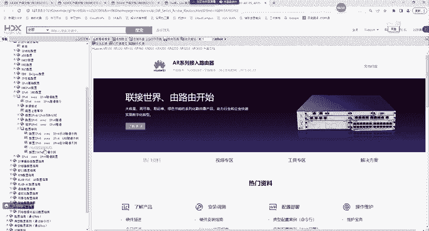

对啊，你看这个S type隧道的IPU6地址呢就是这样IPU6dress，我们配一个前缀呢，后面加个UI64。😡，而这个UI64，它是这样产生的，就是我一看是S type的隧道啊。😡，这个UI64呢。

他就会按照我们刚刚所说的。

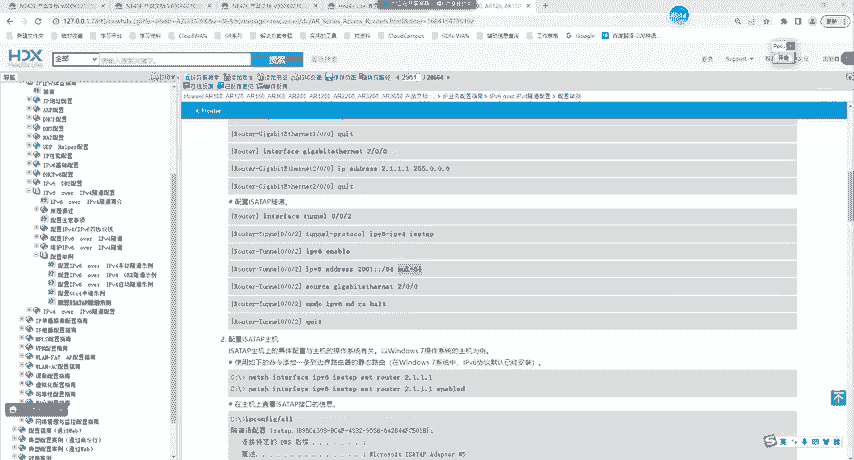

这32比特固定，然后32比特取值的是IP4地址。

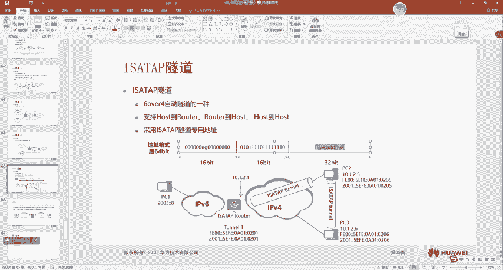

就按照这种方式呢去产生S type隧道的啊，这个啊这个叫啥来着？就接口ID部分啊就可以去产生。然后我们再继续来看。如果注意啊，就是S type在主机上的配置跟操作系统是有关系的啊。

这里是以win7为例的。😡，就是win7里面呢，默认都安装了IPV6协议。所以这时候呢我们在winIN7上去敲一条命令是吧？😡，啊，就这么一条命令啊，告诉你S type路由器是2。1。1。1。对吧。

而S type路由器的这个。😮，啊，对对，给把S type路由器对吧？功能开起来。对不对？一旦我们配了这两条命令之后呢，在你的电脑上IP confi，你就可以去看到一个S type的网卡。😡，能看到吗？

网络适配器S type。那看到这个网卡之后呢，他也会去产生一个链路本地地址。这个先不管啊，产生一个链路本地地址。链路本地地址怎么产生的呢？😡。

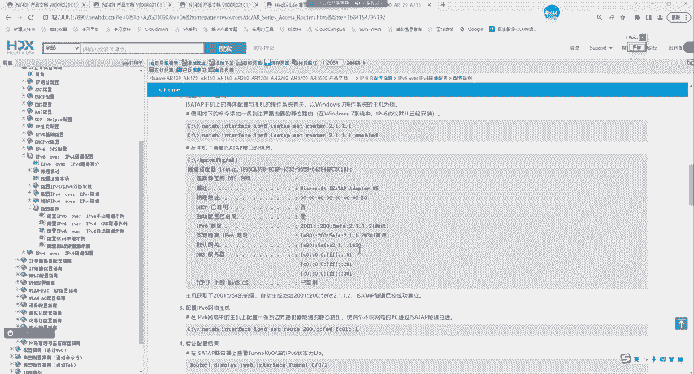

首先。亮路本地地址有没有FE80啊？1。是吧然后再按照这种地址格式呢，去产生后64笔他的接口ID。所以说链路本地地址。就产生了。产生了之后，我们来想。😡，我通过这个链路本地地址能不能发1个S？可以。

他是怎么发呢？首先，原IPU6地址为我的LLA。是吧F180。目的。IP6地址呢？我有S type路由器。啊，不对啊，是所有路由器主播地址FF02冒哈冒哈。对不对？原IPV4地址。

我有没有自己的IPV4地址，有吧？😡，10。1的2。5。而目的IP地址就是S type路由器的地址。那我们刚有没有在面令行里手动敲一条面令？😡，敲了S type路由器是谁呀？有没有？😡，有吧。😡。

所以说我们已经告诉他了S拍路由器是谁？😡，所以说他就会以原。自己的IPS地址目的地址呢，S type路由器的地址。去发送一个豹文，里面包含了一条S。那查找IPV4的路由表。

如果我们底层的IP4已经互通了，最终这个报文能不能到S type路由器啊？拿不拿？😡，大月能不能？一定是可以的。是吧哎，老师为什么不能啊，肯定可以。😊，那一旦发送到S type路由器之后。

S type路由器如果我们开启了SLAAC。他能不能给主机分配1个IP6地址？拿不拿？是吧就是我产生1个RA，然后封把这个原木调换一下，对吧，直接发送给主机。😡。

那这时候主机能不能获得1个2001开头的IPUU地址？有了吧。有啦。而且默认网关是谁呀？😡，就是S type路由器啊，S type路由器的套统仪。😊，假如说现在我们的PC要去访问2003了。怎么办呢？

你访问目的地址IPU6，查找IPU6路音表。😡，原地址2001冒号5EFE对吧，巴拉巴拉一大堆。目的地是，2003冒号冒哈8。对吧查找IP路由表默认路由，它指向了S type路由器。😡。

然后再加1个原IP10。0。2。5，目的IP10点。一点。2。1。这个包在查找IPV4路由表，经过IPV4的网络，能不能到达S type路由器？可以。对吧S type路由器收到拆开IPU把一看。

你要2003啊，我给你发过去。对吧2003回包又回给S type路由器。S type路由器呢一看目的地址2001对吧，又走S type隧道再给你回来。😊，所以这个大家明白了吗？明白的同学敲一啊。

没问题吧。那这就是S type的隧道。但这个隧道咱们呃做不出来啊做不了实验。😊，好吧。所以说这里呢大家知道原理就行了。呃，那所有的隧道呢。😮，实际上都没必要去纠结啊。嗯，没有用了啊没有用的。

不考这玩意没考过啊。呃，然后还有1个AT64啊。我们来看一下啊啊，就什么时候会用到N64呢？就是。IPV4的节点要与IPV6的节点通讯的时候。这是我们的V6主机，这是V4的主机。对吧啊。

默认情况是不同的，两个协议站无法兼容。😡，这时候我们就得借助一台设备，实善YPV6和IP4的转换。对吧啊，怎么样借助设备呢？我们就得需要在需要有一台路由器。他同时连接了IPU4网络。

也同时连接了IPU6网络。能懂吗？那这说V6主机，它跟V4主机怎么样互通的呢？😡，是这样的啊。首先呢IPV4主机，假如说是1。1。1。1IPU6呢，假如说是2001，我只是这么做，假如啊2001。

那IPU4的1。1呢，在IPU6网络中，它有一个对应的地址，比如说是2002。是吧。IPV6的主机呢，在IPV4这边也有一个对应的IPV4地址，比如说是2。2。2。2。好吧。那这种对应关系呢。

是我们在转换网关上去配好的，就你要去配置一种映射关系，但这个也做不了实验啊，这个得用防火墙的你做。😡，知懂吗？啊，当然没考过啊，就大家听一下就行了。对意啊，就是每个主机呢IPU6的每个主机。

它在IPU4网络中有一个对应的地址。😡，每个IPV4的主机呢，在IPU6网络中也有一个对应的地址。那比如说IPU6主机要去访问IPV4的时候。他是以原IP2001目的IP2。22002发送的转换网关。

转换网关再换成原IP2。2去访问目的IP1。1。大家能明白这个意思吗？明白，同学敲一啊，就是在这里2002它对应的IP4地址是1。1。1。1。2。2。2。2呢，对应的IPU6地址是2001。

他一看你访问2。2到IPU4网络的对吧？网关上我们要去手动去配这么一种映射关系。😡，他会直接把目的IP换成1。1原IP换成。😡，2。2。发送的IPS4主机。IPU4主机给你回包也是一样的。😡，对吧1。

1到2。2的回报呢到达了转换网关，对吧？就跟AT差不多，没错。😡，是吧一看你的目的地址2。2呢，他会再次转成2001。啊原IP1。1呢会转成2002，然后再给IPU6主机回来。好吧。

那这个呢啊就是AT64。好吧。那这个技术呢还有很多的细节啊，大家需要去看书才能够了解到。😡，嗯，在TCPIP路由技术嗯，这本书里是有介绍的对吧？可能很多同学有疑惑。啊，就老师啊。哎，我在转换的时候。

我的IP包头怎么转呢？😡，是吧。IP包头的他对不到一起啊。😡，对吧诶，上层协议怎么转呢？对不对？那这一类的细节呢啊大家要去看看书才能看到。在TCPIP路由技术嗯。我记得好像卷二啊。

卷二还是卷一记不太清了，在里面会有写到。就是每1个IPU6的包头对应的IP4包头会怎么样进行转换啊，这些细节呢在书里会写到啊大家如果想了解，这一段得去看书。😊，好吧。看不懂咋办？嗯，那只能多看啊。

这个给大家说啊呃老师也是一样的。😡。

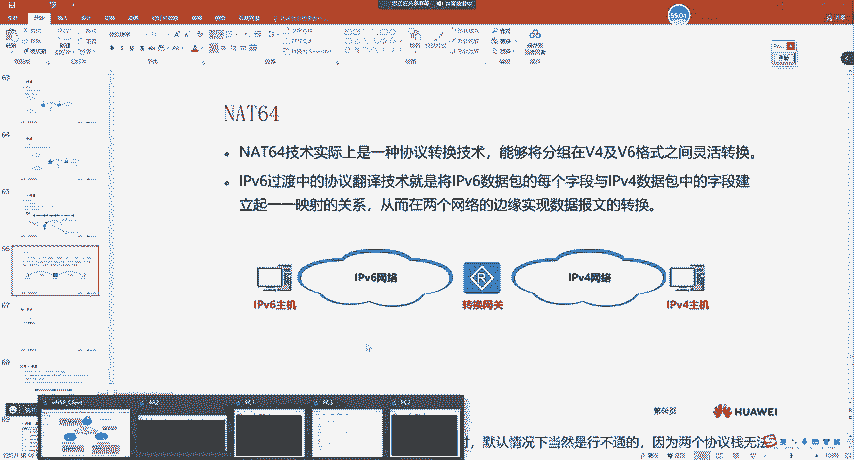

好吧，我有时候看书呢，我也看不懂。😡。

你以为我都能看懂，我又不是神仙是吧，我跟各位同学实际上差不多啊。😡。

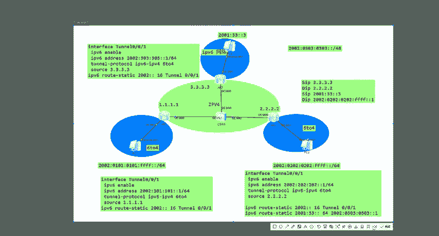

嗯，那就多看几遍。以前有一张呢，我之前给大家说过，之前跟我上课的同学应该知道的。😊，啊，有时候我看书看不懂的，我会看七八遍。是吧就每一遍呢都是懵逼的啊，就是懵逼的。😡，懵逼呢一直看一直看一直看。

看多了呢啊自己慢慢的就能够理解了。为什么我们有时候看书看不懂呢？这就相当于。

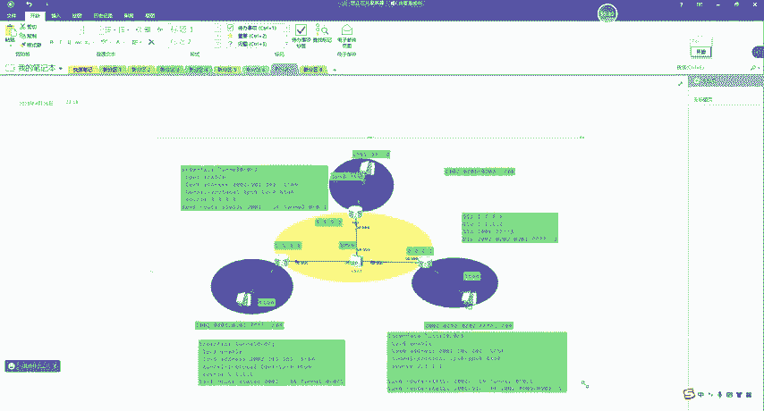

这不好给大家说啊。

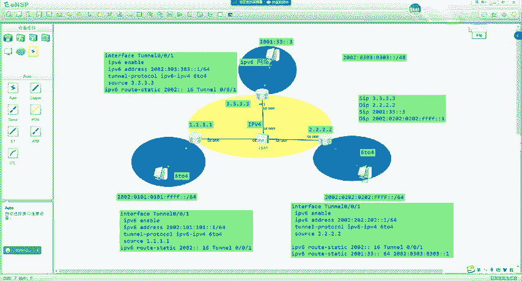

嗯，我是比较习惯看国外的书啊。是吧嗯我是比较习惯看国外的啊，但是国外这个书呢，你能不能看懂它两个地点是比较重要的。呃，第一个呢就是取决于你看的多不多。😡，嗯，这里是为什么呢？嗯，这里取决于是啥？

就是国外的这种思维呢。😡，嗯，跟我们中国人不一样。能懂吗？所以说他在表达一项事物的时候。对他说的就不像我们这样说的。😡，大家能懂吧？他不像我们说的那么直接，我们国人的思维呢跟国外的还有点不一样。😡。

是吧。那还有一点大家能不能看懂呢？如果你英文比较好啊，那我就没什么说的是吧？那你最好看就是嗯这个未翻译版的对吧？看英文的原著。😡，啊，如果你认为不好呢，你得看。翻译后的是吧，比如说对不对？😡，某某对吧。

李波。一翻译。对不对？啊，每本书上呢会有哪个人翻译的？😊，你能不能看懂呢？还取决于这个人会不会翻译。😡，这个我之前给大家举过例子吧。是吧啊这样我看到有一本书嗯，这样我给大家说过啊叫做。😊。

internet路由结构。啊，好像是叫这本啊。呃，这本书呢。我，写的就那样，但是这个翻译看的特别有趣啊，所以我看完。😊，这个翻译显得是真不错。😊，这个翻译呢一直在吐槽作者。是吧。他说作者这么写。

简直是误国误民是吧？这里怎么样怎么样怎么样。😡，对吧呃所以说啊这个大家能不能看懂呢？有时候也看谁翻译的，就有些人翻译的比较精准。😊。

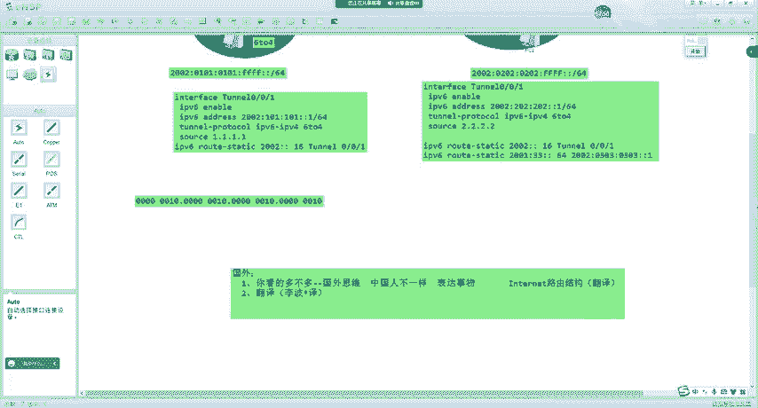

嗯，而有些人呢翻译的就可能没有那么精准，大家都懂吧？所以说会有这么一种啊。😊，嗯，那国内的书。国内国内没有没有多是好的书啊啊，有一本叫做HCE。路由呃，不对，叫什么来着？啊，学习指南是吧？这本书还行啊。

大家能懂吗？这当然这是老板的啊，这是针对于以前的S去写的一本书啊，但是有些知识点呢，现在也是。😡，嗯，也是有的，懂吧？就是他只是做了一些升级嘛，但老知识点还在啊。😮，啊，能懂吗？嗯。

这本书呢有些章杰是写的不错的，但是我不是说所有的都好，因为这本书我也看过。😡，就是啊并不是所有。张杰。都好。对，因为我看了他们那个出版的人啊。嗯。他这个Qs写的就很差。😡，对，然后其他内容还行啊。

就其他内容。但我也没看完啊，这本书我大概搂了一下目录啊，基本我都知道。其他内容还行。啊。然后这本书呢，这样我翻过几页，翻过几页，看Qs写的不太行啊不太行，然后其他的还行。😊，还主播还行。

然后其他的我就没看过了。但我之前大概翻了一下。啊，嗯，基本我都会。啊，还有很多书啊，之前像那个什么。呃，将OSPF和ISS详解。是吧啊，也有这么一本书。嗯，这本书呢之前我也翻了一下，嗯，基本我也都会啊。

后来我就不看了，当然也看了一些，看了一些，就是说。😊，呃。我总感觉在讲一些废话。呃，为什么这么说呢？啊，就是这个书书为什么我们看着会比较慢一点呢？对吧？看完书之后，大家要记得整理啊，一定要记得整理。

因为你不整理的话，你等于没看。😡，啊，等于没看啊。嗯。就我看这本书的时候呢，我感觉说了很多废话啊，叫车轱辘话是吧？我一般说叫做车轱辘话。😡，嗯。为什么叫做车轱辘化呢？😡，就是他会给你说很多的例子啊。

但是实际上呢没什么用。啊，我就感觉有点浪费时间了啊，对，没错，就是凑字数。😡，是吧简单一句话就能总结的话，都能就能总结出来。他一直在说一直在说啊，所以我觉得很多废话啊就没没看。😊，嗯。🤢，对。

有时间大家可以多看看啊，就是让自己的学习能力慢慢的提高。好吧。呵。嗯，IP的我就没看过了，NP的我就没看过。嗯，华为的书我基本也没看过。😊，啊，就华为的书我基本没看过。华来的时候我就看过一本叫做。

这个SD one架构技术架构啊。呃呃这个分为两版啊就第一版、第二版我都看了，这也不是特别大的区别。就现在最新的是第二版。嗯。就这本书我也看完了，但是我没感觉有什么东西啊。😡，就感觉。

就他只是一个架构是吧嗯。还还跟技术没有太大的关系啊，就只是一个架构。啊，那懂吧？一般里面就是说了一些，就是大家去看这个书，就有时候可能学不到技术啊。但是有一些呢你了解起来还是比较不错的。

比如说在这里面呢，他说了一个比较好的一点呢。😊，嗯，他讲到了一个叫做SD one的一些商业行为。按得懂吗？就是这个技术嗯或者说这种服务对吧？呃，怎么样去卖？啊，以及呢他的这个售价值的客户是谁？按弄吧。

以及这个技术未来的一些发展趋势。就是对于某项技术的商业行为呢，如果大家多多做了解的话，还是比较不错的啊，就你能够。嗯，用一种更高的嗯这个或者说更高的一种层次去看待啊啊就技术的发展。啊。

而不是天天的我们要去抓包来看这个报文。嗯，并不是这样啊啊，有时候了解一下这个技术的这个商业逻辑呢还是比较不错的啊。啊，对，I是淘汰了啊。我没这个时间啊，确实是没这个时间，之前公司也找过我。

也没这个时间了，因为写本书还是比较麻烦的啊，非常麻烦。而且你还得做审核对吧，各种错别字啥的都得弄啊。啊，你有实验制的是吧？刚才六初四中迹那个不理解，为啥用加E？哪有加易啊？哪有加易啊。为啥不能用嘉易。

你必须要有目的啊。😡，能懂吗？你加易你必须要有目的啊。是吧那现在你的目的是1个IPU6地址啊，就你目的的IPU4地址，你是不确定的。😡，能不能明白？你比如说现在PC3对吧，他跟2。2能够通讯。

他并不知道。😡，20020202的对应的呃公网IP地址啊，他并不知道。懂吧，就不需要写目的啊，他的目的是跟你访问的目的IP6地址转换过来的。而嘉易你不写目的，他是没有办法up的。😡，好吧。呃。

六头四不用写，其他的还是得写。就这种自动隧道呢都不用去写目的啊。这个不用去写。呃，IP6地址中的井号，那个是windows系统自带的啊，这你得查微软的那个。呃，查文染的官网上应该有介绍啊。阿宇啊。

我记得我之前在IPU6技术精要。嗯，这本书里好像有写到啊，但我记不太清了。好吧，就在这里面有介绍的，好像叫一种就windows考虑到安全性啊，做的一种临时的IPU地址。😊，嗯，具体我就没做过了解了啊。

😊，这个时间不考啊这个时间不考，好吧。😡，呃，这个我倒没有啊。没发过，但我看有有些机构发过是吧？咋没发。嗯，还是我没法，平常哪有那时间。是吧而且老是不会剪视频啊啊。😊，老师倒不会讲啊。😊，没发过。好。

那咱们休息会儿吧。IPU6就讲完了啊，同学们。😊，呃，IPU6现在没考嗯，不用管啊，没考。😊，你哪怕不配不配不会配IP6地址都没事啊，不耽误现在考试啊。😊，现在没考。好吧。呃，咱们休息会儿。

我先把录屏停一下啊。😊。

咱们继续啊，就继续来讲嗯，IP6咱们就说完了啊，接下来我们要去讲一下这个。

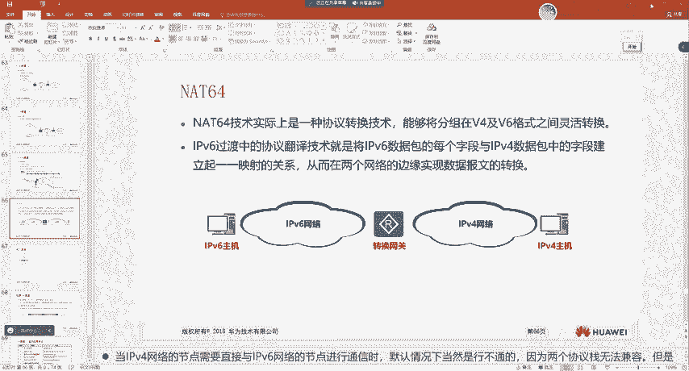

呃，IP6的路由技术啊。这路由技术呢不是特别多啊。呃，相对来说可能会。

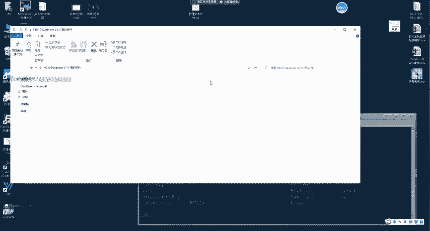

嗯，还还好吧，反正我觉得不难啊，就大家自己每个人有不同的学习体会啊，我觉得还好嗯还算挺简单的啊，我们来看一下啊。😊，呃，那IPU6的基础，咱们学完之后呢，我们来看一下这个IPU6路由的一些前沿。好吧。

就是随着这个万物互联时代的到来，对吧？嗯，IP4地址空间不足，就是V6取代V4。😊，势在必行。对吧啊，就相当于我们说这个。😊，嗯，共同富裕对吧势在必行。对不对？啊，那么如何去实现IPU6中对吧？

各个节点之间的可达性呢？啊与IPU4网络相一样。呃，V6网络呢同样支持静态和动态的路由协议。啊，但是IP4的静态与IPU6的静态呢配置方式上比较相似。呃，但是只有静态呢还不行。

是吧我们的像OSPF啊是吧ISSRBDP呢。😊，嗯，你要想传递IPU6路由呢，都得要做一些扩展啊，所以说IETF呢就定义了V3OSPIV3对吧？ISSBP的扩展。啊。

就是这些路由协议呢啊我们一般说三大协议就是33个啊。呃，一个是V3啊，一个是ISS，还有一个是BDP。对吧那么他们怎么样嗯去对IPU6实现扩展呢？我们来看一下啊。啊啊，已经实验小康了是吧？😊，呃。

这也看那啥啊，你看人。是吧但有些地方现在还是比较穷啊。呃，IPU6。SECIP6安全吗？还是啥？还是IPU6的IP赛卡权。这个在防火墙里面有IPU6的IP赛卡。这看设备啊看设备。

那么你要路由器它就没这个功能。嗯，比如说我问一下大家啊，我问我给大家这么说一下啊，就是比如说我们有IPU6。呃。那以后涉及不是到IPU6的NAT啊。AT66。是吧像我们之前IPU4的转化。

一般叫N44是吧，还有N444。那刚刚我们又接触到1个NT64啊，还有NT46。对。那以后会不会有NT66啊？大家觉得会不会有啊？就是IPU6地址到IPU6地址的转换嘛，肯定会有。注意啊。

这里我给大家说一下啊，嗯就是IPU6理想的模型呢就是端到端的通讯，大家能懂吗？就是端到端通讯啊，就是每个人都有一个公网地址。😊，嗯，不再去涉及到啊我们之前所说的那些。啊。

就不再去涉及到那个你比如说我们现在不是。啊，就不再涉及到AT技术了啊。呃。单只是针对于某些场景下啊只是某些场景下，实际上还有NT66呢，有这种技术，就是V6到V6的转换。嗯。

但这个在某些高端的防火墙上才有啊，像模拟器的防火墙，我记得好像是没有的。是吧路由器就更不用说了，路由器也没有。啊。嗯，这个你得在特定的设备上啊。这个你到安全设备上得去查一下，这个我具体没有去看过。

应该就是一条命令。之前我去看过，就是IPU6去通过AH包头去实验OSPFV3的认证。嗯，这种功能呢在这个模拟器里面，CE设备上是有啊，你像AR的话，它就没有就没这种功能了。啊，你像就是真机啊。

但我接下来要说的是真机啊啊，像S7000系列，我们可以通过这个IP赛去做OSPFV3的认证。😊，嗯，但是在有些设备上就没有，连这些NEAR这些就没有。但这个得区分设备啊，就一条面临的事。😊，好吧。行。

我们继续啊呃，接下来我们要说的第一个呢是比较简单的，就是IPV4的静态路由。嗯，这个跟我们在学习IPU4的时候是一样的道理啊，之前给大家也都配过啊，就刚刚我们配的也挺多的。

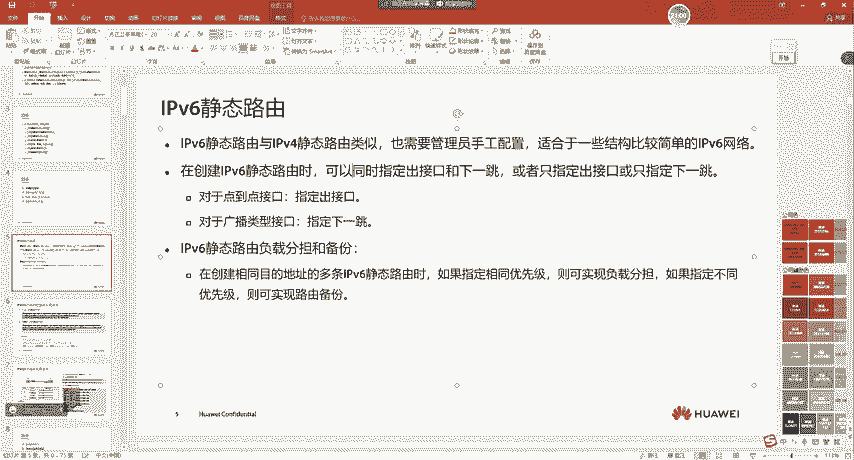

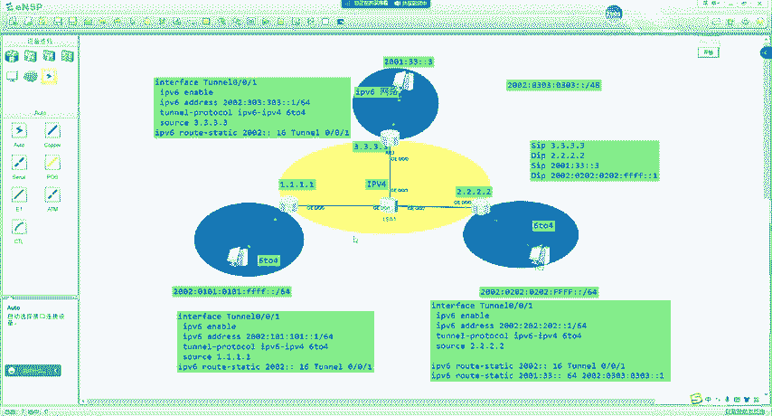

呃，就是IP6里面呢，我们也可以去写静态，命令格式是一样的。以前我们不是IP root吗？啊IP6的静态就是IPV6对吧？然后你可以去敲一个这个目的地址2001冒号12冒号冒号。😊。

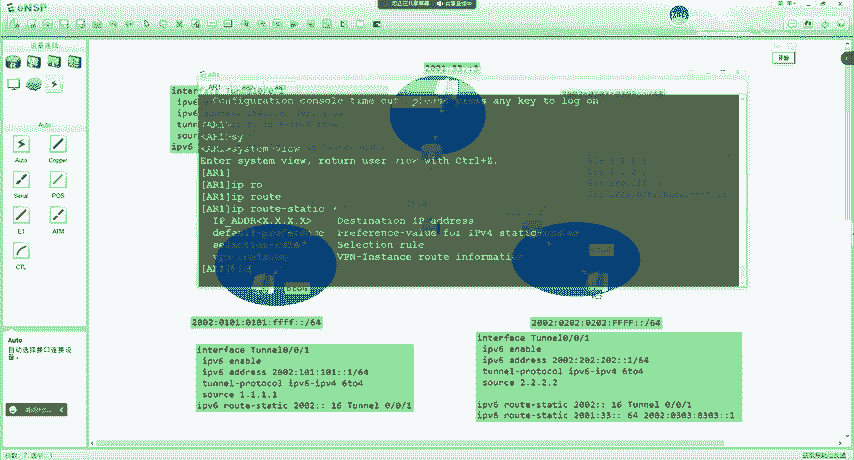

啊，然后去敲他的前缀长度啊，64，然后我们可以去直接指定接口或者下一跳。呃，但是接口跟吓一跳去指定的时候呢，注意啊，比如说像我们这种以太网啊，必须要去携带吓一跳。这里大家知道啊。

以太网是必须要去携带吓一跳的。因为以太网你从这个接口出去呢，你可能有多个目的地。所以说你指定出接口不行。但是对于P to P网络呢，你可以只写吓一跳。😊，啊，不对啊，只可以只写出接口。

因为从这个接口出去呢，吓得一跳是固定的，因为它只有一个目的地啊，对，没错。😊。

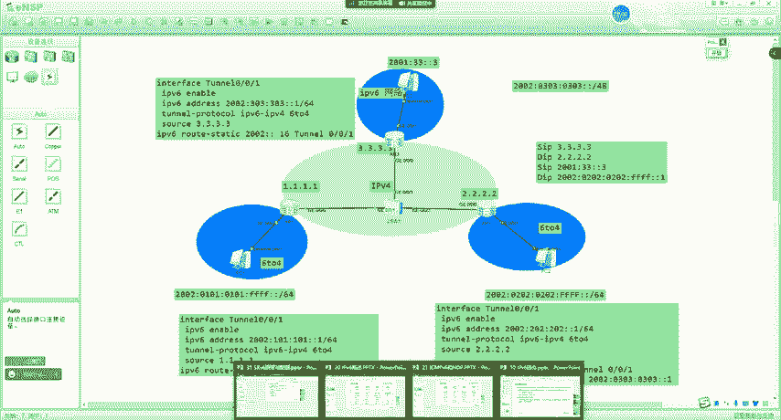

所以说IPU6的静态录由呢跟V4是一样的。那可以同时指定出街口吓一跳，或者只指定出街口或者指是吓一跳。对你像点到点呢可以只写出接口，对，但是广播类型的呢必须要写下一跳。啊。

而且我们可以去创建多个IP类的静态。嗯，可以实现负载分担啊，当然也可以做浮动静态啊。这IPU4的浮动静态大家应该都学过吧。😊，啊，就比如说我写了这条路由呢，嗯下一跳是2002冒号12，冒号冒号1呃。

随便写一个地址啊，然后我们可以去写他的优先级。对吧默认依然是60啊，这个跟我们在学IPV4的时候是一样的。啊，比如说我写个120的。那还再写1个60的。默认就60啊，那未来呢会有60的加表啊。

60的加表，但是60的一旦失效之后呢，会120的加表啊，这种呢就叫浮动静态。😊，那就可以实现路由的一个备份啊，这种都是比较简单的概念啊。呃，具体的配置呢，我们来看啊。😊，在公网上去写IPU类的现态路由。

那就是这样的啊。嗯，这个就IP6地址嘛，然后目的IP6地址前缀长度对吧？接口吓一跳。呃，下一跳的IP6地址啊，这俩重复了啊。😊，嗯，在这里也可以去加微P实力啊，微聘实力可能大家没学过啊，不用去管他。

那如果在微聘实力下去配呢，我们就单独去加上这个V聘实力。那这一块大家不用去管啊。嗯，现在可能有些同学还没有学到。对吧这个先不用去管他，然后这个啊能看懂就行了。好吧，刚刚我们通过命令好像看的更直观一点。

😊，呃，有一些注意事项呢，我们来看一下啊。😊，静态路由呢如果不配的优先级啊，默认的优先级是60，这个IPA4是一样的。啊呃，冒号冒号杠0。这种是缺省路由。这个之前给大家讲过吧，就IPU类的缺省啊。

你就可以直接写冒号码号。😊，比如说我在ARE上写一条IPU6的全省呢。嗯，就叫冒号骂号对吧，吓一跳2001冒号12冒号冒号2。好，冒号冒号，然后前轮长度是0是吧，那这种呢就是IP类的缺实录有啊。

然后安度命令中指定的有一个呃P开头的一个命令，这个单词咋读的，我也忘了。呃，只能取消IP6静态的永久发布，不能删除IP6路由，这是什么意思呢？我来看啊，现在我不是写了一条缺什吗？对吧。

比如说我把安度IP6。😊，roer stand taste。冒号马号。02001冒号12冒号冒号2。哎，好像没有。啊，那模拟器还没这个面俩啊。我把这个逻辑给大家说一下啊，就是大家注意啊。

之前我们再去删除某条静态路由的时候，你一旦安度掉之后，你是不是在配置里这条命令就没了。😊，大还记得吧。对吧就是把你的拍摄命令删除了。😡，但是如果我们在删除某条路由的时候呢，加上了这个关键词。

那就代表着呢暂时将这个路由呢置为失效的状态。就是这条路由呢先从我的路由表中拿掉啊，但是配置是没有被删除的。这个大家能明白吗？好吧。比如说啊我现在有100条路由。但是我得删了，删了之后呢。

我可能要做一些其他的配置。对吧比如说我在变更的时候呢。是吧呃，我得把这些路由删掉，对，先把路由引到其他地方。😊，对不对？但是在这时候呢，我删掉之后，嗯，未来还要需要重新的进行配置，对吧？

但是万一呃有哪一条被你忘了啊，这种就比较麻烦。😊，啊，所以说你可以加上这个关键词，建暂时的将它置为失效的状态。啊未来当你的变更做完之后呢，嗯再把这个命令给他干掉。啊，就是在把失效状态中给他取消掉啊。

再让他激活。好吧，是这么一种作用啊。就你把这个命令删掉就行了啊。那懂吗？就你再配一下，把这个命令删掉就行了，就不带这个命令了。

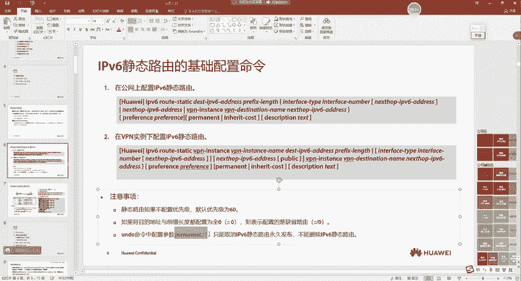

好吧。然后我们来看啊。😊，嗯，这就比较简单了，就现在R一跟R2要互通。对吧。呃，在RE上呢，有一个lowy0是2001DB8冒号2345，冒号一冒号冒号一。啊。

然后R上面呢有1个2001DB8冒号2345，冒哈2冒哈码哈。现在我们想实现这两个low败接口的互房，就协调心态就行了。前缀对吧，加上前缀长度128，然后再写吓一跳，这个倒没啥说的。

跟IPV4是一样的啊，这个没啥说的啊。😊，静态本身是比较简单的。嗯，但是给大家补充一点啊。嗯，就是虽然我们之前说过IPU6地址是非常多的对吧？啊，128比特不怕浪费。😊，啊，但是给大家说一下啊。

就是我们一般真正部署的时候。😊，我举个例子啊，真正在部署的时候，像我们的设备，比如说有还回口。😊。

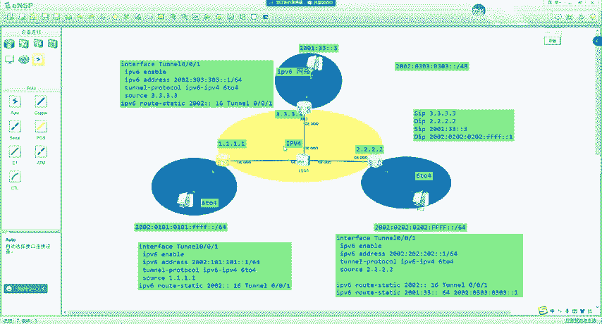

验是配128打。

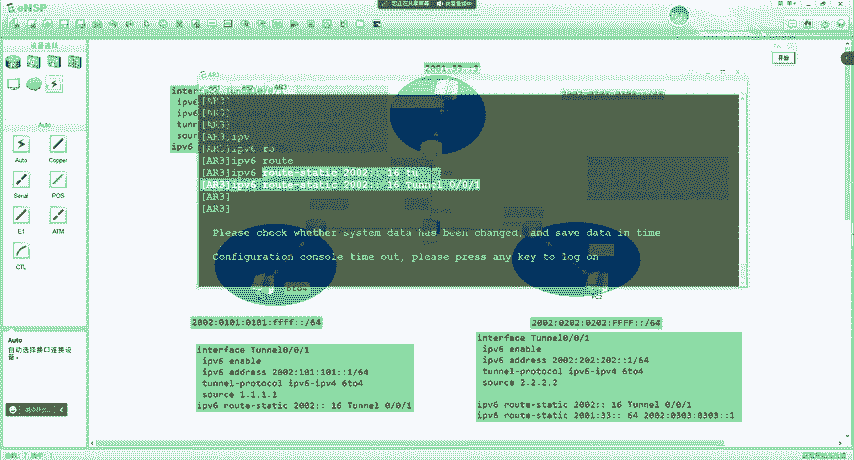

大家能懂吗？比如说我这设备A23，我有1个IP6的环油口，我们依然是配杠128的。😊，没有了，冒号骂号，老是我干64。对呃，很少这样去做啊，基本没有。这个就相当于一种习惯啊。就相当于你有一天突然暴富了。

对不对？比如说让你今天花10万块钱。嗯嗯，上这个。呃，这个这个这个这个呃叫夜店是吧，让你上夜店玩玩一趟。😊，对不对？嗯，花10万块钱啊，给那些。啊，就是叶店里认识的那些朋友呢，嗯对吧？给他点钱对吧？

给人家小费，对不对？那叶店有时候好喜欢发小费是吧？😊，嗯，那你也有点不舍得吧。对吧。啊，这个。呃，就类似于这种是吧，是相当于一种消费习惯一样，你习惯了节俭对吧？但是我们在用的时候呢，是有这种的。😊，嗯。

大家要知道啊，就我们刚开始现在就是现在虽然有在用IPU6的了，但是依然是。😊，没有那种特别的去浪费啊，不像暴发户一样，还能懂吗？😡，就是我漏外接口依然是杠128的。😡，大能懂这意思吧？

没有说我另外接口也杠64啊，对吧？有。但这种是很少的，没有。

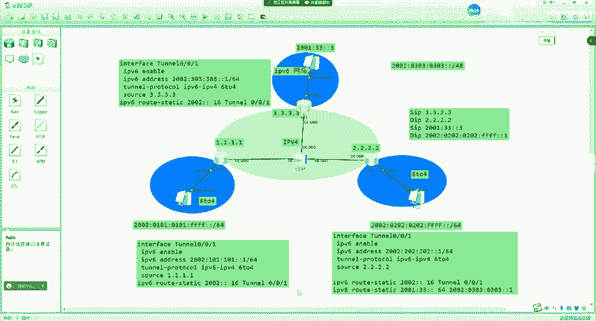

所以大家知道啊，虽然我们有地址了啊，但是在使用地址的节俭习惯上呢。嗯，现在依然是就是不再浪费啊，就没有去浪费啊就吃过这方面的苦了。好吧，就像你之前没好好读书，对不对？嗯，你吃过苦了之后呢。

如果让你再来一遍啊吧，有新的机会呢，你肯定更愿意。😊，你去认真的读书。对不对？有吃过这种苦了就不一样了。所以这里大家知道。嗯，接下来我们讲的是OSPFV3啊但这个OSPFV3相对来说会比较难一点。

注意啊啊，给大家说这个协议呢相对来说会比较难一点。嗯，首先我们来看一下V3跟V2呢，大家要知道V3跟V2是两个独立的协议。嗯，这就相当于什么意思呢？相当于你是吧呃，和你的儿子一样，对不对啊。

你们两个呢虽然就是版本的迭代。😊，对吧。啊，比较像。是吧，但是你们本身是独立的人。是吧V3跟V2就类似于这么一种。是吧。那对于OSPFV2来说呢。那么这个协议呢，它是运行在IPV4值上的。

而OSPFV3呢，它是运行在IPV6之上的。能不能明白他们两个协议呢，就是V3是在V2之上做了一些增强。但是本身呢是两个独立的协议。就是V3呢运行在IPU6的IP路由协议。

而V2呢是IPV4上的IGP路由协议。两者是并布兼容的。两者是独立的。但是这两个协议呢有很多类似的地方啊，就是也就是说他们有很多的相似点。你比如说像。就是基本的一些概念呢，像区域的划分对吧？

零呢就是骨干区对吧？路由器的类型。比如说我们有IR对吧？啊，有ABRASBR那这种概念呢依然是持续的。像路由的计算对吧？啊，优先级跟度量值影响路由计算，这也是一样的。还有网络类型对吧？四种网络类型啊。

以及豹纹类型的5种OSCPF的包V2跟V3呢这些都是一样的。那至于工作原理上呢。V3的邻居管理期建力啊，对吧？邻居的状态啊跟V2也是一样的。DR与BDR的选举啊。啊，也是一样的。这李大家还记得怎么选吗？

还记不记得？嗯，相比优先级是吧？然后比入台低。IP大的还是入台ID啊。应该应该是哪一个啊？入台地是吧啊，对。然后像LSA的泛红机制啊。那就是我们收到更新之后。先会泛红，然后自己再进行本地的计算啊。

这个也是一样的。啊，最后是路由计算的过程啊，这都是一样的啊。就是比如说我们先计算出top数，然后在top扑书上去挂机叶子。那这是V3跟V2的相同点。啊，那V3有哪些路由类型呢？我们来看一下啊。

实际上跟V2是一样的那这里呢有一个。呃。具体的例子啊，我们来看。嗯，这里应该是一个省市网络的划分啊。比如说我们在这里呢有一个线。对吧啊，这里也有线这里也有线。嗯，然后线下面呢都有自己的路由器。

我们都划分到一个非骨干区域易种。对吧嗯，这里有一个线。啊，划分到非5干区域二中。然后这里呢有一个非5000。那我们可能有很多的县，每个县都带一个非骨干。而县级到市级之间呢。咱们用的是骨干区0。啊。

就这部分一种层次的结构。那这时候我们依然把这台路由器呢叫做AB啊啊，也可以叫做B啊。因为它在骨干区的路由器呢，我们都可以叫做B啊，对吧？叫做骨干路由器。😊，而对于我们的市级呢。

可能到省级之间跑的就是BGP了。对不对？那有时候考生我们需要引入外网，对？因为县级啊这些路由器他们不愿意用BDP，我们只跑的是1个IDP协议。那这时候有时候我们要引入外部路由。那依然他也是ABR。

也就是说，在OSPFVR中，那些路由器的角色啊以及路由器的类型呢，像ASBRABR呢BR和IR。在V3中是同样适用的啊，这是它路由器类型的一种叫法啊，以及拓普是怎么样划分的对，骨干区域呢就是区域0。啊。

非骨干区域呢啊就是非林的区域都是非骨干。这跟VR是一样的。那还有哪些呢？工作原理。在我们的OSPIV3中呢嗯他是这样的。就首先我们要建立邻居，对？邻居之后呢，同步连住状态，然后呢，自己进行路由计算。

对吧？啊，产生路由表。V3也是一样的。第一步呢，我们也要去建立邻居。😡，建理完邻居之后呢。同步链路状态。以及呢进行路径的计算对吧？SPF计算V2跟V3呢都是SPF啊。那最后呢再去产生路由表。能懂吗？

那像邻居的状态啊对吧？啊，有7种啊，那么以及建立邻居的时候，比如说DRBDR怎么选的，也是比较DR优先级，然后再去比较这个呃入台低。啊，包括LDB交互的时候。

像LU啊LRLCKACK啊啊主持的选举这些跟VR都是一样的。😊，就是大体的工作过程是一样的。邻居建立。链路状态啊，路径计算。啊，以及生成录为表。我来想一下ISS是不是这样的，也是。

是吧ISS不是也是建立邻居状态，同步链路状态吗？对吧啊，然后践行路径计算生成路由表。但是SS跟OSPF实际上还是有很多的不同。是吧ISPFVR呢，它有很多LCISS里面叫LP。

是吧那V3跟V2的这些大体的工作过程依然是一样的。那也有很多不同点。那这些不同点呢，就是我们接下来要学习的地方。嗯，首先我们来看第一个啊。第一个呢。叫做OSPFV3啊和V2的不同点啊。

当然这里列举了一下，我们来看一下。但这里只是一个大概的目录。是吧嗯，但是具体细节的话，我们依然要去慢慢的学习啊，可能刚看目录你看不懂。那第一个叫OSPFGV3的基于链路运行啊，以及to计算不再是网段。

是吧啊感受不到，这啥意思啊？😊，对对，什么叫基于链路运算？是吧而不再是网端。威尔是网段吗？之前没接触过对吧也没听说过。😡，那V3支持一个链路上多个实例，V2有实力吗？是吧，没有类似的概念。都的。啊。

V3的LSC中去掉了IP地址的意义，对吧？重注了报文格式啊和LSC的格式。啊，这里我们还能看懂一点，啊，就老师就是V3的LSC跟V2的不一样了呗，差不多是这个意思。然后具体的区别呢，可以在这里。😊。

就V3的一类跟20LC不包含IP地址了。有人就问，那老师不包含地址，他吓一跳怎么计算呢？😡，是吧哎，不包含地址，他路由又怎么算呢？😊，是吧我们可能会产生各种各样的问题啊。

但是这个问题呢需要我们慢慢的去学啊，1。1点去接触啊。😡，那V3里面呢定义了LIC的泛红范围。是吧有人又比较冤，老师V二没有定义吗？那一类不就是区域内泛红吗？是吧？二类也是区域内泛红。😡。

那V3里这有是什么意思呢？大家还是体会不到。😊，呃，当然我们后面会去讲到啊，这里大家去看一下目录就行了。😊，然后V3里面呢定义着新的LOC承载IP6地址和前缀啊，这个容易看懂一点。啊。

V3里面不再有IP地址标识，而只有入ot地标识，这里又懵逼了。😡，老师IP地址什么时候又标识一台路由器了，之前没接触过。😊，对不对？嗯。一个一个来吧一个一个来啊呃，首先我们来看一下这里啊。

就是V3里面呢怎么样通过入台ID来标识网络设备呢？😊，好吧。呃，首先大家要知道一点啊。嗯，当我们去运行OSPFV3的时候，大家会去发现啊，之前我给大家配过。

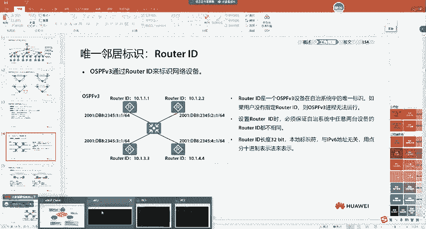

对吧就是我在AR1上呢，如果启用了1个OSPFV3。啊我必须要在进城下敲一个入台地，我敲的是IPV4地址吗？😡。

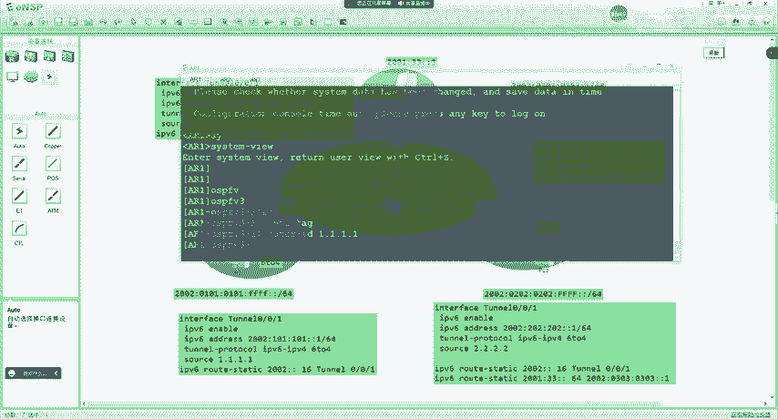

是吧啊，大家可能疑惑，老师，你怎么V3还用IPV4地址的入台地呢？注意啊。😊，实际上我们在学V2的时候。入台地它只是1个32比特，能懂吗？只是1个32位的整数。就是他只占着32比特。

区别在于他的表现形式。跟IPV4地址一样。不是说他就是IPS地址。没错，它只是表现形式跟IPS地址一样。😡，那在OSPFV3里面呢，它就继承了这种特点。就是V3呢，我们依然要去指定入台地。

否则OSPFV3没办法运行。这里大家注意啊，就是比如说你配了OSPFV3，你必须要配合入台地。😡。

你不配你的V3，你做了一大串配置都不是生效的。😡，这里是为什么呢？我来给大家说一下，可能VR中大家没这个印象是吧？老师我V2中OSPF。😡，是吧我network啊就出来了。😡，对不对？

因为我们之前在讲OSPIV2的时候，他的rootID怎么选？😡，首先选择的是全居入台地。对吧。然后再去啊，不对啊，就是全居住的台地。对不对？全局入台低。取决于。设备上。第一个对。

up的IP地址就up接口的IP。是吧。阿普接口的IP。对不对？所以在V2里面呢，我们平常在做实验的时候，都会有接口IP地址。😡，对吧所以说我们有时候可能没有这个习惯配OSPFV2的入台地，它也能够启用。

但V3里面不行，V3里面呢必须要有一个入台地啊，如果没有的话，你正成就面令你还可以去抢，还可以去宣告。但是呢他不会工作。😡。

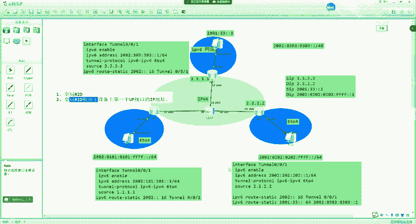

就相当于你在里面嗯做了很多的配置啊，但是没有生效一样。所以这里大家知道啊。😊，好吧，就没有缺省的了。V3没有缺损的。而在V3里面，我们在设置root IDD的时候，跟V2保持一样的原则。

root IDD是是什么啊？是什么？大家还记得吗？VR里面要保证什么？😡，唯一性。对不对？所以说V3里面也是一样啊。一定要保证他的唯一性。那么他的表现形式呢依然是32比特，对，10。1。2。210。1。

1。1。对呀。嗯，他是IP地址吗？实际上不是注意啊，这只是1个32比特的本地标识符，对吧？与IP6地址无关，与IP4地址也无关。就是采用点分实进制来进行表示的。好吧。

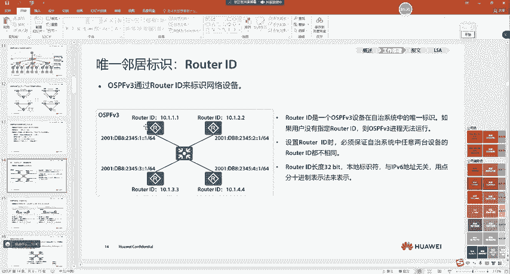

那第二个呢叫做OSPIV3是基于10亿。运行的啊，基于链路运行的。对吧而OSPFV2基于网段运行，这时候我们就有点体会不到，老是没接触过这个概念。😡，啥时候又基于网段了呢？我来给大家说一下啊。😡。

我来想一下。在OSPFV2中，我们要跑。这个协议的话，如果想要建立来邻居，有一个要求叫做接口地址要在同一个网段。对不对？所以说两边的接口地址如果网段不一样。那么在这时候还能不能执行路由计算，不行，是吧。

邻居都起不来。对吧所以说VR运行的时候呢，双方处于相同的网段，那我们才把它叫做基于网段来进行运行。😡，而V3呢就没有了。V三叫做基于链路。为什么叫做基于链路呢？之前有没有给大家做一个实验啊？😡。

我只要在链路上有link local地址。我的V3呢就能够起来。😡，是吧我没有GOA行不行啊？😡，行不行？可以吧。对吧你只要有LLA地址。那么邻居就可以建立起来。对不对？所以我们把它叫做基于链路运行。

为什么是链路呢？因为LIV在每个链路上都会去存在。😡，对吧。所以说。无论我的IPU6地址在不在一个网段，他不会去要求啊。😡，V3呢不要求在同一网段。为什么不要求啊？😡，为什么？

因为V3它是基于链路本地地址去建立邻居的。能不能明白？你两边没有啊，他都行，你只要有链路本地地址就能够建立起来。😡，好吧，你的全局担保地址你没有都行，还在不在一个网段，还有要求吗？😡，没有吧。对吧。

所以说V3呢只需要处于在相同的链路就可以了。这之前也给大家做过一个实验，对吧？但有同学可能记得有同学不记得啊。😡，嗯，我给大家再演示一下。哦，对，就是用F180。

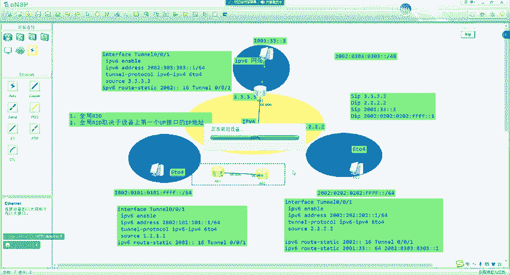

我们来看一下啊。😊，呃，现在呢我们有1个AR1和A22。

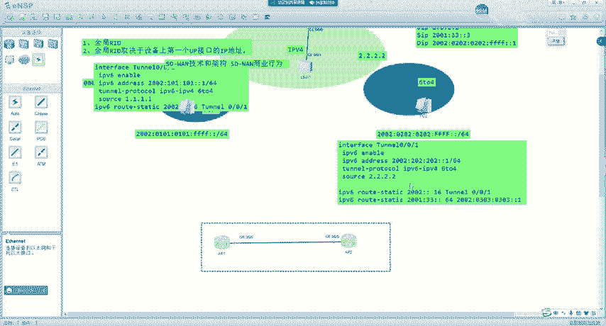

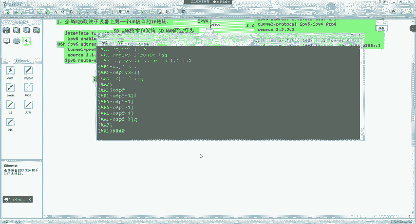

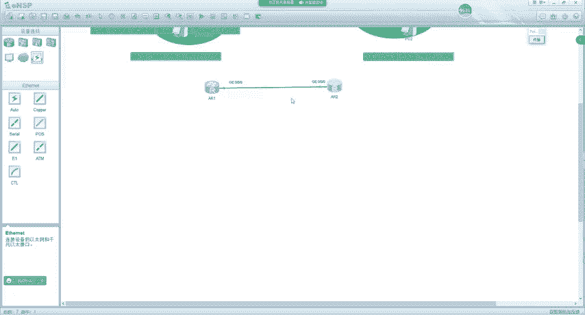

一上面呢我们这样啊开启IP的功能，二上面也开启。对吧A21的G0-0-0呢IP6。嗯，EnableIP6 address凹 to link local啊，然后二这边的70-0-0。

IP6address凹 to link。对，然后我在A21这边啊，OSPF5V3。一必须要配入台地啊，1。1。1。1。而且OSPFV3呢只能在接口下启用OSPFV310是吧？然后二这边呢OSPFV3。

入台地2。2。2。interfaceG0-0-0OSPFV31ar0。

啊，然后我们再记0-0-0抓报。

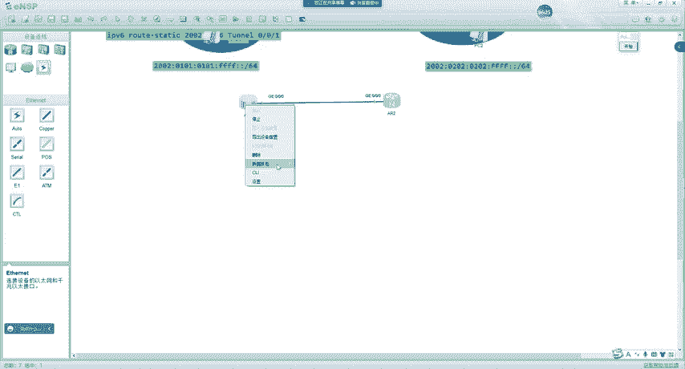

A一上面啊，大家注意啊，我没有配全局担保地址。对吧没有吧，什么地址都没配吧。😡，是吧。那这时候呢，我们去看OSPFV3P。完了邻居已经到突位了。对不对？你待会再看一会儿呢。他突然就起来了。

啊思打状态了啊。哼。对吧报了。对不对？那这时候我们有没有接口IP6地址，没有吧。

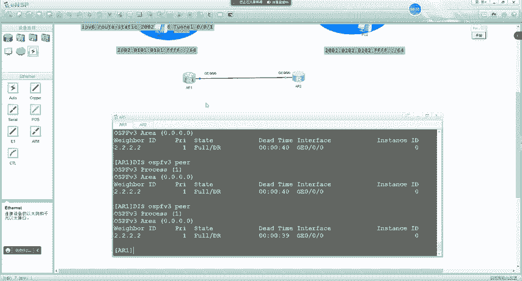

那他怎么工作的呢？注意啊，叫做基于链路运行，所有用到的呢都是链路本地地址。

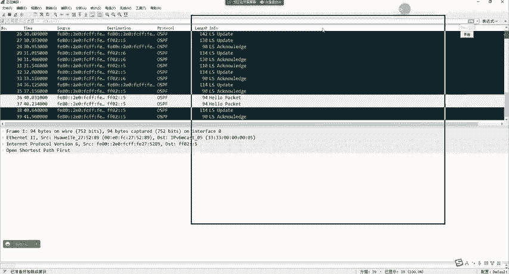

而链路本地地址是你这个节点，或者说这条链路，这接口只要有IP6的功能。对吧你就会有链路本地地址。那你就能够跑IP6协议。能懂这意思吧？而不再基于网段了。呃，这时候我们有任何IP浏网对吗？没有。

不我接口下呢，连IP6地址都没配。是吧所以我们把它叫做基于链路运行。😡，那没有地址都行。你觉得还要不要求两边在同一网段？还要不要求啊？不要求了吧。对吧那可能会有同学有疑惑。

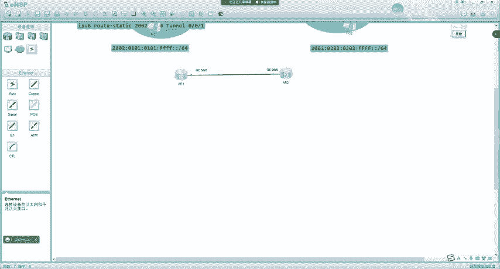

哎，那老师没有没有地址。我配1个IPV6的楼拜接口，他能访问吗？是吧，2001冒号2冒号冒号2。啊，OSPIV3120。对吧。那这时我们先来看一下A21能不能计算出来。拿不拿？可以。是吧哎。

能不能骗通呢？骗IPU62001冒号2冒号码号。也能骗通。对吧为什么能通呢？注意，只要我有链路本地地址。😡，那么就能够通。对因为我的吓一跳是什么啊？是链入本地地址。😡，是吧那位同学可能又有疑惑了。哎。

老师链路本地地址，它只在链路上有作用。😡。

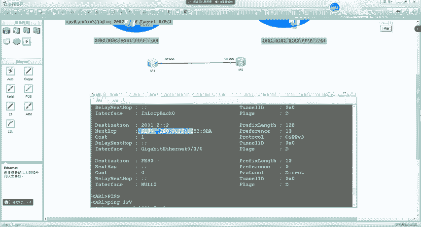

那如果我又来了一台路由器呢？是吧老师我还有一个路由器3。我这回跨链路了。你能起来吗？是吧那我们来给大家做一下，我先给大家说结果是可以的。😊，是吧我们来说一下啊，interfaceG0-0-1。😊。

IP6address220clo。OSPFV31260。然后在A23这边。

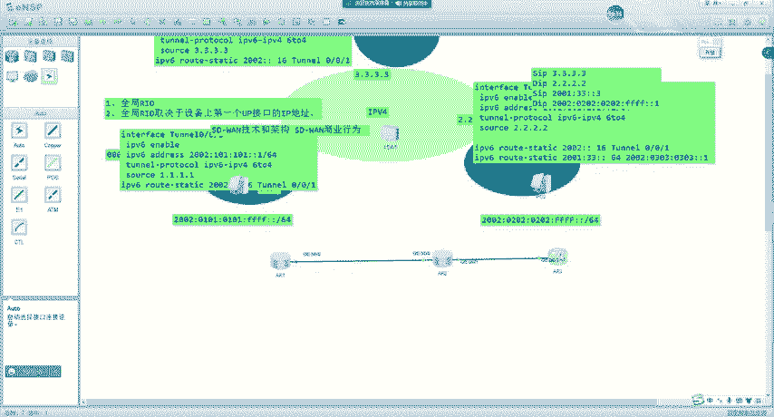

interfaceG0-0-0123应该之前有配置啊。我把IPV4地址先给他拿掉。IPV6I6dress2001冒号23冒啊不对。IP6dress。凹 to link look。

对吧然后我在三上面呢起一个环回口IPU6na IPP6dress2001冒号3，冒码3。64。OSPFV31260。A real0。哦，我还没启用OSPI微3啊。入台地3。3。3。

3interface low0IP6dress2001冒号3冒号冒号3128。啊，然后OSPFV31ar0。对吧转完之后，我们来A21上看一下。能不能计算出来啊，现在邻居还没起来呢？

Dplay OS V V3 p。我看一下邻居还没起来。😊，嗯，1。1起来了。哎，三没有起来，大家觉得我少配了什么啊？入台的。对不对啊？3。3。3。3。好吧，然后我们到二审来看啊。😊，还没有啊。

702021。OSPFV31ar0。三这边。interface70-0-0。啊，没启用OSPFV31260。啊，DsplayOSPFV3。皮。是吧连英居起来了。对不对？现在起来了吧。😊，啊，就曲一莲啊。

是吧刚应该是把。G0-0-1是吧，启用了。现在邻居建立起来了。那我们来看一下A21能不能学到路由呢？拿不拿？可以是吧，来学道路由能通吗？2001冒号3冒号码号3。啊，不行。好，这个还不行。

那为什么不行啊？😡，想一下。

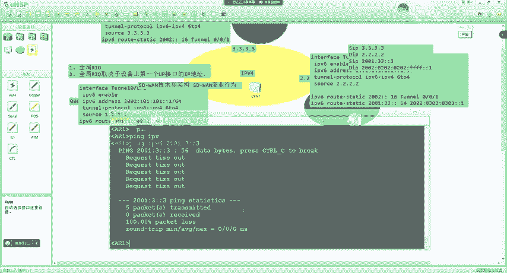

这待会我给大家说啊呃现在肯定不行啊。😊，呃，不行的原因，我给大家说一下注意。身为ARE如果去访问目的地址。2001冒号3冒号冒号3。他得有个原IP。他的原IP是多少？是多少？是LL。对不对？

而LLA一旦跨越了网段之后，三知不知道从哪接口出去啊？知不知道？是吧这时候不知道，所以说他没办法回报，但是注意。

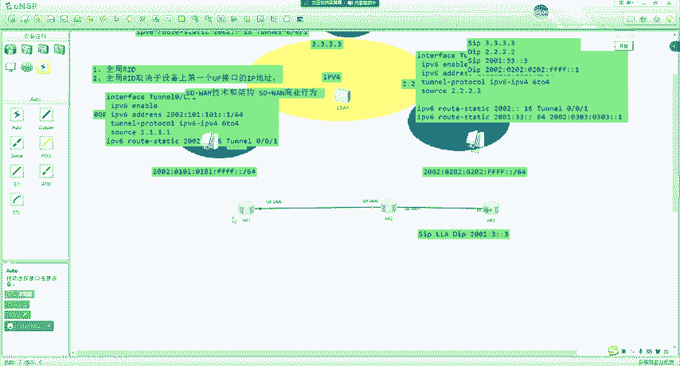

如果我在A21上，大家认真听啊。IPV6 enable。见个low百0，大家注意2001冒号一冒号冒号一。128。OSPI5V3以内部。OSPRV31260注意。

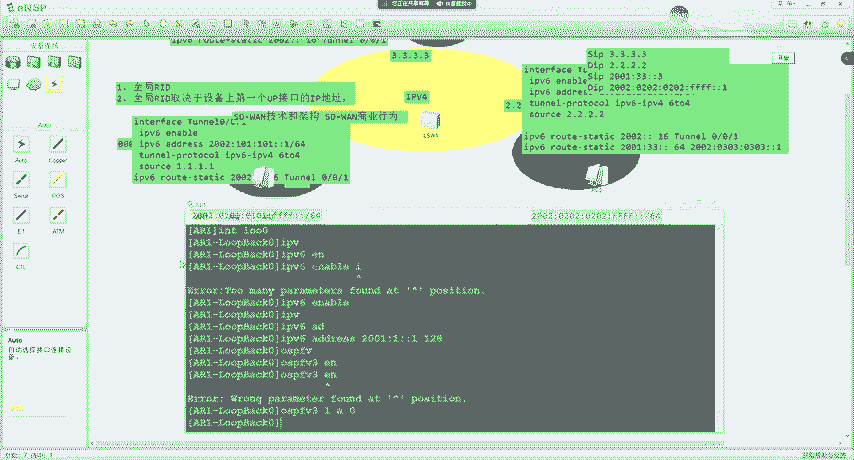

现在A21和A23的漏败接口相不相当于他们各自连接了一个业网端。相目相当于相当于。而我们在整个OSPF网络有没有一个。😡，GOA地址。没有。

是吧。那如果说两个业务网络PIPV6杠A。2001冒号一冒号码1到2001冒号3冒号码号3，大家觉得这样能通吗？

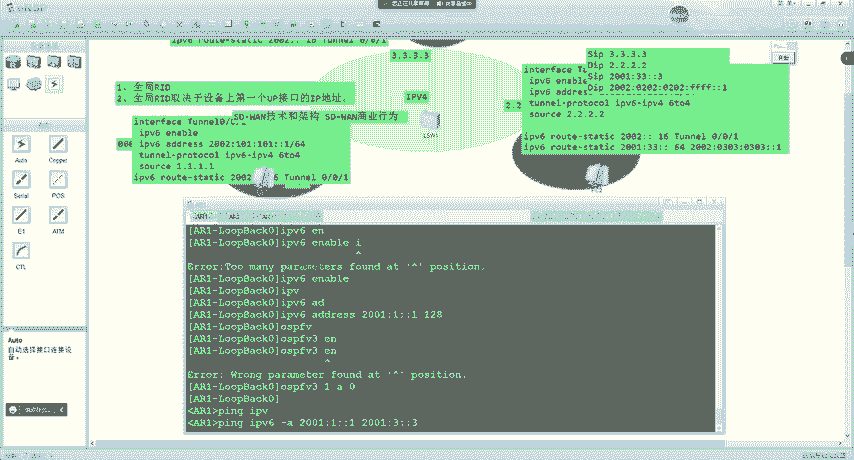

是不是可以啊？对吧。哎，那这又是不为什么能通呢？因为当我们的业务网络只要使用了。这个GA地址之后。对吧而我们的设备初施间互联，是不是只要链路本地地址就行了？对吧。而且链路本地地址。

大家告诉我有个什么好处。😡，有有什么好处啊？他不能跨网段。😡，所以说只要是跨越了网段的攻击行为。对这个路由器有效吗？你想想ISS。他基于链路运行。其约二层院型。三层的攻击对他有效吗？没小。对不对？是吧。

那有人就问了是吧，哎，老师那还有没有？那一般我们为什么还要配还回口呢？😊，大家觉得为什么还要配个环卫口啊？😡，为什么啊？我跟大家说一下啊。环口一般我们做管理IP的对，没错。是吧不是测试啊。

那你要跑BGP，你得用还荣口吧。😡，对，因为BGP得跨链路建立啊。对不对？那还有一点呢。就是我们跑一个环卫口一般做管理。对吧你比如说你在运维的时候，你不能搬着电脑。😡，是吧这个。在一条商业街上是吧。

这个在市政大楼。你要维护这两台路由器，你不能跑到这个机房里，对吧？跑俩小时过去接啊。对吧所以说还回口的目的呢，我们是用于做管理IP的。而本质上，如果设备互联不配全球单保地址有没有问题啊？是不是没有啊？

大家能明白吧。明白同学敲一。

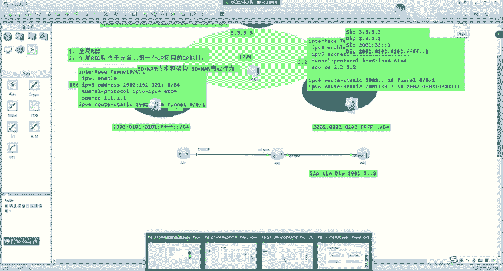

都能理解吗？可以是吧。对，那这就是我们所说的OSPV3，它是基于链路运行的。就是你有没有GA，你没有都行是吧，我就不要求你在一个网段了。😡，对不的。啊，这就跟你一样。对不对？你没有女朋友。

那你还要求那么多。😡，是吧啊不要求那么多了。是，现在我们的IPU6也是一样。😊，没有这个地址都行，在不在野网段呢，实际上他并不关注。那这就是我们所说的基于链路上进行运行。只要双方处于相同的链路就行了。

说白了就是只要广播与能通，那么OSPFV3的邻居就可以建立起来。😡，好吧。呃，行，那我们这节课就讲这么多啊，今天就说这么多。然后。剩下的内容我们就下节课再来说啊，下节课再来讲。好吧，今天就讲这么多啊。

我把录屏先停一下啊。

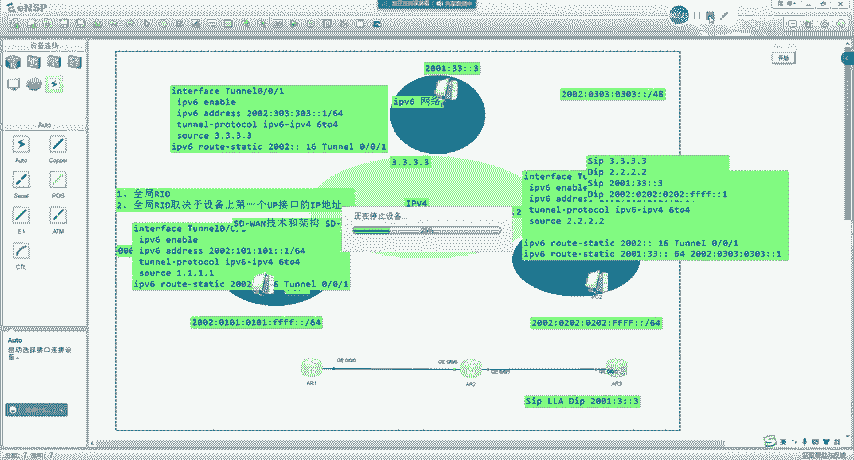