# 2023 新版华为认证HCIA+HCIP+HCIE全套视频讲解！一套视频让你从入门到精通！CCNA／CCNP／CCIE技术提升同样适用！ - P10：HCIA - 10 - 静态路由 - -Book思议8 - BV1W8411A7z8

嗯，我们上一节课呢讲了一些路由的基础。对于路由的基础来说呢，那天给大家看了一下我们简单的直连路由，那么也回去留了一个小的作业，让大家去配置一下直连，我们今天呢来讲静态呃，大家你们在群里我发的也看到了。

就是关于两个设备旁边的一跟三并不通的问题，对吧？我留作业也没要你们并通。因为这是我们今天这节课讲的知识，我先把设备打开，咱们回过头来接着说，咱们上一节课呢跟大家简单讲了直连路由。那么对于直联来说呢。

它是根据我们一个网络的，本身的物理直连接口，我去形成的直连路由。那么代表我现在这个接口下连接了怎样的一个网络标识我接口下所有的一个网络范围。那么我们今天呢会围绕着我们今天这张图来跟大家讲。

讲完我们整体的静态路由。呃，咱们首先先把三台设备给配置一下，右边这些我好像没配，咱们一块来配一下，这是2。0网段和3。0网段。921682。100。啊，咱们先把它们配置一下。

这个作业今天我会留给你们回去当成咱们今天的作业了。所以我在配的时候，大家可以呃好好看着啊，这是我们1921683。1版。好，3个25上一节课路由器的配置我也没保存192168。因为今天我们要重新配一遍。

行，咱们先把三台PC给配完了，配完了以后呢，检查网关配的啥都没问题。呃，1。2。1跟3。1好，1。1没问题之后呢，我们今天要把三台设备重新配置一下好，重新配置一下。今天配完了以后呢。

我就会教大家怎样去保存了啊。上一节课我没让你们提交。所以因为今天呢希望你们从头把之前的都给重新配一下。

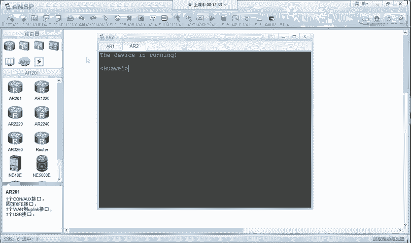

呃，咱们首先来一遍吧，三个设备基础的命名还记得吗？啊，我们s nameR1R2以及R3，我不会敲的太快，我们可以慢慢来啊，233台设备对于三台设备来说呢，我们首先上一节课我们应该讲完了哪一部分啊。

讲完了我们给R1的接口，这两个接口配的地址。我们今天依旧把这两个地址呢给它配上，也就是进到R1的0-0接口下，也就是跟我们PC相连的接口，我们去配置192。168。1。1，这是作为PC未来的网关啊。

对吧？然后进到我们跟R2相连的接口是一接口，我们配置1个IP地址，是12。1。1。1。

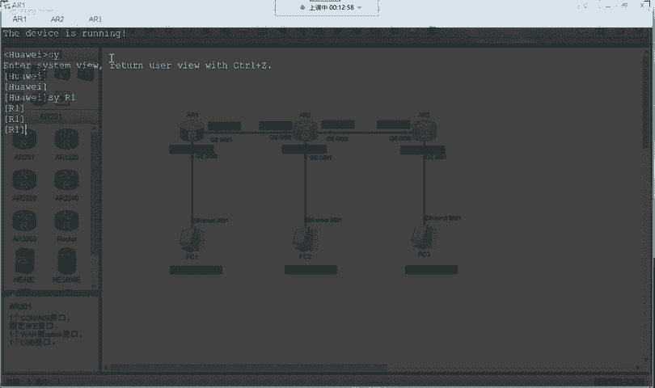

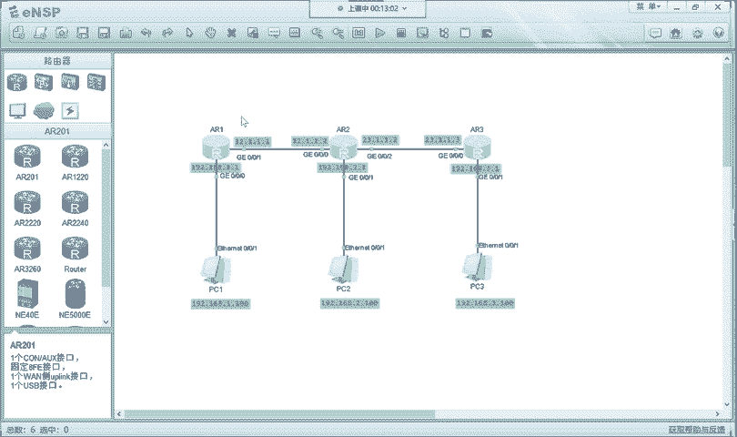

好，那么当我们现在配置完毕以后呢，我们把R2的左接口也配置一个地址。因为未来我们等一下要跟R一呢去看一看他们是否能够互相通信。所以咱们也先配上0-0-0好，那么我们给它配上地址也是12网段的12。1。

1。2好，24位的页码，我们回到R一这台设备上，我们去查看一下R一的路由表查看R一的路由表以后，我们会发现相应已经生成了我们的直连路由，对吧？下边这个192。168。1。0网段的这是什么？

这是我跟PC相连的网段，也就是我现在这个网段信息。12网段呢就是我跟R2相连的网段，我们两个之间的网段信息。那么我们今天所讲解到的路由表，我们今天会把路由表中所有的参数都跟大家讲到，除了这个flex。

这个你们未来到了IP的课程中会学。那咱们一个一个来看一个一个的讲啊，我把它截一个图截下来。好，截一个图放到咱们的画图板里。

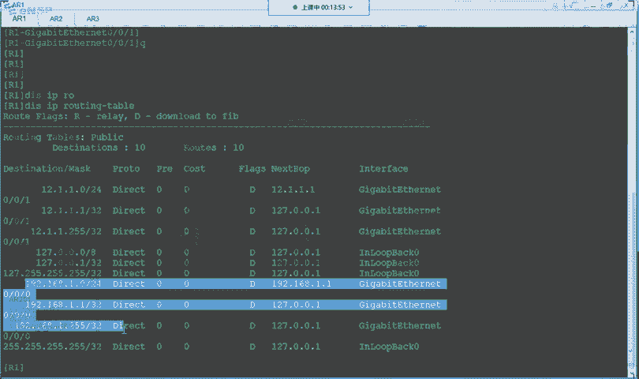

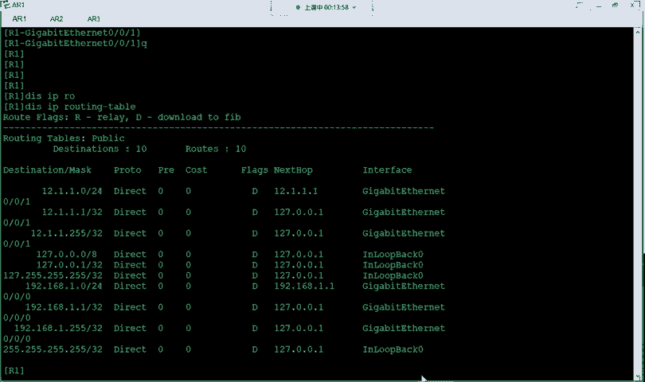

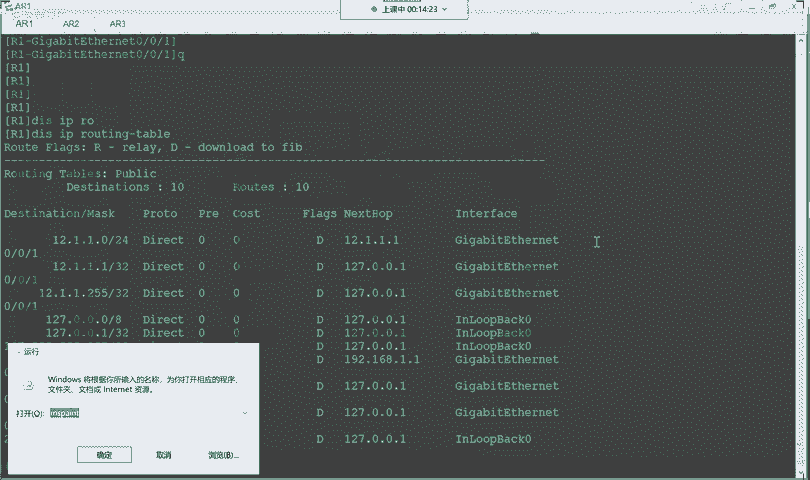

啊，咱们摘下来。对于我们现在这些参数来说呢，我们需要一个一个的来看。首先我们这里有一个destination以及mask。我们可以回到这里边，大家可以看到这里边代表的是我的目的网络以及一个掩码信息。

也就是未来呢当有一个数据，比如说啊发稍等啊，我把这个信息给关一下。我每天都是铺天盖地的信息。当有一个数据呢发送到我的设备上以后，比如说我未来要去往哪样的一个目的地。

我在我本地查询本地的路由表进行相应的数据转发。所以我们所说呢，如何去衡量未来我想要到达的这个目的地，它的信息怎么记录呢？我们就以目的地加上我们所目的网段，加上掩码的方式，我们进行一个标识。

所以这叫做目的地和掩码。那么往下看呢，这里有一个协议啊，协议来说呢，我们现在学了一个叫做direct，就叫做什么呀，叫做直连。那么它代表的是我们现在前边的这样的一个网段信息，我是通过什么协议去。

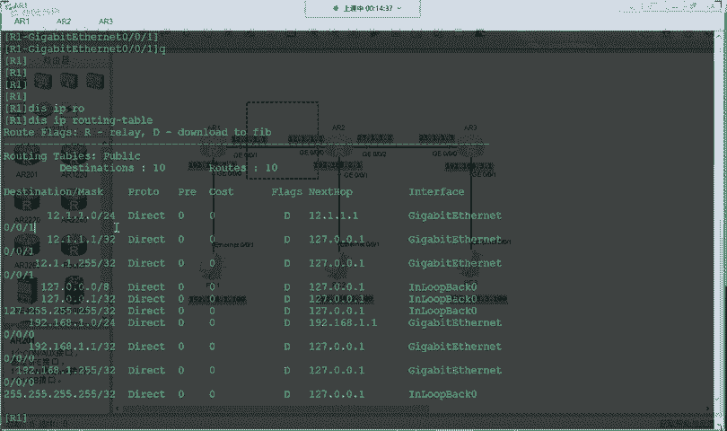

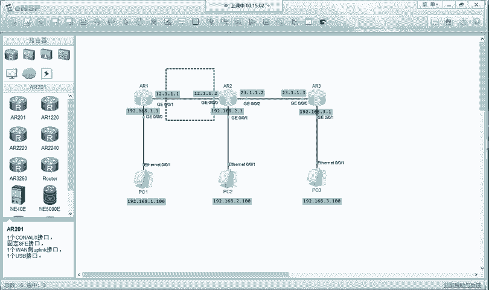

形成的。那么截止到目前，我们只讲了直连。那或或者说呢我们这里只能看到直连。呃，有同学可能会那讲到这儿呢，我们就要开始今天的正题了。之前都是对上节课的回顾。我们今天呢要想一个问题，你说老师有路由表就行了。

为什么还要标识协议呀？那这个协议标识出来它有什么作用呢？或者说它能够给我们带来一些，比如说你看的时候，我们是能看出什么区别吗？或者说它能够标识的未来的目的网段有什么样的一个作用啊。

为什么要有标识一个协议呢？我们就要去来看一下，我们今天呢给大家画一张图，我们来去讲一下，比如说现在呢多台设备，咱们就不看那个配置的图了，咱们就直接画图，现在呢比如说有多台设备。那对于多台设备而言呢。

我现在呢彼此相互连接起来，连接起来以后，可能左边右边还有设备啊，但是我就不画了，对于我现在中间的这个设备来说呢？我左边现在有一条直连路由。注意我左边有一条直连。

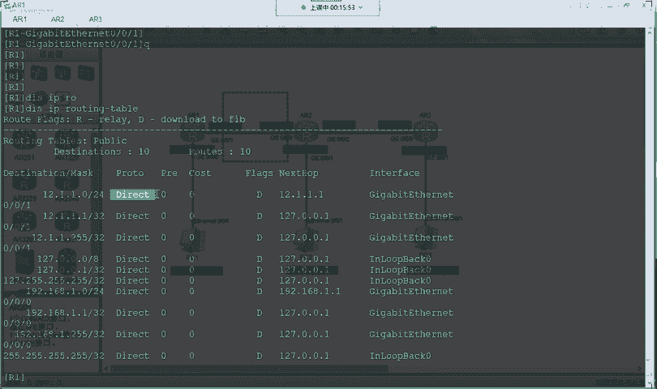

有一条直连路由，这条直连路由是多少呢？12。1。1。0好，12。1。1。0。比如说它是30位的言码，这是直连。那我现在呢右边还有一条路由。比如说我有一条静态路由，这个咱们还没讲，但是我告诉大家。

它是跟直连路由区别于直连路由的另外一种形式啊，我们未来呢把一条路由加进路由表中，它还可以以一个静态路由的方式呈现。我这个路由是多少呢？也是12。1。1。030位的页码。好。

也就是对于我现在呢一台设备来说，我现在设备身上呢同时有两条路由，也就是未来去往12。1点1。030位的言码，这个往段儿，我呢既可以走左边注意啊，我既能往这边走，也能往这边走。你说老师这个可能吗？

这是什么情况啊？可能我给大家简单画一个，等一下我再说的时候，我就不赘述了。比如说呢原本这是你啊我们所说你呢要从这台设备这台设备去往这台设备，那么你有一条路可以走。比如说这是一条直连。

那你也有另外一条路可以走，你可以这样走，能明白吗？所以说未来是有可能进行一些静态路由的配置啊，或者说未来你们去学习动态路由，你会发现对于同样一个目的地来说呢，你可能会有多种路径可以选择。

所以你会发现去往这样的一个我们所这样的一个目的往多少来说，或者说一台设备也好，未来你可能会有多条路线能够让你去进行选择。或者说呢可能由于我们工程师在你设备身上呢做了一些配置。

那么总之现在你会发现你呢有两条路由可以选择。那么你选择哪样的一条呢？这是一个问题。所以你会发现此时我们的网络中呢，没有我们只有直连的时候，那么简单了。它变了，也就相当于现在呢我们要去衡量路由如何加表了。

看好啊，咱们不嗯不讨论延迟这些问题。咱们今天要先讨论路由如何加表的问题。也就是路由如何能够把这样行一条路由出现在路由表中呢？我们有一个加表原则叫做最优加表，最优加表。

我们只会把最优的一条路由加进路由表中。那么我们如何去衡量哪条路由最优呢？啊，如何衡量哪条路由最优呢？我们首先呢会去比较一个值，我们会去比较形成路由的，它的优先级的数值。注意啊，叫做优先级。

我在这里先简写了，课下我把这个笔记给你们补充完整，优先级的数值，那么优先级的数值越小越优。那么如何去衡量优先级的数值呢？啊，我们在IA中呢讲解的优先级呢，我们只讲一个外部的优先级。

也就是未来呢我们所说呃优先级其实是分内外部的。但是我们现在在这里路由表中，你所看到的这样的一个优先级，它是一个外部优先级。那么对于内部优先级，未来你们到了IP会讲咱们IA我就简说了，我就说它是优先级了。

那你们知道会有一个分类即可。我们所说呢比较形成路由的优先级越小越优。也就是对于现在的两条路由来说，他们会有一个优先级的概念。那么对于直连路由来说，它跟静态路由优先级是不同的。在我们华为中的规定。

直连路由的优先级是多少，有同学知道吗？如果有同学知道的话，可以给我刷个一，或者说呢把你知道的答案给我刷出来。0啊，非常好。其实我们在路由表中已经看到了是0。那对于静态路由来说呢。

华为规定静态路由的优先级是60。😊，所以当我们两端的优先级不同的情况下，请大家注意，我们现在就代表了一种思想。也就是说现在呢去往两端的时候呢，感觉我们好像走哪都能到，对吧？好像呢我们现在掩码也一样。

网段也一样。那么我如何去比较呢？我就会去比较优先级了。那么我们认为优先级越小越优先，所以当我们设备身上有两条，我们所说两个路由可以选择的时候，我们会选择优先级小的，也就是它更优。

所以最终如果你同时有两两端啊，它都给你指示了相同的信息，那你会选择左边的这条直连。因为直连的路由优先级是零，它是要优于我们所说的静态路由的优先级的。所以呢它会去比较优先级，那么我们所说什么叫做优先级呢？

它是有一个概念呢。我给大家写在这了，我们所说的优先级叫做preference。那它呢代表的是什么呢？代表我们现在形成路由，也就是我形成的这条路由的。协议的优先级数值。呃，咱们现在去讲的话呢。

其实大家理解这句话理解的不是很明显。因为未来呢你们到IP中学到具体学习OSPF的co值的时候，你们会对它有更深刻的一些理解。那对于我们来说，你最基础的理解，你也可以能想到直连的话呢。

就是我现在接口下连接的一个网络。那么肯定我去它走直连是最方便的。你甭管什么其他的静态呀，动态呀，肯定是要略于我们的直连的，所以这一点大家先去理解一下即可。这是我们的优先级的概念。嗯。

那么我们现在呢还是回到刚才这张图上，我们把思路变一下。那比如说我现在右边这个呢，我呢掩码不是这样了，我是多少位的掩码呢？我不是30位了，我是多少位，我是24位。比如说啊举个例子，我现在掩码变成24位了。

好，那我想问一下同学们，如果我的掩码发生了改变，那么请问我现在这条静态路由会加表吗？来想一下这个问题，我会加表吗？认为会可以给我刷个一，认为不会可以给我刷个2，大家认为会吗？啊。

不不知道不会有同学说不会有同学说不知道。嗯，那我现在呢跟大家说一下，有同学说会好，那么我们现在给大家举一个例子啊，举一个例子是什么呢？比如说现在你左边连接的是个直连网段。

实际上大家可以看到他们两个属于不同的一个网段吧，对吧？这肯定是不同网段啊。😊，那么对于我们所说我们所说的，因为它划分子网了，因为对于我们现在所说来了一条数据，你看这个数据去哪呢？

比如说呢我未来访问的目的地是多少，是12。1。1。5。好，我的目的地如果是这样的一个地址。比如说我要去聘这样的一个地址，目的地是他，那请问同学们，我这台设备知不知道这个地方怎么走啊。

我是不是实际上是知道的呀？因为我本身我的工程师已经人为写了一条静态上来，告诉你未来去往12。1。1。0往段24位的掩码，你呢往比如说往右边走。好，你就走右边。😡，结果呢。

由于你认为现在我已经有一条直连了，虽然说呢它是杠30位的掩码，但是他们标识前方不一一样的情况下，我直接就不看后方这个了，那是不合理的。为什么？因为我之前跟大家强调过，咱们讲IPV4地址的时候。

我就说过我们的整体我们是不是前边这样的一个网络地址，加上掩码，我们才能标识一个网段范围呀。😊，所以大家一定要清楚，如果现在对于两端来说，我的地址加上掩码，整体的不是完全相等的。那么此时是都会加表的。

因为实际上我是知道点5怎么走的，但如果你完全忽视了这一条路由，你把它不出现在路由表中，未来这个数据来了，你查询这个是不是匹配不上啊。因为你这是30位的掩码，你是匹配不到点5的地址的吧。

你会发现这个难道我要丢包吗？明明我知道怎么去，但你却不加表，这肯定是不合理的，它就漏了吧。所以你会发现呢我是都要加表的。也就是说呢，当我们今天所讲到的，当我们现在呢路由加表的时候。

如果目的网络的我们所说目的地的网络和掩码的信息，它是不一致的情况下，是都会加表的。那我们写在这儿啊，也就是对于我们路由加表的原则中来说呢，路由加表。路由价表，如果现在。啊，如果啊这个还是比较关键的。

如果我们所说目的地的网络啊目的地网络以及它所标识的掩码信息，我们是不一致的不一致。也就是不是完全一致，则都会加表，这是肯定的，都会加表，你是不能够漏掉任何一条路由的。那么如果一致的情况下，注意啊。

如果一致的情况下才会触发比较。这是我想跟大家说的。也就是我一上来其实跟大家说的就是能够去比较的这样的一弄内容，也就是我直接去比了。那么什么在什么情况下能直接比呢？直连跟静态的情况下。

他们都是目的网络加上掩码完全一致，它才会进行比较。那么比较的原则，首先就是路由的优先级，这是第一位。那么第二位呢，我们还会有一个cost的值，注意还会有一个cos值，我们叫做我们所说的cos叫做开销。

那在我们现在这个路由表中，你也能看到这个值叫做cos。呃，对于cos来说呢，讲到我们的。呃OSPF的时候会跟大家讲到cost这个嗯这个内容。那么也就是在我们优先级一致的情况下，注意，如果优先级能比出来。

那么就按优先级走。如果优先级也一致，我们才去比较cos。那比如说未来我们学到OSPF它的优先级是一致的情况下，我们会去比较cost值，是这个意思。那么依旧呢cos值也是越小越优。呃。

关于cost呢在我们IA阶段中，我们不会对它过于深究，这是你们IP学的重点内容。但是我们到OSPF会提的。呃，那么对于我们所说，如果优先级一致cos值也一致，那么怎么办呢？

那么我们把这样的路由叫做等价路由，注意叫做等价路由。也就是都会加表。都会加表。这就是大家所听到的我们路由层面的负载分担。以后呢。

你们比如说基于一些OSPF我去做一些我们所说我去做一些呃他们自动运行协议以后，同步路由表，那去往一个目的地可能有多条路。那优先级一致co值也一致，那么他们都会加表。

或者说呢我们比如说我等下啊我们今天也会写到静态路由。那么我们如果手动在一个设备上去往同一网段配置两个一模一样的静态路由。那么你会发现它也是都会加表的。也就是未来面向我们去往同一个目的地和掩码。

如果一致的情况下，那么cos值也一致。那么两条路由都会加表，甚至多条都会加这样的路由叫做等价路由。所以说这是一个比较的顺序，那么优先级也好，co值也好，都是出现在我们路由表中的。

帮助我们网络工程师去衡量一条路由的优劣。当然出现在表中本身就是最优的。呃，行，那么我们我简单跟大家说一下关于这个cosse值吧。比如说呢我现在把它再换一个场景啊，我现在两端呢既不是直连，也不是静态了。

两端都是OSPF看清楚两端都是OSPF并且两端都是杠30位的页码。😊，我说的过程里，你们有问题可以直接问我啊，两端都是杠30位的掩码。比如说呢我们今后会学到一种动态路由协议。

叫做OSPF设备中运行了OSPF之后会自动的生成路由。那么OSPFcos值默认我们是1OSPFOSPF默认是1。那么对于我们所说，这是它的啊这是我们所说哦不是co值，我们的优先级啊默认是10。

那么你会发现对于两条一模一样的路由，现在优先级呢它也是一致的，我们要去比较cos。那么比如说未来我可以手动的啊，比如说它的cos是一，它的cos是2，我们可以手动通过调大某一条路由的cos值。

让它从我们的路由表中引下去，也就是让它不出现在表中，如果你不修改，默认都是相等的话呢，它就会都出现在表中的，是这样的一个概念。所以我们把cos呢称为开销值。我写在这儿开销值。

也就是未来呢代表我这条路由协议形成了这样。的一条路由的时候的一个开销，它必须要结合我们的路由协议来讲。所以呢我们今天讲静态，对于cacos值就不会讲太多了。它要结合路由协议来讲。

那么对于不同的路由协议来说，注意不同的路由协议，它计算cos的方式是不一样的。不一样的。所以我们cos值只有在同协议下比较才有意义。比如说你在OSPOSPF中去互相比较路由的cost。

你在ISIS中会互相比较路由的co。那么你是没有办法把1个OSPF和1个ISIS两个协议中的co值直接进行比较，你是没有办法比较的。那你比什么呀？会先比较优先级，他们优先级就是不同的。呃。

调优先级调大会出现吗？今天我们会去调一下优先级试一下给大家看一下效果啊。呃迭代路由下一套不能直达我们IA阶段不讲路由迭代嗯，不讲不讲路由迭代啊。呃，路由迭代呢就是你要去往的这个目的地查询路由表。

你会通过路由表中的另外一个路由能够到达你现在表象中的这条目的地相当于你不是直接到达，你需要在你本地再去递归的查询另外一条路由这个概念我们IA不讲你们到了IP学路由的话会讲到。目的网络掩码不一致。

都会加表，加表之后会不会再进行比较，不会。呃，这个我跟大家强调一下，加表了以后，它都会出现在你路由表中，用于未来不同的数据进来进行不同的匹配，能明白吗？那么关于嗯如何进行匹配呢？

我接下来会给大家画一张图，但是比较靠后了，先别着急。嗯。呃，行，那咱们接着往下说啊。对于我们现在这张图中来说呢，就是我们OS对于OSPF来说啊啊，这样的路由协议来说，他们会去比较cos值。呃。

那么cos值来说，请大家注意，我一直在强调它是针对于必须跟我们路由协议一起来讲的。那么对于我们直连也好，注意对于cos值来说呢，无论是直连路由还是静态路由，他们的cos值都是0啊。

cos值都是0cos值我们会针对路由协议来讲，所以对于他们来说，cos值都为0，这个不需要进行讨论。那么对于不同的路由协议来说，我们cos值取值的方式是不一样的。也就是内部的算法也是不一样的。

取值方式不一样。所以cos值在同等的路由协议下去比较才有意义。因为不同的路由协议优先级你就可以比出优劣了。啊，这是我强调的这一点，行，咱们接着往下说啊，也就是对于我们所说，咱们还回过头。来看这张表。

那么对于我们前面来说，这是优先级以及cot值的问题。flex way标志位呢，我们挨一不讲，我们先跳过。对于我们下一跳以及出街口，这个是我们需要讲的。那么对于最长页码比较是我们在查表的时候才会去比较的。

我们现在讲的是路由的加表原则。最长页码匹配是我们路由查表的时候，会去匹配最长页码。好吧，我们现在没有讲到查表。这是我们所说的前边几个，咱们接着来往下看吓一跳啊。嗯，对于我们所说呢，你看一个设备啊。

我先把这个往回导一导，咱们就先把这些路由给删掉了。比如说现在呢我这个设备接收到了接收到了一条我们所说的数据的转发。我一看我要去哪儿呢？比如说我要去网的目的地是100。1。1。0网段24位的页码。

我想要去往这个地址。那么你说我现在呢我呢路由表中确实是有，但是呢我能匹配上，但是我究竟呢是往左走呢，还是往右走呢？比如说我从上边这个接口收到了这样的一条数据，我往左走还是往右走，我要看什么呀？

看我们现在路由表中的吓一跳以及出街口的信息。那么什么叫做吓一跳啊？也就是未来我们数据离开了你这个路由器，你接下来要抵达的那个地址，我们称之为叫做吓一跳。下一套地址，也就是未来呢数据离开本路由器。

离开本路由器需要抵达的地址。你这个数据呢从你现在设备发出去了，往哪发呀？你要往哪个接口地址上发呀，这是我们所说的下一跳，呃，咱们画一张新的图啊，比如说我现在呢左边啊，左边这是一台设备。好。

一会儿这个设备来接收数据啊？对于右边来说呢，这是两台设备，我们现在呢用两根线互相连接起来啊，连接起来。呃，我现在上边这台设备，比如说啊咱们先来说一下两个设备之间，他们是有互相互相的直连的直连地址的。

互联地址12。1。1。1，对面呢这是12。1。1。2下边比如说这是23。1。1。1好，下边这是23。1。1。2。那对于我现在这个设备来说，我未来啊接出去，我还会有一个地址。比如说我下边可能连了个PC。

总之呢我后边有这样的一个地址，我这个地址跟它互联的呢是100。1。1。0网段的啊，也就是说我可能后边连了个PC是100。1。1。1，我这个接口是1001。1。1。2，总之我后方呢有这样的一个网段。好。

那么现在呢我们所说一个数据过来了，一个数据过来来到了我们左边这个设备身上，我要去访问访问谁，我要去访问100。1。1。0，那当我这个数我们所说以后配置好了啊，当然我这个设备上已经有它的信息了。

那么我要查询本地的路由表进行相应的转发，那么如何转发呀？我们就会有一个下一跳的地址。那么这个下一跳是多少，请同学告诉我下一跳是多少啊。咱先别讲匹配，咱先宏观的感受一下，咱先别说那些概念啊。

咱们直接我先问一下同学们，现在呢1。2好1。2，大家都知道是1。2，咱们下边还有个23。1。1。2呢，别揽啊，打全好，没错，我们现在所说下一跳的地址就是这个地址。

未来数据呢离开我从这个接口接收到了这个数据，我要去访问100。1。1。0这样的一个网段啊，甭管是具体是点几的地址，咱们先别管，总之网段我能到我一查询本地路由表，100。1。1。0网段在这儿呢？

那我是不是要往这个方向发呀。我往这个方向发，数据未来会抵达到哪个接口地址呢？会抵达到这台设备的左接口，那么左接口的这个地址就称之为是我们现在这条路由的下一跳地址。数据未来离开了我这个R一设备。

抵达到R2设备的左接口的这个地址叫做下一跳地址。😊，好，那么下一跳地址如何形成呢？有两种方式，一种呢是我们人为手动的给它指定，咱们叫做静态的方式。一种呢是动态的方式，利用协议自动可以生成。好。

那么作为我们下一跳讲完了，那么我们所说知道了我接下来要去哪儿了，就像呢你出门，你现在知道目的地了，接下来你要去哪儿。但是问题就是你怎么去呀，如何衡量你怎么去，对于设备而言，我只知道下一跳我要跑到这儿。

但是这是哪儿，我究竟从哪个接口发呀，我在我本地还要标识一下我现在真实的出街口是多少，这出街口在这行看得到吗？在这儿它呢不够写了，换行了，出街口所以这个叫做出街口的地址，也就是我们所说什么叫做出街口呢？

什么叫做出接口啊？也就是现在我设备的出接口，我呢去往下一跳，注意啊，去往下一跳地址啊，去往下一跳地址我的这个数据啊，我这个自己的设备。应该从哪个接口发出去，可以抵达。也就是我现在咱们所说设备的出接口。

那我就把前面段删了吧，去往下一跳地址自己的设备应该从哪个接口发出去。然后我们把这个接口的编号，该接口的编号，就是出接口。好，这是我们这样的一个概念啊，如果这语句不通顺，我就课下优化一下，再发给你们。

课上大家能理解这个意思就行。也就相当于对于我们现在这个设备来说啊，至于我现在这个设备来说，我上边呢这是我的G0-0-0接口好，0-0-0下边这个接口呢是我的G0-0-1接口好，那我把它稍微偏下一些好。

上边呢这个稍微偏上一些。那么我现在应该是哪个接口，大家能够理一理清楚吗？我现在要去往100网段，我的出接口，就是我的G0-0-0，是这个意思。好，那么我们所说这一点大家能理解吗？如果能的话呢。

咱们一块儿来做一个简单的小图吧啊，一块儿来做一个简单的小题呀。比如说呢咱们画两个地址，画两个设备。啊，把两个设备放在这儿，一台两台中间呢一根线路进行连接。那对于我右边这个设备来说呢，哎就在这边。

我现在后方呢连接了一个网段，连接的网段是多少呢？是10。1。1。0。好，比如说呢我这里是一个咱们精确一些吧，就别点零了，点一，我这里有一个精确的主机路由。我这边就连接了一个这样的一个地址。

比如说呢杠32位的啊，比如说它可以是什么呢？咱们今后呢会讲到设备上的一个接口，这个接口，我现在跟大家说了吧，我们设备上可以有一个接口叫做lo back接口，这个大家听过吗？

如果听过可以给我刷个一叫做环回口。呃，那么环回口呢，它作为我们设备上的一个接口来说呢，它叫做逻辑接口啊，大家都听过吗？那我就都听过，我也得详细说，我也不能简单一说，叫做逻辑接口。这个接口有什么特点呢？

好，那很多同学没听过，那我就说一说这个接口有什么特点呢？特点就是只要我的设备不当，注意我只要设备不当机。😊，这个接口只要你配置的地址，这个接口就会一直up，它是不会荡掉的。也就是接口它是不存在故障。

这么一说的。只要你设备好好的，那么这个接口就一直up是不是一直一致啊，是一直up，也就相当于呢我们可以在设备上配置一个虚拟接口。因为今天我们会做一个直连路由，讲给大家讲一个双线。

也就是讲一个浮动的静态路由，我会用到这个环回地址，环回口，所以跟大家讲一下，就相当于比如说我左边这个设备呢是R1，右边这个设备是R2，我可以在R2上配置一个环回口的地址。那咱们一块来设备上配一下吧。

这个东西不影响我们实际的操作啊，环回口的地址怎么配呢？呃，这个跟咱们今天实验无关，我只是配一个地址，一会儿也不用它无所谓啊。

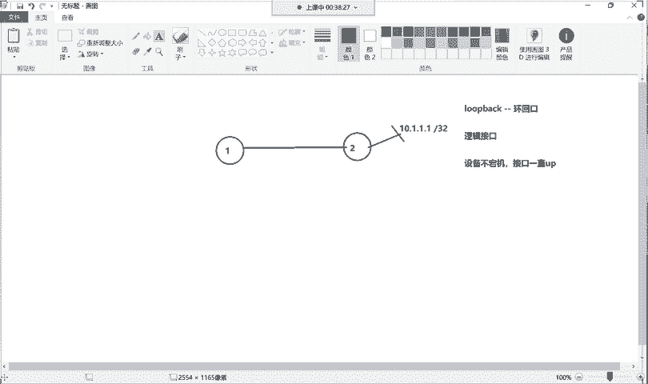

还回地址依旧叫做interface啊，不是防滑的，不是防环的，它只是翻译过来。这个lo back翻译过来叫做还回地址，仅此而已啊，它不是防滑的。怎么去进呢？我们进到设备上的lo back看好啊。

你要敲这样的一条命令interface back那默认我们会先创建一个还回口，会从零开始创建，你敲一下回车，你会发现你进到了一个 back里边你是可以给他配置IP地址的。比如说你给他配个什么呢？啊。

咱们这里边配了个啥呀？比如说给他配个10。1。1。1好，32位的页码，你是能配的上去的。呃，请告诉大家，你是能配上上去的。并且呢你以后在查询好意思啊，不是查路由表。

你以后呢在查询我们所说的接口地址的时候，你是能看到这个地址的，能够看到吗？这是你刚才在0-0接口下，我们配置的跟R一的互联地址。那么跟我们未来所说呢？我们现在配置的还回地址，这个地址你是可以配上的。

所以你什么时候呢会接到这样的杠32位呢，经常我们给还回口配地址就会用它，我说一下啊，不是大多数用测试以后呢你们在学习BGP的时候，我们BGP在某种情况下。互相指邻居的时候。

我们通常会使用我们所说环回地址来建。包括你们未来学习NPVPN那么还回口地址也是真实情况下，你就要去我们所说使用的，它并不是为了做实验的。跟大家强调一下，没有任何一个东西是为了做实验而研发出来的。

只不过呢他做实验比较好，所以咱们拿它来做实验啊，管理地址哈，这些同学们都是呃未来呢如果你们对于路由器啊，我们所说防火墙啊，给它配一个环管理地址，我们通常都用环回口的地址。因为它特点是什么呀？

它的特点是永远不当。只要你设备开机这个接口是永远不会物理层面上损坏的。因为它是一个逻辑接口，所以它会一直up起来，那保证它的一个绝对稳定性。那么在很多的配置实验，也就是包括以后你们做项目的时候。

 back接口的高稳定性，由于它一直是up的状态，会我们会经常使用到以后慢慢学大家就能理解了。好吧，所以我只是想告诉你们，什么时候。

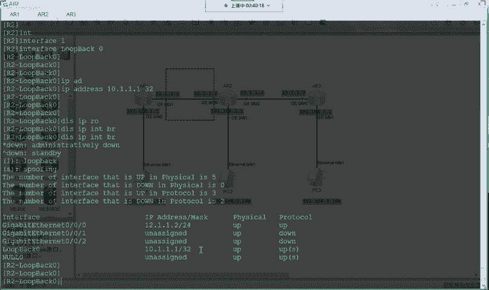

会出现后边连接了一个杠32位的，你们别觉得蒙就行。并且呢它也可以代表我现在设备上是不是有这样的一个网段信息呀啊，有这样的一个地址，有这样的一个网段信息啊，这样就行。那么我们一起来看一下。

邀请大家一起来体验一下我们下边这张图。啊，哪张图呢？我们把刚才这些复制下来，也就是这样的一块啊。好，我们把它复制一下。复制到我们现在这个图里边啊，那个S大家不用管，现在不用管。好，我们一起来填一下。

填一下什么呢？除了我们这个flex way，其他呢全部我们都一块填一下。也就相当于我跟大家先说一下前情提要是什么呀。目前呢咱们两台设备呢自己是有自己的直连直连的路由的，我给他配一个地址，比如说左边1。

1。1。130位的言码啊，咱们多练练这种奇怪的掩码，咱们别都光看24的啊，比如说右边呢是1。1。1。230位的掩码，左边呢这是我的G0-0-0口。😊，啊，0-0-0口右边呢这是我的G0-0-01口好。

这是0-0-1口，这是22的。那现在呢两台设备已经有了自己的直连了，你就相当于呢我已经把地址配上了。我现在希望在R一这个设备上，注意我说的话，形成一个关于10点1。1。1-32位的这样的一个静态路由啊。

形成一个这样的静态路由呃，那么假设我现在这个静态路由已经出现了在我的R一路由表中，那么请大家帮我还原一下这些数值好吧，也就是我们我先帮大家填充第一个，我现在在R一上查询路由表。

就你现咱虽然还没学静态怎么配，就相当于你就理解成它已经在设备上了。那它应该后边这些数值填多少，这个是很简单的。我们一起来看一下，首先呢这是一条精确的，我们称之为叫做主机路由，100点1。1点1啊，10。

1。1不好啊，不好意思，10。1。11点1啊，32位的页码好，那么请问同学们这个是多少啊？pro字段是什么？还回地址与12呃没有什么关系，没有什么关系好吧，没有什么关系。呃，我们再强调一下127。0。

0。1这个地址呢，未来大家也只会在我们所说。

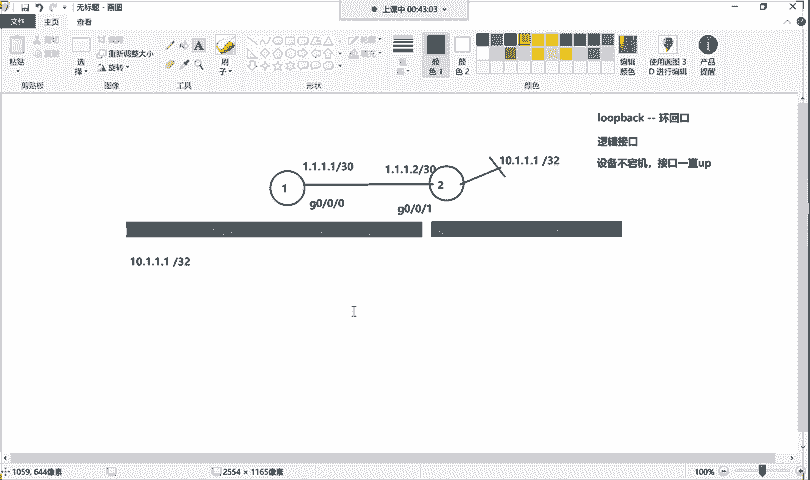

给大家看一下啊，我们所讲到呢，其实对于很多嗯怎么说呢？因为我们现在大家这样去理解吧，因为现在呢还回地址实际上是你本设备上的一个逻辑地址，所以呢这样的一个地址，如果你以它为目的地的话。

你的这个报文是不会转发出去，你路由器的本接口的。也就是你不会比如说你聘10。1。1。1从R2上聘，你是能拼通的。但是这个报文你不会发出去。那么对于这样的报文来说，我们通常作为下一跳，都是你本地啊。

是这个意思，能明白吗？但是它跟127。0。0。1并没有直接的关系。也就是它只作为我的一个本地地址出现。但是它跟我们的还回地址没有直接的关系。

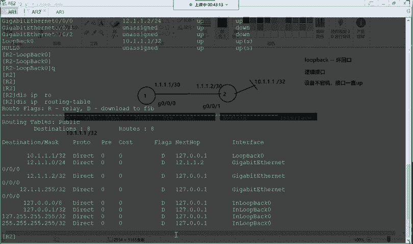

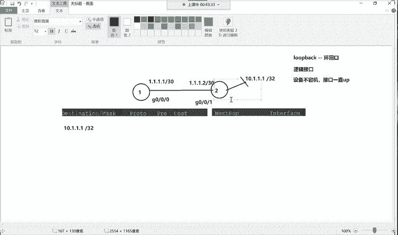

好吧，只是说呢在你本地你设备身上去聘自己身上的一个逻辑地址来说，它跟你去聘127。0。0。1其实是没有区别的。因为报文都发不出去。那么最终呢我们有还回地址。

通常是因为其他的设备要来访问你要跟你做一些连接。那么此时它才会有意义，是这样的一个意思。

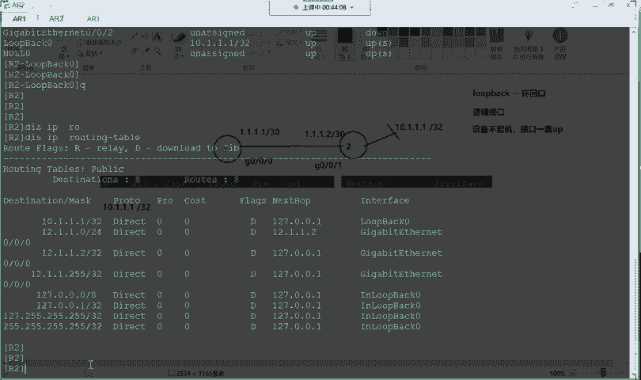

呃，好，有同学给我打出来吗？有同学我看一下啊，呃对于我们现在proto来说是静态。没错，非常好，叫做静态。往下呢我们的优先级是60好，60co值呢，co值是0好，非常好啊。然后我们下一跳是多少？吓一跳。

有同学把英文打出来了，咱还没讲t啊，非常好啊，下一跳呢是G0-0-0好，吓一跳地址呢那个刚才有一个同学写了个0nho呢吓一跳呢，吓一跳没写吓一跳是1。1。1。2非常好，1。1。1。2。

大家别觉得这些东西枯燥啊，一定要彻底理解G0-0-1吧，是吧？这是我们哦0-0-0，不好意思啊，0-0-0。😊，好，这是我们本地的出街口。所以我们现在呢就整体就填完了。对于我们现在整体填完了以后呢。

通过你们给我的回复，我我发现大家掌握的都还OK。那么我们接下来看一看下一个东西吧，这个问题就过了啊，我每次呢讲完一个点，咱们就说一下，我觉得你们掌握的可以了，咱们就赶紧过啊。因为今天内容会比较多。😊。

呃，我下边呢后方会有三台设备，前方呢有一台设备。那么彼此之间我们都会进行一个互联。等一下我会给他们分配一下地址。好，咱们假设啊这是三条路线。从我最左边来说，这个接口是1。1。1。1。1。1。1。1啊。

30位的掩码啊，其实写着挺费劲的。对于对端来说呢，是点230位的掩码。呃，那么我们二接口来说呢，它是2。1。1。1好，2。1。1。130位的掩码，右边这是2。1。1。2，咱们稍微改动一下就行。再往下呢。

这是3。3。1。1。1好，30位的页码，右边呢这是3。1。1。2。😊，点2。好，我们现在呢先把他们的互联地址给配了。配完以后呢，我们假设啊对于这三台路由器来说，他们后方都有一个网段。

比如说呢有一个网段是多少呢？192。168。1。0。啊，具体的地址咱就不写了，1。0，但是呢它是24位的页码。对于我第二台路由器后边也有一个，但它是25位的页码。对于最后方这个呢也有一个。

它是30位的页码，请大家注意它们之间的区别啊。😡，啊，首先我跟大家强调一下，这个图呢是为了等一下跟大家讲我们最长掩码匹配，也就是路由的匹配原则。我来跟大家讲的。那么实际上呢，如果你未来见到你规划的网络。

规划成我后边这样是非常失败的。但是它理论上是有可能存在的。我拿它呢跟大家讲一下我们的查表原则，仅仅如此，你们不需要去纠结啊，什么情况下会组建这样的网络。这网络组建的，当然很很差劲啊。

但是你们要知道这是我们讲知识的话呢？我们讲一些比较极端的例子，来说一下，为什么会有一个查表原则。嗯，首先呢对于左边来说，我们叫做它叫做设备。那么对于设备来说，咱们先写一下吧。比如说目的地是多少。

然后呢去往目的地我的吓一跳是多少，咱们先给它比划出来。比如说去往目的地呢，192。168。1。0的话，1。0-24位的页码，这是我们所说出现在路由表中，我们就会这样出现啊。首先我在讲这个之前。

我问一下同学们，如果现在对于我这个设备来说啊，我已经拿到了后边三个网段儿，也就是我去往1。0这三个网段信息我都拿到了，我会不会都加表啊，你们先想一下这个问题，会不会都加表啊，会的话刷个一。

这是我刚才讲过的东西，它是会的。如果后方的掩码不一致，它都会加表，这个一定要记住啊，我就不再一直强调了。所以你未来呢我们设备身上会有3条路由。那么其他的那些我就不写了，咱们直接写目的地以及吓一跳就行。

去往24位掩码的这个地址呢，我们吓一跳是1。1。1。2。😡，好，那么去往25位的呢，去往25位的，我的下一跳好像是2。1。1。2好，我们25啊，这是2。1。1。2，数字太多了。

我写的有点有点有点看的有点眼花了。好，以及到最后一个，最后一个呢，这是30位的掩码啊，30位的掩码。那么我去往这一位的下一跳呢是3。1。1。2。好，没错啊，吓一跳。我们现在呢发完了。

这是我们设备身上的路由表了。当然我只是简写了，只写了这两个地址啊，只写了这两个参数。比如说我现在来了一个数据，咱们换个颜色啊，来了个数据，来了一个数据呢，是192。168。1。2，请注意啊。

我这个数据要去访问的是1。2。好，那我现在请问同学们，你看我这个1。2来说呢？比如说我现在有一个P的报文，我这边有一个主机，我去P一下1。2，我呢现在跨广段，我是不是要找，比如说是我的网关好。

我要去来到这个数据发过来了。那我是不是要去帮你进行报文的转发呀。我一查192。168。1。2。😊，这个地址能不能跟我我路由表里有吗？好像有吧，咱们过来匹配匹配。但是你一看我后边是不是非常多关于1。

2的呀，我是不是好像都能匹配上啊。在我们之前讲两台设备如何互通的时候，我们有一个我们所说有一个原则。也就是我会在本地呢拿我自己的掩码加上对方的IP得出一个网络号，跟我自己的网络号进行匹配，看看呢。

他们俩是否一致。对于路由器来说也是这样的，我现在呢我这台路由器要去往的是192。168。1。2的地址。那么我就会把它跟我本地所有匹配的这些路由的掩码全部提取出来进行一次计算。

叫什么叫做提取出来进行一次计算呀？我一看你现在这个是一。2，对吧？那么我现在有3条都能跟你匹配上，但是我这三条路由只有掩码不一致。那么现在我就会把这三个掩码都提取出来，跟你这样的一个地址进行一次运算。

算一算你现在是属于哪个网段的。那么你会发现，无论我跟谁计算，我得出的都是192。168。1。0。没错吧。哦，也就是我现在的网络号肯定是192。168。1。0，只不过后端的掩码是不一致的。

所以呢你会发现既然是1。03条，我都能匹配上。你会注意啊，三条都能匹配上。也就是我本地有3条关于理论上可以到达1。2的路由。那么我究竟信哪一个呢？因为这三条路由的下一跳不一致啊。

那我怎么知道我究竟应该选哪一个呢？我们呢实际上会都进行匹配，也就是它实际上跟我们三条路由都匹配了，咱们叫最长掩码匹配，实际上它都能匹配上，只不过在进行转发的时候，它会选择掩码最长的这一位。

大家知道为什么吗？因为掩码最长代表什么呀？同学们咱们复习一下掩码最长，代表我现在网络位长吧，对吧？我的网络位是不是更长啊，那是不是代表我的主机位更短啊，是不是代表我主机位里边包含的主机数量更少啊。

那么主机数量少，也就是我唯一定位到192。168。1。2这样的一个精确的地址，它的范围更小是。不是更精确呀。所以如果当未来呢你发现我涵盖的网段中呢，主机数量太多了。那么通常它是一个比较宽泛的概念。

你看这个杠30位的，它里边一共理论上就几台主机呀，可用的就两个地址。那么如果现在我能够精确的跟你进行匹配，我一定匹配最长的这个。如果三个我都匹配的上的话，我会匹配最长的一个代表后方最多最大的可能性。

快速的精确的定位到你这台地址。所以呢没错，非常好，是越精确，是这个意思。所以呢我们这个叫做什么呢？这个叫做路由的查表。叫做路由的查表。对于路由查表来说，我们叫做六个字最长掩码匹配。

这就是为什么有最长页码匹配了。也就是呃大家应该看到这个词，你就应该反推回去。那也就是对于同样的一个去往目的地网段路由来说啊，它掩码如果不一致，都会加表的。如果他们不加表，就不会有最长页码匹配了。

是这个含含义，咱们翻过来倒过去，你们都是应该要去理解的。呃，那么也就是在路由查表的时候，咱们把这个匹配原则写清楚啊。如果本地呢，我如果有多个匹配的路由。多个可以匹配的路由的时候。那么现在呢不是路由啊。

是路由。我本地可以有多个匹配的路由的时候，我现在呢会按照。会按照什么呀？掩码最长的进行转发，我会按照掩码最长的进行转发。所以也就是我路由器收到数据以后呢，我会根据我现在说的这句话，我课下再总结。

我就不在课上写了，因为比较长啊，也就是当我未来这个路由器呢收到了一个数据。好，稍等我要画一下，当我现在这个路由器呢收到了一个数据。那么我现在会根据这个数据的目的IP地址。

在我本地的这个路由表中进行一个相与的动作，咱们叫做相与，实际上就是跟他们同时进行一个与运算，咱就别与运算了，跟他们同时进行一次计算。跟每一个呢都算算，拿我自己本地的掩码跟这样的一个地址呢算一算。

看跟我的网络号能不能匹配上啊。那如果得到了网络地址以后，我会提取所有的跟我现在路由中有相同的，我们所说网络地址的这样的一条路由。那么我现在一提取发现三个都相同。那么我会在这三个里边寻找。

导出掩码最长的这个进行转发，转发到哪，转发到下一跳是3。1。1。2这样的地址上。所以呢这是我们这个图跟大家讲最长掩码匹配。好，那现在呢我们又有一个新的问题了。比如说呢我现在这个设备上。

我们接下来要写一条比较特殊的路由，那么在写之前我想请问同学们还是否记得这样的一个地址啊，还记得吗？如果记得可以给我刷个一，比如说呢0-0-0-0，然后后续呢掩码为0之前讲IP地址，我们讲的是什么呀？

讲特殊地址的时候跟大家提过，这个东西呢叫做默认我们叫做默认对吧？这个叫做一个0。0。0，未来我们叫做默认路由，那什么叫做默认路由啊，也就是如果此时对于一条路由来说，咱们当时我看一下啊。

咱们看一下IP地址，对于当时来说我应该讲。嗯，在这嘛啊哎在这儿也就是在路由层面指我们全网所有地址，但当时没有告诉大家叫默认路由，只是说了一下这个啊，那么我没说，我还以为我说过了，那我在这说一下吧。

对于0。0。0。0，我们掩码为0这样的一条路由来说，我们叫做默认路由。它还有一个别名叫做缺省路由。在我们整个网络中来说呢？你以后见到缺省，它就是指默认的意思，只不过是翻译的问题，我们会这样翻译。

那么我们写一下它的概念啊，如果说未来我们一条路由，如果一条路由，它的目的地注意和掩码全部为零，注意全部为0。那么则代表这是一条默认路由，这是一条默认路由，或者说叫做缺省路由。

那么它是可以匹配所有的IP地址的。注意啊，这才是一句精髓，它是可以匹配所有IP地址的啊，你说老师这是什么意思，什么叫做匹配所有IP地址呢。好，那就相当。关于我现在这个设备上啊，我现在有这样的一条路由。

那对于这样的一条路由来说，比如我的下一跳，我写在这儿吧。好，我写一跳写在这儿啊。也就是未来呢你看我现在这里又有一个了，这个地址呢是4。1。1。1。写多了，写长了4。1。1。1一怎么写不上呢？

杠30位的页码。对于我对端来说呢，这是一个说少啊？4。1。1。2-30位的页码。好，那么我未来可能这里边呢连接个什么呢？连接个运营商啊啥的。总之呢我现在可能未来呢去哪儿，反正我都能访问这儿。

那所以我现在设备上呢有这样的一条路由，0。0。0。0，然后呢，我未来去往任意的地址，吓一跳呢，都走哪走4。1。1。2。好，这没问题吧，以后我想去哪儿呢？我先走一下这个地址，那我想请问同学们一个问题。

那现在如果来了这样的一个路由。看好啊，我来了1个192点168。1。2。好，那么请问同学们我会不会匹配上这样的一条路由，然后从这儿转发出去啊，来想一下这个问题，同学们认为会的话，可以给我刷个一。

认为不会可以给我刷个2会好，应该不会，有同学认为不会有同学认为会好，那么好。😊，他认为不会，那他是不会的。注意啊，我刚才这句话呢，其实没写完，我只是想看看大家是怎么理解的。请注意啊。

我们如果作为一条默认路由来说啊，如果作为这条路由，默认路由，你会注意它的掩码是零掩码是零是个什么概念呢？代表什么呀？代表我全部是不是都不确定啊，能明白吗？全部都不确定。

那也就是说呢你未来所有的都匹配不上的时候再来匹配我吗？大家想一想我什么叫做最长掩码匹配。也就是代表我掩码最长越精确吧。那你看现在你是一个点零代表你非常不精确吧。

那么对于我们在数据进行匹配转发匹配的时候啊，如果作为一条路由来说，你这条路由，也就是我们默认路由，该路由的掩码为零，这是什么概念啊？代表它呢则为匹配顺序最劣的路由，我们叫做劣式最劣的路由。

也就是如果本地没有路由可以匹配的时候，你才会去考虑它。可以匹配时，我才会去考虑默认路由，才考虑它。好。😊，才啊才考虑它，这是我们所说默认路由它的一个概念。讲到这儿，大家能理解吗？才会考虑要匹配一下它。

所以如果未来数据到了我们设备上了，我能够跟其他的匹配上，我是不会匹配0。0的，能明白吗？如果现在对于我前面来说，设备上哪儿都不认识，只有个0。0，我才会匹配它。

或者说呢现在来了一个这样的设备来了这样的一个数据啊，比如说我去往123。1。1。1好，那同学们请问我这个数据能转发吗？先问能转发吗？这数据到了设备上能转发吗？嗯，11。2这台主机接到了2。1。

后面它还能并通吗？什么意思？没明白这台主机接到了2。1。1。2，后边还能并通吗？呃，我们现在只讲关于路由的。同学们就假设现在网络整体都是联通的，你不需要考虑后边是不是做了什么配置了，导致它不通的问题。

咱们现在就导就是说现在所有的配置已经在你设备上了。我们现在只讲匹配，那么在你查表之前。有的表象添加所有的网络我们默认都是通的，不然的话没法讲，能明白吗？啊，没错，默认就是优先级最低。

所以你会发现它是能够能够可以转发，不一定咱不讨论可达的问题。同学们，我们现在只问它能不能把这个数据发出去，发到下一跳这个设备上。至于它究竟能不能可达，不是我们今天关心的事情。

我们只是讲当数据呢发到设备这，我看一看我本地是否有匹配的路由啊，查一查吧，你现在这个123，我知道怎么去吗？我本地现在知道192点168点1。0242530这三个怎么去，我是知道的，好像不知道123。

11。1好，那我看一看本地有没有默认吧，既然这种代表比较精确的路由匹配不上你了。如果我本地恰好配置了默认路由，那么你就跟我的默认路由匹配一下，然后发出去试试吧，是这个意思。能明白吗？

所以现在如果发送了目的地为123，那么它是会跟我们的默认路由匹配上的。好，那么对于我们192点168。1。2，它是会跟我们现在。😊，在192。168。1。030位的页码匹配上的那咱们再来练两个。

念两个啊呃，假设啊192。168。1。130。好，同学们，请问我现在能匹配上哪个地址，来，咱们试一下这个。能匹配上哪个？这是1234，从上到下，分别是12341。1。1。2。好，有没有其他的意见啊？

同学们有没有其他的答案？我现在能匹配上谁呀？😊，杠24的好，没错，非常好，-24的。因为什么呀？开头是130代表什么呀？代表我第一位肯定取值了吧，是不是代表我第一位肯定要取值了？也就是为什么？

因为我我现在咱们来口算一下啊，我现在后8位来说呢，最大我们后八位能代表255。那么第一位是128，后7位最大也就能够代表127，我现在标到130了，是不是代表我现在后8位的第一位一定取值为一了。

一定取值为一，那是不是说明我们现在野码是不是我们所说应该是更大一些的呀？因为它现在是不是一个主机位了啊，没错，下边是俩不够的啊？那比如说咱们再来一个，比如说192。168。1。4，这个我会匹配上哪个呀？

😊，快速的算一下，192。168。1。4，25的没错，非常好。为什么？为什么？因为我现在很明显，30的匹配不上，我们所说25跟40都行，但是因为25的页码更长，所以我跟25匹配上了。

所以这是我们所说未来呢来到了不同的数据，它会进行不同的转发，它们互相之间是不冲突的。😡，行吧，这是我们以上的这部分，咱们先来进行一个小的总结吧。总结我就口述了，我就不打出来了。也就是路由加表的时候。

如果现在多条路由，比如说呢现在很多条路由啊，这么多条，我都想进到我的路由表里。那么我是不是要进行一次比较啊，我比较的目的就是想要知道这些路由是不是都能出现在表中。那像之前我跟大家举的第一个例子来说。

举的第一个例子，比如说左边有一条静态，右边呢有一条直连啊，左边是直连，右边是静态，对吧？那个时候讲的都是杠30位的掩码，但是呢我们所说掩码网络网络地址也一样，掩码也一致，网络地址一样，掩码也一致。

那么在这种情况下，我们会去比较优先级，由于静态是零，我由于我们所说直连是零静态是60。那么在我们所说网络地址和掩码都一致的情况下，我们会比较优先级，由于它不优，所以我们不会把它出现在表象中。😊。

但是反之，如果我们的网络地址一致，但是我们后缀的掩码不同，比如说它是30，我呢却是25。那现在我两个都会加表。因为未来有可能来了一个新的数据，它匹配不到-30位的这样的一个路由而能匹配到25。

你是不能够放弃掉右边的这个路由的。所以就像我们现在画的这张图中来说，它都会出现。那么出现了以后呢，我未来查表的时候会基于目的地跟我本地的路由条目的掩码进行与运算。如果得出网络地址相同。

那么我会从这多条路由中选举掩码最长的那一条匹配上，然后转发出去。这是我们的路由加表和呃咋算的，25，那哪个咋算呢？您说我画的这个图吗？这个吗？这是我随便说的，同学们随便说的，也就是你只要跟30不一样。

你甭管242526272829，你都是要加进去的，能明白吗？这不是计算的，这是我随口说的这多少都是可以的。只要你跟他是不一致的，我们都是需要进行加表的。你问的是这个问题吗？如果是别的，你再问一下，行吧？

😡，现在53分了，咱们来写咱们来做一个小实验，做完咱们就休息一会儿。呃，咱们今天来看个环路吧。同学们看一个环路吧。既然讲完默认路由了，那么之前讲到呃之前应该是讲到我们路由转发的时候。

不是讲路由讲到三层的时候，我跟大家强调了一个东西叫做TTL值，你们还记得否还记得吧？TTL值，我说的当时对于设备来说，可能不同设备默认TTL不一样，有255的有128的对吧？啊，不一样。

那么什么情况下会有TTL，你会看到它有环路呢，我当时应该没记错的话，给你们画了一个这样的图，对吧？我说的在我们左边这个设备上查表，你发现去往目的地呢这样走，然后右边发现它要这样走，然后呢一路这样成环。

对吧？我当时跟大家说了，环路呢极有可能在我们配置默认路由。如果你是瞎配的话，极有可能出现。我们今天来看一看啊，那如何配呢？那配置默认路由，咱们就要讲到静态路由的配置了。

那咱们一块来看一下静态路由的配置方。😊。

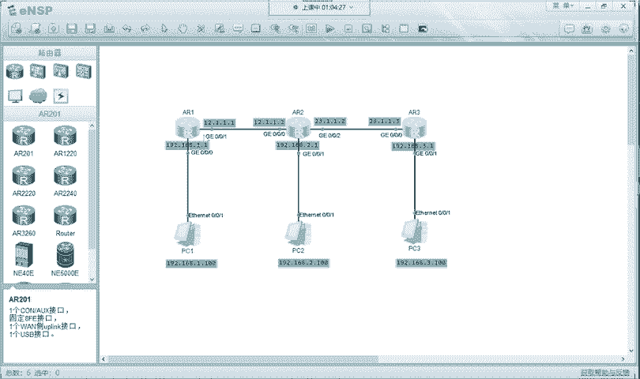

方法啊，比如说静态路由如何去配呢？它叫做IP，然后呢root。Root。哎，我怎么打不出来这个O呢？root static。呃，我们IProot static后缀呢加上我们的目的网目的网络。

加上目的网络的掩码，加上下一跳的地址。比如说现在呢我在R一上写一条默认路由。这个问题就是全网只默认这个是不是数据就能全网通了。咱们呢今天来看一个环路给大家表示一下啊。

比如说我现在希望呢R一未来去往所有的地址，所有所有的目的网段都把数据给R2，也就是下一跳都写12。1。1。212。1。1。2。

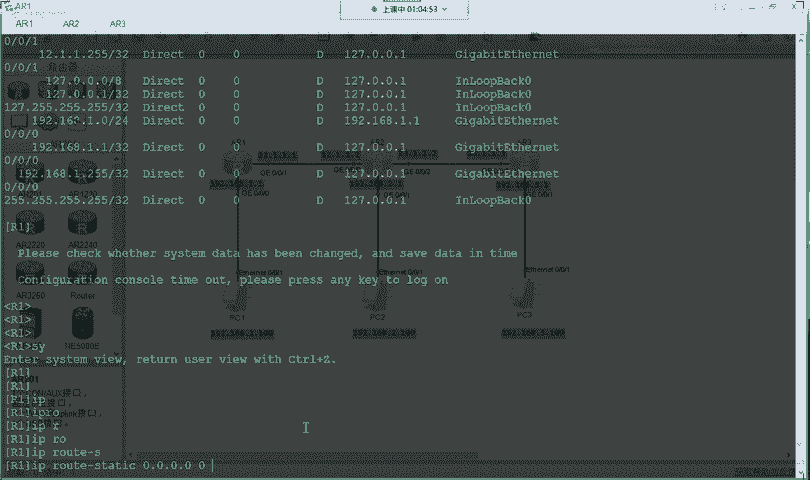

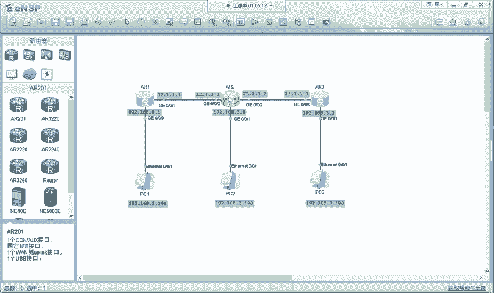

唉，不好意思啊，点2好配成自己的了。好，那么我们查看一下R一的路由表，你会发现现在我是不是出现了一条0。0。0。0啊，这样的一条默认，这有一个tatic，这就是我们静态，它的一个英文，这就是静态，好吧。

这就是静态优先级是60，这刚才强调过了，下一跳是12。1。1。2。好，那么我们在R2上呢也写一个写一个什么呢？我未来去往任意目的地啊，下一跳都是R1好，所以我们打开R2。

打开R2呢在R2上也做一些相应的配置。😊。

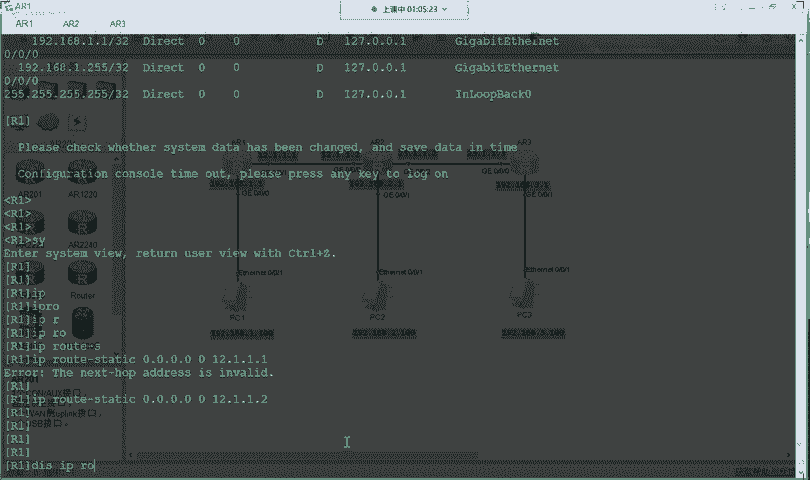

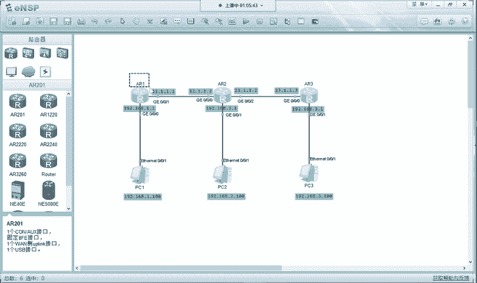

好，那么我们要写IProot static。比如说呢去往0。0。0。0，页码是0，下一跳都是12。1。1。1。当我们配完了以后呢，查看一下路由表diplay table。我们看一下。

我现在也出现了一条静态路由，吓一跳呢，去往任意目的地，下一跳都是R1的1点12点1点11接口，也就是现在呢我们相当于呢两台设备上互相指了个默认。因为这是之前有个同学问我的问题。

说老师网络中所有设备如果都写默认，是不是大家就都通了呀，去往哪儿，我们互相不都通了嘛？因为你去往哪，我都能匹配上，是不是都全通了。咱们来看一下，咱们就别全网全做默认了。

咱们就只在他们两个做未来R一去往任意地方都给R2R2去往任意地方也都可以给R1，那就相当于我们未来来的任何数据，你看啊，不管你来的一个去往123。1。

1点1的去往我们所说的192点168点1点几的去往呢30点几点几点几的，我是不是都能匹配上转发出去啊。总之我都给R2了。那未来数据到了R2这，我也可以都转出去嘛，给R1，你看它能通嘛。

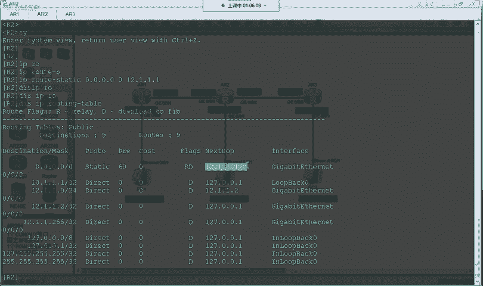

好，那么在我们验证能通与否的之前呢，我们首先呢。在我们数据这儿进行一个抓包，在我们这里吧，直接抓0-0-1啊，在这里抓个包，咱们来看一下。好，吓一跳写掩码了，同学们写掩码了，这不是写了个零吗，看得到吗？

0。0。0。0空格这有个零，是不是离得太近了，看不见啊，这是吓一跳。😊。

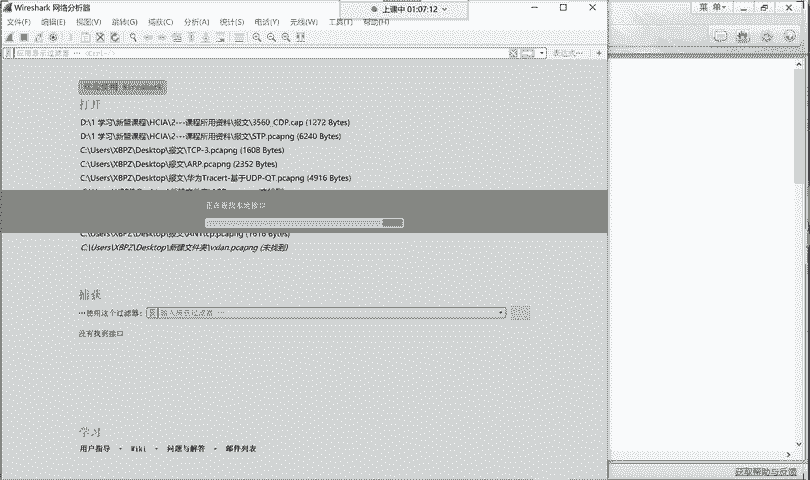

然后呢啊你说吓一跳不需要写吓一跳，不用写验码，吓一跳不用写验码。通常我们配置的吓一跳都会跟你就跟你是你的直连的吓一跳。所以呢不需要配掩码，能明白吗？不需要配掩码。嗯，你说的是这个咱们来看一下。

我这个报文呢是在现在这个接口下抓的。那么我们现在来聘一个地址，我刚才说了，我们验证呢是希望如果我写了默认，我希望呢未来去往任意目的地都能通，咱现在瞎聘一个地址，比如说我拼个多少呢？

我拼一个呃想一个比较离谱一些的啊，大家没见过的，比如说呢我去拼一个地址，想一下聘个拼个多少比较好呢？你们觉得聘个多少比较好啊。同学们，比如说我聘个34。5。6。7吧，这个怎么样，我们聘一下这样的地址。

好，我们来看一下，我我这个不好吗？我想聘个奇怪一些的，聘多少都行，1点1点1，咱们先来我这个吧，5。6。7怎么样，我们先聘一下这个地址，那么我们看一下，我们现在整体报文是。

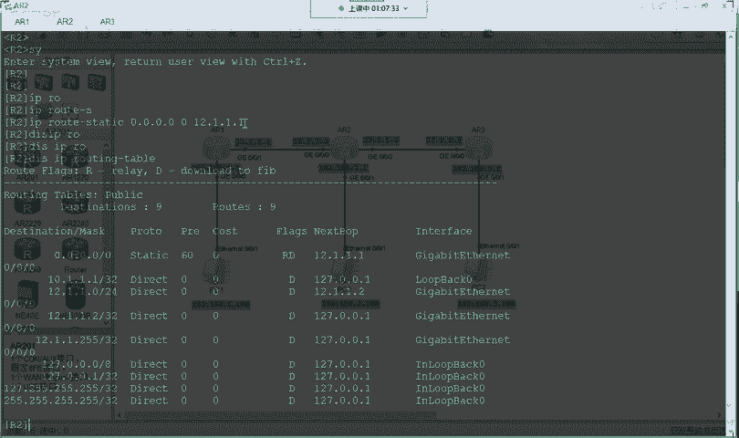

怎么样的？好吧，我们RE设备的右接口豹纹是怎么样的？我们来拼出去啊。好，我们来看一下。好，你会发现是不是非常多很多东西啊，你看它一直在往下弹，好，马上就弹完了。好，非常多啊。😊，结束了，看得到吗？

同学们，我只是拼了一下，你看到他发了多少报文吗？看到了吗？😡，看得到吗？同学们。😡，他发了如此多的报文，我只是在网络中，由于只用了一个简单的，我们发了一次SMP的报文。你认为只是简单的聘了一个地址。

我却发了多少个包啊？我们可以一起来看一下，对于我们最后的这个报文中来说，大家可以看到它的名字叫做什么？这叫啥？这是不是一个超时的报文啊，那么对于这样的一个超时报文来说，大家还记不记得我们之前讲到的。

对于它来说，我们这里会不会有一个在这里啊，我们会不会有一个tab值和code值啊，这俩大家还记得吗？我当时跟大家说的当我们网络中的TTL值解为零的时候，我们现在这个设备是不是要给源端回复一个TTL超时。

其中t为1一code为0这个值呢课件里是不是没有但是当时我跟大家补充了，你们还有印象吗？这个就是这个值啊1一0那么他一共回了几次呢，回了5次，咱们一起来数一数，这是第一个啊，网上我说过啊。

那你就是没认真听，我一定说过这是第二个再往上翻。😊。

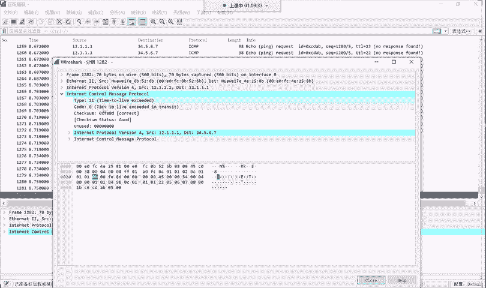

会有第三个，第三个再往上是第4个，一共是5个。为什么？因为一共发了5组SMP的报文，所以这第四个这第5个。好，那么第五个在网上就不可能会有超时回复了。那咱们来研究一下TTL吧，看这个位置啊。看这个位置。

看这个位置的TTL值，其他的就不用看TTL从刚开始的255往外发，你会发现我们所说的它是不是一直要往下发呀？一直往下发了多少呢？从255一直转转转，一直最终呢到多少到一到一了以后。

当我下一次设备在收到的时候，我本地捡完了之后为零给源端回复超时。所以呢你发送了一次我们所说一次p的报文。那实际上它在网络中转转转转完了以后超时，你发了几组呀，是不是发了5组啊，所以回复你5个超时信息。

零的当然发不出来了，零在你本地减完，你就向源端回复超时信息了。所以你会看到这就是环路，它所带来的影响。一旦你网络中产生了环路。但是你却不知道你在P的时候，你认为你只是敲了一下回车。

但是网络中已经上千个报文发送出去了，这是多么大的，我们所说的一个数据转发量啊，所以一个环路对于我们的一个网络，它是非常灾难性的，尤其当你的网络规模非常大的时候。

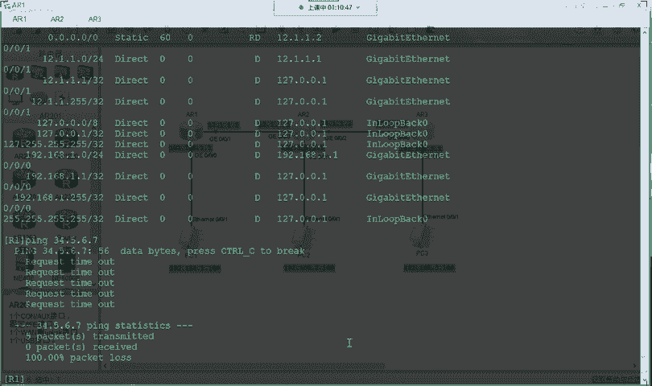

你的环路影响的辐射范围会很大。对于你每个设备来说呢，它整体的处理性能都会要我们所说处理性能都会要占用很多，尤其是你这个环路没有办法及时得到解决的情况下，它是非常非常复杂的。

所以这是我们讲的在三层中的一个环路。未来我们讲到交换的时候，我们还会讲二层的环路，它跟我们三层是不一样不一样的。三层呢是因为我们路由表中，由于你路由表配置出现了问题，请大家一定要注意啊。

是因为你作为工程师，你进行了错误的配置，导致路由表中的路由指向出现了问题，才会导致数据一直在网络中循环的转发，找不到目的地，是因为你配错了。直到我们最终TTL值耗尽这样的一个过程，我们叫做三层环路。

所以之前跟大家所说呢，对于TTL来说呢，网络中它是可以终止环路的，但它无法消除环路，也就是无法破环。只能呢等到TTL耗尽，它自动这个环路没有。但当你下一次再去发送同样的豹纹，它还是要去进行环路。

它还是要周而复始的，一直去环路的。所以呢我们所说TTL从255到TTL值为零，这是一个环路报纹环路的周期，这是它的一个生存时间，我们叫做周期。

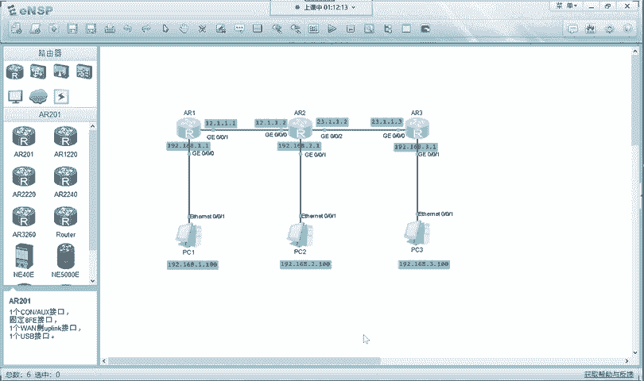

呃，行，那么我们这个跟大家演示完，咱们就把这些给删了。因为这个东西没用啊，这东西如果写上呢会影响我们接下来，咱们练习一下这条命令，如何取消刚才配置的这条静态呢，我们是需要写完的之前呢我跟大家说到。

比如说呢我之前跟大家说到一点。我说IP地址。如果你想修改或者说呢你要取消的时候，你只需要在接口下 address就行了，对吧？你不需要在这个接口下，比如说你配了个1。1。1。1的地址。

你不需要在接口下ip address1。1。1。1加上掩码，为什么？因为你这个接口下本身就配了一个地址，你把地址取消就行。但是对于静态不一样，你必须要写完，知道为什么吗？因为对于静态来说。

你配完了我们所说目的网络目的地掩码，你必须把下一跳标明，因为我们所说对于这样的一条目的地掩码相同，你的下一跳是可以不同的。所以如果你不写完，它是无法精准的知道你要取消什么的，所以这是你需要写完。

那对于设备来说，你就是。😊，写完这样的一条，他会弹一些log。那么我们再来检查一下路由表啊，确保刚才那一条已经不存在了。好，已经没有0。0了。对于RR来说呢也是一样的。好，那么我们所说呢，对于这样的。

我们以后你们写命令，你也是可以复制粘贴的啊，我不推荐大家这样，但是因为我懒好吧，我懒，所以呢在这里你可以把它粘过来，然后你就取消了。我们在这里呢也检查一下路由表已经没有我们的这条默认路由了。好。

这是我们上半节课差不多就讲到这儿啊。同学们呃，并且呢跟大家说一下，为什么大家说现在的路由路由器都能防滑。刚才有一个人说有一个同学说呢，设备都能防滑。

是因为我们现在我们设备上呢呃我们所说基本上我们面向一个稍微大型一些的网络，通常我们现在对于静态路由的配置量不是特别大。呃，比如说一些小型的公司，可能我们就一条一条指静态了。对于一些中大型的公司。

我们会跑动态路由协议。那么偶尔指几条静态，作为一个辅助作用。比如说你想影响一下。😊，路啊，出口纸条默认啊，那么它对于我们整体网络中来说不太容易出环，是这个概念。当然了。

但是你们未来去学习到IP的OSPF，你们在学多区域的时候，你们还会学到环路的问题，还会学到环路的问题。所以呢只不过我们作为动态路由协议来说，你按照规矩去部署，那么它都是不会出环，不会出环的。

因为协议本身能自动防环。无论是以后学到OSPF区域区域内呀预接啊，它都有防滑机制。嗯，但是如果你想呢搞一些骚操作，它还是会出现环路的。嗯，所以以后吧到了IP你们首先学路由的话呢，嗯这这个知识呢挺多的。

慢慢来吧。啊，没错，可以配多条。面向一些小型企业，你就两三台设备，你没必要运行个动态路由协议，你指两条静态就行了，也很简单。

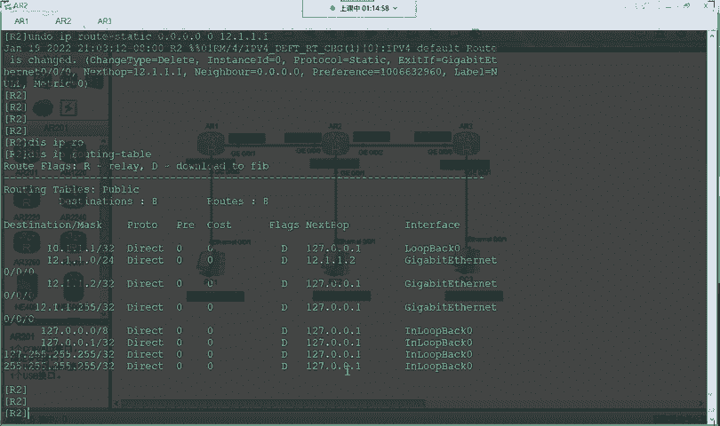

行，咱们稍微休息一会儿吧。同学们，咱们一会儿回来呢，就要讲这个图了。今天我们要讲这个图的目的就是全网做通，也就是PC123互相能并通。那么也是留给你们的作业。咱们一会儿回来呢，讲下边这一点。

咱们前半节课讲的都是概念，后半节课就看看配置。好吧，稍微休息一会儿啊，我把这个呃我的那个倒计时打开，我觉得还挺挺好的。课下又有几个同学给我发了几个别的，但是但是就不用了，因为我有一个了，我是一个比较好。

我们尝试一下啊，好，开始了。😊。

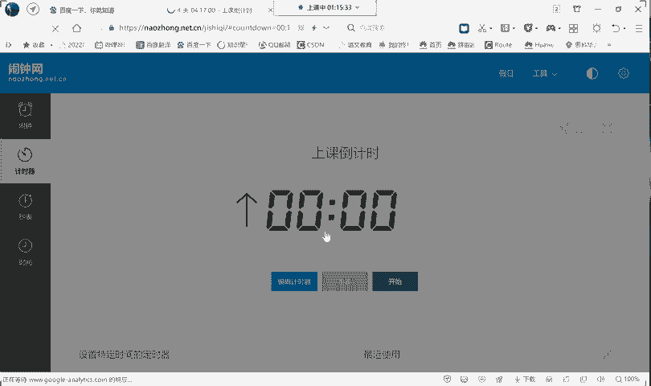

开始好，咱们休息一会儿。行，咱们接着刚才的说啊，上课了，别聊了别聊了，回回神啊。行，咱们接下来呢就开始讲我们今天正式进到我们今天的主要的部分了。进到我们今天直连我们静态路由的一些配置了。嗯。

上节课呢咱们讲了路由表，直连路由，今天也回顾了一下直连路由呢是根据我们现在接口的状态自动形成的一种路由。那么它是不需要你进行配置的。你会发现接口配了地址，只要接口up配的地址，我就会有相应的直连。嗯。

那么我们刚才呢对于设备来说，我们进行了一些简单的配置。呃，但是我们没有给R2的设备，我说一下没有给R2的右接口以及R3的接口配置地址，也就是R2的呃这个网段，这个网段这个网段，所有的地址都没配。

所以咱们先把地址配一下。对R2来说呢，刚才我们配了个环回口，咱们那个就不删了。进到我们跟PC连接的接口下，我们给它配置一个地址，1921682。

124位的页码之后呢进到跟R3的互联接口下是二接口二接口下呢配置1个IP地址是多少？23。1。1。2。

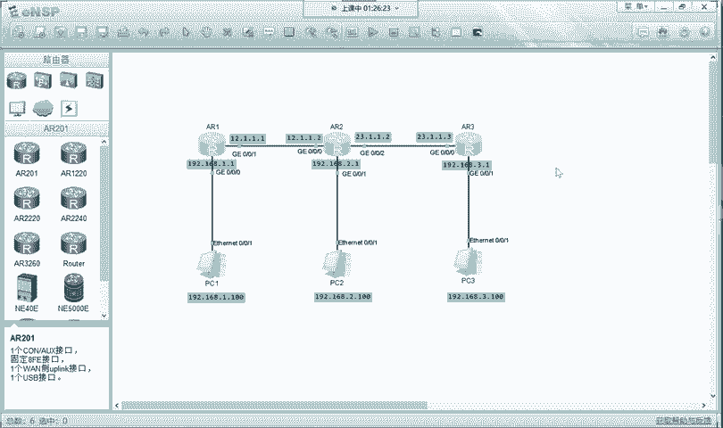

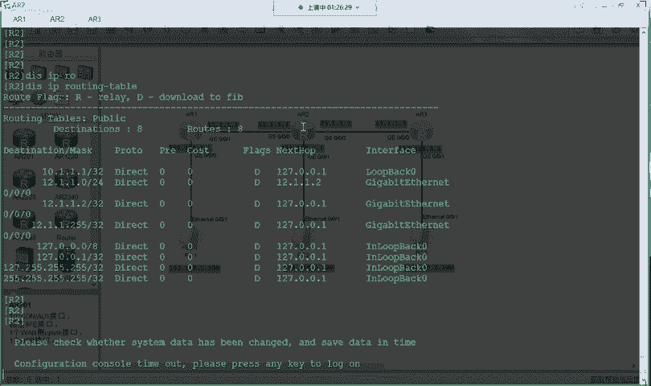

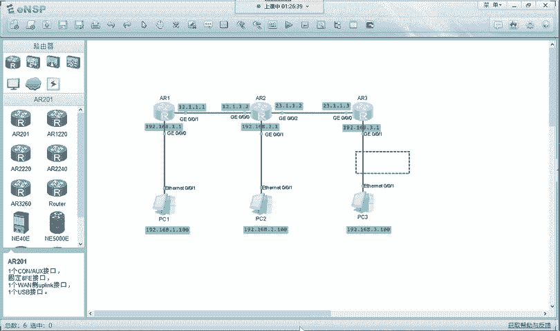

这是我跟大家说的一些基本的地址配置的方式啊，23也一样，R3我们也是要配两个地址。首先呢0-0。配的地址是多少呢？23。1。1点3。以后呢进到我们的0-0-1，也就是跟PC的互联地址下。

配上我们PC的网关192。168。3。1。没错吧，24位的野码呃，我们来看一下啊好，我们来简首先来看一下。啊，我我这个空格键呢，我发现我现在整体我这个键盘不是特别好用了。好，我们现在已经配完了。

配完了以后呢，首先我们要测试一下直连通不通。从R3上我们去拼一下23。1。1。2跟R2看通不通。然后呢，在R2上咱们也去拼一下12。1。1。1，看跟R一通不通。通常来说咱们都是通的。呃，我逻辑的。

我这是笔记本电脑上自带的键盘。同学们自带的键盘啊，我没有外接。😊。

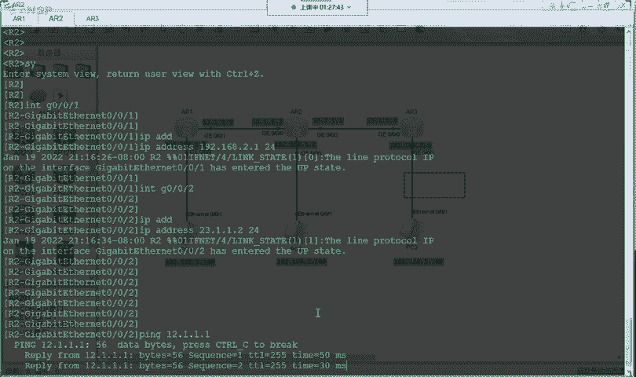

咱们来看一下，现在呢我们已经这些设备，他们两个互相能并通，他们两个互相能并通。那么我们PC跟网关咱就先不说了，肯定是能通的。咱们虽然不做测试，但按理来说呢，我应该也没配错，等一会儿配错的话，咱再看吧啊。

咱节省点时间，我们不验证了我现在想问大家一个问题，PC呢，我现在去聘R一肯定是能通的。那我现在如果PC想去往我们23。1。1。0网段，请问我呢如果紧基于咱们目前这个网络状态下，我们只配了直连路由，对吧？

那么我能实现吗？同学们我能实现吗？呃，认为能的话可以给我刷个一，认为不能的话，可以给我刷个2。也就是对于我们现在R一设备上实现不了。因为大家其实已经尝试过了，对吧？我们在R一上看一下路由表，R一上。

现在呢所有的路由全部来自于直连。那么能不能咱们直接测试吧。PC1，我现在想去聘。比如说呢我想去聘谁呢？我去聘一下R3的左接口23。1。1。3啊，我们看通一通。😊。

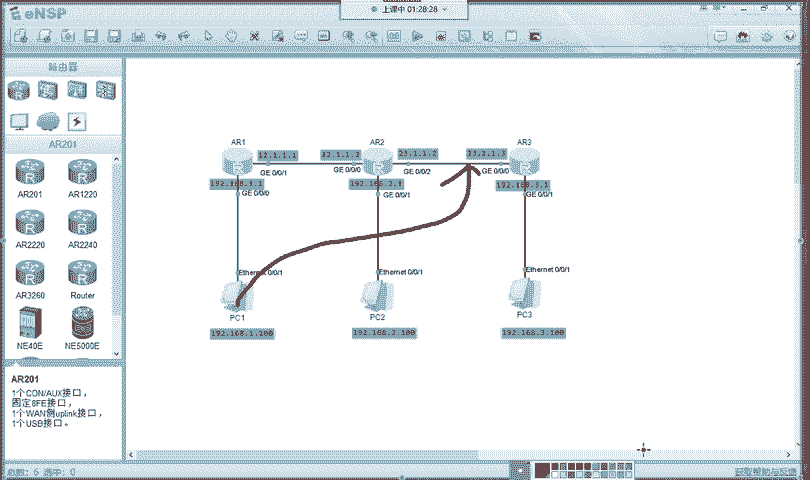

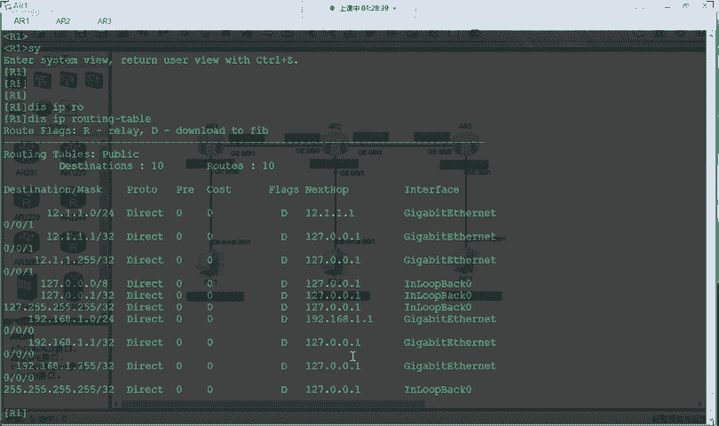

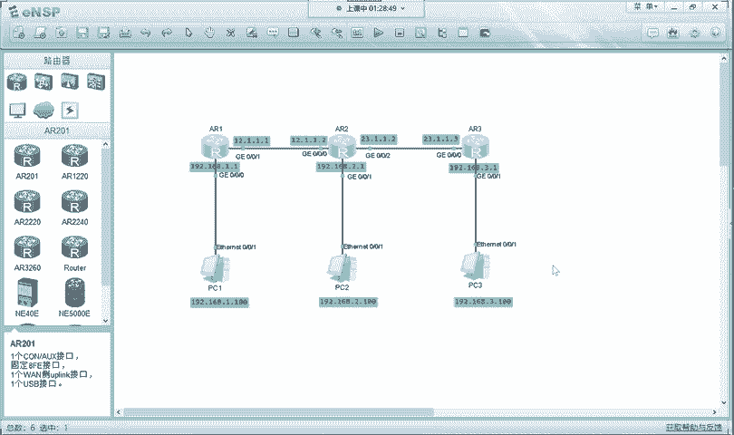

啊23点23点1。1。3，我们好像是不通的，看到吗？好像是不通的吧啊，请求超时了，我不通。那你会发现单靠直连路由，现在我们没有办法实现PC呢能够访问到除了网关以外的设备，它是访问不了的啊。但是我们所说。

对于我们现在所说未来这个网段，这个网段以及这个网段，它是访问不了的，所以你会发现对于路由器来说呢，能对数据进行转发，我需要有去网目的网段的路由，对吧？那现在数据既然交到了网关上一2网段，我能去。

那么我也只能够访问到R2了。但是对于R2回包的时候，它都回不了，大家知道为什么吗？因为我们R2也没有对端的路由，所以相当于现在PC1呢，它其实是哪也去不了的。现在呢大家就会发现。

这就是我们直连路由的局限性了。对于直连路由来说呢，它是无法进行我们非直连的通信的。也就是除非你这个设备一根线跟我直接连着，咱俩能够互相通信。

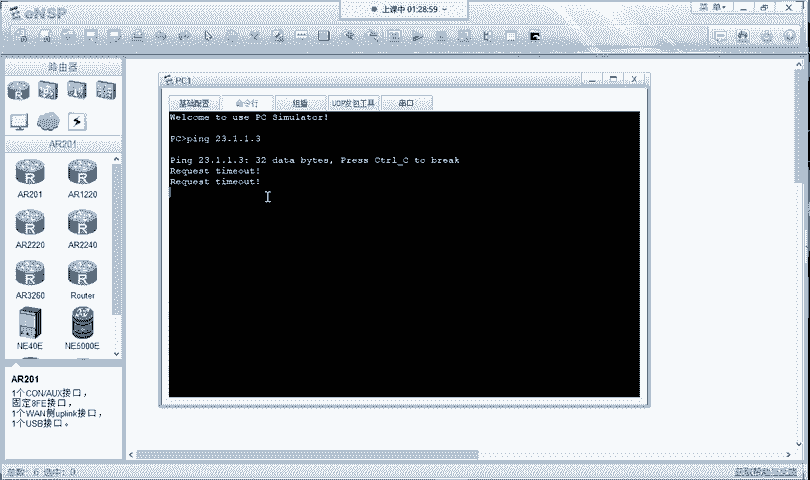

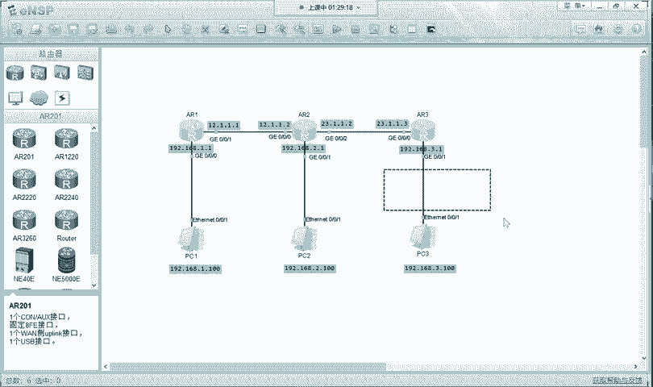

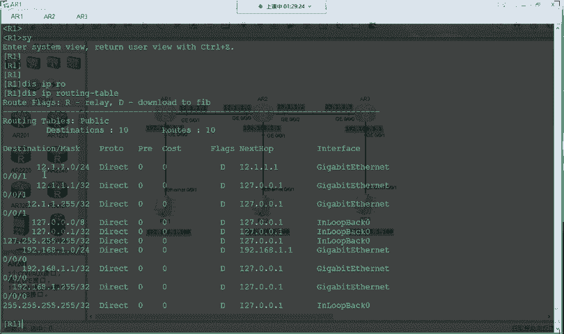

一旦中间介入了其他设备，我们就没法直接通了。那你说没有路由怎么办呢？咱就配一个呗。因为直连路由呢是自动的。那么我们工程师呢除了配地址，你什么都不做，但现在呢作为我们静态路由来说，就需要我们进行配置了。

那么对于静态来说呢，也是我们作为工程师，大家学习的第一条算是比较有意义的命令了。除了配IP地址以外，这是我们工程师你去人为配置的，这是需要你去配的。那么对于我们所说直联路由怎么配啊。

其实刚才跟大家演示过了。那么大家其实首先要知道，对于我们数据转发来说，关键的参数有哪几个呀，也就是有哪些参数，你是必须要手动写上的，咱们来可以看一看，对于单条路由来说，首先最重要的就是你要去哪。

这是肯定的吧。你未来想要去哪儿啊，这是首先你要去写的。其次，你要去的这个地方，我未来从哪儿到啊，也就是下一跳是你必须要写的。这是我们非常关键的参数。那在你。

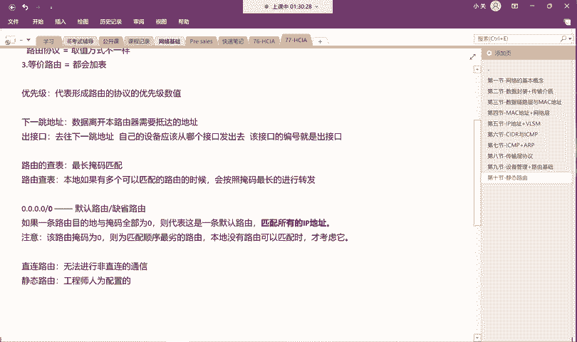

指定了吓一跳以后，出街口的地址会在本地自动生成。等一下我们一起来看一下。也就是对于我们写静态路由的时候，大家也要有这样的一种思想。那么它书写的格式呢，我们在这里写上叫做IP root static。

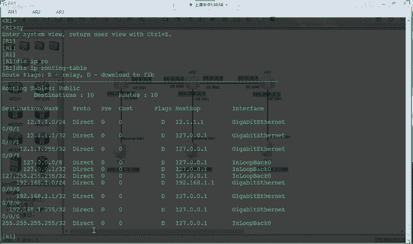

啊，叫做I root static。然后呢，我答反了，我说他这个怎么给我报错呢？😊，ROUTE好IP road static后缀呢是我们的目的网络，目的网络的页码，加上我们的下一套地址。

这是我们现在书写静态路由的一种格式。嗯，对于我们现在所说呢，我们的需求。首先呢咱们希望PC1呢能够并通我们23网段，也就相当于呢我的需求就是从这里能够到达23网段，所以我们现在就要在R1设备上写静态。

大家知道为什么吗？因为未来PC1呢跨网段数据访问，我是不是找我的网关啊，R一是我的网关。所以我未来数据实际上是到达21的，那么要查询R一本地的路由表，所以你在做静态路由配置的时候，你是需要在R一上做的。

也就是现在你需要在R一上原本空空如也的路由表中只有直连，你要写一条静态关于23网段的，所以我们现在写一下关于23网段的怎么去写呢？刚才我们已经写完格式了IP我未来要去往目的网段23。1。1。0。

为什么是点0啊？我们掩码是24位，这是一个网段，那么我的下一跳就写跟我直连的这个设备，我对端的下一跳地址，这是我们书写的一个规范。12。

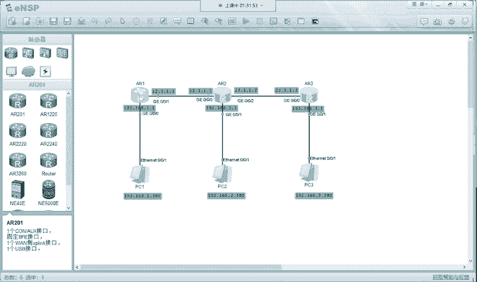

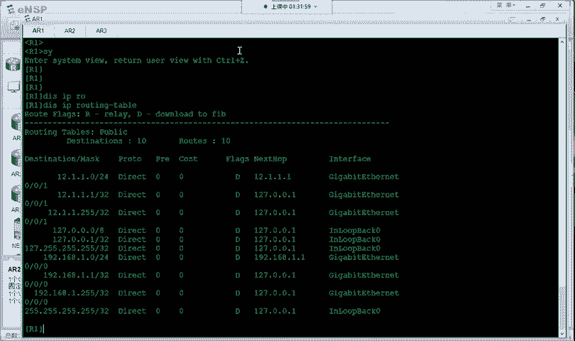

2点1。1。2。12。1。1。2。好，我们写上写上了以后呢，我查询本地的路由表。我们来看我现在是不是已经知道23网段怎么去了。这个大家能看到吗？

我已经知道23网段怎么去了方式呢是我以一个直连我一个静态的方式写上的，优先级是60，下一跳呢是我们12。1。1。2。然后大家可以看到它后边居然自动补齐了一个出接口，大家发现了吗？看得到吗？

也就是它自动呢写了一个出接口，但你觉得好奇啊，这出接口我又没配置，它是如何出现在路由表中的呢？也就是怎么能够关联上的呢？为什么你配了个静态路由表中能够看到出接口信息呢。

那么这样的一个我们所说这样的一个现象，它跟我们静态路由的加表原则有关。😊，静态路由的加表原则？什么叫做静态路由的加表原则呀？也就是你能够把静态路由加进你现在的路由表中，它是有一个原则的。

你需要保证下一跳注意啊，你需要保证我们所说下一跳地址能够顺利的通过某个出街口可达。通过某个出接口可达。也就是你看现在你给设备配置的是什么？配置的是去往1我们所说23网段吓一跳，是我们所说12。1。1。

2，对吧？那么你现在需要保证12。1。1。2这个地址在你本设备上是可达的，也就是未来你能够去往12。1。1。2才行。那么你这条路由才能加进你的表象中，这是一个路由的价格规范，所以大家可以那就理解了。

现在呢这是我配置的下一跳，那么我需要呢我在本地能够抵达到下一跳。那么我能够抵达吗？如何衡量下一跳能否抵达，我们是不是看有没有去往这个地址的路由啊。我也就是要看能否我现在能不能到达12。1。1。0网段啊。

我好像能吧，我是不是能啊，同学们，因为我现在本地是不是有这样的一条路由可以到达呀。也就是我可以通过本地的这条路由，我是能够抵达到这样的。😊，一个地址的。所以如果我们存在这样的匹配关系。

也就是你本地现在有一条路由可以去往你现在所指定的下一跳地址。那么你现在这个路由的出接口看好啊，这条路由的出街口就会作为你配置的这条静态路由的出接口。能理解我的意思吗？同学们，也就是只要保证下一跳的地址。

我在本地有一条路由可达就行。那么你会发现下一跳的地址呢，通过我本地的直连可达。好，那它就是我的直连路由呗。那我就会把我直连路由的出街口作为现在你配置的这条静态路由的出街口。

所以呢这个回去呢大家捋一捋这句话啊，没错，但是呃递归来说呢嗯。我们不提这个专业的词，好吧，我只是跟大家讲清楚这个东西。因为实际上说呢，我并没有说完递归的全部。

因为以后你们到了IP呢会接触递归这俩字也就是你会发现这样的一条路由，它在flex标志位里边跟其他的会有一些区别。那么至于关键性的以后你们IP课程都会讲对IA来说的稍微有点太难了，超纲了。

这不是我们现在的范围。所以我只是简单告诉你们，这个出街口信息是怎么来的，它是有原因的，不是凭空去写的，仅此而已，你们做一个了解就行。所以作为我们所说呢，衡量下一跳是否可达。

你就看我本地是否有去往目的地的路由就行。所以我们现在整体只要你指定了下一跳，我们出街口是可以自动进行匹配的。那么这些不需要大家去担心。好，那么我们接下来呢我想问大家一个问题。

你看啊我现在R一上已经有去往23网段的路由，现在能平通了。好，非常好啊，有同学说现在能拼通了。好，那我想请问同学们现在能拼通吗？😊。

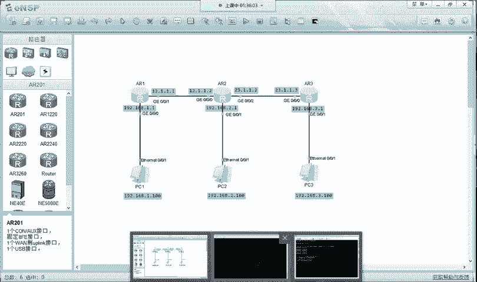

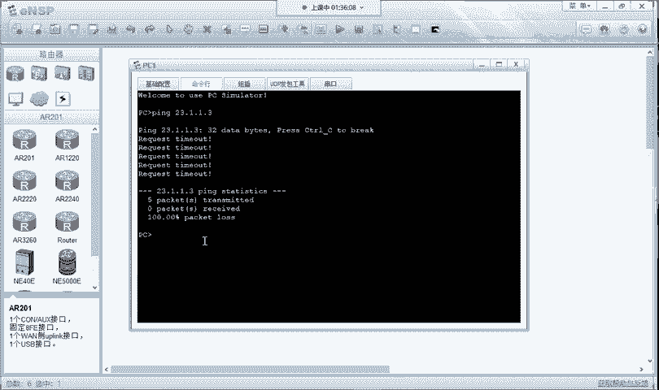

你看啊我们所说呢，好像一切都顺理成章吧。我这个PC1现在要执行数据访问了。我呢是192。168。1。0网段，你呢是23。1。1。0网段，很明显跨网段了，跨网段我是不能直接本网段互通的。

我必须要先找网关数据到了网关这儿网关需要查询自己本地的路由表，自己有没有去往23网段路由啊，一查有哎，那这不就通了吗？对吧？我数据肯定并且我的吓一跳是多少，是12。1。1。2，我就把数据给他了。

那么我们23网段又是22的直连，对吧？我肯定知道我后方有这样的一个网段啊，那么我能不能跟他通信呀。请大家注意啊，我的数据实际上是能够抵达的，是能够抵达的。但是我们看它通不通呢？

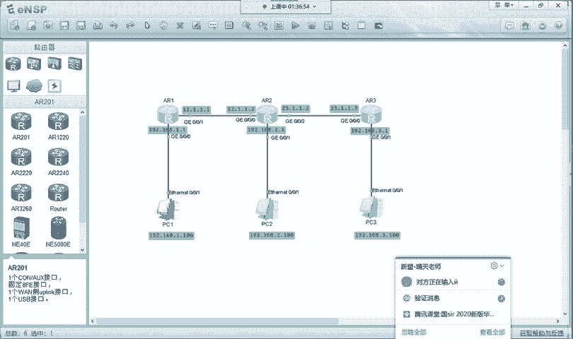

通不通，我们直接验证，好吧，我们直接看PCE，我们直接去验证。你会发现呢，虽然有了路由好像它还是不通。那么我们所说呢通与不通如何去衡量呢？那么首先我们今天要跟大家讲的稍微详细一些啊。好。

今天稍微讲的详细一些。比如说呢对于PCE来说，我们还原一下数据发送的过程吧。啊，发送的过程，咱们来还原一下，我给大家写在这儿吧，我们现在执行一次数据封装，咱们又回到头秃的地方了，数据封装了，在我们二层。

首先有一个我就不写，我今天就不写。

太多了，我就写原麦克二层的原麦克是多少，是PC1的麦克，对吧？那我二层的目的麦克是多少？来，目的麦克是多少？我现在执行跨网段访问了，我PC1要去访问R3这台设备，也就是这个接口的地址。好。

目的m是多少啊？还记得吗？同学们目的麦克是多少啊？跨网段数据访问目的麦克是我们网关的麦克非常好，是我R1的0-0-0接口的麦克吧，是我的网关，我写GW吧。我本来想写中文的算了，网关的麦克。😊，好。

那么我们首先啊对于我们数据来说。

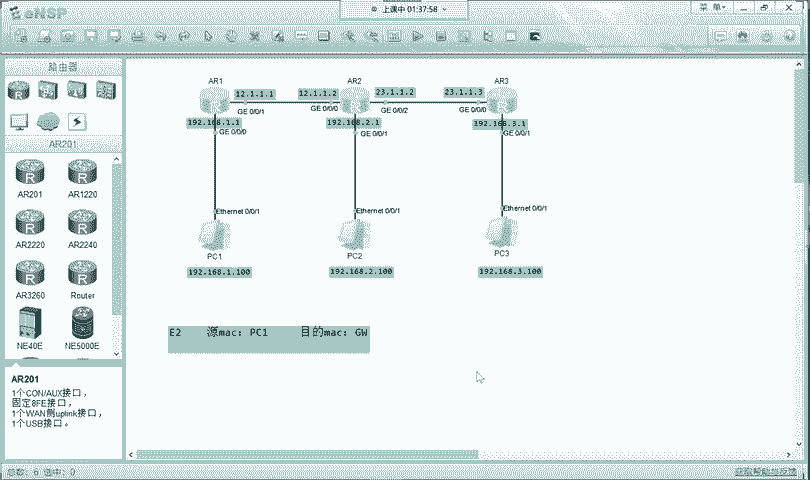

由于我刚才已经聘过了，我已经跨网段的访问完了。所以现在其实我查询ARP表，我其实就已经有网关的麦克了。这个大家能理解吧？能理解吗？我们查询一下ARP表，你可以看到我现在已经有网关的麦克了，知道吗？

为什么？因为我刚才聘了一下这个地址没并通，虽然没拼通，但是我已经找过网关了，对吧？我已经RP问过网关的麦克了，相当于呢我现在数据封装二层网关的麦克。

那么我们来看三层IPV4原IP是多少原IP就是我们PC1的IP192。168点1。100，对吧？我我写数字吧，19216811那么目的IP是多少啊，目的IP这个很简单吧。

目的IP咱们明摆着你聘谁就是谁呗？目的IP目的IP呢就是我们所说23。1。1。3对吧？23。13好，那么我们在网上就是SMP了，我就不画了好，那么我这个数据是不是就到了网关这儿啊，那对于网关来说呢。

网关R1收到了，我们所收到了一个。😊。

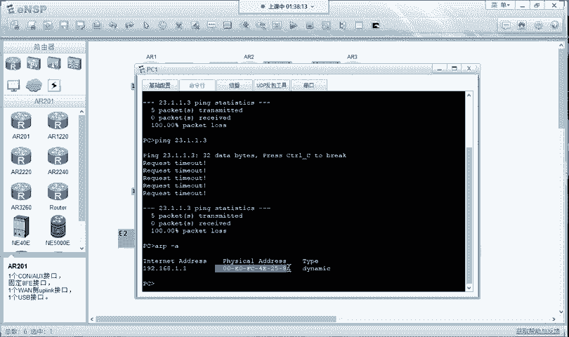

叫单波的数据吧，因为我是不是一个SMP的报文啊，我们所说我收到了这个单波的数据。好，那么请问我现在呢是不是要进行数据的解封装啊，我是不是要开始拆包了，从二层开始拆我收到数据，二层拆完，首先干什么。

看看是不是给我自己的，我一看呢对于二层来说，好像他是找我的吧，目的麦克是我吧，啊，是找我的，是找我的，我就接着往上看，接着往上看呢，目的IP是23。1。1。3啊，我一看哎好咱二层的校验啊，我就不说了。

咱们直接就看三层了，IP层23。1。13，我知道这个怎么去吗？啊，我好像知道因为我路表里有对吧？那我这里其实不是想直接问大家这个问题，我是想问另外一个问题，大家一定要理解。

对于我们设备收到了一个数据以后，咱们所说他收到的是不是一个二进制的比特流啊，同学们。作为二进制的比特流来说呢，我源源不断的在接受010101，我一直在接收数据。那实际上如果我把二层的数据读取了。

那对于咱们学习的时候，咱们就学习豹文的封装。我一旦把二层的报文拆掉以后，看到了里边的内容，我其实可以很明确的告诉大家，这个东西就不存在了，你能明白吗？就相当于呢你拆开信里边好几层信。

你把最外层的这一层拆了，那么这个包装就没有了。那你说老师包装没有了以后，数据在传输不就不完整了吗？不是的，因为你会重新再给它包装一份，为什么我们放到今天才来讲呢，是因为我们今天讲的路由。

大家才能深刻的理解这个知识。那作为我们传递01012进制代码的时候，你会发现，对于一个设备来说啊，我这个设备从这个接口收到了一份数据。我在读取完了以后，实际上我会从另外一个接口把这个数据发一下。

也就是比如说呢数据我只看了二层的。那么最终后边的数据我都是原封不动发的二层这些是从我接口发出去的时候，010101我是会进行一定改变的。也就相当于呢二层数据我已经拆掉了，我在封装的时候。

我会进行一些改变。那么进行什么改变呢？进行我们mac地址的改变。你会发现对于我们之前跟大家强调过，我说呢对于我们路由器而言，我们所说未来IP地址工作在一个广义下的概念。

而我们mac地址工作在每一条链路上。那对于mac地址来说呢，我们所说对于路由器来说，我每一个接口都属于不同的网段。那对于不同的网段而言，我们其实数据广播报文是不互相通信的，是不通的那我们。

每一条链路上来说，它们其实本质上实际上都是基于mac进行的精准的定位。呃，所以呢其实跟大家强调一点，这点大家听起来可能稍微有一些吃力啊，但是你跟着我的节奏走就行。因为我的豹文在这。

也就是一旦当我这个数据呢抵达到了R一这里二层拆掉了以后，实际上原麦克和目的麦克就都不存在了。因为现在我要重新把这个豹文转发出去，能明白吗？我要重新把报文转发出去，就相当于是什么呢？这层已经被拆掉了。

我要把二层完完整整的拆完，请大家注意，我一定要把二层完整的拆完了以后，我才能看到三层，所以实际上当我看到三层内容的时候，二层的数据已经不存在了。你们一定要清楚这一点，它不是说呢咱们画图。

那你在这去看一眼，如果你把整体的数据读取掉，它就不存在了，你只能呢重新再通过接口010101这样的比特流发出去。所以现在看三层，我才会去看IP目的IP。

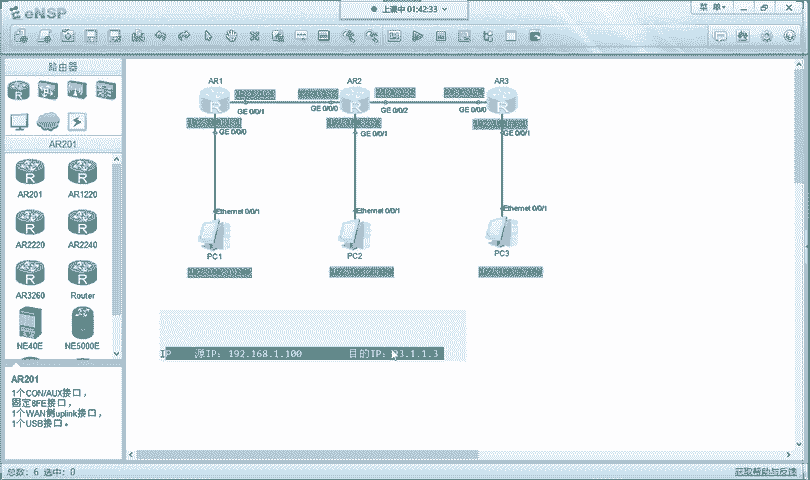

知道怎么去吗？我知道，因为我现在设备上有去往23网段的路由，所以我是能够把数据转发出去的。

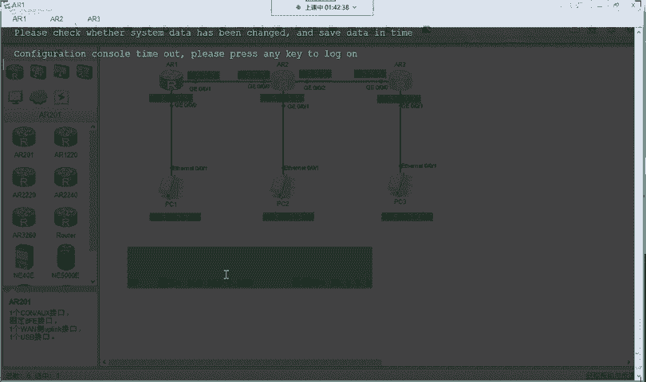

嗯，但是呢我们讲到这儿，大家听起来费劲嘛，如果吃力的话，给我刷个一。咱们接下来要说我重新封装的问题了。好，有同学说呢封装吃力是吗？那咱们来一看一下啊，对于我们R一来说，现在我要把数据发出去。

大家都是不理解嘛啊，我要把数据发出去，我们要进行数据重新的一个封装。也就相当于不吃力，你们一会儿一一会儿二给我搞迷糊了，我要重新进行封装，那么重新封装，咱们还把二层给它拿回来。二层你肯定得封装了。

不封装数据都不完整，你肯定是发不出去的。但是你数据链路层的信息怎么填啊，对于IP地址来说，咱们之前举个例子，就像是快递一样，你这个快递呢，比如说我们从天津寄到深圳一个快递，你中间要经过很多中转点。

但是你的收件人寄件人不能变吧。那对于数据来说，你原IP目的IP是不能变的。但是你中间的这些节点是可以进行变化的。就像呢你在每一个地方你要沿途经过很多的中转站，中转站和中转站之间。

它的地址会来回变来变去的，只不过最终抵达到你手里。那对于二层来说呢，我们现在原麦克是多少啊。好，如果现在R一重新对于数据进行封装，那么最终我这个数据要从哪儿发出去来着？我是不是要从我这个接口发出去啊？

大家想一下这个问题，数据我从这个接口收到了以后，我未来需要从我这个接口发出去。那么如果我从这个接口向外界发送数据的时候，我在进行数据转发我的原MIP会重新封装。那么原麦克就是我现在出接口的麦克。

目的麦克就是我现在吓一跳的麦克。所以在我们mac地址来说，他工作在每一条链路上。那么每经过一个路由器，mac地址都会改变，但是IP地址是不会变的。你不能说变着变着，你快递转着转着，收件人寄件人都变了。

那是不可能的。但是你沿途的中转站可以变来变去，最终抵达目的地，这是不产生任何影响。所以这是我们数据封装的一个过程。这句话我我接下来会写到笔记里啊，以后我在课上如果遇到一些重要的，我就不一直说了。

课下我会把笔记补充完整，课上咱们就以讲解为主啊。好，对于我们现在来说呢，我要进行啊，没错，当我们每经过路由器来时说，我都会变一下麦克出街口麦克。没错，出街口的麦克，也就是我现在R一设备。

我的G0-0-1的麦克就是我的原麦克。这次数据重新封装，这就是我的原麦克了。目的麦克呢是R2的R2的什么R2的G0-0-0接口的麦克。所以这是我们现在重新封装的地址。

那么在我们这条链路上进行数据转发的时候，原木麦克就是我现在图中写的这样的一个地址关系。能理解吗？那你说老师我怎么知道吓一跳的mac地址啊，还记得怎么知道吗？我们查一张什么表来着，还有印象吗？

我查一张什么表，查一下我设备上的ARP表吧，还记得这个东西吗？怎么看ARP表啊，我们display ARP好，那你可以看到我现在是不是有12。1。1。2的mac地址啊，我是不是有它的麦克呀。😡。

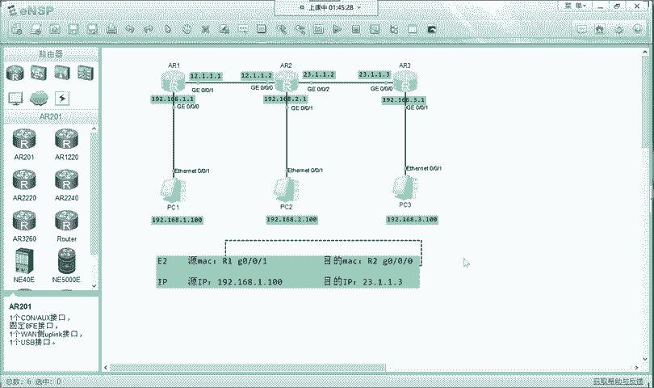

由于我有它的麦克，所以我可以完成我们整体的数据封装。那如果没有的话呢，我就发ARP包去查啊。但是因为之前我已经拼过一下了，它其实已经查询过一次了，所以在这儿你能直接看到记录，这个我就不多说了。

所以目的麦克下一跳的目的麦克如何确定呢？先看ARP表里有没有，如果有的话，我就直接下一跳的ARP是否存在ARP的整体的老化时间，大家还记得吗？啊，还记得吗？当然不是一直存在了，那如果按大家这样说的话。

PC跟一个你的网关相连，PC只需要拼一下，往外拼一个数据，它就永远有这样的一条ARP当然不是了，既然讲过老化呀。

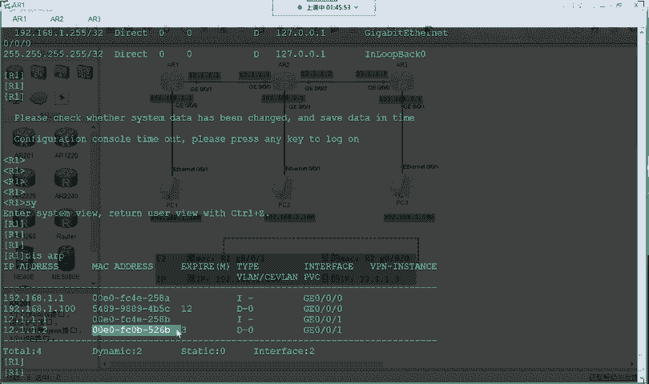

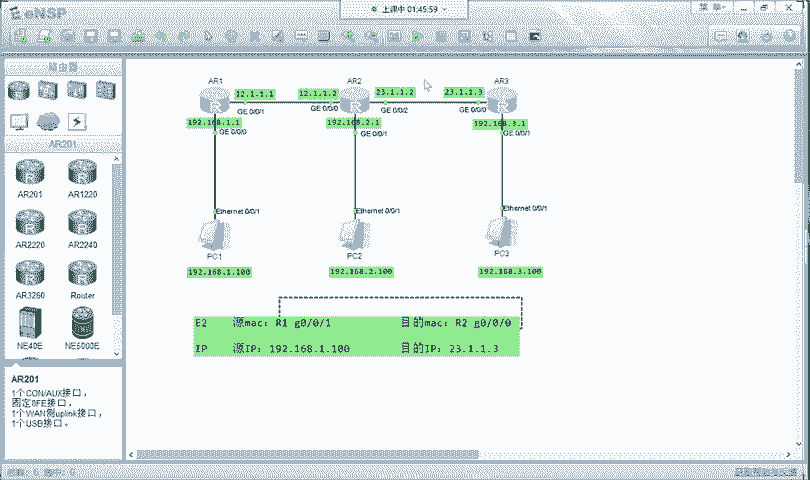

嗯啊，好，这是我们所说的ARP的问题。如果表里有我就直接封装，如果没，我就ARP请求进行询问。好，讲到这儿只是一个小点告诉你们，地址会变，咱们还扯回来刚才的部分啊。

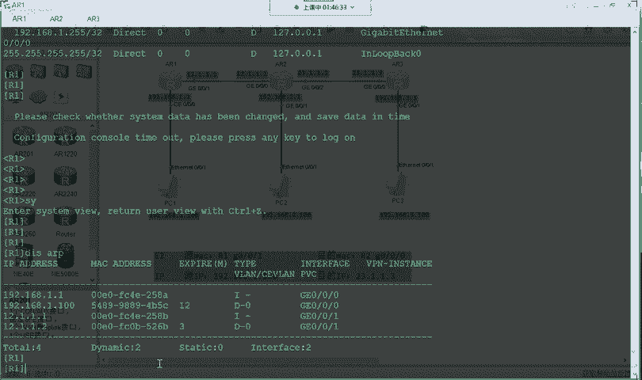

那么我们刚才就讲到了，我现在表里也有啊，我也查到了，下一跳这个地址，我也带麦克我也找到了，数据我也封装发出来了呀。那发出来了以后到了R2上，我是不是也要看你去哪儿啊，目的麦克23。1。1。3。

我知不知道在哪？我知道啊，这不就是我的直连这个地址吗？那么你当发现呢，现在R3可以接收到这个数据，但为什么不通呢？为什么不通，理论上是好像通了，但是为什么不通啊，数据我们所说到了R2，咱就别说R3了啊。

数据我们只要抵达到这个网段，请问R2也好，R3也好，他知道PC1怎么去嘛？PC1是多少的地址啊，192。168。1。10数据到了我们这儿，比如说我在R2上。😡。

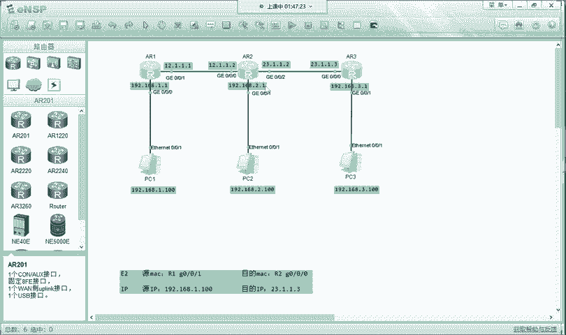

未来总归我2要进行转发的吧，但是我有去往192。168。1点儿。

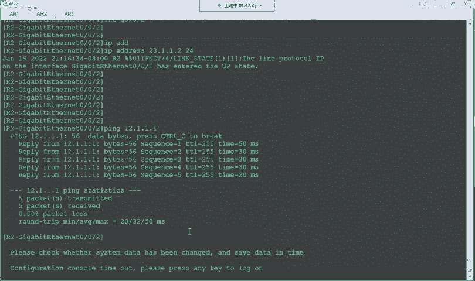

零的网段嘛，好像没有吧，我只有去网2。0的网段。所以你发现我数据没错，来的好好的，但是回不去了。所以你会发现呢啊并且交大家一条命令，如何去查看一条单一的路由。比如说我现在就想查看关于我们所说。

我就想查看1921681。0的网段。比如说咱就这样写就可以你就可以直接查看单个的你会发现什么也查不到。咱们为了验证一下这个现象，咱们查一个12网段的好吧，我们查看一个 table，比如说12。1。10。

你就可以看到对应的路由，你可以查询单条路由，当你的路由表过大，你想对单个路由进行查询的时候，在查询路由表的后边后缀网段信息，也就是网段的这个网段即可你就能看到了。所以你会发现不通不通怎么办呢？不通。

我们就写一条呗，写一条什么呢？写一条未来。😊。

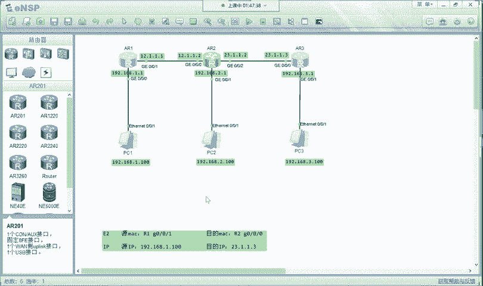

协调未来去往192。168的地址不就行了吗？192。168点1。0这样的一个地址。好，那么比如说它言码是24位，下一跳是多少呢？12。1。1。1是我跟R一的直连。那么现在呢我们看一下好。

我们应该就是有了吧。192。168。1。0，我们现在已经能够到了。好，那么能到了以后，我们同样呢在R3上我们也写一条未来呢去往192。168点啊IProro static192，192点168点1。

024，下一跳是多少啊？下一跳，我要回给R223。1。1。2。

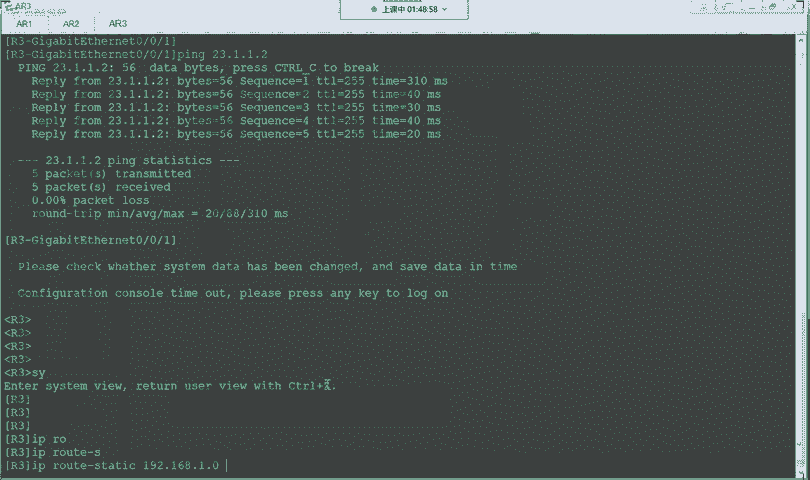

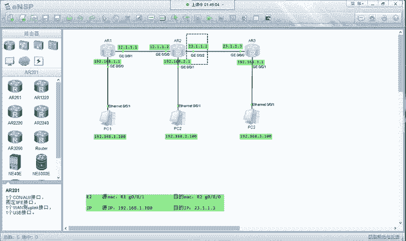

23。1。1。2好。当我们写完了以后呢，我这里也就已经通了，因为我已经写了1。0的。那么现在我们PCE呢再去尝试一下，我们看一看呢它通不通。好，它现在就通了。为什么？因为数据呢可以原原本本的到达23。

到了23以后，23本地要给192。168。1。0网段回包，他发现自己好像认识认识的话，去哪儿呢？吓一跳是R2到了22查询192。168。1。0，知不知道去哪儿了，知道下一跳在哪R1。

所以我们整体数据就回来了。😊。

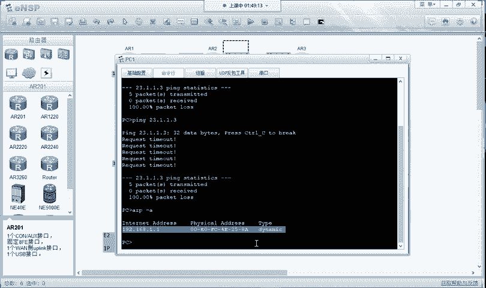

所以这是我们所说一个完整的通信过程。所以现在我们只是PC1呢跟R3通了。但我现在想问大家一个问题，PC1能不能跟PC2通啊？咱们来问一下，因为今天我们想要实现他们仨都能通，那现在他俩通不通啊，是个问题。

通不通啊？想一下这个问题，他俩是否能够通信呢？咱们来看一下吧，不能好，为什么不能啊？刚刚写的啥静态呃，写的啥静态，我就不一条列了啊。如果你没看清就回去看吧啊。好，咱们拼一下试试吧，平192点168。2。

100。😊。

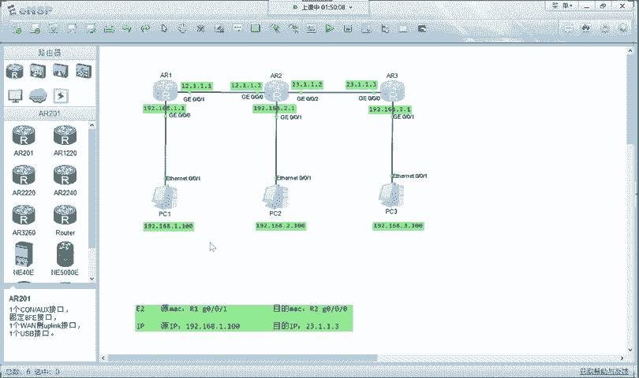

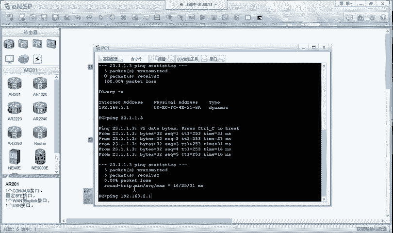

我们来试一下它很明显不通。为什么不通呢？我们依旧理一理这个过程啊。对于我们PCE来说，跨网段的数据访问我是1。0，它是2。0找网关到了网关这儿一看你要去哪儿啊，去网2。0网段查我的路由表。

我的路由表里有吗？我的路由表里好像没有。我们来看一下，对于我R一来说，现在我查询一下我本地的路由表。😊。

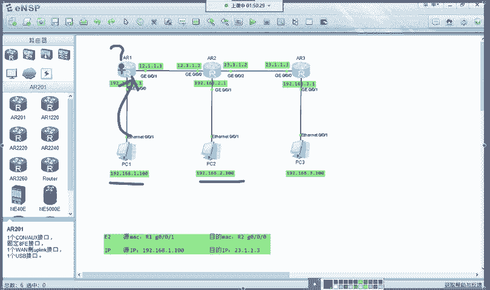

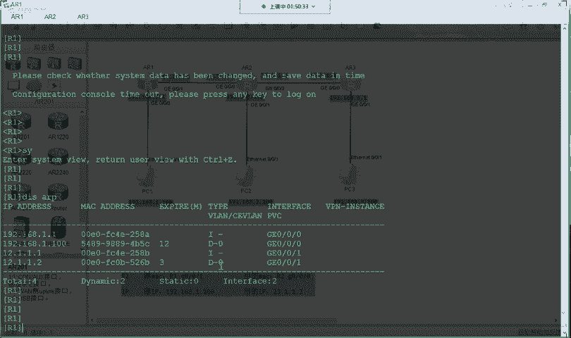

我这空格就是打不出来啊，我是没有192。168。2。0网段的。呃，大家在学习之前呢，总是会有一个误区。我在这讲一下大家的想法啊，假设这三个设备没做任何配置，很多同学总是这样认为，你看呢一跟二能通。

二跟三能通。那么一跟三应该也能通啊，因为数据发到22这22不就知道三怎么去吗？大家有没有这样的疑问啊，如果有的话可以给我刷出来，就像是什么呢？这个就像是这是你这是你朋友，这是你朋友的朋友。

你就觉得呢你认识你朋友，你朋友呢认识他的朋友，你跟他的朋友就认识吗？你们想一下这个问题，那关于到这种图，你们其实就能想明白，大家总是觉得呢我的数据能到这儿，他也能到这儿，为什么我的数据不能直接到这儿呢？

那是因为你能不能到达对方是要看你本地有没有去往对方的路由的，而不是去看你的朋友，你的邻居或者不能说邻居啊，你对。他的设备跟你的直连，他是否认识，跟你没关系，能明白吗？跟你没关系。也就是对于我们所说呢。

当然了，你们中间存在这样的一个纽带。但是你在进行数据转发的时候，查的是你本地的路由表。如果你不知道如何去往对方网段，那你肯定是到不了的，所以这是我们所说呢没有去往2。0的路由。所以呢未来R1。

我们PC1想要去访问PC2啊，没错啊，就像呢如果是这样的话，全国的设备，你们也可以想想全世界的设备，总之呢一个设备跟一个设备就是连接起来的一个设备跟另外的设备也是连接起来的。

那么世界上只要连接起来的设备互相不就都通了吗？你不需要做任何的配置，你说作为运营商来说，买买多少台设备我回来只需要配个地址，几十台设备就都通了，那还要网工干嘛呢？大家要想一下这个问题啊。

你是不需要做任何配置的，不需要运行任何协议，不需要运行任何策略，买回来只要设备配了地址，全部直连的情况下，他们都就都通了。那么就乱套了吗？所以肯定不是这样的。

所以大家一定要养成一个基本的理念通与不通查路由，这是。最最最基本的一个思想。所以一定要从它开始就养成这个习惯啊。也就是现在数据到了R一这儿，你会发现就产生问题了。那咱们就接着写，不要觉得麻烦啊。

直接接着写，接着写未来去往192。168点2。0网段，我呢吓一跳，依旧是R212。1。1。2。好，我们写上这样的一条路由，写完了以后，我想请问同学们，现在通吗？这就考验你们刚才听课听的是否认真了。

你们必须记住每一台设备上它的我都配置了什么，你们必须要记得好通吗？哎通通吗？同学们通的话，刷一不通的话，刷22好，非常好，这一看就是刚才呢我觉得呢看一看啊。好，咱们看一看它通吗？一看就是刚才没有好好听。

为什么呀？😊。

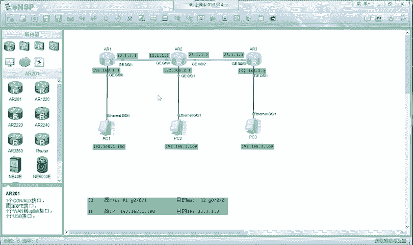

好，我们回到过头来说一下啊，因为我们刚刚这个设备是不是已经写完了去往R1的路由了呀？为什么呀？因为刚刚PC1，我想去P23左接口地址的时候，这两台设备我已经都拼完，都配完192。168。1。0网段了吧。

不然这个数据怎么回来的呀，这俩设备肯定都得认识吧。那现在来说，PC1数据到了R1，他不知道如何去R2，我们已经不知道如何去PC2，我们已经配完2。0网段了吧。他现在数据已经到了吧。

到了R2这R21看去的是2。100，这不就是我下连的这个设备吗？😊，然后呢，我们PC2进行回包，我是2。0，它是1。0，跨网道数据访问找网关到了网关这儿，你去哪？192。18。1。0。

我本地有这套路由啊，同学们有这条路由，并且吓一跳是R1吧。到了21这一看我下边的直联不就花回来了吗？所以你们回答二的就是刚才我们配R2的时候，这套路由你们给落下了，你们没看到啊。😡，啊。

所以我之前呢在之前讲这个的时候，我都会把这些路由呢列在这儿给大家看着。但是我以后觉得就不列了，你看一看你们听课的时候呢，记了多少。所以现在我们这俩设备互相通信已经完成了，现在我们就要来看这两个设备了。

好吧，这两个设备，那么对于这俩设备能不能互相通呢？哎，能不能互相通，同学们这个再说一下，能不能互相通啊。😊，能的话，一不能的话，2、咱们来回来去多思考几遍，回去做作业，你们就会很简单了。好。

不能非常好试一下P192点168。3。100，看看通不通啊。😊。

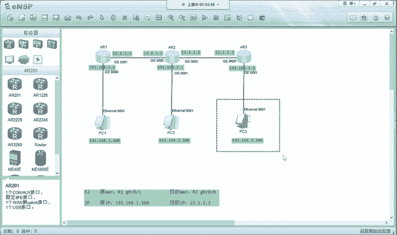

不同为什么不通？因为我这个设备上没有，首先没有去往3。0的路由吧，我们肯定要在这儿先开始配吧，先配一条IPro static，我们192点。😡。

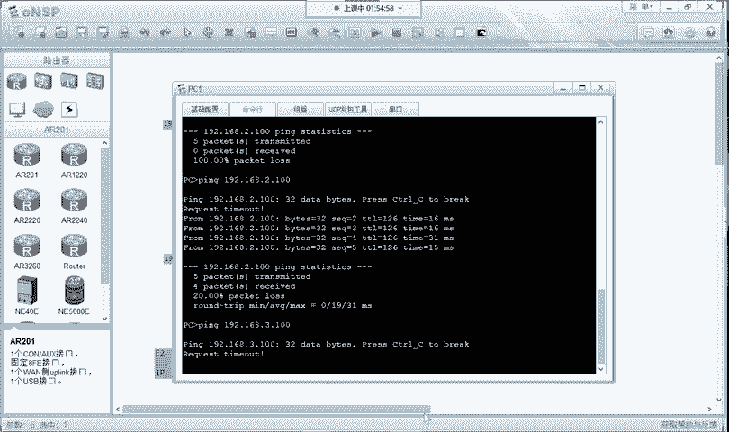

168168点3。024位的爷码吓一跳，12点1点1点多少，1。1点2吧。好，我现在拼完了之后，配完了之后通吗？同学们，我现在已经配完了，现在通吗？😡，通吗？同学们。

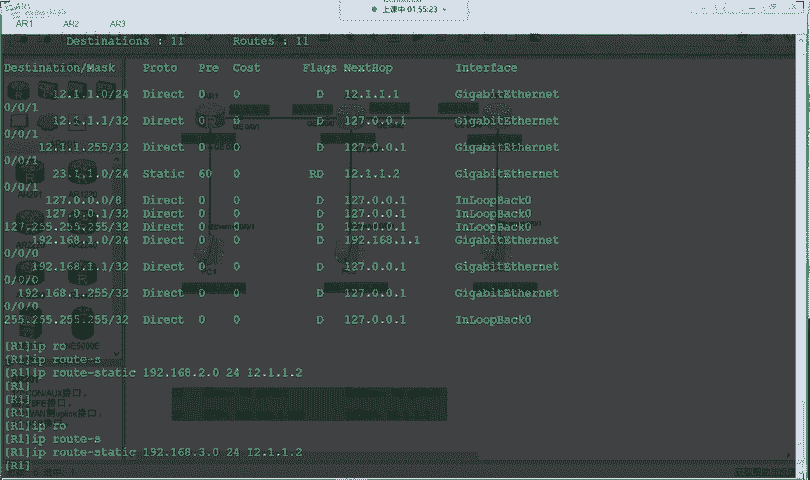

好，通了。好，我们来看一看啊，对于我们现在来说呢，我们去拼一下，平192点168点3。100。好，我们看一看它通不通啊，我们来查看一下就知道了。

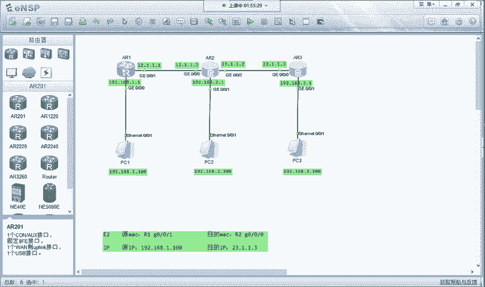

好，不通为什么不通呢？为什么不通呢？这个是回程吗？跟回程现在相关很大吗？同学们回程关系很大吗？是不是R2连去都去不了啊，没错吧，R2上我压根都不知道3。0怎么去吧。你这个信息好好的，你是发给我了。

但是我没有啊，没错，非常好，二也没有记得非常好。所以我R2也是要进行配置的呀。所以这是一个一个的啊，我们有问题的就去解决问题，3。0，我们24位的掩码下一跳是23。1。1。3，应该是我跟23。

它的直连的接口。好，那现在你一看我这条路写完，我也能到23了。231看3。0数据发给PC3了，这是没问题的。好，PC3现在要回包了，你是PC1，你是1。0，我是PC3，我是3。0。

我跨道数据访问找网关好，网关发到这儿好，现在能通吗？😊。

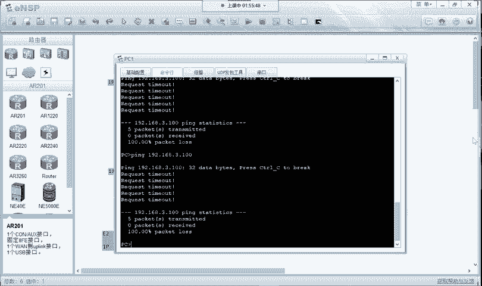

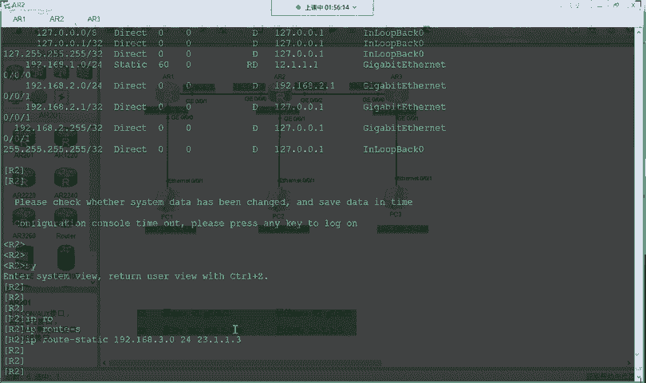

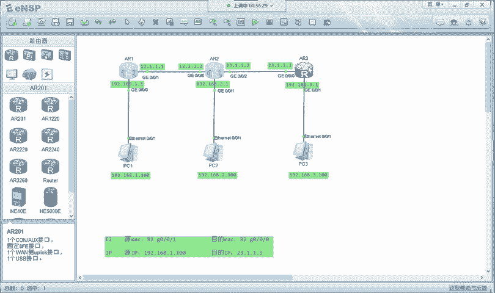

呃，都有什么，这当然不能告诉你了。好，回程刚才写了非常好。咱们看一看。😊，现在我通吗？如果现在我通了，就证明我们可以通了，对吧？好，我们可以通了。为什么？因为刚刚我们已经配完。

最早我们就已经配完回程的路由了。好，现在最后一个问题了，二三通吗？😊。

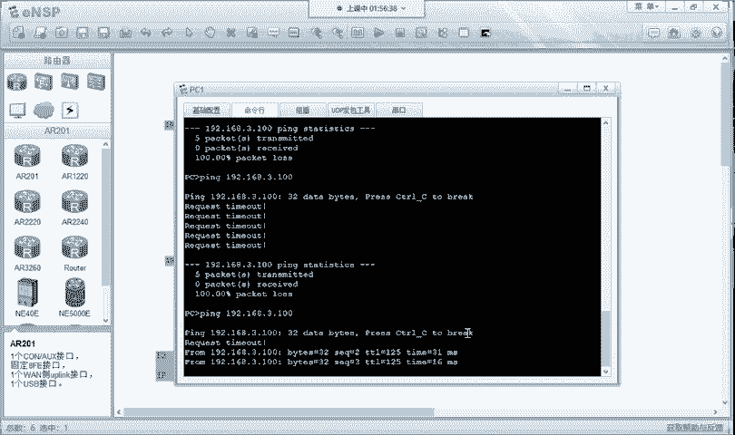

来想一下这个问题，同学们二三通吗？😡，2、为什么不通问题出在哪呢？问题出在哪个设备上呢？有同学认为通，有同学认为不通，不通的话出在哪呢？问题是谁的问题。2323回不来，对吧？是23的问题。

也就是我们可以精准的定位到R3上现在没有2。0的路由，所以它感觉上是不通的，咱拼一下吧PC2先去拼192。168点3。100，我们看一看它应该是不通的，为什么不通，因为数据可以到，但是他就回不来，没错。

因为我们数据呢来这查表去往3。0给了2323下来给直连PC3回程框网段访问找网关到了网关这查询2。0网段的路由，然后我们来查一查，看看它能到吗？diplay table，我们现在好像没有去往2。0的。

所以呢它不通，那如何让它通呢，我们配一条就行了。好，我们配一条静态啊，ot，我们配一条192。168。2。0啊，24位的码下一跳231。1。2。

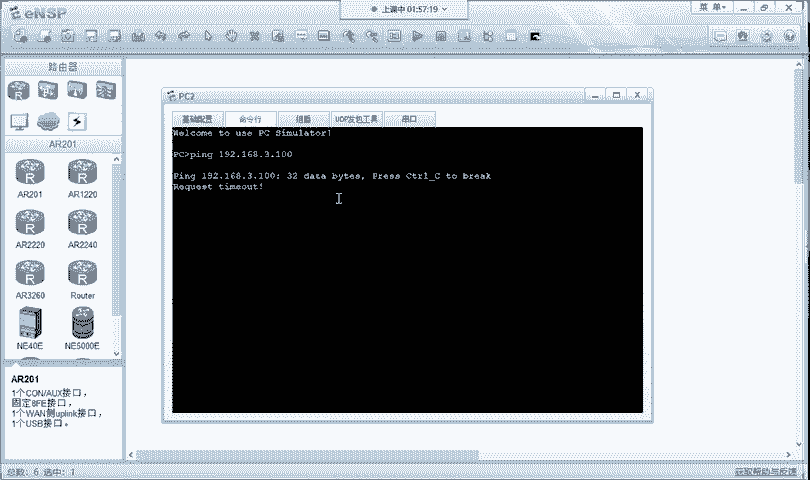

好，一旦我们现在配完了以后，我们再查询一下路由表，我就已经有去玩2。0的路由了，并且呢是去R2。现在我能通吗？感觉上现在我好像是已经能通了的样子，我们试一下，它就通了好，所以呢大家会发现。

对于我们现在整体的设备而言，我现在PC123就全部都通了，看得到吗？同学们我就全部都通了吧。三台之间就都通了，所以回去这是你们的作业呃，好麻烦啊，如果设备更多，我自己一个一个配嘛，当然了当然了。

正是因为很麻烦，我们之后才会讲到动态路由嘛啊，对吧？但今天呢只是这三台设备大家就嫌麻烦了，三台设备其实还行吧。如果未来你的组网面对你们企业来说，大概就三四台设备，你直接用静态也是OK的。能好像懂了。

好像没懂回回去反复听，反复练反复敲。遇到问题自己看我们对于IA来说呢，大家去思考的问题很简单，因为我们只需要去关注路由即可，最基础的路由。😊。

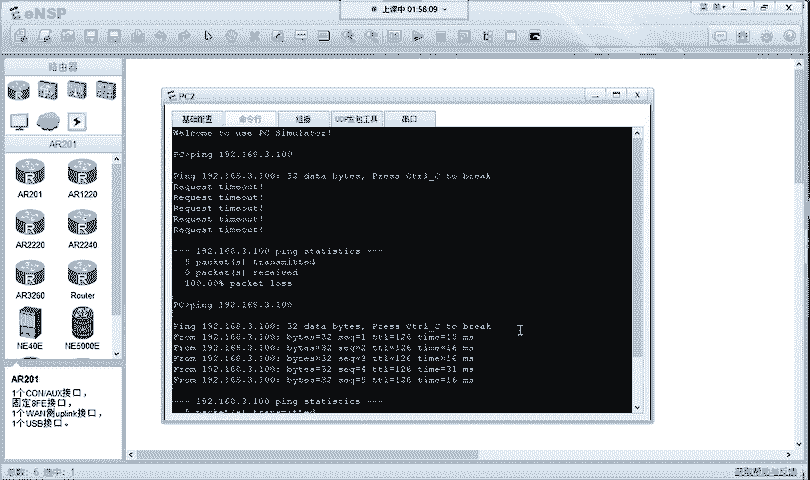

那么我们所说设备通信，我们现在还局限在一个地方叫做呢查询路由表，有路由就能通。没路由就不通。以后未来你们学到IP呢会学习策略路由。那么也就是路由表里没有也能通。如果你做了策略就能通。

在以后呢你们学习标签表，你会发现没有路由也能通。因为只要有标签表就能通，标签里有也能通。所以呢现在我们才刚开始大家千万别觉得麻烦。其实我们一共就三台设备，改默认路由的话，需要怎么设置，改默认路由。

你是说把这条默认路由取消，然后重新写一条，是这个意思吗？按度掉之前的重新配一条新的，你不能直接覆盖掉之前的老的，能明白吗？不像你改IP要是可以直接覆盖，你必须要把之前的去给它取消掉，然后配置新的。呃。

没错，PPR策略路由嘛啊一听就是听公开课的，跟思科一样又不一样。对于策略路由来说，思科里边叫做rote map啊，跟华为里边呢有一些叫法会有一些区别啊。思科里的and do是 no，咱们不讨论思科。

好吧，咱们就直接讨论华为就行了。你们又不学，如果你们报的是商厂商以后听思科的CCNA的时候，你们会去写呃，怎么写。怎么写？我刚才不是跟大家演示过了吗？😡，啊，那我举个例子吧。好，有的同学说怎么写。

那我现在问大家一个问题吧。好，正好说到这儿了。咱们正好取消的一条之前，现在正好就着这个问题，我跟你们讨论一个新的问题。看啊，我们刚才呢对于我们这个设备来说，我配了这样的一条路由。

请看同学们请看请看请看啊，我在R一这个设备上，我知道23。1。1。0怎么去你看这个地址，也就是我现在对于这样的一条路由来说，看啊，看我的屏幕啊，同学们对于我们现在R一这个设备来说呢。😊。

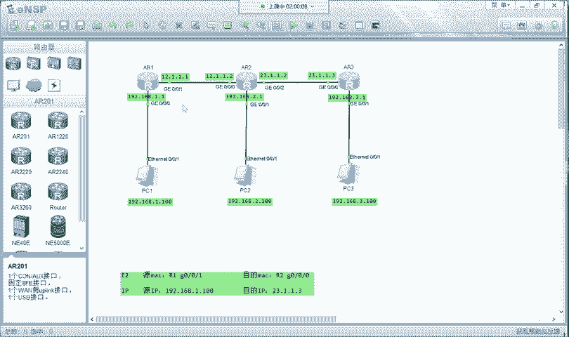

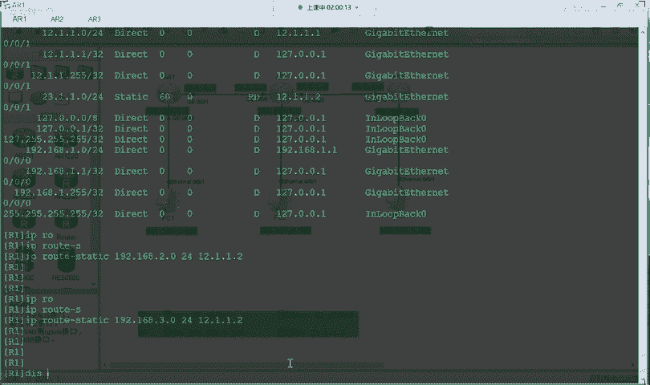

有这样的一条路由，23。1。1。0，我以后要去往这个路由的话呢，下一跳走12。1。1。2。也就是未来我要去往，我这是透过这个屏幕。你看我后边这ENSP的拓扑啊，我去往这个网段的时候。

我呢会把数据发给R2，现在我要把这条静态路由给它取消掉。好，我们先来看一下取消啊，取消怎么取消呢？ do你刚才怎么配的呀？root static。那么你取消的时候就是一样的，23。1。1。

024位的掩码，然后你要把下一跳也写上12。1。1。2你就取消了看啊，就取消了，取消了以后呢，我们来查看一下路由表没有23网段了，看得到吗？没有23网段了，能看得到吗？同学们，我现在问你们一个问题。

我现在R一没有办法到达23网段了。请问PC1还能拼通PC3吗？好，这是我的问题，听清楚啊，不能。其他同学呢能的话扣一，不能的话扣2好，正好就是这个我觉得这个问题问的非常好。虽然你们的本意不是这样啊。

我看一下你们的回答。呃，大家都认为不能。好，我们首先来评一下啊。😊。

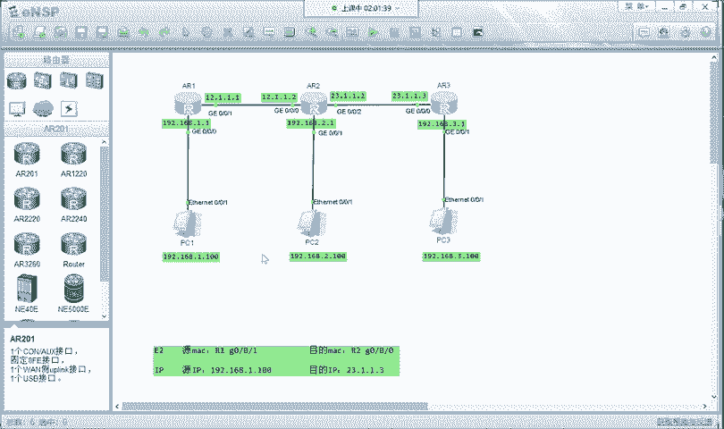

192点168点3点100。好，我们看一下它是否能通呢，它通了。

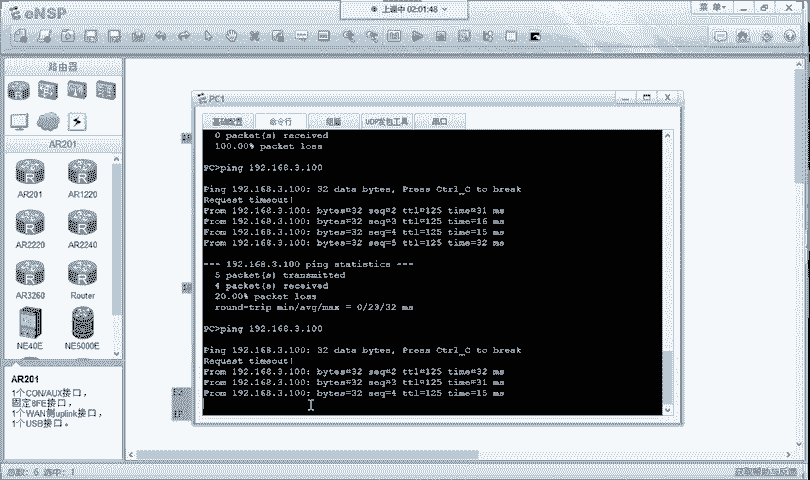

他痛了。呃，是不是很奇怪呀？同学们，你说感觉老师这不对呀，明明我到不了这个网段啊。你看我现在现在已经没有去往23网段的路由了，我怎么可能还到PC3呢？我不是经过了它吗？好，那咱们想问大家一个问题啊。

我们所说去往目的网段通不通，我们是看路由表，对吧？那么请问我去网123网段去往192。168。3。0网段，跟我去网23网段有关系吗？😡，我有关系吗？同学们是没有关系的。

但是你说我在这里如果想聘23的23。1。1。3通吗？那是不通的。你可以试一下，聘23。1。1。3，你看得通吗？😡。

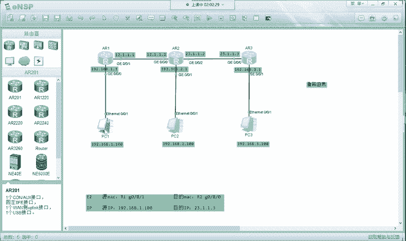

对于我们现在设备来说，它是不通的。为什么？因为我现在数据到了R一这儿，我R一上没有23网段的路由，我这个包发不出去。但是你PC1想去拼PC3，我R1是有路由的，我知道3。0怎么走。

数据到了R2这R2知道吗？R2也是知道3。0怎么走的呀。😡。

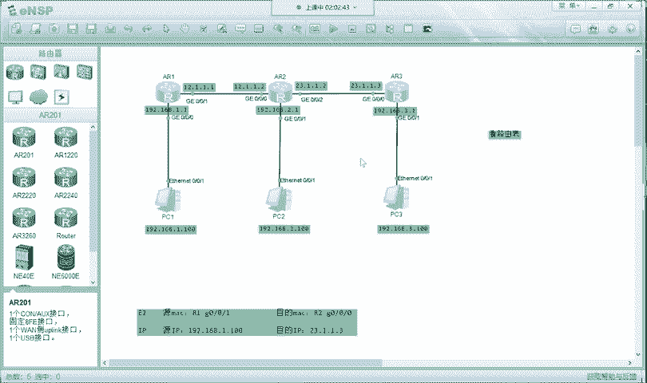

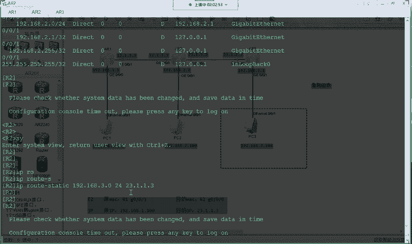

行看这儿啊。他也是知道3。0怎么走的，数据到了我们23吧，到了23这是直连回包的时候，我只需要满足这两台设备上都知道1。0怎么走，我不就会看到了吗？没错，我们只需要看路由表。

所以你会发现对于我们中间的这些互联网段来说，如果你没有去访问到这个接口的需求。那实际上你是不需要去写这样的一条静态指过来的。因为我们最终的目的是终端通嘛？大家一定要清楚啊，作为我们中间这些设备来说呢。

他们只是一些转发设备，对吧？我们不会说呢，每天除非你未来你要去运维这些设备，你需要可能登录到他们设备上，然后呢对他们进行管理。但是大部分情况下，实际上我们中间这些设备执行的是数据转发的功能吧。

他们是网络设备，咱们是终端，你说呢企业里边我为啥要买路由器，为啥要买交换机啊，买交换机，我希望把下边终端接到一块未来扯根线出去连到路由器上上网。那对于他们来说，我没有天天没有要去访问一个。

路由器的习惯吧，我天天没事拼一下，拼一下，看看跟路由器通不通啊。路由器路由器之间天天拼着玩，看通不通啊，不会啊。我们日常所说呢，你组建的网络最终都是为了我们终端用户服务的，能理解吧？所以你以后会看到。

对于我们有一些设备配置上的时候呢，你不需要去看我里边是否必须要到达其他所有的网段路由都得有没有必要。因为我查询的只是看你现在去网的目的网络，这个网段信息，你是否有，如果有就能通。如果没有就不通。

这静态在路由器属于正常配置嘛？呃，属于正常配置啊，很很很普通的一个配置。嗯，并不关心中间能不能通讯。没错，包括以后你们去学习到一些我们所说对于大型的网络中来说呢。

常常会对设备中间他们互联产生的路由给它抑制掉的。就包括呢OSPF以后，你们面向一些运营商的设备，我们甚至会把互联产生的路由全部给它抑制掉。因为我们没有必要。那今天呢正好说到这儿了，跟大家讲一下。

你们要知道这个地址。好吧，嗯，终端地址会并不通路由器接口地址遇到很多次路由器接口地址，你是说直连的地址并不通吗？直连地址并不通，可能他让你禁聘吧啊，他不允许你聘这个地址。

你可能能够经过它帮助你进行一些数据转发，但是它不允许你访问它整体的SM我们所谓他不允许他禁掉了，你对他SMP服务的访问，能理解吗？他不让你聘是这个意思，并不是说你聘它并不通。

路由器地址一制路由器地址是有条命令吧。没错，这个到了IP的时候，你们会会去学习行吧，这是我们以上今天的这个小实验呃，我想一下，今天有一部分内容呢还没还没跟大家说完，没说完呢，呃没说完也没事。

没说完下一节课接着说吧啊，东西呢还是有一部分的，最后再说一点吧，最后说一点吧？对于我们之前讲ARP的时候留了一个小点叫做ARP代理，我不知道你们是否还有意向，还有意象吗？同学们。呃。

对于咱不提IGP这个东西啊啊，部属IGP呃，我们所说内部网关协议叫做IGP里边，有的时候你会通过静态手动可能会影响一些路由的选路。也就比如说你整体的一些路由协议已经运行好了。

但你现在针对性的想要去调整一些路径啊，那么你可以用我们所说整体的静态，因为它只是比较简单不然的话呢，你想作为一些我们所说控制，你还要去做策略，可能比较难。有的时候就是一条静态的事儿。

所以大家别觉得静态路由不常用，它也在常用啊，不管是什么环境下，它都有用武之地，只不过呢作为小型网络，你可能整体通信都依赖于静态路由，你就只配静态，对于大型网络来说，它作为一个灵活的管控，它可以去做。

当然它实现的功能是比较有限的，只能在一定程度上影响你的路由的选择，仅此而已。啊，这点都不记得了。那我说一下什么叫做ARP代理呢？我们来看一下这个图啊，对于这个图里它的地址很有意思。大家可以看一下。

对于主机A来说，它是实。1。1。0网段，唉就相当于它是10。0。0。0网段吧。这个能理解吧。因为它-8位的页码，它是10。1点10。0。0。0呃，这是它的网段，它是-8。那你看主机B呢它也是10。0。

0。0吧。这个我就不说了，因为8位的掩码后边这些全部置为0。你会发现对于主机A来说，AB它俩是不是同网段，这个大家能理解吧？但是你看这个路由器呢，对于路由器而言，它的两个接口好像不在一个网段，为什么呀？

对于路由器来说，它是10。1。0。0。因为它是16位的页码，右边呢这是10。2。0。016位的页码。那么你说这样的情况存在嘛，存在也是很合理的。因为你主机配的页码就是比较长，就是比较短了。

那你涵盖的网段范围更大。对于路由器而言，两个接口确实处在不同的网段，一个点11个点2，但是此时尴尬的情况就发现了，就出现了。如果说呢对于我们现在来说，你看啊。对于主机A，我要去进行我们所说访问的时候。

比如说我要访问主机B，我拿对方的地址，加上我本地的言码进行计算。计算完毕以后呢，我我觉得哦，这是我同网段的一个地址，看得到吗？因为我算完肯定都是-8呀，我是同网段的地址，那对于同网段来说。

我如果要去访问我是不是直接请求对方IP的m克地址啊，这个大家还记得吗？我是不是直接请求对方IP的mac地址，我就直接请求B的m克了。但是你说我这个麦克能够我我这个请求能发到B这吗？我是发不到的。

因为我们作为广播报文来说，它没有办法跨越我们路由器的三层接口吧。也就是你这个广播包呢ARP的广播包，到了我们这个接口这就已经停滞了。主机B是收不到的，它不会给你回复。好，那么如果它没有给你回复。

那你就无法完成数据封装吧。因为你拿不到它的麦克，你怎么跟它进行通信呢？并且呢对于我们这种情况来说，你会发现我们路由器收到了这样的一个接口，我们左边接口收到了这样的一个信息，它是1个ARP的广播。

我看什么看看现在要请求的是不是我的IP呀，我我的麦克呀，我们要看geIP一看IP10。2。0。1哦，这好像不是我对吧？这不是我呀，因为我是多少，我是10点1点0。2啊，你现在问的也不是我，那我处理吗？

我是不处理的。所以你发现此时尴尬的情况就产生了，主监认为呢我跟一个同网段的数据进行访问。但对于路由器来说呢，我两个接口不同网段，所以我不帮你转发这个报文，那么你数据到达不了对端，拿不到对端的麦克。

那么你请求不到麦克地址无法完成数据封装，那你的数据通信整体来说就是没有办法完成的。所以对于我们现在来说呢，你会发现数据我就停在这儿了。我没法往下去看了。那我现在怎么去解决掉这个事情呢？

我们可以在路由器上去启用ARP的代理功能。那么这个功能是在我们接口下启用的。我们此时可以在这个接口下启用ARP代理，那么一旦你启用了ARP代理这个功能。那么如果未来路由器收到了这样的一个请求。

也就是现在我又要去请求主机B10点2。0。00。1这样的地址，你的麦克是多少。收到了以后，那我因为是个ARP包嘛，大家一定要清楚这个因为是个ARP包。

我依旧会看ARP里的target还记得这个吧target它请求的是不是我呀，一看请求的不是我。那按照原本我应该选的直接丢包，因为你请求的不是我，我当然不会理你了。但现在来说。

如果我开启了一个叫做ARP代理的功能，那么我现在会先查询我本地的路由表，其大家注意，我会先查询本地的路由表。那如果我本地的路由表中。我知道目的的IP怎么到，请注意，我知道目的的网络怎么到。

我有这个表象的话，我就会使用我现在这个接口的地址当做它的麦克回复给主机A我会回复给他，告诉主机A现在呢我就是主机B的麦克。如果你未来想要去访问主机B，你就把数据发给我就行了，我替你代为转发。

那么他会再去向主机B发送ARP的广播报文，主机B会给他回复啊，其实这个在下边标了，你们可以在这看，就相当于他会给主机B发送请求，主机B呢会回复给他相应的一个回复。

那么由他在中间作为代劳帮助主机AB进行通信，这是我们所说，由于你两端地址呢配的有毛病，看得到吗？不能说有毛病，你说都没错，A也没错，B也没错，路由器也没错，但是由于这样的配置通信来说。

设备就是一个认死理的，他就是这样去进行转发的。我们把这样的代理。称之为叫做路由式的ARP代理。那么整体的呃这个命令呢也跟大家简单说一下，嗯，大家也不需要在我们IA中掌握它的配置。

因为最终呢你们到IP会去学习，只需要进到接口下。

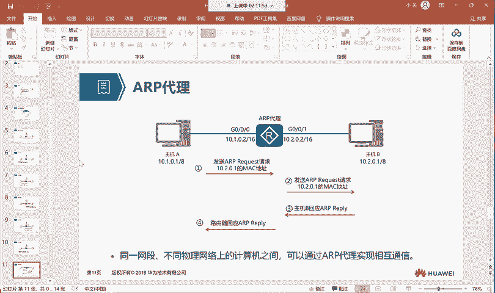

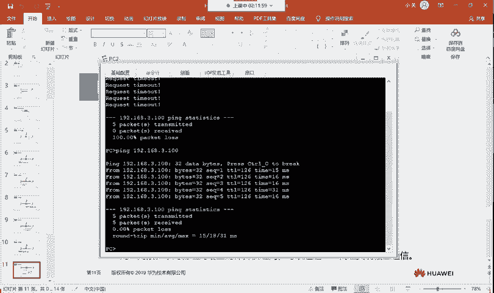

嗯，我看一下啊，只需要进到接口下开启ARP的代理就行。😊。

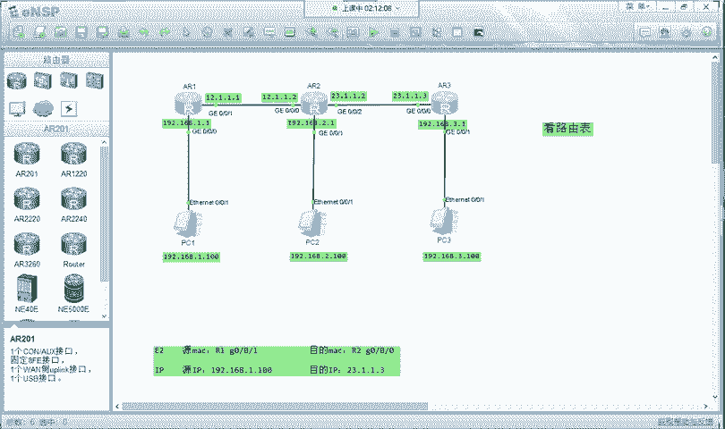

，我给你们简单的看一下，比如说我进到0-0-1接口，它呢叫做ARP，咱们只是简单看一下，只是简单的看一下这个命令，不需要你们去掌握。

只是我要告诉你们ARP以后你们敲 enable就行在这个接口下开启ARP的我们所说ARP代理就行了啊。但是这个呢不属于我们I阶段啊，所以那天呢讲到这的时候，我跟大家说了，我说如果不讲路由ARP代理。

你们听不懂。当时还有同学质疑我我记得还很清楚。但是到现在我可以告诉你们，如果不听路由肯定你是听不懂的。因为你没法理解。所以就这一个小点吧，咱们作为这一点说过。

其他ARP都说完了对于这个来说它的课件中包括我们整体I大纲也不要求大家掌握它的配置。呃，包括之前我也跟大家讲过了，代理呢分我们未来你们到学微的时候，还有内间的代理，包括ARP路由式代理。

你们会在IP中学习它的配置。😊。

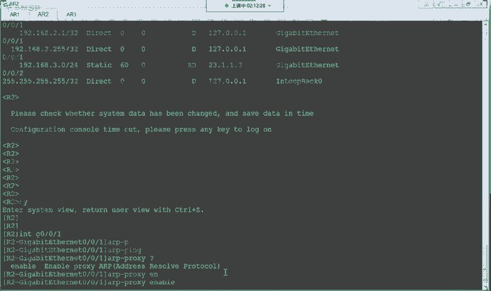

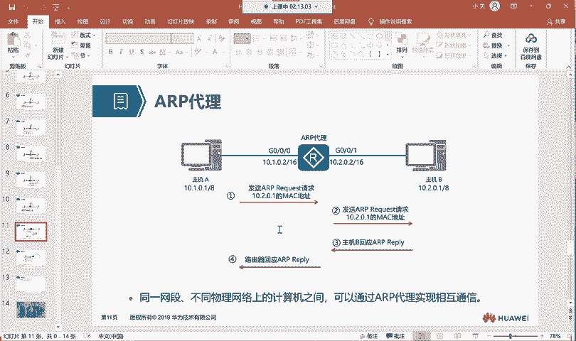