# 2023 新版华为认证HCIA+HCIP+HCIE全套视频讲解！一套视频让你从入门到精通！CCNA／CCNP／CCIE技术提升同样适用！ - P110：（持续更新）HCIE Datacom - 56.OSPFv3 -1 - -Book思议8 - BV1W8411A7z8

那那我们就继续上课。然后我们这节课依然会去讲OSPFV3协议。嗯，这个协议呢还是比较多啊，还是比较多的。就是内容量来说啊还是比较多的。但是大家如果有V2的基础呢，学习起来也会比较方便啊。

因为我们上节课说了一些概念呢，嗯大家也是比较清楚的，对不对？😊，呃，那接下来我们要去讲的叫做一个叫做OSPFV3的一个新增的一个特点啊啊叫做链路支持多实力。嗯，这个可能我们在OSPFV2中没有接触过。

对吧？老是多实力嗯，是多进程吗？对吧？我们在V2中，如果我们说的多实力啊，你可能容易想到的就是多进程对吧？那。在V3里面并没有这样。V3里面有一个什么样的好处呢？啊，大家可以理解成啊。

V3里面新增了一个特点，就是在OSPF的哈lo包中呢，增加了一个字段叫做ins ID。😊，嗯，这个inst ID呢相当于一个暗号。呃，也就是说呢，我们在建立邻居的时候。那不再要求网段一样了，对吧？

我们在V三重呢上节课也说过了，不再要求网段一样了。但是呢大家要注意啊呃它真增加了一个新的段叫ins ID，但是我们要求ins ID是一样的。😊。

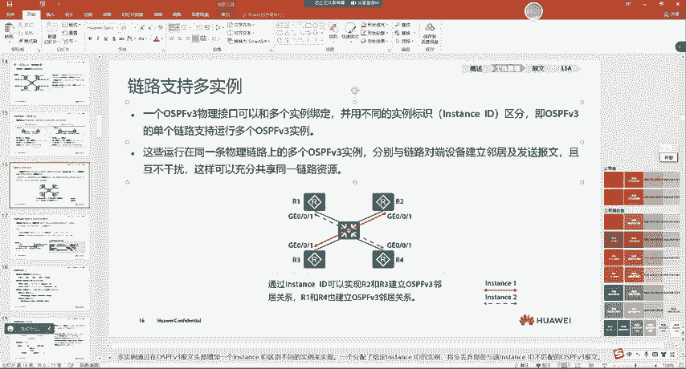

那首先呢我先带大家去看一下，对吧？这个ins ID它长什么样子，对吧？以及呃它是怎么样进行使用的。好吧，然后我们再来说一下它的场景呃，以及呢V3里增加了这个ins ID对吧？

它相比于V2来说有什么样的好书，对不对？首先我们从包里呢嗯先去瞅一眼，对不对？呃，我先看一眼它长什么样子，好吧。😊，注意啊，嗯，现在呢我们有12两台路由器，那这两台路由器呢。

待会儿我们会去跑1个OSPFV3的邻居。

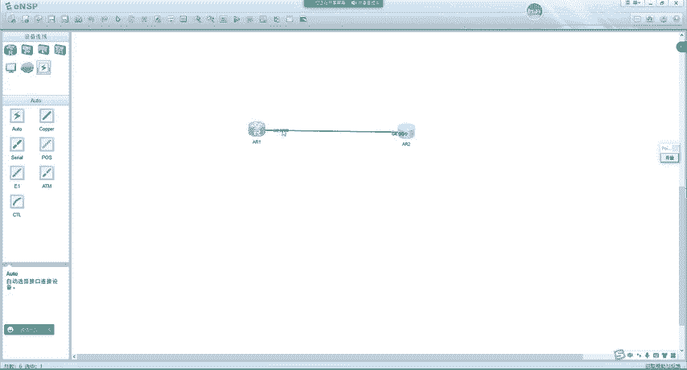

啊，这里一啊，然后这边是我们的2。A21，然后这边呢，我们是AR。把一的IPU6开了，2的IPU6也给他开一下。1的0-0-0。然后IP6。IP6d。呃，我们首先手动给他配一个linklo，好吧。

FE80冒号冒号一啊，linklocIP6dress2001冒号12冒号冒号1啊，64。然后在二这边呢。

interfaceG0-0-0IPV6 enableable IPPV6dress FE80冒ha冒ha。IP6dresss2001冒号12冒号冒号2，然后也是64。那么在这时候呢，我们在AR一上。

大家注意哦，我开启1个OSPIV3进程是一。是吧然后配一个入台地呢，是1。1。1。1。配完之后呢，我在G0-0-0接口，大家注意V3里面，我们之前说过，只能接口下启用OSPFOSPFV310，对吧？

如果你去打一个问号的，你发现后面还有一个叫做in。inss在后面我们就要输入一个ins ID对啊叫做实力ID。那这时候呢，我们可以输入一个一。注意啊，默认他是零。如果你不配的话，默认它就0。

比如说现在呢我敲一个一。

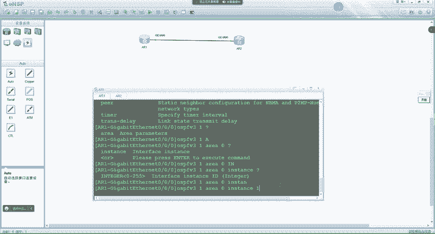

敲完一之后呢，A21在G0-0-0接口，他就会去发送OSPFV3的哈lo豹文。

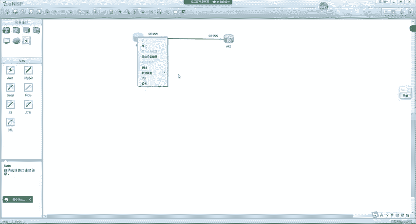

那我们来看一下这个hello豹文里面对吧，有没有ins ID。

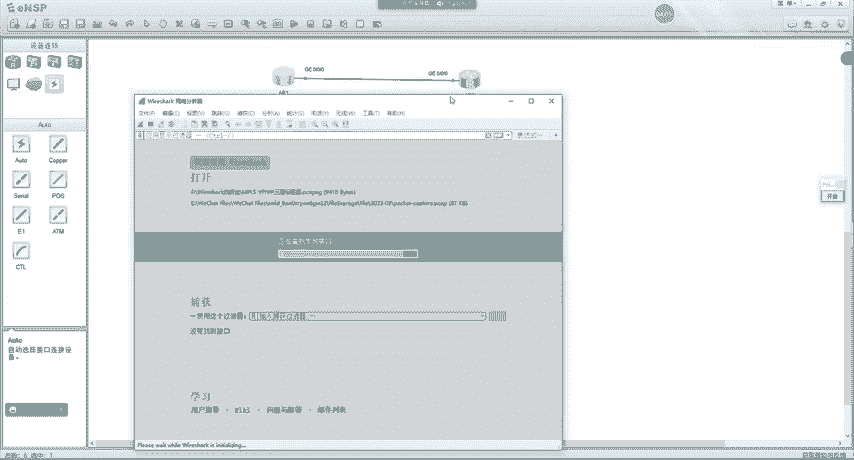

来了对吧。我们来看啊，那这时候呢，A21呢，他向FF02冒号冒号5，就相当于那个24。0。0。5去发送了1个OSPF的哈罗包。那我们打开呢可以看到前面是一个头部。对不对？那在头部里面。

我们能不能去看到一个叫做in ID啊是吧，它是一。对不对啊？取值是一的啊，那这个ins IDD它有什么样的作用呢？😊。

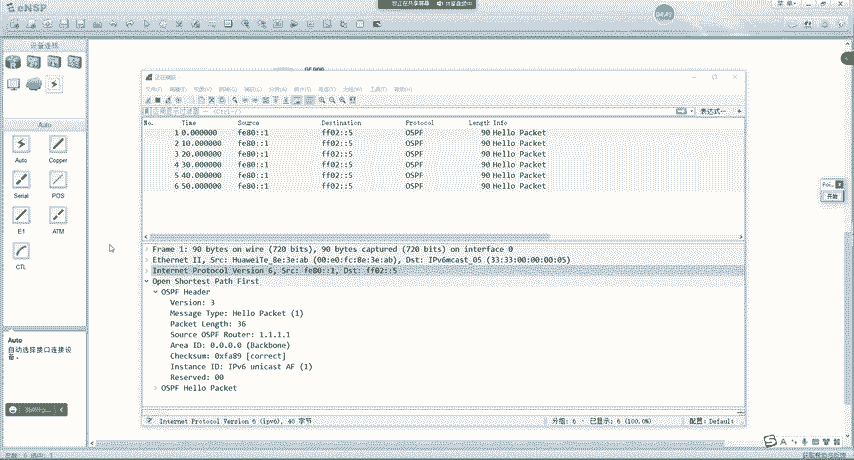

注意啊，比如说我在二上面呢。OSPFV3。一、入台地2。2。2。2。interfaceG0-0-0OSPF5。V3120对吧？ins IDD我们敲的是0。然后我第一次play this呢。

你会发现哦没有配置是吧？因为它默认就是零啊。

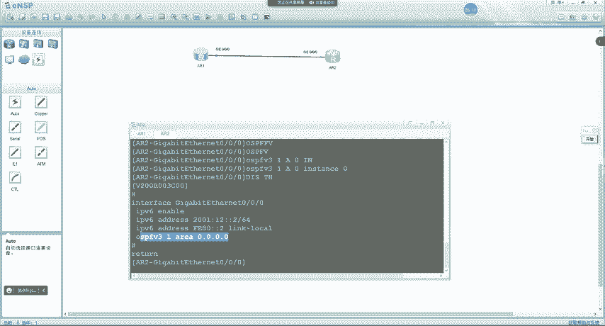

但是我们可以去看到，我在二上面也提用了OSPV3。所以说呢二呢他也会去发拢哈lo包，他的in ID是0。

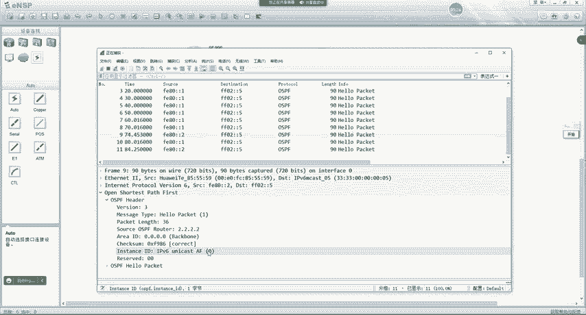

对吧现在一和二互相发送哈lo包之后，那正常我们应该是可以建立邻居的。比如说我到三上啊，到一上来看一下呢OSPV3P2。

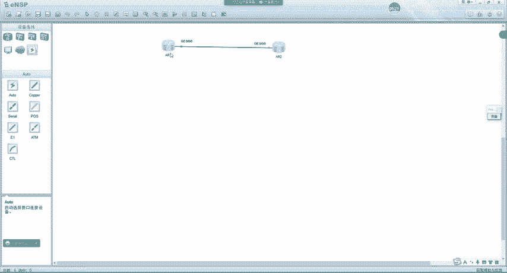

我们会去发现呢嗯没有任何邻居状态。对不对？那比如说现在我再把二的OSPFV31aral0int IDD改成一。啊。我们得先把之前的命令删除掉才能改。OSPF5。V31ar0in IDD。

0啊OSPFV310in IDD1。好吧，现在我们给他配成了一。

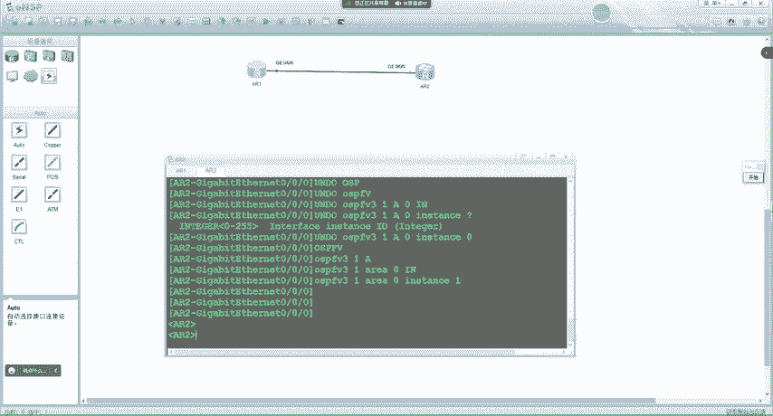

配成了一之后呢，二所在发送的hello豹文ins ID就变成了一是吧？我们看到瞬间哎，这个邻居就建立起来了。

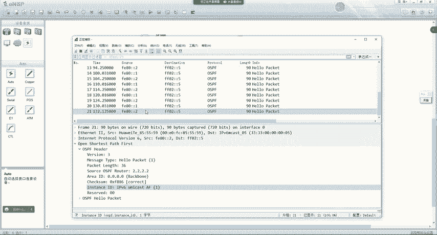

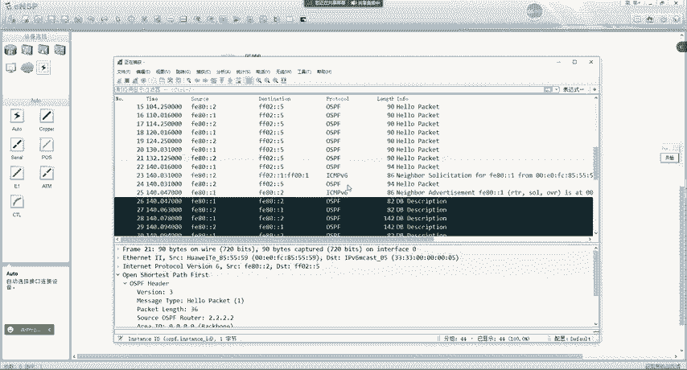

对不对？那基于这个现象呢，我们可以去观察到一点就是。当。OSPFV3建立邻居的时候。要求两端的。实例ID是吧？啊叫做实例。哎哎。实力ID相同。对吧。相同。否则，无法建立起。邻居关系。对不对？

这是在V3里面新增的一个特点是吧？你不要求掩码相同了啊，但是呢现在我要求实力ID相同，否则就没有办法建立起来邻居关系。😡，那这个它有什么样的作用呢？是吧？老师我知道了V3新增加了这么一个呃。

建立邻居的条件是吧？很简单。😊，对不对？就是我以后建立邻居的时候，我发现V3的邻居起不来是吧？啊，我查一下这个原因就行了。但是我们容易有一个疑惑，就是哎他为啥要这么做呢？对吧？有时候你能琢磨的明白是吧？

有时候你就琢磨不明白。😊，对不对？你比如说你看到哎今天那个人吃这么少是吧？哎，有时候你可能就想哎吃这么少，关我什么事啊，我知道他吃的少就行了，对吧？然后有同学可能就琢磨了，诶，他吃这么少干嘛呢？😊。

是吧哦。他是不是是吧呃看上了哪个人呢，对吧？谈恋爱了，对吧？一旦他谈恋爱之后，哎，那对工作会不会有影响呢？是不？所以说有时候你就得呃多琢磨一些，对不对？但这里呢只是给大家说一个思维啊。

那这里我们就要去琢磨一下，哎，V3里面加这个实力ID他有什么样的作用呢，是吧？老师这个特点我倒是知道了，但是呢我们得去琢磨一下，为什么要去加他是吧？哎，为什么好端端的突然去加了这么一个东西呢。😊。

那这里我来给大家说一下啊。在我们传统所学到的注意啊。传统所学到的这个OSPF里面。比如说呢。1234。对吧我们都在一个共享网络之内。注意啊，这个中间呢可能是交换机啊，也可能是其他的这个传输设备。

对吧就有可能呢我们是连接到了同一条物理网络上，对吧？就通过中转交换呃，就通过一个交换机，对吧？或者说其他传输设备啊连接到一起。那现在我可能有这样的需求。什么样的需求呢？就是我们希望一跟四建立起来邻居。

对不对？而二跟三呢建立起来邻居，但是二不能跟一4建。是吧然后一呢也不能给二三件啊，就蓝色的是一对，红色的是一对是吧？你过你的日子，我过我的日子。😊，大家能明白吧？那在V2中，我们怎么样去实现这种功能呢？

我会去想对吧？有没有呢？实际上也有方式，我们会去想一些，比如说老师啊，我在交换机上画为呢。😊，大家觉得行不行？行不行，可以吧。是吧你在交换机上华为烂把广播域给它隔离掉啊，是可以的。不同建程号不行啊。

因为OSPF的进程号只是本地有效，他不要求邻居跟他的一样啊，所以说我们没有办法通过建程号啊去实现隔离。对不对？哎，那还有没有其他的方式呢？而是化危烂是一种。是吧那配认证行不行？各位同学觉得行不行？

也可以。是吧我把23的认证密码配123是吧，一次的密码呢配345两个人的对吧，这是两对，大家的认证都不一样。那么在这时候呢啊也可以实现。是吧啊，那去也行啊，也行，对。那这时候在V3里面，我们发现呢。

通过inst IDD哎，你能不能演示一下这个需求啊？各位同学觉得行不行？也可以。是不是比如说老师啊，我让他俩的ins IDD是0，这俩是一行不行啊？也行。😊，是吧哎，那有同学就问了，哎，老师。

我V2中就有方式能够实现了V3里新增这个。😊，有点不太对劲哦。是吧。对不对？是不是有点不太对劲啊，不对劲在哪里呢？就是V2，它通过其他的东西呢也能够实现。虽然V3加了这么一个字段，做的规规矩矩，对不对？

哎，感觉没有特别大的必要。😊，是吧那这时候注意啊。我再来给大家说一下。比如说我现在想这样。我想让。123建邻居。然后呢，大家注意啊。124建邻居。三四不见。注意三四是不见邻居的。

而且三四没有办法学习到对方的路由。大家觉得还有没有办法能做到？想想在VR里面啊，有没有什么思路啊？没有所谓啦没有所谓那，可不行啊。不行啊。是吧有同学说了，老师通过mux v可以做，注意哦。

如果你通过mux v去做。😊，那一呢跟三四都建立邻居，一把三把路由传给一，一要不要再传给4？要不要？要吧。是吧。你肯定要啊。对不对？那还有没有其他方式呢？实际上我们发现啊嗯也有我给大家举个例子啊。

我在A2一上呢，大家注意。启用2个OSSPF进程。行不行？行不行？啊，实际上也不行，对吧？也不行啊，也不行，为什么也不行呢？因为你同一个进程都在这个接口发送，是不是三次都能收到啊？😊，是吧所以还是不行。

对不对？因为我没有办法起一个进程，跟三建，起个进程跟四建。对吧哎，这还有一个二呢，二你还得考虑二跟一件跟四件呢。对吧。当然有没有方式呢，肯定也会有对吧？这个得大家去课下去好好捋一下是吧？

只不过我们越想呢，他会变得越复杂。比如说老师我在这里跑m斯维烂呢，呃我在这开俩进程，这边配个。😊，呃，这边进程一对吧，给他配个认证密钥。对吧然后这边进程二呢，给这边配个认证明要。对不对？那这样三跟四呢。

分别跟一建邻居给他的不同进程。那这时候如果我们还要插入二呢，这个网络就会变得更复杂了，是吧？马上我们都要绕晕了。😊，对不对？所以说啊注意在V3里面呢，就有一种简易的实现方式。啊。

什么叫做简易的实验方式呢？我们就可以通过insprint IDD去做。😊，怎么样去做呢？大家注意啊。😊，我可以这样。首先呢我用红色的笔画啊，我在AR1上呢提1个OSPF。建成一。

然后给他规划的ins IDD都是一，这也是一。这也是一。那首先我们考虑啊。中间只是一台傻瓜的二层交换机，我没有做任何的配置。那这时候132能不能把邻居建立起来？可不可以？可以。是吧肯定可以建立起来。

因为中间的交换机，我们就可以认为他就是一个傻瓜交换机是吧？你只要哈lo包能发，那现在你的ins ID都是一邻居肯定可以起来。😊，是吧。然后注意，接下来我用蓝色的笔画。我在A2一上呢。再起一个。

OSPF进程2。这是2。然后在这个接口呢加入到进程二的int ID2中。在R上呢，也跑1个OSPF2也加入到二中。然后在三上也加入到二中。那这样说。能不能实现R1RR4去建立邻居啊？可不可以啊，可以。

是吧。那建立起来之后，有同学就问了，哎，那老师R3给R一传了一条路由。哎，R一有没有可能给R4呢？对吧。注意，现在我们来看。如果说R3给R一传了一条路由，那R一是通过inst IDD一啊，不对啊。

实例一收到。而实力本地是分割的，所以说会这样传过来吗？会到晋城二中吗？不会。当你不会到进城二的时候呢。你就没有办法传递给晋城二的邻居。所以说R4能不能学到3。3呢，就学习不到。是吧。而R3能不能学到4。

4呢，也是学习不到的。对吧。这时候我们可以去发现啊，in斯 IDD它能够实现的一个作用叫什么呢？叫做链路多附用。怎么样多复用呢？我也可以把这个图对吧？把它的逻辑图来进行画一下，它就是长这样的。这是IE。

这是R。这是R3。中间通过一台交换机连接到了一起，建立起了邻居。对吧然后这是R1。这是R。这是R3啊，不对啊，R4。他们中间又通过一条交换机建立起了邻居。对不对？这就是他所能够实现的逻辑图。对吧。

所以我们可以去看到啊，in此 IDD它主要的一个好处啊，就是可以充分的。共享同一链路的资源。对吧。而我们可以将同一个链路呢，那中间这台如果是交换机，我们还能做一些其他技术做隔离吗。

但是如果比如说它就是一台这个传输设备呢，没有什么隔离的啊，没有什么微拉啊，没有这种概念。好吧，那我们就没有办法去实现它，在V2中就没有办法去做了。但是在V3里面呢，咱们通过inst ID啊。

就可以实现这种作用。啊，我们可以认为叫做链路的多附用。对不对？那这时候我们可以去发现，哎，这是一个逻辑网络，这是一个逻辑网络，而不用再去买两台是吧？呃，交换机了啊，还能节省一定的成本。

所以说呢这就是在V3中ins ID的一个作用。好吧，呃，但这个呢咱们一般也不用啊，就告诉给大家啊，有这么一项功能。好吧。那我们的OSPF在建立邻居的时候，大家只需要知道的是什么呢？

就是他会把ins ID呢携带到哈lo包里面。

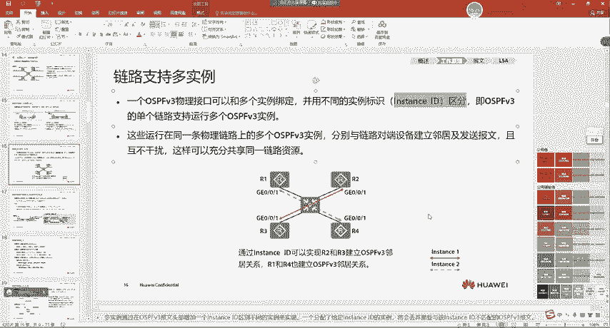

如果两边不一致的时候。OSPFV3的邻居是没有办法进行建立的。好吧，而V2里面呢，我们要携带掩码，那V3里面呢就没有这种了。

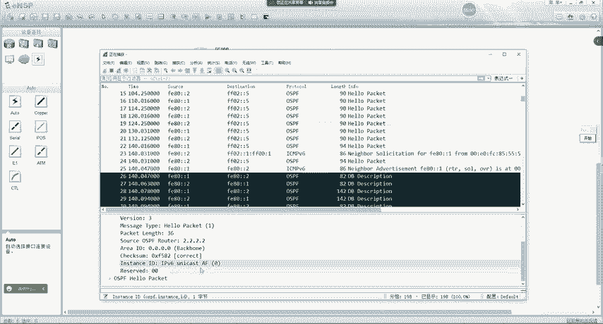

就只有一个in此类ID。就是不再要求掩码一致啊，但是呢要求这个实力ID是一致的。

那这就是嗯in ID的一个作用啊。呃，刚给大家说这个大家课下可以去做个实验啊，但这个呢咱们工作中用不着啊，嗯考试也没有考。所以说大家知道一下啊。呃，他跟VPN实力的ID还不一样啊。不一样啊。

这个insprint IDD呢，它只是把OSPF。啊。我聊天框怎么打不开了？嗯，我给大家说一下啊。😊，这instance IDD呢注意，虽然124能建立邻居。123能建立邻居。

但是一无论是从三上学习的3。3，还是从四上学习的4。4，他有没有在同一个路由表中啊？有没有？有吧，肯定都在同一个路由表中。是吧。那。😡，这是因斯坦ID没有办法实现的。也就是说，他只能够去控制邻居的建立。

那他能不能实现路由的隔离呀？是不是不行啊？对吧而VP实力呢，它是实现路由表的隔离啊，它俩的作用是不一样的。好吧。如果说之前给大家讲的时候，还记得吧？这连了个1。1，这连了个1。1。呃。

我们可以在这个路由器一上呢划分两个呃微平实力啊，这边一个这边一个，然后这边路由表有个1。1，这边路由表有个1。1。是吧VP实力是实现路由表隔离的。

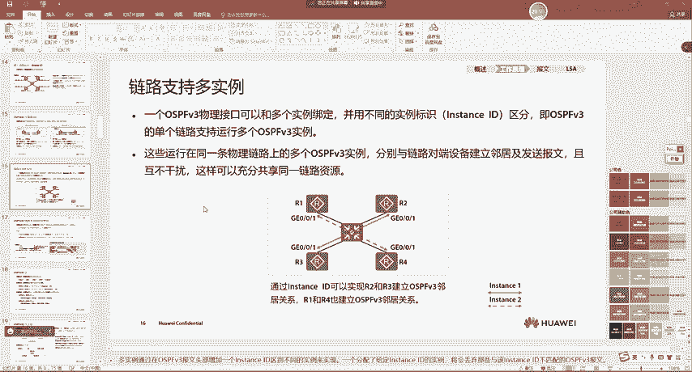

好吧。那接下来我们要说的一个就是OSPFV3啊，对链路本地地址的使用。这个实际上呢，咱们先前的课中呢也给大家去提过，对吧？首先第一个呢就是OSPFV3的链路本地地址呢。

是作为报文发送的原地址和路由的吓一跳，对吧？基于这种特征呢，我们就可以去发现。如果你是通过链路本地地址。建立邻居以及作为路由表的吓一跳。那当你接口的全局单波地址产生任何改变的时候。

那我们的OSPFV3的邻居。都是稳定的，也就是说不会去产生任何的问题。对不对？而也会使用链路本地地址来维持邻居关系，同步LIC，也就是说在OSPFV3里面。全区单薄地址跟他有没有关系呢？实际上关系不大。

因为我们都是基于链路本地地址来进行工作的。那所带来的优势呢主要有两个啊，第一个呢不需要配置全局单薄地址，就可以得到OSPFV3的拓扑，实现拓扑和地址的分离。对吧我们想一下，我们在V2中。

你不配一个单波地址。你邻居能不能起来呢？能不能啊？不行吧。也就是说在V2里面呢，我们想要构建OSPF的拓扑，你必须要有IPV4地址。对吧V3里面呢，哎我们就不需要了，我们只需要有链路本地地址是吧。

就可以了。那拓普呢跟那个全局单波地址就没有任何关系了。好吧，实际上拓普和地址的分离。但大家注意啊，这个地址说的是全球单波地址。能懂吗？你没有链入本地地址行不行？😡，行不行？不行。好吧。

但是有没有这样的情况呢？没有之前给大家说过啊。😡，具有IPV6通讯功能的节点，自动就会产生一个链路本地地址。好吧。那接下来第二个优势呢叫做OSPFV3的报文，不会被转发到始发链路之外啊。

减少了不必要的泛红，节省带宽。嗯，这句话呢，我不是特别的赞同。我给大家说一下我的主观看法。好吧呃，为什么我觉得这句话写的不太精准呢？是因为这样的。😡，我们来想一下。在OSPFV3中。

为什么V3的报文不能被转发到始发链路之外呢？假如说这是一，这是2，这是3。是吧一的哈lo包等等豹文呢？哎，为什么不能转发到其他链路？是因为这么一个原因，什么原因呢？链路本地地址作为原地址。

没有办法实现跨网段的通讯。对不对？没有办法吧是吧，没有办法。对吧哎。那在OSPFV2中。我们的原地址虽然是1。1。1。1，但是目的地址是一个主播地址。那224点。0。0。5。

这种地址这种主播地址能不能跨越链路啊？拿不拿？是不是也不行啊，对吧？他只能在链。上来进行传递。好吧，所以说这里呢。嗯，当然有这么一个特点，对，这只是注意啊。这里所写的优势呢只是把V3的特点给他说出来了。

而不是代表VR没有。大家能懂这个意思吗？李一杰同学敲一啊，没问题吧。😡，好吧。也就是说，V3的报文不会被转发到始发链路之外，是吧，这个特点V3是有，但是V2。本身也有这种功能。那懂吗？VR也有啊。

这里呢呃相当于。啊，有点耍赖。是吧就是我把V3的优势说一下，这个说的就很直白啊，但是呢没有拿V2进行对比，所以大家注意啊，这里呢V2也具有这种功能，这里只是把V3的特点说了一下。

那这是OSPFV3使用链路本地地址的是使用链路本地地址的时候啊，它所具有的一些特点。那OSPFV3的报文，他的目的地址有多少呢？对不对？那我们就要来看一下OSPFV3的包。之前我们讲过。

那V3呢和V21样，有5种包。helloDDRSRLU以及RSACK是吧，一共有5种数据包。那么V3跟V2的协议号都是89。V2在IPV4报文中的头部上层协议标识是89啊。

V3就是在IPV6的下一个包头标识是89。啊，我们会去发现呢，注意啊，看完这一点，V3跟V2类似，都使用主播地址作为OSPF报文的目的地址。VR呢我们使用24。0。0。5以及DRBDR会监听点6。

V3呢使用FF02冒哈冒哈5对吧，DR会监听点5跟点6哦是吧？DR会跟BDR会监听点6。咱们回去发现啊，注意啊。😊，嗯，V3跟V2还是有很多的相似点的，这里是为什么呢？嗯，我来给大家解释一下啊啊。

当然也是我的一种看法。嗯，这相当于什么一样呢？相当于。大家注意。我们在工程师从V2过渡到V3的时候。是吧啊，我们要进行学习，需要时间的。对不对？那在过渡的这个阶段呢啊也要保留着很多之前的一些特征。

但这个特征呢并不是为研发者去考虑的。因为对于那些呃研发路由协议的人来说，他们把OSPFV3啊各种标准写出来就好了，以及各种工作嗯这个方式写出来就好了，对吧？但是如果这种技术真的要大规模的去部署。

那我们也要考虑到人对他的一种适应能力。对吧比如说我把V2直接换成V3啊，但是没有什么哈喽包了。哈喽包以后不叫哈喽包了，是吧？😊，嗯，他甚至呃叫什么啊叫？好，大家自己体会一下，可能就叫其他的报文了。😊。

对吧是吧可能就要其他的了。那这个名字呢，你不好记住。😡，能不能明白？也就是说，如果V3在向V2过渡的时候，是一个完全独立的。也就是说直接是一个大的变更的话，嗯，它很难被普及起来。😡。

那或者说呢普及的会很慢。为什么呢？因为对于搞技术的人来说，就你这种协议部署之后呢，依然是需要技术去维护的对吧？或者说我们需要技术真正的去把它落地的。😡，对吧如果那些。

部署这项协议或者说部署这种技术的人呢，他的学习周期就比较长是吧？学习负担也比较重。啊，那这个技术呢，他以后发展就不是特别好。对不对？发展就不是特别好。就像我们之前所说的啊，大家在很早之前听过一种是吧啊。

叫做SDN啊，大家应该觉得还是比较新奇的是吧？现在还有同学老师老师SDN多么强，对吧？是吧？转控分离。😊，对不对？确实这个是没有错的啊。SDN注意啊呃它只是一种思想啊，之前我给大家讲过，对，就是一种。

嗯，它里面提供的两个思想是比较重要的啊，一个是开放可编程。第二个呢就是集中控制。但是注意啊，这只是一个思想。我之前给大家说过，就像我们说，我们要实现共同富裕，这就是一个思想。😡，那怎么样去实现呢？

我们需要有具体的行动。对吧换到我们的网络中呢，SDN就是一个思想。那这种思想要怎么样实现呢？我们要有不同的协议呀，对吧？不同的功能去实现它。所以说网络支出呢就是一个想法。

然后我们才会去衍生出各种各样的技术。😡。

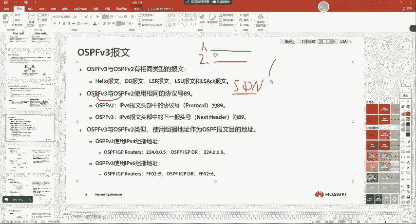

就像你老板一样。你老板有个想法，然后给你说，你去干吧。😡，对吧。那是不是你在想怎么样去干啊？对不对？所以说SDN只是一个想法。😡，那具体呢我们要有技术去实现这种想法。那在最早期的时候。

大家应该听过一种叫做open flow的对吧？基于open flow的 SD。那这种现在嗯就没有用是吧，现在我们会去发现啊，很多厂商都没有在用它。是吧嗯，现在主流的，你像思科、华为、华三啊，对吧？

都没有在用它。啊，为什么没有再用它呢？注意啊。open flow它就把传统的网络给颠覆了。注意什么叫做颠覆了呢？就是你传统网络到open flow。这种方式下。哦，他是没有办法进行一个平滑演进的。

大家能懂吗？如果有同学了解过，应该是知道的。open flow里面下发了一种叫做流表。注意啊，我给大家解释一下。😡，刘表。有同学不明白了是吧，老师什么叫流表呢？是吧？我就知道路由表麦克地址表是吧？

ARP表是吧，还有我表哥，对不对？那什么又是流表呢？😡，是吧啊，大家可能知道老表。😊，对吧我给大家解释一下啊。😊，呃，在我们传统的这个转发中呢，我们的设备要看什么啊路由表。

那路由表呢会将转发信息下发到FIB中。对不对？我们是知道的。是吧那这个FIB实际上大家之前应该看过他储存的是什么啊？😡，就是一个目的网段是吧，出街口吓一跳啊，以及呢吓一跳的麦克，类似于这种。对吧。

是不是啊？那注意啊，就是我们的FIB它本身是有单独硬件的，叫做ASIC是吧？或者说NP啊这种转发芯片。对。那比如说我们说是NP这种转发芯片。那这种转发芯片要想储存FIB的这些转发信息。

也就是说硬件需要进行编程。大家能懂吗？好吧，就你这个硬件要能够编程，就是编程这个硬件呢，能够储存这些基于IP的转发信息。😡，而open flu下发的是流表，它跟普通的FIB可不一样哦，它差别是非常大的。

他是基于每个流。有一个表象。那如果我们当前网络中的路由器没有办法储存这些流表。那是不是就代表着什么交换机呀、路由器呀是吧，他们的硬件。😡，要不要变？要不要？要吧啊就5元组一个流这个概念没有变啊。好吧。

也就是说我们的所有的转发芯片呢。😡，以后可能就用不了了，是吧，他相当于把我们传统的网络这些颠覆了。是吧就相当于给你说，现在呢我们要换一批人是吧？当代年轻人的思想不行，整天想躺赢对吧？怎么办呢？😊，啊。

这个18岁以上的人，对不对？18到40全部一下子砍头。对吧啊，然后下一代人呢培养出一种新的思想。能不能明白？哎，那这种呢嗯就不太切合实际。

是吧因为我们open flow呢就一下子把传统的网络设备呢全部都被淘汰掉了，是吧？只有新网才能部署。😡，对不对？呃，但是呢注意啊。呃，就是因为这种思想的当然还有其他的缺陷啊，除了这种流表啊。

就是硬件可编程这一块嗯，那还有其他的。你比如说每个流一个会就是每个流一个流表，那我们的设备就要储存很多，对吧？设备的负担也比较重。而且呢他提出了一种叫做什么集中控制。那比如说当网络发生了变化之后。

要去重分下发流表。那要有你的控制器去执行啊。那网络设备这么多，是不是收敛也会变得比较慢？对吧所以说后来呢有很多的。就是实现SBN的一些其他的协议。啊，不断的再进行推出。

那现在我们用到的都是基于ncom的。来自康复就考虑了对现网的兼容性。那他是怎么样进行考虑的呢？注意。这还是我的路由器。是吧我不给你下发转发信息了。你路由器有CPU，你自己算，我就给你推配置，告诉你。😡。

我把配置给你了。能不能明白？我把配置给你之后呢。然后你按照配置自己去计算。也就是说，你传统的网络设备只要能够接收这些配置，注意啊，这只需要软件上的升级，就是你支持这个协议。

能够读取这个协议下发的配置就好了。😡，对不对？然后你把这个配置拍到你自己身上，你按照这个配置去执行嘛。😡，大家能明白这意思吧？对不对？也就是说你的硬件啊，依然是基于IP的，并不需要变形重新的改写。😡。

是吧他就考虑着对现网的一种兼容性。那运营商就喜欢了。运营商呢他占据了啊就是网络的一些主导地位啊。😊，他能懂吧？因为厂商你研发出来之后，你最终要卖。啊，你的主要的大客户实际上还是运营商。啊能明白吗？

所以说他考虑了对现网的一种兼容性。而且呢也能够实现一个集中的控制。对我通过控制器呢可以去收集网络设备的一些信息。对不对？那也可以去实现一些集中的配置下发。而他不是对网络颠覆性的改写，它相当于一种眼睛。

大家都明白吧。对吧莱德康普他还考虑了对现有的兼容性。所以说我们现在大多的厂商用的都是这一种。而你像传统的那种啊，当然这个SD思想是。嗯，跟open flow可以说是一起诞生的。啊。

但是这个思想是很重要的。注意，虽然我们没有用open flow这一种啊，但是这个思想是非常重要的。好吧。重要在哪里呢？这种集中控制就方便管理员很多了，对吧？以后大家这个就不用天天配了。对不对？啊。

那些配置呢瞧着实际上难受的很啊。如果同学。😊，呃，经历过应该知道的对吧？不断在刷脚本，重复的配置。啊，一直在刷，还容易出错。但是以后呢，我们通过控制器啊。他能够做到的就更多了。但除了这些协议呢。

还有一些7788的啊呃，刚刚有同学说SNMP。😊，对吧也有没错，也是有的。除了SMP呢，还有7788的好多一大堆呢。那这些东西呢，如果大家想去了解嗯，给大家说一本书。对，里面有记载到。啊。

当然我也是看书之后了解到的啊。嗯，这个。这个书叫啥来着？我说一下啊。叫做SDN的。不署啊，不是。什么战略。嗯反正很多啊，他什么战略什么。😮，应该叫深度。解析SDN。啊，这一本好吧。

就这一本书啊啊是中国的一个作者写的。

但这里面没有确切的技术啊，我给大家说一下呃，这里面呢没有什么技术啊，但是呢大家要去看一下，去了解一下，就是你对这个技术的理解会变得很高。😡。

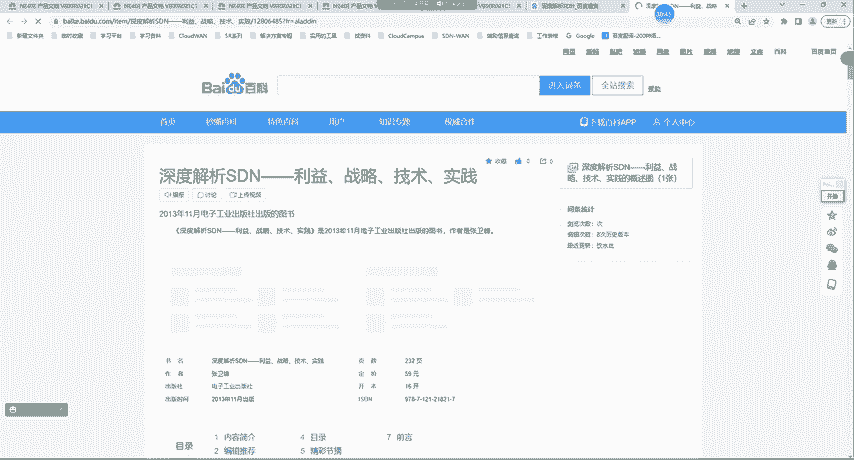

就是他的利益对吧？呃，战略对吧，什么样的技术。时间。也就是说他所产生的一种商业模式是什么样的？当你看懂了一个技术的商业模式之后，你才能够明白他未来的发展。所以这里大家明白了吗？

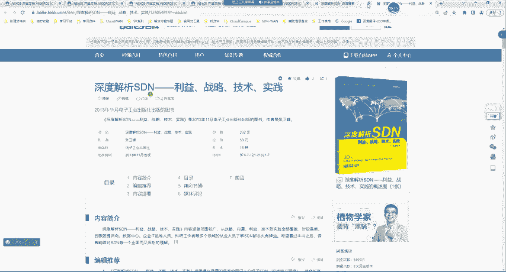

明白的同学敲一啊，不是说老师我OSPIV3是吧，为什么大家都用呢？就是因为它是有自己商业模式的。😊。

好吧，你相当于我们就说免费，那这就是一种商业模式是吧，所以说大家就喜欢用它。😡，好吧，所以说大家想了解的话，那本书嗯可以去看一下啊。😊，好，那我们回到正题。那我们就可以去看到啊呃。

V2在向V3进行演进的时候呢，我们也考虑到了一些工程师的呃感受是吧？比如说我到时候是吧这个研发者给你写了一个什么冒号冒号ACDA你根本记不住对对？但是我们继承了跟V2的一些特点呢，是吧？这样就熟悉多了。

😊。

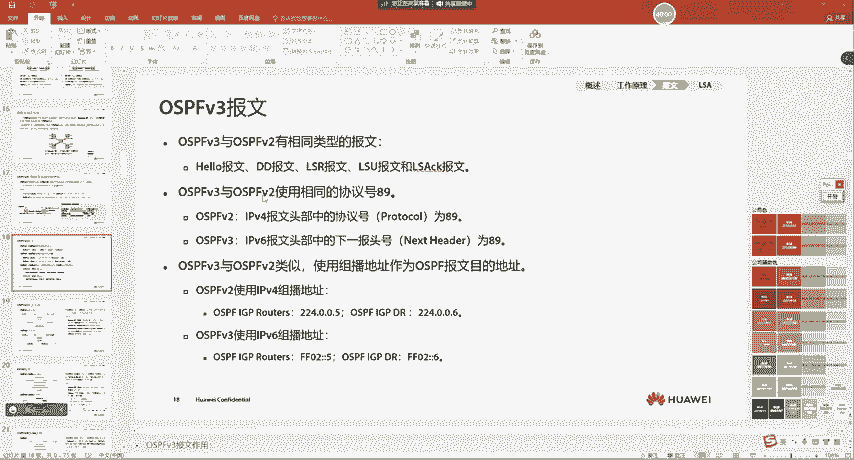

然后我们继续来看啊。😊，那接下来我们要去讲的就是一些OSPFV3的一些包了是吧？嗯，以及它不同的这个LIC。一个来吧啊。然后我们来看啊呃，我们在学V2的时候呢，大家是知道的啊，就OSPFV2呢。

它的报纹有两部分组成。😊。

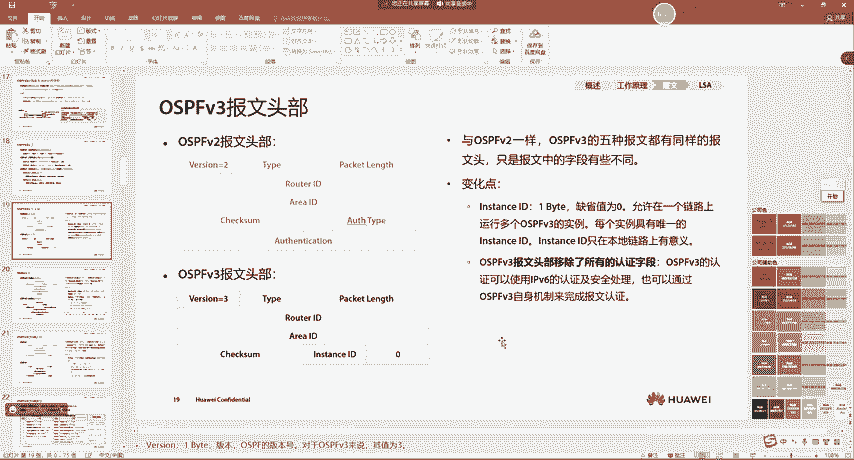

一种呢叫做通用包头。一种叫通用包头。那是每1个OSPFV。VSPF的豹纹。都会携带的。一个爆头信息。那还有一个呢叫做OSPF报文。是吧。YPF豹纹。用于携带具体的。内容。就是会有一个通用包头。

还有OSPF报文。

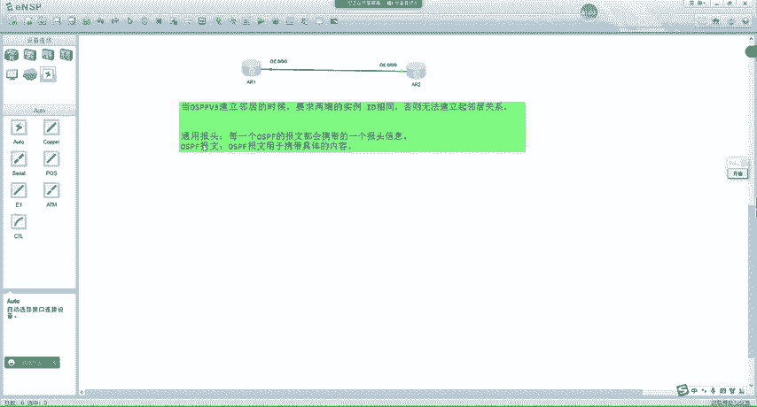

那首先我们讲的就是V3跟V2的啊通用包头啊，他们有什么样的区别？我们看啊，VR里面呢有个版本对吧？啊，有个typetype是用来指明啊，我这个通用包头里面呢是什么样的这个豹纹，它的逻辑结构。

大家还记得吗？

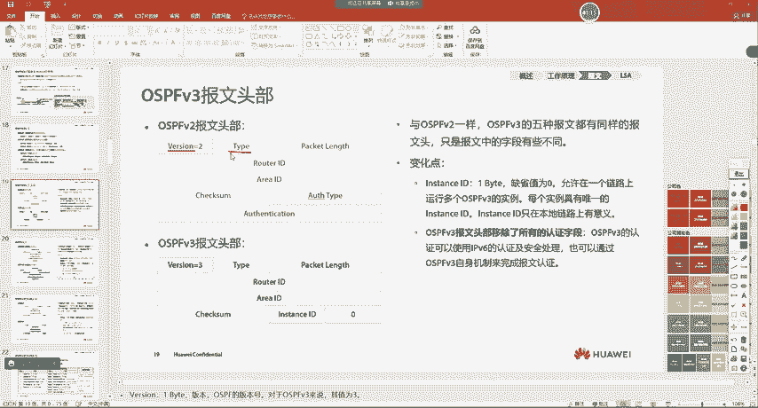

这是不是OSPF的通用包头啊？

是吧。那是在IP层啊。这是在IP层下一个协议89万，但OSPF包里面它是包含两个部分啊，一个叫做OSPF的通用包头。还有一个呢叫做OSPF的哈罗包。可以看到吧，这是OSPF包的一种逻辑结构啊。😊，好吧。

这一看IP没抓包吧。啊，大家平常做实验。刚开始学的时候啊，一定要抓多抓包看看。

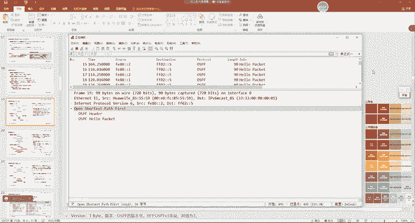

那我们继续来看啊。😊，里面有版本type，对吧？就是里面具体是什么包，对吧？呃，头部长度呃，root IDD区域ID校验盒对吧？认证类型认证数据。这我们在VR中接触到的一些。啊。

那在V3里面大家注意啊啊主要就是新增了一个叫做insI。这个刚刚给大家说过了，啊能够实现多实力复庸。那还有一个保留位。

像typepe啊对吧爆头长度啊、root IDD啊、去域ID啊嗯chake some啊。这一块是不是都一样啊？啊，版本不一样。对不对？ins ID呃，还有这个保留位，现在没有被定义。

我会发现V3里面少了哪一部分，少了认证这一部分。对不对？注意啊，OSPFV3本身不提供认证功能啊，他不提供认证功能。OSPIV3的认证呢是通过IPV6的认证头AH这个认证头来进行实现的。好吧。

就是我们也可以去配啊，但是模拟器里面配不了，就告诉给大家V3的包里面呢不带携带认证的字段了。😡，而他是通过IPU6的扩展头来进行携带A认证包头。那通过扩展头去携带的话，他有什么好处，大家还记得吗？

比如说我没有配认证的时候。带不带？😡，带不大？是不是就不用携带？对，没错。是吧就相当于你下雨拿伞一样，没下雨，你就不拿伞嘛？下雨用到的时候再拿一下。😡，好吧，当然这个我们做不了实验啊。

就V3里面有很多的都做不了。😊。

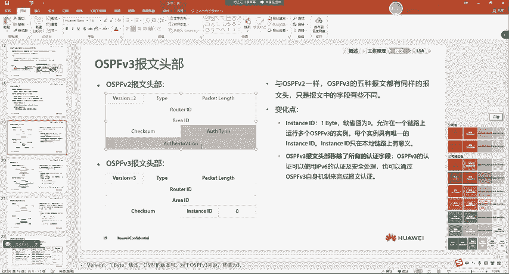

我待会会学到各种各样的字段啊，都做不了实验。模拟器里面都没有。啊这种技术是比较新的啊，你学的只是纯理论。很多设备都没有实现的。所以说待会儿会给大家讲这些。嗯，但是呢做不了实验，就大家只能只能体会一下。

好吧。很多真机里面也没有。这就是纯理论啊嗯这个技术呢还比较新。😡，然后我们来看啊。这是OSP和V3跟V2包头的一个对比。那接下来就是哈罗帮。hello包在我们的VR中呢，在这里有network啊亚马啊。

hello周期option啊，DR优先级啊，DR是谁？😊，啊不对啊啊，死亡时间对吧？40秒DR是谁，BDR是谁，对吧？active neighbor跟谁建立的邻居。😊，对不对？在V3里面是这样的啊。

大家注意。首先。DR优先级大家都有。对不对？hello周期。大家都有。对不对啊？啊，讲的意这个也许以后就有了啊。你比如说华为回来再打个补丁，改个软件版本，那这个功能可能就支持了。😊，那懂吗？

但是现在是没有的啊。然后在这里呢。有个路由器死亡时间。一样吗？第二。一样吗，BDR。一样吧，内部ID一样吧，那实际上我们主要关注的就这几个。不要。一个叫做interface IDD。

是吧这interface ID呢，它是干什么的呢？我们在VR中没有类似的概念。但是这里呢大家注意啊，你现在不需要理解interface IDD。因为后面我们讲到算法的时候，大家才能够真正理解。😡。

所以说大家需要知道的就是一个叫做。OSPF里面呢加上了一个叫interface ID不是ins啊，不是实力ID，这个叫做接口ID。😊，同意。他是用于。标识。唯一的。唯一启用OSPF的接口。注意啊。

你就现在只需要他知道啊，他有这么一个作用，就是用于标识的。但是为什么要这样做吧？为什么要加这个我们回来讲的算法的时候，大家才能够理解到。所以先知道它的特征，慢慢的再去体会。😊。

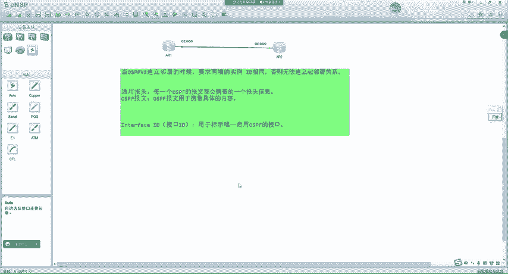

好吧啊这就跟大家之前在学技术的时候一样啊，先学规律。😊，对不对？循案规律之后啊，慢慢的你就能够体会到了。相当于以前你学勾股定理，什么勾股定理啊，就会学。但是后面当你生活经历变得越来越多了。

是不是发现勾股定理就开始理解了哦，原来老师那时候让我学到勾股定理是干这个事的。😊，是吧所以说现在也是一样哦，大家先知道它的特点啊，后面呢再去理解好吧，然后在这里呢，注意还有一个option。😊。

这里也有一个op不tion。那V2跟V3的option是有区别的。那这个区别是在哪里呢？注意。😡，在我们的OSPFV3中，首先这个option的长度变得更多了。他一共呢占了三个字节，一共是24个比特。

而V2里面呢，他就占了8个比特，也就是说一个字节。那V3相比V2的option呢，它增加了ATR和V6V。对呀，那他们分别是干什么事的，我们来看一下。😊，啊，没在这写，应该在下面啊。

这里也没写没写算了啊，我们看大胶片里啊，应该是写到了。😊，我们来看这里啊。😊，首先，AT呢用来代表设备是否支持OSPFV3的认证。啊这个就比较简单，就你能不能做OSPF5V3的认证。那后面这个R呢？

代表始发路由器是否具备转发能力？V6呢代表是否参与IPV6的路由计算，注意。什么叫做具有转发能力？什么叫具有IPU6路由计算？我来给大家举个例子。比如说这一。这啥。这是3。这是4。

他有点类似于SS的overlook的。比如说啊。3、现在访问4呢，这cos的一，这cos一，这是2，这是2，他是不是走上面的链路啊？是不是一定是的。那你现在呢啊你老板给你下任务了啊，小李啊。😊，呃。

你把这个路由器一呀。升级一下。啊啊打个补丁。啊，防止到时候出现问题了啊，网络被攻击了。对不对？因为他软件版本比较老了，你就给他打个补丁去。那大家注意，如果你要升级软件版本。

那你这个设备承载的业务能不能直接升级，肯定不行。我们应该尽可能的去保证业务的稳定性。所以这时候怎么办呢？我得想办法。让三访问四的流量啊，你从下面续走哎。哎，我怎么样让他从下面去走呢？我有很多种方式。

你改cos的行不行？可以。😊，对不对？改扣子上行不行？可以吧。😊，是吧我做PBR行不行啊？我把所有流量指到下面也行。😊，对吧就是方案有很多。对不对？但是我们在V3里面呢嗯在V3自身上啊就提供了一种方案。

就是我们看到的阿比特。他是用于指明路由器是否具备转发能力。也就是说，R一。注意，如果他在自己产生的LSA中将R位质1。R等于。对意。代表他是具备转发能力的。如果等于零的时候。就是R一呢。

他说他不参与IPV6的转发。那么在这时候。三在计算四的时候就会忽略一的top数参考。啥意思呢？就是我计算出了一，但是呢我不会计算一的拓普数。对吧只要他不计算一的托普书，那未来就不会通过一访问其他设备吧。

😡，是不是啊？对吧。因为我就知道一啊，我不知道通过一能去往其他人，所以说我去往任何人都不会经过这个一。😡，对吧那这时候不就代表着一说自己不具备转发能力吗？那如果说未来你要在升级的时候。

你通过就是现在社会上没这个命令啊。哦，当然我查的软件版本可能老一点。😡，去年我查的啊，今年没注意啊，今年可能新升级新的软件版本了。😊，反正这年我没注意啊，去年我查过了，没有。😡。

就产品手册里都没有这个命令啊，没有命令让你调。😡，但是要给大家说，有这个理论。能懂吗？就是如果他把阿比特。开始通告出去。那未来三收到之后不计算一的托补数，他访问四是不是通过下面去走啊？这里大家能明白吧？

明白的同学敲一啊，没问题吧。😡，是吧那这种情况用到啥时候呢？老师我除了升级，还有其他方式吗？有啊，比如说一的负担比较重，你看他接口带宽100%了是吧，这就一个十0兆的。😡。

那这时候你能不能置卫让他把流量先切换到其他链路啊？那我先把这边的网线给他换一下，换个万兆口好用点。对不对？那这是阿比特的一种使用方式啊。还还有一个叫V6啊，代表你要不要参与IPU6的路由计算？😡。

如果威6比特之一。注意啊，假如说我们只是阿比特，有阿比特的时候。😡，那。AR一上有个1。1。1。1。三会不会计算？大家觉得三算不算？算不算？😡，一定是算的，因为他并不是拓扑信息啊，它只是一个叶子信息。

对吧。那威6比特之一呢，他连叶子信息也不算。就是直接把一从自己的SPF数中删除了啊，压根就不考虑了。啊，所以说访问1。1的业务呢也就没有了。呃，什么时候没有了呢？就是我们一在升级的时候。

我即止一自己承载的一些业务呢，我们可以把V6给它是一。😊，啊，阿比特呢可以是这样的。就是当一的负担比较重。是吧我们可以将阿比的之一呢，先把流量切换到其他链路。对不对？但是呢对于一自身的1。

1这个业务访问呢，我们依然是能够提供的。是吧比如说你三访问4这条链路的带宽已经到百分之百了。但是你访问我一自己身后的业务呢，这条链路带宽呢可能50%。是吧还能用。那这个时候呢，我们可以将R尔比特之一。

就是你不要经过我去其他设备了。😡，但是呢你可以访问我自身的业务。啊，我把这边的网线去换一下啊啊，插个光模块。啊，换个万兆的。对不对？但是如果V6也之一的话，就代表啊我这个设备呢不希望你们访问了。

不希望你们访问什么原因呢？就是我们可能从管理意图上啊就开始做一些升级了啊，或者说把这个设备替换掉了。😡，好吧。所以说这就是OSPFV3的一些option啊。那中间还有一些在V2中。本身就有。

像DC啊对吧，按序练路。呃，NP啊，这个大家应该都学过。是吧呃MC啊用于这个主播OSPF啊，这个大家不用管了，现在已经不用了。那伊比特呢有没有50LC处理能力啊，这个大家应该在IP的时候都接触过啊。

那这里呢大家只需要知道新增了这么三个字段。好吧啊，不需要记啊，我也没有记住过。你要不是这次给大家讲的，我也忘了啊，所以说我们并不需要去记它用到的时候看一下。😡，然后我们再来看。错来，哈老吧问呢。呃。

接下来就是各种LC了。但LSA的区别就比较多了啊，这也就是我们在OSPV3中所重点学习的一些。那主要的一类像一类、二类呢、三类啊、四类啊、五类啊嗯实际上。没有特别大的作用啊。就是我们看一下。

实际上就差不多了。因为跟V2差不多啊，主要学的就是8类跟9类啊，在V3里面新增的。新增的这几个LYC呢优势非常明显。嗯，待会我们讲到的时候再给大家说。😊，嗯，这个学习呢要耐着性子来好吧，所以我们来看啊。

😊，呃，在OSPFV3里面呢各种LIC也做了一些改变，但是改变呢不是特别大。我一个一个来瞅一下啊。😊，呃，首先这是V2的，然后这些都是一样的啊，这些我们就不要再说了啊。

就是说H啊链路状态ID啊啊通告者啊、序列号啊是吧？嗯，check sum啊程度啊啊这些都是一样的。😊，那咱们只需要去关注的啊啊所重点关注的是在哪里呢？首先，option发生了改变。对意啊。

这个option刚刚我们也已经说过了。对吧就是在V3里面新增了，首先长度变得更长了。第二点呢，扩展了三个新的字段。对吧这是在V3里面O审的变化。那同时有一点大家要注意。在V3里面呢。

RStype变化是最大的。怎么叫最大的呢？现在我先来给大家看一下。OSPFV3LSA的头部信息。对意啊，这只是一个头部啊。我找个弟弟啊，看头部。比如说我们找个一类LC看他的头部。这是V3的啊。

老花时间啊，没啥说的吧。😊，是吧。呃，不老化对吧？这个是在DC按训练路中会使用的。啊，咱们不用去赶他。啊，梁路状台地。有人问老师咋0。0啊啊，不用管。😊，啊，现在我们还没讲到啊，就大家知道有这么个字段。

通报者有是吧，作用反正一样的，就表现形式不一样呗，序列号有对吧？check sum有。😊，呃，长度有。AL type2001。把一下子看蒙了啊，老师这是我的。😊，出生那年啊是吧，是你的生日。😡。

来后我们打开啊，对意啊，他可不是为了纪念你的。😊，他干什么的呢？我们来看啊。😊，RStype呢123，它有三个部分。对不对？那第一个部分呢？世界我们一般把它要优比他啊。叫做LRC的泛红的一种控制方式。

我们把它叫优比特。联衣呢是他的饭户范围。那后面这个呢是他的功能代码，原人都懵逼了。

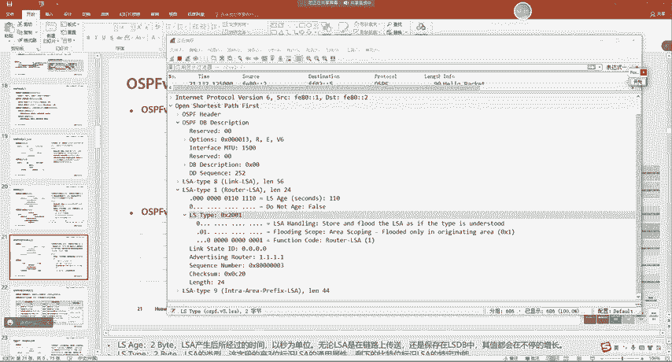

啊，老师，这是什么意思啊？我来给大家说一下啊。😊，注页。嗯。我们在BGP的时候学到过一种属性叫做什么啊？大家还记得吗？叫做。😡，可选。过渡属性。嗯。可选过渡属性，它有一个什么样的特点呢？就是BGP设备。

虽然。无法识别，但是可以传递给。BDP邻居。那这是我们在BDP里面学到的一种属性。而在我们的OSPFV2中，我们就要去想哎，OSPFV2啊，它每增新中一种功能，对吧？就要新增。一种LIC。

比如说我们支持GR扩充了9类，对吧？支持MPSTE呢扩充了10类，对吧？嗯，那当然还有其他的啊，就是跑SR的时候呢嗯扩充了11类。也就是说我们每增加一种新的功能呢，就要新增一种新的LC。对不对？

而在我们之前所学习的过程中，如果说大家注意。OSPFV2呢，他收到了一种LIC，但是自己没有办法识别这种场景处于在什么样呢？比如说R一呢。😡。

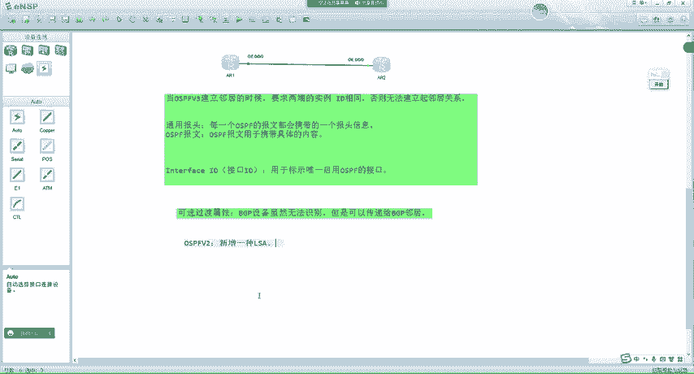

他的软件版本比较新。啊，我们讲完这一点休息啊。然后L呢，它的软件版本比较老。😊，有没有这么一种可能呢？就是R一。😡，更新了软件版本之后，它支持了这么一种功能，就是支持了一种新的LC它传给二了。

但是二没有办法识别。😡，给你丢了。但是二身后的三需要啊。大家能明白吗？好吧，但是三是需要的，但是二没有办法识别，他给你丢了。😡，那三就收不着了。而我们在BDP里面就有一种叫做可选过渡属性是什么样的呢？

一传了一条路由给二带了1个BDP属性是吧？虽然二没有办法识别，但是他一看到是可选过渡属性，它还可以传给三。所以说三可以识别。😡，对不对？这是我们在BDP里面接触到了一种特点。对吧那三基于这个属性呢。

就能够识别AR一所要传递的那些信息。对吧。这就相当于我跟你说啊，我给你说个密码是123，然后我让你给另一个人说。😡，是吧你并不知道密码是123是啥意思。😡，那你就知道这么一句话。

但是你把它传递给另一个人，另一个人就知道了，密码是123啊，我俩心有灵犀，他知道了啊我的银行卡密码是123。😡，大家能明白吗？所以说啊注意。😡，2、如果在OSPFV2中，2如果不支持这种功能。

他是不会再给邻居传递的。就导致我们在传递某些信息的时候呢，可能遇到一些扩展性的问题。而BEP就做的很聪明，你没有办法识别，对吧？我设置一种叫做可选过渡属性，就你不识别的，你可以传递给别人，有人需要。😡。

能不能明白，他是有人需要的。😡，对吧。所以说V3呢他就超了这么一种特点。😡，啊，叫做抄的啊。😡，所以说很多思想都是借鉴出来的。😡，他是怎么样呢？V3里面新增了一种。😡，注意OSPLV3。我写到这里啊。

他新增了一种特点。叫做支持对。未识别。或者说对不能识别的。LC。范红。啊，我想想啊这个语言怎么组织。😊，或是支持对未知LIC的。泛红能力。好吧。在BDP里面，我们把它要传递，但是在OSPFV3里面呢。

它支持对未知LIC的泛红能力。

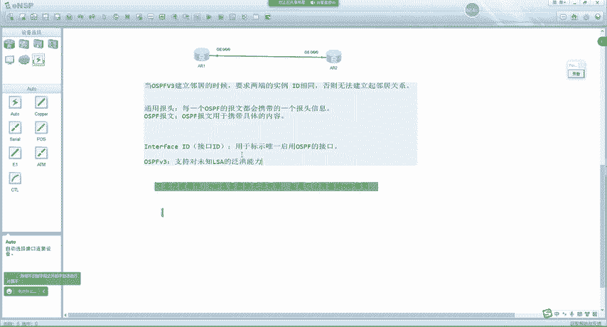

能懂吗？对他不会计算啊，但他可以泛红。😡，那他怎么泛红呢？对意啊。是吧而他不识别，他怎么泛红啊？😡，是吧那他范红给谁呀？范红范围又什么，是吧，区一下范红还陆由玉还范红啊。😡，对不对？所以大家注意。呃。

那他是怎么样进行泛红的？就是由我们所看到的优比特是吧？S1S2。以及IRC的功能代码来进行控制的。好吧，那我们休息一会儿，休息10分钟。十分钟之后呢。

我们来给大家讲一下吧它到底是怎么样来进行控制的老师这玩意儿它怎么样泛红的对，它不能识别。😡，他怎么控制的？好吧，咱们休息会儿啊。

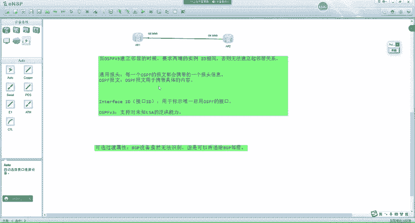

十分钟之后，我们来讲一下，对吧？这里是怎么样来进行做到的？

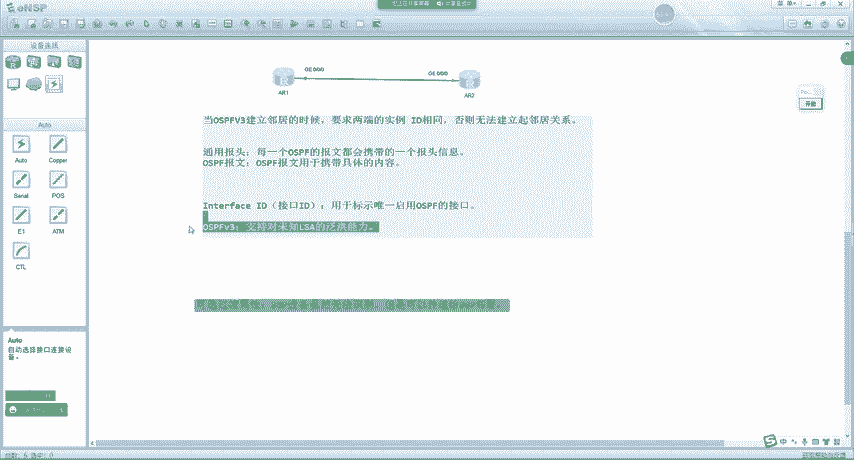