# 2023 新版华为认证HCIA+HCIP+HCIE全套视频讲解！一套视频让你从入门到精通！CCNA／CCNP／CCIE技术提升同样适用！ - P111：（持续更新）HCIE Datacom - 57.OSPFv3 -2 - -Book思议8 - BV1W8411A7z8

好，那咱们继续啊呃，我们这节课分为两个录屏啊嗯。😊，好啊，对，就是上部和下部对吧？续集啊。好，那我们来讲一下啊，就是这个呃优比特呢SES2对吧？功能代码他们是干什么事的是吧？因为我们刚刚说了啊。

就是在OSPIV3里面呢，支持对未知LIC的泛红能力，对吧？那这几个比特呢主要是指导啊，他怎么样去泛红呢？呃，第一个呢我们把它叫优比特，就是标识对未知LSC的处理方法。😊。

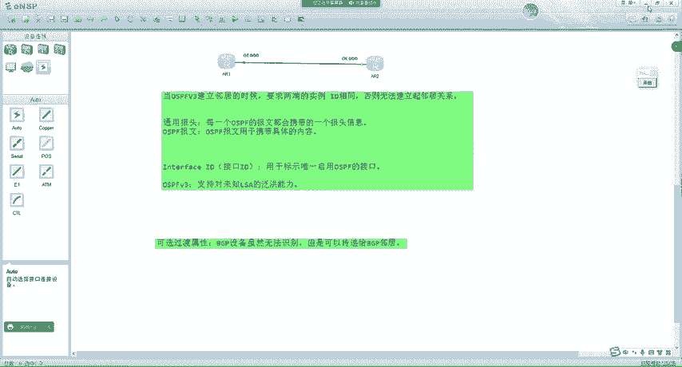

呃，这里呢大家注意啊。大要仔细体会下面这句话。如果优比特等于0呢啊代表呢。LIC当做具有链路本地泛红范围来进行对待啊，也就是说只能在链路上进行泛红。什么意思呢？比如说这一啊，这是二嗯，这是3。嗯。

中间有个交换机。一传给二之后呢。二不能传给4，因为这种跨越链路了，但是二可以传给3。所以这种呢我们把它叫做链路本地范围啊，优比特等于0呢，它只能在链路上进行泛红。而优比特等于一呢，大家注意啊。

叫做把LC类型当成已知的LC来处理。也就是说储存下来并泛红出去。注意这句话大家认真体会对吧？有人就可能比较疑惑啊，老师，我不识别这个LC。对吧我怎么样能够把它当成能够识别的LC处理呢？

是吧这里大家要把这个思维绕过来啊，就是我收到这个LSA之啊，对，没错，对吧，就是这种不懂装懂。😡，好吧，就是我收到这个LC，我虽然不能识别，但是它在形式上，也就说在处理上呢，要把LC当成已知的。

能够处理。😡，好吧。就是当成已知的来进行处理，就是不懂，还要装懂。对，就是这个意思。那当成已知的LC进行处理，怎么样进行处理呢？注意。所有已知的LIC呢。他都会去参考S1和S2这两个比特。

就是比如说我收到一代LRC是吧，说到一代LRC，我能够识别，我就不看优比特了。😡，能懂吗？但是我收到1。LC，我不能识别，我就会去看优比特优比特是让我在链路上泛红呢，还是当成已知的能够处理。😡。

对吧如果是当成已知的能够处理，就会去看S1和S2。那S1S2呢，它就标识了LC的泛红范围，就是现在呢我要把你当成是吧啊能够识别处理，那能够识别我得做的像样子啊，是吧？能够识别的LC怎么处理呢？

看的是S1和S2。所以你这个LCA呢，我也看S1S2来进行处理。😊，对吧啊S2S1啊。😊，如果等于00啊，代表链路本地范围内，对它跟优比特等于0是一样的。如果是01呢，代表区域范围内。

是吧即泛洪到始发的所有区域内。对吧。那这是01。10呢代表AS内泛红对吧？整个路由域内泛红，而11呢没有被定义。对，一个是链路，一个区域，一个是AS内范。那这时候我们就可以去看到，对吧？

对未知LC的处理呢，需要用到U跟S2跟S1。对不对？而有人就问，老师功能代码又是干什么的？它主要是用来标识LC类型的。比如说我们这时候来看抓包。刚我们看的是1类LCOU。😊。

所以说LC的功能代码是000000，1是吧，代表你是一类。对不对？如果我们看的是8类呢。他就是0000000是吧？呃，13个0。这不就是8吗？对吧代表你是8类。也就是说。

功能代码呢唯一的标识了你的LIC类型。而前面呢S1S2用来标识你的泛糊范围。那平常我们再去描述1个LIC的时候，会怎么样进行描述呢？注意。比如说以一类为例，它的U比特等于0。那一类是在什么样的？

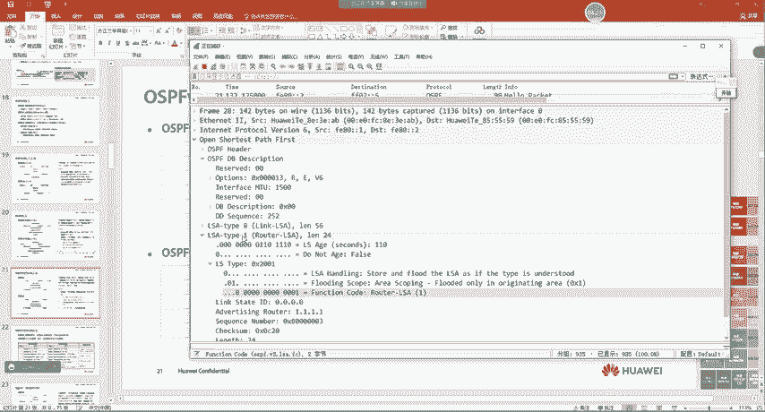

是在区内返是吧，所以说S2S1呢等应该等于01。我也可以去看到。001，然后类型呢是一类。那无论你是优比特SRSS1还是功能代码，你们最终组合成的都叫做RS type。所以我们把这个来组合一下。

16进制啊，这4个比特0010等于2。0对吧，这四个比特这四个比特0这四个比特1所以说RS type等于多少？0X2001。这里大家看明白了吗？明白的同学敲一。没问题吧。好吧。那基于这个原则呢。

我们再来看一下整体的样子。对不对？这呢是我们OSPFV3中呢嗯常见的一些RIC这是我们来看。首先，一类呢在OSPIV3里面就是0X2001，对吧？02呢首先有你的优比特等于0对吧？S2是。0对吧。

S1呢是1对吧？后面还有个0，所以说是2001。二类呢就是2002三类呢就是2003四类呢就是2004，因为他们都是区内返屋。而五类他是在AS域内泛。AS域内是多少呢？刚刚我们所看到的。

等于多少等于10。是吧这时候我们再来画一下，这是谁啊？优比特S2是10。这是S2，这是S1，后面还有个0。这是124是不是等于4啊？对吧然后把功能代码抄过来00。嗯。5类LC对吧？就是5应该是4005。

对不对？然后我们来瞅一眼。是不是4005啊？对吧。那拉萨区内的7类就是2007，因为他也是在区域内发。还有1个0008啊，叫做链路LC。对吧只能在链路本地进行泛红。但这里我们还没有学到哦。

这里大家先知道一下，对吧？还有一个叫做8类LC，是在链路上进行泛红。😊，9类LRC呢在区域内反。是吧。所以说未来我们所看到OSPFV3的LC呢，它的Ltype。他是这么组成的，它里面有三个部分啊。

有类型，有泛红范围，还有一个优比特。对不对？这是我们在去看OSPFV3LIC的时候，怎么样去识别它。对吧你一看到类型，2001不要懵逼对吧，你看后面的才知道是几类。一类、二类、三类、四类、五类、六类啊。

五类、七类、八类、9类。对吧而前面这一些呢，就是标识他的泛红范围呢。好吧。嗯。那这就是OSPFV3的LC的RSOStype。那在OSPFV3中呢，不同的LIC作用跟V2还是有点区别的。首先一类二类呢。

在我们的VR中，它既有路由信息，也有top信息。是吧比如说一类一类的啊那个 type有4种。是有川赛的，有P to P有Vlink，还有1个SQ B night。是吧那STPnet就路由，其他都拓谱。

二类呢。嗯，他有这个呃，就邻居，就下面有几个邻居嘛。那个那那个叫啥，我忘了啊，反正就有邻居对吧？啊，有拓扑信息呢啊也有路由信息是吧？因为它里面会有一个嗯network mask。😊，对不对？

而在V3里面，大家注意啊，一类和二类。没有路由信息了，一。二类只描述拓普，没有路由了。所有在OSPFV3。比如说之前由一类和二类携带的这些路由信息都用9类来进行携带了。对大家越容易有问题啊。

老师为什么用酒类来进行携带是吧？这个我们讲到酒类的时候会来给大家解释。所以这里呢我们只需要大概的去low一眼啊，他们的不同点。😊，首先呢就是V3里面一类二类没有路由信息了，只有拓普，对吧？

345啊呃7啊啊作用是一样的。好吧，就是名称不一样了。啊，名称为什么不一样了呢？我们来看啊。😊，在VR中，三类叫做network summary RIC。summerary我们如果翻译成中文叫汇总。

对吧啊，叫做网络汇总LIC。而在V3里面呢，就叫做。区域间前缀LC。他的语义就更加明确了。什么东西传区一间前缀呢？不就是三类吗？😡，是吧所以说在V3里面呢。😡，这个LC的名字。他变得更加的明确了。

就是语义变得更加明确了。对吧我们一眼就可以流出来去间路由器LC那不就是四类吗？😡，对吧嗯，ASY5LC是吧？5类，拉萨区域的LC7类。对吧所以说这是V3LIC的跟V2的一个对比。

那基本没有什么大的区别啊，大家只需要知道的就是一类二类没有。路由信息的。那3457对吧啊，名字不一样了，实际上五跟七还是一样的，对吧？34名字不一样了，就语音更加明确89是新增的啊，这样就完事了。

所以说这张图我们只需要吸取这些信息就可以了。老师，我还要记住这什么2003代表谁对吧？优比特等于几，代表什么样的范围嗯，不需要记啊，不需要记，我也没有记过。所以如果有同学问我呢，我还得去翻翻。

也得去找找。就是脑子里有这么一件事儿啊，但是记不太清了，好吧。😊，所以说这里呢大家只需要记个啊概要就行了。这概要呢，我给大家列一下啊，就在我脑子里呢啊，我只记得这些。😊，嗯，首先呢。OSPFV3的。

I type。是吧。呃，和V2。不一样了，对吧？他除了，但这是我脑子里的话啊，我给大家打出来。就是在我脑子里就是这样记的，就是除了用于。标识LIC的类型。还有一些。泛红范围的标记。对吧，然后第二个呢。

OSPFV3呢。依赖和。二类RIC。没有路由信息了。只有拓普信息那。那么路由信息都是用酒类携带的。那还有什么呢？就是OSPFV3里面啊。嗯。3457。作用和V2相同。是吧但是呢有些LIC的名字。

变的和V2不一样了。好吧，然后OSPFV3呢？新增了。😔，先增加了。新增了。89类RC。好。在我脑子里呢，反正我就记得这么多。好吧。然后大家呢以后要在学习的过程中呢，要想办法，对吧？这个需要去练习啊。

就想办法把有用的信息啊简要的提取出来。

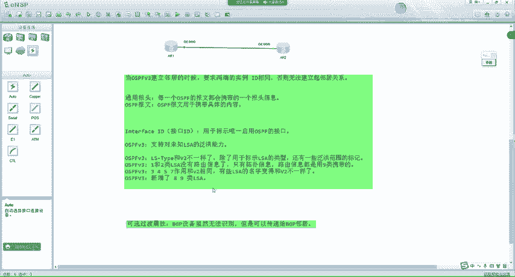

啊，并不是越详细越好，你自己在钻研的时候呢，可以详细一点比较好啊。但是自己呢这个脑子里在记的时候啊，最好只是一个框架啊，因为细节呢没有人可以去记住啊，很难。😊，好吧。然后我们就接下来来看每一种LC对吧？

嗯，他们长什么样子啊，以及呢对吧和VR的一些对比。呃，我们来瞅一眼啊。太比一的rootLYC啊，这个没考过啊没考过。来，我们来看啊。嗯，VR里面呢有OVEB大家还记得干嘛的吗？零保留位啊。

不是O啊0保留位啊，这个零也是保留位啊。V呢代表你有没有见Vlink对吧？一呢，你是不是ASBR对吧？你是不是ABR。😊，对不对啊，你里面有多少个链路状态对吧？啊，链路状态ID是多少对吧？啊。

链路数据是多少对吧？RS type，然后TS现在没有用了啊，淘汰了啊，到邻居的mat是多少？这是我们在V2中。😊，嗯，学习到的一些字段啊，V3里面呢我们来看啊。😊，哦呢。啊，不是欧20。嗯，保留为好吧。

呃，这个W应该是主播OSPF啊，我瞅一眼。对啊，就是用于主播OSPF的啊，但是现在大家不用去管他，就有这么一个字段。但是这个协议呢已经被淘汰掉了啊。😊，V呢有没有见Vlink一呢是不是ASB啊呃。

B呢代表你是不是AB啊，是吧op之前给大家解释过了L type。😊，嗯，然后保留我也没啥说的，到邻居的扣s的是多少啊呃，我连接邻居的接口ID。😡，对不对？就是我通过哪个OSPF接口。

呃interface IDD嘛，就是我通过哪个OSPF接口连接了邻居邻居的接口ID是多少？邻居的入台D是多少？我到邻居的co的是多少？😊，对不对？这和我们在这个那个那那个那个那个。嗯。啊，这里也没啥。

这和我们在OSPFVR中学的有点类似。啊，我来给大家演示一下啊。这里可能大家就有点懵了。这里呢我以V2的这个学习思路对吧？或者说学习曲线啊来给大家讲一下V3啊，你就能够更加的明白了。🤧嗯。🤢，注意啊。

比如说现在呢我这样。中间来个交换机。这12，然后我们把中间的。交换机的生成数关一下。

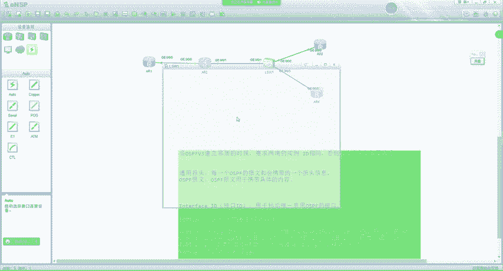

STPD。关了之后呢，我们在123。4上。配一下OSPLV3。一跟二应该之前OSPF邻居是建立好的。OSPF第四类OSPFV3P2。说建理好的啊，然后我们在二层这样来做interface70-0-1。

IPV6。Enable IPU6dress。2001冒号234，冒号冒号2。然后在三上面呢。sister name A23。IP6。G0-0-0。I6 enable enable IP6 dress。

2001冒号234，冒号码号3。OSPFV31。入台地呢303点33。然后interface70-0-0OSPFV31ar0。然后再试上啊。G0-0杠0接口。IP6d2001冒号23。是冒哈马哈4。

OSPRV3。入台地。4。4。4。4260。啊，不是260，应该是interfaceG0-000。OSPRV31arre0。啊，然后注意啊，我把A21和A2之间的链路给它改成P to P。嗯。

在我们的OSPV2中啊，你要去想修改一个链路的网络类型，叫做OSPFnetwork table。对吧然后改成P to P在V3里面呢，就是OSPV3let table啊，改成P to P。好吧。

这个面呢基本是类似的啊。他说我们已经启用这个进程了，还不让改，我先把它干掉啊，暗度OSPLV310。一。啊，没有去一下宣告的方式啊。为啥没有这种方式。OSPV310啊，不对OSPV3。

n to a table。嗯，P to P。我瞅一下啊。A21。也没有启用啊OSPFV3。来 to我嘅 table。😔，P to P。后面怎么还有个in ID0。站也不让敲。这样啊。

我把二的先给他删一下一下。interface70-0-0。安度OSPV310in ID1。1的70-0-0空的啊，现在是空的，我再来一下。V3network table P to P。不对劲啊。

建程没有启用啊，他说咱们没啊，对先开建程啊。OSPRV3120。好吧，OSPRV3。n to network work table P to P。这样就对了啊，得先开启OSPF进程啊。1260。

OSPRV3。Nework table。P to P。

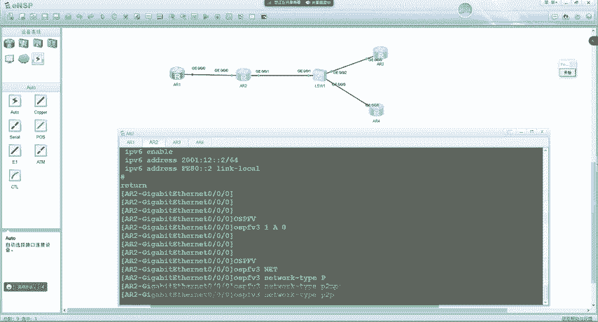

好吧，这里我们用的是一个P to P网络啊，点到点。😊，啊，然后在这里呢用的是一个呃广播类型的网络。😊，广播。然后这时候我们来看啊。😊。

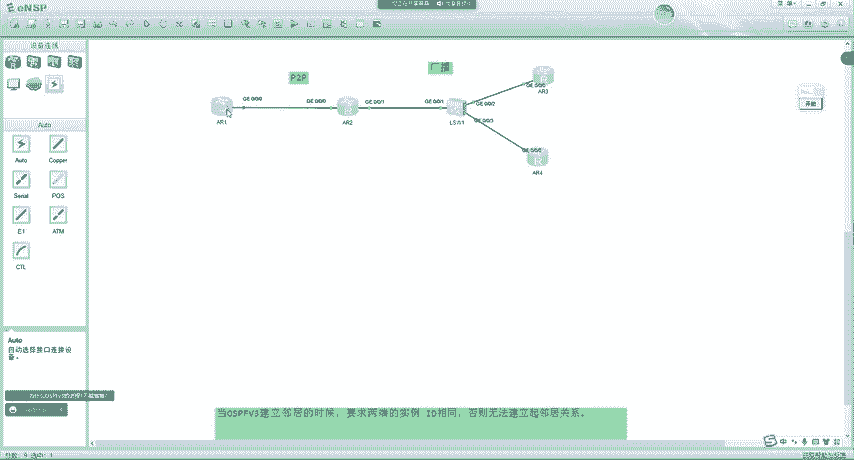

呃，在A21上追。啊，那个建成一可以省略啊，默认也是一。😊，然后我们在AI一上注意，比如说我们要计算路由嘛，大家注意啊，现在我在山上啊，interface low百0。😊，IP rise。

IP6 enableable。IP6dress2001冒号3，冒号冒号3128。啊，OSPRV3120。对，通告出去之后呢，我们再一一上来看一下。嗯，现在还没来。现在还没来。😊，还没来。

我看邻居是不是有问题啊，D displayOSPV3P2。嗯，果然有问题，应该0-0-1忘启用了。对吧然后我们再到一场来看一眼啊。😊，再瞅一案。再来一言。来啦。😊，是吧来了啊，所以现在我们可以去看到呢。

一已经学到了三的环水口是吧？啊，这时候呢接下来我们要讲的啊就是V3里面怎么样去画的拓谱数是吧？然后我们通过这个拓谱数呢，把一类二类来给大家讲明白。好吧，首先呢我们区域内的拓谱数呢。

都是通过什么来进行画的，一类和二类。😊。

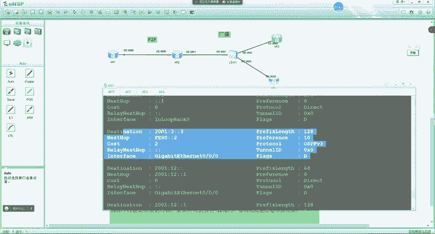

是吧那画的逻辑呢实际上是一样的啊，比如说我现在开一个画图板。😊。

呃，那首先对于A21呢，他会查看自己产生的di四playOSPIV3LDB啊，我们会发现有很多看不懂是吧，老这什么玩意啊，linkLC啊，这一类吧这这又是啥啊，瞅不明白老师这二类吧，是吧。

这是什么没见过，对不对？下面没听说过又。

是吧不要慌是吧，一个一个来啊一个一个来啊，就是把对吧你整体看一眼，你懵逼，你把它解析成小的部分，慢慢就明白。首先我们来讲一类啊。😊。

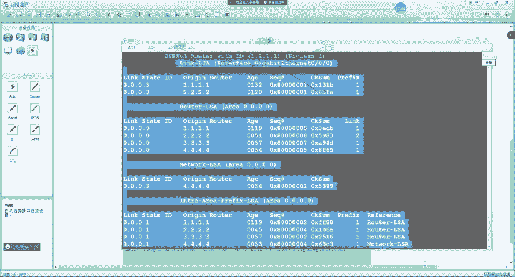

呃，首先我们可以去看到啊OSPFV3的LDB呢啊首先我的入台D1。1进程呢是一对吧？这里呢有个linkLC叫做链路LC。那刚刚我是吧，好像听老师说过，链路LC只在链路上传递嘛，对吧？因为它是0008。

对吧？所以说我们可以看到啊，它会显示在每一个接口下。😊，而一类LC跟二类呢，它在区域下传递，所以说他这里有个区域对吧？酒类也是区域内传递。所以说他在这里有个区域。对不对？那具体LVC的内容呢。

以及它的组成格式我先不管。那首先呢我们来看一类，因为一类和二类呢就是用来画拓布的。😊，那现在我可以去看到呢呃，1234对吧，一类在区内泛红。所以说ARE有所有的路由器。

那首先AR1呢还是查看自己的DplayOSPFV3LSDB注意啊，一类LC我们后面敲的是链路状台D。那你知道。一的量度状态地是这一个吗？刚开始是吧，比如说老师我第一次学习我也不知道。😊。

那我怎么样看已产生的呢？我们可以这样。RSDB。Orange root。1。1。1。1。产生的retyacy。对吧去看1。1。1产生的一类LC。回车。那这时候就来了哦，这是A2一产生的异类啊。

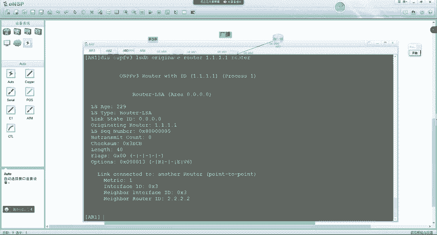

我往这一贴，大家一下子就看懵逼了啊，有C5啊，有。但是如果你要看二的C5只能看本地的。😊，对吧我往这一贴，很多同学一看头大了，这老是什么东西啊，没见过。😡，是吧我们来整理一下，你就明白了啊。

就跟你整理笔记一样，一大堆知识点你写到那里，你看明白，但你一梳理你就看得清楚了。😡，这不是老化时间吗？LRC类型一类。练住状态低。对不对？序列号。啊，这个传输次数不用管他。啊，我也拍一下。查克萨姆对吧。

比新旧。长度没啥说的，就LIC有多大。对吧flag啊，就是我们刚刚所学到的那几个。😊，是吧保留为。W。是吧呃。V对吧，然后是伊比特，然后是B比特啊，标识你是ASBRABR还是谁的？对不对？

然后option我们也讲过了，对吧？阿比特伊比特跟V6。对吧伊比特这个在我们V2中学到过。所以我们看啊前面就是一个头部信息，就大家可能不理解，就是这里呢是吧老师它为什么是0。0。0啊。

这就是和V2的区别。在V3里面呢链路状态D注意。😊，只是1个LC的名字。LRC的名字。对吧就是用于标识不同，或者说他就是一个。32位的整数从零开始。整数。从零开始数的。喂。好吧，这是我产生的第一条依类。

那如果有很多条链状态装不完，我再产生一个。对吧再用个0001，然后2345依次来排，就是一个。32位整数用来标识不同LIC的。然后我们来看下面啊，那精华就在这里。现在呢我可以去看到哦，我连接了一个。😮。

P to P对吧，的邻居。那我通过哪一个接口呢？啊，我有个0X3的接口是吧？interface IDD用于标识。自己唯一启用OSPF接口，我知道我是1。1。1。😊，是吧。嗯，这时候呢我有一个。我有一个。

0X3的接口。是吧有个3号口。他连接了一个P two P的邻居。连接的邻居是二是吧啊。是吧隔壁有个邻居是2。2啊。你就知道了，有个2。2。2。2。对不对？那我到邻居的啊，连接的邻居的也是三口。对不对？

我到邻居的cos单呢是一。这时候A2一就画出来了。是吧通过自己的LC能不能画出来？😊，画出来了吧。画出来之后顺藤摸瓜嘛，对吧？啊，接下来呢我得看二有没有连接着别人啊，对我得画成网。😡。

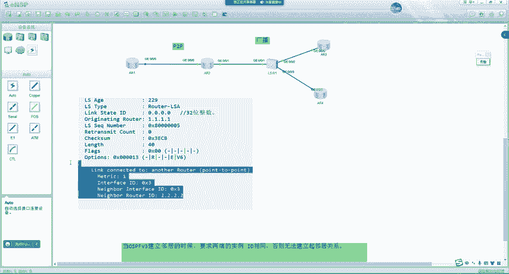

那A2一再去瞅。二产生的一类在哪里？产生路由器2。2。2。2产生的routerLC。有。这二这个人他比较花。

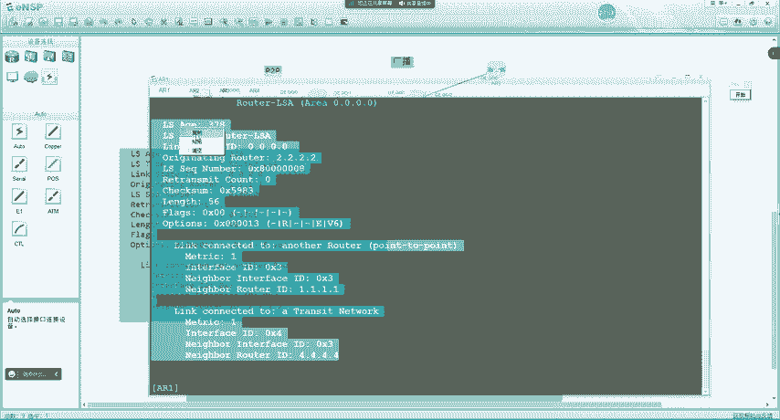

是吧。他连了两个人。那然后我们再整理一下，这就是一个投币信息。啊，这一下子就看明白了。但我再排这一个啊，后面看三四的，我就不排了啊。就这里呢主要给大家说一下，就是。嗯，你刚看可能会觉得比较懵啊。

但你排了一下之后呢，你就看着很清晰了啊，前面就是一个投币信息啊。那现在我就知道了哦，二呢，他还连接着一个P two P邻居到我的到这个邻这个邻居，那是我我已经在我的树中了。是吧啊，到我的cos的是一啊。

这时候我就知道了。2到我的cos的也是一。😊，对的。然后呢，哦二还连接了一个transite network。这跟我们在OSPFV2中这个linkt学的。一不一样？YSPRVR中学的link个太。

P two P吧。川赛的吧。还有什么welink。还有什么STV night。STUB。卖的。对不对？那这里呢就等于川赛的啊，我就知道了。二连接了一个广播网啊，那这里肯定是连接了一个尾结点哦。是吧。

然后我就开始推了。二呢连接了一个尾节点。对不对？因为你是通过transs side连接的，肯定是违接点。我知道了。二这个人啊，他有个广播网络。你呢我用红笔画了啊，连接了一个尾节点。

你呢通过4号口连接尾基点的3号口。是吧。你通过4号。连接尾接点的3。然后到达尾节点的cos的呢是一。对吧这时候我就知道了啊，你到达尾接点扣s的是一。对吧。那我一看这个尾结点。

我就知道肯定有一个对应的二类。

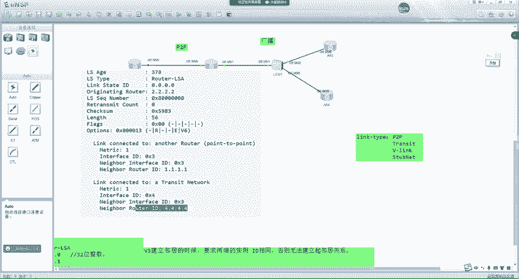

对吧这时候我们来看。😊，Dsplay。OSPRV3LDB。有没有一个尾节点产生的二类LC呀？有没有？有吧，所以说A2一就知道了，我给得看尾节点的二类了。第四类OSPFV3RSDB对吧？产生路由器呢是4。

4。4。4。它产生了一个network RC。

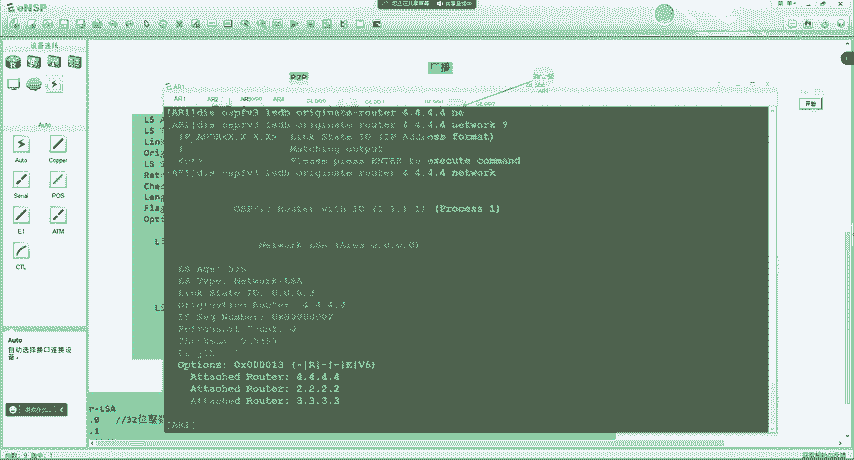

来了。是吧那前面呢就是一个头部信息啦。注意啊，待会儿我再来给大家说这里咋组的。2类LC中呢。通告路由器对呀，这里呢就是DR的。ID。链路状态ID呢，它取值为。DR的接口ID。那这时候我就知道了哦。😡。

你连接到了一个尾接点，我去看尾机点产生的二类。是吧。哎，那我问一下大家。好，这个我先不问了，省么大家搞冤啊，然后我们先来看。😊，哦，这时候我就知道了，尾节点呢，他还连接着几个邻居呢。234。对吧。

那我来看一下我的数。尾节点呢，刚我们画出来它是。4。4。4。4。那他连接了一个4啊，我就知道了。尾接点还连接了一个4。是个人。4。4。4。4。4。我眼影呢还连接了一个2。啊，那不就我自己吗？是吧。

我已经在诉中了，我就不怕了。那违接点还连接了一个3。尾接点呢。还连接了一个。3。3。33。对吧。那这里就换完了，换完之后呢，我还得再去看三跟四产生的一类。

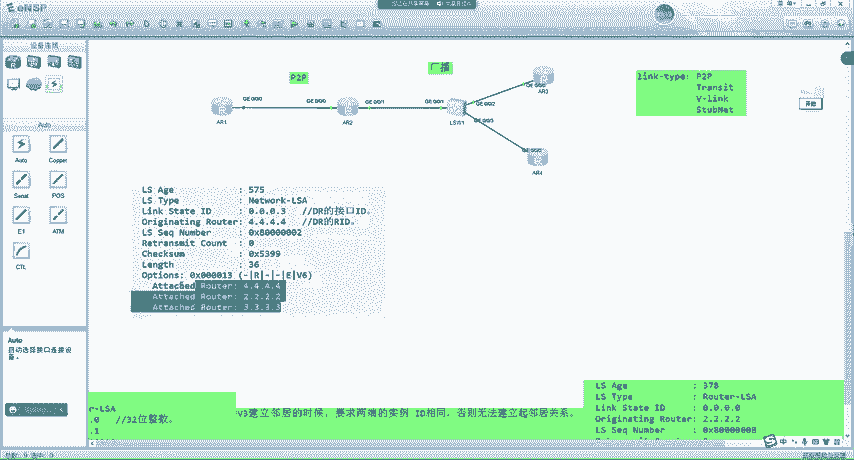

A21呢再去看第一次OSPV3LDBroot。啊，不对啊，产生路由器我们先画三的啊。3。3点3。3。产生的依类。啊吧。

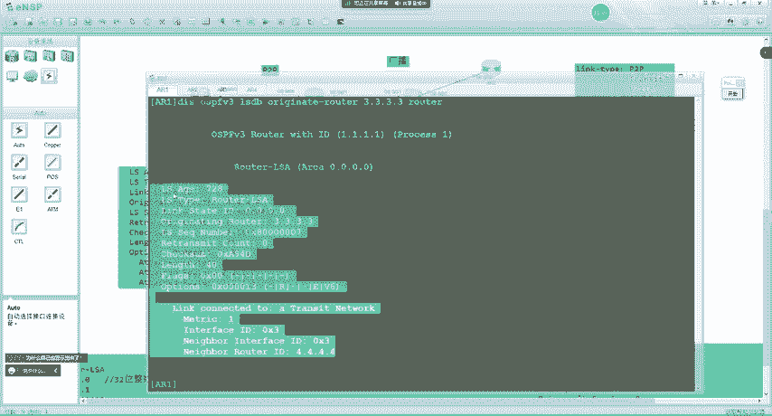

然后我们把它复制出来。注意啊。那不是那不是说把自己的也显示出来啊，那是伪节点产生的对VR也显示啊。😡，能懂吧？那是尾节点产生的，他肯定要描述自己的邻居啊，对吧？每台路由器都描述自己的邻居。😡，好吧。

然后前面就是一些头部信息啊，这里我就不再重复了。那现在我们可以去看到呢。3呢，他通过0X3。连接了伪接点的0I3。对吧然后尾结点是4。4，到他扣死的一。

现在我就知道了3他通过0X3到他的扣死的是一连接了尾结点的3。对不对？这不就出来了。那三没有其他邻居了，看完三我再看4。是吧啊非常的花心啊。😊，入袋入点啊4。4。4。4产生的依类。

然后我们只复制下面这些了啊。那在这里呢，是他连接了1个4。4。4。他通过自己的三是吧，连接到了尾结点3到他的扣除是一。然后我们把这些信息提取出来。他通过自己的三连接到了尾节点3，扣s的是一。

对吧然后就没了。然后大家注意，现在我们的拓普书。跟上面一不一样，下面是cos的啊，上面都是些苦ID。然后这里注意啊。如果三上面宣告了1个low百0。对吧。那捐告了一个low back0之后。

一、如果去计算这个60，他的cos的应该多少？一。加一尾节点到所有的人的扣子都是0，这0，这是0，这是0。1加1加0。等于多少，然后加上娄百玲默认的扣s的是0。如果是A2一计算出3。

3cos的应该等于2。

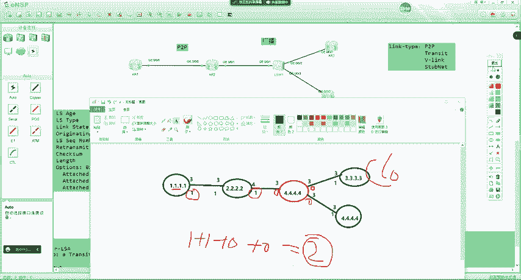

对吧。所以这时候我们来看A21。

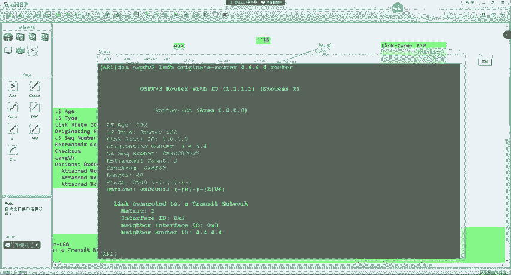

如果他计算出来3。coOS的是不是等于2？对不对？所以这个拓普呢已经画出来了是吧？那有些同学就比较疑惑了，是吧？A，老师，他路由又是怎么计算的呢？啊，现在我通过一类和二类。😊。

我们可以按照V2那样的方式。将这个区域内的拓扑书对吧，给他画出来。那一旦画出来之后。是吧路由怎么计算的啊，当然是我们这节课就说不完了啊我们下节课再来讲。😊，啊，下一课再来讲这个路由啊。😊。

这里大家都听明白了吗？明白的同学敲一啊，这里都没问题吧。😡，就是怎么样去构建出来透书。啊。那这里呢再给大家补充一点点。

那这里我们可以去看到啊，我们刚刚呢看到了两种，一种呢。

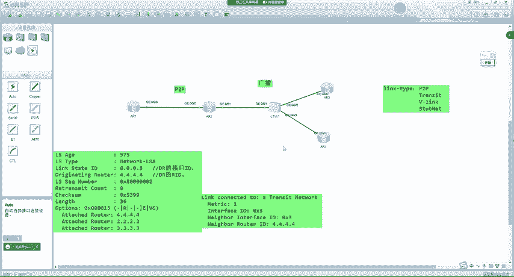

叫做什么啊？P to P。

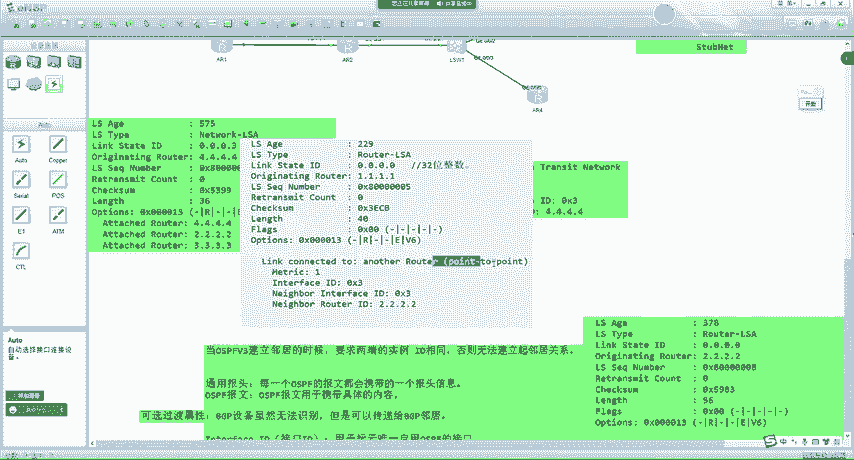

还有一种呢叫做trans在network。他对应了OSPFVR的P to P和川赛的。V link呢V3里面也有。是吧。而在V3里面没有这种STBnet了，这种就没有了。因为对于OSPFV3来说。

它并不包含。路由信息对吧，只有拓普。

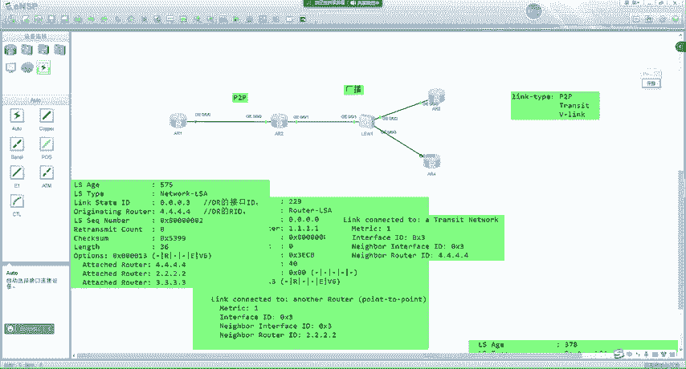

然后我们来看。对于这个link type。他的编码格式。如果等于一呢，代表点到点连接了另外一台路由器啊，就是P to P。对吧。如果是二呢，都代表了连接到了尾节点是吧DR。三是保留的。

而四就是V link。对吧我们把这个保留的一减除，它跟V2的逻辑是一模一样的啊，为什么呢要把保留的减除呢？因为V3里面不再包含路由了。V2里面这里是路由，V3没有，所以就是保留的。😡，好吧。

那这就是我们在OSPFV3中，怎么样通过一类啊，还有二类去构建出来top信息。那这个二类呢，我们可以简单来看一下啊，那个待会我跟你说啊，118刚有同学也问了是吧，待会我再给你说啊。😊。

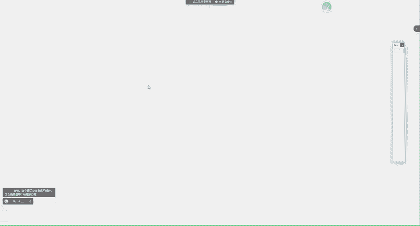

我来看啊。V3的2类和V2的2类基本是一样的。首先。二类没有network mask了是吧？所以说V3里面没有这个network mask了。保留位option是吧，连接的邻居是多少？对不对？

所以说在OSPFV3中呢。那么他只2类LC啊，只会去包含top信息，而不再有路由信息了。所有在V2中一类和二类包含的路由，在V3里面都通过9类去携带。那这个酒类呢，咱们需要下节课再讲的。好吧。嗯。

咱们这节课就讲这么多行吧，我看一下大家问题啊。😊，下节课我们再来去补充嗯，怎么样去画透不图啊，怎么样去填充路由啊。呃，接口ID怎么样，他不需要清楚是哪个物理接口。这不需要啊，1吧。😡。

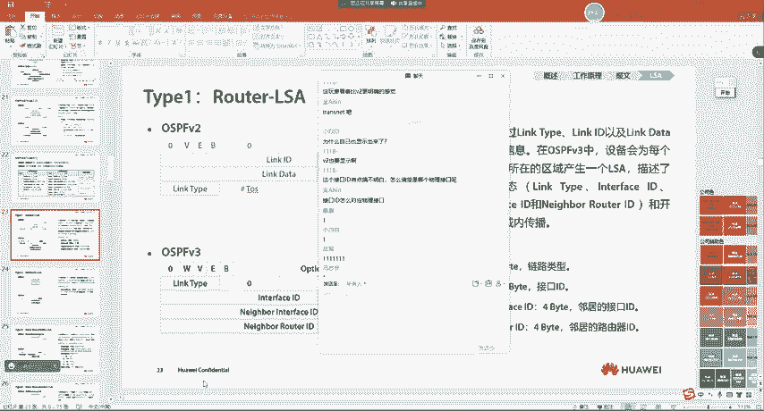

你为什么要把它对到物理口上呢？😡，那V2里面他也不知道是哪个物里口啊。😡，是吧你想一下，在我们的VR里面，他不是是在1。12。1嘛，对吧，12。2他也不知道是哪物力口啊。😡，他只需要知道我有一个接口。

对吧？你在OSPF角度里，他管你这个接口编号吗？他不管啊。😡，这个接口编号大家告诉我是什么编号。这是你的曹伟号吧。😡，是你在硬件上的一种吧。😡，大家能懂吗？OSPF在协议角度上来看。

他不需要去管你这是哪一个接口号啊。😡，对他还跟系统读一下，你这那有些厂商他还不叫G0-0-1呢。😡，对吧所以这里大家注意啊，所以在这里呢，他不管啊V3，他是不管你的接口号的，就是他自己会去编一个。😡。

0X3。那这个边他是怎么参考的呢？刚有同学说了，对吧？😡，他就是参考了SMP里面的一个索引号啊，叫接口索引。啊，当然有同学可能没学过SMP啊，这个不用去管他。好吧嗯这个呢在TCP杠IP。呃。卷2。

卷二里面讲解OSPIV3里面有一段话描述啊。嗯，就是在。比如说这里一二书。对吧他在最下面有一个小注释，在这里有说就OSPIV3里的接口ID呢？就是FC啊哪一个对吧？

叉叉叉叉建议为取值为SNMP里面的接口索引。而，具体SMP里面接口索引怎么查看，我也没太清楚啊，我也不太清楚。又不同场商编的不一样啊，所以这里大家知道一下啊。😊，就是大家认为就是随机的，好吧。

就是随机的啊。😊，呃，接口ID这个刚给你说过了啊。😊，flag的E和option的E有点混了。flag的E标识自己是不是ASBR。用于标识设备是否是ABR？你还记得我们在V2中学到过一点吗？😡，呃。

接口下执行音炮的之后，就会在1赖LC中通告自己是不是ASBR。那他怎么通告呢？就是通过flag中的。伊比特来进行标识的。而option中的意呢。他是用于标识设备是否具备。5类RIC的。处理能力。

那大家告诉我什么样的设备不具备562C处理能力。什么样的设备？正常路由器能不能处理50LC？可以。star不行，对，没错。好吧。所以说这里呢就是你如果配置了特殊区域啊，这个伊比特哈lo包中就没了。对。

没错。所以说他俩作用不一样啊。啊，对，这个谁说的不错啊。

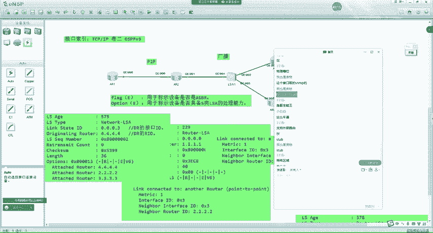

嗯，行，那咱们这节课的话，今天就讲这么多了啊，没其他内容了。😊，好吧。嗯。我把录屏先听一下啊。

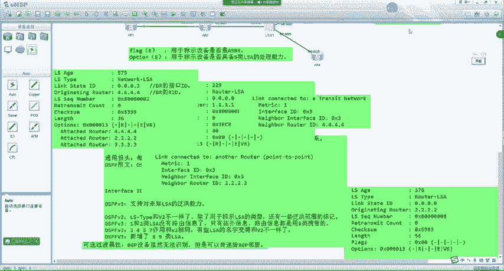