# 2023 新版华为认证HCIA+HCIP+HCIE全套视频讲解！一套视频让你从入门到精通！CCNA／CCNP／CCIE技术提升同样适用！ - P112：（持续更新）HCIE Datacom - 58.OSPFv3，ISIS支持IPV6 - -Book思议8 - BV1W8411A7z8

然后我们就上课吧呃，那我们上节课呢会去给大家讲了一下这个OSPFV3的一类和2类LC对吧？以以及这个一类和二类呢，怎么在区域内去构建这个。SPF书。对吧。嗯，那学完这一点之后啊。

就是上节课我们通过上节课的这个学习到的内容呢，是可以去实现在。呃，这个区域内呢去把SPF数构建出来。嗯，构建出来之后呢，我们要去为每一个节点呢去填充叶子啊，比如说在我们现在这个环境中呢。

山上就有一个划回口啊，我们去A2一上看路由表呢，你会发现。

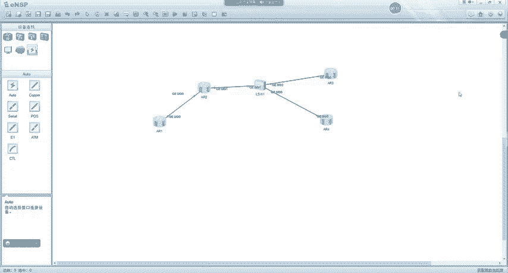

他是可以计算出来。AR1这条路由的。对吧那基于我们构建出来的SPF树，它怎么样去填充叶子呢？注意啊。

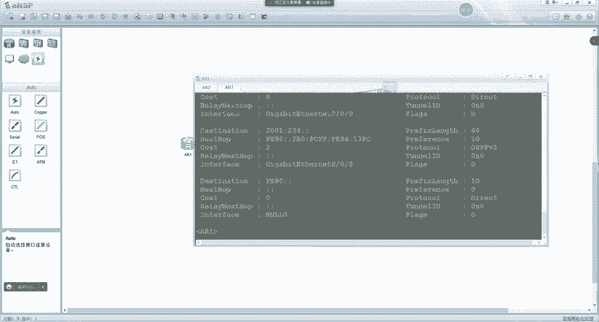

呃，在所有的这个OSPFV3中，一类和二类没有to扑信息，没有路由信息了是吧？上节课我们说过就是OSPFV3中呢。有三中啊。一和2类LC不包含。路由信息了。对吧。嗯，这个不包含路由信息。

那也就是说我们可以看到一呢也把三的路由计算出来了。

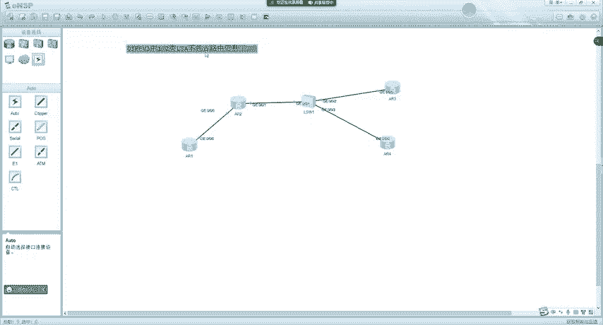

那这个他是怎么样计算的呢？实际上在V3中啊呃新增了一种新的LC叫做9类LC。

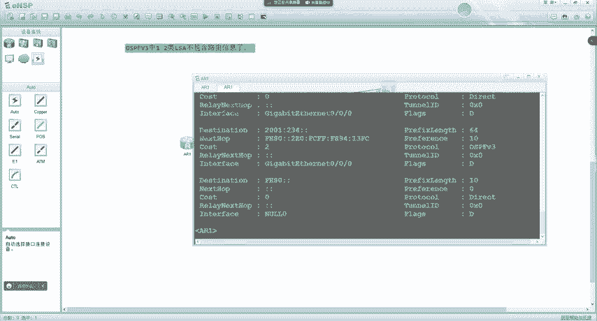

就是OSPIV3呢。依靠。或者说使用。酒类RC。在区域内携带路由信息。或者说传递路由信息。传递。好吧，那接下来我们要讲的就是这个酒类啊，这个345呢，咱们以后再来看。好吧，那我们先把酒类讲完啊。

因为这个酒类呢还有8类是V3里面新增的两个我们把这两个LC学完之后呢，这个345实际上没啥说的对吧？咱们回来看它的样子就好了。我来瞅一下啊。呃，9类LC是V3中新增的一个是吧？

就是V3如何描述网段信息呢？这时候我们就引出了对吧V3是使用9类LC来进行描述的。那9类LC呢嗯基于它的这个类型呢，可以分为两种。一个呢叫做每台路由器产生依赖LC。呃，与啊不对啊。

均产生与一类LC相关联的IPV6前缀的酒类。啊，这句话比较绕。对吧我给大家说一下他是什么意思啊。呃，如果换成我们大白话来说呢，就是V2中啊原来用一列LC携带的那些路由前缀呢。对吧啊。

我们用9类LC来进行描述。那V2中呢，原来由二类LVC来描述的那些IPU类前缀呢，也有9类LLC来进行描述。那到底这个酒类是描述一类还是描述二类的呢，对吧？那在酒类LC中呢，有两种类型。

也就是说有些酒类是描述V2中原本用一类携带的路由信息。而有些酒类呢是描述V2中原本用二类携带的路由信息。好吧，那他是怎么样进行区分的啊，我们来看一下9类LC的一个格式。好吧。

那首先在这里呢嗯有一个前缀的数量。那也就是说我们这个9类LC呢嗯里面有多少条路由信息，对吧？或者说携带了多少个IP6前缀啊，这是它的作用。那在这里呢，还有一个参考的L类型。这个LC类型呢就是如果注意啊。

取值为一，代表参考的是一个一类LC啥意思呢？啊，如果用大白话给大家说，就是如果在V2中原本用一类描述的LC呢。就是用一类LC描述的那些路由信息呢，在9类中。

这个参考的L type就会取出为一表示是一类啊。如果是二呢，就是表示为networkC表示是二类。那也就是说在这里呢，他描述了对吧？我这个LC在V2中应该是一类的还是二类的。

一类的他是不是用来描述路由器的？对吧所以说我们叫他叫做参考一个rootL对吧？那二类呢啊就是参考尾节点的吧networkL它是这么个逻辑啊。然后下面还有一个叫做参考的链路状态ID注意啊。

如果我们的参考的RS type等于一参考的链路状态地就固定为0。好吧。这个LC是参考1个一类LC的是。对，如果这里是一页啊。下面这个就固定为0。那如果在这里等于2，就是network LRC对吧？

我们参考的是二类LRC。而链路状态D参考的链路状态D这里呢，它就是一个。地亚。呃，的接口ID注意啊，是1个DR的接口ID。那这个有什么关系呢？我来给大家描述一下啊，它是什么意思。

也就是说这俩呢是非常关键的啊。😊，这俩。是非常关键的，主要就是用到二类里面。我来想啊。嗯，在我们的这个OSPFV3中呢，大家注意啊。A23。A24啊。他要不要就是由地亚去产生一个。嗯。

之前我们说在V2中，由DR产生1个20LC来描述共享网段里的路由信息。对吧。这是在V2中。V3我们统一用酒类了。是吧那有没有这么一种可能呢？A24呢，它产生了一条酒类，对吧？

只不过参考的这个RS type是2嘛，是吧，就是原本在V2中有二类携带的。但有没有这么一种可能呢？AR4是两个网段的D啊。对吧。那根据我们刚刚所学的那些字段呢，AR一他知道哎。

比如说你产生两个9类LC对吧？参考的L type呢是nettworkC是2类。也就是说V2中原本用2类携带的。那这时候A21呢，他就没有办法去区分。哎，你这个酒类是这个网段的呢。而这个网段的是吧。

因为由DR统一描述嘛，但是我不知道他是哪个网段的，你现在是两个网段DR。是吧那这时候怎么区分呢？这时候我们来看。😊，在我们的DR上呢，你肯定是每个链路上是吧，有个DR。如果你同一台设备呢？

在不同的链路上作为DR。那你这两个链路的interface IDD肯定是不一样的。是吧所以说在这时候呢，他会去参考interface IDD。那用于区分是哪个共享网段的路由信息。他是这么一个作用啊。

然后在下面还有一个呢，叫做参考的通告者。那如果是依赖LC呢，设为这个路由器的入台地。如果是参考的是2类LC呢。他就是DR的入台地啊，就是DR的啊。然后其他的就没啥了，其他的有一个前缀三元组嗯。

这个咱们还没学到啊，先不用管它好吧。然后现在我们来看一下，对吧？哎，老师这个拓普怎么样进行填充的那拓普的填充它是这么一个过程啊。😊，嗯，我们现在有1。1，对不对？1。1以自身为跟SPF数。

我们通过上节课的内容呢可以画成这样。是吧上面这个三都是接口，就interface IDD啊，下面都是杜良值。

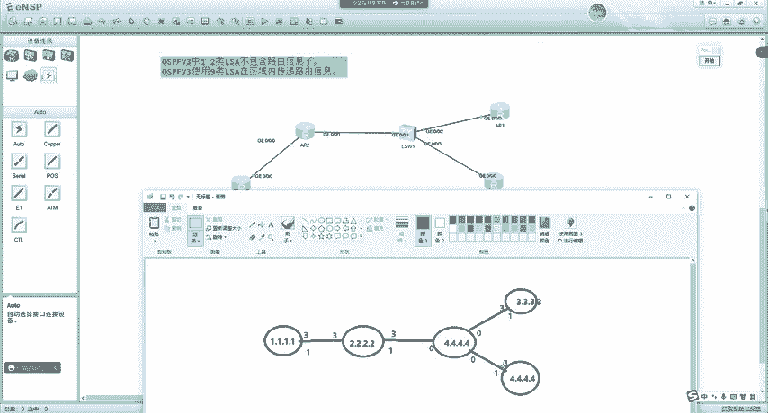

那现在A21呢top数画出来它的填充叶子。

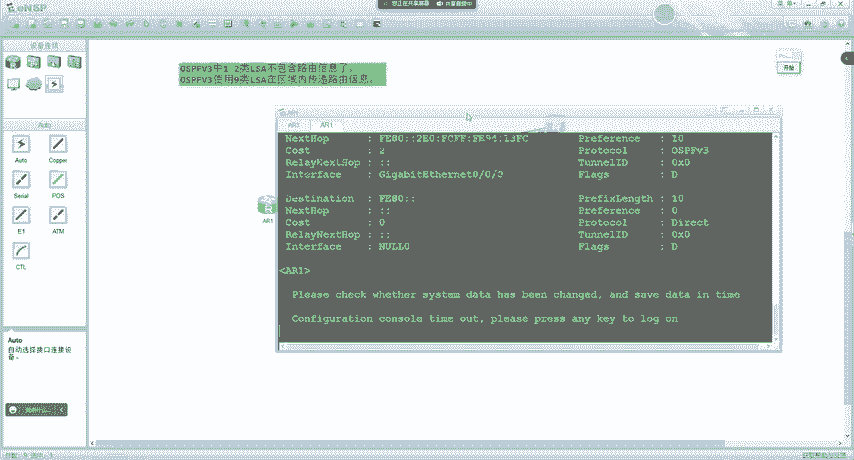

田璐燕是怎么办呢？OSPFV3。IDB。是吧产生路由器呢，先看我自己产生的。叫做。啊，就做这里啊。区域内前缀LIRC。好吧。稍等，我瞅一眼啊。没输出。OSPIV3RSDB。嗯，现在有2。然后呢，有。😔。

三有4。

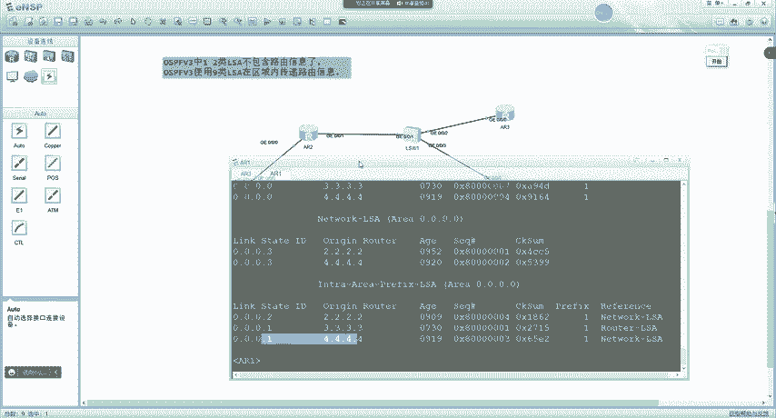

没有异议的。A21。diissplay OPFV3P。邻居也建立了是吧，G0-0杠0。嗯，也通告了。啊，咱这是1个P to P网络啊，我没改，我先给他改一下啊。😊。

OSPRV3network table。P to P。AR这里。interfaceG0-0-0OSPFV3network table P to P。是吧改完之后。

我们再来瞅一眼啊A21上的di displayplayOSPFV3。RSDB产生路由器呢是1。1。1。1产生的。9类LRC。

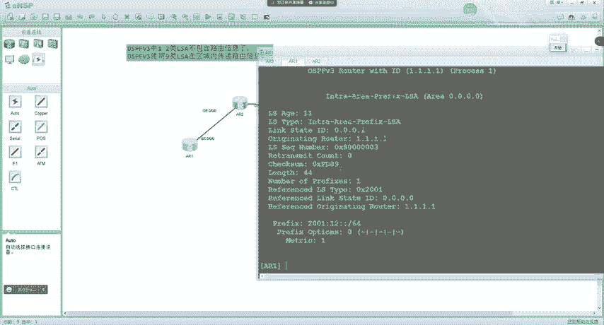

好吧，依旧会首先看自己产生的酒类。那这些信息有哪些呢？老化时间。对吧啊，类型。96LC的亮路状态低啊，这也是1个32位整数啊。啊，就是用于区分不同酒类的。然后通告者呢是1。1。1啊，就是产生路由器是1。

1。徐列号。是吧啊，重传的次数不用管他。我拆个萨。嗯，也不用管。比新旧的嘛？嗯什么长度啊啊里面包含了多少个9类，就9IPU6前缀是吧，包含了一个。那在这里呢，我们可以去看到啊参考的RS type。

是0X2001。对不对？也就是说他参考的是谁呀？路由器的。对不对？叫做root LC的那也就是说它是一个原本用ELC携带的那些内容。对不对？那下面还有一个呢叫做参考的链度状态地啊。

当我们的类型为一的时候呢。这个参考的链路状态地固定为0。对吧。所以说甭管。那下面还有一个通告者在，这1。1的。是吧你因为你说了你是原本用一类携带的这些前缀啊，那哪个一类啊？😊，是吧就是1。1。

这里相当于读这些内容，我给大家说一下啊呃，你不用管设备怎么读的，你要知道你怎么读。😊，对吧我就知道啊，这是1。1。1产生的。对吧嗯。就是9类LC。那看到0X2001呢，我就知道了。

它是用来描述自身的前缀信息。比如说我这边有一个网端，对不对？或者说我有个lo百0啊啊，或者说我有个P to P网络啊啊吧，就于描述ARE自身直连的这些网络信息。好吧，那这时候我就可以去看到啊，1。1。

1啊，它连接了一个网络是2001冒号12冒号冒号64。对吧然后mric是等于一的。哦，这时候我就知道了，这前缀option大家先不用管啊，我们还没讲到啊。现在我就开始画。现在就知道了，这1。1啊。

他连接了一个。叫做2001冒号12冒号冒号杠64。连接了这么一个网络，他到这个网络的cos的呢是一。是吧那这样就画出来了。换完之后，A21还有没有其他叶子呢？没有了，没有就再找2。

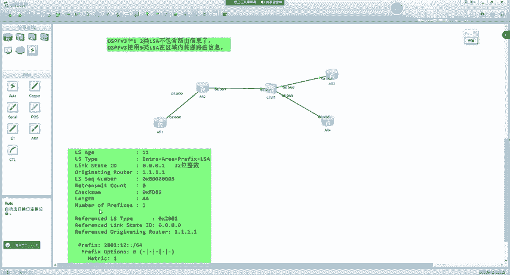

AR一上就能看到二的啊。然后我再看二产生的酒类。2。2。2。2。是吧。看二产生的酒类呢，前面也是头部信息啊。好吧。然后大家注意哦。啊，这啊当然这个只是一个单纯的，我就不复制了啊，我直接给大家说。

前面就是一个头部信息啊。然后要注意的就是在这一块，我们可以去看到。是吧是二自身直连的网络啊，是二这个路由器的啊，产生者是2。2嘛。呃当上面为一的时候，这里固定等于零的，所以咱们不用管。现在我就知道了。

2。2。2。2啊。哦，他也连接了2001冒号12冒号码号，到他口s等于1。

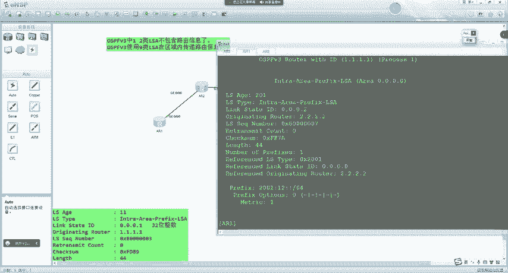

这时候我就知道了。你也连接了这个网络啊，到他的cos等于1。是吧。那这里摸完之后呢，我一看哦，还有一个什么啊？还有一个尾节点。对不对啊？

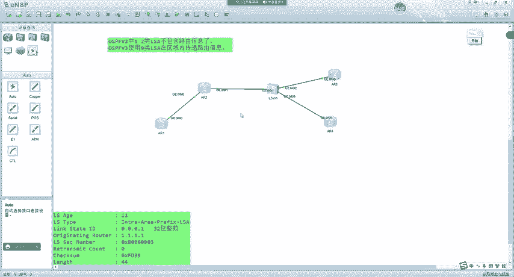

那这时候我就得看啊，怎么看呢？displayOSPV3lsDB。产生路由器是谁呢？4。4。4。4，这不就是违接点的入台地吗？是吧4。4。4。4产生的酒类。

注意啊，我在市场，我在宣告个。

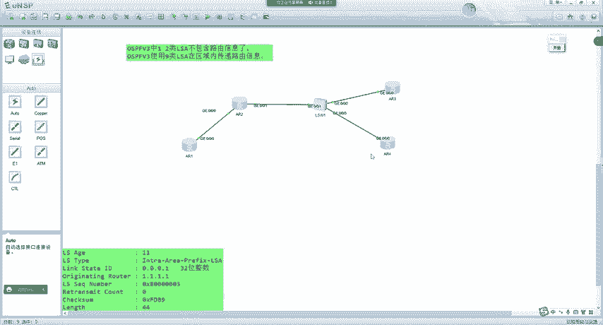

楼外零接口，我让大家看区别。然后注意啊，我现在在AR一上再去看一下。我发现呢4。4。4。4呢，它产生了多条酒类。是吧哎，那哪一个是尾节点的呢？我们就得来瞅一眼。

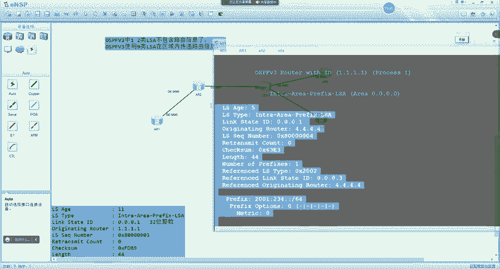

让我给他复制出来啊。首先我们来看第一个。😊，第一个呢。前面就是一些投部信息，这都是一样的啊，都是酒类啊，没有什么区别。是吧。逃部信息看完之后呢，我一看你有一个前缀。哎，但是我接下来连的是尾节点啊，是吧？

在我的to数中，我知道它是尾节点啊。那尾结点应该是参考的二类啊。对吧。所以说我就会再去看。呃，产生者4。4没错。4。4产生的几类呢？这是几类啊，大家告诉我。是吧一看到0X2002啊。

我就知道它是共享网端尾节点的。对不对？那有没有这种可能呢？A24是多个网段的伪接点。那我们通过这两个信息。能不能判断出来这个LC。就是这个共享网站内的。拿不拿。不行。是吧一定是不行的。

因为A24在这个共享网段产生的也是它产生的，也是尾节点的。对不对？我们就看不出来。那这时候怎么办呢？我们得通过interface IDD去看。😊，首先在我的拓扑数中呢。

我是可以知道四是连接这个尾节点的interface IDD的。

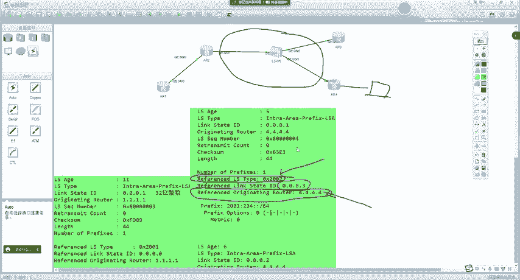

对吧。等于3。而我们所产生的9类LC。参考的链路状态D，它就等于接口ID。所以说我会去看0003的啊，如果这边是伪机，这边也有一个呢，他应该会有个0X4。对吧，反正肯定不会有删了。

所以这就是interface IDD的作用啊，标识唯一使用OSPF的接口。那这时候我就知道了哦，尾节点上呢有个2001冒号234，冒哈冒哈。是吧到他的扣s等于0。我就知道了。在尾节点上。有一个。

2001冒号234，冒哈码号杠64。到他的扣除证里。

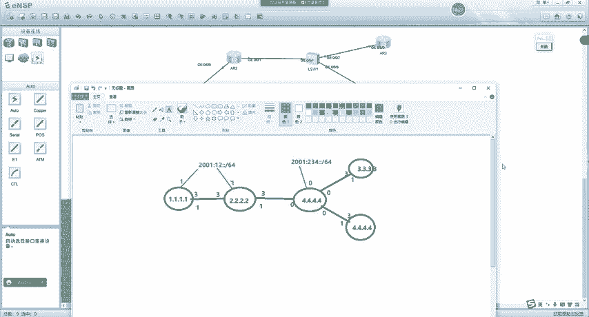

啊，然后我就再句话，还有没有其他详状的，没有了。

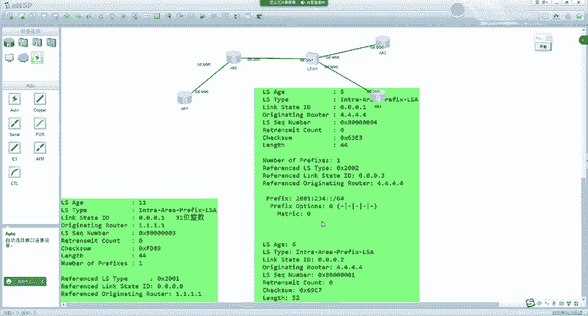

没有了，接下来我再去画四的。对不对？填充四的叶子信息。

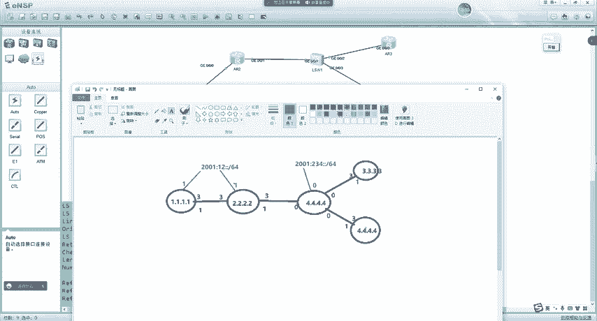

结果我看四产生的9类LC呢有两条。是吧一个是尾节点的啊，肯定不是我们希望要的。然后我再去看呢。

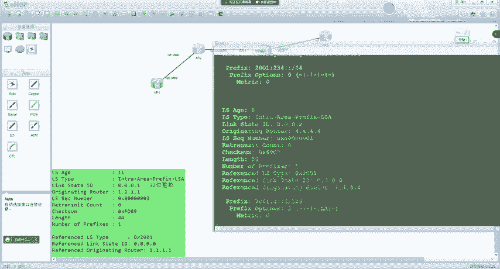

哦。这个是真正路由器的。啊，然后就长这样子。那前面是一些头币信息，我们就不需要再说了，对吧？那这里呢链入状态地我们发生了改变啊，为什么呢？因为四产生了两条九类，所以说这个是32位整数是吧，会依次叠加。

😊，那我们接下来往下看呢，在这里参考的是0X2001啊，代表是属于A24这台路由器的。是吧四产生的那这里固定等于0嘛，但前面等于一的。啊，好像没什么问题。然后这时候我就知道了啊，4啊。

他连接了1个2001冒号4，冒号冒号4。对杠128到他的扣s等于0。这个LA啊，大家不用管，我们没讲到啊。所以说在这里呢，我就知道了。A24啊。他连接了一个叫做2001冒号。是马哈马4-128。

到他的cos等于0。对吧。然后四还有没有呢？没了，没了就去看三的。

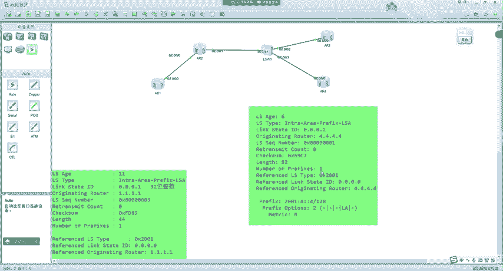

3。3。3。3。嗯，前面也是一大堆投币信息啊，在这里呢，3。3。3。一类LC是吧，参考这台路由器的。那在这里呢，他连接了1个2001冒号3，冒号冒号3到他扣s等于0。

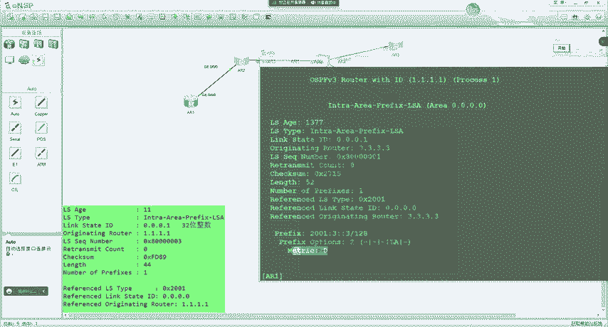

不知道A23呢。连接了一个。2001冒号3冒冒3-1208。啊，到他的扣舌等于。那这时候整网的路由就都有了。那比如说A21要去计算3。3，这扣s应该等于多少呢？应该等于0呃，不对，1加1加0加0。

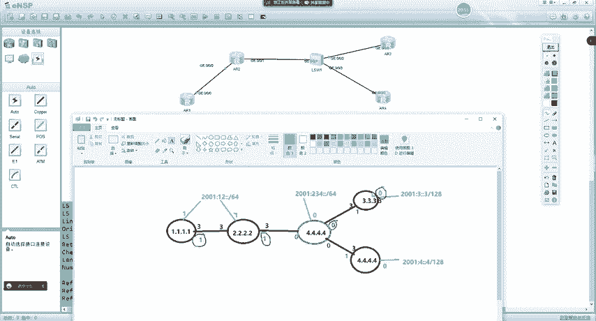

等于2。是吧所以说我们到A21上。diisplay IPPU6入ingtable2001冒号3，冒号冒号3。是不是正好等于2？

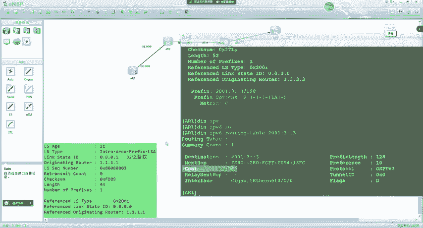

对吧。那这就是我们所看到的啊9类LRC它的一个作用。

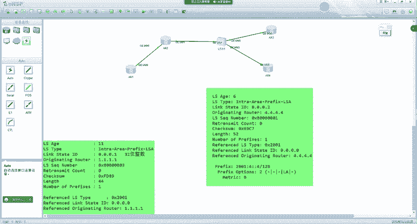

他主要就是描述呢。在OSPF中嗯，这VV2V3种啊这个区域内的一些路由信息。那这里可能大家会有一个疑惑是吧？就老师，我在看路由表的时候。哎，这个下一条地址是一个链路本地地址。

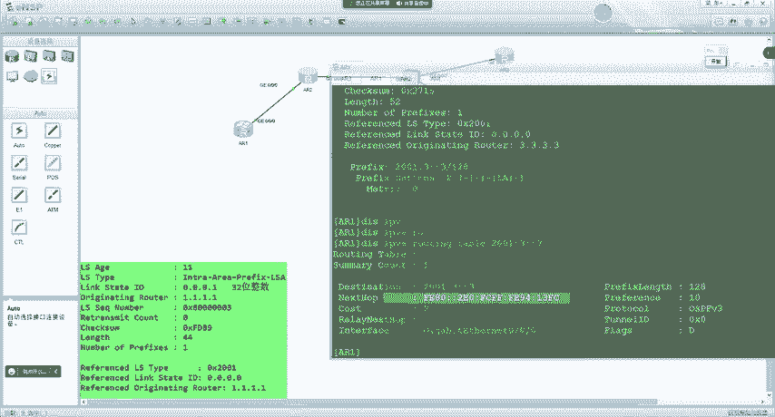

对吧。那A21怎么知道他下一跳AR2的链路本地地址呢？

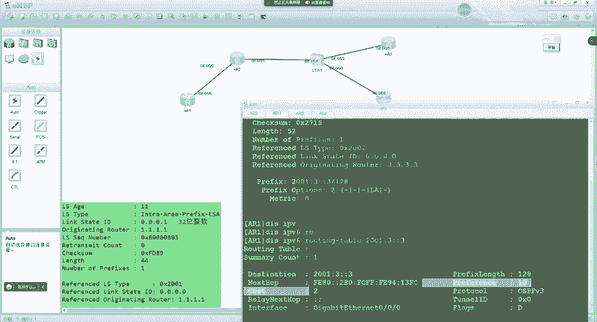

对不对？是吧。这是首先我们提出的第一个问题啊。ARE如何知道？下一跳地址呢。啊。那第二点就是什么呢？注意。

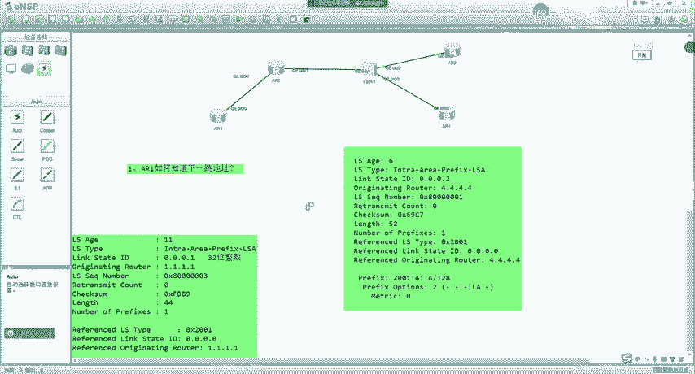

比如说这时候我在A23上。interfaceG0-0-0IP6dress2002。不要。maha。234冒号冒号6冒号冒号3。我在A23上呢，又配了一个地址。是吧。

那我们来看一下diplayOSPV3LDB。Local we boss。第四类OSPIV3。2DB。产生路由器3。3。3。3产生的9类LC。他有没有描述2002网段，没有。没有，那他在哪呢？我们来看4。

4。4产生的。参考的一类里面没有，但是在参考的二类里有没有有没有2002冒号234？有。是吧因为我们在VR中学习过一个概念，叫做共享网段所有的路由信息呢都是依附于伪节点的。是吧。

所以说参考的二类就相当于我在为伪节点通告的这个LRC。对不对啊？哎，那这时候我们就会有一个问题啊。😊。

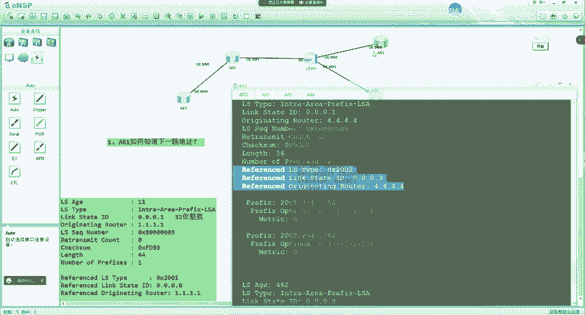

就是A24，他会帮尾结点。是吧就是帮他去产生一条酒类通告共享网段的路由信息。但这里有的一个疑惑，就是四怎么知道三的这个接口IP的呢？对吧他四都没有2002网段的四是2001。他怎么知道三的呢？

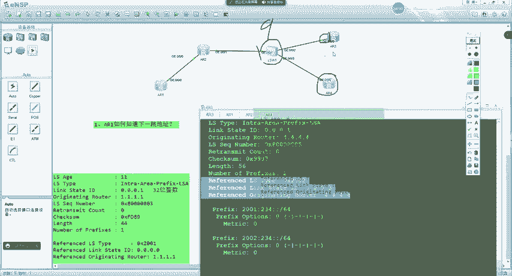

对不对？那这是我们第二个问题，就是。蒂R如何知道？共享网段内。其他。设备的。接口网段。啊，并不是哈lo包。哈罗包是链路本地地址。对或者说地址段。对不对？那这个问题。是吧我们就要去学习新的LC。嗯。

叫做type8的LIC，我们把它叫做linkLIC。主yao。linkLC是干嘛的呢？😊，第一个就是向该链路上其他的路由器通告本接口的链路本地地址。作为其他路由器的吓一跳。也就是说。

我们的每个设备呢都会在启用OSPV3的接口上。开启啊都会去产生一个链路呃另开LC。那这个linkLC呢，比如说二产生的linkLC描述自己接口的。链入本地地址。他传给一之后。一能不能作为下一条？可以吧。

所以这是linkLC的第一个作用，就是像其他路由器呢。通告本接口的。链路本地地址。第二个呢叫做向该链路上的其他路由器通告本接口的IPU6前缀。虽然你三是吧，什么哈lo啊，这些都不会说自己接口网段。

但是三在这个网段会产生linkLC。那这个linkLCDR肯定能收到。对不对？所以说A24能不能知道三这里有个2002的网段？完全是可以的是吧，这就实现了我们所说的第二个作用。

叫做DR是通过linkLRC知道共享网段内其他设备的地理段。那第三个作用是在哪里呢？向网络中其他路由器通告本链路始发的。二类LC中设置的可选项。这里大家就蒙病啊，这是啥意思啊？啊，我来给大家解释一下。

是这样的。我们来想一下啊。在AR1的top数中，他认为在这里有一台路由器。他认为在这里有一台路由器，而这台尾节点的。网段信息呢是吧？都是由DR帮他产生的。是吧是帮他产生。但是有没有这种可能呢？似某一天。

对吧。之前我们所说的有一个V6比特跟R比特，一个是不参与top数的计算，一个是不参与IPU6转发。比如说某一天4呢。他不想参与IPV6转发了。那这时候是给尾节点4。4。4产生LIC的时候。

能不能置卫这个V6呢？不行。是吧也就是说四不能给伪节点说，就是四虽然自身他不希望参与IPU6的计算，但是他不能通告给这个伪节点了，对吧？他帮伪节点产生的时候，不能说我不希望参与路由计算了。

是吧因为你帮伪节点产生的时候，如果也通告了，不希望参与路由计算，一算出来22算出来伪节点。一看到尾结点不想参与计算。他三都推不出来。是吧因为你正常要通过尾节点到3啊，但是你现在尾节点说你不参与计算。

你肯定是没有办法计算出三的。😡，是吧。也就是说我们会去发现呢。😡，从管理意图上，我们只是让4。停止参与IPU的计算。而在协议上呢，可能会通知的就是在只要经过伪节点的所有设备呢啊都没有办法参与IP的计算。

对吧。所以说在这时候。得有这么一种功能。什么样的功能呢？就是。这个4啊，他得知道哎，其他的设备要不要也参与IP6计算。比如说我是。DR我不参与IP6计算。对吧，但是A23参与IP6计算。那这时候呢。

4就可以将这个V6呃给它取消掉。能懂吗？也就是说他在为DR产生的时候呢，我一看啊，虽然我不参与IPU6计算了，但是经过这个尾节点的其他路由器啊，还是需要参与IPU6计算的。

所以说呢我参考其他路由器的建议，对吧？你要参与，我不参与。但是我在为DR产生的时候呢，我依然会给DR产生的时候告诉他，对吧？嗯，你应该参与IPU6计算。那未来A21呢才能够经过DH计算出来3啊。

而没有办法计算出来4。

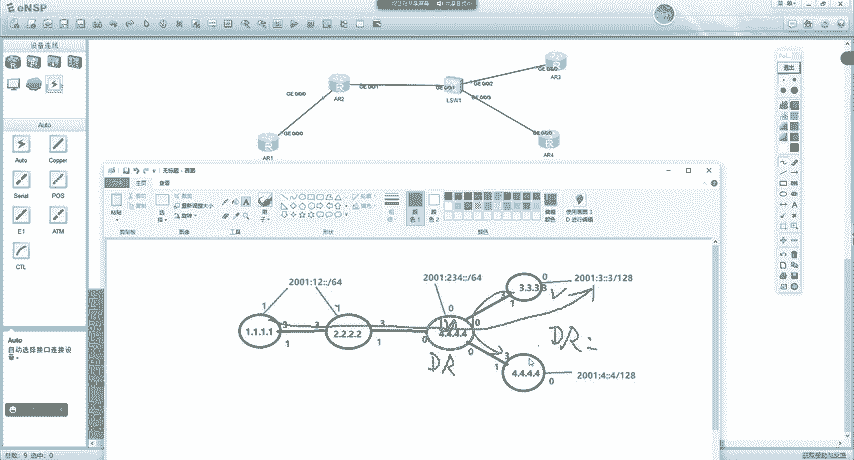

所以这就是linkLIA的第三个作用。

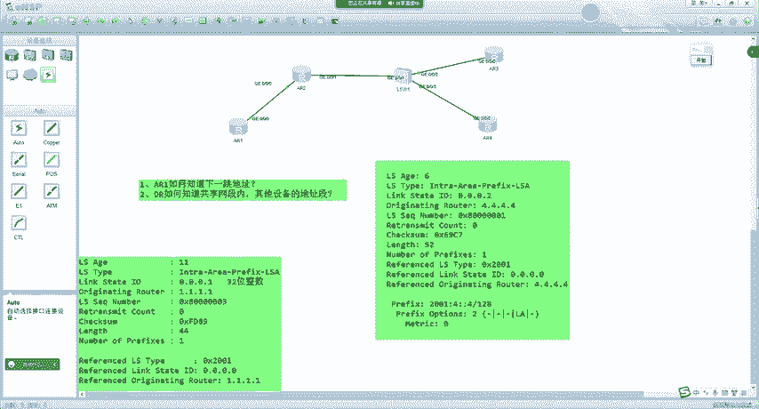

叫做什么呢？为啊，不对啊，向该链路上的其他路由器通告本链路始发的2类LC中设置的可选项。对吧就是那几个标记。也就是说三呢会向DR说，我还要参与IP率计算呢，你待会要是不参与了，你也得给D。

你也得让伟杰点参与啊，是吧？你不让韦杰点参与，我这边就没办法计算出来了，能懂吧？相当于给他说这么一段话。

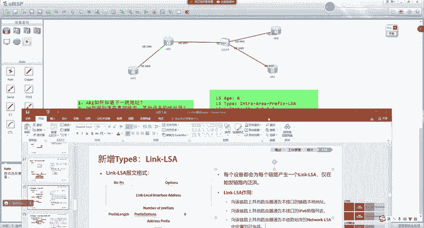

那这个linkLC的作用我们大概是看明白了，一个是通告链路本地地址做吓一跳嘛，是吧？一个给DR说我的IP的前缀，让DR统一产生9类描述共享网段的路由信息。😊。

那第三个呢就是向DR呢通告2代LC中应该设置的可选项。对吧那这个link个LC它长什么样子呢？我们来看啊。首先在这里呢有个DR优先级。在那里有一个option。啊。那下面呢还有一个叫做链路本地地址。

就作为其他路由器的。这个IP类前缀的。啊，不对啊，陆伟淼的吓一跳。然后里面包含了多少个IP6前缀，就是我以每一个接口呢，当有1个IPU6前缀的时候。我都会用前缀、长度、前缀option，还有地理前缀。

对我们把它叫做前缀三元组来进行描述。那比如说我在AR一上。

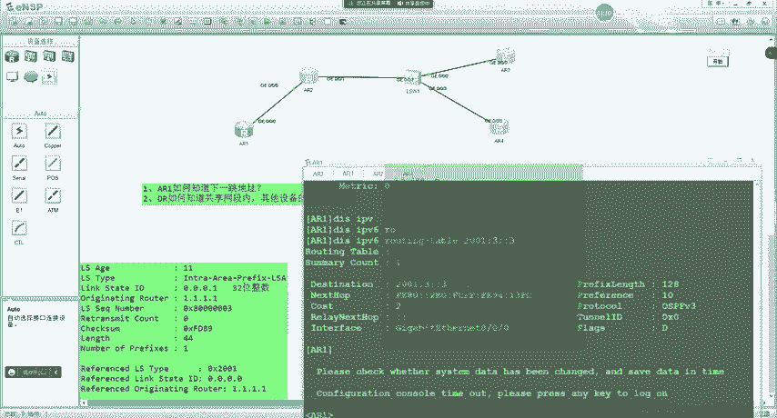

display OSPFV3。IDB。我们可以去看到呢。在A21的G0-0-0接口有2个linkLC。对吧。一个是自己的，一个是二产生的。我们来看一下。产生者2。2。2。2产生的linkLC。注意啊。

在这儿。前面呢就是一个头部信息。好吧。这些那linkLC的量状态地啊取值的是接口ID就是自己的interface IDD。啊。那下面我们就可以去看到一个option，就是A23待会不是要给二说。

你要参与IPU例计算嘛，对吧，你得把自己的标记给他告诉好。能不能明白？所以说这个option呢，它所实现的作用就是我们刚刚看到的第三个。像其他路由器。通告自身。支持的一些能力。

而里面还会包含我的链路本地地址，而这个链路本地地址一旦AR一收到之后。我一看下一跳是2。2啊，我连接了二的3口。啊，二的三口，他得链出本地地址。是多少呢？FE80冒号210。

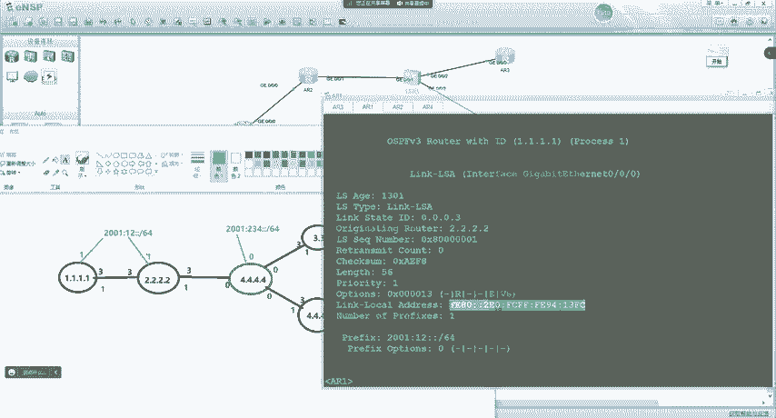

对不对？也就是说A2一未来就可以计算出来。我所有的路由啊。他的吓一跳都是这么个地址。

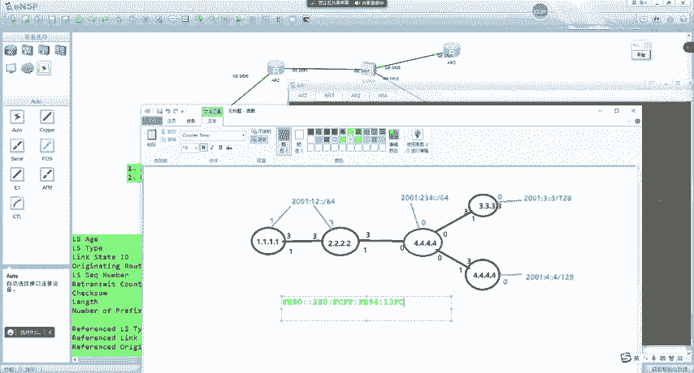

然后我们看了一下。AR一只要经过A2去的网段。我们看一下下一跳是否一样呢。2001冒号234。F180。210。FCFF。FE9413FC。是吧一模一样。所以这是他体现的第二个作用，就是。

让其他的路由器呢，对吧，通过我的链路本地地址计算吓一跳。那第三个作用就是通告本接口的。IPV6前缀。那这个IP6前缀呢？就是在这里的，注意啊，里面有1个IPU的前缀，我们可以看到。

对吧。这个IP类前缀是干嘛的呢？

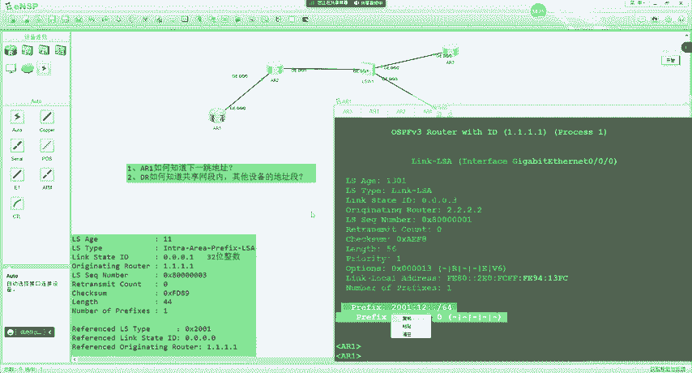

在P to P网络中啊没有多大的意义啊。但是。在我们的广播型链路上，我们可以去发现啊。

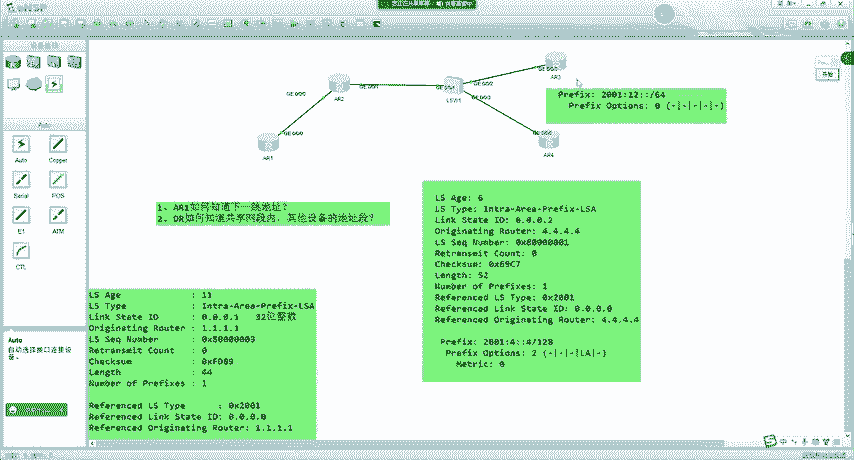

A23除产生的OSPFV3。

IDB。产生路由器3。3。3。3产生的link卡。三呢。他在产生的linkLA中。就去包含了自己接口所有的IP6线坠。而link个LC在链路上进行泛红。4、能不能收到呢？D四playOSPV3RSDB。

4就能够收到A23产生的linkLC。对不对？是吧。哎，不对，这是9类。应该在这儿。另开2谁。A23产生的link23。对吧那这时候A24就收集到了共享网段内呃，无论你A23或者AR配了几个。

他们都会通过linkLC给D押。那这时候呢，我们的A24就收集到了共享网段内所有的路由信息。

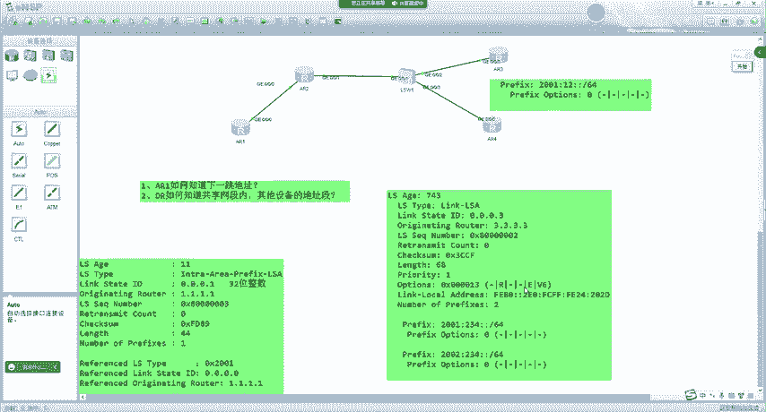

那这时候呢。我们来看A24。所产生的9类LC中。有没有去描述这个2002啊？有吧。那也就是说，未来在AR1的透数上呢，他就直接认为2002。对，在这里还有1个20。02冒号234。

马哈马哈杠64咋到达他的cos他呢。也是等于。那这时候呢，我们才购真正的形成了所有的SPF数。马来看。比如说A21到2001马哈234马哈马哈他应该等于1加1。对吧。嘉玲。等于2。

所以我们在ARE上display IPPU6入table2001冒号234，冒冒号。等于2。那2002呢，冒号234，冒号码号也是等于2。好吧。所以说呢。在这里20啊2002啊。马哈234马哈马哈。

他的cos也能够计算出来。

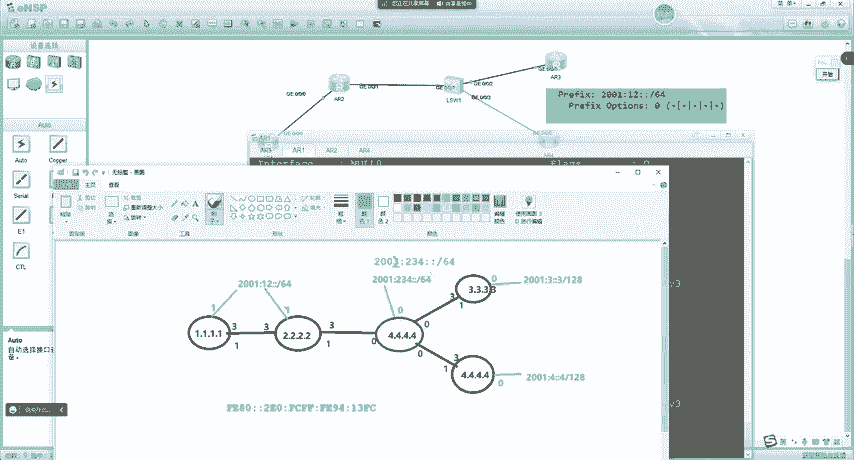

那这就是我们所看到的8类LRC它所体现的一个作用。那可能还有很多同员有疑惑，就老师啊。刚刚你讲的前缀啊，还有他的前缀长度我都能看懂。但是无论是你看到的这个9类LIC呢。还是8类LC。

他们都有一个叫做前缀option。呃，前缀option。那这个前缀option他又是干什么用的呢？那这里呢我们就要通过3类LC啊，给大家解释一下前缀option的作用。追意啊。嗯。主要是这样的。

3辆SC待会我们再讲啊，我先解释前缀option。主要是这样的。在我们之前所学习到的OSPFV2中。那他有着一个缺陷。什么样的缺陷呢？就是他路由的计算有点比较复杂。是稍微比较复杂。

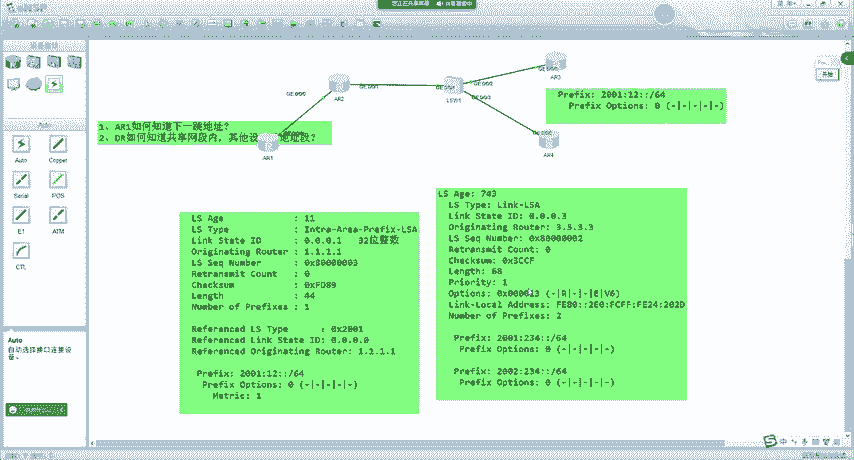

他负杂在哪呢？比如说一类LC呢。我要读STOB。Night。是吧计算路由。比如说二类、三类、五类啊对吧，七类啊。这些呢。我们的设备就要去读取。LID。对吧因为你的链路状态低等于你。的网络前缀。呃。

在357里面等于网络前缀。二里面等于DR接口的IP。是吧。还得去看一下network。Mask。对不对？357呢，我通过链路状态地可以判出来前缀，然后去通过nnet work mask给填充掩码就行了。

但是对于二类LC链路状态地等于DR接口的IP地址。对不对？那这时候所面临到的一个问题是什么呢？就是我们的设备在计算路由的时候，还得拿链路状台的。跟我的network mask做语音算。

已计算出共享网段内的前缀信息。所以在这时候呢，我们的设备处理的步骤啊就会变得更多。是吧那效率肯定就会变得更慢。那这个问题怎么解决呢？实际上就是在我们的OSPFV3中。

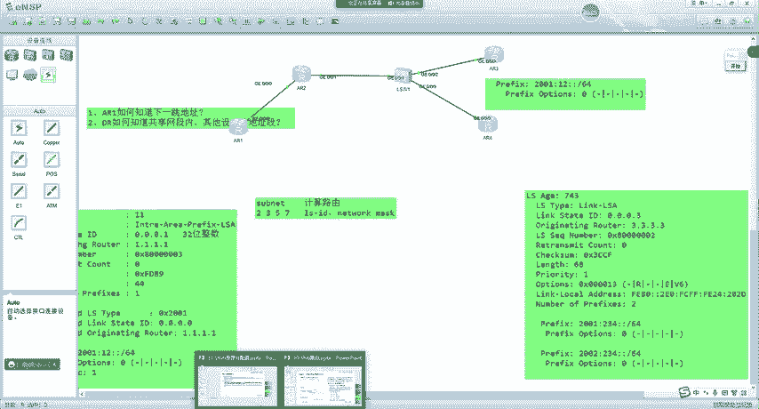

注意啊。增加了一个概念，我们把它叫做。前缀3元组。主叫做前缀3元组。前缀3元组呢？一个是前缀长度。一个是前缀option。还有一个地址前缀。前缀长度就是我们说的64啊，128啊，对吧？96啊这种。对。

然后加上前缀option啊，不对啊，加上地址前缀呃，就会有一个，比如说2001冒号冒号呃，前置长度是杠64。对不对？也就是说在V3里面，无论你是哪种LRC，只要你是用于描述路由信息的。😡。

统一用前缀三元组来进行表示。可能大家有疑惑。老师。用前缀三元组，他比以前的这个还多呢。那我们的设备是不是更慢了呢？并不是。设备都是基于规律。对吧以及策略执行的。如果在执行上它是有特定规律的东西。

那么设备的执行只会变得更快。而不会去变得更慢。好吧。所以说设备呢啊执行的就是你所涉及的这些原则。如果有固守的原则能够去执行啊吧，比如说来了一个我只读这三个字段啊，没有，那你就没有路由信息。

那我们的设备的这个处理速度。嗯，就变得更快。所以这是这两个比的，一个是前缀长度，一个地址前缀很简单。那前缀3元组中还有一个叫做前缀option。对a。一个叫做P比特，一个叫做MC，一个叫LO。

一个叫做MU。一共是三个比特。那他们分别有什么样的作用呢？我来瞅一下。首先呢。批评他。代表叫做传播位。比如说我们要执行七转5，就要置这一位啊，我们在V2中也学到这个P比特作用是一模一样的。

因个叫做MC叫做主播位，那我们就不用管了。啊，用于主播OSPF。一个叫做LA呢叫做本地地理位。这个本地地址为。比如说我们刚刚就能够看到。这里有没有一个嗯？

这里有没有1个LV啊？

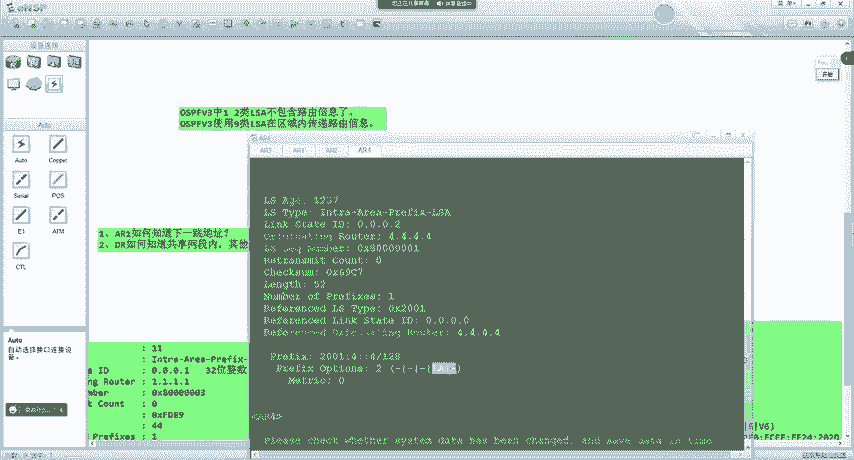

有吧。他所代表的意思呢，就是设备身上的一个接口IP就是这个路由呢，就是一个设备的接口IP那肯定是杠128的嘛。对吧所以说我们可以去看到呢四产生的依赖RAC中描述自己的环水口RAA就质一了，告诉你呢。

这是我本地上的一个。

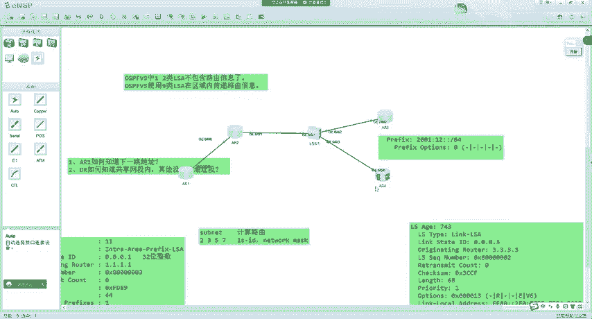

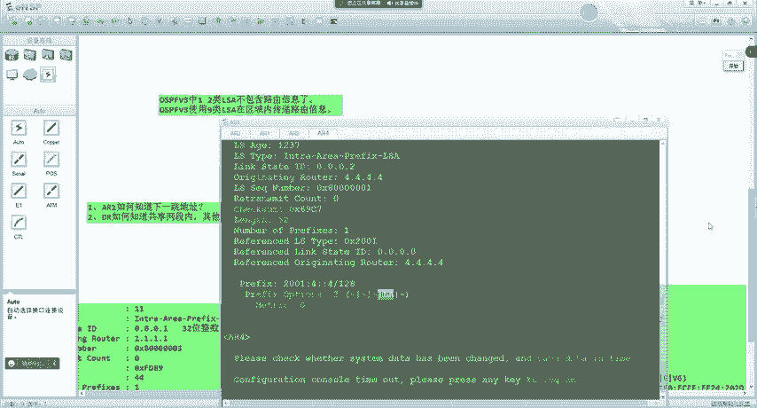

IP的地址。然后还有一个NU叫做非单波位。如果设置为一，这个前缀就不会纳入到IPU6路由器算中。那这是前缀option所携带的色笔。那这几个option呢会随着旋缀一起出现。

所以我们刚通过命令函可以去看到呢。前坠。对吧前缀长度前缀option。那这几个部分呢，他们就构成了，我们把它叫做前缀3元组。那可以使我们的设备呢在计算路由的时候，效率变得更快。好吧，速度呢啊变得更快。

收敛也会变更。那这就是OSPFV3啊所新增的一些好处。

好吧。那这个就是我们刚刚所说的啊。呃，前缀3元组。那什么时候才会携带前缀三元组呢？只要是在V3中用于传递路由，就会携带。比如说3辆LC，它要传递路由。对吧。我在A23上，我这么来赔。

interface low back1。IPV6 enableable IP6dress2002冒号3，冒号码号3128。OSPRV31E。对吧。加入到另一个区域中。那么这时候A23作为ABR呢。

他就会去执行区域之间的路由转换。所以我们在AR一上di四playOSPFV3。

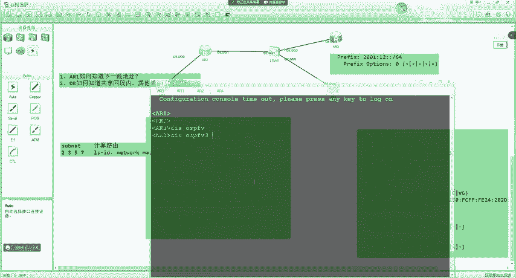

RSPB。我们就可以去看到一个呢。叫做。区域间。前缀LRC。是吧是一个三类啊，从001开始编号的32位整数啊。那我们去查看这个LC的详细内容呢，3。3。3。3。产生的区域间前缀啊，这区域内。Tiya。

区域间前缀ever。咱们就可以去看到一个三类。而这个三类呢。也是非常简单的。前面无非就是一个头部。那到底你36LC携带的是去间的哪条前缀呢？我们使用前缀3元组。对吧。地址前缀。前缀长度前缀哦不是。

用于描述这条路由。是吧那AR11收到就知道哦，ABR上面还有一个叶子啊。对吧你到2002冒号3冒冒号3的扣s等于0。这时候AR一呢就能够计算出来。那录由表比较多啊，就在这里呢。我，知道了。

你到20032002冒号23。应该是冒号3冒号冒号3-128，扣s等于0。那一到这个网段呢，就是1加0加0加0等于2。比如说我们在A21上呢，第一play IPP6如table2002冒号3冒号冒3。

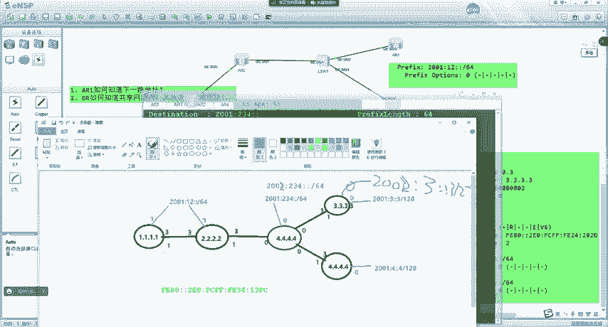

是不是等于2啊？对吧。那这就是3类LC啊，3类LRC很简单。

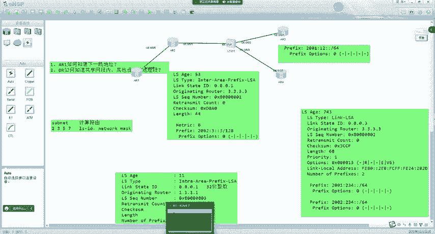

和我们在V2中学习的没有什么区别啊，区别就是有了一个前缀三元组。那四类也就变得更简单了。

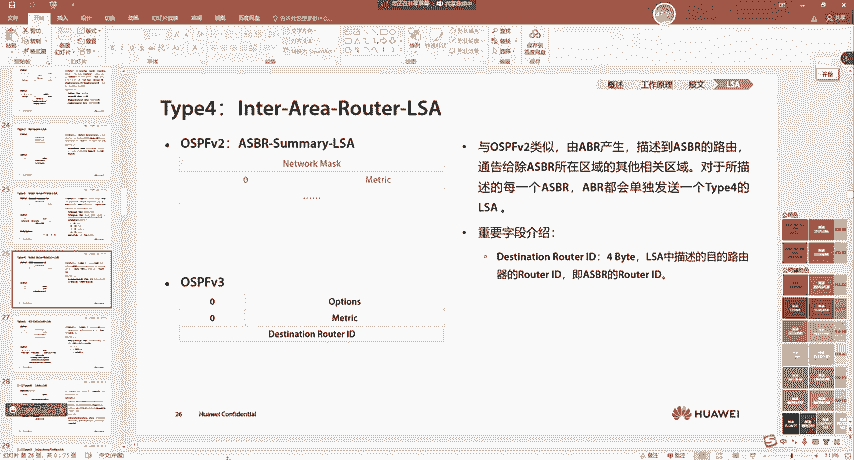

四类是怎么样的呢？比如说我现在在A21上。IPV6router sentence。马号马浩林。对，然后在OSPR微箱下应。In音。啊，把IPV6静态给他引入进来。延重进来之后呢。

A21他就会说自己是ASBR。所以说D四playOSPRV3LDB。产生路由器1。1。1。1产生的root LIC。就说了自己是ASBR。啊一比特之1。注意啊，是flag啊。

不是optionoption的意义是你有没有5类LC标识你的区域的。在这里呢，我们看到A2一就说自己是ASBR。那这时候呢，我们的A23连接了一个区移。对吧在这里他可以通过一类知道。A2一是SB啊。

但是在区域一内，它是不是得产生4类啊？对吧所以我们到A2413A23上呢来看一下diplayOSPV3RSDV。产生路由器。3。3。3。3，因为是ABR产生4。LC通告到其他区域。产生的去间路由器LC。

这就是一条四类。那前面呢也是一个头部信息。对吧链路状态D呢取值是ASBR的。对吧入台地。通告者3。3。3，谁是ASBR呢？1。1。1。1以及ABR到达ASBR的co。对吧。

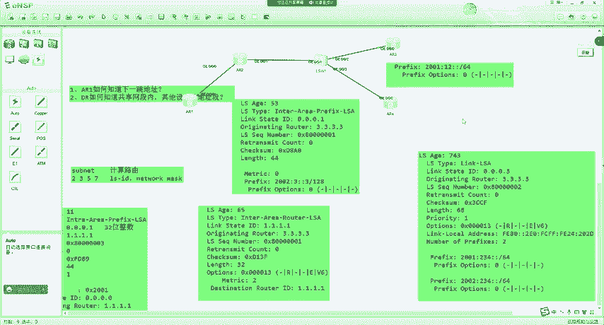

所以我们可以去看到啊，四类LIC跟我们在学VR的时候没有什么区别。对不对？没有任何区别。只是通过目的的入台地。去描述ASBR的主态地。是通过m trick。去携带上啊这个ABR到达ASBR的。

那这个就是4类。这这哪复杂了，这算最简单的一个啊。那酒类不比这个复杂。好吧。然后我们再来看五类。五类呢。相比于那些四类呢要较复杂一点点。那复杂在哪里呢？我们来看一下。首先，在V3里面的5类LC呢。

依然是由ASBR去产生的。也会在所有的普通区域通告。当然像sb区啊，对吧？那些特殊区域就不会通告无理。50LC的格式是这样的。首先有个保留位。在那里有个伊比特。伊比特呢？

用来描述我是外部路由类型一还是外部路由类型。2。

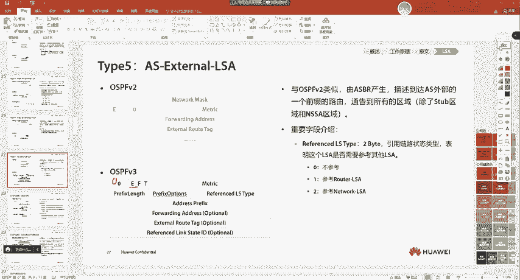

好吧。啊，如果没记错，应该是啊我瞅一眼。哦，对，就是用来描述是外部录入类型一还是类型。如果值位一代表是第二类外部。如果值位零代表是第一类外。这里呢用来描述50LC的类型是太有一还是太8。

F比特呢用来代表后面有没有转发地址。所以说在V3里面呢，转发地址变成了一种可选项，可以带可以不带。啊，就有没有转发地址这个。嗯，TRV存在。好吧。那这个T呢代表后面有没有roott存在？在这里入了太。

好吧。那这时候我们先来看一个。50LC长什么样子？刚AR1，我不是引入了一条缺绳吗？D4OSPF。V3LSDB。我们就可以去看到一条。啊，没有缺少。那我写一条静态IPV6router。一、冒号一。

一、冒号冒号一。64。只到一个空接口。啊，还不能是1啊。啊，可以是，我看有没有引入进了啊。来了。对吧在这里就有一条9类。那我们去看他的详细信息，1。1。1。1产生的。act对吧外部LIC。

这里面就是他的信息内容。那前面依然是一个头部信息，在这里呢使用链路状态D呃，0001用来标识不同的啊这个5类LC。好吧，产生者是ABR，1。1。1。1呃，投币信息啊，没啥说的。那在这里呢，有一个伊比特。

如果质一代表是外部路由typeper。对吧。所以说在这里呢我们可以去看到。现在是一个type2。嗯。ASBR啊到达。Y部由的cos等于1。对不对，那这个应该是F，就是代表后面有没有转发地址。

那现在我们没有转发地址，它是周为为零的。那这里有一个T呢，代表后面有没有root tiger。我们可以看到这条外部路由带一个tger一。对吧所以T呢就标注为一了。好吧。

那这个5类LC它携带了什么样的内容呢？也是由前缀三元组。只要你是路由，就离不开前缀三英组。地址前缀前缀长度、前缀option。好吧，这就是5类。

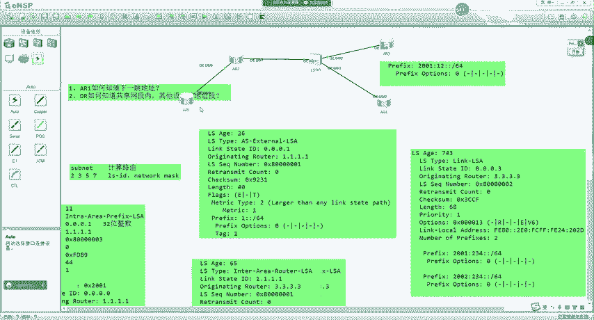

那除了这些呢，50LC还有一些新增的。还有一个叫做参考的。地理前缀这前缀三英组就没啥说的啊。这几个给大家说完了。是吧ASBR到达外部路由都cos了。前缀3元组。对吧有没有FA地址？有没有tiger？

那还剩下两个有一还有1个95类LC，也有一个参考的 type。啊，这里呢我给大家说一下。😡，那这个字段呢在RC里是有一些描述的。啊，但是呢目前没有例子。朱要。没有应用的例子。是这么说的。就是。

当我们的这条5类LIC。注意啊。他需要去参考另1个LIC才能够完成计算的时候。那么才会去携带上这个。参考的al time。就跟我们的酒类不也有一个参考的air态。对吧如果是零呢，代表是不参考。

如果为一代表参考一类。如果为二呢，参考的是二。但是你参考了一类，参考了二类，参考的谁呢？是吧参考的哪一个？对吧那由参考的链路状态ID。这也是1个TRV啊。那么具体参考的是哪一个？通过。

后面这个TRV写的。好吧。那这个字段呢？目前没有被实际应用的例子。注意啊，这个目前没有应用的例子。只不过呢有这么一个功能。啊，已经被定义出来了。但是呢。没有被使用过。好吧。所以我们刚通过命令行呢。

你去看。你就看不到这两个内容。对不对？所以说大家要注意啊，这里没有例子啊，就是。呃，写这个OSPIV3的人，因为这个技术还比较新啊，不是说就用的很熟了，对吧？呃，就是写OSPIV3这个人呢当然是个团队。

他们已经把这项可能用于未来的功能。写了出来对，也预留了特定的自作段。但是呢没有被实际部署过。啊，也就是说呢。嗯，厂商也没有去考虑到，对吧？他真正在哪里去应用。好吧。那这就是我们所看到的啊5类LC。

那通过这节课的内容呢，我们已经把12345689对吧，学完了。那其他的特征呢，跟我们的其他就配置了啊，这些我就不一一给大家演示了。

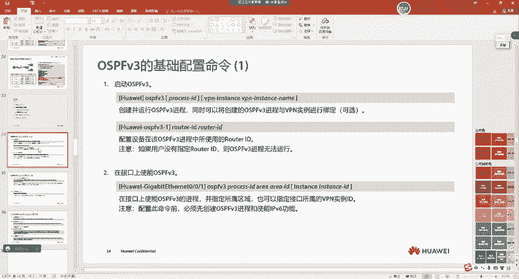

那接下来我要给大家说的就是OSPFV3其他的内容跟V2基本类似。特别是在配置逻辑上。这个配置逻辑很好去理解。不是你学了OSPIV3之后，你还要去懂另一套配置，并不用。

原本在我们OSPFV2中所能够使用的那些OSPF打问号有很多。啊，认证啊，BFD啊cos啊对吧？DR优先级啊，对吧？开启功能啊。对不对？在OSPFV3中，你打问号。也基本都有。

但这个要看设备能力的支持啊，我模拟器里面没有那么多。我们可以看到cos的DR优先级啊，对吧？MTU检查啊网络类型啊对吧？啊，什么传输延迟啊，hello时间等等之类的。😊，啊，以及手动指定邻居啊。

都可以去配。好吧。那在进程下也是一样，引入你就inport对吧？汇总你就ASBRs，这是V3的啊。你要配置。这个什么。特殊区域你就在区域下吧，那萨。对不对啊，都能够去配。如果你要做ABR的汇总。

就是ABRsum。能不能明白？所以说配置逻辑基本都是类似的，以前就是OSPF问号。是吧你打问号往后去看。那在我们的OSPFV3中啊，你就OSPFV3问号就行。要什么产生缺省路由。

对吧建到哪个区ABR汇容，对不对，back up没用过啊，参考的这个。啊，带宽那参考带宽值产生什么缺省路由啊，这是我们之前用到的赌漫 ID可能大家还没学啊，field po呀对吧？GR。😊。

是吧啊引入啊。对不对？LIC智能定时器啊LC产生的智能定时器啊负载分担啊吓一跳权重啊。😊，是吧啊，路由先级等等之类的，有很多啊。那么这些呢。都能够去用。所以说V3跟V2的配置逻辑啊基本是类似的。好吧。

那我们的OSPRV3就讲完了啊，就这么多。

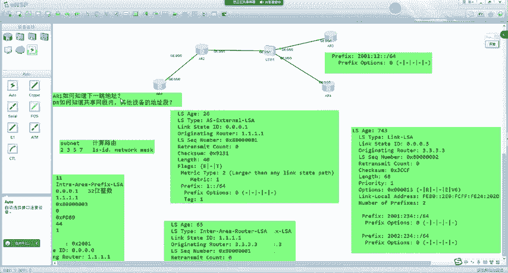

那课件剩下的就都是配置了，这个我就不带大家一一过了。好吧。咱们休息一会儿。休息一会儿之后呢，来给大家讲一下。嗯，IS的IPU6。好吧，休息会儿啊。😊，链路状态的一种编号的。这个就很简单啊。

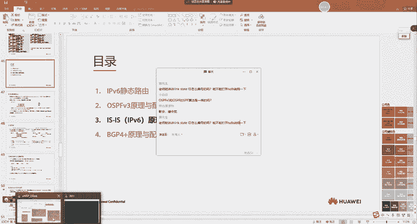

你看啊。一类LC它就是从零开始的。注意啊。这个一类LVC就从零开始编的。能懂吗？他就是1个32位数啊，用为标识不同的一类的。二类呢是DR接口的interface IDD。三类呢，他应该是从一开始变的啊。

我找找。啊，对，三类是从一开始变的啊。好吧。他也没从零开始啦，当然这个比较特殊啊。那你我也不知道为什么。是吧这说话给大家说啊，我也没想过原因啊，反正他就从一开始编的。😊，呃，然后四类LC呢。

得到山上来看。对吧他就是ASB啊，就是这个。啊，ASBR的入台低好吧，就他的亮度上还低。然后5类LC呢也是从一开始编的，就是1个32位序号，用来表示不同的LC。啊，六又没有是吧，七跟五是一样的逻辑。

好吧，八的取值呢是自己接口的interface IDD。好吧。那九应该也是从一开始变的啊，能看到吗？九也是从一开始变的，32位整数用来标识不同的酒类。这有啥规律啊，这当然没规律啊。没有规律啊。

注意没有任何规律。能懂吗？你在V2中，他也没有规律啊。😡，V2的一类不就是1。1点链路状的。😡，威尔的一类是。入台地二类是地押的接口IP。是吧这三类呢是这个357呢。他是这个。外部路由前缀。啊。

叫做路由前缀。是吧他也没有规律啊。😡，能懂吗？V31样啊是没有规律的。好吧。嗯，对，86会继续描述啊，就他做的比较标准啊。这个全同学说的倒不错啊。就是我通过对方的hello的原地址啊，能不能识别呢？

可以。但这时候呢，我们还要把哈喽包。注意啊，hello包他本身就是用于建立和维护邻居关系的。对吧我还要把hello包跟我的top数关联到一起，在内部跑一个进程。然后去计算吓一跳。对不对？

那这个在设备内部处理起来，我觉得就相对来说比较复杂一点。能懂吧？所以说V3里面呢单独做了一个linkLC。啊，你要画拓普数计算路由啊这一块的，你就直接。是吧通过LIC去看就行了。

而这时候我们不需要通过hello包再去排了。那你从哈lo包跟top数关联到一起。对吧hello包里面有入台地啊，对吧，有这个原地址作为吓一跳啊。对吧然后你看到哪个吓一跳呢，你再跟哈拉巴的源关联到一起。

对吧？然后将这个原地址呢关联到你的路由再吓一跳，那这样就比较麻烦啊。😊，行。那咱们就休息一会儿。好吧，休息10分钟。

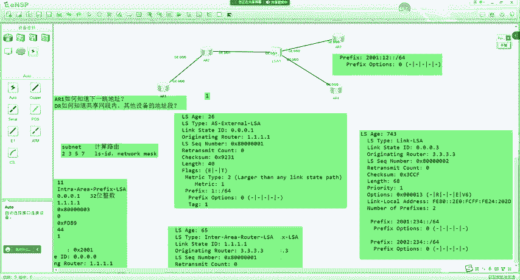

1分钟之后呢，我们去讲一下ISS怎么样去支持IPV6。休息会儿吧啊。

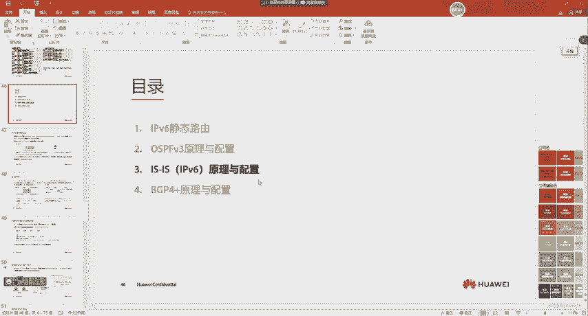

呃，接下来我们要讲的是这个ISS怎么样支持IPU6啊。呃，这个相比OSPIV3啊，它就简单了很多好吧，简单很多啊嗯，然后我们来看一下吧。首先大家注意啊。

就是我们所学到所有ISS啊嗯都叫做集成的ISS对吧？嗯，这种集成的ISS呢，它是支持IPV4啊嗯IPV6，还有这个CLNP的，就是传统的OSI模型下的那个网络层协议，对吧？CLNP。嗯。

在我们学到的这个ISS中啊，大家注意他为了去支持IP6计算，实际上它相当于相对于就或者说相比于啊。OSPF要简单了很多是简单很多啊。为什么我们学OSPF的时候，我们发现我们除了V2，还要学1个V3呢？

嗯，是因为当我们的网络层发生改变的时候。😊，嗯，我们之前用的是这个IP4，对吧？而V2呢，它运行在IP4之上啊，这就相当于釜底抽薪一样是吧？啊，你把它的这个依赖的协议对吧？把IP4给它抽走了。😊。

那我们的这个OSPIV2呢就没有应用的地方了。所以说我们要开发出新的协议对吧？就是OSPIV3应用于IPU6之上。而对于ISS呢，它很简单，ISS我们之前说过啊，它是基于链容层的协议。😊，那也就是说。

基于链路层在进行建立的时候呢啊你网络层是什么样的路由啊，跟我们的ISS是没有关系的。SS所能够提现的一个好处是这样的啊，我都是基于链路去建立的邻居，对吧？那无论你是IPV4啊，还是IPV6。

还是原有的CLNP。

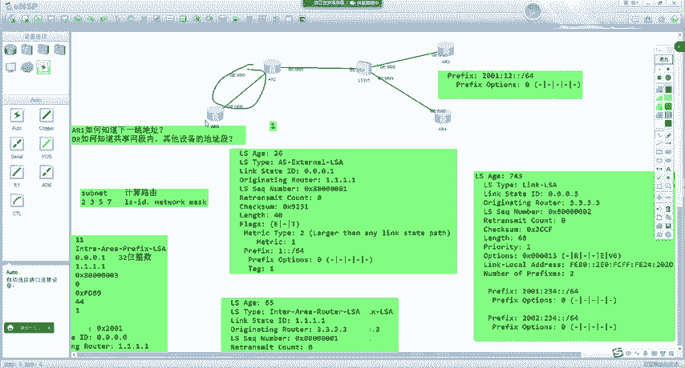

甭管你是什么样的路由，我只需要有对应的TRV。我开发一个新的TIV。去携带你这种路由就可以了。大家能明白吗？就是携带你这种路由就行了。哎，你是什么样的，就SS他不关心你上层是什么样的网络层协议。😡。

只要他能够进行传递，对吧？那我们就可以执行正常的路由计算。那这就是IS的一个好处啊。所以说为了支持IPU6的计算呢，我们不需要去重新学一下，对吧？老师有没有ISV6啊，是吧？我们之前学的是ISSV4。

没有我们学的都是集成的ISS。😡，只不过呢我们要去关注一下IS怎么样去传递IPU里的路由，是这么一种关系，好吧。😡，那IS呢去传递IPU6路由的时候，新增了2个TIV啊，还有一个叫做NLPID。

叫做网络层协议标识符。对吧那这两个东西到底是干什么用的是吧？呃，那咱们就一个一个来看一下，好吧。😊，那首先第一个呢，TIV就新增2个TIV嘛，1个TIV我们一般把它叫做TIV232对吧啊。

这是它的一个编号。

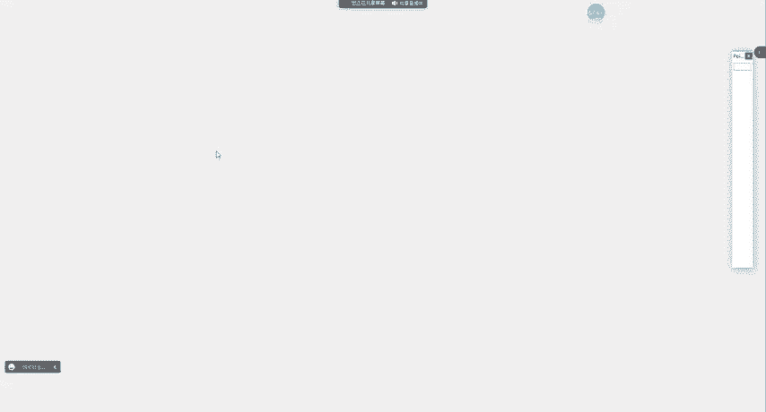

232TLV呢，它相当于132TRV是一样的。也就是说在我们的IPUV4中对吧？学习II4传递IPU4路由的时候，要用TLV132去携带IPV4的地址。是吧而232呢，它等同于这个132。

只不过把原来的32比特的IPV4地址换成了IPU6地址啊，就这么一种简单的关系。对吧所以说呢TIV232这是它的格式嘛，对吧呃类型。😊，长度啊接口地址。对不对？但接口地址可以有多个？为什么有多个？

因为我们的IPU6可以配置多个地址。对吧所以说可以有多个。但这个地址在携带的时候注意。hello豹文呢他只会携带一个链路本地地址，而RSP是可以携带多个的。所以说这是他在编码的时候。

或者说在不同的报文中。有不同的区别，所以说这很简单啊，对吧？那有同学可能说了，老师我在学ISSIPV4的时候，没关注过什么132啊是吧？嗯，大家不用关注，这里只不过再给你说一下。

就是IP4SS中呢有这么一个，你知道IPU6中用这一个携带就行了。😊，好吧，那后面呢咱们会抓班来给大家去看一下。😊，那236号TIV呢，相当于128跟130128跟130，大家还记得是干嘛的吗？😡。

在ISSIPV4的载度梁中，我们通过128携带内部路由是吧？通过130呢携带ISS的外部路由。而在I34支持IPU6的时候，就不分内部和外部了。统一呢用236号TIV来携带，就是它是用来携带路由的。

这就用来携带接口的。啊，就这两个关系。好吧。那它里面还有一些其他的比特，对吧？我需要把这些来看一下。首先。232号TRV嘛，对吧，携带。长度对吧，因为你是携带前缀的对吧，或者说携带路由的。

你得有到路由的cos啊。😡，啊，当metric有两个啊，在128里，我记得也有两个，但是实际我们用到的只有一个。好吧。那在这里呢还有一个优比特，有个S比特X啊，有S，还有R啊，还有一个前缀长度。

我们来看一下啊。优比特呢他是阿不当的比特威。返还的大家还记得吧？级别1级别2。啊，级别12啊。级别12。从这个路由器泄过来，泄露到G别一的路由up down的比特位都是质一。

然后这个路由器呢看不到up down的比特为至一的G别一路由不会再传到GB2中防还的。是吧。那这是up down的比特位啊，U比特还有一个X。😡，X呢用于标识它是内部还是外部的？对吧在IPU4中。

你有2个TIVIPU6中呢，1个TIV加上一个比特。😡，啊，用来标识这是内部的ISS内部的录音信息，还是你从协议其他协议引入进来的。😡，还有一个X呢，代表有没有子TRV。

那什么时候可以有子TRV大家还记得吗？😡，SS在打tag的时候，他是通过子TRV来进行携带的。对吧所以说S比特呢用于标识后面啊，或者说里面对吧，还有没有去携带子TRV啊，当然这是一个可选的啊。

如果有子TRV就质疑。阿比特呢是保留为目前没有被定义的那也许未来会有的。对吧。那再最后呢，就是一个前缀长度，你不有地址前缀吗？😡，对不对？有mric那前缀长度是多少？64128是吧，96。对不对？

那我们如果携带的子TLV呀子TLV长度是多少？子TLV有多少？是吧所以说在这里呢，236呢，他就是用于去携带。这个这个这个这个。这个这个这个叫。啊，IPV6的路由信息的。好吧。然后这时候我们来看一下啊。

SS支持IPU6非常简单。😊，太简单了，就跟打了个补丁一样。我把这几个设备关一下啊，我们来配一下IPU6的ISS。😊，嗯。🤢，呵。

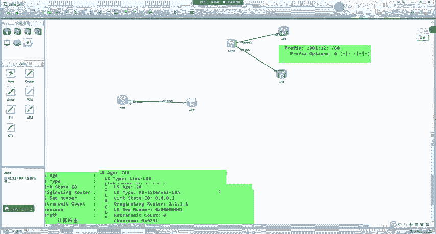

这是A21。这是AR。比较慢啊，咱们再等一会儿。来了。😊，是吧。

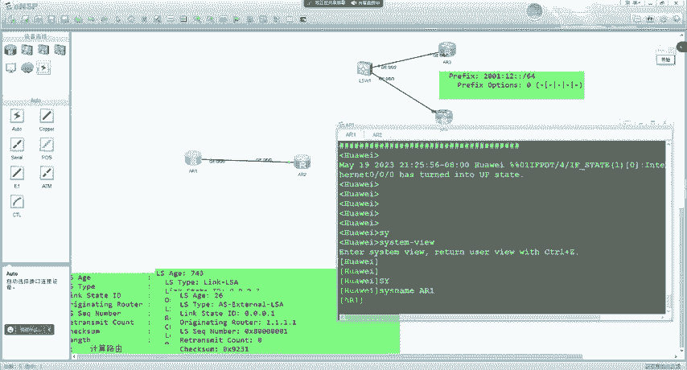

这是 nameAR1。然后这边呢是我们的AR呃，我们在做之前呢，先在0-0-0接口先抓个包啊。

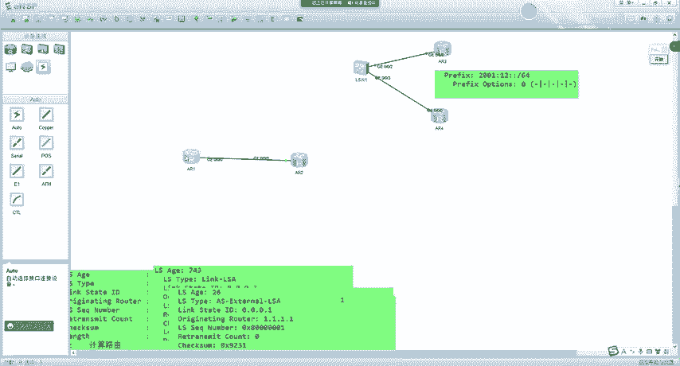

嗯嗯，然后在IP enable。啊，IP6啊。IPU6。interfaceG0-0-0IPV6IP6。Arise。马好一啊马嘛伊。然后是IP6dressice FE80冒号冒号1linkloc。好吧。

然后二这边呢IPV6。interfaceG0-0-0IP6内IP6address2001冒号12冒号码号2。然后IPV6。arise FE80马ha马哈2link。

然后我们在二省interface low百0IP6 enable IP6dress2001冒号2冒号冒号2128。好吧，然后我们在AR一上啊起1个SS进程对吧？一样的配置。😊，然后n。49。

0000点0000点0001。00。对吧，然后伊莱。伊斯 live。来玩。对不对？2020128啊，娄百林。好吧。大家注意啊，我现在配了一个net特地址，修改了一个级别。对不对？诶。对啊。有一条命令。

就是我们IS呢默认它是不传递IPU6路由的啊，我们得把敲一条IP6 enable。把IP6功能给他打开。好吧，然后在AR上SS。n49。0000点0000。0002。00。对我们修改个GB2啊。

GB1的GB2的原理都是一样的啊，就我们修改个GB2呢。😊，嗯，是为了好看一点。是吧待会抓包也好分享。嗯，然后IPV6 enableable对吧？把IP6功能给它打开。然后在A21的G0-0-0接口呢。

SSIPV6 enableable注意啊，你之前是SS enableable，那是针对于IPV4的。现在就是SSIP6内部。啊，那一旦开启之后呢，我们来看一下A21。😊。

A21在这里呢就发送了IS的hello。

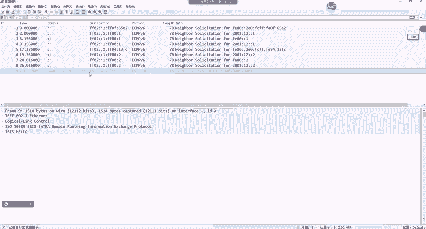

对不对？是什么ID0001吗？然后我们在二上也去看一下ISS interfacefaceG0-0-0ISIP6内部。呃，一旦开启之后呢，我们发现啊两个人很快就建立起来邻居了，1212嘛，对吧？然后呢。

他们去发送了1个RSP。😊。

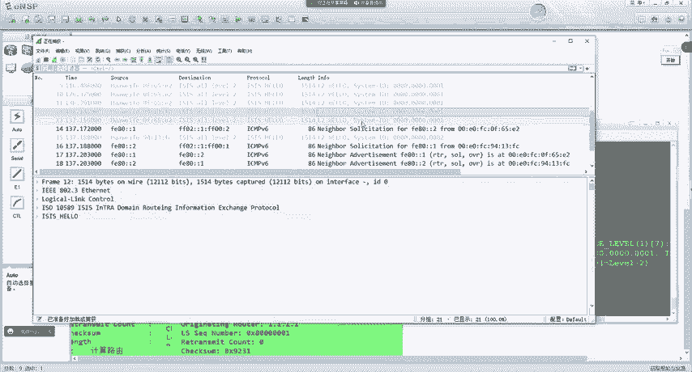

对吧我们来看一下这个RSP中。哎。对呀，找一下TLV236IPV6reachable。对不对啊？就IPU6的路由信息嘛。😡，下面有没有1个IP66维前缀啊，阿当的比特位。对吧啊，内部还是外部的是吧。

有没有子TRV是吧？前缀长度是多少？地址前缀是多少？字TRV有没有是吧？在这里如果是质一的话，下面就会有对现在是至0的代表没有子TRV。😊，对不对？那这时候就携带了这个IP瑞前缀。😡，那我们来想一下。

在SS的视角中就是这样的啊。首先我有托扑书，我托普书在这里呢。😡，是吧你之前传的这无非就是IPU40缀嘛，我们能计算出来。现在你就是传的IPU6前坠了。😡，能不能明白？所以说SS支持IP6很简单。

就是增加个T2V携带路由就行了。😡。

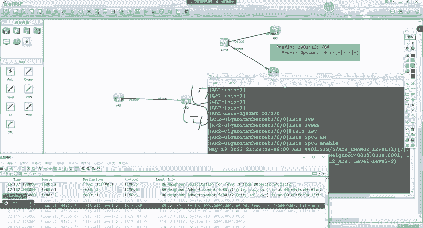

那那些接口对吧，怎么样进行携带的呢？我们来看IP6interface打开。😊，有没有1个IP6地址啊？有吧，而在哈lo包中建立邻居的时候，他携带的是链路本地地址。对不对啊？F180马哈毛一。能不能明白？

那这时候路由就来了，那A2E能不能计算出来dispplay IPPU6如ingtable。😡，20哎。啊，interface low back0。我是不是没通告啊？ISIPU6对吧？

然后到A21上来看一下。这路由是不是就来了？😊，对吧所以说SS支持IPU6很简单啊，就2个TRV携带一下路由就完事了。😊，啊，你不要OSPF那样，还开发个OSPFV3。

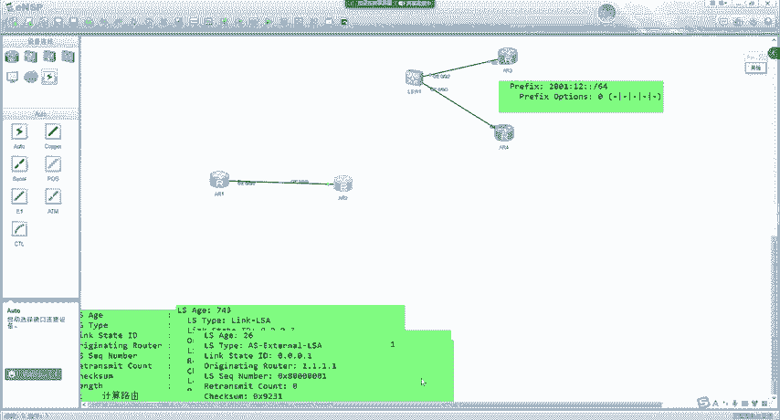

对不对？那除了这个TRV232跟236呢，我们还有一个叫做129。129用来标识自己有没有IPV6的处理能力。是。就是表示对协议的支持。那这个是在哪里呢？我们之前在IPV4中，对呀，他是在这里的。😡。

129hello包中啊，有没有一个上层协议支持啊？有吧，之前的这里是IPV4，现在就是IPV6。😊，是吧。那我们是通过TRV129来进行表示的啊，表示自己支持的协议。如果这个值呢等于204。

那就代表是IPU4。如果等于142呢，就代表是IPU6。他是这么一个逻辑。对吧就两边呢一看哦，你支持IPU6路由处理，我也支持IPU6路由处理。对不对？那咱俩呢就可以建立IS的IPU6邻居。

IPU60居怎么看呢？我第次playISSP2。😊，你能看出来是V4还是V6吗？😡。

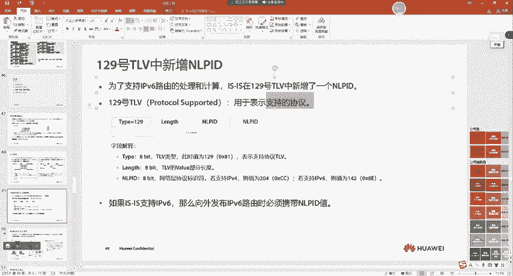

戴权能不拿？看不出来。是吧就老师我学的IPV4，他也长这个样子啊。😡，啊，那怎么看呢？注意啊，SS你看是IPU4还是IPU6，你要加为。😊，我能不能看到在这里有一个临街协议类型是IPU6。可以吧。好吧。

实际上是很简单的啊。那在这里呢。我们要关注的是不是这些呢？实际上不是啊I，我们学ISS支持IP6的时候是吧？很简单啊，就2个TRV就完事了。😡。

啊，但是呢我们要去关注一些其他的内容。什么样的内容呢？叫做I塞色都top。

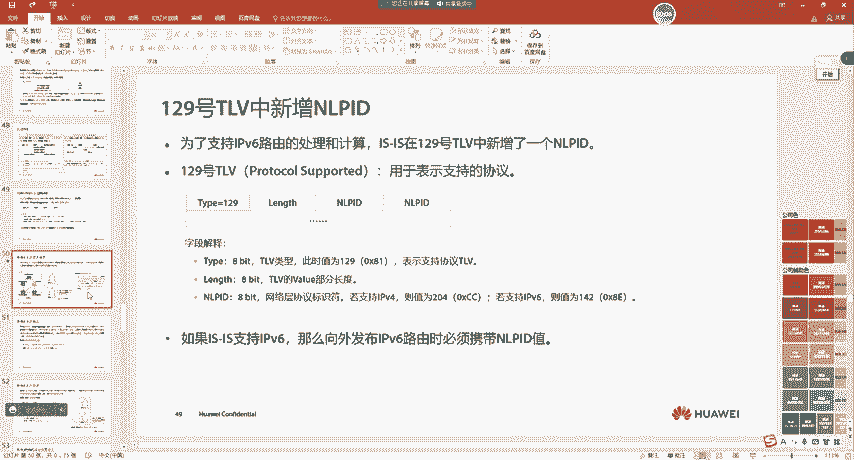

多特普是干嘛的呢？我们来看一下啊。😊，呃，是这样的，就是在传统的ISS里面啊，嗯它这么一个逻辑。呃，就是我们以后要换到IPU6啊，肯定会有一些不支持IPU6转发的路由器。对吧而传统的ISS中呢。

我们说了啊，用的是集成的ISS。😡，IPV4和IP6的拓扑呢被看成一个集成的托。什么意思呢？我给大家举个例子，大家要看注意啊。😡。

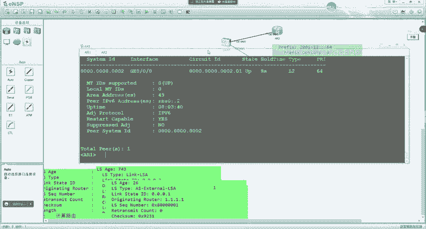

现在AR1计算出来AR2的路由。co的是10，然后你看我的操作啊，interfaceG0-0-0有1个ISco的，还有一个IS。😡，IPV6cos的。如果我想去修改计算IPV6路由的这个度量值。

我应该敲哪一个？我是不是应该敲第二个？😡，啊，我敲成20。😡，然后我们去看录由表。哦，还是。是吧哎，老师是不是没反应过来呢？我再刷一下。😡，开是。是吧哎，怎么回事呢？比如说老师我现在去。😊。

S3是cos的。我敲成30。diplayIPV6入庭table。

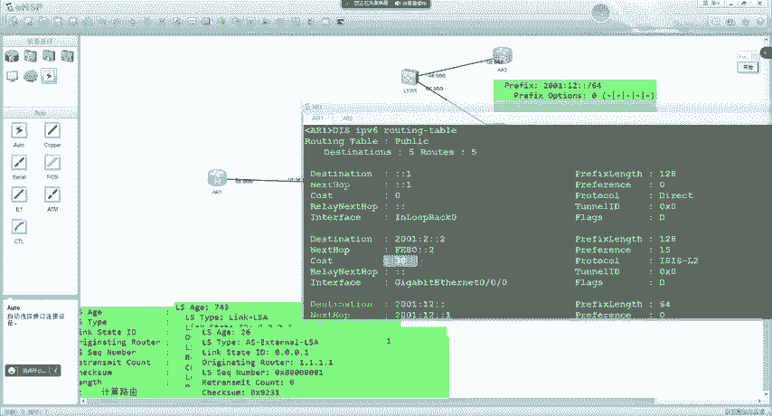

变成了30。是吧。哎，有同学一看到这个呃，马上开始下定义选一选。😡，对不对？玄艺已经学到了玄学了是吧？奇怪了。😡，对不对？😡，马上就要上次升到哲学了。😊，对吧那这是为什么呢？

接下来我们要给大家讲的一个就是ISS的多。😡，就是在SS中呢，我们学的都集成的ISS它默认是把V4跟V6看成一个集成的拓扑。😡，对吧也就是说这两个协议用的top数是同一张。😡，大家能不能明白？😡。

能明白吧？他用的是一个集成的拓普，你V4跟V6就是不同的叶子的区别，就是这么一种。😡，所以你俩都走了同一个托扑数。😡，是吧哎，那这时候。😡。

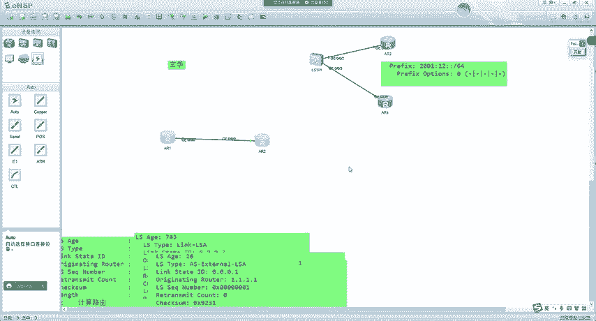

我们真正在实际部署的时候，就有可能会遇到问题。什么样的问题呢？比如说现在在我的网络中。😡，对吧我们有一个。路由器它不支持ISS啊，不是啊，不支持IPU6。😡，那现在就有可能会是这样的。注意啊。

假如说所有的链路扣s都是。那这时候R一他计算出来R3的扣s的啊，不对啊。😡，R一他到达R5，假如说所有两数扣走的都是啊。所以以A21作为跟形成的最短路径数，肯定长这个样子，就1到2到41到3到5。

对不对？那我们的R一如果访问R6的1个IPV6地址，他走谁啊？大家觉得走谁，按照最短路径数，他走谁？😡，谁敢走谁呗。对吧就在混合的托普书中呢，有一个路由器3，它不支持IPU6。😡，是吧。

但是支持双站的路由器，又没有办法感知到这个路由器不支持。😡，所以说把IPU6报文发给三了哦。😡，三叫IPV4路由器对吧，导致IPV6报纹呢。因无法转发而被丢弃。对吧因为这种集成的托补呢？😡，嗯。

语I设备它功能上不支持。啊，但你拓扑又走山，三又不能给你干活。对不对？哎，那这种问题怎么样去解决呢？所以就衍生出了ISS。😊，早期是一种集成的啊，默认的也是集成的。那多拓普是什么样的呢？他是这样的。😡。

多拓普特性呢指I34在1个AS内运行多个独立的IP拓普，就是V41张拓普，V61张拓普。对吧例如IPV4和IPU6两个拓扑是吧，而不将他们视为单一的拓扑。那现在我们就是单一的托普啊。

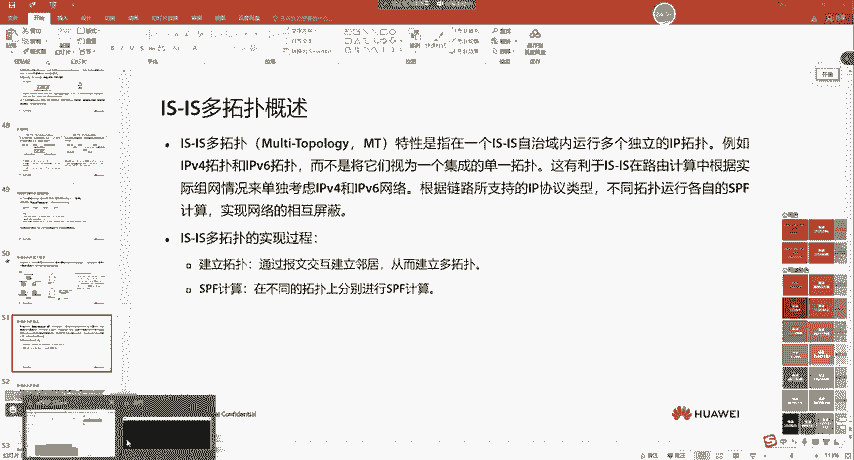

大家要注意。现在在A21上displayISSLSDBloc，我们去看啊。是什么托谱？集成的拓扑。对吧他的邻居是不是只有一个集成拓的邻居啊？😡，是不是？这是接口的IPU6地址啊。

这是接口的IPU6前缀呀。😡，对不对？哎，他有没有单独的IPU6托补啊，没有。😡，是吧那这里可能大家看不明白，看不明白呢，我把IPV4给你做上。😡，你就一下子看着。是吧啊叫一目了然。

IPOdress10。0。12。2。IS enable然后在一这边的G0-0杠0。I s enable。diisplay I S local boss。ISLSDB。我们来看啊。😊。

IP4跟IPU6都有是吧，序号。IPV4地址IPU6地址IPV6路由IPV4路由。但是对于邻居，这是什么邻居？有没有V41个邻居，V61个邻居没有是吧，大家用的都是同一张脱捕数。😡，对不对？

V4跟V6的区别就是在路由上有区别。😡，能不能明白，都是一个脱普书，那你咋走，我就咋走呗。😡。

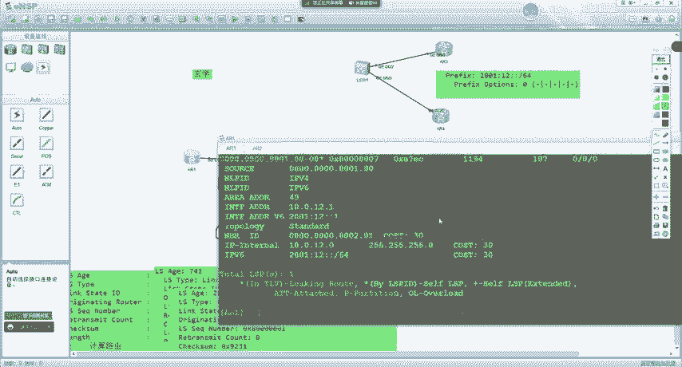

是吧，但是你咋走，我就咋走，那就遇到了一个问题，对吧？啊，就跟你一样。😡，是吧。哎，这是V4，这是V6。啊，两个人。一个人家境比较好，对吧？嗯，是富二代啊，一个人呢家境不太好是吧啊，普通老百姓。😊。

他干啥你干啥，你俩用的同一张托普书啊，对吧，就跟未来的规划一样是吧，到这IP6上。😡，IPV4组没问题。对不对？下一台路由器呢，他爸给他打点好了是吧，下一台路由器支持IP4，你走吧。😊，对不对？

你老爸已经把后路给你铺好了。对不对？所以说你能最终访问到目的地。那这个人不一样啊，这个人家境普通，他跟富二代做一样的选择。😡，对不对？那你到了下那你老老爸没给你打点好吧，下个路由器呢，他只支持IPV4。

😡，所以说IPU6这么走行不行？😡，肯定不行。是不是为什么不行呢？因为这台设备它不支持IPU6啊，你这么走走不到目的地，那个设备直接给你丢了。😡，对不对？所以说我们希望两个不同的这个IP呢是独立的。

就是大家有自己独立的托布书。对吧每个人有自己的道路，你四呢，你可以这样去走，对吧？唯6虽然嗯下一个设备不支持呢，但是他按照自己的途径呢，最终也能到达目的地，对吧？这就是条条大路通我马。

但是每个人的路径是不一样的。😊，是吧。那这时候怎么办呢？我们就去开启ISS的杜拓普，让他V4跟V6都有一个拓普，对吧？各维护一个，而不再是继承的。😡，对不对？那这样的话，我们就可以根据实际的组网情况。

对吧？考虑IPU4跟IPU的网络，就是大家呢都会运行一个独立的top扑数。V4有一张V6有一张，那你中间那台路由器不支持V6就不走你们是吧？不断的拓扑各自运行SPF计算，实现网络的互相屏蔽。😡。

那多拓普的实验逻辑很简单啊，就是建立多拓普通过豹文建立邻居是吧？通过豹文交互，建立邻居关系，从而建立起多拓普。😡。

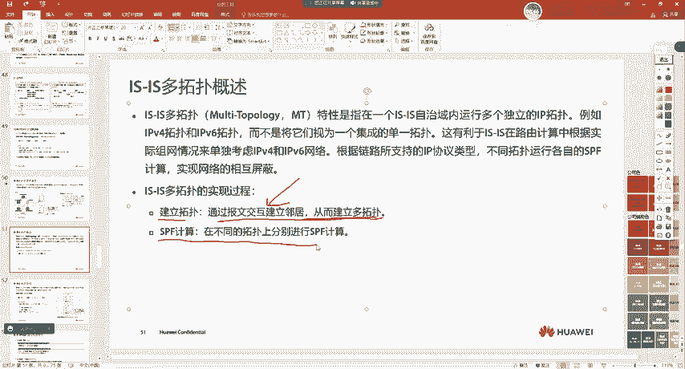

然后在SPF计算的时候呢，分别执行SPF计算。是吧。这时候我们来看一下啊。😡，他是这样的。比如说这时候我在AR1和AR2上注意。😡，I3S。IPU6 enableable拓扑模式注意啊。

你看我们之前敲了1个IPU6 enable，它拓扑模式默认就是集成的拓扑是吧标准拓扑。😡，IPU6 enable top描是我们调成IPU6。然后二这边呢。ISS。

就IP6 enable的拓扑模式调成IP6。调完之后，我们到一上di IS local boss。IDB local boss。我要去查看的时候，注意。有一个拓普。有没有另一个托谱啊？有没有是吧。

V4跟V6的邻居分别来进行描述。😡，所以说V4的扣除的是30，V6的扣s的是20。对吧多拓普类型IPU6。那有没有可能还有其他的大觉有没有？😡，有没有？是吧老是有IP6。是吧有肯定有。

对你看我们之前学的那种啊，不是之样学的啊，之前大家听的那种CLNP啊，对吧？跟PV41起跑的话也行。但是华为设备跑不了CLMP啊，老的4科设备能跑。😊，对呀。那这时候我们来看啊。

那他是怎么样进行实现的呢？😡，所以我们在开启多拓捕之后啊。SS通过TIV229。去分别描述这些top数，怎么描述呢？欧比特超载威对吧？就是欧load有一个单独的比特。😡。

A比特。ATT比头也单独的描述对吧？以及有1个MTID就是你属于什么样的托。😡，那这时候我们看一下包，你就能看明白了。找RSP啊。应该是这一个。呃，我们来找一下多拓普，注意啊，看这里。

多拓普IPU6可达性信息有没有通过一个叫做23区去携带IPU6的拓普啊？有没有就单独写的IPU6的那IPO4呢，通过另外1个TRV。132是不是携带IPV4的？对不对？IPV6的接口。

23IPV4的接口呢。哎IP4的接口呢？IPS的接口132。对不对？那。多拓普标识有没有IPV41个IPV61个。这个能看明白吗？明白的同学敲一啊。没问题吧。好吧。也就是说，V4跟V6呢分别来进行描述。

😡，对吧那这时候我们就可以去实现把IP4跟IPU6各自计算自己的独立头。那这时候我们再回到刚刚的实验啊，老师我在ARE上interface。G0-0-0。呃，老师我SS。IPV6cos的我改成11。

IPV6如庭table。有没有变成11？有吧。是吧直接就变成11了。

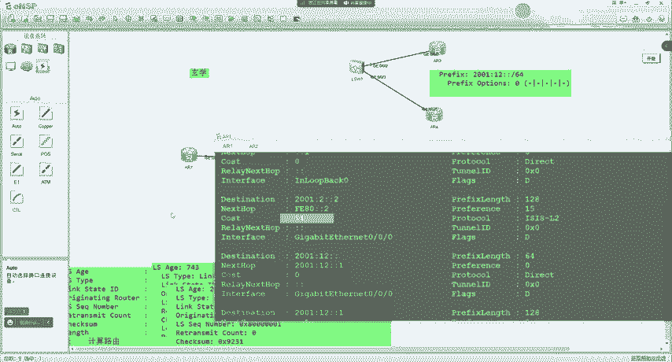

所以说啊刚刚为什么没有生效，大家理解了吗？啊，为什么没有成效呢？是因为刚刚。我们用的是什么头部啊？叫做集成的托普啊，你只能改V4的，V6跟他的是一样的。是吧但这里我给大家说一下啊。😡，呃，课件里的描述。

是有错误的啊。😡，他哪里有错误呢？😡，注意啊。R一他的IPU6访问R5的IPU6地址。虽然这是最短路径。😡，但是他计算不出路由啊。😡，如果你没开多拓普，他吓一跳，没有IP6地址。

他是没有办法计算出路由的。😡，所以这个路由要是没有，而不是说有路由发给。😡，R323给丢了。说什么？按照课件的逻辑，就是给你说，他会把IP6报文发给R3，对吧？但是R3给他丢了，实际上不会啊。

大家如果做实验，你会发现R1。😡，注意。他没有路由。能懂吗？好吧。他是你连路由都计算不出来，他不是说计算出路由。😡，下一跳给R3，你下一跳也计算不出来，对吧？他是这么一个逻辑啊。😡。

但是呢当你没有开启多脱捕，即使他没有吓一跳，他也不选备用路径。😡，啊。这就跟那个。😡，那个那个那个那个大东洞嘛，就不撞南墙不回头是吧？😡，是吧他就只这么走。😡，他没有吓一跳，他都不加表，他也不选备用的。

😡，啊，比较固执。能明白这意思吧？当你开启了多拓普呢，IPU6就走这边了。IPU4在走这边是这样的啊。😊，所以说在这里呢应该是导致R一呢没有办法计算出吓一跳。好吧，然后呢，陆由无法加表。

没有办法访问这个I5的IPU6地址。但是访问S行不行呢？可以，因为S得吓一跳呢，是有IPU率地址的。他这么一个逻辑啊。😊，呃，没有路由，为啥开多拓普？没。没有路由，为啥开都透普啊？就是因为你没有路由。

😡，你首先得知道啊，小白白同学。😡，没有路由的原因呢，是因为我的最短路径选择了R3，而R3没有IPU6地址，所以说没有路由。😡，对不对？😡，原因在哪里呢？是因我的最短路径选择了R3。😡。

为什么最短路径选择了R3呢？是因为他用了集成的托普数，他认为R3就是最短的对吧？V4跟V6都是最短的。😡，对不对？😡，所以我们真的要解决这种问题呢，就让V4跟V6都有一个独立的。😡，对吧。

你V4可以这么去选，但是V6不能这么去选，因为你吓一跳，没有V6地址。😡，那吧所以说我们开启多拓普呢，R一呢通过IPU6的拓普，它是这么计算出来的，就R3它都不在IPU6拓普里面。😡，是这么一种逻辑啊。

开启多托普就是为了让他路由计算是正常的。😡，能懂这意思吧？好吧，我给你们纠正的是在哪里呢？是因为课件里写的是R一把路由发给R3了。😡，对不对？😡，而R3呢？是吧没有支持IPU6能力。😡，对不对？

所以说阿一把报文发给他们之后，就导致报文被丢弃了。😡，实际上不会发啊，路由都计算不出来，压根就加表不了。😡，就是RE上面呢，他没有。V6的路由就是没有R5上面的路由，是这么一种逻辑啊。😡，呃。

如果这个图是。IPV4没有路由呢那逻辑是一样的啊，全逻辑是一样的。😡，好吧。😡，啊，对，没错，就是课件里这里写错了，实际上就你没有路由，压根就不会发，就是访问。😡，就会失败，而不是说发给R3。

R3再给他丢了。😡，能懂吗？哎。你还是没听懂我的意思啊。😡，你看啊，我这么来给你说。😡，你看课件里怎么写的啊，叫做依然会把报文转发给他们。导致呢IP6报纹无法被转发而丢弃。也就是说，按照这个逻辑。

R一会给R3发吗？IPU6报文会不会给他发，会吧？😡，那R3没有IPU6地址，对吧？他也没有IPU6路由，就是他压根不支持IPU6。😡，所以说R3是不是给你丢了？😡，那也就是说。

在这个行为一会给三三再给他丢了。能懂吗？😡，而实际是什么样呢？是一压根就没有去往这个地址的路由。一都没有办法发给3，三也不会给他丢了。😡，是这么一个逻辑。明白了吗？😡，好吧，对。没错。

就是这么一个意思啊。😡，好，那咱们继续啊，接下来就是配置了。这个配置。😡，也比较简单。好吧。我看一下啊刚刚哪位同学说的这个问题我做个实验啊，我给大家解释一下。😊，哎，又打不开了。对吧就是三支持V6。

不支持V4，是不是也走3？😡，嗯，这里我给大家说一下啊，曾经我跟大家有一样的疑惑。😡，对吧就老师我这样。😡，我让三娜支持V6。对吧。那会不会导致V4没有办法加表呢？是吧他只支持V6，不支持V4。

所以说V6能正常访问V4就反问不了了。😊，呃，曾经我跟大家有一样的疑惑啊，但是通过我的实验发现呢。😊，至少在华为的路由器里是这样，你只要开启了。嗯，SSIPU6啊V4默认就是支持的，就是V4这个功能呢。

你给它删不掉。啊，对，没错，是删不掉的啊。好吧，就V4这个功能，我们没有办法删掉啊，删不掉。对，没错。行吧。😡，所以说啊呃以后啊。啊，所以也不是以后啊，就这个问题大家也不用纠结啊。

就现在的所有网络设备都是有V4的。😡，那懂吗啊，都是有的。😊，好吧。行，我们继续来看啊。那接下来呢就是一些基础的配置了。那这个配置呢跟我们在学OSPF配置的时候，逻辑基本是类似的。

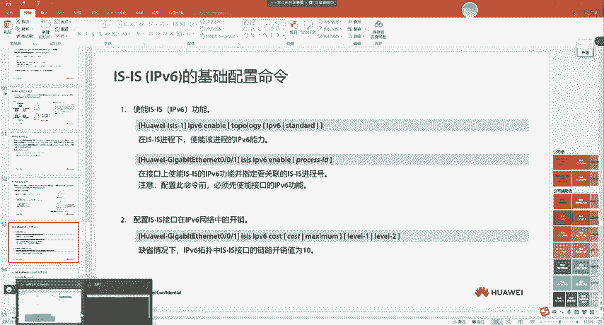

好吧。就是我们在IS的IPU6中。之前IPV4，你在接口下啊可能修改很多参数是吧，什么认证啊。

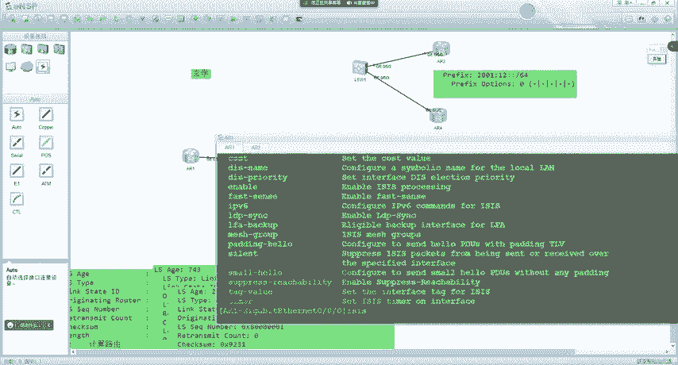

嗯，cos的对吧DS优先级啊，IPU6是一样的逻辑。😮，当然面临比较少啊，这个是模拟器支持的原因啊。😡，靠车能改。对吧。功能开启。嗯，管理tger。其他就没了，但然这个是模拟器的区别。😡。

你看DS优先级这里敲不了。是吧啊，但是你。换其他的设备应该就行了啊。

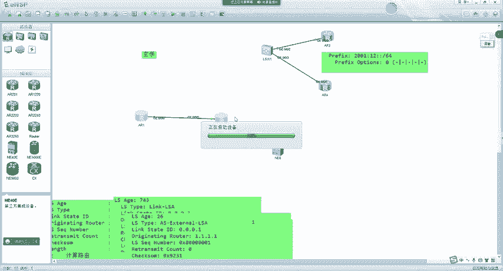

我给大家看看。我应该有恩E的啊，我找找。interface。Enet1-0-0。那SSIPV6。对吧你换了设备之后啊，他提供的功能就多一点。大家能明白这个意思吗？😡。

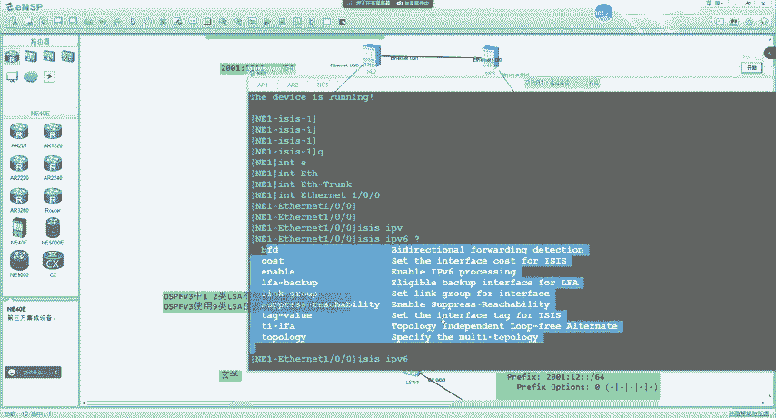

明白同学敲一啊，不是说V6。😡。

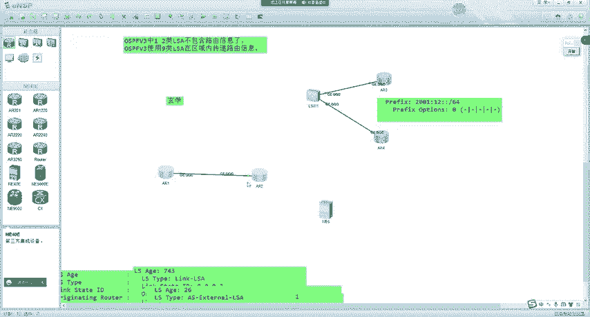

有功能V4有V6没有，不是这个逻辑啊，V6你也能改DS优先级，只不过模拟器里面啊面令支持的不全，是这样的啊。😡，那我们传统所学的一些呢，比如说奈特地址啊。😡，对吧LP触罚更新哦，他针对于V6。

大家觉得有没有效？😡，有没有？想一下。是有效的，注意啊，为什么有效呢？因为你是针对于RSP去配置的。而无论你是V4和V6，它们都归属于RSP的业子信息。😡，能不能明白？

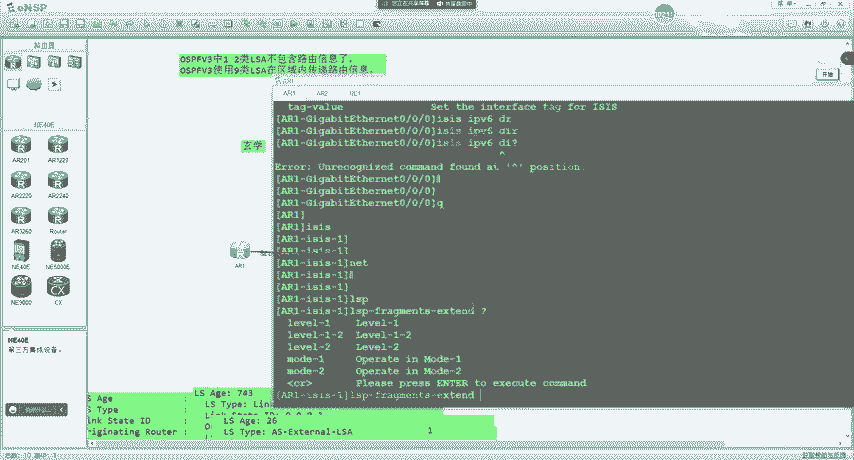

明白同学敲一啊。所以说IPV4中，你基本支持的配置呢在IPV6中都有。😡，好吧。

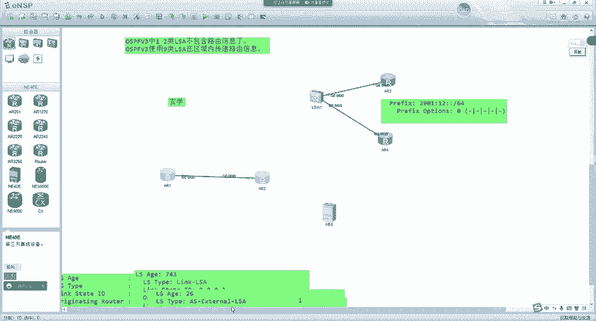

嗯，然后这些配置呢，大家可以去看一下，开启披露功能对吧？去调整它的拓普模式。😊，把SSIPU6功能给他开启。然后去配置ISIPU6个cos的。嗯，下面就没啥了。查看开启IP6SS的接口。

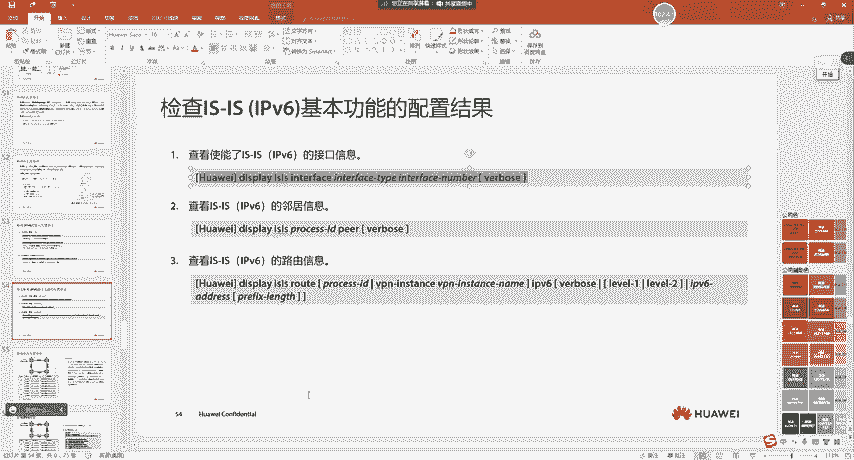

是吧这我们也可以去看啊。😊，在AR1上。diisplay IS interface。V8。嗯。这里我们可以去看到IP linkloc跟gbal地址。是吧。ISSIPU6的cos的级别一呢是11呃。

级别2也是11。啊，IPV4的cos的G别130G别2也是30。嗯。对吧多靠谱。啊，这是什么麦克地址没关注过啊，这个我我没关注过啊，不用管他好吧，IPV4地址。😡，对吧还有时间。这都是统一的啊。😡。

对吧要第次的hello时间啊。😊，还是超时时间。没啥东西啊，就我们能看到的最主要的就是IPV4跟IPU6cos的区别。😡，对吧以及他们不同的地址。嗯。

也可以去看呢displayISSP这个刚刚带大家看过了加V boss。ISSPRVbo哎。第四类。I3。PRVbos。我们去看取，可以看到V4跟V6呢在这个链路上同时被启用了。对吧，然后第4位I3。

Router。IPU6。啊，这是IPV4IPU6是吧，也可以去看IPV6的录音表。啊，有1个2001冒号1马哈马哈。是吧还有一个自身直连的。对的。D代表什么意思啊？智联。L呢？L代表通告到RSP里了。

啊，因为自己直联的，你通告到LCP了嘛。😡，AA代表。代表什么啊URT。😡，这得查手册啊，我给大家查一下。😊，查一下啊。😡。

嗯。但这个面量应该用不到啊，我是没用到过。你用脑的时候查一下啊。

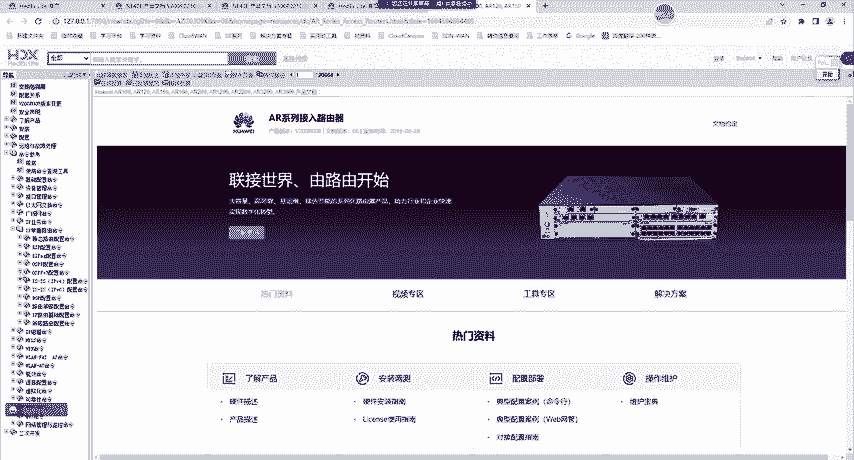

正好讲到了，给大家说一下，好吧。😊，dis类ISS routeuter。IS。

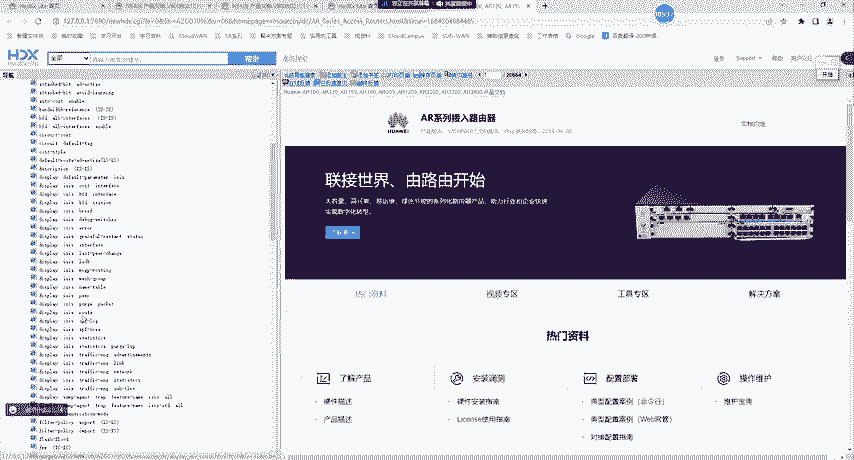

Ro坦。对。呃，然后在里面会有一个A的标记。A代表什么意思呢？我们来找一下啊，代表已经被加入到了录音表中。😊，可以吧，所以这个路由有没有被加入到路由表啊，有吧？😊，好吧，那这直连因为我们直连加表。

所以说这个路由这下面这一条就没有加入到路由表啊。下面因为直连优先级更高。😡，能不能明白？那大家以后也可以像我这样啊，嗯，这是再给大家透露学习方式是吧？啊，这是老师的一个目的啊。😊。

所以说有时候我在看技术的时候呢。😡，是一下子看不懂，我就去看一下这个表是吧，搜到哪条面令呢，下面都会有输出的介绍。

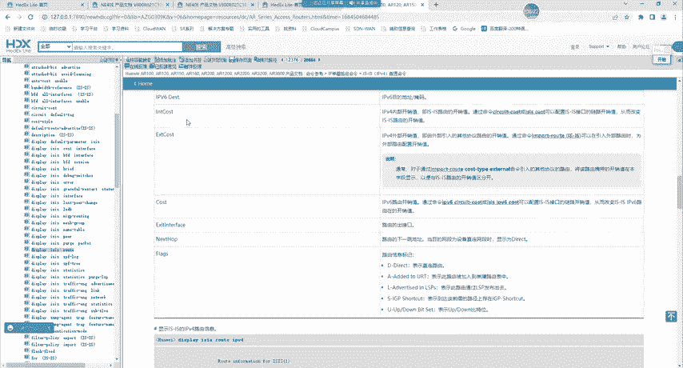

好吧，我们可以去看一下啊。😊，嗯，行，那我们这节课呢就讲这么多啊，这个实验大家课一下可以去做一下，好吧。😊，然后我们下节课再去讲一下BDP嗯，如何去支持IPU6。咱们这节课就讲这么多，好吧。

大家准备下课吧啊。😊，嗯。🤢。

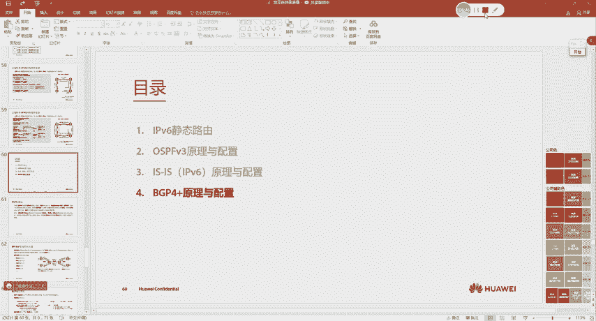