# 2023 新版华为认证HCIA+HCIP+HCIE全套视频讲解！一套视频让你从入门到精通！CCNA／CCNP／CCIE技术提升同样适用！ - P113：（持续更新）HCIE Datacom - 59.BGP4+，MPLS - -Book思议8 - BV1W8411A7z8

好了，同学们，我们上课了啊。😊，啊，不要刷屏啊，六位同学。好嘛。😊，好。呃，大家声音没问题吧。没题同学敲一啊，都可以吗？可以是吧。好，那我们上课吧啊。嗯，我们这节课把这个BGP4加讲完啊。😊，呃，就是。

BGP用于支持IPU6的一个版本。我们把它叫做BGP4加啊。我们把这个讲完之后呢，再去讲MPS好吧，当然这个内容比较简单啊，和我们学ISS基本差不多。呃就BGP呢对IPU6的支持也是很简单的啊。呃。

那我们一个一个来看一下吧，好吧，简单来瞅一下啊。😊，呃，这个传统对吧？就我们之前所学到的这个BGP呢，就大家之前所接触到的这个BGP概念中啊呃所有的BGP版本呢，我们接触到的都是BGP4，好吧。

都是BGP的版本4啊。呃，那BP早期呢，它只支持IPV4的单波。注意啊，它只是为IPV4去传递单波路由的。啊，但是BGP这个协议呢，随着这个应用范围越来越广泛，对吧？

以及它自己的特征呢嗯是非常好的那比如说呢它支持各种路径属性对吧？呃，便于我们去实现各种灵活的控制和管理。呃，那么以及呢BGP这个版本呢呃不是啊BGP这个协议呢嗯它的扩展性也是非常高的。

所以说我们现在见到了很多的BDP啊。😊，嗯，都是基于传统的BDP4啊来进行扩展的。那当我们去传递IPV6路由的时候，注瑶。把BP扩展之后呢，用于支持IPV6单波路由的传递。那这个版本呢。

我们就把它叫做BGP4加。那么我们有时候也把它叫做MPBDP注意啊，叫做多协议BDP什么意思呢？就传统的BDP呢，它只能支持IP4单波路由协议是吧？但你想支持IPV6单波路由协议呢。

那这种呢我们也可以把它叫做MPBP对要。也可以叫做MPBP。所以说BDP去传递IP6路由的时候呢呃有两种叫法。嗯，一种叫法的话，我们把它叫做BP4加呃，还有一种法叫法呢叫做MPBP。

但是这个MPBP它有很多，也就是说它并不是只只有IPV6啊，它有很多。嗯，这里呃给大家说一下啊。录音。就是传统我们接触到的像这种IP单波的BDP啊。单波的BP，我们平常呢就直接叫BGP。好吧。嗯。

像这种IPV6单波啊。对吧呃，IPV6主播啊IPV4。主播啊。啊呃包括有很多啊呃，还有这个。VPNV4啊啊VPNV6。啊，当然除了这些还有很多啊，像EVPN啊对吧，大家未来学到SR呢。

还会有什么BGPL啊，呃，还有什么BGP的policy递着出对，就用于下发SR policy的。😊，嗯，也就是说呢，BGP这个版本它是有很多的啊，这里大家注意。那现在我们用到的呢都是BDP4。

那基于这个BTP4呢做出了很多扩展。那传统的IPU4单薄，我们就直接叫BGP了。下面这所有的啊啊我们都会有一种叫法。但这些呢大家可能关注的不是特别多啊，以后用到的不是特别多。😊，那主要是在这一块。

那以后这里所有的BP呢，他们都有一个统称的叫法，嗯，叫做MPBP注要，他们都是MPBDP。就是都属于MPBDP的一种啊，叫做多协议的BGP对吧？BGP去支持IPU6协议啊，IPU6单播IPU6主博。

IPU4主博VPOV4。那这种呢我们都把它叫做MPBP啊，只不过对于这个IPV6呢，我们有一种单独的叫法对吧，它属于MPBP。但是我们对它呢还有一种叫法啊，叫什么呢？叫做。😊，呃。BGP4加好吧。

但是它也属于MPBGP是这么一种关系啊，这就相当于什么呢？😊，嗯，相当于你的女朋友是吧啊，你叫他叫小宝，对不对啊，有你一种自己的叫法。😊，对不对？那IPV6单波呢，我们就有了这么一个亲昵的称呼啊。

叫做BGP4家。但是它属于MPBGP的一种。好吧。呃，没有BGP6啊，BGP6听着就有点像BGP的第六个版本了。对我们现在用到的都是BGP第四个版本啊。所以就没这样去叫。嗯，那我们来看一下啊。

我们呢通过MPBDP去实现对IPU6主播啊，对吧？VPN相关内容的支持。但是BDP本身的报纹机制呢，还有路由机制没有发生改变。那这里可大家可以理解成什么呢？我们的BDP之前是什么？呃传递路由，对不对？

那当我们换成了IPU6之后呢，我们就去传递IPU6路由。😊，好吧，所以说MPBDP呢对IPU6的网络支持性呢，我们有时候也叫做对吧BDP4加啊，就是单独呢给他列了一个亲昵的称呼。😊，好吧。

那我们来看一下啊嗯BDP所支持的地理粗嗯，有哪些？那这个呢很多啊很多，现在我们见到的基本。😊，呃，所有的这个啊比较牛逼的协议啊大家以后都会用到BDP。现在有很多啊，你像我举个例子啊。😊，呃。

像这个这个IPU单波对吧？我们学过啊，这里就不再多说了。😊，像IPV4主播啊啊做这个御兼主播的时候啊，需要用到BDP。IP6单薄对吧？这以后肯定用到的会更多。唯平唯4。就是我们在两个丝网呢。嗯。

这是IPV4，这也是IPV4，然后中间也是IPV4啊这种我们叫就叫VPV4，就是通过BDP呢去构建的这个三层这个这个这个自有网络。我们把它叫做VPV4。那还有VPV6。😊，好吧。那还有其他的有很多呃。

以后呢，大家还会去接触到。嗯，像大家学这个。呃，微插烂的时候是吧？会去学到一种叫做EVPN协议啊，或者说呢你学这个EVPNOMP4的时候。嗯，也会协触的。还有一种EVPN呢，也是基于BDP做的扩展。嗯。

还有其他的有很多啊，所以说BGP呢现在基本所有对于路由协议的扩展呢都会选择BGP嗯，因为它的这个扩展性很强。那还有一点呢，它相比于IGP来说更加稳定。对吧嗯，而且呢他对路由的这个控制能力也比较强。

并且呢他有丰富的先前经验啊。这个经验是在哪里的呢？比如说我去传递威频V斯的时候啊，我扩展的BGP啊，用着非常的不错啊，非常的舒服。😊，是吧那当我去支持VPV6的时候呢，我们也用BDP啊，为什么呢？

因为已经有经验了。对不对啊，这就相当于你看到别人是吧，做这个方面已经成功了。是吧啊，那这时候呢，你去抄他的作业啊，也能够做的不错，对不对？因为先前有成功的案例了。对吧。那还有像EVPN啊啊EVPN以后。

大家要好好去学啊。嗯以后就是EVPN的天下了。就EVPN可以把上面这些全部都干掉。好吧，什么意思呢？我给大家举个例子啊呃就是我们现在之前学的是IPU是单波的BDP嘛。😊，当你学这个。嗯。

VPV4的时候呢，你还得把VPV4地址数学了嗯，还得把IPU6地址数学了啊，还得把IPU4主播地址数学了。就是你针对于一种功能呢，你要单独去了解一个地址书的功能，或者说它特点。嗯。

以后EVPN呢可以把这些全部都干掉。就是以后的控制平面呢，统一就是一VP。好吧，但这里呢大家还是按照目前的学习进度慢慢的去学啊啊不要一口吃个胖子，对吧？老师我不学了，我直接去学EVP行不行呢？嗯。

不行啊吧，如果你直接去学，那你看不懂。😊，能不能明白？所以说这里呢我们先打基础啊，就相当于你想成为精英啊，那你就得呃先做小弟对吧，想成大哥呢，你先做小弟嗯，小弟做完之后呢，你才能做大哥。😊，好吧。

所以我们来看啊，就BDP支持的地址处有很多的那这些呢我们都把它去叫做MPBDP这张照片大家只需要知道这么多就行了啊，这都废话，不用管它。😊，然后我们来看一下啊呃BDP的一个路径属性啊。

这里呢主要说的就是BDP的一个特点啊，注意。😊，之前呢在我们学习BGP的过程中呢，大家可以去了解到就是BGP呢用于发送，还有删除一条路由的时候呢，用的都是update。对不对？那在这个upate里面呢。

会有不同的啊报文字段啊，什么呢？比如说在这里呢注意。upate里面有一个撤销路由长度，还有被撤销的路由。如果upate中携带了这两个字段，那就是用于删除路由的。对不对？如果携带了1个NLI啊。

叫做网络层考察信息。那他就是用于。传递。可达路由的对吧，一个是删除啊，一个是发布。对不对？那我们的BP呢再去支持IPU6的时候，因为之前的ALI它只能够传递IPU4啊。好吧。

所以说呢我们要想传递IPU6路由呢，嗯又涉及了2个NLI注意啊叫做MP reachable NLI啊，叫做多协议可达性啊，叫做网络层信息。对吧那他是用来发布对吧，可达路由的可达路由啊，以及他的吓一跳。

就是传递路由的。然后MP unreachable NLI呢是用于撤销路由的。啊，所以说这个胶片呢，大家也不用看的要记多少对吧？反正在我脑子里呢，这张照片就告诉我啊。

MPableLI啊用这些传递IPU6路由MPableLI啊用来撤销IP6路由啊，就这么多。好吧，那这两个NLI长什么样子，我们来看一下啊。😊，MP NLI呢嗯当我们去传递IPU6路由的时候。

首先在这里面有1个AFI，还有SAFI对吧？啊，有一个地址触标识，还有一个子地址触标识。那当我们要传递的是IPV6路由，对不对？嗯，AFI呢等于2啊，代表是IPV6，然后SAFI等于一啊。

代表是IPV6单波路由。好吧。那在这里呢，还有这条路的吓一跳。对不对？那在IP6中呢，这就是一个。128比特的IPU6地址。那下面就是一个保留位对吧啊，没啥要管的那最后NLI呢携带的就是路由前缀对吧？

前缀跟雅马。😊，待会我们抓包可以去看一下啊。然后MPNLI呢，就是我们要去撤销路由的时候啊，会有你撤销的是AFI跟SAFI对吧？你撤销到哪个地址族的对吧？然后把撤销的路由携带上啊，就这么多。😊。

是吧然后BDP就剩配置是吧，理论很简单啊。嗯，这时候呢我们通过一个实验对吧，来给大家演示一下啊，让大家有更清晰的这个看法，好吧啊，能够更清晰的去理解一下他。😊，比如说在这里呢，我们写两个路由器啊。

一和2。所有的选录原则没有任何变化啊，路径属性啊也没有任何变化。好吧。因为你们学的BGP那些呢都是通用的对吧？怎么样选路啊，是吧？老师这个什么反射器啊等等之类的，原理都一样的啊。嗯，我们来看一下啊。

就是在协议层面对吧？一直在设备配置上，他做了是。就是怎么样去支持的，好吧。我们在0-0-0抓个包啊。A21呢我们叫这 nameA21。哎，然后这里是AR。G0-0-0啊，当然反车了一样的啊。

原理都是一样的。IP6功能开起来。啊，A21的G0-0-0IP61内。IP6dress2001冒号12冒冒1啊。然后二这边呢IPV6。interfaceG0-000。2001码号12码号码号。好吧。

然后我们在A21上呢，BDP100。Z2上呢BDP100。呃，注意啊，我们要去配一个入台地，来告诉我为什么。比如说我display。BDP。皮儿。没有输出啊，第四playBGP。嗯，现在没有任何信息啊。

还看不了入台D。注意啊，当我们使用纯IPU6的时候。这时候呢我们需要在A21上去配置一个入台梯。嗯，为什么要去配置入台地呢？嗯，因为我们现在没有IPV4地址，他没有办法选择全局入台ID。

所以说我们得手动去配一下，但也是跟OSPFV31样啊，就是1个32位的标识啊，这边呢是2。2。2。2。嗯，配完之后呢，我们在A21上就直接P。我们打问号呢，你会发现之前你可以配置对灯体组对吧？嗯。

IPU4地址也可以去指定IPU6地址。我可以用2001冒号12冒号冒号2。是吧他的A号呢，我们用200。好吧，咱们建个1比1P啊。然后在二上呢。P22001冒号12冒号冒号1AE版。

那当你配置完成之后呢，待会儿他们就会去发送BDP的报文啊，咱们得稍等一会儿。注意啊，我们看IPU6BDP的时候叫做D类BDP之前你直接P2就看IPU4了。我们现在叫做IPV6P。啊，没有。对吧没有。

这是为什么呢？来给大家解释一下啊。😊，周页。比如说大家注意啊，我P尔1。1。1我P尔1个2。2P尔1个IPU4地址。AS200。然后我diplay this，我们来看一下它的配置啊，它的配置是这样的。

当我们去P了1个IPV4地址之后，他有没有在IPV4地址处下自动给你激活？有没有？有吧，他在IPV4地址之下就自动启用了。注意啊，呃，这是BGP的一个特点。嗯，这个特点是为什么呢？

因为我们现在大多用的BGP啊还是IPV4的。😊，所以说呢IPV4它就默认是激活的。但是IPU6呢，你得手动去敲一下啊，就这么一个原因，就是V4的用的多，所以说默认激活给你内置到里面了。好吧。

所以说IPU6中呢，我们得你的IPV4family unitic对吧？IPO4单波地址处，那我们得进入到IPV6family啊unic。😊，呃，P22001冒号12冒哈冒哈啊。加个音。好吧啊。

四科也是自己激活的啊，所以说我们得手动去给他激活一下。😊，看到了吗？那在AR2上也是一样啊，BDP200。啊啊。AR2上应该用BDP200啊。AR上我BDP200。P2呢2001冒号12冒号冒号1AS。

100对吧？你看他说你没有配出台低，我们配一下啊。因为我现在没有IPV4地址，他没办法自己选啊，那咱们得配一下。指定完邻居之后呢，我们进入到VPN。啊，不对啊。

就IPU6family2001冒号12冒号冒号一给他激活。应内。对我把ARE的也给他激活。那激活之后呢，我们就可以看到三次握手是吧，握完了，对不对？握完之后呢，一给二发了一个open。😊，对吧啊。

就告诉你啊，这里呢我要跟你去建立邻居，我是1。1。1。1。对不对？然后我要给你建什么邻居呢？要给你建立的多协议扩展协商能力。在这里面呢。是IPV6单波邻居。对不对？

就两个人会互相发open报文来进行协商。然后二给一发的呢，也有我要跟你也建呢IP6单波邻居。对不对？那两个人呢情投意合是吧，你要跟我见，我也该要跟你见。那么在这时候呢，两个人的地址处啊就协商完成了。啊。

这两个notification不用管它啊，应该是我们建立顺序的原因。那一旦协商完成之后呢。两方就互相发送了K live。对吧邻居一旦建定完成，发送Q live保活。所以在这时候呢。

我们可以看到AR一上邻居已经阿普了，对吧？到达了establish状态啊，二上呢也是一样。所以我们可以在一上呢叫做D四BDP注意。叫IPV6P，就是加个IPV6。是吧。然后我们就可以去看到呢，我是1。

1。1。1，我在哪个AS对对？我跟二呢。是吧建立了邻居，建立了当前是版本4，注意啊，这里不会去什么显示什么4家之类的啊，不会。现在用到的都是BGP版本4啊，就是这个大版本。好吧，对面在AS200啊。

我从对面接收了三个包，我给他发了6个包。对吧呃，还有多少个路由啊，在这个排队中啊，现在没有。然后邻居建立多久当前的状态是吧，以及我从邻居接收了多少条路由。那这时候BGP的IPU这邻居就讲完了。

什么建立的原则啊等等之类的，一模一样，没有任何区别啊。😊，那两方一旦建理完成之后呢，比如说我们在ARE上interface low back0IP6 enable IPP6 dress200。

一、冒号一冒号冒号一128。对吧，然后我们在BDP里面呢，注意BDP。100。我这些network，他让不让你network啊？😡，让不让？不让吧，注意啊，所有有关IPU6的配置呢。

得到IPU6 unitcast里面去做是吧，我们在network，他是不是让你net work了？😊，哎，那有人就问老师，这是个什么逻辑啊，大家注意我的配置。比如说我network1。1。1。132。

😊，你直接看他的配置，它是在哪里network的。在哪里呀？在IPV4单波地址书对吧，他就直接同步过去了。为什么呢？因为IPV4用的多啊，默认就给你同步过去了。但是IPU6呢。

我们得手动进下去去配啊network2001冒号一，冒号冒号1128。对吧一旦我们network了之后呢，二这边diplay BDPIPV6啊，之前你是di BDP入ingtable。

现在我们就是IPV6roing table。那我们就可以去看到呢，他收到了这条路由。路由的前缀路由的吓一跳是吧，以及前缀长度是吧，什么本地优先级啊，协议首选值啊，MED啊，label不用管啊。

然后以及orange属性，还有A号。

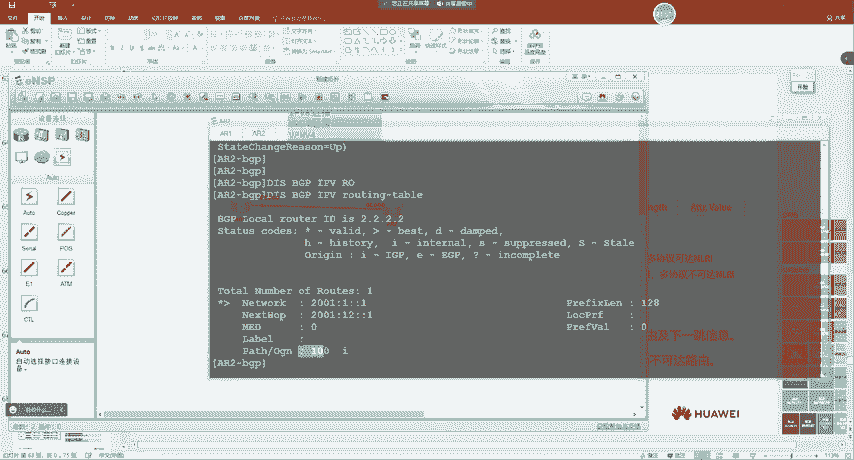

对吧在上面都有显示出来。那么在这时候，我们主要来看的就是。是吧老师，你刚刚说。reachable跟unreachable哎那这两个东西长什么样子呢？我来瞅一眼。在这里呢。

我们发现啊一给二发送了一个upate。发送的这个upate里面呢，我们打开来看一眼。有一个。对啊，前面这是不是都是。属性啊，对吧我这条路由的属性。对不对？

那下面会有一个我们看到啊叫做MP reachable NLI啊，有时候我们也把它叫做呃14号属性嗯，我没记得错了，还是叫14行对吧，14号属性。啊，他主要就是携带呃路由可达信息的。呃。

所以我们可以去看到142属性携带了IPV6单波路由，它的吓一跳是2001冒号12冒哈冒号。那具体是哪条路由呢？我们打开来瞅一眼，有没有啊？对吧。路由前缀跟掩马。那这条路由那就传到二这里了。

那二就能够计算出来。好吧，那其他的都是一样的啊，没有任何区别。就是你在配置的时候有点区别。嗯，你像之前我们学的什么RR是吧，什么root policy呀。😊，嗯，正常去配。

比如说我BGP100IPV6faly。嗯，uniccastP22001冒号12冒号冒号1。反射器呢能不能配也可以，你打问号呢，这前我们在IPU4学的基本都能用。呃，比如说什么通告团体属性啊。

通告扩展团体属性啊嗯嗯打破这个环路啊，就允许重复A接收啊A pass field啊，通告全省。啊，这个没关注我啊。啊什么激活啊fe policy啊对灯题组是吧？嗯，IPU6的前缀列表过滤。对吧。呃。

修改下一条为本地。啊，这个没关注过啊协议首选值。对吧啊这个也没关注过啊，什么反射器啊，对吧？root limit。啊，如 policycy。啊嗯是不是都有啊？好吧，所以说配置是非常简单的啊。

就是在我们的。嗯，IPV6呃，BG啊就是BGP支持IPV6里面呢，就新增了两个属性就完事了，跟ISS有点类似。对吧呃，就是给你弄了两个。这个NLI啊给你传路由就行了。对吧BGP也是一样的啊。

但是BGP没有拓普信息啊，这里大家注意，所以说我们不涉及到什么单拓补多拓补。因为SS呢本身是作为链路状态协议啊啊，他要去计算出来拓扑啊，BGP呢，我们是距离矢量协议，对不对？所以说它只传路由就可以了。

就是2个NLI啊能够传递路由啊就完事了。然后其他的所有原理呢都是一样的啊，大家之前你学过什么BDP放到IPU6里都是一模一样的啊，什么选录啊S号多少啊是吧啊，一模一样。好吧。

所以这里我就不再重复去说了啊。然后我们把这个配置搂一眼啊啊，就是你首先呢怎么样去配置BDP邻居。😊，对不对？嗯，以及呢去IPU6翻mble了一下呃，激活BGP邻居。然后啊就是啊皮尔叉叉叉，见到地址促下。

然后把它激活。呃，像什么network啊，刚给大家演入演示过了。对不对？然后我们可以dispplay BDPIPU6P2去看邻居信息。啊，这里也给大家演示了。是吧之前你是Dplay BDP。

如果你直接去敲像什么BFD啊，艾瑞啊，对吧？group啊啊那这些都是针对IPV4的那你还可以针对IPV6啊，VPV4啊是吧？嗯，VPV6去敲啊，如果支持EVPN的，这里还会有EVPN的。啊。

那我们就是加个IPU6，直接P2就完事了。好吧。嗯，然后去看路由呢，也是在diplayBDPIPU6入table。其他都是一样的啊，什么属性啊，排序等等一模一样。嗯，然后在这里我们有一个配置举例啊。

我们来看一下。现在是这样的。嗯，就是一跟二这边呢，我们用的都是IPU6啊，这是A65001，这是65002。你注意啊，他们的入otID都是32位的啊整数，对不对？都是点分十进制。并不是IPV4地址啊。

就是一个点份时间制。然后这时候呢，我们为了保证业务的发展，对吧？呃，两个分部分别部署了IPU的网络进行业务测试。所以我们就可以怎么样呢？部署IPS网络。是嗯。巴拉巴拉。给他配完对吧。

这把IPV是打通的啊。是吧这是把传统的IPU4给他打通。所以我们看到这都是IP4地址嘛然后networkIU4路由两个环回口。然后再去敲IPU6啊，那这种我们把它叫什么啊？各位同学还记得吗？

就V4跟V6同时跑叫什么啊？对，没错，叫做双战，对吧？然后现在呢，跟一跟二也是一样。呃，指定邻居，然后去IPU6地址促一下，给他激活一下。指定邻居IPV6地址数下给他激活一下。然后发布IPU6路由。

你看这个配置逻辑一模一样吧，就是把地址换一下。是吧但这个没有办法啊，就是大家以后再去敲啊BDPIPU6的时候呢，肯定会觉得比较头疼。呃，这是一个配置呃呃，看邻居对比。

这是IPV4的区别就是在于地址不一样了，这不都一样吗？么入台地啊这些。这不一模一样吗？是吧就是地址不一样了。然后去查看BDP4的路由呢。嗯，发现有两条对吧？都在监括号跟星啊，都是有效，以及是最优录由。

然后去看他的属性呢。嗯，我们可以去看到啊。呃。这是哪条命令啊？啊，这应该是抓包啊，这是抓的帮。好吧，就是我们通过抓帮呢看upate，刚也给大家看过了啊。😊，就在这里面呢会有1个MPreable NLI。

对不对？然后在这里呢，有一个递着粗。IPU4IPU6单波啊，吓一跳是谁是吧啊，以及路由，还有路由前缀。刚也给大家抓包看过啊。嗯，那这个就是我们学的BDP4加啊，这个很简单没什么难的啊。主要就是配置区别。

嗯，但是这个大家得去试验一下啊，就用多了慢慢就熟了。就跟IPU6地址一样对吧。大家刚开始学的时候呢，可能看着不是特别舒服，但是现在就舒服很多了啊，见多了啊。然后我们来看一下最后有两个思考题啊。呃。

第一个呢，他是说以下哪些选项的LRC属于OSPIV3。嗯。一类肯定有是吧，二类有。嗯，D也有是吧，三没有三是属于OSPFV2的。啊V3里面呢叫做。啊，叫做区域间前缀LC。是吧就名字不一样了。

然后ISS支持IPU4和IPU6分别计算最短路径数。对吧。这个实际上是对的啊，因为我们之前讲到都拓谱呢。呃，一旦配置之后呢。V4跟V6都是单独的。啊，那这里我们就把IP6路由讲完了啊。

就没其他的了。啊。呃，接下来呢我们去讲一下这个。

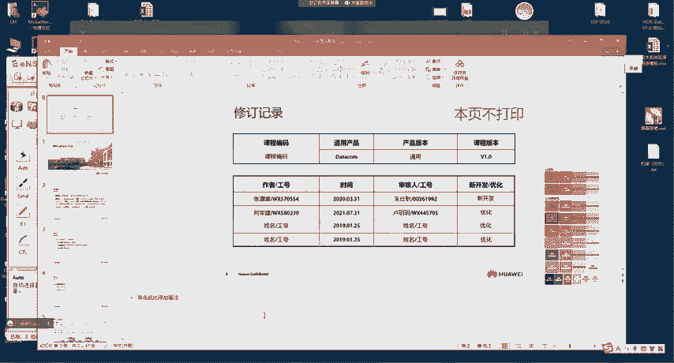

MPS协议啊嗯把这个协议来给大家讲一下。呃，这个协议呢用的还是比较多的啊呃，这个也是大家未来在去学习过程中。你学很多技础呢，也需要MPS的基础。就像我们之前学ARP吧，老师我为啥要学这个。

什么数据通讯过程啊，大家在A的时候都学过，这是一这是二，中间隔个交换机，一拼二怎么拼的吧，一聘二到网关又到二怎么拼的？啊，我为什么要去学这些数据过程呢？是因为我们在以后的学习中。

你会发现经常会去遇到那我们会去分析这个啊流量的走向啊，对吧？啊以及他的通讯流程。比如说我发现拼不通，我要知道去看ARP，因为他有ARP才能通。😊。

对吧所以说呢我们学到的很多基础知识啊嗯对以后呢都是有用处的。啊嗯那学MPS呢也是一样的，那以后大家可能用到MPS不太多了。呃。但是呢他对你你以后去学习一些其他的技术啊嗯是非常有用的。好吧。

然后我们来看一下啊呃，首先我问一下大家有没有同学知道这张图是哪？有没有同学知道啊？是吧。嗯。嗯，但有同学可能知道啊，有同学不知道。呃，这是华为杭州的这个培训培训中心啊。嗯，比如说有同学去杭州考试的话。

嗯，你就是从门口呃，这边是西大门啊啊巴拉巴拉巴拉从这里进去。啊。嗯。然后这边应该是一个这一楼全部是机房啊啊，就dacom考试的机柜啊都在这里。之前去看过啊之前我去这里去看过。呃。

这栋楼呢全部都是做办公的。啊，然后这栋楼呢都是做培训的啊。嗯，做培训的有很多啊，华为不仅给这个呃不仅是让你考试培训的啊吧啊，他还培一些这个其他国家的啊这样我去的时候呢，好像还有巴基斯坦的。

啊啊他们也在华为这边受培训。那这是华为的一个这个这个。培运中心啊就是啊对，没错啊，就杭州的，但这位置非常大啊，你看这些空间呢全部都。啊，跟大学一样建得非常的豪华。😊，而且你进去之后啊如果有同学经历去过。

应该是知道的。就是你进去之后呢。😊，嗯，就门口会有那种就招待的那小姐姐啊，对吧？呃，还有这个呃年轻帅气的小伙啊，一男一女在这里会去给你看那个招待信息，对吧？会给你指路。啊，所以说大家以后好好学呢。

去杭州考试一次，嗯，你就能够体会到了啊，这个地方非常豪华啊。里面还有什么？啊，还有什么喷泉啊，里面基本都是那种比较像国外的那种建筑风格嗯。他里面有什么喷泉啊之类的。嗯，当然这个我们就不多说了啊。

就大家以后如果能够呃学到那个阶段的话，是吧？啊，能够去考试的时候呢，可以去看看啊啊，就进去之后呢，你看别人办公的地方是吧？啊，就大家好好的学习呢，以后都有机会。😊。

不是你每天呢在这个自己的办公岗位上非常豪华里面。呃，然后我们来看一下啊。😊，嗯，接下来我们把这个MP24的一个产生背景给大家说一下。好吧。好，也搞得你们不考一样是吧？嗯。

如果大家能真的到考试阶段啊是比较好的。嗯，但是呢以我这么多年培训的一个经历啊，嗯大多数同学呢很难学到最后。😊，这个是很正常的啊，就你报班的时候，你这个呃薪智是非常高的对吧？但是呢随着时间的推移呢。

慢慢的就被啊消磨了。😊，所以说呢这个。也是给大家说一下，对吧嗯。就是再坚持一段时间，那到来意呢再学一段时间就能够去考试了啊，考完就轻松了。好吧。然后我们来看一下啊呃，MP4产生的一个背景啊。

嗯前沿部分呢就是介绍一些这个呃MP24转产生的一个背景，对吧？就他为什么产生，实际上三两句就介绍完了。这个大家不需要了解去很多啊，不需要去了解很多我们来看一下啊啊就是90年代中期呢我觉得在这个时间呢。

很多同学还没有出生。😊，对吧呃，互联网的流量呢快速增长啊，依赖传统IP依照路由表转发的技术呢，由于硬件啊存在的限制呢啊导致了转发比较差，对吧？查表转发成为了网络数据转发的瓶颈。嗯，什么意思呢？

就是我们传统查表转发都是去最长研码匹配的。对啊，那时候都是基于软件去查找啊，所以说呢这个网络中报文转发的速度是非常慢的。所以说就导致了查表转发成为网络数据转发的瓶颈，是吧？

就是我们限制网络的发展呢有很多的种条件，对吧？不管你是政治原因啊，嗯还是这个嗯经济原因，对吧？嗯，又或者说你这个科研的原因，对不对？那有很多。所以说在90年代中期呢有一段时间就是限制这个。

网络发展呢啊是因为我们的硬件技术呢。存在一定的限制对吧？转发能力比较下低下。那时候我们没有这种。比较快的这种转发芯片。所有的查找微转发呢都是基于软件的啊，这个软件他处理肯定没有硬件快嘛。对不对？

所以说呢导致网络数据转发成为了瓶颈。那时候网络发展就慢了。那时候大家玩这个游戏的话，那时候。是吧你要换到那时候，你现在能刷抖音吗？我举个例子啊，就是那时候的这个网络这个速率。嗯。你要换到现在。

如果我们用那时候的速率呢，大家也刷不了抖音，对吧？啊，也看不了直播。能不能明白？就当我们的速率越高的时候，大家所以才会。嗯，生活中才会有很多改变。啊，所以说那时候呢这个。😊，网速很慢哎。

网速很慢怎么办呢？啊，那时候有一种技术啊叫ATM啊，当然不是你取钱的那个ATM啊，但是他给你那个。呃，就大家想到ATM都想到钱是吧？比较贵。那时候有一种技术呢叫做ATM技术啊。呃，ATM这种技术呢。

大家可以理解成是一种新型的网络，是另一种网络啊，就相当于我们现在有手机，有安卓，有苹果一样。对吧呃，之前安卓非常卡，但是苹果就不卡啊，但是不是人人都买得起苹果对吧？或者说不是人人都舍得去买苹果。对不对？

所以说当时也有一种不是以太网的技术是吧？啊就叫ATM。嗯，这种技术呢他转发就比较快。呃，转发比较快呢，但是他比较贵。啊，所以说不是老百姓都能用得起的啊，特别对于运营商呢。

他的网络那么大他直接去换的话这个。😊，嗯，经济承啊承担不住。所以说那时候就有一种想法，嗯，这个传统的IP转发呢嗯它比较低，对，就是成本比较低啊，但是呢转发比较慢，ATM呢成本比较高啊。

但是呢它转发又是比较快的ATM就是基于标签的。😊，好吧，哎，那时候就想有没有一种技术能把两个人的优点做一下结合呢？😊，对不对？啊，就相当于这个我们中国说的这个泰迪一样是吧？嗯，你比较黑，他比较白啊。

那你俩站到一块综合一下。对吧所以说那时候我们就想有没有把ATM跟IP网络的优点呢互相融合一下啊，那时候就有这么一种想法啊，有了想法之后呢，很快就得到了执行。😊，所以说呢啊就延生出来了MPS4这种技术。

MPS呢我们把它叫做多协议标签交换。啊，那为什么是多协议呢？因为他对于底层协议啊嗯不是要求啊，比如说你底层可以跑IDP啊，BDP啊。嗯，OSPF啊ISS啊都行。然后对于MPS呢。

它相比于传统的IP路转发啊，我们只在网络边缘分析IP包头。那这里如果没有学过的同学，或者说没有接触的同学已经懵逼了。是吧老师MP叫多协议标签交换。首先这个词呢我不是特别理解啊，你要说。😊。

这几个字呢我都能读懂啊，但是呢不理解啊，然后什么转发的时候在边缘分析IP包头。😊，呃，在网络内采用内部更为高效的标签进行转发，节省了处理空间是吧？一下子就还懵逼了。

所以这一块大家不用去管它啊然后后面呢还有一些这些再看呢，如果没有学过的同学啊就更懵逼了。那随着硬件性能的。😊，这个不断发展呢。对吧MPS在数据转发上面的优势就弱化了。啊，但更多的用于支持。啊。

但其多层标签嵌套对吧？和转控分离的特点呢又用到VPN跟Qs上。是吧很同学看着懵逼了。所以这里我给大家说一下啊。😊，这里呢大家读一个历史就可以了。嗯，这里主要说的是什么呢？我给大家做一下总结啊。

就是呢MPS最早期产生出来呢，我们是用于提高转发速度。但是后来呢嗯因为我们的科研一直在进步嘛，对吧？硬件的性能也在不断提高。所以说呢现在没有MP4呢。嗯，跟有MPS，它的转发速度基本是一样的了。好吧。

但是呢现在MPS呢更多用在构建VPN跟Q上。好吧，就是用到其他地方了，那这就是MP4的一个呃发展史。啊吧，然后我们在学习过程中呢啊依然要去学。因为现在MPS我们用到的这个VPN特性是有很多的。😊，啊。

嗯，然后我们来看一下吧啊，就是传统IP转发的一个缺陷啊，以及它的一个过程。他这样的啊，长短IP呢我们是逐跳的转发，每经过一台路由器呢，都要去看网络层信息。😊，而且要最长掩码匹配，指导报恩的转发。

那路由器重复的解封装啊，然后封装对吧，查找路由表再封装的过程呢，导致转发性能比较低。那这是我们在传统IP转发的一个缺陷。传统IP转发有什么缺陷呢？我们来举个例子啊。😊，比如说IE收到一个包呢。嗯。

他首先要拆包啊，拆包之后要处理，处理之后呢，查找路由表，路由表又最长页码匹配，匹配完，知道从哪个接口发出呢？啊，这时候他还得再封装IP包头，封装IP包头之后，TTL得改啊，那TTL得改，你吓一跳要不要。

不是吓一跳啊啊，就你校验盒要不要改啊也要改。😊，对吧啊还得重新做哈希哈希完成之后呢，才能够发给啊。😊，也就是说这个速度呢很慢，是吧？所以说传统IP转发的一些特点，就是所有路由器都知道传网的路由。

还有一个呢，IP头部不定常，对吧？处理效率慢。这个之前在讲IPU6的时候给大家说过。😊，那还有一点呢，传统IP呢是面向无链接的啊，没有办法提供更好的Q4保证。这一句话我觉得啊80%的同学都是懵逼的是吧？

所以说这一块也不用管，也不用管，这里都不用管啊。这里大家只需要懂的是什么呢？就是传统的IP转发啊，它比较慢，卖在哪里呢？我收到包之后，我得。😊，最长亚码匹配路由表是吧？啊，基于软件的查找。

那匹配完成之后呢，我还要重新封装IP包头啊，然后做哈希，对不对？呃，然后再去转发给吓一跳。那它在每个路由器上呢处理都是比较流程都是比较多的那这个效率就会变得更慢。可能我们没有办法去体会啊。

因为设备处理的时间呢，我们作为人很难去体会到这个时间，我们作为人呢一般对时间的感知能力就在毫秒了。嗯，如果再高的话，咱们就感觉不到有什么区别了。但是对于设备来说并不一样。所以说传统的IP路由转发呢。

它最主要的一个特点就是转发性能啊比较差。😊，对吧。然后MP4不是用于解决它吗？对吧？那MP4是怎么样的呢？这里有一个啊大概的介绍，MPS4是这样的啊。😊，比如说呢我这有个IP网络啊。

我这里也有1个IP网络，这俩IP网络不是要通吗？对吧？如果传统你们经过的这也是1个IP网络，这中间所有的路由器都得去执行复杂的这个查找路由表是吧？封装解封装。😊，嗯，那效率就会比较差。

所以说那时候我们的管域网呢就有这么一种想法。哎，在这一块呢能不能去改一下？就不让他用IP了。对吧。用什么呢？用MPS。啊。那用MPS它可以实现的一个效果是什么呢？比如说你的IP包过来了。

我给你加上1个MPS的标签。😊，对吧然后我网络路内呢所有的设备都是一样的，打着这个标签呢，你们就往这发就完事了，就跟这个快递分拣一样，是吧？😡，你看到是北京的呢，你就往那个车上扔。能不能明白呃。

你就往那个车上扔啊，这个麦克依然是要拆的啊，麦克依然拆，但是三层IP包头啊已经不要去看了，已经不会去看了。😊，而且呢，不仅不看三层IP爆头了。嗯，他也不需要查找路由表了。因为传统的转发。

你看三层IP包头，这1个IP包头多大？他是多少，20到60吧。对吧还不是定长的。所以说你传统分析1个IP包头，你得你至少你得。😡，最小是20吗。我我印象中没说好像是20万。

对你最少你得读20个字节的数据内容啊。😡，对吧而在我们的MPS中呢，标签就四个字节。那你你想吧，一下子快了5倍。对吧。快了5倍还不止，因为标签是定成的啊，是IP包头是变成的。😡。

对吧那如果你的IP包头你分析之后呢，你还得分析下面的内容，因为它是变成的万一有其他内容呢，而标签是定成的，就四个字间对吧？固定的按照固定的程序，我们的设备去执行起来，那效率就会变得更高。😡。

而且呢呃标签也不像查路由表一样。那路由表我查到有路由匹配。我们要不要最长研码匹配啊，对吧？匹配之后再匹配对吧？挑挑拣拣。我一看到三条路由匹配我的转发目的地，我还得最长页码匹配一次。

那标签查询就没有这么了，来了一个标签是X，对吧？在我的标签表里，就是收到X换成Y从这里发出来啊，就这么简单。😡，能懂吗？啊，什么IP包头啊，不看。😡，对吧所以说MPS呢嗯在转发中啊这个效率会变得更高。

刚有同学问啊，那MPS跟MPS为P是不是同一个东西呢？啊，并不是。这里我也给大家说一下。MP24呢，它是一种转发技术。好吧，它是一种新型的转发技术啊啊，就是提高转发速度。而MPSVPN呢，它是这样的。

我们来看啊，因为我们进到网络中是不是都要去打一个标签啊，大家可以看到吧。😊，是吧。那这个标签我们在这个网络内只根据标签进行转发，它有没有点隧道的感觉？

大家觉得有没有啊你觉得那个加一它外面封装一层IP包头嘛？😡，是吧。啊，他能够实现监狱隧稻。对不对？那MP24里面封装隐层标签也能够实现隧道啊。😡，是吧啊，就是他有一种隧道的感觉，区别和加E的是什么呢？

😡，嘉E的这个外层呢，他用的是IP包头。对吧MPS用的是标签。他就这么多。是吧这就相当于你拉一个货一样。😡，对吧呃，你外层你是用卡车拉呃，还是用什么小轿车拉，本身你都能过去吗？对不对？

就是隧道的封装类型不一样，但是本身都有点隧道的特点。对吧所以说基于MPS4隧道的特点呢啊后来我们想办法去延伸着出了一种。嗯，VPN技术就叫做MPSSVPN。那我们的学习曲线是什么样的？

就我们先要去学MPS。😡，学MPSS4之后呢，再去学MPSSVP。这过程大家能够明白吗？明白的同学敲一啊。没问题吧，就你先把MPS搞明白啊，然后再去搞VPN啊。😡，啊啊，不能一口吃个胖子。

所以我们来看呢嗯在MPS学习之初呢，我们会接触到很多的术语。那这个术语呢嗯还是比较多的啊，是很多，我可以说是很多啊。😊，嗯，他给我的感觉是什么呢？就是大家才刚开始在学生成数的时候。😡。

就学到什么啊跟ID啊，桥ID啊，桥麦克桥优先级对吧？什么指定端口跟端口。对不对？嗯。就学到的有很多啊，但是呢。刚开始接触起来可能很难去完全把它理解。对吧呃，就术语有很多啊，记不住啊，但是慢慢的就好了。

😊，啊，所以说这个待会我们要说到的术语啊嗯课件里会介绍的比较复杂啊，大家就按照我说的去记啊，就很简单。😡，那能不能记住呢？我们不要求强记住。

那他就相当于你在设备上刚开始学到displayI interfaceface brief一样。是吧我刚开始学华为的时候呢。这个面令我们还想着。

第四类IP interfaceface brief还想着去记一下。对不对？嗯，后来你发现呢你不需要去记，因为你天天用根本忘不掉啊，那我们学MP4也是一样的。😡，在学M14的时候呢。

我们会接触到大量的术语。那这些术语呢，大家理解就行了，不需要刻意的去记。因为在我们后面的学习过程中呢，会不断的再去说到这几个术语啊，大家会就会越来越清晰这几个术语。😊，好吧，不需要去强击啊啊。

就跟你记的这个简单的什么display C对吧？嗯，不需要去强击。😊，嗯，用的多了是吧，忘不掉啊。对，没错。然后我们来看啊呃，MPS术语呢，第一个我们要介绍的叫做LOSR与MPSU。😊。

MPS域是什么样的？就是。😊，首先给大家介绍一下啊，什么是LSRLRSR，那我们把它叫做标签交换路由器。😊，注意啊，叫做标签交换尾器，就是指。执行MPS转发的路由器呃，我们把它叫做标签交换路由器。

那LR呢嗯分为两类什么两类呢？比如说在连接IP网络跟MPS网络的。这个设备。对吧啊，在OSPF里，我们把它这叫做ABR对叫做A边界设备。😊，那在MPS里面呢，我们就把它叫做LE啊。对意啊，叫做LE啊。

叫做边缘路由器标签边缘路由器。好吧，然后后面这个呢也叫做LE啊。那中间的这个呢，我们就把它叫做扣LSR啊叫做核心LSR。😊，好吧，就LR分为两类，一个是边缘的啊，一个是内部的啊，就这么多。😊，然后呢。

MPS赌脉是什么呢？😡，是吧就是由LSR连续组合到一起构成的一个网络范围。对我们把它叫做MPS4域叫做MPS4动漫。好吧。行吧，那这就相当于嗯这个河北一样，由河北人嗯连续组成的一个范围是吧？

我们把它叫做。😊，嗯，河北省。对吧啊基本是类似的啊。那这两个术语很简单啊，嗯我们就不再说了啊。然后接下来要说的一个。😊，呃，叫做RSR的啊分类。注意啊。注意啊。还有一个呢叫做LR的分类。对。

这只是一种LR的角色啊啊下面是具体的分类。我们来看一下啊，它是这样的。我举个例子。比如说这是我的IP包啊，1。1。他要去访问2。2。那他要不要经过MPS赌脉内的路由器转发？要不要？😡，要吧。是吧。

那这时候呢，注意。经过MPS赌漫域内转发的时候，这些路由器的角色。如果我们站到流量的角度去看，注意啊。接下来我们说的这几种ISR的分类呢，是站到流量的角度去看的。如果我们站到流量的角度去看呢。

LR呢啊还有一些类型。首先，如果我们进入到MP24网络内，对吧？那么他会给我压1个MPS标签，就打上1个MPS标签啊，根据标签在域内转发吗？所以说这个呢我们把它叫做english啊。

大家可以理解成就是入口。eng就是入口的意思啊。😊，就是入口LISa。那出网络的时候把标签弹出。对不对？那这个就叫做Egress areaisa，啊就是出口的erISa。

那中间的呢叫transectLa啊，大家可以理解成叫做中转La。路中间的路由器呢看到这个标签是X，他给你换成Y啊，转发给这个路由器。好吧，所以说如果站到流量的角度去看。见到MP4域内。

我们把它叫做eng是吧？在MP4中。转发的时候，我们把它叫transside的。出MPS网络叫做e。好吧，这几个也是非常简单的啊，你不要去看这些啊，看这些跟我说的一样啊，但是呢你看这些容易懵逼啊。

通常是向IP报案中压入MPS头部，并生成MPS。😊，啊，报文的艾尔萨。是吧。嗯，刚开始如果要给你看这些呢啊你可能就懵了啊，这都不是给有基础啊，不是给没基础的人看的啊，都是给有基础的人看的。好吧。

那这三个分类大家搞明白了吗？明白的同学敲一啊，没问题吧。😡，好吧。然后我们再来看一个术语。这个术语呢叫做FEC。这个FEC是什么样的？我来想一下啊，传统的时候，我们在IP网络中。😊，呃，怎么样进行转发？

怎么样？注意啊，根据路由件转发。是吧。注意FEC呢，我们把它叫做转发等价类啊，大家读一下这句话啊，然后我待会再来跟你说啊，在IP中它有什么样的特点。😊，对 yeah。是一组具有某些共性的数据流集合。

这些数据流在转发的时候，被网络节点以相同的方式处理。是吧。什么意思呢？我举个例子。FEC呢大家可以认为是一个类。对呀，比如说我有A类跟B类。那我收到一个报文，如果他属于A类，我就给他打上X的标签。

如果属于B类，就给他打上Y的标签。那这就是FECFEC本质就是一种类。而不同的类呢，对吧它可能对应了不同的转发行为是吧？什么样的转发行为呢？比如说你属于A类是X标签，B类就是Y的标签。

这就是不同的转发行为。😡，对不对？而在M14网络中呢，我们再去给他分类的时候。可以基于目的IP啊、网络掩码、DSCP啊等等来进行分类。就是分类的方式有很多啊，你还可以根据协议啊，对吧？

原IP地址来进行分类。但是这些呢我们都没有用过，注意啊。😊，MP24中它怎么样来进行分类的呢？他是这样的。我们来想一下。比如说我举个例子啊。😡，啊，比如说呢。火车站里。是吧这有一个火车站。😊，呃。

现在有很多人。有一部分人去北京。有一部分人去上海。那去北京的人，我能不能认为他们是一类人？能不能就看你依据什么来分嘛。😡，对吧你去北京，那你们就一类嘛，你们都是去北京的对吧？你去上海，那你们也是一类的。

你们都是去上海的对吧？就看你按什么来分。😡，对吧哎，那我们来想一下啊。那路由是不是一种类呢？比如说我举个例子，现在我有个1。0的路由。是吧有个2。0的路由，1。0的路由呢走这也吓一跳，2。

0的路由呢走这也吓一跳。那如果来了一个数据包之后。哎，他是匹配1。0的转发条目。那么我能不能认为匹配1。0的路由都是一类啊？拿不拿？可以吧。是吧来了一个数据包，它匹配2。0的条目，那我也可以认为哎。😡。

匹配2。0的数据包，他们也是一类。对吧。那在我们的MP24中是怎么样来进行分类的呢？它就是根据IP路由表来进行分类的。他是这样的啊，我举个例子。😡，比如说在这里呢有1个3。3。

在我们的这个设备上就会有这么一个条。😊，3。3。3。3啊。这个路由。是吧我给他一个X的标签。😊，他这么一个逻辑来了一个数据包，你不是IP包吗？我一看哦，匹配我这条路由。😡，那我就给你打上S标签转发出去。

能懂吗？然后后面可能还有1个3。3。3。4。是。我给你分配一个Y的标签。😡，来了一个数据包之后啊，哎，你匹配3。3。3。4，哎，我就给你打上Y的数据包Y的标签出去。😡，能懂这意思吧？所以注意啊。

在MPS网络中，FEC就是路由。大家可以理解成它是把路由来认为了是不同的类。这个能够明白吗？明白的同学敲一啊。没问题吧。好吧。那这个呢就是FEC。然后最后我们还有一个术语，把这个讲完之后呢，休息一会儿。

😊，啊，这个很简单啊。😊，这个是怎么样的呢？😡，LP是吧呃，跟你学ISS那个RSP不太一样。我们在MP24中有一条RSP呢，我们把它叫做标签交换路径。什么意思呢？标签交换路径是这样的啊。😡。

比如说我的网络，我的不对啊，我的数据进入到MPS网络之后。😡，他转发所形成的一条路径。能看到吧？我们就把它叫做啊标签交换路径。能不能明白，这里就是标签交换路径啊，就这么简单。啥意思呢？啊，就相当于。啊。

这个。这这这这这叫啥来着？啊，当年红军对吧？啊，长征的时候啊，走过的那个路，我们一般叫什么啊叫做长征之路。😊，对不对？那现在网络中是这样的，就是我来了一个包之后啊。😡。

对吧从我进入到MPS网络到我出MPS网络，所有经过的路由器连到一起组成的这一段路。我们就把它叫做RSP。叫做标签交换录音。很简单啊。这个大家明白了吗？明白的同学敲一。没问题吧。好。

那整体的逻辑我们来给大家说一下啊。😊，首先呢，在我们的MS网络中是怎么样呢？😊，我每个设备啊都要去支持MPS4转发。支持之后呢，我们把它叫做。😡，LSR。对吧在边缘的呢，我们把它叫做LE啊。

对吧叫LER。然后他们互相连接到一起，组成了1个MPSS动漫。对不对？那我组成MPS读漫之后呢，主要就是为了在2个IP网络经过我进行转发的时候。去给他提供一个快速的转发路径。那么在这时候。

当IP数据包到达R6之后，是吧，进入到MPS网络。我们就把这个设备叫做engg。对不对？然后经过R8，经过transetR7对吧？R7R8都是transet到R3之后呢，R3把标签弹出翻到IP网络。

R3呢我们就把它叫做E。好吧，那这就是我们刚刚所见到的几个术语，而在网络中MPS网络中对吧，是怎么样去用到的？而由engg到Egress中间经过的这些录音，我们就把它叫做标签交换路径。好吧。

这就是我们刚刚所说的几个术语。嗯，这里各位同学都理解了吗？理解之后咱们敲波一好吧，然后休息一会儿啊。😊，行不行？行，咱们休一会儿吧。😊，嗯，RSP跟FEC有啥关系？FEC是一个类啊，注意啊。

每个设备上都会有FEC。每个设备有FEC，他们是不是都有这种转发处理的指令啊？对吧那有了这种传发主理指令所形成的路径，我们把它叫做LP。也就是说，LP的前提，你要在每个设备上呢都有FEC才行。

是这么一个关系啊。对吧就像我们的IP网络一样，每个设备都有路由，我们才能够形成转发流量的路径啊。😊，对不对？对，没错，中间就只看标签了。好，那我们休息完。嗯。下来我们来看一个啊。这个。

MPS的一个标签啊，因为我们刚刚也说了，就MPS它基于标签转发对吧？呃，这个标签长什么样子呢？我们来看一下啊。呃，MPS的标签呢，它有首先我们来看一下它的封装位置啊。他是在我们的二层和三层中间的。好吧。

呃，在这里呢，我们去压M标签。嗯，当然有些同学可能看书啊嗯或者说在网上看一些文章啊，有些人把MPS叫2。5层。是吧嗯，这个也就是不同的人叫法，实际上在呃官方定义中没有2。5层是吧？呃。

如果大家这个为了方便好理解呢，也可以认为啊，它是2。5层。嗯，这个MPS标签他是这样的啊这一些也不用管他什么压一个压多个之类的。😊，这里我们现在不涉及到现在给大家说，大家也理解不了。😊，我来看啊。嗯。

这标签呢，他一共占了32个比特，也就是说一共占了4个字节是吧嗯，比较这个。呃，小对吧？那我们在转发的时候呢，速率就会变得更快一点。那它是由四个字段组成的。嗯，第一个呢叫label。

label呢是标签值对吧？像我们刚刚所说的嗯，来了这个数据包之后呢，匹配哪个FEC对吧？给它打上X标签啊，给它打上Y的标签。那这个标签值呢一共占了20个比特。

然后label是用于表示你具体的标签是多少的。对吧然后ESP呢注意啊呃，它是用于做呃，我们这里有一些叫COS对吧？啊，叫做类别的服务。什么意思呢？大家可以理解成它就是用来做服务质量的啊，做Qs的。啊。

就是一个流量呢，我们不同的流量肯定有不同的要求嘛啊，这个跟人一样是吧，你有些人呢他。是吧得到服务待务就比较好，有些人就比较差。因为你坐高铁一样，商务座呢，他有。专程的这个候车室。对不对？嗯。

这个二等座啊，一等座就没有。对不对？所以说ESP呢就是一个标记啊，就是标记之后呢，可以代表你这个流量，它所得到的一个服务质量。S呢叫做占底位，占底位是什么意思啊？啊，它有点类似于这样。

就我们的MPSS标签呢，大家注意啊。😊，他不能压多个。啊，不对啊，他能压多个，这里能压一个呢，这里能压个2。😊，是吧。那占点位主要就是用来标识，这是不是最后一层标签的？能懂吗？就我这里是不是最后一层？

比如说这是一个数据包啊，前面这是是针头对吧？后面是IP包头。那中间我压了两个MPSS标签。压两个有什么样的场景，这个后面我们会说说到啊，这里大家只需要理解，就是MP2能压多个。那赢能压多个？

比如说在一这里呢，它后面还有一层，所以说它占底位就等于0。二就是最后一层标签对吧？所以说他占底位就离啊，就是标识我这是最后一层标签。那TTL呢跟IP中的是一样的啊，就用来防还的啊。

就是用来防止报文被无限转发的。那这是一个标签的格式啊，这个格式要不要记呢？也不需要去记啊。现在大家考IE方便多了啊，你看以前考面试的时候，这玩意都得背啊。是吧我那时候也是背的。啊，为什么要背呢？记不住。

真的是记不住啊，你得刻意去背呢。你像那IP包头。我也是背的。有IP包头要有什么理解吗？除了原IP目的IP是吧呃，我们能理解一下TTL啊，其他的真实的备啊IP86包头，纯备BEP选路呢纯备。对，就硬背啊。

所以说现在呢啊现在考试没有那么的要求，所以说这一块呢，大家也不需要去背它啊，知道有这么一些字段就行了啊，用到时候能查一下。😊，那我们来看一下啊MPS的一个标签站。那标签站是什么意思呢？

当我们去压入多个MPSS标签的时候，是吧？那么他们就形成了一个叫做标签站。就是我们可能会压多个是吧？一个啊，两个3个是吧，还有4个、5个的都有。但未来在我们学MP4的时候，嗯，最多只会见到三层。好吧啊。

在TE里面你可以见到四层是吧？啊，甚至是5层。能不能明白？然后我们来看啊。这个标签站它是这样的啊，首先每个标签呢。他都是有固定的这三个四个字段啊，都是四个字爷爷。那在最外层这个呢，我们把它叫做站顶。

好吧，在最内层这个呢，我们把它叫做占底。😊，他是这么一种关系啊，一个是站顶，一个站底啊，这个很简单，一个在啊顶部嘛，一个在底部。然后站顶以及中间的标签呢，他们的占底位都会为0。因为什么呢？

因为你不是占地。那最后这一个标签，它在占底位才为质疑啊，标识这是最后一层标签的。那这就是MRC的一个标签站。那未来我们在学VPN的时候呢，会遇到呃三层啊呃，学跨域的时候呢，会遇到这个啊不对。

VPN的时候会降到两层啊，学跨域的时候会去降到三层啊。😊，那这就是MPRC的一个标签站。好吧，这里大家也不需要去记啊，去记什么东西。这里如果让我说的话啊，就大家知道一点，就MP4可以压多个标签是吧。

什么站顶站底。😊，这玩意儿平常我没有说过啊，没有说过这种术语啊，但是别人说呢，我能知道是吧，就最外层最内层的。啊呃，然后呢，占底这一层标签它是。占底位质一啊，标识是最一层的，然后就没有其他的了啊。

然后我们来看一下啊标签空间。这标签空间是什么呢？就我们之前说过啊。嗯。在MP4里面呢，我们的标签有一个大的范围，占了20个比特。是吧。呃，这就像IP地址一样，IP地址呢占了32个比特。

但是有一些IP地址比较特殊啊，有公网啊，有私网啊对吧啊，有主播，有广播。那在我们的MPS标签中呢，也有一些。单独的标签注意啊，就有些标签呢啊有一些特殊作用对吧，所以说我们给不同的标签呢划分了一个范围啊。

用于标识它不同的作用。那0到15呢。嗯，用在特殊的标签值，注意啊，0到15是一种特殊的标签值。那我们常见的，比如说标签为零，代表IPV4显示空标签。嗯，什么意思呢？我给大家举个例子，这里一。2是2。

这是3。一连2，然后连3。那这里我们是1个MPS的动漫，啊，一是eng，二是trans赛，三是eng啊，流量是这样发送过来的。那在这时候呢，我们来想一下啊。😊，呃，比如说二把带有标签的数据发给3。

三收到标签，他要去查找一个叫做标签转发表。也就是说收到标签呢，查找标签转发表，收到IP流量呢，查找IP路由表。他查找IP转发表之后呢，要发送到IP网络。所以说在他的转发表中呢，会对应一个动作叫做弹出。

就是把这个标签拆掉，对吧？拆掉之后就看到IP包头了嘛，然后再查找路由表发送给IP网络。😊，那我们会去发现啊，在三这里执行了两次查表。一次标签转发表对吧？那么还有一次呢是路由表。对不对？

那这时候我们就去想啊哎。三、执行两次查标转发是吧啊，效率就低一点。所以说在MP24里面呢，有一种标签叫做三三呢叫做隐视空标签，什么意思呢？就是在二这里啊。他把数据转发给三的时候，他一看出标签是3。

这个我们是需要通过配置去完成的。就他一看出标签是三呢，他直接把头部弹出了，他也不换对吧，直接把IP包发给三了。那三是不是只查找路由表就能够转发到IP网络啊？😡，对不对？

所以说这是我们说的三叫做隐视空标签。但是这个三有个什么样的缺陷呢？刚我们在讲MPS标签的时候，讲到了里面有1个COOS对，就是ESP。😊，做Q死的。那他在做Qs的时候呢，比如说我们在二这里啊。😡。

把标签给他弹出去了，弹出去之后就没有ESP了。那三能够参考ESP做Q是吗？不行吧。是不是不行？对不对？那这时候怎么办呢？二呢就给他发一个0。能懂吧？就是二呢，给你这个数据包也给你带标签的。

带的这个标签是0。代标签是零，代表什么意思呢？就是我把数据发给你，你待会儿呢？收到这个零的标签。你就直接弹出，就是首先呢你参考里面的Q4字段，然后把标签弹出，就是他会不会查找标签转发表呢？不会。😡。

然后会直接查找IP路由表进行转发。所以说啊这个零它所代表的意思就是下一跳设备，你要这样怎么样呢？首先你收到这个标签之后啊，你看看他的ESP有没有做Q。如果做的话，你给他一个服务等级的保证。

对吧如果没有的话，你就把标签直接弹出查找IP路由表转发就行了。就是要不要查标签表呢？就不会了。😡，好吧，那这就是零和三的作用。那还有一些其他的标签啊，你例如二啊是做到MP24支持IPU6的时候啊。

还有一些其他的没有定义的啊啊，当然我记得好像还有两个是用于报错的啊这个跟我们的并不涉及。那还有一个呢叫做16-123。啊，这个是怎么样呢？用于静态RSP的啥意思呢？我刚刚说过啊。😊，标签转发路径。

对不对？他是1个LSP，这就是1个LSP。那RSP呢就像路由一样。我们的路由可以在每台设备上静态去指定啊，比如说我指定你这个包我往哪里去发，你这个包往哪里去发对吧，这不就形成一个流量转发路径吗？对不对？

FEC我们也可以在设备上手动去配，告诉你啊，这个FEC发给谁，这个FEC发给谁？😊，对不对？那这样的话就会形成1个RSP。能懂吗？就是我们通过手动的去构建FEC去形成一条RSP。那这个LP呢。

我们就把它叫做静态RSP。😡，好吧，就是我们就给你配静态路由一样啊，所以说我们在配静态RSP的时候呢，用的标签得是16到1023的。😊，然后动态的时候呢，用的是1024到1048575。啊。

这之间的像什么静泰CRSP啊，这都不用管，这是在MPSTE里面的。😊，啊，像什么LDP啊，我们后面会学MPBDP呢也会接触到啊SOVTE呢也是用在MPSRSTE里面的啊，所以说也不用去管。😊，好吧啊。

配1025会给你报错啊，不会让你配啊，设备会给你报错。好吧。那这就是标签的一个范围啊，这里大家只需要记得是什么呢？就0到15是特殊标签嘛，是吧呃，16代1023用于静态，然后其他的是用于动态的嗯。

我脑子里就这么多。😊，嗯，你说我还记什么静泰SCP静泰CR我没记过啊，我就记这么多啊，0到15是特殊的是吧？16到1023用于静泰的呃，1024呢到1048575啊，这我都没记，我记得就是其他的是吧。

用的就是动态的，在我脑子里就这么多。😊，然后我们继续来看啊。嗯。这个我感觉给大家一讲就懵逼了。这样啊。呃，这里呢我给大家做个实验，好吧，啊，让大家理解一下RSP。他所能够体现的一个作用。

啊啊就大家知道RSP呢。😊，用两种建立方式。一种呢是静态的呃，还有一种呢是动态的。然后在这里呢。我们做个实验。嗯，123是吧，我们做一个这个通过LCP进行MP24报文转发的一个实验啊。嗯，这一。这是二。

这是3。呃，注意啊，首先呢我们把IP地址配一下啊。10。0。12。1。然后在一这边呢创建个low百0啊，1。1。1。1。而这边呢。interfaceG0-0-0。12。2。23。2。

IP address10。0。2302。嗯，然后三这边啊借0-0杠0。23。3。然后low百林呢跑个3。3。

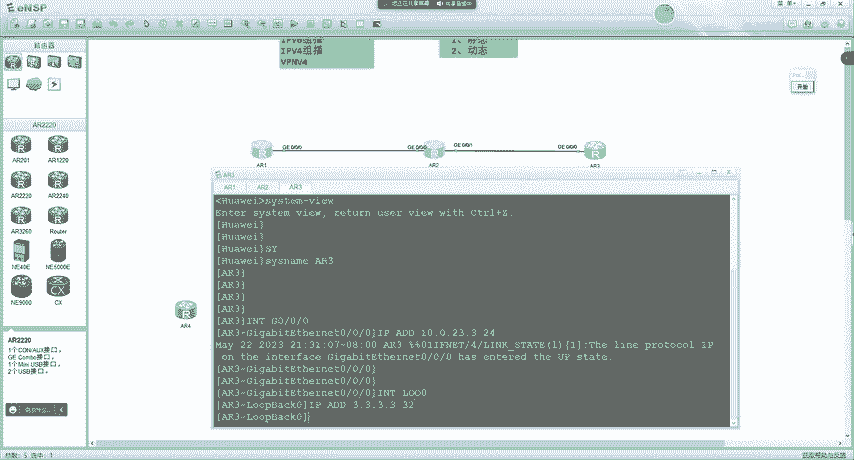

好吧。嗯，我们的MP24呢，他把路由认为是1个FEC。这刚给大家说过啊，所以说呢咱们还得跑个IP协议啊。啊，去实现路由的互联互通。re有0。

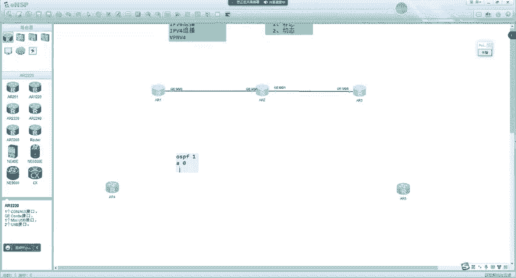

然后network。A1。然儿。123。对吧。做完之后呢，待会儿在二上呢就会去看到OSPF的邻居。嗯。一个init一个推。两个拖围。来了。对吧。嗯，来了之后呢，注意啊。

现在呢我的AR1呢diplayIPing tableAR1是能够学到3。3路由的。A21有一个环园口1。1。1。1去代源聘一下3。3能通。

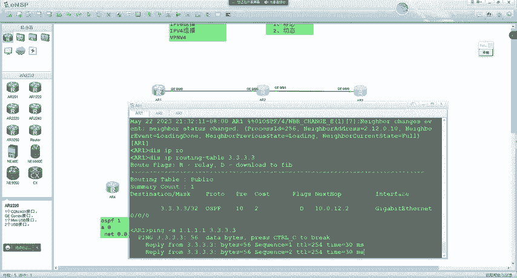

是吧呃，现在我们就是一个普通的IP互通啊，所以说在里面呢。嗯，不会有任何的这个。这个这个这个这个标签对吧，就是一个普通的IP数据。是吧就是普通的IP数据啊。嗯，我把这个抓包关一下。然后现在呢。

我想让一在访问三的时候呢，通过标签啊去进行转发，对吧？我构建这个标签的目的呢，就是让转发速率啊变得更高一点。但我们看不出来什么效果啊，就通过模拟器呢，你也看不出来什么更快了啊，看不出来啊。😊，啊。

但是呢就是大家要知道我们的目的啊，早期的时候有这么一种目的。😊。

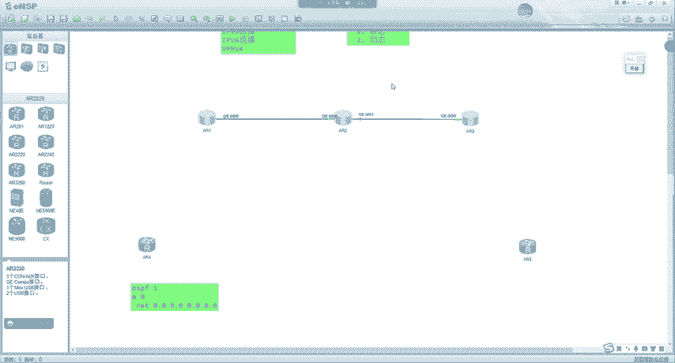

嗯，这时怎么办呢？在AR一上。😊，嗯。总配的我瞅一眼，我也忘了。啊，就这里。啊，叫做s pace LP。没有。叫做st taste。LP就是构建一个静态RSPA2E呢作为eng。啊，这个LCP的名字呢。

你可以自己去定义好吧，就不同的设备上呢可以是不一样的名字啊，就一个名字啊，无所谓。😊，SP1啊，然后目的地址呢是3。3。3。3。

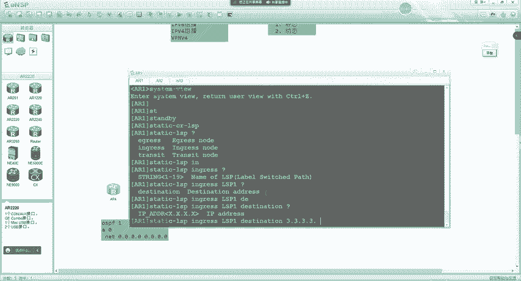

呃，原满是32。呃。

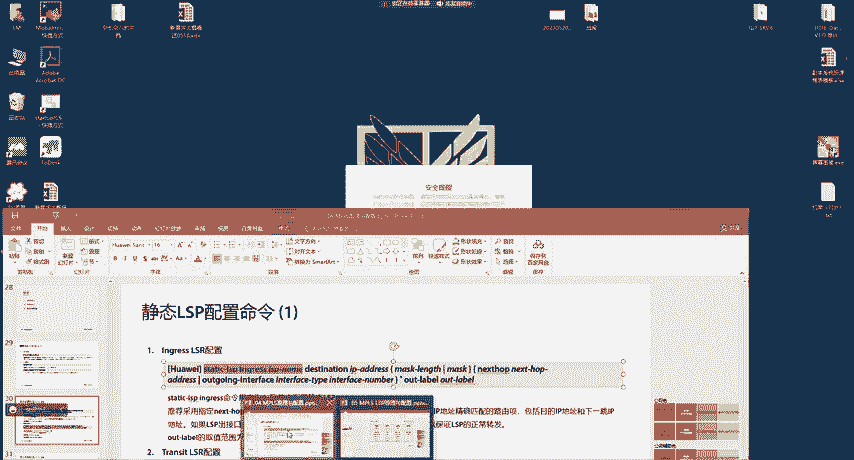

我再瞄一眼啊。啊，对。然后我们去配置吓一跳是10。0。12。2。嗯，出接口呢是这个G0-0-0接口。出标签呢。呃，咱们用一个。有。01。啊，他说我们得先开MPS功能啊。还不让你先开。啊，这样啊。

我给大家说一下啊。😊，就是现在啊还有1个IP网络啊，我们要去实现MPS转发的时候，得先在ARE上叫做MPSLID啊，1。1。1。1。😊，去输入1个IID啊，就是用于标明一台唯1的LR。然后呢。

敲一条MPS命令。开启MPS功能。好吧呃，然后再去输入到我刚刚所敲的那个去让他构建1个静态的RSP。好吧，就在AR一上呢，我现在做了这些配置。😊，MPS4LRID1。1。1。1。MPS功能开启。

然后去让他。构建了一个。啊，这个啥啊。嗯，MP24的静态的呃转发指令啊，静态RSP。然后在AR2上呢，也是一样MP4LRSID2。2。2点开启MPS功能。然后是三t。LP。呃，二是作为transite。

啊，名字呢我们也用RSP1啊，好标识一点，有名字可以不一样啊。呃，入接口呢是G0-0-0。进入来的标签呢。呃，是101对吧？就是他收到101的标签。呃，然后发送给10。0。23。3啊出街口呢是。

G0-0-1对出标签呢是这个。我们用202。好吧。然后这是在二上的配置啊。我先把这个面的贴过来。那肯定都得配啊，这就跟静泰路由一样，你沿途设备有多少呢？你就得配几个。对吧LID2。2。2。MPS。

功能开启。是吧比较长啊，我也没记录过啊，大家不需要去记啊，用到的时候就静态SP呢没有用的啊。😊，就用导的时候查一下，不需要去记啊。然后在三上呢。叫MPLSID3。3。3。3。MPS功能开启。开启之后呢。

3是RSP。呃，三是作为一个。啊RSP的名字呢也叫RSP1吧，好标识一点。呃，入接口呢是G0-0-0。嗯，in label呢是202对吧？进入来标签。202。然后LID3。3。3。3。呃。

terno ID我印象中好像没有这一句啊，这个我先不敲看能不能输入上去啊。好，这样就完了。😊，好吧，什么通路ID不用管他啊。😊，嗯。是吧，突然就不自信了。所以说是MPSRLRID3。3。3。3。

MP24在123上是这么一串配置啊。呃，然后在这时候呢，注意我们需要在接口下去开启MPS功能。AR1的70-0-0呢MPS功能给它开一下。2的G0杠0杠0呢。MPS功能开一下G0-0-1呢嗯也开一下。

然后3的G0-0杠0呢MPS功能也开一下。啊，就在。这几台设备的。呃，接口下去开启MPS功能。呃，我贴到这了啊。AR是G0-0-0。还有G0-0-1。然后A23。也在G0-0杠0下。去开启MPS功能。

好吧，开启之后注意啊，我们在A21上呢可以通过一条命令叫diplay mPSLP。😊，哦，我们就可以去看到啊，这里呢有一条静态的LSP。😊，呃，我们的FEC呢是3。3。332，对吧？把路由认为是FEC。

然后呢，当我去访问3。3的时候呢，我的出标签是101，从G0-0-0发出。是吧，那这说呢？我们当去访问三的时候，访问3。3的时候呢，就会有一个。带有1个101的标签。啊，发送给二了从70-00。2呢。

display mRSP。在这里就没有FEC的概念了啊，2他就可以看到。😊，收到1个101呢，从G0-0-0啊，收到1个101。然后从G0-0-1发出去，带着202，就它会变成202。从这里发给三啊。

三就收着了。呃，三收到之后呢，就没了啊啊就通了，对吧？3收到之后，从G0杠0杠0收到202。😊，啊啊，就没了。所以说三就开始处理这个标签。那这时候我们来看一下啊，对A2一来说，片，比如说我用原地址1。

1。1到3。3。3。是吧，首先我们发现能通。那么能通之后呢，对每个网段都需要一个啊，我们来看。首先在第一条链路上。在这里注意啊，一在发送给二的时候啊，这配的量还不算大啊，你没有见过大的呢。

后面咱们再学的一个时间做一个小时啊，做一节做俩小时。😊，如果从头片啊，一个时间得做俩小时。我们来看啊。那在这里。是不是收到了1个101的标签啊？对吧这标签的格式呢，我们可以去打开看一下。在这里呢。

TTL255对吧，占点位标识为一最后一层标签呃，ESP没有。😊，那标签值呢是101。对吧在里面呢是IP数据一一访问三的。但有101的标签发送给2之后呢。我们看二发给三的时候，注意啊。有没有换成202啊？

有没有啊？有吧他就会换成202之后呢，再发送给3。对吧三收到之后就通了。那我们来想一下，那三寨回包的时候会有标签吗？会不会啊？3回给1。1。有没有一的RSP啊没有。对吧所以说我们只派一个单项啊。

很多同学已经觉得面令多了。😊，对不对啊，这里我给大家说一下。😊，相比来说啊啊面临事多。对不对，但是真正面令多的大家还没有学到啊还没有学到。😊，好吧，所以这里呢大家要体会一点啊。😊，嗯。

三发给二为啥没有是吧？因为在三场我们没有去构建。回程的RSP。能懂吗？这个LSP呢。😡，他是一个单向的路径。比如说我们去的时候是一这个RSP，那回来的时候是不是另1个RSP啊？那懂吗？

所以说回程并不会有RSP啊，好吧，因为我们没有去构建回程的对，回程就是IP路由转发过来的。好吧。那刚有同学问老师这有什么用？对不对？呃，这里呢大家可以理解成就是为了提高转发速度。

但是我们看不出来效果啊大家看不出来。那我们可以去看的啊，那MPS标签呢在不同的设备上，它执行了不同的处理。😡，什么样的处理呢？在一上，本来我们骗的就是1个IP数据啊。他给了1个101，在二上呢。

101又换成了202对吧？在三上呢，他最终又读了IP数据，他肯定会把标签弹出啊。是不是啊？那这也就对应着MPS对标签的一些处理动作。能懂吗？那标签的处理动作在MPS4中啊，它有哪些呢？我们来看一下啊。

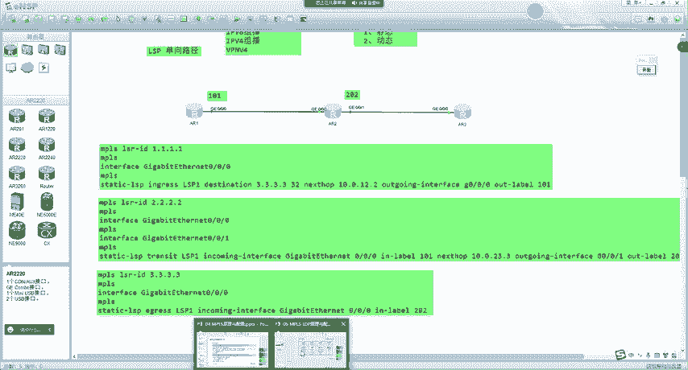

在MP4里面。设备对标签的处理有三种动作。一个叫做铺纸啊，叫做押入。还有swipe叫交换是吧？泡谱弹出。那铺ch他是这样的啊。就当我们的豹纹在边缘设备上会压入标签，执行的叫做pch，你甭管压几个对吧？

我们可能呢压1个300，那这种叫做push。😡，那原有带一个标签，我再压一个这种也叫做push啊，甭管他是什么行为，就是只要是多加了一层标签。我们都把它叫做铺ach，也有可能一下子压两层啊。

这种可能也存在。好吧，那这是第一种动作叫做压入。那s普呢叫做交换，交换是怎么样呢？比如说我收到带有一个标签的报文，刚我们不是说到1个101吗？换成了202。😡，那这种呢就叫swipe。

或者说呢我收到带有多个标签的豹文。那只交换外层这一个这种呢也叫做swipe。好吧。还有一个弹出。弹出是指弹出外层标签啊。比如说我收到了1个300，对吧？我把它还原成IP吧。那这种叫做弹出。或者说呢。

我收到了两个带有MS标签的数据啊，我弹出外层一个，那这种也叫弹出。好。这就是MPS网络中设备对于标签的处理动作。那一共是有三种押入交换和弹出。那具体老师他押几个是吧，换几个谈几个，这里倒还不需要管啊。

我也没记过。😊，啊啊在我的脑子里呢，就只有这么一样push呢就是压标签。是吧交换呢就是换标签啊啊，泡op呢就是把标签弹出来，我的脑子里就这些啊。😊，你像在什么当报文在MPS域内转发的时候。是吧呃。

根据标签的转发表，用下一跳分配的标签替换MPS标签豹纹的站顶标签。我没记过啊，我从来没有这样记过。在我的脑子里呢，就是浓缩之后的。😡，啊破者就是压一个标签是吧，交换就是把一个换成另一个啊。

泡泡就弹出来了。😡，谈几个之类的没记过。啊，不同的场景呢他有不一样的。好吧。所以说这里呢大家注意啊。😡，啊，对，换只能换最前端的啊，不能换里面的。好吧，所以这几个操作动作大家理解了吗？😡。

李解同学敲一啊。没问题吧。

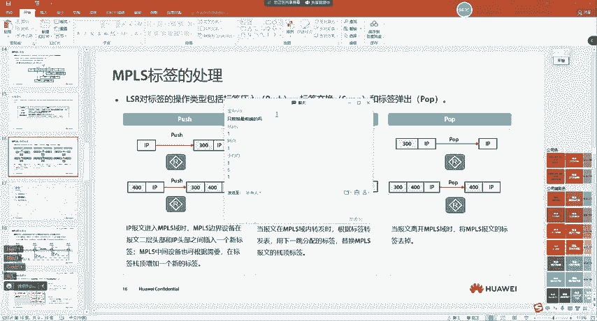

好吧。那这时候我们就可以去看了。刚刚在这里ingra执行的是什么动作啊？是什么啊？叫pch是吧，押入。是吧。那transs赛呢？执行的就是交换。对吧然后三呢执行的就是摊出。对不对？

那这时候我们可能有一个问题，哎，就是啊老师啊哎。😊，太麻烦了吧，刚我配的时候，咱们就有同学觉得麻烦，这我要配。😡，对不对？那我在机房待一天，别出来了。😡，是吧很多同学可能有这种感觉。😊，对不对？嗯。

确实比较麻烦。因为我们发现我们配这还是一个单向的啊。😡，那回程你还要配，这还只是一个呢。那有没有这种可能？我们现在是从一一作为eng三作为eng的。那有没有这样的呢？一作为ingra2作为in格的。

我到二的要不要再配一条，配一条去的，配一条回来了。😡，要不要要吧，那2到一有一条，到3也要有一条。😡，对三也得到2有一条，3到1也得有一条。是吧。那如果大家都希望通过标签转发，我的天哪。甭活了。

对不对想想都头大。你不仅容易绕蒙。而且呢。是吧嗯，还累。对不对？对，和静泰路由一样麻烦。对不对？那这个问题怎么样去解决呢？啊，我们还会有。动态的RSP对吧？

刚给大家演示的只是怎么样通过静态的方式去构建RSP。而实际上我们用多的。都是动态的。好吧。嗯，动态呢我们就放到下一节课再来给大家讲嗯，这节课就讲不到了啊。😊。

然后这节课我们就说这么多啊，下节课再来说一下这个MP24的这什么体系结构啊。

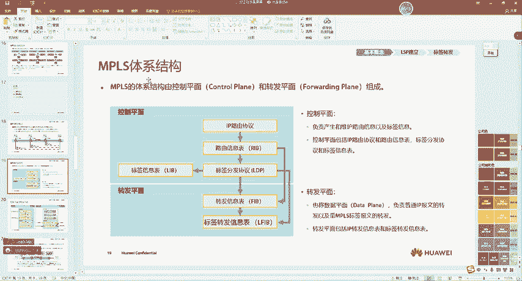

嗯，什么转发概述啊。这些我们下节课再来讲吧。好吧，今天就讲这么多啊。😊，嗯，大家有没有什么问题啊？呃，有没有默认路由类似的标签？默认录音，这个我还真没注意过啊，这个没有应用长景啊，小白白。这我没注意过。

理论上倒可行，但是我没有去做过。没见过这样的场景啊。好好，对，根据录由表自动形成的。嗯，课件在本咱们群里有一份啊，详西嗯，你看百度网盘或者翻翻权文件啊，我记得有个什么。😊，什么IE资料或者啥的。

你找找啊。一般用的动态吧，静态啊，对，一般都是动态啊，静态基本没有用。PD在群里啊在群里。特殊特殊标签，咱们得用下节课讲到LDP的时吧，嗯才能够见到。就你手动配，不让你配特殊标签啊，手动配不了。

下节课有LDP啊，然后我们通过LDP去做的时候，让你看那个特殊的。能给路由器物理接口分标签吗？那不行啊，不行。现在都是基于IP的啊，都是基于路由表的啊，就路由条目啊。好吧，他的FEC就是路有条膜。

你像刚我们说的，就理论上支持什么DICP啊，什么原IP啊这种。嗯，但是我之前查过设备的命令啊，没有，就厂家之间都没有实现啊，就标准定义的有啊，但是厂家都有一个默认的啊，大家都是走的路由。IPU6有异。

他俩之间没什么关系啊。😡，就你MP4转发，你MIPU6，它不是为了解决转发效率的问题啊。😡，越学习，越无知同学。好吧，IPU6是因为你IP地址不够用了。嗯，他俩之间没什么关系啊。好吧。

你找找啊这个谁网络技术顾问同学有PPT啊。嗯，我给大家找一下，因我印象中我之前传过一份吧。啊，好像在这个群里是吧？哦，在这群里有一份。你是不是在另一1个1157圈？好，大家下载一下啊，这个就是课件。😊。

啊，对，也可以分配。这个讲到MPSVPN的时候会见到啊小白白。😊，屋里口不，你那是接口安全，这样不行啊，不行。他有自己的逻辑啊，就是基于路由的。不能直接用接口啊。你要是点到点的接口。

这种串口线理论上还可以啊。你意思不配下一跳，只配接口是吧，是这个意思吗？😡，你要点到点的接口，理论上还行啊，但你我们都以太往口，你不能只配出接口啊，你还得吓吓一跳。😡，以太网口，你从这接口出去。

可能还有其他下一条。点到点倒可以啊。像那种串口看。啊，这个是可以的。标签本地为一就好了。对，没错。能更改FEC的种类吗？啊，不用这个理论上是有那么，就是我们可以用其他类型的FEC啊。

但是呢我之前去查找过华为的设备配置命令啊，嗯没有见过这样的命令。能懂吗？就是可能在官方文献的定义中是有的。但是呢。嗯，没有面俩啊。对，没有面令让你去配。这可能就是行业内的一个潜规则啊。啊。

我给大家举个例子，就这个ESP呢。早期的时候，官方都没有定义啊。啊能懂吗？这ESP早期的时候，官方没有说作用。😡，啊，但是呢厂家之间呢都做了QS啊，这就是相当于一种行业内的潜规则。

是吧就相当于什么一样呢？啊，你要跟别人学东西。😊，那。没有官方定义的对吧？啊，你跟着别人学呢，你要去啊，比如说送些礼物啊，对吧？嗯，比如说大家工作的时候可能没基础啊，有老师傅带你。

对吧没有这种什么官方定义的，就是你老师傅带你，你就得给他什么给他什么对吧，或者说给人家送礼啊啊，逢年过节去看看，没有啊吧。但是在行业内呢，有一种潜规则就是别人在教你对吧？呃，你逢年过节呢带个礼物去看看。

这个实际上很正常。😊，能懂这意思吧？啊，就大概类似于这种。你像这个ESP呢？啊这官方文献中呢他就没有定义啊，但是被厂商呢都作为Qs进行使用了。但现在已经被定义好了啊，以前的时候都没有说过。

官方都没定义它的作用。好吧。那就跟刚刚我们所说的一样啊，这个FEC的分类呢有很多种方式啊，但厂商实现的只有基于路由的啊，就其他的都没做。FEC怎么看，就你display mLP就能看到啊。

在这里不有个FEC吗？😊，可以看到吧。啊，对，厂商没有开发。呃，就是为物理接口生成表现。为物理接口生成标签。啥意思啊，你。你的意思是不配这个吓一跳吗？还是说从这个接口发出去的数据都在这个表签。

你意思是从这接口发出去的数据都代表钱是吧？是这意思吗？那个目的地。啊。😮，这不就是根据目的地产生标签吗？GS写三的接口。啊，这样不行啊这样不行。你写三的接口地址，那相当于你的FEC就是三的接口地址了。

那你访问这个地址的时候才有标签，你访问3。3就没有了。不行啊，不能直接写他借口地址啊。😊，对，没错。对，跟物理接口没关系啊。

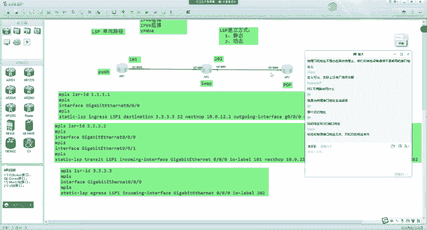

嗯，好，同学们，那咱们今天就讲这么多吧。

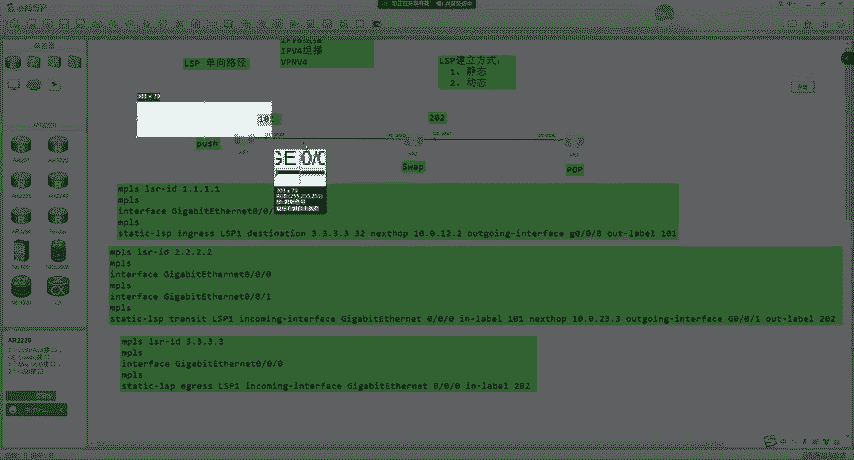

我把这个实验给大家。呃，贴到笔记里啊。

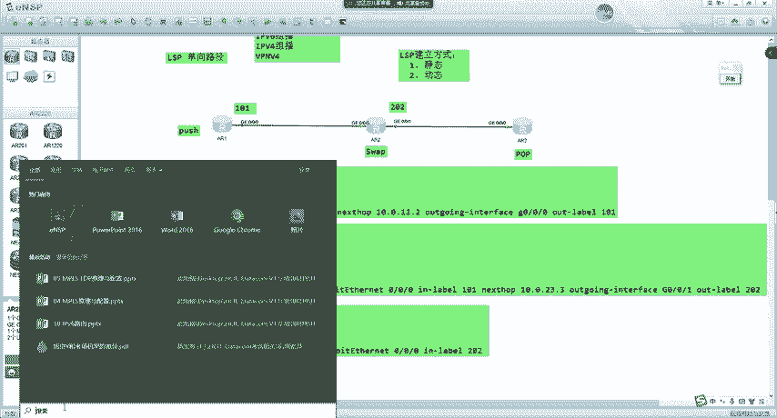

然后大家课一下也可以去做一下啊抓包看看。好吧。

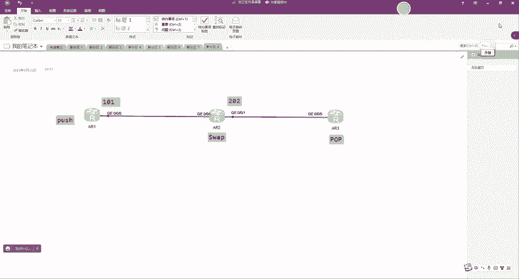

这样我直接截张图吧。

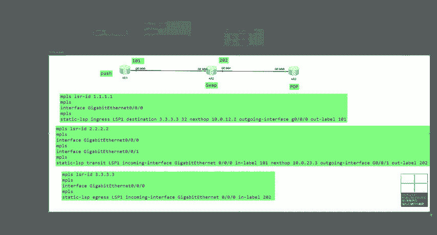

啊，有标签就走标签了啊，那个是。没有标签才会走路由啊，默认有标签就走标签了。对你可以认为标签的优先级更高一点。啊最近看抖音了没？最近没来及啊，最近老师比较忙。你待会儿10点我还有课啊。啊，可以不一样。

对可以不一样。但我们配的一样呢，只是更好的去标识那么。就更好去标识。对，没错。所以今天50就给大家结束了啊。

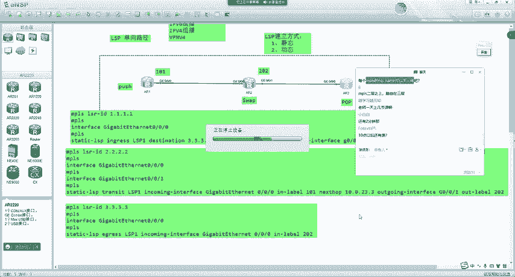

啊，你没有刷到修马蹄子的是吧？😊，嗯。🤢，我之前前段时间老刷到这个修驴蹄子的啊。

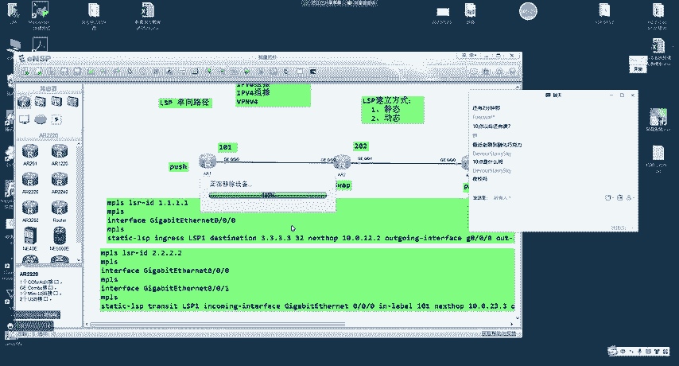

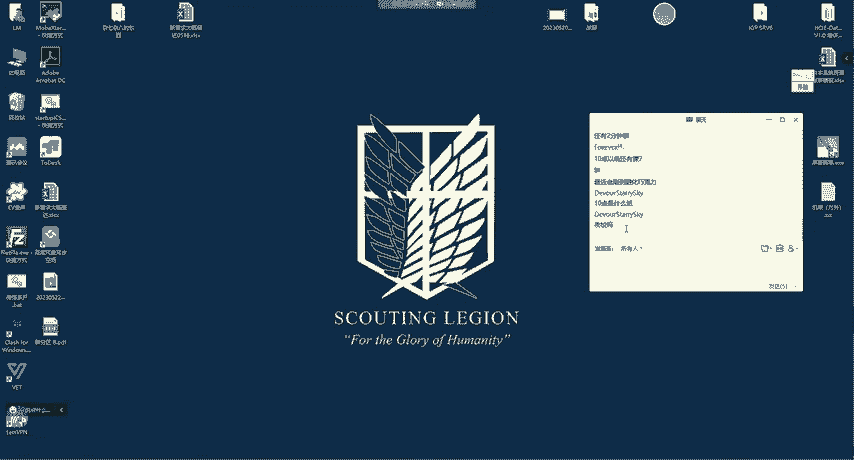

啊，待会还有课啊，备考的有考试的是吧？

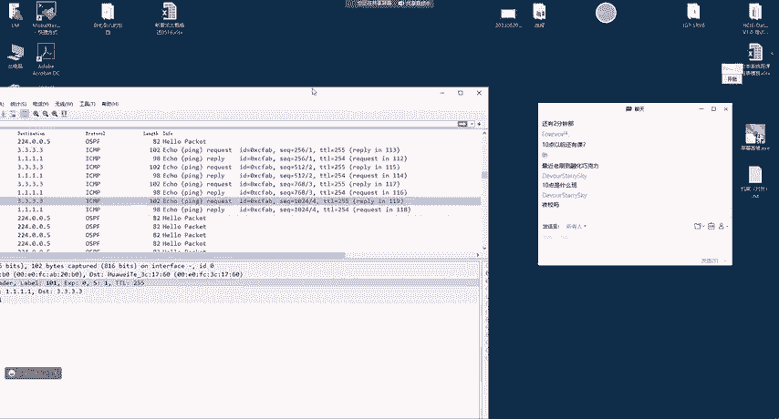

呃，行，同学们，我不给大家多聊了吧。😊，好吧，咱们今天就讲这么多吧啊。😊，呃，刚要课件的同学，现在去群里找一下啊，群里现在都有了。嗯，我们今天就讲这么多，好吧。

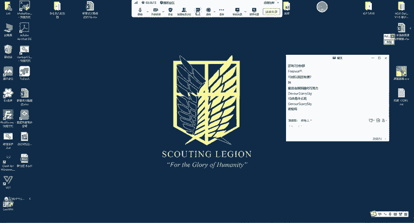