# 2023 新版华为认证HCIA+HCIP+HCIE全套视频讲解！一套视频让你从入门到精通！CCNA／CCNP／CCIE技术提升同样适用！ - P114：（持续更新）HCIE Datacom - 50.MPLS体系结构、MPLS LDP - -Book思议8 - BV1W8411A7z8

开始了啊。呃，我们依然是接着上节课内容来讲呃，接下来还是MP24啊。嗯上节课呢我们最后讲到了这个MP24对标签的一些处理动作，对吧？呃，主要是有三类啊嗯，一个是这个压入对吧？一个是交换，还有一个是弹出。

呃，接下来呢我们来看一下这个MP4的一些。呃，这个体系啊，我们把这这个来看一下，实际上这就是一个呃概念类的东西啊，我来把这个瞅一下。就是MPS。那么他也是由咱们的这个控制平面呢跟转发平面来进行组成的啊。

也就是说它也是两平面呃。在MPS的控制平面呢，他跟这个。呃，这主要的作用啊就是我们要去根据路由表去产生标签的，好吧。呃，然后在他的转发平面的话，就是比如说我们收到IP包啊，对吧？呃。

或者说收到标签报文呢嗯指导这些报文的转发。那下面是他转发平面啊。嗯，我看这张图啊。我瞅瞅啊。IIB。好，我们来看一下这里啊。那我们的MP4，它跟传统的这个嗯就我们之前接到的这个IP路由表啊，对吧？

我们说路由呢就是控制平面对吧？IB呃，FIB呢是转发平面，对吧？那之前在我们所接触的概念中啊，是由IP路由协议呢去产生路由表，对吧？呃，产生路由表之后呢，然后继而去产生这个转发表，对吧？

我们把它叫做FIB啊，呃，那对于MP4它是这样的啊，就首先呢我们在跑MP4的场景下呢，也要有IP路由协议。呃，有IP路由协议产生路由表之后，那这个路由表呢呃就是我们的这个呃LDP注意啊。

LDP大家可以理解成它就是用于建立这个LP的一个协议。好吧，就是它是根据路由表，就是把路由表呢认为是FEC。对吧那根据路由表呢，就是相当于把这个路由表作为分类的依据。

然后通过LDP协议呢去产生LFIB啊，叫做标签转发信息表。它这么一个关系啊，就是由LDP呢，他把FEC就是路由表作为分类的依据。比如说你们匹配这条路由的这个数据呢，都怎么样进行转发，对吧？

也就说我们有路由表。然后LDP呢结合路由表去产生标签转发信息表，它是这么一个关系啊。那LDP呢，它也是有自己的标签空间的对吧？因为我们之前说过啊呃，对于动态的标签空间呢是16啊，不对啊，是1024到。

反正挺大的对吧？那它是由我们的LDP就是当我们运行了LDP之后呢，在本地还有一有一个标签信息表，也就是说LDP所能够提供的一个标签范围啊。那控制平面和转发平面的逻辑呢，在我们这张图中看着就清晰多了。

我来看一下啊。首先呢我们就是运行IP路由协议呢呃跟其他的邻居去交互路由信息，对吧？呃，交互路由信息之后注意啊呃，产生路由表，对吧？那同时呢也会产生1个FIB那也就是说当我们收到了IP报文之后啊，对吧？

直接会根据FIB表来进行转发。注意啊，所以说在运行MPS的场景下，IP报文能不能被正常转发呢？依然是正常转发的。好吧，只不是我们在IP的基础之上呢，多了对标签报文的转发能力。那当我们运行了LDP之后呢。

LDP呢会和邻居就是和其他的路由器呢去交互这些标签。交互这些标签之后去产生叫做LFIB对吧，怎么样交互的怎么样去产生的这一块我们还没讲到啊，就大家知道通LDP呢也要建邻居。

建邻居跟邻居之间啊互相交互标签。交互标签之后呢，它就可以产生这个叫做标签转发信息表啊，叫做LFIB。😊，那这是在控制平面的一个过程啊。那未来在MPS数据平面，它是这样的，就是。

数据平面就不涉及到控制平面了啊呃，他这样的，就当我们收到了1个IP报文之后，对吧？我们还是用传统的FIP表来指导报文的转发。也就是说运行了MPS之后，IP是能够正常的被转发的，这个不是不受影响的。

但是比如说我们收到的这种标签报文啊，对吧？那在这时候呢，我们会执行标签报文的转发，也就是说收到一个包带有标签对吧？发出的包也带有标签，那或者说呢你把标签弹出对吧？由去执行的。😊。

那这就是控制平面和转发平面的一个逻辑啊。然后对于LSP的建立呢，我们来看一下啊。他是这样的啊。呃，就是当网络层协议为IP协议的时候，FEC对应的路由必须存在LR的IP路由表中。

因为我们之前也说过啊呃FEC呢是LOSR分类的一个依据，对不对？那他所借助的就是根据IP路由表，他把每一个路由呢认为是一条FEC对，所以说如果我们要去产生这个标签转发信息表的话。

那你一定一定要有对应的路由表才行，否则FEC标签转发表是不生效的。所以这里大家知道啊，就是你要去产生这个转发表啊，首先呢你得有它的路由。好吧。然后我们来看这里啊，RSR呢用标签标识指定FEC。

所以该FEC的数据对吧，发送到该LSR时，必须携带正确的标签，才能被LSR正确的处理。这是什么意思呢？我们来看这里啊，比如说在RE上呢。他为4。0。0。0是吧，24。嗯。他的入标签是空啊，入标签是空。

呃，然后初标签是1027好吧，然后对于二上面啊，它的入标签是1027，初标签是1026。它这么一个逻辑啊，就是R呢，它会给4。4。4。0。给他分配1个1027的标签。那么当我收到1027的标签之后。

也就是说R收到1027的标签之后呢，他才可以啊通过啊就这个接口啊，通过换成1026的标签转发给他的下一条设备。这么一个逻辑啊，就是比如说R给这条路由分配的是1027。

那么你想让这个豹文能够执行正常的转发，你来的时候必须要带1027的标签。所以大家能明白吗？就是必须要去携带正确的标签RSSR才能执行正常的处理。好吧。比如说对于某一条FEC呢，设备上存在入和出两个标签。

对吧？分别表示接收数据和发送数据时的标签。呃，以R转发4。4。0的数据为例呢，R一为R的上游啊，R一是R的上游啊，就根据IP录由表，你确定吗？啊因为I一给R2发数据，所以说I一是R2的上游。

那R3呢为R的下游啊，32的下游。为了确保标签能够被正常的嗯处理和转发，也就是说二要不要给一说啊，就告诉你。你待会呢要给我发1027的标签。对不对？因为你不说R一，他并不知道他把什么样的标签发给你。

你才能够执行正常转发，对吧？所以说呢R要给R一去说，就告诉你，我给4。4啊分配的标签是1027，你待会儿带着1027的标签发给我，我才能够执行正常转发。然后R3呢也会给R2去说，我给4。4啊。

分配的标签是1026，对吧？你待会带有1026的标签发给我呃，我才能够给你执行正常转发。好吧，他是这么一个逻辑啊，就是通过从下游呢向上游去通告标签，告诉你这条路由，我给他标签是多少。

你待会带有这个标签发送给我数据。啊，就这样的，从下游呢上上游去通告标签。那之后呢，就会在我们的每个设备上都会产生一个啊叫做标签转发表象。比如说对于IE来说呢，IE没有上游了嘛，他这这边就是IP网络了。

😊，他的入标签就是空，也就是说收到IP报文之后呢，带有1027发给2。2收到1027之后呢，带有1026发给33收到1026之后呢，带有1025发送给4对，你看四入标签正好是1025对吧，然后弹出标签。

发到IP网络中。他这么一个逻辑啊。就是在每个设备上。都有FEC跟标签表的映射。我们才能够去建立一条正确的RSP。他是这么一个关系啊。那L4P的建立方式呢，上节课我们也去嗯说到了，对吧？呃。

L4P的建立呢分两种，一种叫静态的，一种叫动态的对吧？静态就是咱们手动去配置的。呃，动态的话是我们通过这个呃产生标签的一些控制协议啊去让它呃自动去产生的呃，我们来看一下啊。😊。

静态呢是手工的为每个FEC分配标签而建立的对吧？这个上节课我们通过命令可以体现出来。那静泰的LP呢不使用标签发布协议。那这都废话啊，就是静态的RSP呢，我们不需要去运行任何控制协议，对吧？

那对于设备的这个消耗呢，资源消耗就比较少。但是呢。不能根据网络拓普变化来进行动态调整。是吧需要管理员进行干涉。那也就是说静态呢首先啊你配置比较复杂，对吧？

而且没有办法跟着网络的变化来进行一个实时的这个调整，是吧？那它的应用场景呢就是运行一些简单的小型的网络中啊，就是稳定啊，小型的网络中小型的网络中呢我们配置不是特别多，对吧？而稳定的话。

你拓扑不会发生变化。我们通过静态的方式呢嗯这个系统资源消耗的也是比较少。😊，对吧而我们在配置的时候，标签分配的原则，大家可以通过上节课的配置命令去看到，对吧？呃，就是我们的初标签值呢。

等于下一个节点的入标签值。上节课我们在123上对吧？一出的初标签是1012的入标签我们配的是不是101啊，然后初标签是202，然后三的入标签呢是202。😊，那这么一个关系啊。

就是上游的出标钱一定要等于下游的入标钱。那如果是动态的话，就是我们的下游会给上游说，你待会带有什么样的标签发给我对吧？静态就是我们手动配置，告诉这台路由器，你待会带有什么样的标签发给下面。😊。

是这么一个逻辑啊。那动态的话，我们是通过标签发布协议来进行建立的那这协议呢，我们未来学到的就是LDP协议。好吧，那LDP呢，他是负责对FEC进行分类的啊，也就是说他也是会去参考录由表。嗯。

参考路由表之后呢，每个路由啊就是1个FEC对吧？然后给路由呢进行标签的分配，在每个设备上都会去产生FEC跟标签的映射关系，从而去构建一条完整的LP而这LDP的全称啊，叫做标签分配协议。😊，好吧。嗯。

这一块大家再给大家读可能就懵逼了，对吧？这里大家只需要知道一几点啊。嗯这些图呢说着就有点虚，对吧？让你感觉听不懂。😊，呃，这里大家知道啊，就是RSP呢。😊，有两种建立方式。易龙是静泰的。对吧啊。

一种是动态的。那动态我们学到协议呢，就LDP协议啊，静态就是手动配置的。是吧啊，他运用在什么样的场景啊什么之类的，这静态的大家有印象就行啊呃，就基基本是不用。好吧。然后上节课我们讲了静态LCP的构建。

对不对？啊，这节课我们会去讲到动态啊，然后动态的话在下一个胶片里面。呃，我们把这个MP24的转发逻辑来给他。嗯，这转发逻辑回来再说吧啊。知道吧我们通过LDP啊，待会去看这个转发逻辑。呃，在这时候呢。

我们来讲一下LDP协议啊。我们来看一下啊，刚刚我们说了LP有两种建立方式，对吧？一种静态的，一种动态的啊，动态呢我们需要去借助LDP协议。呃，去完成LCP的建立。呃，首先我们来了解一下这个LDP啊。

它主要是干什么事的，首先呢它是MP4的一种控制协议呃，就是我们去构建L4P呢，要通过LDP协议呢呃去进行产生对吧？呃，这是他的工作，就是负责FEC的分类啊，标签的分配，还有PLP的建立和维护。啊。

那这个框架就比较大了。😊，对吧也就是说LFEC的分类啊，你为什么样的FEC去产生标签呢？呃，就是为什么样的路由去产生标签。😊。

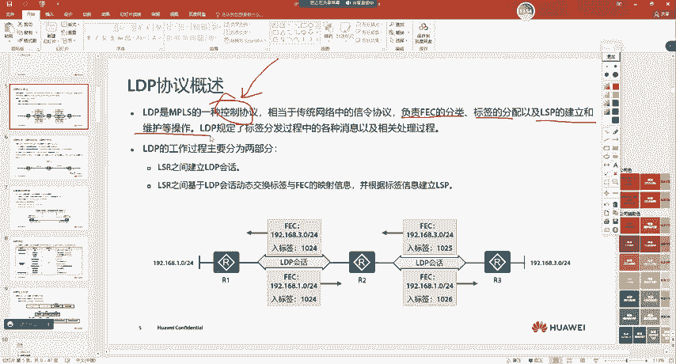

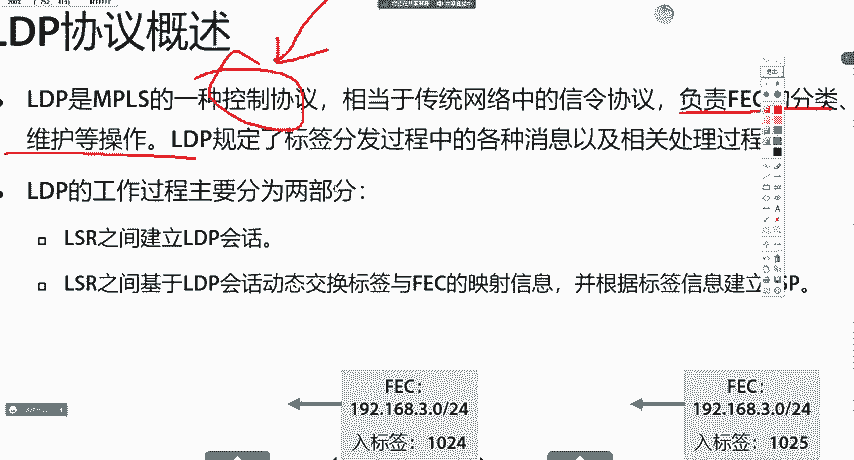

对，标签的分配，你给他分的是多少呢？是吧？LCP的建立，也就是说你的上下游之间是怎么打通的呢？对不对？呃，包括维护，比如说网络发生变化之后，是吧？LP又是怎么样进行收敛呢？😊，对不对？

那这是LDP的一个工作啊。呃，我们来看一下啊，就LDP我们在刚开始使用的时候呃，也会去建立邻居。那首先呢我们会在两台设备之间啊去做相关的配置，就是开启LDP功能。

那那时候一跟二之间呢会去建立一种叫做LDP的绘画。建立完绘画之后呢，注意啊，比如说R这里呢，它会把192。168。3。0。😊，对吧二呢就会主动朝一去说啊，告诉你3。0，我给他的入标权率1024。

那这时候对于A21收到之后，他就会在自己的转发表象中呢呃去构建一条，就是192。168。3。0。对吧呃，当去访问3。0的时候呢，我要给他打上一个出标签是1024，然后发给R。好吧，他是这么一个关系啊。

那反之对于R一身后也有这个路由，对吧？那R一呢也会给R2去说，就告诉你，我给1。0分配成1024，你待会发数据给1。0的时候呢，你要打上1024的标签。😊，他这么一个逻辑啊。

所以说LDP的主要工作过程呢就两步啊，一个是建立LDP的绘画。嗯，还有一个呢是在绘画之间去同步嗯标签映射消息。然后去构建一条RSP。那我们在LDP中间呢，也会接触到很多啊，就是LDP的概念好吧。呃。

一个呢叫LDP的绘画，一个叫临接体，一个叫对等体啊之前老有同学把这几个搞懵逼啊，嗯来给大家说一下，实际上我们一般就是说LDP邻居啊嗯没有说那么多的。😊，首先呢大家知道LDPR绘画呢是分为两种。

一种叫本地的，一种叫远程的呃，远程的是跨越三层网络进行建立的。比如说R一跟R3之间，我们直跨越了一个2对吧？比如说21个三层路由器，那12之间直接去建立的LDP绘话呢。

我们就把它叫做远端的这种远端子呢需要我们手动去配置啊。那未来在我们的学习过程中呢，不会去接触的好吧，而我们主要接触到的就是本地LDP绘画，就2个LSR之间是直连的。😊，懂吗？

那直联跟远端你在进行分辨的时候，它是有分辨逻辑的啊。远端是通过单波去建立的，而直联是通过主波去建立的，这就是他俩的区别。啊，你比如说一跟二之间，我通过单波去建立，他俩是直连吗？

他俩也不是他俩也叫远程的LDP绘画。😊，好吧，那未来在我们的学习过程中啊，咱们接触到的都是本地的，远端呢是在MP24二层未平中会去接触的啊这一块大家不用去管它。那未来呢我们是这样的啊嗯比如说还是这里。

这R3后面呢有1个3。0嗯，R一后面呢有1个1。0。那所有设备之间呢都会去建立LDP的绘画。那LDP绘画建立完成之后呢。啊，注意啊，刚开始他们会去准确来说会去发送LDB的hello包啊。😊，啊呃。

刚开始去去会去发送。嗯，LDP的哈罗邦。LDP哈罗包发送完成之后呢，他们才会去建立LDP绘画。嗯，我看一下啊这个。下面有没有讲建定过程啊？嗯。这几个我给大家讲一下吧啊，讲一下啊。实际上没啥东西啊。

也没啥用。呃，我找找手册啊。嗯，我把这几个来给大家说一下啊。😊，就是临结体对灯体呃和绘画之间的区别和联系啊，就他们之间有什么样的区别？😊，嗯，这个是这样的啊，大家知道呃。

首先临接体呢是两台设备之间互相发送哈雷消息之后呃，去建立了个TCP连接，我们把它叫临接体。😊，呃，所以说这个LDP它是这样的，我先大概说一下它流程啊，细节，我们待会再来说。

就是一跟二之间呢会首先会主播发哈lo包。主播发哈lo包之后呢，发现邻居啊会使用TCPTCP肯定基于单波的啊呃去建立TCB连接，建立完TCP连接之后呢嗯然后再去发送这些标签映射消息。它这么一个过程啊。

也就是说在一跟二之间呢，我们要去同步标签映射消息，需要有1个TCB连接。😊，对吧那连接体说的就是建立起来的TCB连接。好吧，说的就一跟二之间的TCB连接，我们就可以把它叫做是临接体。

这等体呢是指建立体TCP连接之后，利用LDP。协协议交换标签信息的两台设备。对啊？针对两台设啊，针对的是两台交互信息的设备。也就是说，如果我们站到TCP的角度去看，一跟二之间就连接体啊。

如果你站到两个设备这个角度去看呢，它俩之间就叫对等体。而绘画呢是两个对等体之间，也就是说这俩设备之间呢去交互标签映射消息的过程。比如说我们TCP建立起来之后，对吧？那TCP建立起来之后。

我们要去同步这些映射消息啊。因为你的TCP建立起来一定是有目的的，肯定要是传输豹纹的对吧？而两台对等体之间交互标签映射的一系列过程，我们把它叫做LDP绘画。😊，那联系起来到一起，他们之间是什么样的呢？

就是首先呢。😊，建立LDP的绘画必须要有一条TCP链路。那这个链路就是临接体，就是我们的TCP连接。而临接体建立完成之后呢，要去交互LDP绘画消息是吧，建立起LDP绘画。

那两个设备之间就形成了对等体关系。也就是说一跟二之间，对不对？我们去交互LDP的绘画消息，也就是说发送LDP的那些包。那这时候呢，一跟二就是对等体。😊，好吧。那最后呢。

LD对等体之间互相传递标签映射消息。好吧，所以说它是这么一个关系啊，这就是临接体对等体和绘画之间的呃区别和联系。临结体呢就是TCB连接啊，对等体呢就两台设备，对吧？咱俩之间是有关系的。

而且TCB连接也建立完成的好吧，绘画是咱们再去同步消息的一系列过程。那这种叫做绘画。那这个呢呃如果有同学懵逼啊，你也不用管它。😊，实际上用不到啊。没必要。我看课件里这里。嗯，他标了一下啊。

但是没有做其他介绍，对吧？所以说给大家说一下啊。然后我们来看啊嗯在。😊，这一块也先不用管。嗯，LDP的包也不用管啊。先不管先不管，我们先来看一下绘画是怎么样进行建立的啊。😊，呃。

首先大家要知道这个LDP绘画的一个分类。好吧，呃，就消息的一个分类啊，就是我们跟OSPF啊ISS是一样的。当我们去建立邻居之前呢啊要去发送一些报文，对吧？呃，这些报文呢有可能建立邻居的啊。

也有可能是同步其他信息的对吧？就你协议要进行工作嗯，你设备之间呢肯定要去沟通某些消息，对吧？或者说某些报文。😊，那对于LDP来说呢，它的报文分为四类，一个呢叫做发现消息，还有一个呢叫做绘话消息。

还有一个叫做通告，还有一个叫通知。那发现呢就是用于通知和维护网络中La的存在。那这里大家可以理解成就是为了发现LDP邻居的。好吧。😊，那绘画呢适用于建立和维护或者说终止LDP之间的绘画的。

比如说咱俩之间要建立绘画啊，要去协商某一些参数啊，对不对呃，或者说呢咱俩之间这个绘画之间要进行保和啊，对吧？之前咱们讲过啊，所有基于TCP的呢，都要进行cap的保活，对吧？那这种呢都属于叫做绘画消息。

通告呢是比如说我有一条路由，我给了他一个标签，对吧？我要给你说。😊，对不对？或者说呢我有一条路由，他的标签没了，我也要跟你说，对吧？那这种都属于通告消息。😡，而通知呢就是报错的啊，那这是消息的四种类型。

这时候我们再来看一下啊，邻居是怎么建立的。首先是这样的啊，就是。😊，如果在一和二之间，我们去开启了LDP之后。我大家先演示一下实验啊，待会我们再来看过程。😊，咱们来看一下啊。😊，嗯，这是一。

然后这边呢是R。一的10-0-0。咱们用10。0。12。1。呃，然后二这边呢，0-0-0。用12。2。在一这边呢，我创建1个lo01。1。1。1。然后在二这边呢，创建一个乐百0。2。2。2。

然后我们底层跑个OSPF。然后在二这边也一样。那做完之后呢，待会儿一跟二之间呢，就会去建立OSPF的邻居。呃，建立起来之后呢，他们就会去呃通告这些路由，对吧？待会儿一肯定能学到二的环油口。

二也能够学到一的环油口。那这时候呢，我们在AR机上啊敲一下MPSLSID1。1。1。1。😊，然后MPS功能开启，然后再去敲一下MPSLDP就是把LDP功能呢也给它打开。呃，打开之后呢。

我们在E0-0-0接口MPS接口下开启MPS接口下再把LDP打开。啊，然后在R2上也是一样MP24LRSID2。2。把M14功能打开，然后把LTP打开。然后再到接口下。把MP2跟LTP打开。好吧呃。

做完之后呢，我们再记0-0-0抓包啊。

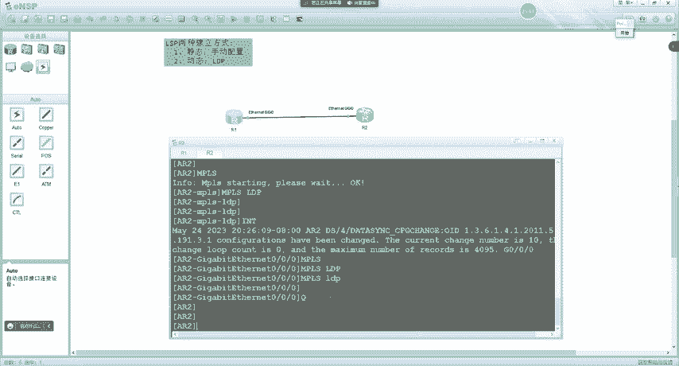

现在我们就可以去看到啊嗯，一呢跟二之间呃，他们正在呃一在发送哈lo巴尔，二还没发。😊，嗯，二还没发，我看一下啊。AR的10杠0杠0接口。MPS。2DP那也开了啊。呃，我们来看一下啊。

就是一跟2刚开始去建立邻居的时候呢，大家都会去互相发送hello豹文，对吧？R一发送helloR也发送hello，那他们俩之间呢就可以去实现嗯这个发现对方的邻居对吧？呃，邻居一旦发现之后呢。

我们会紧接着去发现啊，他们去建立了TCP的连接，对吧？那这个实际上就是LDP的连接体嘛，对吧那TCP。😊，连接一旦建立完成之后呢，我们会去发现啊他们在发送了很多报文。

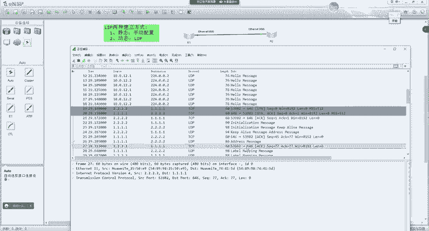

对不对？那通过这些报文呢，我们到IE上来看一下display mPSLP我就可以去看到啊IE上面就有很多的LP啊，去往2。2的。😊，对吧。那这个LP是怎么样进行建立的呢？对吧？

实际上就是当我们构建建立完LDP邻居之后呢，嗯它就会自己的自动的去建立这些LP这个或者说自动的去给路由分配标签，对吧？在每个设备上产生FEC然后去构建出来LP了，对吧？那我们主要关注的是什么呢？

就是首先要搞明白他这个邻居是怎么样进行建立的。😊，好吧，我们来看一下啊，那就按照我们刚刚的配置啊，在每个设备上的接口呃，以及系统试图下去开启LDP还有MPS功能之后。

那每个设备呢都会采用hello得注意啊，它是采用主播的方式以UDP646端口去发送hello包。😊，这里我们可以去看到啊。是用主播地址24。0。0。2UDP的原目端口646对吧？啊。

UDP啊去发送hello豹文。那这时候呢一旧会给二发二也会给一发。那两个人这个哈lo豹文一旦发送完成之后，对吧？呃，这时候呢一跟二就互相发现了邻居，对吧？发现邻居之后，这个TCP连接。

它是由谁进行建立呢？是由传输地址大的来进行建立。那这时候我们接触到一个新的概念叫做传输地址，对吧？这传输地址是什么呢？注意啊，因为我们之前再去发送哈lo包的时候，采用的是主播的方式进行发送。

而我们去建立TCP的时候，肯定是要有目的单部地址的对吧？那一个TCP连接呢，我们来想一下，比如说一向二去建一个TCP基于这个TCP连接呢，两者之间都可以互相发包。😊。

那实际上二再向一去建1个TCB就是多余的了。也就是说，两者之间呢，只需要找一个人去建立就行了。😡，就相当于你一样。是吧呃，你在求婚的时候是吧是你求婚还是你女朋友先求婚呢？嗯，实际上都行，对吧？

反正你们两个最后都有结婚啊，大概是这个逻辑啊，现在一跟二也是一样，无论是由谁去发起的TCP连接。😊，无论是由谁去发取的，两者都是可以基于同1个TCP连接去传递这些报纹的。

所以说呢一跟二之间只需要有一个人主动去发起就行了。而在LDP中呢，就选出了一个代表。那这个代表就是传输地址大的。😡，那传输地址它是在哪里的呢？也就是说二怎么样知道一的传输地址呢？对吧？

实际上他们在发送哈拉包的时候，我们打开来看一下啊，这是一发送的哈拉包。😊，一所发送的这个hello包里面呢，我们可以去看到啊哦这LDP的豹文，对吧？有1个LID是1。1。1。1版本一嘛。

然后我们打开这个豹文往里面去看，在这里有1个IPV4的transport address。😊，我们就把这个叫做IPO4的传输地址，可以看到是1。1。1。1。对呀。传输地址默认的取值是等于LID的。好吧。

所以这里大家要注意啊，这块是很重要的。就是。LDP的。传输地址。默认取值为设备的RSID。能懂吗？那比如说我在AI一上，我去配1个LID。😡，派成了11。11。11。11啊，大家大大家觉得这样行吗？

行不行啊？实际上是不行的那为什么不行呢？注意啊，因为我们的传输地址是用于建议TCP的。😡，那他取值是11。11。1，也就是说未来意味着我们的TCP要朝目的11。11。11去建立。那实际上你没有这个地址。

就会导致你的LDP的TCP连接无法建立。啊，所以说呢一般就是基于这个原则。基于这一点。那么建议。配置设备的RSID。或者说建议设备的ISID。是一个真实存在的。地址，并且路由可达。啊。

那这时候TCB连接才能够建立起来。😊，那对于二来说呢，他也会给依法对吧？那两个人互相发送之后呢，一一看你的传输地址没我的大。😊，啊，不对啊，2一看你的传输地址没有我多大，因为二的是2。2一的是1。1嘛。

对吧？所以说就会由二呢主动向一去发起TCB连接啊，去发1个SYN啊，这边有1个SYACK，再来1个ACK。😊，那这时候呢，IDP的连接体去建里完成了。😊，对吧就TCP连接建立完成了。

GCP连接建立完成之后呢，注意。呃，会有我们的传输地址较大的一方，依然是R，它会去发送1个LDP的初始化报文啊，大家可以理解成就init报文。啊，那这人地的报文里面呢会去包含一些协商的参数。呃。

比如说我的LID是多少啊，是吧呃，我的版本是多少啊，对吧呃，比如说我的这个标签分配方式啊，那这一块大家还没学过啊，就什么标签分配方式啊之类的嗯，还没学过。😊，对吧也就是说这里大家可以理解成。

就是R呢会去发送一些协商的报文。这init的报文里面呢会包含一些协商信息。当我们没有去做其他修改的时候呢，I一收到之后呢，如果协商通过。对呀，IE呢会去发送一个keep live。那就告诉你。

我这边呢啊已经接受了你的这个协商参数了。但是阿一呢自己也有初始化报文啊。对吧所以说他会把这两个包一起进行发送，就是R一他会发一个init加初始化报文。那这个报文实际上在一个包里面啊，我可以去看到。在这。

2。2呢向1。1发送了一个初始化报文，紧接着1。1就向2。2呢。发送了一个初始化报文，还有一个ke live。对不对？keep live是对R初始化报文的一个响应。

那init呢是把自己的协商参数也发送给对方。那对于R来说，如果他收到了这个init报文之后。他也会向R一回送1个K live。那么在这儿时候，我们来看啊，R呢？就像I一。发送了一个ke live。

对不对啊？那这后面这个地理消息先不用管啊，不用管他。😊，那在这时候呢，两边的绘画啊，咱俩就建立起来了嘛，正在开始同步消息了，对吧？当K live5一旦交互完成之后呢，他们就可以去互相的发送标签映射消息。

比如说我们下面可以看到label mapping。😊，是吧啊，message。那这里你打开去看一下呢，我们就可以去看到FEC。呃，有一有一个对吧，是1。1。1-32。😊，那我给这个FEC的标签呢。

我们来找一下啊。😊，嗯，在这对吧，给他分配的标签值是3。也就是说，他会把路由跟标签信息发送给邻居。那这时候邻居就知道了。

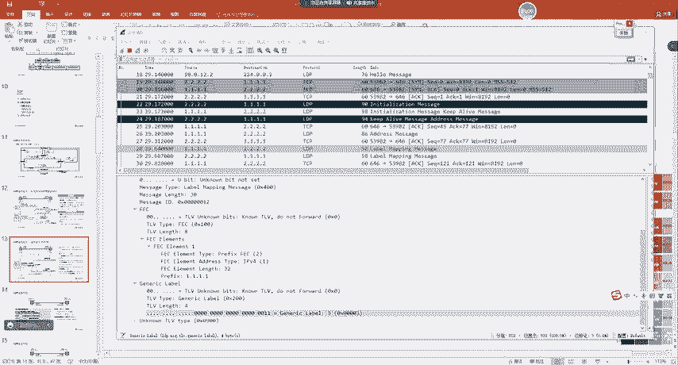

这时候IE就知道了是吧，di四play MPSLP，我就可以在RE上去看到呢。😊，啊，他去往2。2。2的出标签是3。是吧这个三怎么来的呢？就是刚R给R一发送了一个标签验证消息。是吧啊，以及对应的出接口。

那为什么会有两条呢？对吧这里我们上节课也说过。那首先呢我们去看一下这两条对吧，有什么样的不同。实际上就两种不同的角色。我来瞅一下啊。嗯，在这里我们来看一下啊，当我的入标签为空出标签是三的时候。

R一是作为engg的enggress代表什么意思呢？当我收到了不带标签的数据，对吧？给它换成三发送出去，收到不带标签的数据，你可不就是enggress嘛，对吧？压入标签，所以对应的动作呢是push是吧？

是压入。而R3呢，有R一有没有可能作为其他路器，比如说这边还有个R4。对吧R4发了一个带标签的数据给R3，然后啊给R一啊，然后R一要发给R。那这时候R一就是穿丝赛的。😊，也就是说。

R一呢可能是作为其他路径上的transite这个角色。所以说他针对于2。2呢，还去产生了一个入标签为1024，出标签为3的。角色呢是trans side的对吧？

就其他路由器经过我去访问R的那其他路由器在发送数据给我的时候，必须要携带1024的变签。然后我替换成三发送给R。他是这么一个逻辑是吧，所以说这时候角色呢，R3R一呢就是穿赛的。

所以说他执行的动作是swipe。对吧那这里也就能够解释了，我们刚刚为什么可以看到他去往R有2条LP。因为这两条LP呢分别对应了不同的角色啊，一个是eng，一个是川赛的对吧？而对于R一自身自己直连的这1。

1。😊，那RE自身直连的网段呢，它一定是Egress啊，没有其他的好吧，那对应的动作呢就是弹出标签。

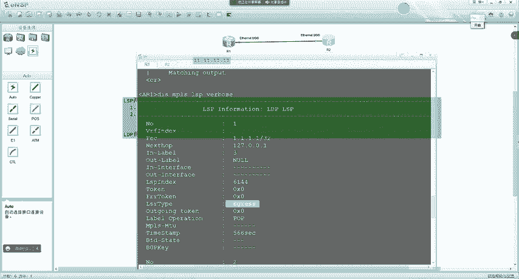

所以我们看到的这个RSP呢啊它就长这个样子。啊，那。

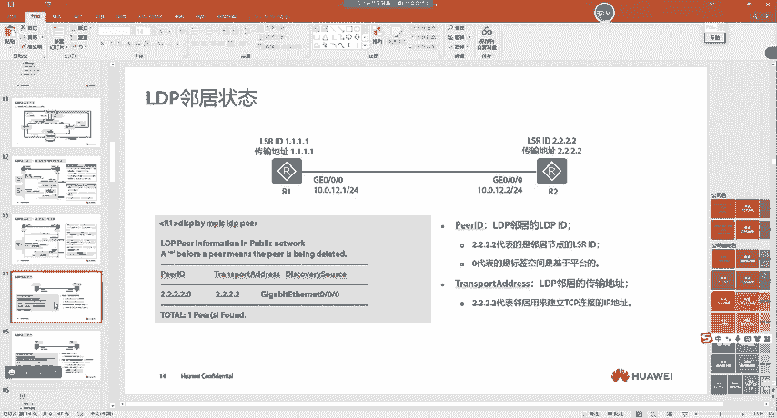

啊，后面就没了啊，后面就没了。😊，那到这一步，邻居建立完成了，对吧？邻居建立完成之后呢呃就可以互相发送标签应试消息呃，然后再去同步这些。😊，呃，这个这个这个这个。同步这个标签映射消息对吧。

产生RSP了啊。那在这里呢，我们可以去看一下LDP的这个邻居状态啊，我们可以通过diplay MP4。嗯，LDP session啊，或者说叫做LDP neighbor啊都能看。啊，LDPP。

对吧我也可以去看到呢，在这里有一个邻居是2。2。2。2对，他的传输地址是2。2。2。2。😊，对吧那这里我们可能疑惑的一点是什么呢？就是在这里是吧，零区2。2。2。2，为什么还有一个零啊。

这个零又代表了什么意思对吧？PRID啊，他又是什么意思？😊。

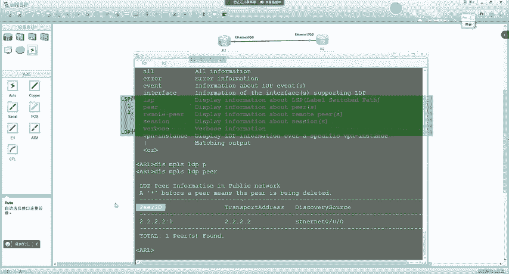

对不对？我们把这个来给大家说一下。😊，这个是在这里的，我们来看啊，那刚刚我们所看到的那个呢是LDPID。😊，是LDPID。LDPID呢是由两部分组成的。一个是LID，还有一个呢叫做标签空间标志符啊。

叫做标签空间标志符啊。那。也就是说刚刚我们看到的2。2。2。2冒号0，它是有两部分，前面是RSID后面的呢，我们把它叫做标签空间标志符。那这个标签空间标识符呢，目前我们能够见到的都是0。

早期有一种叫一的啊，就是它用来表示的是标签空间嗯，是基于平台的啊，或者说是基于接口的。如果值为零代表是基于平台的。如果值为一呢，代表是基于接口的。他这么一个逻辑啊。比如说我这有1个IE。然后这是2。

这是3。那比如说R一，我举个例子啊，以后我们接触到的啊都是基于平台的菲玲，你见不到啊。😡，那比如说对于RE来说呢，它是基于平台的。😡，那么。😡，现在呢。比如说R3呢跟R都要去访问这个1。1。1。1。

R一给R3提供的标签和给R提供的标签都是一样的。比如说我提供的是X，那你俩接触到的都是X这个表情没有其他的啊啊没有其他的。😊，但是如果是基于接口的呢，我给你上面的提供的是X，下面的提供的可能就Y了。

好吧，那未来在R一收到数据之后呢，他在处理原则上就会发生一些改变。嗯，你比如说我上面提供X，下面提供Y。当我收到了Y的标签之后呢。😊，是吧嗯，我除了看一下这个入标签是Y。嗯，他也得看一下入接口。能懂吗？

因为是基于接口的变现空间啊，就上面也有可能提供Y。对不对？所以说他还得再去匹配一下入接口。而基于平台的就很简单，就是这条路由杠32。那无论是哪个LDP邻居，我都给他提供的是X那未来收到X就直接往这转。

😊，没有其他的，就是不看是哪一个邻居发送过来的，只要是X就往这转。那未来我们所接触到的呢啊都是值为零的好吧，都是基于平台的啊啊，或者说叫基于设备的。那这里呢我们就可以去看懂了，对吧？我有1个2。2。2。

2的邻居。对他的LDPID呢是2。2。2。2冒号0。这个冒号0就说明了邻居呢他是基于路由器的啊，或者说基于设备的，基于平台的。嗯，一个标签空间范围。啊，他的传输地址呢是2。2。2。2。哇。

通过G0杠0杠0接口发现的这个邻居。那详细的信息呢，我们还可以去查看LDP的session。好吧。在这里呢也可以去显示邻居是2。2。2。28号0。对吧呃，角色我是被动的是吧？

那这里呢也就证明了R一是被动的去接受TCB连接的。是吧那在这里呢啊这里大家不用管啊，这是它的标签分配方式啊，这个我们后面会去讲到，那在这里有一个状态，对吧？啊，刚刚我看到有同学问对吧。

老师怎么没有状态啊，这些学SSOSPF都有邻居状态是吧？LDP本身呢也有邻居状态。😊，🤧嗯。我们把这个来给大家讲一下啊呃，这是LDP的一个邻居状态机。😊，好吧，我们来看一下啊，他是这样的。嗯。我瞅瞅啊。

这应该是TCP建立之前的啊，我瞅瞅。啊，TCP建立啊，邻居发现之前的。啊，我们来看啊。呃，那刚开始TCB连接建立之前啊，就是一个空的啊，大家可以理解成就是未建立对吧？就没有建立TCB连接呢。😊。

当TCB连接一旦建立完成之后呢。那么就会进入到啊阴逆的状态。好吧，就建入到init啊，这个这个他不懂没关系啊。😊，这状载机看不懂没关系啊，以前都不讲，现在我发现课件里加了啊，就给大家说一下。😊，好吧。

我们来看啊。😊，呃，当TCB连接一旦建理完成之后呢呃我们会进入到init状态。进入到init状态之后呢，主动方会去主却去发送init的报文。刚刚我们也说了，由主动方呢。😊。

就是就传输地址大的一方啊去发送TCB连接。能看到吧？好吧。所以说TCB连接建立完成之后是init。那如果我们去发送了init报文之后，紧接着就会进入到。open send的状态。是吧，所以说在这里呢。

当我们的主动方去发送了你的报文。他就会进入到open send的状态。进入到open set状态之后，我画个图啊，这11232。😊，一跟2呢刚开始没有发现邻居。对吧呃，一给二发了一个哈lo。

二给一发了一个哈lo，互相发现了邻居之后就叫做魏建立。啊，那在这时候呢，假如说二是主动方，二呢会主动的朝一去建立TCB连接。那当两者的TCB连接就三次握手完成之后。对那两个人呢都会处于在阴ite的状态。

这时候呢，两个人都是阴it的。那这时候呢，我们的主动方会主动的去发送音尼的报文。发送完之后呢，进入到open send的状态。对吧那你这个。呃，init报文呢会到达R一这里对吧，也就是说会到达被动方。

被动方接收init报文之后呢，如果协商是成功的。那我们的RE呢就会去发送unit跟ke live报文。对吧他会进入到。啊，这个这个这个叫啥来着？这叫啥open已接收。是吧啊。

叫做open receive是吧？这是一个英文单词的缩写啊，全称我记不太清了。😊，好吧。那这时候呢，他就会进入到嗯open报文已接收的一个状态。好吧，所以说在这里呢。A5状态。好吧，那这时候呢。

你的这个k live报文呢也会发送到。😡，20里。2这里如果收到了init的报文，因为你刚开始二给你发的init报文，你协商通过了，你也会把自己的init发给2。2、收到init的报文之后呢。

他就会也进入到open报文已接收状态。同时呢，对于二来说，注意。他就会去发送一个ke live。对呀，所以说二收到了init也会去发送keep live报文。啊，也进入到open报文已接收的状态。

那open报文已接收，就是当我们一旦收到cap live报文之后，是吧，就会直接转入到啊这个叫做操作状态。对吧就是LDP邻居啊建立完成了，或者说LDP绘画建立完成了，这就是一个最终状态。😊。

而在所有的状态之间。我们在刚有同学问对吧？老师协商失败怎么办？对吧？只要在任何一个阶段，如果出现了协商失败，我们都会去发送报错消息AK。😡，NK报好吧，然后就会退出到起始的状态，就跟BDP一样。

退出到I度状态。啊，这就是LDP的一个嗯状态机。那基本不会遇到啊，所以说你们嗯只需要去记一下啊，就这个状态就正常的。好吧嗯，没有其他的啊。有没有其他的？就在以前呢。嗯，这部分内容。

在以前的这个知识点里是不讲的，但是现在。呃，可能写到课件里啊，但是考试也不考。😊，所以知道有这么一个过程就行啊啊，能看懂就行。😊，好吧啊，对，其他状态都不正常啊，没错。来后我们继续来看啊。

那RDP在建立过程中呢嗯也会去发送很多包。我们刚刚看到有什么。😊，嗯。那 you need啊， keep live啊。对吧呃。刚刚看到还有这个label mapping。对吧啊。

那这些报文分别是干什么用的呢？我们来看一下啊。😊，看看一下呃，当然这是一个总览啊，就这样我们也说了，LDP的消息类型呢分为四种类啊，一个叫发现啊，一个叫绘画，一个叫通告是吧？还有一个报错的。😊，嗯。

这是他们的作用啊。呃，哈lo呢？是通过UDP进行传送的对吧？呃，所以说他作用呢就是发现。LDP发现机制中。啊，说白了就是发现邻居的啊，就是发现LDP邻居的这一这是2。😊。

对吧刚开始大家都会通过UDP24。0。0。2呢。嗯，UDP的原部端口646去发送哈lo豹文。那一跟2之间呢实现邻居的发现。啊，然后呢去建立TCP连接。

紧接着就是init嘛啊init就是用于去协商LDP邻居建立的一些参数。然后是cap live用来保持TCP的完整性啊，这个之前咱们说过啊啊，就基于TCP的连接呢，都会有ke live的保护。好吧。

然后由arrise。宣告接口地址。还有地址撤销对吧？撤销接口地址。嗯，比如说你启用MPS的接口呢，你会发送给邻居对吧？当你这个接口删除MPS。啊，就是取消MPS功能通告之后呢，也会去撤销。啊。

也会去发送FEC到标签的映射是吧，还有FEC的请求。😊，啊，这里大家可能都看不懂。啊嗯因为后面的知识点你们还没学到。啊，就是在LDP建立之后呢，刚我们说了啊，二不是主动朝一去提供这个标签呃。

以及路由的映射关系嘛。😊，对不对？那实际上还有一种方式就是可以一去查二请求，二再给一通告。那你可以主动去发，或者说别人向你请求之后，你再去发。啊。那label request啊就是就于做请求的。啊。

然后下面还有一个呃，标签的这个终止未完成的标签通告啊，标签请求啊。还有标签的撤销呃，比如说我们有1个2。2。2。2。来映射了1个S标签。那未来你这个2。2没了，是吧？或者说你把这个路由删除了。😊。

是吧啊或者说呢不给2。2分配标签了，这个我们可以通过策略去做。那在这时候呢，也要去把标签给它撤销掉。😊，对吧啊，或者说释放标签啊。

或者说报错的当邻居出现了错误之后呢啊你要把这个note face呢发送给对方。😊，那这是他报我那一个呃整体概括啊，这里也不需要去记，看一下就行了啊，这就是中华字典，你不需要去记住啊，用到的时候查一下。

😊，能懂吗？不需要去记住啊。😡，然后他把我们的封装格式啊，刚刚我们也看过了。😊，那他是这样的啊，就是除了哈喽之外，所有的LDP报纹呢都是基于TCP的。好吧，除了哈罗之外啊，都是基于TCP的。

它的格式是这样的，就是LDP豹纹呢，它是封装在IP头。然后基于上层呢，如果是哈喽就是基于UDP的。😊，呃，如果是这个其他的豹纹啊，就除了哈lo之外的，刚刚我们看到那些啊。

除了哈lo之外的其他豹纹都是基于TCP的。😊，然后在上层呢是LDP的头部。LTP头部里面呢包含三个部分，一个是版本，一个是豹纹的长度，还有1个LTLDP的ID。所以在这里呢咱们可以去看到。😊。

包含一个头部信息版本长度对吧？RSPIDRSPID呢有两部分组成LID还有LDP的标签空间，对吧？他们两个就叫做LDPID。然后下面呢是变长部分，变长部分说白了就是不同的包，注意啊，就是不同的包。

所以我们在这里看到有一个label mapping，你再往前面拉，还有什么呃初始化。😡，是吧啊，有cap live，所以说这一部分呢都属于变程字段。那每个变长字段呢，他们也都有一个固定的范围。

我们来看一下啊呃，一个叫做优比特。😊，抽里有没有写啊？这里呢也不需要去借啊，我也没记住啊。😡，我们来看啊一个叫优比特啊，叫做安孬。😊，对啊，未知的消息比特，如果收到对端的LDP报文中呢。呃。

message type字段为未知的LDP消息类型啊，这是什么意思呢？比如说这一这12。😡，对吧那一给二发送了1个LDP的包，2识别不了。😡，对吧也就是说message type呢。

它是用于标识你这个LDP的报围类型。那二发现没有办法识别。😡，当U字段为零的时候，则向原端发送通知消息。就是二呢会给一发送一个错误报告。我，告诉你这个报文呢我识别不了。对。如果对端收到。LDP消息中。

message type字段为未知的LDP类型。啊，这时候还是一样的，一给二发送了1个LDP的报文。😊，那但是呢U等于一啊，那二就会忽略这个对豹纹，忽略对这个报纹的处理。

说白了就是你向原端说不说优比特啊，就是一给二发送了1个LTP报文。但二呢识别不了。那如果U等于0。二就会给一发送一个报错，对吧？就错误通告告诉你这个报文它识别不了。如果优比特你发送了1个LDP的报文。

那优比特等于一是吧？二就不给他说了嗯，二也不处理是吧，则忽略对未知报纹的处理。好吧，然后在这里呢，type啊就是表示报怨类型的，这倒没啥说的啊。

然后刚刚我们所看到的报怨类型都是在这里用type来进行表示的。所以我们通过抓标呢也可以去看到啊。😊，在这里就有对吧？K live。嗯，init。是吧嗯。

ad message嗯label mapping message。是吧，然后还有一个呢，叫做。message IDD用来标识一个消息。我来看一下这个包啊，比如说我们这里有一个inite。

对吧嗯他的messageID等于0XSSS啊，就0X就后面就6啊。呃，然后。我们再找一下啊。还看啊。这时候呢，二紧接着又给一发送了报文。7。8。啊，我们再来找找二给一发的啊。9。能看到吗？也就是说。

这个message IDD呢用于标识是向邻居发送的报文，就是用来标识唯一一个报纹的。好吧，因为我们可以去看到啊LDP的报文呢，它可以在一个报文中封装多个消息。😊，就类似于BGP的update一样。

这1个LDP报文呢里面包含了呃init啊，标含了keep live对吧？我们通过message IDD呢去唯一的标识一条消息。好吧。然后后面就变成的啊，后面就没啥说的啊，这是一个通用的。

前面这四个部分啊是通用的，后面呢就根据不同的包，有不同的内容啊。😊，所以咱们可以去看到啊呃每1个LDP报文呢，我们这时候对着表来看一下。😊，首先LDP报文呢。

它是封装在TCP或者在UDP之上的hello就是TUDP，其他的都是TCP的。啊IPTCP或者UDP。然后再上面呢是LDP的报纹。那在LDP报文里面呢，包含了1个LDP的头部是这一块。

LDP头部中呢包含三个内容。一个是版本。一个是PDU长度。一个呢是LDPID。啊，RDPID是这一部分啊，这两部分组合到一起。然后在LDPID里面呢。啊，不是LDPID里面啊，就是在。😊。

这头部信息里面呢，就是具体的报纹了。啊吧叫做LDP的消息message。然后每个消息呢都会有一个通用的。优比特。就是通用的头部信息啊，优比特用来标识，如果你没有办法识别这个LDP消息。

你要不要给我说的是吧，还是你自己忽略处理。😡，还有一个消息类型。message对吧，消息的长度。啊，还有一个消息ID用来标识唯一的豹文。那后面都是可变成的那这个变程呢，就是根据不同的豹纹呢，有不同内容。

对吧？hello这hello的hello里面呢主要包含的就是一个。😊，嗯，这不是哈lo啊，哈lo那里面呢主要包含的就是一个传输地址。😊，对吧呃，你像init的话，主要包含的就是自己的RSPID啊。

对吧最大PDO长度啊。嗯。这个标签通告的能力啊，对吧？当前我们使用的是DU。对吧环路检测有没有开啊呃，K live多久发一次啊？是吧45秒发一次。那像标签映射消息中呢，就是路由对吧？

FEC呢是IPV4路由。前缀是1。1，掩码是32啊，以及里面。标签呢是。3对吧，以及给他分配的对应的标签啊。然后下面这个TRV就是。抓把软件识别不了啊，对吧？位置填不去。好吧。那这些内容不需要去记啊嗯。

我也没有记过。我也没记过啊。要这什么邻居状载机，我早就忘了。不用讲。知道一下就行了啊。赵报文我也没记过嗯，我也没记过。好吧，那整体呢我们就把这个建立过程看明白啊，就是LDP邻居在建立的时候。

会有传输地址大的主动去发起TCB连接，对吧？而我们在建立的时候呢，主要要保证的呢，就是这个双方之间的传输地址是路有可达的，说白了就是这句话。😊，嗯，就是LDP传输地址呢默认取值为LID。

所以说我们在建立的时候呢，建立建ELOSID呢是一个真实存在的地址，并且路由可达。那邻居建立的时，简而言之，他的过程就是。在我脑子里啊，我就这么多呃，通过UDP。发送LDP的。hello消息。啊。之后。

有。传输。地址大的一端。主动建立TCP连接。当TCP连接。建立完成之后。对吧设备之间。将会进行。标签映射消息的通告。好吧。呃，那其他的大家如果你想仔细琢磨琢磨的话，对吧？你课下你得去看课件啊，呃。

得做实验，再琢磨琢磨好吧。呃，如果你要觉得懵逼呢，你就把这些信息过滤掉。啊吧，就有印象就行啊，因为我脑子里呢我也没有记啊。嗯。啊，对，传输地址啊，对，就是IP地址。嗯，行，这一块大家都明白了吗？

明白的同学敲一啊。😊，都没问题了吧。哎。嗯，那个不说了。MP那是它的封装啊，就是封装在二层在三层之间，能懂吗？LDP它跟MPS没有关系啊。是吧。而且这种几层的大家就不要纠结他了。

那你说DHCP它是几层啊？是吧。DHCP。他也是基于UDP的那我们不能说他是应用层。那你都VIP地址。你怎么样工作在用应用层协议啊，是吧？所以说这几层呢，我觉得大家不用纠结啊。啊，对。

川入地址大的是IP地址大的一段啊，没错。啊，有点懵逼是吧，这个很正常啊。😊，这个。是吧后面还有更难的啊，还没讲到呢。😊，后面还有很多啊。诶。所以说你们得学会抓住关键消息啊，就是我这句话。😡，能不能明白？

那其他的呢大家课下可以去看课件。是吧啊，看手册啊啊有印象就行，不需要去记啊，我都没记过。在我脑子里啊，LDP差不多就这些。😊，差不多就这些内容啊。然后其他的呢，我看到的时候就有印象了。啊。嗯。

ICMP拼一个道理。对，没错。啊，标案3我们还没讲到啊，回头再来给大家说啊。😊，还没收到。呃，行，那咱们休息会儿吧，休息10分钟啊。😊，然后咱们等到10分钟之后继续来上课。😊，好吧呃。

接下来呢我们就去讲一下。这都讲过了啊，这都看过了。就是LDP对吧？他是怎么样去建立起来LP的待会我们再做个实验啊，做个实验，先看看现象啊，待会呢再去分析一下吧，这什么标签发布方式，标签分配控制方式。

标签保持方式是吧？DODOD是吧？独立有序自由保守。😊，是吧那么多术语，对不对？前面刚刚也接触不少吧，各种消息，各种报文。😊，对不对？各种阶段。这玩意，你要想一节课记住呃，基本不太可能啊。

是什么绘画连接起对等体啊，边线空间RSPIDRSID这些根本记不住啊。😊，这需要时间啊啊大家要知道技术没有速成的，好吧，是需要时间的啊，是需要时间的。😊，嗯，但是呢我给你列到这里面的关键消息啊。

这里是大家需要知道的。好吧，因为以后在你工作中呢，可能会去遇到啊。😊，嗯，所以说这些信息呢是比较关键的啊。😊，嗯，行，咱们休息会儿吧，休息10分钟啊。然后十0分钟之后呢，咱们再继续来上课，好吧。😊。

等到9点15继续啊。好，那我们就继续啊，接着来说呃，接下来这个内容呢稍微来说比较绕一点啊，大家要认真听啊嗯。咱这一块也是有印象就行啊，我也没记过没记住。要不给大家讲，我也基本忘光了啊。

跟大家说一下啊啊就是学习上不用有太多大的压力啊。😊，呃，我们来看一下啊呃，就是在MPS4里面啊，我们刚通过一个实验呢，给大家去看到的就是一呢已经有2的LCP了，对吧？呃，比如说我在这边呢再去拉一个3。

😊，嗯，顺便再拉个4啊。嗯，咱们都拉几他。然后我们把234呢也去把MPS4啊嗯LDP给它开起来。然后咱们来看一下。有没有什么现象啊？嗯，在二这边呢，我在E0-0-1。嗯，配个23。2。

然后三次目前还没看啊，然后在。interfaceE0-0-1。MPSMPSLDP啊，然后在三这里。改一下名字啊。是那里。24。啊。然后三的E0-0杠0接口。嗯，我们把IP来配一下，10。0。23。3。

0-0-1。34。3。啊，然后请个了外0。然后4这边呢0-0-0。34。4啊。呃，在跑娄04了是了是了是。然后我们在三上呢OSPLV13。3。2有0。嗯，把所有网段呢给他通告出去，色料边也一样啊。

然后在三这边呢，我们。MPSMSID3。3。3。3啊。MP4MPLDP，然后到0-0杠0接口MPS4MPSLDP。然后0-0-1。MPSMPSLDP。啊，然后4这边呢MP4LRSID4。4。4。4。

MPSMPSLDP然后0-0-0啊MPSMPSLDP。对，然后我们来山上看一下di四playOSPFP brief。嗯，0-0-0接口建筑邻居，但是0-1没有，我们来瞅一下是不是哪配错了啊。嗯，34。

3。4的10-0-0。IP4的接口地址是不是配错设备了？啊，派他G0-0杠0安 doIPOdress，然后interfaceE0-0-0。IPU address10。0。34。4。啊，再来看一下啊。

对吧呃，现在我们的这个三上呢跟二跟4都建立邻居，对吧？然后我们来看一下一啊，一上面呢可以学到4。4的花园口路由。然后我们去看LP的话，我们发现有4的RSP啊也是有两条，对吧？呃，一个是川赛的。

一个是eng。那比如说我在一上呢片杠A1。1。1。1到4。4。4。4。😊，啊，然后我们现在去抓包来看呢。嗯，这样啊，我不杠一了1啊。骗4。4。4。4好吧呃，然后我们现在抓包来看啊，看一下这个报文。

那现在我们可以去看到啊呃，当我们去访问4。4的时候呢，它自动打上了1个1026的标签。

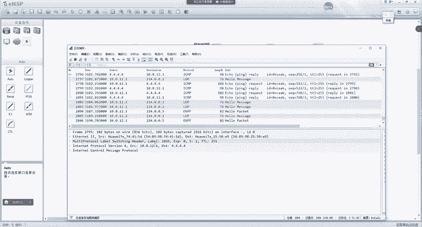

对吧那这个1026怎么来的呢？就是我们可以通过DMLP呢，可以去看到出标签是1026对吧？现在RE呢是一个enggress。对吧那他把1026发给2那二收到这个报文之后呢。

diplay mLP收到1026换成1026从G0-0-1发出对吧？然后这个报文呢就发送给了33收到这个报文之后呢，他收到也是1026嘛，对那三收到1026呢嗯换成3对吧？然后转发给0-0-1对吧？

这个三回来咱们再说啊，现在大家只需要知道就是他是按照这么一套流程，就是在每个设备上呢都会去看LP对吧，根据入标签，那换成出标签，然后从对应的接口转发出去。对不对？

那这时候我们可以去看到啊R一在去聘R4的时候呢，所以它会有一个出标签值。对是1026。呃，那当R4给IE回包的时候呢，我们来看一下这个replay报文啊，就是4。4到10。0。12。1。

我们发现是没有标签的。对吧那这是为什么呢？是因为在R4上，他如果去回包的话，他的目的地址是10。0。12。1，对吧？那10。0。12。1呢没有。标签对吧？没有LCP表象。

它只会根据普通的IP路由表来进行回包，所以说回包是没有标签的那这里我们就涉及到了一个问题，就是什么样的路由才会去建立RSSP。对吧我之前说每一个路由就是FEC的分类与依据，对吧？

那它是通过路由呢去给路由呢分配标签，对吧？从而去建立起来LCP。那这个什么样的路由才会去建立SP呢？我发现并不是所有路由都去建立的。😡，对吧实际上在华为设备里呢，就是华为设备啊，但这只是局限于华为的呃。

默认指挥为。主机路由构建RSP表箱，就是说为主机路由建立RSP。只是主机路由啊，主机路由就是我们那些杠32的。但是这个主机路由大家要记得，那我们的设备上我们会以发现啊，环回口路由是杠32的。

但是比如说我在G0-0杠0接口配置了1个IP地址，它自动的也会生成一条这个IP地址的主机路由。那这种是不会构建的啊，这里大家要清楚。😊，好吧，那这个主题路由呢是不包含。设备。自身。接口IP。产生的。

主机路由。好吧。他是不包含自己，比如说我们给这个设备配了1个34。4对吧？它产生了一条主机路由，那这种主机路由不算啊，只是环回口这种。所以说他默认只会为主机路由建立LP那这个策略呢，我们可以去改啊。

这里给大家说一下这个命令。那但是呢一般我们不会去用啊，就是你在M4视图下呢去做LP的触发建立策略，那这里呢可以为所有标签对吧？主机路由或者说带有标签的P路由或者说都不见呃。

或者说呢只为匹配前缀列表的路由去构建默认呢它就有一个hos。所以说我们配上ho如果你就看不到了。😊，能懂吗？那比如说我们可以去配成奥来看一下现象，但是一般不会去用它啊，这里给大家说一下。

只不过我们现在呢是配一下奥哦，给大家去看一下现象。😊，那当我们配置完之后，在AR1上diplayMPSLCP呢，我们会发现呢，针对于12网段23网段对吧？呃。

34网段都去建立的23呢有一个enggress有个trans side对吧？34也是ing跟川 side对吧？由于12是AR1直连的，所以说它只能是ingress。😊，对吧所以这里呢我们可以去发现啊。

就是华为设备呢只会默认为主机路由构建LB。但是这个触发策略呢，我们是可以进行修改的。完。然后现在呢，我们再回本原来的样子啊，改成host。然后再到IE上displayM22LP对吧？

这个LP就回归了呃原来的样子。对刚刚我们可以去看到啊，当我们在所有设备上都去开起LDP之后呢，他们去建立LDP的邻居，对吧？所以说我们可以通过play4LDP去查看LDP的邻居关系。

那当LDP邻居建立完成之后呢，他自己就为主机路由已经在全网就是只要他有的主机路由啊都去构建了一个LCP表象对吧？那他是怎么样进行建立的。接下来我们要说的就是这些对吧怎么样产生出来的吧LDP邻居有了之后。

他怎么样就去哎把这个表象建立起来了呢？对吧？然后我们转发的时候有标签了呢？对不对？所以说我们接下来要说的就是LSP的嗯不对啊，就LDP标签的发布和管理。😊。

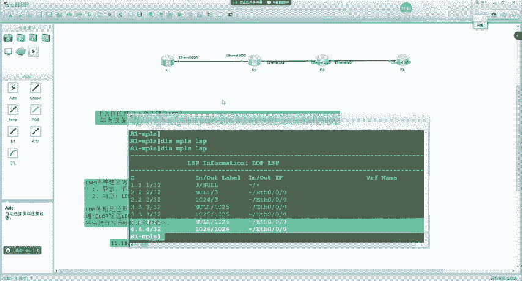

呃，那这个标签的发布和管理啊，就是在LDP中有3个嗯。呃，或者说三个内容啊啊来进行控制的一个叫做标签的发布方式啊，一个叫做标签的分配控制方式，还有一个叫做标签的保持方式。一共是有三部分内容啊。

然后我们来看一下啊。😊，嗯，首先我们来说的是这个。标签的发布方式。好吧。嗯，首先我们来说这个啊，那在说标签发布方式之前呢，就这三个部分我们要在学习之前呢呃首先要明白一个什么是上游，什么是下游。😊。

我们来看一下上下的关系是怎么样来进行确定的。MP24的上下游很简单啊，就是根据数据流的发送方向来进行确定的。好吧。这个标签报文呢就是数据啊，它一定是从上游发给下游的。然后下游收到再发给他的下游。

所以我们站到不同的设备上呢，如果站到R2设备上，R一就是R的上游。如果站到R一的角度来看呢，R2就是R一的下游。😡，啊，站到R3的角度来看呢嗯R3呢就是R的下游。啊，如果站到R2角度上来看呢。

R就是R3的上游。😊，这个应该很好区分啊很好区分。好吧，那这个区分的方向呢就是数据发送的方向。啊，就是比如说我们去访问3。0，那这不就一台RSP嘛，对吧？谁是上游，谁是下游。😊，那这个很好区分。

那如果这里边是个1。0，对吧？如果我们站到1。0去看的话，那上下一关系就颠倒了。😡，好吧，所以这个大家能明白吗？明白的同学敲一啊。😡，没问题吧。这是很简单的啊，那上下游我们看明白之后呢。

接下来我们要说的啊，就是稍微比较复杂一点的，就是标签的发布方式。😊，在LDP中呢，有两种标签的发布方式。那一种叫做下游自主，一种叫做下游按需。我们一般把它叫做DU或者DOD默认是采用的DU的方式啊。

那DU是代表什么呢？我们来看一下啊。😡，嗯。标签的发布方式他是用来控制，就是我们给上游发标签的时候，是上游请求了我们再给他，还是说我主动就给他？😡，对吧那DU呢，它代表的是对于一个特定的FEC。

不需要接收的，无需上游。获得啊标签请求对吧？即可进行标签的分配与分发。就是LSR呢会主动的将FEC捆绑的标签通告给自己的上游，不需要邻居再发起请求。所以说DU很简单啊，一句话就是我主动给上游通告。😊。

比如说这时候呢，我的触发策略是为所有的主机路由。现在R3有个主机路由，3。3。3。3-32。😡，是吧。那R3呢就会主动给他上游R去发送。我给3。3的标签是X。那R呢也会主动的朝一去发。我给3。

3的标签是啊也可能是X，也可能是Y，对吧？就每个设备都是独立的。😡，对，那这种是DO，就是你主动给上游去说，你给大家标签是多少？😡，那如果是DOD呢。他是这样的啊，就是比如说RE要去访问这个3。0了。

😡，那么在这时候R一没有标签，没有标签怎么办呢？他给R2去发送一个请求。那这个请求就是刚刚我们所看到的报文里面的一个。😡，请求FEC的标签映射叫做label request。啊。

当然这个包大家不用去关注啊。😊，就是对于IE来说呢，他就会发送一个请求标签的啊一个报文。到R这里之后呢，R就会朝I一去通高。所以DU跟DOD大家搞明白了吗？明白的同学敲一啊，没问题吧。

先把几个简单的搞明白啊，待会我们再来看组合的。😡，好吧。然后我们再来看啊，这里我们会产生一个问题。什么样的问题呢？就是老师啊R一向R2去请求了。但是这个网段在R3上啊。😡。

是吧R一向R请求是R立刻就给他了，还是R再向R3请求R3给R2R2再给R一呢？😡，对不对？😡，这里我们就产生一个问题，是他直接给呢，啊，还是他有了下游给他提供了之后，他再给呢，对吧？

那这里是由什么来进行控制的呢？它是由标签的分配控制方式来决定的，一种叫做独立，一种叫做有序，我们默认采用的是有序的。😡，那独立跟有序的区别是什么呢？我们来看一下啊。😊，独立是这样的。嗯。

就是本地L啊可以自主的分配一个标签绑定到FEC并通告给上游，而无需等待下游的。对，比如说在这里R一去访问R4了是吧？呃，这里是DU加有序啊，加独立啊。那这里代表的是什么意思呢？比如说。😡。

这个四他没有把标签给3吧，现在还没有是吧？但是呢R3已经有4的路由了，就是4。0的路由。在R3的路由表中有R3呢就会因为它采用的DU，它就会主动给R通告。😡，能不能明白？那R呢也会主动给IE通稿。

那主要我们关注的是什呢？关注的就是R3。首先，DU代表的什么意思呢？DU就是R3主动给R通告。😡，那独立代表的什么意思呢？就是R3没有收到R4的，他也可以向R通告。对吧那区别在哪里呢？区别在这里注意啊。

我们来看下面的啊，就可以看出来区别了。😡，如果我们采用的是DOD加独立。他是这样的，R一向R2请求之后。R就可以向IE通告。R2向R3请求之后呢，R3就可以向R通告。但是R4有没有给R3啊。

有没有是不是没有啊？对不对？那也就是说我们主要关注这一段DOD代表的是需要去请求。独立呢代表没有收到下游就可以去通告。R向R3请求了，R3的下游没给他，对吧？那这时候呢，R3收到请求了，才去通告。

这种叫做DOD对吧？那R3下游没给他，他也可以去通告，这种就叫做DOD加上独立。那这就是他们两个的区别啊。好吧，这个看明白了吗？😡，明白乔一啊。没问题吧。太乱了是吧？所以说这个就有点绕啊。

我再给大家捋一下啊，再捋一下。😊，不用记住啊不用记住，你只要看懂每个规则组合到一起，你自己就明白了。😡，我告诉大家，就是比如说我现在老师我都没记住，但是以前我学过。😡，是吧。我现在告诉给大家啊呃。

首先呢我看到有DU了，对不对？看到有DU之后呢，我就知道了。😊，啊，第由是。嗯，主动给上游发。是吧那我们以阿三为例，他可以主动给阿尔法。是吧。那么在这时候呢，独立代表R3没有收到R4的。

他也可以给上友发。对不对？他也可以给上有发。那当他们两个组合到一起，我把这个应用到R3身上，我就可以看明白了。就是R3对于这个4。0啊。R4没有收到下游通告的标签，他也可以主动朝上游通发。

对吧主动是由DU决定的。那下游有没有给他提供呢，是由独立决定的对吧？就是没有收到下游，他也可以发，是由独立决定的，发是由DU决定的。他是这么个逻辑啊。那DOT加有序他是怎么样的呢？就是。也是对R3来说。

R3现在是DOD加有序。首先。😊，R得请求R没请求之前，R3不会给他发，那这就是DOD。好吧。那独立代表什么意思呢？R4没给他R2只要向R3请求了，R3就可以给他回送。所以这两个能看明白了吧。好吧。

这就跟这个呃学数学一样道理，对吧？你学了一加1对吧？学了一减1，学了加减之后，1加1减1，你把它组合到一起不就能算出来了吗？对吧你把它拆分一下。😊，能明白这个意思吧？好吧，所以这种呢是DO呃，加有序呃。

下面呢是DOD呃，加上。这个这个这个这个这个这叫啥来着？DOD加独立好吧，好，DO加独立跟DOD加独立啊。😊，那刚刚有同学问对吧？为什么有这么多多种模式？那模式呢决定了你的场景啊就变得应用场景变得更多。

我来想一下啊。😡，DO跟DOD的区别在哪？😡，告诉我DU跟DOD的区别在哪？在哪？在岩石上。对不对？R3主动给你通告，你请求之后再给你通告，是不是延时更高啊？😡，是吧所以说DU的优势代表延时啊变得更低。

对吧？DOD呢它的可靠性就稍微更高一点。那独立跟有序是吧，独立刚刚我们看完了，就是下游没给的时候，我就可以给上游。😡，啊，那有序代表什么意思呢？有序就是反过来了，就只有说到下游的时候呢。

他才可以向上游通告。😊，是这么一个逻辑。啊，如果是DU加有序，我们来看啊DO加有序，它就是这样的。😊，就是R4给了R3R3才可以给RR2才可以给R1。对吧如果我们对比刚刚的DU加独立。

就是S可以直接给RR可以直接给R1。但是R3虽然没有收到。对吧S给R3的，它就可以主动朝上游，这种是独立的，就每个设备呢都可以独立去通告。而有序呢代表我收到下游之后，我才可以朝上游通告。😊。

而DOD加有序呢，它是R一向R2请求了。R2继续朝R3请求R3朝R4请求是吧？R4给了R3R3才能给R2R2才能给R1。好吧，那他们两个区别又在哪里呢？就是老师有序跟独立的区别在哪里呢？我来考虑一下。

如果采用独立的方式。你甭管他是DU还是DOD如果我们采用独立的方式，我举个例子啊，4。0R3给R2标签了，R给R一标签。😡，一、访问4。0带一个标签给R2发给R了。R2发给R3了。

R3有没有标签发给R4？😡，有没有？没有吧，那这种就不可靠嘛，对吧？我们把这种叫做RSP断裂。😡，啊，LP断裂会不会有问题呢？😡，是吧那实际上在纯MP24的场景下是没有问题的。只不过你发给R3之后。

R3变成IP包发给R4嘛，对吧？纯MP24场景下是没有问题的。但是如果遇到了VPN的场景下。😡，就会有问题了。好吧，但是VP大家还没学过，这个先不用关注啊，只需要知道嗯。😊，啊就是。

啊就纯MS场景下是没问题的啊，好吧。😊，那如果说我们采用的是什么呢？独立啊啊，不对啊，就是刚说的是独立啊。如果我们采用的是有序的话，有序它是这样的。😡，怎么样呢？R4给了R3R3才能给RR2才能给R1。

就相当于你办一件事一样是吧？你能给他办了这件事，你才会给他说哥能给你办。😡，是吧你让R3给R2说。😡，就是因为R给R3了，R3知道出路了，对不对？R3才可以给R说哥能给你办，对吧？

你待会儿带这个标签发给我，我能给你转发。😊，那懂吗？所以说有序就更加可靠一点。如果我们采用DU加有序，我们可以去发现啊，这种延时是不是最低的？😡，而且也不会出现LP断裂的场景。😡。

是吧收到下游主动给上游提供，主动代表延迟更低。收到下游再给上游代表呃这个LCP断裂不会有可靠性更高。😊，对吧所以说这种模式呢是华为默认的。那其他的呢嗯没有修改过啊啊，就是能改啊，但是没有用过啊没有用过。

😡，好吧。那，其他的呢就是按虚的嘛，按需的他能保证的是什么？大家告诉我按需的能保证的是什么？😡，比如说R一没有对4。0的访问需求，他有没有关于4。0的标签啊？😡，有没有？😡，没有吧。😡，没有对，没错。

那他节约的内存就更多。对不对？好吧，所以说这是。嗯，标签的发布方式，还有标签的分配控制方式呃，以及他们之间的组合是吧？一个俩嗯一共有4种组合是吧？而华为默认采用的就是DU加有序。

所以这两个大家搞明白了吗？明白的同学敲一啊。没问题吧。可以是吧。卡。家同学卡吗？也卡。啊，都卡。啊，有点。我看我量哪wifi。2楼5G。是我卡还是你们卡？声音卡现在呢。哦，我卡是吧。现在还好。

我这边没显示卡，我这个网络还挺正常啊，延迟15毫秒。是吧应该腾讯卡兰卡。啊，小电音。嗯，听着就能听吧，同学们能听吗？就是听课没问题吧。还能接受是吧？可以是吧。呃，好好好，那那咱们就将就一下啊，将就一下。

好吧。😊，应该是腾讯可堂的服务器啊，那看我这边延时是正常的，16毫秒。啊，你这个这延迟打王者荣耀都非常快啊。😊，啊，你没有卡到460是吧？前几天我打王者荣耀团战460，马上崩了啊。嗯，好。好，同学们。

我们继续啊继续。然后这四个这两个我们不是说完了吗？对吧？呃，说完之后呢，我们把这个标签的保持方式来给大家讲一下哦。呃，这个就比较简单了啊，呃，这个代表着自由跟保守。嗯，这两个标签的保持方式呢。😊。

就是这样的啊。嗯，就是我们收到一个标签呢，有可能来自下一条，也有可能来自非下一条。😊，啊，你比如说啊对于R来说，R访问这个。啊，对R3来说啊。这华课件的人。你看你看前面图。是吧。😊，他这边是目的网络。

你看这是划到左边了，把吧，一下子这个方向就调过来了。啊，我来看啊，比如说R3啊。😊，R3他去访问1。0的时候，R是他的下游，对吧？哎，那R5呢？😊，不是他的下游。那我们在通过标签的时候。

是让所有的LDP邻居去发送。二会给三标签，五也会给三标签。对吧就是我们有时候呢可能会去收到非吓一跳的标签。😊，那这个标签我要不要存一份呢？是吧？啊，就是要不要留个备备份路径呢？😡，对吧就R3A。

他要不要存一份呢？比如说我们来分析一下，如果。我们采用的是自由的标签保留方式。那么他就会去留一份。那留一份有什么样的好处呢？比如说当R故障之后，是不是我可以直接使用R5的？😡，转发到目的地啊。

这个能看明白吗？明白敲易啊。没问题吧。所以我们可以看到啊这种延时更低。对不对？延时更低。那基于我们刚学的DU的延时低。😡，加上有序。对吧可靠。如果再加上这种自由的保持方式。

就能够达到一个最低延迟最可靠的保力方案。对吧。那华为默认采用的就是这种。什么样的呢？我们来看到华为默认采用的是DU加有序加自由的保持方式。那么这个没有去改过的啊。大家能懂吗？就是没有改过的场景啊呃。

咱们未来考试啊以及实验啊都不会去遇到，是吧，工作的时候也不会去改。😊，好吧，至少99%的场景不会去改。因为你一改，你的网络很复杂。😡，好吧。然后我们再来看。那这种是自由的保值方式。

那自由保值方式它的优点是延迟更低，但缺点在于我们得消耗一点内存去储存一下这个标签。是吧。那还有一种呢，相比于还有一种叫做保守的。啊，对，要改所有设备都得改。还有一种呢叫做保守的。那保守代表什么意思呢？

保守是这样的，我们来看啊。R3呢收到了下一条R给他的，也收到了R3给他的。😊，这时候飞吓一跳，R3就不留，它不保存。😡，能不能明白R3如果不保存的话，首先它能不能节约内存空间啊，就它优点呢内存占用更小。

😡，是吧但是缺点在于哪里呢？如果R故障之后。R3要去返问目的地。对不对？他要不要给阿武发请求啊？要不要？对吧他不能直接用。😡，是吧所以说这种延时就会变得更高。对不对？所以说啊。呃，这就是自由跟保守。

他俩区别很简单啊，就是飞下一跳的标签，他要不要存？那这时候我们再来看一下整体。标签的发布方式DO加DOD啊标签的分配控制方式，独立加有序标签的保持方式，自由加保守。是吧，然后。华为默认的就是DU。

家有序家自由。延迟最低而且可靠。是吧因为我们真正在承载网上。嗯，去使用MPS4的时候，我们肯定希望有更低的延迟。对不对？因为更低的延时就代表更高的网络质量。是吧那更高的网络质量，你的客户才会变得更多嘛。

是吧？你比如说考虑到运营商，那联通移动都卡的很，电信非常快。😊，对不对？嗯，那么在这时候呢，嗯大家就更愿意买电信的，对吧？电信的，你打王者荣耀不卡，你是不是愿意买他的？😊，是吧所以说这是华为默认的啊。

😊，嗯，具体的修改命令啊啊大家可以去看看手册啊，这个我也忘了。😊，嗯，但是一般我们不会去改他。就我我没有见过工作场景中有改的啊。但是咱们现在实验也不考。没有改的。M24的出发点可不是简话转发啊，梦想。

他可不是啊。啊，你是说转发流程简化是吧，但是你在构建L。😡，这这可不算证比你学OSPF那几个LC要复杂吧，要要简单多了吧。😡，这可不复杂啊，同学们。😡，这就相当于你把每个拆分来看，你不用看他们的组合啊。

你把每个拆分来看，这就是加法，这就是减法是吧？😡，呃，乘法。啊，除法是吧，小括号啊啊大括号。就你把他们组合到一起，你只需要把每个组合到一起，你不就能理出来了吗？对每一个读每一个单一的是非常简单的。

这不就一句话介绍完了吗？😡，DO就是主动朝上游提供DOD就是收到请求才朝上游提供。😡，对吧独立就是没有下游没有给我，我也可以给上游，有序代表下游给我，我才能给上游，对吧？保守代表飞吓一跳啊，不对啊。

自由代表飞吓一跳，我可以储存。😡，啊，保守代表非吓一跳，我不出存，实际上每一个都是很简单的啊。😡，就是你把他们组合到一起。😡，但是你一理就清晰了。😡，这个大家能明白吗？明白乔一啊，这个没问题吧。😡。

对每一个本来都是很简单的，就你把他们组合到一起，对吧？一理加减乘除放到一起是吧？你只要耐心理一下，立马就出来了。😡，好吧。嗯。对他主要的简化是在转发层面上。那怎么控制平面实际上我们形成之后。

如果没有发生变化的话，控制平面就是稳定的。对不对？主要的简化就是在转发平面上，转发平面上，我们只看标签不就更快了吗？😡，是不是啊？所以我们来这时候把这个学完之后，对吧？呃，接下来是那个三的标签啊。

三的标签呢，我们先不看啊，我们这时候呢来理一下这个流程。😊。

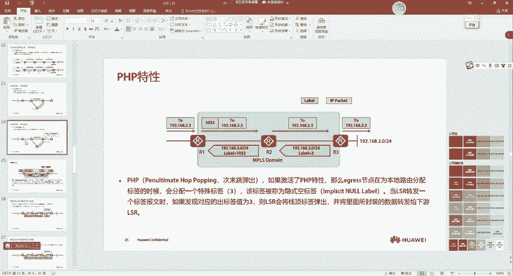

这时候呢我们把标签的什么呃发布啊，保持啊，什么保留保留方式啊，是吧？搞明白之后，我们再来看一下ARE不是有这些LP吗？对吧？它是怎么样构建的呢？它是这样的。😊，比如说因为我们默认采用的是DU加有序加。

啊，不。自由。😡，对不对？那现在。首先我们要搞明白的一个就是要大家知道的啊，就是。LP。是由。一个。触发或者说。一个人识。发起建立的。那一个 race是谁呢？就是RS4，它直连着4。4。4。

它就是一个eis，就很简单啊，就是自己直连的网段啊，你就是e个is。😊，所以说S4呢作为一个ra呢，它就会首先呢自己的本地对吧？LP的触罚建立策略。首先我把这个过程给大家说一下啊，是host。😡。

对不对？那我是hos实的，我发现呢，我有1个4。4。4。4。杠32的路由有一条ho的路由对吧？主机路由。那么在这时候呢，我发现呢。啊，这这一块就没了啊，什么DO有序，对吧？发现我是DO，对不对？

有序他就不考虑了，因为他就是一个，他没有下游了，是吧？我发现我是DO，所以说R4呢它就会主动朝上游去发送一个。😡，4。4。4。4-32。我给他的标签啊。😡，就是。我给他的标签呢是三。

我希望呢你待会儿带有三的标签发给我。😡，所以说S就会我给他的label啊是3。把这个给删了。是吧。那三也是一样的。假如说这时候S还没给3三也是怎么样呢？三发现自己也是hoss的对吧？

他们的处理是同时的啊，这个没有什么先后顺序啊。😡，三呢发现自己也有4。4。4-32的路由。为什么呢？因为他可以通过OSPF学的，但是3。😡，不是一个位。对不对？😡，三发现自己是DO。

他说他觉得我可以主动给二提供，他知道了，对吧？我可以主动。😡，给二提供，但是我一看我是有序。😡，啊，我得等到四给我之后，我才能给2。这时候虽然假如说啊这时候四哪怕都没启用，你三有这个玩意儿。😡，啊。

他也不会给二提供标签啊。假如说四这时候没开M签4。😡，他也不会给二提供。因为什么呢？因为你有序没有收到下游的对吧？但是设备的工作我们人说不明白啊，他们就是同时的，说白了就是同时的。😡。

是吧只不过我这时候给大家说个时间差是让大家好理解。😡，那假如说这时候三开启了MP4啊，四开启了MP4啊，发现了自己是hoss的，他有一条hos的路由，对吧？然后发现自己是DU。😊。

那这说三虽然没上达请求，4就主动给三发了一个。三者书呢。对吧万事俱备，只欠东风啊，终于来了。😡，是吧下一游终于给我了。我的有序满足了。对不对？有序满足之后呢，他就会给二提供。那二也是一样的道理吗？

对不对？那二之前呢，可能也是host的对吧？4。4。4。4-32。然后是DO对吧，然后是有序。二可能还在等着三呢，但是三一旦给二提供之后，二立马就可以给一提供。所以这个过程大家看明白了吗？明白乔一啊。

喂，你吧。好。那就是通过这样的方式，四给三提供三给二提供二给一提供。所以说每个设备上呢。D四类MP24LP都会有FEC。对吧。然后到一上这里呢啊都会有LP啊，MPSLP都会有。只不过他们在构建的时候。

三还要自己判断，对吧？哎，你给我了，我可能是eng，也可能是川赛的啊，对吧？所以说他会构建两条。😊，所以在这时候呢，我们在每个设备上呢都可以看到RSP。😊，但是呢对于某些目的地。

就是只要他不是Egress啊，你比如说IE对于1。1，他是Egress，他只有一条。但对于其他的网络呢都两条，一个是trans side角色的，一个是一呃这个呃eng角色的。对吧，那这样就构建完成了啊。

构建完成之后呢，我们通过P杠A1。1。1。1到4。4。4。4。那中间走的全部都是标签转发。😊，好吧，那这个标签转发我们可以怎么样去看呢？可以这样啊，有一条命令叫片RSP。😊，嗯，IP。嗯，4。4点4。

432。好，然后就完了。呃，还不是这个啊。啊，不对不对啊，这是骗啊。😊，我们叫川赛的啊。😊，川色的嗯LOSP。IP。4。4。4。4呃，32啊，然后直接回车啊，我就可以看到啊。😊。

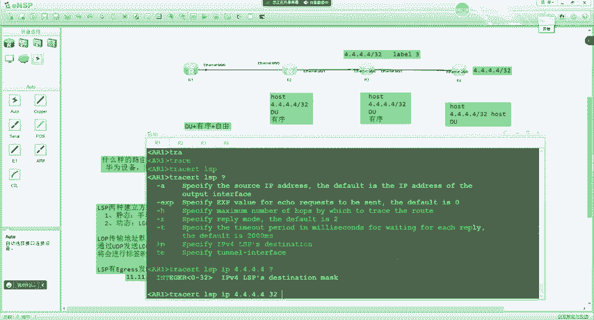

首先呢。在阿一这边。阿E呢作为ingra对吧？他给自己的下游10。0。12。2。的呃，发送1个1028，我们来看一下啊。嗯。郑音。是吧1028。对不对？呃，然后一样的逻辑啊，就川赛的呢。是1026对吧？

10的啊，不对啊啊。对对对，就是这个。然后R嘛1026。是吧然后到R3场。10。0。23。3是吧，然后出标签是3。嗯，就是这样的，你带有1028发给他，然后他带有1026发给33呢，换成三发给4。对。

然后最后到4。41个月就通了。所以我们可以通过穿色的RSP呢啊去看这个路径。好吧，但这个一般用在排错里啊。嗯，那这个我们看明白之后啊，然后再回到刚刚的课件中。😊，嗯，我们再把课件过一遍了。

大家就好好看明白了。这时候呢我们再回到第一张照片啊。😊，啊。在这啊。不知道不知道不知道不知道。😔，不知道不知道。😔，在这儿啊，我们再回到这张照片呃，咱们就能够看明白了。😊，是吧首先我们得有路由。对不对？

产生路由表之后，是不是LDP根据路由表去产生。在跟邻居交换这些标签映税消息。然后产生转发信息表啊。对不对？然后在转发群面上，我们收到IP报文呢啊就发IP报，收到标签报文呢，查找标签转发信息表。

对一个月发的是IP吧，对吧川赛的发的也是啊刷的就是标签榜。啊，然后这张图大家就有就有点体会了吧。啊，这张图有体会的同学敲一啊。能看懂了吗？比刚刚好多了吧。😊，对吧所以说刚开始看到你可能一脸懵逼。

本来是看不懂。这个东西啊就这样啊呃学习呢你就得呃不断的去过啊，不断的去过。你刚才你要一遍都看懂那。那你。那基本神了啊啊基本神了。嗯。呃，然后我们。算了下一个30说吧。这节课是。下节课吧下节课吧。

讲不完了，因为这个详细转发流程我们还没讲啊。😊，对吧像in格要去查看那些表象啊，对吧？叫做NHLFE。对吧那又是一个新术语。对不对？嗯，待会儿呢我们还会接触到一个叫做ILM。😊，又是一个新手鱼。嗯。

那这个咱们讲不完了啊，咱们今天这节课就说这么多吧。然后下节课再来讲一下这个啊就是MP24的详细转发流程，像什么FTN又是什么，对吧？NHLFE又是什么是吧？呃，ILM又什么对吧？😊。

下一跳标线转发表入标牵行车。好，那我们这节课就讲这么多，好吧，然后其他的内容呢放到下节课再说啊。😊，嗯。🤢，发呀，咱PT在全聊文件里有吧，我前几天不刚发完啊。😡，嗯。陈你阳刚发了吧。

你打开文件往里面找找啊。呃。1157。昨天我记得刚发过啊。哎，跑哪去了？哎，我怎么记得昨天刚发过啊，前天前天还是昨天？有啊，里面都有，里面是个汇总的啊，你们找找。找找啊，你面是有的。我发的14啊哦。

我再发一下，再发一下。214是吧。嗯。我再发一下啊，各位同学。嗯。呃，应该是。这一个群。对吧也有了啊。就你们要什么资料都发群文件啊，一般里面都有呃，除了查明手册我没上传啊。😡，产品手册在这个。呃。

官网上能下载，所以说大家自己下载一下。嗯，这什么PHP啊，影视空标签对吧，这些特殊标签我还没讲到啊。因为我我记得有同学私聊找我，好像想听一下这特殊标签是吧？😊，嗯，这个我们下节课就讲到了啊。

下节课就讲到了。😊，这个还没说到啊。呃，好，我们今天就讲这么多吧。今天就这么多啊。嗯。

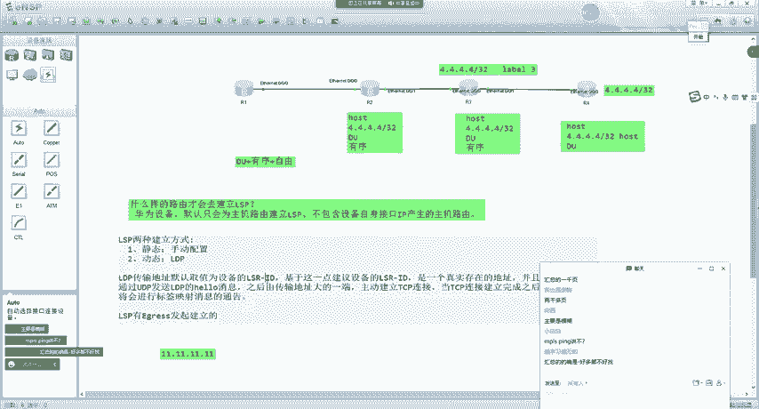

这笔记没多少啊，我给大家截张图啊，截张图贴到这个onenot。

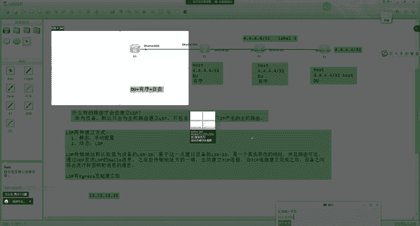

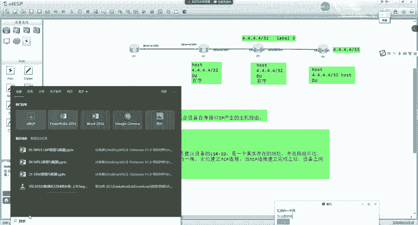

嗯，MP现就不讲了。考不到啊，这个考不到。就以前IS3。0论述的时候考到一次。现在新版本没这个东西了。呃，我以前好像讲过。那录屏我忘了放哪去了啊，你你要你那个。我就记不太清了。

我找找啊我找找这MPS不是你之前讲过。😊，呃。很久前了。应该是在。嗯，不在这儿。嗯的带com。呃。应该在这一块。好像是这节课讲的，但是我记不太清了啊，但是我好像没做实验啊，这个之前讲过很多遍啊。啊。

那估计没做实验MPSP没做实验啊这个。嗯。是讲的啥内容我也忘了。嗯。找不着啦。你回来翻翻那个啥啊，小白白。😊，呃，你回来翻翻那个产品手册吧，就里面都有，你有啥不懂的问我就行啊。啊，这个倒不会考，没考过。

好，那咱们今天就我先把录屏听一下啊。😊。

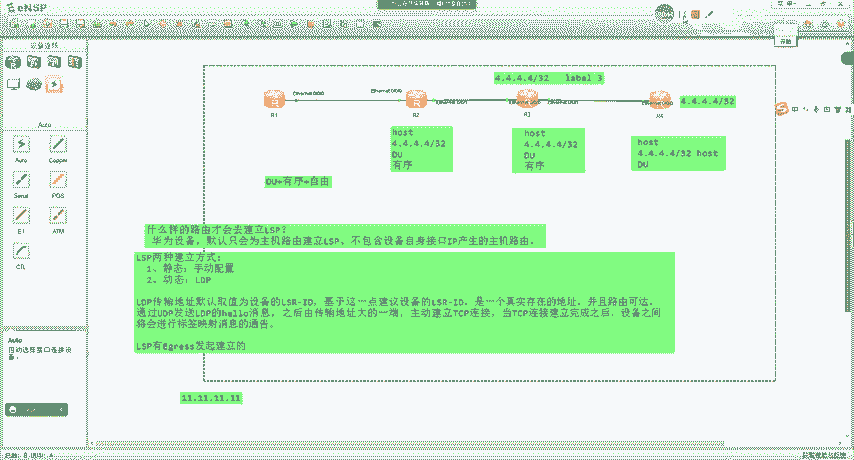