# 2023 新版华为认证HCIA+HCIP+HCIE全套视频讲解！一套视频让你从入门到精通！CCNA／CCNP／CCIE技术提升同样适用！ - P115：（持续更新）HCIE Datacom - 51.MPLS转发流程，MPLS  VP,N - -Book思议8 - BV1W8411A7z8

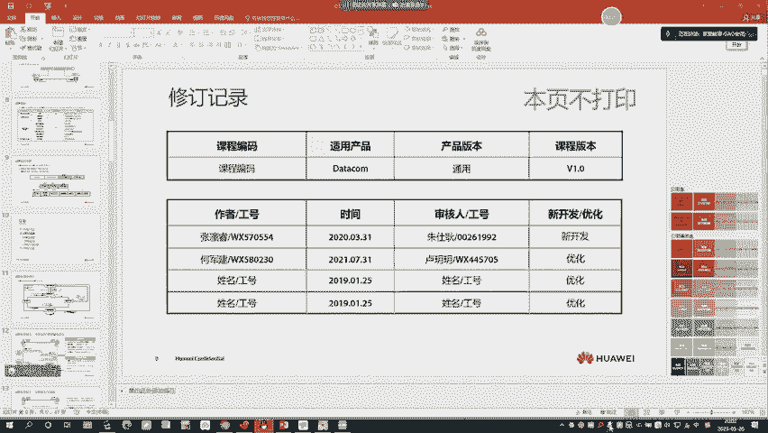

好，同学们，咱们开始上课吧啊。呃接下来要给大家讲的还是MPS的部分啊嗯。😊。

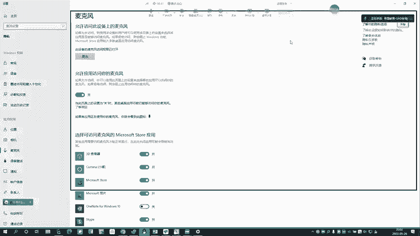

然后我们上节课讲了很多的这个术语啊，技术概念之类的，噼里啪啦的讲了一大堆对吧？呃，然后大家就按照我上节课所说的那些去记住就行了啊啊，就去记一。好吧。呃，然后接下来我们要去说的是一个MP24的转发流程啊。

我们把这个转发流程呢来给大家说一下啊。😊。

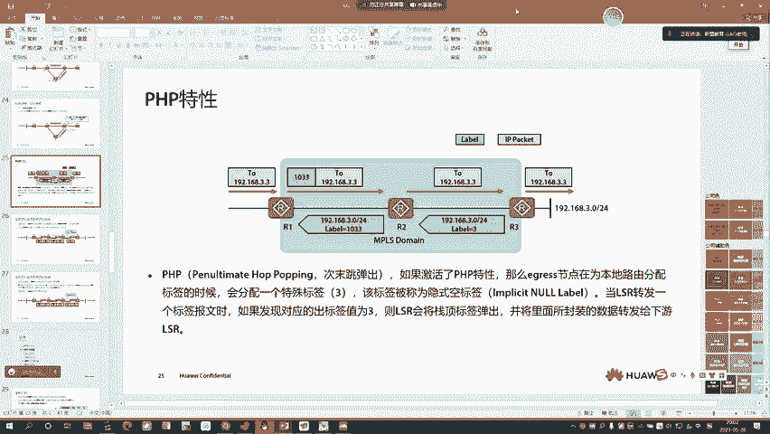

来。嗯。现在呢比如说我有四台设备啊。呃，然后这四台设备呢，我给它连接到一起。开下机啊。嗯，咱们给大家改一下名字啊，然后这是R1。嗯，这边呢我们作为R啊。然后这里呢，咱们叫R3。然后这边呢。

咱们给他改个名字叫S4。啊，4就是吧。呃，然后咱们把这几台设备的这个配置窗口给他打开。

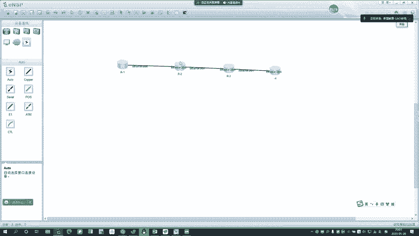

那咱们通过这个实验呢，主要给大家说一下M里面的一些转化逻辑啊。然后这是R一，这是R。

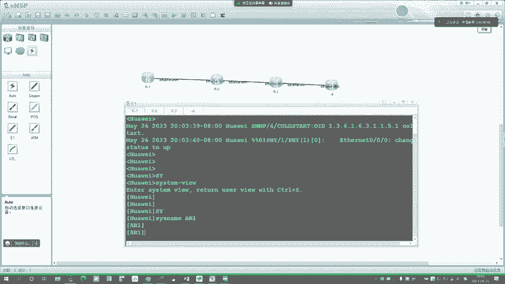

这边呢是R3。

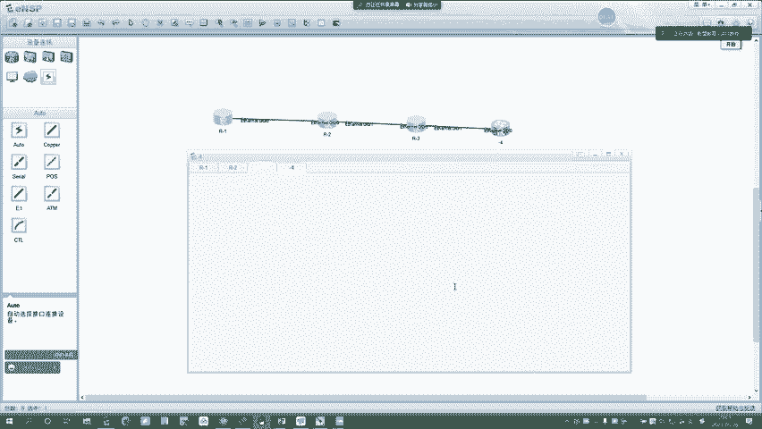

呃，这边是我们的R4，然后我们把基础IP配一下0-0-0。10。0。12。1，然后娄百玲。1。1。1。1。然后R这边呢，E0-0-0。10。0。12。2，然后E0-0-1。10点0。23。2。呃。

然后R3的E0-0-0。10。0。23。3。10-0-1。10。0。34。3。然后4的10-0-0呢。嗯，10。0。34。4。然后我们在R省几个楼板零接口，2。2。2。2。然后在山上呢。

也起个楼白零接口。3。3。3。3。啊，然后在四上呢，几个楼外0接口4。4。4。4。好吧。呃，咱们做完之后呢，去跑个OSPF啊。

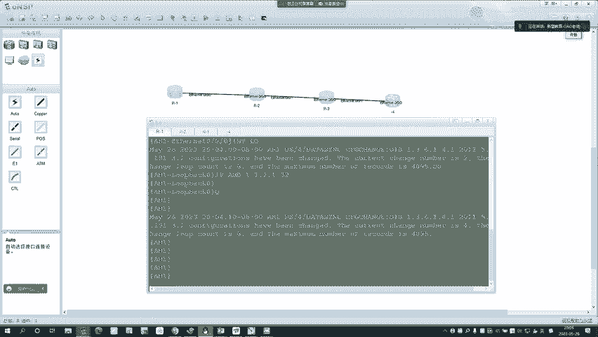

嗯，就是我们让他邻居能够建立起来OSPF1啊，入 IDD我就不写了啊。然后ar0network。

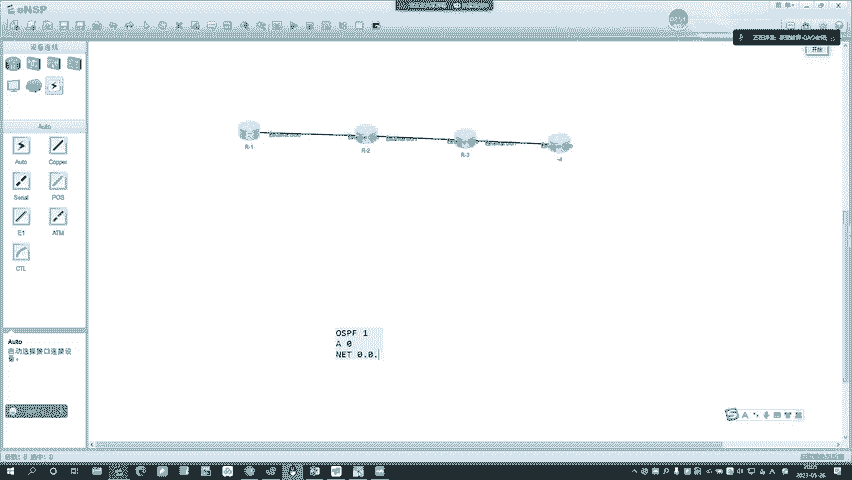

0。0。0。0。嗯，然后这边是我们的R1啊，这边是RR3，还有R4。然后起来之后呢，我们去做一下MPS的相关配置。MPSLID。

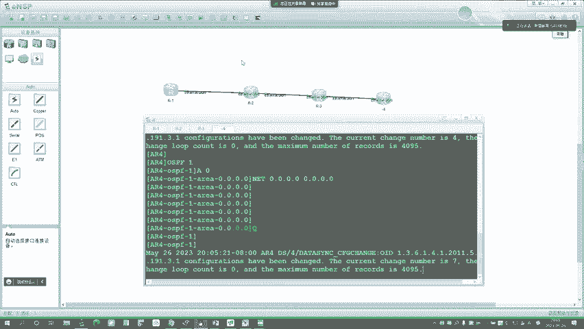

啊，1。1。1。1MPSMPSLDPinterfaceGE0-0-0MPSMPSLDP然后interfaceE0-0杠1MPS。MPSLDP。然后这是R一的。R1虽然没有0-1啊。

咱们就直接给他刷进去了啊。😊，然后这是2。2。2。2，这是R的。然后是。

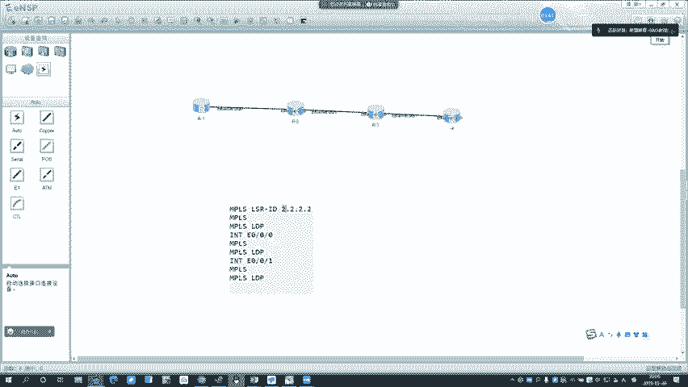

3。3。3。3，这是R3的。

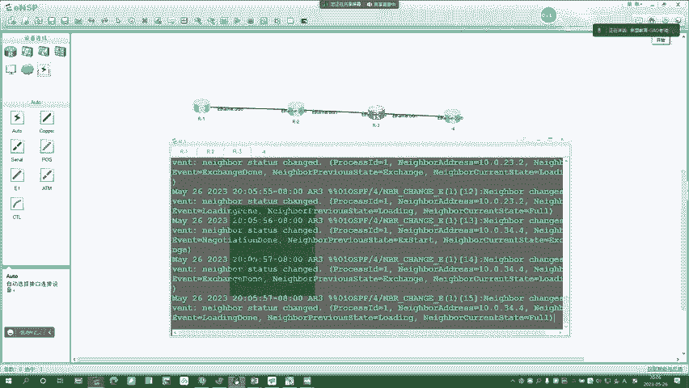

然后是。是的是的是的是。嗯。从这里删掉啊。然后这是R4的啊。

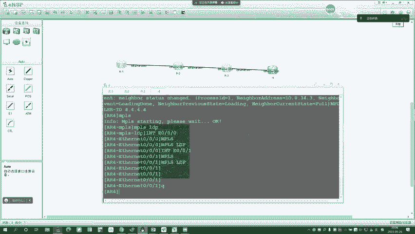

好吧，然后我们把四台设备的这个MPS跟LDP呢给它配完之后啊，我们在AR1上可以通过MPSL4P对吧？去看到它会去产生这些LP呃，那产生的逻辑呢以及过程上节课我们已经给大家讲过了啊。

那这里呢我们主要来说一下，因为上节课在最后的时候呢，我们讲了一个新概念。什么呃NHLFE啊对吧？FTN啊ILM对吧？呃，讲到了很多这个新的概念啊。呃。

然后给大家说一下就是关于这一块咱们的这个MPS的一些转发逻辑啊。😊。

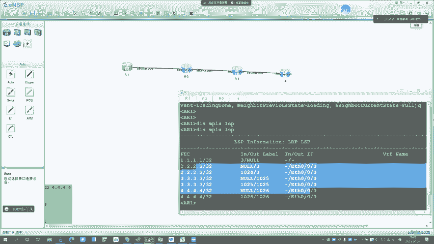

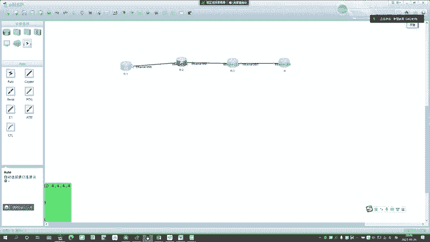

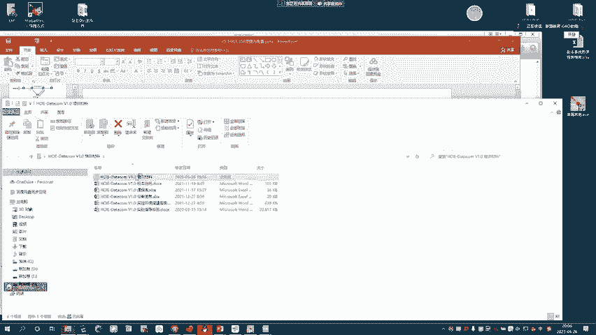

嗯嗯，那。在这里面呢，咱们有1个MP24的详细转发过程，我们把这个来给大家讲一下啊。呃，当然我们现在学的依然是MPS啊，还没有接触到MPS的VPN好吧。呃，我们来看一下啊，就是MP24的报案转发呢。

它是这样的。呃，首先呢我们会有一个呃就会有三个表象好吧，一个叫做FTN一个叫做NHLFE我们把它叫做下一跳标签转发表好吧呃，就是我们直接读这个英文呢读的比较绕口是吧？

所以说平常呢我就直接叫下一跳标签转发表好吧？呃，还有一个呢叫ILM。呃，我们把这个逻辑来给大家说一下啊，呃，当我们的一个报文呢，一旦进入到MPSS网络之后，注意啊，当IP报文一旦进入到之后呢。

我们的eng节点呢会去查看FIB表。注意啊，会去查看FIB。对不对？那这个呢就主要是我们的这个转发表。那查看FIB之后呢，他会去根据特诺IT啊来判断这个报文要不要执行MPS4转发。

因为我们之前给大家说过啊，就是MP4的转发呢，它跟IP本身是并不冲突的对吧？就是当你MP4不通的时候呢，虽然我们现在拼1。1。1。1到4。44。4。

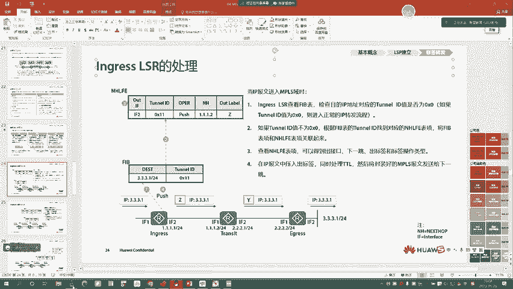

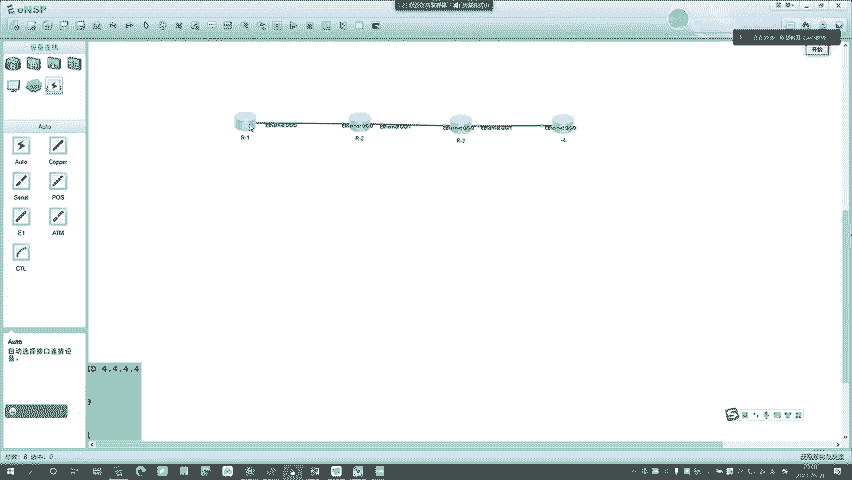

，杠吧1111到吧？虽然我们能够拼通的，当你没有M的时候也能够拼通对吧？也就是说IP跟M呢，它是在这个网络中共存的啊那我们的一个报文。

它什么时候去打上标签呢大家应该能够明白这个意思啊我们什么时候才会去走M转发呢实际上他首先要看的就是那看后面呢我们可以看到有一个东西叫 ID这个呢大家可以理解成就是一个逻辑接口啊，这个是怎么样的呢？

它是一个逻辑的隧道口那我们来想一下，就是这种隧道呢本身它就是一个逻辑的概念吧？隧道它并没有真正的物理接口跟它进行对应的吧？

我们的设备上没有物理口对应了一个隧道啊那我们的隧道呢都会有一个我们也可以把它认为是叫做接口但我们翻译过来隧道家可以认为就是接口就比说我们转发一个IP报文的时候呢，我们要从哪一个接口转发出去吧？

但是我们走隧道的话。😊。

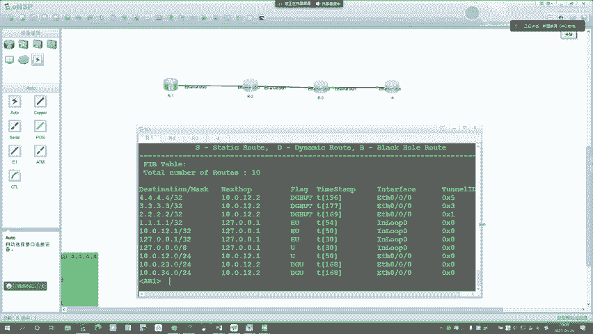

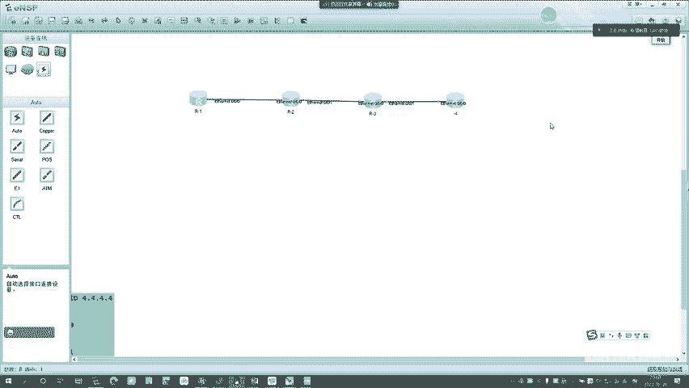

道也会有一个接口，它就逻辑上的就抽象出来的一个概念，便于大家好理解，对吧？啊，就走隧道接口。那什么样的豹纹才会走隧道呢？这里大家注意啊。😊，在MPS4网络中啊，就是当我们的1个IP包。

就路由器收到1个IP包之后，他会去看FIB表，对吧？因为我们之前说了这个框架里收到了这个嗯。

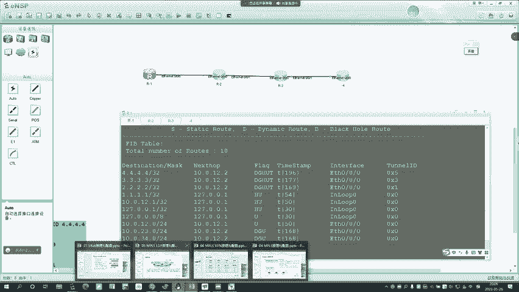

IP报文对吧？会去看FIB表。那看FIB表的时候。对吧我们看到出站报文呢，有可能是直接发IP，也有可能发带标签的报文，对吧？那他是怎么样决定发的是IP还是标签的报文呢？

他会去看这个FIBFIB在最后面呢，它会有一个通 IDD，我们可以去看到啊，通 ID对吧？有一大堆巴拉巴拉的那这里呢我们虽然看到有很多种啊，有135对吧？还有0对吧？未来你可能还有机会去看到其他的。😊。

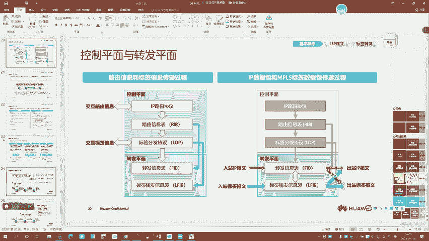

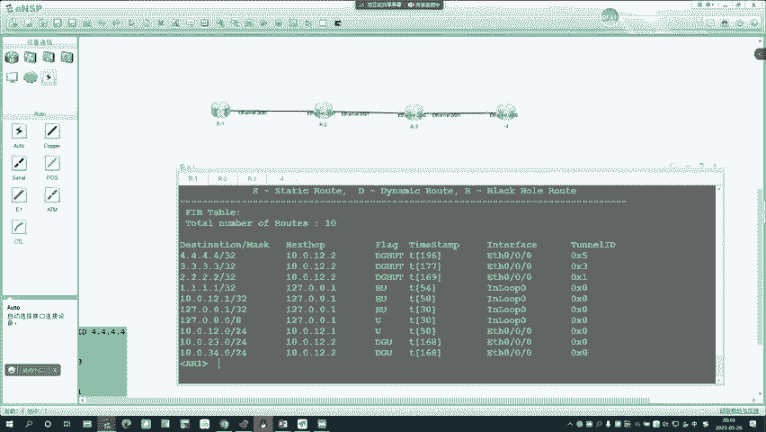

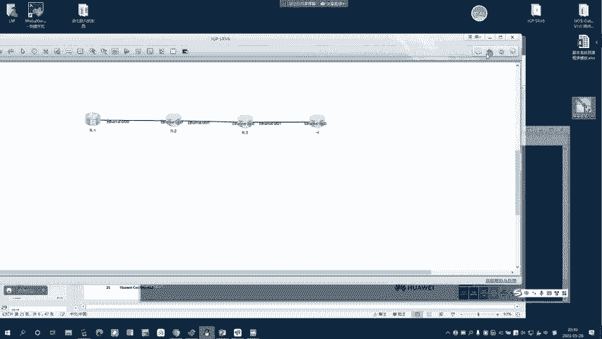

是吧呃，这里呢我们只需要去分辨啊，就只有两种通通 IDD只有两种好吧呃，就只有。

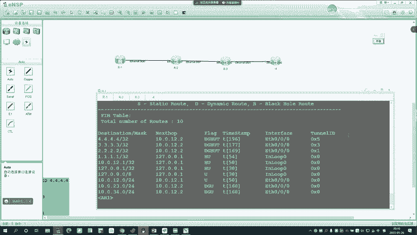

玲玲和非玲0。说白了就是零和非0。

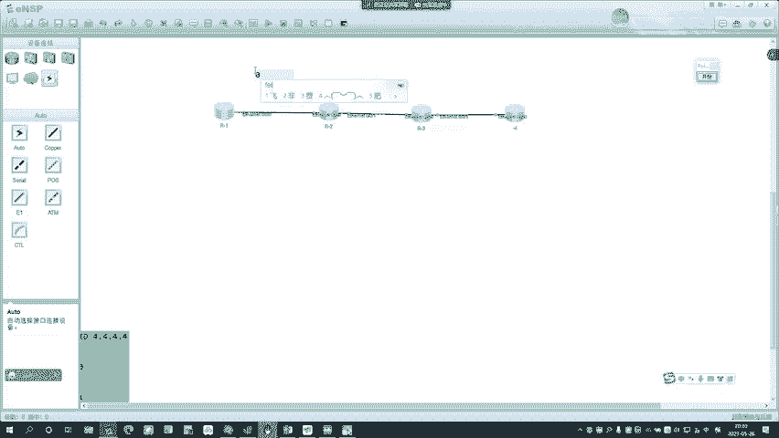

那么to IDD就只有这两种。当一个豹纹匹配了FIB之后，如果他的to IDD为0，那就是走普通的IP转发，就转发，就是按照IP路由表进转发。而如果to IDD为非零，那么走的就是MP24隧道好吧。

那是根据嗯FIB去迭代到嗯MP24的隧道中。

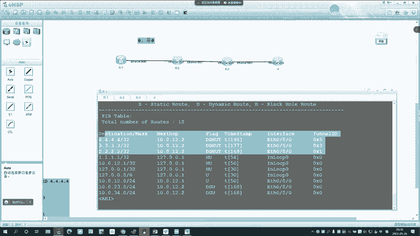

那当我们去看到这个toal ID之后，是吧？呃，如果为00呢，就是正常的IP转发。如果为非00呢。对吧啊，就要根据特动ID去查找叫做下一跳标签转发表。那刚刚我们说了，对吧？to ID为非00的时候。

你走隧道。那走隧道的时候我们就要有很多啊啊很多的什么呢？比如说你吓一跳是谁，对吧？你出标签是谁，我是押入啊，还是弹出标签。😊，对吧呃，还是交换标签，对不对？

那这时候我怎么样去呃查找这个豹文的一些标签操作指令呢？这时候呢我们会去看下一跳标签转发表啊，就是NHLF1。

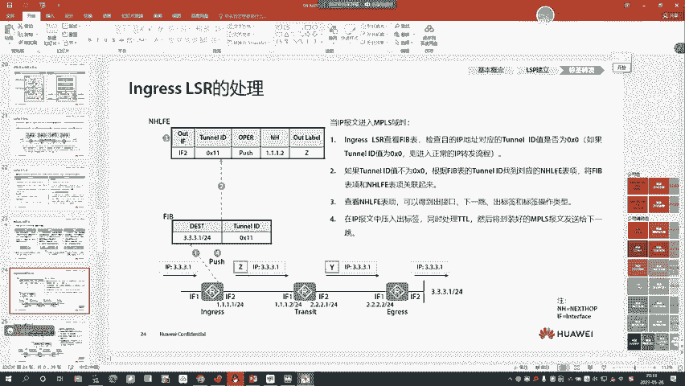

那这个表怎么样去看呢？首先大家记得啊，比如说4。4。4。4对吧，它的to IDD是0X5。那么我们再去看这个下一条变形转发表的时候，首先你要进入到诊断视图。啊，进入到这个视图之后呢。

通过display MPPS。嗯，NHLF1是吧，查看下一跳标签转发表。那这里我们就可以看到一个0X5的一个tonal IDD它是跟这个toal ID关联到一起的啊啊，这就相当于一种连接，对吧？啊。

这里通过0X5去查找效一天下一跳标签转发表的0X5，得到对应的操作指令为p压入标签。😊，好吧，那压入的是10点0点啊，压入之后啊，是发给10。0。12。2，然后押入的标签呢是1026啊，占比位等于1啊。

那这时候呢R一就知道了啊，他要去压入啊，执行一个push的动作。

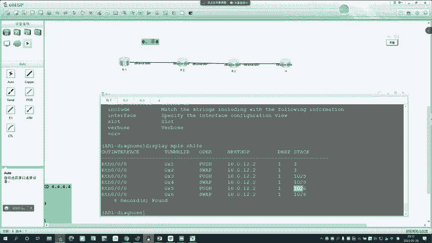

对不对？押入1个1026的标签。那这个报文呢要发送给10。0。12。2。啊，这是在R一上啊所得到的操作指令。所以在这时候呢，他就会直接发送给R。😊，好吧。

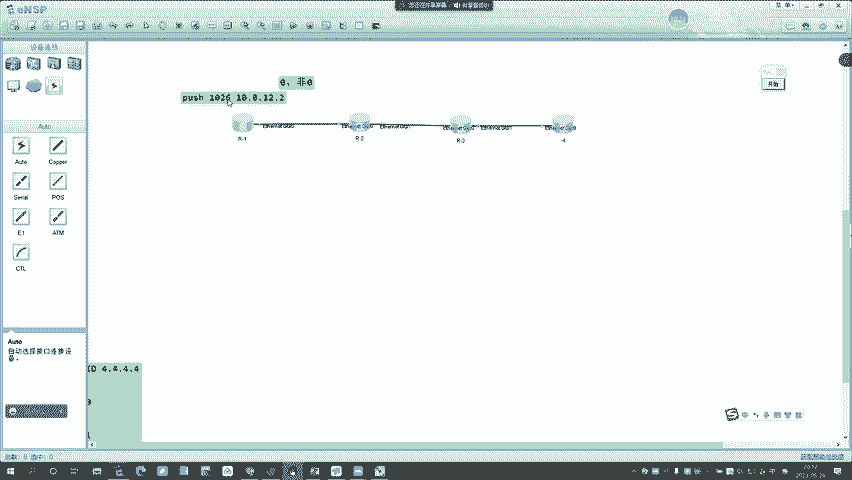

那我们把这个过程叫什么呢？大家可以去看到啊，就是根据。toomID查找下一跳标签转发表。对那这个过程我们把它叫做FIB。吐。嗯。H。LFE是吧，有时候我们也把它叫做叫做FTN。FTN是什么呢？

就是FYB到下一跳标签转发表的一种映射。啊，我们把这个过程也叫做FTN啊，这就是我们刚刚所说的，看到这里有1个FTN。😊。

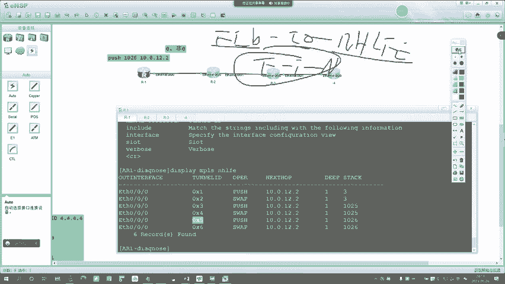

对吧FTN是什么呢？就是这一个过程。好吧，那还有一点是什么呢？😊，然后咱们再来看啊，就这个豹文未来转发给R之后，R收到一个带有标签的豹文，那他是怎么样呢？R再查的就不是下一条标签转发表了。

他所看的也是进入到诊断视图啊，叫做diplay。😊。

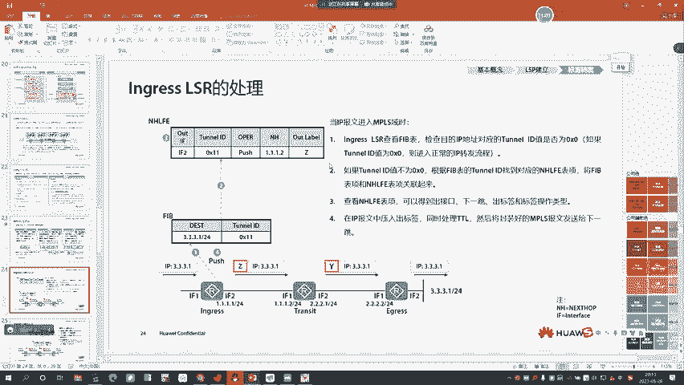

MPS4ILM叫做入标前映射。好吧，也就是说他收到1026的标签呢，这里我们可以看到有一个inlabel是吧啊，叫做进入的标签。😡，如果说等于1026。那么对应的toto IDD呢？是0XA。对吧。

那么在这时候，第一四类。MPS。NHLFE啊，没声音的话，重进一下啊。那现在我们可以去看到啊0XA有没有对应一个下一跳标签转发表啊。对吧那这样的动作是swipe。😡，对不对？那换成1026。

然后发给10。0。23。3。

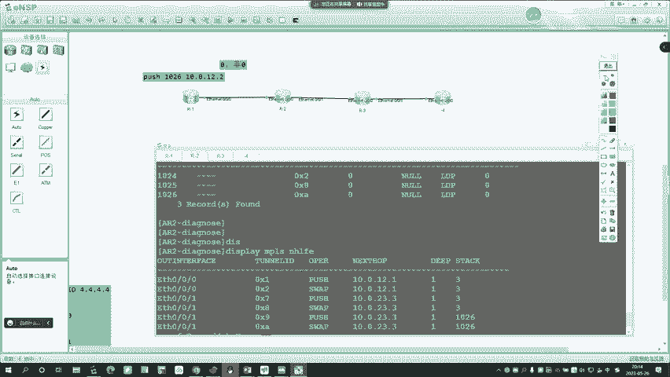

也就是说在这里呢，R会执行一个动作叫做swipe啊，叫交换是吧，然后换成1026，发给10。0点。23。3。这1026只不过他俩是偶然间相同了啊，就是本质上可以不一样。

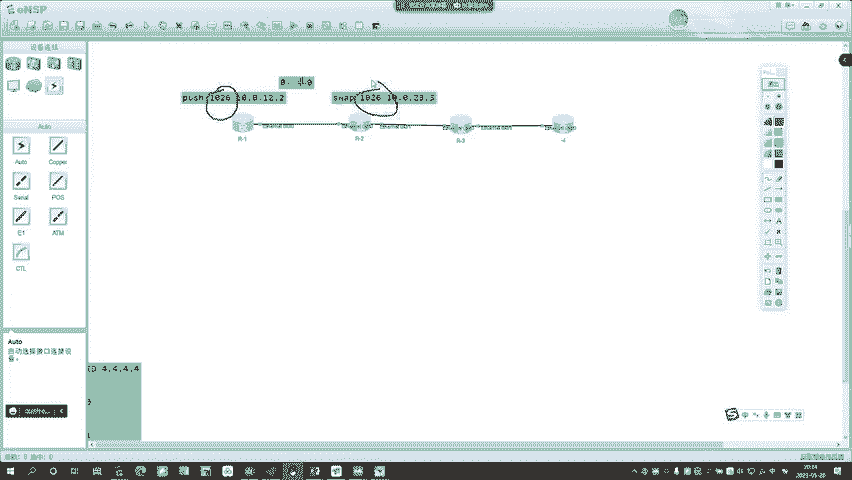

好吧，然后发送给三之后呢，三就收到了3D四playMLP。😊，啊，不是LP啊。呃，在转发层面呢，他就。我们要去看入标签映射。第四部类嗯MPSILM。对吧收到1026的标签呢，有一个偷动ID叫0X6。

然后再去看NHLFE。那么在这时候，他就可以去看到啊，0X6呢有一个对应的下一跳边签转发表的to动ID啊，就全部都是通过to IDD关联到一起的那他所执行的一步操作呢就是swipe。对吧。

然后需要去把标签换成3。

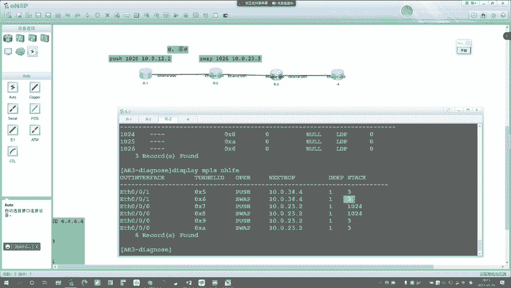

对吧那这里呢，他就是要执行一部swipe。1026。啊，不对啊，是外普3，然后发给10。0。3404。对吧最后这个报纹呢就最终发送到4上了。那这就是在MP24中啊，它的一个转发流程呃。

主要就是这几个表象啊，就eng呢这里刚刚给大家说过了，就是通过下一跳边签转发表可以得到出接口，下一跳出标签，还有操作类型，对吧？啊，是压入啊还是交换啊？

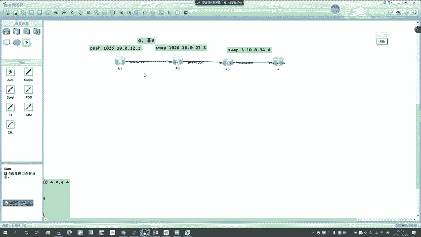

然后对于我们穿 side呢也是一样的那穿 side收到之后呢，去查看IRM得到通的 IDD对吧？然后根据通的 IDD查找下一跳编签转发表，然后根据下一跳编签转发表呢去执行它的操作指令。😊。

那然后最后会到一个ra。那一收到这个报文之后呢，呃首先也会去看LM对吧？那查询到该标签对应的动作呢为p，对吧为弹出。也就是说现在呢我们可以去看一下。

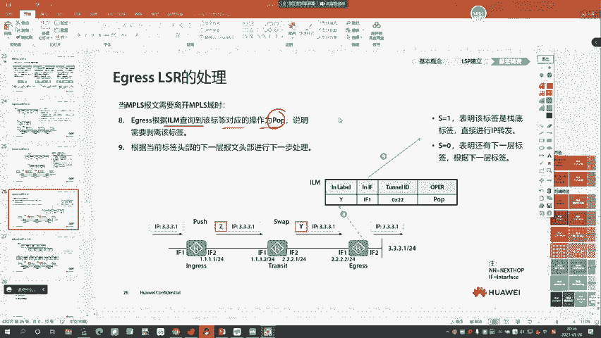

嗯，对于S4来说。第四类。嗯，MPSILM。是呃，我们就。啊，这里哎啊这里就看不到了啊，这个看不到原因，待会我再给大家说啊，就大家先记一下这个逻辑啊，待会我再给大家说看不到原因啊。😊。

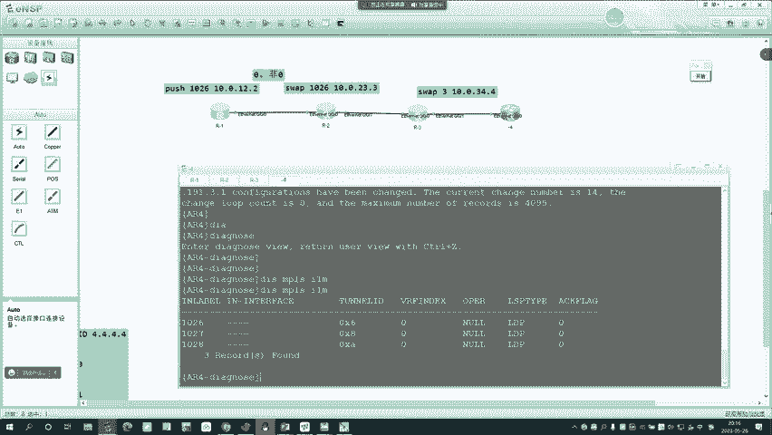

那么在这时候呢。对应的标签为弹出对吧？则代表玻璃标签啊，剥离掉这个标签之后呢，一看到底层是IP报纹对吧？啊，就会执行IP的差别转发。那这就是在MP4中的一个详细转发过程。那刚刚我们可以去看到啊，哎。

老师在这里好像没有标签啊啊，没有标签是什么意思呢？我来给大家说一下，因为在我们的M24啊，就是在LDP里面啊，它默认有一个特性啊，这个特性呢叫做PHP啊我们把它叫做倒数第二条弹出啊，也叫做次模弹出。😊。

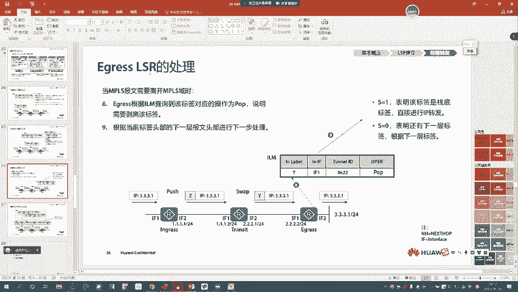

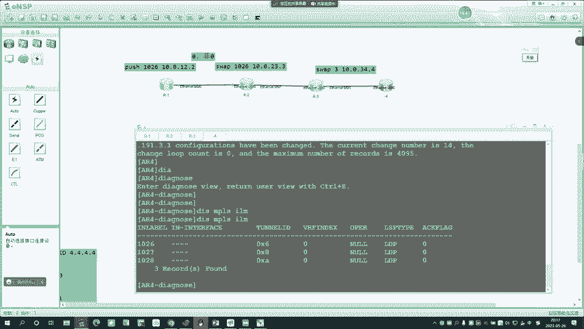

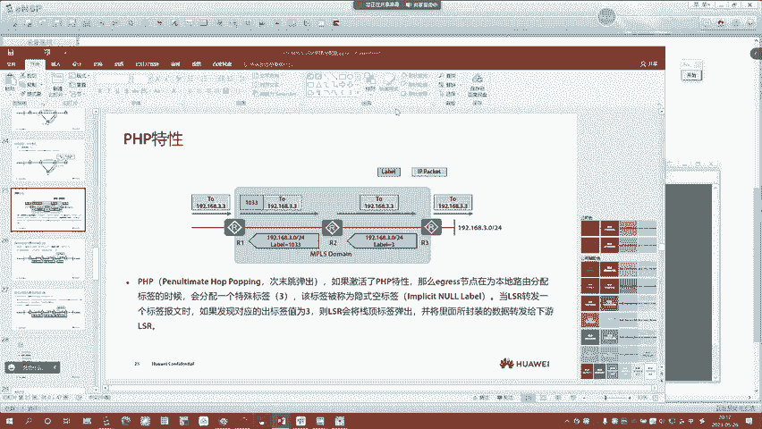

啊，次末跳啊啊不是末跳，是次末跳。所以说我们把它叫做倒数第二跳弹出。😊，那这个倒数第二条弹出他是怎么样的啊？😡，之前我们给大家说过。那这个逻辑是这样的啊，比如说现在我有1个R3呢，R3是这样的。😊。

如果他给这个二呢提供了一个X的标签，那比如说我们提供了1个1026，那也就是说二未来转发报文给三的时候呢，一会带着21026的标签。这个逻辑我之前给大家说过啊，带着1026的标签呢。

R3就要去查找一遍ILM是吧，查找一下这个下一跳标签转发表。啊，不对啊，就查找一遍入标牵引车对吧？哎，那突然发现是标签报纹。对不对？然后对应的动作为弹出呢，他再把标签弹出掉，弹出掉之后得到IP报文是吧？

然后再查找IP路由表进行转发。也就是说在R3上需要查表两次。😡，那一次是MPS4的表象。对吧那还有一次是IP转发表，也就说会查找两次转发表象。好吧。那这时候呢，对于R3来说，实际上没有必要啊。

也就是说会增加R3的一种负担。对吧那这个问题怎么样去解决呢？在我们的LDP中呢，开启了一种叫做PHP的特性。那这个PHP的特性是这样的，就是R3呢会给你一个标签3。😊，这个三他是有隐含的意思的。

这个三是什么意思呢？就是我把这个标签删给你，就告诉你192。168。3。0，我给他标签是3。那这个三的意思就是告诉你呃，你未来发送给我这个报文的时候，对吧？三所代表的意思就是弹出标签，那懂吗？

就是你直接把IP包发给我。😡，好吧，这就相当于我给你一说是吧，今天。😡，嗯，我只要一摔杯子对吧？你们就把它干掉，能不能明白这个摔杯子就是一种暗号，就是一种信号，对吧？提前你知道我知道我一摔杯子。

咱俩一下子就碰到一起了，是吧？所以说二跟三呢也是这么一个逻辑。R3呢把标签三提供给二之后，就是告诉给2吧，你未来再给我转发报文的时候，把标签弹出去，三代表的意思就是你要把标签弹出去之后再给我。😡。

所以这就是我们所说的特殊标签，我们把它叫做影视空标签。好吧，那这个影视空标签它是怎么样的呢？我们来看一下，按照我们正常的理解，对吧？R3给R4发包的时候，它不应该是三吗？对吧？

比如说现在我在G0-0-1抓包。😡。

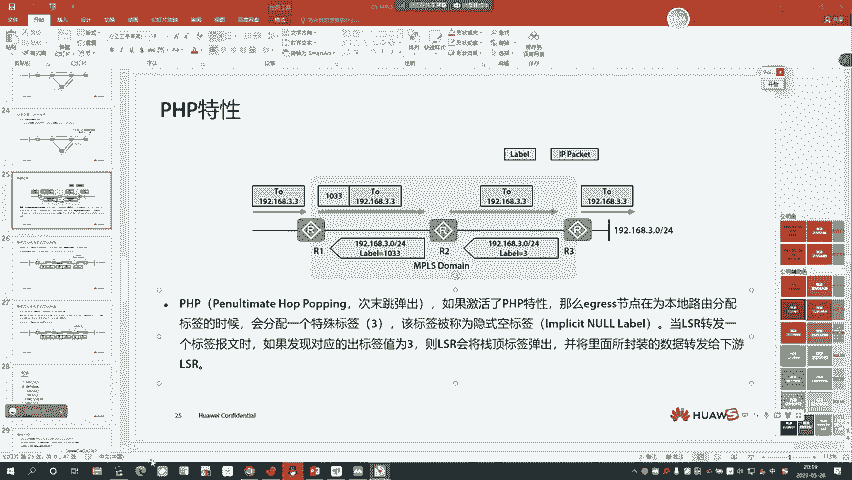

然后呢，我们在R的G0-0-1也抓一个。啊，这时候我们在R一上去拼一下4。

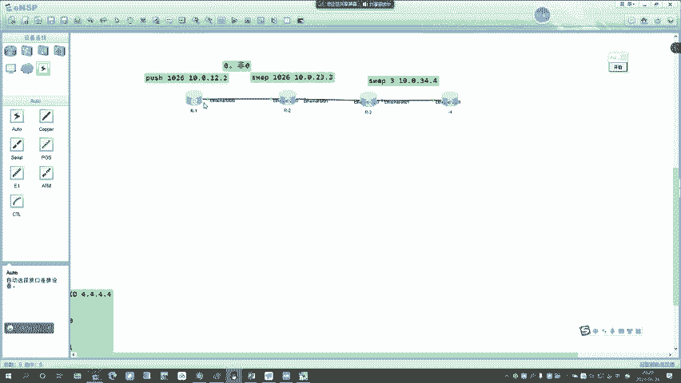

片杠A啊1。1。1。1到4。4。4。4。是吧我们发现可以平通。可以平通之后呢，我们来看一下23中间的包。😊，先看23中间的啊。

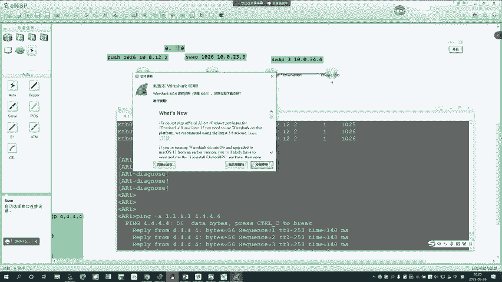

在23中间的。二再转开给三的时候，应该会有1个1026的标签啊，所以我们可以看到有1个1026。呃，但是在三转发给二的这个包呢。我打开去看一下。你发现的没有任何标签。对吧为什么没有任何标签呢？

因为这个PHP特性默认它就是开启的。

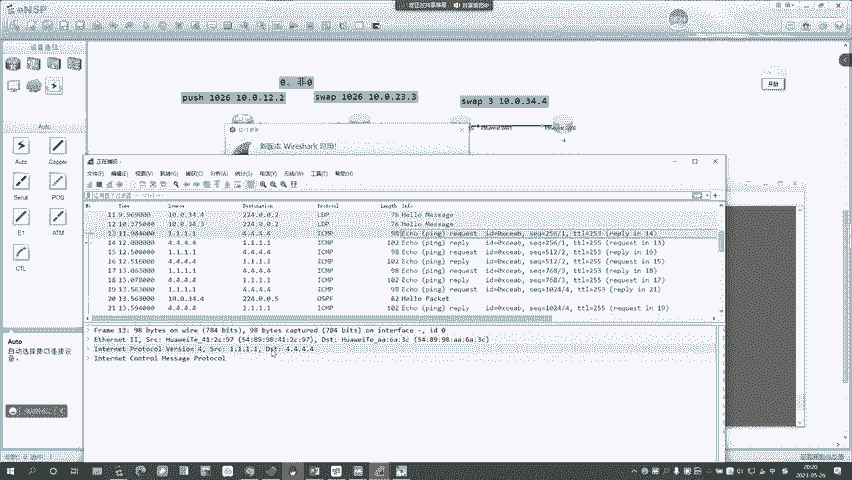

好吧，就是开启的那这样的话，你把IP包发给44，直接IP路由表转发，插一次表就行了，是吧？啊，减轻最后一条路由器的负担。😊，呃，但这样有没有什么缺陷呢？实际上也有。那他缺陷体现在哪里呢？

之前我也给大家说过啊，就这么我们没有办法实现端到端的Q。😡。

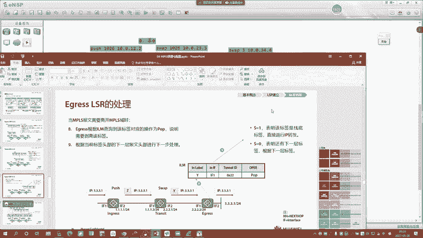

对不对？没有办法去实现。那怎么样去实现的呢？因为我们发现啊标签里面会有1个ESP的标记。之前给大家说过，它主要就是用于做Qs的。对不对？那如果你二把标签弹出来，就没有ESP了，那三怎么做Qs呢？😡。

对不对？那这就是我们所面临到的问题。好吧，所以说接下来我们就要接触啊另一种标签。就这个标签三呢是侧面要弹出丢失了Qs的信息。对不对？那为了解决这个问题呢啊，我们还有一种标签啊叫做显示空标签。对啊？

叫做显示控标签。显示控标签它是这么一个逻辑啊，就是R4呢，我告诉你，你未来发给我这个豹文的是吧，你给我打上标签0，这标签零比较特殊，对吧？就是R3啊，你待会呢转发给我包，对不对？你带上这个标签0，好吧。

而在R4上有这么一个逻辑，只要收到带有标签零的标签啊，直接弹出。😡，好吧，盘出之后呢，查找IP路由表好吧，而不会去查找ILM。😡，能不能明白它是这么一个逻辑啊，也就是说R4收到带有零的标签。

它只需要读这个标签里的Qs信息就可以了。它会不会根据入标签查找IM呢？不需要。😡，是没有的，他直接读了Qs之后把，标签弹出查找IP路由表。所以说L4呢也是呃查表转发一次，对吧？只查IP路由表。😡。

那这个标签零呢，我们把它就叫做显示控标签。而这个功能呢默认是关闭的啊，我们默认开启的是。😡，影视控标签好吧，我们把影视控标签呢也叫做PHP。但这个PHP我们可以进行关闭。也就是说R4呢。

你可以通过配置的方式让他给R3说，你待会转发给我的时候啊，你给个零，你给个零呢，啊，待会我这边读一下Q，我就直接把标签扔了，扔了之后，查找IP路由表，对吧？咱俩之间的一个暗号，让咱俩的工作效率呢。😡。

更快一点。😡，能不能明白，那就是这样，好吧，那这个呢我们也通过配置呃可以去做的啊。那这个怎么样去做的？比如说我现在在三上啊呃，咱们可以去看一下diplayLP对吧？

我们发现它转发给四的这个出标签呢都是三吧？三代表什么意思呢？就把标签弹出对不对？那我们也可以关闭啊，这个字末跳的弹出机制，那这个怎么样去关闭呢？呃，我找一下配置命令啊，😊。

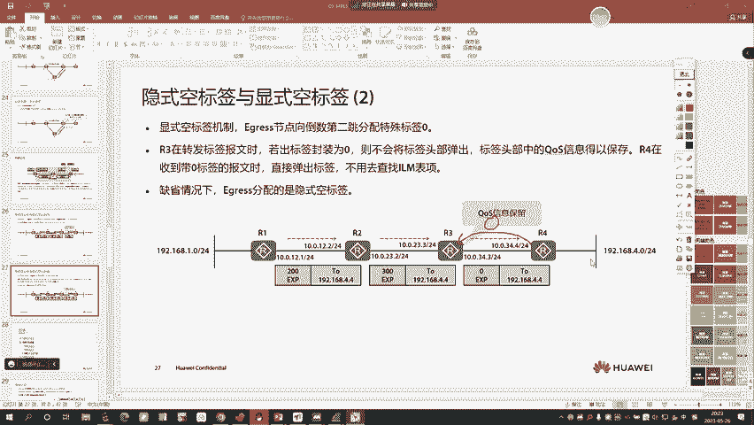

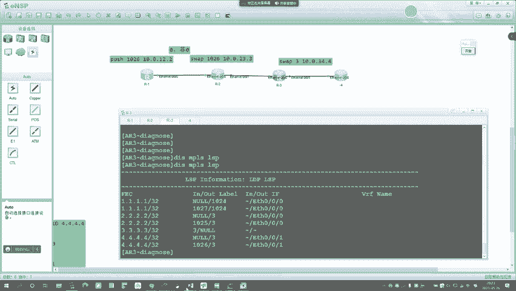

嗯，在这一块好吧，就是我们在MPS4视图下呢，对吧label通告嗯，然后去让他通告显示空标前。

就在MP240度下啊。MP24。呃，在这个视图下呢。label啊，然后让他通告显示孔标钱。然后这个做完之后啊，大家注意啊，要去清理一下，就是resside MPPSLDP。嗯，要让他重新去建立一下。

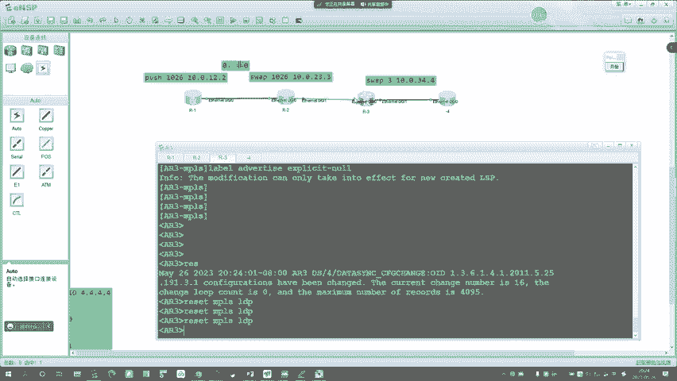

嗯，这个这个这个。呃，转发表象啊，要这他重新鉴定一下。然后我们做完之后呢，我们来三上看一下第一playMPSLDP。😊。

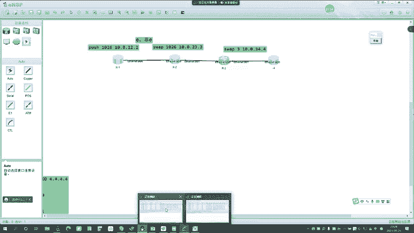

啊，敲错设备了啊，我们在山上敲了是吧？应该在四软条啊。在4上。好吧，M14试读一下啊，label通告，然后让他通告显示孔标签。呃，然后在4上呢是reite一下reMLDP啊，让他重新去建立一下。

然后这时候我们到三场来看一下LP表象。第四步MPSLP我就发现啊哎，他去往四的出标签变成了0。对不对？那这个零代表什么意思呢？比如说我们在IE上去pin杠A1。1。1。1。到4。4。4。4。

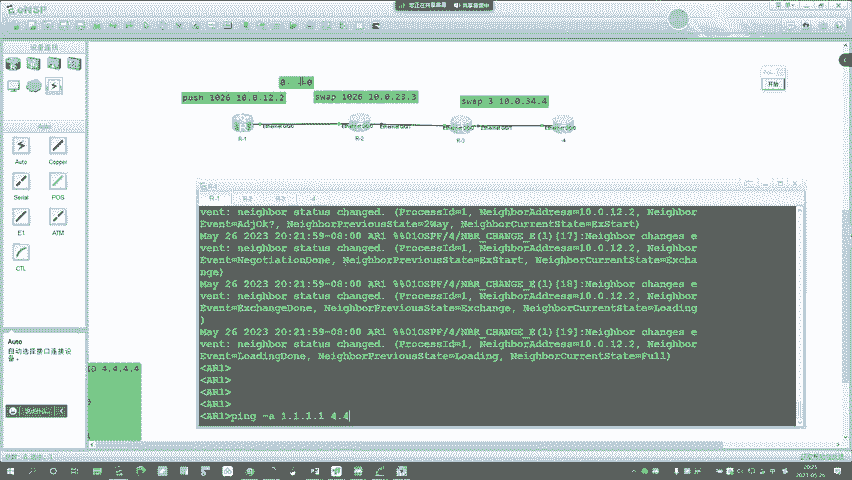

啊能通能通，然后我们这时候看一下三次中间的包。我们看这个request啊，他就会携带1个M2的标签0。那这个标签呢就是我们说的显示控标签。这标签零就代表着S3待会把标签零给你之后。

这里面不是有ESPV吗？对吧？你待会通过ESP提取出来Q的信息，然后你把标签弹出，弹出之后查找一次IP路由表就行了。然后直接转发出去。那这时候呢，他就不需要查找IRM了。

也就是不需要去看那个入标签映射了。

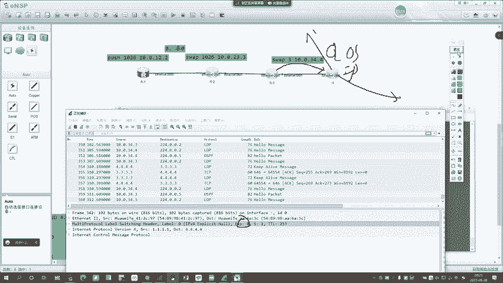

好吧，那这就是我们所说的啊呃PHP嗯以及这个啊啊也不叫PHP啊，就是两个特殊标签好吧，显示空标签，还有隐示空标签嗯，他们之间的作用。

那我们把开启了影视空标签这种功能呢，有时候也叫做PSHP就是因为他的行为本身是在字模跳来进行探出的。好吧，所以这个意思大家都明白了吗？明白的同学敲一啊。没问题吧。啊，为啥不默认动厂？呃，这个问题。呃。

你你可以认为现在做Qs的比较少。好吧。这不就设备的一个默认机制吗？😡，能不能明白？呃，PH这个不用拍命令啊，就你关闭PHP啊，需要是拍的命令。好。嗯，下面的就是一个。这个之前给大家讲过了。

就LDP它怎么样进行组网的是吧？呃，我们把这个课件来过一下啊，过一下之后我们去讲MPSVP。😊，来看一下啊。呃，现在所有的RSR呢采用DU加独立。啊，这是独立还是有序啊？是吧我也忘了啊，上节课刚讲完。

😊，啊家独立啊啊独立的啊。呃，DU加独立啊，以及加上自由的啊标签这个发布方式。啊，那这个是怎么样的呢？当我们在所有设备上去开启了啊这个。啊，就首先呢你要去跑这个OSPF对吧？OSPF全网打通之后呢。

开LDP，开LDP之后呢，他们之间就会建立LDP的绘画。建立LDP绘画之后呢，可以发布标签硬行的消息。

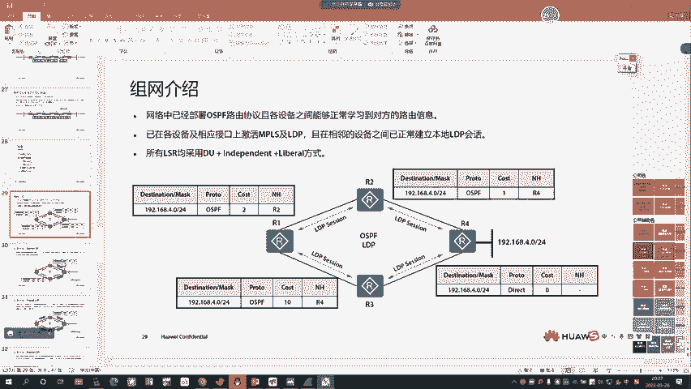

是吧然后现在呢我们以R4直连了一个网段4。0为例啊，R4呢主动为这个路由呢分配了1个1041的标签。那默认情况下，实际上在我们的设备中是3啊，这里为什么要写1041呢？啊，可能是便于大家好理解，好吧。

所以说他把1041呢发给了二跟3啊，为什么二跟3接到都是1042141呢？因为我们用的是基于全局的标签。

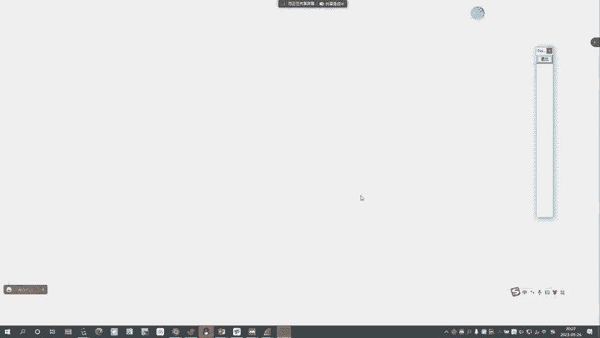

对吧那二跟三收到之后。对吧那在这时候呢。😊，对于川赛的来说。是吧呃，虽然我们是独立啊，就他没有收到下游的标签，也可以朝上游通告。😊，能不能明白，也可以抄上一诉告啊。你看他这里说的就是。😊，啊。

当他收到S4的标签映射消息之后呢，来自于下游邻居对吧，将触发他的这个分配。所以这里啊如果是独立啊，他不需要收到下游，也可以朝上游提供。😊，能不能明白啊，他这个课件应该讲的是有序的过程啊。

这才是华为默认的。对不对？我觉得写课件这个人应该是写错了，好吧，应该是DO加有序啊，加保啊加自由的标签保证方式。啊，所以说我们看这个过程呢，是首先R跟R3呢接到了下游R4的标签之后，那在这时候呢。

R才会向上游I一通告，对吧？R3也向上游I一去通告。😊，那么通告完成之后，IE上面呢啊就会形成这两个表象。对吧那对于RE来说呢，它是自由的标签保留方式啊，所以说两个标签都会储存起来，对不对？

但是自己路由表的下一跳是R呃，所以说他只会用R的标签现在。😊，是不对？那一旦发布进来之后呢，现在对于IE来说啊，它是这么一个逻辑。我们来看啊，首先呢收到了1个IP报文之后，对吧？比如说我们要去访问4。

1了，首先查找路由表，对吧？下一条是R。😊，啊，那根据路由表呢，我们映射出来1个FIP实际上在数据平面呢，我们看的就是FIP对吧我得到to IDD呢为非00，得到非00量。

但得到to IDD0X12查找下一条边签转发表。😊，不得到呢，我要从G0-0-0以押入标签的方式发给R出标签是1021。1021从G0杠020发送给R。不对，就这样就给二了。那二收到之后呢。

继看ILM啊，他根据收到的标签呢，1021。对吧呃，查找到to ID0X120X12呢对应一个下一票变形转发表，对应的操作动作呢是swipe交换啊，也就是说要换成1041呢发送给S4从G0-0杠0啊。

这样就过来了。那发送给S之后呢，S就收到了。S收到之后。查找IRM对吧，发现是1041呃，toto IDD是0S1。执行的动作是这直接弹出。对吧弹出之后呢，一看到IP了IP保完了。

然后再查找IP路由表进转发。对吧所以说呢这就是嗯他的一个操作过程。但是默认情况下，我们是开启了PHP特性的。但这个特性一旦开启之后，R发送给R4的时候呢，嗯实际上发的就1个IP包了，对吧？S4收到之后。

直接插找IP路由表进转发了。好吧，所以说他是这么一个逻辑啊。😊，嗯，但是。呃，这个课件的一个小结啊，我们来看一下啊。😊，嗯，LDP呢首先运行IDP是吧啊，通过OSPF或者ISS呢来构建路音表和转发表。

😊，啊RDP根据相应的模式啊，然后为路由表中的前缀分配标签啊，这个我们说过就是DU啊是吧啊，独立啊有序啊这些。😊，呃，然后根据自己相应的模式呢呃将为自己的路由分配标签，对吧？通过LDP映射报文呢。

通过给LDP邻居。这我之前也给大家说了对吧，上节课也讲了啊，就每个设备呢嗯他为自身直连的网段？如果是32位的主机路由啊，就会以一个方式嗯，朝他的LDP邻居呢去发送标签映射消息。😊。

对吧所以说这个呃标签或者说LP嗯建立呢是由Egressce来进行触发的。好吧，那LSR呢将自己的路由前缀分配的标签啊，以及LDP为该路由前缀的分配的标签储存起来。并与出街口吓一跳，形成关联啊。

造成这个啊就是构建成啊标签转发表。那这里我们就可以去看到。比如说在这里呢，R4给R提供了1个1041的标签，对吧？那R知道啊我从这个接口去往R4啊，对不对？提供1个1041的标签。

我给他提供的是1021，那代表我收到10221换成1041，从这个接口发送出去。对吧所以说在R的这个下一跳边线转发表中，我们就可以看到啊，收到1021。呃，换成1041啊，然后之前的操作的交换。

从哪个接口转发给谁？对不对？所以这这一块啊。嗯，那当RSR转发目的报文，目的网络的标签报文时。所使用的出站标签总是下游通告的对吧？此处的下游呢指的是邻居啊，就路由表的下一跳设备啊，因为我们之前说了。

上下游怎么样确定的，根据报文发送的方向，对不对？报文发送的方向，报文永远是发给你的下一跳的。所以说你的下一跳就是你的下游。😊，是吧啊，谁把流量发给你了，你就是谁的上游。啊，这是上下游关系之前怎么判断的？

给大家说过啊。😊，呃，拍对面的这一块我就不再给大家演示了啊啊，大家课一下可以去看看。😊，然后到这一块，MPS的这个LDP呢，咱们就选完了。

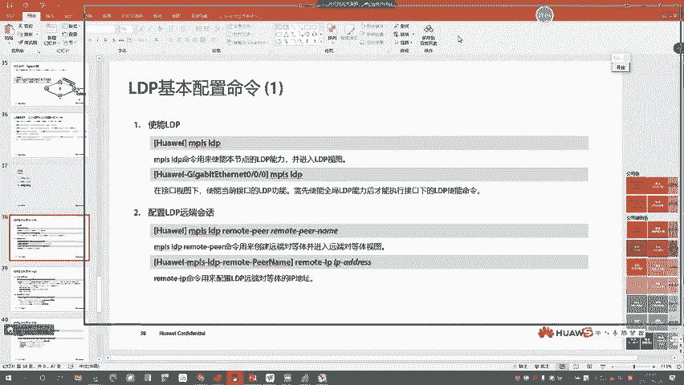

呃，接下来要给大家讲的一点呢是MPS的一些呃VPN特性。好吧。呃，我们在学习之前呢，首先来看一下，就MPSVPN它是怎么样的。😊。

拿手一眼啊。呃，首先对于M2VPN的一种定义啊，就是大家应该听过很多种VPN的技术了，对吧？呃，有什么这个嘉E啊，对吧？IP赛啊SSL对吧？L to TP啊，对吧？呃，我们听说过很多种VP对不对？

那嗯VPN。😊，呃，种类有很多对吧，这就相当于我们这个现实生活中的车一样，对吧？有什么大轿车、小轿车啊，是吧？长途汽车啊等等，是吧，但他们的应用点是不一样的。😊。

先大家注意M呢一般是由运营商搭建的这是它的一个特点。跟我们之前做的什么加不一样，那都你客户自己去建立的吧也不用给运营商去说。所以说M它更类似于一种我们向运营商去购买的一种服务。注意啊。

你就是相当于运营商就相当于我们现在net样运营商把全国的internet啊打通之后呢，你上台去买服务，你给他交钱，对不对？那MP他也是一样的，就是运营商呢把MPN的承载网，去搭建好之后呢。

我们向台去买服务。😊，是吧一般你很少能够遇到，比如说你要去维护呃MPSVPN的一个大网络啊，你很少你一般就遇到的就是你公司买了一个专线，对吧？运营商告诉你你应该配啥。是吧啊，就买了一根MPS专枪啊。

一般大家见到的是这种。那对于MPSS4VPN呢，它是一种三层VPN技术啊呃这里大家接触的一个新概念是吧，一个三层，一个二层。啊，那三层VPN技术大家知道啊，它都是基于IP的啊，我们传都是路由表。

而二层VPN技术呢，它会传麦克地址表。😡，好吧，那像我们之前如果有同学接触过啊，应该知道有像这种VPRS对吧？呃，还有这种这个呃VPWS对吧？啊，包括EVP啊，都能够实现二层的VPN图。😊，好吧。

所以说我们未来学的MPSSVPN呢是一种基于L3的VPN技术啊，基于三层的。那三层跟二层的区别就是在他封装报纹上。你比如说我们之前学到加E，它就一层三层为品。为什么呢？因为他用IP去封装IP对吧？

你封装的内部，它是IP。好吧，如果二层为P技术呢，他会直接把麦克层直接封装进去。能不能明白这个意思？啊，那这就是二层VPN跟三层VPN的一种区别。那对于我们未来所学习到的MSVPN呢。

呃首先我们要了解一下它是怎么样进行组成的那在这里面呢，我们也需要去接触很多的术语。😊，这个术语是这样的啊。呃，首先第一种呢，我们有一种设备叫做CE啊，CE呢一般说的就是客户啊，他自己的出口设备。

就是客户与运营商相连的设备啊，我们就把它叫做CE啊，这个就叫CE啊。那还有一种呢叫做PEPE是运营商的边缘设备啊，也就是说呢就是运营商用于连接客户的设备，我们把它叫做PE啊，还有一种呢叫做P设备。

P设备就是运营商内部的设备啊，它不需要连接客户对吧，只代这个运营商内部。😡，啊，负责数据转发的工作啊，我们就把它叫做P设备。那这是三个术语，一个是CE，一个是PE，还有1个P。啊。

那接下来我们要再接触的概念呢，还有一个叫做站点。😡，站点一般我们说的就是一个网络啊，不是一个或者说一个公司是吧？呃，或者说呢一个内网，我们就把它叫做一个站点。比如说公司A在河南省的网络对吧？

我们可以把它叫做一个站点。公司A呢在河北省的网络，我们也可以把它叫做一个站点。是吧，然后公司B啊在河南省的网络，我们可以把它叫做一个站点。公司B呢啊公司B在河南省的另一个网络。

我们也可以把它叫做一个站点。是吧？所以说大家可以认为每1个CE呢都是一个单独的站点。😊，那这是站点的概念。😡，那未来我们还会接触到一种叫做微拼客户。VP客户是什么呢？VP客户就是一种公司。

一个公司呢可能有不同的这个呃分支机构，对吧？比如说呃这两个呢是阿里的对吧？阿里在北京有一个有上海有一个北京跟上海分别都是一个站点。但是呢如果阿里他像。😊，运营商去买了MPSVPN的服务，对吧？

我们就认为他是一个VPN客户。能不能明白？好吧，你的客户是你的公司。所以我说我们一般把一个公司叫做一个微聘客户。然后每个不同的内网，那么我们就叫做一个站点。所以这是几个术语啊，CEP与P设备啊。

站点以及微拼客户他们之间的关系。这个大家搞明白了吗？明白的同学敲一啊，没问题吧。MC以前不用管他啊。😊，好，那我们继续啊。然后我们来看一下啊，嗯这张图呢嗯我先不讲好吧，这张图嗯。😊，我给大家讲。

你们就懵了啊，那简单的我给大家说一下，就是MPSVPN呢，它不是一个单一的VPN技术啊，就是它是有很多技术组成的。就像我们之前学这个PPP1样，PPP啊它是一个技术嘛？嗯，好像有点不像对吧？

老是我学PPT我也学LCP啊NCP啊，对吧？嗯，IPCP啊，对不对？😡，你要学各种各样的，就它类似于一种协议站啊，类似于I也是一种协议战。所以说我们可以去看到MP叫做技术架构啊。

任何一个技术呢只要带上架构这个词呢嗯它的框架就比较大对吧？所以说大家很难去学一下子学明白啊但是在我们的MP技术架构里面呢是包含很多种技术的啊这些技术呢简要的有MP有P还有这个VF啊静态P啊都有好吧啊就相当于做了一个大杂烩。

😡，对不对啊，什么啊这个啊青菜啊、油条啊对吧？啊花菜啊是吧？西葫芦啊啊，茄子啊、黄瓜对吧？啊，就是一个大杂烩。好吧，所以说呢针对于MPSVPN呢，我们在学习的时候呢，要有这些基础。

那首先静态啊、IGP啊、BGP啊都是我们之前学习过的。😊，是吧VF没接触过，对不对？呃，LDP呢学完了是吧？MPPTP没学习过对吧？那未来在我们的学习过程中呢，都会去接触到。

所以说这里大家只需要有一个概念，它们的作用你不用管啊，什么PE之件传递路由信息啊，PC之间隧道建立啊啊，这都是废话，好吧，这些都不用去管它，那大家只需要知道的就是MPSVP呢，它是一个技术架构啊。

里面涉及到了很多技术啊，我们需要1。1点去学习啊啊，大家需要知道它的组成它并不是一个单一的啊技术啊，它是一种技术架构对吧？😊，然后下面这个图不用看啊，我一给你讲，你就懵逼了啊，什么唯P用户管理啊。

噼里啪啦的一大堆废话，我来看一下啊。😡，呃，首先呢我们为什么要选择MPSVP是吧？首先第一个呢就是不感知VPN的存在，不需要维护是吧？呃，也不需要部署降低企业的运维难度和成本。那这个是怎么样的呢？啊。

我们可以去看到啊，这种技术架构呢嗯技术都是比较多的，对吧？也有很多同学呢可能之前觉得MPSVP是非常难的对吧？嗯，这技术呢框架比较大。😊，呃，不会对不对？呃，首先对于企业来说呢，他买了VPN业务之后呢。

呃如果说他还要去调试去维护的话啊，对于自己来说呃，负担就比较高，对吧？可能没有这种专业的技术人员。对不对啊，就像家里的TPlink一样，我们发现都内置了ATTDHCP啊，为什么呢？

因为家里呢啊很少有人会去调，对吧？啊，不是所有的老百姓都会这种的啊，为什么大家觉得简单？因为你都在行业内。😊，那首先MP4呢，他对于唯品客户来说呢，他不需要去单独的维护，是由运营商帮你维护的。

他只需要把这种服务卖给你就行了。😡，对不对？那第二个好处呢，就是它是在运营商的VP专网上有一定的安全性保证。那这个是怎么样的呢？嗯，今天课下也有同学在问我啊吧，哎，老师MPSVPN不加密啊。

它的安全性在哪里体现呢？这里大家要知道啊呃首先呢嗯我们可以认为现在的网络呢？啊当然我只是以。😊，啊，这个MPS4的角度上来给大家说啊，好吧，我的网络分有很多呢啊，还有什么啊5G基站的网络。😡。

对吧所以说这里大家知道啊啊什么无线接入到啊这个骨干网中也有对吧？有线无线在骨干网中融合的啊，也有好吧，什么4G5G啊，对吧？😊，呃，这里呢我们以MPS视图是吧？角度来给大家说一下。

就是我们一般说的不安全的网络是什么呢？叫做internet。😡，对不对啊这个internet它的不安全在哪里呢？就杂七杂八的，什么打杂烩都有，对不对啊？😡，那这个大会太多了啊，人太多了是吧，什么人都有。

所以说一般我们认为呢呃这个internet网络呢，它是具有一定的不安全隐患的。因为运营商只是负责把你的网络打通啊，不负责给你做隔离大家能明白吗？所以说你在家里呢，你上internet呢。

你可以通你隔壁同事家，为什么能通呢？因为internet它是一个全互通的网络对不对？而MPSVP呢，它和internet网络，大家可以认为是物理隔离的啊，压根就没有连线。😡，能不能明白啊。

他就相当于什么呢？就相当于我们国家有高铁对吧？啊，还有国道，你从国道呢啊能从北京到上海，你从高铁呢也能从北京到上海，是吧？他们之间就是物理隔离的，是吧？😡，那你在这个呃高速公路上对吧，在国道上出了车祸。

你影不影响高铁呢不影响是吧？哪怕你那个路坏了啊，影响高铁影响吧都不受影响。好吧，所以说物理隔离，大家可以理解成就是MVP跟internet，它本身就是两张物理隔离的网络。

internet它才存在了很多的不安全隐患，而MPS的安全保障是在哪里呢？首先运营商会给你去做的唯P用户之间的隔离，也就是说阿里买了一个MPSVP的业务，对吧？😡，京东也买了一个。

那他俩之间会不会互通呢？不会啊，为什么不会呢？因为这方面运营商已经帮你做好了，好吧，那这就是运营商给你去提供的安全保障。😡，啊，那他不加密。😡，对吧有人就问了老师不加密，那他的安全性体现在哪里呢？

因为你本身就是隔离的，好吧？所以说不加密呢嗯也能够接受，大家能不能明白？但是实际上，如果我们出于对隐私性的考虑，比如说老师啊运营商有我的这个lit头，对吧？啊，他某天给我搞小动作。

看到了我的报文内容怎么办呢？嗯，那这个就没办法了，好吧，这个就没办法了。😡，能不能能明白？所以说啊呃你既然找人买了这项服务，那么你就要信任他。😡，啊，那这个嗯一般要求的也不是特别多。

所以说大家可以去看到啊，嗯相对于我们一些比较啊重要的国企是吧？呃，你像这个。😡，像这个啊政府单位对吧？啊，什么烟草啊对吧？中国铁路啊啊。

他们的这个传输网络啊都是自己搭建的那为什么他们会也会去部署MPSVPN呢？啊，就是他们首先财富能力是足够的对吧？呃，第二点呢嗯在我们国家内呢，他们会有专权啊，或者说会有专权啊，这个专权体现在哪里呢？

因为对于这种国有企业来说呢？嗯安全性要求都是比较高的对吧？所以说他们有时候呢就像这种啊啊比较重要的公司啊，他们呢也不用这个MPS的。😊，能懂吗？就是不用运营商提供的MPS，他们会自己去搭建。

但这种呢嗯是需要资质的，不是说你什么单位都可以去搭的。😡，那能明白吧？比如说老师我们公司行不行啊，是吧？啊，你们公司我估计就不行，是吧？这种呢一般是需要进行政府审批的啊。

你才可以在中国去呃构建这样一张网络。好吧，所以说对于一些非常高密要求的呢，他们会自己去做自己的传输网络，而对于一般的公司来说，你比如说我给大家讲课啊，那这个数据包别人抓就抓嘛啊。

对于我来说实际上啊无所谓。😡，大家能明白这意思吧？明白的同学敲一啊，能懂吧？实际上对于大多的企业来说呢，嗯这加密和不加密呢，实际上他们要求并不是特别高。就像我们用QQ1样，QQ自己就在加密。😡。

对不对啊，你也做不了什么事。是吧所以说在这一块啊，那所以说MPS对于VP来说呢呃，对于VPN客户来说，一个是两种好处啊，一个呢简单省事啊，还有一个呢啊具有一定的安全保证。😡。

那对于运营商来说呢嗯它就更加简单一点，就运营商是这样的MPS为P啊，大家可以认为它是一种逻辑的组网技术。这逻辑的组网技术是在哪里呢？大家应该之前学过QQ对吧？QQ我们发现在公网上。

如果呃这里呢允许微1通过对吧？呃，在这里呢我们就用个微1，这里用个微1。😊，对我们进行QQ的封装之后呢。他是不是相当于形成了两个逻辑的，然后这边有一个。这边是魏蓝石这边是魏纳石。之前大家学过这个QQ吧。

对吧这两个微兰石是不是可以各自互相同选，而不会跟对面的微兰石同学。对不对？是吧那这就是一种逻辑隔离的网络。MP4呢，它就是这么一种逻辑隔离的网络。什么意思呢？就是我这一根物理链路啊。😡。

是吧你两个用户都能用啊，你在上面跑就在上面跑呗，反正你们之间是隔离的对吧？我运营商的设备你动不了。😡，能不能明白啊，你动不了，你就没有办法侵犯其他客户啊，因为你们之间我完全做了隔离。😡，好吧。

所以说在这里呢，大家可以认为MPS呢首先它就是一种逻辑隔离的网络。那么它就支持对于同一块物理资源的重复利用对吧？多个唯品客户呢同一同时在上面去跑。

那像下面的这什么呃无连接IP网络增加了面向连接的控制平面啊这。是吧啊，我读着都比较虚，他的意思呢，我大概也明白啊，但是我很难给大家去讲明白啊，为什么呢？因为我去讲的话，这个呃也不好讲明白好吧。

这里说的话大家都不用管啊，什么地址空间重叠啊，的都不用去管好吧，然后我们学完M技术之后呢，你再一看啊，你就能够体会到了，对吧？像这什什么组网方式啊，吧大家还没学MVP呢，你怎么能知道组网方式呢？

是吧么啊。😊，是吧啊全互联啊等等啊，扩展性体现在好在哪里啊吧，地址空间怎么样重叠的啊，所以说现在大家还体会不到啊。😊，所以这一块呢啊咱们并不愿意去管啊，我们并不需要去关注他对于运营商来说是吧？啊。

有什么样的好处？反正他对于唯品客户来说呢，非常好，公司都愿意买啊，但是稍微比较贵啊，稍微比较贵。😊，但这种网络啊，大家注意MPR4的网络呢相比于。嗯，我们之前学到什么IP加E啊相比他们要稳定很多。

为什么呢？因为这是你花钱去买的。😊，能懂这意思吧，这是你花钱去买的啊，不是你白嫖的。😡，啊，就跟大家这个呃学习一样。😊，对不对嗯，这个白嫖呢一般没有特别好的资源啊，但你花钱去买呢嗯就会比以前好一点。😊。

是吧所以说这里大家知道啊嗯。😊，所以说我们花钱向运营商去购买服务之后呢，也可以去购买一种服务等级的保证。对你比如说对吧呃，我站点A跟站点B之间，你必须要保证延时为多少。那这种呢你是可以向运营商购买的。

😡，啊，就这种服务。所以这里大家知道啊呃，MPSSVPN的服务质量呢，它相比于传统大家接触的那些VPN呢服务质量要更好一些。那这什么组网技术啊，大家看不懂，不用管。😡，这先不用管啊，回头我们会去讲的。

先不用管。😊，呃，我们来看一下啊，就MPSVPN路由器是怎么样进行发布的。呃。他这样的啊，注意啊，我们以一种呃思路的方式来给大家说。首先呢比如说我站点A站点B对吧，站点C站点D。😊，那他是这样的。

就是首先呢PEC之间要去建立呃这个IDP邻居啊，可以是OSPFBDPS都行。是吧，那这时候呢。大家学呃可能大家觉得是吧老师这个运营商怎么可以给你跑几遍，没有什么不可能的啊，你只要花钱就能。😡。

能懂这意思吧？你定要花钱就能啊。😡，刘应山也愿意挣钱吗？是吧所以说注意啊，比如说CE上面有一条路由，这有个1。1，它传给P1之后。😊，那就传给运营商，运营商呢再给你传给这这边的PE。好吧呃。

然后呢再传递到这边的站点。能懂这意思吧？所以说他的路由传递是这样的啊呃，具体怎么样进传的啊，大家先不用管。首先呢要去理解这个过程。过程就是我们的客户的CE呢。

把路由传递给运营商的PE运营商的PE之先传路由，然后再传递给远端的站点啊，然后数据转发层面就通了。😊，那怎么通的啊是吧？而这个报纹会不会有冲突啊？是吧哎，这个路由会不会有冲突啊？

那这不是我们现在关注的问题好吧，就现在首先大家知道这个过程。路由就是这么传的啊，CE传给P啊，PE传给对面P对面PE传给对面CE，反过来一样啊，路由就传完了。😊，啊，当这只是一个概述啊。

那具体比如说老师哎有没有可能对面啊这个CE2，他俩有相同的路由啊？😊，是吧哎，那如果他俩有相同的目的IP啊，怎么传呢？对吧？那这一块呢我们先不用管，这是只是一个大概的过程。😊，所以说这个东西啊。

你得慢慢选。你看这种东西啊放到我刚开始学，你让我看这个课件，我也虚，什么玩意也听不懂。😡，对啊，但是慢慢学大家就能明白了啊。😊，所以说要抓住关键信息对吧？这里呢就只需要知道啊这么传的啊，怎么传的对吧？

啊，以及老师怎么实现的，是吧？啊，其他的都不用管，你就知道这个过程就行了。CE传给PEP传给这个PP直接传给这个CE啊，就这么一个过程，是吧？然后其他的都不用管，抓住关键信息先去理解，回头再来看啊。

你就能够明白了。然后我们来看第二个啊。😊，那我们在PC之间跑路由的时候呢，呃你可以跑各种什么静态啊，BGPIGP啊都行。😊，都可以。好，这刚也给大家说过了啊。😊，哎，老师运营商给你跑吗？

没有什么不可能的。对吧没有什么不可能的啊，你的未来呃，还有很多不可能的对。是吧你何况这种你愿意花钱的呢啊，买这种服务。啊，有了财富的加持嗯，就没有什么不可能的了。

是吧所以咱们来看啊呃所以说呢在我们的这个PECCE之间呢，可以跑各种路由协议啊，都可以去跑啊。那具体怎么样去跑也不用去管啊，这里大家只需要知道PCE之间传路由啊，反正各种路由协议是都能传。😊，好吧。

然后我们再来看啊，这里呢我们就遇到了一个问题啊，遇到什么样的问题呢呃。😊，用户X的两个站点和用户Y的两个站点。首先我们遇到第一个问题，就是S跟Y呢，他们都有1个1。0的路由要传给这个P。哎。

这个PE就慌了是吧？哎，站到运营商的角度，我们来看一下。诶，我现在有俩客户有相同的路由。😊，是吧我怎么样给他隔离开呢？是吧啊怎么要给他区分开呢？对不对？你就站到运营商的角度去看啊。

现在你开始部署啊这种服务了，哎，怎么给他隔离呢？😊，是吧。那这时候我们就遇到难题啊，遇到问题呢解决问题，对不对？那接下来我们就啊有了第一种技术叫做VF。VRF呢翻译过来叫做虚拟路由转发啊，VRF啊。

也叫做微平实力啊，也叫做微P实力啊。呃，是什么MPSVPN架构中的关键技术每个VPN实力实验独立的路由表实现VPN之间的逻辑隔离嗯，这都是废话啊。呃，大家以我的思路嗯，我来给大家讲啊，什么是VF呃。

首先VF呢，大家刚可以看到它叫微P实力呃，这个VF呢之前也给大家在讲IDP的时候给大家说过一点啊，就它类似于一种我们在交换机上学过一种东西。😊。

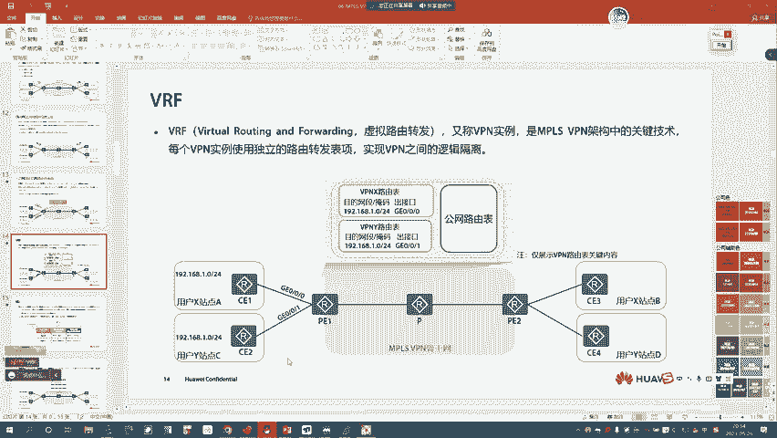

啊，s以啊，我们在交换机上学过一种东西叫微纳。😊，是吧微烂的特点呢，我们来给他分一下啊，就是微烂呢。😊，有属于这个危难的街口。对吧。有属于这个危烂的。嗯，卖克地址表。呃。啊，有啊，那那那就没了，就这些。

就这些啊，对吧？所以说我们在IA的时候学过一种微难呢，它不就是这个特点嘛？一个交换机我想划分成两个使用，我们怎么样划分啊？😊，怎么划分啊？划分微烂嘛，对吧？这是微烂一，这是微烂2是吧？

每个微烂它都有单独的接口。😊，是吧呃，有自己单独的卖克地址表。是吧嗯，ARP表我们就不算了啊，这里都是在二层上的。😊，那在我们的VF它就是这么一种啊，就是把微烂的概念烫到路由器上了。😡。

是吧那路由器上去叫VFVF有什么特点呢？😡，有属于这个接口的。啊，有属于这个VRF的接口。有属于这个VRF的。呃，路由表。好吧。嗯呵啊，那就没了，又这两个啊。😊，注意啊，一样的概念啊。首先我们来想一下。

如果一个路由器。这些接口。他们有一个单独的录由表。路由表，我们假如说叫A这些接口呢，他们有一个单独的路由表叫B。那跟我们的交换机上。交换机看麦克地址表转发吧，对吧？

所以说我们可以在逻辑上让他有多个麦ag克地址表，以及有属于这个微烂的接口嘛。😊，啊，每个微栏有一个麦克地址表，以及有属于这个微烂接口。我换到路由器上，不就是。😊，把这个二层口变成了三层口。

把麦克地址表变成路由表嘛。所以说这是不是一种嗯把一个路由器划分成两个路由器来进行使用的一种逻辑隔离技术。所以这两个逻辑一不一样。大家觉得有不异样？一样的吧。对吧一样的对，没错。啊，那这时候呢。

我们基于VF它有什么样的特点？我们看好。😊，那除了这个呢，还有一点呢，麦克地位表他可没有什么路由协议是吧？哎，VF呢有属于。😡，这个VIF的啊路由协议。那基于这个原则，然后我们再来看。

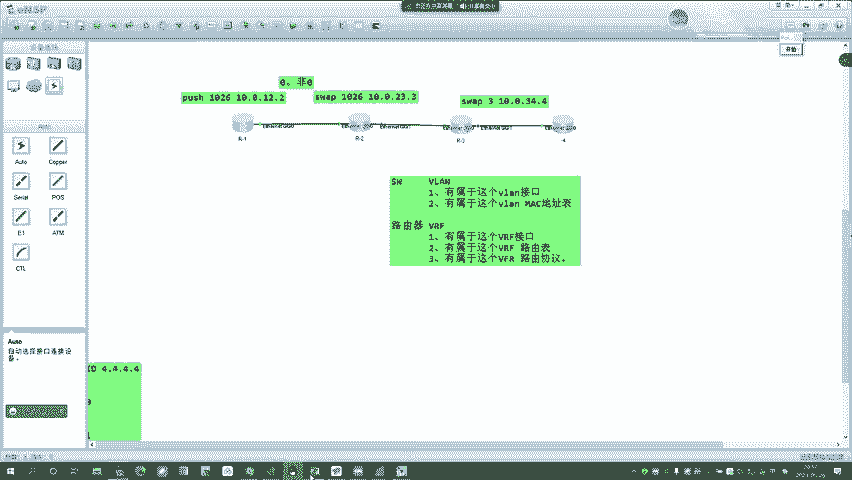

如果说我们把这个路由器两个接口给它逻辑隔离开。这边放到VF1，这边放到VF2。两个人的路由单独保存。两个人的路由协议呢，这边跑OSPF，我这边也跑。是吧两个。呃，这个路由协议呢也是单独的。

因为每个VIF都有，那这时候还会不会有冲突？会不会？会不会有冲突，不会了，对吧？你接口啊，麦克地址啊，不是啊接口路由表，路由协议完全隔离开了，还有什么冲突呢？没有了。对吧。那这时候我们去想啊。

哎我给这个客户换一个给这个客户换1个VVF啊，这是A啊，这是B。对哎，老师，我我运营上内部我也得有一个吧。😡，是吧我不能一个路由器划分两个虚拟路由器都给客户用了。那我自己用啥？😡，还能明白吧？

所以说那在我们的运营商内部呢，也要跑1个VF。那这个VF一般我们是默认的。😡，好吧，就跟所有的这个。呃，交换机上所有的接口默认在微栏一一样，对吧？所以说在路由器上，所有的接口都在一个默认的VF里面。

这个VF我们就把它叫做public。😡，好吧，这叫palic，有时候也叫做公网。能不能明白？那这时候我给大家看一下啊，大家就更容易明白了。

比如说我们之前再去看diplayIProing table的时候，您发现有一个点。😊。

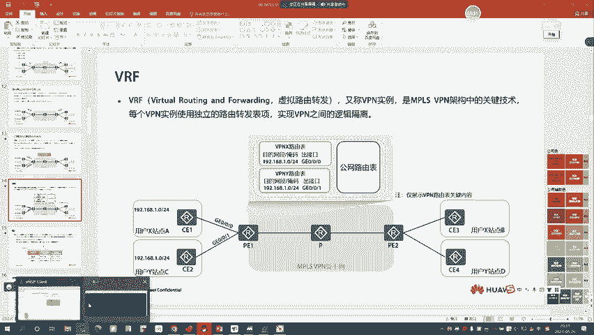

路由表箱在哪个表里啊？public，这就是默认的微栏一。😡，能懂吗？比如说现在呢我创建一个，那命令大家先不用管IPVP instance，我创建1个VF。😡，对吧嗯，RDE冒号1D是啥。

不用管D四 playIP。😊，Rooting table。V偏in V篇E。啊，现在这个下面没没没没没。1。1点1。2。哎，喂1。2啊。呃，我配个IP地址IP。把它绑定到微P一里。啊，IP重新拍一下啊。

然后第四 playIPing table vP是VPE。😊，这个有没有一个单独的录音表？然后我们displayIP入table。public默认的有没有一个单独的录由表？有吧。

所以说他俩的区别我们可以看到就是名字的区别。public就是交换机默认的维栏尼。😡，这个大家明白了吗？明白，同学敲一啊。😡，没问题吧，这个就是默认的维乃仪。😡，啊默认所有的接口啊是吧，他们都是属于谁呢？

属于plic的，就是围栏一的意思。😡。

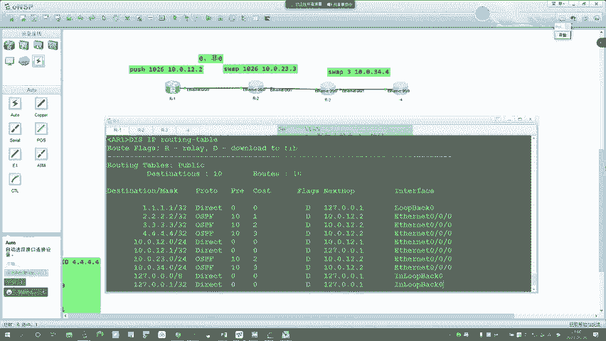

然后这时候呢，我们再回过头来看。对吧哎，怎么样区分客户的路由呢？我就给每个客户啊。我给你个VIF直接路由隔离对吧？三层完权隔离。你现在通讯不都基于三层的吗？啊吧，我全部给你干掉，你只要IP不通。

你什么都不通。😡，是不是这个道理呀？是吧。那我自己内部啊哎。😡，因为未来我P1收到路由，我还得传给P12呢，我得有能通，对吧？所以说内部呢用的就是p big啊，用的就是v站一。

那这个一般我们也叫做公网路由表。😡，啊，那这就是VF的概念。那VF概念之后，学完之后呢，我还要接触一种技术啊，这个东西呢叫做RD。注意啊啊叫做阿迪。ID是怎么样的呢？我来看一下啊。呃。

PE呢接收到不同VF的CE发过来的前缀。本地根据微P实力去区分，注意啊。所以说P1本地能不能区分1。0跟2。0啊，能不能区分2个1。0啊，可以，为什么呢？有2个1。0在不同的VP实力。

但是VIF它只在本地有效，我在P1上配了其他的设备没有啊。😡，是吧。哎，这时候怎么办呢？这时候我们接触到了一种新的。是吧就是VP实力呢只是本地的概念。😡，屁本地。对吧呃，能够区分。

是吧本地根据微P实力区分。但是呢我们传递给对端PE的时候，因为我们刚学过程是怎么样的？这个PE得传给这个P。😡，哦，这个P2就懵逼了。是吧传递给对端PE诶，对端PE咋区分呢？😡。

是吧这就相当于什么一样呢？😊，这是一个父父亲对吧？嗯，有两个双胞胎，1。01。0对吧？嗯，AP板地他自己能区分。是吧中间设备不用学啊，学不到啊，不用让他学啊，我们通过BDP直接跨跳船过去。😡，好。

那传递给P1之后呢，P1传给P2。😡，哎，这时候P2不一样啊，他没有VF啊，他没有直接连接啊。哎，一看哦双胞胎啊。😡，是2个1。0P2有没有办法区分？大家觉得有没有？没有吧。在P2的视角中。

这就是两条一模一样的路由啊。是吧哎，那这说我们如何让远端的设备。对吧来进行区分呢，就增加了另一个新的概念叫做RDRD叫做路由标识符。路由标识符是什么意思呢？我举个例子。😡，比如说现在有两个双胞胎是吧？

😡，那两个双胞胎呢，一个鼻子啊，不是鼻子啊，说鼻子可能不太好看是吧？呃，一个呢在这个呃这个脸颊上对吧？嗯有个痣。😊，对不对啊，有个痣啊啊就那种小点点，大家应该都有吧，知道什么。😊。

这个应该是全国通用是吧啊，有个制。那还有一个呢，没有治。对不对？那么在这时候，你能不能把他俩区分出来？就是如果他们。没有标记的时候，你就没有办法区分。但是有一个人带个质，有一个人不带制。😡。

那么在这时候呢，你看这个质，你能不能把他们俩区分出来，可以，但是这个质本质是什么？😡，本质就是一个标记。对不对？那我们的网络中也是一样的，它跟生活离不开，对吧？

你要知道协议技术它就是人发明的那这个人对吧？无非就是外国人和中国人发明的区别来。外国人可能用外国人的思维去发明，中国人就用中国的人的思维去发明，对吧？但是本质都是跟人。😡，都是人想出来的对吧？

他跟你的生活离不开。😡，对不对？所以说ID呢他就相当于给路由打个标记。😡，哎，你VPN客户的RD啊都带个一啊，你VP客户B的RD啊都带个2。那这样远端的能不能区分？拿不拿？可以吧，是可以的。对不对啊？

所以说ID呢，我们就把它叫做路由标识符。😡，一共是8个字节对吧啊，用于区分相同的IPV前缀。就是这每个路由呢，那它都会有RD，对不对？那这个RD呢就做于唯一的区分。那这个ID呢，它有两种表现形式啊。

一种呢。是type0，还有一种呢是type1。好吧，一种叫type0，还有一种叫type1。那这两种表现形式呢只是后面的区别啊，type呢就是两种类型。那具体RD长什么样子呢？如果我们用的第一种。

前面这两个字节呢，一共是8个字节啊，注意前面两个字节呢，我们用的就是A号。好吧，一般建议用AS号啊，后面的就你自己去定义了。😊，然后如果我们用的是下面这一种。前面四个字节呢是1个IP地址。

一般我们建议就是PE的IP地址啊。然后后面两个字节你就自己去定义了。

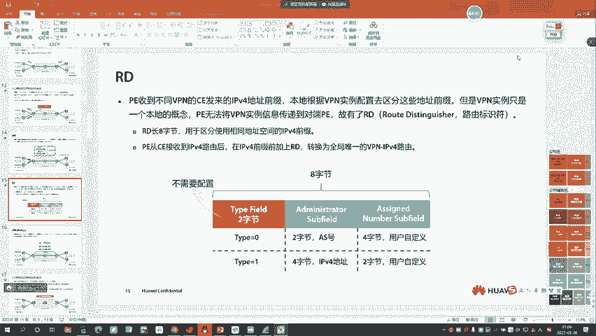

那这两种如果换影视成实际的，他大概长什么样子呢？

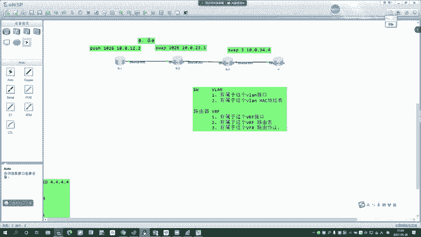

我们来给大家写一下。比如说呢在啊在下面有一张图啊。啊。比如说呢。你用户X的1。0啊，我给你来个100冒号一。对。然后你用户。Y的1。0路由啊，我就给你来个200冒号一。对不对？然后我把这一串啊。

我发给P2P2知不知道这俩路由啊？他一看路由区分符，咱不就是告诉我这俩路由吗？😡，对不对？那这时候R啊P2是不是就能够区分出来哦，这是两条路由，只不过前缀一样了。所以这个大家能够明白吗？明白同学敲一啊。

没问题吧。就两条路由长得一样是吧？但一个有痣是吧？一个是红痣，一个是黑痣。是吧啊，那这时候PR就能够区分出来。所以说是RD的作用。然后我们再来看。哎，这时候呢，我们还有一个问题是什么呢？是吧？哎。

老师这样好像没什么问题了，就路由传过去了，路由传过去之后怎么传呢？😊，对不对？就老师这怎么传过去啊？😡，P1收到之后，他怎么传给P2啊？我们有很多协议有ITP啊OSPFISS。😊。

对吧还有BGP但这有一些历史原因啊，就是最终我们只选择了BGP。有一些历史原因啊嗯因为这技术发明的比较早啊。嗯，然后OSPF扩展性不好啊。嗯，这技术基本跟ISS换到这个TCPIP的。啊。

这个年代差不多啊，就那时候ISS呢嗯在我们的这个呃TCBIB模型下还没有大范围的去部署呢。所以说那时候也不建议直接去用ISS。所以说呃选了半天呢，最终还是选择了BDP。😊，好吧，那BDP呢也有一些好处。

好处是什么呢？它可以跨跳建离，那中间的设备哦。😡，还要不要？是接收这些路由，不用吧。对吧所以说我们在升级的时候，这个设备升级，这个设备升级，中间设备需不需要升级啊，不需要。😊，是吧这是BGP的一种优势。

还有一种呢，BDP基于TCP建立可靠性更高。是吧可以跨路由器建立，直接在2个PE之间传路由。对不对？那OSPF行不行？不行，OSPF还得让这个设不行。😊，对吧那你这个ISS行不行？ISS也不行。

是吧因为ISS有一些历史原因啊，那因为那时候在这个。嗯，TCPIP这个。模型下还没有站稳脚跟。那时候可能刚搬过来没多久。还有一点呢，BGP的扩展性比较强。😡，对吧BP也是基于TRV的啊，扩展性非常好。

😊，嗯，第二还有一点呢，就是BDP只发送更新的路由啊啊，不占用过多的联入贷款。因为我们发现BDP它持有什么更新。这有什么关系？周期更先。是不是周期更新？对吧BDP是有处罚东西。

所以说呢当我们的VPN客户越来越多的时候，是吧？比如说是吧我们部署了这项技术之后，呃，这个技术以后广泛的应用之后，那我们的VPN客户以及四网路由会非常多。😊，那么在这时候呢，我们用BGP呢。

只有触法更新啊，也不用再去周期的更新，去消耗链路带宽了。但是有一点问题是在哪呢？哎，我们之前学的BGPR。😡，他都是IPV4路由。对不对？但是现在我的路由啊，他加上了阿D。😡。

他跟之前的路由还有点不一样。就我们之前的IPV4BDP啊，它传不了。大家能懂我的意思吧？是吧还传不了。😡，传不了怎么办呢？传不了就要进行扩展。对不对？就得进行扩展。那怎么样扩展呢？啊。

就得让BDP去支持另一种叫做MPBP。就是得支持VPNV4路由的传递功能。什么是VPV4路由呢？就是我们一个路由加上RD之后。路由加上RD之后，我们就把它叫做VPV4路由。听懂吗？

那传统的BDP它传不了VPV4路由啊。那这时候呢，我们得去扩展一种叫做MPBGP。展品BTP呢。嗯，大家都比较熟了啊，咱们学这个IPU6BGP的时候给大家说过啊，待会我们再来看一下。好吧。

然后我们休息10分钟，1分钟之后呢，我们再来讲一下是吧，什么是MPBGP啊吧，以及在这个嗯MPS场景下，这MPBGP呢它大概的一个作用啊。😊，咱们休息会儿，好吧。😊，好，我们开始吧啊。呃。

既天有同学问到，我给大家说一下啊嗯，小白白同学说的一个团体属性啊。😊，嗯，这往期我往期往期啊往期我还讲了一下，这期没给大家提啊。给大家说一下啊。呃，我给大家说一下小白白同学的意思啊，是这样的。呃。

就是我们本质这个ID不是一个标记嘛，是吧？哎，那这个标记老师我用团体属性进行标记行不行呢？呃，可以注意啊，理论上是可行的呃，但是有一点区别呢啊就是团体属性它有一个特点。大家知道啊。

就BDP撤销路由的时候呢，是不携带任何属性的。😊，是吧呃，比如说2个1。0都传给P2了。但是现在呢呃这1。0失效了。所以说我们在撤销的时候呢，没有办法去携带团体属性。你把这撤销报发送给P2之后。

他不知道删除哪一条。😊，好吧，所以说这就是团体属性。为什么不能呃直接用于做标记的原因？好吧，但是新增出的RD呢，它是属于路由的一部分啊，就是RD加上IPV4前缀呢才做成了VPV4路由。

就RD它属于路由的一部分。好吧，就是团体属性啊，在理论上是可行的，就是可以用于做标记的。呃，但是呢我们在撤销路由的时候呢，不携带这种属性。所以说呢没有办法直接把团体属性应用上去。

对吧那如果说比如说老师我让撤销的时候，携带团体属性行不行啊，嗯，也行，对吧？那协议就变得复杂了，能明白吧？啊，不如我们重新推倒重来，对吧？啊，加一上1个ID。😊，好吧，所以说是这么一个意思啊。😊，嗯。

那这个意思大家明白了吗？明白的同学敲一啊，没问题吧。好吧。然后我们来看啊呃刚刚给大家说了，对吧？呃，PE之间呢，我们要通过MPBDP传，为啥呢？因为传统的BDP呢还不能处理VPV4路由。😊。

是吧MPBGP呢呃之前给大家说过，像什么VPV4啊，VPV6啊，对吧？呃这个。😊，IPV6单波啊IPV6主播啊等等之类的一大堆是吧？啊，他们都属于MPBTP。APPP中的一个子分类呢叫VPNV4。啊吧。

那我们未来呢就是通过唯平V4啊去传递这些路由的。那这也很简单啊，就是通过MPreable发路由MP unreachable撤销路由是吧？跟IPU6没有任何区别啊，这个很简单啊。

待会呢我们做实验呢会去通过抓包去看。😊，好吧，所以这里大家先知道一下啊，呃就是MPreachable以及MP unreachable一个发路由啊，一个撤销啊，就这两个啊跟IPU6是一样的。

就是我们通过唯平唯四啊，把路由传递过去。对不对？那传递过去之后呢，现在又来问题了。哎，P2收到了。😊，P2收到两条路由是吧，根据RD，我知道这是两个啊用户的了对吧？哎，哪条路由是给X的，哪个是给Y的呢？

😊，对不对？哎，P2就比较挠头了。哎，这谁是谁的呢？😊，对吧。哎，给谁呢？是吧哎P2也不知道。那这时候怎么办呢？这时候嗯我们还得需要一个啊标记。注意啊，还得需要一个标记。怎么样呢？比如说。

我们在这里啊注意这个标记，我们把它称作RT啊啊叫做路由目标。这个RT呢本身注意嗯大家可以理解成它是一种喜好啊，这个喜好代表什么意思呢？注意啊呃，比如说在C一这里。😊，我们可以给他配1个RT啊。

一个出一个入。出呢是一啊，然后入呢也是一。所以说未来这条路由发布出去的时候，会带着一个触发T一。那X这边呢，我们让他接收一，就是让它的入是一。对不对啊？那这样带一这个RT的路由呢就转给X了。

然后我们只需要做一下区分哎4CE4这边呢啊我们用二对吧？这边的入用二啊，这边的出。有2。对吧你二的路由呢移过来之后，一看呢，这个CE3啊，他喜欢一，对吧？他不喜欢二，所以说你二就进不去，对不对？哎。

但是CE4喜欢二啊那所以你二就可以来这里了。😊，好吧，所以说出呢会随着路由来进行发送。入呢就代表着什么样的路由可以进行传递过来。啊，那反之过来也一样，反之C3的路由也要传递到C1呀是吧？

所以说你也得有个出啊，他也得有个入。😡，对不对？你的出可以是3，那他的入也必须是3。好吧，那这样的话，一出一入对吧？就类似于加E一样，对吧？我的圆等于你的目的，你的目的呢等于我的圆是吧？咱俩互相配对。

😡，对不对啊，天生一对。能不能明白？所以说现在呢我们就可以通过这种RT对吧？去控制路由呢发送给哪个CE。那这个是通过RT啊来进行控制的。那接下来我们来看一下。RT对吧，他是怎么样的？我来看啊。😊。

那RT呢一共是分为了两类，一个叫做ERT啊，还有一个呢叫做IRT。好吧。那ERT呢它是PE本地PE从直接相连站点学到VPV4路由啊，学到IPV4路由之后啊，转换成VPV4。那然后去加上1个ERT啊。

我们把它叫一的RT。好吧。然后LRT呢是收到了其他PE发布的VPVV4路由，就站到P2这边，你发过来一条VPVV4路由啊，是吧，我会去看你的ERT跟我哪个LRT匹配。😡，那么如果匹配的话。

那这个路由才可以传递到对应的站点。所以说我们在去控制路由属于哪VP实力的时候，只需要提前进行规划啊，规划什么呢？这边出RT是一啊，这边入是一是吧？这边的路由就可以传过来。那这边的出是一。

这边的入也是一啊，这边的路由也可以传递过来，然后下面都用R啊加以区分就可以了。好吧，那这就是RT的作用。好吧。然后我们再来看。接下来还有一个。嗯，这是废话啊，先不用管。😊，将来还有一个问题。

那我们通过RT呢，可以让两边的路由互相的传递，对吧？这边的路由也可以互相的传递。路由传递成功，那无非就是转发数据了吗？对不对？转发收据怎么转呢？我们来想一下哦。😊，3、把目的地址1。1的数据发给P2了。

对吧。哎，那P2转发给PP能不能识别啊？目的地是1。1，他路由，他俩直接传了，屁都看不到。😡，是吧没办法识别，但是能不能这样呢？大家注意。😡，我在上面呢打上1个LDP的标签，打谁的呢？打1。1。1。

1的。是吧。那这时候我带一个标签，比如说1024。传递给P了P看1024，他能不能转发给P1啊，因为1024，他知道1024的标签是1。1啊。😡，能不能转过来？可以吧，这不就是走了一层隧道嘛？

之前不给大家说过了吗，对吧？标签他不就类似一种隧道吗？😡，对不对？哎，你识别不了，我给你加个标签，加上P1的标签，你只要能转发到P1，他能识别啊。😡，是吧。所以说我们加一上一层LDP的标签行不行呢？

可以加上一层LDP的标签呢，可以让数据正常的到达P1，但是又遇到问题了。😡，遇到什么问题了？P设备倒数第二条弹出P1收到了一个目的地址，1。1的数据。😡，对吧192。168。1。1的数据。哎，懵了，哇。

这有2个1。1啊。是吧。哎，那给谁呢？是吧。P一也看不出来了，哎，他是谁的呢？他是用户X的还是用户Y的？😡，他也懵了。啊，你P是备蒙，你走LDP的隧道可以过去，但是你到PE上P也懵啊，P他不知道给谁啊。

😡，是吧。就是在你的数据包中呢，他不携带VPN的相关信息。😡，所以说P1呢，他一看数据包1。1，他也不知道给谁。😡，对吧。哦，对，有VPN路由表，但是两个VPN路由表都有1。0啊。😡，是吧。

他不知道给谁了。😡，哎，这是哪一位片呢？是S的还是Y的？是吧。哎，头疼。对不对？哎，想不出来。😊，所以说呢为了解决这个问题呢。嗯，我们还有一种。还有一种呢叫做刚刚用的这种标签呢是LDP的。LDP呢。

我们把它叫公网标签。好吧，他是用于指导报文，经过P设备到P1的。那到了P1之后，P1也要能够识别啊，P1怎么识别呢？啊，又来了一种新属性，我们把它叫做丝网标签。😡。

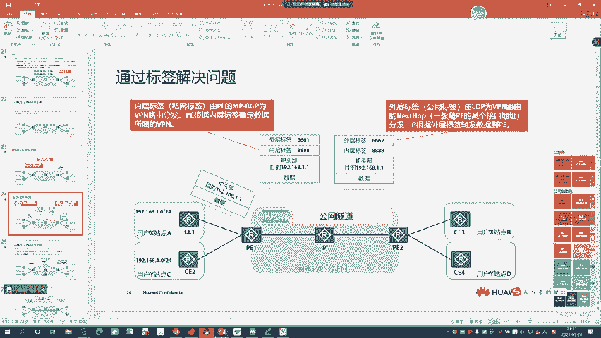

好吧，叫丝网不要签是这样的，我举个例子。😡，比如说啊。P1呢他为这边只要属于这个VPX的。路由啊。我都分配一个X标签，然后属于Y的路由啊。我都分配一个Y的标签，然后我把这些信息全部发给对端P2。第二。

收到之后怎么办呢？一看阿D知道这是两个客户的路由。一看RT呢分别发送给不同的用户。是吧。但是还有一个色网标签哦，注意这时候呢，如果AC3再去访问它所对应的1。0，他把数据发给P2。

P2这个接口属于微PN实力，那这个微PN实力有没有一条路由，192。168。1。0啊？😡，有没有？😡，有吧。😡，对吧。我看到这条路由之后怎么办呢？😡，他有一个丝网标签。注意啊，他有个4万标签。我这样。

😡，PR怎么样呢？1。0啊。我先打上X的标签。4万标签。对，然后公网标签呢，这条路由的吓一跳，他不是1。1。1。1吗？😡，对吧我再打上1。1点LDP的标签，1024。我携带两层标签。我发给你P设备。

P设备看1024。他知不知道给P1呀？😡，他知不知道？他知道吧，因为他知道怎么去往1。1。1啊公网互通的。😡，但是这个丝网标签一旦到达P1之后，P1一看哦，我给这个实例分的是X，给这个实力分的是Y。

你现在带着X过来了。😡。

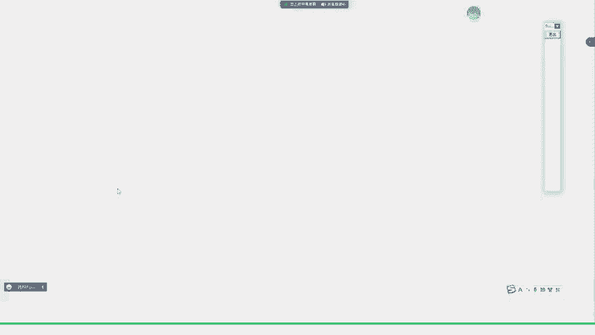

那他是找谁呀？他找谁呀？他是不是找这个卫聘实力啊，直接发送送到这边了？对不对？4万标签会弹出啊，在P1呃会被弹出掉。好吧，但是在这里只弹掉公网标签啊。😡，好吧，倒数第二条只谈公网表签。

所以说P1根据四网标签呢就转发给C1了啊这样就通了。😡，对不对？所以说通过标签啊来进行解决，怎么样解决的呢？我啊先来一层丝网标签，8888是吧，再来一层公网标签LDP的。我把这个数据发给你P设备啊。

你看6222对吧，执行swipe交换，然后把这个报文呢发送给P1，但默认是PHP啊弹出。P1收到之后呢，如果他收到带有外层，这个肯定被弹出了。是吧？如果收到不带有外层，就只有一个内层叭叭叭叭。

那P1他给X这个站点分配的8888，他还能不知道吗？是吧这就相当于什么一样的PE某一天给他发了一条路由，告诉你。😡，对吧你未来给我发快递呢啊，你按照这个地址发。那未来他收到这个地址的快递，对不对？

他是不是知道往这里发？😡，能不能明白，就是我跟你说，你给我发数据呢，你带这个标记。😡，对吧。就是我把这个路由给你给你的时候呢啊就你给我发这个数据，访问这个地址的数据呢，你带这个标记。

那你只要带着这个标记过来，我就知道你要访问哪一个了。😡，所以这就是啊4万标签的作用。好吧。那这个标签怎么样进行传递的呢？它是随着路由啊来进行传递的。他这样的啊。我首先不是有公网LDP的标签吗？对吧。

嗯啊这一块先不用管，就LDP已经打通了啊。然后我们给他传这个路由的时候啊什么RD啊，吓一跳啊，label啊是吧呃，RT啊。😊，对不对，我再给你来一个。死网标签，我告诉你，你待会给我传数据打这个标签啊。

是吧啊，就这么给你说了。那给你说完之后呢，你就来访问我了。你反问我是怎么样的呢？啊，这里就没了啊。啊，下面就讲完了。好，下面就是数据层面了啊。注意啊。然后我把这个传给你之后呢。嗯，你就来反问我。啊。

然后访问我的时候呢。是吧1。0P21看。我有一个丝袜标签，8888对吧，先给你盖上，盖上之后，我一看。我去完，你得先去你的吓一跳啊。对不对？这不就跟我们那个OSPF的ABR一样吗？你希望这个外部网络。

你得先去ABR。😊，是吧BGP不就先去吓一跳吗？1。1。1。1哦，1。1还有个LDP的，我再把LDP给你干上，6662。所以这时候转发给PP1看6662对吧？倒数第二条弹出把8888发给P1了，P1。

然后转发到站点了。那这样就通了。啊，那整体呢我们来看一下路由交互的全部过程。首先呢嗯我们的CE呢跟PE之间要运行IP或者呃EBDP交互路由。啊啊有人问了对吧，老师咋不是IBDP啊。

没有IBDP啊运营商他可不给你跑ABDP啊。😊，好吧。然后就一B批就你客户这边自己的AS号，你自己规划。然后你把路由传过来之后呢。丝网路由就会存储在微拼实力的路由表中啊，在这里会有一个单独的路由表。

对不对？有1个1。0。然后呢。P1把这个路由呢变成VPV4路由。对吧，然后VPV4路由就传给你了，传给你的时候有几个关键的信息，什么信息呢？RD。RT。死网标签。还有吓一跳。对，这四个信息非常关键。

P2收到之后，一看RD哦，能够区分出来相同的路由。对吧啊，这是标准啊，不是厂商自己分配的这标准。是吧一看D呢，他能够区分出来啊，再一看RT对吧，他就知道给发给谁了。😊，是吧上边下一跳，现在先不动。

那这样路由就传过去了。对不对？路由传过去之后，你C以三访问过来之后先来一层丝网标签，然后看这个路由下一跳1。1对吧，打上一层LDP了，啪啦啪啦过来了啊，最终传过来了啊，就这么简单啊。😊。

那我们老听这些虚话对吧？呃，没有实验的，可能大家感受不到，对吧？下面还有什么报文转发过程呢？我们讲完之后，你再一看你就啊明白了。😊，好吧，那这时候呢我来给大家做个实验啊，让大家能够感受一下。

我们先做个简单的啊，先做个简单的。😊。

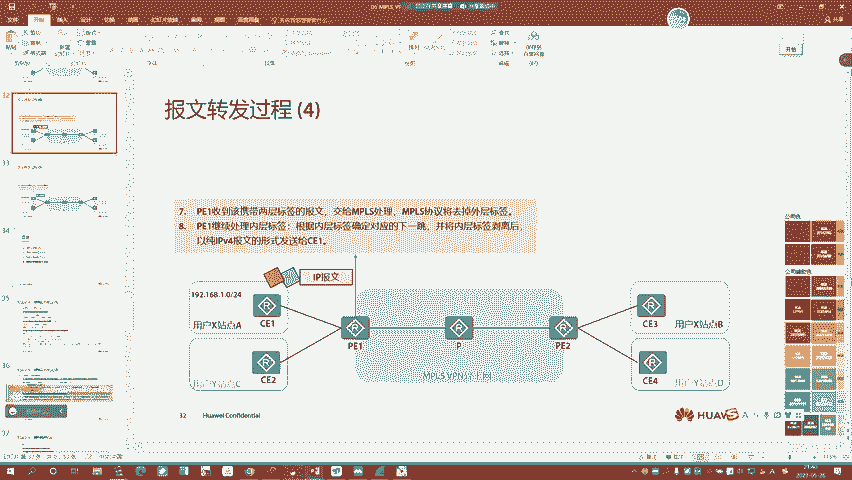

这简单的我们这样来做啊。嗯。

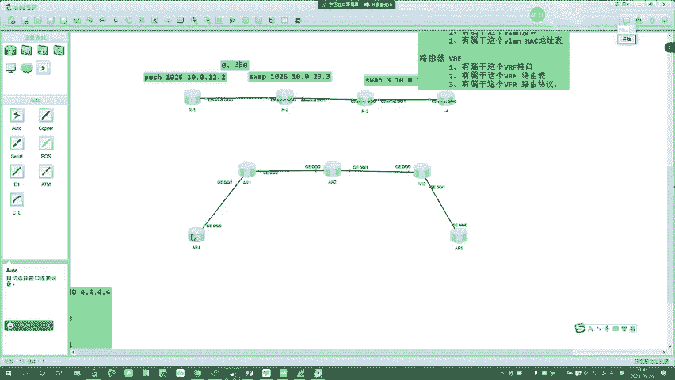

呵。😮，呃，上面这有我给他关了啊。

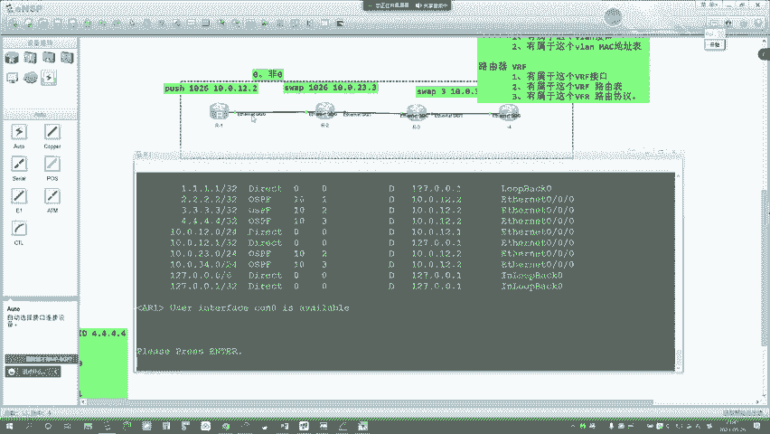

MPBTP还没用到啊，待会做实验你就能看到了。嗯，我们这样啊，我们在这里呢给他。啊，然后在这里啊然后在这里。好吧，我们这样来划分啊。😊。

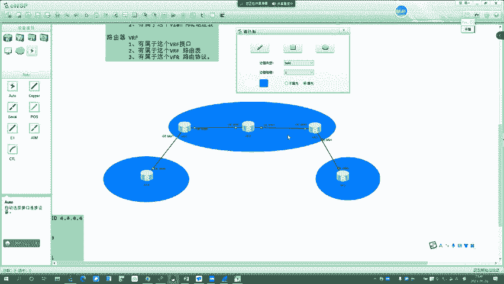

呃，首先大家注意啊。对角色的划分呢，我就简单写一下啊，这是PE。

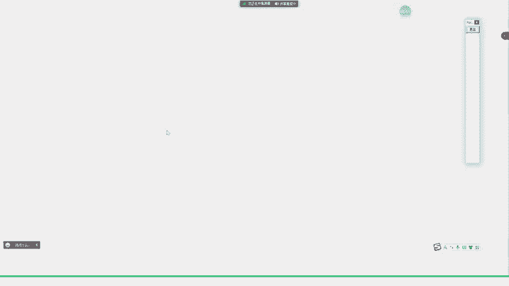

这是皮议。这是P，这是CE这是CE。好吧。嗯嗯。六七呢我先拉一下啊嗯，当然我们这节课做不完了，就六七呢可以大家可以下去做一下啊。然后我们来做一下啊，那中间呢我们怎么办呢？我们用的是。MPS。

对吧他是运营商的啊，MPRC的一个独漫。然后在这边呢，我们待会儿直接用这个啊我们这样啊呃，我在这边呢用这个BDP。好吧。呃，在这边呢用个。YPF。行吧。嗯。然后上面这两个啊，大家如果课下去做。

你们可以用什么ISS啊跟静态啊去跑一下啊。你这边你可以用个什么S。SS吗？对吧啊，这边可以用静态啊嗯。静泰。我先把基础IP拍一下啊。

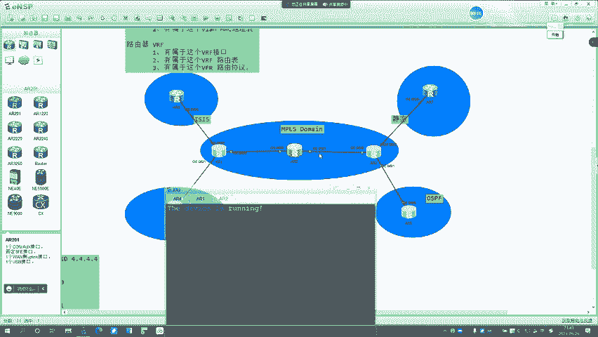

嗯，A24上我们。改一下名字，然后一改一下名字，然后二改一下名字。三呢改一下名字对吧，然后五呢也改一下名字啊。一上面啊4上面70-0-0。14。1。娄百0呢是4。4。4。4。然后A21上啊呃。10点。

0。14。1。好吧，然后是G0-0-0。10。0。12。1。嗯，然后我们起个环回口呢是1。1。1。1。然后二这边呢G0-0-0。IP address10。0。12。2。70-0-0。呃，10。0点。啊。

G0-0-1。10。0点。23点儿。interface low百林IPU dress2。2。2。2。是吧。然后三这里的话是G0-0-0，然后23。3。呃，70-0-1。是35。3。然后楼百林。是3。3。

然后五这边呢，是这个。70-0杠0。35。5。然后我们起个楼板零接口啊。5。5。5。532。那基础IP配完之后啊，我们来做一下基础配置。

呃，MP14的配置思路是这样啊。首先第一步呢，大家要配置。官网APP。那呃，公IP配置互通之后呢，配置。会是公网MPS和RDP。

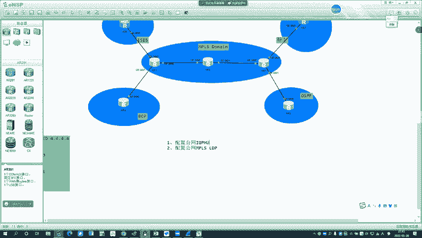

好吧，所以说我们先把这个公网上的来做完。A1上呢，我们就跑1个IGPOSPF我我们就直接刷了啊。

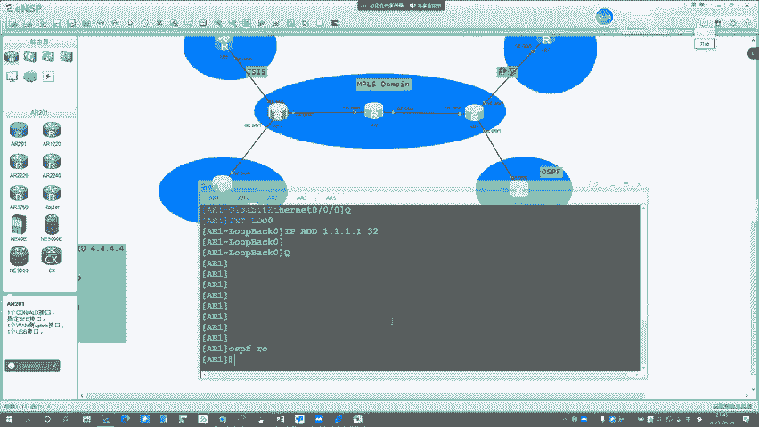

呃，OSPFE0network0。0。0。00。0。0。0。

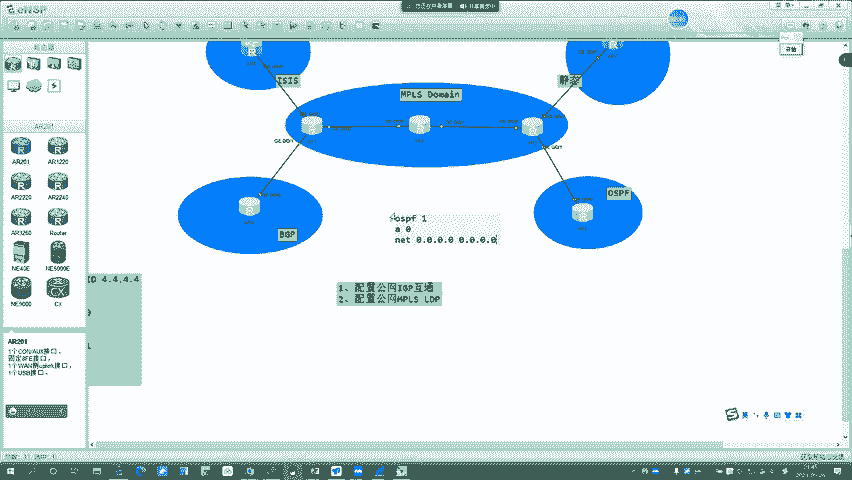

然后R这里然后R3这里。

啊，这里做完之后呢，我们再去跑这个MPS。呃，MPSRSRSOSRID。啊，1。1点1。1MPSMPSLDP interfacefaceG0-0-0。

MPSMPSLDP interfacefaceG0-0-1。啊，这是AR1的。然后。2。2。2。2。这是AR2的。然后。3。3。3。3。

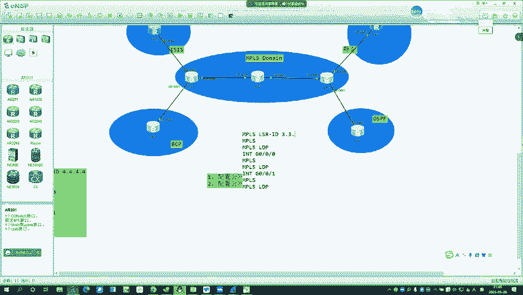

这是A23的。那做完之后呢，如果他们的OSPF邻居。pR建立正常的话，AR一上就会有3。3的LP啊。反过来呢三也会有一的LP。

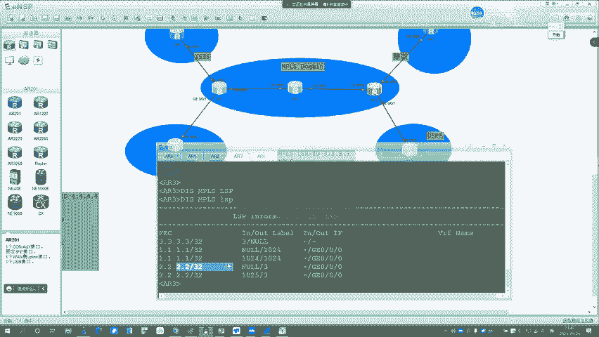

对吧。呃，这一步做完之后呢，接下来我们就要进行MPS的相关MPSVPN的相关配置。这个配置首先第一步呢要在每个设备上去创建一个微P实例啊，我们把这个叫做。配置VPN实力。RDRT啊。

这些都需要我们提前进行规划的。

呃，假如说这边呢，我们把它放入到VPN实例A中，对，这个名字啊这只是一个名字啊。然后这边呢我们也放到VP实例A中。那RD呢，我们得跟上面的区分开啊，跟其他的客户区分开啊，所以说这边的RD呢。呃。

我们可以这样啊用这个一冒号一。对的。呃，然后RT呢有两方向，有1个ERT，有1个IRT。我们也用一码好一啊都用一样的啊。这员也用于马云。对吧，然后针对于这边呢，我们用的一样。啊。

这样他们两个的互相路由才可以互相传递啊。对吧那对RD呢啊不对啊，对于上面这个微P客户呢，咱们可以这样。他叫VPNB。对，然后是2冒号2冒号22冒号22号22号2号。对吧给他区分开。

就是不同的微品客户呢用的ID啊不能一样。

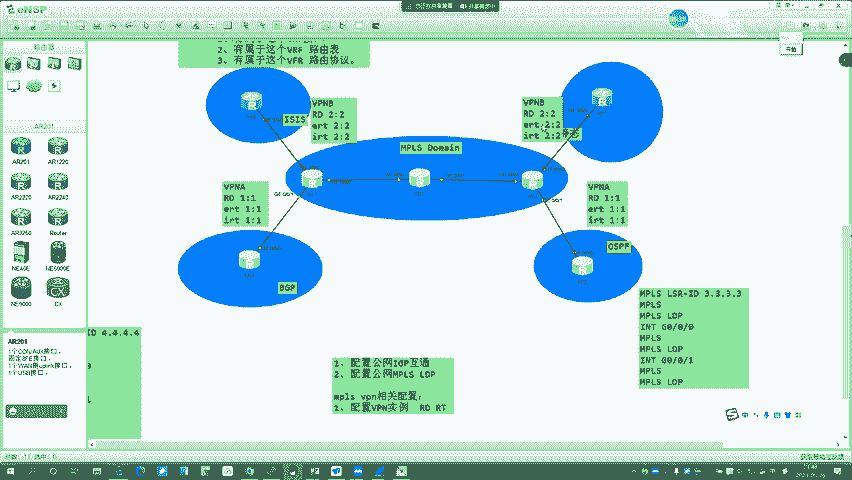

好吧，RT也不能一样。然后这里我们做完之后呢，我们在A2一上注意。叫IPVPNin。

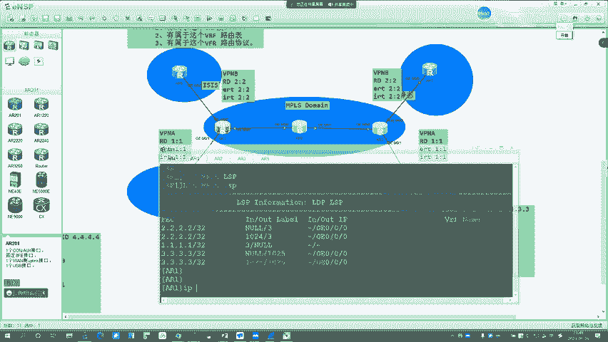

好吧，然后叫VPANA去创建一个VPN实力。创建完之后呢，我们要去给他。配1个阿D。配D之后再去给他配RT。好吧，一冒号一，你打问号呢，后面有几个方向啊，一个是ERT。

一个是LRT或者双向这个双向默认就有啊，比如说我直接回车。我会去发现呢，在A21上呢去多了这些配置。卡了吗？还好吗？没卡是吧，你卡了啊，那个谁。啊，这个同学。是吧。啊，改改快是吧，重建一下啊重建一下。

对啊，我这个配置大家能看懂吗？啊，能跟上同学敲一啊。😊，没问题吧，重念一下曹同学。是吧因为现在用腾讯会议的应该比较多啊，老师还是VIP呢啊啊这个网可能比其他的好一点，但是也也挡不住卡。嗯。🤢，O。😊。

然后呢，我们的业务规划是一样的，我在三这边也配这么去配置。但两边的名名字可以不一样哦。两边的名字可以不一样的。啊，就首先我们把微平实力创建出来，把RTRT啊规划好给他干掉。是吧。做完之后呢。

我们在AR一上，因为我们说了。😊，每1个VF有它属于的接口啊，路由表，还有路由协议对，我们就在AR一上这样来做。首先你得让这个接口属于这个VF啊啊，叫做IP。邦你啊VPN in。本身就可以不一样啊。

它就是一个标记。那懂吗？好吧。就是VP1VIF的名字在本地唯一就好了，它就是一个名字啊。对不对？就像美国有个人。对吧呃。懂了吧？我没说你就懂了是吧？😡，咱俩先有联系。好吧。啊，对阿D也可以不一样。

对阿D保持唯一就行了。就是我举个例子啊，阿D什么时候就是要避免的是什么？😡，比如说你有1。0，我有1。0，咱俩绝对不能一样。其他时候呢一样也没事。能懂吧？能懂我的意思吗？各位同学。可以吧。

因为RD就是区分不同路由的嘛。路由一样的时候，咱俩必须得有ID区分。是吧。但是注意啊，在一台设备上，每个微频实力的RD是唯一的。比如说老师这边只有2。0，这边只有1。0，我给他配1码号一。

给他配1码号一行不行？这样不行啊。在每个设备上呢，每个微频实力跟RD是1比1映射的啊。😡，好吧。现在呢我们把。G0-0-1划分到这个接口下IP啊就帮点VP instance。啊，叫做VPN。A。好吧。

你划分完成之后呢。这个接口的IP会消失啊，所以说得重新配一下啊，10。0点。14。1。啊。那然后我们现在是在G0-0-1啊，做了这么一串配置。给他划分过来之后呢，我们再去看。这时候怎么办呢？注意。

diisplay IP routine table， VP instance， V PN A。你来看一下这个VPNA有没有属于他的路音表啊，广播地址对吧？啊，全255对吧？自己接口产生的32位主机路由。

还有这个网段的质量路由。是吧。那他就有一个单独的录由表。那这时候我们这样啊啊。哎，这个4。4。4。4啊，老师。他怎么传递给AR一呢？之前我们说过BDP啊、LDP啊是吧啊等等都可以去用。😊。

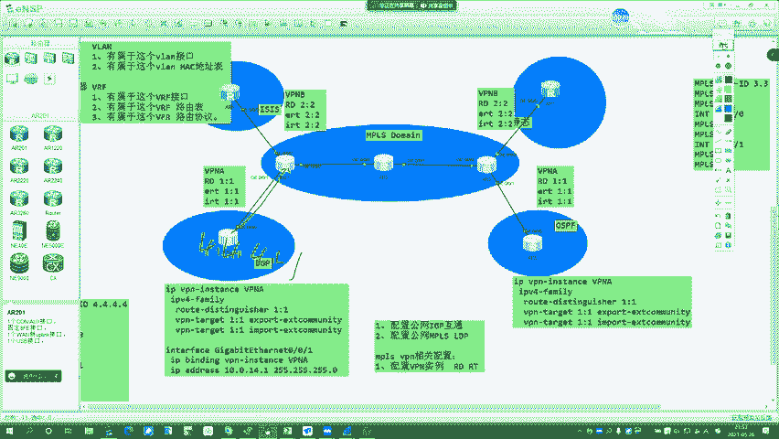

所以我们在A24上这样来做。别去批。我们用65001。P210。0。14点。1AS比如说我们用100。啊，A啊。他说是本地的。A24的70-00，我配的多少？14。4啊。BDP100。啊。

BDP65001。是吧我们的A24跟他就是普通的配置啊，建个BDPEBDP邻居就完事了。然后A2一这边呢，注意BDP100。能不能直接P尔10。0。14。1啊，大家学的行不行？注意啊，这时候是不行的。

为什么不行呢？我来给大家解释一下。😡，AR1要通过这个微P实力给他建立。因为我们说了，每一个微P实力有属于他的单独路由协议。你直接Pre他用public表去查。😡，能不能明白？A24。

它就因A24这个接口是在public的，所以说你可以直接Pre。是吧但这个接口不在怕比卡，不在为栏一。他在VPNA，所以说我们得这样做，在A2一上呢。我哋。

这样啊叫做IPV4family VP instance VPNA。好吧。就是我见到这个VPN实力的BDP见证一下。我给他呢。P210。0。14。4AS65001。那这样的话注意这样AR一呢。

他才会查找这个VPNA下的路由表去找14。4建邻居。是这么一个逻辑啊。那这时候A24为什么不用呢？因为A24这个接口本身就属于plic的，所以它不用。啊，比如说我们这首di四playBDPV平V死奥啊。

不对啊，di四play BDPP。我看到邻居现在在啊激活状态。但是先我们让他啊，邻居已经起来了啊，我们看到。up了啊，我在AR4上network1。1。network4。4。4。4。

自身始发的理由传递给所有的BGP领局。所以说我们来看一下A24本地的BDP表中有了，它会传递给一。哎，那有什么要老师一怎么查看呢？一，我们这么查看DplayBDP。😊，我找着啊。

D四类 BTPro table。我看有没有单独针对微平实力去看的。好像没有。是吧没有啊。电是的比哩皮。嗯，VPV4好吧，我们用VPV42rooting table去看。那这时候我们就可以去看到啊。首先。

在VPAA。VPANA这个进程下哎。为。VPA。这个BGP实例一下有没有收到一条4。4啊？有没有？有吧。但是注意啊，这个人给我传的是IPV4路由。😡，对不对？而我未来要给。A23传的是什么路由？

我得给他传微型V4路由，你给我一条IPV4，没有RD，没有RT，没有死网标签。😡，我们能不能直接传递给这个设备啊？不行吧。😡，所以说在AR一上会自动执行一个流程。什么流程呢？我把这个VPN实力的路由啊。

我一看VPNA收到的。我就看VPA的DRT啊，我直接给你转成唯PV4路由。所以说他会默认做这么一个转换。这个大家明白了吗？明白同学敲一啊。没问题吧，因为我们传的是VPV4嘛，你给我IPV4，我就转一下。

😡，对不对？那转过来之后，我们可以通过。allroing table4。4。4。4去查看一下详细信息。这是我收到的一条普通的。BDPIPV4路由。那这就是我转换之后的样子。那老师怎么区分的呢？

因为我们可以看到下面才是唯凭实力的。是吧那这种带RD的呢。对吧那他才是唯品V4路由，有没有ERT啊？有没有ID呀，有。对吧。那这时候A2一怎么样把它传给三呢？啊，他是这么传的。😡，我们得在一和三之间。

BDP100建立MPBDP邻居。怎么建呢？Pierre。3。3。3。3。A100。P23。3。3。3connect interface nobody0。叫IPV4family进入到VPV4地址促下。

因为我们要传递的是VPV4路由传什么路由，进什么地址处。P23。3。3。3。我们给他激活。激活之后回来看一下。IPV是默认激活的，我们不用管啊，这个场景下你不激活也没问题。好吧。

那这个之前给大家说过IPU默认也是激活的。😊，现在我们就是在唯平V斯地理树下呢跟三区建立邻居了。好吧。然后我们在三上呢也要反向去指定一下。BDP100。P1。1。1。1AS。100P21。1。1。

1那inface百0P21。1。1。1。啊，不对IPV4family VPNV4P21。1。1。1给他激活。激活了就啊，这就来了。对吧那这时候我们怎么样去看VPV是邻居呢？第一4BDP打个问号。

直接P尔是IP单波。IPV6大家都学过了。唯片V4。VPV4。奥片。啊，我看到邻居现在还在挨动啊，多等一会儿，好吧。等一会儿啊。嗯，现在我们就看邻居起来了。林居起来之后呢，A21给我传了一条路由。

对不对？传了一条路由怎么样去看呢？D四类BTPV平V4 allrooting table，我一看。来了，注意啊。首先我收到一条微平V4路由。那这时候我要不要看T啊？对吧这个路由会携带1个RTE嘛好一。

哎，我本地有没有一个威聘实力？是音RTE吗好一啊。有吧。我一看有是吧，我就直接给他导入进来了。好吧，所以说这时候呢。diplayBTPVPV42 label我们去看这条嗯。4。4。4。4。不要。

那在这里我们就可以去看到有一条VPV4路由，对吧？那在微P实例中呢，他就没有ID，就只有一条IP为。对不对？那这个路由就被导入进来了。导入进来之后哎。我比如说啊注意。

这时候呢我们在A23上displayIProoting table。V篇inV篇A。在VPA下。因为我们导入的是哪一个BDP啊VPA的。所以说我在VPA下能不能看到4。4？那么。这是一条什么路由。

BGP路由。😡，但是我们想通过OSPF传给5怎么传？BDP怎么样建OSPF？

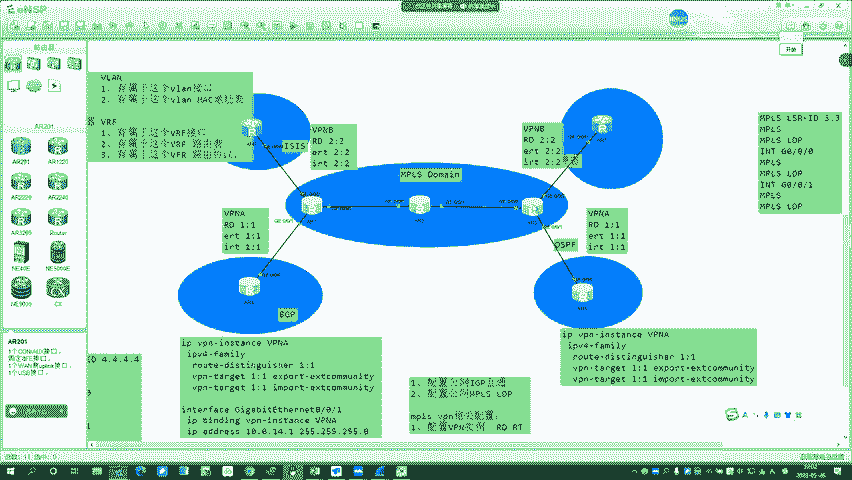

引入。是吧所以说我们得有1个OSPF。2。😡，是吧因为一已经被公网用了。2VPNin我们要告诉给他这个OSPF啊是VPNA的。因为每一个VRF都有一个什么啊？

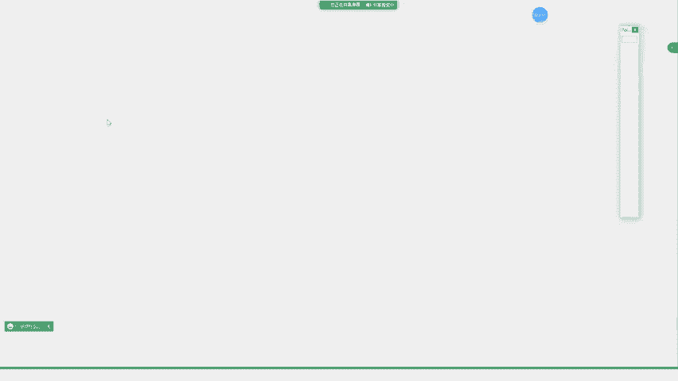

属于这个VF的录音协议。你不敲，它属于Vline一，属于public是吧？你得给他说，这是VPA的。对吧a real0network10。0。35。30。0。0。0。是吧你把这个接口给他通告出去。

通稿出去之后呢，现在我们有一个什么呢？有一个属于这个微拼实力的。BDP。对不对？有一个属于这个VP实力的OSPF。是吧。这不又跟你之前inport直接是public一样吗？😡。

是吧这时候我们直接inport BDP。😡，就完了。他直接会把这个微P实力的。呃，BDP给他引入进来。因为之前之前是怎么样，大家还记得吗？之前他默认执行的是public都懂吗？

之前你之接OSPF2 BTP他一看你OSPF2在public中，他引的就是public的 BDP。现在你是在VPA A他引的就是VPA的BDP而VPA的BDP有没有一条4。4。😡，有没有？有吧。

有了之后，这时候我们来看。😡，如果三跟五之间有邻居，现在呢我们在AR5上。OSPF。一对吧。无用的是什么啊？😡，5用的是public，所以说我们需不需要加维P时力呀，不需要。😡。

是吧我们这样or real0啊，但区号的一样啊，network10。0点。35。50。0。0。0。通告。对吧。呃，现在邻居没建立。啊，起来了是吧，比较慢一点。现在35之间的邻居就建立了。

53之间邻居建立之后，我们在五上第一次位IP租table。不太对劲啊。123都学到了。啊。A23这个接口我们没有划分为平实力。是吧所以说这个接口之前他被宣告到了OSPF1里面。我给大家说一下原因啊。

因为现在在display COCOOSPF。现在在A23上有一个公网的OSPF通告了所有。有1个OSPF2network的35这个接口我们忘记划分微频实力了是吧啊，他就学到2。2跟3。3的了。对不对？

所以刚刚的配置还少了一波G0-0-1，我们来看一下。是不是没有划分？我们给他划分进去。VPNin VPNA。然后IP。address10。0点。35。3。对吧。那么在这时候。对于A25来说。也逆他了。

是吧我们待会儿等他啊，已经放了。是吧。那这时候我们再来看一下A25呢。他有没有学到4。4啊？有没有？有吧。好吧。那他学到4。4之后，反之我们再来想，我在A25上面。OSPF1。aro0network5。

5。5。50。0。0。0。那A23。我得第次playIP roing table，大家告诉我，我直接回车。能不能看到5。5的路由？是吧不行，没错。因为他是在唯拼实力的OSPF学到的。

我们得看唯拼实力的路标。所以说微P实力路由表A呢学到了5。5。对吧哎。那这时候又有一个问题啊。这个VP实力有BTP。有OSPF。我们得想办法把OSPF变成BDP吧。大家能懂我的意思吗？理解的同学敲一啊。

😡，是吧你OSPF路由，我们得把它变成BDP啊。你看BDP现在没有5。5。那怎么办呢？我们得到BGP100下IPV4family VPN。进入到这个VP实力的BDPportOSPF。啊，2。

对吧给他引入进来。引入进来之后，我们diplay BTP v v allroing table。那对于A2。A23来说。注意啊，可以nto work可以。是可以的啊。刚有同学问。

就老师我再唯凭实力一下network行不行也行啊。😊，能不能明白，各位同学。明白乔伊啊，为什么network也行，因为5。5已经加入到我的路由表了嘛，是吧？network也行。😡，好吧。那引入进来之后。

我们来看一下。啊，当然直连也被引入进来了，是吧？对不对？引入进来之后，我们来看5。5。5。5有没有变成一条唯拼实力的路由。大家告诉我这是IPV4还是唯品V4啊？😡，是哪一个？唯品为是。唯品。对吗？

注意啊。IPV是还是唯品卫？我们只是这个VP实力的BDP啊。😡，只是这个唯凭实力的BDP啊。😡，他有V品V是吗？有没有啊？注意啊，不是唯品为色啊。

他是我们的OSPF先进入到微平实力的BDP变成IPV路由。然后再转成VPV4路由。能不能明白？所以我们去看这个5。5呢。5。5。5。5。我们看在这个威P实力下，没有阿D吧。😡，是吧。而在这里才有RD。

所以说他是这样的，就是首先OSPF。注意。首先OSPF呢。变成微P实力的BGP路由，然后自动变成VPV4。那这个路由要不要传递给V平V4邻居A21呀？要不要？觉要的同学敲一啊啊，觉得不要的敲2要。

是吧要吗？要不要？是吧肯定也要。是吧他不传他给谁呢？对不对？所以说传递给AR1之后，我们可以来看一下第四位BDPV平V42入table。那他有没有从VPNV4中接收到一条5。5啊？有吧。

然后把它再导入到微P式例中。大家告诉我，这里为什么不需要引入。比P。可不是哦，注意啊。VPV4向VP实力的导入是自动完成的，这里不涉及其他协议啊。刚刚我们这边不也是一样吗？刚刚在这里刚刚给大家说的。

刚刚他接收到4。4的时候，三接收到4。4的时候。他不直接导入到微平时利润吗？对这一步是自动执行的。😡，导入到微P实例之后，所以我们可以在第次类IP。rooting table v VP A去看到4。

4的IBP路由。那我们想把这个IP路路由通过OSPF传给5的时候，这时候才需要引入。能不能明白？所以这个导入它是默认执行的啊。所以现在我们看到A2一接收的5。5。5。5。对。

直接剥离的RD导入到微P式内容。所以这个明白同学敲一啊，这里是自动执行的。好吧。明白的同学敲一，没问题吧。😡，然后这时候A21想把路由传给4。如果是OSPF，我们要不要引入？要吧。😡。

只不过现在我们在治里是BDP，它就直接传了。好吧，在这一段是BDP，它才会直接传这个导入，它是自动执行的啊。😡，所以说在这时候呢，ARE。他有1个BDP邻居A24。是吧在这个微P实力下。

他是不是有1个BTP邻居室啊？对我们第次类BDP。奥片。对不对？在这个威平势力下。是不是有1个IPV4邻居啊啊，BDP啊。对不对？那这时候呢，IPU4路由就直接传给4了。

所以我们来看4这里第四BGP table。A24能不能收到5。5啊？是不是可以啊？那收到之后。A24上面看一下路音表。有没有5。5啊？有吧。对不对？是吧。那能通吗？老师路由都学了是吧，我P杠A4。4。

4。4到5。5。5。5。通了吗？通啊。是吧。哪有人就问了，哎，老师怎么通的呢？是吧嗯，怎么通的？我们这节课讲不完了啊，讲不完了，因为这个内容还有一些啊。😊。

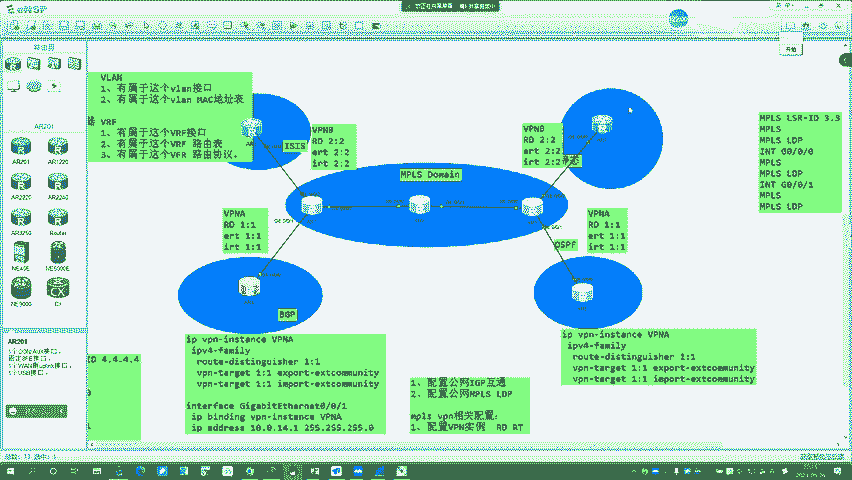

再讲讲到11点了。嗯，剩下内容咱们下节课说吧。好吧。呃，算标签自己分配的啊。能懂吗？双有标签自己分配的啊，就我们把IDIRT配好就行了。😡。

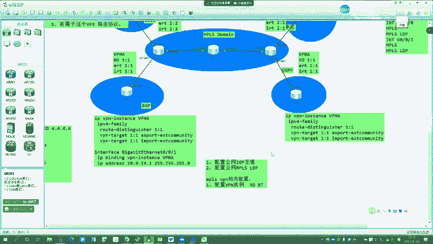

呃，像四案标签啊以及数据怎么转发的，对吧？两头标签怎么分的？😊，呃。这里我简要给大家说一下啊，简要给大家说一下，能懂吗？然后详细过程我们得下节课再来说啊，这节课讲不完了，太晚了啊。😡，我们可以看到啊。

四访问五已经通了，那他的通是这样的。就是原。IP地址4。4。4。4去访问目的IP5。5。5。5。这个数据要不要发给A21？要不要？😡，要吧A21收到之后，首先A211看在VPNA这个接口下收到。

收到之后查找VPNA的路由表，有一条BGP路由，5。5。5。5有没有匹配？明白了吧。5。5。5。5。有没有一个丝网标签叫1026？有没有？😡，有吧，1016怎么来的呢？😡，三给他发的时候。

自动就分配了一个。好吧，所以说我们可以去看到啊。😡，GSO的标签1026。这说A21会这样。我先给你来上死亡标签，1026。来了之后呢。你去往这个5。5，你得先去，他吓一跳啊，3。3。😡，对不对？

那这个3。3有没有一个to IDD0X3？有没有？有吧，我们diplayM24RSP。我就直接看RSP了啊。😊，3。3。3。3。有没有一个出标签是1015？有吧。我再给你打上1025的标签。

打上1025的标签，大家告诉我目的是啥。目的是什么？是为了让AR2能够转发。😡，对不对？😡，所以发给二0后。😡，21汉哎，1025嘛DplayMP是LP。1025。3。三对应。倒数第二条弹出。

1026就发给A23了。A23收到之后。第四playMPRSP。他收到1料6怎么办啊？123收到1026。大家看得到怎么办了吗？哪个VF啊？哪个为F？VPA对应的动作是弹出。对吧他就弹出标签，我知道了。

这是属于VPA的啊。😡，我就看看VPA的路由表。😡，🤧IP ro table。VP烟时弹是VPA。5。5。5。5发给35。5。兜就过来了。那五一看1个IP包，他还不知道怎么处理吗？😡。

你一看你返问我的还回口，我肯定就接收了呗。对不对？回包一样的道理啊，各位同学回包一样的道理。好吧。呃，这就是他的数据与通讯平面。好吧。呃，咱们今天这节课就讲这么多啊。

今天就讲这么多了ARE的全局录由表是吧？😊。

嗯。咱们今天讲不了其他的了啊，然后具体的这个细节呢，咱们得在下节课再补充一下。😊，好吧，课下大家先去做一下这个实验啊，就熟悉一下大概的流程啊，以及这个配置命令啊。😊，嗯。

这里呢我把一些配置呢关键的配置啊把它贴到这里啊，大家回来可以去看看啊。😊，嗯，ARE上呢。A21主要的关键配置就在BDP这一块。那两个生意我就不不贴了啊，各位同学。😡。

2个CE它的配置很简单啊，就是普通的BDP普通的OSPF。😊，好吧，这里大家应该都明白啊。呃，我在ARE上呢，它关键的配置就是BDP这一块，我把BDP的给大家贴一下啊。😊，对你先。

划分为凭实力接口绑定嘛啊为凭实力一下建邻居。对不对呃，然后再去激活VPV4嘛这样路由这里邻居建建立起来不就传过来了。是吧，然后三也是一样的道理啊。关键配置我给大家贴一下。interfaceG0-0-1。

嗯，科一压这个实验呢，我建议大家都做一下啊。因为这个目前考试中呢嗯MPS有考的啊，但考的不难。啊，但是建议大家都去这个做一下这个实验。好吧。然后。BDP100。在A23这里呢。是这样的。对。

这有一条自动产生的命令，大家先不用管，我们这节课没讲到啊，下节课再来说。😊，呃，然后在A23上呢，还有1个OSPF2。对，还得执行一步引入。我把这个引入的也给他贴一下。

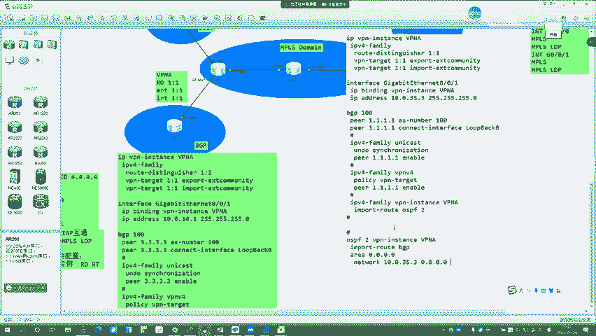

然后这就是设备的一些关键配置啊。嗯。缩小。靠谱大家自己大。老有同学问我要托啊。懒得拉，你们自己大拖不自己大，同学们。不要特别懒，好吧，实验一定要自己做啊，从头到尾做一下。呃。

然后整体的思路我给大家写一下啊。😊，就是配完公网互通之后呢，呃我们就需要进行MPS的相关配置。哦，这相关配置呢就是配置微屏实力RD和RT对吧？😊，微品。相关配置。公网这一块，各位同学都没问题吧。

没问题敲一啊。😡，都行吧。公网这一块没问题吧。😡，对吧，然后第二步呢。就是。PE连接CE的接口。绑定微P实力。对，然后第三步就是。PE在BDP。微P实立下。或者说在微PN实力的。路由协议项是吧。

你这边咱们用的就是微拼实力的OSPF项，这边用的就是微拼实力的BDP项。对不对？呃，与CE建立邻居。然后呢，第四步，那建理完邻居之后呢，CE就会把路由传递给PE了。然后对于PE来说呢。

这时候它就会自动导成VPV4路由，导成VPV4路由就在两个PE之间啊。PE之间建立VPV4邻居关系。对对。然后。传递为PV4路由。啊，第五步。呃，在远端PE就是A23上，我就直接写名字了。在。A23上。

配置。BDP进入OSPF。对吧因为你经过这边的配置之后呢，然后这个路由就传过来了。传过来之后呢，A231要把BDP干到OSPF里。啊呃，怎么干呢？你就得起个OSPF嘛，把BDP引入进来。是的。然后。

第六步。A23与A25。建立。OSPF邻居关系。传递路由。对吧。嗯。然后反过来。A25上。Neightwork。还回口。network接口。传递给。A23的。为凭实力。嗯，就。VPNA。We I。那。

那我把这个一些过程也写了啊。呃，第八步呢啊就这一块。啊，就大家需要在。BPVP试力一下引入OSPF。然后。A23。BDP微拼实力一下。引入OSPF。就是VPANA的。OSPF然后给他引入进来。

引入在进来之后呢，就会变成唯平V4路由嘛，先变成微PBDP微平实力的。是吧然后变得唯偏唯势。这样传过来传过来之后呢，这边IRT匹配呢对吧，导入到BGPVP实例下。然后这个这里就跑的BP就直接传过来了。

就不需要引入了。好吧。呃，这就是这个配置过程啊。😊，嗯，针对于这张图呢，我给大家截一下啊。然后环境大家得自己磕下去搭一下。嗯，咱们这节课就说这么多好吧，今天就讲这么多啊。好，同学们。

咱们今天就说这么多啊，准备下课吧。😊，今天准备下课吧啊。😊，嗯，跨域目前没有考到啊。