# 2023 新版华为认证HCIA+HCIP+HCIE全套视频讲解！一套视频让你从入门到精通！CCNA／CCNP／CCIE技术提升同样适用！ - P116：（持续更新）HCIE Datacom - 52.MPLS VP,N转发流程，组网方案 - -Book思议8 - BV1W8411A7z8

个呃MPSVPN啊，然后上节课呢我们给大家讲了一个MPSVPN的实验，对吧？最后也做通了啊。呃，当然这个实验呢大家课一下要去做啊。呃，这里呢我们再把上节课这个控制平面。

还有录数据平面的这个呃传递过程呢来给大家再细化一下，好吧呃细化完成之后呢，我们再把其他的这个杂七杂八的知识呢补充一下好吧。呃，这个实验呢，我现在是复刻的，跟我们上节课的是一样的。😊。

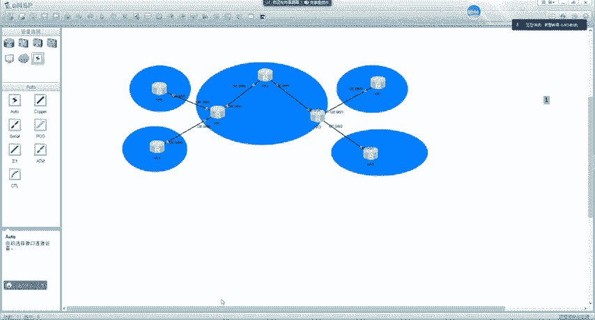

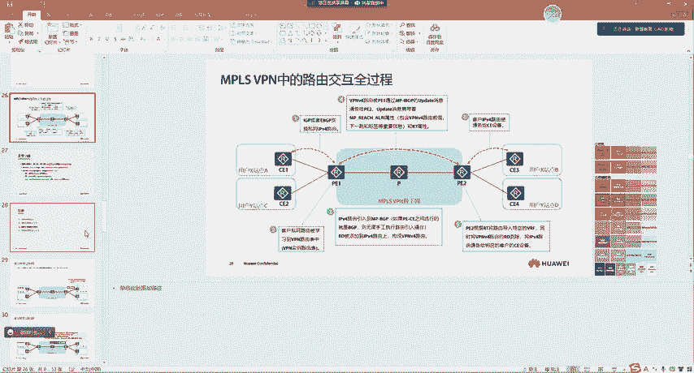

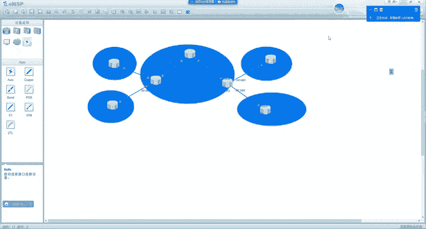

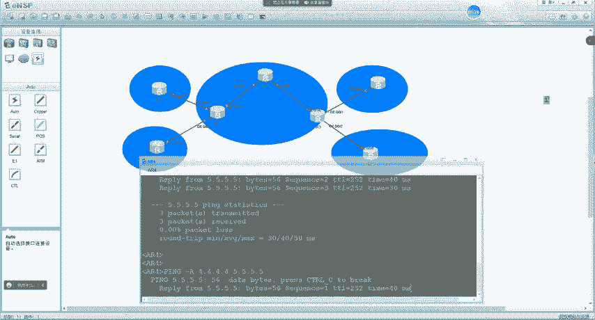

呃，就是在我们的中间呢，我们用了1个A100是公网的A呃，底层呢跑的IGPOSPF，然后配的MPSLDP是吧？然后我们在这边呢跑了一个BGP协议呃，在我们的这边呢跑了1个OSPF协议好吧。

那待会呢我们会通过配置呢，让上面跑个ISS呃，在这里呢再去跑一个静态好吧，我们实现两个VPN的业务互通。😊，嗯，那么现在在我们的需求中是这样的啊，嗯现在四跟5它是作为一个VP客户的。

然后6跟7呢作为一个VP客户。然后现在的配置呢，我们跟上节课在结束的时候，嗯，这个内容是一样的。就是现在呢四跟5已经能够通过MPS互通了。对吧我们把这个互通的过程来给大家讲一下，就是再把这个控制平面。

还有数据平面的一个过程。嗯，再来说一遍，好吧，那说一遍之后呢，大家印象稍微更加深刻一点啊。呃，首先大家知道啊，就是我们要去实现数据互通的话，前提是你要有路由。😊，对吧你四跟五互通呢，你四的路由要传给5。

反过来呢，五的路由还要传给4，对不对？那么我们以四把路由传给5之后，然后5访问四的过程啊来说一下控制平面跟数据平面在MPSVP的一个过程。好吧，那首先呢针对于我们的P和CE之间呢。

咱们会去运行各种各样的路由协议，对不对？那比如说现在在四跟5这里跟一这里呢，我们跑了一个BGP。所以说在四上面，我diplay bGP table。

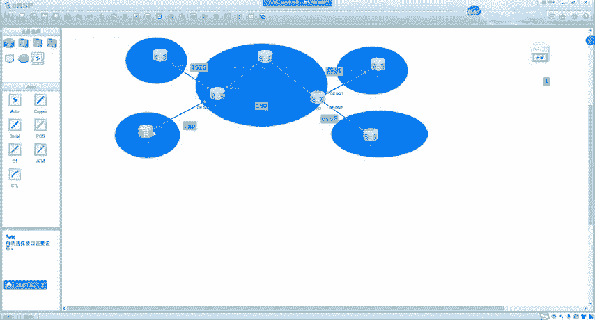

我们可以去看到一条4。4的路由，那已经被A24发布出来了。

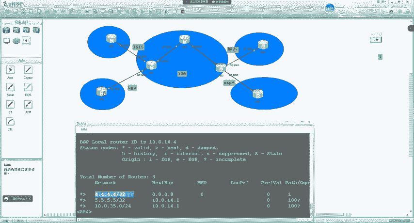

那么他一旦发布出来之后呢，就会有一条4。4。4。4-32哦，这么1个IPV4路由。因为对于4来说，他的视角中跟AR一建立的就IPV4BGP邻居，对吧？他通过IPV4路由把那个数据。

这不这个路由呢发递给AR1。

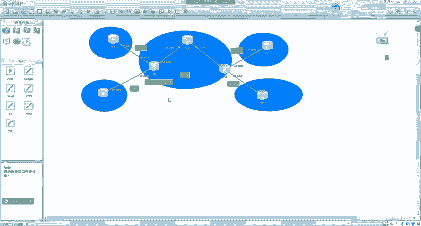

ARE收到之后，我们可以通过一条面令叫做display BPVPV42 table。我们可以去看到啊，在BDPVPE下是吧，他去接收到了这个4。4。但这时候这个4。4呢依然是IPV4路由。

那在这一步的时候呢，对于AR一它会执行一步操作。就是将BGPVPN实力的路由呢自动转换成VPV4。所以说这是一部默认的操作啊，默认就有的就是BGPVPN实力。

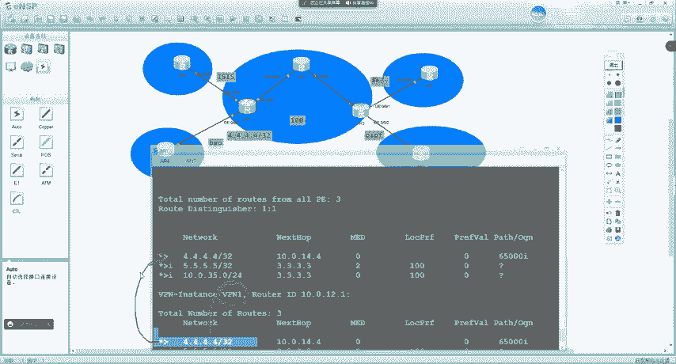

对。转换。喂。VPV4录由。那在BPVP实例中呢，它是一条基本的IPV思路用。转换成VPV4之后对吧啊，它就一条VPV4路有了。好吧，所以说我们可以看到呢呃在这一块都是基于实例存放的，对不对？

然后转换成VPV4啊，搭上它的ID值。😊。

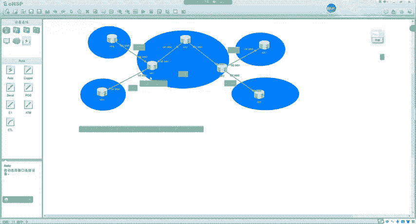

对不对？那这时候A2一呢会把路由发递给对边PA23。

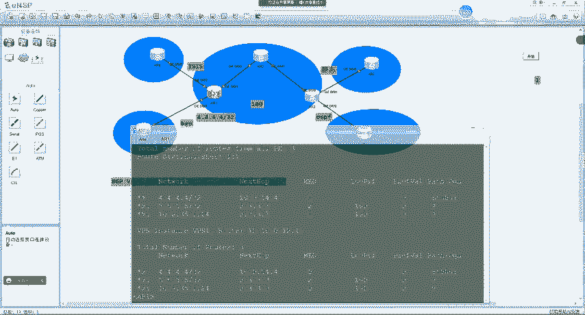

呃，在发送这种的时候呢，他会去打印几个属性删结课我们也说过了。首先是这个EV这个VPN实力的RT对吧？我们用的是E玛一啊，当然是ERT好吧，然后这条路由呢，为什么我们把它叫做VPNV4路由呢？

是因为它加上了1个D值也是E码一啊，这它D以及RT。😊，对不对？那打上这个之后呢，还会去给他分配一个死网标签。所以我们可以在AR1上PVPV424。4。4去看它的详细信息。在微P实例中。

我们看不到任何死网标签。而在VPV4中我们可以看到我给他分配了一个标签，并不是接收啊，是分配了一个标签叫1026啊。那这时候呢有一个label。😊。

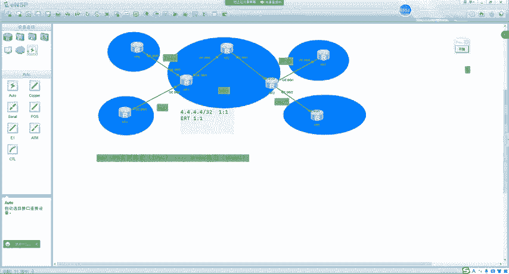

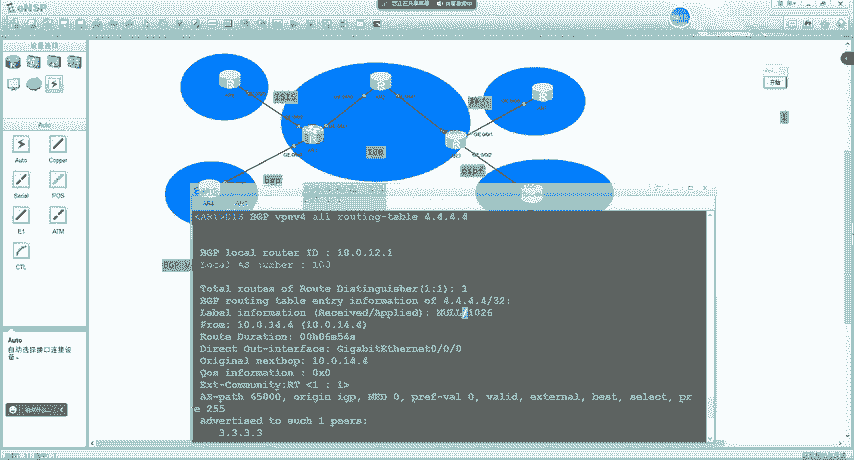

四网标签是1026。那这时候他要发送给。3。3下一跳会变成1。1。1。1。好吧，这个在MVPN中下一跳会自动勾改啊，就是从EBDP收到传递给IBDP邻居，这下一跳会自动更改。好吧，那这时候呢。

AR一会把它传递给33就可以收到这条路由。那三收到这条路由呢有一些关键的属性。😊，对RD嗯RT。死网标签还有吓一跳。那首先呢，它根据RT就是根据RD呢，它能够分辨出来啊，这是唯一的一条路由，对吧？

有可能啊6这边也有个4。4传给3传给给7呢那通过RD它可以区分出来，这是一条唯一的路由。那这时候呢，他会拿路由的ERT跟本地微P实力的IRT进行匹配。

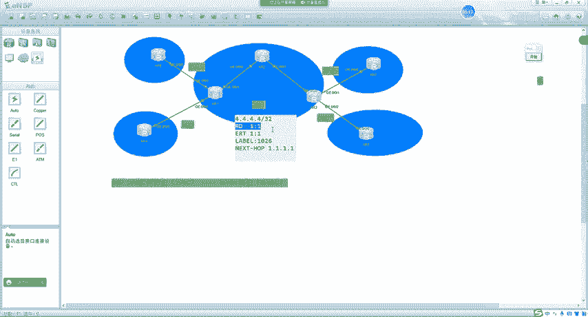

那在A21A23上呢，正好有1个VP实力一的婴RT。对不对？呃，跟他是进行匹配的，所以说就导入到自己的微P实力一响。所以说我们可以去看到。第四类BGPVPV42入table。

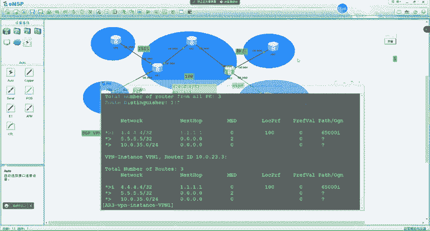

首先呢，A23收到了一条4。4。4。4-32的路由，这是一条VPV4路由。对吧。那么在这时候呢，它会根据RT值导入到微平实力A。所以说呢我们在BDP微平实力一中也可以去看到4。4这条路由。啊。

所以说在A23上呢，他执行的一个操作是什么呢？但是AR1上。😡，会将微P实力变成VPV4。A23上呢。会将VPV4。路由。转换成BDP。微拼实力路由。

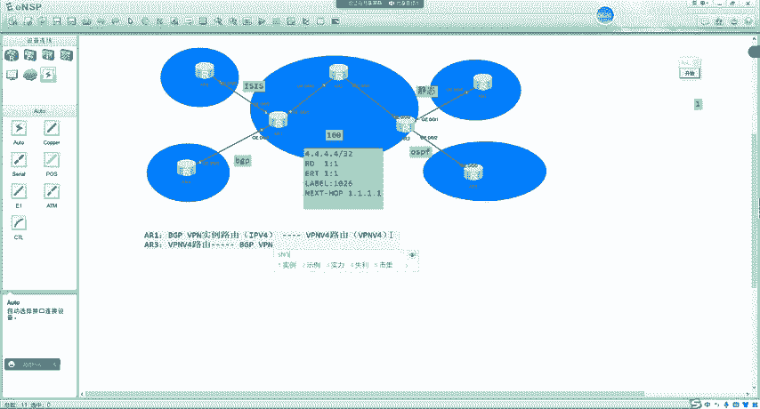

好吧，所以说他会再次转换到这个表里面。那么转换到这个表之后呢，就是随着路由的接收呢，它实际上还有一些东西。你比如说四万标签呢。是吧嗯。在这里是不是也有啊，对吧？接收到这条路由的算案标签是多少？😊。

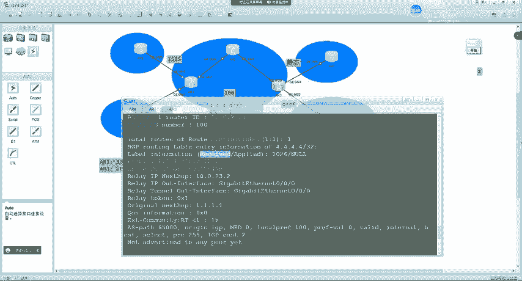

对的，以及吓一跳呢是1。1。1。1。😊，那A23收到之后，在自己的BDPVP实例中，那第play。

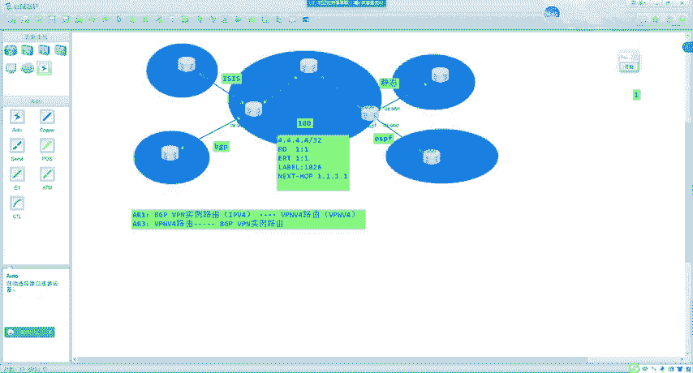

IPro table VP VPN1我们就可以在VPNE的路由表中去看到这个4。4，是IBDP邻居传过来的下一条是1。1。对不对？那这条路由呢，我们想通过OSPF传给5在这个微P实力下呢。

有1个OSPF2。啊。有1个OSPF啊，然后我们把BP微P1力的路由呢引入到OSPF中。那A23就会产生对应的LRC传递为5，所以说5呢就可以学习的。

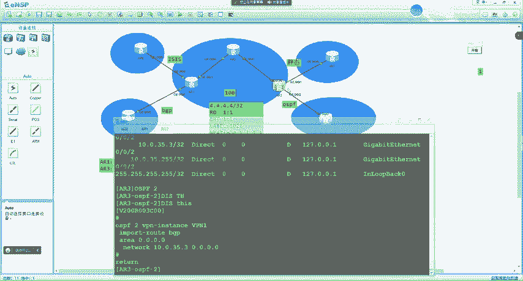

di四playIP庭table4。4。44。对不对？那这就是路由传过来的过程。也就是说路由再传递过来呢，会打上RDERTlabel，还有吓一跳。😡，那当我们在进行访问的时候呢，就是5。5。5访问4。4。

原IPD是5。5，目的IP4。4。

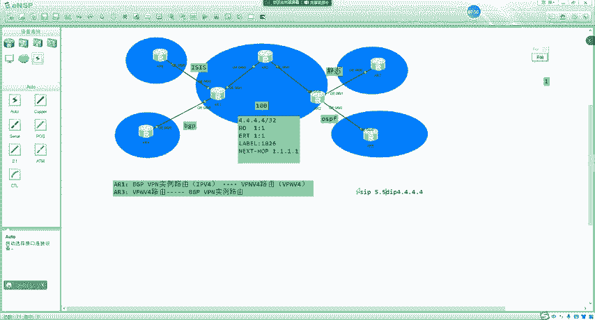

这个数据呢发给3。3、收到之后，从G0-0-2收到啊，我一看G0-0-2呢，他在VP实力。一种。对不对？然后会去查找路由。那么在这个VP实例一中呢，正好有一条4。4。4-32的路由。是吧4。4。4。

4-32。然后我们可以去看到呢，这条路由呢携带了一个标签值，是接收到的标签1026呃，在微平实力影响。所以说他就知道了啊，这时候呢。

会去打上1个4万标签，1026啊，之前给大家说过，就是让对面的PE呢知道发给谁的。😊，那直接打人送亡标签，你发给22，不能识别啊。😡。

对不对？那我们看到呢。有一个下一跳1。1，再打上1。1的LDB的标签，注意啊，注意这个0X1好吧。然后我们。维巴斯去看一下。1。1的。in格 push压入是不是？0X1呀对吧，这就是他的他度ID。

能懂吧？那这时候呢，压入一个标签1026啊，1024，所以说他会再压1个1024的标签。

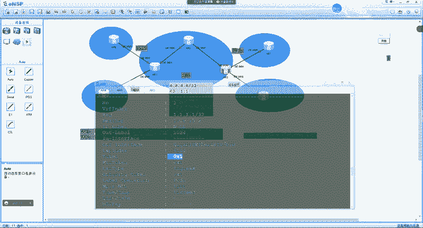

那这时候就发给二了。2收到之后呢，DplayMPSLSP。收到1024呢，倒数第二条弹出，然后只带有一层丝网标签。

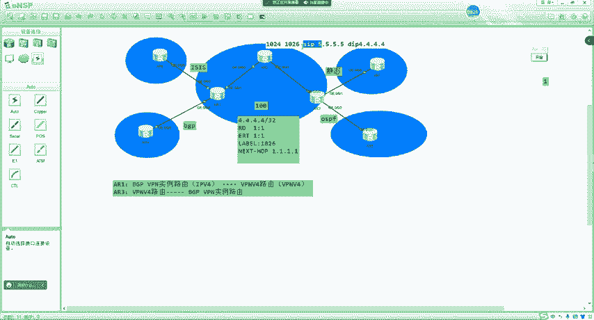

就发送给一了啊，然后A21收到之后呢，第四类BTP唯平为啊第四。第四类MPRSP。

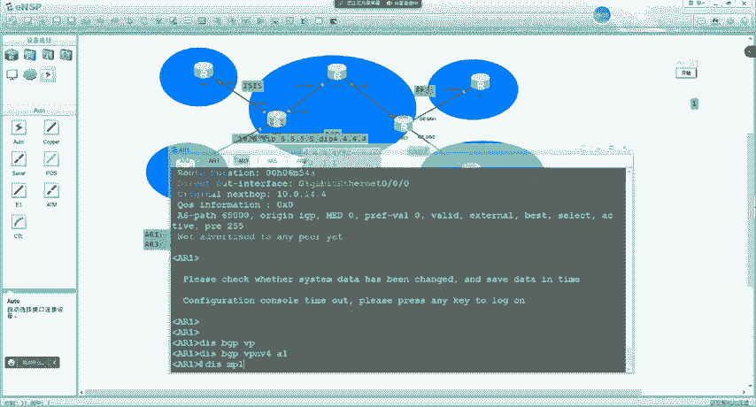

AE收到之后，1026。是吧查找V屏一这个录音表di四IPtable v v一对吧？但是得到的动作是弹出标签哦。是吧啊就弹出标签，查找VP实例一。那这时候访问4。4，我就知道从0-0-0发给14。

4发给4了，那这样就能通了。好吧，那这里呢大家只需要知道控制平面它是这么传的。懂吗？控种平台在传的时候，在发送端PE上会有BDPVP实力向VPV4的导入。然后对于接收端来说呢。

是微PV4向微P实力的导入。然后数据通的时候就是打上两头标签就传过来了。啊，这就是他的一个转发过程。那在这里呢，我们可以来看一下课件，对吧？把课件里面的这个转发过程呢。

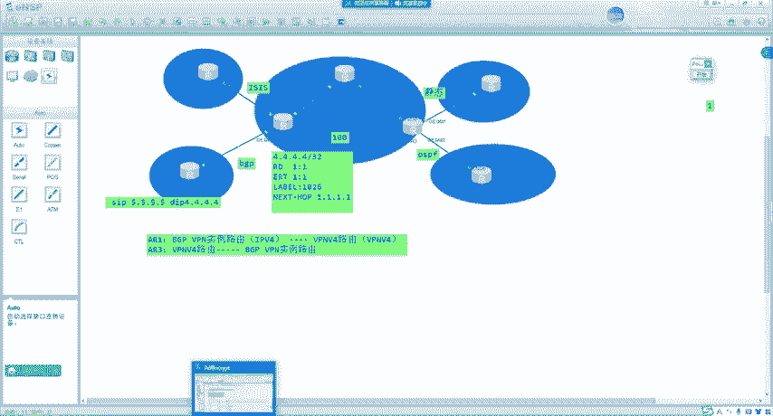

嗯，数据转发过程再给大家说一下。那首先也是一样的，就是对于CE3来说呢。他有1个1。0的路由是吧？因为控制平面我们已经把路由传过来了。对不对。那传递给P12之后呢，他要发送1个IP包，访问这个1。0。

那C3呢？就会把一个普通的IP报文转发给P2。第二就收到了。B2收到之后呢，根据报的入接口查找VPN实例，查看对应VPN的转发表。那也就是说在这时候，P2呢，他是知道了。嗯，从哪一接口收到对吧？

这接口属于哪位平实力？然后普匹配目的IP4前缀呢先打上丝网标签。呃，假如说叫IL。然后根据缩往标签的吓一跳是1。1。1。1打伤。呃，勾网标签。对不对？0L1，那这个报文呢就会发送给P设备。

P设备接收到之后呢，就是查找LP啊P设备对该报文进行外层的标签交换，最终到达P1。啊，实际上如果我们没开倒数第二条弹出呢，这里还有一个标签。但是由于我们当前是开了呃，所以说正常会只有一层丝网标签。😊。

那这个豹文未来转发到P一之后呢，如果他收到的是两层的好吧啊，比如说收到有一层零，有一层丝网标签0，我们之前说过这个特殊标签的作用。那P1收到之后呢，会交给MP24处理。MP24协议呢，去除外层标签。

然后P1呢再处理内层标签，根据内层标签呢确定微P实力是吧，就对应的吓一跳。然后呢，将内层标签弹出，把船正的IPV4报文发送给C仪。嗯，那这样就通了。啊，然后C一收到之后呢，嗯执行正常的IP处理流程。

那这里就完了啊，这就是我们在做这个MPVPN的时候，它控制平面和数据平面的一个过程，只不过理论稍微多一点啊啊，大家如果都做过这个实验呢，相信对里面也是嗯非常清楚了。好吧。那这里呢我再给大家扩展一下呢。

就是三这边我们应该怎么样去搞通。对ISS跟OSPF实际上差不多。因为我们在配SS的时候。😊。

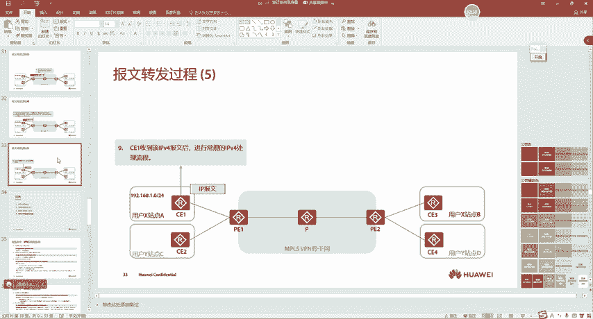

你也可以只为凭实力。对吧呃，但是在配OSPF的时候呢，也是一样。

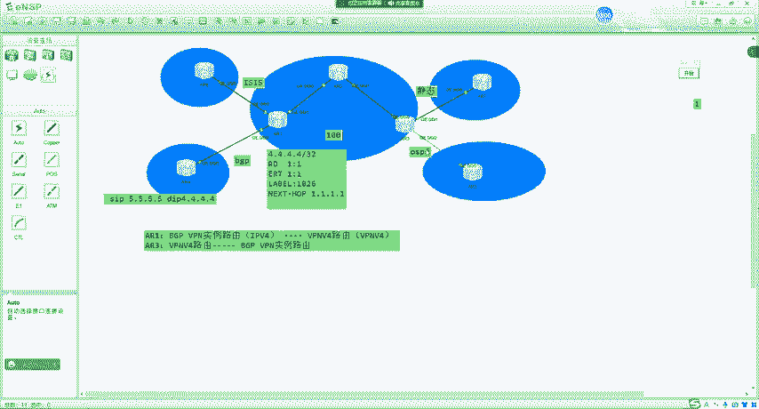

啊啊，不是啊。就我们在配OSPF的时候呢，基本也是一样。

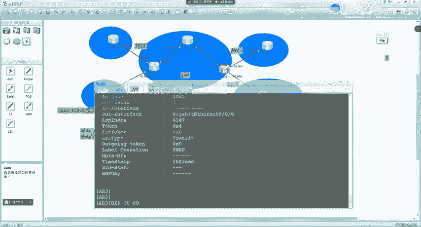

对不对，那在拍静态的时候呢，稍微有点区别啊。这个区别是在哪里呢？我举个例子啊，比如说我先在山上去骗。

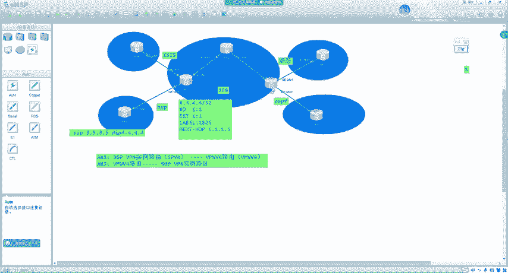

呃，10。0。35。5。那你又发现听不通。是吧听不通的原因是什么呢？这里大家注意啊，当我们做了VP实例之后啊，你基本所有的操作指令呢都要带上。😊，杠VPNinsVPN1为什么呢？

因为0-0-2接口在VPN一下，然后才去拼10。0。35。5。

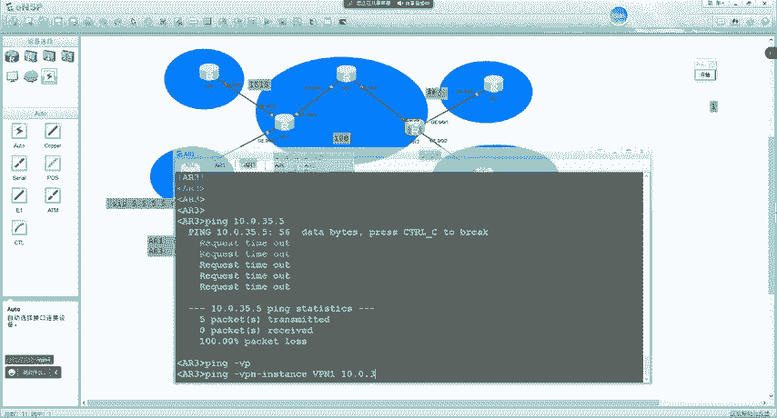

好吧，那其于这个我们可以去发现啊。😊，你比如说我在5上配呢，5上直接去骗10。0。35。3，它是直接通的啊吧，但是在三上呢得加VP实力，这是为什么呢？嗯，这里大家需要注意一点。

就是只要是涉及到微P实力的相关配置啊，一般都会去需要加个VPN实力的名字。

好吧，比如说我们看录音表的时候不也是一样的道理吗？第playIP tableVP VPNE。是吧。二上面没有违凭实力啊，所以说我们并不需要去管他，他只负责MPS组转发。好吧。那这里呢我们在配静态的时候。

比如说我想在VP一里去加静态。那这时候怎么加呢？我们是这样去加的啊，大家需要注意。IP。root天 rot。也要去加微P实力，就告诉他你在哪个VP实力下加，我在微P一下加一个什么呢？A92。168。1。

0。VP1下去加1个192。168。1。0。24。只到一个空接口。那这时候你通过diIP注ingtable，你是看不到的。

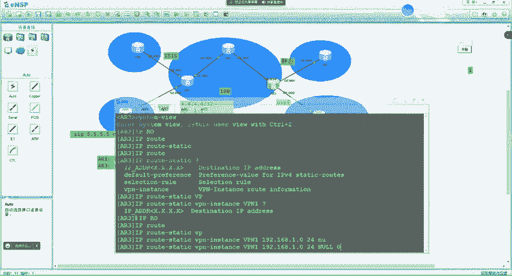

你需要怎么加呢？第一次IPVPN是VPNE。好不对diIP root table VP sense VP。VPN的名字是区分大于写的，我们才可以去看到呃，192。168。1。0这台静态。好吧。

但是如果我们要用静态的时候。那A23收到6的路由，他不能给提传啊。所以说我们得在7上面配一条静泰，是指向6。6。6。6。好吧。然后呢，我们需要在三上把7。7。7。7。发布到BDP中传递给一。怎么传呢？

那A23在这里没有动态，所以说三上面呢，我们只能去写一条静态，对吧？7。7。7。7下一跳17。7。然后把这个静态network到BDP里面。他是这么一个过程，各位同学明白了吗？明白的同学敲一啊。

没问题吧。也就是说你在7上面。😡，他接收不到三给他传，你得在7上手动去配。在三上面想把路由传递给6。对吧他得能够学到期才能在BDP里发布。但是你这里是静态，没办法学，你只能敲实验去配。😡。

然后再引入到BDP中，把静态引进来。他是这么一个过程。好吧，那上面这一块呢，大家可以课下去做一下啊，静态具体怎么配置呢？我刚刚也给大家说了，对吧？大家可以下课呢呃通过实验啊去做一下。😊。

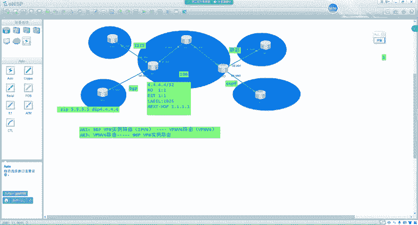

好吧。那接下来我们要说的就是一些啊比较高级一点的啊。嗯。在下面就是配置了，这没啥说的了。😊，是吧，然后是一个配置案例。这些大家课下自己做一下啊，自己看看。

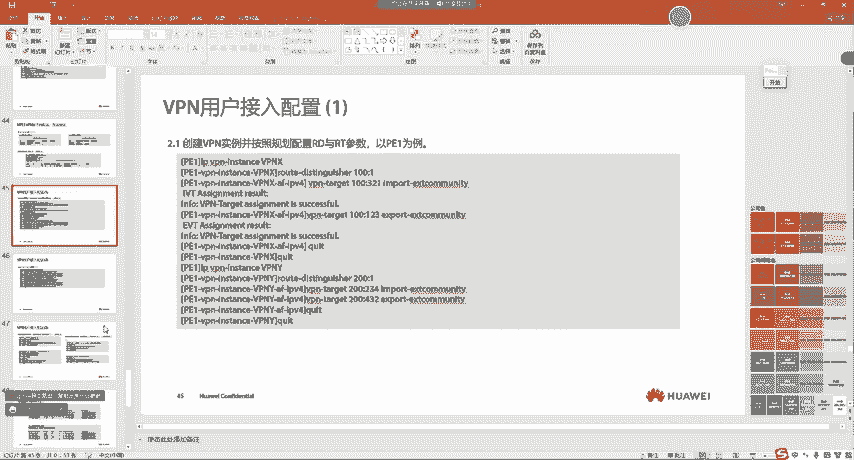

呃，然后我们接下来要讲的啊就是MPSVPN的一些。叫不属于应用。好吧，我们接下来要讲的是这一块啊。😊，嗯。我们可以去发现，就是我们学完MPS4的一些。基本原理之后。嗯，这个场景是比较单一的。对不对？

那现在MPS他。能够在我们的这个当前的网络中大规模的被部署。嗯，他肯定是有自己一定的优势的。啊，也就是说呢，他能够兼容。或者说。能够应用到很多不同的网络场景中。对不对？

那当你能够应用的网络场景变得更多的时候。呃，你的部署范围啊就变得越来越多对吧？所以我们可以去看的啊。嗯，前面有一个详细介绍啊，就是MPSVPN呢。呃，支持地址空间重叠呃。

这个我们刚刚也可以去看到了通过ID能够区分出来。以及。好，大家稍等一下，停电了好像。

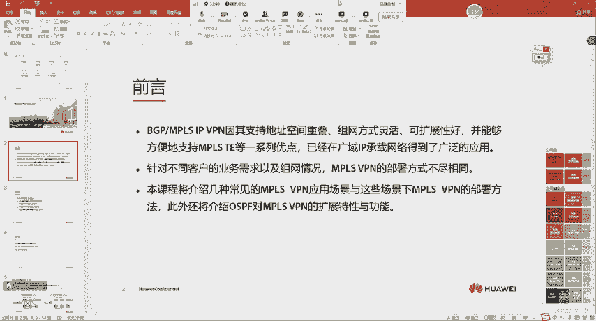

呃，我电脑电池是坏的啊。大家能听到吗？能听到。

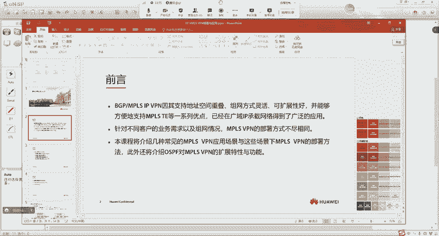

好，我们继续啊呃，刚机构的这个网断了一下。嗯。对，断电了啊，但我的录屏没断，因为我笔记本还能撑个2分钟，好吧。呃，所以呢咱们继续啊继续啊呃，刚刚给大家介绍了这个前沿部分啊。

就是大家知道MSVPN呢还有很多种这个其他的这个应用功能。😊，好啊，还有很多场景下能够进行使用的啊。嗯接下来是我们要说的呢就是。MPS4的一些MPSVPN的一些应用场景呃，以及它的这个组网类型啊。

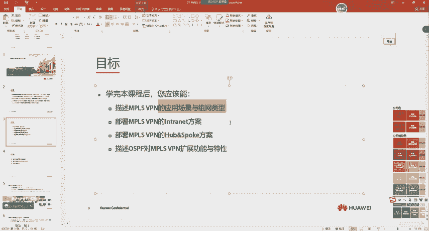

嗯嗯，我们把这块来说一下，实际上这。呃，没啥东西啊，我们来瞅一下吧。来看一下啊。嗯，呃主要我们的MPSVPN呢就是用于啊主要就是用于企业互联，还有虚拟业务网络啊。呃，这个企业互联之前给大家说过是吧。

我们有时候比如说大家经常听说的有一种叫做MP4专线。对吧呃，那这个呢实际上就是我们这个企业分支之间的，对吧？通过MP24呢连接到一起。对不对？那或者用于实现虚拟业网络对吧？就我们跨越公网对吧？

那到公网可能是其他的啊啊，比如说你公网嗯可以是。这个标签交换对吧？然后我们通过这些标签呢嗯去实现一个虚拟网络对吧，因为我们可以去发现MP有的一个特点。呃，刚我们通过实验也可以去看到啊。😊，呃。

就是四跟五在腾行通讯的时候呢。嗯，六跟7是不受影响的对吧？所以说四跟5之间呢相当于有一个这个虚拟网络一样，就是有一种VP对吧？

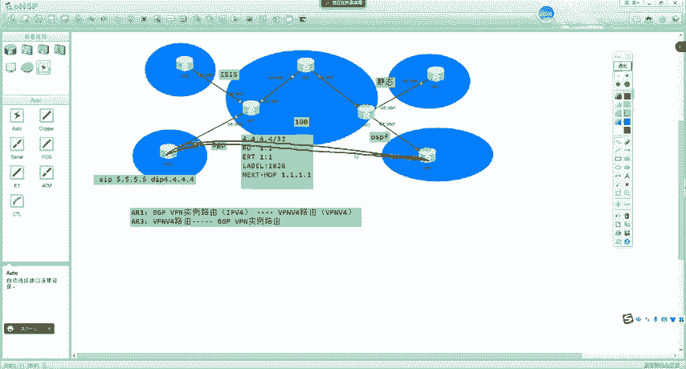

呃，咱们来看一下，就是企业互联应用。可以通过MPSVPN呢将分布在各地的分支机构和合作伙伴的IP网络连接到一起。对吧这是我们第一个应用，就是企业互联的时候。嗯，比如说我们这个公司的这个阻力架构比较大。

对吧？在各省市都有这个搬出对吧？啊，都有单位，我们可以通过MPSVPA呢去实现一个互联。呃，或者呢是虚拟业网络对吧？可以在同一个物理网络上运行多个业务。呃，比如说VIP啊，对吧IPTV啊。

为每一个业务建立一个VP实现业务的隔离啊，这样也可以，这是什么意思呢？嗯，比如说啊就是ABC那我们现在有三个站点。呃，这三个站点呢通过MTSVPN互联呢呃主要就是用于实现。比如说老板开会的时候，对吧？

大家都入这个腾讯会议啊，那不是腾讯会议啊，就是你公司自己的会议系统。那这时候呢，我们可以把公司的会议系统是吧？呃，它所属的流量呢给它归到MPSVPN中。啊，就是每一个业务呢有一个单独的微频啊。

可以实现业务之间的隔离。比如说语音跟视频之间啊去做一个业务隔离。然后在下面呢，就是MPS的一些基本租啊啊呃我们来看一下啊。嗯，这单词翻译过来，我也忘了啥意思啊，就大家自己看一下。叫什么。我得翻译一下啊。

叫企业内部互联网络。好吧啊，就内联网是吧？Internet。啊，对吧跟跟这internet的发译差不多啊。

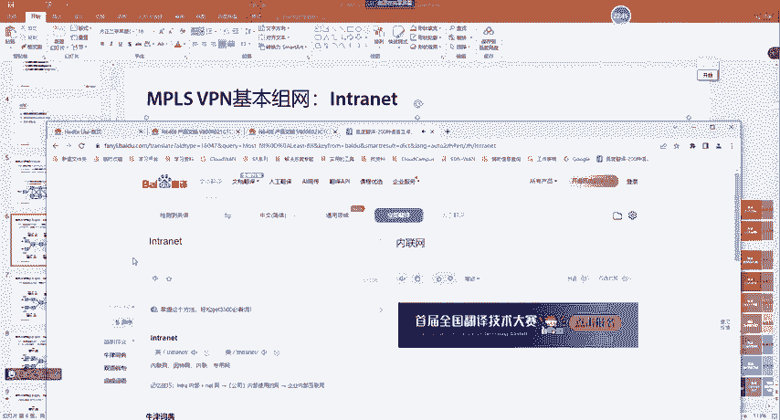

我们来看一下啊。😊，呃。如果使用这种方案啊啊就叫内联网，好吧，我们就叫内联网啊啊就是使用这种方案的时候呢，1个VPN中所有的用户啊去形成一个叫做闭合用户群。相互之间呢能够进行流量转发。

VPN中的用户呢不能与任何本VPN外的用户进行通讯。啊，其站点呢通常是一个组织。是吧那这个是怎么样的呢？比如说在这里呢，我们有两个维品。对吧1个VPN中所有的用户形成一个叫做闭合用户群啊。

这是什么意思呢？我们通过他名字可以看到叫内联网啊，啥意思呢？就是当我们1个VPN用户啊内部不同站点的时候。那他们可以进行互相通讯，然后下面呢也可以进行互相通讯。

对吧但是VP中的用户不能与本VP外的用户同权。比如说赛一能不能跟赛德四通呢？这时候是不行的。好吧，这时候是不行的啊，那这种不行啊，我们是怎么样做到的呢？要把D啊和啊就是通过RT区分的，说白了。😡。

比如说在这里呢，s一跟s2，他们属于一个微拼客户。我们把他的出RT和ERT呢啊就是出和入呢都设置成100冒号一。对不对？所以说这两个VPN呢可以互相去交互路由啊，未来可以实验通讯。而三跟四呢。

对吧他俩用20冒号一三跟四能够互通啊，但是一跟三啊跟四啊，对吧？呃，三跟一啊跟二啊对吧？四跟一啊跟二啊啊，这种都是没有办法进行通讯的。是吧，那这种实现呢是我们在业务部署上的时候对吧？啊去规划出来的对。

没错，这就是我们课上嗯所讲的那种方式。好吧，所以说这是一种方式啊。那还有一种呢。那这应该叫。讲那叫内联网。啊，这就叫外联网了。好吧啊，这个就叫做外联网啊，我们来看一下啊。😊，呃。

当我们去采用外联网组网方案的时候呢，VP用户可将站点中的网络资源给其他VPN用户进行访问。是呃，这是什么意思呢？我们来瞅一眼啊。😊，比如说在这个环境中。嗯，这是VP一啊，这是VP一。

首先他俩是不是属于一个V聘客户啊？对不对。是吧他俩是属于一个唯品客户啊，然后下面这个VPR呢属于另一个唯品客户。😊，那现在在我们的业务需求上可能有这种。比如说我们看刚刚这种呢，可能这是一个微P客户嘛。

对吧啊，这是一家公司A。那下面呢是一家公司B。对不对？那我们看到这种外联网租网方案呢，他可能是这样的啊，什么样子呢？我们之前呢有一个公司A。对不对？公司A呢都有1个VPE，然后他们的RT是互相匹配的。

对吧所以说公司A他们两个站点之间可以进行互相的路由传递。对不对？那进行互相路由传递之后呢呃这时候呢，我们的s一和set2。可以进行一个互访。对吧。但是未来呢。随着公司的业务发展规模。越来越大。对不对？

那未来有可能s2跟s3。对吧呃，需要进行互访。可能这个赛三呢是我的一个呃合作伙伴。是吧啊，是你的一个伙伴公司。那这时候呢，伙伴之间要进行一些这个业务的互访，来，一起做一些这个办公项目的需求。对不对？

那这时候呢，我们想让VP2。对吧该VP一能够进行通讯。大家能明白我的意思吗？明白同学敲一啊，没问题吧。我希望他俩能够进行通讯。但是对于我的s3来说呢。

它已经有了1个NRT跟inRT1个200冒号一1个啊啊都两个都是200冒号一。对吧哎，那在这时候，我怎么样让他的路由传递到赛德2呢？然后再把赛德2的路由再传过来呢？实际上这个是很简单的。

就是我们所看到的这个RT啊。他可以配多个。就是我们再配一个入RT跟ERT是200冒号1。那他俩是不是可以进行互访啊？对不对？那通过一版冒号一，他俩是不是可以进行互访啊？对不对？那有人问了，哎。

那老师VPNs一跟s3能互访吗？啊，大家觉得会不会啊？😡，拿不拿？是不行的。为什么不行呢？😡，首先。你的路由没有办法直接传递过来。对不对？这是一个非常嗯刚性的原因是吧？RT不匹配。那有人就问了，老师。

我传递到set2，再通过set二传过去行不行啊，也不行。😡，为什么不行呢？我们要去想一下。比如说我在这里跑的是BDP。是吧。这有1个1。1。1。1，我从这个BDP邻居收到了，我还会传给他吗？还会不会？

会不会啊？不会吧。对吧你不会传递给P2，那P2肯定没有办法再传递给P3啊。😡，对只有过了你s2之后的路由才传递到s3之后。😡，那三才可以这样绕一圈访问嘛，但是现在你压根都不传。😡，所以说在这时候。

我们可以去实现的一个啊。啊，这个这个这个这个这个这个作用是什么呢？就是。😊，大家呢啊我们可以理解成，比如说这也是V平一啊，我们可以理解成。😊。

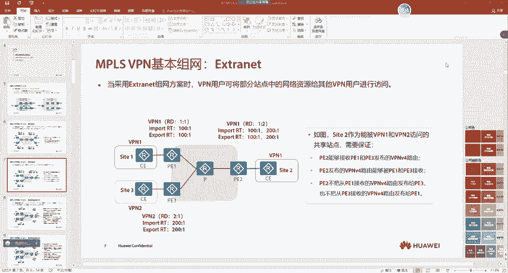

大家呢都能跟总部同学。但是。分支之间能不能互通啊？拿不拿？不行吧。对吧如果换到一个公司的角度，我们就可以认为是呃所有分支呢跟总部都是互通的啊，但是分支之间呢没有办法进行互通。

啊吧哦这种呢我们把它叫做外联网的转翻。那这个怎么样去实现的呢？也是在RT设计上啊去实现的。对吧你就按照这个表去配啊，就能够实现。那这个怎么样去做呢？对吧？老师我刚有了新大陆啊。😊，啊，我刚断电。

设备也关了啊嗯。我操，这得拍到啥时候啊？重开一下啊重开一下。我给大家演示一下啊。

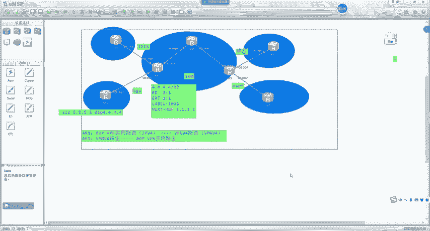

嗯。

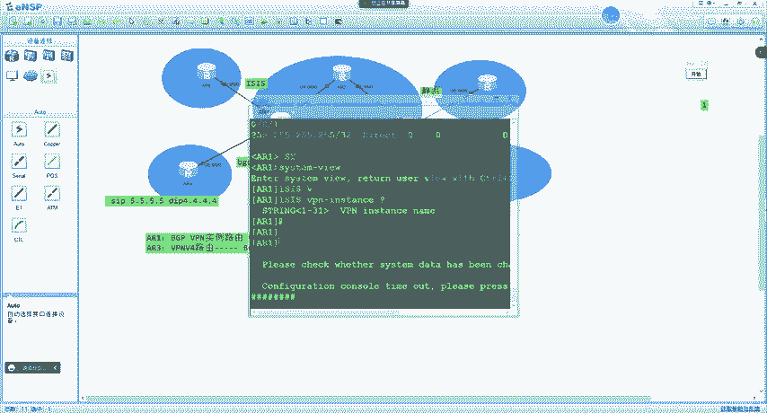

呃，我给大家看一下面令啊，就是我们呢在配置的时候。比如说我配了RDD只能配一个啊嗯RD没有配多个的。但我们在配RT的时候，大家来看，比如说配个一冒号一是吧，A一冒号2行不行啊，是吧？一冒号三行不行啊。

是吧，都做初方向然后我的入方向呢，一冒号一一冒号2。😊，是吧呃，做入方向。还，不到啊。一冒号一一冒号2。对吧做入方向。但这里只是给大家演示一下啊，就是我们呢在配RT的时候可以去配多个。

那多个的匹配原则是什么呢？就是我们在发送的时候会去携带。

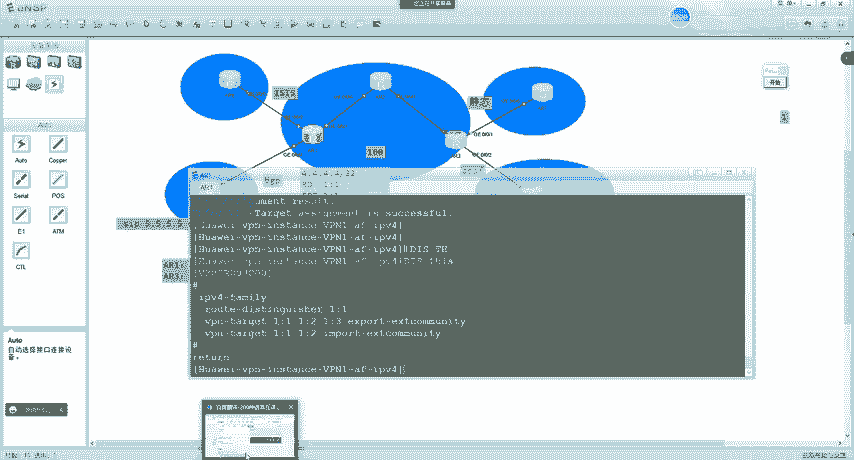

多个EportRT。但是呢。只要有一个。能够跟对方的IRT匹配啊，这条路由就可以接收。你比如说。这个2。2。2。2，他发送给s一，还有s3的时候，他携带2个ERT对吧？有同学就想了，老师那匹配哪一个啊？

😡，对不对？匹配哪一个都行，只要有一个匹配。那么我们的P3都要了。好吧，就是多个RT当你同时携带的时候呢，只要匹配一个就行了。所以这个大家明白了吗？明白的同学敲一啊。没问题吧。可以是吧。

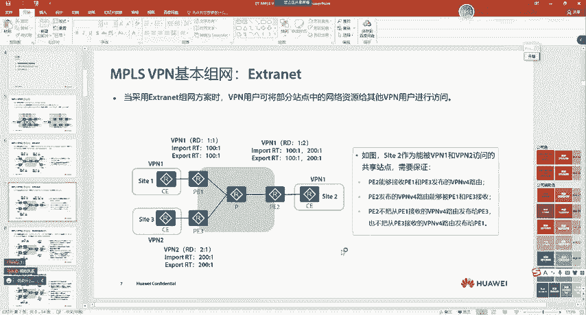

对。🤧好。接下来呢啊我们来看另一个啊阿D赔错，你只能擅为平实力了啊。😊，退错就没办法了。另一种组网呢啊叫做总部和分部。对吧嗯。我如果没记错，翻译过来叫总部和分部啊。啊，那有点翻译的不对啊啊。

就是hable spoke。😊，好吧，啊，大家可以认为就是总部和分部。那这个是怎么样的呢？当采用hbsbook方案的时候，这个一般我们是适用于这样的。比如说呢现在我公司有很多个站点。

我有自己的总部对吧啊，也有自己的分部。总部到所有分部都能通啊，我们还要求呢分部之间互通。你看刚刚那种外联网分部之间通不了。对不对？那这个时候如果我们要求分部之间也能互通。怎么样呢啊。

就是采用这样的harper spoke的做法。就是我们可以把一个站点呢设为哈or站点啊，这个哈or站点呢大家可以理解成叫做中转站点。是吧那所有站点呢就是我们的每一个分支。😡。

那s有站点之间的互访未来会经过hp，对吧？这是我们未来去使做到的这个需求。那我们可以通过在hab站点做一些集中的管控，对吧？站点之间的数据传输。那这时候我们可以发现，至少从业务场景上。

那这种还是比较有优势的对吧？分部之间过总部通讯，对不对？然后我们在总部呢集中的做管控啊，在应用场景上嗯，它的优势是比较明显的。那这时候我们可能会觉得什么呢？就老师啊。😡，怎么样去实现的呢？对不对？😡。

是吧。哎，老师，我怎么样去把它实现出来呢？对吧虽然这业务需求我看明白了，就是分支之间互访经过总部，对不对？嗯，然后我们在总部能够做集中的管控。是吧那这个怎么样去做呢？嗯，来给大家说一下。😊，我们首先呢。

😡，啊，这里大家说到啊，就是这种场景的组网呢，也是通过hpersbook去实现的。😡，那啊不对啊，也是通过RT去实现的。那我们首先呢要去进行IRT的设计。那在设计RT的时候呢。

我们考虑的首先去设置分布的啊，因为这样更简单一点。那我给大家来举个例子。比如说所有的分布呢，我们用的入RT都是一。😡，我只是这么举个例子啊，一冒号一。入RT都是一冒号一。除RT呢？都是一冒哈2。

出T是一马哈。首先我们基于这个IT来进行考虑，大家告诉我分部之间能不能互相传入由。😡，你看看这个IRT。分布之间能不能。肯定是不行的啊。你比如说VP在一传了一个一冒号一对面收一冒号2啊。😡。

是吧你这边传来个一冒号一，对面也收一冒号2啊，是吧，你俩互相不配对。😡，首先所以我们可以去看到分布之间。没有办法互相传递路由。对不对？那有人就问了，哎，老师，那这时候怎么样让他经过总部中转呢？😡。

基于上面这一种方案，我们可以去看到啊，如果我只让一个邻居给我传路由，我能不能再传回去？😡，拿不拿？不行吧。刚刚我们说的这一种，那哈波P给我传了CE一条路由。😡，你从这个邻居收到，你怎么再给他传回去呢？

😡，是吧就相当于有一天有个人对吧？嗯，他跟你说哎，是吧，你知道吗？嗯。王思聪又找了一个女朋友。是吧他都给你说了，你呢刚听到是吧，哎，你知道吗？王思聪找了一个女朋友，你会不会再给他去说一遍啊。

明明是他给你的。😡，对不对？所以说呢我们的C议是没有办法再传回来的对吧？换到我们的协议里呢，他是因为BDP对吧？啊，一个防还的作用，但IDP也是一样的行为。就是我从这个邻居收到的呢，我不会再给他了。😡。

对不对？那这时候我们可以去看到啊，总部基于我们前面这种外联组网的教训呢，诶，总部我们不能只用一个邻居，我们得用俩。😡，是吧。那这俩邻居呢，我们以两根物理线为例啊，这样的话可以让大家好理解一点。

比如说这时候我连两根线。这两根线大家告诉我，我都收路由行不行？😡，想不想？😡，都收录以后，还能不能再传回去？😡，他告诉我还能不能？😡，不行吧，肯定是不行的。😡，你一条都收录由后，你传不回去。

跟你两条有区别吗？没有区别。😡，对不对？😡，是吧哎，那这时候怎么办呢？我们就这样。我让上面收哎，下面再给他发回去。那怎么样来做呢？注意啊。我们是这样的。赛一呢，他给我传那个路由。

我在总部这边用一个VP印啊，叫做印表。什么呢啊，这个印表呢，这为凭实力就是单独用来接收路由的。😡，你们待会啊发送来的路由都会进页淼啊，这样就过到C12了。C2呢再通过outt表给你发出去。😡。

那这样行不行？大家觉得。如果我们还有一个单独的out表。那有没有路由优选的问题？有没有就没有了吧，有同学可能疑惑，对吧？老师我不用微P行实力，我只用一个行不行，对吧？这边1。1，他给我传过来。

我再通过下面邻居传给他这一个V平行实力行不行？不行，为什么不行呢？1。1他传给你。😡，他优选了，对吧？他优选的是别人给他的，你再给他传过来，他不优选，他能把你这个路由传递给其他人吗？😡，能不能？不行吧。

😡，是不是啊，这不就相当于10分钟之后的，你把1分钟前的你干死了吗？没有这种。😡，对吧所以说我们得用两个为拼实力，两个为拼实力，你的一。1啊，你的2。2啊，你都传到硬标。😡，对吧你都传到硬表。

你然后再传到哈le P的out表。哈le P的out表之前有没有1。1跟2。2，来告诉我有没有。😡，没有啊，因为你1。12。2之间传的都是印表啊。😡，对吧都是这个in微拼实力，所以out德表没有。

所以说你这边绕了一圈传过来，哎，哈波 p奥德表一看哦，最优的。😡，对不对？那out表我们去印表啊，我们设置的这个IRT呢都是soke的。😡，对吧他分部导出的。out表只设立一个导出的IT是ha。

然后让他们接哈宝。所以说奥德表在传出来的路由，他们能不能收？拿不拿？就可以了吧。对不对啊？所以这个大家看明白了吗？明白同学敲一啊。没问题吧。所以它整体的一个过程呢，待会我们会会通过实验啊。

把这个哈bs斯 work给大家做一下啊，是这样的。😊，比如说这有个1。1啊。发给s ps p发给 hubber p hub p发给哈or C哈per C绕了一圈，又给你转过来了。能懂吗？啊。

他是这么一个过程。好吧。那这里呢hapers spoke呢，我们给大家做个实验。

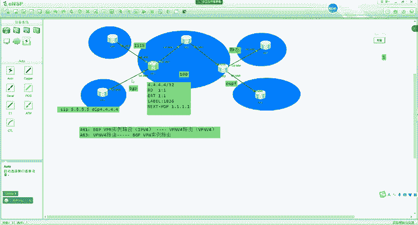

嗯。

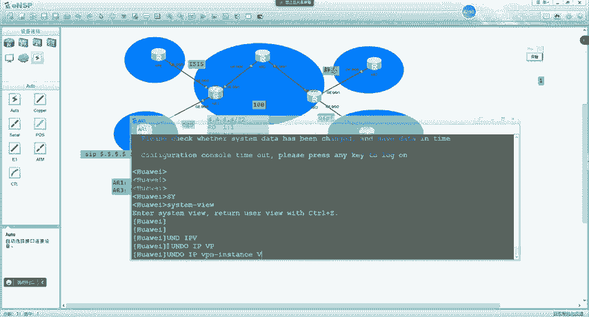

呃，这个图我来改一下，我们把它改成一个hpwork的。嗯。嗯，待会我们这样啊。啊。一。23。好吧呃，然后55跟7。然后这是4。啊，就这样吧啊。嗯。中间呢我们是一个管域网。对。呃，然后这是4。

我再拉拉两圈啊。然后五跟七呢作为分布。好吧。这是分布啊呃两个分布。两个s博站点。呃，现在呢四呢作为我们的总部。然后正常我们不应该用两根物理线嘛？呃，待会儿我们用子接口啊，大家觉得行不行？可行吧。对不对？

可行的啊。😊，嗯。我先把基础RTRD规划一下，好不好？呃，中间呢我们待会用AS100公网呢是AS100。呃，然后这个这个这个这个A24，我们用AS。呃。65000。行吧。然后这边呢。跑ITP吧。

跑OSPF。算了，咱都用BDP吧啊，好BDP。😊，啊，都跑BGP了啊，IDP我就不跑了。😊，然后这边呢，我们用个。BPS65。001。然后这边呢也用个AS6，用个6SA6002吧啊。嗯。

这是我们当前AS的规划。A规划完之后呢，我们在公网上啊让R作为R设备。好不好啊，就作为VPV4的R。啊，为什么做R呢？😡，因为我们未来所有人都给RR传路由，然后R再反射给其他人对吧，这样更简单一点。

因为除了这些设备，你未来可能还有其他设备啊，你不可能ARE跟这个设备建邻去，跟这个键跟这个键跟这个键吧。😊，是吧。那如果域内还有一些其他的设备呢，大家都跟R讲。对吧比如说AR1这边收到了1个4。4呢。

他给RR反射给所有人RT匹配呢，你们导入到VPN实力就能通了。好吧，待会呢我们让AR2作为微平V4的R啊来反射路由。行不行？啊，对R在公网上做啊。嗯，这里做完之后呢，我们在这样啊。

就是把DRT来规划一下，对吧？😊，呃，就刚刚我们不是有一些业务需求吗？对不对？然后咱们把RDRT呢嗯给他做一下。呃，这IDRT怎么样去做呢？嗯。我想想啊。咱们在这边的阿D。对吧呃，都用3。3。3。3啊。

冒号一。好吧，因为上节课给大家说了RT有两种RT有两种表现格式，一个是AA冒号NN制对吧？一个是IPUV4。冒号。差是吧，冒号时年制时间制指。是吧。所以说呢待会儿咱们用这种形式。好不好？

然后这样的话就两种都给大家说一下，反正都能配行吧。😊，嗯，在A23上呢，我们的啊不不对啊，这边呢用的ID是3。3。3。38号1。啊，这没有什么为什么啊，就给大家说一下，这种也能做。😡，得懂吗？

就给大家说一下啊。你们要觉得不习惯，我们再换成以前的好吧啊，就用一嘛好一。😡，嗯。啊，就100冒号7吧，对吧，然后后面我们用设备的编号。行不行？这是7嗯，这是5。啊，这是4。然后RT的话。

我们要设置一个一。RT还有IRT。ERT呢我们用E嘛好E。IRT呢用。一妈。然后对于下面这个分支呢。100冒号5。是吧他俩是一样的。那这个时候我们就要去考虑的，因为在总部未来会有两个表。一个叫做。验表。

对吧。一个叫做outt表。那印表呢，我们可以这样。他的这个ID。呃，我们用100冒号4。好吧，用100码好4啊。然后。下面这个IRT。啊，ERT对吧？因为未来总部呢，他要能够接收分部的啊。

要能够发送给分部路由。😡，哦，写写错了啊，这应该一嘛号一。对吧。那未来。应语是用接收的，应该IRT。验表只用于接收啊，所以说我们只配着IRT。好吧，那未来总部呢要能够接收分支的路由。

分支的ERT是E码号一。😡，所以说总部的。IRT呢应该是一冒号一对吧？只配1个IRTE冒号一。然后outode表呢未来要把路由传出去。传出去呢，我们阿D。用100冒号44。好吧，然后RT。

这应该是ERT。未来总部呢，对吧，无论你分支的路由传过来，还是总部的4。4直接传出去。那最终呢要被两个分部能够收到。那两个分部收到ERT应该是。姨马哈对吧，因为两个分支都只接受一马哈。所以在这里呢。

我们应该勇一骂哈。好吧。这是我们。当前的。这个业务规划。嗯，那咱们休息一会儿，好吧，休息10分钟。😮，嗯，10分钟之后呢，我们把这个hablebook实验对吧？

来给大家做一下啊嗯然后我们来看一下这个流量怎么走的，对吧，数据怎么走的。😊。

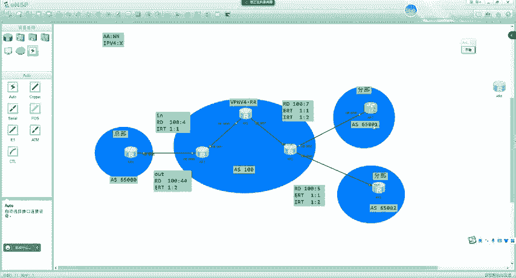

行，同学们，我们休息会儿吧。😊，休息10分钟啊。啊，已经改过来了啊。😊，咱们到9点13继续上课，好吧，休息10分钟。歇一会吧啊。嗯。我们把录屏开一下，好吧，继续上课啊。呃。

刚刚我们这个做了一个habswork的这个RT的规划，对吧？那这时候呢，我们真正的去通过配置的方式呃，把这个hapers work呢去给大家实现一下。😊，好吧，呃，这个怎么样去做呢？呃，我们来看一下啊。

😊，呃，按照我们当前的业务规划呢，这个IT已经规划好了，对吧？呃，以未来呢也能够实现这个哈的组网。啊，这时候呢我们就按照规划把相关的MPS配置去给他做一下。呃，思路是一样的啊。

就是刚开始呢我们要在这个AS呃100内对吧？呃，先去做一下公网的这个LDP啊，对吧？IGP啊呃这一块。😊。

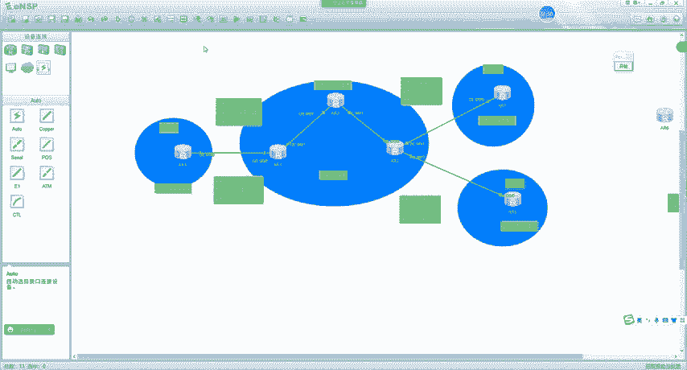

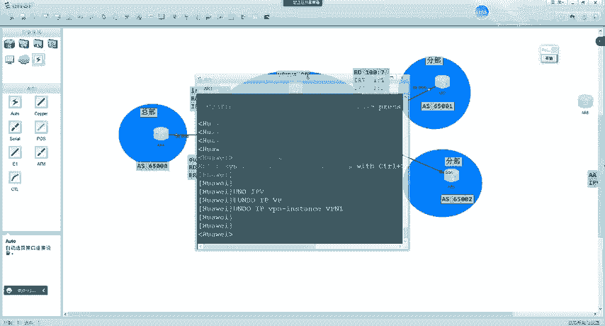

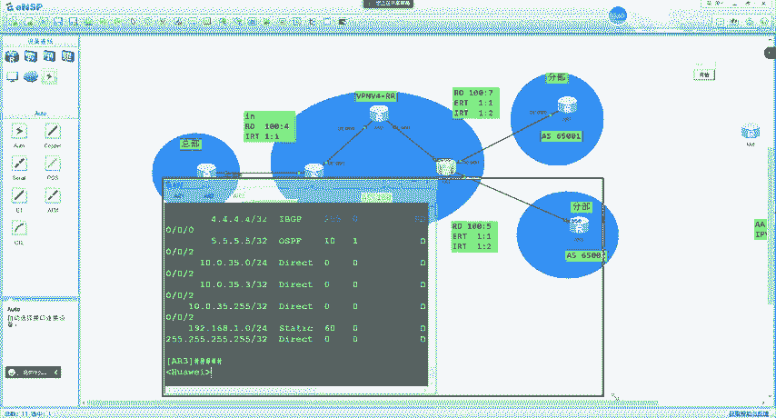

嗯，但我们现在设备依然是空配啊呃空配的话，我们先把IP来做一下啊，G0-0-1啊，10。0。12。1。呃，娄柏林1。1。1。1。对吧然后二这边呢G0-0-0。12。2。呃，G0-0-1。23。2。

然后是娄百林。2。2。2。2。然后三这边呢，G0-0-0。啊，10。0。23。3。

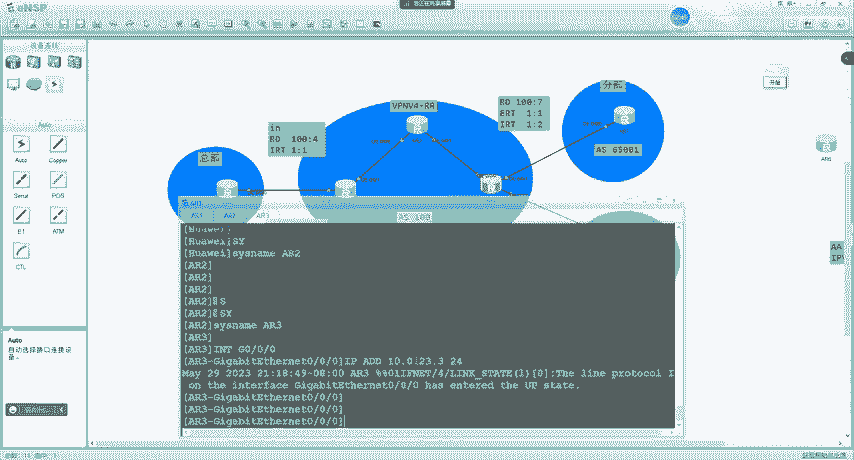

娄柏林。3。3点3。3。那123咱们做完之后呢，做一个这个。OSPF的配置给他刷进去嗯，OSPF1如ID我们就不改了啊。0呃，network0。0。0。0。然后是MP4LSRID1。1。1。1。嗯。

MP24MP4LDP。interfaceG0-0-1MPSMPSLDP。interfaceG0-0-0MPSMPSLDP。

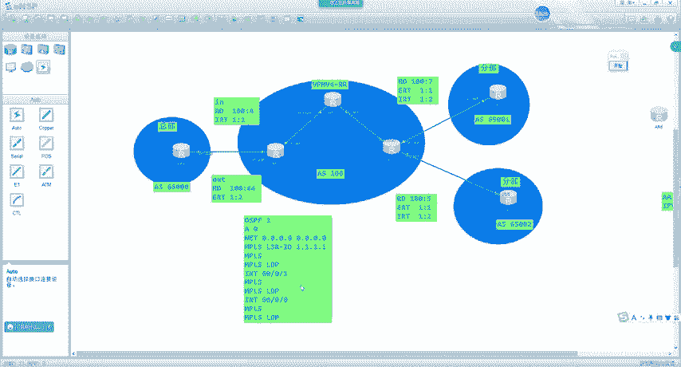

嗯嗯，这是属于AR一的配置，我给他。

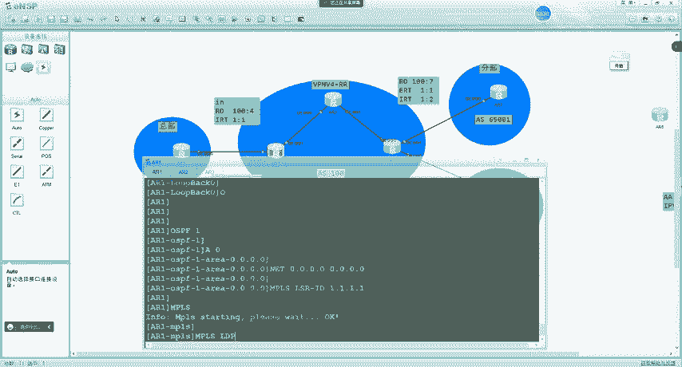

刷进去。嗯，然后到二这里呢，这里是2。2。2。2。

那是二的。

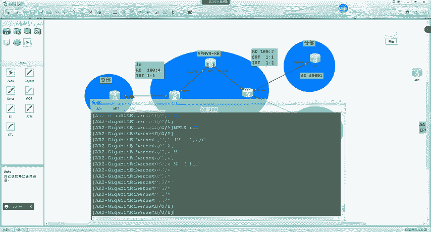

然后三上面呢，他G0-0-1不开啊，只开1个0-0-0。

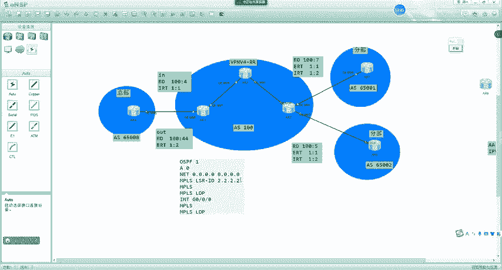

3来3来3餐。然后给他刷进来啊。呃，刷进来之后呢，待会儿在AR2上应该是可以去看到diplayOSPF片。

呃，不。对吧能够看到这两个邻居啊，但是现在还没有发啊，我们需要等待一会儿。呃，待会他们起来之后呢，LDPMPS咱们都直接刷上去了，对吧？所以说邻居待会可以进行正常的建立。呃，建立起来之后呢。

我们先把PCE之间的路由协议呃来做一下啊。这里呢咱们用的都是这个BDP好吧，我们在AR1上啊，我先这样，我先把VPN实力创建好呃，VPN一对吧？然后我们有一个音注意啊，VPN的名字呢。

VPN实力的名字大小写是比较敏感的。

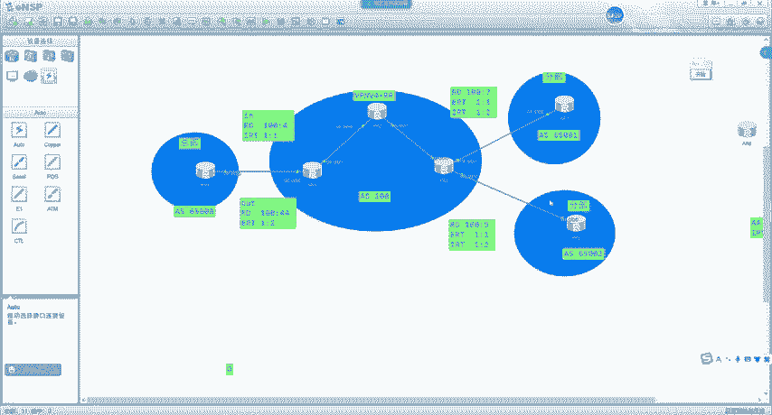

啊，VP一跟小写的VP一呢不是同一个VPN实例，它是大小写敏感的啊，这里大家知道。呃，然后我们印表呢按照这个规划，你就按照这个当前我们贴的这几个啊啊，对着这个去配。

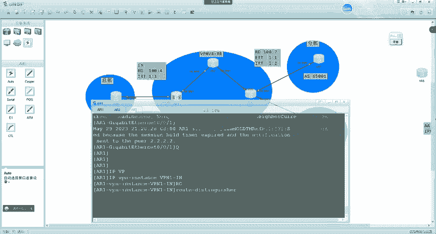

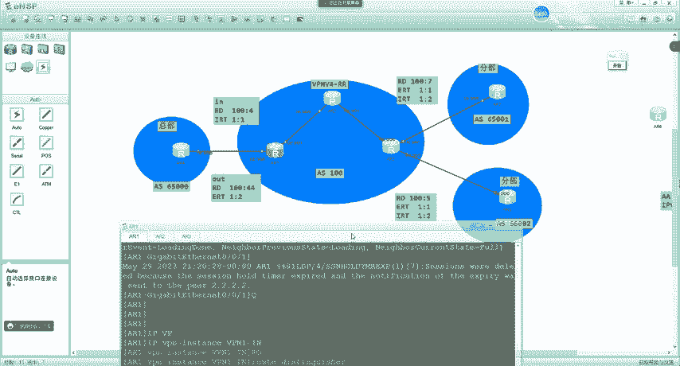

呃，ID呢是100冒号4对吧？然后有一个入RT是100啊，1冒号一对吧？音炮的RT。然后IPVP instanceVP1杠out。

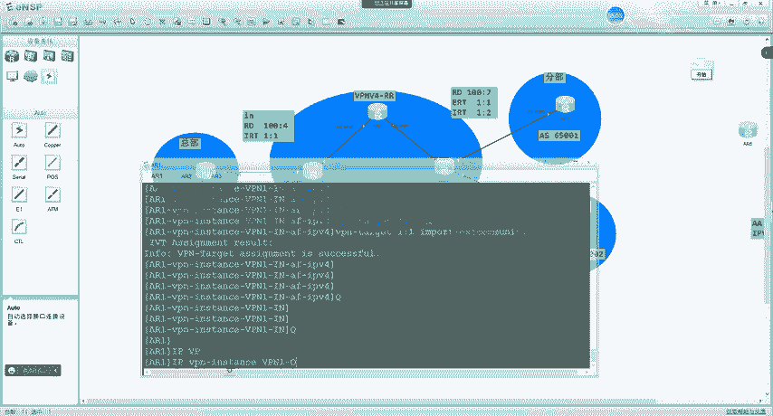

对吧有一个初象的这个表。然后RD的话是100冒号44，然后RT是只有1个ERT1冒号2。对也是么好的IT。

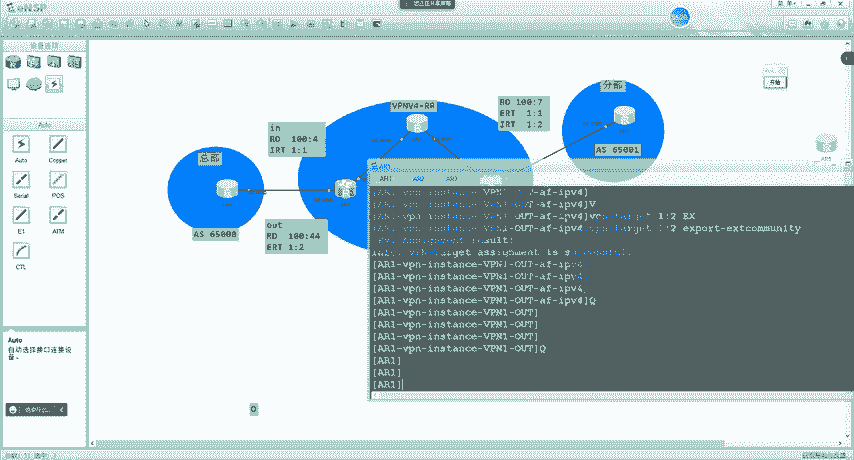

嗯，做完之后呢，我们然后到A23上来派一下他的VP实例IPVP。呃，这里呢我们用VPN。一好吧，直接就叫V平一了啊。然后RD的话是100冒号7，RT的话是一冒号1。呃，作为伊的IRT，然后。

一、冒号2啊作音炮的IT。

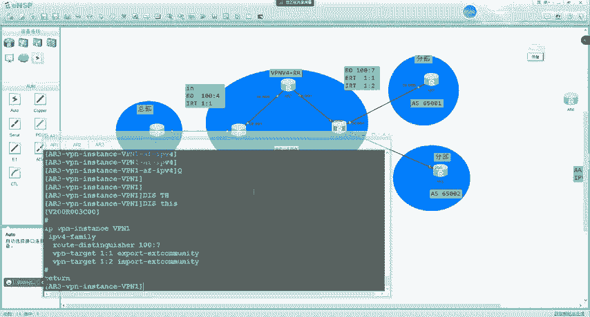

对吧呃，对于这个A23连接这个A25的这一块，然后除了这个RD不一样，RT的规划是一样的啊。嗯，这个我们用微P2。

就用VP2吧啊。

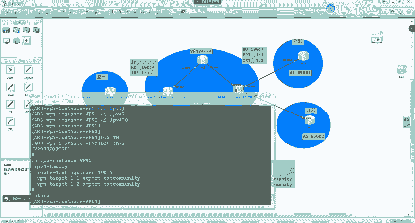

嗯，然后在A23上给他贴进来。好吧，那这里做完之后呢，咱们继续来看啊呃在总部呢，待会我们需要有两个接口，对不对？嗯，这里呢总部我们先不配啊，我们先把简单的分布给它做好。分布这里呢我们先做上面这一块啊。

就是在A23的G0-0-1。😊。

呃，绑定到微P一下，然后给他配个IP呢1。0。0。37。3。嗯，24。对吧然后是BDP100IPV4familyVP实力VPEP10。0点37。7A65001。好吧。呃。

然后是interfaceG0-0-2。把它绑定到。VPN2中，然后IPUdress10。0。35。3。BDP100IPV4family vP instance啊VP2。然后是10。0。35。

5A65002。对吧这时候我们把七跟五来配一下啊，让他跟三区建立起来邻居。嗯，7这边呢s name AR7。G0-0-0接口，咱们用10。0。37。

7AS啊3啊24呃interface low back0。7。7。7。7。然后是BDP65001。P210。0。37。3A。100。是吧然后是A25this nameA25。G0-0-0嗯，10。0。

35。5。啊，low back零接口5。5。5。5。然后是BDP65002，然后P210。0。35。3A100。好啊，002没没错啊。刚刚敲错了。

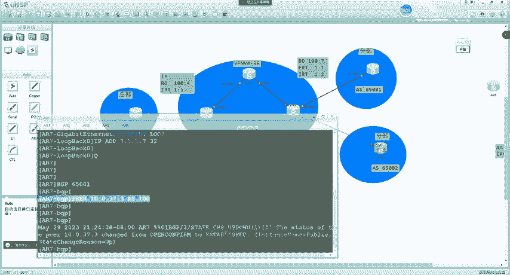

啊刚也没错吧，没错啊。那这时候呢我们可以去看到啊，在A23上呢，我们可以通过display BDPVPV。

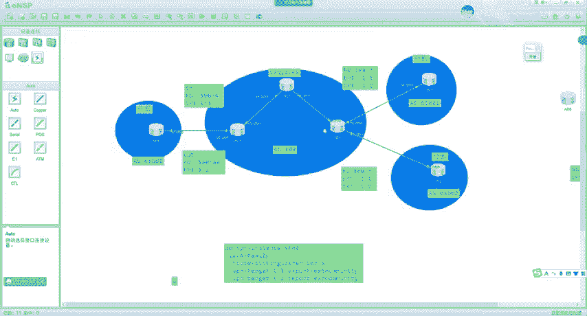

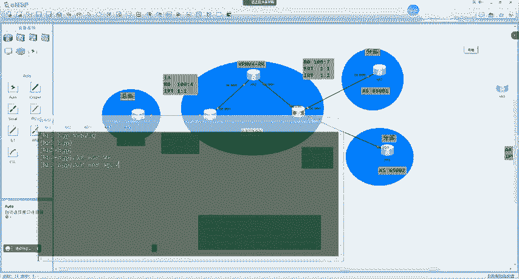

42片呃，可以去看到呢，他在V平一跟7建立了邻居。呃，在微P2呢，跟五建立了一域。啊，当然还还在X5啊啊起来了，对吧？😊，哦，起来之后呢，我们在总部应该有两个链路，对吧？一个用于收啊，一个用于发。

但是我们只有一条物理链路的方式，就只有一条物理链路的时候呢，可以采用子接口的方式来进行配置。好吧，我们这里呢可以用子接口啊，比如说我在AR一上呢。

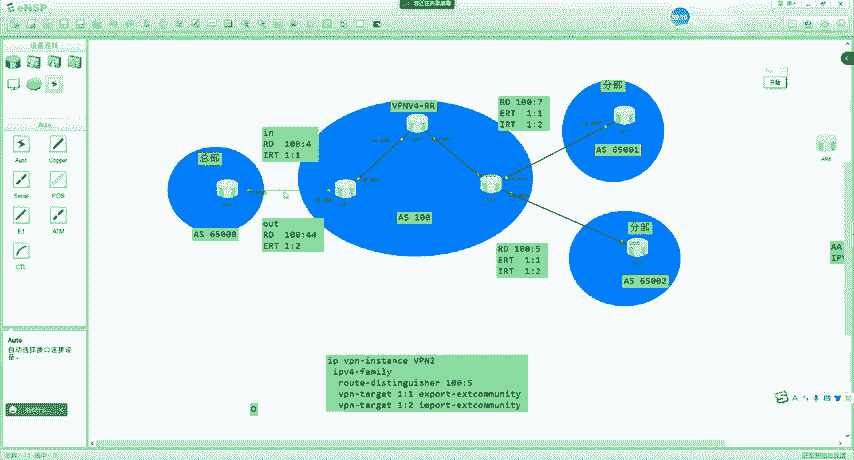

嗯，interfaceG0-0-0点10，对吧？我们可以给他做个描述，好吧，就简单说一下它的作用，它是用于印表的。对不对？就说一下这个十呢是属于印标。能不能明白？那然后呢，IP。帮顶VP啊。

他应该是在VPNE杠in。对不对呃，然后IP dress10。0点。嗯，在们上面用14。1好吧，用14网段啊。然后ARP broadcast enable啊，他说我们先要做dota oneQ的封装呃。

VID10，然后ARP broadcast enable。对吧这是在ARE上的配置，这个大家都能看懂吗？😡，没问题，同学敲一啊，这在I一的时候都学过吧。😡，对吧啊，终结啊，危兰t啊，微难终结嘛，对不对？

呃，然后我们在。A21interfaceG0-0-0。20好吧，然后再做一个描述，它是在outt表的。啊，对，VID是随意的啊。但是你两边的VID要对应到一起，这边是实，对面也得实实。好吧。

你不能这边是十，那边是30啊，这样不行啊。😡，然后我们做一个这个绑定VPN实力VP1杠out表。对吧然后给他配一下IP10。0点，咱们用41。1注意啊是41，上面那个是14。然后。dota oneQ啊。

他明对吧呃，VID我们用20。然后ARP broadcast enable。不。能跟上吗？那这里做完之后呢，我们在ARE的BDP100IPV4familyVP。insVP1-1，然后P210。0。14。

4。A65000。对不对？然后IPV4family VPN in VPN1杠out。P210。0。41。4A65000。

是吧。那这里做完之后呢，我们在AR4上。

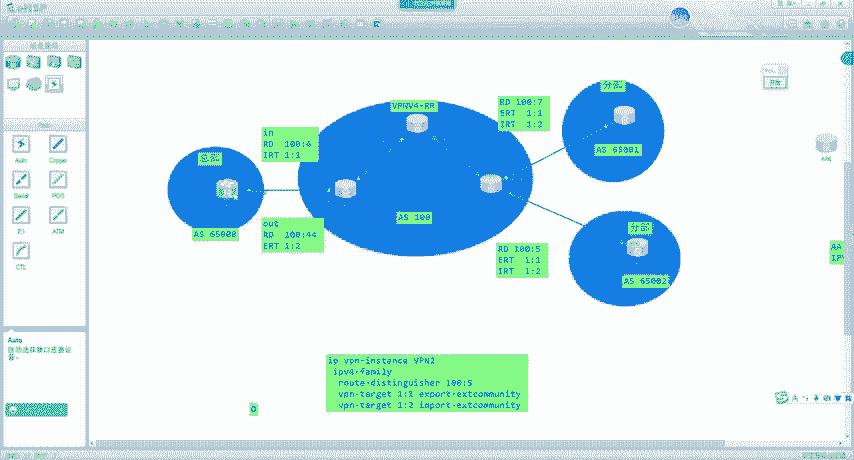

Sas the name。A24呃，BDP65000嗯，然后借款IP还没配啊，先给他干上。这里呢它也是两个子接口，G0-0-0。10。对吧呃，我们给他注释一下叫验表。呃，然后是IPdress10。0。

14。4。对吧然后是doQ的封装VID10。ARP broadcast enable。这里没问题吧。没题敲一啊，能看懂吗？这个配置。😡，可以是吧，其他同学呢都没问题是吧？😊，OK啊。

然后interfaceG0-0-0。20。啊，做个描述，他是在out的表。啊，当然不是在outt表啊，就是呃做out的好吧，做发送路由的VID20。IPUdress10。0。10。0。41。4AS啊。

不是啊，24。ARP broadcast enable，然后BGP65000。那在AR4上呢，没有任何微屏实力哦，我们只需要P210。0。14。1AS100。P10。0。41。1AS100。

然后创建个楼拜零接口。4。4。4。432对吧，BDP65000。好吧，那这时候呢我们第一spplayBGPP2嗯，现在还在挨豆是吧？时间还没过啊嗯32秒之后呢会见邻居，咱们稍等一会会儿。😊。

等一会儿就好了啊。好了，对吧现在就起来了啊，邻居建立起来之后呢。😊。

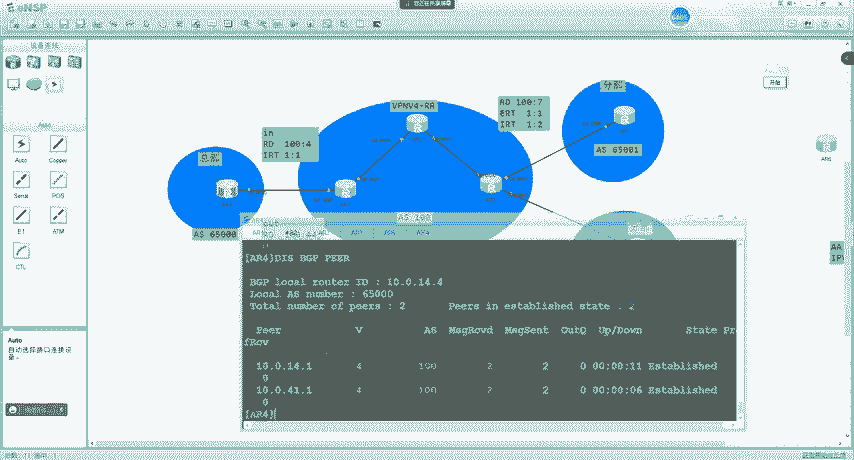

嗯，公网上的配置我们先不做，好不好？官网上的配置我们先不做啊。😊，呃。我这样对吧？我们随着这个路由的传递啊，一步一步来给大家说一下思路。首先我们来看分布之间怎么传路由，注意啊。😡。

现在我要讲的是分部之间。

怎么传路由？我在A27上呢。BDP65001。network7。7。7。732。一旦宣告出去之后呢，他会发送给自己的BGP邻居。A23，所以3呢。

diplay BTPVPNV42rootingtable我们可以看到啊，认真看。

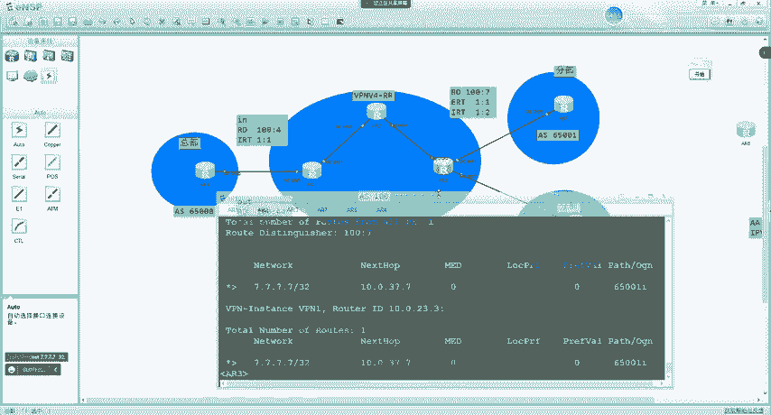

V片2现在没有发布啊。😡，所以说VP一有一条路由。有没有给我说A27有没有给我发一条路由啊，发在唯平实例下转成唯平维4。😡，对吧这时候我们想把它传递给一，哎，怎么传呢？😡，我们需要把二作为R。对不对？

把R作为RR，那这个R怎么样去做呢？我们在A23上BGP。😡，100Pre2。2。2。2AS100P2。2。2。2connect interfaceface low y0。

然后注意进入到IPV4地址处位下。啊，就是V偏V四地种竖想。P2。2。2。2跟2激活VPV4邻居。然后。没了。啊，然后就没了啊，就是跟二区建立VPV4邻居IPV4默认激活的之前给大家说过啊。

我们可以不用管它。😡。

然后在A2一上呢，跟三是一样的配置嘛，就是跟二区建邻居激活它。😡，对吧。这时候我们来配这个R设备。在AR2上呢，BDP100。P尔1。1。1。1AS100。2。2。2。2。A100。

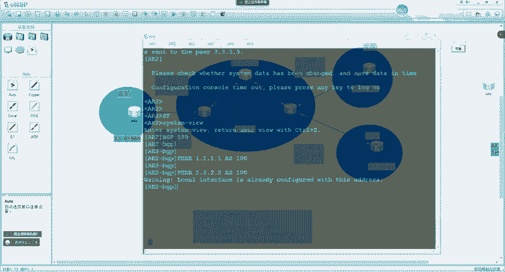

啊啊啊3。3啊3。3。3。3AS100。为啥要建邻居，你不建邻居怎么传路由啊？😡，是吧1。1。1。1connect interfaceface low y0。3。3。3。3。

那的interface娄柏玲IPV4family VPV4地址书啊。1。1。1。1激活。3。3。3。3激活激活之后啊，注意1。1。1。1作为反射器的扣击。3。3。3。3作为反射器的扣机。

然后大家注意观看R的配置。这是R的配置。好吧，之前我们做的反射器呢都是在IPV4单波下，但是现在我们要传微平V4路由，所以说在微平V4地主线下去做。😡，所以这一步大家明白了吗？

明白的同学敲个一都没问题吧。可以是吧？好，我们继续啊。现在做完之后呢，A23注意D四playBDPVP。微慑。奥片儿。对吧我会发现呢跟二已经建立了邻居。那这时候呢。

你的VP v4路由2 table要不要传递给二？😡，要不要是需要的，他会传递稿。传递给二之后，我们来看一下二有没有收到呢？哦，好像没有。对吧。这里为什么没有呢？来给大家解释一下啊，上节课我给大家说了啊。

有这么一条命令，咱们先不用管，注意，我把这条命令的作用给大家说一下，我们可以发现我们没有拍这条命令，但是它已经存在了。😡。

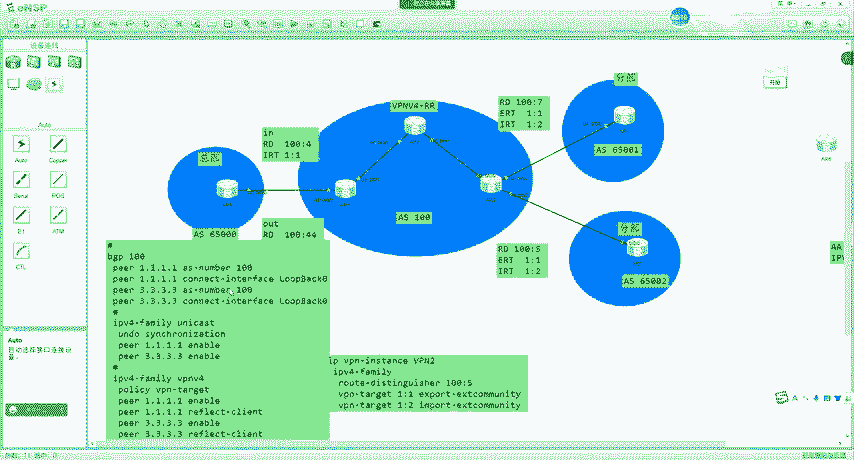

这条命令是什么意思呢？他是这样的。我们一般把它叫做开启。基于RT的路由过滤行为。

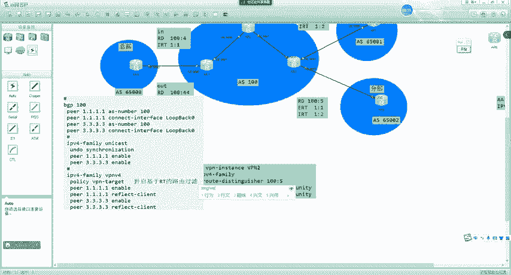

什么意思呢？因为我们之前说过啊，就是我接收到一条路由之后，我得唯拼实力的IRT跟它匹配，是不是这条路由我才可以导入到微拼实力中啊。😡，大家能明白吗？他是这么一个过程啊，我再说一遍。

首先收到VPNV4路由，对吧？😡，ART匹配之后。导入到BDPVP实例中。对不对？😡，现在我们可以去看2他有VP实力配IRT吗？😡，没有。😡，没有怎么办呢？没有，他都不收了，他连唯偏唯势都不要。😡。

能不能明白，正常我们收到一条路由，是不是先从微PNV4收到，再导入到VP实力啊？😡，是吧你发的时候，我把这个方向给大家说一下啊，A27发的时候，它是分发到微平实力，然后再转换成微平V4。

所以说在发送方向它是这样的一个导入过程。😡，但是我在接收方向的时候，邻居给我传的是不是VPV4啊，然后我才导入到VP实里。😡，所以说在接收路由的时候呢，先接到的是候VPV4。

然后再导入到实例中跟发送方向正好是反的。😡。

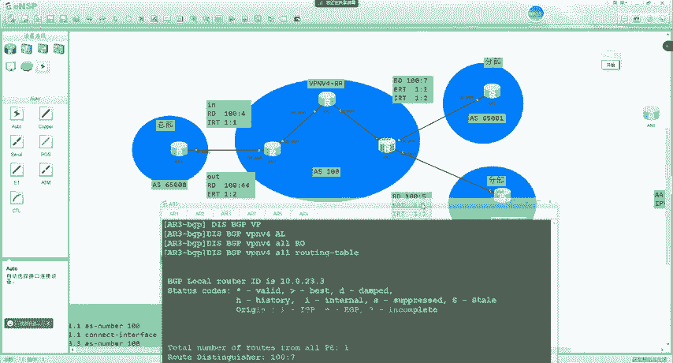

而这时候我们去看AR2的话，他是在发的方向还是在接的。三给他传的是什么玩意？唯平为4路由。😡，对吧你必须要有微P实力匹配之后才可以导入接收啊。对不对？正常我们理解就是我收到之话。

老师我先收到V品V4RT匹配导入到实例中。但是现在是吧我们可以去看到。😊，哎，老师啊，他连VPV4都没有，他有没有？😡，没有。是吧这里给大家说一下啊。😊，就是如果本地所有的VPN实力都不要这条路由的话。

这个路由器就不会保存。这个大家明白了吗？明白同学敲一啊。好吧，现在二是不是没有任何唯平行实力啊，需要接收这条路由，所以说他压根都不要，你给他传，他不要不要怎么办呢？

我们需要在R上IPV4唯平V4地路速下去把这条命令给它干掉RB桥。😡，好吧啊，如果大家有同学在考笔试的话啊，应该还记得有一个在。在L3VPV4O SRV6里面。对吧而而。需要配置一条命令。

对吧有一道笔试题吧。对不对？那这条命令是什么啊？😡，现在各位同学知道了吗？是什么啊？😡，是什么？对吧就是这套命令，好吧，那他给我们这个区别在哪呢？我们这个场景是在L3VPNV4。😡。

op沃 MPPS4场景下。😡，啊。需要配置一条命令。但是这两个呢面龄都是一样的。好吧。都是一样的啊，都需要配这一个。所以你无论是什么样的场景啊，你都需要去配这一个。😡，能不能明白？明白同学敲一啊。

没问题吧。😡，其他同学呢能跟上吗？😡，可以吗？SBR不用管啊，我们还没有讲到话语，好吧，不要超纲，现在把课上的先搞明白。😡，那接下来我们再来讲。现在我们关闭之后呢。

AR2就可以接收到了AR2接收了他没有VP实力，还要不要导入？😡，我们可以看到它只有为品灰色。还要不要导入，不需要。😡，但是现在。他可以反射给ARE。所以A2一接收到之后。有没有从VPV4中接收到7。

7？有没有有。😡，那他有没有匹配？😡，印表的一码好意有。😡，对不对？他肯定匹配啊。😡，是吧。所以他就见印表了，见到印表，我们要不要传递给印表的BDP邻居啊？😡，晏表的BDP邻居是谁呀？😡，是谁呀？14。

4。所以说A24我们来看一下D4类BPVPV4。啊，diplay BGPP。A24啊，不对啊，第一次play BTP tableA24有没有接收到7。7，是不是？14网段硬表给他传达。是不是啊？😡。

是吧。那这个路由传递给4之后，从EBDP邻居接收到路由，要不要传递给EBDP邻居啊？要不要？😡，Yo。肯定要啊。对不对啊？那这时候呢，他就需要传递给A21。那我们来看一下啊，A21有接收到录由吗？

他要通过outt传给A21吧。😡，从应收到从outt传递给AR1，但是ARE的out表有没有收到啊？😡，我们来看这里。41。4给我传的路由没有。是不是啊？😡，是吧。😡，啊，大家不要刷屏啊。

刚刚哪个同学是吧，好吧，41。1是不是没有啊？😡，没有怎么办呢？我们来看一下啊。那这时候呢，di displayplay BDPVPNV4啊如table。对我发现还是只是在硬表。对不对？哎。

那为什么没有接收啊？哎，大家思考一下，你们之前在IP的时候学过这个知识点。😡，仔细想一下。为什么没有接收？😡，路由肯定是发了。对不对？哎，但是一不收。什么原因啊？对吧AS pass的返还。对不对？

所以说呢这时候怎么样去解决，我给大家说一下啊，在AR一上呢。😡，注意在outt表中需要一配一条命令。VPANA。VPE杠out。好吧，P10。0。41。4。这条命令之前有没有学习过？

学习过的同学敲个一啊，有没有学习过？😡，知道吧。对吧允许重复AS号的接收。好不好？那这时候呢，允许多少个呢？你可以去随便配啊，比如说允许重复一个啊，重复两个，最多能重复10个啊，一般我都是敲时。😡。

好吧，当我们配置完成之后呢，Dplay BDPV平V42如庭table。😡，那我们来看一下啊。奥表有没有接收到？这哪个同学啊？对这个。哪同学啊？哦，你要敲便的，在自己白板上敲一下啊。😡，好吧。

这个配置咱们课下会给大家整理出来。😡，行不行？😡，呃，尽量不要刷屏啊，不要打到这个聊天框里啊，因为其他同学可能看着不太方便啊。😊，行吧，待会儿咱们下课之后啊呃我把这个配置啊给大家整理出来。😊，行不行？

咱来看一下啊。那这时候V片一是不是接收到了？😡，是不是啊？对吧那这时候呢，他又变成了。😡，有没有又变成唯平V4？注意这个ID址。有没有有吧。😡，那变成V平V4之后，注意我们来详细讲一下这个过程。

首先这个7。7。7呀。杠32的路由。那么他会发送到A23上。别吵架啊。啊，没骂人是吧？大家一起学习啊，互相之间体谅一下，好吧。行不行啊，别吵架啊。吵架我要禁言的啊。咱们来看啊，那这时候呢。

AE条IPV4路由就传递给三了。😡，对不对？那传递给三之后呢，三要不要给他打上阿D呀？阿迪。一冒号一啊，不对啊，一0骂号7。对不对？然后打上1个ERTE冒号一。然后丝网标签label。注意。

算标签是多少，我得瞅一眼啊。7。7。7。7。嗯。我得找验表的啊。找微P一的。100冒号7在这啊。对吧这是不是1008号7呀？😡，1个1026。对不对？1026。然后。他就发送给了RR反射给A1。对不对？

这还是唯平为4路由。所以说A21会变成IPV4路由，最终发送给A24。对不对？这不就是一个站点，普通的路由传递吗？这个大家明白了吗？这个过程明白敲一啊，没问题吧。😡，对不对？那么一旦过来之后。

我们再来看A24把IPV4路由发送给了A21。A2一收到的是什么路由？😡，IPV4路1，也就是说A21他知不知道是从这边绕过来再给他的，他知不知道？😡，他不知道，他以为直间是4。4自己产生的呢。

那AR一要不要重新给他打上outt表的RD啊？😡，奥t表的RD要不要给他？😡，100万号说的是。ERT。一马哈二。对吧丝网标签怎么办呢？收到IPO4路由分配个丝网标签嘛。😡。

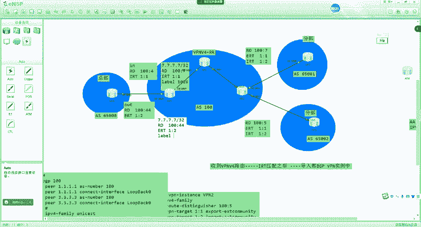

A21我们来看一下，给他分的是多少。diplay BDP VPV42rooting table7。7。7。7，我们找。100冒号。44在这吧。对不对？18号44。给他分配的是1026。对吧注意啊。

不是说直接把这个用过来了。不是啊，因为你这里给他传的是IPV4，他都没有标签了。😡。

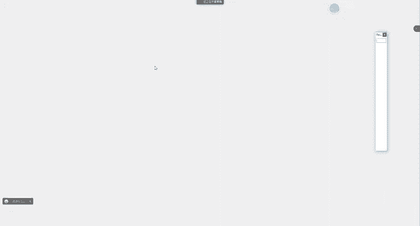

只不过这里分配的正好是一样了，也是1个106。好吧，那这个路由要不要传递给啊，要不要？😡，要不要要是吧，但是这里有一个问题，哎，老师啊，哎，他刚刚过来这个7。7，他再给他，那R要哪一个呢？😡。

大家觉得R要哪一个？😡，啊都一。为什么都要呢？😡，阿D一不一样？他告诉我阿D一不一样。😡，阿知不知道这是不同的路由，阿肯定都要。能懂吗？R是都要的。好吧。那那。我们的总部out表的路由能不能跟分支一样？

😡，你觉得能不能一样，我给他也改成100冒号7，没有路由冲突吧，这时候没有，但是能不能一样，不行，为什么不行呢？因为如果你放的是一样的，你给RR选哪一个呢？他只选最优的路由肯定传递就会有问题。😡。

所以我建议大家是什么呢？啊，就永远听着一条什么呢？啊D。😡，对吧要唯。全网为宜。就是有些场景下，我们可以不让阿迪保持为一。但是如果你有那个条件。😡，你尽量让他全网为一。大家能不能懂我的意思？😡。

懂的同学敲一啊。你比如说啊我们没有hawork，就这两站点，他俩ID一样行不行呢？可以啊。😡，是吧但是在这种h场景下嗯，一定要唯一。至少你的out表一定要跟分支分开好吧，所以我一般给大家建议呢。

就是全网为一。那真正你在项目上的时候也是这样去部署的。😡，🎼好吧，那怎么样保证全网为一呢？是吧？刚有同学问啊，老师是吧，我刚刚为什么要给大家用1。1。1冒号一呀？😡，是吧每个设备用自己的环回口做前缀。

每个微平实力，后面就是12345对吧？这样最容易全网为一。大家明白我的意思了吗？明白的同学敲个一啊，没问题吧。比如说我这里每个VP实力12345，这边就是2。2。2。2，算上前面的呢，肯定是全场为一的。

😡，对吧一般在项目上呢也是这么去用的。好吧，这里只是给大家说一下啊，对AS加编号也行，没错。😊，那这时候呢，他把路由给二之后，我们来看一下2的BDPVPV42rooting table。

我也可以去看到啊，首先从分支过来的。到了AR2之后，有没有这一条啊？有吧，然后从总部再过去的。有没有1个18号44啊？啊，然后我们看这100冒号447。7。7。7。他的ERT是不是易曼华？是哪一个？

是总部的。对吧奥t表的IRT。而那个100冒号7的是由分部发过来的，他是一冒号一。对不对？所以这个大家能看明白吧。那这时候呢，他要反射给三，反射给三之后，我们来三上看一下。😡，第四类啊。

我先不来三上看三反射之后，三有没有需要接收？这个路由的VP实力啊。有没有？有没有？😡，有吧。对吧首先我们来看A27这边。😡。

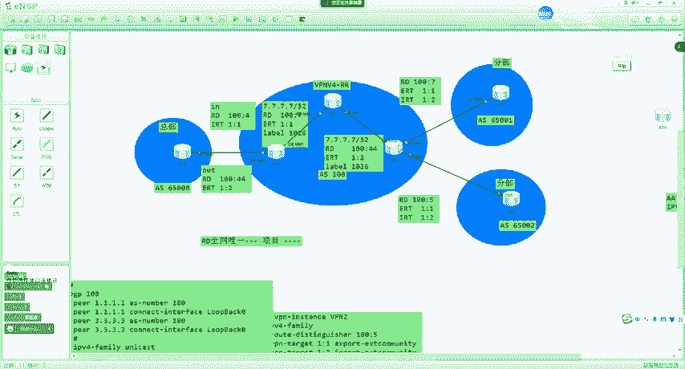

第四类BTPVPV是2入庭table。对吧A27这边有人就问了，哎，老师啊。😡，哦，他绕了一圈又打回来了。😮，会不会还路呢？

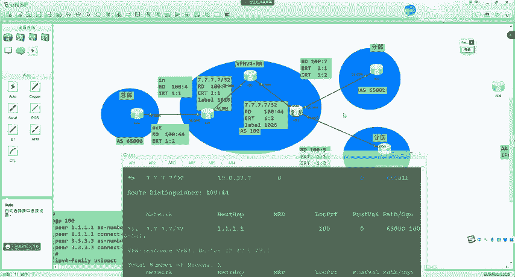

注意啊，是际上不会，为什么呢？因为三永远是优选谁发送的。1BDP里就发生的，你通过AS号也能比出来吧，他永远是选七发的。😡，对吧虽然你再导回来，但是三不优选，这个路由等于没用。能不能明白？

然后我们再看VP2下面这一块。那这个路由7。7。7。7，我们来看一下啊。100。100冒号是的是有没有给他导入进来？有没有？对吧IT匹配就导入进来了，导入进来之后，要不要通过BGP邻居传给5呢？😡。

大家觉得会不会啊？5能学到7。7。是吧那五的路由表就有7。几。对不对？是吧。522咋会负载均衡呢？二的负载均衡从哪来的？😊，5有没有7。7啊，有那反之BDP100啊BDP65002network5。5。

5。5。😡，那大家告诉我。😡，这个路由从硬表过去，再从奥德表传到这里。七能不能学到？😡，七能不能学的？可以。那我们来测一下5跟7能通吗？片杠A5。5。5。5到7。7点767。通了。把也问了哎。

老师咋通的。是吧，很奇怪。对不对？琢磨不透，我们来看啊。5。5。5。5。作为原IP。到目的IP7。7。7。7。首先我给大大家要明确一点，我从这个接口接收到路由，我数据要不要从这接口发出去？😡，要不要？

😡，要不要？😡，要吧。😡，5、把这个路由发给4。4、访问五的数据要不要从这里过来？要不要要那这里有一点是什么呢？😡，哪个接口发路由？对吧哪个接口就接收数据。对不对？哪个接口接路由。哪个接口就发出数据。

很简单的道理。这跟我们之前学的这个BDP不一样吗？你把路由传给我，我把路由把数据发给你，他是不是反过来的，是不是？😡，是吧然后我们来看。5访问7。7的数据到三之后，3首先去看VPN2。

为啥呢从VP2接口下收到7。7。7。7。有没有1个丝网标签1026啊？他就先来1个1026。然后吓一跳呢。1。1。1。1。对吧。这是他的套路ID啊，我们直接看RSP啊。😊，1。1。1。11024。

再给他来个1024。这个数据就发1二了。对不对？发给二之后，2收到1024怎么办呢？怎么办？倒数第二条弹出。只有一层1026。发给一了那一大家告诉我这个1026谁分的？😡，是三给这边分呢。

还是一给这边分呢？给谁分的，谁分的一还是三啊？😊，一分的啊注意是一分的。不是3啊，是一。好吧，所以说A2一上看LP。1026查VPout表，这不就我们所说的吗？out表往外发数据。

哪个接口啊out德表往外发路由，哪个接口发路由，哪个接口收数据。所以说out德表有没有收到数据啊？有没有？😡，有吧。拿接口发路由，你就从哪接入数据吧。😡，所以说这个豹纹啊就变成普通的IP包。

传递到A24了。A24已收到1个IP报纹，他得查录音表吧，他一看7。7。7。7咋去呢？😡，谁给他传的7。7啊？😡，谁给他传的验表？是吧他要发送给14。1。所以说这个报文要不要再传回来，要不要？

要吧那比如说我在这里抓包一个聘用，我能抓到几次在这个链路上。😡。

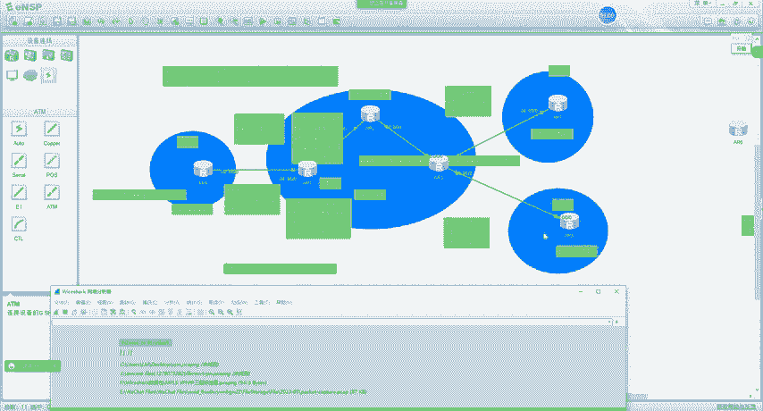

各位同学告诉我能抓到几次。我现在拼了两个包，那request的最少有4个。那，我们来看。首先有没有过来啊？对吧然后又转出去了。对不对？re的回报是不是也一样的道理啊？😊。

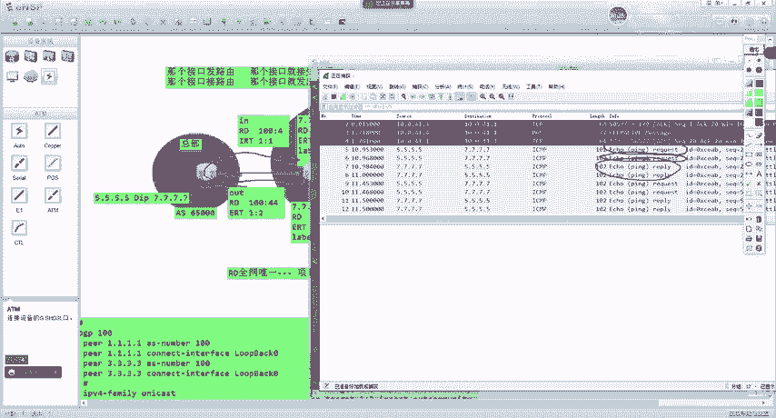

对吧所以这个包呢在这个链路上，你能抓到两侧啊。然后他发给A21了，A21从哪个表收到的，大家告诉我从哪个。😡，从哪个？奥特。数据发过来了，发给A21了。😡，你看看吓一跳是谁。😡，点1。页码。对。

这不还是那个道理吗？哪个接口。啊，接路由是吧，哪个接口发出据？那这时候呢，到ARE之后，dispplay BDP vPV42rooting table。追意啊。印表有没有1个7。7啊？有没有？7。7。

7。7。我们去看这个印表。因7待期。打上一个标签1026啊，这时候这个报文啊又打上标签1026了。然后去看他的吓一跳验表中关于这条路由的吓一跳是谁呀？3。3。3。3第四类M片是RSP。3。3。3。

31025。再打上1个1025。那这个数据就发送给二了。2、收到1025，从G0-0-1发出。2、收到1025，从G0-0-1发出来，发给三了。3、收到1026，他怎么办？微便一。VP一是谁啊？

把标签弹出查找VP一的录由表发送给其。那这样就同了。所以这个过程大家搞明白了吗？明白同学敲一啊。都冇问题吧。可以吗？可以是吧。嗯，忙忙，你还是没有到那个阶段啊，这个很简单啊，就是绕到总部再回来嘛。😡。

对不对？这不就是绕到总部载回来吗？

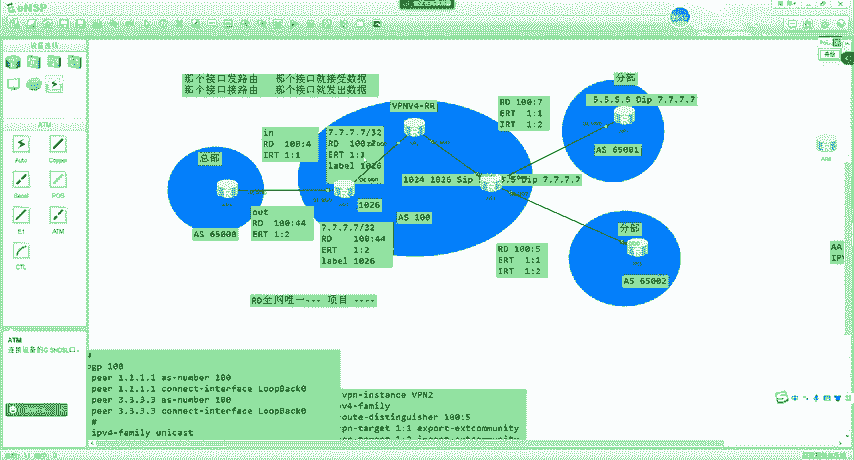

是吧。课下把这个实验做一下好不好？各位同学去做一下啊。😡。

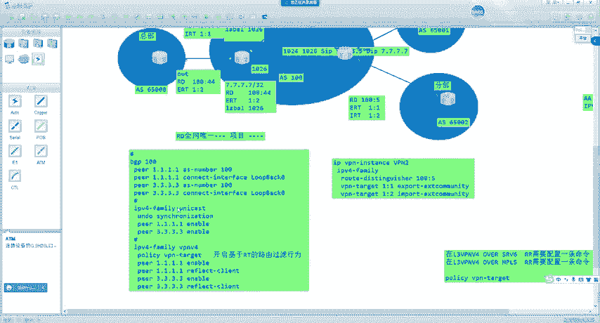

呃，做完之后呢，你就不懵了。能不能明白？嗯。这个算不算次优倒不算啊。😡，你你这是有你业务访定的路径要求啊。是吧你有路径要求，那肯定得有CU啊，对吧？你不能想着走最优路径啊。😡，是吧。这就是这样的。

你有路径要求。这种不算次由啊。这你的路径要求，你怎么能说是次由呢？是吧他本身就有冲突啊，我举个例子啊，之前给大家说过。😡，比如说你要做ECMP。你要不要接收？来回路径不一致的风险。要不要？是不是也需要？

对吧因为你负载分担本来就有可能来回路径不一致啊。对你想经过总部呢。嗯，那你必须就你路径要求是要求好的，你肯定走不了最多，最优路已经。L4那收的数据和发数据都录音。收数据是outt啊，这不是这样吗？😡。

下面是outt。你看啊。你无论是七访问五的时候，还是无访问7的时候，比如说七访问5，他也是这样进来，数据这样进来，这样出去，然后再发过来。😡，如果是无反问7呢，也是一样的。从这样进来这样发过来。

然后这样到期。

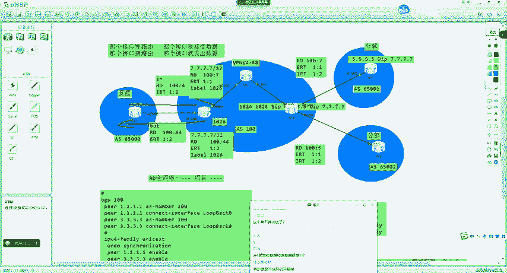

能懂吗？就是ARE啊，永远是从outt表把数据发给CE。

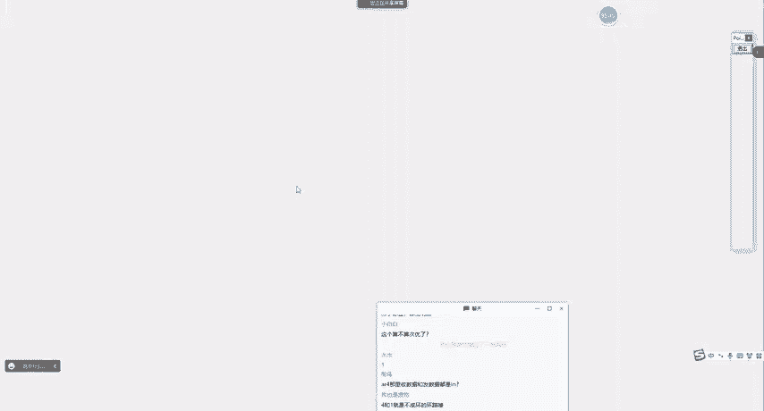

啊，从验表呢，CE再给他中转过来。是这样的啊。嗯，对，没错。四合一就不成环路了。啊。😮，环路从哪来的？如果分公司有两个班。有两那就没办法了啊，这个谁向西啊。你既然都是一个公司了，你的网段肯定不能冲突啊。

😡，no懂我的意思吗？除非你做NT啊，你在这里做NT出去。😡，大家能能明白我的意思吧？我举个例子啊，比如说我这边还有1个8。8。那你就在这里做N出去。你得避免这种地质冲突啊。好吧。

PE设备上是不是先查两次表，再根据MPS查内层。转到汤诺查路由表。在批审么上？

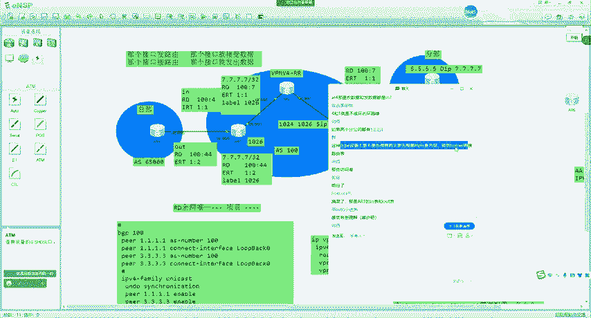

呃，你可以这么理解，它本身就是一个迭代的过程，就是首先根据IP路由表迭代到隧道对吧？啊，打上死网标签，然后再到LDP的隧道里。😊。

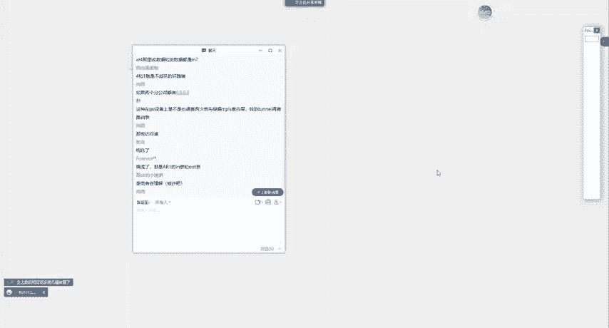

好吧，它是一个迭代的过程，就直接就迭代进去了。那他反问这刚刚给你说了吧，你你肯定不能有冲突啊，你要有冲突，那他就随机选择一个了。😡，对啊，两个分布你也不能地址一样啊。你你分支之间是互通的。😡。

你能地址一样吗？你想想肯定不行啊。😡，就比如说你们公司你们公司在上海有个部门，在深圳有个部门。他俩地址能用一样的吗？肯定不行啊。😡，能懂吗？你只要有互访的要需求，地址肯定不能一样的。😡。

就是虽然我们是不同的站点，但是他们属不属于一个公司啊？😡，有互访的需求，地址不能一样啊。那如果非要地址一样是什么呢？就是你A25这边我举个例子啊，你把这个网段给他发布出去。😡，发布出去之后呢。

你这边起个8。8。8。8。😡，对吧但是你你不能直接用lo板接口模拟啊，不行，你得在这里呢起个PC。😡，啊，这边呢也有1个8。8。8。8，你要避免地质冲突呢。首先你得保证2个8。8之间不能互反。

他俩之间互反不了。😡，能不能懂啊？好吧，但是你们想让8。8都能访问这边的4。4。😡，你在这边做个net。你这边n出去之后，他看到原地址是这个接口，他可以给你这个接口回报。你这边8。8访问出去之后呢。

你没有做net，他直接给这边的8。8回报，这样是可以的。但是2个8。8之间是没有办法进行互访的。😡，或者说你把2个8。8不做n直接发布给4了那4他也不知道走哪一个。他一看8。8，他有可能发送给上面。

有可能发送给下面。😡，在这时候没有具体的目的地啊。能懂我的意思吧，这样是不行的啊。😡，嗯。嗯，A24上是不是能够从。接收路由口，再把路由。呃，不行啊，就你从这个接口接收到，你就发不回去了。发不回去了。

不是接口，应该说是邻居。那么你从这个14。1收到呢，他再不会再去发给14。1了。但你可以通过下面的out表发出去。啊，对，主要你要两句话多读读啊。A24在A21上创建两微平实力。

可以实现A25和A27同吗。A24。在A21上。A25。现在不就是通道吗？😡，啊，你意思是四眼用微拼实力对接吗？这样不行啊。你是不能用VP式力对机啊，这样肯定不行。😡，你四如果这边用一个VP实力一。

这用个2，你从这边接收到7。7，他不会从二再传过矩啊。对吧，所以说总部这边的CE啊，大家注意不能跑唯凭实力啊。😡，懂吧，你要跑了这两张路由表隔离的了，他没办法再传过去啊。😡，这样不行啊。

只有P去取两个啊，C不要去取。😡，好吧嗯。总部发一个段一对一应车。啥意思啊？呃，如果分布ERT不同，总部是不是可以配2个LRT啊，这个是可以的这行。你比如说这一马号2嘛啊你比如说这一码号3。

你的ERT呢可以配个。啊，不对啊？这是一m一对吧？下面用一mar3，你可以配两个JRT售RT嘛，一码1加一m3，这样是可以的。行，同学们，咱们今天就说这么多吧。😡，行不行？今天就讲这么多啊。呃。

然后课下的话，大家去把这个实验做一下。呃，在。你不要生意。😡，你不要CE，你的。😡，没场景啊，你这个场景是在哪里呢？小白白同学。😡，你你不要生意，是可以可以这么直接传过来。😡，但是你。

他有什么业务场景吗？😡，这个是没业务场景的。😡，那你他俩直接直接传不就行了吗？😡，运营商也不会多着让你跑一遍他的内部网络再过去啊。😡，你能懂我的意思吗？😡，对吧对理论可行，但是他没有什么业务场景啊。😡。

啊，对，这个是可以的。对吧。

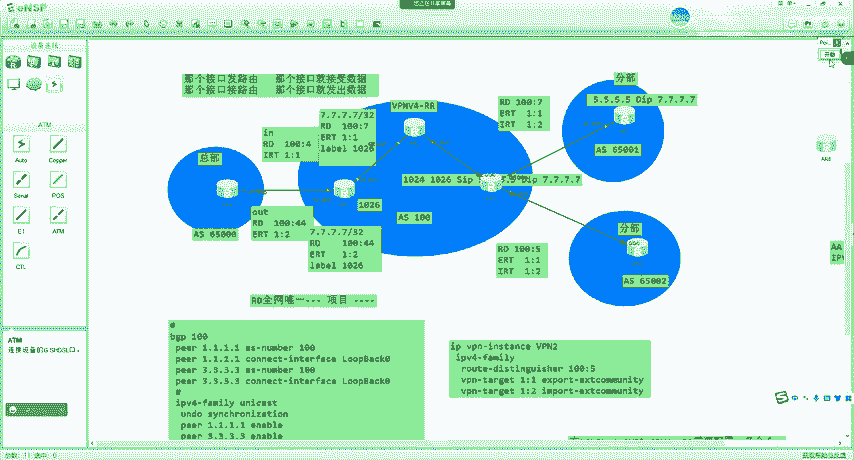

行，同学们，咱们今天就讲这么多啊。😊，呃。我待会儿把这个图啊，我保存一下，好不好？😡，呃，我保存一下之后呢，你们去这个这个啥一下啊，这个这个。把这个拓普去下载一下。有没有？嗯，笔记我就不给大家整理了啊。

就你们课下去做一下这个配置啊。😊，呃，哪里做不出来的话，你再看看我的配置。嗯。🤢，行，同学们，咱们今天就讲这么多啊，准备下课吧。😊，到点了啊。在家中得要钱了啊嗯。好，我们今天就说这么多。😊，好吧。

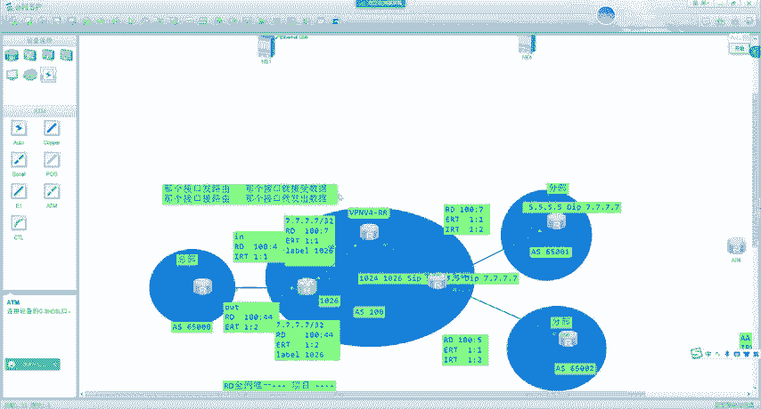

陆平停一下啊，咱们下课吧。😊。