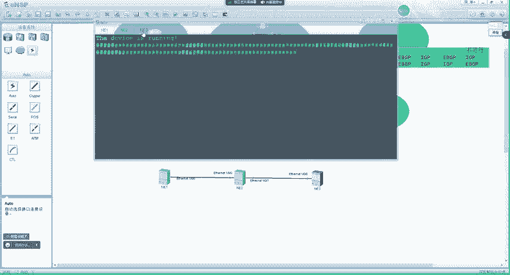
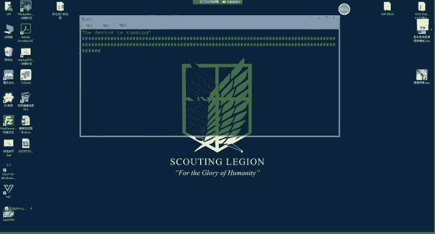
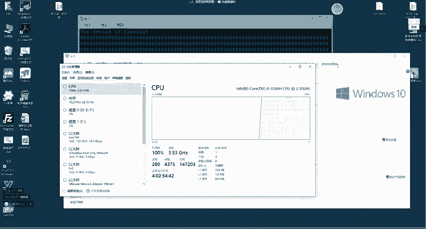
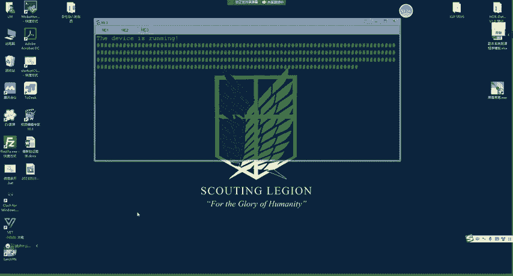
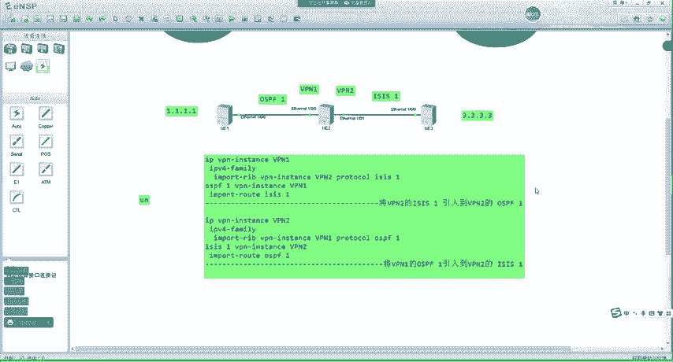
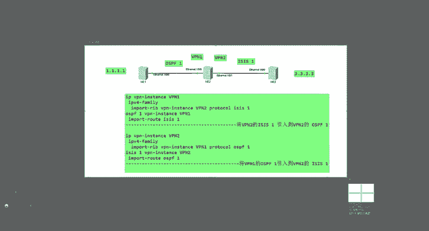
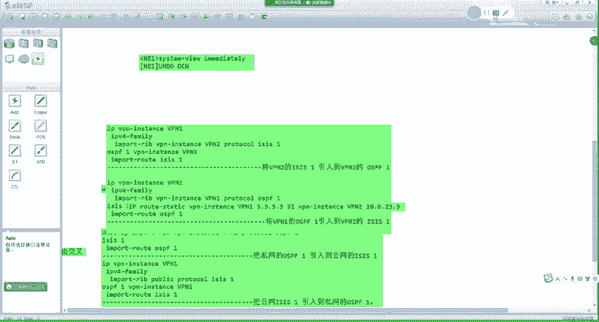

# 2023 新版华为认证HCIA+HCIP+HCIE全套视频讲解！一套视频让你从入门到精通！CCNA／CCNP／CCIE技术提升同样适用！ - P117：（持续更新）HCIE Datacom - 53.MPLS VP,N部署与应用 - -Book思议8 - BV1W8411A7z8

啊。呃，这个上节课我们讲了这个。嗯，MVPN的几术这个组网方式对吧？呃，一种叫内联网啊，还有一种叫外联网啊，还有一种叫呃hbsbook对吧？当然hapersbook咱们通过一个实验呢也给大家说过了啊。

呃，接下来我们要讲的是一种嗯特殊的应用啊，我们把它叫做MCE呃，这个MCE很简单啊，它是这样的。就是我们可以直前去看到啊，就是我们再去组建任何一个。呃，M24的网络时呢。嗯嗯这样啊，我把这个啥关一下。

嗯。等一下，我把我本地这个实验关一下啊。好了，我们开始啊呃，是这样的啊，就是当我们去组建一个这个MSVPN的这个。就是我们上节课所起我们的这个对吧？就是。嗯，比如说在我现在这个环境中啊。

现在46嗯57我们给它连到一起呃，这个图大家应该是比较熟悉的。比如说我们中间呢依然是1个MPSVPN的一个骨干网。然后呢，我们在现在有4个站点对吧，上面两个我们作为一个VP客户啊啊，然后下面两个呢。

我们也作为一个VP客户。这时有一个问题啊。就是在我们之前学习的过程中呢，呃比如说我在CE上有一条路由。对不对呃，CE上有个这个路由呢嗯它传递给PE之后啊。

然后我们的PE会传递给这边的PE最终传递给我们的这个呃对端站点，对吧？但是有时候我们的这个客户呢可能有这种要求，就是他希望自己的业务之间呢是做隔离的对吧？呃，比如说他有这种OA办公类的业务，对吧？

还有一些或者说呢他有这个语音啊视频类的业务，是吧？那我们购买MPS这种专线呢，就希望得到有一个有保障的服务。对不对？那所以说我们才更倾向于去花钱去得到这种服务。对不对？就是你买MP24专线的目的呢。

实际上就是希望运营商呢能够给你提供的服务更好一点。呃，但是在这时候呢，可能我在内部呢有语音呢，有视频的是吧？呃，我希望两种是这个业务呢得到不同的服务是吧？比如说语音我要DN时啊，视频需要高带宽。

对吧也就是说我们不同的这个应用流量呢，他们可能需要得到的服务是不一样的那这个时候有没有一种办法呢？就是在AR5上，我们把不同的业务上对吧？把不同的业务给他隔离开。对不对？那这个实际上也很简单。

这个实际上就是我们所说的这个呃MCE就可以去做的。😊，MCE他是这么一个逻辑啊。😊，呃，就是当我们的一个私网呢需要根据业务或者网络划分VP时，对吧？这个例大家可以理解成对吧？

就是不同VPN用户间的业务完全隔离，也就是说呢我们依然是同一个VP客户呃，但是呢就是客户的不同业务，希望做一个隔离，对吧？那这时候呢，我们如果去单独加一台CE的话，就比较麻烦。

你比如说呢呃我这个PE呢连接这个CE对吧？这个PE连接这个CE啊，这个PE连接这个CE然后我们让不同的CE呢分别去承载。呃，不同的业务对吧？那这样的话，我们不同的业务呢，在不同的路由器上。

那这时候可以实现一个隔离嘛，对吧？然后我们的P通过每1个VPN跟CE进行对接。是吧这时候业务之间肯定是隔离的对吧？首先对于我们的业务来说呢，他们接入到不同的呃CE上是吧？

然后我们的PE呢也不用不同的VPN跟CE进行对接，是吧？视频语音啊对吧？包括你这个上网OA类的业务呢，肯定之间是互相隔离开的呃，但是这种部署呢，我会发现会有一个问题啊，就是呃我这个路由器呢。😊，嗯。

你得买对吧？啊，路由器123，那这时候你就要买三个路由器。那同时呢呃咱们也需要三条啊，这个部署三条这个呃物理链路，对吧？说白了你就要拉三根呃，相当于专线一样。对不对？然后接入到不同的CE上。

那这时候呢会增加设备的开支，还有维护成本，是吧？当你的设备变论的越来越多的时候呢，你的这个呃维护的难度呢啊就变得越来越高是吧？那这时候我们可以通过这种多个CE跟不同的P对接得到一些启示啊。

什么样的启示呢？这一这是2这是三是吧？啊，不同的CE那我们有没有办法呢？就是让一台CE。😊，对吧我们把它虚拟成或者说逻辑上划分成不同的CE呢，呃，实际上是可以的那这个可以是怎么样的呢？

之前我们学过一种技术叫VF。😊，对不对？VF实际上它就是一种啊相当于叫做虚拟路由器的技术。对吧就是把一个路由器呢划分成多个逻辑的路由器，每个路由器呢都有单独的路由表，对吧？路由协议呃。

以及有属于这个VF的接口。对不对？所以说我们可以从这种呃部署方式上呢得到一些启示啊，什么样的启示呢？就是如果每一种业务单接入到单独的CE中，那这时候呢呃业务之间是可以做到隔离的那我们就可以这样去部署。

当然这只是一种部署方式啊呃，就是在PE上呢，用VPNE跟CE的VPE对接到一起。然后后面这里VPNE呢。啊呃，我连接的是语音的业务。对吧然后在这里呢，我们有VPN2，然后在这边呢也有个VPN2。

然后我再用VPN2呢连接视频的业务。是吧然后下面有个VPN3，这边也有个VPN3，我在用VPN3呢。对吧呃，连接这个这个这个这个这个OA的业务。好吧，那这样的话，我们就可以实现一个业务之间的隔离。

对不对？比如说你的流量呢到了呃，MCE到了这个VPN3之后，他只查找VPN3的表，然后到PE上查找VPN3的表。😊，对不对？那这样的话，我们就可以实现一个业务之间的隔离。

如果真正这个流量到达远端站点的时候，比如说我们在这个站点也去建三个VPVP123，我们只需要把123他们不同的RT对应到一起。那这时候就可以实现一个业务的隔离。😊，所以这个意思大家明白了吗？

这本质上注意啊，它本质上跟我们再去建立多个VP客户呃，是差不多的对吧？相在不就相当于VPN是一家公司。VPN2是一家公司，VPN3是一家公司嘛。对吧那跟我们再去隔离不同用户的时候是一样的。

我通过相同的方式呢进行业务上的隔离。那这个就是MCEMCE说的是什么意思呢？就是我们在CE上去用VP实力去对接。那这种应用我们就把它叫做MCE啊叫做CE多实例。😊，好吧，或者说叫多实力啊多实力CD。

对吧我们把它叫MCE。那这也是一种部署方式啊呃这里大家知道一下，好吧。😊，然后我们再来看下面啊呃这里呢大家可能还看不太明白啊。嗯这里实际上就是一句话，就是给大家说一下概念。

就是我们之前学到的这个MPSVPN呢，都是一个呃单域的啊，这个单域是什么意思呢？我们可以去发现之前我所做的所有实验的这个骨干网都是一个AS啊，比如说AE版对吧？

那比如说我骨干网有2个AS这有个AS1这有个AR是吧？那这时候老师他们之间啊怎么样去把MPSVPN打通呢？啊，这是我们以后要学习的技术叫做跨域的MPSVP。😊，好吧，那这个跨域呢嗯现在给大家说。

实际上嗯没什么作用啊，对吧？我直接就是即使给你说有几种跨域方案呢，大家实际上也学不到什么东西，对吧？啊，但然我们后面的技术会详细去讲，所以这里大家知道啊，就是MP4呢也有跨域的一些做网方案。

那这个我们到后面会去说好吧，这里直销商有一个概念就行了，就这种跨域的ABC啊，对吧？啊，怎么样跨的，这是现在给你讲，你也看不懂，好吧，所以说这一块呢先不用管它。😊，嗯，接下来这一块嗯。

我们把这个来说一下啊，这个是不同实力之间的路由呃，相互引入组网。呃，这个是怎么样的呢？我我们来看一下啊。😊，就在我们之前学的VPN啊，就是MPSVPN，我们可以把它叫做BDPMPSIPVPN。😊。

是吧呃，在一个VPN实力呢。😊，仅能与其他啊，我们说RT的路由目标对吧？相匹配的微P实力进行通讯。但是微PN实力无法与公网或者其他微PN不匹配的微P实力用户进行通讯对吧。

用户可以配置不同实力的路由相互引用功能呃，配置呢不同实力的路由相互引用功能分为两种。这里是啥意思呢？我来给大家讲一下啊，呃，之前我们学的这个MPSVPN是怎么样的呢？我们一般会说它有两种这个。嗯。

这个路由的传递啊呃如果换到华为的术语里来说啊呃叫做比如说。远端。或者说叫VPNV4哦，直接叫丝网路由交叉啊。啊，我们一般会把它叫丝网路由交叉。好吧，那这个路由交叉是什么意思呢？我来给大家解释一下。

比如说我们这边不是有1。1嘛，对吧，1。1传递到A21上，A21把VPV4路由传递到A23上。它要看ERT跟本地的哪个ART匹配，然后导入到这个VP实例中。那么这种我们就把它叫做路由交叉。好吧。

如果这个路由呢是从其他的PE传过来的，我们就把它叫做远端路由交叉。😊，那有没有这么一种可能呢？就老师啊，我在这个P上有两个VP实例，这个VP实例呢可能是这样的，这里的呢ERT是一冒号一。😡。

对吧IRT呢是一码号。对不对？然后在我们的下面呢，它的IRTERT我大家可以随便脑补一个好吧IRT呢是1码好一。那这时候6。6的路由传递到A23之后，A23会不会把它传递到这个VPN实力呢？

实际上是会的。好吧，那这二种呢，我们把它叫做PE本地路由交叉。😡，好吧，那这是两种路由交叉的类型，一种是远端的，一种是本地的。那我们来看一下啊，就是无论是远端的还是本地的。

我们都要求有一点是RT互相匹配的。😡，对不对？RD一定是互相匹配的那RD啊，不对啊，RT是互相匹配的。如果你的RT并不匹配，我们这时候是没有办法将其他站点的路由啊，或者说其他微拼实力的路由传递过来的。

😡，对吧那我们来想一下，实际上对于公网来说，他有没有RT啊？😡，没有吧，那public有IT吗？没有。😡，没有接触过这种概念，也没有地方让你去配。😡，对不对？那这种问题我们怎么样去解决呢？是吧，就是。

😡，还是一点对呀。如果。就是VP实力呢无法与公网或者其他IRT不匹配实例中的用户进行通讯。😡，对不对？那怎么样去解决这种问题呢？我们就可以去配置不同实力之间的路由相互引入功能。那这个引入呢。

我们一般分为两种类型啊，一个是公网与私网的。公网说的就是plic public和微P实力。😡，呃，他俩之间路由怎么样相互引入？那还有一个呢是不同的丝网之间怎么样进行引入。那不同的丝网呢。

我们可以去发现啊呃，刚刚我们所说的那种是通过RT对吧？那如果RT不匹配，我们还可以通过其他的配置去解决这种问题。😡，那这也是在MP4中的一种功能啊，当然这里只是一个简介啊，大家注意啊，这只是一个概述。

好吧，就大家现在先知道啊，它有这么一种功能，然后在这个胶片的后面呢呃会有具体的场景。😊，咱们会去介绍的啊。😊，我们来看一下啊。嗯。内联网MPS为频组网。好吧，我们把这个来看一下啊。

实际上呢这就是一个配置案例，对吧？咱们把这个来看一下啊。😊，呃，现在有这么一个场景，就是客户的X跟Y呢各为两个站点。那上面的黄色是客户X呃，下面的。😊，呃，蓝色好吧。呃。

也也有点绿啊啊就蓝色呢我们就说蓝色吧啊，蓝色呢是这个客户Y。对吧现在我们需要通过MPSVPN呢实现站点之间的互联，就是X的用户呢可以互相通讯。Y的用户呢也可以互相通讯啊，分别对应的VF呢。

一个是VPNX，一个是VPNY。😊，啊，这里呢我们用的就是VPNX嘛，下面呢用的就是VPNY。嗯，然后我们现在来看一下啊，这是当前的这个IP地址等等一些规划啊，这一块呢大家也记不住啊。

因为他跟我们平常这个。😊，呃，练习的时候还是稍微有点区别。好吧，我们先把这个图对吧，以及业务需求搞明白，就是现在呢。呃，X之间的站点要进行互相通讯对，然后。Y的站点呢也要进行互相通讯。

那这时候怎么样去做呢？呃，我们就在X这里呢去跑OSPF，你就把它的OSPF赔了。啊呃CE1呢OSPF还是传统的配置啊，就是首先我们在CE1上进行OSPF1对吧？2。0network1。1对吧？

network。😊，192。168。100。0是吧？还有1个1。0，1。0是自己身后的网络，对不对？这是在CEE上的配置。呃，在这里呢，我们已经假设所有的接口已经绑定到VF里面了啊啊所以大家注意啊。

然后我们把这个C一做完之后呢，去配P1P1上呢，这都是我们之前做过的配置啊，写1个OSPFEV拼实力VPX是吧260。然后我们把这个接口之前不是已经绑定了VP实力了吗？😊，对不对啊？

那n work192。168。1。0，实际上就是把这个接口给他通告进OSPF中。是吧。呃，然后呢把BDP给它导入进来。inport BDP的意思呢，就是待会我们这边的路由如果传递到这里之后呢。

能够这样传过来，对吧？所以说抄了一个import BDP。那在我们的PE上呢，也是一样，要把OSPF也引入进来，对吧？BGP123啊，进入到对应的BGP微P实力啊，把OSPF引入进来。

就未来呢这里的OSPF邻居一旦建立之后，1。0的路由。😊，传过来在P1。VPX的路由表里就会有一条OSPF路由1。0。然后我们把这个1。0呢导入到BGP里，对吧？然后它会被转换成VPV4。传递到PR。

啊，是这么一个意思啊，这之前我们都做过实验啊，大家应该能看懂。😊，然后这条路由未来传递过来之后，P2就能学到了。那P2学到之后，如果RT是互相匹配的。对吧RT一旦互相匹配之后呢。

这时候它会在自己的路由表中，就是VPX的路由表呢，它会有一条1。0的路由，对吧？下一跳是1。1。1。1。对不对？但在这里呢，我们跑的是静泰啊，跑的是静泰怎么办呢？就是没有办法把路由传给CER。

所以说呢我们得到这个CR上去写静态。😡，写怎么写呢？就是C2上IP如到ent对吧？你去1。0跟100。0啊，就是互联网端，你去找P2。然后P2正好在这个VPX路由表下呢，有一个下一跳1。1。1的。😊。

对吧路由。对不对？所以说这时候呢，单向的流量就已经打通了。对不对？好吧。那然后我们再进行考虑啊。什么意思呢？再考虑的就是2。0的路由怎么传过去。首先你C12不能给P2发路由。

你P2就没有办法把路由加到BDP里传递给P1。😡，对不对？那这时候呢，我们也是一样在P2上去写静态写静态的时候，这个方式之前也给大家说过，就是IP sentence你写到VP实力X中，对吧？

如果你不加默认写到p那个实例中，对吧？我们把它要公网。😊，那这时候呢，你把它写到VPX中，就是2。0啊。下一跳是192。168。200。1。是的。那这时候呢，在P2X表中呢，就有一条静态路由去往2。

0的这跟你跑动态CE2之间给你传过来，实际上作用是一样的。对吧然后我们在BDP里面呢再去引入静态，那它就会变成微平V4传递给P1呃，P1再通过OSPF传递给CE1。是吧。那这就是一个。呃。

PECC之间啊，我们用OSPF和静态的一个配置方式。那BDP嗯之前给大家讲过了。那BGP怎么样去配呢？首先在CE这边依然是普通的BGP配置。😊，对吧在PE这里呢，我们需要进入到VP实例下去指定。对不对？

然后。啊，然后就没了啊，SS跟OSPF1样，这个大家明白吗？😊，有同学做过吗？之前给大家演示过吧，我给大家看一下啊。😊，做过是吧。对，跟OSPF差不多啊，基本一样。😊，我举个例子啊。

比如说我们在这里呢用的是SS啊，朱意亚G0-0-1。呃，如果你要PCE之间跑SS，你咋配呢？嗯。我们不给设备开一下啊。好啦。起来了之后呢，你就IPVPN啊VPN的名字嗯RD呢。

你随便敲一个什么一冒号一呀，是吧？RT呃，我们也用E冒号一呃，interfaceG0-0-1。😊，给他绑定到VPE种，给他配一下IP10。0。14。1。对吧然后我们IS。VPNin注意啊。

这时候VPN一你默认的话，它是给public的是吧？我就起一个VPN一嘛。但这里啊大家注意啊，你看到他默认的建程是一，对不对？如果你这个建程一已经被其他的VP实力使用了，你也需要指定建程号啊。

SS2VP实例VP1。是吧然后你再去呗，给他喷net地址，49。0000。0000。0000。0001。啊，点0001。00。啊，然后interfaceG0-0-1。ISS以内部哦，完事了。好吧。

这样就行了啊。😊，然后这里呢，P的ISS我们配完了，然后CE4上再进行普通的ISS配置，他俩之间就可以建立邻居了。然后你要传路由的话，就是在。😊，I32。对吧因为SSR，我们已经在这个VP室立项了啊。

inportBDP对吧？😊，啊，因因为我们现在没有BDP进场啊，比如说BDP123。2莎莎嗯音炮的BDP。BDP123。呃，入台地1。1。1。1。IPV4family VPNin VPNE。233。

Inpart BTP。是不是敏感大小写啊？啊，这个大小写比较敏感啊，你看我用大写还不行。😊，是吧这个得用小写啊，你把BDP引入进来不就行了吗？😊，呃，那这样未来这边传递过来的路由到BGP中。

它直接被导入到ISS了。然后在BDP里面也一样。我也偏音音诗单意思。V屏一对吧，音炮的SS加个进程2啊，这样就可以了。好吧，跟OSPF是类似的啊。😊。

嗯，所以这也是一种方式啊，这里我们跑的BDP这里是ISS。好吧呃，还有一个呢是特殊场景下的A号替换啊，这个A号替换呢，我们在讲这个的时候是吧？给大家说过一种，那还有一种呢是特殊场景下的A号替换啊。啊。

当然这个场景用的不多啊，简单给大家说一下啊，就是现在我们有可能是这样的，就是老师啊呃我两个站点呢用的都是BGPA号一样了。😊，对不对？那这个场景有可能出现在哪里呢？比如说呢我收购了一家公司。对吧啊。

这家公司呢之间他也有自己的M2VP网络。😊，但他们的AS已经用好了。老板的意思是什么呢？老板的意思是呃，尽快先把业务打通。对吧呃，以后这个网络整改这一块呢嗯放到以后再做。对先把业务打通。

先把现有的业务维持上。啊，这可能是你老板的意思。但是你发现呢两个AS号一样。对不对？那这时候我们怎么办呢？嗯，大家注意啊，呃实际上就是一条很简单的命令啊，就是未来C1的路由传递给P12了。

然后传递给P1这个过程大家应该都比较清晰。😊，是吧这样怎么传呢？那P1在给C一发路由的时候呢。发不过去。或者说能发过去，但是C一不收嘛。😡，那之前我们讲过一条命令，大家告诉我是什么命令。😡。

这样我们讲过一条命令可以解决啊。😊，大家还记得吗？对，没错。我们可以在C一上呢，针对于PE去做配置，允许重复AS的接收啊，这样行不行呢？可以，没有问题啊，没有任何问题。😊，好吧。就是在CE上。

如果去配允许重复AS接收，是没有任何问题的，可以去配。那这时候呢，业务也能打通。那还有一种方式呢，我们可以做一个AS的替换啊，这个AS替换呢注意啊，如果在我们现在这个环境中。😊。

如果做那个重复AS的接收，我们是在路由的接收方。啊，去进行配置的。对吧这样讲h的时候，你通过硬表传递给CECE表通过out德表发给你。那PE上它就是接收方啊，对吧？

所以说我们在PE的out表去做重复AS的接收。😊，是吧。所以说之前所讲的那个面令呢，他是在路由的接收方去做的。那有没有办法在发送方去做呢？也有。就是我们在P一上呢，针对于C1这个邻居192。1至8。

100。1呃，做1个AS的替换。这个AS4的替换它有什么样的功能呢？我来给大家举个例子。😡，比如说这边有个1。0的路由，它传递到P1上AS应该是1个123啊，1个65001。对不对？

然后当他想把路由发送给C一的时候，我们在指邻居的时候，指邻居的AS号啊，他一看这个邻居的AS号跟我这个路由的AS号一样。😡，对吧那这时候呢，他会把这个一样的A就路由里面啊一样的AS换成自己的123啊。

就会把这个65001呢换成123。说白了，他在给我们的C一发路由的时候，这个路由的A pass呢就2个123。那这时候就逃过C1的A pass检测了。那这就是A替换的一个功能啊。然后还有一个特殊场景呢。

是SO值。呃，这个SO值呢一般是我们用于去避免路由环路的。呃，注意啊，他是什么情况的呀？叫如果使能了，就是。😡，你开启了AS号替换之后。对吧。才有可能会去用到SO。注意啊。就是你A pass你不返还嘛。

现在你把AS pass，你手动给他改了，你让它不一样了，那可不就有可能会还路吗，对吧？就是你改了AS有可能会引起还路。所以我们需要SO呢来防止或者说避免还路。😡，注意啊，它的场景是非常受限的啊。

SO是用在如果开启了S的替换，对吧？呃，才有可能用SO来防止环路。那什么时候会产生环路呢？我们看了下面这个场景。😡，现在是这样的，这不是6001吗，这也6001。我们在这里注意啊，这个1。

0在这里做了1个AS替换，我把路由发送给C一。😊，那他的A是多少？是多少？他告诉我是多少。2个123。没错，2123。那C3就接收了。是吧这远端的路由老师传过来好像没什么问题啊，对吧？

他传递给C1C1再传递给P123直接返还掉了。😡，对吧是没什么问题。但是我们来考虑一下，这样这有1个1。1。因为我们为了让这个65001这个1。1。😡，传过来。你做了AS号替换。那现在呢？

你这个一点1呢传到这里也做了A的替换。那假设CE一上有1个1。0的路由。1。0路由传递给P1之后，A有个65001。对吧。那P1要传递给CE3，他一看AS1样，我们在这里有没有做ASTY？有没有有。

做的目的是让C12给他传过来。但是C1的路由。这样又过来了。你把这个65001替换掉，这1。0有没有又传到CE3上？😡，有没有？有吧，就始发于这个A的路由呢，你绕了一圈又回去了。😡。

那这时候就有可能会导致还路嘛。对吧。那有人就问了。😡，哎，老师。那我说还不是和，他咋没这种场景啊？😡，肯定有同学有这种问题是吧，我来给大家解释一下。😡，has work我们在做的时候，为什么没有还路啊？

😡，首先我们来看这里的特点。这个1。0传出去再回来。这也是1。0，他是什么路由？IPV4路由。对吧。看着一眼一样。有什么不一样的，都是IPU4路由。是吧。那我们之前做habswork的时候。

为什么没有呢？给大家看一下。😡，h们 smoke是这样的。😡，你把路由传过来，又回到这个AS了，阿D变了没？本身在这个AS内的VPV4路由RD可能是一冒号一。你这样之前有没有给大家说过。

这个outt表的RD一定不能一样。😡，说过吧。😡，你的RD变了，有可能会还路吗？没有这种可能。😡，对吧你RD变了都不是同一条路由了，你这可能是一冒号100了是吧？

那有人问老师他们都在这个AS内会不会有问题呢？有什么问题呢？你之前学的这种MPSSVPN，这有个1。0，这有个1。0，他们的RD一样传到这个区域内有没有问题啊？😡，这里的ID一吗号一这里一吗号2。😡。

传到这个区域内A内。是不是也不会有问题啊？😡，对吧之间hpers spoke为什么没有这个问题呢？是因为hpersbook的RD不一样，它就不是相同的路由。😡，而在我们现在这个环境中。😡，他比较特殊啊。

你1。0绕了一圈，你回来还是IPV4路由啊。😡，是吧你没有任何ID。😡，那可不就还路了吗？对吧，有可能会产生还路的风险。那这个问题我们该怎么解决呢？啊，就需要SO值。😡，这个SO值是什么样啊？嗯。

我来给大家举个例子，比如说你买了一个。😡，嗯，给你女朋友买了一个口红是吧？呃，口红一般都是国外的吧。😡，对吧。呃，买了一个外国的口红。嗯，你回来一看呢，上面写着中国制造。对不对？或者说呢。嗯。

或者说你买了一个这个。国外的一个。呃，衣服。是吧。当然有可能还是其他的啊，就这样的，你在国外呢买了一个东西啊。😡，啊，对，就相当于这种。是吧你在国外买了一个东西呢，上面写着中国制造。😡，你肯定不要吧。

😡，对不对？为什么呢？嗯，因为你买的就是外国货，你一看中国制造。😡，对吧也比如说你买国外的这个钢化玻璃。对不对？你买过来之后呢，贴着标签写着中国制造。😊，你要不要啊，你不要是吧，一样道理也是一样的。😡。

呃，环路大家要注意啊，所有环路的解决方案啊基本是一样的。我们来想一下之前讲的双点双向，他不就是从。😡，比如说这是ISS。这是OSPF不就是从ISS出去的路由带个标记X。然后从这里回来，X都不要嘛。是吧。

啊，这就相当于你花了一个假钱一样。对吧你把一个假钱花出去了，你上面做了一标记。那未来你一看到收到一个假钱，上面有你那个标记。😡，你要不要？你是不是也不要？对不对？那现在也是一样的。

在我们的这个场景下进行放还，原则也是一样的，只不过就是把这个名字叫做SO值了，叫做站点起源属性。😊，啥意思呢？我在这里。注意啊在P上。针对这个邻居呢，你这不有1。0要传过来吗？我给你打个标记。

打个SO值为200冒号一，我给你打个。200马号一。对不对？那你打了1个200冒号一之后呢。这边呢我也打1个200冒号一。因为你反过来再传也一你这边的1。0或者说2。0反过来传也一样的道理吗？😡，对吧。

那我们打完这个标记之后，大家注意啊，现在是这样的SO值它有一个特点。😡，就是我从这个邻居注意啊，SO是针对于邻居去配的。我从这个邻居收到路由呢，我会给他打1个SO200码。

当我把路由发送给某个邻居的时候，我会去看一下。比如说我想发送给这个。200点1这个邻居。对吧那这时候我会看一下这个邻居的SO值200万号1。如果我路由也有这个200冒号1的ISO，我发现一样。啊。

那么这时候就代表着呢这个路由本身就是从这个站点来的。对吧这时候我们的PE呢就不会传递过来了。😡，能不能明白？啊，就这么简单。好吧，就是一个标题。😡，就是我从这个站点收到路由，打上1个200。1。

对吧然后这个邻居呢也给他打1个20。1。当我发现我路由的SO值跟我这个邻居一样，我就不传了，那不传还会有还路吗？😡，会不会？是不是就没有了？所以这个大家明白了吗？明白的同学敲一啊。😡，没问题吧。

那刚刚有同学还问。对吧哎老师一台CE怎么没有这样的问题呢？😡，对不对？一台CE大家觉得有没有？这有没有？比如说啊我举个例子。😡，首先一定要知道，如果你没做AS号替换。需不需要SO值？需不需要？不需要。

对吧他有前提啊。首先第一个你做了A的替换对吧？啊，这时候需要。那1个CE有没有这种风险呢？也有1个CE我举个例子，比如说我这就1个CE。😡，我我这样啊。这就是一个CE。😡，但是我见了两个邻居啊，1。

0的路由传过来之后。有没有可能这样通过这个邻居再传给他，有没有可能？😡，有没有？😡，有吧。而且你还做了AS的替换。😡，那这时候要不要打呢？也要打。😡，周要啊也要打。能懂我的意思吗？一台设备也需要去打。

😡，好吧。为什么也需要去打呢？我们来看一下，在这个两个CE的时候，这不就是我们是以AS作为视角。你从这个A出去又从又回到这个AS，你一台CE建两个邻居，你不也是从这个AS出去。😡，又回到这个AS了吗。

一不一样的道理啊。😡，一样道理吧，大家能明白吧？好吧，BDP我们要以AS作为视角啊，这里是非常重要的。😊，好吧。有一台设备你也要去做，因为这种回馈呢啊都是存在的。😡，好吧。一个邻居。一个邻居。

你先琢磨琢磨。啊，你琢磨琢磨要不要枪？😡，其他同学也琢不琢嘛啊，一个人去要配吗？😡，比如说就一根线啊。😡，要不要拍啊？这里派了吗？😡，这是不是一个邻居啊？😡，是他传给你，你再传给他，这不乱套了。

没有这样的啊。😡，能懂吗？对吧我们BDP里面就有这一个原则，就是我从邻居收到的路由，我不会再回传给他了。😡，好吧。然后这个ISS的配置啊，大家可以去看一下，刚也给大家去敲了一下演示啊。呃。

这里第二句话向该邻居通告BDP路由的时候，这个邻居指的是设备呃，指的是你的。BDP下面的配置。能不能明白？好吧。指的是你下面的配置啊。啊，对，没错，你配的这个才是一个邻居。能懂吗？不是设备啊。😡。

对吧比如说我在这里。一台设备，因为这就一个入台地1。1吧。那大家告诉我这是不是两个邻居啊。😡，也是啊，这是两个邻居，能明白这个意思吗？对吧只不过这是一台BDP设备。好吧。那跟OSPF不一样的道理吗？😡。

两条链路能不能建两邻居，那么，但是你的入台地是标识你唯一的设备。😡，唯一的OSPF路由器。但是我跟这个路由器呢建立两个邻居。能不能明白？好吧，他这么一种意思啊。谁以托归属。呃，就是你。

但一般不是这么说啊，一般是你一个CE，当2个CE也是一样啊。😡，就是你站点内的CE呢，通过两根链路连接到P，我们就把它叫多归属。比如说我一个CE两个链路连接到不同的CE，连接到不同的P1P2。

这种大家可以认为就叫做CE多归属。我一个CE呢。连接到同一个P以上。啊，这种也叫做多归属，两个PE呢连接到一个PE上啊，这种也叫做多归属，反正你就是两根线连到PE上。😡，是这么个意思啊。呃。

然后下面这个P1E之间用ISS好，大家可以去看一下配置啊，这个跟咱们刚刚做的一样啊。😊，就首先在C14上呢啊都是相同的配置，对吧？就普通的配置啊。然后在PE上呢，就是我们刚演示的啊。

在ISS启用的时候给他指定唯平实力啊，地址对吧？级别你可以去指定一下。😊，呃，然后引入BDP引入到GBR啊，默认就是引入到GBR。然后在G0-0-2接口下。请问SS。是吧呃，然后在BDPVP实力下啊。

引入ISS啊，刚刚给大家演示过这个配置啊。呃，然后haper spoke上节课给大家做了一个实验。嗯，这里呢我们再把它细化一下啊。😊，是这样的嗯，habs work组网方案呢是这样的。

因为我们上节课接触到了habs work呢PE跟CE。😊，啊，就是hub端跟spo端呢啊，我们在这里呢可以用什么BGP啊，对吧？嗯，可以用BGP跟IGP。😊，对不对？什么静态啊也算ATP啊嗯。😊。

但是呢，并不是所有的都使用。注意啊，并不是所有的都使用。这个是在哪里呢？我们来看一下呃，就是haperswork呢有以下主管方案。😊，方式一呢是哈b C到哈P。啊，咱们可以用EBDP。

咱们上节课用的就是EBP。😊，对不对？呃，哈bP哈 C的哈P。与s屁还有smooke屁。啊，什么事。对吧还有一种方案呢，就是。大家都用ITP。那么都用IDP。那还有一种呢就是hable C注意啊。

hable P之间使用EBP。然后small PE呢与small CE之间用IDP。这样也可以。那这里大家注意啊，我们如果把角色加以区分的话，就是在哈perpo组网中。就只有两种角色，一个叫做 hub。

一个叫做斯博卡。对吧。那对于哈伯这端呢。嗯，我们可以刚去看的，可以用EBP加上spoke的。好这样啊。加上spo的这个。EBDP进行组网。还有一种呢是在hab这端的呢。ITP加上spo的。埃及皮星座。

还有一种呢，在hub这里呢可以用EBDP。在spo这里呢，用ITP进行做。那有同学就会产生问题。老师能不能这样呢？hab这边用IGPspo这边用E比DP。是吧为什么没有这种呢？是吧10万个为什么？

对不对？因为我们可以去发现啊，他就前面三种书网啊。把E都用EBP都用IDPP或者哈宝用EBP什么都可以用IBDP。对吧我来看这个课件不就这样吗？都用EBP吧。啊，都用IDP吧。啊。

hab用EBDPswa用IDP。但是为什么没有这边用IP后面用。BDP呢。是吧。那这里来给大家解释一下啊。呃，为什么没有这种方案？嗯，这个很简单啊，我们来注意一下。比如说这有个1。0的路由。

你未来传递到哈佛P上。注意。如果。我们把他引入到了。埃及批种。来告诉我AS号还有吗？A号还有吗？没有。对吧没有S号注意啊，我举个例子，比如说他是R。那这边给他传递过来有没有S号？也没有1210号。

那哈P通过out表发给R了，有没有AS号ABDP邻居之间不带AS号。而你原始的1。1本来在R上有没有一个AS号，有1个AS多少？我们这边用的BDP啊。用A123。一个不带AS一个带AS我选哪一个？

BGP的选录忘了，选哪一个选不带的。选不带的，大家告诉我带的还有没有？这是不是相当于5分钟之后的，你把5分钟前的你干死了？能懂我的意思吗？那导致的问题是什么呢？老师导致的问题就路由正荡。怎么样震荡呢？

我给大家说一下，本身我优选这个123，我给他传过来，他绕了一圈，123不优选，那还会不会给PE呢？😡，不会了。不会给P批就要撤销IDP。😡，撤销IGP之后，这个U。😡，这个不带AS号的也被撤掉了。

那不在AS4号的被撤掉之后，待会123又被优选了。123优选又过来了，又把123干掉了。😡，把这个123干掉，又撤销了，又撤销又优选。😡，又远之后又撤销。对吧撤销之后又有选。那直接导致的一个问题呢。

就是路由会发生震荡。怎么样震当呢？就是一直这样的啊，传过来。啊，传过来把123干掉，123干掉，你这个不带AS的就被撤销了。😊，对吧待会撤销之后，123又有选又传过来，传过来，你又把123干掉，对吧？

然后你这条又被撤销了。😊，那导致的问题呢就是这一段呢路由会一直产生震荡。所以说呢没有这种方案啊，大家注意。这种方案是没有的。哎。不可行的吧。好吧。这就相当于你。啊嗯。相当于什么时候呢？嗯。

就是未来的你穿越了过来，对吧，这不就是未来的你把这穿越过来吗？正因为有了123才有了未来的这个路由。😡，呃，你翻越过来把。呃，以前的你干掉了，你把这个你干掉了之后。那肯定就没有了吗？呃。

就相当于你现在回去啊，你把十年前你还是小孩的，你把他杀了。😡，是吧你把你是把你的这个儿童时代干掉了。😊，那还有没有现在的你啊？是不是就没有了？对吧所以说没有方案4啊。好吧。

就是没有办法哈ble CE hubbleP之间用IDP。spo之间用一笔批赖的方式来部署habs索啊，这种方式是不行的。好吧。然后具体的配置呢，这里我们上节课也给大家去说过了。

就是我们需要呢在hab这边呢去提两个表啊，一个印表啊，一个out表。分别用于接收和发送路由。啊，然后这个路由的发布过程上节课也都给大家说过了啊嗯具体配置大家可以去看课件。😊，嗯。

这里我就不带大家一一去过了啊，因为我们可以去看到啊这些配置咱们都做过。😊，好吧，只不过他们这个用的是IDP。😊，呃，接下来我们来讲这一块。对，为什么没有方出4？这刚才也给大家说过了。

就AS pass丢失了。对吧A8丢失。你比如说你要有R的话，他肯定。优选这一条，那你之前这一条就被干掉了。这一条一旦被干掉，你就没有这一条。对不对？那这一条一撤销，这条又出来了，这条出来呢。

你待会这一条又出来了。😊，对这一条又把这一条干掉了。干掉了之后呢，你这一条又该没有了，然后这一条又出来了，然后这一条出来又干掉了。是吧，然后这一条待会又出来了，又干掉了就是这样的啊。😊，嗯。

我们来看一下这一块，这一块呢叫部署公网跟私网互通。那这个就是对应着我们刚刚所讲的概述里面的一个啊。呃，就这一块啊，不同实力之间的路由怎么样进行相互引入。嗯，这个之前课下也老有同学在问我啊，就是。呃。

比如说老师我企业内做了两个VP实力啊，对吧？我没有部署MPVPN。啊嗯，这个路由怎么引入呢，怎么样互通呢？有时候我们做一些网络隔离啊，对吧？等等之类的。呃，那接下来我们就把这一块来给大家说一下啊。

就是公王与私网怎么样进行互通。嗯，首先大家知道啊，就是我们不同VPN实例时间的路由引入呢分为两种场景。这刚刚也给大家说了，一个是公网与私网互动。啊呃还有一个呢是。这个死亡与死亡互同。对不对？

那我们来看一下啊，这个实际上就是面令啊。你好。比如说在这里呢，我们有个VPNA啊，在这边有一个公网的VPN实例是吧，场景大家不用去管。这里只需要知道具体的功能。好吧。那这时候我们有这样的。

就是希望在PE上将丝网的路由引入到。本地的公网路音表，这并不是注意啊，这个公网说的不是。是吧老师这私网是对接客户的，公网是运营商自己的。我把客户的运路由引入到运营商内部。有没有这样的场景呢？

对吧大家一定要注意啊，这里说的公网不是说是运营商的网络。😡，是因为在我们的路由器上，这一段叫什么啊？叫public翻译过来叫公网，能懂吗？就是微line一跟其他微line。😡，对吧怎么样互相引入的意思？

大家能明白我的意思吗？明白乔伊啊。没问题吧。对，就是路由表public怎么样跟其他的VPN实力引入。😡，不是说老师我要把客户的路由引入到我运营商的公网。😡，开玩笑呢，没有这种啊。😡，嗯。来看啊。

那这个是怎么样做的呢？我们在PE上呢将丝网路由引入到公网本地的路由表中。😊，对吧。然后将公网的公网路由表呢引入到其他协议，而使得P设备能够获取到。然后这是具体的配置面令。配置丝网中的静态或者IGB路由。

对吧。引制公网对应的路由协议路由类啊对应路由类型的路由表中是吧？有同学懵逼了，老师看不懂。是吧呃，我给大家做个实验，你就能够看明白了。那这个实验大家注意啊啊，你要通过模拟器里面的NE设备去做。这个啊。

呃，如果有同学没有这个NE的镜像，你去找班主任要一下啊，就你们在报班的时候都会有1个VIP大礼包。好吧，你给班主任说一下啊，班主任就会给你了。呃。那这个设备啊，对，没错啊，但是这个设备比较吃内存啊。嗯。

我的电脑是20个G。好吧，就我有一条16G的内存呢。嗯，有一个这个4G的内存。好吧。嗯。但是呢我一般开这个三四台设备的时候都比较卡了，所以说这个比较吃设备资源啊。嗯，大家知道一下。就你拉入来之后呢。

右击一下启动就完事了。呃。现在开的比较慢啊。这个设备比较吃资源啊。对你看我刚开CPU就100了。对吧啊，CPU就吃满了，大家可以看到是ESPbos。呃。还，比较慢一点啊。啊，什么CPU是吧？嗯。

我CPU是1个I5，I，我记得是个I5啊，好像是8代I5，我这电脑比较老了。

啊，是1个I5啊。非常卡了。他就开的时候非常卡，开起来稍微就好一点。好吧。呃，这个核心数呢是。啊，是有8个，这是有8个吧。啊，逻辑处理器吗？啊，还是4个啊。4个是吧。嗯。🤢。

但比较卡一点啊。

啊，这里如果大家电脑不行的话，你们就看看这个实验，好吧。行不行？就是如果你们自己电脑不行的话，你就看看我做的实验。呃，你看现在还没起来呢，呃，这个比较慢啊。😊，也有可能起不来了。😊，因为我也遇到过啊。

有时候就起不来了。😊，呃，这样吧，咱们休息会儿吧。😊，好吧，同学们。😊，现咱们休息会儿，休息10分钟，十分钟之后呢，我们来看一下有没有起来。😊，好吧。我把录屏停一下啊。呃，就回答一下这个。啊。

buff是吧？呃，后面的不太认识啊。嗯，回答一下这个同学的问题啊。😊，呃，就是我们的PE啊PE向CE通告路由呢是不带SO的。比如说我接收这边的1。0。对吧呃，或者是这样啊，我举个例子。

首先呢这边比如说我们配置了SO值。在这边啊。但一个站点我一般我们不会配，然后就是做个假设。呃，这个SO值呢会传递给这边的P1是会传递过来的。呃，但是呢我们的PE呢，他把路由传递给CE1的时候。

就是一条IPV4路由。嗯，这个路由呢是不带SO值的。好吧，那首先呢就是VPV4在传递路由的时候呢，会携带SO值对吧？PE向CE通告的时候呢，就是一条普通的IPV4路由啊，是不带的。好吧。嗯，行。

我们来看一下啊，就是这个公网跟私网互通。嗯，这个设备应该开了啊开了。对吧。嗯，然后我们来看一下啊，就把这个实验来做一下呃，比如说我现在有开了三台。呃，这个NE大家在启用的时候，嗯。

比如说你直接swin呢啊进来之后有个拨浪号。呃，这时候这个配置模式呢，就你可能做了很多配置啊。嗯，他不会自动给你执行啊，你最后得去交一个comman。啊啊，对，就跟CE一样。是吧呃。

但是呢我们一般有个习惯，就是后面加个单词，让他就敲个立即执行啊，这个应该大家都清楚啊，就你们用过CE应该都知道。那有如果有同学没接触过这种设备呢，可能不太熟悉啊。嗯，然后我们进来之后呢。对吧呃。

把设备的名字改一下，这是N12。这边呢是NE3啊，三台设备。然后我们再注意啊，这个NE你得补全啊，你要不补全呢，他还不能让你敲快捷键，1-0-0。我们配个啊。啊，对，还有一个啊叫做暗度第三。啊。

把这个也执行一下啊。嗯，这个是怎么样的？之前有同学问啊，就是DC网络呢，大家可以认为是呃运营商自己内部为了更好的去管理设备搭建的一个管理网络。嗯，在模拟器里面，这个NE呢默认是开启了DCN的功能啊。

就开启之后呢，设备会产生很多默认的配置。嗯，但是在我们的环境中啊就是没有这种。所以说进来之后呢，你要不想看到呢，你就把它安度地森。嗯，我把这种功能给它关了就行了。啊，就关了之后呢，你再去看的话。

就是空配了好吧。然后三也是一样嗯，也给他关闭掉。呃，关闭掉之后呢，我们在1-0-0接口。看你的补全。啊，1-0-0。然后10。0。12。1。然后在二的。这个1-0-0。这是10。0。12。2。好。

然后是一个net1-0-1。这是10。0。23。2。然后三这边呢，是这个10点。0。23。3。嗯，那这时候呢，我们在这个。NE2上好吧，我们起两个先做一个这个公网跟私网的路由相互引入。

嗯我们作为VP实弟叫VP1。然后RD呢去配一下啊，就为什么要配这个RD呢？因为你不配这个VP实力是没有办法进行工作的。所以说这个ID呢我们都要去配一下啊，然后进入到。IT就不用了啊。

因为我们现在不涉及MPSV屏，就配个IT，让这个VP实力up起来就行。然后给他绑定到微P是第一种，然后重新配一下12。2这个IP。对吧做完之后呢，我们待会儿呢这样啊，我们在这边。跑哥这个ISS。哦。

这边呢跑个OSPF。好吧，我们先在N一上呢起一个楼百0。IPOS1。1。嗯，起了1。1之后呢，我们现在是。interface low啊，不对OSPFE如台D1。1。艾瑞玲。嗯，然后我们network0。

0。0。0啊，把所有网段呢给它通告出去。然后在N12上呢，OSPF1。入台D我就不配了啊，我们把微P是历史定一下。嗯，是VPE是吧0network10。0。12。20。0。0。0。啊。

然后我们起个ISS默认就在公网中，然后net呢是49。0000。0000。0001。00。呃，咱们就用GBR14 live live2。嗯，然后在。interface啊就Enet1-0-1。

我们本给他启用ISS。然后在三这边呢，SS。net呢49。0000。00。点0003。00。嗯，然后我们也修改成GBR的路由器。呃，修改完之后呢，interface。就是1-0-0SSE内部。

然后楼外零接口，我们给他配一个啊，叫3。3。3。3。啊，SSE做完之后呢，我们来N12上看一下OSPF邻居。呃，diplayOSPFP brave。我们发现邻居没有起来啊，没有起来。

我们到A一上来看一下。现10。0。12。2。看直连能不能通啊。呃，通不了通不了，我们看一下是不是哪里做错了。This I interface brief。是1-0-012。1。

然后在二这边di四IP interfaceface。呃，1-0-012。2。是吧。然后再一上去骗10。0。12。2。嗯，听不通，我们来看一下是不是哪里有问题啊。1-0-0。已经绑定到了VP1啊。

然后10。0。12。2也没配错啊。啊，我们在NE上呢diplayRP来瞅一下啊。呃，第四类。ARP。哦。好吧。呃，12。2的这个。ARP没获取到。嗯。这种问题啊给大家说一下啊。呃，这种问题属于bug。

啊，大家如果做实验的时候遇到啊啊怎么样去解决？嗯，把所有设备的配置给他保存好。对呀。保存好之后呢，我们把设备重启一下啊。啊，就全部得关啊啊，得重开。当然有时候你可能得重开几次啊。呃，有时候你开一次呢。

可能还是有这种情况。嗯。比如说我待会重开一次，有可能就起来了，有可能就起不来啊。啊，那这个看缘分啊，就这个NE设备呢，它跟CE差不多。嗯，有很多的bug好吧。嗯，咱们等一会儿吧。那等一会的这个时间呢。

我们把课件二剩下的内容好吧，我们把这个判断案例给大家说一下，就公网跟私网怎么样互通呢。啊，我们来看啊。呃，就是我们将丝网呢引入到公网之后啊。那比如说这边有1。1啊，这边有个2。2，我们还得把这个2。

2引入到丝网中。对吧。也就是说得需要就是公网的这些路由呢嗯也需要引入到私网的路由表中。啊，就是将过网的直连啊，对吧？呃，Vlink直连路由。啊，但是这个我也没接触过啊大也不用去管他。

然后静态路由呢或者IGP路由呢引入到丝网中对应的路由表中啊，也需要这样把它引入进来。就两边执行互相引入之后呢，才同。那这个具体怎么样去做呢？我们来看一下配置啊。就首先呢这个私网是怎么样进入公网的？

就是我们得IP叫做inport IB。朱要。VPNins VPN A particle直连。好吧。就是在公网中呢。对呀，我们现在是在公网，就是这个微P实例下直接配的。就在公网里面。卡住来。不行。好。

我们来看啊。😊，就在公网里面呢，我们是这样的音炮。IBV平行实力A。对吧就是把微P行实力A里面的直连呢啊不对啊，把微P行实力A里面的路由呢引入到公网的这个直连中。对呀，引用到质量里面。呃。

引入过来之后呢，我们还要通过OSPF邻居啊传递给P设备。啊，所以说在OSPF下呢，再把官网的直连给他引入进来。那首它的步骤是这样的啊，就首先你得引入到P1的公网路为表啊，引入到公网路为表之后呢。

我们再把它公网路为表中以直连的方式加载进来啊，然后再把这个公网路为表的直联呢引入到OSPF，然后通过OSPF就把12。0传过来了。传过来之后呢，在公网录由表中引入丝网。啊，这个是这样的啊。

将公网路由引入私网啊，就是我们这边这个23。0呢。对或者说这边有个3。3啊，他还得传递到VPNA上。那这时候怎么样让他传呢？就是我们得在这个VPNA这个VPN实例下IPV4 familyly。啊。

就是音炮的IB public。就把公网路由表中的OSPF进程一。引入到VP式列A中。嗯，就这样吧。好吧啊，然后就能通了。然后在这里呢，我们这个。看一下有没有起来啊。N怡起来了。嗯，然后二跟三也都启动了。

我们先看一下diplayOSPFP2。现在邻居就起来了，对吧？所以说大家注意啊，就是有时候可能会有这个bug啊。嗯，displayISP。嗯，SS邻居也起来了。对吧。那这时候呢，我们在NE一上。

那diplayIP roing table。VPNin。V片一。呃，我们可以去看到呢在N1上通过OSPF学到了1。1。对不对？呃，然后第次IP入table呢去看公网路为表，通过ISS呢学到了3。3。

那这时候我们首先做第一步就是。把这个。ISS的这个1。1引入到公网的OSCPF中。是吧这个是这么来做啊。😊，呃，叫做音炮的IB。啊，就IP。音炮的IB啊，VPinVPE。

然后part就是你要引入到哪一个协议中。比如说我们在这里跑的是OSPF呢，呃我就去加个OSPF。嗯，一刚我用的应该是一啊啊，当然后面你也可以去做一些过滤啊，好吧。然后回车。那引入进来之后呢。

嗯我们来看一下NE3上就displayIP table。di displayplayIP入table。嗯，没有。Display I table。啊，在这儿啊，现在在这个。N2上。OSPF路由。1。

1过来了。哦哦，咱们是这样是吧？啊，那也敲错了啊。是吧那还敲错了啊。我看啊。那还敲错了，我把这个命令删掉一下。安度。IP音炮的IB啊VPN VPNE。呃，pical刚刚我们敲的是OSPF是吧？

OSPF1。我来看啊，就我们要把OSPF引入到公网的ISS里面啊。就是IP音炮的IB。呃，VP VPE particle。呃，ISS1。好吧。那这样的话就是把这个。私网的路由呃引入到公网的ISS中。

延入进来之后呢，我们再到N3上来看一下。嗯，还没有。不再见啊，我瞅一下。VP in。VPE有1。1。然后入ingtable。没有。IP音炮的IB。快递卡。我家直连是试？嗯，加上直连之后呢。

我去看pabi12。0确实过来了。对吧。12。0过来了。呃，但是这个OSPF没过来。IP。😔，音炮的IBVPNE。Particle。😔，OSPF。一。还是SS1。哦，这样过来了。嗯。1。1。1。1。

但是它是一条OSPF路由。好，我大概理解这个逻辑了，稍等一下啊，我们把这个配置先给它删掉啊。嗯，他还不能直接引入进来啊，还不行。我把这一条命令先删掉啊。嗯。安都。然后这边呢。安都。这边也给他安度掉啊。

呵。IP音炮的IB啊VP。VPE practical。呃，OSPFE。对吧。然后这时候我们来看一下公网路由表。1。1就过来了。对吧呃，他是这么一个逻辑啊，我给大家说一下啊。😊，嗯。

我首先说一下这条命令的作用啊，大家有理解。就是他是这样的啊，就我们在NE2上呢。刚敲了一条命令。嗯，是这么一条面令。这条命令的作用是什么意思呢？就是呢我们再注意啊，这是在你系统试图下去敲的。

就是把微拼实力一的OSPF路由呢。引入到这个公网路由表中。但是引入进来之后呢，注意啊，它依然是OSPF路由。所以这里大家明白了吗？明白的同学敲一啊，没问题吧。可以吗？这条面的作用。可以是吧。

然后这时候呢，我们这1。1不是OSPF路由吗？我们希望把这1。1传递给NE3。对不对？没太懂啊。我再说一遍啊。现在在N12上。他是不是通过VPNE，这里我们是不是划分到了VPNE啊？

他通过VPNE是不是能够学到NE一的？1。1。1这个还回口啊。对不对？所以说我们可以通过displayIPingtable。VPNin V片1。是不是可以学到1。1啊？但是这个1。1呢。

它默认跟公网路由表，这边是palic卡。对不对？那这边是public，他俩默认不在一个路由表中。啊，就是我们怎么样把路由转到paB口中呢？你又得敲这么一条面。

就是把VPE的OSPF路由呢引入到爬比的路由表中。所以说在N12上。diisplayIP入table。他的public是不是有了一点1啊？对吧。那为什么是OSPF呢？因为在原始的VPE中呢。

它就是OSPF。但是在这里呢，我们跑的是ISS。那NE3呢，现在肯定是学不到1。1的。对不对？那这时候我们怎么办呢？我们需要在N12上的ISS进程下。叫做inportOSPF。对呀，给他引入进来。好吧。

把OSPF啊导入到ISS里面。那这时候我们再来看一下NE3是不是就可以学到1。1了。所以这个大家明白了吗？明白同学敲一啊。没问题吧。好吧。然后我们再来看。那反过来这个3。3。他也要传递到丝网中啊。

对不对？那这里有ISS，首先在NE2上。diisplay I routine table。diissplay IP routine table。他是可以学到3。3。3。3的。那这个3。

3怎么样进入丝网中呢？我们得这样IPVP in。唯P1IPV4family啊，就是我们要引入的是IPV4路由。叫inportIB。对吧。public。part地ica。嗯。ISS。一。啊。

就是把SS的路由呢引入到VPNE的路由表中。然后我回车。那做完之后呢，diplayIP roing table。那在这里是不可以看到3。3。3。3？对吧但它是一条ISS路。那这里我们跑的是OSPF。

N一也学不到。是吧所以说如果我们去看A一的话，1。1。1啊3。3。3。3。他是学习不到的。那这时候我们得在N12的OSPF1。VPOSPF1项。是吧因为这个OSPF1呢，它就在微P是第一中。

叫做inport IS。那你打问号呢，后面会有一个竞争号。你要用的是公网ISS所用的限程2是1。啊你后面得加个一，但你不加也行，你不加，因为他默认就是一。所以说在这时候呢。

就把勾网的ISSE呢引入到了VPE中。延融进来之后呢，我们再去看一下NE。是不是就能够学到了？对吧这就是公网啊跟私网路由的互相引入。这个大家看明白了吗？明白敲一啊，没问题吧。可以是吧。为啥建IPV4。

你引入的是IPV4路由，你肯定进IPV4啊。呃，此时是不是N12上也有公网OSPF协议的录由表啊。对，没错，就你引入进来之后肯定会有啊。呃，还要在public中。把。OSPF引入S啊，对，这个没错。

没了是吧，先给你们贴一下啊。呃，这一步作案之后呢。我们需要在ISS1项。去把OSPFE给他引入进来。到这里呢，咱们是把。丝网的OSPF1。引入到。公网的。SS1。然后在IPVPVP一项。

然后在二的OSPF1下。这样呢是把。公网的。ISS1。yingruda。丝网的。😔，OSPF。一一下。好吧。这就是咱们的拍摄命令啊。呃，接下来呢还有其他的场景啊，就是私网之间啊，最后再测试一下啊，就3。

3跟1。1的互通啊。3。3。3。3到1。1点1。1好，现在就能通了。好吧。呃，接下来我们要讲的呢就比较简单了啊。把这个你搞明白之后呢，就是私网之间啊，怎么样互相进行引入。

那比如说呢在这里我们把这里改成VPR。好。这里改成。先给大家贴一下笔记啊。然后在这里呢，我们用V片2啊。然后ISS呢，待会我们也跑到VP2中。就我们现在要做的呢是两个丝网啊，就两个VP实力。啊。

怎么样去互相引入？那这个时候呢，我们把N12来改一下暗度SS啊，我们把SS建程给它删掉。呃，删掉之后呢，暗都。嗯，这个啊不案读了。也是IPVPNin啊VPR。然后阿迪呢，咱们用个一麻花。嗯。

然后在interface。移到net1-0-1，把它绑定到VPR中。然后给他配1个23。2。IP ro table。VP14探也是VP2。啊，然后ISS1。VPVPR。n49。

0000点0000点0002。00。嗯，然后伊斯赖5。来玩。然后interface。伊donnet1-0-1。S以内部。diplayISP2。伊er night1-0-1。嗯。已经在V聘是第二中了。

di四playSP。VPNinVPN2。啊，这个得加个微P视力才能看啊。好吧，现在SS邻居也已经起来了。那起来之后呢，我们来看一下啊，现在呢，刚刚我们不是敲了两条命令吗？这两条我们先给它删掉。

N12上把这个删掉。然后呢。他的SS1下。现在就是一个普通的ISS配置。是吧。然后在OSPF1下呢。我们把引入的ISS给它删掉。然后在IPVPVP一项。安度音炮的IB呃 public。嗯。

IP4翻不来啊。暗度 input。IB public。海底ical。呃，SSE也给他删掉啊。那现在我们的配置很简单啊，现在的配置呢就是在这边呢用了1个OSPF。啊，OSPF1在微P实力一下呢。

跟N一建立了邻居。然后他学到了1。1的路由。在N2上呢，displayIProing table1。1。1。1。啊不对diplayIP入 table。VP thanks VP11。1。1。1。对吧。呃。

然后在这个。VPN2中呢也是一样的，通过ISS1对吧？学到了3。3。3。3。然后我们是在VPR中。去看3。3。33。是吧，那这时候呢，A2NE1上它是没有3。3的路由的。然后NE3上呢也是没有1。

1的路由的。那我们怎么样去执行两个违平实力之间的啊路由互相引入呢？嗯，这个是这样的啊。呃，咱们在N12上。IPVP啊进入到VPNE项。好吧，然后IPV4地址书音炮的IB。把VP2的路由。啊，什么路由呢？

SS进程一。引ing入道。NE2的VP一的路由表中。所以说在NE2的VPE路由表呢。diisplayIP roing table VPV偏E。就会学到这个3。3的SS路由。

然后我们希望通过OSPF传递给N一呢啊得去做一个音炮rootSSE。啊，为什么是一呢？因为这个3。3就是通过ISS一学到的。啊，所以说把它引入进来。引入进来之后呢，N以一就可以学到3。3了。啊。

那反之你也要把OSPFE导到ISS里面啊。在引入的时候就是IPVPN in。V片2IPV4family音炮的IB。嗯，VPVPE的OSPF1。啊吧。把OSPF1学道路由呢导入到ISS中啊，导入到这个。

VP2中。所以说现在在N12上呢。ThisIP routinetable。我们去看VP2，他就有1。1了。那这时候3。3N以3还是学不到的。啊，所以说我们还得在ISS下呢inpartOSPF1。

这时候N3才能够学到1。1。那学到之后呢，我们就可以去测一下联动性片杠A啊3。3。3到1。1。1啊，就能够互通了。好吧。那这就是私网之间的啊路由相互引入。那这个拍的面令呢很简单啊，就是我们在。

我一平实例一下。然后。OSPF进程项。首先呢我们是在VPR下。嗯。把OSPF路由引入进来的。嗯，然后在ISS下再引入SPF。那这一串配置呢？就是将。VPE的OSPF1引入到。VP2的。IS1。

那上面呢就是。将VP2的ISS1。引入到VP2的。OSPRV。好。这个配置大家看明白了吗？有买超衣啊。可以吗？

可以是吧。嗯。我给大家截张图啊。

啊，然后课下你们可以自己去做一下啊。呃，然后当然直连啥的也能演啊，就我们在演的时候，刚打问号大家可以去看到啊。嗯，就里有很多协议。我找找啊。嗯，大家可以去看到啊啊有直连对吧？呃，有ISS。嗯。

有OSPF。嗯，但是好像没有BDP啊。是不是没有BDP啊？目前没有。对吧呃，那BDP大家刻下去查一下吧。因为这个之前我也没了解过啊。😊，就看看啊，这个实际上用的不多啊，大家能明白吗？啊。

但是呢你们得知道啊，就是不同VP实力之间可以互相引入。😊，呃，BDP的话，我就没有去过多了解过了。呃，别P我巡思巡思啊。嗯。嗯。BP可以这样啊，我给大家说一下方式啊。呃，BDP你可以这样，就你在这边呢。

用BGP的微P实例一。嗯，这边呢用BDPVP实例2。嗯，然后我们可以去配IT，让他四网路由交叉。对吧你可以去配RT啊，嗯，让他通过丝网路由交叉弄进来。或者我看一下BDP见证一下有没有啊。IPVPin。

VPE音炮的IB。啊，BDP也有。是吧BDP你得在BDP见证一下言啊。好吧，这大家能看明白吧。😊，对吧就是他是这样的啊，注意啊BDP嗯，首先大家要注意啊，之前我们学BGP的时候没有学过这样的概念啊。

我举个例子。😊，呃，比如说老师啊。我在BDP里面呢，2个BDP建成互相引入。这种之前没有学习过啊没有这种啊，就一个设备只能属于一台BDP0啊，只能属于1个BDP的AS。那这个时候我举个例子。

比如说在这里呢，我们是BDP。对吧。呃，在这边是ISS。比如说BGP为平时例一嘛。对不对？我希望让ISS跟BDP互通，这个配置是这样的啊，我们看啊在BDP的微P实例下。音炮的IBVPtVP1。

那这样是不是啊VP2啊，应该是VP2。回车。那这样就代表着你把微P2的路由呢引入到BDP中。能不能明白，是这么个意思啊。嗯，我看一下路音表有没有D4类BDP。啊，卢婷配不。没有我配一下入台垫啊。1。1。

1。1。也没有。嗯，音炮的IBVPVPN2应该没错。network3。3。33。稍等啊，我看一下。我理一下，琢磨一下这个逻辑啊。嗯，这样是在VP2下有一条3。3。然后我再。微片一响。引入了VP2。

IPV4faly V。A偏E音炮的IB。呃，英克路的label router，这不是标签单薄路由如ot policycy有效路由。VP这个只能加VP2。VP。低速率啊，这应该是这样的。

我看在录音表中有没有。IP VPN in VPNE。嗯，IPV4faly。暗度import IBVP instance VP2。political IS1。

Dissplay I routinetable。VP13VP1。嗯，没有3。3。BP100。PGP1。我搜一下这条命令的作用啊。他这个不卡啊，大家也不用担心。好吧，不用担心啊，这个不卡。我看一下啊。

因为之前没做过。呃，硬跑哒挨B。我们来瞅一下啊。嗯，在。BGP配置命令里面。音炮的root。这个不是。嗯，音炮的IB好像还没有。搜一下啊。嗯，这是OSPF的。这不是这不是这不是这不是。😔。

BDPVPN实力对吧？IPV4D址错啊，我们来看一下啊。呃，用来将公网BDP路由或者VPN实例中的BDP路由引入到私网路由表中。当用户需要将公网BGP路由引入到私网路由表。

可以在BGP微平实力IP地主数据下执行plic。呃，需要将指定VPN实例中的BDP路由引入到4网路由表。可以执行音炮的IBVP instance。呃。那就没错。对吧那就没错吧。这是标签路由。

需要加个label unitcast。对远端路有交叉和本地交叉的非标签路由不生效。对通过inport或者network方式引入的路由不生效。哦，我懂这意思了啊，大家注意啊。这个是这样的。嗯。

我来给大家说一下啊，他是这么一个逻辑啊。比如说呢在这里我有1个C1。啊，不对啊，PE。认真听啊，这里啊。假如说我这里有个PE啊啊，大家注意这么一句话，叫做BDPIPV是公司网互相。引入对端。

就是远端交叉和本地交叉的非标签路由不生效。嗯，这是啥意思呢？比如说啊这里有一个。嗯，PR他可能给我传了一条路由，跟我某个微P实力正好匹配。所以说他就自动执行远端交叉进来了啊，我们并不需要去进行引入。

对不对？呃，但是有一点是什么呢？就是对通过inport方式和network方式引入的路由也不生效。对吧那刚刚我们在这里大家可以去看到啊。在AR2上，我们是不是network的1个3。3啊。

就逻辑依然是这么个逻辑啊。我们是在NE1的VP实例一下，将VPN实力2的BDP路由给他引入进来。首先这个逻辑大家明白吗？明白的同学敲一啊，这个逻辑能看懂吗？其他同学呢？可以是吧。是吧。

所以说逻辑是这么逻辑啊，就是我们通过这条命令呢，将BDP公网BDP路由或者微平实例中其他的BDP路由引入到私网路由表中。呃，但是呢如果你这个路由是network的。对吧嗯，他还不让引入进来。嗯。

比如说我们刚刚在二上network一条路由，是不是没进来啊？😊，对不对？嗯，这个应该是这样啊，比如说大家注意啊嗯我现在做一下配置。比如说我让三给他传过来啊，我们试一下行不行啊？10。0。23。3AS。

嗯。一。S number1。好吧，然后在三这边呢。BGP1。P尔10。0。23。2。S number1network3。363。我是这样行不行啊？然后我把这个network。363给他删掉。

但是大家要注意啊，这个我可以不跟你讲。能明白吗？因为这个也不卡啊呃，咱们课件里也没有啊，我是可以给大家不讲的。啊，但是这里我为什么要做呢？对吧？因为有些同学可能瞎线啊嗯耽误了一会儿上课时间。😊，嗯。

这里大家可以学习一下啊。呃，就是我平常在去研究技术的时候呢啊大概是一个什么样的思路？好吧，这个意思大家明白吗？能懂我的意思吧。这东西我可以给你不说啊。好。啊。那我平常研究技术的时候呢。

也要去看看这个手册。对吧呃，看看他的面临介绍。嗯，大概琢磨一下他的作用啊，然后通过一个实验呢再去看看，是不是这个意思。嗯，现在呢我们在。N12的。为凭实例中呢，来看一下邻居有没有建立，已经建立起来了。

嗯，第四类BTPVPNV42如table。嗯，也变成了这个。嗯，唯评为四路由。然后我们来看一下BDP123。BDP1。嗯，也引入了。然后最后呢，我们再来看一下有没有少做的一些配置。来看啊。😊，嗯。

VP实力一呢。IPVPinV片1。然后把公网路由表的有效路由引入进来。嗯。应该是这么个逻辑啊。是不是我没有配RT的原因？未偏移。嗯，RT值。一马号一双向。然后BDP为P音判式。低速类BDPVPV4。哦。

入庭table。这是转换成微屏V4了，但是还没来微P是一种。B记P1。嗯。是不是没去占邻居的原因啊？Import IB。router不是。😔，VP2。有效理由这样试一下啊。

第四类BDPVPNV42入ingtable。啊，这样就来了。后面这个得需要指定啊。那我再来试一下啊。嗯，这技术呢我已经研究出来了。嗯，待会我给大家说一下啊。我看把这个删掉行不行。是吧那还是来的。呃。

那这个逻辑就没错啊，我给大家说一下啊。😊，嗯，首先大家能看懂我的场景吗？就在这边呢，我有个BDP在这边也有1个BDP。这个长点能看懂，同学敲一啊，这个没问题吧。能懂吗？好吧。然后注意啊。

现在呢我的N12呢。通过这个BDP邻居呢学到了1个3。3的路由就过来了。所以说在A2上，大家来看一下BDP的配置啊。我们是这样的。😊，就是在VP势力2呢。去跟NE3建立了1个BGP邻居。对不对啊？

那建立完邻居之后，我是不是能够学到。比如说我们来看一下啊。在VPR中有没有学到1个3。3啊？有吧。对不对？那这个路由呢，我想把它引入到VP1DR。那这个怎么样去引入呢？我们需要在。VPinV篇一项对吧。

音炮的IBVPN instanceV篇2。呃，后面要加个有效路由啊，大家这里要注意一下。好吧，就是你要去指定你要去引入哪种路由。因为现在在N12中，这个3。3是不是一条有效且最优的路由啊，对吧？

星跟监控号都有。对不对？那你在引入的时候呢，你需要去加上你要引入的路由类型，对吧？有效理由引入进来。那么一旦执行之后呢，我们在A2的。diissplayIP roing table V P。

V平一下是不是就可以看到3。3。3。3是一条IBP路由啊。也就是说这个3。3有没有从VPR进入到V平一呀？所以这个逻辑大家看明白了吗？明白的同学敲一啊，没问题吧。好吧。呃，行，那这个咱们就说这么多啊。

就是公司网络有引入这一块。啊刚把IGP呢嗯跟BGP都给大家演示了一下。好吧。呃，这个咱们就说这么多，但是我举个例子。比如说在这里呢。我通过ISS想帮他想把这个BDP1。1传递给N1。那能不能也做啊？

戴娟能不拿？你能不能做到，你在SS一下，把这个BDP给他引入进来就行了。好吧。嗯，应该不是本地的啊，对吧？比如说刚刚这个同学说的啊，就是N12本地network的行不行？嗯，我觉得是可以的啊。

应该是刚我们在做的时候啊，哪里的配置步骤稍微出现了点问题。比如说我在N2本地呢。嗯。IPOdress2。2。2。2对吧，然后BDP1。

IPV4family VPN instance VPRnetwork。2。2。2。2呃，我们看一下2本地有一个network的。对不对？但是我们也引入了啊，我们来看一下行不行啊，再看一下。

VP一的录音表中有没有这个2。2？啊，那就是不行。啊，不行。那这时候你能不能把2。2引入进来？能不能各位同学啊？IP v instance v1。IPV4family音炮的IB。

对吧VP instance VP2 particle。DQ把2。2VP2的直连引入进来行不行？然后我们再来看。你不能通过BDP演，你通过直连能不能演？😡，可以吧。2。2是不是就过来了？

所以这里大家明白了吗？明白敲一啊，没问题吧。😡，呃，怎么样通过静态去做静态就更简单了。呃，静态是这样的啊，静态就是你IPVP我举个例子啊。😡，各位同学认真听。比如说在这时候呢，1。1想跟3。3通讯。

我在NE一上写一条路由。😊，去往3。3的吓一跳是二这个接口。然后呢，我在二下一面这个接口VPstein ving一里写一条3。3。3。3。对吧然后他的吓一跳呢是VPN实力2的。10。0。23。3。

能不能明白？这样就是通过静态啊啊直接去写，就不需要引入了。好吧。我把这个逻辑图给大家画一下啊，就你在这边呢去往3。3的下一条是这一个。然后你在他的，因为这是VP1嘛，你在VP一下写1个3。3。

要找VP2的10。0。23。3，那这个数据就能发过来了。😊，那反向回报的时候，你要不要在NE3上写一个去往1。1扔给他？对吧然后把这个换成VP21。1。132VP实力VP1对吧？10。0。12。

1扔给他，这样是不是就回来了？好吧。嗯，行，那这个咱们就讲这么多啊，这里大家都没问题了吧，没问题，咱们最后再敲个一嗯，准备下课了啊。😊，好吧。呃，刚有同学问啊，就是为什么要用NE设备去做。

这里我给大家解释一下啊。😊，呃，这个音炮的IB呢在模拟器上啊是没有办呃，不是啊，就模拟器的AR里面。嗯，你是没有办法去做的。能不能明白，就AR是没有命令的啊。啊，所以说呢咱们只能用NE去做一下。好吧。

就这里呢，你只能用NE去做一下，因为AR还做不了。嗯。嗯，真机的区分系列啊，你像AR600000那些，我觉得应该是有的。好吧。嗯，那你像AR220呢，真机也不一定有，我觉得不一定有啊。

因为他没有什么场景，因为AR20它的定位就是接入路由器。嗯，我觉得他应该用不到啊。但这只是我的一种支源啊，就具体真机呢我没有去测试过。那这里呢，如果大家真正是用真机的时候，你发现没有。嗯。

那你就只能换NE呗。是吧。嗯。啊，对我这个是NE40啊，NE40。NE设备最开始的呢。优化面临是啥意思？啊，安度第CN是吧？那两条是吧啊，我懂你的意思了，就立即执行嘛。是立即执行进来之后。昂度第三。

这两条啊。好，同学们，那我们今天就讲这么多吧。呃，课件大家自己去看一下，这个实际上就做的比较简单了啊。因为你看他跟我们那个实际上差不多啊。呃，这里呢就是将4网路由引入到公网。这个刚给大家说过了啊。

就两个丝网互相引入的时吧。对这个逻辑呢就是这样的啊，我们在VPNB下IPV4family。刚有同学信问还问为什么建IPV4啊？你要引IP路由，你就得进入到这个地址促下啊。这个就这么一个逻辑。好吧。

就这么一个逻辑啊。呃，然后我们把VPA呢。的直连路由呃，就是12。0呢引入到VPNB的直连中。对不对？然后在VPNB中呢。对对呀，在VPNA中将VPNB的直连路由也给他引入进来。

那这样他俩是不是就能够互通了？好吧，那这也是一种方式啊，这是两个四网路由直接引入直连的。对不对？嗯，行，那咱们这节课就讲这么多吧。然后下节课我们再来说一下其他的啊，这个内容还稍微有点多啊。好，同学们。

我们准备下课吧。😊，好吧，今天就讲这么多啊。😊。

