# 2023 新版华为认证HCIA+HCIP+HCIE全套视频讲解！一套视频让你从入门到精通！CCNA／CCNP／CCIE技术提升同样适用！ - P118：（持续更新）HCIE Datacom - 54.Shamlink、OSPF双归防环1 - -Book思议8 - BV1W8411A7z8

这个上节课内容啊，我就不带大家回顾了啊。嗯上节课我们讲的实际上内容不是很多啊，就讲了一个这个。呃，主要就讲了一个微聘实体间的路由引入，对吧？

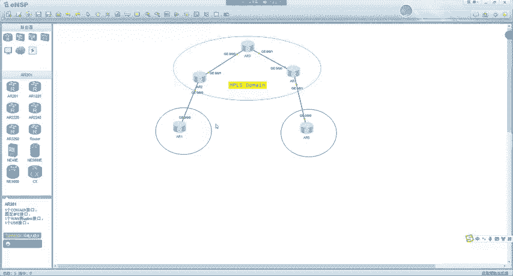

呃，接下来我们讲新课啊，就讲些内容。嗯，接下来我们讲的第一个点啊，就是这个。嗯，相当于OSPF呢。对吧对于MPSVP的一些扩展。好吧，就是OSPF这种，他在MPS4应用下有一些特点。

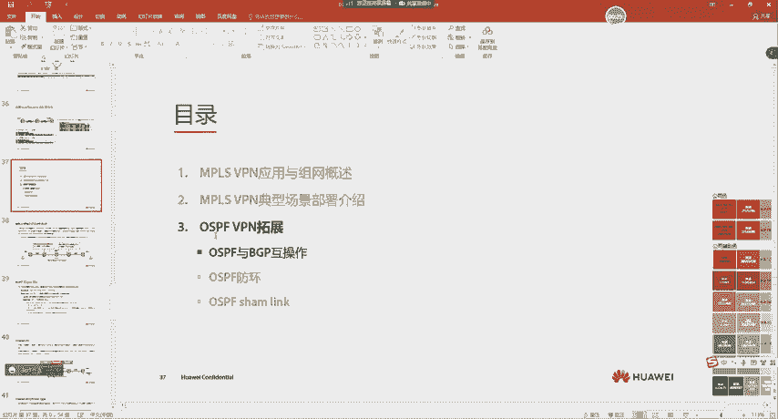

嗯。什么样的特点呢？我们来看一下啊。呃，是这样的。我们来看啊。呃，比如说啊我给大家直接通过一个实验，对吧？我们来看一下它一个特征。

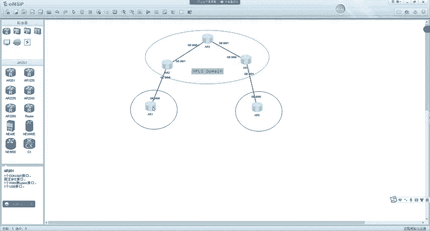

呃，现在我这个网络中呢，现在AR234呢。

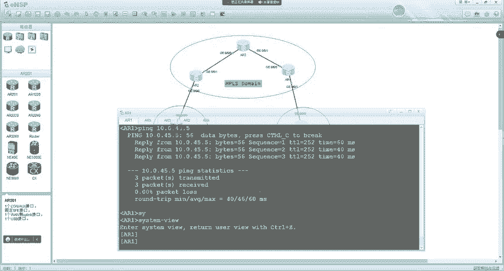

呃，我们都已经跑了这个IDP啊，也把MP4LDP都跑完了。呃，并且呢在这个VPV4中，R3是作为R的。然后二跟四呢都作为他反射器的客户端。然后我们的PE到CE之间呢啊就2跟1之间，还有4跟5之间呢。

我们用的都是OSPFV协议。好吧，这里大家知道啊，就我们现在用的呢就是PEC录由协议用的都是OSPF。

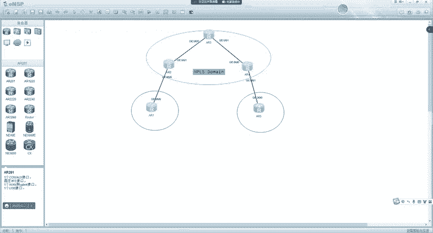

那现在网络我是做好的啊，就是比如说我在AR一这边写个lo百1。嗯，1。1。1。1。一。1点1。1。对吧然后呢，我们把它加入到OSPF中啊，就给他通告出去。night work1。1。1。1啊，0。0。

0。0。2有02啊。然后我们把1。1呢给他通告出去。在我这边也执行相同的操作。比如说我创建个楼百亿接口5。5。5。5。然后我们在OSPF下呢，将5。5也通告出去。5。5。5。50。0。0。0。对吧。

那两个一旦通告出去之后呢，由于现在我网络本身做的是通的啊，所以说我们在AR1上可以看到他已经学到5的OSPF路由了。然后在5上呢，也肯定能够学到一的OSPF路由。是吧。在这时候我们可以去拼测试一下。

比如说我拼杠A5。5。5啊呃，到1。1。我发现能通是吧，这个实际上很正常啊，就他作M叉SVP网络实间互通。对不对？嗯，但是如果有之前做过实验的同学啊啊你细心的同学呢你会发现一个特点。

就是哎老师这个OSPF它本身怎么传过来的呢？我分析它的过程呢是。😊。

他传递给BDP对吧？然后OSPF导入到BDP中，通过BDP传过来。然后这边的BDP呢再导入到OSPF再传过来。也就是说，我们是通过引入进来的。而在我们传统对吧？之前学到的OSPF协议呢。

我们接触一个概念，就是外部路由呢，就是这些引入的路由，它都是5类LC。但是比如说无论我们到五上呢，还是到一上去看路由表，你看对方站点的路由呢，它不是。

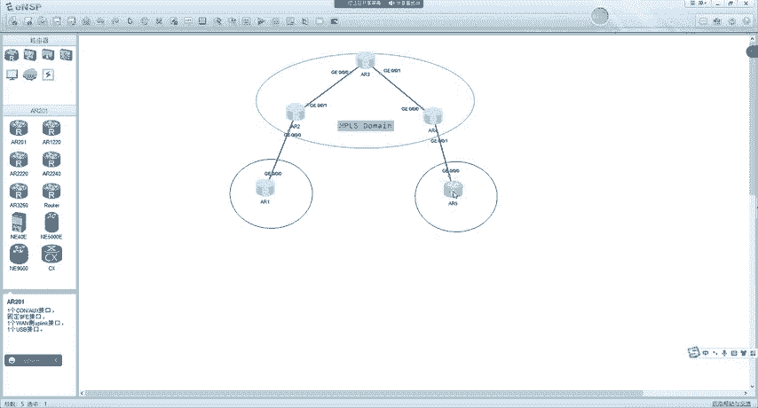

呃，5类2C。啊，他并不是ASE。啊他被认为是一条域内路由，注意啊。这个域内呢说的是OSPF路由域内。可能是其他区域的，对不对？但是他是一条。我们可以看到它是一条3代LC。那是OSPF的域内路由对吧？

大家可以理解成是OSPF路由域内的。好吧，哎，我们会发现他怎么是一条三类呢？😊。

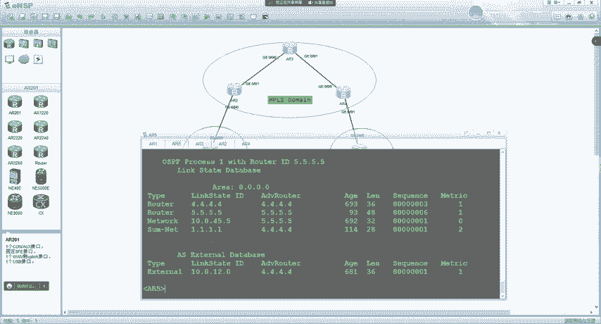

对不对？呃，实际上这里呢嗯之前我也找过很多书啊，呃，也看过很多的这个。呃，书上解释的原因。呃，在这里呢就是我也看很多书上呢，就是他们写的呢就是没有一个特别明确的原因，就是为什么是这种。啊。

但是我结合我的理解呢，对吧？以及结合书据的内容啊，我给大家说一下啊。😊，嗯，我觉得他是有一段历史的。啊，一段什么样的历史呢？他是这样的。就是在早期呢嗯MPS呢，大家知道啊，就是任何一种技术呢。

我们一旦研发出来之后，我们需要进行推广。对不对？就是比如说我要给企业提供专线的服务。是吧。那MP4未来在业务上，它类似于什么呢？就是运营商去给你提供MPS4专线。对吧我因为一般说专线呢是专程给你去用的。

对不对？那大家可以理解成MP24就是一条三层的专线。呃G于IP的。但是当我们去卖这种服务的时候，比如说专线代表什么意思，专程给你用的。是吧从你的一个站点连接到另一个站点。那这种我们一般把它叫专线。

对不对？那如果我们去卖这种服务的话，我们来想一下啊，就是在以前的这种MPS4的模型中呢，我们发现有一个特点就是客户的CE的路由呢。他经过运营商的批议要引入，引入之后再引入。对不对？那他会缺失一些信息。

首先你缺失了原有的OSPF信息。对不对？那第二点是在哪里呢？这一点，比如说我给你一条区域内路由是吧，域内路由，你给我传过来之后变成一条五类。那这时候我们再去卖这种服务的时候呢。

啊大家如果有同学做个售前啊是比较清楚的对吧？如果你卖个东西啊，你也比较清楚的。那我们都说是专线了啊，你只是经过我的啊这种承载网络。对不对？但是呢，比如说客户未来真正去买这种服务。他发现我这边的1。

1传过去，竟然是一条五类。

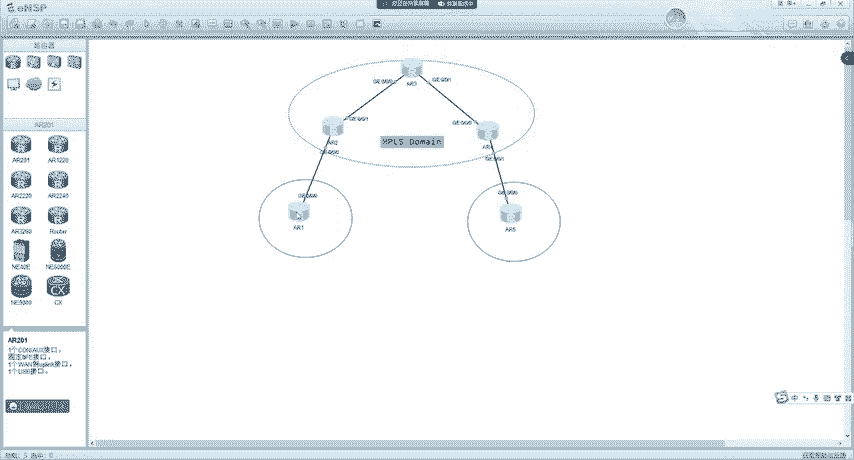

是吧那对于客户来说呢，可能心理上会有一种落差。

啊，这个落差体现在哪里呢？就是你再去卖服务的时候是吧，你说的是什么啊？😡，你说的是专线。能不能明白？就是你去卖这种服务的时候呢，大家要理解啊。你看我们学到的就是网络中啊很多技术它的曲词。是比较有讲究的。

你只要名字起得好，你的服务可能就卖的好。你像VPN这的东西呢，我们可以发现本质就是一种隧道。对吧。但是呢在我们的网络中啊，一般叫的是什么呢？叫虚拟专用网络。对不对？如果你给客户说。

我给你提供的是虚拟专用网络，他一看专用。是吧那客户的这种一听到这种服务呢，或者说这种技术。他就觉得很高大上。对不对？呃，觉得很好。是吧。这就相当于有时候你买东西一样。对吧。你买东西呃，拌黄瓜。是吧呃。

就叫拌黄瓜。对不对，但是给你起个名字叫什么呢？是吧嗯，什么。青龙。对不对？就冰。是吧啊，就是黄瓜像不是啊，就是这个冰块上面放点黄瓜。😊，是吧呃，叫什么呢？嗯，叫这个。😊，啊，就大家自己想一下啊。

叫什么冰上青龙对吧？当是我只是随。随口说一下啊。是吧大家应该看我一个小品。对吧啊，叫做什么呢？宫廷御夜酒是吧？啊，大家应该看过这个小品吧，10081杯，对不对？哈那还有一个叫什么群英荟岁。😊，对不对？

有发现啊。那我们再去卖一种东西的时候呢，你这个名字起的好，哎，他听着就不一样是吧？这个群英荟萃。嗯，这个小品大家都看过啊，那实际上它就是凉拌的这个什么黄瓜啊，什么萝卜啊之类的，对不对？

那我们在去卖这种服务的时候，网络中也一样啊，因为你本质也是销售。😊，对吧。是吧。那就说是虚拟专用网络。但是你一说这种虚拟专用网络呢，客户的感觉是吧，这是我单独的一条线啊。😡，是吧。

但是你传过去之后又是1个5类LIC。他有点名不符实。对不对？哎，客户一看怎么是五类呢？😮，是不是你中间还引入了？对吧你要引入的话，那怎么还能是专用网络呢？是吧。所以说啊早期就有这么一种啊问题。

就是我们真正在去卖这种服务的时候呢，可能不好去出售。对不对？那为了把MP4VP这种业务呢做的更大。做的更好。实际上这个呢压力给到研发。对不对？销售反正能把服务卖出去，他就好。那售后问题。

那压力就给到研发了。诶，研发就想。诶。这不能让他是五类啊。是不是啊？来这儿时候怎么办呢？注意啊。所以说OSPF呢。在这种MP4的场景下呢嗯。就有了一些特点。呃，有了一些什么特点呢？我们来看一下啊。😊。

是吧。

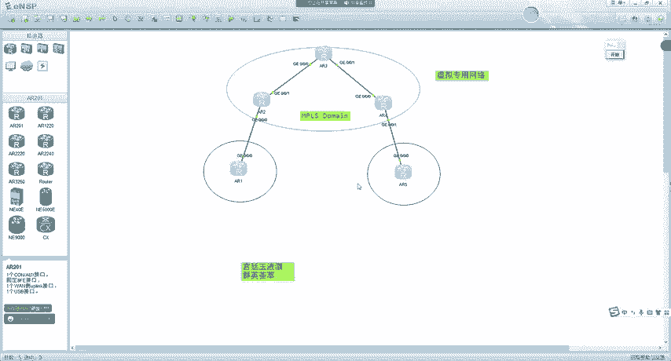

那。就是。比如说我们到二上来看一下。diissplay BTPVPV42如 table。在二上呢。我们做了一条命令。就是我在BDP下呢，把这个OSPF不是引入进来了吗？闫如建来。之后。

我们针对特定路由去看啊。1。1。1。1。咱们可以去看的。这个路由一旦变到了BDPVP实力中。他增加了一些我们并不认识的扩展团体属性。是不是啊？一个叫做赌漫ID。一个叫做RT啊，叫做路由啊。

叫root type。还有一个呢。叫做入台D。那一共多了3个新的。扩展团体属性。

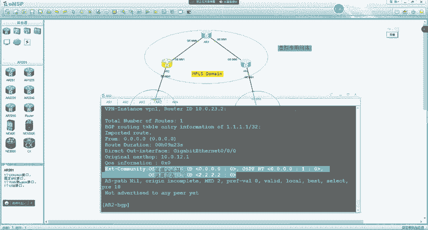

那这几个扩展团体属性，他们是干什么事的呢？我们来看一下。好吧，所以说在这里呢嗯课件也写了一下他大概的原因就是呢BDP跟OSPF引入会丢失一些OSPF信息。😊，对吧所以说OSPFBDP呢。

我们就做了一些扩展。就是在这里，如果跑OSPF的话。嗯，做了一些新增加的一些特点。那。主要所新增的呢就是。我们呢通过BDP去携带OSPF的一些信息。携带的是什么信息呢？

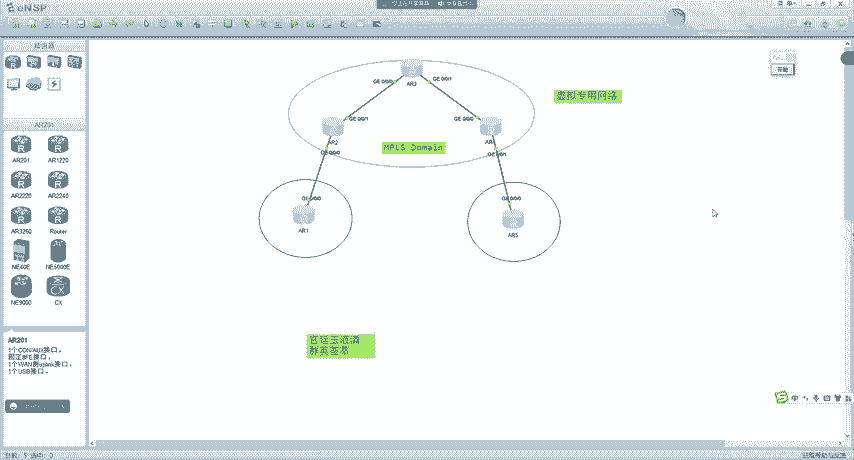

比如说我们刚刚可以去看到这有BDP的扩展团体属性，三个属性呢去携带OSPF的一些信息。当然不是链出状态哦，就只是一些信息。

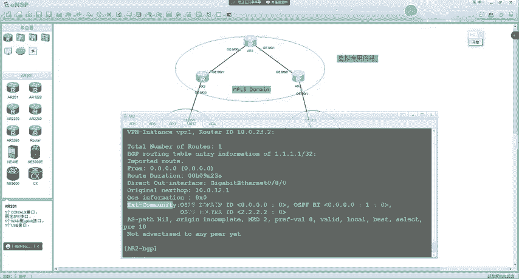

那一共有赌漫ID。对吧。如果他是type。啊，当然还有一个入台地，我们一个一个来看。首先我们看第一个呢。叫做赌漫ID。这个赌漫ID。

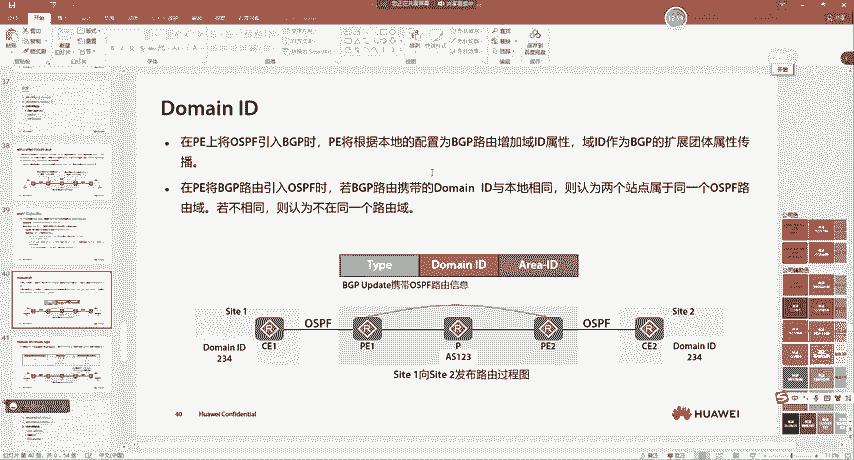

他是干什么的呢？来看啊。嗯，这样啊，赌麦ID我先不给大家讲好吧，先不给大家讲啊。😊，呃，我们先讲最简单的一个叫做rootID。好吧。这个root IDD呢，它有两部分组成。前面呢这一块。

就是P叫做发送端P关于这个实例OSPF建程的入台低。所以说是2。2。2。2。而后面这个零呢，目前是保留位而没有被使用到的。好吧。所以说入otID呢就是发送端PE关于这个OSPF进程的入ID。这很简单。

还有一个呢叫做OSPF的RT。这个RT呢？嗯。如来 type啊，叫路由类型。那我们可以去看到啊，他一共占用了三个部分。那前面这一个部分呢？他所代表的。就是P在哪个OSPF区域下学到的这条路由。😮。

那这里呢，我们现在用的是去零。所以说它的取值呢就是0。0。0。0。而这个一呢代表的发送端P它是通过几类LLC。学到的这条路由。比如说这1。1，它不就是一类吗？是吧。那这时候呢。

我在AR一上interface low back2。I p rise1。1。1。2。然后呢，我们给他发布到OSPF的进程一network1。1。1。2。好吧。一旦发布出去之后呢。

A2一在去零中肯定会有一条三类。1。1。1。2。3内。去连啊。是吧。那这时候AR2呢，它肯定是通过三类LRC在去零中学到这条路由。所以说我们来看一下1。1。1。2的话。

它是不是一条去零学到的三类LRC啊。是吧。那最后面这一个呢，它是用来标识5类LIC的type类型的。就是这里呢取值为一就是一类，二就是二类，三就是三类。啊，五就是五类，七就是7类。当我们有5跟7的时候。

123没有外部路由类型，所以说固定取值为0。如果五跟7它是有外部路由类型的type一和type2。对吧。那后面这一个比特呢，就是用来标识外部路由类型的。比如说我在A2一上呢。写一条192。168。1。

0的路由。然后我们在OSPF进程下给他引入进来。引入进来之后呢，我们再到AR2上来看一下。192。168点。1。0因为默认。外部路由类类型是类型2是吧，所以说我们看到这里就质一了。

表的是5类LC外部路由类型2。那如果说我们以type一的方式进行引入。对，这时候再到AR2上看一下，就变成了0。所以后面这一个呢是用来表示YW类型的。

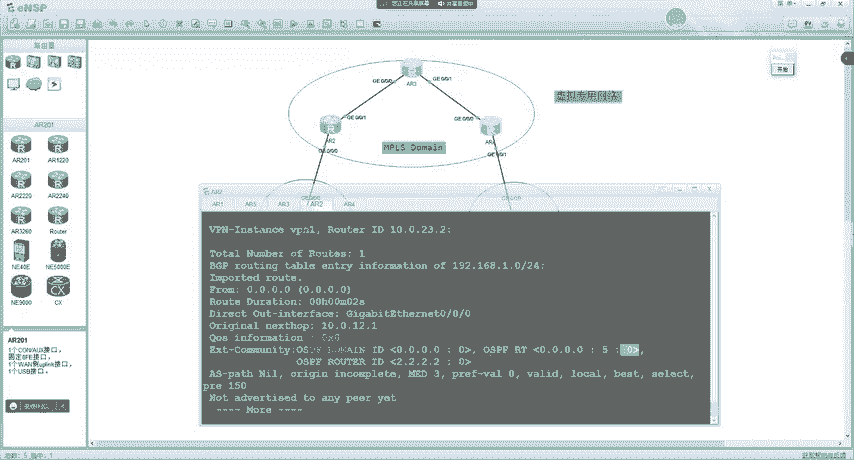

这三个扩展团体属性给大家整理一下啊。第一个叫做。赌漫ID是吧，这个我们还没讲到啊，OSPF的RT。还有。入台的这里呢是用来。标识发送端PE的。I啲。OSPFID。这里呢用于标识。PE从哪个区域学到路由？

并且后面这一个呢是。用于。标识。皮E从。几类LIC。学道路游。再后面这个零呢。他是用于标识。5或者7类LC的。cos的类型。一。等于。海牌。0。等于。太皮。好吧。所以这是几个比较简单的啊。那接下来呢。

我们就来给大家解释一下是吧？

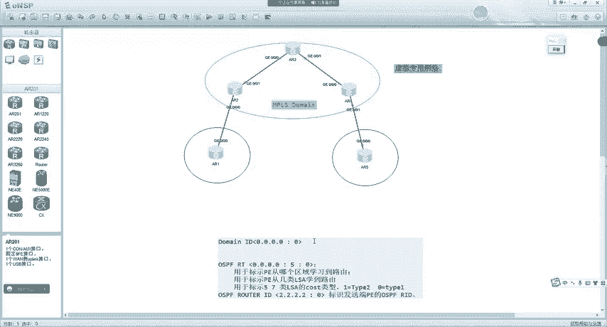

老师啊，他有了这几个之后呢，动漫ID先不用管哦，这个默认都是0，后面这个是保留的，没有被定义。那。老师。现在呢我将这三个属性传递给4了，那4能不能收到呢？

我们来看一下diplay BTPV平V42roing table。1。1。1。1。他是有的是吧，还有个RT。对吧。哎，那么在这时候，他根据IT导入的VP实例。怎么就变成三类了呢？

对吧。那赌漫ID它有这么一个作用啊。动漫ID呢默认。都为玲。当我们的接收端P这个在课件里有啊，我就不写了。

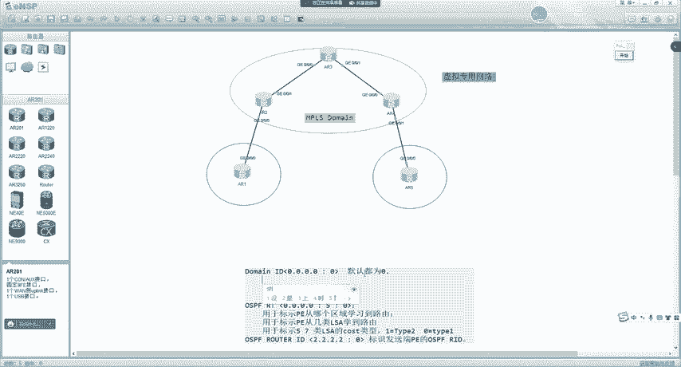

嗯。

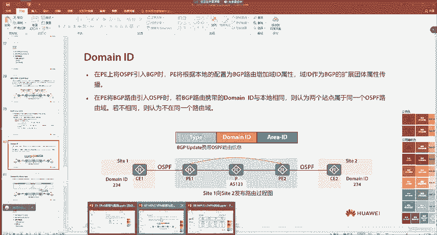

当我们的接收端PE呢。他需要把。BDP路由引入到OSPF的时候。他首先呢。会去查看。赌漫ID一不一样。如果说二跟4的赌漫ID相同，默认都是0，他俩肯定是一样的。那么在这时候呢。他会去看这个路由的RT。

比如说这是1。1。1。1。杠32的路由携带这么多信息。现在呢。接收端皮。把VPV4。导入境。OSPF的时候。将会参考。动漫ID。好吧。那么在这儿时候呢，如果。两如果路由的。赌漫ID和本地相同。

默认等于0，他肯定都一样的。那么首先他是这样的啊，这个应该在课件里就有了。那如果我们RT是一和2。对吧。或者说为3。好吧。那。一类、二类、三类LC。都会被以。三类。LC的。形式。引入到OSPF中。好吧。

就这时候呢，A24给你传的也是30LC。对吧所以说他会以三类L4的形式给你传过来。那客户一看是三类OSPF域内路由，你也好忽悠嘛？是吧？比在原本站点是域内路由，在远端站点也是域内路由对吧？

整个MPS虚拟网络。😡，啊，那么类似于一跳啊，精准提供服务。能不能明白？客户也不懂啊，客户他都域内域外自己都不太清晰呢。😡，是吧你这么一说，你说的也没错啊。😡，对不对？哎，可我一听哎，好像还挺好的。

是不是啊？然后就买了。所以说啊。1230LC呢？都会被以三类LC的形式引入进来。那这时候我们也就能够解释了。

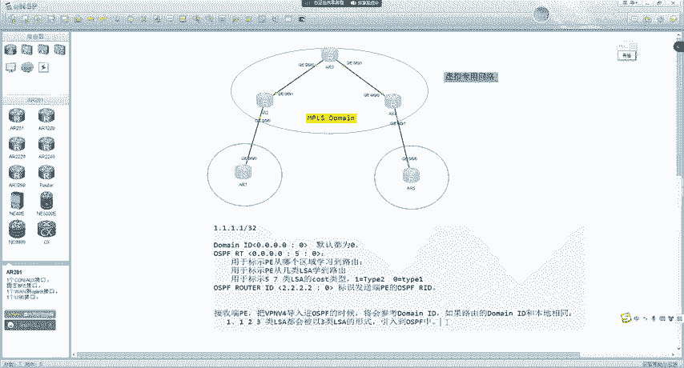

这个1。1。1。1，为什么是三类呢？是吧。

因为我们A24会去执行一步，我们把这个动作叫做路由还原。那么如果是五类和七类。五类和七类呢。LC。都会以。😔，五类和7类。会参考。原有的。啊，不对啊，5类和7类LC。都会以。外部LRC的形式。当然这里。

如果这里我们是个南萨区域呢，它就是7类。如果正常区域就是5类，所以说我用外部LC统一进行描述了。都会以外部LC的方式呢引入到OSPF中。并参考外部路由类型。进行还原或者说进行引入。对吧。

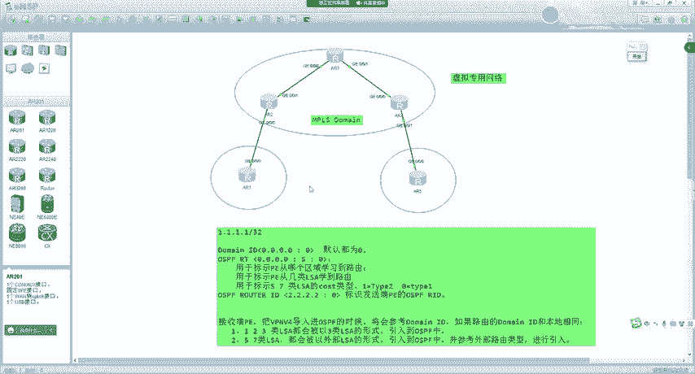

比如说现在呢我们的192。168。1。0。是吧。他的外部U类型为多少呢？为type一。所以我们到A25上来看一下di四playOSPFLDB192。168。1。0。AI1。

他是不是一条外部路由type一啊？是吧。啊。

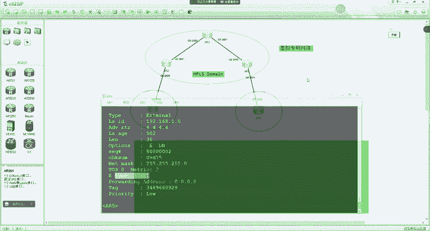

所以说五期呢依然保持为外部路由类型不变。那这就是我们刚刚所说不同属性的作用。那有人问了，老师。那你刚刚说的是赌漫ID相同。是吧。那么赌卖和ID和本地不同的时候呢。他又会怎么样呢？注意。

大家可以认为这个赌漫ID呢赌漫我们把它叫做一个玉。😡，对吧。那么登赌漫ID不同的时候，我们认为是不同的路由域。那如果你要引入其他路由域的路由。是不是就应该是5类LC呀？对不对？

所以说赌卖ID和本地不同的时候是很简单的，就是。123。五期都会。类LIC。都会被以外部路由的形式。引入道。OSPF中。

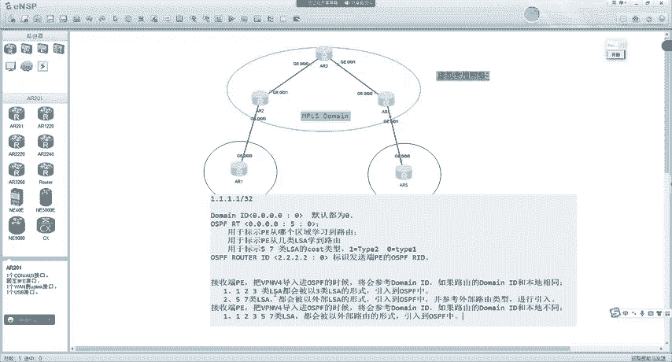

好吧。那比如说现在我们可以去修改赌漫ID，你默认不都是零吗？我在市场可以通过一条命令修改。赌漫ID。啊，你可以用时间制数。或者说用。32位的整数，但它的格式是IP地址。好吧。比如说我用十年之数。

我敲111。调完之后，我们再来看一下。OSPFLDB。1。1。1。1。是不是就变成了5类LYC啊？

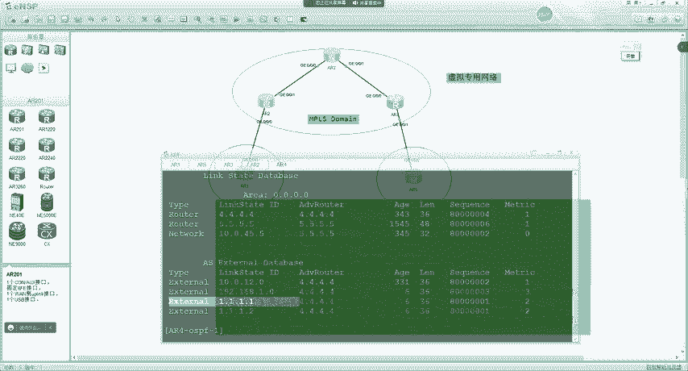

好吧。所以说这是OSPF。在MPS微P场景下的一个特点。SS啊、瑞普啊这些没有啊，没有这种特点，就OSPF嗯。稍微特殊一点。好吧。那刚有同学问L老是cos的，怎么算的呢？😡。

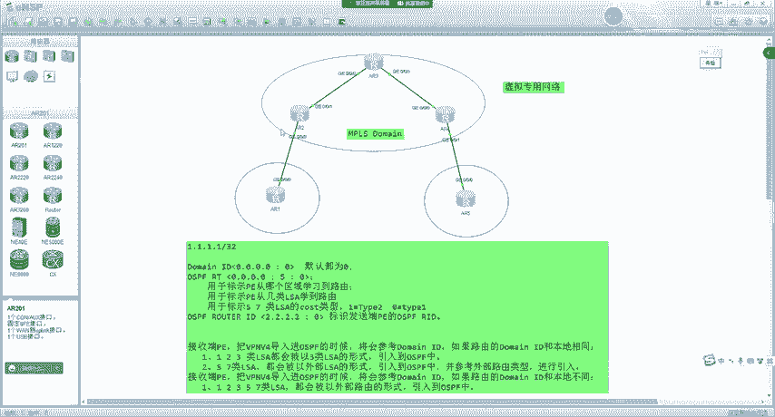

我们来看一下啊。AR2IProingtable VP instance VPNE。他学到1。1的cost是一。追意押。然后我们来看4。我把赌漫ID先给他删掉再。

diplayIP routine table V V P一。是学到1。1。1是多少啊？是多少是2。注业这只是BGP路由啊。对不对？那这个LIC。1。1。1。1，他自己的mytri就是。

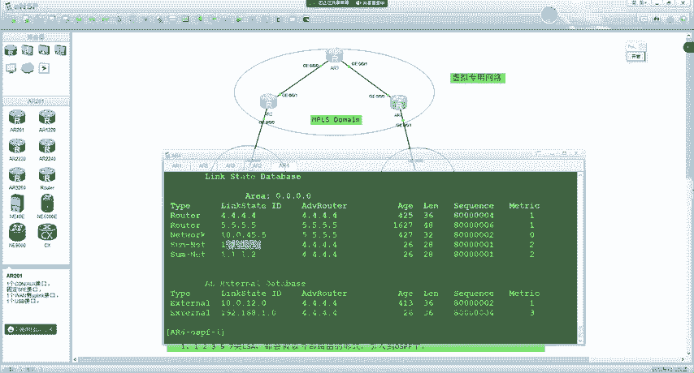

所以说武学的是多少？3，那可不是3啊。可不是三啊。这接口是啊默认是一是吧，那就是3。对吧但是我们可以发现你一个特点是什么呢？就是我的路由虽然在MPSVPN中经过了很多个设备进行传输，我R还给它反射了。

但是我们到PE上去查看的话，整个MPS唯P网络是不是就相当于一跳啊？😡，各位同学能不能明白？明白同学敲一啊。没问题吧。那这时候你就更好去卖服务了。是吧。对不对？客户路由什什么之类的是吧？

什么一跳传递之类的是吧？当然我可能编的词没有那么高端了啊。😡，是吧，那。但是你放到那些销售上。对不对？发到那些专门搞市场的营销上的人。他们很容易就能够塑造出来这个技术的高大上，做两个海报。对不对？

是吧就。大自己脑补一下。能拿不到吧。是吧就跟这个。拌萝卜。叫群英荟萃一样。对不对？其实是一样道理。那这时候你这业务呢就能卖的更好。😡，是吧研发又在后头骂了。😊，啊，服务卖出去了，为了打这个。

但是就是这样。😊，你们领导看的是谁呢？那。领导看的也是能够带来多少的盈利，对不对？只要能卖出去，力所能及的让研发多写几个代码也能接受。所以这里大家明白了吗？明白同学敲一啊，这里没问题了吧。好。

那这就是MPS。对吧就是OSPF在MPS4场景下的一些特点。那ISS和BDP可能会有同学问啊，嗯这个跟我们以前学的一模一样。

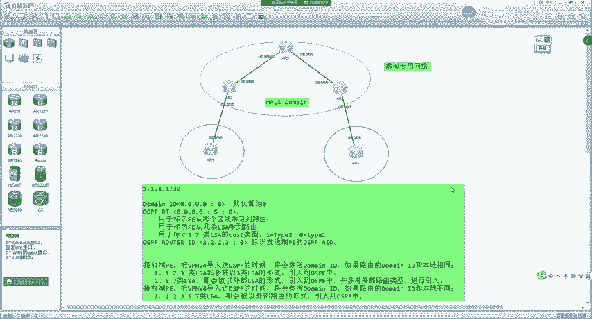

就OSPF呢。

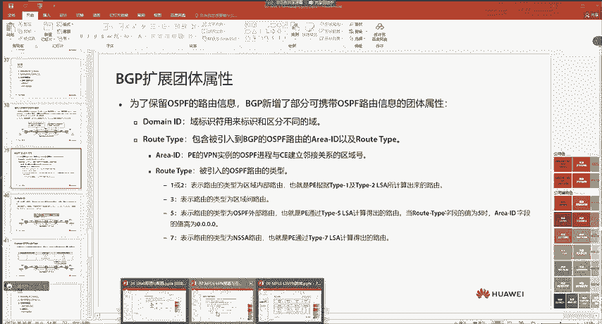

他做出了一些扩展。所以说这个赌漫ID注意啊，大家可以理解成是用于标识。不同的路由域。是吧如果你这边为0，这边为144。那我认为是不同的路由域，就应该是5类。所以说呢当赌漫ID不同的时候。

会以5类的形式引导进来。好吧。啊，对，这几个不需要敲面的啊。😡，能懂吗？就是你只要OSCPF引入啊，他自己就有，不需要去敲任何命令。😡，好吧，自己就有的，而且呃我之前找了一些关闭的命令啊，也没找到。

就这个特点啊，大家自己理解一下。

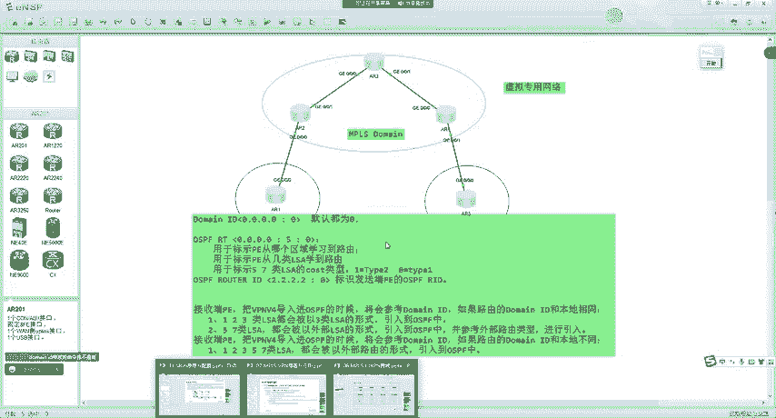

对，赌漫ID的修改呢是有命令的啊，就是在禁证一下赌漫ID叉叉就完事了。

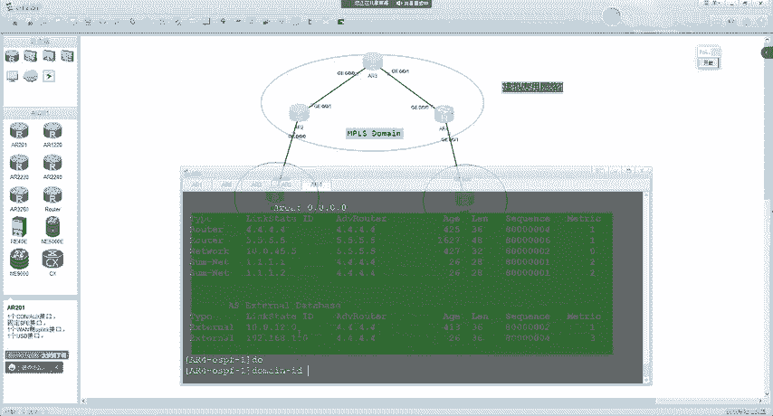

没错。是吧。大家还可以了解一些这个嗯商业行为。对不对？只有在MP24场景下有这种特点啊，对你在PE上去这么执行才有。😡，其他的都没有啊，能不能明白？比如老师。

我这俩OSPF我引入BDP啥的BDP互像没有能懂吗？只有你跑MPS的时候才有这种特点啊。😡。

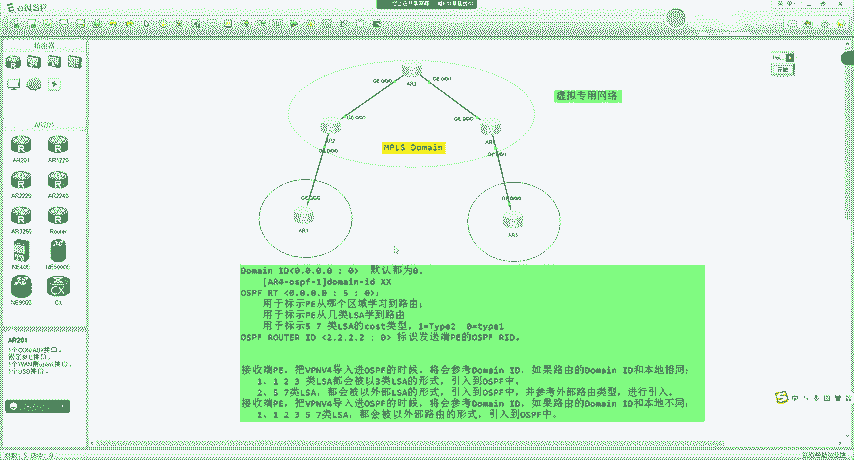

好。那这里呢，我们就给大家说完了啊，咱们就讲完了。呃，接下来呢我们再去讲一个小特点。啊，这是防还啊，防还先不讲。先讲这个。

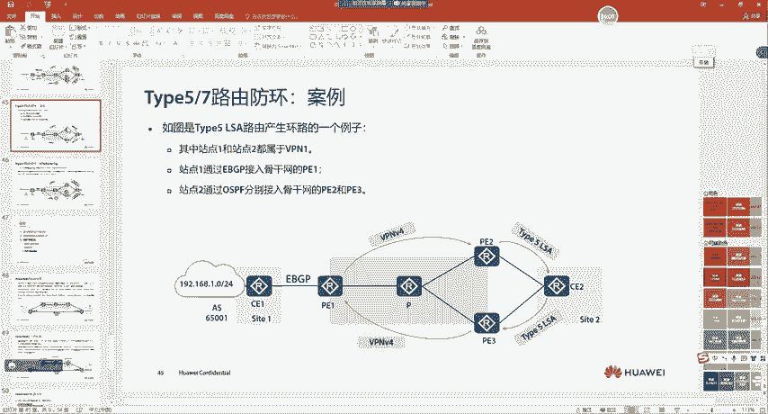

S link。好吧。我们把他呢。叫做伪连接。slink啊，我们把它叫做伪连接。这个伪连接有人就问了，哎，老师，我学过一种虚链接。是吧。哎，是不是不一样呢？实际上不一样。好吧。

你们以前那个学的叫应该叫徐练路。是吧或者说叫虚连接也一样。啊，我们把这个叫做伪连接。他俩可不是一个技术啊。那有什么样的区别呢？😡，我们来给大家说一下。我们来想一下啊。CE呢是作为我公司的。注意啊。

你们一般公司的生意做，只要是你的出口的话，当然有些也接核心上的MP专线。也有些接道出口上。这只是一根专线跑微PN业务的。你的上网internet链路在这儿呢。😡，这才是internet链路。

各位同学能明白吗？你这根线是专线。对吧你接入到运营商的internet，接入到公网，你要上网的话，你是通过这个根线接的。但是我们思考一个问题。如果我企业私有的通讯只靠internet去走。啊，不对啊。

只靠MP4去走。哎，那MP4故障了怎么办呢？是吧。一般买MPS的这种。嗯。公司规模还算可以了。对吧。嗯。是吧找原营商扯皮。来来赔钱。对吧但是没有啊没有。但是。一旦你的专线故障了。

那就意味着站点一跟站点二的通讯出现了故障。是吧领导要开会。对不对？哎，网断了网断了，领导说你你怎么办呢？你找运营商，运营商说我们就这样。是吧。对不对？那这时候怎么办呢？就是我们更希望有的一种是什么呢？

😡，更希望的。是有一种服务。能够提供一种备用的。比如说五跟一都连接到internet上。我在这里做个加E备用，可不可以啊？大家觉得行不行？MPS故障之后，我走GRE通过internet互通行不行？

也可以。不一定是GRE，你当然也可以用IP赛。但是无论你是加E还是IP赛是吧，或者说你直接拉一条物理线路。😡，他本质上逻辑上都是什么啊？都是一份备份链路。但是呢是不是这个备份链路，我只是注意啊。

我用这个siri接口模拟这个备份链路。😡，啊，这个备份链路呢，我们一般会把它叫做后门链路。好吧。就是被费用了。那这时候还会有一些问题。什么样的问题呢？😡，老师啊，我这有个1。1。1。1。

经过MPS4传过来，我们刚可以去看到是三类。但是嘉E或者IP赛，你直接去见邻居，他传的是几类，各位同学还记得吗？😡，GE传的是几类啊？是一类LC，你直接建立OSPF邻居传过来了，传的是一类。

我们以物理专线模拟这个后面链路。他这个1。1。1传过来啊。是一类。一个三类一个一类。哦。😮，你慌不慌？是吧。设备的选入原则是优选什么？一类。那这时候我们发现这个备份链路就会成为了主链路。

你这是CE亚公司的出口。那你后面可能还有黑心交换机啊，在连接其他路由器呢。啊，肯你调按件啊。啊对，两个路由器比较懂人情世故。是吧走后门。那这时候呢，我们买的这种MPS专线呢还比较贵。还没有被利用到。

领导开始问了。是吧。每月给你那么多钱啊，交那么多费，你也没把网调好。是吧。那这时候怎么办呢？我们肯定不希望有这样的业务路径。那老师啊。一类优于三类。设备协议上的选录原则。我们不能去更改啊，是吧。

这就是标准。😡，是吧AEF定好的。是吧。你别说老百姓了。😡，研发他都改不了，你必须要按照标准执行啊，要不然人家不带我玩。是吧不带你这个厂商玩。那怎么办呢？那这时候我们得需要一种技术，就是伪连接了。

伟廉接是这样的。就是比如说我让二跟四之间直接传一类。各位同学觉得行不行？行不想？一定是可以的。当我们通过MP4把网络打通之后，比如说我举个例子，现在。

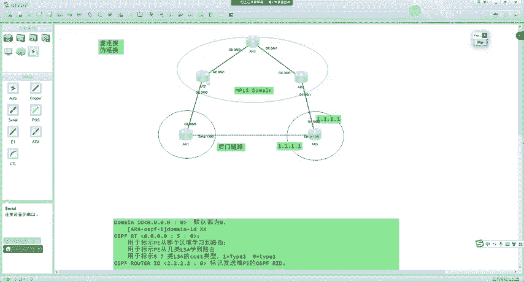

我在二上面呢。interface low back1。绑定到VP种P24。1。1。2。啊，32位好吧，我配32的啊。然后呢。我在AR2的BDP中。啊。

interface BDP中IPV4family V instance。VP1network24。1。1。2。然后在AR4上呢。interface low by一。interface啊。

不对BTPEIPV4family微P。一。network24。1。1。432。比如说现在我在一上。P杠A啊杠VPVPE杠A24。1。1。4到24。1。1。2。能不能同？可以吧。每个VP实例一下。

我单独起个low back接口。他俩可以互通。哎，我们就想有没有办法让他建立一种单波的OSPF邻居啊？你传一类，我也通过OSPF传一类。😡，是吧大家都是依类，我把你后门链路的cos的改成120。

我这边传过来的扣s是2。那五优选哪一个？沟通一下5U选哪一个？

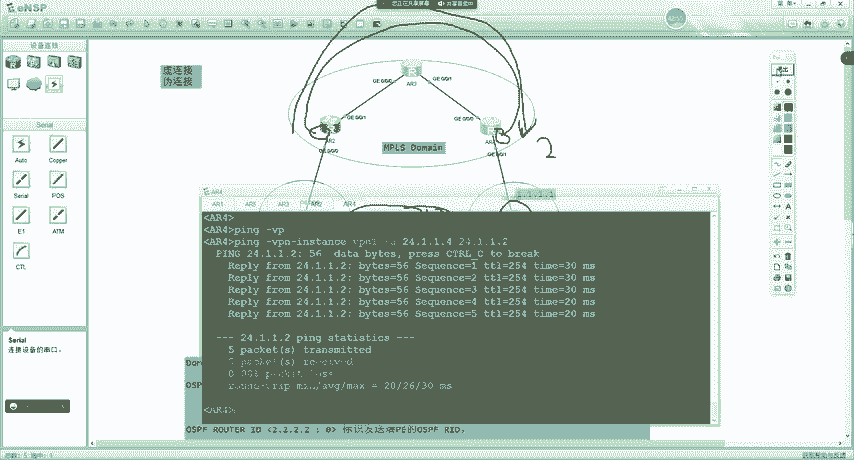

5优选的就是MPS。MPS4故障之后呢。再通过cos选下面。对不对啊？那这就是伪连接的作用。那伪连接怎么样去做呢？是吧？比如说我们先把这个网络给它打通，我们来看一下A25现在去往1。1呢。

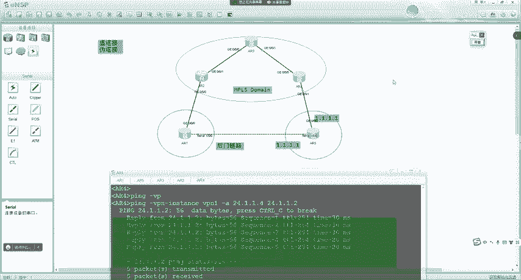

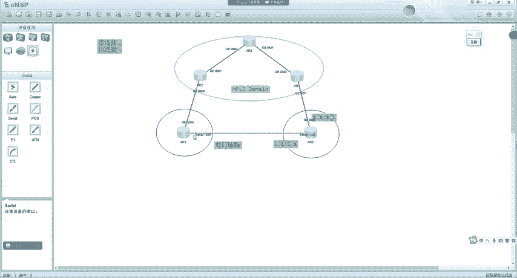

他是走MPS的，穿色的。杠A5。5。5。5到1。1。1。1。是吧走的是MP。那我们把后门打通之后，让他传一类。AR1。siro1-0。0。15。1。interface1-0-0。15。5。A21这边呢。

我们跑个OSPF1。但是这里我给各位同学说一下啊呃，说个概念性的问题。什么样的问题呢？嗯，这个呢在某本书上接到过啊叫MPSVPN在。ciscoIOS上的配置。呃，我记得好像是这本书啊，要不然就是MP4。

技术架构。呃。好像是这两本书的哪一本啊，记不太清了。就这两本书的哪一本上面说过这个概念啊。是这样的，这个概念呢。但有同学可能听说过。他是这样的。我们传统的OSPF网络呢。要求的是什么呢？

去零有且只能有一个，并且去零不能被分割。是吧。而MP4中呢，比如说我这边有个区域0啊是吧，这边有个区域一啊，或者说区域0。而在传统的我们学到的这个OSPF中呢。

去域零不能被分割MP24把两个区域零打通了。对吧。就是我们在两个续龄中间呢横插了1个MPS。他就打破了原有的OSPF技术架构。对吧或者说体系。什么体系呢？就是二跟四啊，他也往这传三类。😮，不太合适。

是吧就把传统的OSPF那种区域结构呢给他打乱了。所以在。MP24VPN里面呢，如果我们用OSPF还有一个概念啊。嗯，应该有同学听说过嗯，叫做super。啊，我们把它叫做超级骨干区。

什么叫做超级骨干区域呢？😡，他是比骨干区域的层级还要高一级。大家应该知道VIP和SVIP的区别。对吧。超级骨干区域呢，它比骨干区的层级还要高。所以整个MPS4网络呢，它是一个超级骨干区域0。

嗯把它叫做super。好吧。那。😡，正因为有了这个超级骨干区。Zhuyi。二跟四呢。他俩注意啊。都是ABR。那如果他两个是ABR的话。我在这边用。去一行不行？这边用去0。大家觉得行不行？注意啊。

这时候是不行的。为什么不行呢？原因我给大家说一。比如说你这边去领可能有了某一个网段。注意啊。这里你还有一条后门呢，后门假设也在区一中。你这里这里再去0啊，首先A2一认不认为自己是AB啊？

他一定会认为自己是一。你这边的路由传过来，他会不会计算？非骨干区的。会不会啊？不会吧。大家能明白我的意思吧？那有人问了。是吧老师啊，我这样我这在去领。啊，或者说。我这再去一这再去0这再去一。行了吧。

也不行。为什么不行呢？你这边身后也要有业务网络啊。如果你这边的在去域0。A24会不会计算啊？他也是AB啊。他也不算。是吧他不算就没有办法把路由这样传过来。能懂吗？所以这里啊如果你仔细的去画，你会发现呢。

你怎么画都不对。😡，这里呢大家要记住一点。正因为有了这个超级骨干区域呢，我们建议是什么样？😡，分支间所有这些都在同一个区域中，这都是同一个区域。区域零也行，去一也行，区二、去三、区四去五都行。

但是呢不建议再去规划其他的区域。好吧。那这样的话，我们才能够真正的形成什么呢？去零没有被分割，对吧？ABR呢就两个。2。4。是吧那这时候路由计算才不会有相关的问题。好吧。那接下来我们再回到刚刚所说的。

s link这里。那待会儿呢。我们来看一下，在A21。和A25上这条链路。我们应该宣告到去一呢。区域二呢，还是区零啊？首先我这边都已经在区零了。大家觉得这条链路应该通告在哪里啊？我的呢一定是0。好吧。

所以说我们需要在AR1上呢。interfaces1-0。0。刚配过IP了。OSPF1。对吧我们把刚才艾瑞一测那个。通告特点的给他删了啊。嗯。我记得我还做了个引入是吧？我们在去宁夏呢，network10。

0。15。10。0。0。0。在五这里呢。siro1-0。0。15。5。已经配过了OSPF1。O0network10。0。15。50。0。0。一旦通告出去之后，这个接口呢di四playOSPFP。

很快就把OSPF邻居建立了。建立来之后呢。一下子给你传了个一类，我们看一下五上面。他通过几类访问？通过siri接口。这时候我们去穿色的，我们会发现呢路径发生了改变。而不再是以前的多少。MPS网络了。

直接走后门了。是吧。是不是这就跟让你那个啥一样，本身给你开个后门呢。是吧就是不得已而为之。当你正大门走不了了，你再走后门。😊，结果你天天走后门。那肯定不太好啊。是吧换到我们的业务上。

这个后门一般是备份链路啊。对吧有可能是加E，有可能是IP赛，它的服务等级比较低呀。啊，质量也不好，还容易卡。是吧领导一发现我花钱买业务，结果呢？是吧。你可能用的是其他的。对不对？

这个saro在线网中有可能是一个GRE。也有可能是1个IP赛。大家能不能明白？

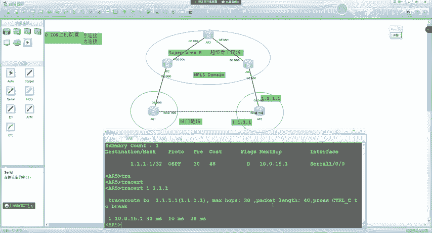

那这时候我们怎么样解决这种问题呢？就得通过slink去解决。slink解决的时候很简单。jamlink的第一步呢。就是要在。P上。创建32位的。还回口。并且划分的。微P。实力中，这是第一步。第二步呢。

在PE的BDPVP实力下。通告。杠32的环回口。这是第二步。Shi。得。环回口互通。

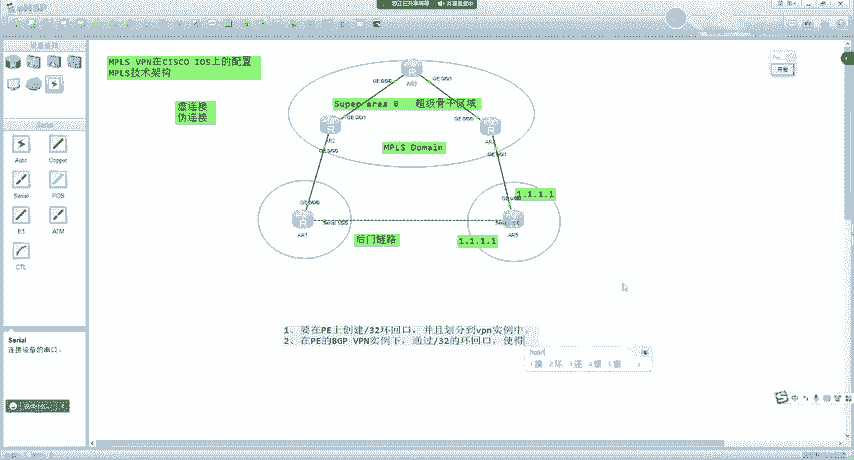

这一步刚刚我们有没有在24上做完啊？P杠VP VPE杠A24。1。1。2到24。1。1。4。已经转了。是吧。

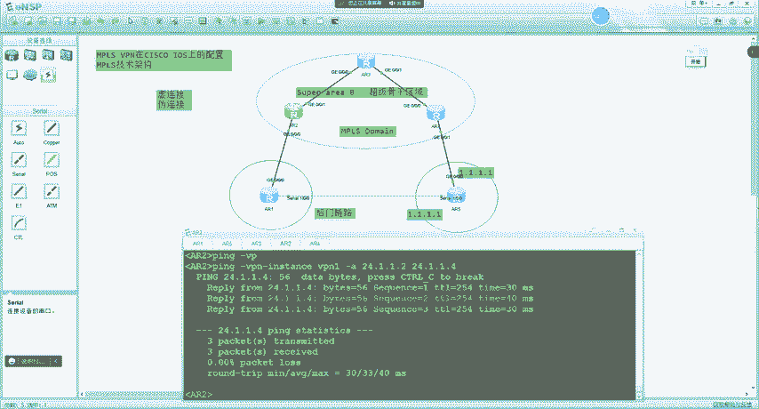

做完之后呢，注意。第三部。在OSPF。区域下。😔，建立。SH山link邻居。邻居关系。传递。一类LIC。

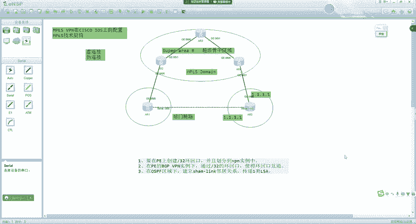

好吧，就传一类啊。这里呢我们在二的OSPF进证下，注意啊，是VRF的OSPF竞证一下。

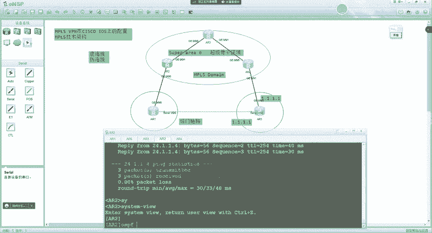

好吧。在。VRF的OSPF区域下。

区域玲。😔，录音，我们去敲一个slink。要输一个原地址是24。1。11。2，目的地址呢24。1。1。4。回撤。反过来在市上也一样。OSPF1。欧瑞有林。24。1。1。2到24。1。1。4。啊，不对啊。

原木敲反了，他应该是24。1。1。4。到24。1。1。2。见了很多个，我删一下啊。按度。1。1。4到。对吧两个原木是颠倒过来的。一旦敲完之后呢，我们发现很快就建立了smlink的邻居。

你可以通过diplayOSPFshalink去查看。是吧是1个P to P的邻居cos的是一，这个是默认的啊。

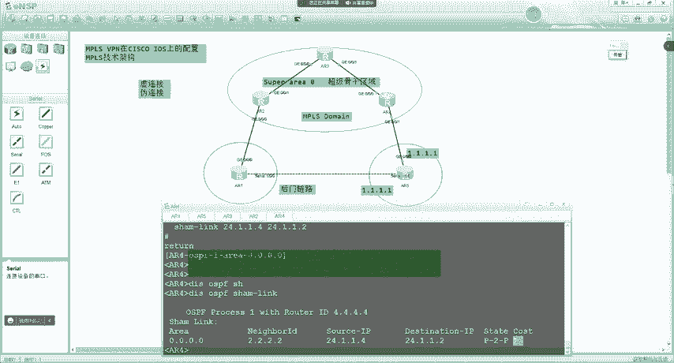

好吧。那么在这时候呢，二就会给四船一类，四呢就会给五船。那。我们来看一下啊。四给五传递之后。这边我们刚刚可以看到smlink的co认为是一。1113。S考是四十几啊？反正40多4十几，我忘了。

所以说A25他应该会优选谁呀？

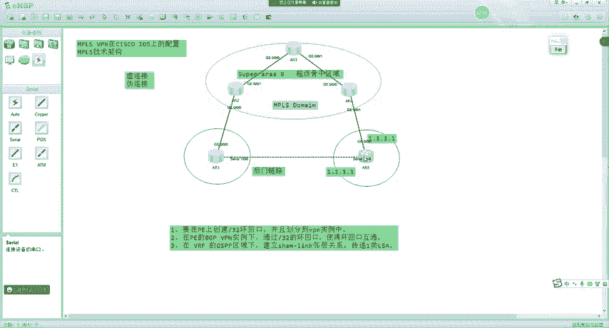

优选A24作为下一条。cose的是3。对吧。对不对？而sri接口它的cos是多少呢？我们得往上倒腾倒腾啊，我也忘了是多少了。没有没有diOSPF。Interface。48。对吧。

所以说这时候通过cos的比较呢，他就优选了上面去做。所以说现在我们在5上再去刷色的5。5。5。5到1。1。1。1。刷色的5。5。杠A。5。5到1。1是不是又走了MPS啊？对吧。

而如果MPS链路一旦故障之后。再去穿色的杠A5。5。5。5到1。1。1。1。他是不是又走了下面的两路？所以这个各位同学明白了吗？明白，同学敲一啊，没问题吧。那这就是slink的作用。好吧。

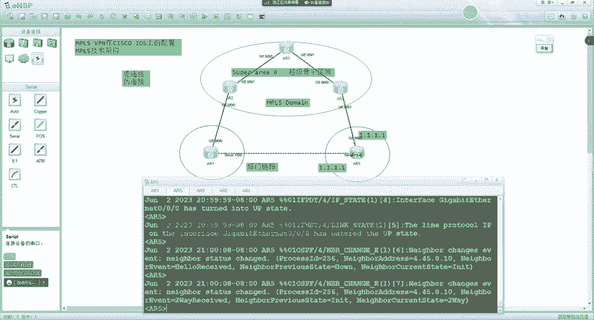

那我们休息一会儿。休息10分钟。十分钟之后呢，我们再来讲一下这一块。好吧，type3路由呃，在MPS的双规场景下。啊，怎么样进行返还呢？好吧。呃，休息10分钟，10分钟之后继续啊。嗯，继续上课了啊。

接着来说。呃，接下来讲的这就稍微来说比较简单一点啊，这个是在。嗯。呃，1个RD的问题啊啊也不是阿D，就是一个呃D影比特位的事啊。是这样的啊。呃。就是type3路由的防还啊，以下是一个例子啊。

就是有时候我们在这个MPS网络中呢呃1个CE可能是连接了2个P。那这个目的呢，有可能我们是为了这个冗余啊是吧？呃，提供更高的可靠性。所以说通过两条链路呢呃连接到两个这个设备上。对吧就连接到2个P以上。

连到2个P之后啊，我们来看一下啊。呃，这里呢会有一些问题啊，什么样的问题呢？比如说在这边有个1。0。他传过来了，然后我们通过VPV4给PE2啊，再通过VPV4给P3。对不对？呃。

假如说我们看P2这个方向啊，P2呢会把它以3辆LC的形式传递到C压。是吧那实际上C12这个3辆LC，因为我们这里都是去零啊，他会把3辆LC传递到PE3。那这里涉及到一个问题。

P3本身能不能从P1收到一条IBP的路由啊？可以对吧，但这边呢又传了1个OSPF的。他又选哪一个啊又选OSPF的。首先造成的问题呢是自由路径。对吧那如果这边有个2。0呢，他还要把2。0引入进来。

是吧那未来还有可能会导致路由回馈。实际上也就是说我们看在这里会不会涉及1个BDP和OSPF的双点双向。回不会啊？是会的吧。对吧。那有自油路径，还有环路的风险。嗯。这个问题怎么解决呢？

我们在IP的时候我不知道大家有没有学过这么一种方案。😊，你把路由引入进来，我在这边拒绝掉，不计算。那大家觉得有没有CA路径啊，对，一般不会还，但是有还的风险啊。是吧比如说P3不计算。不计算的不会加表。

就不会被引入进来。首先没有还路风险。是吧不计算呢，也不会有自由路径。对不对？是吧。所以说呢OSPF呢在这种场景下呢，他自己原生啊就能够提供方法。那他是怎么提供防还的呢？依赖的叫做DN比特威。他这样的啊。

依赖的是DN比特威。那这个DNA是这样的。比如说呢当我们把一条VPV4路由。引入到这是OSPF这微拼实力下的OSPF进场啊。就是把VPV4路由导入到VPN实力下的OSPF建成的时候呢。

这个路由会有一个DN比特之一。那一旦质1之后呢，C2呢，他把这个DN传递给P3了。第三一看是吧。这个接口呢。是吧在我的VPN实例中。而我在这个VP实力下的OSPF2呢，收到了一个DN等于一的路由。

P3就不算了。不算了呢，也不会回馈是吧？因为你不算不加表，那不算了呢，也不会有自由录音，对吧？因为你不算呢，也不加表。对不对？所以说OSPF呢在这种场景下啊，嗯他自己就能够实现这个方法。好吧。

就这个大家了解一下啊。呃，那这是三类的方法啊，除了三类呢，还有五类的。嗯，我给大家瞅一眼啊，我应该有这个做好的环境。

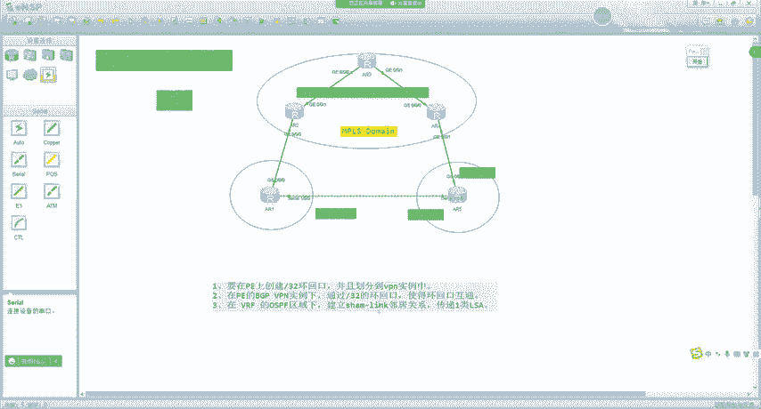

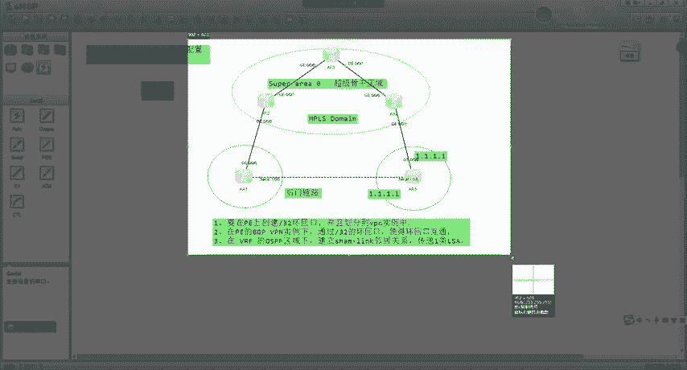

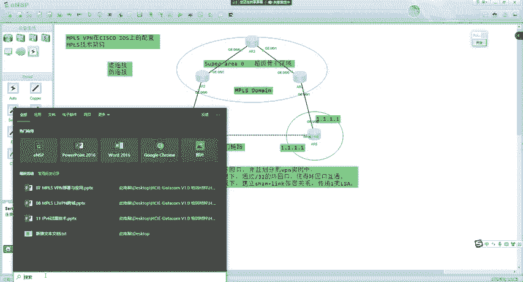

找找啊。嗯。在这儿。

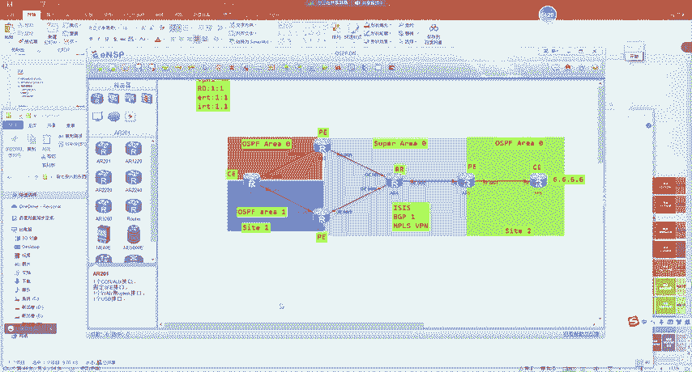

嗯，我先看一下啊，因为这个实验我也很久没开了。

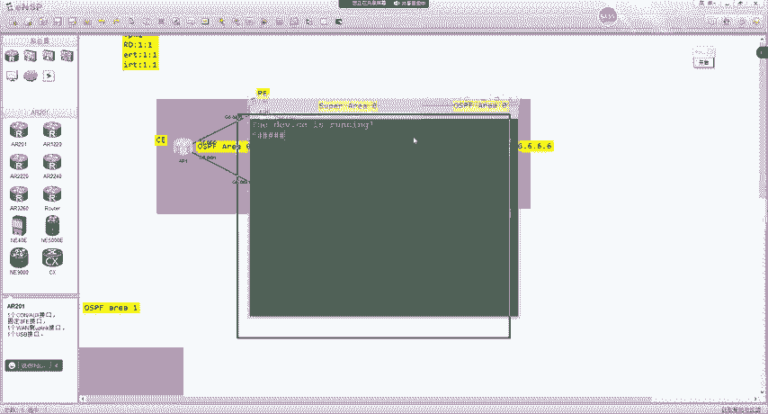

嗯。嗯，应该在6上，我记得。一下的衫哪个有还开扣。那等一会儿啊，等他开机一下。

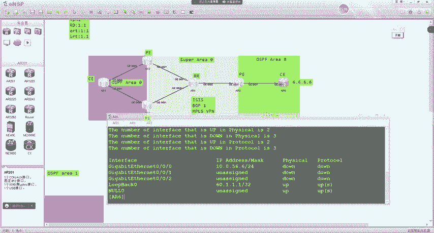

嗯，6这边有个60。1。1。1啊。这有个60。1。1。1。

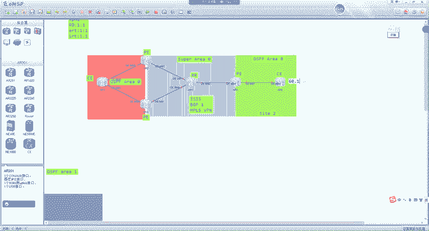

嗯，然后这是一跟3。有点慢啊。你也慢是吧。

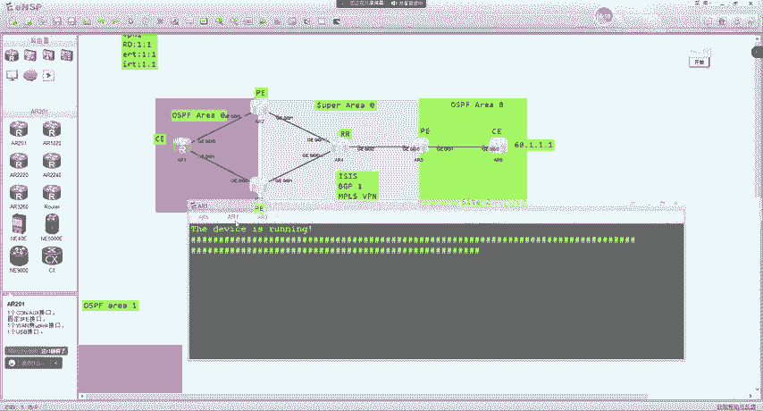

嗯。应该能打开啊。AR一般都能开啊。嗯。

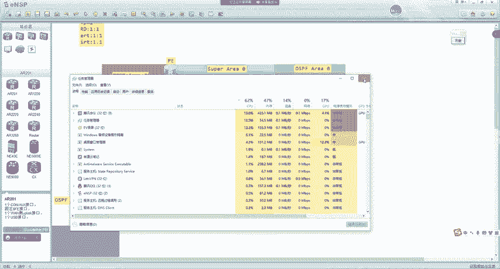

应该不至于打不开吧，好像没开是吧？嗯。好像还真没开。胃凉了吗。

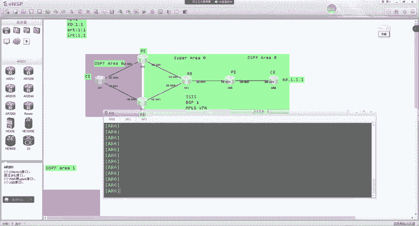

四开了吗？四也没开。我也没看。嗯，我们重新开一下，估计凉了啊。啊，你的也是样是吧？哦，我用的是笔记本啊。还行吧，60多。应该还算行啊，因为录屏吃的高一点呃，腾讯会议。啊，在电源使用。

但是那CPU也是他俩是吧？呃，但是我的viro box好像没有啊。0。2%。正常应该viro box用很多。我等他开一下，看能开吗？先敲先敲得敲一下课了啊。嗯。

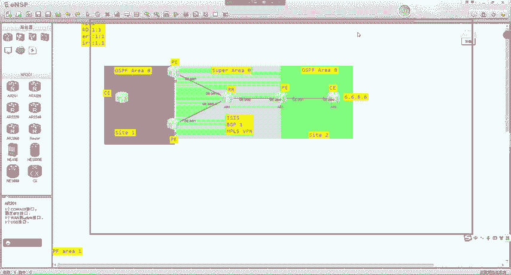

这啥情况啊？我单独开一台看行不行啊。

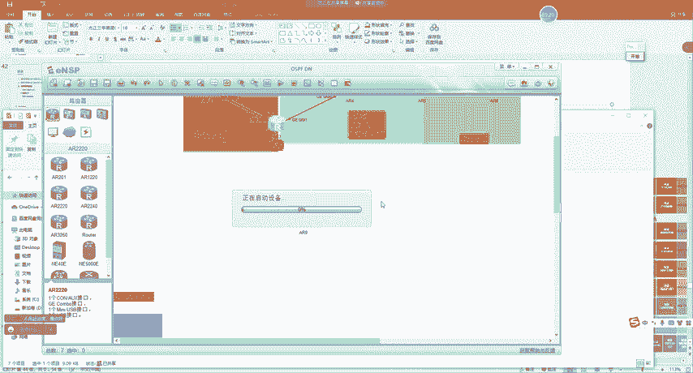

还不行。啊，没这个进察。没这个进程啊，我们再重开一下啊，重开一下，看行不行。我要把ESP卡了。嗯，开了之后，我再去点这个实验。正常我们刚开机之后啊，这个。vi了bo应该会很吃CPU啊。来了啊。

这次就对了啊。是吧，这次就对了。再等等他啊。换16。换成6是啥？

CPU啊。

什么。笔记本。啊，你意思是笔记本型号是吧？机器人。呃，好像还不行。

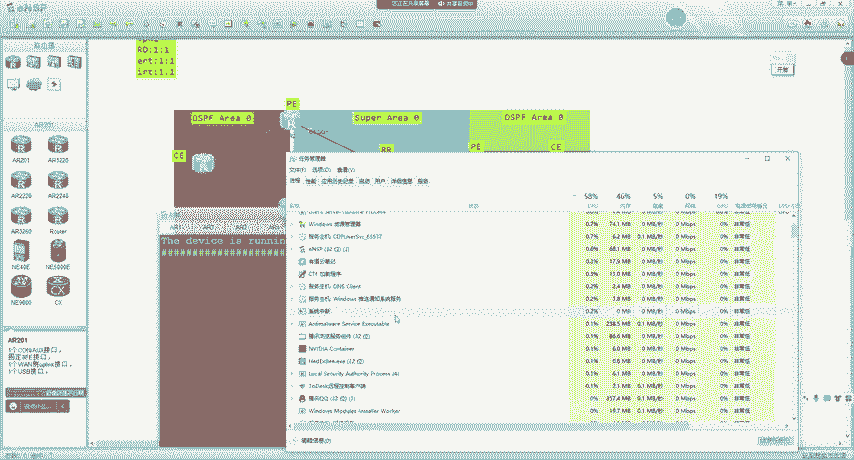

再等一下啊再等一下，看能不能开。嗯。我bo。

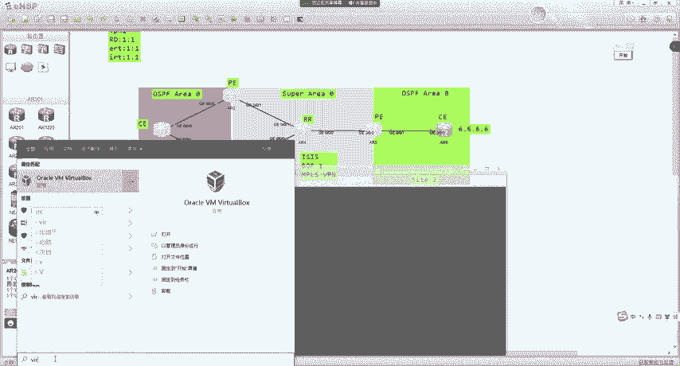

没食と。😔，嗯，vibo也在运行。有设备是吧，在运行。

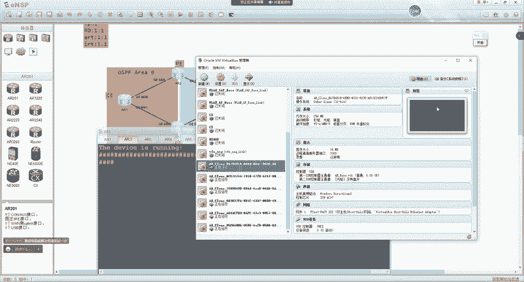

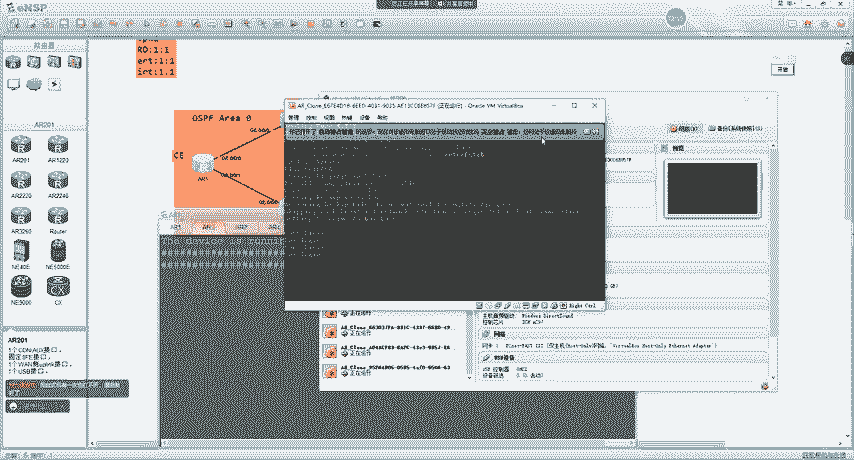

我可把它关了啊，关了之后我们。嗯。我看能不能重搭一个。也行，那咱们这个先不讲吧，下节课再来说这个啊，我看后面还有。后面就没了。后面没了。嗯，我看单独开1个AR，看能不能打开啊。好吧呃，能打开。

我们就自己敲一下。不能打开的话。😊，呃。我打开，只能下节课再来讲这个了啊。那电脑哪里得重启了？跨域可以讲是吧？跑一天了跑一个月了啊。嗯。🤢，呃，连着VPN呢连着呢。你是跟VPN有关系是吧？我现在退了啊。

我再开一个。但是跟微P有关系，刚刚应该就打不开了。是吧。

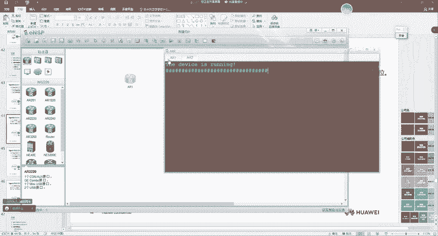

算了啊，没救了啊哎。呃，我们下一节课再来说这个吧。好吧，下节课再来讲这个啊。😊，呃。

但后面就没内容了，我看那个啥。

呃。后面有个跨域的。再讲就讲跨越了。这些大家都是比较熟悉的。呃，30分钟讲不完。行，咱们。先停一会儿吧，我先把录屏停一下啊。

