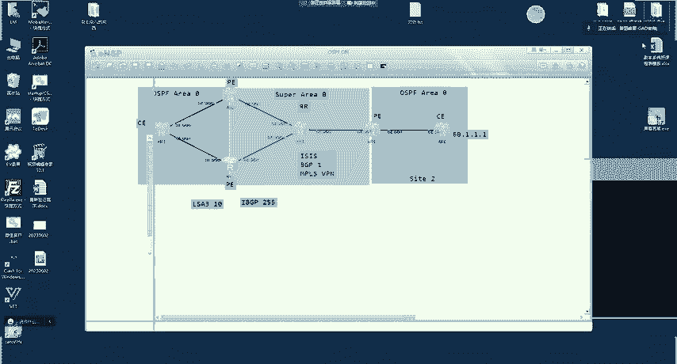
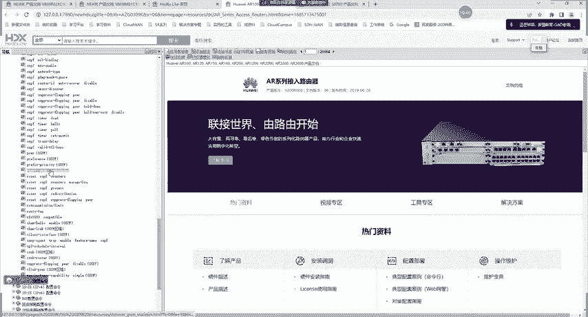
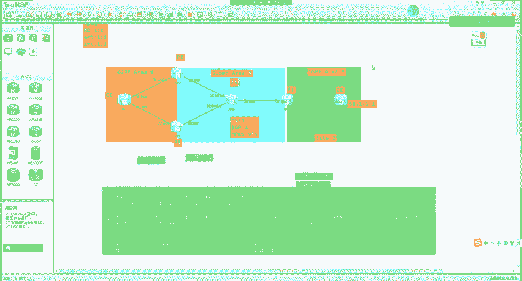
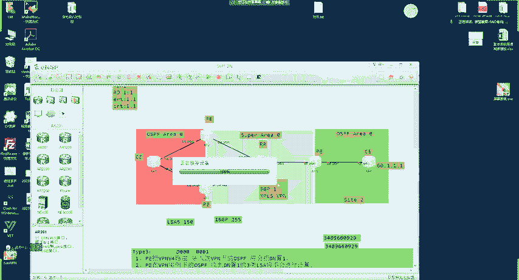
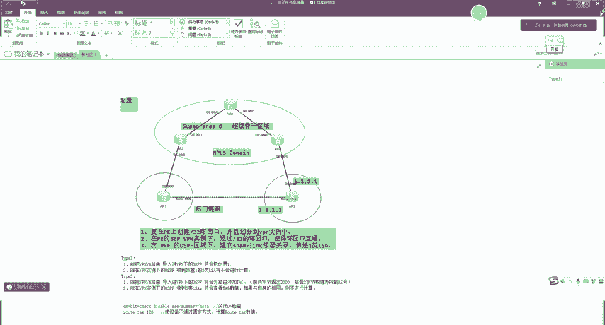
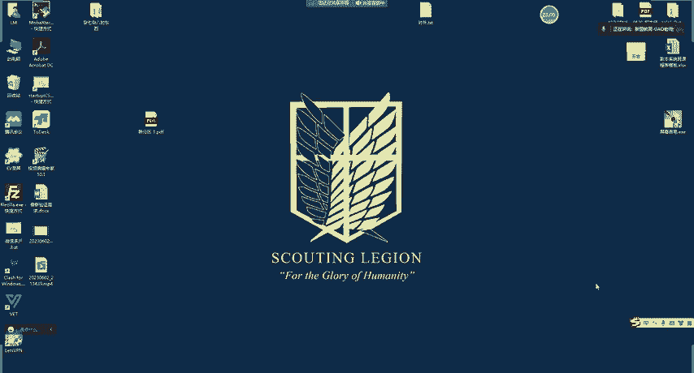

# 2023 新版华为认证HCIA+HCIP+HCIE全套视频讲解！一套视频让你从入门到精通！CCNA／CCNP／CCIE技术提升同样适用！ - P119：（持续更新）HCIE Datacom - 55.Shamlink、OSPF双归防环2 - -Book思议8 - BV1W8411A7z8

好呃，我们继续啊。然后我给大家说一下现在的环境啊。😊，呃，我们这边呢有1个60。1。1。1。嗯，然后A21跟A23这边呢，我得调一下啊，我记得。呃，这玉佩呢应该有一些东西得调一下。嗯。OSPF。诶。

二一。暗度。10。0。13。1。嗯。安度21。260network10。0。13。1。然后在三这里呢。OSPF1。嗯A real。and do network10。0。13。3。温度2有1，然后L有0。

嗯。应该是这样啊。呃，我把现在的这个环境啊来给大家说一下啊。😊，嗯，现在这样的啊，就是在AR6上呢，我们有1个60。1。1。1。呃，那这里呢我都做好的啊，就是这里呢是我们的一个嗯MP24的骨干网。嗯。

中间A24呢，我们是把它作为R的。好吧，呃，60。1。1的未来会传递RR会反射给2跟3。那这时候呢，对于二来说，他肯定能够接收到这个60。1。1的VPV4路由，对吧？而且导入到VP1例容。呃。

我们在AR2的OSPF技能下呢。去引入了BDP。对吧所以说它会产生1个30LRC60。1。1。1。对不对？二产生的。那这个LC呢会传递给A21A21呢会发送给A23。对吧。那A23呢。

它本身从R也能够收到1个IBDP的路由优先级是255。嗯，这时候呢，他又收到了1个OSPF的LI3，有原先你是10。呃，都会加入到他VP一的录音表中，对吧？所以说我们看123的啊，他的LTB呢可以收到。

嗯，A2产生的60。1。1。1。对吧。那正常我们理解的话，A23应该是怎么样的displayIPingtable。对吧应该会加这个OSPF导致一个自由路径呃。

我们发现呢这里实际上他学习的是IBDP路由啊，这里是为什么呢？是这样的啊。呃，我们来看一下A23。Thisplay OPF LDB。产生的这个60。1。1。1呢，我会发现他有一个DN比特。

对吧这电影比特就是在这种双归属下用于方还的。因为我们考虑到这个环境啊，就是你二呢。

就二呢，他把OSPF引入进来，未来也要把OSPF引出去。三呢，把OSPF也要引进来，也要把OSPF引出去。这里涉及到一个双点双向。对不对？那这样怎么办呢？就是你路由传递到A23之后，A23没有计算。

对吧？实现一个防还的作用。那防还作用的体现呢就是在这个电影比特上，它是这样的啊，就是当我们的这个PE呢。对呀，他的处罚原则是这样的，就是P8VPNV4路由。导入境，注意啊是微P实力下的OSPF。

将会把DN。Zhiyi。注意要一定要是唯凭实力下的。如果没有违平实力啊，呃传统的OSPF就public的没有DN的作用啊。DNA在那个场景下不体现作用。好吧，就是专程在这种场景下有吗？那。

第二步就是PE收到。或者说。在微P。下的。实力下的。OSPF收到DN至1的。三类。RIC将不会。进行计算。对吧所以说这时候我们可以在山上看到他优选的路由呢。嗯，是一条IBP路由。

但这个我们可以通过命令调整啊，比如说我也可以让三算。呃，单照三算的话，那他肯定会有催路径了啊，就这个呢默认都是做好的，咱们不需要做其他的配置啊。但大家知道有这么一个比特。😊，嗯。

比如说我现在呢是做一个这个呃叫做DN比特检查好吧呃，diciable针对于3辆LC呢，不让他进行检查。那做完之后呢，我们再去看一下路由表。你会发现呢，他加表的就是OSPF了。那这样导致A23呢。

可能访问外部网络的，它是绕了这个区域内部。啊，同时我们把OSPF还引到了BDP对吧？又有一个路由回馈的风险。好吧，就有命令的，能够让你调控啊。嗯。但是呢一般我们不会去做这些命令啊，这里大家知道一下。

好吧。呃，这是type3LIC的防还原则啊，就3类LC。是吧那除了三类呢，还有五类。对，因为PE呢他要不然是以五类的形式引入进来，要不然以三类引入进来。5类我们之前学到过有一个tag啊。

比如说我过去的时候打个tag啊。是吧呃，回来的时候也打个t。那这样能不能返还？比如说有这个tag，然后我在这边拒绝掉。能不能？是可以的。对不对啊？呃，比如说我现在在六这边啊，我写一条。

如uter stand taste。192。168。1。0。是吧，然后我在OSPF下呢引入它。呃，引入之后呢，在二这边呢，D四BTPVPV42如table就有一条198。168。1。0。那这个1。0呢。

他会根据你那个。就我们说的还原原则嘛，在192。168。1。0。嗯，我们来看一下，他发现是5类LC啊，不对啊，是5类LC对吧？IT嘛刚说的。是吧所以说在这时候呢啊它会还原成5类LC。😊。

那他在还原的时候也是一样的。比如说我们再到二场来看一下呢，displayOSPFRSDB。在192。168。1。02产生的5类。他会传递到三这里，传递到三之后呢，就接收到1个LIC5嘛。

然后优先级也是是150的。但IBP呢是255。那如果我们在进行比较的时候呢，还是优选这边的。那这个怎么样看效果呢？比如说我们通过呃录由表去看。你发现他选的是谁呢？呃，选的还是这个A23。不是不是啊。

选的还是IBDP路由啊，不对啊，还选的还是IBDP路由对吧？1。0。😊，这里又是为什么呢？嗯，我们来看一下啊，就是它产生的这5类LC呢，比如说我们diplayOSPFLDBASE嗯。😊，60。1。1。

1。第四类OSPFLDB。AE。啊，对，192。168。1。0。对吧我们看这1。0呢，这是二产生的啊，我把它复制出来。😊，我们发现啊就有一个特点，就前面这些我们都比较熟悉啊。

比如说类型啊是吧巴拉巴拉一大堆的。😊，啊，对，搞乱了啊，搞乱你就算了。我们主要关注的是在这里啊，它有一个tger，我们发现很大是吧？之前学到的就老是默认tagger是一啊，这里怎怎么那么大？😊，对吧。

这就是他返还的时候用到的一个值。就是这个tger。他是怎么样的呢？他是这样的，就是type5的路由呢，它的方屋还是这样的。一步呃，就是P把。呃，VPV4路由。导入件。微片下的。OSPF时。将会。或者说。

填充。将会根据。自身。2号。填充这个。太个值。或者说。江会i。修改或者说为路由添加tger。那我们看到啊这个tiger很大对吧？34899什么玩意的又很大。是吧。那他是怎么样返还的呢？

首先我们来搞清楚啊，就是他添加的逻辑，它添加逻辑是这样的啊，呃，设备呢会根据自身的AS号进行添加。😊，呃，他有一个原则，我给大家瞅一下啊，嗯应该是在这个。手册里面有一个介绍啊，嗯大家可以去找一下。呃。

应该是在。我找找啊，我得找找，因为记不太清了。嗯，在这儿好像。没有，应该是OSPF的命。OSPF。

嗯，如t啊，在这啊，我们来看啊。他会有一个原则啊，是这样的。呃，就前两个字节呢为。0啊，D000，因为AS号一共是占了。呃，不对啊，tag一共是占了4个字节嘛，对吧？前两个字节呢为D0000。

后两个字节呢为本端的ASR。那这时候我们来计算一下。比如说在二这边呢，DplayBDPP。呃，2的AS号呢是一。对不对？那他是这样的啊，前两个字节是D0000。然后后面的呢是0001。对吧。呃，证。

这一个字节，两个字节，三个字节，四个字节对吧，一共是四个字节。然后我们把这个数呢呃再去变成这个。就转换成十进制啊，你就能够得到他的。这个原始数了，这个我们得找计算器算一下啊。

就你把这个数呢转换成十进制就出来了。嗯，我们。成员嗯，找到这个十六进制啊。好，现在我们输入D。000，然后是0001。对吧这是他的时践之书，然后我们给他复制出来。你发现是不是一样的？对不对？

这就是他的智慰方式啊，就是添加tg的方式呢，就是。前两字节。固定D000。后面二字节。取值为P的S号。是吧。然后那这个50LC呢，最终就会传递到下面的PE3上，就是PE在微P实例下PE收到这个。

呃OSPF之后呢，收到。5类LC。或者说。5类LC。江会。查看tg值。数值。如果与自身的相同。则不进行计算。那现在我们来算一下，就是在A23上，如果按照这个固定的原则，A23也属于AS1啊。对不对？

那他最终取算出来的数值因为一样，跟这个路由的。一样吧，就路由的t克是跟自身的相同。那A23呢就不会去计算这条路由了。所以说我们可以再看到A23上呢，实际上加表的是VP1。对吧，但这个我们也可以去改啊。

你可以在三上呢去修改它的这个tag。对我们通如果如t呢比如说我敲123。呃，123的目的呢，就是我们不让他自动计算，自己去配一个。敲完之后呢，我们再来看一下。啊，不对啊。叫颠比特。呃，检查diable。

嗯，我们把外部路由的也给他关了。然后第四类IP入庭推VP实例一你发现呢就是这条5类LC加表了。所以这个大家能明白吧？好吧，那大家可能比较疑惑的一点呢，就是老师啊，你刚刚除了修改了root tag呢，呃。

你怎么还关了5类LC的电影检查呢？😊，是吧这里我给大家说一下啊，就是我们如果真正去看这个50LC的话。你会发现啊。嗯，ASE。他除了如the泰ger呢，他还有一个电影比特。

对吧就DN呢也能够实现5类2的返还。所以大家能够明白吗？就是当我的ruuter tag检查匹配不出来之后呢，对吧ruot tag防环检测逃过了，但是这里呢还有一个收尾的是DN的。😊，对。

就大家可能比较疑惑的是什么呢？就老师啊嗯。😊，就是我都有如太了，还要电影干嘛呢？嗯，这样我跟大家有一样的疑惑啊，后来我就想明白了。😊，呃，这个呢他可能是这样的，就之前我们的解决方案不都是基于tg的吗？

😡，是吧。呃，可能在之前呢，我们没有这种以3。LC的形式进行还原的时候。那时候就只有tag。所以说呢我们依赖tag，假如说啊就是没有那种还原成三列，就是那种技术还没有出现的时候。

对吧那我们只能还原成五类。所以说5类LC呢，我自己制一个tger实现方还。就完成了。但是后来呢，我为了想让MPSSVPN的业务卖的更好卖的更好。所以说我提出了这种三类还原的技术，对吧？

就我们刚刚所说的这种特点，但三类一旦还原呢，三类没有tiger，对吧？所以说后面又设计了1个DN。😊，对吧那这个DN呢也给5类直接用了，就双重保定嘛。所以大家能懂我的意思吧？这意思大家能够明白吗？

明白敲一啊，可以吧，这应该跟这个技术的发展历史是有关系的。好吧，但我们只需要去学习它的特点啊。这里呢大家只需要知道两条命令啊，就这个呢我们不需要去配。嗯，但是呢大家要知道这个特点。😊。

就是有面令能够修改。就是我们可以针对于比如说ASE啊。sumary啊。对吧呃，或者说期类呀啊嗯相当于这种呢是关闭。DN检查。对，然后下面这个ruot tag呢是修改木。或者说1。设备。不通过。固定方式。

计算。说他太一个值。对吧那因为默认是这一种吗？对不对？对电影检查默认是开启的。好吧，我们有办法给他去关闭。啊。嗯，这就是OSPF下的防还啊。当然我一讲OSPF肯定会有同学去比较疑惑，对吧？呃。

老是ISS又怎么样啊，对吧？BDP又怎么样啊。嗯，这里我给大家说一下，就只有OSPF有特点。如果你这里要跑SS的话。😊，呃，你得用宽度量，你这边打个嗯t100，这边把tag00拒绝掉。大家能明白吗？

然后你这边引入的时候也打给tag100，然后这边再把tag100拒绝掉。多少啊，打打200啊，然后这边把200拒绝掉。就是这个ISS呢，它不像OSPF那样做的那么周到哦，因为他俩的这个应用地位不一样。

😊，或者说呢这个技术的定位也不一样。SS呢一般用于在比如说我像MP4的这种承载网啊，底层的IP我一般跑IS。OSPF在企业内用呢啊他就要涉及的这个企业场景要多一点，对吧？但是ISS呢就没有这种特点。

好吧，所以说如果你真的要用ISS在这对接的话啊，你要考虑到这个问题。但是一般我们不会去遇到啊，这里用ISS对接的，好吧，一般就是BDP或者OSPF那BDP就更简单了。因为BDP你这里肯定跟他不同的A啊。

你传过去有A1的A号，你回来肯定回不来了。😊，对吧那BDP的防还就更简单了啊，然后这边传过去，这边也回不来了。😊，好吧，就ISS呢，你得手动去做SS没有那么周到啊。SS在这里呢就一个双点双向路由引入。

跟之前的解决方案一样的啊。😊，嗯，好，这个我们就说这么多啊，这里大家都明白了吗？😊，明白敲一啊。都可以吗？可以是吧。王总啊。呃，看下，你把这个实验做一下，6位同学。😊，好吧，把这个时间一做。

你们就明白了。😊，嗯，今天咱们就讲这么多吧，下节课再讲这个话越啊，今天讲不到了。😊，嗯。没其他内容了，就一个就五类跟七类是一样的啊，他俩的逻辑是一样的。😊，啊，通过roott你可以去设置。呃。

这slink咱们也说过了。😊，嗯，下面有俩四个考题啊，我们把这两个看完就下课了啊。😊，呃，第一个呢就是MP4VPN组网中啊P项。OSPF引入其他P学来的VPN路由的时候。呃，可以产生几种LIC。

是吧这个刚讲过啊。就是这个PE从其他的PE接触到路由，然后导入到OSPF。会产生几种LC。啊，357。对吧啊，就BCD啊，7也有啊。其只不过我们没做实验啊。如果你那里比如说我们在这里。

这里如果是个拉萨区域呢。是吧。那他就期了呀。能不能明白？然后我们再来看啊。呃，CE通过BDP传递路由给PE的时候，会可能会携带SO属性。注意啊，CE传给PE。有没有SO？SO是什么路由打的？

VPOV摄路由。啊PECC之间传的都是IP4路由，所以说他俩之间传肯定不会有。对，这个场景应该大家还记得啊，上节课刚说的。😊，是CE把路由发给我，我给他打一个。但是当我想把路由发给这个的时候呢。

我一看是吧，你俩一样，那我就不发给你了。他是这么一个逻辑啊。😡，好吧，所以说啊这里传的都是IPV4路由，这里是不会有SO值的。😊，能不能明白这里是不会有的啊，什么时候会有呢？这个PE传递给这边P的时候。

可能有这个P传递给其他R的时候，可能也会有。😊，但是呢呃PECCE之间，无论是谁跟谁传，都不会有SO值。所以这里应该是错的啊。这里BCD这里B吗。😡，我看答案啊。啊，也是的。好吧。好，同学们。

我们今天就讲这么多吧。😊。

今天就说这么多啊。嗯。啊，那个面令没到讲的时候啊。

呃，咱们今天就说这么多啊，然后这个实验的话，大家课一下，我建议你们自己自己去做一下啊。😊，呃，就是我们在MP4学到的这个实验可能比较多，对吧，场景也比较多。

嗯，所以我建议大家平常去做做实验啊，给你们熟悉一下。好吧，然后下节课我们讲的技术。可能还不是特别难啊，但是下一节课。呃，可能就难一点了。好吧。嗯，好，做好心理准备。好回来给讲跨域了啊。😊。

我先把录屏顶一下啊，咱们今天就说这么多，准备下课吧啊。😊。