# 2023 新版华为认证HCIA+HCIP+HCIE全套视频讲解！一套视频让你从入门到精通！CCNA／CCNP／CCIE技术提升同样适用！ - P11：HCIA - 11 - OSPF（上） - -Book思议8 - BV1W8411A7z8

呃，行，我们讲完今天的最后一部分啊，我们今天讲的静态路由的最后一部分，我给补充到啊就写在这儿吧啊，我们叫做浮动静态路由，这是我们嗯它的名称。呃，何为浮动静态路由呢，我们把这样的一个路由的配置方式。

或者说这样的一种方法，我们称之为叫做路由的备份。也就是当我们未来呢我去配置了去往目的地的一条路由。那如果未来呢它出现了一些状况，我希望有一个备份的路由能够帮助我继续进行数据的转发。

那么这就是我们所称之为的浮动静态路由。也就是未来呢在我们整体路由加表的时候，我们去做一些控制啊，进行一些控制。呃，那么怎么实现呢？我们要先去嗯讲一个场景。你说我们讲到场景的时候。

必须要结合我们真正的项目上用到它的一个环境去讲。不然的话大家理解它会觉得很枯燥。所以咱们今天呢要首先先来营造一个环境。比如说我们。今天呢是依旧是三台设备。啊，三台设备，这是三台路由器。

那么分别代表着我们不同的地方啊。下边的这个呢代表我们作为公司来说呢，未来我们公司出口的一个网关，下边的设备我就不画了。比如说你们下边呢接一个交换机，下边可以接很多终端，下边咱就不画了。

未来你们公司下边所有的PC呢，要去上网，都会走你们公司的这个出口网关。那未来呢你们公司说如何上网呢？你肯定要去办理运营商的业务，对吧？你得办理运营商的业务，那什么叫运营商啊？电信移动联通，这都是运营商。

那通常来说呢，我们再去办理我们所谓宽带业务的时候，尤其是面向规模比较大的公司。我们往往不会只办理一根，也就是不会只办理一个业务，通常我们会去办理两个运营商的宽带。呃，比如说呢我办一个电信的。

我办一个电信的右边呢，我比如说我再办一个联通的呃，我希望呢可以做到一个备份。比如说为什么呢？你说呢我我公司里边下边可能很多个人，假设咱就100个员工吧，100个员工如果我只办理电信一个业务的话。

未来下边100多台电脑，我全部都走这一根线。那如果万一未来我这个接口出现了问题，或者有可能呢对端出现了问题，总归我这条线路可能存在问题。那一旦我只有一个单线路，我们就要必须考虑到我的单点故障的问题。

这就叫做单点故障。如果我现在这一条链路呢出现了问题，那你会发现在某一个时刻，我们公司内部所有人都没法上网了。因为我未来访问互联网中所有的业务，是不是都要经过运营商的设备啊。

也就是运营商给你提供的接入服务。那你会发现一旦产生这种情况，你此时呢公司的业务肯定会造成中断的那至少你要等待整体的链路维修完毕以后，你才能上网。所以你说呢公司。你们公司体量比较小。

可能呢一0个人甚至再小点七八个人，或者呢稍微大一点吧，二三十个人，你说单线路也就罢了。那你的公司规模也就在这儿了，就意味着你整体的业务辐射范围也就在那给你造成不了多大的经济影响。但一旦你的规模比较大。

你必须要考虑到，由于我们的线路故障问题对你的业务造成的损失。所以往往规模比较大的情况下，我们都会考虑双线路的接入。也就是我不仅仅只办联通的业务呃，只办电信的业务，我也会去办联通的业务。

那咱们首先呢呃先说一下，首先我们先给设备呢给他写一个互联地址。比如说咱就随便写了啊，比如说这边呢是10。1。1。1，那我下边呢作为网关来说，我跟他互联得在一个网段里，我是。2。比如说呢右边这是20。1。

1。2啊，上边是20。1。1。1。互联地址呢首先给写上。也就是未来呢大家会发现，我无论想访问互联网上的哪个业务。咱们想一下啊，作为网关来说，你看我以后想访问的地方有很多。

比如说呢我公司的员工日常想访问百度，其次呢我日常想访问腾讯啊，我要上微信吧，那我要查百度吧，包括中午吃饭的时候，可能我要去手机，我也连上我公司的网络，我刷刷抖音吧，我都要去访问，包括日常吃饭的时候。

开个小我们所说有的时候还能斗个地主啊等等来说，比如说我还要看爱奇艺啊等等。这都是我们的一些访问需求。但是大家会发现啊，面对于你想去网的不同的服务器，也就是你访问百度，你要访问到百度的服务器吧。

腾讯是腾讯的服务器。那么他们是不是每一个的地址都不一样啊？咱们上节课固然讲到了静态路由。但是静态路由它是怎样的一种配置形式啊？比如说未来我想去往百度啊，百度的这个网段的地址，我要怎么样写百度的掩码。

然后呢加上下一跳啊，对吧？吓一跳，吓一跳是谁呀？我现在公司如果想要有流量出口，吓一跳都是电信，对吧？吓一跳都是联通，所以你会发现现在如果你去写的话，怎么写呀？百度吓一跳是电信，然后是什么呀？

你腾讯去往腾讯，然后你还后缀上腾讯网段的掩码，然后呢，吓一跳啊，吓一跳哎，是腾讯啊，吓一跳是电信，你去往抖音下一跳是电信，你去往任何一个地方，吓一跳是电信，大家觉不觉得这样的配置方式很繁琐。

再者说实际上你想要去拿到。所有的我们公网上的服务器的地址以及掩码的信息，这是不可能的啊。很多情况下，你在访问一个地址的时候，你是没有办法知道它的掩码是多少的。所以你会发现我们现在整体在我们所说网络中。

你在访问互联网业务的时候，你根本不是靠一条一条精确的路由访问出去的。那你说老师如果我没路由的话，我不是这样配的话，我怎么把这个流量发出去，怎么发出去，我们今天会讲到一个路由的形式叫做什么呀？

有没有才知道啊，叫做默认路由，什么叫做默认路由啊，既然我现在要去往任何的公网上的任何一个地址，我都需要下一跳走电信。你看我不就这一条线可走吗？假设你先别看联通啊，我就这一条线可走。实际上就是我去哪儿。

我都要走你呗，这就像是什么呢？就像咱们以前看的童话故事一样，这是一个房子，房子门口呢，这有一条路哎，然后呢他先要通过这条路，然后这边有很多的路口，你可以出去。那你。没必要写个。

比如说你要从这个房子里出去，你要到菜市场要往前走，然后你要到什么学校往前走，你要到教堂往前走，实际上你去哪儿不都得先往前走吗？大家能理解我这意思吗？也就是不管你要去哪儿，你都要先从这里出来。

那实际上你就可以写一条，比如说你在地图上怎么画呀，去哪我都要往前走。对于我们路由来说，不管去哪儿我都要去电信，这不就完了吗？当我流量未来走到电信的设备上以后，那么由于它可以为我们我们所说呢。

为我们进行全网全公网范围内的数据转发，那么会由他帮我们进行寻址和转发，也就相当于此时呢并不需要我们的设备中去存放一条一条的路由信息，那么可以由我们运营商的设备代劳。那也就是作为我们办理它的业务。

实际上我们只需要写它写一条路由。然后呢下一跳指向它即可。咱们今天不讲封装啊，这个封装没有关系。好吧，咱们今天已经讲到路由了。呃，我们IA阶段中所有要掌握的封装，你们只听我在课上讲的就行了。

以后你们到了IP几乎很少会听到封装这个词了。以后呢，到了IE理论，你才么才会接触到了啊，不会接触到更多跟它相关的了啊，太理论了。呃，行，这是我们以上的这个部分。我首先说到这儿，大家能理解我的意思吗？

那就是我想表达的是未来我们要去做出口写这条路由的时候，我们不需要写成千上万条的路由指向下一条指向电信，而我们只需要写一条这条路由叫做什么呢？它就叫做我们的默认路由，也叫做缺省路由，你叫做缺省路由。

那么它怎么去写呢？我们以0。0。0。0，并且呢掩码也是零的这样的形式来表示我们的缺省路由。之前呢我在讲咱们我给大家看一下，在讲我们IP地址的时候，我记得记得跟大家讲过4个零的地址。还记得吗？

我说呢当时一个作用是未指定的地址。以后我们在讲到DHCP的时候，会跟大家讲到这一点，咱们IA中也会涉及到啊DHCP它在发送报文的时候，会涉及到原IP地址的封装，这个是以后的事情了。

那么我们今天实际上就讲到了在我们路由层面上4个零可以代表全网所有地址，这是之前讲的特殊地址。那么我们今天就讲到了全网特殊地址，全网的所有地址，我们用4个零来表示。也就是未来我在网关这呢可以写一条路由。

我去往任何的地址，任意的掩码，我的下一跳是多少啊，下一跳是电信。比如说呢我这又卡了是吗？我看一下啊。哦，我这确实是卡了，可能有人在用在下东西呢啊，可能在下东西。呃，我们这晚上同时呃不是软件。

是我的网的问题，看得到吗？我这有点标红啊，我们晚上好多老师在同时讲课，好多安全的课linux课以及思科的课都在讲。所以我们竞争网有点激烈，有点激烈，理解一下啊呃，不耽误不耽误，咱们回过头来说啊。

我去往全网的任意一个地址，我的吓一跳都是10。1。1。1。没热点可开，我的工资，我的工资不够覆盖热点的钱啊，10点1。1。1。好，也就是未来我在网关这里呢可以去配置一条静态路由。

我去往全网所有的地址吓一跳，都指向电信。你看啊都指向电信。好，那一旦我配置了以后，未来我甭管是去百度啊，去腾讯去抖音啊，我的流量啊都走左边，也就是都这样走。好，都这样走。好，那么我们讲到这儿。

我先问大家能听明白吗？也就是首先呢我们未来去哪儿，你就甭管了。电信后边肯定有非常多的网段。讲到这儿，你们先要理解。行，那理解了以后咱们就往外说往后说。那你说老师右边这个联通是干嘛的呀？我刚才解释过了。

也就是作为企业来说呢，你虽然现在办理了电信的业务日常流量都走这儿了。但万一这条线有一天呢它断了，嗝屁了，我们整个流量就出不去了，你就断网了，这是不行的。所以我们现在要用右边这儿呢，再办理一根。

我们所说的宽带业务，我也要上网，那我去办理一个备份。😊，那么一旦我们所说现在的双线路，它也是备份，那么我怎么写它的路由呢？也是一样的。我希望未来呢去往全网的所有地址吓一跳是多少呢？吓一跳。

我希望它是20。1。1点1也就是我希望呢未来我们走联通也能够去往全网的任意地方。好，我们把它也写上，也就相当于什么呀？我现在这个设备上有两条静态路由，两条默认路由。好。

两条但是你说两条它会产生什么问题呢？那这已经写了两条静态了，相当于呢我把它的含义写在这儿啊，以后呢，不管你去任何地方，你的下一跳都是电信。并且呢不管你去任何地方，你的吓一跳都是联通。

大家觉得这样写有问题吗？啊，其实这样写呢，首先它是没问题的。走哪个非常好，这个问题非常好，走哪个。如果你现在写了两条默认。那么它带来的结果将会是负载均衡。呃。

这个词呢大家先听即可以后你们到了IP呢会详细学习路由的逐包逐流的负载，到时候你们才会学，那在IA中呢，大家首先知道这个概念，也就是流量呢，它根据我们自身的一种哈希算法，它可以实现的两端流量都走。

但是呃具体的算法我们就不讲了，两端都会走。也就是流量既走左边也走右边，那么它整体是负载均衡，流量两边都走。呃，我们所说呢流量两边都走会产生什么问题呢？我们首先来说，如果两端带宽，我们所说一样的情况下。

比如说现在两端我办理的带宽一样的情况下，我现在呢一共要跑100兆的数据，注意我一共要跑100兆的数据，什么意思呢？那就是我左边跑50兆，并且呢我右边也跑50兆。你会觉得呢是没有任何问题的。呃。

这个呢有的同学可能会之前想到过，你们学过OSPF的话，有的时候会把这个跟那个cos值呢呃有关系。就是你们会联想起来。呃，但是我在这里告诉大家，这个负载均衡跟cos没有关系，因为这不是OSPF。

你们不要往那个方向去联想，但是我们所说呢PC只有一个默认网关，这个这跟PC没关系。同学们，你们的网关在下边呢，这是你们的网关，你们PC的网关配在哪儿啊，配在你们内网口上。因为你们的网关地址在哪。

在这个位置知道吗？在这个位置，这是你们的网关网关地址，在你们的内网口上，这已经是涉及到你们出口网关办理的联动联联通跟移动的业务上了，这已经是我们的公网了。当然我这配置的地址，大家发现了吗？

是不是不能配实网段的呀？因为实网段是啥，你们还记得吗？但是咱们只做一个我们所说只做一个演示啊，因为实网段是不是私有地址啊，也就是你们未来到项目上，不会是给你十0个地址的，能明白吗？只是我作为一个演示呢。

告诉你们啊，没错啊，这是A类的私网地址吧。呃，咱还没讲到OSPF先回过来看这儿啊。😡，呃，我跟大家说的是请请注意我的问题，请注意我说的话啊。也就是如果你现在两端带宽一样大的情况下，咱们负载均衡。

其实没有什么问题啊，是没有什么问题的。但是往往在我们实际工作中呢，两边的带宽通常是不一样大的。嗯，你们知道为什么吗？知道为什么不一样大吗？因为两端呢带宽。如果你都办高带宽的线路，它比较贵，它是比较贵的。

所以一般来说呢，咱们会办一条主线，办一条备线，日常我希望流量呢都走主线，备就是备份的意思，都走主线。比如说现在呢我就把电信这条线路呢设置成主线，这是我们的主线路。我买多少兆的带宽呢？比如说我买500兆。

那它肯定会更贵一些。我想把右边联通呢，它设置成备线路，也就是备份线路。呃，备份吧，备份线路，也就是我要把它做成备份。那我买的是多少兆呢？比如说我买的是200兆。好，我买的是200兆的带宽。

所以你会发现现在呢我们整体左右带宽就不一样了。但你说老师不一样了又怎么样呢？会有什么问题呢？会有问题。那么现在如果现在我们是这样的一种，你买购买的形式。那么此时两边的带宽就不一样大了。

那如果此时你还是写两条同样的默认路由是不可以的。因为它还是会负载均衡，请大家注意，你买的带宽呢是你买的带宽，但是你配的路由是你配的路由。你的你的整体数据在基于路由表进行查表转发的时候。

他可不管你这个线路的带宽是多大，他是不知道的。那我只知道呢，我查询路由表进行数据转发。所以我依旧还是负载均衡。那负载均衡产生什么问题呢？假设现在我总出口的流量是600兆，也就是我下边总体的设备啊啊。

我下边公司总体的我们数据是600兆的数据好，我写的对的不太齐好，我稍微把它对齐一些，我确实有一点有点强迫症啊，我给它对齐一下好。好，600兆。也就是现在呢600兆的流量要通过网关呢。

我们所说上公网啊上到访问我们互联网。那600兆的流量怎么分配，大家知道吗？既然是负载均衡，我刚才告诉你们，100兆的流量左右两端各走50。那么对于600兆来说呢，不是备好不好分数据了。没错，是一人一半。

也就是现在呢对于左边来说呢，我跑300兆啊300兆，右边呢也跑300兆。但是大家请看我右边跑得了300兆吗？你会发现呢，对于我左边主线来说，由于我带宽大300兆对我来说绰绰有余。

我呢轻轻松松能够给你跑过去。也就是我左边链路还有空闲。但是你看我右边呢，我右边总带宽就200兆，你给了我300兆的数据，那么我线路就卡死了，我是承载不了这么多流量的。那么我肯定会造成数据的丢失。

并且链路会有卡顿卡死的情况。所以呢当我们两端的带宽不一样大的时候，你是不能配置成负载均衡的。大家一定要注意这一点，你不能够配置成负载均衡。因为你要考虑到我们现在今天所说到的这样的一个问题。呃。

那你说老师那怎么办呢？解决的方法是什么呢？解决的方法就是配置我们的主备链路啊，配置我们的主备链路。那么你既然有主线路跟备线路，那么我们现在配置要把它配置成主线路，把它配置成备份线路。

也就是我希望呢平时走主线路。平时走主线路，呃，不能分片嘛，这跟分片没关系。同学们，而是我现在整体链路的总带宽的问题。总带宽。也就是我对于我来说每秒我究竟能够承受多少的流量流经我这跟分片就没有关系了。

这是主线和被线的问题，主线和背线，我希望呢平时来说呢，平时平时呢我走主线之后呢，我如果主线断了主线出现了问题，那么我在走备线，这是我们想说的一个我们想的想的一种解决方式。那么我们如何去进行设置呢啊。

我们要进行如何的设置，我们要在路由这呢做一些手脚，也就是我们现在会通过上一节课跟大家讲到的，我们有一个路由的优先级的问题，有一个优先级的问题。也就是我可以通过优先级来调整我们路由的一个加表。

大家还记得吗？当我们去往同样的一个目的地，同样的掩码的时候，我们是不是会选择选择性的加表了。还记得吗？我如果我们所说呢路由加表的时候，我的目的地和掩码信息一模一样的话，我是不是要去比较一下优先级呀？

还记得这个问题吗？啊，如果一致的话，我要比较比较的是优先级。呃，如果这是我们所说上一节课讲的东西。所以我们今天呢就在优先级上去做一些手脚。那么对于我们来说，华为里边我们叫做优先级。思科里呢叫做管理距离。

并且呢因为咱们讲华为我就不提思科了，静态路由优先级是多少，同学们静态路由的优先级是多少啊，知道的话，给我打出来。😊，是0。是60啊，是60，怎么这么多零啊，什么是零啊，静态路由cos值是0。

这个别记混了啊，同学们cos值对吧？我们直联以及静态，我应该是跟大家写到笔记里了呀。我记得我应该是给你们写过吧，也就是直联以及静态开销是零，为什么？因为对于开销来说。

它是对于在不同的路由协议中才会有开销的这个概念。所以对于直联和静泰来说呢，它严格意义上来说，它不属于路由协议，所以它并没有开销的概念，或者说开销值，它会默认是零。啊，没错，优先级是60。好吧。

我问的是优先级是60。所以呢优先级我们也说过，优先级是越小越优。那么我们有两种解决方案。我们既然想把电信作为主线，那顾名思义，我希望这样的一条线路，这样的一条路由出现在我路由表中，那就证明它更优。

那也就是我们的一个思想呢，就是电信优先级肯定要低于联通吧，也就是优先级肯定要更低。所以你可以选择呢。😊，既然他们两个都是静态，默认都是60，那么你有两种方法。第一，把电信的调小小于60。第二。

把联通的调大大于60即可。所以这是我们的一个解决方案。好，那么我们等一下会做实验验证一下它，直联是0没错直联是0好，那么我们怎么验证呢？这就要提到之前跟大家所讲到的一个 back接口。

这个你们还有印象吗？还有印象吗？同学接口叫做什么叫做还回口还有印象吗？什么叫还回口啊啊，有印象就行。我今天哪个调小，咱们等一下会做配置做配置的时候我再说啊，还回口我是不是说了作为设备身上的一个接口。

它的特点就是永远不当，只要你设备不当，我的还回口是不会当的。因为它是一个逻辑接口，那么通常我们也会把它配置成以后我们远程登录的时候，把它配置成我们的管理地址啊远程登录的地址，这是我们的 back接口。

那包括未来你们做一些BGPMVPN这样的我们所说项目的时候，它也是有真实。😊，的用场景的。但是我们通常呢经常拿它来做实验，因为呢做实验比较简单，为什么它可以模拟我们设备身上后方连接了一个网段。呃。

我给大家举一个简单的例子，比如说现在呢我通过电信跟联通，我都能够到达百度的服务器。那比如说百度的服务器，我给他一个地址，叫做123。1。2。3，这是我给百度的地址，那，这是我装的啊，这是我们所说假设的。

嗯，那么作为我们所说这样的一个服务器来说呢，它有一个地址。那么未来我们通过电信到达它，肯定会有一个互联的网段儿，对吧？你甭管呢经过了多少台设备，最终找得到它。那么我们如何去模拟今天我们的实验的。

比如说我希望在网关上呢拼通百度。那么我们就可以在电信上启用一个环回口的地址当做123。1。2。3当做百度，现在就在电信的某个设备，后方连着，当然它中间肯定会经过非常多的设备。

但是咱不可能给你中间加几十台几百台设备去配，咱们通常就把它当做我后方连接的一个网段即可，这是咱们做实验的习惯啊，咱们的习惯。好，那也就是我现在想表达的是。

我在电信后方呢加一个我们所说的我们的百度的服务器地址呢是123。1。23。那实际上我就在电信上启动个环为地址，然后呢我去给它配置就即可。那么包括呢这是百度啊，这是百度的服务器。

那并且呢我也可以在联通这边同时启用一个环回口，也配成123。1。2。3，也当做百度的服务器。大家知道为什么吗？呃，在最开始的时候跟你们讲我们整体的网络架构的时候，那第一节课网络是什么，我应该给你们讲过。

我们运营商和运营商之间，面向我们用户来说，公网上的一些服务，他们相互都是打通的，不存在说呢你办理电信的网，你能上百度，你办的是联通的网，你上不了百度不存在说呢你办的是个移动的网。

你的微信不能跟办理联通的网的人微信聊天，不存在，你们整体的网络是互通的，也就是未来无论你走的是电信还是走的联通，你都能够到达123这样的地址才对。因为它都属于公网地址。那实际上来说。

他们的地址不是这样化的。比如说他们到达同样的一台服务器，他们肯定是经过各自的网络，最终跟它相连的。能明白吗？经过我们整体的公网跟这台服务器相连。呃，但是我们今天就不在中间多加设备了。

咱们直接在两个设备上模拟同样的地址啊，我们之后呢去测试联通性即可。未来你们再去做实验的时候，经常这样会环路吗？怎么会有还路呢？啊，你给我说一下环路怎么形成的？同学们。以后你们在做实验的时候呢。

经常会用这样的方式去模拟跟我们今天类似的内容。所以呢大家在IA中吧呃我们先习惯这样的一种配置啊，配置的一种思想，慢慢呢以后再去理解。你们现在呢理解不能完全理解也很正常，好吧，完全不用太担心。

回去可以多听几遍录屏，慢慢的感受一下。因为未来呢做实验做多了，你们慢慢就理解了。我们现在今天启用的环回口呢，就是用于测试的啊，是用于测试的。好，那么我们搭建一个网络环境吧。

然后我们首先把地址呢给他们配上，然后我们来看一看。我们的浮动路由，什么叫做浮动路由以及默认路由怎么去配置啊？我们要用到设备，三台设备好，三台设备我们彼此之间呢连接一下。回去呢，这是大家今天的作业。

所以我在操作的时候，你们可以认真看，然后回去你们做作业的时候呢，就不要看录屏了，可以自己呢呃盲敲一下啊。实验的命令非常简单，给各个接口配一下互联地址，给两端设备配一下look back接口的地址。

然后我们要在这台设备上写两条默认路由，调整一下优先级。然后呢我们测试一个联通性。好，那么我在等它开启的过程中呢，咱们先来讲一下这个图，我这会儿是不是有点卡呀？同学们。😊，我卡吗？我卡吗？同学们。

我现在这会儿我就两格信号，所以我有点不卡不卡是吧？我给大家看一个很可怕的现象啊。😊。

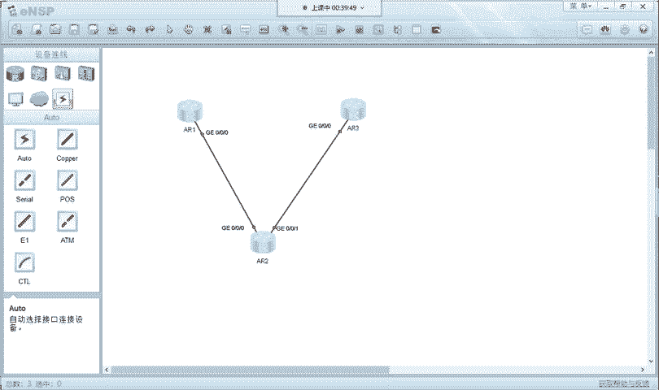

呃，我这个屋里边呢没有网，所以不是没有网，我没有网线。所以我回去必须得申请一个网线，我给你们截一下图，给你们看一下啊，不卡就行。那我们公司网还不错呢，我觉得。

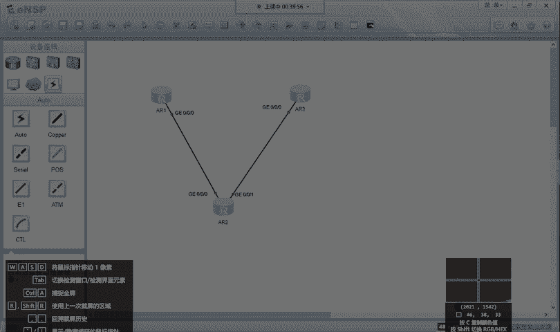

我这图也截不过来，等设备开一下吧，等它开了之后呢，咱们就直接开始。我存一下给你们发过去。好。我这会儿还是三格呢，我刚才就只有两格的信号。行，那咱们准备一下啊，这是三台设备，R1R2以及R3好。😊。

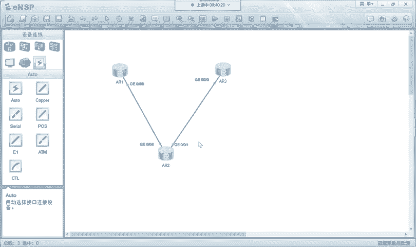

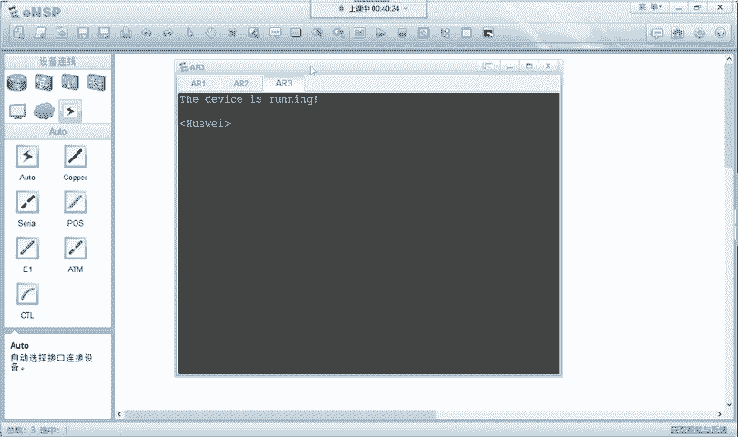

网卡，这种我没有没办法啊。好，咱们先来看一下啊，对于2一来说，这是什么？这是我们的电信。所以我们是先给它命名啊，这个叫做电信22这是什么？22是我们的网关，所以我们给它命名叫做网关。

以及最后1个2323是什么呀？23是我们的联通，是我们的联通，我们给它命名叫联通。现在呢我们首先命名命完了，然后我们配置互联地址地址我给大家标在图上吧，给你们标在图上好，放在这儿我什么工具都没有。

同学们10点1。1点1啊，这是点一下边这个呢我们互联地址，这里是10。1。1点2好，都是24位的言码，我就不写了。这地址是多少呢？20。1。1点1下边呢这是20。201。12好。

我们先把互联地址配完了以后呢，两端我们会有一个接口，123。1。2。3，这是我刚才跟大家说的对吧？包括这边也是123点12。3这东西你们可以随便配，但建议你们就按我的配吧查。😊。

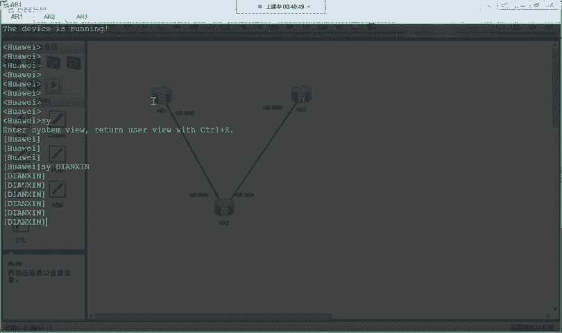

作业的时候我轻松一些。好，我们现在整体地址规划好了，咱们开始进行配置。首先是R1R1是电信，还记得地址怎么配吗？来一块回顾一下。首先呢进到我们的接口下吧，0-0-0这是什么呀？

跟我们网关互联的接口地址是多少？是十0开头的10。1。1。1好，24之后呢，进到我们的哎进到我们的环回口下，那环回口怎么配呢？interface。😊。

好，interface low back0，我们可以直接在接口模式下顺便讲讲命令啊，我们可以直接在接口模式下进到另外一个接口，这是没有任何问题的。所以回去呢可以看一下。

感受一下华为整体的命令配置呢呃是很人性化的。你在0-0接口下，interface back0，我们可以进到还回地址下。那么接下来我们给它配一个地址，123。1。2。3，1。2。3好，24位的页码。好。

那么这是我们的网关网关呢，咱们也同样的，首先呢进到跟联通的互联接口下配置多少的地址啊，10。1。1。2对吧？10。1。1。2啊地址配错了，一会还得再排很麻烦啊，点224位的页码之后呢。

进到我们的0-0-1，这是跟我们联通的互联地址下配20网段少的地址，20。1。1。2。😊，之后呢是我们的23，对于23来说呢，也是一样的。首先跟我们网关互联的地址是二0网段的。20网段20网段是多少？

20。1。1。1好，之后呢，进到我们的look back零接口下，我们给它配相应的也是123。1。2。3。跟我们所说跟我们刚才R一上配的还位地址是一模一样的。当我们所有的地址配完了以后。

大家一定要有一个习惯，就是我们要去测试一下直连。比如说现在我在网关上，我去拼一下对端的地址，10。1。1。1，这是我跟电信的互联地址看看通不通。如果通了以后，我们再去测试20网段的。

你要确保我们互联地址没配错，不然的话呢，我们派配置的时候就会产生问题。好，那我现在呢问大家一个问题啊，也就是我现在呢你看我现在对于我这个设备来说，我呢能够直接平通R1，我也能直接平通23。

也就是这边是我把这标出来啊，这是电信，这是电信，右边呢这是联通，下边这是我们的网关。😡。

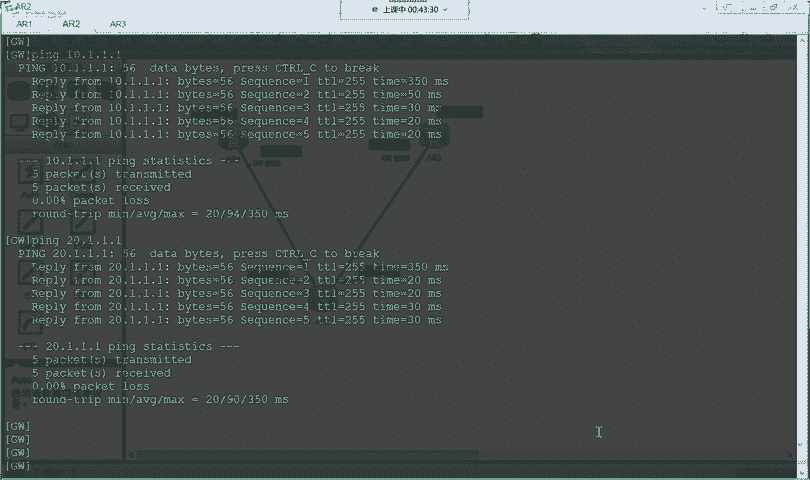

联通下边这有我们的网关。那我现在这个网关，我能不能直接并通123啊，大家你看哎，又回到一个熟悉的问题，什么问题呢？我呢跟他通了，并且呢你看123就是这个设备上的一个接口，我都跟电信通了。

他又是电信上的一个接口地址，我能不能直接跟他通啊，来想一下这个问题，我能不能跟直接跟他通不能好，非常好。大家现在呢都有一个通了。😊。

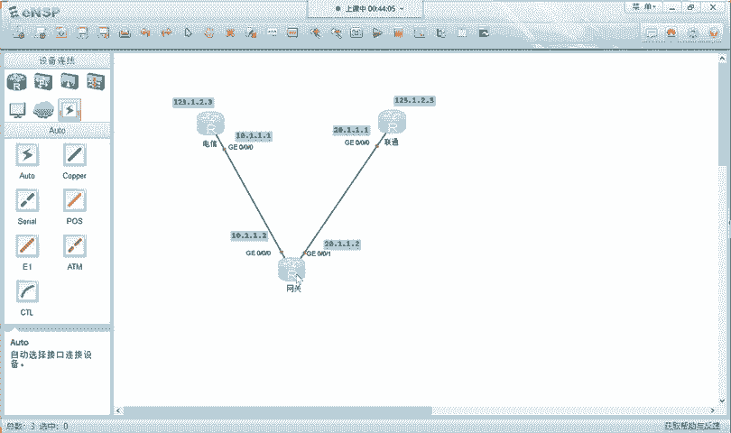

啊，有一个同学说通了，咱们看一看通不通，看什么呀，是不是看我们的路由啊，我们要去查看我们现在整体的路由表。你看我有路由吗？我好像没有。那我的路由里除了这几条没用的路由以外，我们是不是只有一些直连路由啊。

我跟电信的直联，我跟联通的直连，我们都是有的那除此以外，我并没有我们所说的123。1。2。3任何的信息，包括我也没有默认咱们上一节课讲的是什么呀？当数据来了以后啊比如说我未来想访问一个某个目的地的地址。

我要看一看我有没有路由。那如果说这个地址呢，我的路由表中有比较精确的路由，我就匹配上精确的那个。如果我哪个都匹配不上，我就匹配匹配顺序最劣的路由，也就是我们所说0。0。00。只有哪个都匹配不上的时候。

我们才考虑默认。好，所以你会发现我们可以试一下，咱们多说无益，直接聘，我聘123。1。2。3，我肯定是不通的，肯定是不通的所以呢。

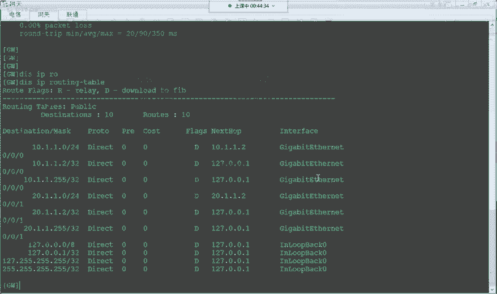

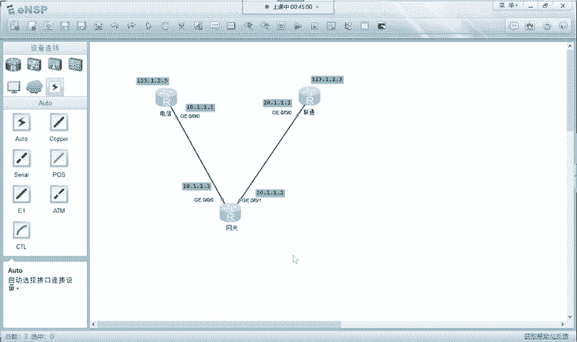

我现在想让他通，我就要写相应的路由。那么我们刚才其实讲过了，怎么配呀？我们需要在网关上去配置两条默认，一个呢去往任意地址下一跳走电信，一个去往任意地址下一跳走联通。

并且我们希望控制通过控制优先级的这样的方式手动的把我们右侧联通的这里，我们把它变成一个备份线路。什么叫备份，相当于我们它并不是最优的一个路由。日常我希望我路由表中呢，走的就是电信。

所以我希望这条路线出现在表中。如果有一天这条路线产生问题了。我再让这条路线出现在表中，由它进行转发。所以咱们首先来配默认默认怎么配来着IProot static，这是一样的。去往任意地址0。0。

00去往任意地址的掩码，0。0。0。0。好，那我写吓一跳，下一跳10。1。1。1。

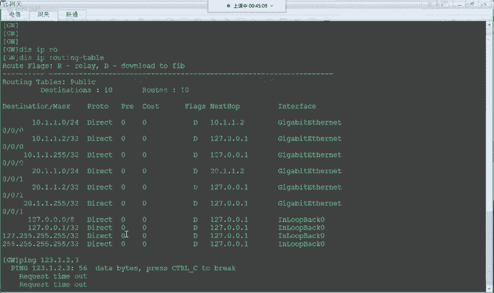

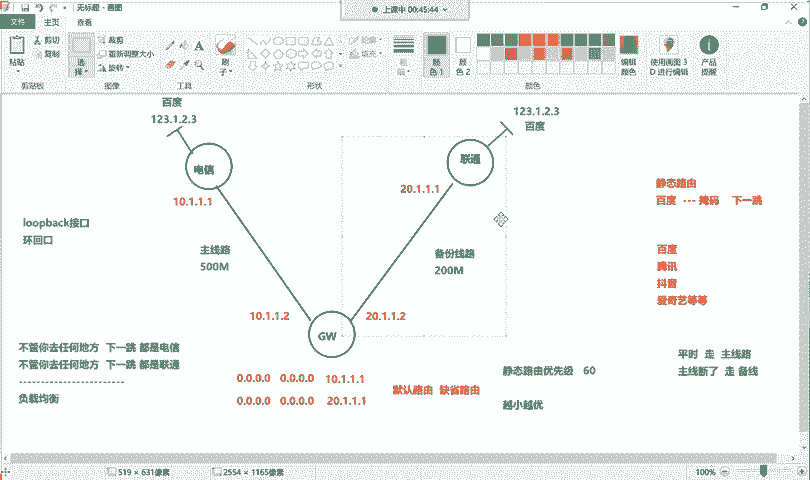

好，那我现在已经配完第一条了。配完第一条以后，我们要配第二条。第二条是什么呀？我也要写一条一样的，去往任意地址4个零掩码4个0吓一跳是什么呀？吓一跳呢，我都想让他走联通。但是我如果直接写20。1。1。

1不就一样了吗？啊，思科一模一样，思科一模一样是什么？你说配置配置我们静态的方式，是的，这个每个设备都是大同小异的啊。我们现在呢在这敲一下问号。你说老师为啥要敲问号啊。

因为我现在呢想在这我是不是想给它调整一下相应的。我们所说吓一跳啊，吓一跳，我写多少，他依旧呢会写下一跳是一个地址的形式，也就是下一跳，我们还写20。1。1。1，我们再敲一下问号。

你会在这里看到一些不同的内容啊。也就是我现在依旧去往任意的地方，我想让他走联通，但是后边我可以做更多的控制，在其中我们看到一个preference，这个叫做优先级叫优先级。

也就是我现在可以去设置我们现在这个路由。😊，的优先级。那么设置的优先级，我要把它调小还是调大呀？同学们，我问一下，也就是我现在呢先把这个我们所说prefer打出来，我们敲个问号。

你可以看到我们能设置1到255之间的好偏好大，为什么呀？因为我们希望它作为备份，也就是它呢现在整体不能够出现在路由表中，我希望呢现在正常情况下左边这条线路在表里。我不希望它加表，那么路由加表原则。

在我们地址和掩码都一样的情况下，我们优先级越小越优才能进到表中。所以这是我们的加表原则。好，那么我们现在给它改成多少呢？比如说改成64吧，其实660往上都行，咱就64吧啊，每次都61啊。

感觉呢多给点就有有问题一样，64啊，好，那么现在当我们配完了以后，我们现在整体可以去查看一下我们设备的配置啊。

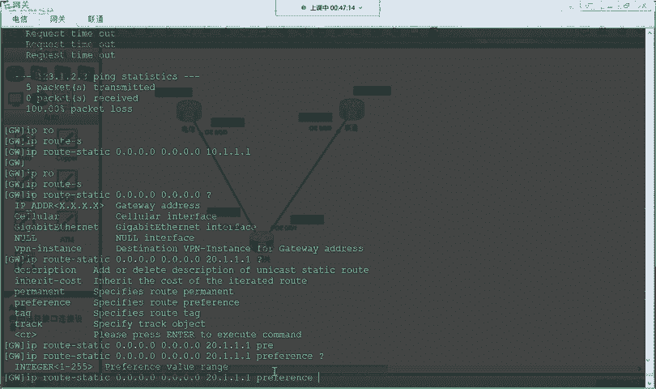

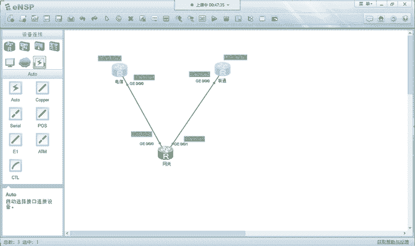

好，这个命令教过你们了。在我们整体设备配置中，大家可以看到两条命令。一个呢是我去保，我把它这个拿出来啊。好，一个呢是未来我去往任意的地方下一跳呢是10。1。1。1，也就是哪儿走电信。

以及呢我去往任意的地方下一跳是20。1点1。1走联通。但是我后缀了一个preference。64。好，也就是代表呢我现在这个优先级呢更大。那么请问我现在查路由表的话，我路由表中，这两条。

你看我配了两条路由，但他们都会出现在表中吗？同学们来想一下这个问题，他们都会出现在表中吗？如果会的话，给我刷个一，不会刷个2会吗？不会好，那我们查看一下，有同学说会有同学说不会，我们看一下。好。

你会发现我们现在表中仅仅只有一条静态路由。那么静态路由，它现在下一跳是多少呢？是我们的10。1。1。1，看到吗？是10。1。1。1，其余呢只有这一条静态，其余是不是全部都是直连啊。

也就相当于你看它的优先级是60，刚刚配置的优先级为64的，下一跳联通的那条路由并没有出现在我的路由表中。😊。

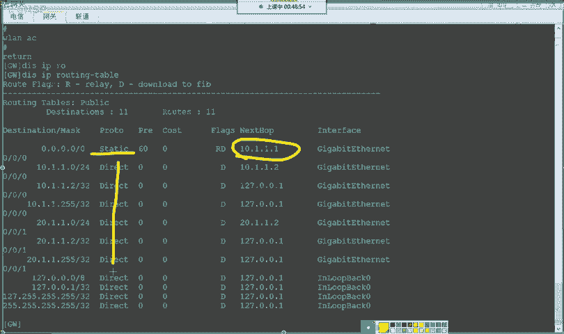

因为它不会加表，这就涉及到咱们上节课讲的加表原则了。可能那节课呢大家听的时候，你觉得呢听起来是比较的懵逼，对吧？因为你说这加表感觉我还没配路由呢，我配的都加表了。

因为你们上节课所做的练习三台PC互相通信，你们每个在每一台设备上，你单独配的那条路由都是唯一的一条去往唯一的目的地唯一的掩码，那你不存在加表时比较的问题。那么我们今天再去进行加表的时候。

它就有会进行比较了。因为你现在目的地址以及掩码都一致的情况下会比较优先级，这就是我们加表的一个原则啊，这个不是凭空跟大家说的啊，因为我们今天讲的时候就会用到这个知识了。呃，是不是把调小啊，没错没错。

你把它调小也是一样的，把右侧调大也是一样的。你们回去做做实验的时候，可以选择把联把电信这边调小，也可以选择把联通调大行吗？因为你们最终做出的结果是一样的。好，那么我们现在就可以查看到往。😊。

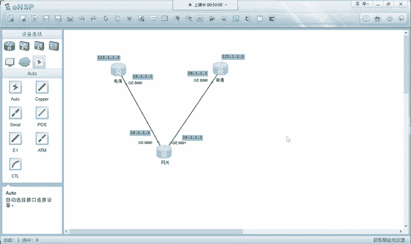

关上的路由表了，那下一跳是电信。好，那我现在请问同学们，我如果去聘123的话，我能听通吗？来想一下这个问题，我聘123的话能听通吗？😡。

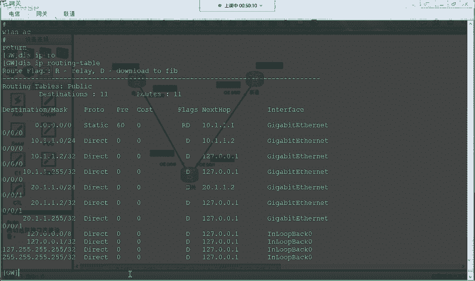

能吗？😡。

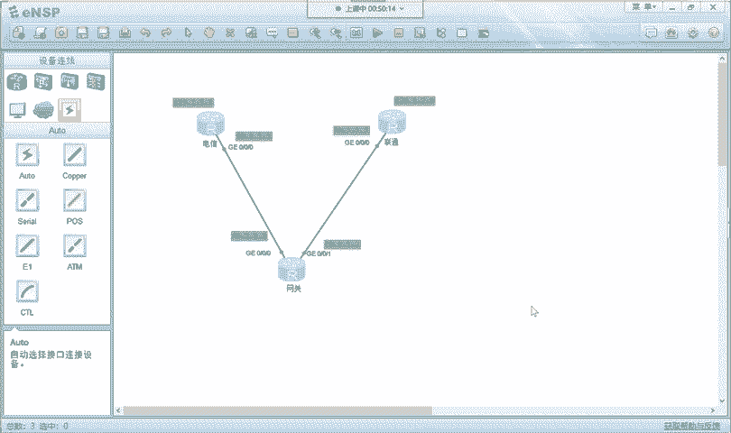

通好好，那么我们现在呢去拼一下试一下，拼123点1。2。3。你说老师我现在路由表中好像也没有123啊，我查路由表的话呢，我能通吗？你看它通了，为什么呀？因为我现在没有这条路由的时候。

没有去往123的时候，我会匹配上匹配顺序最劣的静态。我们所说的这条默认路由，我匹配上了。那么我们一起电信调小静态里也啊，当然了啊当然了，你不不管是把它调大，把它调大还是把它调小，都是U的进表啊。

只要它更小，它就会进表。我们来还原一下这个过程。嗯，今天群里边有一个同学问，比如说呢我在数设备发出数据的时候，有的时候你们但是这个IA咱们设及不到，我可以跟大家说，默认情况下，你呢会以出街口。

这个地址呢作为原IP进行封装。也就是现在呢你是以一个10。1。1。2这样的地址往外界发送的报文。但是我们今天不讲这么细了。网关我现在要去往123，在我本地查询路由表。😊。

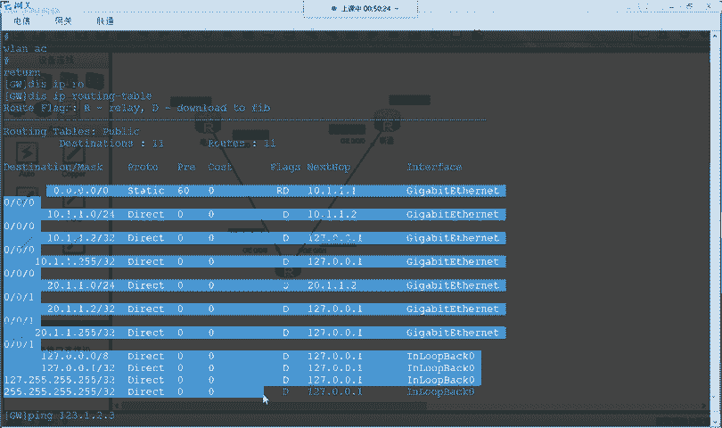

没有去往123的路由，但我有一条默认路由，默认路由下一跳指向10。1。1。1，所以我的数据会发出来到电信这到了电信这里，电信我们是不是要查询本地路由表啊？因为我本地有一个123的路由吧。

这不是我身上的一个地址吗？所以现在我能够我们所说到达这个地址就通信了。当我们未来123以一个原IP进行回包的时候，他要看给谁回包啊，给10。1。1。2进行回复。那么我能否到达10。1。1。2啊。

查询本地的路由表，由于我电信中10。1。1。0网段是我的直连下一跳是多少，吓一跳，因为是我的直连，所以我是直接能够跟我的直连进行通信的。所以这是我们完整的一个通信过程。呃，我现在想说的是这样的问题。

大家你看啊，我们如何去验证现在走的是左边呢？第一，你可以看路由表，路由表中告诉你了，下一跳是10。1。1。1呃，环回地址不一样的话，并联通还回能通吗？还回地址不一样的话，并联通还回能通吗？

我没明白你的意思，谁谁谁环回地址不一样。你就说联通这边，比如说你给他配个124。1。1。1能通吗？是这个意思吗？当然不能了，当然不能了。呃，如果你要去这样配的话，你左边必须得跟它一样才行啊。不然的话。

你做十，你做这个配置的意义何在呀。呃，咱们今天呢一下也可以，咱们来试一下吧。比如说我现在呢想要去看下一跳是多少。那么我们可以使用or这个命令。之前呢我们好像没有跟大家演示过这个命令。123。1。2。3。

我们来看一下啊。好，大家可以看到我的下一跳是10。1。1。1呃，包括呢大家也可以在这个接口下进行抓包，你会发现呢流量走的是左边呃，但是我跟大家说一下，在有的时候你们如果在做实验的时候。

你在PC上去一个还回地址的话，它会产生问题。就像大家可以在我们网络设备上，你会发现下一跳是这个接口的地址。如果你这里是一台PC，我说一下是在ESP中的一台PC有的时候一个还回地址，下一跳会是还回地址。

但是这个呢是ESP的问题，我们真实在使用这条命令的时候，一定是接口的地址。以这个跟大家先说一下，免得以后你们碰到的时候觉得奇怪好吧，ESP中很多功能呢，对于PC来说集成的不是特别好，这。😊。

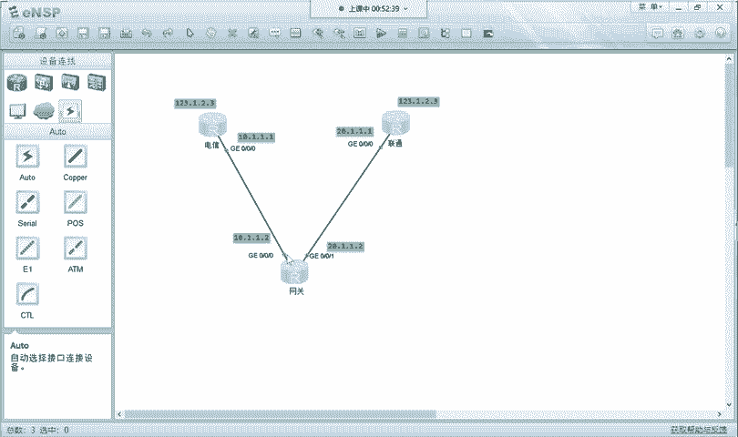

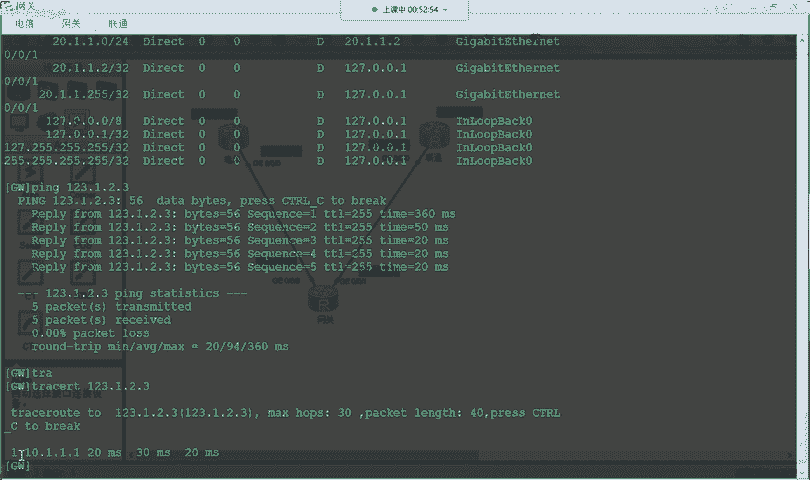

其一，那么现在呢我希望做的是什么呢？我问你们一个问题，我如果现在手动把这个接口当掉，请注意我的问题啊，把这个接口给当掉了。那么我现在我表象中的路由还在吗？也就是你看我现在去往任意一个地址下一跳呢。

是走电信。但如果我把我的这个接口当掉了，我以后下一跳还会走电信吗？那我现在好，这是第一个问题，你们会认为不在。好，那另外一个问题，如果我现在左边这条路走不通了，那么我会走右边吗？

你们想一下这个问题我会走右边吗？那好会走右边，那我再接着问，如果我走右边的话，右边这条路由也就是下一跳是联通20。1。1。1路由会出现在路由表吗？

会吗？会好，那么我们现在呢进到接口下记0-0-0，我们把这个接口呢手动杀档了。好，我现在呢敲下杀档，大家会发现这个接口马上就变成红色了。我们一起来看一下啊。

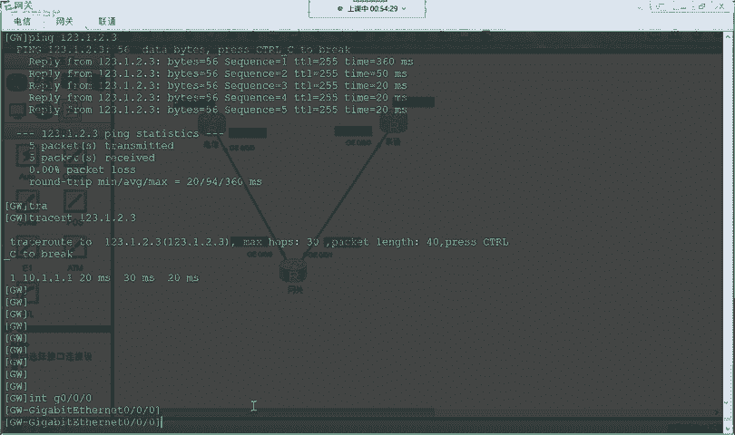

好，就变红了，稍微等会儿，它稍微有点慢啊啊，去等它变红。

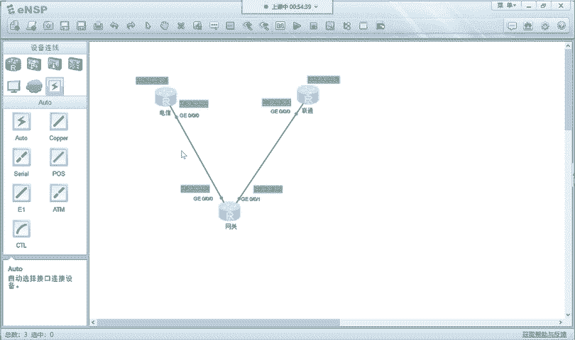

等它变红，它确实是反应呢确实有些迟钝。那其实它现在已经荡掉了。你可以看到它本身已经已经当好红了。红了以后呢，我们就可以去查询路由表displayip table我们可以看到。

现在我现在已经没有十网段的直连路由了，发现了吗？我路由表比起前期小了很多，为什么呀？我不仅仅现在我们所说接口没了，我现在是不是这三条都没了呀，因为我接口当了直连没了，这个之前跟大家讲过。

但是你会发现我们现在去网我们所说未来任意地址的默认路由还在，只不过现在呢优先级变成多少了，变成64了。那代表什么呀？代表我走的是不是右边这根线呀，并且吓一跳是不是20。1。11，我走的是连通。

那么现在请问同学们，我如果去123。1。2。3的时候，我能并通吗？来想一下能平通吗？😊，能吧。好，我们试一下，它还是能的。那么如果我现在并通了。我如果的话，下一跳是不是应该是20。1点1点1啊？

我们来尝试一下，应该是20。1。1。1好，是20。1。11，所以大家会发现呢，我们一旦现在左边线路荡掉以后，我流量可以自动切换到右边去走，所以这是非常非常人性化的。呃，网关不当10。1。1。

1档这个问题呢我们IA不会讲，因为之前呢上之前讲的时候呢，这会涉及到呃是这样的，一样，你们回去可以做测试，如果基于咱们这张图中来说呢，你把它当掉也是一样的。因为他们两个之间是直连，能明白吗？呃。

但是现实生活中呢，往往咱们跟运营商之间它不会一根线跟你直连的，中间它会接入一些其他的设备啊，它中间会有一些中转设备。所以呢实际上你是无法直接感知对方断的。你没有办法完成切换。以后呢在你们学到IP课程中。

你们会学习到一个技术叫做BFD叫做双向转发检测。其中有一个子技术叫做BFD的。😊。

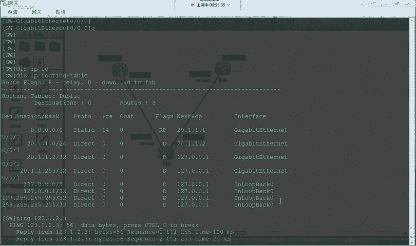

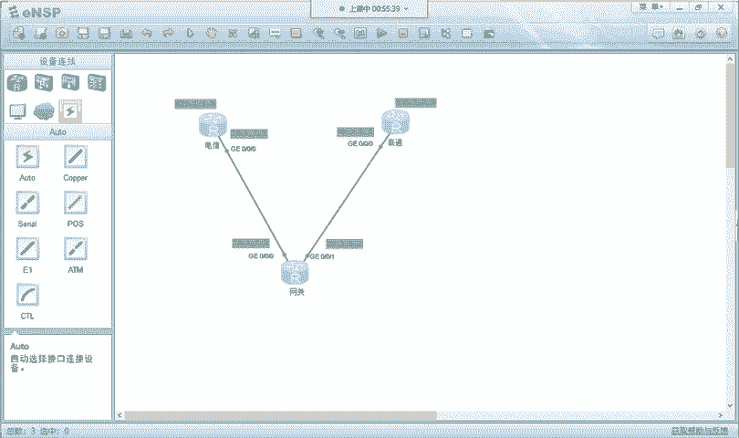

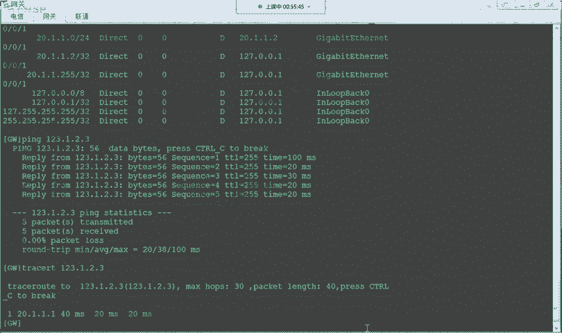

单笔回升。那么它可以定时的向这个地方，也就是向对端接口发送报纹，检测它的一个联通性。呃，但是这个功能我们在A不做介绍，你们未来到了IP课程中会讲好吧。

我们今天只讨论本地网公安当你的接口出现问题的时候的一个的一个实验。但是在我现在画的这个图里，你把这个接口当了也一样。因为这是一个直连对于所有的直连路由来说，请大家注意，对于直联路由来说。

你两端两端的设备，只要一端接口出现问题，另一端设备一定能感知到。因为你的链路本身会做一些协商的。我们所跑一些协商的报文。那相应来说，它是会有链路的一些协商机制的，它会检测到链路的通断。

所以你无论是本端还是对端当结果都是一样的。

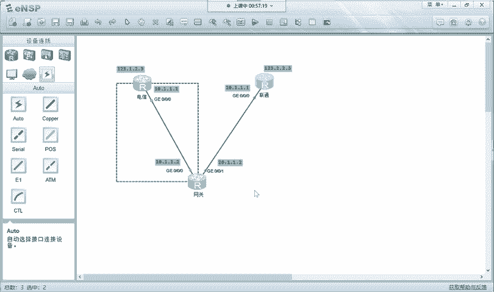

好，这是我们这一点。那么之后呢我们还要回到这个接口下。比如现在呢我希望比如说现在我请了工程师，我们的公司的网工来修这个网络了，来修这个网，当然不会这么简单了。呃。

我们现在呃我们所说现在呢按照咱们今天课程中来讲的呃这部分内容只是我们IA中这么讲，能理解吧，以后你们到了IP中呢，同样一个技术有IP的讲法。一个技术呢到了IIE中有IE的讲法。

所以说呢大家可能有的同学基础比较好。呃，那大家就学完IA呢抓紧时间学IP就行了。大家不需要在IA中呢提过多后期的技术，好吧，呃，这是我们进到接口下，我现在呢希望把这个接口呢给他又打开。

你就相当于是什么呢？我相当于现在呢我把我们网我们我们公司的网工呢啊已经跟电信报修了。无论是我的问题还是他的问题，反正现在链路恢复了，我这个接口呢，总之暗度杀当，我要把它打开。那么一旦接口打开以后。

现在我想。😊。

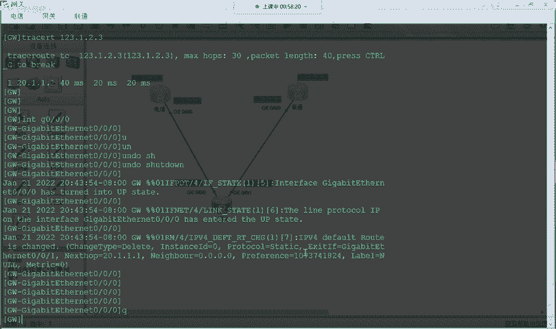

问同学们，你说呢我现在刚才的路由已经变成右边了，但我现在链路修好了，那么我会不会重新走左边啊？会的话给我刷个一，不会的话刷个2会好，我们看一下啊，好，那么我们来看一下即可。

我们diplayipro table好，我们可以查看一下，你会发现现在我们优先级又变成60了，并且下一跳呢，又变成电信了，也就是我流量现在又走左边了，也就相当于我确实完成了一次切换。

如果我正常流量走左边，左边断了，走右边，如果左边恢复又走左边。那么这个过程它就叫做我们整体的路由备份的过程。那么何为浮动静态路由呢？也就是指我们出现在路由表中的这个表象它会有一个浮动的概念。

对于正常来说，大家请看我们正常来说啊，正常来说我的路由表中是不会出现这样的一条路由的。也就是我不会出现下一跳是连通的，也就是20网段地址的路由。为什么？因为它的优先级更列。

所以它日常情况下呢都是引在我们。

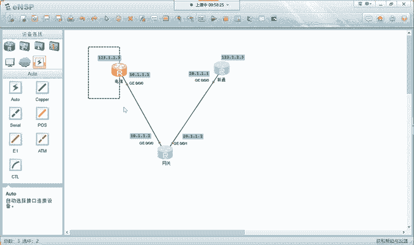

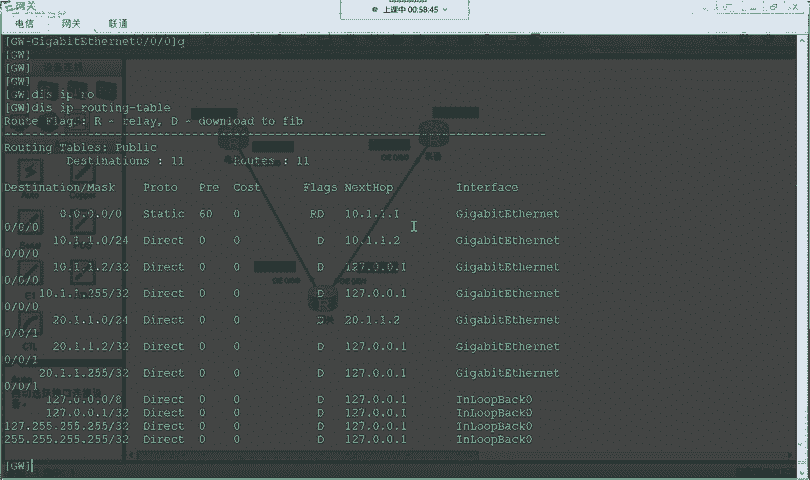

路由表之下的，它不会弹在表中。那么一旦未来在路由表中跟它去往同样的目的地相同掩码的一条优于它的路由消失了的时候，就相当于原本呢去电信的那条路由没了。那么这条路由会浮上来，也就是出现在我们路由表中。

那么它引下去浮上来的过程，它叫做浮动静态路由，这是一个非常好听的一个名字。好吧，这是一个非常好听的名字。呃，讲到这儿呢，这是我们今天讲到的最后的一个默认路由以及浮动路由，也就是路由备份。

它们之间的一个联系和关系。那么回去呢，你们做一下这个实验就行了啊，回去做一下这个实验。呃，我这个就先我先截一个图吧啊，先截一个图吧，截个图，然后我保存一下。

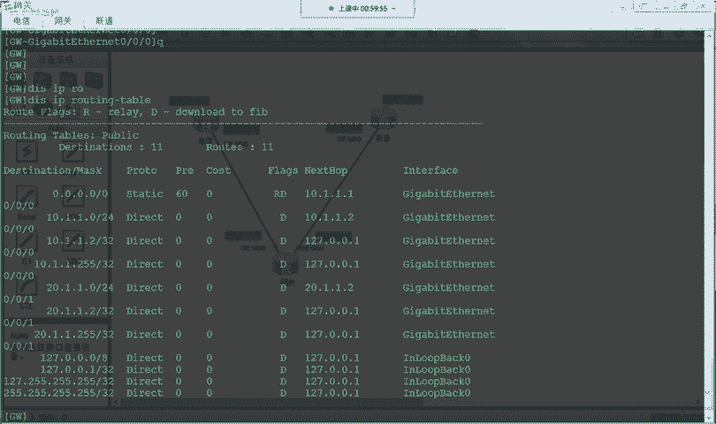

等等下课的时候，记得给你们留作业。好，我先把它存一下。那咱们这一点就讲完了。讲完了，我就先把这个环境关了。因为咱们下一节课啊后半节课还有另外一个小的实验要做。行吧，我讲到以上这点，你们有啥问题吗？

有呃静态备胎上位，可以这样说吧。你们有啥问题吗？有的话可以给我打在公屏上。如果没的话，咱们就接着往下了。因为咱们有问题还是没啊，没有好，二是没有行，那咱们接着往下说吧。现在才8。8点还不到9点呢。

还不能下课，咱们先往下说。呃，那么讲到这儿，我们其实就讲完了路由形成的几种形式，还记得吧，我说呢路由表如何形成啊，三种模式，第一个是直连，第二个是静态，那直连静态都讲完了，我们今天要开出第三篇了。

也就是我们的动态路由了。对于动态路由来说，我们IA只学习一个动态路由叫做OSPF那也就是大家欠到我今天课件上摆了挺久的。嗯，讲OSPF之前，再把之前的这两个给大家复复习一下。对于。😊。

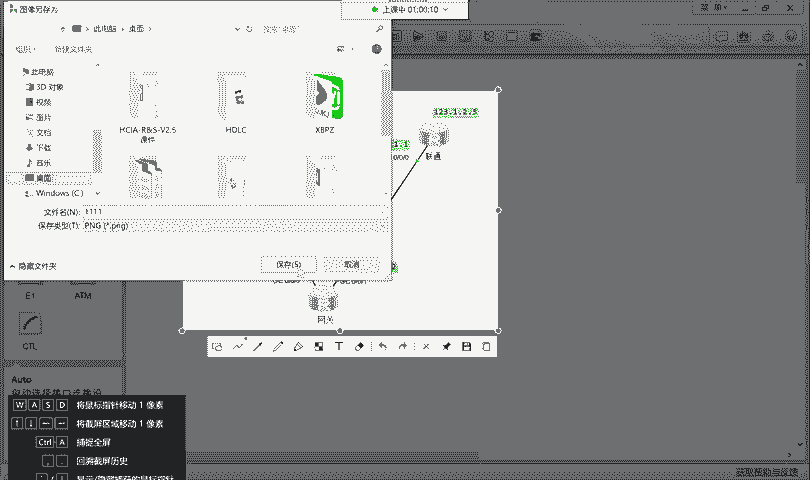

直连路由来说很简单，接口配1个IP保持接口app，我直连路由就形成了。这是第一个很简单。咱们直接说静态。呃，我们提到了静态路由的部署。这两节课讲了，但是请大家注意静态路由它会有一个问题。

也就是面对一些比较复杂的网络来说呢，咱们一条一条指静态会很麻烦。就像之前呢就给你们布置了三个就给你们布置了三个设备互相指路由。你们有同学都私聊我说，老师我觉得这样很麻烦，更别说未来面向项目中。

你们面对数十台设备的时候，如果真的让你逐条指路由，你在每一台设备上要指数十条路由，嗯，头是很大的。所以静态路由，面向大规模的网络来说，它效率非常低。呃，所以呢你设备多，当然配的也要多嘛，很繁琐。

并且静态路由有一个毛病，或者说它有一个通并弊端，就是它没有办法自动的感知网络的变化。我这句话说的有点拗口啊，我再强调一下，没有变办法自动的感知网络的变。电话我给大家举个简单的例子。

比如说呢这是我是一台路由器啊，我又非常非常非常非常多。那么假设呢对于我们来说，你看。😊，对于我们来说，比如说我现在这个设备右边呢有一个网段儿，这个网段儿是多少呢？假设它是1。1。1。11。1点11好。

比如说呢它是24位的掩码啊，假设这是一个地址吧，你呢现在在你的这个设备上写静态。比如说你写了一条去往1。1。1。1下一跳呢走这个设备好。那么现在这条静态路由就在你的路由表中形成了。但是请注意。

如果未来这个网段消失了。比如说它设备宕机了，或者说呢我们整个网段中反而出现问题了，这条路由，其实啊这个设备已经不存在了。也就是其实你这条路路由是无效的。但是很遗憾，作为静态路由来说。

一旦你配置在路由表中，它就是一条配置了，存在存在于你的路由表中。那你是无法在你这台设备上，不经过任何配置的情况下啊，你去感知到对方的这个网段是否还存在，你感受不到。所以即使当对方网络有一天出现问题了。

如果有一个数据发送到你本设备上，告诉你我现在要去往1。1。1。1，你依旧会给它进行转发转发到下一台设备，也就是你的下一跳的设备上啊，没错，它没有办法感知到远端的设备的变化，是这样的。呃。

就像刚才有一个同学说到，咱们做刚才的那个配置的时候，如果未来作为这是你们公司的网关，这是电。近的网络，那么你们中间可能会加很多的设备，一些些中转设备啊，它是不会直接跟你一根线直连的。请注意同学们。

那么如果比如说你现在呢通过中间中转设备跟它进行相连，如果对端的这个接口荡掉了。那么请注意同学们，如果你在你的设备上没有任何配置的情况下，你是无法感知这个接口荡掉的。所以如果当你们学到IP的时候。

你会发现，如果对端接口当了，那你这条路由是不会切换的。那么你这边还是上不了网，因为你现在依旧认为还是应该走左边好吗？这是我们呃，但是这个技术我们在IA中就不讲了。我在I中就不讲了啊。

但是你们如果是我们今天这个图，你直接是直连，那是能感受到的。好，我再强调一下，我今天图画的会比较简单。嗯，所以这是静态路由，它的一个弊端。所以它没有办法感知网络的具体情况。因为它比较笨嘛。

人为手动静态配，所以呢你会发现这是它的问题。呃，也就是说无论是静态也好还是直联也好，它们是我们构建路由表中的两种形式。那么今天我们要来学习在面向未来中大型的网络中，我们可以有一种可以自动感知网络的状态。

自动感知未来网络拓扑变化的一种路由形式叫做动态路由。那么由动态路由未来构建出的路由表，它是可以自己进行运算的。不需要你认为进行配置，并且当网络呢比如说你设备接口当了，设备产生问题了，设备宕机了。

包括链路上一些我们所说接入了一个新的设备啊，啊，接入了一个新的设备，当然你需要进行更多的配置了。这个是你需要配置完了以后，它可以再自动的进。😊，计算，所以它是相对来说比较灵活的啊。

最灵活的就是它可以自动计算路由，并且感知网络的变化。这叫做动态路由。又卡了吗？又卡了吗？我看一下啊。呃，这会儿应该不卡吧，我因为我这会儿都是绿色的，所以我我感觉还行啊。嗯，行，我们接着往下。

你们总是弄得我胆战心惊的啊。呃，咱们接着往下这些笔记我课下再给你们补充。好吧，你们每次会发现笔记会比我课上多点，课上我就稍微少敲点字边浪费时间。呃，咱们说一下动态路由。作为动态路由来说呢。

它就是我们通过这个我跟大家写上，通过呢在我们设备上，你去运行某种协议，运行某种动态路由协议，运行完了以后呢，我们就可以通过该协议。运行啊运行某种动态的路由协议。那么我可以通过这个协议之后。

我去自动的交互我们路由信息。这样的一个过程，我们叫做动态的路由。那么我们今天呢讲解的是OSPF那么OSOSPF叫做什么呢？哈，它咱们先来看一下它的定义啊，定义咱们就看课件吧，挺长的一串英文。

这个我直接复制了，我非常不喜欢打英文OSPF叫做open shortagepa for叫做开放式最短路径优先协议啊，写在这儿开放式。最短路径优先。啊，路径优先啊。

头疼最开放式最短路径优先first优先啊。那么这样它是一个什么样的协议呢？它有几个关键词，咱们首先来看一看啊啊，一共三节课呃，讲不了三节课，两节课吧，差不多这节课讲完下一节课咱们就差不多了。

A中OSPF很简单。嗯，来看一下啊，对于我们今天来说课件里大家先来读一下这句话吧啊，因为这个话呢你让我说也是这么说，所以咱直接看了。开放式最短路径优先，也就是OSPF这样的协议。

它是一种基于链路状态的内部网关路由协议。那么这两个词儿我会给你们讲链路状态这个提到了我们OSPF它的一个算法，这是指它的算法，它的算法是基于链路进行计算的。那么内部网关路由协议。

这是指的OSPF它的一个应用场景。所以这个呢我们会分开说这是应用场景。呃，那么我们提到这里呢，就会结合着我们后边它写了一个词叫做IGP这是什么意思呢？我们会结合着这个词一起来跟大家讲。呃。

咱们先来聊应用场景，再去聊OSPF的算法，因为场景呢会说的比较少一些。好呃，状态机这次不会讲那么久了。啊，咱们先来聊应用场景。从我们整体使用的场景去分析呢。我们O我们所说的整体的动态路由协议。

注意整体的动态路由协议，它一共就分成两大类。啊，动态甭管你们未来呢学习到多么深入，它就分成两大类。从使用场景分析啊，一种呢叫做IGP协议。另外一种呢叫做EGP协议啊，EGP协议呃。

何为IGP何为EGP呢？咱们一个一个来说，IGP它叫做内部网关协议，对EGP来说呢，它叫做外部网关协议。内外部如何区分呢？什么内什么外呢？我们称之为呢叫做AS内这个听过吗？AS内AS呢叫做自制系统嗯。

我写在下边对AS来说，它叫做自制系统。如果你们之前听过BGP你们可能会了解过这个字自制系统呃，咱们先说AS内。那么对于外部网关路由协议来说呢，它是存在于我们AS间的一个概念。那么咱们先来说AS是啥行吗？

先来说AS是啥？呃，如何区分内部外部呢是通过自制系统这个概念进行了区分。呃，你说内跟外总得有个衡量标准吧。说自治狱什么叫做自治狱呀？也就是我们好像听过这个概念，但具体这是一个什么，咱们好像不是特别清楚。

那今天我讲的时候希望大家认真听。这概念很简单，我们是以1个AS，也就是一个自制系统来衡量，它是一个内部协议，还是一个外部协议的那如果在1个AS内运行的协议，咱们就叫内部网关协议。

如果是在不同的AS兼运行，我们称之为叫做外部网关协议。这个我写在上面了。那么什么叫做自制系统呢？大家可以把自制系统就理解成是一个网络系统，或者说呢你可以把它理解成是一种网络的架构啊，网络的架构。好。

说架构这个词很空很大。那么我们通常呢会去把一个由一个统一的管理者，注意由一个统一的管理者，它去构建的网络系统，我们就叫做一个AS。叫做1个AS好，依旧讲到这儿，还是觉得听不懂是吧？呃。

那么我跟大家举个简单的例子。我们所说在1个AS内呢，我们通常会运行相同的IGP协议。也就是你现在运行的，比如说你运行OSPF你在哪儿去运行OSPF啊，你只是在你们比如说你们公司十几台设备。

你在你们公司内部去运行相同的IGP协议，对吧？那它实际上就是一个自制系统。并且呢你针对于你们公司来说，你所做的策略是比较单一的。你会发现基于每一个公司，你实际的场景不同，你所做的策略实际上是很单一的。

如果你们做过网络规划，你就会发现，因为不同的公司，我的不同的业务，对于业务来说是不同的需求，比如说呢我是一个我们所说我是一个做咱们所说做什么呀，做线上啊线上呃假说做淘宝的吧。那通常来说咱们可能没事。

就是访问点网站啊，刷刷流量啊等等来说，你可能平时。😊，比如说你访问一些网页服务比较多，你在于你们公司来说，可能对于员工来说做一些策略呀，让他们除了访问一些网页数据呢，其他都访问不了，不让他们看电视。

也就是说你会做点策略。那实际上你所做的策略，运行的协议都只针对于你们公司现在真正的一些业务来说，你去制定的。所以你会发现各公司和各公司网络的配置几乎是我们所说很难是完全相似的。

所以呢我们所说什么叫统一的管理者呀，你是你们公司的网管，那么整套网络是你来进行制定和运维的。那么你需要对于策略以及运行的协议了如指掌。那么通常来说它不会特别的复杂，能明白吗？啊，你只需要管理你这套网络。

呃，那么我说到这儿，大家可能还是不理解，最后我就再说一句，非常简单。比如说你现在运维了你们公司的一套网络，你甭管多大，可能呢小到只有五六台路由器。那么这五六台路由器是不是就构建了一个网络系统啊放在。

我们比如说我打开咱们的ESP啊，甭管你现在拉出来多少台设备。咱们以简单的为例，你现在呢运维了你们公司的一套网络，你们公司呢非常的简单，就几台设备互相连接。那么你这台几台设备连接起来，它就是一个自制系统。

能明白吗？你就可以向外界称呼我现在维护了一个所谓的AS自制系统，没有大家想象的那么高端，这就叫做一个自制系统。那AS它仅仅只是一个称呼和代表，只不过说成专有名词，感觉呢挺高端的。

但实际上没有从我们的角度出发，你就可以认为这是你构建的网络，这就是一个AS。但是呢这是我们所说狭义上的AS没错。那未来有同学说局域网跟广域网非常好。那么从我们的角度来说，这是我所创建和运维的AS。

这是没任何问题的。但实际上从全世界的角度来说，你可以想一想，作为运营商以电信为例，电信是不是也是一整套大的AS啊。你想想电信移动联通，他们内部肯定有自己的网络系统，它的规模是你的。

我们所说咱们公司的网络肯定是没法比拟的。那么像运营商级别的设备，他们在内部肯定有属于自己的网络系统。那么他们也叫做AS。并且对于运营商来说，他们会有申请一个单独的AS号，也就是他们的AS会有一个编号。

注意自制系统是有编号的。那么对于运营商来说，他们所单独申请的AS编号，他们叫做公有A就跟你那个公网IP私网IP1样，他叫做公有A也就是他们才叫做真正的网络系统，他们会单独申。请1个A号。

那么未来呢你们将来到了IP，你去学习BGP的时候啊，有同学说了这个编号有啥用啊？以后你们在学习BGP的时候，你们经常会在不同的自制系统之间去部署我们相应运行都由协议。比如说BGP的协议。

那个时候需要你们互相指定对端的自制系统号啊，能明白吗？自制系统号。呃，所以到了IP你们才会学到只不过呢我们讲到IA的时候呢，必须跟大家讲到什么叫IGP不然的话呢，你们理解不了，就总感觉呢挺奇怪的。

学OSPF，你必须要知道学OSPF的场景是什么？未来到学BGP，你必须要知道BGP你在学什么。好吧，这是我们所说呢，你不能说呢学完OSPF，你会认为哦我未来跟运营商的设备做对接的时候。

就是OSPF那不是扯淡吗？所以你们要先了解在一个小型的网络内，我们会有一个统一的管理的架构，我们会去运行相同的IGP它的适用范围是在1个A内我们去部署。あ。呃，所所说呢。

我们多少个A号这个呢我们所说三层，也就是跨三层来说都是65535，这是它一个基本的区间非常非常的多。呃，我们先说一下，最简单的啊，同学们呃，最后再跟大家强调一下。

你现在比如说你在家里面运维了你家里的TPlink的小路由器，虽然你们整套网络中呢，只有一部手机连着它上，我们所说连着无线上网，那对外你也可以说我维护了我们家里的这个A能明白吗？

它也是一个AS但是呢这样的自制系统呢，外界是没有人承认的。那么我们称之为这种没有人承认的自制系统叫做私有A叫私有A那么它是不需要申请的啊，你也可以说没错，你可以说呢，我运维了一套自制系统。

那未来跟我们所说技术部老大来问的时候，你运维了什么系统啊，我们家里的TPlink就是我运维的啊，这也是可以的好吧，证明我们对这个概念了解的很多这是私有A。所以说对于AS内部。

我们去运行的协议就是IGP了。所以你们首先要清楚，我们首先来说呢，IGP这样的协议它就是在自制系统内去运行的。那么顾名思义，我们今天讲到的OSPF它就是一个非常非常标准的内部网关协议。

运行在我们一个自制系统内，为我们整体的一套网络提供统一的一种路由的计算形式，那么保证我们基于内部的网络，你整体的策略也好，计算路由的方式也好，是统一的。那么保证我们网络秩序叫做井然有序。嗯。

对于我们OSPF来说啊，对于我们嗯我们不说OSPF了，对于我们现在大家学的课程叫做数通，对吧？dcom，无论你们报道什么课程，你们在学到IP的时候，就会接触到我们所有数通课程中的三大协议了。

那么我们会学习三个协议。OSPFISIS以及刚才跟大家提到的BGP协议。那么BGP协议，它就属于外部网关协议。OSPF小于IGP。小于IGP是属于吧，那个应该符号不是这样写的吧。

应该属于是不是这样写的呀，对吧？还是这样啊，我不太记得了，但是肯定不是这个这个是小于号。这个好像是如果你们知道可以打出来卡了，是吗？我看一下啊。确实卡了，不好意思啊，我这标红了，现在能听到吗？同学们。

能听到吗？呃，我现在好像确实是有点卡。嗯，稍等一下吧，我先呃大家呢凑合着听，先凑合着听。我等今天结束了以后，我要给这根这个屋里扯根网线啊，非常卡吗？现在还卡吗？现在可以了。行，那我接着接呃包含的情况。

没错，是包含啊。但但是那个包含的包含的那个符号我不记得了。你们如果知道看来大家都是学数学还是这是学的都不怎么样啊。行，但是可以咱们就接着说一会儿就稍微休息一会儿。说完这点，咱们刚才提的AS号。

请大家注意，我们最早实际上是BGP的概念。也就是最早里边它是BGP中的一个概念。但是后来呢大家发现这个概念很好用啊，用起来太好用了。所以呢它就沿用下来了。它对于内部和外部就进行了区分。

所以说未来在不同的场景中，咱们运行不同的协议去实现不同的功能，这是我们现在所讲到的BGP啊BGP以及OSPFISS以后呢你们会围绕着这三大协议，学完整套数通中的动态路由协议。呃。

一个比一个难一个比一个难。所以呢大家IP课程中呢，你们敲实验会，未来敲的很爽。咱们IA呢作为一个基础的了解，你们需要把基础打扎实。呃，上面一个。C下边一横是包含，那我我说的没错，对吧？

你别看我已经呃十几年不上学了，但是这种东西夸一下自己。行，咱们最后说完这一点啊，我给大家画一个图，帮助你们去了解一下中间这些呢，我们画两个运营商。甭管呢你这是什么运营商。比如说呢你这是移动。好吧。

你这是移动。右边呢这是什么呢？这是联通。😊，左边呢这是移动的一个自制系统，移动的AS联通的一个自制系统。那么这是什么呢？这是你们公司，你们公司的1个AS公司的一个自制系统。在你们公司的自制系统内部。

比如说你们现在就三台设备，咱也别话多了，就三台设备。三台设备彼此之间的连接起来，三台路由器啊，当然你们接入的设备会很多，咱就不一一化了。那么未来你的这些设备之间，你会去运行一套路由协议。

那么运行一些路由协议就称之为呢你在里边运行的就得是IGP协议，内部网关协议。你是帮助整体你的内部计算路由，同步路由表的IGP协议。但是请注意，你公司内部是IGP但是如果未来你对接了我们所说移动的运营商。

并且呢你的一些业务要跟它的业务进行一些数据的交互。那现在我们现阶段你还理解不了，为什么AS之间要进行数据交互以后，咱们就会学到BGP的时候，你们会再来讲啊，这概念我们IA讲不了。

也就是现在你们之间要互相的同步一些数据，那么比如说呢移动的AS跟联通的自制系统间要同步一些数据。那么在互相的自制系统间所运行的全部都是BGP。好吧，都是B级P。所以我们AS内运行IGP。大家首先要清楚。

我们所学的OSPF就是在一个自制系统内运行的。所以你是绝对不可能你们公司的一个设备跟移动的一个设备，你们中间起个OSPF不会的。你要首先知道它的应用场景，我们再来学习这样的一个知识。好吧。

那包括移动的内部他们也会运行我们所说的IGP能明白吗？他们也是IGP协议。那么对于运营商来说，他们未来使用更多的是ISIS所以有的时候呢同学们说老师我觉得呢这个东西好像不常用啊，我说哪个东西啊。

这个东西不常用，我说为什么不常用啊，我在企业网中没见过呀，哦，IP中呢会学在企业网中没见过，没见过，是因为呢对于ISS来说，大多数工程师比较陌生，学的说实话学的不扎实，懂得人没有那么多。呃。

并且呢针对于公司内部来说呢，用不到这么高级的技术ISS是要比OSPF更先进的。那么现在运营商中会用到它。你们未来在企业网。接触的OSPF会更多专线是不是接入运营商BGP了？呃。

大家可以知这个这句话说的不对，但是它会跟BGP相关，能明白吗？倒不是说接入运营商BGP了，这句话说的不准确，但是它确实是属于BGP中的知识，并且提供了一套解决方案。

MPRSVPN未来它是基于BGP我们会做的一种更高级的技术。呃，行，这是我们所说的两个城市之间算一个A吗？不算不算呃，无论你是如何连接的，你中间其实做了连接，只是通过技术手段，你把它们实现了连接。

但是从我们真实情况下来看，那还是两套不同的自制系统。好，这是我们课件中的内部网关协议。行，那休息一会儿吧。企业怎么用OSPF咱们未来讲到的时候，这节课咱们讲不到下节课吧，讲一个稍微大一些的配置。

你们就能看到了。嗯，好，这是我们这一点休息一会儿吧。现在是咱不说现在了，因为我有计时器，我先暂停。嗯，咱们刚才讲到。刚才讲到哪儿了？刚才讲到我们画完了一个图，对吧？

画完了我们现在自制系统内以及自制系统间，我们所使用到的内外部的网关路由协议网关协议。呃，这是我们刚才回到课件里，这是跟大家讲到的内部网关路由协议。那么我们现在讲的是链路状态，该讲链路状态了。

我刚才跟大家说了链路状态，实际上讲的是我们OSPF的算法的概念。所以我们一起来看一下链路状态是什么意思。今天我们能把这个东西讲完就差不多。那我要从另外一个课件里截一张图呃，我们今天讲OSPF的话呢。

必须要对比非常古老，甚至也不能说非常古老吧。现在极小型的一些网络架构中，你还能够看到的。但是确实是非常古老的一个路由协议了，叫做ra大家听过吗？叫做ra呃，也就是对于我们下边他也讲了。

我们所说链路状态协议，它是基于跟我们距离矢量协议进行一个对比所产生的。那么在讲链路状态之前，我们首。首先要先去讲距离史量，大家听说过rape吗？啊，听过吗？如果听过可以给我刷个一。呃。

对于我们今天所讲到的协议算法来说呢，有两种。好，大家有有同学没听过，有同学听过，那咱们先来说一下吧。作为raip来说，它叫做路由信息协议。那么它现在已经被淘汰了。

也就是现在线网中我们是不会使用它来进行配置的。那么为什么被淘汰呢？我们现在就会讲到它所被淘汰的机制。比如说我们现在看这张图啊，它里边所描述的就是我们ra，它在所使用，我们所谓交互路由信息的时候。

它的一种传递的方式。ra呢也是一种动态路由信息，也是一种动态路由协议。但是呢它的更新路由或者说学习路由的方式呢，是比较差的，也就是说它有很多弊端。咱们先来看一下它的算法，咱们先来讲的叫做距离矢量。

何为距离矢量呢？这个概念我下课会给你们补充到笔记里，上课大家认真听就行。比如说现在我在R12223这呢，我去运行ra这个协议。呃，这个东西大家不需要对它有太多了解啊。因为这个东西未来你们不会进行配置的。

考试也不考项目中也不用，但是因为我们讲课要对比一下。所以只是作为一个，你看看他哪儿有问题，咱们只是作为一个参照来讲。嗯，对于我们现在这个是环境中来说呢，大家可以看到右边它标注了一条路由叫做3。3。3。

3，什么意思呢？也就是无论如何R3这里现在接收到了一条关于3。3的路由，它现在已经得知了这个路由信息，那么我们现在R3呢收到这条路由以后，我就要开始进行把路由加表，也就是我知道了这条路由。

那么我就要把它进行加表，可能我R3后边还连接了很多设备，比如R425R6啊，大家都运行了瑞普这样的协议。所以当我接收到了这样的一条路由以后，我就要加表，那么我加表之前，首先我要去查看这条路由。

也就是查看这个路由能否加表，还记得能否加表，它的一个我们所说的一个前提条件是什么？还记得吗？如果下一跳可达，那么我能加表，如果下一跳不可达，那我是不能加表，所以我看能否加表，要看下一跳是否可达。

那么如果现在我发现下一跳可达这条路由呢可以加表，请大家注意，如果可以加表，那么我就可以。把这个路由可以传递给其他的设备，传递给其他设备是谁呀？我可以给R2是这个意思。那如果这条路由比如说吓一跳不可达。

我本地就会判断哦，现在呢不能加表。因为这违反了我们路由的加表原则呀，不能加表。如果不能加表，那么我们就很遗憾这条路由呢，我就是不能传递的。所以呢它的工作机制很简单，不能传递。这就是矢量行为。大家注意。

这个叫做矢量行为。当我一个协议通过一个协议收到了一个路由之后，我就看看能不能加表，如果能加呢，我就能传，如果不能加，我就不能传。那我们今天这个例子中呢，它是能加表的。

也就是现在我会把3点3加进我本地的路由表里，加完了以后，我会把这条路由传递给R2，请注意我第一步要先看能否加到我的表里，加完了以后，第二步我才会把它传递给我们相邻的设备。传递给相邻的设备。

也就是现在呢我会把这样的一条信息传递给R2，告诉R2。哎，我这边有个3。3的路由。如果你去3。3的话，以后可以走5。但是请大家注意R3这里会有一个非常严重的问题是什么问题呢？对于R3来说。

他刚刚收到了3。3，但实际上它是不知道3。3是谁产生的的。请大家注意，如果我跟大家举一个例子，如果R3后边他此时这里有一个R4有1个R5有1个R6。那么可能R6这里有1个3。3。

告诉了R525告诉R4R4告诉R3R3只知道未来走右边也就是走R4能够到3。3，但是这个3。3具体在哪个位置，他是不知道的。他只知道往右边走能到，所以这是一个问题。好，现在他把路由传递给了R2。

那对于R2来说，相同的，我也要查看本地能否加表，如果能加呢，我就能传，如果不能加，我就不能传。现在我发现呢能加表，因为下一跳呢，就是R3，因为这信息是它传递给我的，我就信他好那。

未来我会把这个再传递给相邻的邻居。所以在这个过程中呢，你会发现啊，没错，非常对啊，知其然不知其所以然。对于R2来说，我现在呢我本地你说我有3。3的路由吗？有，但是去3。3怎么去呢？

我只知道吓一跳去23就行了。但是你说具体这个3。3在哪呢，我也不知道整个网络具体长什么样，我也不知道我只知道呢去这个地方我就把数据给R3至于后边的，我不关心好，那么对于R2来说也是一样的。

我本地加完表了以后，我就会把这个数据呢传递给R1好，R一在本地你会看到课件里呢，我截的图中，他会写写一条什么呢？去3。3走R2，请大家注意，这就是R一所知道的全部内容了。对于R一而言。

他只知道未来想去往这个地址，我呢就去R2就行了。那至于这个东西在哪，我不关心我只知道这个路由是R2传递给我的，那么他肯定比我知道的多，我未来就找他就是这个意思。所以呢你会发现在整个过程中。

他会首先加到自己的表里，加完了以后告诉别人，他呢加表，然后告诉别人，对于我们后端的设备来说，我只会机械性的往前一个一个的找，最终一个一个的找。所以你会发现啊，对于这样的设备来说，咱们以R一为例。

我只知道未来去往哪个目的地要找什么设备。但是呢你说这个路由它究竟在哪个设备身上啊。我不知道这个路由究竟是谁始发的呀。不知道那么其他的什么都不知道，我只知道只认识1个R2。

这就是我们距离矢量协议最大的特点，它叫做逐跳的一个收敛。咱们专业点就做收敛，实际上就是逐跳机械性的传递路由信息，它是非常非常不优化的。所以它现在呢已经被淘汰了。我们所说对于raip来说。

它是什么样的特点呢？我就写在这啊，先rapip的特点，一句话就能形容，它只知道路由的传递，注意他只知道路由的传递，但是呢他不知道不知道什么路由具体的始发信息。也就是这个路由究竟在网络拓扑中的哪个位置。

我是不知道的，所以这是它的一个特点。好，那么现在依旧呢是我们同样的一张图，换一个就玩玩，咱们同样的一张图，我们现在呢拿另外一种算法来看，我们刚才其实讲的就是是是什么呀，是我们距离矢量算法。

我们现在就要来看一看我们今天的主角OSPF它基于链路状态的这样的一种算法是怎么计算的。它跟ra就是完全不同的，你们感受一下其中的差别。好，嗯，对于我们OSPF来说，我们现在呢。拿到OSPF来看啊。

三台设备之间运行OSPF好，那么当我们23这有某个时刻，比如说我有了一条路由3。3，我现在要把这个信息告诉别人吧，啊，对吧？但是我现在不会直接传递路由。并且当我23接收到了这样的一条信息以后。

我不会立刻进行加表的。你想刚才瑞普是什么呀？我看看这个路由我能不能到，如果吓一跳可达，我立刻加表。但请注意我们OSPF不会当OSPF拥有了一条路由以后，我会先根据这条路由或者说这条信息。

我产生一个详细内容。什么详细内容呢？里边我会包含很多的参数。比如说现在我要把这条信息告诉别人了，那么以后是不是这条信息由我来发呀？所以我会告诉你们，信息的产生者是我我会告诉你们。

我是23这条数据是我发给你们的。其次我现在这条信息，我产生者，也就是我作为我23来说，我的链路状态是什么。我们现在呢作为我们以后你们在网络中见到的，实际上都是我们以太网的环境了。这个我之前跟大家强调过。

也就是现在我的链路大部分绝大部分我们都是以太网的链路。我们在IA中也仅对以太网链路呢去做一个讲解，以后到IP中，你们会去学习呃，我们所说以后呢会学习点到点的链路，那是IP中学习的内容了。包括这里边呢。

我还会有一个链路的开销信息。开销信息，也就是我们之前所出现在路由表中的cost了，也就叫做cost等等。我们会以这样的一种信息的形式存在啊等等这些数据。也就是什么叫做链路的开销啊？

我现在形成这样一条详细内容的时候，我呢会有多大的开销值。这个等到下一次讲OSPFcos值的时候会跟跟你们提啊，也就相当于最大的区别在哪啊，路由表的格式有这么多内容，这不是在路由表中，同学们。

这不是在路由表中，这个等一下咱们会讲到这是一个链路状态信息，它并不是在路由表中，好吧，这东西，路由表中肯定不会产生链路状态啊，这是不会的。呃，我们设备不仅仅只有一张路由表。

这个你们要清楚路由表只是设备众多的表象之一，它呢实现的功能也是比较单一的，不要把目光局限在路由表中啊。呃，也就是我23当收到了3。3这条信息的时候，我不会立刻加表。再强调一下。

我会首先把这个内容传递出去。好，也就是我现在立刻会把这些内容进行传递。比如我现在传递给22了。那么当我R2收到了这样的一个信息以后，请大家注意，我也不会立刻进行计算，而会立刻把这个数据传递出去。

这个过程我们叫做泛红。呃，注意同学们不是转发，而是泛红。也就是当我从一个接口收到了一个数据以后，我会从其他接口把这个数据给泛红出去。那么这样的一个过程跟我们讲的，如果你们了解交换机的话。

跟那个泛红还不太一样。但其实指的都是从接口发出去。也就相当于呢我这个接口收收完了以后，我立刻告诉别人，是这个意思啊，咱们讲的交换的时候再跟大家讲，我们今天讲的路由中，就是当我从一个接口收到了以后。

注意我会进行泛红，我会把这个数据从我现在除了接收端口以外的，其他未来运行OSPF的接口发送一份。请大家注意我们的OSPF在运行这个协议的时候，它是基于我们端口的。它并不是基于设备的。我们未来所。

说应该是R一设备的某款端口宣告或者说启用了OSPF，而不是说R一这个设备启用了。我们OSPF整体无论是邻居建立啊，还是未来数据传递，我们都是基于端口的。

我们可以选择一个设备某个端口启用OSPF而某个端口不开启。所以我们这里指的泛红，我再跟大家强调一下，当我现在从右端口收到了这份详细内容以后，我会从本设备除了接收端口以外。

其他所有运行了OSPF协议的端口发送一份，我不会修改里边的任何内容。也就是我现在你会发现啊，对于R1来说，我能够收到这样的一个详细内容。那么关于3。3这条路由来说，我能明确的看到它是R3产生的。

也就是如果此时对于R3来说，真的这是它设备上，比如说一个还回地址。当R1收到这份详细内容的时候，它是可以知道这条数据是由R3产生的。虽然此时呢它还不知道R3具体在哪，但是它能够看到。是谁身上有这条路由？

呃，那么OSPF来说跟大家强调一下，我们OSPF的算法，它叫做SPF算法。那么未来是你们在IP的课程中会学到的，我们IA不会讲它的算法，因为会比较难。到时候你们会有一个最短路径数。

你们要根据整体所查看到的LSDB我们等一下会讲到的链路状态数据库里边的信息去把完整的一张拓扑描绘出来。我给你们简单看一下这个拓扑具体长啥样啊，也就是以后你们看到吗？是这个样子的。

也就是未来你们会查看设备上的一些信息。查看完了以后，你需要构建一个我们网络中的拓扑。那么构建出来是这个样子的那每个节点中呢会有不同的设备，并且呢接口的标识啊，这都是IP中的内容了。

所以呢我们IA不会讲的太深。所以如果大家觉得IA中你有哪块呢，不是特别理解，或者说有点迷糊，那就是我课上讲多了，就是我课上讲多了。因为IA整体呢OSPF很简单。

所以我只是希望尽可能的告诉你们它的一些原理。那么讲到这儿对于我们所说这一点来说，你们只需要了解当R一收到这份详细内容的时候，它能判断出这个信息是由R3产生的，这是它跟瑞普最根本的一个区别。

它并不是机械化的只知道收到了这个数据以后哦，这个数据呢，我走R2就行了，不是这样的，他知道这个数据是谁产生的。那么未来具体这个我们所说这样的一个设备究竟在哪。你们到IP课程中呢会学习这个路径的一个画法。

那么最终每一个设备都会以自己为整个网络的核心去计算自己到达。每一台设备它的一个路径，那么计算完了以后才是自己的一张路由表呃，擦汗了是有点难是吧？啊，那咱们就收啊，及时的收住好，我们接着往下说啊。

R3产生了这个详细内容传递给R2。那么R2首先呢先把这个数据呢发出去。好，那么我们发出去了以后，请大家注意R2才会去计算这个路由，也就相当于第二步它先泛红这个信息，第二步才会自己计算路由，是这个意思。

呃，并且呢大家一定要知道，不仅对于我们这个环境中，R3它会产生这个信息。R2也会产生R2产生什么信息呢？你看对于R2来说，我左右接口如果都运行了OSPF我设备本身是不是要告诉你们，我现在两个接口。

我的信息是什么呀？我是哪个网段啊，我也在这个环境中，我要告诉你们我的状态，所以我也要产生一些信息，产生一些内容告诉你们，对R3来说也一样，除了这个3点3，我现在这个接口，我的一。状态都要告诉你们。

对于R一来说也是一样的。所以整个过程，整个信息同步的过程它是互相的。也就是最终我们可以达到的是R一把数据呢，我们也就是R一产生的详细内容给R2R2也会把它给R3。最终大家会发现我能实现一个什么效果呢。

实现我们所有的设备中拿到所有关于任何设备上产生的信息。也就是对于每一台设备来说，他们最终都会有一个同样的信息库，这个大家能理解没错，呃，对于咱们现阶段来讲，你们只需要理解我后续都同步了就行。

因为同步的这个过程，你们到IP中大概要讲解两个多小时的时间才能讲完这个同步。你们要查看大量的一些链路状态数据库查看大量的我们所说的链路状态信息，最终你们才能彻底理解这个东西。对RIA来说呢。

你们理解到这儿就行了。最终运行了OSPF以后，设备上所有的信息，我们可以实现一个同步。所以最终呢。我们会在同步完所有的信息以后，以自身为一个根，我去计算一个路由计算完成我的路由表。

所以最终你会发现我们设备都是有一个特点叫做独立计算路由。独立啊独立计算路由。我给你们先举一个简单的例子，好吧，举一个呢大家能听懂的例子。你就像呢对于R3来说啊，对于R3来说呃，三上有1个3。3。

那么R2未来去往这去往这样的一个目的地跟R一去往这样的目的地，它的整体它所承受的代价是不同的。呃，这句话怎么理解呢？R2只需要经过我们R3就能到了。而R1呢，如果只有针对这个拓扑，它必须要先到二再到3。

但是对于这样的一个过程，并不是R2告诉R一，你走我而是R1自己经过计算，他知道要去R3先走R2，这是它自己算出来的。那比如说呢它的区别就在于比如说未来中间还有很多的设备，他们都能够到达R3好。

都能够到达3。3这条路由。那么在R一接收到所有设备给它传递的所有信息以后，它可以主动选择一条最好的路去选去走。这是我们OSPF它本身的一个特点。那如何完成呢，就在于我们每一台设备来说，路由是单独计算的。

而不是别人给我的。这就像是呢？比如说呢跟大家举一个例子吧，瑞就像什么呢？有一个人写了一道题，写了一道题以后呢，他会把这道题一看啊，我觉得这道题是对的，我就把它传给下一个人。

下一个人首先看我能不能抄抄完了以后，我觉得没问题，再传递给下一个人抄，是这个意思。那作为我们OSPF来说呢，当我去解题的时候，我在我自己写之前，我先把解法，或者说呢我先把思路呢传出去，告诉你们。

这是我然后呢我给你们提供一个思路，你们自己看看这东西靠谱吗？你们自己可以想一想自己做的选择，那R2收到以后也告诉R一，那每一台设备在收到了信息以后，自己写一份自己的答案，这是我们所说他们之间的区别。

你们先这样理解就行了。闺蜜开会啊差不多OSPF来说，就是信息的一个共享，那么最终实现我们所有的人掌握到的所有信息都是一致的。嗯，这就像是什么？我给你们举一个简单的例子啊，同学们，这就像在一个班级里。好。

这是一个班级。对于一个班级来说呢，你们会有很多座位，对吧？会有很多座位。那么这是很多很多的很多很多的座位。那么对于比如说呢前边这里有一个讲台，这是老师的讲台，那么对于你们每一个同学来说。

你们未来去老师这儿最简单最短的一个路径肯定是不一样的，能明白吗？咱如果都走直线的话呀，对你来说这肯定是最短的，对他来说，这样是最短的那对他来说这样是最短的，能明白吗？那如何你这台设备能够计算出最短的呢？

那么你是不是需要掌握全班，我们所说所有的信息啊，比如说现在对于你这个设备来说，那对于他来说，他要去往这样的一个地址，他如何过来，他是不是要精由计算啊，他得知道哦，我这样走是最近的，而不会他去这样走。

能明白吗？他不会这样去走啊，实际上我们所说他这样不就多走了几个来回嘛？也就是只有当我对于我们整体的拓扑了如指掌的时候，我们才能够自己选择出一条最好的路径过来。那对于raip来说，如果别人告诉你的信息。

他就是这样告诉的，你注意啊，他就是这样告诉你的啊，虽然我们可能中间也会有一些链连接。但是你收到的信息，每一台设备都这样。那你未来走，你就是这样走。所以你没有自己计算的能力，你只能交由前一个设备处理。

这是他们之间的一个本质区别。在于你是否能够独立进行计算。所以对于ra来说，它就是太笨了，并且很不优化啊它是远远呃什么画面静止没声没声吗？不好意思啊。嗯。我这儿还行啊，同学们现在能听见吗？😊，非常的抱歉。

我一定要反馈一下这个问题。没有计算能力。对，没有这个能力就别承接这个业务。好吧，就别承接。咱们所说没有这个能力，那你就别接这个活，没有这个能力。好，咱们接着往下说啊，也就是说对于OSPF来说。

相当于我们所有的设备共同去维护一个完整的信息，维护一个完整的信息。也就是三台设备，现在我们统一去维护一个由R12223所产生的相同的信息。所以呢当我在把信息同步之前，所有的设备是不会计算路由的。

也就是第一步，我们会先完成信息的同步注意所有信息首先要同步信息啊，信息首先要同步哎，信息同步。当我信息同步完了以后，第二步我才去计算路由。这就像是什么呢？就像呢学霸跟学渣的区别。当我收到一个问题。

我要保证我拿到了我们所说现在全部的信息，我再开始思考。而不是说比如说我要去呃玩了具。杀呀，对吧？我玩个什么呀？我看到一个信息，一个线索我就觉得我全懂了，不是这样的，而是我会收集到所有的信息才开始计算。

所以呢这是计算路由的方式。在最后做一个对比，对于距离史料都由协议以为例。那么是邻居直接告诉我，我只能咱们叫做什么呀？它叫做依据传闻计算路由，这是咱们文绉绉的一个词叫做依据传闻，就是别人告诉我什么。

我就信什么，他直接告诉我路由。链路状态来说呢，是我收到的是链路状态信息，也就是其中的很多信息，收到了以后我自身根据一个叫做SPF的算法自己计算路由。所以呢这是算法的概念。对于来说，它是没有算法的。

它只有传递机制。所以我们做一个总结，对于SPF算法来说呢，我们不会细讲算法，但你知道它要叫做呢最短路径优先算法，好吧，最短路径优先算法，这也是OSPF的名字。OSPF前边加了。

open代表它是一个我们所说的公有化协议，也就是任何厂商的设备都是支持的，它是一个免费的开放性的协议。那它使用的算法叫做SPF算法。好，这是了解到这儿即可啊。呃，根据我们当前的网络状态。

以我自身作为一台设备为原。我现在呢我运行了OSPF的链路，我连了啥设备呀，去往每个设备开销是多少啊。那些设备他们身上都有啥路由信息啊，我全部在我全部拿到所有信息以后，我才会去计算网络拓扑。

并且构建我自己的路由表，这是OSPF它的一个特点。好吧，这是我们它的一个特点。也就是传递的是一个详细的内容。呃，那么讲到这儿以后呢，我们所说讲到这儿以后，泛红和广播的区别。我刚才已经跟大家讲过了。呃。

对于我们今天呢我们不会提到广播这个词，好吧，我今天全程没收过广播，没提过跟广播相关的任何一句话，对于我们今天的泛红来说，指的是OSPF中的泛红，大家不要去随意联想，你们未来学习非常多的知识。

对于每一个单个技术点中，它对于泛红的定义都不太一样。所以我今天讲到的是OSPF的泛红。那么你们只需要记忆我今天所说的，当我一个运行OSPF的接口收到了一份链路状态信息以后，也就是这份详细内容。

我会把除了我收到这个接口以除了我收到数据的这个接口以外，其他运行OSPF的接口发送一份，就是这个意思。好吧，这是OSPF中的泛红。大家学习最忌讳的就是随意去联想一些东西，我今天全程没有提过广播这个词。

并且。我们今天讲的是路由器，对于路由器来说，路由器的接口是无法转播广播的，无法转发广播的。所以我们今天不会提广播这个词。对于广播，如果大家想了解的话呢，我们IA中学到的也就是IP的广播地址。

我们mac里边的广播地址，以及最后学交换机的时候，我会提一下广播这种传递方式。其他的地方不会再讲到更多广播的内容了。呃，还有其他的SPF协议，其他的SPF协议是什么意思？我没太理解。嗯，行。

咱们总结一下啊，也就是对于列路状态路由协议来说呢，我们路由器是根据运行SPF算法算出来的。那么对于距离矢量路由协议来说呢，它是依据我们相邻设备给你的一个通告，然后你去加进路由表的。嗯。

所以这是以上呢说到的一些问题。那接下来呢请大家思考一些深刻的问题啊啊，泛红以后一起算啊。是的，泛红以后保证我们每台设备再接收到全网所有的数据，也就是所有的链路状态信息同步以后，他们才会开始计算路由。

这不是我说过了吗？首先运行，我们所说在我们这里有一个区域的概念。咱咱今天还没讲到区域啊，在我本区域内，我会实现整体路由信息的，我们整体链路状态信息的同步，同步完了以后才会计算路由啊，OSPF的点比较多。

咱一点1点来啊。嗯，但是我现在呢请大家思考一个问题啊，思考一个问题是什么呢？你说我现在说了，他们仨能同步，但是他们怎么保证自己能同步呢？来大家想一下这个问题，我的信息如何保证他们都可以同步呢？

这是第一个问题。其次你说老师这个详细内容感觉说起来不太专业呀？他有没有一个专业点的词啊。比如说我R3产生了个什么，他们没有一个专业专业的名词嘛？就叫详细内容吗？不是。

那接下来咱们就要说OSPF中相关的一些概念了。也就是当未来呢你在运行了OSPF以后会产生一些参数。我们来看这里吧啊会产生一些参数。首先一个参数叫做什么呢？叫做LSA呃，它这里边没写。

这里边居然没写它的名字啊。那那我给大家打出来啊，叫做LSA什么叫做LSA呢，它叫做链路状态通告。链路状态通告。我们现在所讲到的这个详细内容就叫做链路状态通告。我本地呢告诉你，我现在这个设备上的链路状态。

然后传递给别的设备呃，包括呢LSA这个东西。以后你们到咱们在IA中，其实我们学的就是基于LSA1更多的就是基于一类的。未来你们到了IP会学123457很多。

我们学OSPF就是学各种各样的LSA很多LSA慢慢学吧啊，一直到大概得有十几节课的时间，你们到了IP一直讲OSPF非常多的内容。所以现在呢我们就可以把这个详细内容呢，给它改个名字。

改个名字叫做LSA这是它的专有的名字。你们要记一下LSA。好，先记它的英文就行，叫做链路状态通告。好，那么接下来又有一个问题了，你说老师他们彼此之间呢产生了很多链路状态通告，链路状态不是路由表。

链路状态马上我会讲到马上我就讲到了啊。你说老师现在呢每一台设备我都存放了很多链路状态通告，比如说呢一的通告发给了232也发给了133也发给了12。他们每一个人身上有这么多的链路状态通告。

这个东西存在哪呢？就像你在存放路由条目的时候，我一条一条路由可以存在路由表里。那你这么多链路状态通告，它们存在哪呢？我们在设备身上会有一个新的存放这些信息的地方叫做LSDB这个听过吗？

LSDB它叫做什么呢？它叫做链路状态数据库，叫做链路状态数据库，它呢就是专门去存放LSA的。所以呢LSA它跟我们整体的路由是完全不同的两种概念。存放LSA的呃，给大家看一下课件里它有一些描述啊。

大家可以看到我们就以这个为例吧。它里边描述的过程是这样的一个过程。三台设备运行了OSPF分别叫做rotor aBC对吧？好，首先你注意同学们在这个里边它也很明确的标识了，里边的泛红指的是LSA的泛红。

也就是在我们OSPF中对LSA泛红的定义，好吧，这是我刚才所说的泛红跟咱们交换机的泛红不是一回事啊，交换机可没有LSA泛红之说。好，那么大家可以看到，当我彼此之间泛红完了以后，你看啊，对于我们设备来说。

每一台设备上最终它都会有这样的一个桶。这个桶叫做LSDBLSDB中存放的是什么呢？存放的是LSA了，RAA的LSAB产生的LSAC产生的LSA好，那么这个桶是谁的呢？这个桶是所有人的。

也就是未来R我们所说B设备它的数据。不是这样的，C也是这样的，A也是这样的。他们三个所基于泛红以后，他们所本地存储到的所有链路状态信息都是一模一样的。好，那么根据他们同步了全班我们所说的一模一样的数据。

就像我刚才跟大家举的例子，作为一个班级，你们会有非常多的位置。那么最终你们班所有的人能够拿到所有的小朋友，比如说这是呃张三李四王五，所有的人坐在哪，大家全部都知道了以后。

那么每一个人都能够绘制出来你们班里边这样的一个信息吧。相当于咱们不能说地图，相当于一个鸟瞰图，每个人大概都知道我们其他人坐在哪儿。然后本地你再去进行计算。比如说你如何。这样说啊，你如何到达这台设备呀。

你如何到达这台设备呀，每个人都是不一样的。你就像这台设备想去往这儿，它是这样走的。这台设备去往这儿它是这样走的。那如何你们自己能计算了，是通过SPF这样的算法。所以未来呢每一个人算出来的数都是不一样的。

比如说对于A来说，假设这是它的一个节点，那么它自己算出来到C的路径是这样的。那对于B来说就不是能明白吗？如果B现在呢就在节点中的这个位置，他去C肯定是有自己为原。

然后去计算的一个那未来你们到IP中画图的时候，你就会发现啊，懂了，对吧？名词好多嘛？不就俩吗？LSALSDB就是俩呃，总之呢大家现在可能没有办法具体学算法，但是这个意思你们得明白。

每个人呢单独算一条不同的路，你就想象成自己是这个世界的中心，你去每个地方肯定是不一样的。呃，存放在内存里吧，是不断电，再开机就没了嘛？啊，那当然了。呃，这样的同学们，如果呢你运行了LD呃。

我们所说OSPF我讲一下这个问题啊。啊，你在设备上呢运行了OSPF，比如说你三台设备运行了，那么你OSPF的配置，首先你得保存。那么在未来你设备开机了以后，它会重新读取配置，咱们OSPF叫做配置。

能明白吗？这叫做配置。设备会重新读取配置。读完配置以后，它会再去进行我们整体路由的计算，能理解吧？所以呢并不是说断电再开机就没了，但是你关机了以后，当然这个东西就没了，你关机了以后。

你整体设备不就不工作了嘛。但你再开机它还会重新算这东西你说没了的意思是不是要重新算，那我告诉你它要重新算，但并不是没了，能明白吧？只要你配置在它是基于你的配置进行的计算，它不可能说呢你配完了。

你设备再开机，所有的你要重新配，那不需要好吧，不需要啊。好，这是我们所说LSDB好，这是第一个那么我们所说第二个，这是第一个问题，咱们已经解决了啊。最终他们怎么实现同步啊。

我们会有这样的一种LSDB的机制存放在。链路状态数据库中，你们可以把它理解成它跟路由表是一样的，都是我们设备上的一张存放信息的一张表象。但是它的内容会比路由表多一点。呃，它是以后看吧。

我们IA中也不会展示它的配置，或者说展示LSDB到了IEIP中，你们才会学咱们更多是理解性的东西，要理解啊，理解行，咱们接接着往下说，往下说呢，要提到一个新的问题，你们可能想不到。

所以我只能带着你们思考，因为这东西确实比较绕啊，你会想到我们设备产生了LSA但是你说这个LSA怎么进到别的设备里啊，我给你发，你就得接收吗？对吧？哎，你比如说你这个设备是如果你都没运行OSPF呢。

你看我这个接口没错，我是运行OSPF我把这设数据呢发给你，你就一定会接收吗？哎，你会发现呢，它里边会有一些问题出现，也就是我如何接收这个设备啊，我如何给你发送，你如何就要接收呢？那你就会发现。

对于我们咱先不说设备呀，咱们先说现实中吧，现实中你要跟别人说话，你想告诉他一些信息，你们俩是不是首先得认识一下才行啊。你不能说街上拉个陌生人，你对着他就开始一顿说，他也不知道你说的是什么。

你呢也不知道你在说什么，这是不行的。所以对于两台设备彼此之间能够传递和交互LSA他的前提条件是有前提条件的。也就是我为什么要接收你给我的LSA我要跟你同步呢？因为我们两个必须要认识才行。

那么这个认识的动作，在我们OSPF中，他叫做邻居关系，叫做邻居关系。啊，叫做邻居关系，何为邻居关系啊，也就是我们未来会有两种邻居关系，一种叫做邻居，一种叫做邻街。咱们今天不会讲太深啊，先知道这概念。

一种叫邻居，一种叫做邻接。呃，那么无论是邻居也好，邻接也罢，你必须先要建立关系，注意先要建立关系。然后你才去互相发送数据，也就是你要先建立关系，才能保证之后数据的同步。所以你不能说设备彼此之间都不认识。

那么我们是没有办法实现数据同步的。所以呢今天以上我们讲了很多东西。那么其实总结出来就是三个点。我们总结一下整个过程。回去呢好好品品这个过程啊，对于过程来说呃咱们1。1点往回倒。好吧。

那大家会想我刚才一共提了几个问题，也就是彼此怎么计算路由啊，我们要去好，我先列在这吧。比如说我如何计算路由，我是通过SPF算法，我去计算的路由，对吧？计算自身的路由，好，这是一步。

那对于第二步还有一步来说，不用说第二步，还有一步呢，我是要去实现同步LSA吧。啊，同步同步LSA好，同步LSA我自己呢去构建我本地的LSDB并且呢所有人的LSDB是一样的。好。

这是我们所说构建完毕LSDB好吧，相当于我现在构建完了，以及还有一步，还有一步是什么呀？建立我们所说的邻居好，邻居或者临接关系。我为什么把它分开写呢？我希望大家能够去自己思考一下他们几个之间的先后顺序。

😊，也就是你看啊我现在要互相发送LSA，并且呢我希望别人接收LSA接收到了以后呢，他们要跟我进行同步，同步完了之后，我要计算路由。那么这是我分几步走。请问他们之间的先后顺序是什么呀？

比如说我给他们分别来个编号吧，你们可以告诉我一下。比如说呢我现在给这个同步LSA编个一，给这个算法呢，编个2，给这个建立关系编个3。好，你们告诉我，我正确的算法应该是多少啊？咱们讲完这点312。好。

我看一下啊3。由我先看到第一个建立关系同步以后呢再去计算路由，对吧？大家都是这样的观点，非常好，那就代表大家去理解了。那咱们再说一下啊，再来总结一下整个过程。首先我现在彼此之间想传信息，传信息之前。

咱们得互相认识，不然我凭什么给你传，不然你凭什么接收要计算呢？所以首先建立关系是第一步。咱们要知道现在整个环境中都哪些设备的哪些接口运行了OSPF啊，咱们要打个招呼，所以要先建立关系。建立关系以后。

我们彼此之间去传递我自己所产生的LSA达到一个数据的同步，并且构建完整的1个LSDB能够实现我们每一个人对于网络整体的掌握都是一模一样的。这是第二步。😊，当我们对于整个网络掌握的全部一模一样以后。

我们再基于自己为整个世界或者说整个网络拓铺的中心，我去计算去往别人的地方怎么走。所以现在我们才会去计算路由。所以这是它的一个步骤，没错，非常好，大家是完全理解了这个概念，我觉得非常好。嗯。

那么所以呢包括这里边三个步骤，实际上对应了我们三张表，我在这里跟大家简单一说，我们不会所有都讲到啊，对于建立邻居和邻街关系来说，其实它对应的是我们OSPF的一张表叫做邻居表。邻居表。

我们实际上未来会有很多表啊，大家千万别觉得只有一张路由表，这是一张邻居表。同步LSA构建LSDB它是我们LSDB整个的表象，也就是存储的LSDB它也是一张单独的表象。

那么SPF算法计算路由计算出来的才是我们的一张路由表。所以大家会发现，基于我们整体来说建立关系以后，设备对于每个设备来说，它会有不同的邻居，它会有一张表象。那设备本身存放了这些LSA以后。

它构建的LSDB也是一张表象。其次以后我们才会去计算路由表，那么路由表也是一张表象，它们是非常非常多的表象的。并且我在这里跟大家说一句呃，我们所说多一点的话，你看我刚才跟大家举了个例子。

我说呢现在你去往R3对于R1来说，咱们这个图里你只能这样走。好，那么未来呢你中间可能有很多设备怎么连呢？咱们都是这样去连接的。好，都是这样去连接的。你会发现你去R3呢有很多条路可以走，对吧？但你说。

老师，你看看你刚才说咱们最优的一条路径呢，进路由表，这个概念是不会变的。但是你说现在如此多的设备，他们不都得产生LSA吗？对吧？我中间比如说这是24252627，那我R1会不会跟他们也去同步LSDB啊。

会的。那当我们同步完了以后，你会发现所有的信息都会存放在这儿。那你说我未来去R3的时候，我怎么能够知道去哪最近啊？那我怎么能够知道哪个家路由表啊，请大家注意。

比如说啊未来我们OSPF基于什么去计算我们路径优不优呢？是基于带宽的，请大家注意是基于带宽的。呃，那我跟大家举一个简单的例子啊，比如说我现在中间这条路带宽最大，我是千兆的链路。我是千兆的。

其他的链路呢都是百兆的链路。那我就会选择中间的。但你说我现在呢算出来，你说我构建了 SPPF我们所说这个路径数了以后，我算完了以后，这些东西在吗？也在，那你说这些信息存放在哪呢？存放在LSDB中。

但是它不会出现在路由表。也就是未来呢我们数据整体还是在LSDB中的，它也会去计算R1如何到R3最近，包括呢如果未来比如说中间这条链路出现现的问题，我立刻会从LSDB中提取出来最优的一条路径进入路由表。

这是我们OSPF它非常优越的一点，也是它我们所说现在用的为什么用的比较多啊，因为它很灵活，可以实现链路的一个切换。也就是我不仅可以选择最优的一个路径加进路由表。

其次我可以把所有的备用路径全部放进我的数据库中当做备用。一旦未来我们现在表象中正在转发的路径出了问题，我可以从数据库中提取另外。条路径直接加表和cost有关系吗？呃，和cost当然有关系了。

这样说一下啊，呃已经快下课了，我就这样简单一说吧。因为咱们今天要讲的内容差不多了，下节课呢讲讲配置，讲讲报文和交互就OK了。说一下啊，我刚才提了一个词叫做带宽。那么我们OSPF如何衡量哪条路径最优呢？

是基于带宽的。但是你说老师那cos值跟带宽是什么关系啊？它们是一个相除的关系。也就是对于我们华为中来说呢，它是一个带宽参考值除以带宽。那么通常情况下，我们是默认100除以带宽。

也就是我们会拿比如说呢你的带宽是千兆的，我们会拿一个固定的数值，比如说100它去除以这个千兆等于0。1算出来这个数值呢，由于不满一，我们按照一取值，所以大家会看到每经过我们一个接口，也就是经过一条链路。

我们的cos值等于一，这是未来你们会看到OSPF它的一个开销，就是这样计算的，能理解吗？就是这样计算的。呃，对于思科里边来说呢，它是十的8次方除以带宽。华为里边是一个参考值，但是这个值可以修改。

所以总归来说呢，大家就记住，链路带宽越大，你走这条链路的开销就会越小，它们是一个相反的也就。因为是一个除数和被除数的关系嘛，对吧？啊，不是除数，这是一个除数和商的关系啊。除数越大，商越小。

那么代表你的开销越小。所以呢我们所说呢，你说OSPF基于带宽选路也可以基于co值选路也可以。他们表达的概念是一样的，能听懂我说那说的意思吗？同学们也就是LDB这张表象，它一定存在是有自己存在的意义的。

而我们路由表只是进行路由转发的时候，你查路由表。但是未来如何进行灵活的切换呢？所有信息LSDB中都有。因为每一台设备，它会知道我们网络中整体的拓步信息。

所以它可以根据现有的网络状态灵活的调整自己走哪条路。一旦一条路断了，我可以另外立刻切换到另外一条路上走，这是没有任何问题的。😊，呃，百兆和千兆的cost值都是呃一吗？是的是的，呃。

所以呢未来我们会直接改cos值。同学们未来我们再去对数我们链路进行调整的时候，我们是直接改cost值的。所以大家不需要去担心，因为我们现在默认你在我们现网中呢你看到的默认都是千兆口了。

你现在已经很难见到百兆口了。这之前我讲接口的时候，应该跟大家说过，呃，我们所说现在的E口默认它是一个十0兆口，对吧？然后我们所说的F口叫fanet，它叫做它是百兆口。那现在呢我们在项目上见到更多的。

就像我们今天做实验一样，都是G0-0杠几都是千兆口千兆口起步。包括现在所研发不是研发，现在所面试的交换机，就算是纯二层交换机起步也都是千兆起步了，都是做接入的啊，我们所说如果你是设备设备间的互联。

我们现在真正的我们整体来说数据转发，我们都是万兆口。所以我们现在见到的百兆口，其实很。少能明白吗？呃，包括就算他们整体来说，你认为开销一样。但是未来我们再去基于OSPF选路的时候。

我们会对于整体根据设备啊，根据链路开销的不同，你会进行cos值的调整。所以还是根据我们工程师，你整体的技术水平去算的啊，以后你们包括你们去做实验，咱们也是直接去修改coss值。所以你们不用担心这个问题。

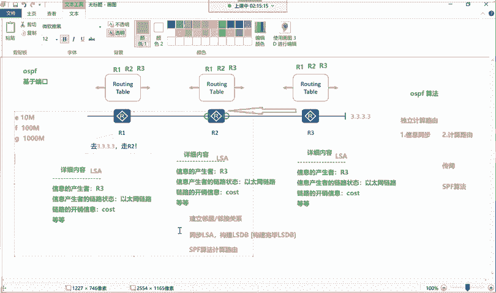