# 2023 新版华为认证HCIA+HCIP+HCIE全套视频讲解！一套视频让你从入门到精通！CCNA／CCNP／CCIE技术提升同样适用！ - P120：（持续更新）HCIE Datacom - 56.MPLS VP,N 跨域OptinonA - -Book思议8 - BV1W8411A7z8

电脑啊我电脑倒很少关机啊。啊，嗯，因为第二天呢，你一旦关机之后呢，要开很多东西是吧？我一般很少开啊，很少关啊，但是关的少的话，这个电脑容易出问题啊。大家可以看到我刚刚又重启了。😊。

是吧嗯习惯习惯就好了啊。😊，呃，如果不出问题的话，我一般这个能坚持个呃最长，比如说一个月都有过。啊，然后平常最短的一两周之类的，这种就是很正常的啊啊，除非电脑出问题了，嗯，大家得重启一下啊。

比如说刚刚就出问题了。😊，好，同学们呃，我们上课吧啊上课了啊。😊，然后我们接下来要讲的这部分内容啊，也就是说。嗯，MPSVPN的话，咱们。大概还得一周是大概还得一周啊。呃。

接下来要讲的部分呢可能会比较难啊，因为往期学习的同学啊呃他们的一个学习体会呢就是呃比较难一点啊吧，因为配置量非常多啊，呃基本一个实验呢要配1到2小时，好吧，呃，所以说呢后面这一部分呢就是配置量比较多。

嗯，以往期学习的同学呢，他们的一个反馈来说呃，后面这一部分呢也稍微比较难一点。呃，但是大家也不用担心啊，就是后面这一部分呢呃目前也没有考到好吧，呃，他主要觉得这里呢就是一个MSVPN的一个跨域。😊，呃。

这跨域大家可以理解成，因为我们之前学的都是单域的嘛，就是只在1个AS对吧？去做这种MPSVPN。😊。

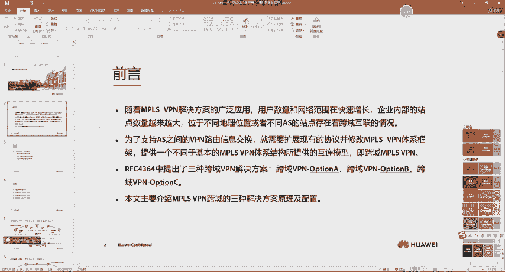

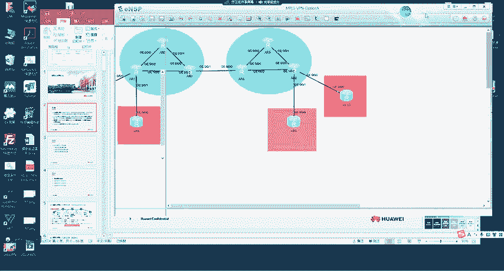

呃，跨域的话就是当我们有多个AS的时候，比如说两个V屏用户啊啊，比如说这张图一样，十跟七呃，是一个同同一个微品客户啊，但是呢他们接入到了不同的AS。

是吧那怎么样让AS之间啊不同的用户来进行通过MPS进行互通呢？嗯这个就涉及到我们所说的MPS跨域。好吧呃，但这一点内容啊给给大家说一下，大家学习的时候呢，也不要特别有压力。嗯，回头你做个实验。

实际上就容易多了。呃，大家学习的时候觉得比较难，主要是这个配置是非常多的啊，一本基本一个实验呢呃能做一俩小时啊，当然比较慢的同学可能做一一俩小时啊，呃，当然这部分现在没有考。

就大家在学习上啊不用有特别大的心理负担。😊，嗯，前面实际上就是一个。呃。啊，过两天我又说简单是吧？😊，对呃，我觉得是比较简单的啊，就是可能大家在学习过程中呢呃大家有不同的体会，好吧。😊，呃。

回来做个实验啊，实际上你就明白了。呃，前面这一些呢，咱们就不再重复去说了啊，因为这里呢就是单域内对吧？域内MPSVPN的一个工作原理。嗯，这个之前我们也给大家说过是吧？就我们首先在域内呢都有LTP。😊。

对不对啊，然后咱们在C一侧呢，把路由传递给PE呃，PE转换成VPV4呢，再传递给P2。那在传的过程中呢，它会加上1个RD区分唯一路由的下一跳呢，就是自己的环为口，然后会分为一个丝网标签。

这个丝网标签作用之前也给大家说过对吧？最终我们的P呢根据导入到实例中最终传的1个这实际上就是我们在单域内呢去学到的一个MP路由传递的一个过程然后下面就是一个数据转发的过程。

这个之前也给大家讲过就流量来了之后呢，我们要打两次标签一个私网标签一个是P标签丝网标签是让对方区分是哪个VP实力的P标签我们之前讲过就是P设备它没有丝网的路由啊以说我们打上一个P的防止在骨干网内产生这种黑洞问题然后跨域的一些实间背景这个我们来看一下啊。

就是我们企业规模不断扩大的时候呢就企业的站点可能属于不同的AS这个实际上是很正常的。因为我们可以去发现啊。😊，你当你的公司越来越大的时候呢，你可能在不同的地市啊呃去开这种分支站点。但现在我们都在呃联网。

所以说这里呢比较常见啊，但是对于有些工作呢需要在当地对吧？呃，你比如说像超市这种，我们会发现啊呃国内有很多比较大的这种连锁性超市啊，你像这个大润发啊，对吧？呃，华润万家这些对不对？呃。

他们不能单纯的只靠线上去卖货，虽然现在互联网发展的比较不错啊，但是呢像这些大型的连锁超市呢，他们可能也在不同的地市，你比如说呃北京有大润发啊，那在天津实际上也有，对不对？

就是我们的这种呃有些这个公司的性质呢，或者说企业的性质来说，他需要到当地呃，再去开这个办事处。😊，对吧好像华为有当地的办事处，对不对？那在这时候呢。😊，我们的不同的这个站点对吧，就不同的公司呢。

他在不同的地方啊，比如说有在河南的，有在河北的是吧？那他们可能接入的就不是同1个AS。对吧那当我们接入到不同A之后，呃，怎么样去实现这种比如说跨越AS的MPSVPN通讯呢，对吧？

那这里就是我们要学到的啊叫做多域的方案背景是吧？怎么样去实现不同AS接入的问题。呃，那跨域的时候呢，我们把这种行为叫做跨域啊呃，跨域的时候呢，我们还有一些问题嗯，什么样的问题呢？就是有一些技术上的难题。

需要进行突破。😊，那这个突破主要有就是。嗯，当然我们的工作原理是不变的啊，就是跨越了不同的AS呢，产生了以下的问题，对吧？啊，就相当于你一样，你要推一种新业务，在当地呢，肯定会遇到各种各样的难题是吧？

你比如说呃像这个。😊，这这个这个这个叫什么来着啊，猪脚饭对吧？嗯，你看在这个。😊，呃，广东卖的就比较好是吧？但是像比如说老师就在北方是吧？呃，北方就很少有这种，因为口味不一样啊，你会发现呢当地的美食呢。

你比如说到了其他地方呢呃也会有一些这个口味上的变化。对吧那MPVP也是一样啊，就是我们覆盖的范围啊越大的时候呢，也会遇到一些问题，对吧？那第一个问题呢，就是A之间呢不能运行LDP协议。😊，是吧呃。

因此无法在AS之间建立万层隧道。那这个实际上很简单啊，比如说我们把呃这些AS100AS200啊是吧？呃，我直接跑个IP直接打通那这样肯定是非常理想的方案，对吧？但是AS之间呢。

由于我们属于可能是不同的公司在进管理是吧？你比如说像联通跟移动啊这种公司啊，他们是有这种呃相当于这种利益竞争的对吧？比如说联通跟移动是吧？当我们跨域的时候，能不能把他们两个AS融为一家呢。

实际上这个是不太可能的啊，就相当于我们去说对吧？呃，让整个世界的人对吧？呃，变成一个大家庭，那这个是根本不可能的。😊，对不对？那所以说呢移动跟联通这种呢。

他们是存在这种商业竞争的那比如说我们把他们两个是吧IGP打通，那这个涉及到利益上的关系。比如说打通之后呢，是吧？如果交给不同的站点管理，哎，你管多少设备，我管多少设备呢，是吧？或者说你有一些私心呃。

你的网络中毒了，从而影响了我的网络那这种都是可能会存在的是吧？就相当于比如说我们站在国家立场角度上来看是吧？啊，如果是实现一个共同的啊，比如说你有啥我有啥啊，这种就不太可能是吧？所以说这是一种问题啊。

就AS之间不会运行LDP协议。很简单，就是跨域的管理机构之间在进行对接的时候，嗯，基本不太可能啊，他们去跑LDP而且你的IDP得是一样的啊，是吧？IDP一样的话，那对方也就知道了你的链路状态信息是吧？

这实际上就是一种安全隐患嘛，对吧？因为我们没有办法，就相当于你的银行卡密码，对不对啊，你肯定不会告诉一些啊，比如你不太熟悉的人。😊，对不的。那还有一段呢，就是P之间呢没有运行ITP协议。好吧。

然后缺省无法建立BDP邻居，建入无法传递VPV4路由。就是我们的两台PE之间呢，我们之前说过，就AS4之间的路由是通过BDP进行传递的啊，没有IGP协议。所以说他俩嗯至少目前还没有办法互通。对不对？

至少目前还没有办法互通。那回来呢我们也会有解决方式啊啊，中间这段链路谁管理啊，这一段啊就是各管各的。😊，能明白吗？你要去想啊，就是BDP这种协议，为什么它是一台路由器运行1个BDP呢？😡。

是吧那主要的原因就是因为比如说这是中国，那中国只好只管理好自己的ASBRP1就行了。美国你管理好你自己的ASBRP1，对吧？中间的链路呢呃在我的这个国家啊，对，各扫门前雪。对，没错，就是这意思是吧？

比如说在我们中国的领土范围内呢啊我们就保证这段链路的正常，对吧？那一旦你到了美国之后呢，咱们就没有办法跨越国土去保证了。😊，对吧那比如说是一台设备，你这种链路还好一点，对吧？因为链路与故障呢呃。

它会影响两个国家，对吧？但你相当于设备，比如说我们呃中国有一台设备ASBRP1呃，它里面储存了很多中国的当前的这个呃网络的这个路由信息等等之类的是吧？

那一旦你把这个设备交给比如说是美国负责管理的那这时候就有一种呃站如果我们站到国家层面去考虑的话，呃，是非常大的安全隐患。😊，是吧所以说这种呢嗯我们不太建议，对不对？所以说BDP设计的也比较呃精巧。

对不对啊，他考虑到了这种利益竞争关系啊，所以说他把这个AS的划分呢啊就一台路由器属于1个AS。😊，对不对？啊，那比如说这个路由器呢，它属于中国啊，那美国就管不了了。那链路的话，你们自己再去考虑。

你像OSPF对吧？因为他们的定位不一样，你看OSPF主要用于在企业网是吧？呃，那在这时候呢，它就不涉及到这种问题，对吧？IDP呢和BDP嗯还是有点不一样的，对不对啊？😊，那我们比如说上面这两种问题呢。

一个就是AS之间，我们没有LTP呃，第二个呢就是P之间呢，没有ITP啊，就PE之间没办法互通。所以说针对于上面的问题呢呃，我们有很多种解决方案，第一种呢就是option Aop B还有op C呃。

就是华为呢推出了三种解决方案啊，当然这也是公有的啊，就是厂商之间叫的不一样。嗯，思科好像叫什么op嗯一。😊，嗯，然后2A2B2C啊，还有一个C啊。呃啊，还有一个operation3好吧，然后这是思科的。

是以数字来进行命名的啊，华为的叫ABC啊，好吧，就厂商之间不同的叫法。那这里大家需要知道有三种方案就行了。啊。然后下面这些字的话，文字性的内容先不用看啊。呃，因为现在看你也看不懂。😊，还容易懵啊。呃。

所以说呢我们主要未来的学习的跨域方案呢，一共是有三种啊，大家大家概知道一个学习曲线啊，一个是A，一个是B，一个C。对你看这些呢现在你也看不懂的，对吧？什么跨域的VPNABR之间专用接口管理自己的路由啊。

也叫做呃VF to VF。😊，是吧啊，他的特点等等之类的。现在大家还看不明白啊，因为呃你还没学过，对吧？所以说我们一点点来吧，好吧。😊，嗯，我们来看一下啊，就是A嗯他有一个什么样的特点。😊，呃。

A是这样的啊呃，我用我的话来给大家讲一下，我们来看一下啊呃，比如说这边是C一呢，这边是C12呃，我们想让两个这个CE呢。😊，互相能够学到路由呃，A的实验逻辑是这样的啊，比如说呢A把这个划分到微P实例中。

对吧？然后我们站到ASBRP1角度去看对，你比如说你就是ASBRP1啊，你站到他的角度去看呢，这个接口属于微P实例。😊，嗯，然后他连接了1个ABRRPR。啊，那这时候就相当于ASBRP1是它的CE对吧？

就相当于一个单域的嘛，就是C1到ASBRRP1。能看明白了，就ABRP1呢把P2当成自己的C。哎，这不就相当于一个单预了吗？😊，那。😡，如果是这么一张图啊，我觉得大家肯定会能够把它做通。对不对？

N能做通。因为我们之间做的实验呢都是基于这种的。😊，然后我们看到站到另1个AS来看待这个问题呢呃在ASBRRP2的视角中啊AASBRP1它也相当于它CE啊。就我们把这些口也划分到啊这VIF中。😊。

对不对？然后呢，哎它也相当于一台CE就ASBRRP1。所以说这个这略系统呢呃逻辑抽象出来的图呢啊就是下面这样。好吧，啊，就是下面这样啊，就是也是一个单玉的。😊。

那这时候我们如果分开把每个AS都去单独做部署，哎，他们之间能不能通呢？实际上是可以的。好吧，这时候实际上是可以的，就是我们的每个ASBR呢，对吧？把对面AS的ASBR，你就把它当成连接了一台CE啊。

正常的做配置就可以了，这时候就能通了。好吧，那这个呢我们通过一个实验啊，待会儿先给大家做一下呃，做完之后呢，我们再去详细的去看一下呃，像这种控制平面的传递过程，对吧？呃，还有数据平面的这个转发过程。

那首先在这里呢，我有一个实验啊，我先把这个实验呢简单的来配一下，好吧，呃，在这里呢，我把这个删掉啊，就是我们现在不需要那么多嗯V频。😊，我们来看啊呃，现在我是这样的，就是在这里呢。

我们模拟1个AS100。然后在这边呢是1个AS200。😊，我先把他们基础的IP地址给配好，配好之后呢，我们再去做一下这个MPSVP。嗯，刚刚我做了一些配置啊，就设备名字都是改好的啊。

但是配置呢还没有去做啊。😊，嗯，12。1。G1-020。一。这样啊我把这条链路删了啊，咱们就不要这条链路了。😊，你看这个图里就没有对吧？我跟图一样啊，就不要这台亮了。嗯。

刚开始我们学习啊不要觉得不要搞很复杂的啊，就尽量简单一点。呃，然后我们创建一个楼百零接口。1。1。1。1。然后在ASBRP2的0-0-0。0。0-1。然后三这边呢是。0告0-0。辽0。0。23。3。啊。

老0接口。然后四这边。15。4。然后五这边。五六。5。这一个实验很大。对吧来到MPSVPN，你就发现呢。呃，这个要做的实验配置就比较多了。嗯，再到后面呢，这一个时间能配两三小时。哎，非常大啊。17。7。

然后起个楼百林。7。7点7点7。然后八这边呢啊八没有。8我们现在没做啊。一。234567跟10。十这边呢我们用。116。10。好吧。然后起个楼板临接口是10点10点10点10。呃，这时候我们来做一下。

我们这样的，就是我们先把这个A4呢当成他的一台CE啊，大家可以认为呢，比如说我先把这条线删了啊。这样对吧？是吧。只不过呢之前我们学习的他是在AS65001嘛。对不对？现在我们给他换到A100了。😊，啊。

就是这么一种关系啊，就是把在ASBR上呢。😊，啊呃，我们把对面的ABR呢当成一台CE看。所以在这时候呢，我们首先得比如说我要把7跟四做通。对吧呃，这时候怎么做呢？我们还得按照之前的配置步骤啊呃。

先去配置公网的IP是吧？所以说我们先把AS100的IP配完。😊，怎么样呢？就是M224。IID。嗯，1。1。1。1，然后二这边。2。2。2，然后三这边。3。3点3。3。好吧，然后在。AR1上MPS2。

然后LDP给他开了。接02022。然后。2的G0-0-0。0-0-1。然后三的G0刚。3的G0-0-0。好吧，然后我们正常连接用户的接口，不是呃不划分到这个MP24，不不开启MP24嘛，对吧？

现在没开啊。😊，呃，我们做完之后呢，把MPS配完嗯，还有ITP也没配呢。呃，我们在这里呢A100跑个ISS啊。😊，SS1。嗯，然后n49点。点0001。00。是吧呃，然后这级别我就不设置了啊。

我们让他走默认的吧。然后娄柏玲。这个是MP4LSID1。1。1。1。呃，2这里MPSRSID这是2。2啊。啊，配过了，然后我们给他起个ISS。他是49。0002。G0-0-02S以内部。0。0-1。

然后还有自己的楼百林。然后三这边呢。49。0003。0-0-0。然后还有自己的low柏林。好吧呃我们把这个做完之后啊，做完之后呢，我们到呃AR上来看一下第四这个SSP2。嗯，当天邻居都是建立的对吧？

当然有级别一有级别2的啊呃，然后再去看一下diplayLDP。第四代MPSLDP3。啊呃，当前跟三的邻居还没起来呃，现在我们可以看到啊是一个呃连接已拆除的状态啊，没有建立连接啊，所以我们稍等一会儿啊。

现在就起来了。起来之后呢，他们的LDP呢就会去建立这个LDP的隧道啊，LSP所以我们在一上呢可以去看到三的，这就是我们配单域的一个过程啊。碰完之后呢，我们把这个T来规划一下。嗯，比如说RD呢。

大家都用这个。😊，一码号一啊，然后RT呢我们用双向的啊，ERT跟IRT呢啊都是一码号一啊，我们就用一样的啊，带会好配置。然后在这边呢，我们用的也一样。对吧呃，做完之后呢，我们在ARE上呢IPVP。

比如说我创建个叫VPE。嗯，ID呢我们给他配的是一码一，然后IT的话是双向都是一码号一。对吧呃，做完之后呢，在G0-0杠0接口。VPE给他绑定进来，然后配一下IP是17。1。嗯。

然后在A23这里呢也一样。VPNinVP1。阿迪男衣毛衣。然后。RT呢是这个一冒号一，然我们有双向的。然后在G0-0-1接口下。然后再去给他配一下IP10。0。34。3。对吧那咱们就不谈了。呃。

配完之后呢，我在这个A27上。注意啊。创建一个interface。创建1个BDP，比如说A27呢，我们就把它放到BGP7一下啊。呃，P210。0点。17。1。17。1啊。然后AS100。卡卡了吗嗯？

现在好了吗？现在好了吗？好了吗？同学们。饿了是吧？嗯，再忍会儿啊，待会咱们休息的时候再吃，好吧。😊，呃，大家可以看到啊，就是我现在呢刚刚我把这个接口呢也绑定到了VPN1下对吧，给他配的ID和RT啊。😊。

嗯，现在呢我在做这个AR7啊，大家注意，我在它上面呢起个BDP7。呃，然后跟A2一呢去建立了邻居。建立完邻进去之后呢，我们在呃，比如说network对吧？呃，network这个7。7。7。732。

好吧呃，那这条路由他待会呢，我们在A21上BDP100。IPV4familyVP。也是他也是。啊，V片一。然后我们在A21上呢，跟17。7去建立BDP邻居。

然后我们在AR一上的IPV4familyVPNV4。啊。P23。3。3。3嗯，in内。啊，不对啊。P23。3。3。3。A10。P23。3。3。3，那个inface60嗯。

然后IPV4family vPV4。然后P23。3。3内部。我们在A21上呢，就是跟这个V平实力下的A27去建立邻居啊吧，然后跟三呢去建立VPV4的邻居。然后我们在三上呢，BDP100。啊，P21。1。

1。1ASE0。1。1。1。1。耐个inface6柏玲，然后IPV4family vPV4啊，P1。1。1。1。呃，A。嗯，应该应label。对吧那这时候呢，我们在一和三之间去建立。MPIBP邻居对吧。

就VPV是邻居。那待会儿呢，A27发布的这7。7呢，那它就会传递给A21对吧？所以说A21呢呃就能够收到这条路由。在VP实例中收到转换成VPV4。对，转换成VPV4的同时呢。

还会给他打上这个ID啊一码号一。对吧然后打上1个ERT。对不对？那这个路由呢，待会儿还会传递给三。那三收到之后呢，也是一样。D4类BGPVPV42table。说到这个7。7呢，根据RT导入到微P实例中。

对吧那这就是我们在进行一个单预的时候的一个相关配置。那比如说呢我们来想一下啊呃在A23上，实际上我们能拼通这个接口，是不是就相当于能拼通它连接的CE啊？这个意思大家能明白吗？可以吧。

你只要能够骗通他在唯拼实力的这接口，就不都相当于他能骗通CE嘛。对吧？我们以这个接口为例来进行测试呢。比如说呃我们在A23上注意啊。😊，注意我在A23上怎么办呢？嗯，IPV4family VPN。

ins呃呃，然后我在VPNE项。好吧，然后inport detail呃，就是我把直连呢给他引入进来。呃，引入进来之后呢，他就会去产生一个。唯平V4路由对吧关于34。0网段的。

当然接口还会自己产生1个32位的路由啊，这个之前给大家讲过啊，那这些路由呢最终也会传递到7上。因为你通过V平V4传递A21A21根据RT导入到唯平直力再传递到7上。所以说我们在7上呢就可以去看到啊。

他就学到了34。024这条路由啊。比如说我现在P呢杠A7。777到10034。3是吧？因为它接口是34。3，我们发现是能够通的也就是说这个我们做跨域optionA的时候。

比如说在AS100是不是就相当于一个单域的配置啊。😊。

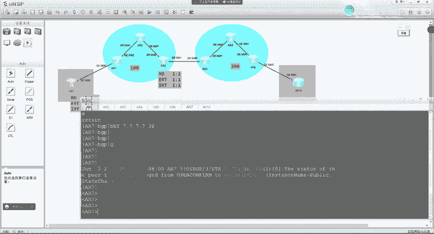

这个意思各位同学能够明白吧？明白的同学敲一啊，这个没问题吧。好吧，然后呢，我们再去考虑AS200A200怎么样去看呢？嗯，也是一样的那这是一个正常的嘛，P和C相连。然后我们在A24的角度上去看啊。

现在你站到四角度上去看。😊，它连接的这个三啊，不就相当于我们把三这个给它删掉，它连接着一个。对吧啊，连接了1个CE嘛，对不对？那这时候我们给他拉过来，回来之后呢，我们再把AS200来配一下。😊。

A200怎么去做呢？啊，我们先在4上对吧？呃，首先这样就是在。这个。也起1个IPISS啊。嗯，然后。然后n49。0000点0000点0004。00。04。00。好吧呃，做完之后呢。

然后再G0-0-1SS enable，然后在自己的楼派0IS enable。然后在5上呢也是一样SS。啊，然后这是0005interface0-0-0。然后也给他开启SS0-0-1呢也开是吧。

还有自己的还回接口。然后在五这边啊，在六这边呢也是一样。嗯，这就是6啊，然后interfaceG0-0-0。然后还有low柏林对吧，又得从头再配一遍。嗯，配遍之后呢，我们再去起这个MP4呃。

在4这边呢就是MPS。啊，他说我们得配RSID是4。4。4。4。啊，MP24嗯MPLDP，然后在G0-0-1MP4。然后LDP给他打开。然后在五这里呢。MP4LID是5。5。5。5。嗯，0。0。0。

然后0-0-1。然6这边呢。是6。6。6。6。嗯，现在全局试图下开启，然后在接口试图下开启是吧呃，开完之后呢，我们来5上看一下啊，5上呢SSP呃，有两个SS邻居是吧有级别1的级别2的呃，做完之后呢。

我们到6上来看一下M4P是吧呃，他就会有45的这个LDP的P是吧？这我们把公网的ITP啊跟LDP配完了。😊，呃，拍完之后呢，我们再来规划一下IT呃，这个IT呢你可以跟这边是一样的啊，可以一样啊。

但是呢我们为了更加的给大家更好的给大家区分啊，这是我配不一样的。😊，呃，然后ERT呢我们都用阿玛哈啊，然后IRT的话啊也都用阿玛哈。好吧，然后在这边呢，我们用AR4上的VPN实例是这样。呃。

然后在6这边呢是这样的啊，比如说我现在在4上呢，就是IPVP啊VPE嗯，RT呢2尔玛哈，然后RT的话也是2尔玛哈2。

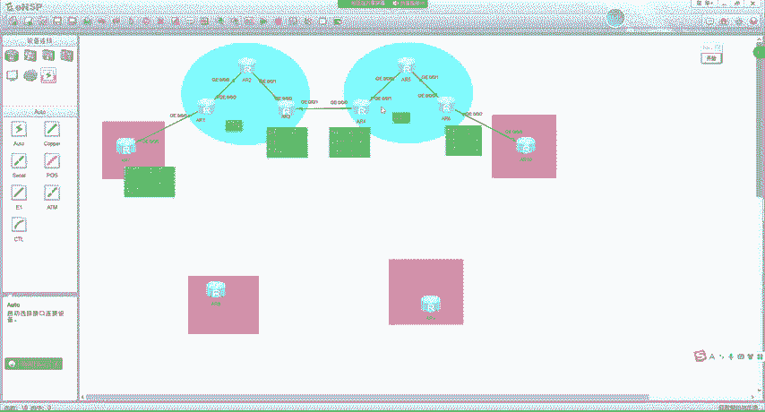

嗯，然后这个配置呢，它跟我们的这个AR6是一样的是吧？我就直接给他刷进去。刷进去之后呢，我们再回到A24上来。A24呢，我们把G0-0杠0接口呃它连接着CE嘛，呃，把它划分到微平实力下，然后是10。0。

34。4。对呃，然后在AR6这边呢，是interfaceG0-0-2，我给他。interfaceG0-0-2。给他划分到唯平实力，然后给他配一下IP是10。0点，是116。6，好吧。呃，这里做完之后呢。

我们再把这个AS之间的路由协议跑一下。好吧。呃，这个在跑的时候呢，我们在这里呢A24上。嗯。啊，A24场我先不让他跑啊，先不让他跑好吧。

我在A24场呢这样嗯BDP100啊吧IPV4family VPN VPNE。😊，然后inport detailed就把质连引入进来呃，引入进来之后呢，它就会去产生。嗯，这个。在微PBGPVP实例中对吧？

产生一台IPV4路由啊，然后变成唯PV4。对吧啊，这个接口的32位主机路由大家就不用管了啊，因为它默认自己就会产生。😊，好，然后我们在A24上呢嗯200是吧。啊，对，2两啊，我写错了是吧。

安度BDP100。😊，我们这里应该是BDP200啊BDP200。然后VP一对吧？呃给他引入进来。引入进来之后呢，我们P26。6。6。6AS100A200应该是。啊，瞧习惯了啊。P26。6。6。6啊。

A200呃，然后P26。6。6。6，然后更新原地址。然后IPV4familyVPV4。P26。6。6。6啊，把这个邻居给他激活。大家注意啊，我现在呃咱们依然是没有用R的啊。呃，在A26这边呢。

也是就是BDP200。然后IPV4family嗯VPN instance VPNE。首先呢它P10。0。116。10啊，比如说我们在AS10种。啊，然后在A210上呢，这个。BDP10。P210。0。

116。6AS200。然后network10点10点10点10。32。那待会呢6跟十就会去建立这个BGP邻居呃，建立完成之后呢，我们再在6跟4之间去把这个VPV4邻居给他激活。P24。4。4。4。

S100。然后哎。啊，P2。啊，安度皮尔4。4。4。4。P24。4。4。4A200。然后皮尔4。4。4。4那个inface娄0，然后我们再去激活他的这个。VPV是邻居。对吧，然后我们回到四上呢。

因为他刚引入了直连，嗯，所以说呢它就会去产生一条34。0的微PV4路由呃，这个路由呢它会传递给6，所以说在六上呢。嗯，也能够产生。啊，传递啊，当然现在跟六的邻居可能还没建立啊，我们看一下。奥片尔。嗯。

还是在act type状态啊，我们稍微等一会儿啊。建立了对吧？那这时候呢，四会给六传递这条10。0。34。0的路由。呃，所以说呢六就能够。收到这条路由。对吧。他也能够收到。嗯，收到这条路由之后呢。

T匹配会导入到VPN实例中啊，最终呢会传递给10。所以说呢十就能够学到这个34。0，对不对？比如说我们这时候去拼一下嗯杠A10点10点10。10，到10点。0。34。4。对吧也能够互通，对不对？

那这时候我们就相当于是把PE跟CE做通了，已经。所以这个意思大家应该能看懂吧，是吧？就很简单，就是每1个AS呢，我们当成单域的配置。😊，那这里呢注意啊，就是如果我们变成了跨域之后是怎么样呢？

比如说七对吧？老师七跟十能够通吗？实际上这时候是不行的啊，这时候为什么不行呢？我们来考虑一下啊，现在比如说我们去看十呢，嗯它是没有。😊，七的路由的是吧啊，但是呢七的路由它会怎么样传呢？他这样传的。

比如说我们有一条7。7。7。7-32。是吧P和CE之间呢传递了一条IP路由。呃，ARE呢会给他打上这个RD。😊，E码号一是吧呃，然后再打上这个RT嗯，E码号一啊，当然是ERT啊。

然后当然那他会会去分配一个死亡标签。对吧那这个四万标签呢，我们可以来看一下，它分配的是多少。嗯，是1026对吧，自己分配的，而不是接收的，是自己分配的啊，1026。

嗯，他就有一个私网标签是1026啊，这时候他要转发给自己的VP人去邻居A23啊，3就能够收到。

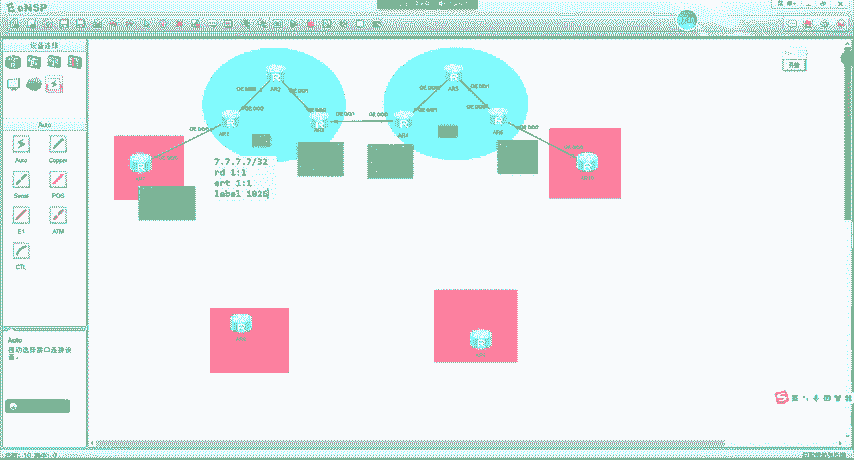

对吧三收到之后呢，嗯会导入到微P1例中。

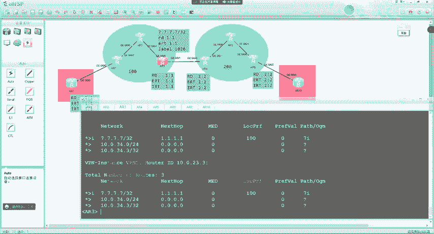

那比如说我们让三跟四之间嗯，你当然用OSPF跟这个呃SS也行，对吧？就是你把它这里呢用OSPF或者SS打通往里面导行不行呢？可以，也是一样的啊，就是这跟你直接连接一个C啊，没有任何变化，对吧？

就这里一段呢，你跑BDP啊SSOSPF都可以。

那这里呢我们演示的主要是BDP啊，比如说这时候呢三收到这条路由了，已经是7。7。但是呢四没有收到。比如说我们在四上看呢。😊，他是没有的。对吧那怎么样让他传递给4呢？我来想一下啊，就是。😊。

P给CE传的不就是一条IPV4路由吗？这个大家应该还记得啊是吧？所以说呢我们在三和四之间呢，这样BDP100。😊，对吧IPV4family啊VPNin。这不是VP一吗？呃，P210。0。34。4。对呀。

就是我让他跟四呃去建立邻居关系。然后AS200。这不就相当于你跟一台在三个视角中，他跟CE监立邻居不就是这么建吗？是吧？你想我们刚才六上的配置不也一样道理吗？在VPE下啊，116。10，然后A10。😊。

对吧这就是跟CE去建立邻居的嘛。然后在四这边呢，我们以相同的角度，就是在站到四的角度把三看成一台CEIPV4family啊VPN。😊，然后VP1P210。0。34。3A100。对吧。

就是我们直接去跟CE去建立邻居关系嘛。对不对？是吧然后这时候呢我们稍等一会儿呃，等一会儿之后怎么办呢？我们等三跟四的邻居up起来display BDPVPNV4嗯2 table。嗯，奥P尔。

比如说我们等他的邻居 up不起来。现在还没起来啊，稍等一会儿。😊，好，那现在三跟四的邻居呢啊就已经建立完成了，是吧？然后之前给大家讲过啊，就是P和CE之间呢，建立的都是IPV4邻居。

所以说三会把一条IPV4路由。😊。

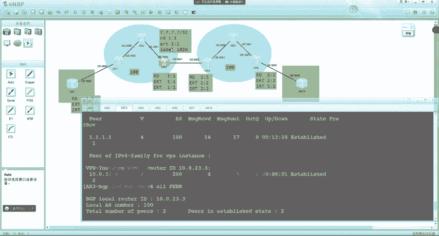

直接传递给4了。然后我们站站到四的角度去看，那四是不是相当于从CE收到一条7。7的路由啊，它跟7之接传递给一一不一样。一样吧，对，是一样的啊。这里大家需要注意。所以说三给4呢就会传递一条IPV4路由。

那A24收到之后怎么办呢？啊，diplay BPVPV42ot table我也可以去看到啊，他收到了一条7。7呢，是10。0。34。0给他传的。😊。

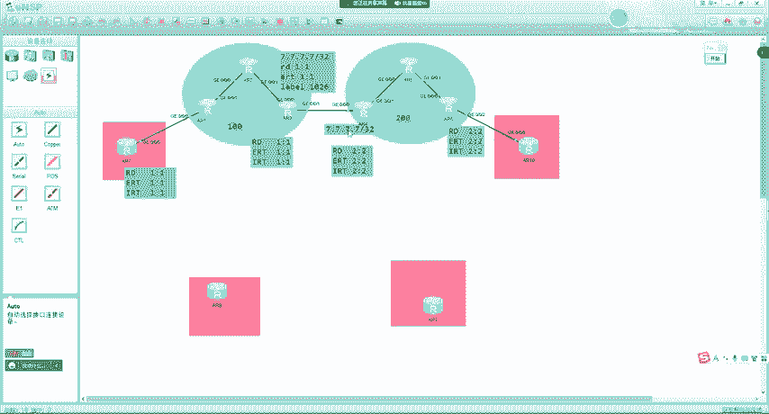

那给他传递过来之后呢，他就会重新打上1个RD，打的是多少。是三自己的ID啊是吧，是2马哈。所以说这时候呢，站在四的角度去看，他从CE收到一条路由啊，他就会打上。😊。

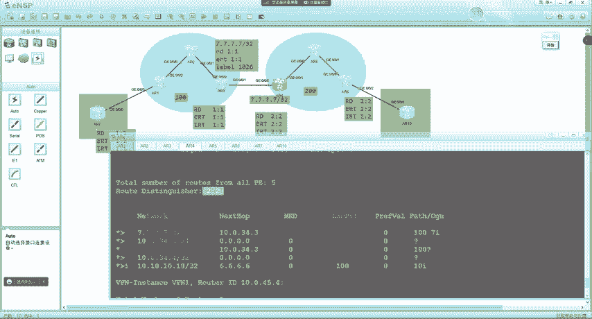

1个ID我们重新来写一下。这个RD呢？就是。阿尔曼哈尔对吧，然后打上1个ERTERT也是阿马哈那，因为我们配的是阿马哈尔，对不对？那我们来看一下7。7。7。7。😊，是不是打上了1个RD呀，对吧？

以及ERT28哈，那以及呢重新给他分配了一个死亡标签，叫1027。😊，对吧因4他收到这条路由之后，IPU4路由要转成微平V4路由，对吧？嗯，1027。那这个路由呢，它就会传递给自己的VPV40居6。

那在6上就很简单了嘛，是吧？根据ERT导入到VPN实例中，所以说AR6呢DBPVPV4 table是不是就能够收到这个7。7啊，对吧？然后导入到VPN实例一中。

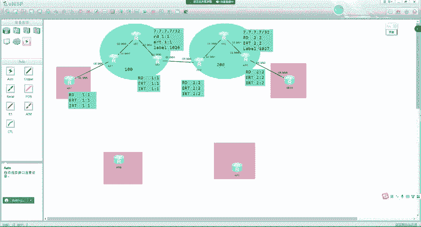

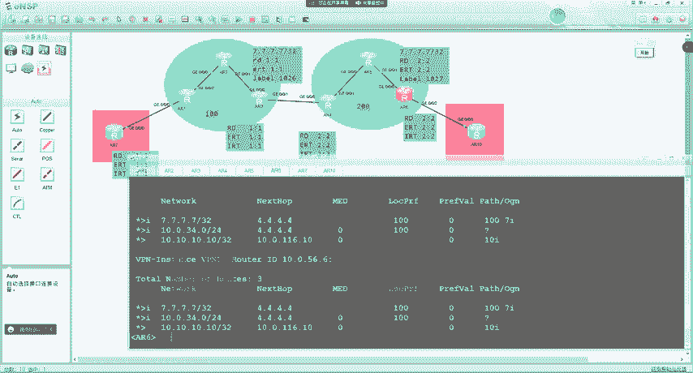

啊，然后最终呢再把这个7。7的IPV4路由。传递给石0。是吧然后十就收到了。是有没有学到7。7啊？有吧。对不对？他就学到了，那反之过来十的路由传递也是一样啊，你把IPU410。1传递给6啊。

6打上RD之后传递给4是4再把IPU4路由传递给3，对吧？3再打上RD传递给一。😊，啊，然后一呢再发送给7啊吧，然后所以说呢，在七这边，现在呢嗯也能够收到10点10点10点10。😊，对不对？

那比如说我们去聘一下杠A7。7。7。7去访问10点10点10点10。呃，我们就发现能通了。对吧那这个同时怎么样的呢？可能大家比较疑惑啊，比如说我们在十这边呢聘。😡，杠A10点10点10点10嗯，到7。

7。7。7啊，也是能通的。那这个通的过程实际上是这样的啊，就是我们的原IP地址，它不是10点10点10点10吗，然后到目的IP地址是7。7。😊，就是他首先会发1个IPV4的数据给6嘛，对吧？

然后我们按照单域的转发逻辑。六在这里首先要搭上死网标签是1027，对吧？这时候在六上关于这条路由的下一跳，你注意啊，我们是从CE接收到路由再传递给这边的IBP邻居对吧？这个行为之前给大家说过。

吓一跳会自动变成P的环回口。所以说他看下一跳呢，是4。4，他会去打上4。4的叫LDP的标签。

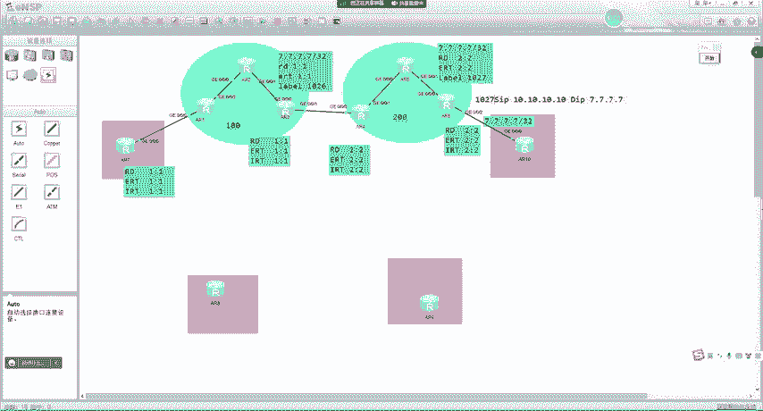

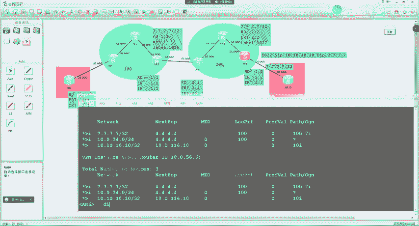

所以就打上了1个嗯1024。那那就会带着1024的标签呢啊就这样发送给了。

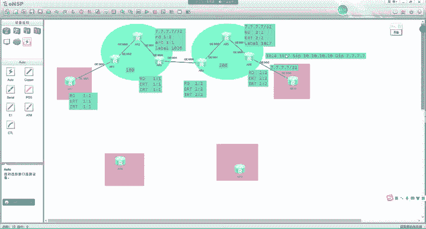

A25。A25收到之后。就查找RSP吧。对吧他收到1024呢啊倒数第二条弹出。

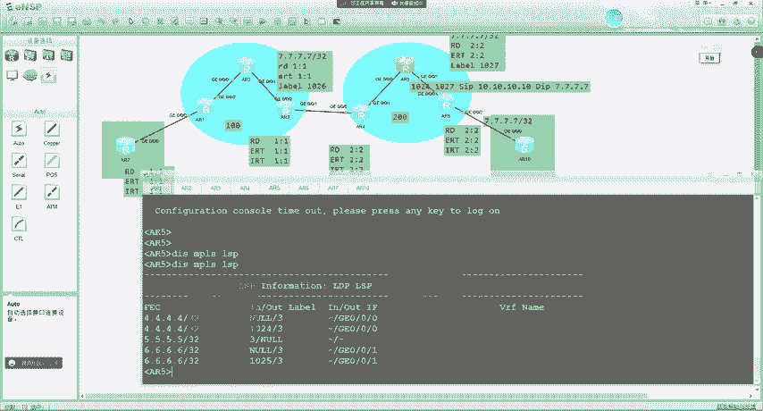

就是只有1个1027。发送给4了。那这不就相当于PE收到一个死亡标签，查找唯品实例嘛，对吧？查找唯品实例diplayM4LP。😡。

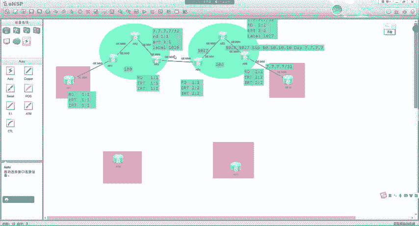

那。1027对吧呃，然后VPN一就是查找VPN一下的路由表。我们来看diplayIP入table。

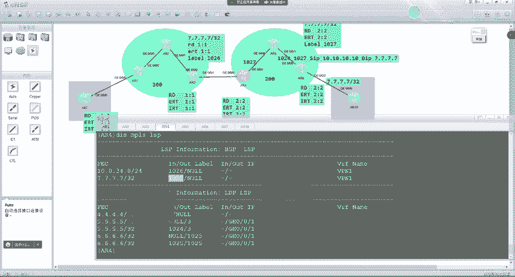

嗯。微平一。对吧7。7转发给34。3。而我们的P把数据发给CE的时候呢，嗯是不带标签的。所以说这里呢就只有一个。IPV4数据。对不对？然后我们再站到A23的角度看待问题呢，就是在三的角度来看。

他就是从CE收到1个IPV4数据啊。😊。

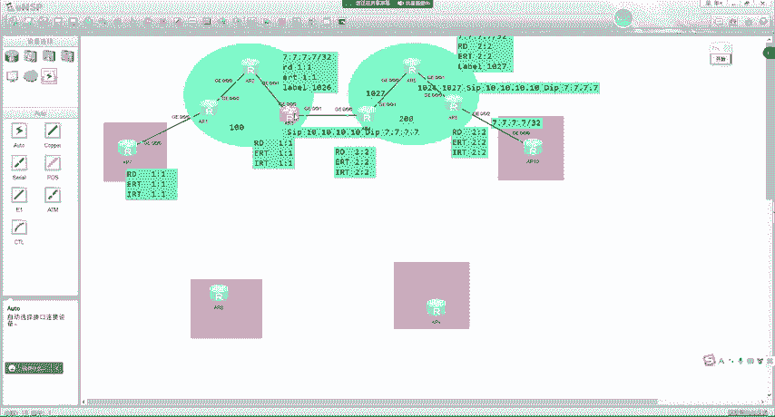

对不对？跟这边有没有区别啊，没有任何区别吗？😡，对吧所以说A23收到之后呢，嗯他已看目的地是7。7，他也要去看DBTP呃，VPV42rootingtable。7。7。7。7是吧。

我们发现他的数案标签是多少，接收到的是1026，这不就是我们刚刚看到的吗？是吧，他会再打上1个1026的标签。😊。

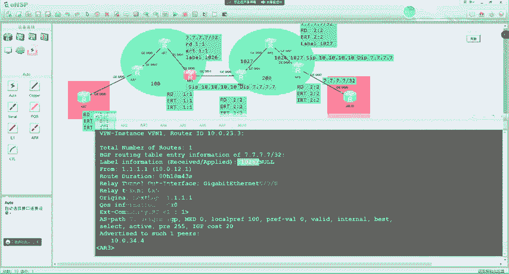

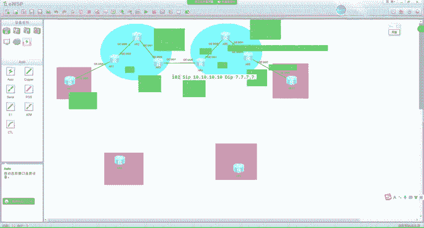

然后三接收到这条路由呢嗯他的下一跳是1。1是吧？

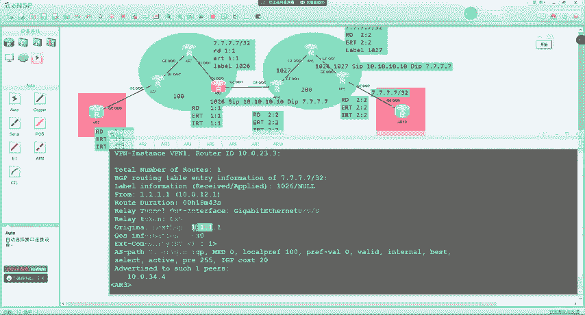

第四类MPS4RSP他一看1。1是1024。是吧然后再打上一个。1024的标签啊，这个数据呢就发送给二了。

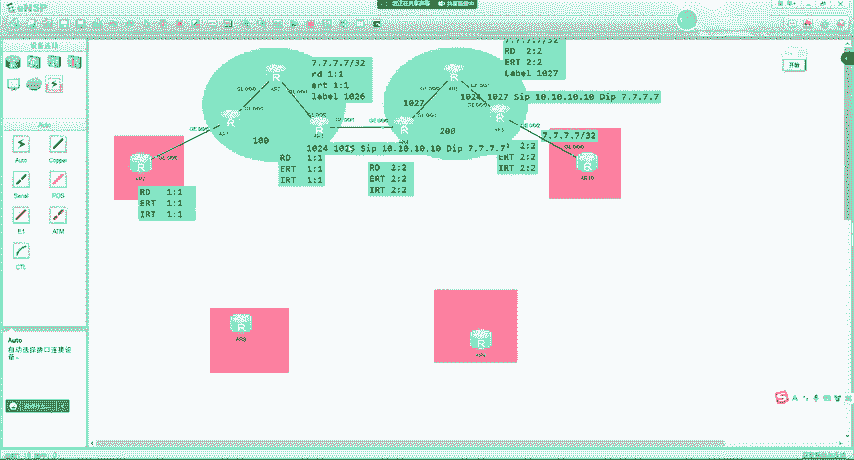

2、收到1024呢这就很简单了，单玉的大家都理解对吧？说到1024倒数第二条弹出就只有一层1026给移了。😊。

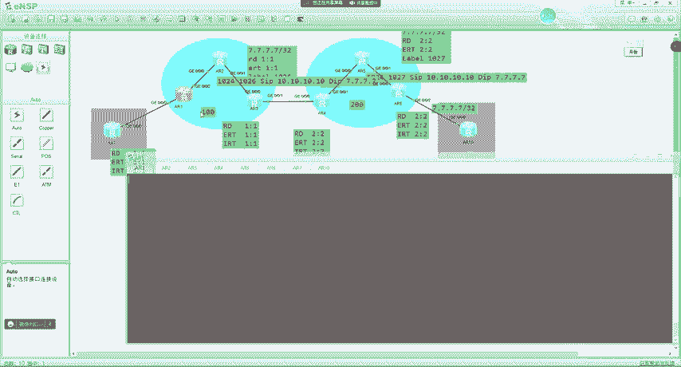

所以说A21他收到1026之后呢，他就知道要查找VP1啊，最后呢再把IPV4数据。发送给7。那这样就通了。那回包也是一个道理啊，所以这个过程大家看明白了吗？明白同学需要异议啊，没问题吧。好吧。

那这时候呢，我们通过抓包呃来看一下啊。😊，那首先呢我们在这个。A26嗯它的G0-0-2，我们先抓一个啊。抓一个之后呢，我们在。等一下，我这个抓包开的也稍微有点慢。嗯，在A25的G0-0-1也抓一个。😊。

嗯。抓完之后呢，在A24的G0-0-1也抓一个。然后在A23的G0-0-1也抓一个。好吧，然后最后呢，我们在AR2的。嗯，G0-0-1就23之间的互联链路。然后咱们也抓一个啊。呃。

按照我们刚刚所说的分析呢，在这里就是IPV4数据。哦，我直接打开IPV4啊，因为这个比较长了啊。嗯。嗯，在这里呢它就是一个。呃，IPV4数据对吧，然后在这里有两层标签。嗯。然后在这里呢。

只有一层1027。对吧呃，中间这里呢也是只有一层IPV4。嗯，在这里有两层是。然后在这里只有一层。啊，不是100啊，是1026。刚我没写是吧？这应该是一层1026。好吧。

那比如说呢我们现在在时上啊去拼一下7。7，现在是能通的对吧？然后我们首先来看第一条链路，应该是第一个。啊那这里我们就可以看到它是一个普通的IP数一次数据对吧？10。10到7。7的。对不对？然后在这里呢。

应该有两层，1024跟1027。然后我们看第二条链路。嗯，在这儿。对吧就有两层，外层是1024，内层是1027。啊，因为死亡标签是1027嘛，1024跟1027。然后在这里呢，应该只有一层1027。嗯。

往上拉了。对吧就只有一层1027，依然是10点10访问7。7的啊。是吧因为倒数第二条弹出了嘛呃，然后四发给三的呢，这里就是纯的IPU4数据了。嗯，这应该是在这里。啊，我来看。

那这就是一个纯的IPU4数据是吧，没有任何标签。对不对？然后我们的数据呢再发送到这里之后呢，应该有两层，1024跟1026。但是我就抓到这里了啊。嗯，那我们往上拉一下看看。啊，1024跟1026。

对吧然后还是10点10访回7。7的啊。那这个数据呢，最终到达2跟1这里呢，就只有一层1026了。对吧？这个单预的之前给大家都抓过了啊，我就不再重复抓了啊，最终呢再把IPU4数据发送到题那这样就通了。😊。

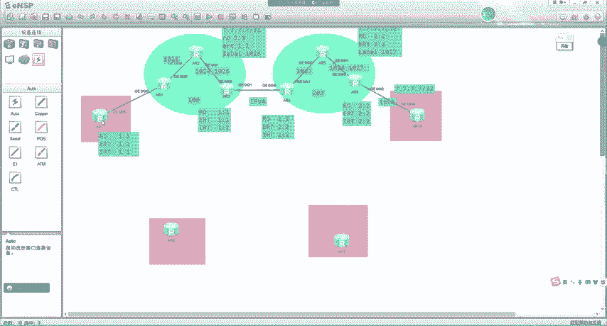

好吧，而我们刚刚所演示的呢，对吧？为什么我刚开始做两个单预呢？比如说现在啊呃我在A23上。😡，BDP100IP4miP1对吧？那刚我们不是引入了直连嘛，对吧？我引入这个直连的目的呢，是让大家去看啊。

我们再去做跨域为Pop的时候呢，实际上就是把每个设备当成一个CE去当成一个PE去配了，就是把BR当成PE去配了。好吧，就是比如说我们把安度给它删了。然后在4这边呢也是一样的。😊，BDP200。嗯。

IPV4family VP VPE。然后把引入的直连给他删了。那么在这时候呢，十跟七啊也是能够进行正常通讯的。这里是为什么呢？呃，刚刚给大家演示引入质量，就让大家去理解每一个单域的配置。

而实际上现在我们的十呢呃只需要对七进行访问。而对这个互联网端如果没有访问需求的时候，实际上这一个可以不进行引入。

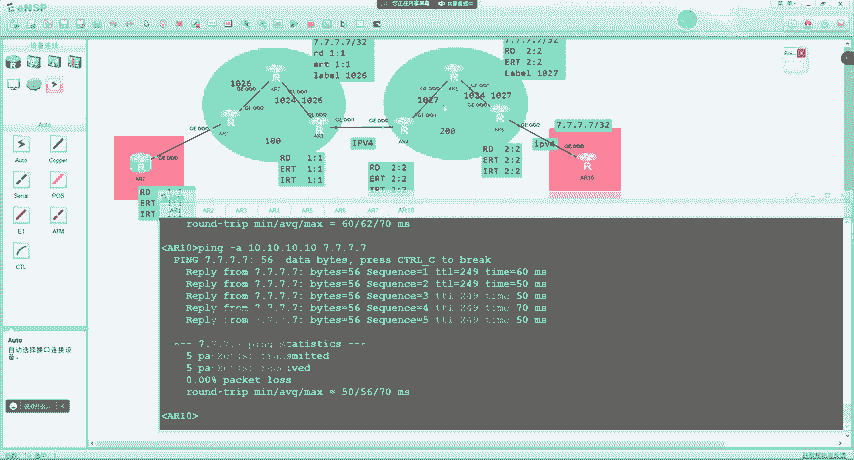

这个大家明白了吗？明白同学敲一啊，这里都没问题吧。好吧。行，那这就是咱们讲的啊这个跨域的嗯option A。那我如问一下大家啊呃，比如说。😊，在这里就是我们每个域内配R。那也有一样。

这个依然是像单玉一样去进行配置啊，这个各位同学能够明白吗？比如说老师我有很多个啊这个CE。😡，啊，这个P对吧，这个R的配置呢，你只需要在它上面单独去配就行了。好吧，然后每个域内呢呢，R都是单独配置的。

😊，好吧，所以说这里我没给大家演示啊，但是大家知道如果有R的话，你就要AR1跟AR2键，对吧？AR2跟A23键，只不过路由传的时候再经过一下AR2嘛。😊，是一样的意思啊，对吧，因为我们当前设备比较少啊。

我就没有去配。但这里我给大家说一下，因为我们当前在2个ASBR之间，大家可以发现我现在用的是EBDP对吧？就是用了BDP去传递了路由。但是比如说我用ISS。😊，要不要把。BDP引入到ISS啊。

就你这边接收到这个3。3的BDP路由，要不要引进来，然后再传递给4。😡，要不要是需要的对吧？反之四这边接收到10点10呢，也是需要引进来再传给三的。对传递给三之后，三的ISS要不要再建BDP啊？😊。

要不要？也需要吧。对不对？就是跟我们去连接1个CE是一样的。你就想PE连接CE。😡，对吧BDP要签ISSISS也要建BDP。😊，那反过来，站到四的角度再去看呢，PE连接CE。对不对？40P呀。

BDP减ISSISS减BDP。对吧也就是说，如果我们用IGPIS呢多了一步双向引入，那OSPF是一样的道理。但是有一点，这个OSPF它有一个特殊点是在哪里呢？这里给大家说一下呃。

我们上节课说到有1个DN嗯，大家应该还记得吧。😊，对不对？那个蒂恩比特的作用。是吧那DN的时候呢，我们讲到了一个他置位的条件，就是我们把这个VPNV4导入到OSPF什么样的OSPF呢？嗯。

就是这个OSPF进程呢，它是属于VPN实力的。比如说我要在三上去起OSPF的话，我们肯定是这样去配的，就是OSPF1啊，VPNinVPN1。😊。

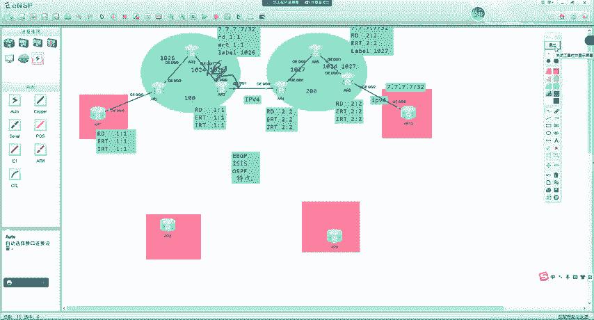

对不对？你肯定是这样去配的。但是如果你这样去配置的话，嗯，比如说我随便给他配个呃rootID啊roI我就不配了。比如说我随便引入一下呃，inport BDP。😡，好吧嗯，第四类OSPFLDB。😊，嗯。

欧瑞有林。然后di四playOSPF。RCDB对吧？我们发现这个7。7虽然进来了，但是你如果仔细去看的话，它会有一点。😊，啊，就是他的。di四playOSPFRSDB7。7。7。7。嗯，ASE。

对吧你会发现呢他的DN是质一的那他的DN一旦质疑，你发给四。如果四起的也收OSPF，他是不是就不计算了？😡，之前给大家说过啊，上节课说的那DN的逻辑就是进入到微P实力下的OSPF会质疑。

然后站到四的角度去看呢，从微拼实力下的OSPF收到一条DN等于一的路由嗯，他就不计算了。😊，然后这个怎么样去关闭啊，大家还记得吗？就如果你用OSPF呢对接，你还得在OSPF下去敲一条命令。嗯。

就是DN检查啊，在4上去配啊。或者说DN的智位对吧？你可以在三上去配呃，不让他置为DN。比如说针对于五类啊对吧？三类啊、七类啊。😊，啊，现在只有5类啊，对吧？就是我们不让他置为DN。

那如果你不让他置位之后呢，这时候4才可以呃进行正常的计算。然后我们再去看7。7，他就没有DN了。😊，好吧，然后这时候呢，A24就可以正常计算了。因为他们两个本身AS不一样嘛。呃。

这个roott是防止不了它的路由计算的。😊。

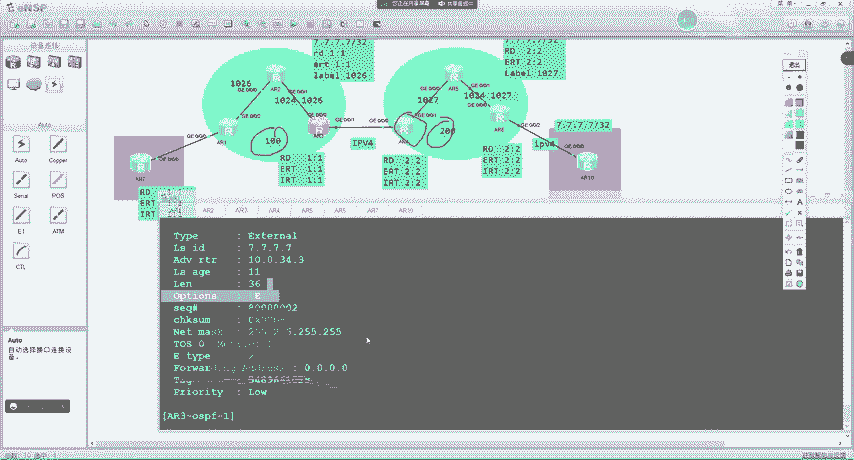

好吧。所以如果我们要使用OSPF的时候，这里大家需要关注的是什么呢？就是。需要在。ASBR上。啊就2个SBR上。关闭。DN之威。或者。关闭。对。DN比特的检查。对吧要不然你不让他置位啊，要不然你不检查。

反正总之呢就不让他看DN。好吧，所以这个大家明白了吗？明白，同学敲一啊，这里可以吧。好吧。呃，行，那咱们休息会儿吧。好吧呃，咱们休息一会之后呢，休息10分钟。10分钟之后呢。

我们再把这个呃课件来给大家过一下。好吧，我们把课件过完之后呢，接下来再去讲呃，另一个跨域方案呃operation B啊。😊，嗯，咱们休息一会儿休息10分钟啊，1分钟之后呢，咱们就继续好吧。嗯。

这个录屏我就先暂停一下，大家能听到声音吗？能听到敲一啊。😊，都可以吗？可以是吧。好。呃，我们继续吧啊。继续啊呃，这里我给大家说一下啊，就是比如说当我们有八跟九的时候。嗯，这里给大家稍微扩展一下啊。

就是比如说有8跟9的时候，就是老师啊这个VPN嗯，他已经用于比如说这俩是一个VPN客户啊啊，就已经用于他俩通讯了。那老师未来8跟九通讯的时候。对吧。他俩还能用这个微频吗？大家觉得这有个7。7。

这有个10点10。还行不行啊？对吧这时候就不行了啊，这里大家需要注意啊，比如说当我们有八跟九的时候呢，首先你要把RT区分开啊，比如说你这边是一冒号一呢。对吧呃，我们八跟九，因为他俩是一个VP客户。

他俩跟他俩之间不能互通。对吧呃，这边你可以用11。对吧呃，这边呢用R。好吧，然后在ASBR之间呢，你得有单独一个接口啊，就是你除非呢你再去呃拉一个物理线啊，这里用到VPN2中。啊，能明白吗？

然后这里呢在为平R。呃，然后这里呢在VPR，然后再去把RT和RT区问开。呃，但是对于ASBR之间的这条互联链路啊，对，不一定需要是物理口，就你用子接口呢也可以。好吧，用子接口也是可以的。

就是如果大家想做多个呃VPN用户的呃offtionA跨域的话，就ABR之间的。嗯你要不然用子接口，要不然开多个物理口，好吧？这里大家要知道一下啊，而且呢上面这个在VPN一嘛，对吧？啊。

下面呢就在VPN2中。是这样的啊。行，那这里呢就是我们讲的这个option A啊呃然后我们把课件来看一下啊。课件里面嗯，这时候你再去看呢就能看懂了。比如说我们拉到前面有一些呃没看的对吧？😊。

那这里呢就有对吧option A呢是在ASBR之间交互IPV4路由，采用IPV4数据转发，对吧？呃，主要的好处呢就是便于理解当我们做完之后呢，再去看这句话，你就能看明白了。呃。

然后我们的option A呢对吧？就是跨域的。ABR之间呢通过专用的接口管理自己的VPN路由啊，也叫VRF to VF就是ABR1呢，这里是VFABR2呢，这里也是VF对吧？2个AVRF来进行对接。

所以叫VF to VF对吧？呃，配置简单，对吧？ABR的互联口呢，我们发现没有什么MPS的配置。😊，对不对？这时候你再去看他的介绍呢，就能看明白了。呃，然后我们回到嗯这张图来看呢，对吧？

也容易去看明白了。就是ASBR之间呢，这里不需要开启MP4。啊也不需要为跨跨域呢做透视度配置，就两个边界的ABR直接相连吧BR也是各自自力系统的PE比如说我们在BR上把对面当成CE吧这就一台P个BR把对R当成自己的CE通过EP对等相对发送4路由那不一定是EBP因为刚刚给大家说了。

你P啊OSP啊也行是吧？然后拓普说明的话，这里跟我们刚那个实验基本是类似的要不然你如果跨域VP客户多了。

要不然你每一个跑一个物理口或者说用子接口互联每个接口都需要关联一个VP然后这些就是重复性的内容就是BR连接的接口需要绑定F然后并通过EBP邻居呢把PV4路由这不接收到VPV4嘛。

转换成IV4路由传到另1个因此两个BR直接相连，不需要启用。😊，啊，这时候看就能看明白了。嗯，他整个的一个控制平面啊呃这个图呢嗯。😊，反正不太好讲。但是我们稍微来看一下吧，好吧。😊，呃，他是这样的啊。

就是首先呢我们按照配置逻辑，就是在每个AS内呢，我们都要去跑这个ITP，互相学习到路由之后呢，呃然后去产生LDP的这LDP的它是这样的，比如说我们以P1为例呢，对吧？呃P1的路由还口路由呢。

它也给他分配了1个T1的标签，然后P1收到之后呢，收到下游提供的标签，对吧？按照我们LDP的逻辑呢，朝上游提重新提供标签，然后他又提供了1个T2的。😊，呃，然后在我们的这个。嗯，AS200也是一样的。

P2的标签呢发送给P2。啊不对啊啊，ASBRP2的标签呢，1个T3发送给P2。然后P2在提供给P2的时候呢，是给他了1个T4对吧？是他的环为口4。4，然后这边提供的是1。1的。😊。

然后未来路由在传递的过程中呢，嗯他就是首先我们把IPV4路由传递给P了嘛，P加上RD啊下一跳是P11。1嘛，然后分配1个4网标签传递给ABRP1。它呢再传递一条IPV4路由，对吧？

就是一条IPU4路由没有RD，然后下一跳呢就变成了自己的。呃，物理接口，然后直接传过来了。传过来之后呢，他收到IPU4路由，再转换成VPV4啊，加上1个RD2啊，就是个刚我们图理的28哈2啊。

然后下一跳呢是自己的4。4，然后再分配一个索网标签V2对吧？呃，然后传递给PE2P2根据RT导入之后呢，再传递给CER。是吧这就是一个控制平面的过程。呃，那这个控制平面完成之后呢，未来就到的转发平面。

转发平面也很简单啊，就是CER呢把IP数据发送给了PRPR呢首先会打上速网标签VR对吧？这个VR呢是由谁分配的呢？是由我们的ASBRPR。对不对？是由他分配的这个VR的标签。然后我们这时候呢。

这个VR标签的下一跳呢是ASBRPER对吧？而ASBRPER它的LDP标签是T4，所以说我们就打上了嗯V2跟T4发送给了PRP2在这里，如果们没有关闭，不是啊，没有开启倒数第二条弹出的话呃。

他就会直接把标签发送给了ABRPER对吧？但是默认情况下，他只发一层四网标签。因为我们有倒数第二条弹出。😊，然后ABRP2呢根据私网标签查找微平实例呢。

再把IP数据发到这边吧到这边就相当于又从CE收到一个IPV4数据，再打上一个私网标签V一嗯，是P一分配的。然后下一跳是P1P1的DP标签P2发送给P1P1对吧？

P1收到之后呢嗯把这个标签弹出来只有一层私网标签发送给P1然后他再根据网标签查找微平实例，把IPV4数据发送给C1，这就是我们讲的嗯option aop A它是一个最简单的啊嗯很简单。😊，对吧。

所以说大家觉得简单的嗯，还是没有到难地方的。所以我们来看啊。嗯，就opA的一个特点，主要在它的配置简单，对吧？理解起来也比较简单啊，就每个的域呢我们都当成一个呃单独的这个MP好吧。嗯，其用MP也可以通。

但是呢建议你们这个平常做项目呢，不要去做一些无用的配置。好吧，就这个一定不要去做啊嗯。因为我以前做项目的时候呢，我就呃比较反感这一点比较反感的是什么呢？那也不是比较反感。就是有时候呢客户的设备呢。

我一上去呢呃我看到很多没用的配置，大家能懂我的意思吧？😊，好吧呃，这样的话就是。嗯。对，没错，可能你比较清楚啊。但是你后面这个人呢，如果比如说你做完项目呢，你留了一些配置啊，没没删掉，对吧？哦。

但是下面这个人呢，如果他去登到这个设备呢，一看这个配置，他就。呃，有点不是特别理解。对吧就是对，还不敢删。因为你一旦删了之后呢，你就怕业务出现问题。😡，是吧哦，但是他在那里处着呢，嗯。

但有同学可能有强迫症是吧？嗯，想删了。😊，嗯，或者说呢。嗯，就是你为了想对网络了解。对吧就你担心可能还有什么是你不知道的。这个情况啊，你还想去读一下这个配置，对吧，这个就比较费精力。嗯。

所以我建议大家呢，就是你们以后工作的话，就是呃尽量不要去做一些多余的配置啊，好吧。对，而且你一旦删除的话，就是你没有办法去确定他真的有没有用，就是你真的确定没有用啊，你也不要去删。😡，好吧。

虽然看着比较难受啊，哦，但你一旦删的话，万一业务出现问题，那这个就是你的货甭管是跟你有没有关系，在这个时间段你做了操作呢，就是这样。😡。

对吧这个之前我给大家举个例子啊啊之前咱们有同学呢呃去上架一台这个设备啊，就上一台接入啊。😊，这样给大家说过。嗯，上完之后呢，实际上它不会有任何影响，而且单线的也不会有什么环路问题，就上一台接入。

但是上完之后，服务器断网了。嗯。🤢，是吧嗯，就你没办法解释呃，客户还觉得是你的问题，因为他也不懂啊，你讲了半天，他觉得你在甩锅。😡，好吧。对，就巧了嘛，对不是上一台接入真正影响了，就是巧了。😡。

服务器之前已经故障了，但你上完这个设备之后呢，过一段时间发现服务器故障了。😊，那这个锅呃就甩到你身上了。所以大家能明白吗？对吧而且他上的时候呢呃也没走流程呃，就是嗯客户那边也没签字呢。😊。

所以这里大家需要知道啊，就尽量不要去对吧？虽然有一些多余的配置，但你不要去动它好吧，这种强迫症呢一定要去改掉啊。😊，啊，不跟模拟器一样啊，你删了之后啊。😊，大家懂我的意思吧，不要乱动啊。

然后我们再继续来看啊。呃，在有少量VPN的情况下呢，嗯跨越option A呢嗯就有一定的适用性。好吧，这个适用性是在哪里呢？呃，我们可以去看到啊就是。😊，A的主要的一个缺陷呢。

就是当我们的跨域用户比较多的时候呢，啊你中间的链路啊就得用的比较多，或者说你去开子接口。但一旦开子接口，当物理链路发生故障的时候呢，嗯其他的业务也会故障，对吧？嗯，所以说呢这个option A呢。

它不设不是太适用于比如说有大量的跨域的VP客户。😡，对吧因为这样的话，AXBR首先负担比较高。第二点的话，这个接口利用啊就占用的也比较多。对吧然后他还有一个特点呢，就是ABR把对端的ABR当成PE是吧。

用VF对接。😊，啊嗯，这个咱们刚才也说过了，然后交互IPV4。路由对吧？IPV4形态的VPN路由啊，这里的VPN路由呢说的是客户的路由。但是它在ASBR之间呢传递的就是IPV4路由IPV4BDP路由。

但它属于客户路由，对吧？所以说我们把它叫做嗯VPN路由。好吧。呃，然后从数据平面上来看呢，就是VPN数据呢，在2个ABR之间交互的时候，是以IP报纹啊，不带任何标签。😊，啊，这个刚刚我们也看过了。

对不对？😊，嗯，缺点就是可扩展性比较差对吧？由于ABR要管理所有的路由呢，每个VPN都要创建VPN实例啊，导致ABR上面的VPNV4路由啊，数量比较多。呃。

并且呢每个跨域的VP是要使要不需要使用不同接口，对吧？你可以自子接口啊，物理口对吧？或者说你的聚合子接口嗯，也可以。但是在这里主要的缺陷就是。😊，我来想一下，比如说当我。呃，8根9在进行跨域的时候。呃。

我们在三次之间呢也要再去配一下。对不对？就是也要再去配一个嗯链路，对不对？也要再去建立一个VPV4邻居。那这种呢，如果未来我们跨越多个域的话，比如说老师我是这样的啊，这是1个S这1个S，这是1个S。

这又1个AS。对吧哦，然后我们给他连接到一起。现在呢我有两个用户A嗯跟B。对吧当AB要跨域的时候，这里要配一下，这里要配一下，这里也要配一下。😊，所以大家能够明白吧，那这种扩展性就比较差。

而且特别对于这种因为我们不同的AS呢，一般属于不同的这个嗯机构，对吧？啊，来进行管理。那当我们跨越的这个VP用户比较多的时候呢，啊或者说跨越AS比较多的时候，那中间的这些AS呢。

我们一般就把它叫做过渡AS。😊，好吧，那这些AS呢，他们也要去维护这些VPN路由。那同时呢你。A跟B你再进行跨域呢，那中间的这些AS呢也得做相同的配置，对吧？特别对于一个企业来说啊。

这种跨部门协商呢嗯实际上是比较麻烦的。这个大家应该能够理解啊，是吧？呃，我举个例子啊，比如说你在公司里出差啊呃，有时候呢你会发现你找这个财务报销的时候呢，需要走流程。😊，对不对呃，财务要提这个报销单。

对不对？你还要提各种发票啊等等之类的，就是需要走流程，或者说呢老板让你去干一件活呃，让你去干一件活之后呢，可能需要跟其他的部门一起。😊，大家能够明白吧。那在这时候呢，你们之间就是部门之间的协调。嗯。

实际上是比较难的。首先呢，你们首先对对方的业务呃不是特别熟悉，对吧？呃，第二点是在哪里呢？就是你们谁也不服谁。😡，对不对？啊，有这种的对不对？呃，比如说你是这个呃，比如说你是搞技术的对吧？配交换机的嗯。

老板有一项活动呢，需要你跟这个市场部啊去共同搞一下，对吧？你有你自己的想法，他也有自己的想法啊，但你俩是平级。😊，大家能够明白吧？啊，你管不了他，他也管不了你。对吧所以说这个跨部门之间的协商呢。

怎么样与人去打交道。嗯，这一块呢还是比较麻烦的当你比如说像这种的话嗯，AB之间跨域啊，你中间各种。😊，对吧要进行协商。那这个流程实际上是比较多的对吧，你比如说呃这个AS呢可能今天给你搞好了。

那那个呢可能明天才可能给你搞。😊，是吧啊，你还得一直跟这个进度啊，他也比较拉你的精力。😊，对吧所以说我们一般说这个A的扩展性呢是稍微比较差一点，这意思大家能够明白吧？呃，明白同学敲一啊，没问题吧。😊。

好吧。就工作的同学应该有这种体会啊，嗯就是你部门之间的协商呢，实际上很麻烦的，就你没有办法直接去做决定，对吧？呃，然后下面呢是一个配置举例啊，这里呢就是跟咱们这个实验中啊基本上是类似的。嗯。

然后大家课下可以去看看啊，这里我就不再大家一机去过了。好吧，呃，接下来我们来说一下跨域的option B啊。😊，而不然B是从A上面来的一种灵感。嗯，什么样的灵感呢？他是这样的啊。😊。

就是我们会发现A有一个缺陷是怎么样呢呃。😊，你们要划分到VF中，然后再去导，对吧？哎，老师有没有这么一种方式呢？就是他俩之间啊直接去建立VPV4的EBDP邻居。😡，对吧啊，就你们直接去传就完事了。😡。

大家能懂我的意思吧，就你这边来了一个一冒号一嘛，对吧？你在这边以一码号一再传过来。😡，能不能明白，就直接去传威频V4路由就行了。呃，我们也不要配这些VIF了，对吧？呃，这其实际上就是B的一种解决方案啊。

就是op B呢。😡，相比于A来说啊，就是我们要说一下技术呢，得有一个对比啊，这样才能够呃更好的去看到区别是吧？就是B呢不需要去创建微平实力了啊，无需创建微平实力啊，也不需要绑定接口。😊，就我们在B上呢。

这里直接去建立MPEBP邻居，直接传为平V斯路由就行了。😊，好吧，呃，但是有一点是什么呢？就是这样的，比如说我C一传了一个一冒号一的。😊，呃，你这里没有微P实力，因为我们之前也说过了。

就这个我们是根据RT啊导入到微PN实力来进行传递路由的。但是你当没有RT进行匹配路由的时候啊，就是没有微PN实力匹配这条路由的RT，我们发现这个设备实际上是不接收这条路由的。😡。

对吧那未来ASBRRP1呢，他可能有一个一码号一的2码号2的，就你一码号100，一码号一到一码号100。😡，嗯，可能都有。对吧就是在我的ABR上呢，它不能拥有基于RT的过滤。😡，因为你所有的用户呢。

你都得传过去是吧？所以说我们得在ASBR上去敲一条命令啊，就是把它的这个基于RT的路由属性过滤给它关闭掉。😡，好吧，对，没错，这个得给他关闭掉。嗯，那。啊，那就没了啊。

对吧ASBR之间的接口呢也得支持MPS自转发。嗯，这是因为呢我们在ASBR之间传递的这个丝网路由，它有没有标签啊，它实际上是有的。😊，是吧。他有一层丝网标签嘛，那未来ASBR之间在传递数据的时候。

实际上它有一层MPS标签。那我们为了让ASBR能够处理这个MPS标签呢，所以说在B里面呢，这两个接口还得开M24。😊，对吧所以说这里大家关注两个点啊，第一个点呢就是SBR呢呃我们得去关闭RT的路由过滤。

对，跟R是一样的。😊，然后呢，第二个点就是ASBR之间未来转发的数据呢带有一层丝网标签。所以我们得。让他支持MP24转发，得开MP24才行。嗯，这就是B的两个呃大特点。好吧。呃。

然后像这种拓扑说明的话嗯，什么有R无R的场景啊，嗯，这个我们待会儿再来看好吧，然后现在呢我们先把这个实验来做一下。嗯，因为我们现在做了一个optionA啊嗯我把A的拓扑现在保存一下。😊。

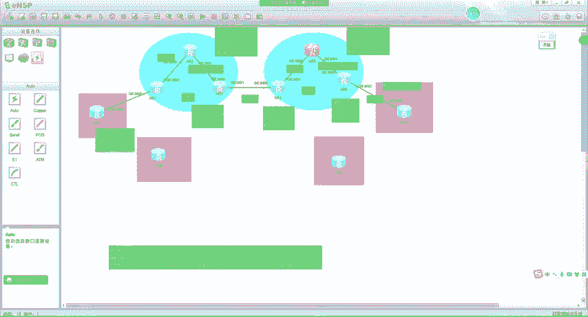

保存之后呢，咱们下课之后啊呃我会把这个A的拓谱发到群里。所以说呢大家下课之后可以去做A这个实验。😊，嗯，你去做一下啊。然后如果有啥做不出来的，你再看看我的配置。然后我再重新搞张图，咱们做个B。

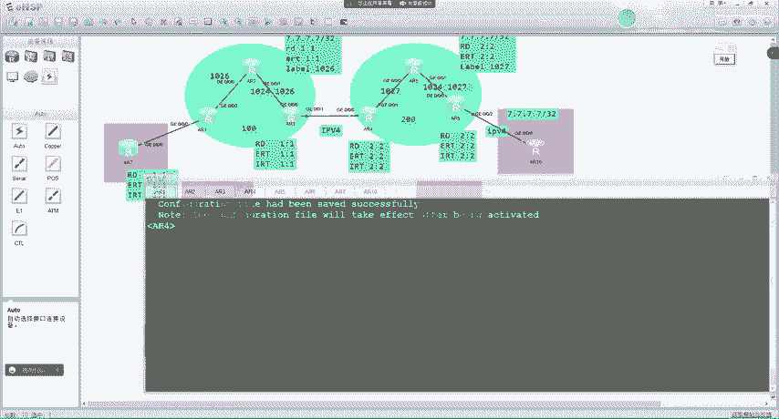

B也稍微比较简单一点，然后难点的可能就是C了。对吧。嗯，实际上以前我就在想嗯。就大家可能学技术觉得比较难的一点是什么呢？嗯，因为这个大多的技术啊还是外国人发明的。嗯。

可能跟我们中国人的思维方式有点不一样。是吧啊就他这种逻辑思维呢，对吧？可能跟我们中国的这种正常的呃，不是正常的，就是。就是对吧就是思维帮是不一样。对不对？嗯，所以说呢可能有时候学的会稍微比较难一点。

因为你很难一下子转过来。那这个思维是要慢慢养成的。对不对？他需要长期啊，你不断的去学习，慢慢养成的。

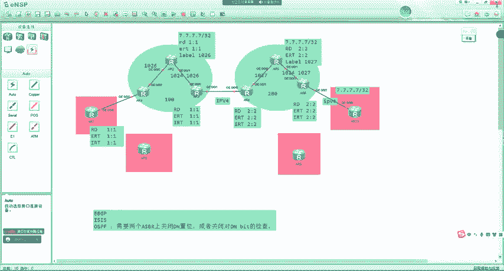

嗯。🤢。

嗯。应该这个啊我把它。改成叫A。这不是玉配啊，这是完配了啊。然后我现在复制一份。然后这个是课下发给各位同学的啊，就这个打包的。呃，然后我们现在呢。把这个图再打开一下。我把它改成B啊。😊。

🤧Yeah。这可能也不是不行啊。可能就是思维上不一样。是吧。你看我之前刚开始看这种怪的书啊。呃，反看他说的很不直接。后来看多了呢，我就觉得。就能理解了。就思维得慢慢养成啊。好，对，没错。

这个同学说的不错啊，就是。呃，你看一个书呢，如果翻译不是特别好的话。确实不好看懂。是吧这个我之前给大家说过啊。我这样看一本书。就是之前给大家讲过啊，他把那个。cos的翻译成过路费。当时我还蒙挺久呢。

后来就看明白了。是吧。那你之后想想呢也没错。是吧诶，他不就相当于过路费吗？啊，开油值吗。嗯，我们等他开一下啊。啊。😮，稍微有点慢。嗯，希望能打开啊。🤧嗯。🤢，怎么感觉这个节奏不是特别好呢？

感觉好像不太对啊。不有量了吗？嗯。嗯，这个倒不是啊，我咱上课前我刚重启的。我估计也是电脑出问题了。这样啊，我把它关了啊，重开一下试试还能打开吗？

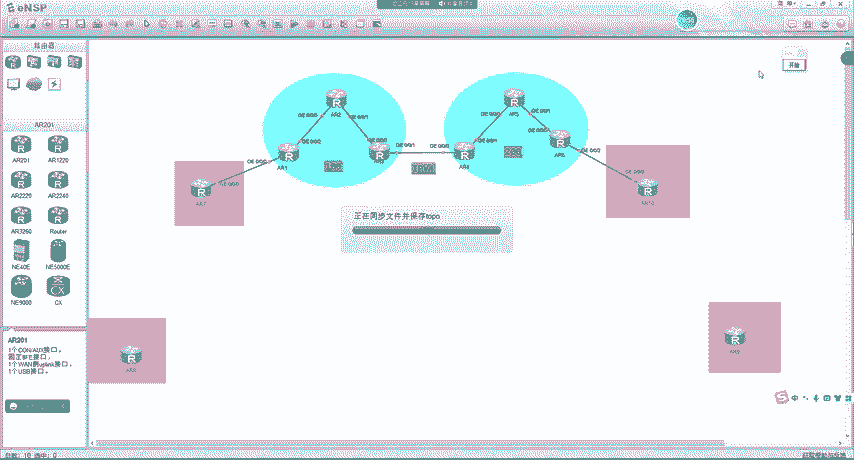

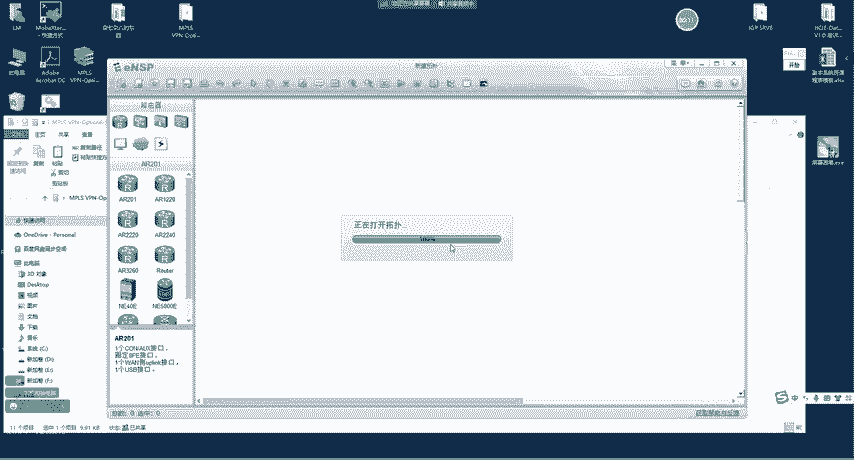

我先开一台啊，我先开一台，看能不能开。呃，是不是内存原因啊？因为我记得之前咱那个。这样应该有同学，我咱这一期我不太清楚啊，这样呃这个S的时候。啊，那个la图就设备挺多的。啊，只要我一全开呢。

他会提醒我这个内存不够。嗯，所以说呢每次我都是这样。嗯，里面大概这个得有二三十台吧。一般是先开一半啊，开一半之后呢，再开另一半。😊，新版ESP是吧？呃，这个我之前装过一次，但是我觉得不太好用。好吧，嗯。

他需要权限啊，就是你即使安装完成之后呢啊你登录这个新的ESP呢，它会需要你的这个uniport账号。😊，啊，就你的华为账号啊，就华为人才那个账号啊呃，但如果你没权限的话，你还是用不了。好吧。

那模拟器现在还不行了啊。😊，嗯，但是以我的消息渠道啊得到的反馈来说，就是很多人呢也觉得不太行啊，就各种bug啊。现在新模拟器演是。

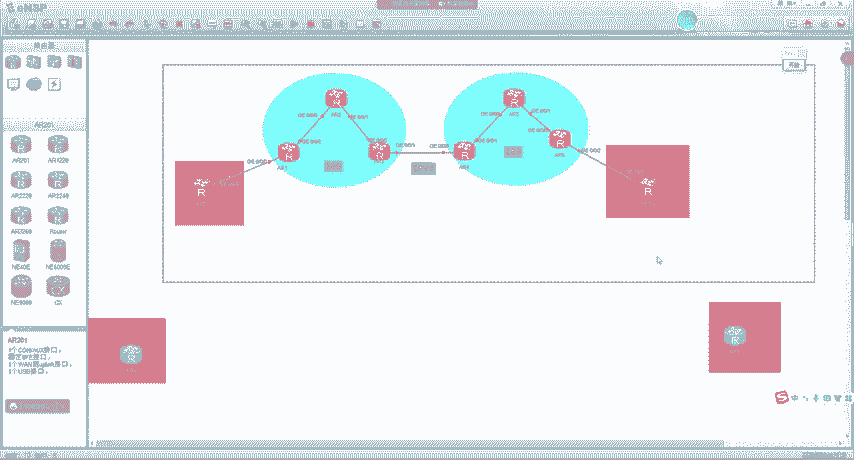

嗯，使用体验感不太好。嗯，好像打不开了啊。嗯。🤢，哎，这不尴尬了。😔，重启一下，待会下课了啊。我试试啊，是不是拓扑有问题，我重搭一下。对因我因为我看马上下课了啊。诶。

Which box interface。结束掉。我把这个再关了啊，我再看看。先讲理是吧？这个。先讲理论，大家不一定能听得懂啊，就以我这么多年教学经验来看啊。跨域这一块先给你讲理论的话。嗯。

我估计大家会比较懵啊。稍等，我再开一个，看能不能打开啊。嗯，不能打开的话，我们就先把理论讲一下，好吧，然后下节课再做个实验啊。😊，我看一个看能不能打开啊。这是啥？😔，呃，估计是不行啊。

那先给大家讲理论吧。好吧呃，先讲理论吧，然后我们下节课再做实验啊，好吧。😊，嗯，但是先给大家打招呼啊，就是如果我们先讲理论的话，嗯，可能会稍微蒙一点啊，就是这个理论呢可能会稍微蒙一点。😊。

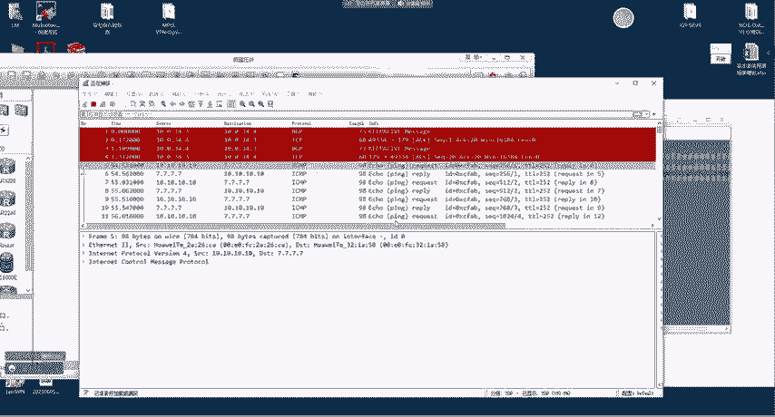

嗯，就是因为你没有实验真正去体会他。然后咱们下节课再把这个实验来做一下。好吧，就大家也课导大家听听option B的理论呃，然后去把这个option A啊搞明白啊。😊，我们来看一下啊呃，B是这样的。

就我们以这个拓普为例啊呃。😊，刚开始我们的基础配置依然是不变的，就是每个PE连接CE呢依然是微平实力的啊，这都很正常。然后每个这个S内呢我们都是ITP加LDP的啊，这也很正常。😊，是吧呃。

然后在ASBRP1上呢，注意啊嗯，我们跟在ASBRP2上，未来要去建立VPV4邻居。他大概的逻辑是这样的啊。呃，首先在我们的每个AS域内呢，我们都配了LDP跟ITP是吧？在这个A域内呢。

也配了LDP跟ITP。那这一块对接呢，大家应该都会做。😊，对不对？那。未来呢。只要这里你对接完成了，家里邻居啊，比如说这边有个1。1。对吧呃，以我们这个图里呢，比如说我7。7好吧，比如说这7。7。

你通告出去之后呢，呃他就会传递给P1。😊，对吧然后我们的P1呢会把它转换成VPV4啊，打上D啊，对吧？呃以及这个RT呀，然后把它传递给ACBRP1。那ABRE呢，未来我们是关闭了这个RT属性的路由过滤。

大家懂吗？是吧所以说呢他可以直接接收这条路由。然后我们在ASBR之间呢，是直接建立VPV4邻居。对不对？然后他就会直接通过MP1BP邻居呢传递给ABRRP2啊，但是在这时候呢，下一跳会稍微改一下啊。

下一跳会改改成多少呢？改成这个ABRRP1的物理接口。😊，然后ABRRP2收到之后。那这个路由的RDRT呢依然没有任何变化，因为直接传递过来的是VPV4路由。对吧呃，传递过来之后呢。

然后我们的ASBRPR再把它发送给PR。那这时候吓一跳呢，就变成他的4。4了。好吧，RDRT没有变化，下一跳会变。然后我们可以去发现啊，下一跳呢在这里变了一次在这里变了一次。😊。

那当ASBRP1改变下一跳的时候，它会重新分配一个死网标签。因为我们之前说过啊呃FEC就是路由，而路由包括前缀跟下一跳，对吧？呃，也就是说当你的下一跳发生改变的时候呢，这个标签会重新分一下。

也就是说在ASBRP1上呢，比如说你这边传过来死网标签X啊，这里他给它传过去的时候就变成了Y对吧？呃，然后呢，这边再给它传过的时候，因为下一跳变成4。4了嘛，啊，有可能就是Z了。

但是XYZ呢有可能分配的是相同的。比如说你X它分的是1026，这边重新分的呢，也有可能还是1026，这种可能是存在的。但是它会重新分配啊。😊，那除了这个丝网边签给吓一跳发生改变之外。

RT跟D是没有任何变化的。所以说P2收到之后，他要根据RT导入到微平实例中。那我们根据这个过程，大家可以去分析一下啊，就是这边的RT跟这边的要不要一样的？😊，要不要？实际上是一样的对吧？

就是你因为你在传递路由的时候，RT跟RD不会发生改变。所以说你在规划的时候呢，你要保证这两个站点的RT是一样的，好吧，以及RT也是一样的，就是互相匹配的。😊，然后整个控制平面的过程它是这样的啊。

就首先我们的LDP呢依然是一样的。这个跟我们看上一个图啊，逻辑是类似的啊，比如说P1呢对吧？然后它分别了1个T1的标签给P1P1再把P1的标签给他就T2。😊，然后4。4呢给的是T3对吧？

然后他在给P2的时候给的就是T4。这里是P1呢，是关于1。1的。然后P2呢是关于4。4的。好吧，那这里建立完成之后呢，未来四网路由就传递到P1了。P1再把VPV4路由就分配1个RD是吧？

变成VPV4路由下一跳是P1。然后四网标签是V一就传递给ABR了。😊，ABR它没有RT属性的过滤啊，对吧？所以说在这时候呢，它就会你看RDRT没有任何变化，对吧？他又把下一跳改一下。

然后重新分配一个索网标签给ABRRP2的。😊，然后ABRRP12收到之后呢，再加上1个RD。啊，不对啊，这RD依然没有变化。那我们可以去看到整个传递过程中，RDRT没有任何改变。

然后下一跳呢变成自己的4。4啊，从EBP邻居说到路由呃，传递给ABP邻居，然后下一跳发生改变的同时呢，送网标签会重新分一下啊，然后传递给PRPR根据RT导入到VP实力再发给CER。😊，嗯。

这个就是他控制平面的过程。好，然后。在他的转发平面呢，我们来看一下啊。转发平面是这样的。比如说在CE2上呢，我们要去访问这个7。7了。首先他会把IPV4数据转发给P2。那P2收到这个私网标签。

我们可以去看一下啊，速网标签的。算标签是V3。下一跳呢是ABRRPR。那首先他要打上索网标签V3对吧？然后再打上外层标签，是ASBRRP2的LDP标签是T4对吧？

也就是说他会打上一层V3跟T4的标签发送给P2设备。那我们来看这个数据平面是不是V3跟T4啊。对吧。那发送给P2这台设备之后，因为你数据平面嘛，你发送给P2了。P2收到之后，他收到T4的标签。

我们来看啊。😡，收到T4的标签是不是换成T3啊，对吧？也就是说在这里在进行传递的时候，外层标签是T3，内层标签依然是V3。😡，那他就转发给了ABRRPR。那实际上在我们的设备里呢有倒数第二条弹出是吧？

那如果按照课件所画呢，外面就是V3啊，外面就是T3，中间是V3。对吧那如果按照我们的实验呢，这就四网标签发送给ABRRPR。那。😡，ABRRP2对吧？他这个V3是不是正好是他分配的对吧？

所以说他知道怎么转发，他就会换成什么呢？我们来看一下。😡，如果说我假设开启了倒数第二条弹出机制。SBR呢收到的只有一个V3的标签。而他分配的是V3。P1给他的是多V2。是吧所以说ASBRRP2呢。

它会把V3换成V2，然后以V2的标签在这条链路上进行发送。对就是别人给你标签是多少，你转发给他，你是不是就得用多少标签啊？😡，是不是一样的道理啊？对吧所以说在这时候呢。

它就变成了只有V2的标签发送给ABRRP1了。SBRP1他又收到了。他分配的是VR，别人给他的是多少，4万标签对到一起，别人给他多少？😡，是多少啊，是V一对吧？所以说呢SBRP1呢。

它会再打上一层V一的标签。😡，打上一层卫衣的标签之后，吓一跳，他就看到了。😡，哦，是P1P1的LDP标签是T2。😡，对吧所以说这里呢再来一层T2。就是内层是V一，外层是T2，内层是V1啊，外层是T2。

又转发给P1了。P1收到之后呢，也是一样的。他收到T2要换成V一，那实际上对应倒数第二条弹出嘛，对吧？如果没有的话，那在这一段就是T1V1是这两个标签在这里转发。😡，啊，如果没去看课件的话。

你会发现呢他就是。T1跟VE。对，但是当我们开启倒数第二条弹出呢，就只有一层V一的标签发送给P1了。😡，PE也是一样的道理吗？😡，他分配的。V一他自己可以识别啊是吧？那根据速亡标签查找违凭实力。

最终转发给CE了。没错。啊吧，所以说在跨域的option B中呢，主要的区别在控制平面。😡，就是ASBR之间直接传递VPV4路由。能懂吗？只不过我们要去关闭RT属性的路由过滤。而在数据平面呢。

依然是正常的封装加转发，只不过在ASBR之间有一层标签。好吧，那这就是option B对吧？实际上是很简单的。但是我们现在呢嗯即使能打开呢，也做不了，来不及做实验了啊，好吧，然后下节课呢。

我们再去把实验做一下，好不好？😊，呃，然后带R的场景呢嗯这个我简单给大家说一下啊。😊，比如说我们有了R之后。R就反射一下路由，其他的有没有任何改变啊？有没有？注意啊，没有任何改变，能懂吧？跟A是一样的。

就是你让P1做R呢，给你让R一跟R2做R是一样的。好吧，比如说我们现在啊大家注意。😡，我没有这两个啊。如果我让P1转。😡，对吧你可能看的就是老师他扔在一边，我可能看不太懂了。但是如果是这样。

大家就能够理解了吧，对吧？就路由经过R反射一下。😡，对跟你直接传递给他一不一样？😡，一样吗。所以这里大家能够明白吧，明白的同学敲个一啊。😡，好吧，这里和A是一样的。然后我们再回到刚刚的样子。😊。

我们来考虑一下啊。😊，举例注意。比如说那老师我在这里有一根线，这里也有一根线。我们注意一个过程，什么样的过程呢？就是他把数据发给P2之后，他先打成的是四网标签。😊，呃，假如说是V4好吧。

然后他会打上一层公网的LDP标签。😡，各位同学注意啊，他会打上一层LDP表签。😡，这个也就是说他的吓一跳是4。4，要不要打上一层4。4的标签？😡，要吧。😡，打上4。4之后，他是不是直接这样发送过来了？

😡，是吧比如说是T4，是不是直接这样发送过来了？😡，但是如果有倒数第二条男出，只只有一层V4过来了。这个大家能看明白吗？😡，这个看明白的敲个一啊，这点很重要，我再给大家强调一遍啊。

就是我们之前不是先打一层塑网标签吗，刚在这个过程中。😡，啊吧A也是一样的啊，就是打上缩标签，再打上一层LDP的。😡，但是比如说我直接发我发现4。4就是我的吓一跳啊，我是不是把这个弹出直接一层V4过来了？

😡，这不很简单的道理吗？😡，是不是？但是我们去看这个过程的话。😡，他是这样进行转发哦。😡，他有没有监管啊？😡，有没有啊？没有吧。对吧那这个可能很多同学不理解的点是在哪里呢？对吧？

就是我们来再来思考一下你在IP学的那个。😊，BDP的实验。我现在换一下。这是一，这是二，这是三，这是4，这是5。比如说一在访问五的时候，这是R。一在访问五的时候，他的路径是什么样？😡。

他路径是不是1245啊？大家在IP学BDP的时候。😡，是不是这样？😡，这里有印象同学敲一啊。😡，可以吗？😡，有印象吗？对吧你在IP学的时候，他不就是这样的路径吗？那跟我们这个有没有区别啊。

没有任何区别吗？😡，是吧这不就是BTP路由的吓一跳吗？😡，是吧BDP路由下一跳是1。1，那我去往1。1，我直接过来了。😡，对的啊，没一下，能听懂是吧？对，没错，所以这张图我们看明白之后。

我们再来回到这里看一下，注意啊。😊，比如说现在。😡，我把R往这一扔。😡，对呀，我我让他做啊。😡，他没在转发路径上，是不是也能正常做反射啊？😡，是不是啊？一不一样道理，他跟你这样连一根线一样道理吗？

或者我把这个划掉啊。😡，就是。注意就这张图跟这张图有没有本质的区别啊？😡，没有嘛。😡，我不管你R在哪个地方，反正你不在数据平面上吧，就R就是路由转发的时候，就是你传一下路由嘛。😡，对不对？对，没错。

你就是传一下路由嘛，就是大家可能容易被这个单线路，对吧？老师他往这一扔。😡，是吧这有什么影响呢？跟你之前的没有任何区别啊。😡，所以这张图大家看懂了吗？😡，看懂同学敲一啊。没问题吧，这里呀。😡，好吧。

或者你把它往这一拉。😡，你再去看。是吧我不让这个作为R，我让上面这个作为R行不行，这不一样道理吗？😡，对吧很多同学比较疑惑的一点，就老师他往这儿一拉对吧？我瞅不明白了。😡，是吧他往旁边一扔是干嘛的呢？

你你把它脑补到这里，他不一样道理吗，是吧，这样反射这样传递嘛，一样道理。😡，好吧，所以说如果我们带R的话啊，你就是R就是反射一下路由。😡，好吧，但是在数据平面上，大家都是一样的。😡。

所以这个各位同学看懂了吗？看懂同学都敲一啊。没问题吧。好吧，其他同学呢？可以是吧。P2干嘛？P2，你在数据平面啊。😡，你P23数据平面啊，他不你没看到这俩之间没有线吗？😡，是吧对。这样进行转发嘛。

对吧你把R往这一扔。😡，对吧然后控制平牌就让他去传吧。也就是说这张图他跟。😡，这样的图有没有本质区别，是不是没有啊？😡，是吧这样的图，这是R，就R不在数据转发平面上嘛。然后你这张图这是R。

它也不在数据转发平面上嘛，一样的道理。😡，对不对啊？好吧，所以这个大家看懂了吧？😡，可以是吧，好。😊，嗯，那我们今天这节课就讲这么多啊。😊，嗯，我们把这个option B的控制平面和转发平面。啊，对。

没错，R转发路由PR跑数据。然后我们把这个理论看完之后呢，嗯实验呢我们下节课再来做一下。好吧，下节课呢我们做一个实验啊，大家就能够明白对吧它具体怎么样进行传递的啊，怎么样进行转发的。😊，好吧，呃。

我们这节课就讲这么多。然后这个option A的拓扑的话，嗯，我会随着这节课啊，当然这节课没什么笔记了啊，就大家自己课下看课件去做一下这个实验啊。😊。

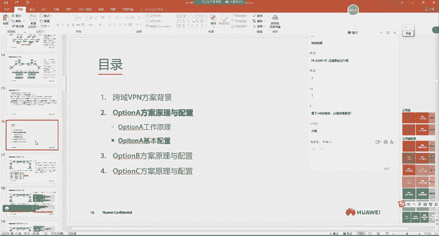

啊，就做一下实验还是比较重要的。呃，然后这个拓扑的话呃，我会发到群里啊。然后大家呢我建议你们就是自己去搭一个好吧，这样你做起来印象也比较深刻。啊，如果你实在做不出来的话，你再去看我的这个配置，好吧。😊。

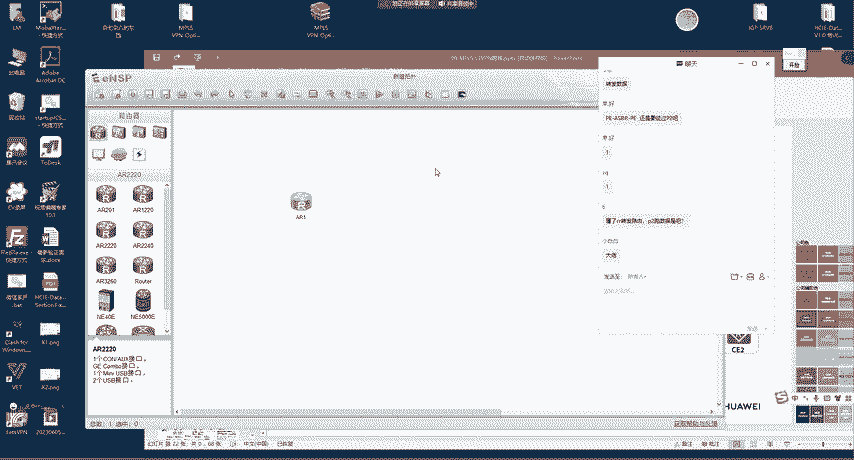

呃，咱们今天这节课就说这么多吧，今天就讲这么多啊。😊，我把录屏先停一下，好吧。