# 2023 新版华为认证HCIA+HCIP+HCIE全套视频讲解！一套视频让你从入门到精通！CCNA／CCNP／CCIE技术提升同样适用！ - P121：（持续更新）HCIE Datacom - 57.MPLS VP,N跨域OptinonB、OPtionC1 - -Book思议8 - BV1W8411A7z8

开始上课了。嗯。呃，我们今天呢去讲一下这个跨域的B啊。呃，如果时间来得及的话，去把这个C1嗯这个方案也给大家讲一下啊。诶。这张图呢是我用上节课做了一下改啊，改了一点。嗯，改了一点。

就给大家讲一下这个R好吧，嗯，其他的倒没什么改变啊。因为我们现在这个跨域方案呢，现在是这样的啊，我就是在五跟9这里拉了一个路由器。😊。

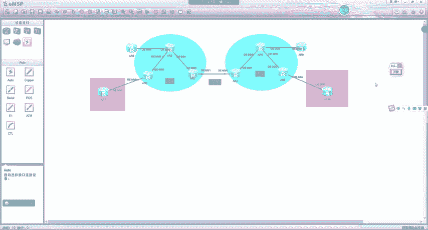

现在还没有做配置啊呃，其他的拓扑呢就是我们上节课。😊，下课的时候嗯给大家保存的那个拓普。就是7。7呢，现在能够跟10点10进行通讯。嗯，对吧然后我们使用的是跨域的option A。呃。

这时候呢我们就直接把这张图啊啊嗯直接改成跨域的option B好吧，嗯，我们直接来改一下啊，嗯这我们怎么样去改呢？😊。

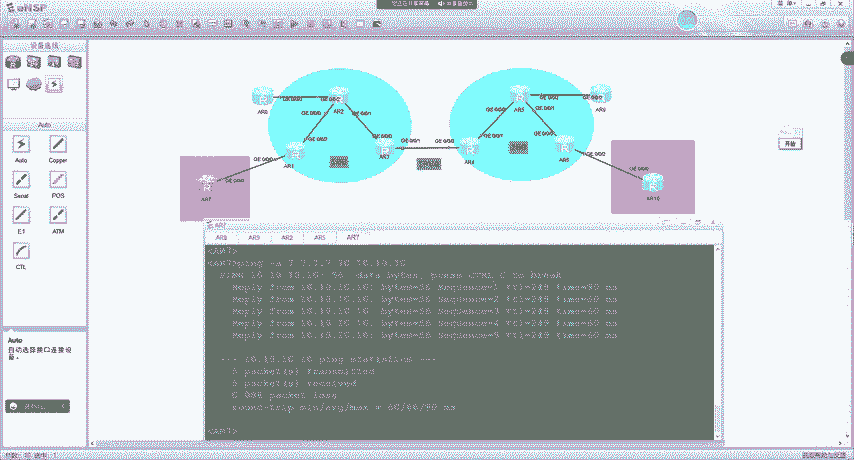

嗯，上节课也给大家去讲了一下op的理论啊，呃主要的区别呢就是在三跟四之间呢，嗯在A里面我们用的不是这个VF嘛，对吧？通过微凭实力去建立的这个BDP邻居嗯，当然有同学我看可下有同学找我是吧？

用OSPF没起来啊，嗯，但大家自己也可以研究啊，是吧？就是我们用IDP呢也是可以的。😊，呃，然后option B主要的区别呢就是在这里呢，咱们用的是嗯这个EBTP邻居，对吧？是唯平V4EBTP邻居啊。

有时候我们也把它叫做嗯这个MP。EBDP邻居关系。好吧，嗯这时候呢我们就来改一下啊，就是在这里呢去建立啊VPV4的邻居关系。啊，我们看一下有什么样的变化啊，嗯，其他的配置都一样的。

比如说现在呢我先把这两根线删了啊，把这两个路由器。😊，嗯，先拿掉好吧，就我们直接把这张图呢去改成B。

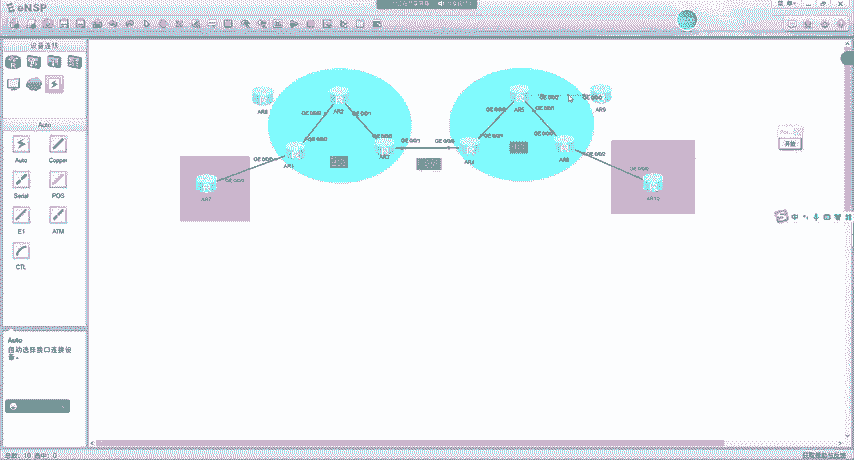

呃，首先呢我们来去考虑一下，在B里面呢，首先77我们不是以BDP通告了一条7。7的路由吗？是吧，那他还是会传递给自己的BGP邻居A21呃，所以说A21呢。😊，就能够收到这条录音是吧，7。7。7。7。

对吧呃，然后转从VP实例收到，转换成VPV4呃，再传递给自己的VPV4邻居A23。是吧所以说三线的也能够低速率啊，是V平V4入庭推保啊。所以说呢现在三也能够收到。这时候呢，我们把三跟四呢去改一下。

就我们把三跟四去改成1个MPEBP邻居关系啊，我们用跨域的奥tion币看一下会有什么样的变化。

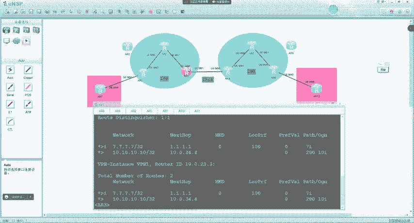

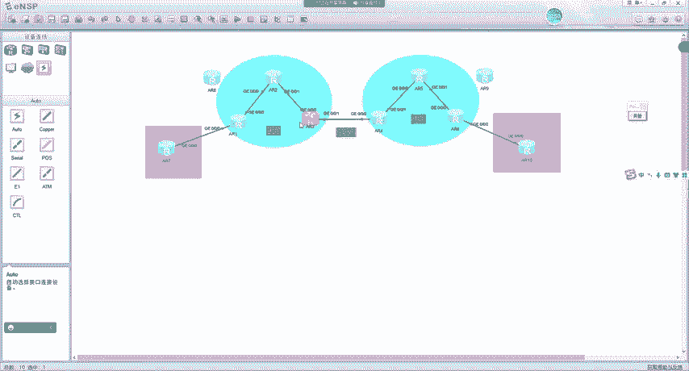

嗯，我们在三这里呢，因为之前三上面派了一个VPN实例对吧，所以说我们就给他删掉呃，把这个VPN1。应该大写的VP1啊吧，再删掉呃删掉之后呢，我们再到G0-0-1接口下呢，你会发现之前的IP没了。

我们重新给他配一下34。3。然后在四这边呢，也是一样，暗度IPV频V频1也给它删掉。然后到0-0杠0接口箱。也给他重新配置一下34。4。哦，我们做完之后呢，在三这里，比如说我进到BDP100啊。是吧呃。

现在我们发现啊就是。😊，已经没有任何VPN实力BDP的配置了，对吧？这是VPV4啊，这是默认激活的单波，对不对？那A21呢，他给三传了一条7。7的路由。这时候如果我们去看三的话，嗯，DBDP。

V平V42入table，我们发现他是没有办法接收到的。对不对？呃，为什么没有办法接收到呢？是因为。😊，现在呢他没有微平实力对吧？所以说他没有办法根据RT去导入到微平实例中。

就是RT属性的路由过滤模认式开的。然后我们在上节课呢也说了，就是在ASBR上要去暗度policy对吧？呃，微屏给他就去把这个RT属性的路由过滤功能呢，就给他关闭掉。😊，那么一旦关闭掉之后呢。

路由PECCE之间还是正常传对吧？然后PE传递给ASBR。所以我们在ASBR上呢可以去看到它已经接收了7。7路由了，对吧？但是只是唯平V4路由，因为它没有R这个V平实力是没有办法导入进去的对吧？

这时候我们在三跟4之间呢去建立VPV4的邻居关系，比如34。4啊嗯AS。😊，200是吧，IPV4familyVPV4P10。0。34。4对吧？激活和34。4的。嗯，VPV是邻居关系。

然后我们在四这边呢也是一样，嗯，BGP200。IPV4family。嗯，首先呢四这边也得去关闭基于RT属性的路由过滤啊，因为4也是ASBR。然后我们在VP啊，不是。是10。0。34。3啊，AS100。

然后在VPNV41下，10。0。34。3去把这个邻居给他激活。好吧，那激活的同时注意啊，未来因为我们在转发数据包的时候。嗯，三跟四之间呢要有一层带标签的豹纹。

所以说三跟四之间大家要记得他们的互联接口呢要开启MP4，注意啊。只是开启MP4啊，不要去开LDP，因为AS之间呢，他们不会去跑LDP好吧，我们只需要把MP4功能打开就好了。那打开之后呢。

我们现在做了什么样的配置呢？嗯，实际上很简单，就是。在A的基础上。嗯。A2就是ASBR之间建立MPEBDP邻居。对不对？然后我们做了1个ABR关闭。T的。路由过滤。然后做了第三个配置呢。

就是ASBR之间。互联链路。对吧开启MP24。那我们只做了这三个配置。那做完之后呢，我们来看一下三根四的邻居呢，已经进行成功的建立了，对吧？那三缸我们说了，他有一条。3啊7。7。7。7的路由。对不对？

那这条路由呢就会去传递给4。好吧，所以说对于AR4来说呢，嗯他就能够收到这条路由啊，7。7。7。7。那由于A24没有V平实力呢，所以说他只是V平为4中啊，对吧？没有V平实力导入。

但是是从EBDP邻居收到路由要传递给谁呢？ABDP邻居。对吧。那这时候呢，A24上面dispplayBGPVPV42P。

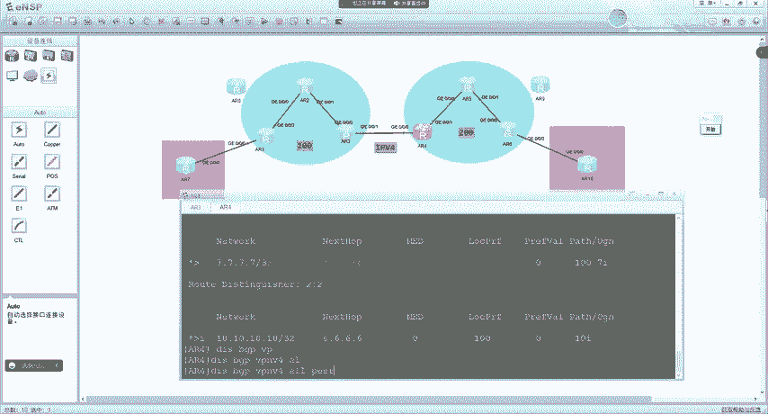

我就发现呢，他给6。6会去传递。但是如果我们到6上去看呢，对吧？

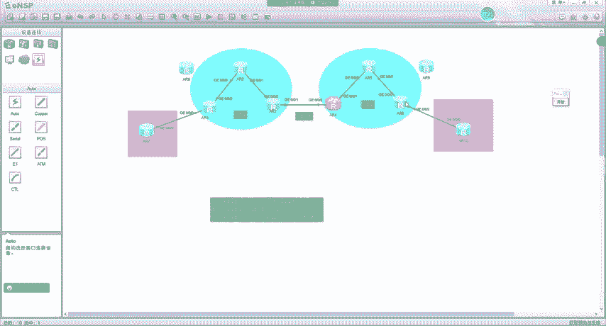

你发现呢好像没有7。7。

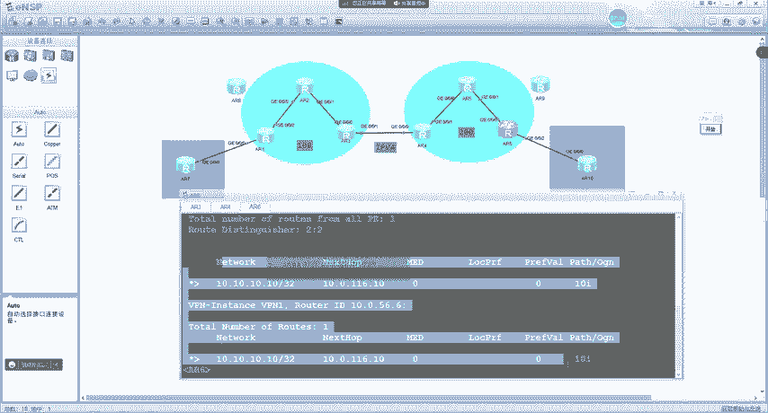

对吧这里是为什么呢？来给大家解释一下啊，因为我们之前说了啊，这个路由的传递过程是这样的，就是7。7。7。7-32的一条路由。这是就是IPV4路由。在A21上呢，会去打伤RDRT。😊。

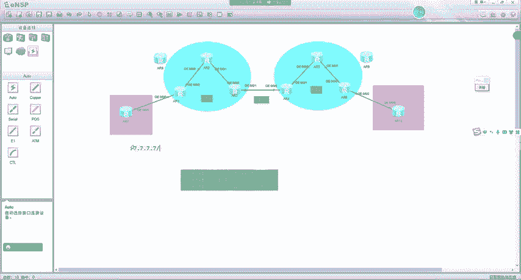

对吧。7。7。7。7。在A21上，现在。D是一冒号一对吧？RT也是一码号一，然后死亡标签是1024。

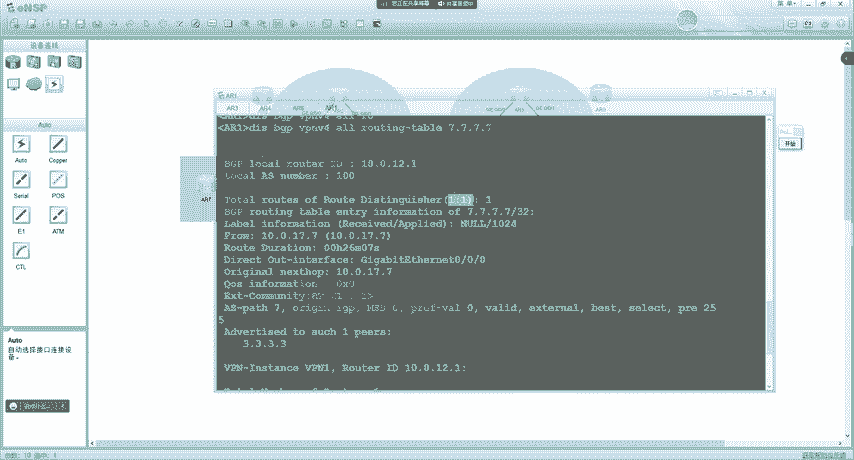

这里呢。7。7。7。7。嗯，冒号32打上了1个RDE冒号一，然后ERTE冒号1。是吧涉网标签。嗯，是。1024。对吧所以说他分配了一个4亡标签1024。

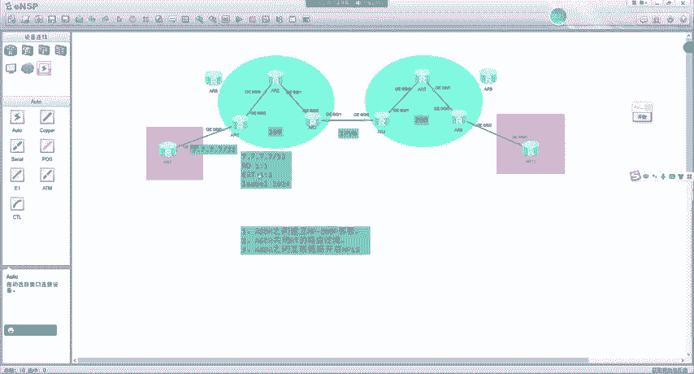

那这个路由就会转发给三了。对不对？转发给三三收到之后呢。7。7。7。7，我们来看啊。三呢未来要把这条路由发送给4。所以说呢三自己去给他分配了一个职业。

给他分配，就是他接收到的标签，不是1024吗？他自己又给他分配了1个1027。对吧。那吓一跳呢，变成了自己了就。

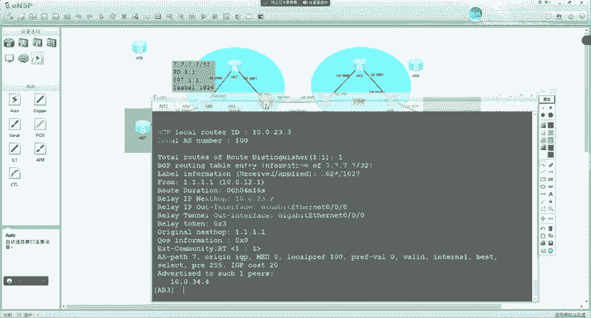

所以这时候呢。这边。nice的 hope。是1。1。1。1，他就这样传过来了。传过来之后呢，三呢。是这样的。RDRT呢首先三不会发生任何改变。缩网标签分那个1027，那下一跳呢，就变成了10。0。34。

3。

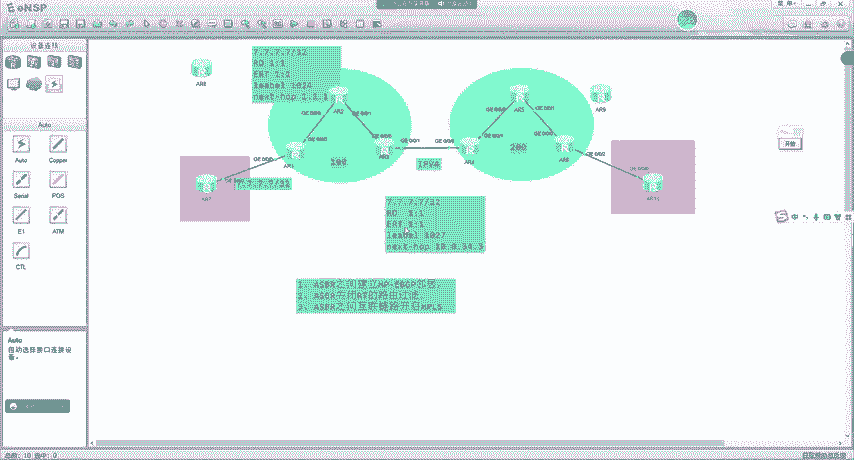

对吧哦，这样就传递给4了。所以我们到市上去看呢第四类BTPV平V42 table。期代稀来7랄7。啊吧我们就可以去看到。4接收到的标签是1027是吧，正好是三分配的，下一跳是10。0。34。3。

对吧RDRT。没有任何改变。那四接收到之后呢，由于四要传递给6下一跳，还要变成4。4是吧？所以说在这时候呢，四要传递给6的时候。

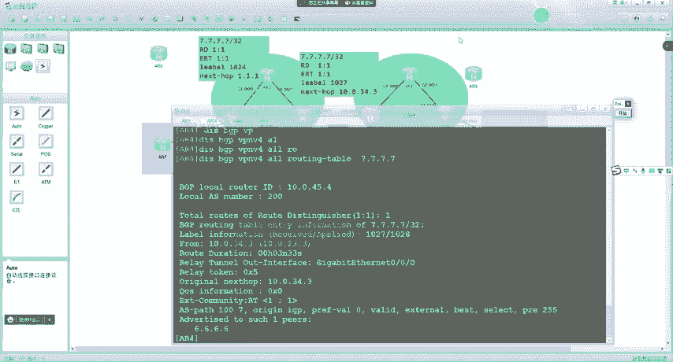

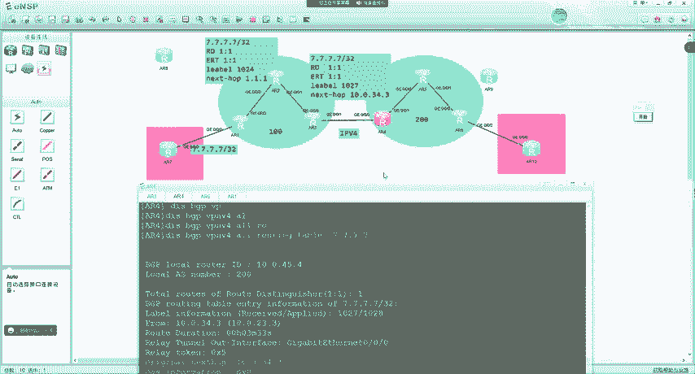

他是这样的，7。7-32RDRT没变化。那4要传过去呢，下一跳首先变成了多少呢？4。4。4。4。那下一跳发生改变的同时呢，送网标签会重新分配一下。所以说四给他分配了1个1028。😊。

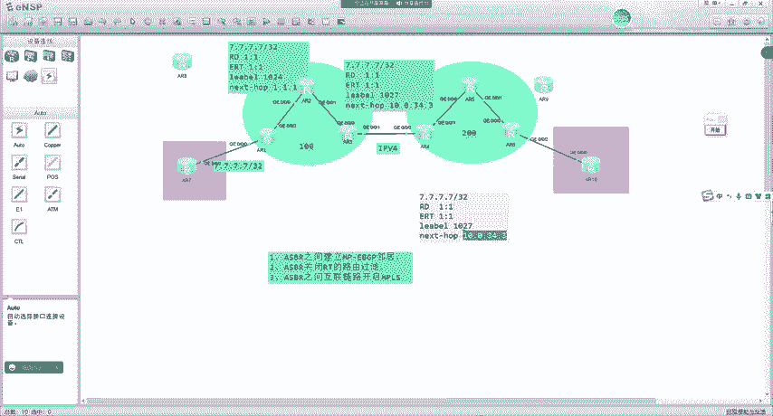

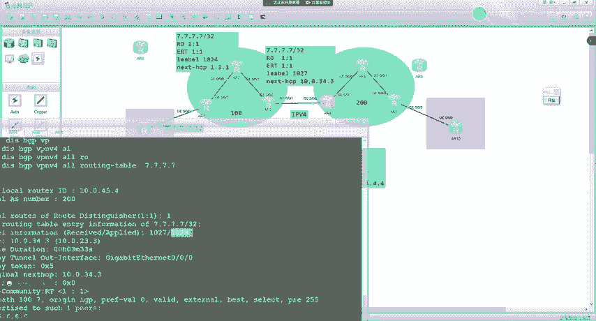

那这样就传递给六了。

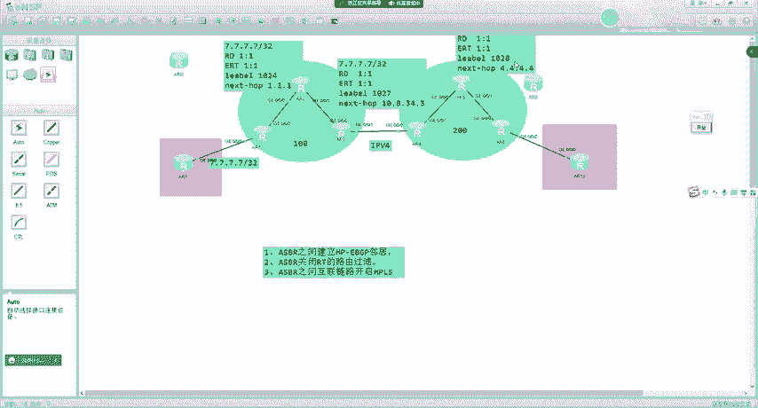

但六接收到这条路由之后呢。我们来看一下，我们可以通过第四类IP微P微啊V boss。

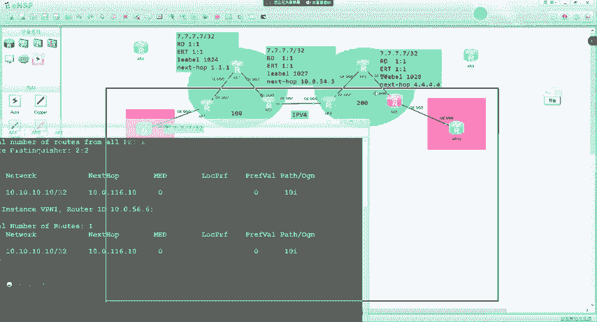

好吧，去看一下呢，实际上对AR6来说，现在只有一个VP实例一，而他接收的是阿曼哈尔。对吧所以说在这时候呢，A26就不会接收这条路由。所以我们在六上去看的话，你就瞅不到啊，没有7点T。那这个问题呢。

是要给大家说的就是在option B中，对吧？两端需要通讯的站点呢，他们的这个RT一定要是一样的。所以说我们要去配个一冒号一啊吧，双向。然后把。二曼哈给他删除掉。啊，那这时候改完之后呢。

我再来A26上看一下DplayBDP为评为42如table。A26是不是就接收了7。7这条路由啊，它是一条VPV4路由。对不对？那这时候A26呢要把它放到微P实例中。

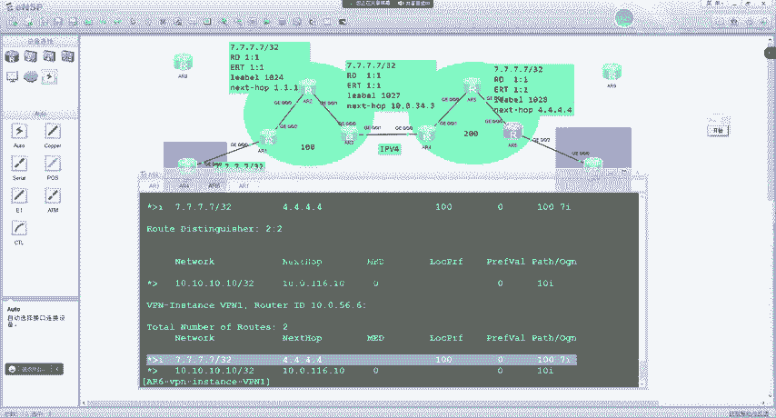

对吧因为你的这边也是一码和一2就匹配了。放到威平实力之后呢，再通过EBDP邻居传给10。所以说AR10现在就能够学到7。7。7。

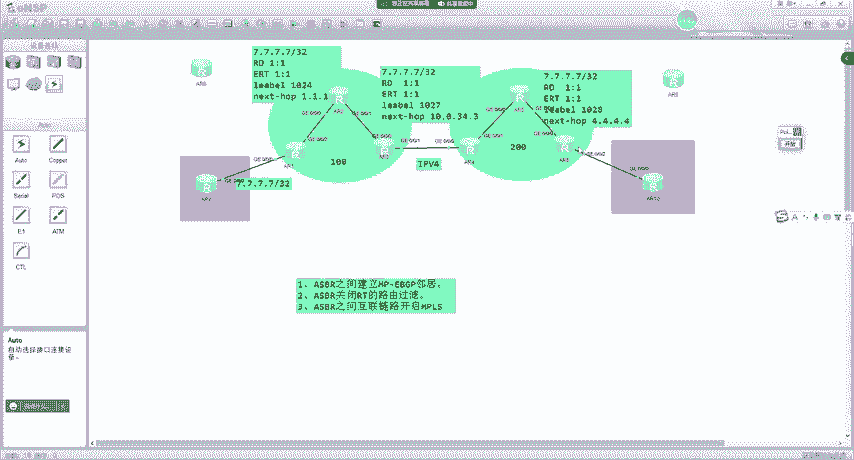

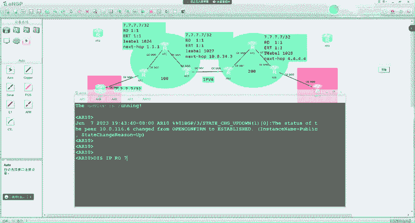

对不对？那反之10点10的路由也是一样的传递过程。好吧，那最终我们在7上呢，也可以去看到。

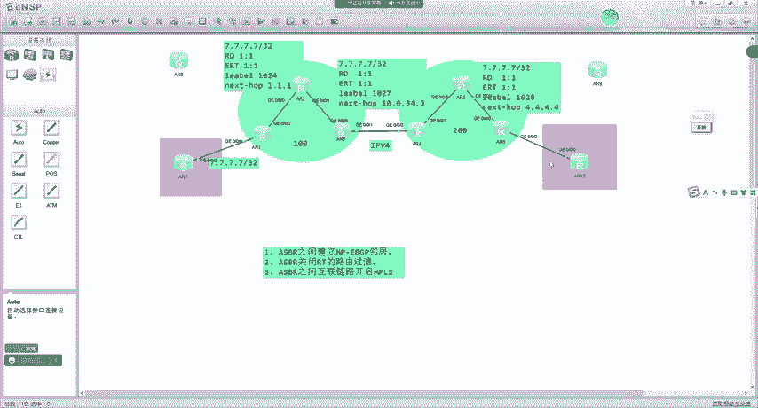

10点10的录由是吧，反向的传递过程是一样的。那比如说在这时候，当10点10如果去访问7。7的话，我们10点10点10点10去访问7。7。对不对？发现是能够通的那这时候能够通讯的基础呢。

就是我们通过跨域的option B呃去实现的。

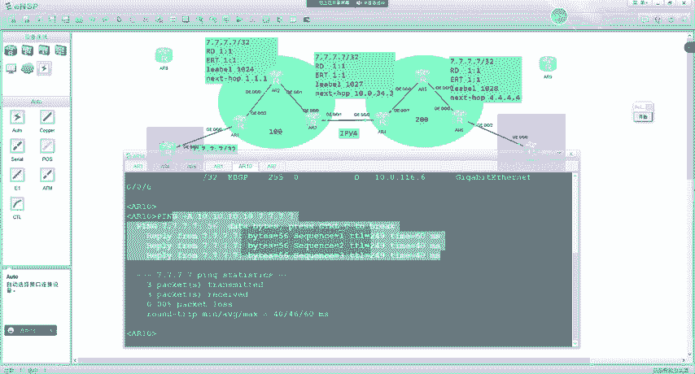

好吧，那他怎么样通的呢？实际上道理也很简单，就是我们刚开始不是原IP。😡，10点10点10点10吗？是吧他到目的IP。7。7。7。7。

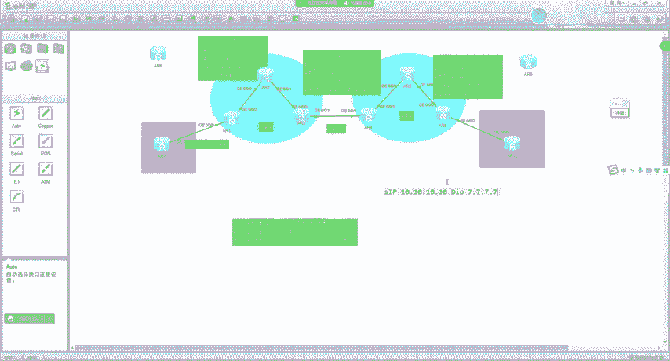

这个流量呢会发送给到6上。那6接收到这条路由之后呢，我们来看一下啊。VPNV42rootingtable。7。7。7。7。那首先我们可以看到丝网标签是1028。

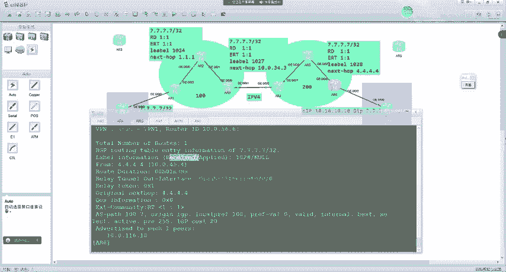

是吧所以说他会打上一个。1028的4网标签。然后他看到吓一跳呢，是4。4，对吧？那4。4呢就会有一个。LDP的RSP有1个1024。所以说他就再打1个1024。那这个报文呢就会传递到了5上。

是吧就在这儿。对不对？我们来看4万标签1028，然后再打上下一跳的标签。😊，对吧那5收到1024呢？5收到1024倒数第二条弹出。对不对？然后就只有一层1028。发送给了4了。对。

这1028正好是四分配的，对不对？4分了1028，而是接收到的是多少啊，1027。对不对？所以我们可以去dispplay mLP就可以看到呢，他会把1028换成1027。对吧然后在这时候呢。😊。

在中间就换成了swipe1027，就只有这一层标签。转发给了3，那三也是一样啊，三分配的是1027，而收到的是1024。对不对？所以说在这时候呢，三首先会去把内部标签换成1024。好吧。

换成1024之后呢，然后他发现吓一跳1。1。1。1。对不对？就是这条路由的吓一跳，还有标签SBR，他发现吓一跳没有标签了，所以说他就不迭代了啊，他没有34。3的标签。但是三换成1024之后。

一看吓一跳1。1啊哦，1。1还有一层标签。😊，对不对？1025，所以说他就会打上1025，然后传递给2了。2收到1025之后呢。倒数第二条弹出。是吧就只有1024发送给一了。然后一呢。

再根据送网标签查找唯品实例啊，因为这个1024不正好是一分配的嘛？对，然后转发给其。然后就通了啊，回包是一样的逻辑啊。那我们现在呢可以通过抓包去验证一下。然后我在4的G0-0-1也抓一个。在。

3的70-0-1抓一个。

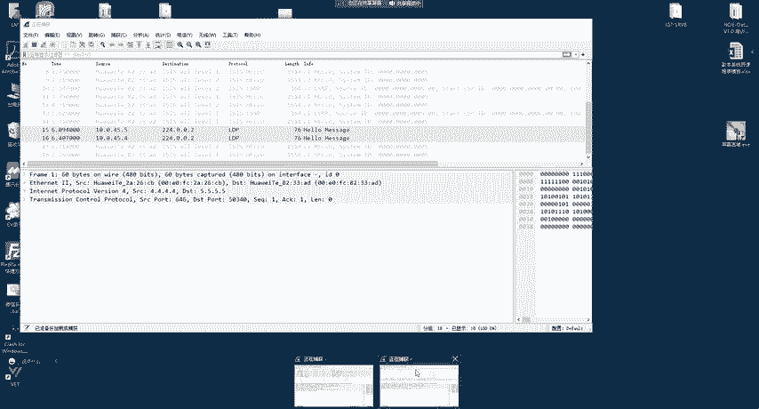

然后在2的0-0-1抓一个。

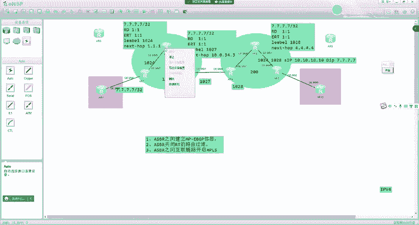

然后在2的0-0-0也抓一个。

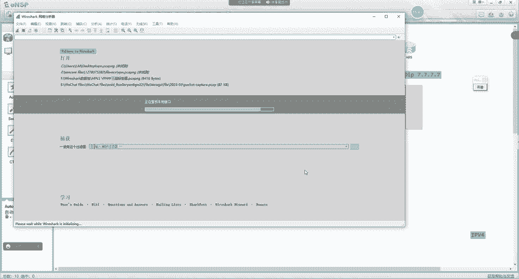

这时候呢我们可以在实上去拼一下气点机啊，我们发现是能够通的。那通首先我们看这条链路呢，应该是外层1024，内层1028。我按照这个逻辑去验证一下呢，外层是1024对吧，而内层是1028。

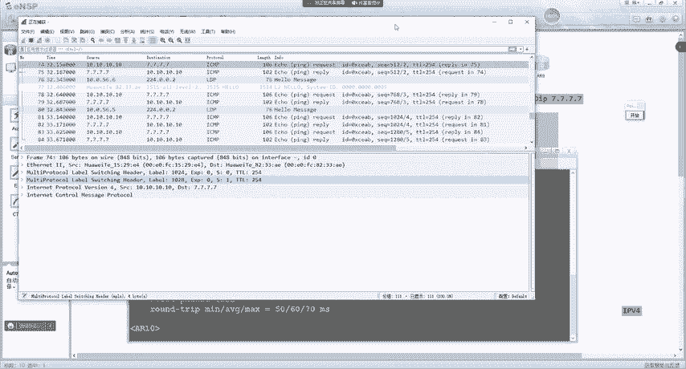

那继续按照这个逻辑往下推，在这里呢嗯应该是倒数第二条弹出了呃，只有一层1028的标签。对不对？所以我们来看第二条链路。这里呢就只有一层1028的表情。对不对？然后在三和4之间呢，就只有一条1027。是。

就只有1个1027。然后在23之间呢，应该会有1个1025和1024对吧？有两层。往上拉啊。在这。我发现是不是外层1025，内层1024啊？对而在这条链路上就只有一层1024了。对，就只有一层1024。

那A21收到1024的包之后呢，他就会根据这个。RSP查找微P实力。对吧在微P一下呃，把标签弹出对吧，然后发送给其。那这样就通了，其实他的回包呢也是一样的逻辑，这个就是option B啊。

我们发现学完A之后呢，实际上B也很简单。对吧就每个域单域呢每个域我们还是做单独的配置，对吧？这个大家都是比较熟悉的，就IGP啊LDP啊MP4啊是吧？PECCE之间呃，你就正常的互联。

主要的配置呢就是在ASBR上。😊，是吧呃，要去建立EBDP邻居，对不对？关闭RT的过滤，然后互联亮路开MPS。那option B就完成了。好吧，我们可以发现啊，对比于option A来说呢。

嗯还是比较简单的对吧？因为它的配置量没有那么多。😊，那未来即使当我们拥有了其他的微P客户，比如说九跟十呢。是吧呃也拥有了这两个VP客户。那么在这时候呢，九跟十在进行跨域通讯的时候。

三跟四上我们就不需要再去再添加什么微P实力的配置了。对不对？直接通过这个VPV40居传递过来就可以了。对，没错。ABR之间的标签呢，它是通过MPBDP分配的啊，就是VPV4去分配的。好吧。

那这个就是跨域的option币。我们发现很简单啊。嗯，我说到这里，大家都能够明白吗？能跟上同学敲一啊。😊，都可以吗？呃，用直连口建的啊，但你也可以用话用口。可以是吧。好。

那接下来我们就把option B对吧？比如说老师我加个R会怎么样呢？😊，啊，我们就给option B加个R，我们来看一下啊，会不会怎么样，好吧。其实加个R呢，这个概念是非常简单的啊。

但是有些同学呢可能没做过这样的这个实验。😊，啊呃，所以说呢。你可能会稍微陌生一点。比如说我们现在这样呢，我把AR8连接到二上，然后把A29连过来。那让8跟九呢都作为VPV4的R设备。啊。

他们两个呢都是VPV4的R。那未来呢，我们只需要在ASBR跟R建邻居，对吧？然后。这个谁也跟阿建邻居。这PE也跟R鉴定局，就这样去鉴定局。对不对？那么在这时候呢，我们就来做一下，现在注意啊嗯。

AR8上呢，我们已经创建了环回口跟互联地址，这些我都是配好的。所以说我们现在可以在二上呢去看到。第四类ISSP对吧，跟A28已经建立邻居关系。在5上呢。也可以去看到跟九建立了邻居关系。对不对？

那这里我们作完之后呢，注意啊呃，89我们并没有去开启这个MPSRS能力。我只是想让他作为R。啊，那这时候呢我们需要在A2一上。😊。

因为这时候。MPBDP的邻居。我们之前给三件的不是吗？你直接传给ABR了，你现在就得通过R过去，我需要P28。8AS100。😊，八点八。娄百林IPV4VPV4。8。8。8。8啊，然后给他激活。好吧。嗯。

就这样啊。呃，然后在A23上呢是一样的配置，就是大家都跟R去建邻居。所以说我们在A23上呢，得暗度P21。1。1。啊，然后把这些配置给他贴进去。就是跟8。8呢去激活。VPV4的邻居关系。是吧。啊。

这RT属性路由过滤，我给他刷进去了啊，我再给它关了啊。😊，好吧，大家刷配置的时候一定要注意啊，你不要把其他命令给覆盖了。😊，对吧现在呢三根8也去鉴定邻居了。然后我们在A28上呢，BDP。100。P21。

1。1。1。3。3。3。3。1。1。1。1。3。3。3。3。然后IPV4family VPV4。P21。1。1。1激活P23。3。3。3激活R上要去关闭GRT属性的路由过滤。

是吧这是我们在R上面的相关配置，就跟两个邻居呢去激活为平V4，然后把RT的路由过滤给他关了。哦，对，还有反射啊。哦，我们得到VPV4地主书下1。1。1。1做成客户机，然后3。3呢也做成客户机。好吧。

这样就做完了啊。😊，嗯，做完之后呢。这只是AS100，我们改完了。

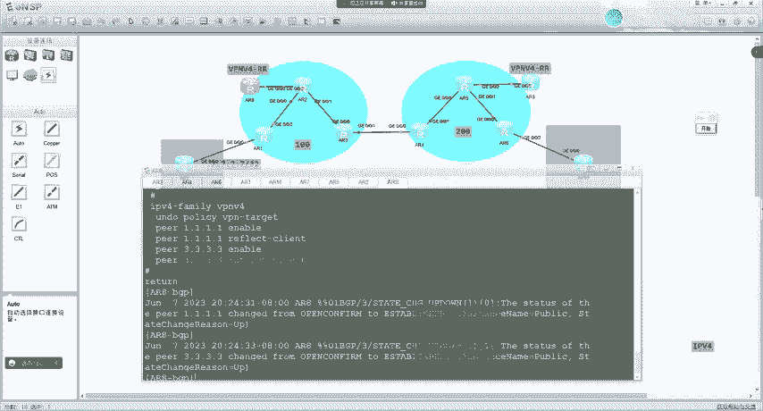

改完之后呢，我们去改一下这个AS200的。这里在A29上啊，这个我刷的是A29的配置BDP200。然后是4。4。4。4。4。4。4。4。6。6。6。6。6。6。6。6。是吧IPV是自动激活的。

咱不用管啊。然后再微PV4一下。4。4。4。4。4。4。6。6。6。6。啊吧我们在酒上呢也去给他。BGP200啊，然后把这一套给他刷进去。让四跟6呢朝九去建立V平V4邻居。在四上呢，BGP200。

因为他之前跟六建立了，所以我们给他删掉。安度皮尔6。6。6。6。然后是P尔。9。9。A200。9。9。娄柏0IPV4family VPV4。9。9啊激活为评委4邻居。是吧实际上这些配置都很简单啊。

就是你建为PV4邻居嘛，跟RR建。😊，嗯，配的很简单，但是量很大啊，配量比较多。哎，99。9。9。9。9。9。9内部。呃，跟九去建立邻居关系。

这时候呢我们到A28上先来看一下他的这个VPV4邻居有没有建立完成。呃，八跟一跟三的建立完成了是吧，跟一的跟三的。然后我们到九上呢，去看一下他跟四的跟六的有没有建立完成。嗯，跟四的建完了是吧。

跟六的我们再稍微等一会儿。好了。也加完了。是吧建完之后呢，我们来看一下啊。十能不能学到7。7呢？可以吧。然后7能不能学到10点10呢？10点10点10点10。是不是也可以啊？啊。

比如说我们在7场P杠A7。7。7。7到10点10点10点10。能不能通啊？是不是也行啊？对吧。就是他是怎么通的呢？是吧，有人又比较问了，他很简单啊，他跟之前我们是A21给A23传路由，三给44给6。

那这时候我们给RR反射给3。大家觉得一不一样，这就跟你之前学那个BDP的时候。123啊，这是4。这是5，你们之前在学BDP的时候。二、直接跟三建立邻居，或者说二跟一件三跟一件由一来进行反射。一不一样。

区别就是在控制平面上，我们是经过R做了一下反射，对吧？数据平面通讯都是一样的啊。比如说到三这里，他发给四吓一跳，变了，重新分配标签依然是一样的。是要发送给R下一条变的，重新分配标签也是一样的。好吧。

整个路由传递过程呢，就是接下来注意我红笔画的。IPV4路由对吧？然后蓝笔画的是VPV4啊，VPV4路由。VPV是路由VPV是路由VPV士路由VPV士路由。最后再把IPV4路由传递给市。好吧。

而我们之前的控制平面呢，我现在用黄笔画，之前没有R的控制平面，它是这样的，17给11直接通过VPV4给33给44给66给10。对吧。但是R在反射路由的时候下一跳不会发生任何改变。

因为我们刚发现啊数据它走什么样的，走哪里，它是根据下一跳去判断隧道的。只要R在反射路由的时候，不修改下一跳的任何属性。那大家觉得数据平面有变化吗？有没有啊，没有任何变化。😡，好吧，所以说这个很简单啊。

就是我们在域内把啊带家跟R建邻居串路游就行了，就这么简单。😊，好吧，那这就是option B嗯，带R场景下的配置。呃，这个大家看明白了吗？明白的同学敲一啊。这里都行吗？可以是吧。

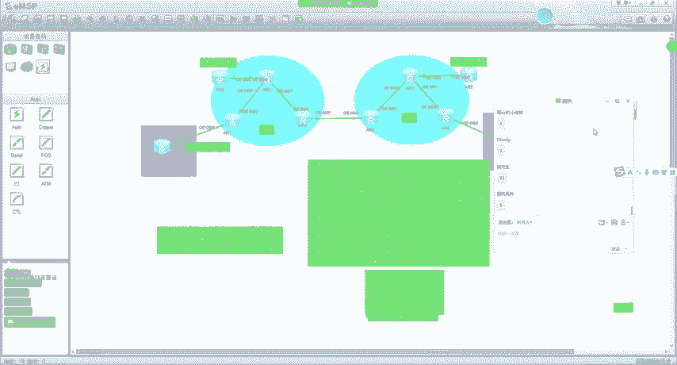

好。那接下来呢我们来看一下option B的一些特点啊，原理我们上节课都说过了。他的特点是什么呢？就是。😡，所有流量经过ABR转发，对，具有很良好的控可控性啊，这个倒没啥说的。如果你说这里呢是缺点。有。

有电音。行，那咱们继续啊。呃，接下来我们来看一下这个op B的一些特点。嗯，这个特点呢，首先第一个啊就流量经过ABR转发呢，具有很好的可控性。是吧嗯，这个就看你从什么样的角度去看他了。那可控性比较好。

我们也可以说呃负担比较重呢。😊，对不对？这主要看什么样的角度去看待啊。呃，由于ABR需要保存大量的VPV4路由呃，因此负担比较重。对不对？然后同时使用BDP路由策略。啊。

比如说如RT过滤啊是ABR上只需要保存部分的VPV4路由。这个实际上说的很简单啊，我举个例子。

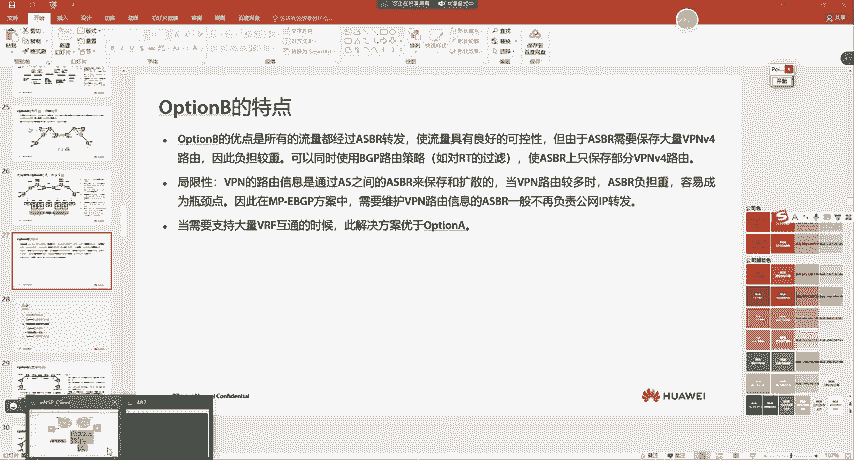

比如说现在呢我这里呢有一台8，这个8呢。他连接了1个C。这说。十跟这个十0这个CE呢跟8这个CE。他俩属于单玉的互通。那这时候我们都跟R建邻居，比如说我把路由传递RR给ASBR了，是吧？😊，呃。

6把路由给RR也给SBR了，为啥他俩都给R呢？因为他俩的路由也要经过R中转。😊，对不对？那这样我们发现啊，实际上ASBR有没有对这些就是。一个域内。这个站点的通讯啊。有没有啊？是不是没有啊。

对ABR本身不需要访问这些站点，所以说他们不需要接收到这些路由。但是我们关闭了基于RT的过滤呢，嗯他就会接收。啊吧这时候这个问题怎么解决呢？啊，咱们可以去派出的policy对，你只让他接收哪些啊。

或者说只让他发送哪些啊，这样也是能做到的。😊。

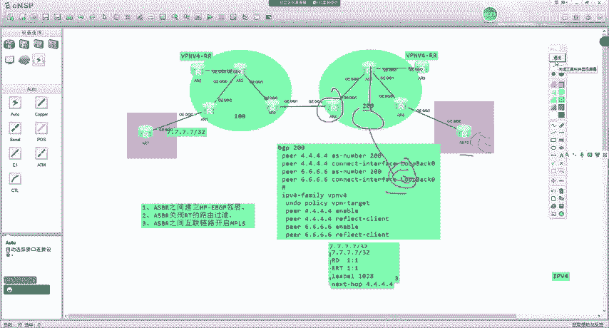

好吧。所以说呢总结来说，B的一个缺点就是ABR的负担比较重。虽然我们可以用ruuter policy啊等等去解决。但是呢嗯流量转发经过ABR对吧？它的压力就比较比较比较大。那有人就问了，老师。

那option A没有这种问题吗？option A实际上也有也有这种问题。好吧，就是A跟B的通病是在哪里呢？就是都是ABR负担比较重。而B相当于A呢，有一个好处是什么呢？

就是当我们再需要新增跨域站点的时候，中间的设备不需要配置了对？所以说B相比于A的话，那它的优势呢是变得更加的具有扩展性了。

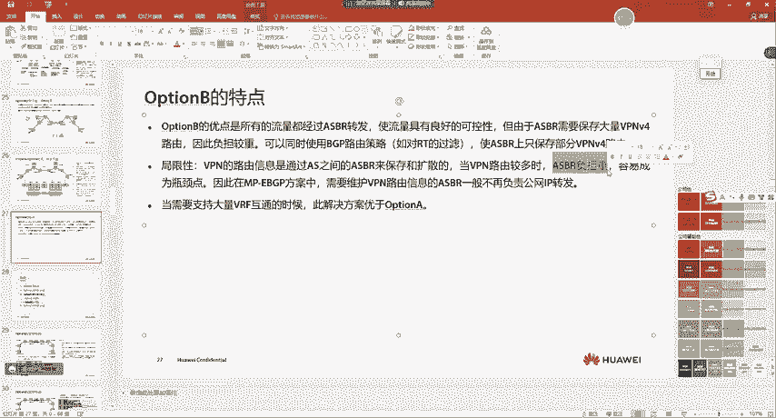

啊。是吧更加的具有扩展性了啊。😊，好了吗？刚卡了是吧。好了是吧。呃，那相比于来说啊呃。这个B呢比A的扩展性啊更好一点。是吧那他俩都有的一个共同的缺陷是在哪里呢？ASBR。对吧负担重。

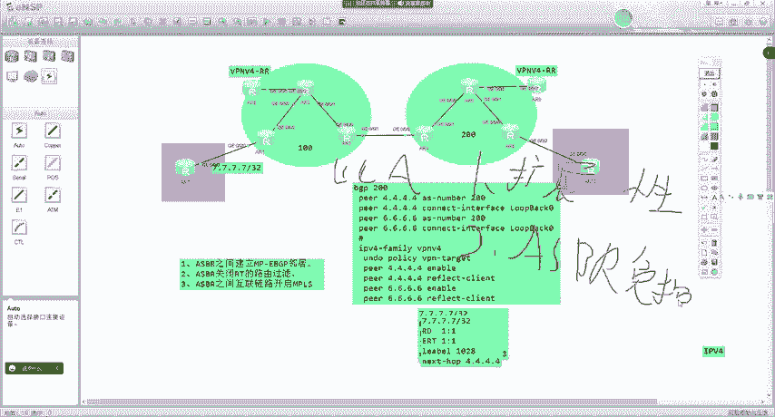

对不对啊？那他俩还都有这么一个缺陷。所以说呢针对于B方案呢嗯我们要则就是你要根据你真正的环境。嗯，区间考虑。是吧比如说你为了省事呢。是吧啊，你可以去选择B，而且B呢也相对来说。稍微简单一些。对不对？呃。

当有大量VF互通的时候，对吧，我们应该优选于啊此方案优于option A对吧？应该优选B。呃，因为他比A要好一点。但是比如说跨域的这个。客户比较少的时候。

我们就可以用option A那A你这个理解起来也比较简单啊，相比于B来说呢，要更加简单一些啊，而且我们配置起来嗯也比较熟悉。😊，对不对？啊，那么对于B来说呢，就是扩展性稍微更好一点。但是由于AB呢。

他们俩都有一个共同的缺陷，就是ASBR。😊，负担重。呃，这个问题我们还得想办法去解决掉。

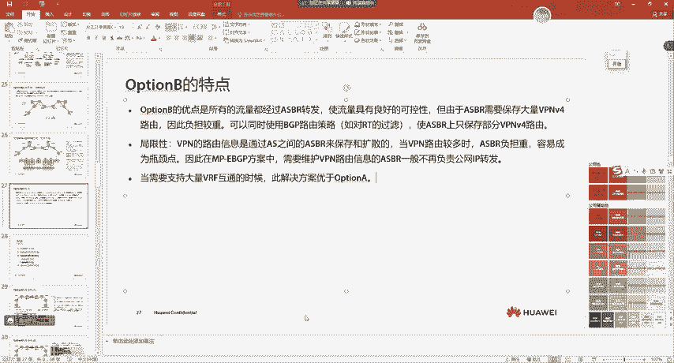

是吧。那比如说当我们的跨域的客户比较少时。这时候呢，我们并不需要。去搞这个东西，对吧？就是并不需要呢去考虑ABR的负担。因为你客户比较少，一般我们的设备呢有足够的资源能够使用。

所以说一般我们不需要去考虑嗯这ASBR负担的问题。但是如果快域的微拼客户非常庞大的话。哦，那所有的VP路由呢都让ABR去保存一份。那这个负担就来了是吧？呃，因为你这些东西呢。

一般都会在你的内存里进行运行，是吧？呃，设备的资源呢占用就比较高。那怎么去解决这种问题呢？是吧就老师ABR负担比较重。

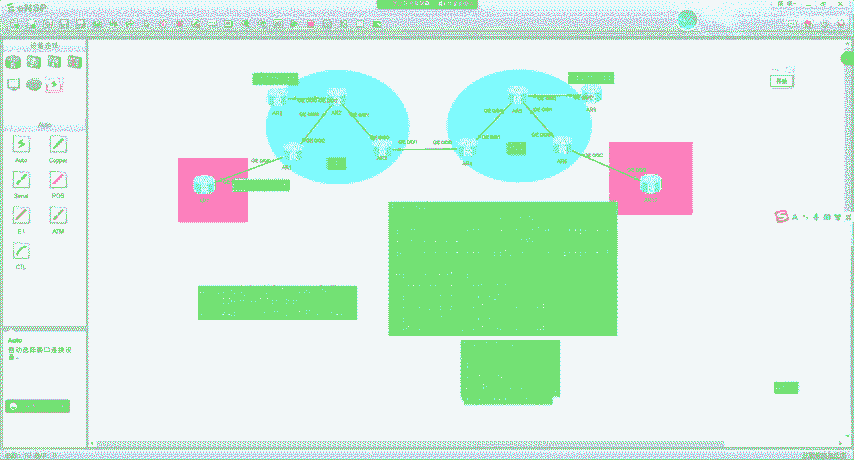

怎么样去解决呢？呃，我们就要去学习option C啊。

就是。啊，另一个跨域方案啊第三种。哎。我们来看一下啊。😊，嗯，相比于A和B呢，C方案它最主要的一个特点就是。ABR呢不需要保存为平维4路由了啊，也不需要去通告为品V4路由了。好吧，就ASBR呢，他这个。

不需要保存了。对吧。因为我们发现A跟B他们俩有一个共有的特点是啥？😡，67的路由要传递给ASBR，然后ASBR再给对端AS，然后再传过来。是吧这是之前我们在学习AB的时候，他俩的一个思路。哎。那。

option C就这样想了。因为你路由经过EBR传。啊，他就传过来了。哎，那有没有这么一种方式呢？就是。😊，A直接传给6。对吧一直接传给6ABR没有这些路由。那我直接传给你，你传过去。

对吧那这样的话ABR就不需要保存了，这就是C的一个思想。呃，就是减轻ASBR的负担。所以说呢C方案它最主要的一个优势是ABR不需要保存VPV4路由了，对吧？也不通告。但是呢这个C啊分为两种方式去实现。

嗯，一种呢是C1啊，一种是C2是吧？方式一跟方式2啊，我们一般叫做option一嗯，跟啊option C一跟C2两种C方案啊。那具体呢，你比如说现在你去看对吧，由ABR江去往。

其他AP的路由通过BDP发送给本地PE设备。然后ABR先去往其他AS的披露由。引入到IP。是吧呃，你看这些呢可能比较懵啊，这里大家不用管，就知道option C的特点呢ABR负担比较小。是吧那同时呢。

C方案分为C1跟C2两种。好不好。那这里我们来看一下啊呃，首先我们要讲的第一个点呢，就是如果ASBR。没有这个。😔，VPNV4路由就他不保存VPV4路由吗？比如说我直接带着死网标签发送到ASBR上。

大家觉得他能识别吗？能不能。不行吧，这个肯定是不可以的。对吧我们之前做option B为什么它能够识别呢？是因为在option B中ABR它是需要传递这些私网路由的。是吧在option B中。

这中间不直接传递。这个VPV4路由了吗？但在C方案中，ASBR不保存。对吧。哎，那么在这的时候呢，如果我们直接带有4网标签转发给AB啊。那么在这时候呢，容易出现路由黑洞。对不对？

就ABR呢不知道怎么样去转发。那这个问题怎么解决呢？实际上也很简单啊。他是这样的。比如说呢。他这样的啊。呃，5把报文发送给四的时候。是吧他打上另一层标签，你刚开始这不是死网标签吗？

是吧LDP你到底这里倒数第二条函出了，我这样我们通过手动的方式，因为你AS之间没有LDP吧。是不是没有啊，是吧，那LDP什么样的工作逻辑呢？就是我把这个路由给你，告诉你他的标签。

待会你转发的时候给我打这个。😡，是不是这个道理呀？是吧那我们可以这样。就是在C里面呢。三呢给四说，你待会儿给我发数据的时候啊。对吧呃，你去打上哪个标签，然后呢，这是通过我们通过手工策略的方式去配的啊嗯。

怎么样去配，后面我们再来说。然后四再给五说，五再给六说。那未来他的逻辑是这样的。呃，6收到一个数据先打上丝网标签X。打上之后呢。再去打上这里刚三这样传递过来的一个标签，假如说是Y。

然后外层再打LDP的Z。就三层标签传递到5了。这个Z对应的是4。4的环回口标签。5、收到之后呢，把这个干掉。啊，倒数第二次弹出，所以说带有一个Y发送到四了。Y不就是这条路产生的吗？所以说四可以识别。

对吧然后是再把它转发给3。三把歪干掉。好吧，然后去把它替换到。另一个标签中。为什么呢？注意。这个Y是什么呢？Y是关于一。1的标签。好吧，说可能说到这里，有同学就不明白了啊，老师怎么是一。1的标签啊。

因为一跟6之间传递路由，你打上四网标签，打他吓一跳的标签，他吓一跳可不就是一。1吗？😊，对吧。所以说你的Y到三上之后呢，再换成LDP的标签。然后里面是X，再发给2。二能识别LDP的标象，倒数第二条弹出。

把X发给R一了。啊，这就是C方案的一个大概逻辑。那这里可能有同学比较懵了是吧？啊，我们通过一个实验啊，慢慢的给大家剖析一下。因为这个你得慢慢的去理解。😊，好吧，那这个咱们怎么样去做呢？

我们把上面这张图啊去改成一个option C。好吧。那op C呢？我首先讲的是C一啊是C1。好吧。那option C一是这样的，注意。嗯。嗯。我们先不要啊，好不好？我们先不要啊啊。嗯，我们在A21上。

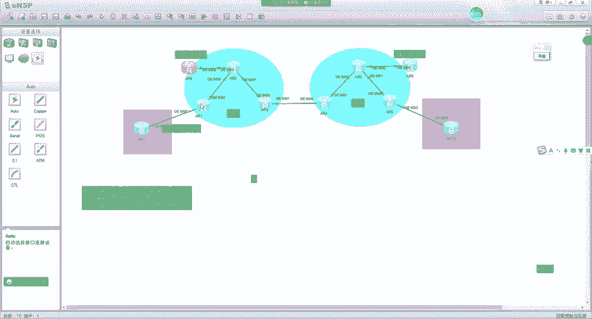

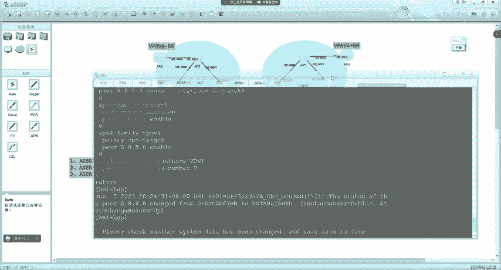

这样啊，我把ARE的BGP配置直接给他删了。然后。2的BDP配置。啊，2没有运行BP。把三的BTP配置。你也给他删了。把四的BDP配置。5没跑BGP，然后把6的BGP配置给他删了。

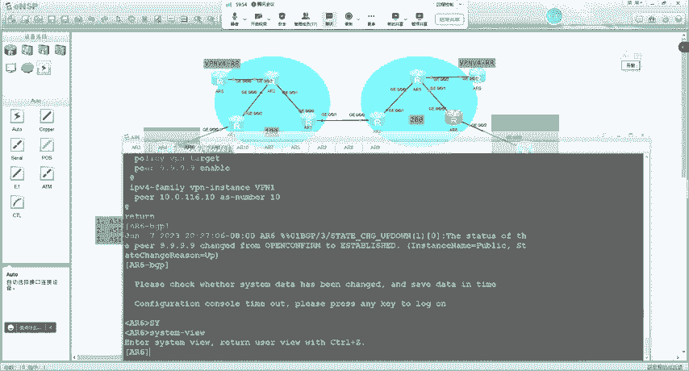

好吧。嗯，然后八跟9我们先拿掉。先拿掉啊，然后我们先做1个C一不带R的。呃，现在很简单啊，现在我们就是把AS内的IGPMSLDP配完了。

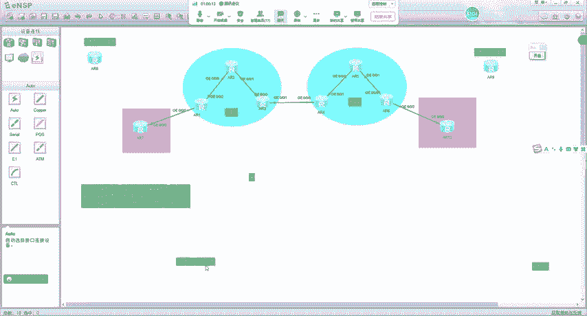

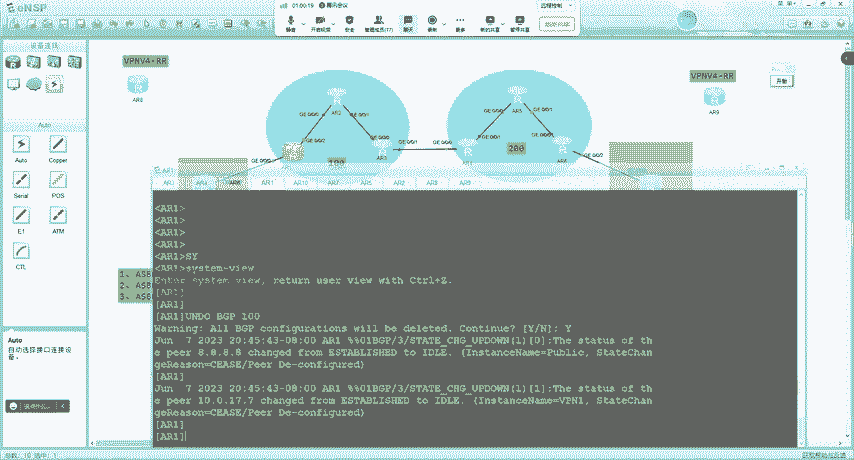

所以说IE上呢。diissplay M LP。有3。3的RSP是吧？然后在6上呢。啊，他也有1。1的RSP啊，不对啊，也有4。4的RSP。对吧。

然后C方案我们最终的目的呢是在一跟6之间直接去建立V平V4邻居关系。那这时候比如说你要建邻居，你肯定得路由通啊。比如说我们在IE上去看6。6的路由，我发现没有。

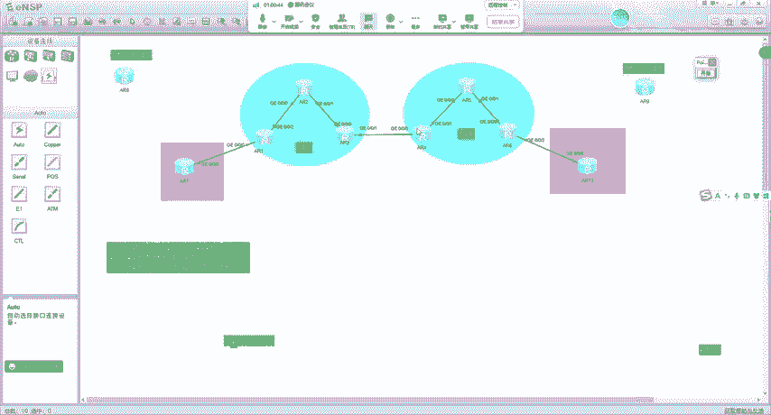

嗯，没有是什么原因呢？是因为我们现在属于不同的AS大家是不同的IGP协议。

对不对？啊吧那怎么样让一跟六能够互通呢？那AS之间呢，我们都会跑BDP对吧？就是普通的IPSBDP。大家都会配吧。配IPV4BDP让你实现一跟6互通。大家都能做到吧。

是吧所以说我们刚开始呢就做一个简单的对吧，先让一跟6啊能够互通。好吧，那这个互通咱们怎么样去做呢？呃，我们是这样的，注意。我们先规划一下IPV4BDP的配置。那IPV4中呢。

我们让二作为IPV4的R设备。A25呢也作为IPV4的啊，这是我们规划的IPV4BDP的配置。

我在阿姨上呢。BDP100。2。2。2。2。罗柏林。注意啊，这是IPV4BGP，然后在三上呢。也一样。3还得跟34。4去建立IPBDP邻居。是吧，然后在二上呢，BDP。100。皮尔1。1。1。1。1。

operation C的配置非常多啊。就这一大堆BDP，你就得配好一会儿。1。1。1。1。3。3。3。3，现在做的都是很简单的配置啊，就是我们去配IPV是BDP嘛。啊，这大家都比较熟了啊。嗯。

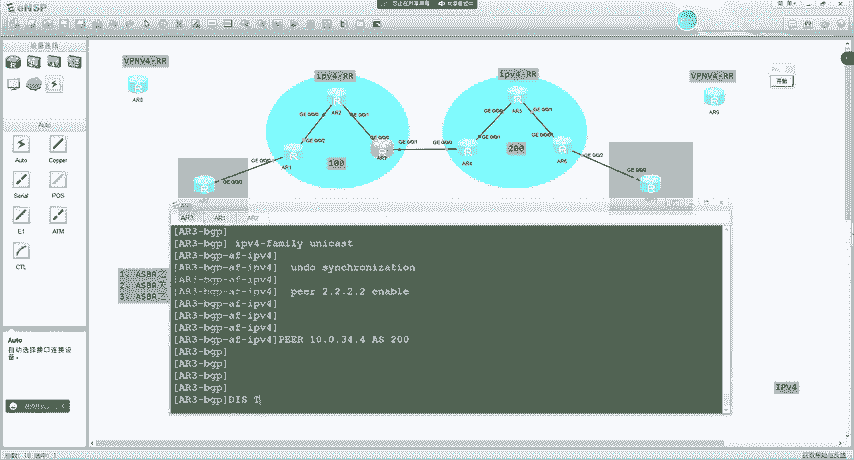

然后我们在4上。4跟5。5。5。5。5。5。5。5，然后跟34。3AS100。是吧这激活默认激活的。这是在四上的配置。嗯。

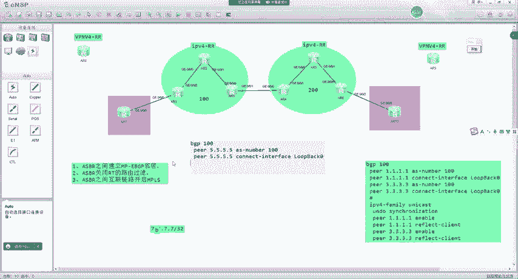

然后这是在六上的配置。啊，不是BGP100，是BGP200。

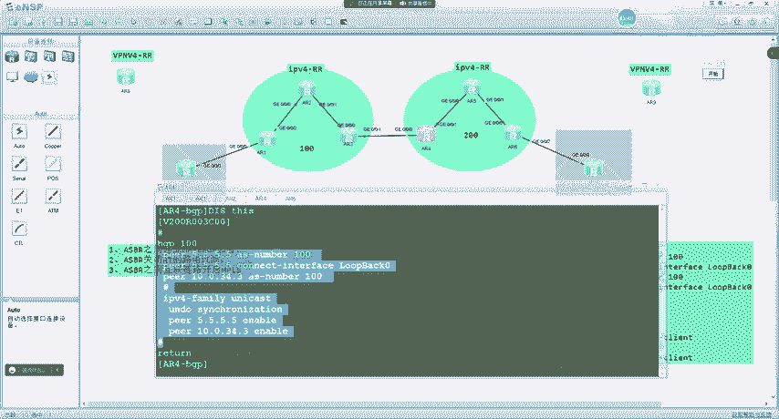

哎，这有4的。啊，这是6个。嗯，然后这是5的。5上面呢就是。是的是的是的是。然后跟6的6的6的溜。对吧然后这一nabel呢，咱就不敲了啊，他默认激活的。啊，连居200哦，对。

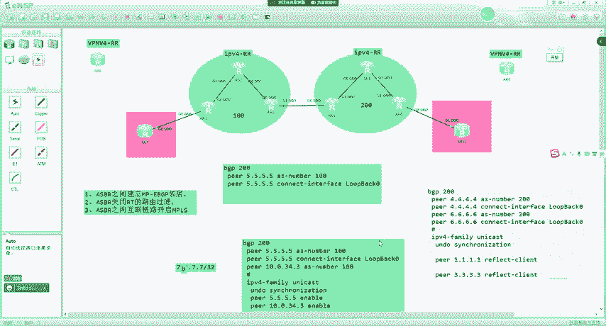

那这边还配错了。是吧再删一遍啊。在四上呢给他干掉。😊，安度BDP。呃，这是四的配置，跟五是S200，然后三四。3100。

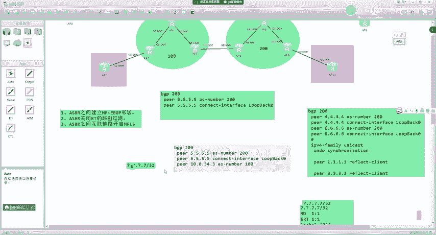

是下面的默认激活咱们就先不留了。这是四的，然后这是5的。啊，不对啊，这是6的。

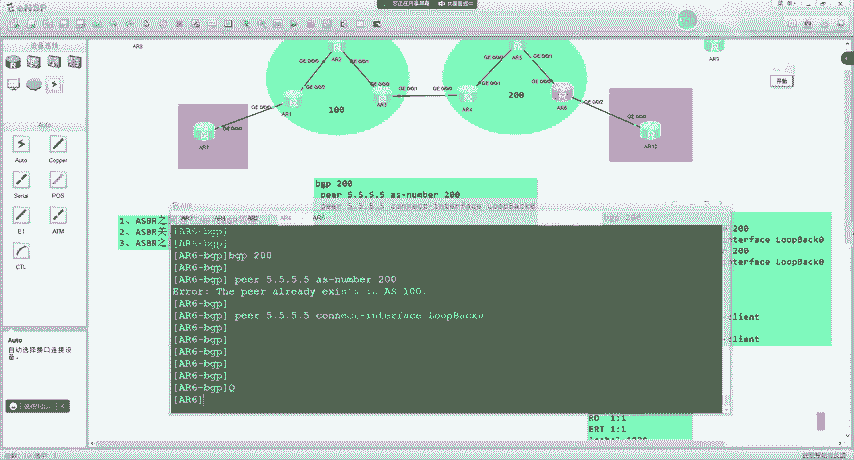

把6的BDP原有的也给它删掉，然后再刷进去。5的200200邻居也是200。对吧，然后。4。4。4。4。嗯，6。6。6。6。然后给5也刷进去。哎。好吧，就现在呢我们做的很简单啊。

就是1个IPV4BGP的配置。😊，呃呃，做完之后呢，我们来看一下啊，在AR2上呢，应该会有2个BDP邻居。

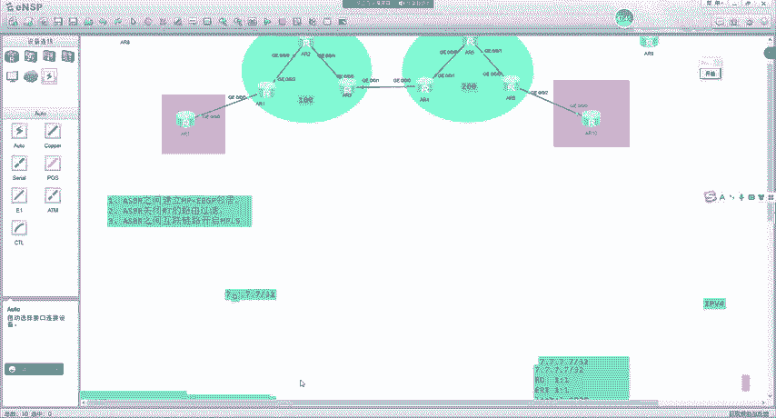

对不对？然后在5上呢，DplayBDPP应该也是有两个啊，我们稍等一会儿。好吧，也是2个BDP邻居。

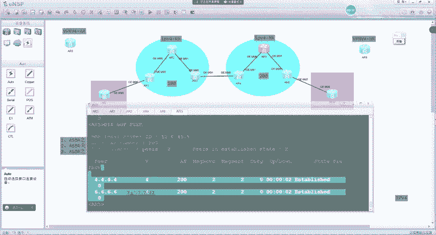

那现在就做完了。对吧呃，未来呢我们要在一跟6之间去建立。直接去建立。比GP邻居关系。所以说呢我们得再让一的环水口啊，未来我们通过环水口去间啊，跟六的环水口能互通。那怎么样让他们能够互通呢？呃。

我们这样啊。

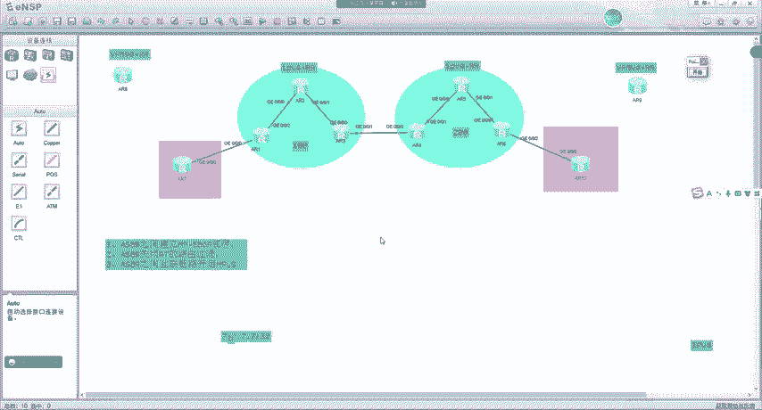

在R3上，network1。1。1。1。通告出去。就是通过IPU是路由啊。在市上呢，nightwork6。6。6。6。通告出去。对吧。这不就是1个BDP互通嘛？然后我们在IE上呢。😊，就能够学诶。6。

6没过来。6。6传递给3。啊，三旺记配niceho local了是吧？

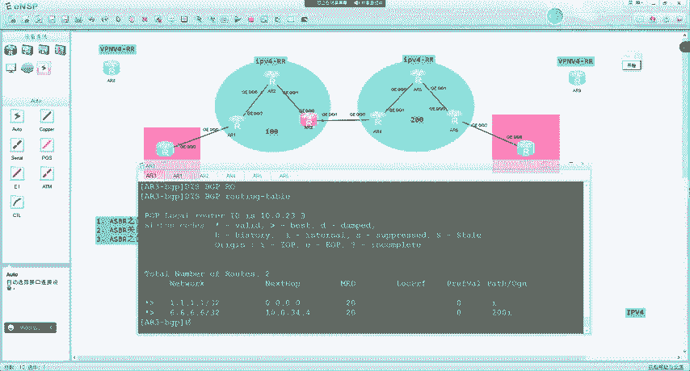

P22。2。2。2。nice hope local。

然后四上面呢也得针对于5。5。5。5n of block。是吧。这时候三收到了。6。6的路由呢。他就会传递给R。R姨看6。6，现在吓一跳，还没刷过来。是吧我们让三重新发一份路由更新。然后来二上看一下。

来了啊，下一跳3。3。😊，然后就反射给了R一，R一就能够学到6。6。啊，反之3。3的路由也能够传过来。

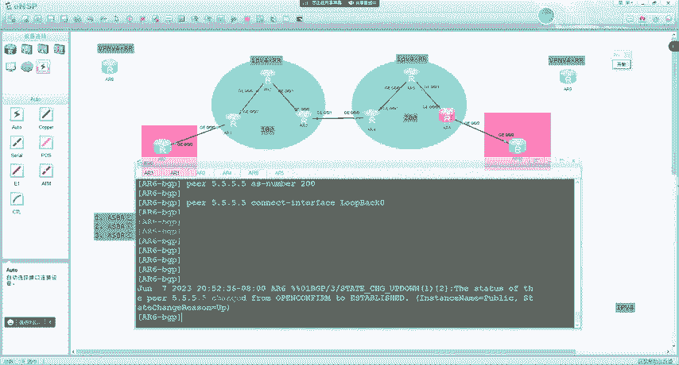

然后6呢。也能够学到1。1。啊。

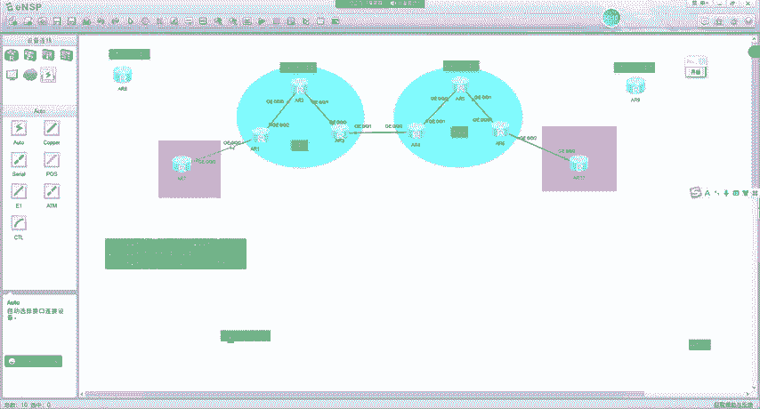

那这时候呢，在R一的录由表中呢，就有一个。6。6的路由。在六的路由表中呢。就有1个1。1的路由。对不对啊？那这时候呢，比如说我们在AR一上聘。杠A1。1。1。1到6。6。6。6。是不是就能够互通啊？

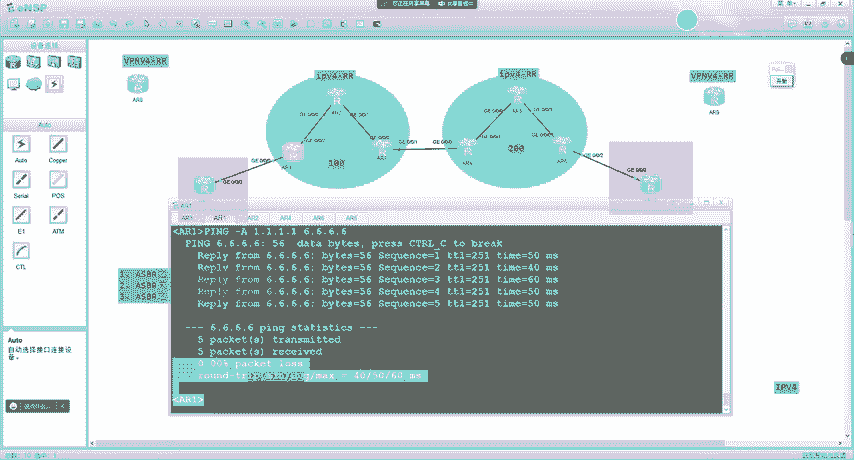

是吧这个很简单吧，到这一步大家都能够跟上吗？跟上同学敲一啊，没问题吧。到这里头很简单啊，这就是呃IP学到的一些简单的配置。😊，对吧。呃，做完之后呢，注意。做完之后啊。嗯。咱们休息会儿。

休息会儿吧啊嗯休息10分钟，十0分钟之后呢，我们再来去做这个。跨域option C一相关的配置啊。好吧。我们先休息10分钟，10分钟之后呢。再去讲其他的配置啊。呃，咱把录屏开一下啊，然后继续来说。呃。

刚我们已经把这个一跟6呢对吧，把他们两个已经做通了。呃，做通之后呢，注意啊呃，接下来首先说第一步配置啊。呃，依然是一样的，就是。ABR的互联接口。嗯，要去开启MP4能力。因为未来在option C里啊。

那ASBR之间转发的报文呢也是带有标签的。

所以说呢我们得在三跟四的互联接口，这里呢首先要去给它开启MPS功能。G0杠0-1啊，开一下MP24。然后四这边呢也是一样。

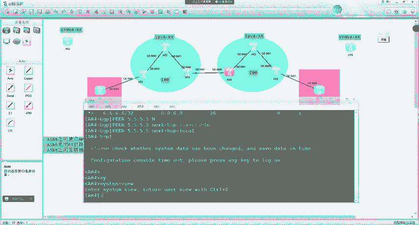

0-0-0开启MP4。好吧。开启之后啊，大家要注意嗯，这里我再给大家强调一遍啊，我们看一下一点1的路由是怎么传的。

我们不是在三上发布了吗？是吧，他会传递给4。

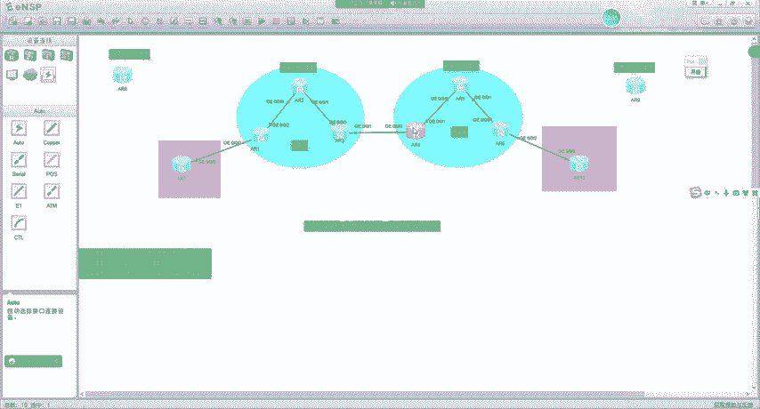

然后四传递给55再传递给6。所以在六上面呢，他就有了1。1的路由。对不对？那这个1。1的路由呢我们来看一下啊。比如说我骗。嗯，杠啊，不是骗啊，就是比如说A26呢，他要去访问1。1的时候。

他首先查找路由表，1。11。1。对吧下一跳是4。4。然后他就会去看4。4怎么走。是吧4。4呢下一跳是10。0。56。5。

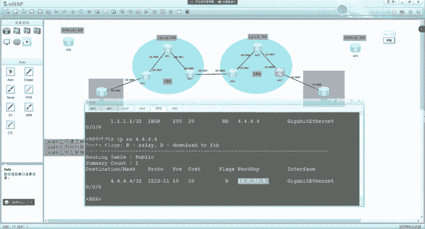

对吧他要也就是说在这里呢，他会迭代一次。

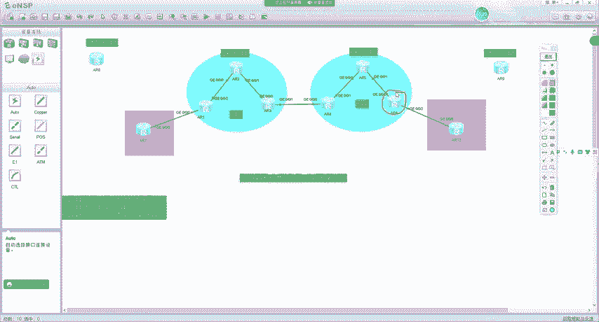

是吧这里大家先有个印象啊，就是如果我们去看BDP路由的话，去往1。1的下一跳。注意啊，下一跳是ASBR好吧，下一跳是A24，这里大家先有印象是吧？实际上这里大家也知道啊，嗯，这里我先再说一嘴对吧？

因为待会呢我们会去用的。

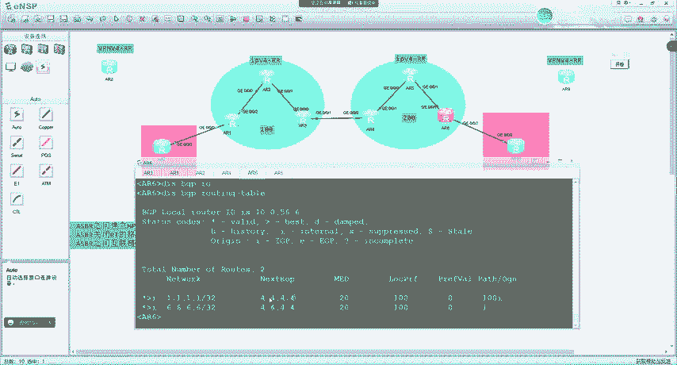

那现在我们基于环回口互通呢。

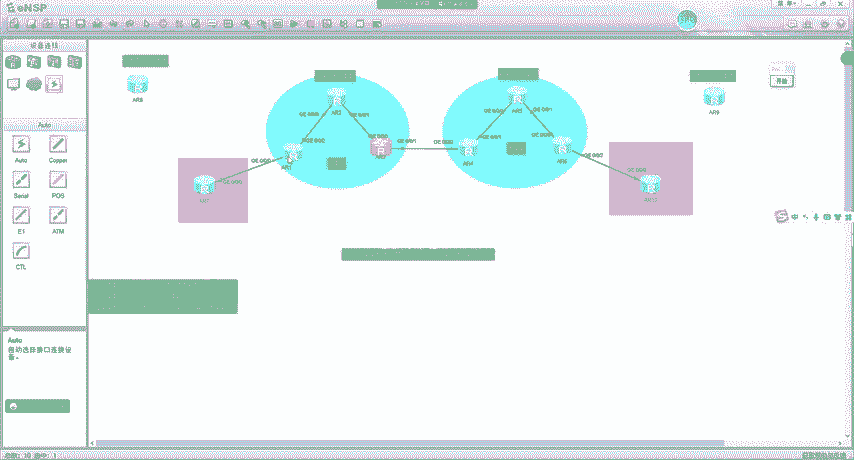

就可以去建立为平V4邻居了。比如说我在A2一上呢。IPVP音斯坦啊VPNE。呃，我们配一下D，比如说就是一嘛号一，然后RT呢。啊，我们也用于冒号一好吧，然后在G0杠0杠0接口。给他绑定到。啊。

绑定到VP一种啊，因为刚刚我敲过了啊。这是咱们之前op Aop B里呢就已经绑定了。好吧，绑定完之后呢，我们在BDP100P2注1。😊，嗯，不是PIPV4family VP VPE。P10。0。17。

7A。比如说就在A7吧。然后七这边呢。BDP7。对他也去跟一去建立了BP邻居，而且network的7。7。是吧所以说待会儿呢，他们两个的BGP邻居呢就能够建立起来。我们先看一下邻居状态。嗯。

现在还没起来。嗯，你稍等一会啊。起来了。😊，起来之后呢，由于我们在A27上net7。7，所以说它就会传递给A21。对吧哎，不对，第一首类BGPVPV是2table。他就从微P实力中呢学到了7。7。

然后转换成VPV4。是吧这时候我们直接在一跟6之间去建立为PV4邻居就好了，这不就传过去了吗？对不对？所以我们在A2一上呢，这样来做怎么做呢？BDP100。P27。7。7。7AS200。啊，不是7。

7啊。是P6。6。6。6。A200是吧，直接给对端的P去建立邻居，但是默认EBDP。是吧嗯他是这个一跳，所以说我们还得P26。6。6。6敲个1BDP多跳。啊，然后P26。6。6。6更新原地址呢。

因为我们只是low百0接口互通对吧？敲个low百0。然后IPV4familyVPV4P26。6。6。6，把邻居激活。所以很简单啊，大家记住步骤。步骤就是呢我们把一跟6的路由打通之后呢。去跟六建立多跳的。

VPV是邻居关系。那在六上呢，也是一样的。BDP。200IPV4family。VPNin VPNE。啊。然后P10点。0。116。10A10。然后是P21。1。1。1A100。P尔1。1。1。

1更新原地址是low百玲，然后1。1。1。11BP多跳IPV4falyVPV4。P尔11。1。1。1in内able。对吧就是。跟1。1。1呢去建立多跳的VPNV4邻居。

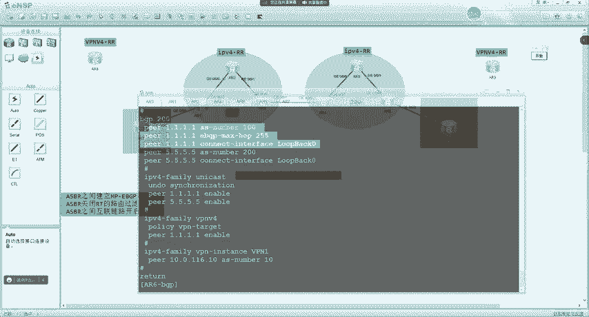

是吧。那这时候呢，我们来看一下7。7的路由传递到11之后呢。

依旧学到了VPNV4的7。7啊，这时候要传递给自己的VPNV4邻居6。那6能不能学到呢？DBTPVPV2如table。

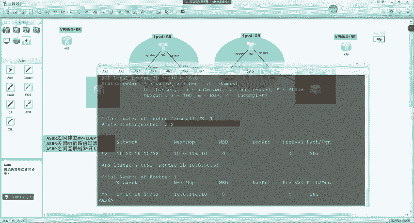

嗯。好，现在领取的建立啊，我们发现呢六也学到了。是吧学到之后呢，根据RT的匹配导入到VPN实例中。那导入进来之后，这个路由要不要传递给10啊？是需要的吧。啊，我们发现十就能够学到7。7。

反之10点10的路由呢也是传递给66给1一再给7。

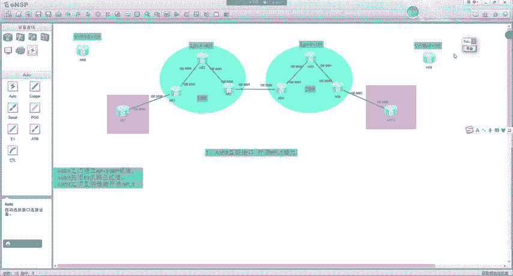

啊，所以说七这边呢。

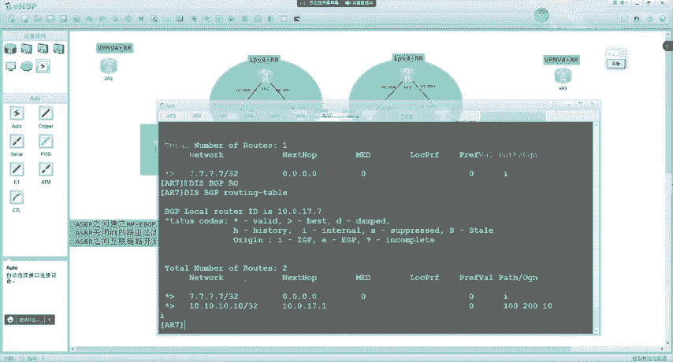

也能够传递给1。那这时候比如说我们在时上去pin杠A10点10点10点10，因为互相能够学到路由了嘛，到7。7。7。你发现呢不通。对吧。那不通是不是正常的呢？其实现在是正常的。

我发现路由能够进行正常传递，但是不通是吧？为什么不通呢？我们来分析一下啊。😊，原地址10点10点10点10到目的IP7。7。7。7。这个数据就发送给了6了。

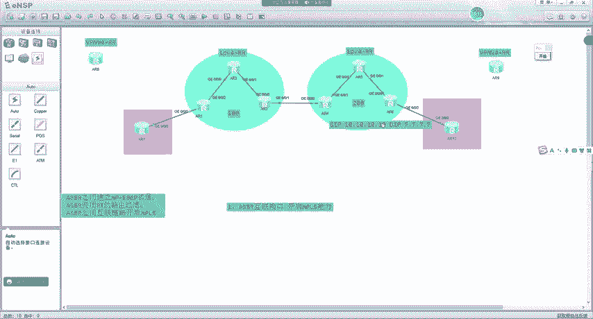

是吧。6、收到之后呢，我们来看一下disspplay BDPVPNV42rooting table7。7。7。7。

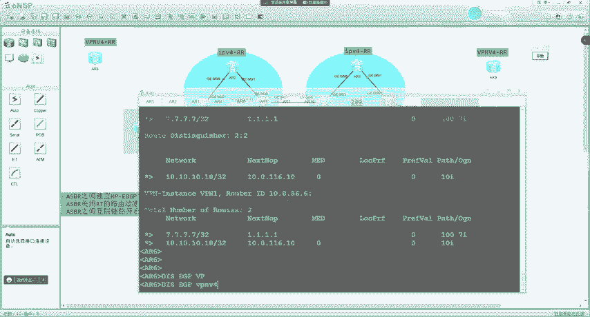

这条路由呢先打上丝网标签1028。对不对？我就打上丝网标签1028了。

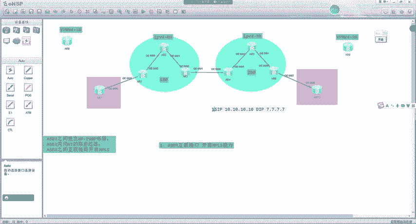

打上之后呢，我们一看吓一跳1。1。是吧。哎，1。1。有没有RSP啊？没有是吧。没有，老师，我就正常迭代呗，对吧，我们去往1。1的吓一跳是谁呀？😡，是4。4。那4。4老师有RSP啊。对不对？

是吧那老师我打他吓一跳的，因为我们最终都要迭代到隧道中啊。比如说我们看7。7。他是不是有一个特no IDD0X5啊？是吧。然后如果我们去看的话，找0X5。0X5。哎，没有。是吧没有，那就迭代不进去。

这是4。4，它是0SR。然后4。4，这是0S1。对吧那还迭代不进去。也就是说，现在有没有0S5这个隧道啊？

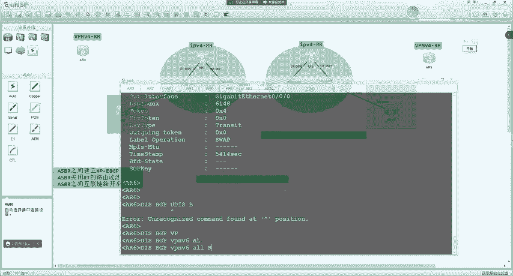

是不是找不到啊，对吧？7。7。7。7。是吧。那发现下一跳是1。1，但是呢没有1。1的隧道。是吧那比如说我们打个逻辑来说，注意啊。当他发现下一跳1。1没有1。1隧道的时候呢，1。1的下一跳是4。

他进4的隧道。是吧我们打个假设他打上了1024。这个包发给55倒数第二条弹出发给4。4、认不认识1028呀？他认不认识？实际上是不认识的。是吧所以说现在呢我们没有办法去拼通，因为什么呢？

因为当前我们的RSP并不是完整的，因为我吓一跳是1。1，我没有一。1的隧道。是吧。这时候怎么办呢？我们是这样的。你这一。1不是AS，我们来注意一下啊。首先，三有没有1。1的隧道？3有1。1的LDP隧道。

四有没有四没有四没有5也没有5没有6也没有。是不是这么个逻辑啊？对吧哎，那我们能不能这样呢？我们来想一下LDP分标签的时候，大家还记得吗？这是一，这是2。😊，二给他说2。2。2。81签瓦。是X。

所以说四给二发数据的时候，是不是带着X的标签啊？对不对啊？哎，那我们能不能这样呢？我们让三啊，因为你三本身有对吧？二也有一也有。所以说这一块我们不需要做配置了。我们让三这呀。三给四发路由的时候。

因为三要给他发1。1的路由啊。是吧我们通过策略给他打一个标签。

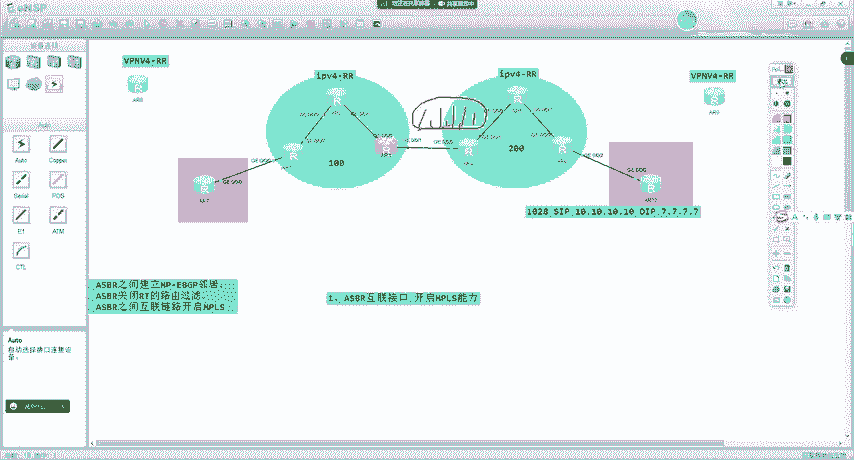

我告诉你一。1的标签啊是哪一个？这个呢是我们通过root policy去做的。比如说我写个ro policy。嗯，我们直接叫ASBR。好吧，针对ASBR去用的prome noteote10。呃，伊服麦。

ACL好，但这里我们只发一。1啊，我就不一服卖上，我直接打了。O普ly MP label。好吧，就是我没有衣副 max语句的时候，是不是匹配所有路由啊？但是现在我只给他发1。1，所以说就是匹配1。1。

😡，打上1个MGS标签。然后我们在BDP100下面P210。0。34。4。root policy ASSBR。Eport。好吧。现在这个策略的作用是什么呢？我们来看一下。我呢。😊，匹配了所有路由，对吧？

给他们分配1个MPS标签。然后针对于四这个邻居去调用，就是发给你路由的时候打上标签。但是呢。默认情况下，这个标签有点类似于团体属性。啊，两边得协商。你得让他协商能够传这个标签的能力才可以。

默认这个能力没有开启。所以我说我们针对于三这边呢，还要针对于4撇10。0。34。4。去开启。标签路由的传递能力。那你开启之后呢。注意。他两端要进行协商，所以说四这边呢。也要针对于三区开启。

因为两边要协商嘛。是吧。4呢P2100BDP200P210。0。34。3。开启标签路由的协商。那待会儿四要传给55要传给6，这边要不要也要协商啊？是不是也需要啊？是吧所以说我们P25。5。5。5开启。

对吧然后到5上。BDP200。P尔4。4。4。4是吧？因为两边有协商，肯定都要开启啊，是吧？然后P尔6。6。6。6。

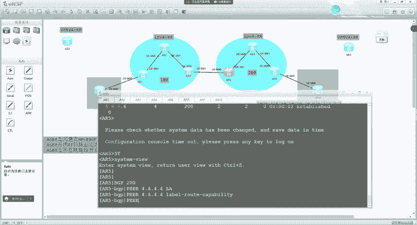

然后在六上呢。BDP200。皮尔。嗯，5。5。5。5也给他开启协商。好吧。开启协商之后呢，就是我们在这一段。这一段。还有这一段。对吧开启了标签路由的传递能力。啊，这个标签路由大家注意啊。一给6。

大家觉得为什么能直接传啊？😡，因为他们传递的是什么路由？VPNV4路由。而三给四传的是什么？IPV4路由，所以IPV4路由要单独开启VPV4不用啊。好吧。那反过来我们想未来。

4、要不要把六的路由传给三爷打标签啊，因为你七访问。十的时候到一上，他下一跳是6。6，也得有6。6的标签啊。所以说。四要不要针对于三开呢？需要三要不要22要不要一啊？也就是说这一段要不要也开启啊？

是不是也需要？对吧所以说我们在三上呢还得Pre2。2。2。2。标签路由协商开启。对，只要有IPV是BDP邻居。嗯，就得配置。是吧所以还比较麻烦啊。BP100对，就是全开启3。3。3。3。1。1。1。1。

是吧然后在一上呢。BDP100P22。2。2。2。

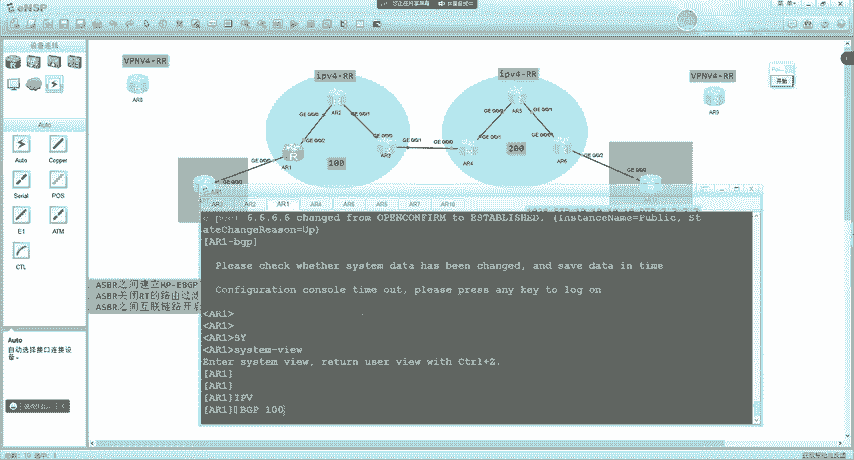

好吧。那这里可能大家有一个问题，就是老师标签路由的协商能力。对吧，注意。是在所有。据所有IPV4。邻居之间。开启标签路由的传递能力。好吧，是双向。开启。对吧因为他要进行协商嘛。你有他没有啊。

就跟你俩结婚一样，你同意他不同意啊，你俩也结不了婚是吧？所以说呢只要有因为我们IPV4BGP邻居不就这样建的吗，对吧？所以说这一段呢都得两两之间互相开启。

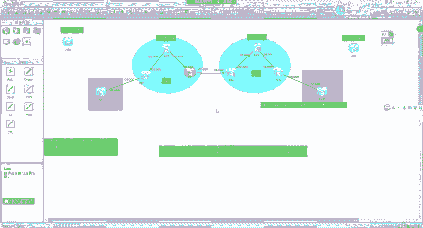

开启之后呢，我们来看一下。3、disspplay BDP vP为 all啊，不对，dispplay BDP如table。他不是有一条IPV思路由1。1吗？

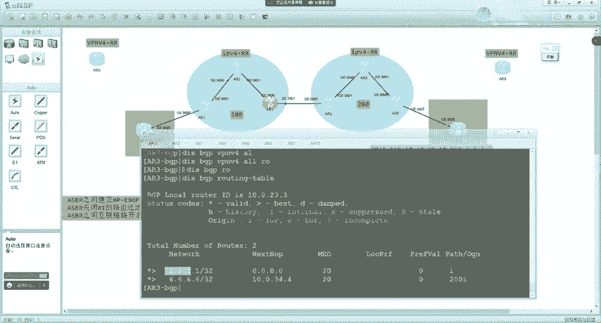

然后我们来看一下这个1。1。三这时候有没有给他分配一个标签1032啊？有没有？有吧是吧，这就是我们通过策略去打的。对吧他没有RDRTR，这就是IPV4路由啊，就来了一个标签。那三要传递给4。

所以说四收到之后。1。1。1。1。接收到了1个103。那当四想传递给五的时候，我们来想一下啊。1。1。1。1传递给5，下一跳变成4。4。那在这的时候，我们来看一下5。5。有没有一。1的标签呢？没有。

为什么啊？因为下一跳改变了，四要重新分配标签。

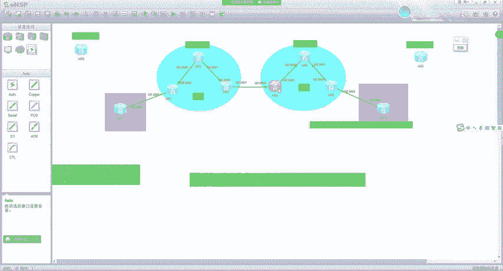

但是我们有没有通过策略？给四说你发给五的时候要给他分个标签啊。有没有啊，沟通没有。是吧所以说我们得在四上怎么办呢？😊，Root policy。追啊。呃，我先把ASBR的做上。好吧。为什么呢？

因为刚刚我们1。13发给41。1的时候，打四发给36。6的时候，要不要也打？要吧。是吧所以说我先把四发给六的啊，这个方向呢也给他做上。BDP。200。P尔10。0。34。3。

root policyASBR。Its part。是吧。然后现在我们来看一下配置呢，BGP200。这是在四上的配置。

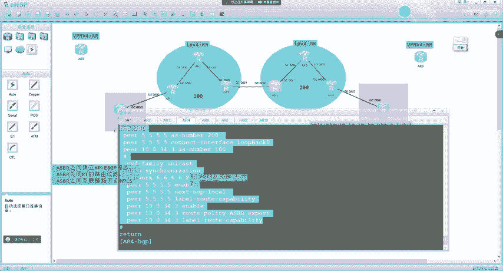

这是在山上的配置。

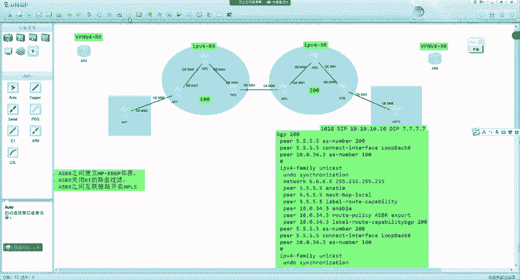

啊，给其他贴到一起了啊。

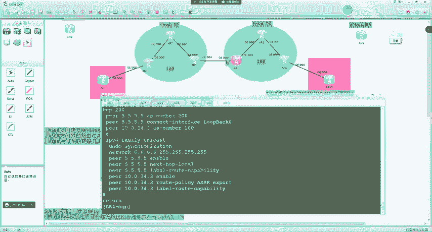

我们来看。首先呢。嗯，注意啊，他们都跟二就这里的邻居都建立好了。是吧。呃，三跟二建立IPV是BP邻居嘛，对吧，然后跟他建。对吧这一段配置大家能看懂是吧？然后在4上呢，跟5间跟三件。

这都是IPV4BP邻居的配置。😊，那做完之后呢，我们在三上宣告了1。1，在四上通告了6。6，让一跟6的环卫口能够互通。对不对？然后呢，我们针对于2。2。注意啊，就针对于2。23针对于2。2。

去做了一个nice hope local。对吧就是发送给你6。6的时候呢，吓一跳是3。3，要不然路由不可达嘛。然后在四这边也是一样，发给5的时候呢，做了一个nice货物lo1。一发给你吓一跳得干。😊。

然后呢，我们在三跟二之间，三跟四之间。三跟4。三跟二之间开启了标签路由的传递能力。对不对？3把1。1的路由发给4，打上了1个AS啊，打上了另了一个策略。ABR打上了一个标签。是吧色这边也是一样。4呢。

他针对于5。5。R开启了标签路由传递能力。然后针对于ABR3开启的标签路由传递能力，就为双向开启吗。是吧然后四给三发路由的时候，发6。6嘛。对吧也打上了一个标签。但是现在我们遇到的问题是什么呢？

就是老师啊，四把1。1的路由发给5，他没有标签，因为下一跳改了，但是4呢。又没有重新分配标签给5。对吧那这时候呢，五还是没有。1。1的标签啊，就是我们已经把这一段1。1的标签做完了。

但这一段依然是没有啊。😡，是吧。

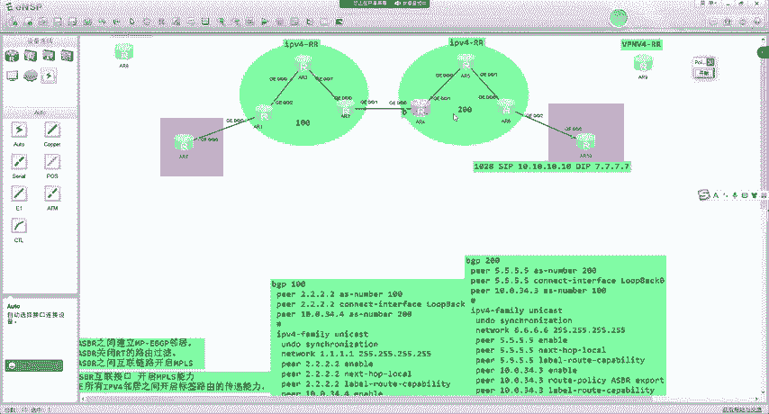

所以说呢我们在市上得做这么一条策略。ruot policy are promise note10。

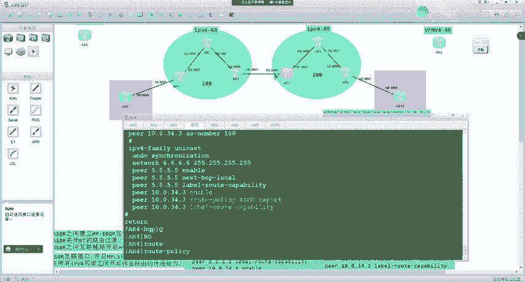

叫匹配带有标签的路由。再次给他分配标签。这跟LDP1不一样。LDP他不就这样吗？123。收到下游提供的标签，然后换一个标签再给一。大家还记得吧？对，没错，手动LDP。没说。所以说在这时候呢，我们在四上。

BTP200。P尔5。5。5。5。root policy啊。一是泡。好吧。就是我们针对于5。5呢去给他调用这个策略。重新给你分配表签。重新分配之后。

我们到5上再来看一下display BGProoting table。1。1。1。1。啊，现在还没有缓过来。嗯。然后我们到5上来看一下啊。我们来看吴有没有接收到1。1的路由，有了1个1033的标签。

这是不是重新分配的？对吧。那5把路由给6的时候，注意啊，各位同学。吓一跳有没有改，而在反射路由的时候，会不会修改下一跳呢？会不会啊？不会。对吧所以说吓一跳没有改，我们直接到六上来看的话。嗯，1。1。1。

1。刚刚我们不是说1。1没有标签吗？现在1。1。有没有标签了？有了吧。到这里大家能够理解吗？李野同学敲一啊，所以有了这个标签，我们去看RSP。有没有。也有了吧。当我们打上送网标签，1028吓一跳1。1。

有没有1。1的标签了，有了。那反过来也一样啊，反过来你这边7。7。他去访问。木的IP。10点10点10点10的时候。到了A21A21看10点10的下一跳6。6，一现在还没有6的标签啊。对吧。

没有怎么办呢？没有，我们反向也得打一遍。是吧有大家开始慌了，对吧，老师怎么才做了一半啊，就是才做了一半。😊，听到吗？所以说反过来呢，我们已经在四上针对于三去打了一个标签。那三收到6。6的路由就有标签啊。

是吧。但是。三有没有针对于二去打？有没有啊？没有。差了一个什么测量？当下一跳改变的时候，需要重新分配标签。我们有没有通过策略告诉他，你得重新分配啊，没有对吧啊，我们还得手动LDP。😡，对对，在山场。

ruot policy R promise me note10。匹配带有标签的路由。是吧重新分配标签。然后呢，BDP100。Pre2。2。2。2ru policy。R isport。好吧。那这样的话。

我们再清理一下啊，reflash BGP all is。那这样的话，A23呢就把路由发送给二了，而且重新分配的标签。我们来看一下diplay。BDPVP v啊不di BDProing table6。6。

6。6。你现在还没来来了。😊，是吧他就接收到了1033的标签。RR反射给一吓一跳没改。所以说迪四类BDP如ingtable6。6。6。6。依旧收到6。6的路由，也有标签。对不对啊？

然后我们再来看一下RSP。有没有6。6的RSP？就有了。是吧。注意啊，这里我再来给大家分析一下，可能各位同学觉得是吧？老师这个标签在哪里打握有点懵。😊，是吧。😊，我再来给大家分析一下。我们刚刚去访问7。

7，打上4万标签1028。7。7的吓一跳，唯品V是路由啊。7。7的下一跳是一。一的标签三有一的LDP标签，但是这一段没有一的标签。😡，怎么办呢？我们开启标签路由传递能力，我让三给四发一份。

四给R发一份R直接反射给6了。所以说真正打的时候就是在三场有一个测略，四场针对R有一个测略。所以这个方向大家明白了吗？明白同学敲一啊。没问题吧。好。然后我们来看反方向。反方向你去访问10点10。

10点10的吓一跳。他是6。6啊。6。64有6。6的标签，这一段已经有了LDP的了。但是这一段没有没有。所以我们刚才四场针对于三去打了1个ASBR的那三针对于R打了一个是吧？R直接反射给了A21。

所以说现在反向有没有？😡，是不是也有了？这个明白了吗？连白敲一啊，没问题吧。😡，所以说策略打的很简单。😡，对吧你只需要知道谁有对吧？在没有的这一块打就可以了。😡，是不是然后反向。谁有在没有的这一块去打？

好吧。那只不过我们在传递标签路由的时候，因为这一段都要传啊，同步去开启标签路由传递能力。那刚刚我们只做了这些配置。好吧，所以说到这里大家都能跟上吗？没问题的同学敲个一好不好？行么。然后我们来看啊，注意。

那老师标签来了。😡，是吧接下来我们来看一个现象。10点10点10点10到7。7。7。7。哎。通了。是吧宣选很奇怪。啊老师好悬啊。是吧哎，怎么就通了呢？😮，对不对？我们来看一下。好吧。

你那个问题待会我再跟你说啊啊，我们先把这一单讲完，周意。😊，这时候我们再来看一下是怎么通的。首先我们来看路由船很简单啊。路由的传递是这样的，是7。7。7。7-32。IPV4路由给A21了。A21呢？

依大二大二大二。啊，7。7啊。7。7。7。7。AR1给他打上DE冒号14网标签1028RTE冒号1。是吧。所以说这时候呢。阿迪与马学二。IRT伊马伊。然后。label是1028。

A21的VPNV4邻居是6对吧？我们D4BGPVPNV42P。是吧从这里收到，直接传递给6。直接就过来了。过来之后，6根据。RT导入到微PN实例中。啊，7。7导入的微平实地。就直接传递给1了。

是吧很简单啊，我们发现控制平面非常简单啊，老师就这里IPV4，这里为PV4，这里IPV4没了就没了。😊，那数据在转发的时候，我们来看一下它的过程。原IP地址。10点10点10点10到目的IP地址7。7。

7。7。流量到达6之后，6首先一看。7。7。7。7。这个路由的丝网标签是1028。就打上了1028的标签。啊，1028啊。好吧。然后我们看下一跳1。1，那刚我们有没有手动的把1。1的标签？1。

1的隧道给他做出来。有没有？有吧。是吧。所以说这时候呢，他再打上1个1033。但是刚刚我给腾员们说过。6上面1。1点吓一跳是谁？我不带你看设备啊，但是说是谁？😡，是4。4。那。

D四playIP roing table4。4。4。4。有没有4。4的标签？有吧，再打上1个1024。所以说这里呢待会儿会有三层标签值。就发送给我了。5、收到1024。他知不知道1024怎么走。

1024代表着谁啊，代表着4。4。5当然知道1024怎么走啦，倒数第二条弹出。两个标签。发送给4了。这是三个标签。啊，这是IPV4数据。两个标签发给4个，来告诉我。😡，4能不能识别1033？拿不拿？

1033代表着1。14收到1。1的时候有没有标签，有？

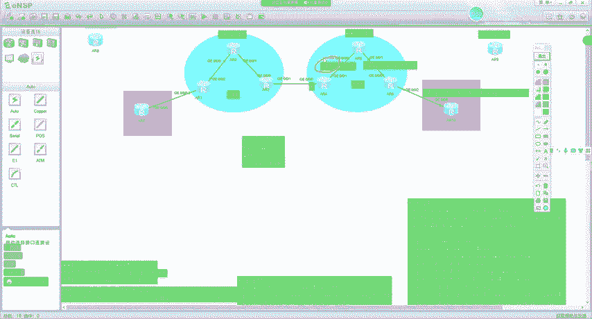

所以说是现在能够识别1033MPSLP。

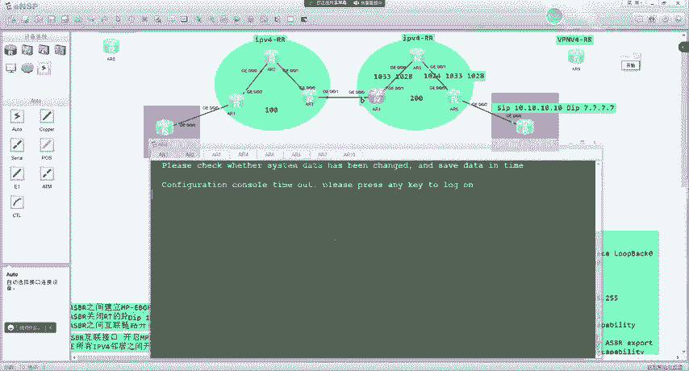

收到1033换成1032。对不对？所以说这里呢就变成了1028。1033给换成了1032。对吧。这样就给三了啊。那1032。三给4的是多少，他给他1032，所以说他给5，这是不是1033啊？

所以说三能不能识别1032？能不拿。可以吧，1032不就是三给你1。1路由给你说这个标签是1032吗？是吧三肯定能够识别杨。1032。对不对？而对应的动作是弹出。为什么呢？注意。3这边有1。

1的标签是什么啊？是LDP的。而这边是什么啊？是我们通过BDP手动去打的。也就是说，这两个隧道是不是一个协议的？😡，不是吧。那三就要做缝合。怎么样缝合呢？我们来看一下。1。1。1。1。啊，RSP。

V boss我们来找一下这个。BGP的1。1。1。1，而它对应的标签操作叫做POP勾。对吧。那这代表什么意思呢？这里代表着叫做隧道更换。也就是说，他会迭代到另一个隧道中，就是LDP的隧道。好吧。

那他怎么叠呢？他就去找啊diplayMPSLP。1点1点1。1。有没有LDP的隧道？有没有？有吧。所以说他就会把1032。去换成。😔，1025。在这里呢，就是1025跟1028发给了。

但是大家告诉我这个标签是什么的，是BDP的还是LDP的？是哪一个啊？LDP的。没错。😡，那二有没有啊，这1025不就是二给三说的吗？是吧？😡，那。2姨看收到1025倒数第二条弹出。1028就发送给一了。

大家告诉我1028谁分的？谁分的还记得吗？IE分的，所以说IE肯定能够识别1028。1028把标签弹出发送到VP一。所以说。一个纯的IPV4数据。就发送过来了。好吧。那这就是我们所看到的通讯过程。是吧。

所以说在C一里面呢，最多用了三层标签。😡，那是不是这样呢？我们可以去抓个包啊来瞅一眼。比如说我在时上。去骗。10点10点10点10到7。7。7。7，我们发现能通能通。我们首先看第一条链路，应该有三层。

我们看第一个包。来到最后。然往上翻翻啊。24。24。33。33。2828。是不是三层标签啊，就是层层叠代。对吧去往7。7的下一跳，1。1对吧，去往7。7先打上7。7的对吧？下一跳1。1再打上1。1的1。

1的下一跳，4。4再打4。4的。😡，是吧4。4还有没有啊，没有了。😡，对不对？4。4的下一跳是56。6啊，就IP转发了。所以说三层标签分别对应的是。😊，7。7的。1。1的。4。4的。这是VP标签。

也就是死亡标签。这是BGP的标签手动打出来的。这里呢是LDP的标签，4。4的。对吧这不就是一。1的吗？对吧然后VPN的标签，这是7。7的。所以说有没有打上三层标签纸给我？有吧。😡，打完之后呢。

5收到5收到1024，就犹如我们所说的1024是谁的，4。4的5肯定知道4。4怎么去啊，倒数第二条弹珠。😡，是吧。1033跟1028又发过来了。所以我们来看第二条链。呃，我再拼一下啊，这包刷过去了。

我们来看第二条链路。那在这里呢。是不是倒数跳跳弹出只有1033。跟1028。那这里我问一下各位同学，这两个。😡，标签。1033跟1028分别对应谁的标签？谁的？1028是谁的标签？4。4跟7。7。

你再想想。4。4的标签刚刚不被谈了吗？是吧10828是4万标签。而1033是谁啊？1033是谁呀？BDP的对，1。1的手动打的嘛。😡，是吧。对吧一个是7。7的，一个是1。1的没错。

所以说A24收到10334不就。是给他发的就是1033嘛，就告诉你，你访问这个打上1033给我。😡，那这时候四收到的是多少10323给4发的是1032。对所以说他把1033换成103。

在这条链路应该是两层标签，我们再来拼一下。然后去看。这条链路的话。是不是1028跟103啊？对吧。那就到这个冯和怪这里了。是吧。他把BDP的给转到LDP里面。是吧。那在这时候呢。

应该是1028跟1025。我们再来看这一个。是不是1028跟1025？那我问一下1025是什么标签？BDP的。还是VP4网标签。还是LDP的。对吧，是LDP的。那。二、能不能识别这个1025啊。

肯定可以。2、识别1025之后，对应倒数第二台弹珠，所以说这里只有一层1028。我们来看最后一个吧。是不是只有1个1028就过来了？那到A21处理就简单了，1028弹出对吧？在微P一发查录由表发过来。

那这样就通了。回包也是一样的逻辑。好吧。所以这里呢就是咱们讲的option C一的方案。😡，是吧这里大家可能觉得老师比较难。是吧嗯跨域就C稍微难一点。但你们回头做个实验。是嗯就能够明白了。好吧。呃。

我看一下大家的问题啊。😊，嗯。呃，不难是吧。刚哪个同学发了一大串，我记得。他有点那个俄罗斯套娃的感觉啊，就吓一跳加吓一跳加吓一跳。呃，这样不是A21和A26都保存了。

原来A21和A26都保存了原来A23。好。都保存了原来A23和A24保存的路由。啊。😮，你你这个理解有点错误啊。好吧，这个理解是为什么呢？我来给大家说一下啊。😊，你想想啊，之前我们讲的B跟A的中啊。

opererationB跟operA里面。嗯。你来看啊。2个P本身就要有路由啊。能不能明白ABR也要有，而在C中，ABR就没了嘛，这不就是减轻ASBR的负担吗？压力怎么能放到P上。

你P没有就没有办法转发数据了。😡，P是肯定要有的。能不能明白？可以吧。你P肯定是需要有的。😡，是吧只不过我们把ASBR的路由给他拿掉了，让它的负担减小了。😊。

是吧但是大家可能疑惑的就是老师呢PE他还维护了1。1的标签啊，这个很简单啊，就是他只要这个1。1。但是你这边我举个例子啊，我详细给大家说一下，大家认真听。😡，在option B里面，我们来想一下。

这边有1个1。1。他有几个有1个1。2，有1个1。3，你告诉我他上面是不是有3条路由？他也有三条路由，他也有三条路由，他也有三条路由。是吧然后比如说我们有10条路由，那每个设备上是不是都有10条路由？

对不对啊，对，这个我是废物同学，说的不错啊。😊，好吧，在我们学到的A和B中呢，他有10条路由，他有10条，他有10条，他有10条，他有10条。是吧。而在我们学到的。option这个C容。

他的10条是不是没了，他的1条也没了。那只不过他有11条了嘛，就他还有个IPV4路由1。1的。对吧然后他也有一个了嘛，11条了嘛，他有个IPV4路由有6。6的。能不能明白，对吧？

所以说啊就是刚刚我是费务同学说的这个不错啊，就是只有PE抗压了。那ASBR的负担有没有减轻啊？😡，有吧。这个大家能够明白吗？明白乔伊啊，没问题吧。好吧，然后我们再来考虑。

比如说老师有两个跨为域域的微频客户呢，在B中啊。😊，占有10条。啊，不对啊，比如说我们还有一个微品客户在这个批议上。啊，这也是两批。然后他们也也连接了CE也连接CE。这是两个微评客户啊，认真听各位同学。

😊，比如说我们在B方案中，这里有10条路由，这里有10条路由。他们最终这个PT上是10条，这个PT上是10条ABR是多少条？各位同学告诉我是多少条。20条什么两条20条，这也是20条，这是1这是10。

而在C中，我们来看一下ABR还有没有这20啊。有没有？没有了，他直接传过来，两个人一人识掉，他直接传过来，两个人一人识掉。😡，对吧就是为什么我们要减轻ASBR的负担呢？

因为以前ASBR的负担是不是比PE要重啊？😡，大家能明白我的意思吧？😡，比如说老师我只维护一个微P客户的录营，这样没问题。但是ABR我们跨域有两个微P客户，他就要维护两个。那你有10个。

他就要维护10个客户的。😡，对不对？😡，而PE他是不是只需要维护自己连接的客户路由？是吧所以说我们需要通过C方案去减轻ABR的负担。那这就是C方案的作用体现。好吧。呃。

用R建立MPEBP邻居传递路由优势就来了，每个CE只跟R建立。每个CE值啊，对，这个咱们下节课再来讲CE带R的场景。😊，好吧，下一课再来讲啊。😊，嗯。嗯啊，对，这个说的不错啊。

A24根据不同的BDP邻居调用策略。不是更简单。咱们现在就针对邻居啊。是吧现在不是针对EBB邻居4直接应用吗？跟你们做集群单出口跨框流量一样。啊，就本地优先转发。是不是啊？嗯。🤢，嗯，好。

这个大家看懂了吗？没问题，同学，咱们最后敲拨一好吧，然后咱们这节课今天就讲这么多啊。😊，呃，难的呢还没讲到。😮，哇这个戴R的场景呢，大家下节课嗯，咱们再来讲。😊，好吧。

这节课大家先把这个不带R的和一下做个实验，先搞明白啊。😊，然后下节课我们再讲一个带R的场景。呃。这个配置呢我保存一下，拓普呢，咱们下课之后，我发到群里。啊，然后大家下课之后呢，去做一下这个实验。嗯。

把这个路由传递啊，对吧？呃，数据转发的过程理解一下啊，但是我还建议大家自己搭拓普啊。😊，然后你们是在搞不通的时候，你可以参考一下这个我给大家发的这个拓配置。7。12。3456。我把这个头部保存一下啊。

这节课有俩实验是吧，一个option B的。嗯，还有一个奥币带R的。啊，还有一个operation C。是吧。

这两天有实验做了啊。😊，🤧嗯。🤢。