# 2023 新版华为认证HCIA+HCIP+HCIE全套视频讲解！一套视频让你从入门到精通！CCNA／CCNP／CCIE技术提升同样适用！ - P122：（持续更新）HCIE Datacom - 58.MPLS VP,N跨域OptinonC12-RR - -Book思议8 - BV1W8411A7z8

🎼越多少海誓山。🎼随风远去。🎼假如你先生来自。🎼放守着。🎼请问你是。🎼都看着我。🎼我叫着主。🎼秒年后。🎼迈着香。🎼你家小洒。🎼么现。🎼爱情。🎼看着我。🎼想等。🎼你就是。🎼闪耀的心。🎼我的我的家乡。

🎼完没见。🎼飞的。🎼おじちゃ。🎼你家乡。🎼我为情。🎼你先生回到路。🎼不是我想象的黄金天堂。🎼我再度。🎼看前程。🎼忘记。🎼我的命。🎼年轻人。🎼おデちゃ。嗯。好，同学们，大家能听到吗？😊，呃。

能听到同学给我敲一啊，好吧。😊，声音也可以是吧？好，呃，我们上课了啊。😊，行，那咱们就开始了啊。😊，呃，开始了啊，就上课了。好吧，呃，接下来我们要讲的这个是C一带R的场景啊。啊，首先大家要注意一点啊。

这个option C的R场景和我们之前学的AB不一样，好吧呃，AB我们为什么要用R呢？啊，大家还记得吧？之前我们在option AoptionB里用R呢，它只是帮助AS内反射路由，对吧？

接触到PE反射给ASBR。😊，对吧option和A和option B。这是我们做R的一个目的。对吧那接下来我们要讲的是option C一好吧，呃，带R的场景。那option C一中带R的场景是不一样的。

😊，能懂吗？呃，我们在AB中呢，所有的路由都要经过ASBR传递，所以说我们只需要PE跟ASBR跟R建邻居对吧？让R反射给ASBR就好了，对吧？而不用在呃当我有很多个PE的时候呢。

不需要都与ASBR建邻居，对吧？只需要跟R建就行了，对不对？而在我们的option C中呢，有一个问题是在哪呢？是两个PE之间，它们直接传递路由。😊，对不对啊？那比如说我们把在以P1为例，对吧？

让P1把路由传递给R一了。哎，那这个R如果朝P2去建邻居啊，那依然遇到的相同的问题。😊，对不对？也就是说他怎么能那还不如我们直接P1P2之间减呢。😡，是吧。是这道理，大家应该能够明白吧，对吧？哎。

我们的RR，如果我给了RR怎么样给对边的PE呢？是吧？这是我们应该考虑到的，而option C中呢ASBR又不接。😊，哎，不接R，直接传递给PE2，还不如我们直接在PE上面建邻居。😡，对不对？

你绕了这么一圈。是吧那还不如直接这样传的，反正最终P2跟P1都要有邻居嘛，对不对？所以说啊C1的R它并不是也就是说它的目的呢并不是为了在AS内啊进行路由的传递。😡，好吧。那R之间呢。

我们是在option C一中的，R是在两个R上去建立。VPV是邻居。P1给了R1R1给这边的RR再反射给P2。好吧，这是我们在CE中的带R场景啊。😊，那懂吧？那这个呢？😡，我们就通过呃。嗯。这样吧。

好吧，我们以89之前我们做的那个op C。😊，AR2不是IPV4的R吗？对吧？我们把IPV4的R可以跟VPNV4的R分开，好吧，因为是不同的地址处嘛，对吧？我们让AR8呢作为VPNV4的R。😊，啊。

大家觉得这样行不行？😡，行不行？想一下。😊，注意啊，是可以的，好吧，是可以的。

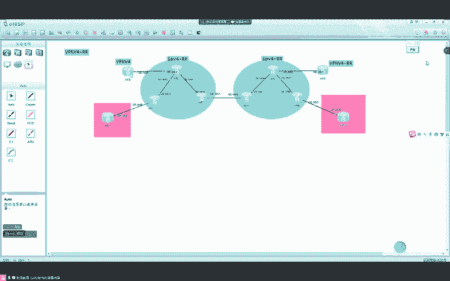

那这张图呢是我们上节课最后做完之后的一张图啊，就是通过option C已经能够实现互通了。比如说我们在7上呢拼7。7，原地址7。7嗯，到目的地是10点10。😊，现在是能够通的对吧？

这是我们上节课去做的一个option C一不带R的一个top图。😊，呃，接下来呢我们把它改成带R的那带R刚我们说了区别，不带R就是两个PE之间建，对吧？带R就是大家朝PE去建。😊，啊，朝R去建。

然后R之间再建邻居，对不对啊，其他的这个数据平面呢都是一样的啊。那我们怎么样去改呢？我们这样啊，我们先在AR1跟AR6上啊，也就是说两个PE上呢把他们的这个VPNV4邻居先给它拿掉，好吧。

就两个PE之间呢不再具有呃VPNV4邻居关系了，暗度P。😊，6。6。6。6。好吧，然后六这边呢，BDP200。安度P尔1。1。1。1。好吧，就是控制平面的改变啊啊数据屏像你这个BGPLSP的隧道啊。

标签的协商啊依然要去开啊。好吧，呃，做完之后呢，我们把8跟九对吧？把他们的ITP打通。嗯，这个我是配好的啊，我们来看一下在二上SSP2呢，我们就可以diplaySSP2。😊，呃。啊，难道我没有打通？

2的G0-0-228。2。8上面G0-0-0VIP是吧，我们把8的来配一下啊，interfaceG0-0-0IQ dress10。0。28。8。啊，然后娄柏林。8。8。呃。I3。

n49点0000点0000。000。8。00。是吧然后G0-0-0接口SSE enable，然后low连接口是吧？然后MP4L啊这样。两个R呢我先不开MPSR，好吧，我们待会看一下会有什么现象。

然后在八这边呢，interfaceG0-0-0。😊，啊，在9这边啊59。9。嗯，然后是low百0。9。9。9。9。32好吧，然后ISS。n49。0000。000。G0-0-0。low by0好吧。

SSE内部。呃，咱们做完之后呢来看一下啊，现在针对于二上面呢，应该会有6个SS邻居啊，级别一和级别2加在一起，一共有6个。😊，呃，在5上呢，第四类SSP应该也有6个。对吧呃，然后在我们的AR1上呢。

display IPPro table8。8。8。8能够学到8。8的路由。但是呢注意啊，这时候是没有8。8的L4P的。因为我们在两个VPV4的R上呢，没有去开启MPS能力好吧，然后这时候呢。

我们直接去建邻居啊，在AR1上，因为现在7。7已经通过这个。😊。

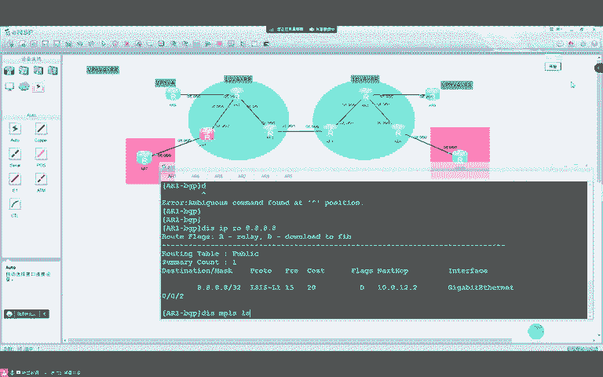

IPU4BGP邻居呢给A21传了，所以说A21呢是能够学到7点7的。啊，然后我们让7。7呢跟8。8。8。8A100。😊，P8。8。8。8。Connect。Interface楼柏玲。啊。

然后IPV4family VPV4。P尔8。8。8。8啊，给它激活。😊，然后在A28上呢，BDP100。P尔1。1。1。1。一。1的更新源地址。嗯，然后是。他还要跟对面的R9。9键。

那比如说这时候我们想要跟9。9建邻居，要不要能够学到9。9的路由啊？😊。

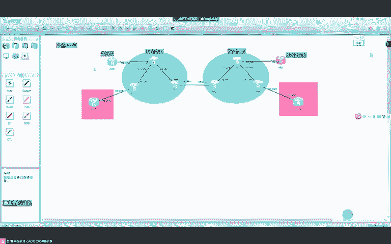

要不要？😡。

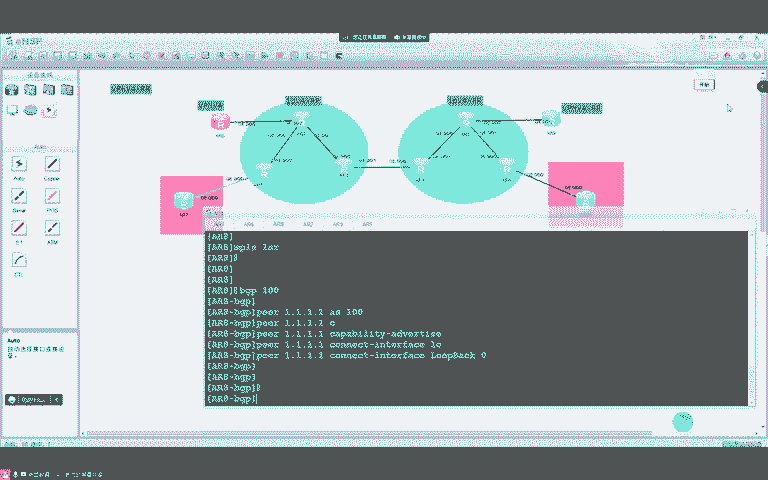

需要吧。对吧我们之前选的不带R的两个P键。所以说我们在ASBR上把P的还用口通告出去。那在这里呢，我们在ASBR上呢，还得把R的还用口通告出去。BGP200。😊。

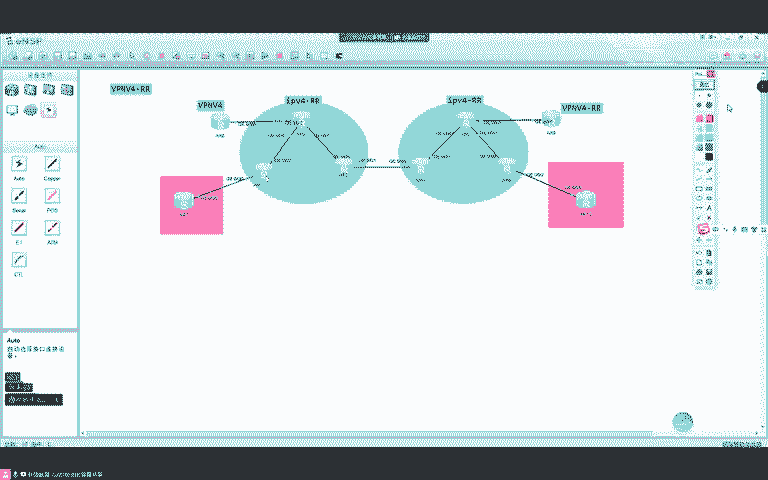

network9。9。9。9。32是吧，那在三上也是一样。BDP100。network8。8。832。好吧，那这时候A28呢才会有9。9的路由。啊，现在还没有。

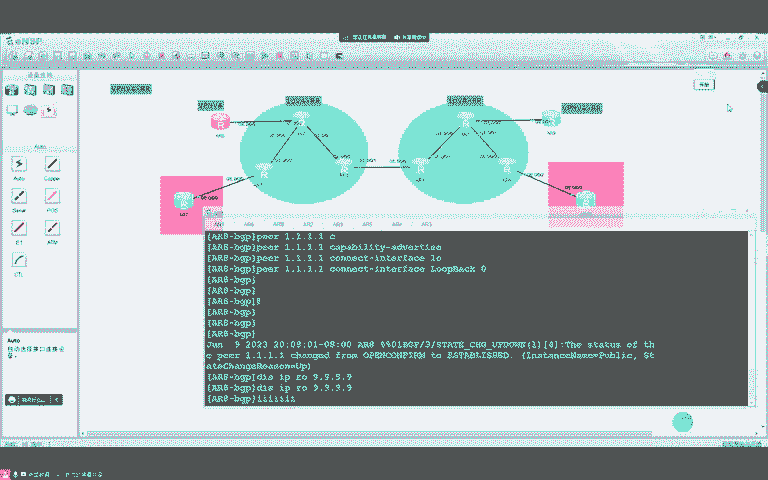

因为IPV是等于R。没跟八建邻居呢是吧？我们在八上呢还得再做一下啊。😊。

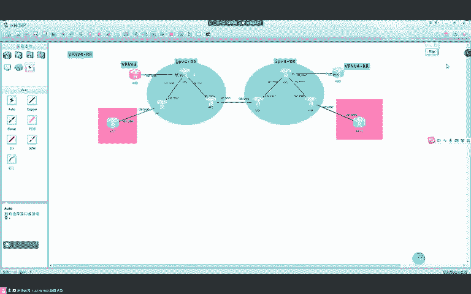

第尔2。2。2。2AS100跟他去建立IPV4的BGP邻居，他才能够学到路游啊，是吧？😊，P2。2。2。2n interfaceface50，然后。嗯，就没了，然后在二上呢。BGP100。P8。8。8。

8。S100。P尔8。8。8。8。那个inface60。然后在5上也一样啊，55上面BDP200。皮尔9。9。9。9，likeakeinface nobody百0。啊，9。9。9。9A100。

然后是更新原地址。然后是9。9。9。9呃，作为反射器的客户机。哦，我们指的ASA是100。对，指错了啊。P29。9。9。9A200。到。然后P29。9。9。9反射器的客普机。呃，然后在酒上去BDP。

200。5。5。5。5A200。5。5。5。5那个interface low0啊，然后我们在这个A28上呢。呃，AR2上也把8指成反射器的扣机啊，8。8。反射器的客户机。好吧，然后这时候做完之后呢。

我们到8上来看一下displayIPtable8。8。8。8。😊，啊，应该是8上去看9。9啊，9。9。9。9，它能够学到九的路由，对吧？

然后我们到九上呢去看一下disabplayIProingtable。😊。

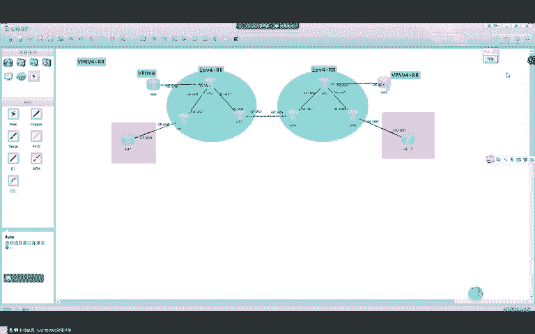

呃，8。8。8。8。嗯，也能够学到八的路由是吧？

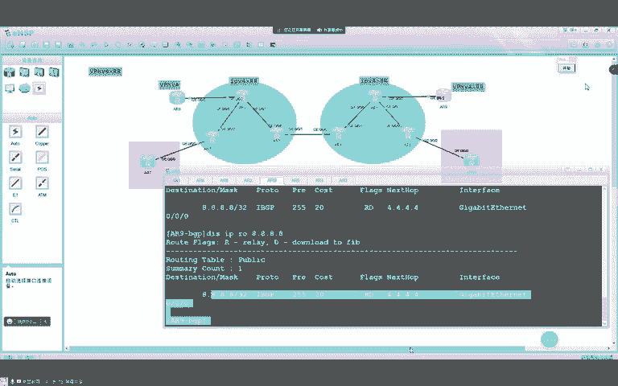

呃，这里呢我们只是。比如说让8跟9，我们只是把它规划成VPV4的RR，现在还没有进行VPV4的配置。😊，好吧，然后呢，我们在2个ASBR上呢。😊，呃。把R的环回口通告了出去，通告了出去之后呢。

让他俩之间去建立IPV4的BP邻居对吧？这边也是一样，也就是说让两个VPNV4的R能够互相学到环回口哇吧，现所以现在呢P杠A8。8呢到9。9是能够互通的。😊。

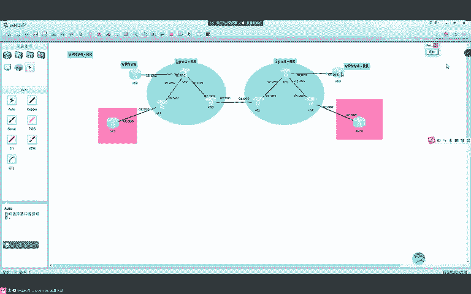

是吧那通了之后呢，这个IPV47。7就传给一了，一转换成VPV4呢，要传递给8。所以说我们得在8上呢BDP100。😊。

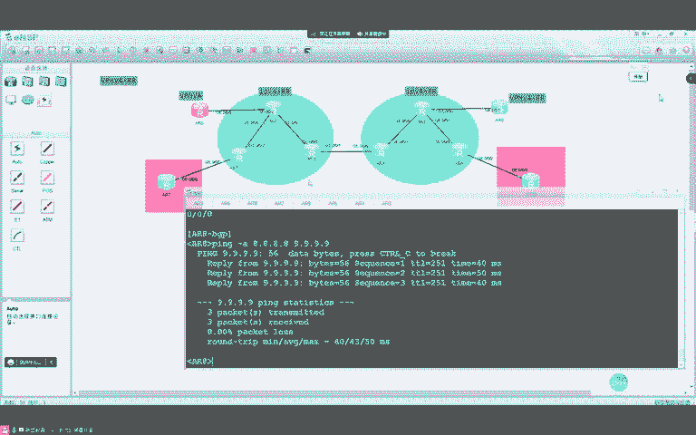

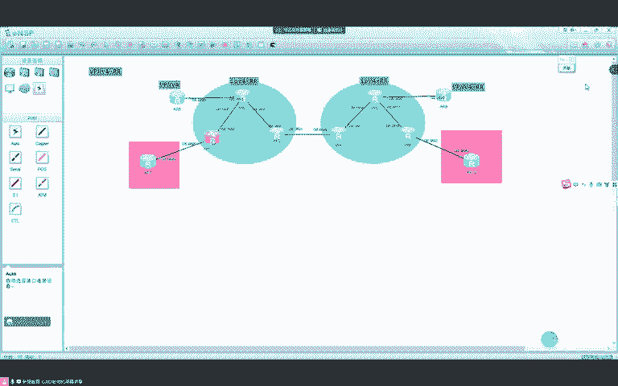

P21。1呢对吧？去给他建立邻居，然后在IPV4familyVPV4地址数下。P21。11。1。1激活VPV40聚。好吧，然后针对于VPV4的R呢，我们还得敲一条and度 policy对吧？

关闭RT的路由过滤。行吧。那这些IPU4的默认是激活的啊。那大家告诉我，针对1。1的IPU4能不能关了。😊，能不能？是可以的，没错，好吧，但是针对2。2的IP能不能关啊？😊，不行。对吧因为他要从2。

2学到对端R的滑容口路由。是吧然后我们在8上呢P2。😊，9。9。9。9。A。200P29。9。9。9。更新原地址。9。9。9。91BDP多跳。IPV4family。V片V4。9。9。9。9。

Nice的 whole local。啊，不是n斯的 wholelo，应该是以内啊。😊，明得不。好吧，然后我们让他跟九呢去建立唯平V4的邻居。好吧。然后在酒这边呢也是一样的。皮2。啊，不是P，应该先配6。

我们先配PE啊。现在6呢也从它的CE侧接收到了VPV4路由。然后BP200P29。9。9。9。AS。200是P29。9。9。9。耐in特face罗柏玲。呃，然后IPV4familyVPV4。P尔9。9。

9。9嗯，in内。啊，然后我们在酒上。P6。6。A。200。对这个配置量非常多。这我还没。这咱们还是延续着上节课的配置配的啊，是吧？😊，这个配置量非常多啊，然后8。8。😊，呃，ASE吧。8。

8来敲到手软。你为未来考试的时候呢，嗯就是这样去敲的。好吧，往那里一坐配8个小时。😊，然后VPV4D主触下。激活跟六的V平V4邻居，然后激活跟八的。呃，VPV是邻居。啊，然后给他激活。激活之后呢。

我们来看一下啊。😊，嗯，我们来8上看先看一下D四类BGPVPNV4奥P。呃，现在跟九的还没有建立啊，我们得再等一会儿啊。😊，然后九这边呢还有一条命令没敲完呢嗯。按住policy对。

基于RT的路由过滤给它关了。然后我们再回到8上来看。好吧。等一会儿再。跟9的邻居呃，已经建立好了。好吧，然后我们到9上来看一下呢，disspplay BGPVPNV4。哦，皮尔路意亚。

九跟呃八有没有建立好啊？有没有？

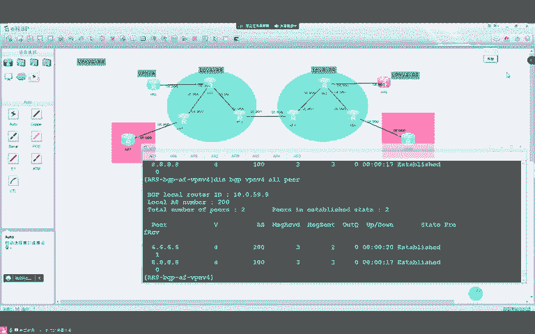

有吧，但是注意啊，我们现在来瞅一下A21，它把路由传递给8。那8现在能不能接收到这条路由呢？

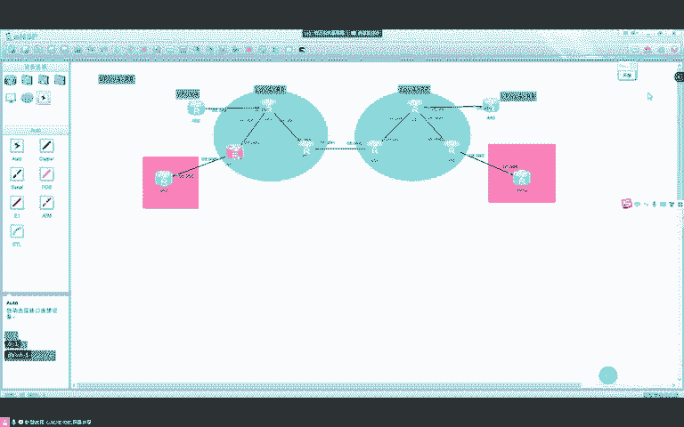

可以吧。那我们到酒上如果去看的话。九有没有7。7的路由？我们看八是不是有7。7的路由，九有没有？酒是没有的，注意啊。这里是为什么呢？就是因为我们在八上呢，注意啊，我现在给他开MPS。😊，L s i d。

8。8。8。8。MPSMPSLDP好吧，然后interfaceG0-0杠0MPS。MPSLDP。啊，然后我在酒这边也去开一下。呃，MP4LSID嗯9。9。M72。G0-0-0。呃，咱们看完之后呢。

可以到二上来看一下邻居有没有都建立正常。D四类MPS4LDP。三审。我现在还没起来啊嗯跟一跟三的见了，但是二呢需要在G0-0-2。😊，Mch Mch LDP。是吧现在起来了，然后我们在五上呢。😊。

因为建立LDP邻居两边都得开嘛，是吧？MPS。😊，LDP displayMPSLDP30。民居也都建立了是吧？然后我们到巴上再来看一下dispplayBGPVPNV4。哦，如table是吧？有了7。7。

那这时候呢。😊，DC类BDPVPNV4。哦入table有没有传递给9啊？对意啊。九、有没有收到这台路遥？有没有？有吧。好吧，那九收到之后要要不要传递给6啊，就是九从EBDP邻居收到路由。

要不要传递给IBDP邻居，这时候不是反射啊，是给他传过来了。😊，好吧，是要传的。那怎么它传递给6之后呢，我们来看一下第四类BDP。😊，VPV42入厅table。是吧就过来了，哎，对吧？

老师他怎么过来的呢？我们现在来看一下八跟9V片V4的客户端，我有没有配置？😊，没有吧。注意啊，所以这样他只是正常的路由传递。这各位同学能明白吗？明白的敲个一啊，没问题吧，这只是路由传递啊。😡，好吧。

那有人就问了，哎，那老师你建这个R的目的在哪呢？注意。😊，如果我们在R上直接去建立的话，RR之间这个R有本AS内所有的路由，它一下子就可以传递给对端。对吧。那传递给对端之后，对端给他的客户机。

他的客户机直接导入，是不是就接收了？😊，我们来想一下啊，比如说A21。A23A26，他们都要跟这个A26去通过跨域的option C互通，要不要建三个邻居？是需要的吧，这都是PE啊。😡，如果没有R的话。

这都是PE都需要去件。对不对？😡，而当我们有R的时候，R汇聚了AS内所有的路由，它们能不能直接传？😡，是不是可以啊？对吧然后六只需要跟九建立就可以了。😡，那AB为什么不行呢？因为AB都通过ASBR去传。

你C里面ASBR是不保存路由的。😡，好吧，所以说我们是通过R取出。😡，得懂吗？那这时候呢，九就直接传递给6了。😡，好吧，那这个呃当然我依然是建议。对啊，大家把这个6。6呢只成反射器的口机。能不能明白啊。

我依然是这么建议，为什么这么建议呢？因为当我们的AS内如果有其他路由器的话，他们给RR就直接反射过来了。😊，好吧。所以在跨域的option CE中呢，R有两个作用，一个是在AS之间传递路由。

对吧一个是在AS内部，如果有单域的互通，是不是也可以借助这个R去实现？是吧这时候你就得费客户机了，因为这是IBDP到IBDP这里为啥不配可以呢？这是EBP到IP自己就传递了。😊。

对吧所以说在我们的这个环境中呢，嗯你可以不配啊，但是在真正工作的时候，一定要记得啊。😊，呃。你需要去配置。但如果你只是跨域的话，嗯，可以不配。但是我们要考虑到对吧？呃。

未来客户呢可能在这个域内还有其他的站点对，所以这时候呢就需要进行配置。😊。

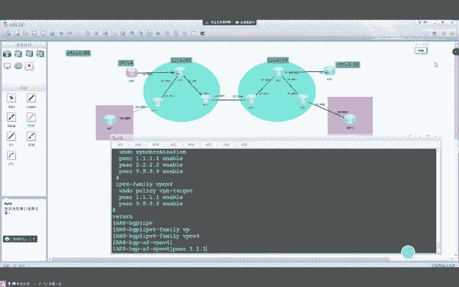

那我们做完之后还是一样的，7把路由传递给一一给88给99给6。所以说6就接收到了这个路由diplay BGP啊，就是VPNV4路由对吧？7。7。根据RT呢导入到VPN1例容。

然后就传递给十了。对呀。就传递给十0了。那比如说注意，我现在去片杠A什么呢？10点10点10点10到7。7。7。7。你发现一个神奇的现象叫什么？哎，老师又有路由通不了。是吧。我们上节课讲C的时候。

也是有路由通不了。那现在呢老师还是有路由通不了。😊。

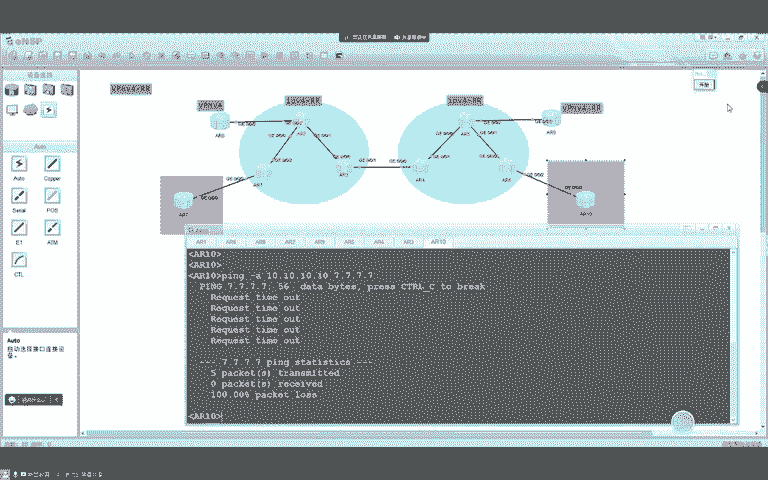

对吧这是为什么呢？我来给大家解释一下。😊，我们来看啊原IP地址10。10，他去访问目的IP7。7了。

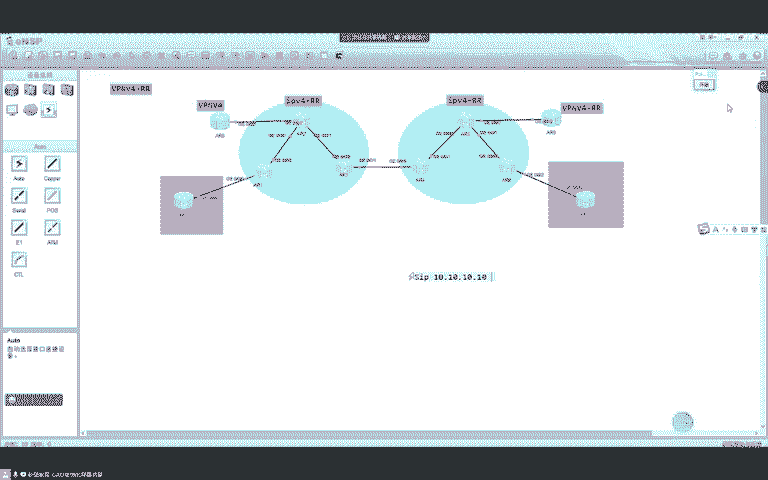

这流量到达6之后，6首先封装7。7的4亡标签。第四。去了去了去了去。

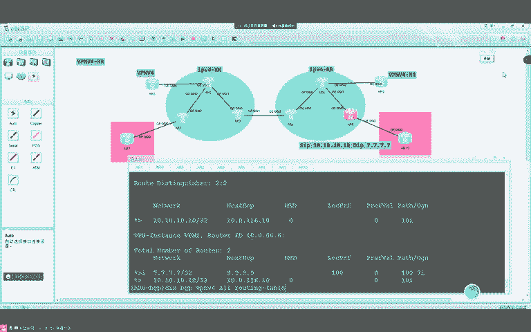

1024。他封上1024之后要封装吓一跳的，吓一跳是谁啊？

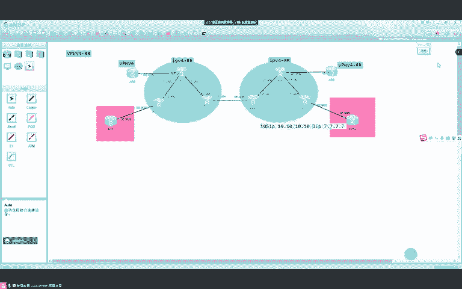

是谁呀？各位同学。是9。9。是吧。那这代表着什么啊？😡，封装给9。9。加1个1026，加1个1026到5上。

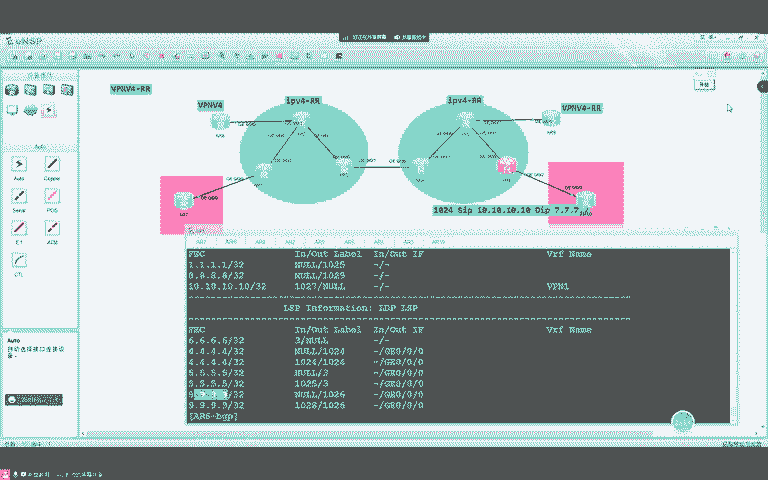

5把1026倒数跳跳弹出给9了，九认不认识1024？😡，他认识吗？😡，认不认识啊？所啊。实际上我们来0-0-0抓个包啊，待会儿你就明白了。比如说在这时候，我们在时上去骗。现能出去吧。

是不是打上9的1024啊？😊，啊，1026啊。对吧。1026给。就是。哎。啊录屏没看啊。看了吗？啊，开着呢开着呢啊，这个球没显示啊。😊，吓我一跳。😊，开着呢开着呢。😊，开着呢，他。没显示啊。

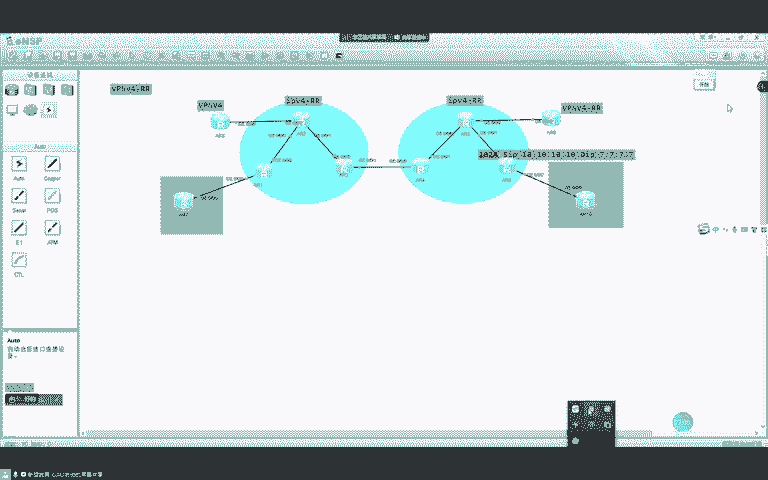

好，我们来看啊。他是不是打上1026出去了，人人听啊。😡，原来6出去了，给五了。😡，5、收到1026肯定给9。我们来看一下啊，九收到肯定只有1个1024。😊，呃，收到1024换成1027，对不对？

所以说他会从这里再发出来。比如说我们在0-0-2去抓包啊。😊。

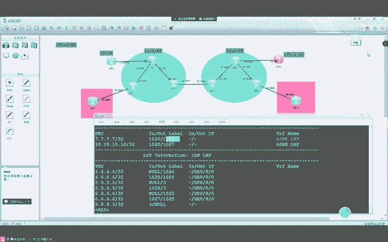

我在实战去骗一下。好啦。不一样。是不是一个片在这里出现两次啊？对吧每一个片都出现两次对吧？1个1024的呀。😊，1个1027的。是吧他发给又发给五了。😡，这时候五呢他就收到了1个1027的。

但是5有没有1027呀？😡，没有为什么没有呢？仔细看啊。😡，1024的吓一跳，它是9。9。😡，所以说。10241定是9。9分配的，这样就发给5了。5呢把LDP的标签弹出1024发给9了，九有私网标签啊。

😡。

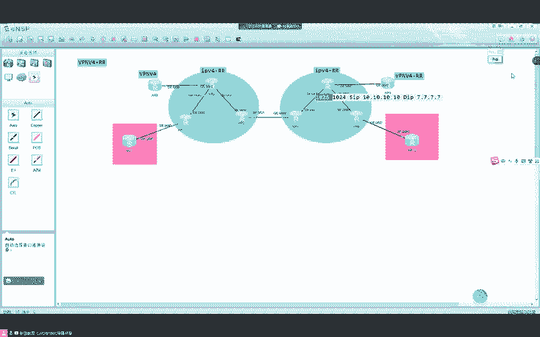

9不就有7。7吗？😡，他肯定能够识别这个1024，因为1024就是死网标签。😡。

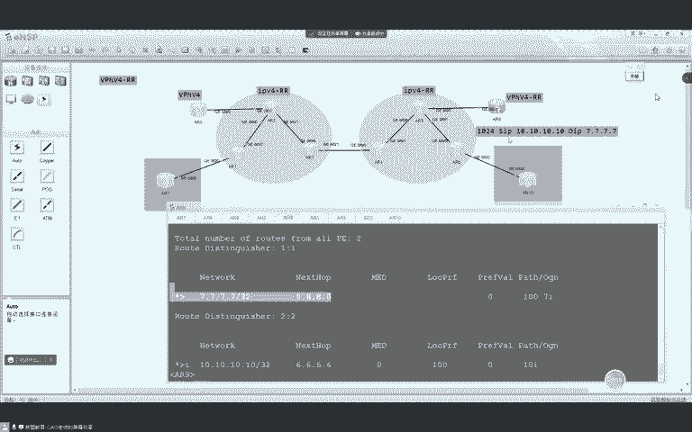

他换了一个，又发给5了。😡，对不对？😡，你看他不就是把1024换成1027，又发给武兰吗？那五有没有丝网路由啊？😡，有没有？有没有啊？各位同学啊，没有吧。😡，武没有算路由，他一看1024不认识啊，呃。

五就懵了是吧？😡，我说给我干嘛？😡，是吧。😊，对吧五一下子就懵了，我靠给我干嘛，对不对？😡，哎，那为什么会出现这种问题呢？来给大家解释一下啊，注意。😡，为什么会发给9呢？我们来想一下R的目的是什么？

我们为什么要用啊，就是控制平面，让它传一下路由。😡，对不对？我们就希望他传一下路由，如果酒还在转发路径上。😡，你不管是跨域的微品路由。😡，还是域内的VP路由酒都要进行保存。那这个R的负担太重了。😡。

是吧。这就相当于什么呢？😡，呃，你一个人干两个人的活，本来你一个活呢啊就压力比较大。😮，对吧现在呢它本身帮助反射路由路由条目就非常多了，咱还让他转发数据。😊，对吧R比较负担比较重。那这时候怎么办呢？

注意啊，我们来看一下六为什么会发给9呢？😡。

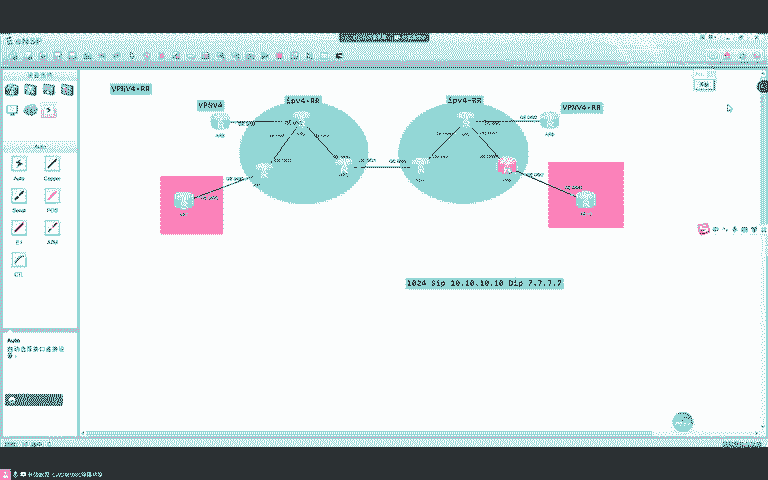

是因为BDP路由的吓一跳是谁？是9。而我们想想，我们之前在没有R的时候，BGP路由的吓一跳是不是直接是对端PE啊？😡，各位同学能不能明白这意思啊？所以说如果直接是对端P的话。

我会按照最短路径发送到对端PE。😡，但是如果是R的话，我就发给R。😡，对不对？就你吓一跳是谁，你就给谁嘛。很简单的道理，IP路由不就是这个道理吗？😡，对吧。那这时候我们来想一下，哎。

虽然R帮助传递路由了，但是它跟C一还有点区别，这个吓一跳不太对。😡，我们得给他改回来。😊，改回来怎么改呢？😊，是吧。而。有儒 policy。是吧能不能改下一条，可以是可以的。😊。

但是呢唯平为四下给我们提供了一条命令。😡，什么样的命临呢？我们来想一下啊，什么时候下一跳会改变。😡，收到ABDP传递给EBDP。吓一跳变不变？变不变。变。😡，收到EBDP传递给ABDBP。😡。

唯平为4自己变不变，默认就变。😡，之前我们学单玉的时候，这不就是EB1P传递给。😡，IBDP吗。对吧所以说VP0V4下收到EBDP传递给IBP也会变。😡，我们发现变了两次。😡。

在这里八向九发的时候变了一次，九向六发的时候变了一次。对，就是这还只是7。7传过来。在这里变了一次在这里变了一次。所以说我们在八上要针对于9。不让他变在九上呢，针对于6不让他变。😡，怎么办呢？

在8上BDP100。IPV是family。V片V4。Pre。9。9。9。9。Nice hope local。是不是啊？不是好吧。😊，吓一跳不变。好吧，针对于酒呢去配下一跳不便。听懂吗？那然后在酒上呢。

BDP200。IPV4familyVPV4。9呢针对于66。6。6。6。去做下一跳不便。好吧。😡。

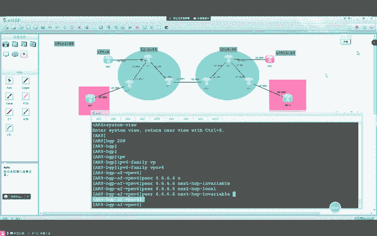

那反过来我们考虑一下，这是不是七的路由传过来啊。😡，这是7这是7。那我们十的路由传过去。十要不要也敲一下？要不要？也是需要的。好吧，所以说我们在九上呢还得P28。8。8。8。😊。

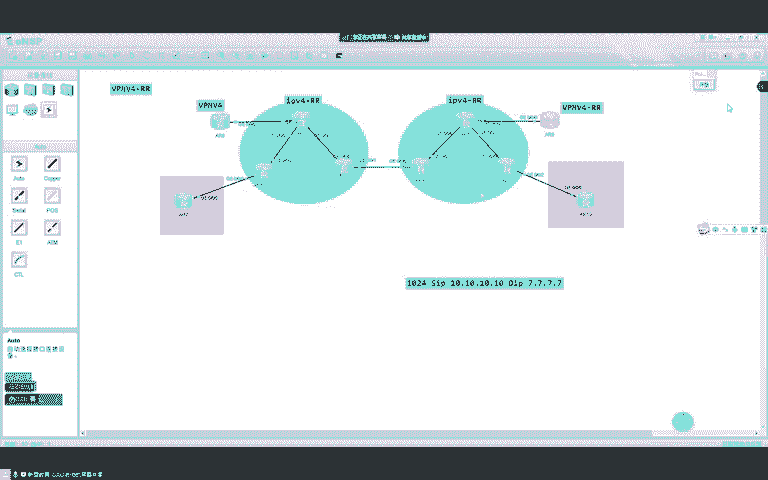

去不让他改变。然后在八上呢。P21。1。1。1。不让他改变。那啊哎。不让他改变。啊，我们已经啊，那还得把刚那个删掉。对吧刚刚我敲错面来了啊。😊，啊我敲成nice的 hope local了。😊。

我们应该敲nicetho不lo口。是吧1。1。1。1。下一跳不变。

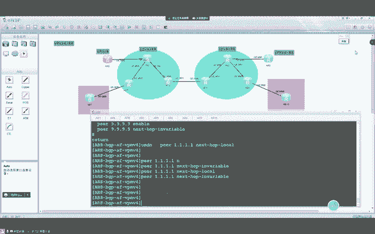

是吧那这样才符合R的特征嘛。大家还记得R是干什么吗？😡，而反射路由不修改路由的属性。对吧你像原有的你那些MED啊。对吧。还有什么啊A啊A pass肯定会大啊，还有什么吓一跳啊。😊，对吧呃起源啊是吧。

这类属性R是不会进行修改的。能不能明白，这才符合R的特征嘛，叫做反射。好吧，那有同学可能干了。😊，嗯，大家不要杠啊。😊，有家说哎，老老师，那R反射的时候还加个orange IDD呢。😊。

那这不就修改了吗？呃，你不要杠这种啊。😊，好吧，就是R做反射路由是吧？像下一跳啊，起源MED呢，这些都不会改变。😊，好吧，如果是在1个AS内呢，我们让它去反射的话。😊，呃，那你这个S pass也不会改。

对吧啊，对他还得加粗列表，好吧，嗯，这种不要杠啊。😊，不要杠好吧，然后我们做完之后啊来看一下。😊。

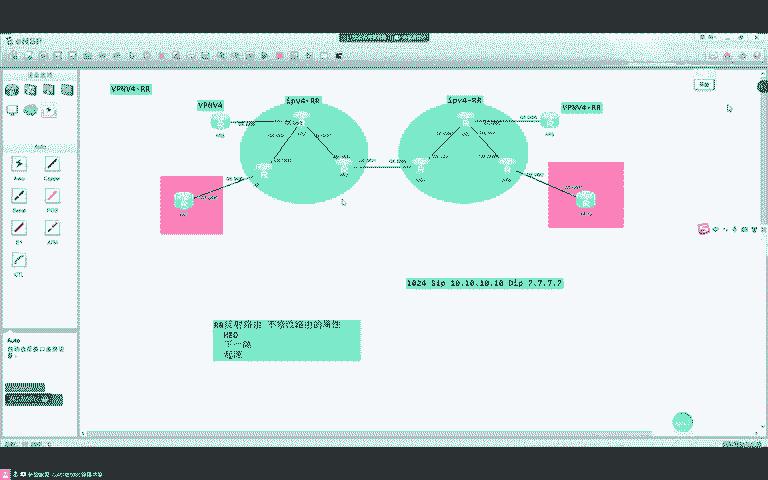

在6上D四playBDPVPNV4。哦 roof table。6收到7。7的吓一跳是多少？是1。1。那这跟AR一直接给我传过来有没有区别？😡，各位同学觉得有没有区别？😡，没有区别吧。😡。

这不就是你实际是这么传的，但是这条路由的属性啊吓一跳这一块跟你直接给我传过来没有任何区别。所以说我们利用原有的这种。😡，数据通道对吧？比如说我之前有了1。1的1的IL这个BDPLP。😡。

对吧我们利用不带RR所建立的数据平面，能不能直接转发过来？😡，可以吧。😡，也就是说我们这个R的部署，虽然我们做了很多的配置，但是跟一直接给我传路由有区别吗？😡，是不是没有啊？😡。

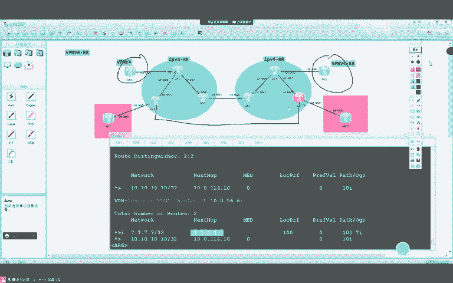

对吧。那比如说我们做完下一条不变之后，在一上如果去看10点10的话。😡。

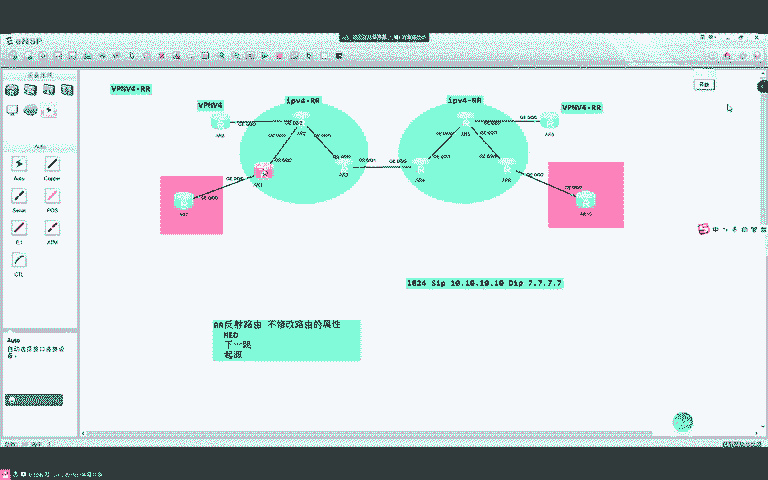

吓一跳就直接是6。6，对吧？跟6直接给遗传啊，也没有区别。😡，对吧然后我们在实上再去拼一下。😊，线杠A。10点10点10点10到7。7点前起。好。哎，一下子就通了。哎，老师，那他是怎么通的呢？😊。

他告诉我吓一跳没变，数据平面一不一样。😡，因为一样。就数据平面我改了吗？😡，没有吧，跟没有R的时候，通是一模一样的。

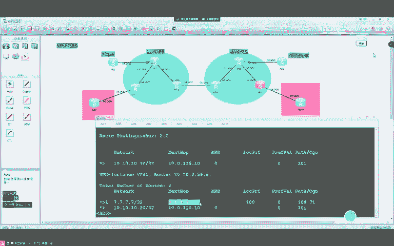

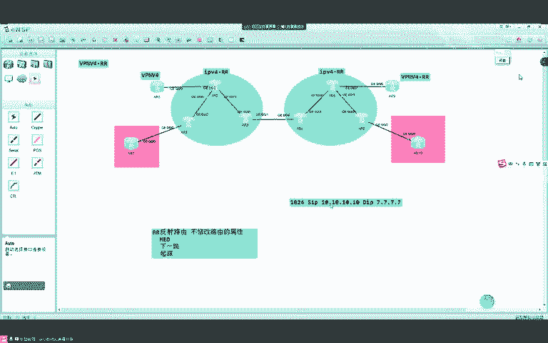

能不能明白是一样的，这不就收到了路由之后呢，先看这条路由VPNV4Rrooting table。7。7。7。7。好吧，私网标签1027。是吧。然后呢，打上吓一跳1。11。1。有1个1025哦，对不对？

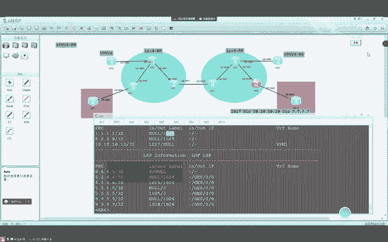

1025。

然后一。1的吓一跳呢是多少啊？各位同学还记得吗？😊，1。1的下一条是谁呀？是二还是3？

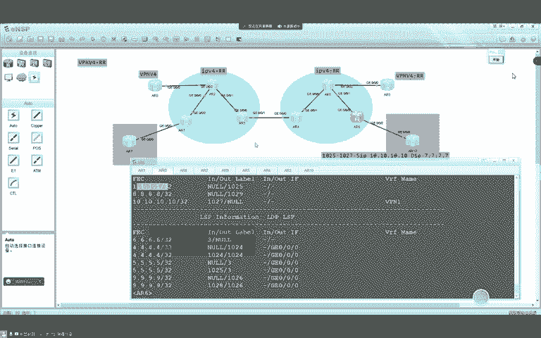

6、学到一。1的下一跳。3。是二还是3啊？忘啦。😀はは。😊，是吧是4啊。对吧14。哪有二三的事啊。是吧而这个笔试第一出错了是吧？没答案。😊，对吧是4啊，各位同学是4。😊，能懂吗？

这不是三给四传四给IPV4的RIPV4的R给6嘛。

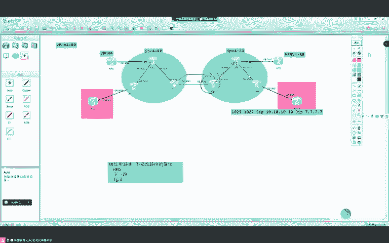

对吧十4啊。我跟你说是2还3。😊，你就三起来了。是吧所以说我们来看一下一点1的。😊，下一跳可不就是4吗？

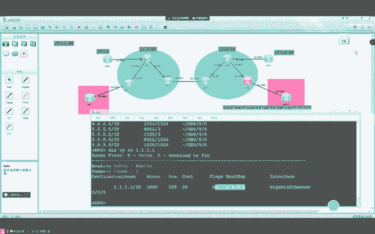

对吧所以说这时候还会去打上1个4的LSP1024。😊。

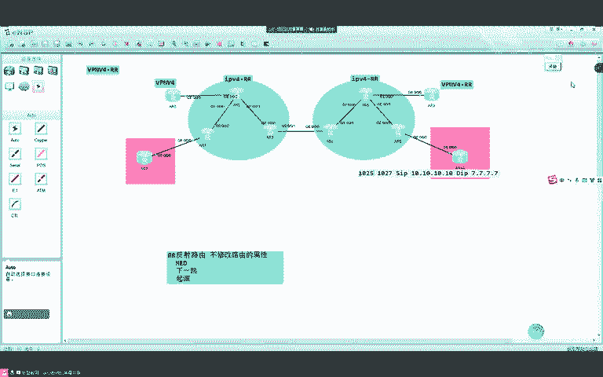

那这时候给五了，5收到之后，di四playMPSLSP。5、收到之后呢，倒数第二条弹出。

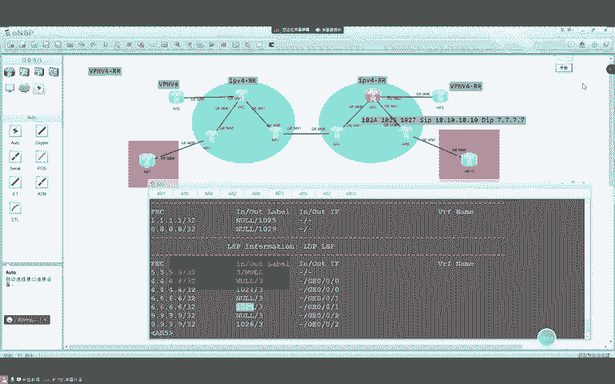

两层标签。给是了。那这1025。

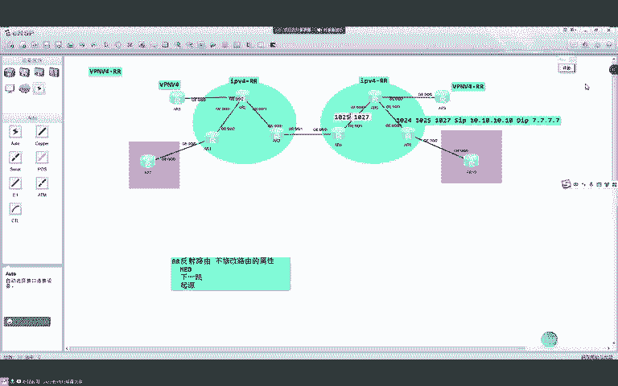

A24收到了，这不就是IPU4单波路由吗？是吧？手动LDP打出来的。😊，1025换成1026。

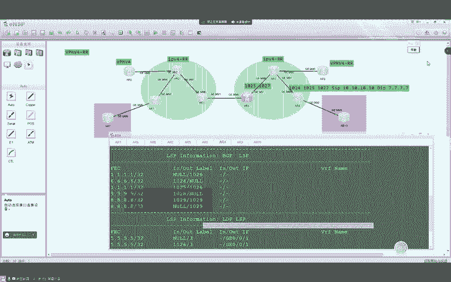

是吧。在这里呢。就是1025跟1026。

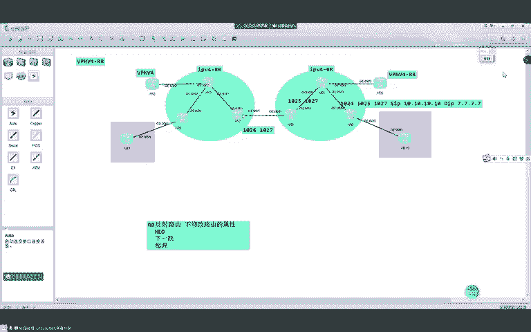

然后A23收到10啊1026跟1027啊。123收到1026。对吧干掉把1026干掉，然后1。1迭代到另1个LP隧道中，打上个1024。

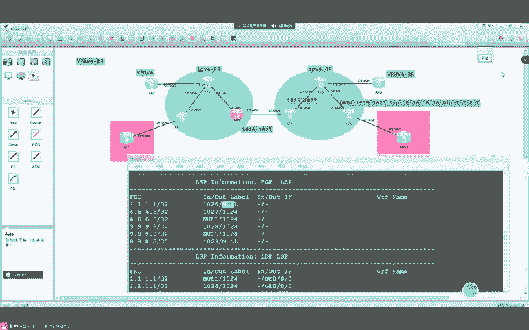

所以这里呢。是1024跟1027。

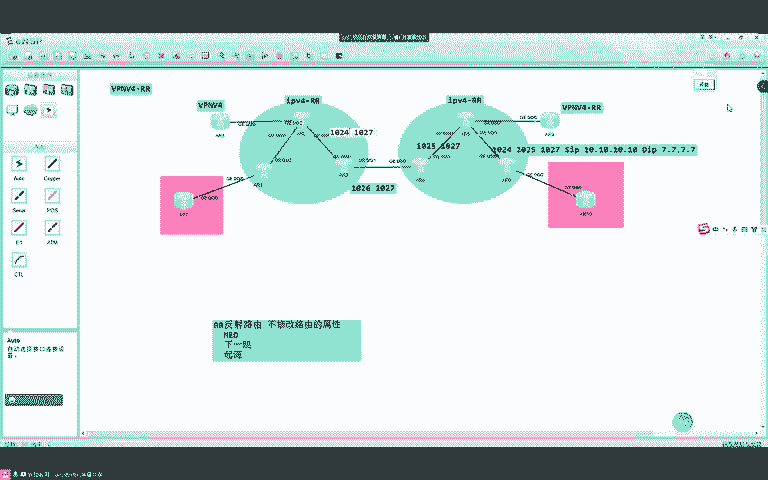

2、收到1024呢。

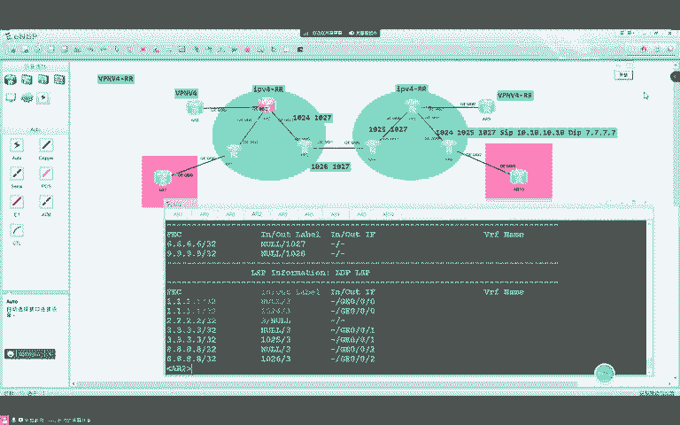

1024倒数第二条弹出。只带有1027发送给了一。

那1027在A21上呢？因为吓一跳没变嘛，是吧，肯定是A21分配的1027。

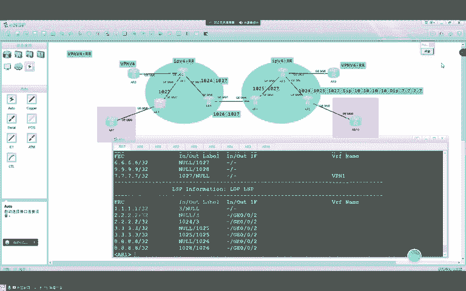

啊，这里啊收到1027对吧，对应的VP1。最终把。IP数据。发送到了7上。好吧，这样就通了。实际上我们发现啊数据平面有没有经过VPV4R呢？有没有啊？是不是没有啊？好吧。

那这样的话就是option C一嗯带R的场景。好吧。那有人就问了，哎，老师。😊，我如果我不想让他过IPV4的R，大家觉得有办法吗？😡，有没有办法？咩啊。我不想让他过IPV的R有没有办法？😊，没有吧，有。

什么样的办法呢？首先注意啊。第一种方式，我们把IP跟VP4的R放到一起，行不行？😡，可以吧，第二种方式怎么样呢？老师，我这样啊，这样行不行？😊。

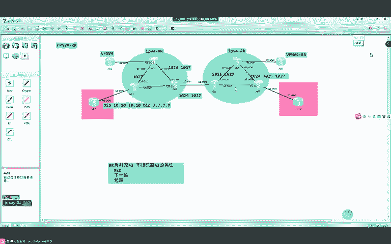

这里还有一条链路，比如说啊注意我现在把这条链路打通。好吧，我们在13之间再接个最短路径，在45之间再接个最短路径。😊，然后我们来看一下会有什么样的呃反应啊，注意啊。😊，我在A21的G0-0-1。

IPU rise10。0。13。1。然后MP24MP24LDP然后ISE内。然后在三的。接0啊0嘎。10。0。13。3嗯，MPMP4LDP然后SSE内部。

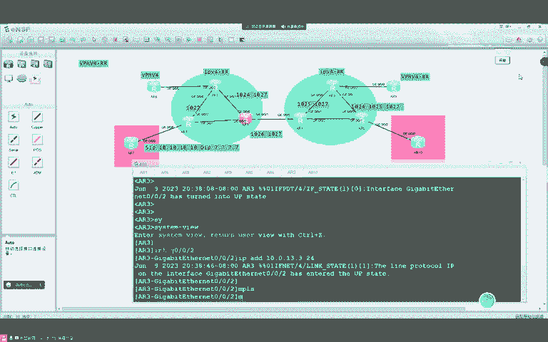

啊。然后在四的。

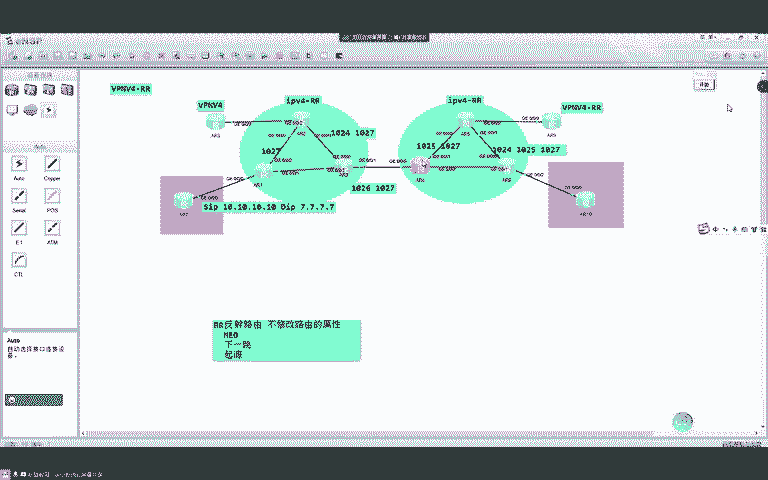

切零加零家。10的0。46。4。然后在六的。G0-0-1。10。0。46。6。啊，MPSMPSLDP。呃，SSE内部。

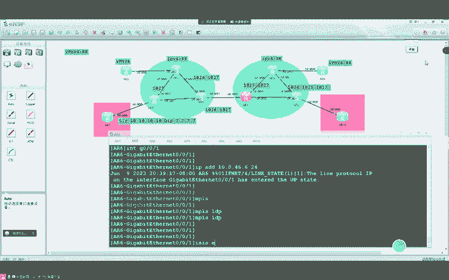

好吧。那做完之后呢，我们再来看一下啊，我先把这些拿掉。😊，啊，为啥不直接膨挂是吧？那我举个例子啊。😡，呃，如果你直接去改的话，比如说我们不让A25作为IPV4的R了，把它挪到9上。😊，嗯。

那这个邻居你要拆啊。😡，对吧如果你供厂内内的AS设备非常多，那所有的邻居都需要重建。能不能明白？那这样的话，你的业务肯定会受到影响。😊，那这时候如果我们能通过一条专线，如果跨的地是不是很长啊，对吧？啊。

如果我们直接能够通过一条专线连接，解决这种问题啊，就不用去改变原有的BDP架构了。😊，好吧，然后这样的话一个好处，我们也能把IPV4跟VPN4的分开，对不对？你排IPV4路由通讯问题呢。

就找IPV4的啊，排VP4呢就找VPV4的啊。😊，对吧那这样的话，每个R呢都是独立的啊，就每个地里处的R都是独立的啊。首先你在管理的时候呢啊就比较方便一点。😊，对不对？那未来你排错的时候呢，也比较方便。

是吧而且这样社会的负担也比较小。好吧，所以说如果我们通过啊比如说对吧老师我租一条专线就能解决啊，那这时候呢也可以采纳啊，你比如说像我这种啊直接连到到一起呢，我就不需要把五拆了。那五拆了。

你所有的VPN业务肯定都断了啊。😊，对因为五要传递标签路由啊。😡，好吧。

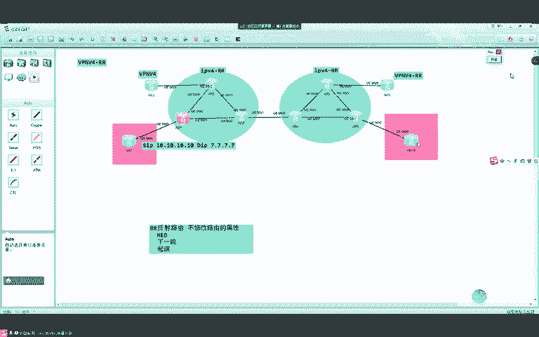

然后我们来看一下啊啊，我做完之后呢，我在时上再pin杠A10点10点10点10。😊，Doock。一。7。7。7。7。好啊。我发现还是能通的。

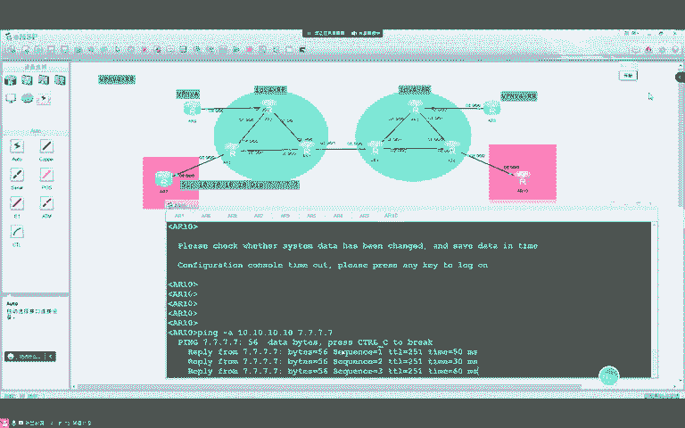

那这个怎么通的呢？就是原IP地址10点10到目的IP7。7了，他把数据发给6。😊。

然后我们注意六的操作啊。😊，VPV2rootingtable。7。7。7。7。

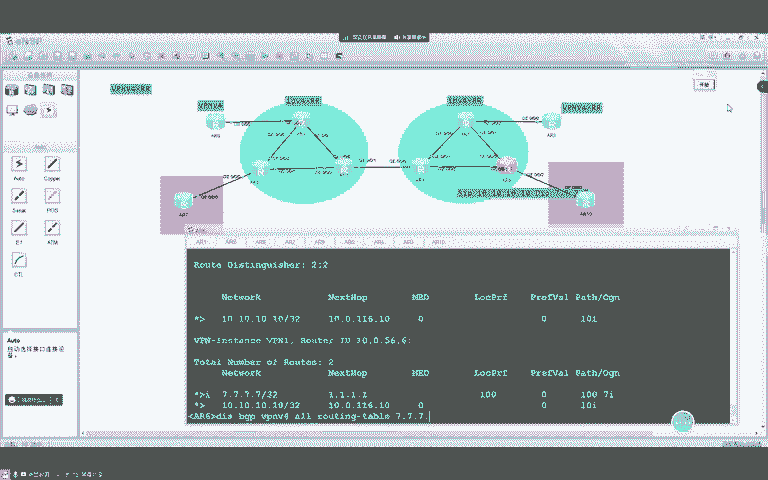

四网标签1027。

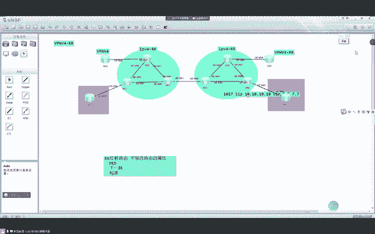

然后看吓一跳，吓一跳谁呢？1。1。然后打上1。1的。

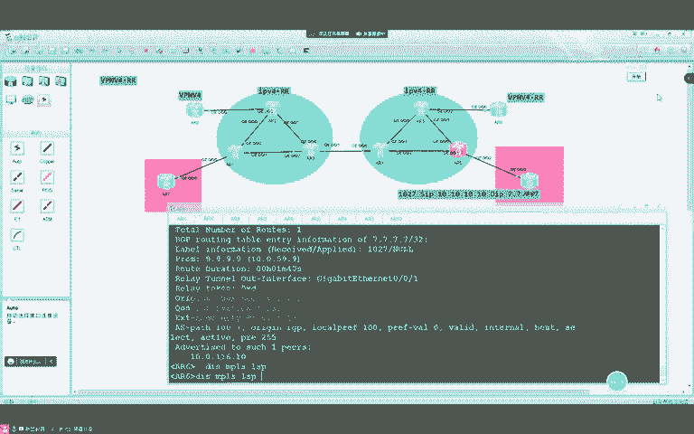

BGPLP1025。啊，打上1025。

然后BGP的吓一跳是4。4。对吧而6现在去往4。4。就打上四个标签，打上3。对吧打23实际上就等于没打嘛。😡，大家能明白这意思吧？打上之后再三倒数第二条弹出。😡，等于不打，直接发送给四了。

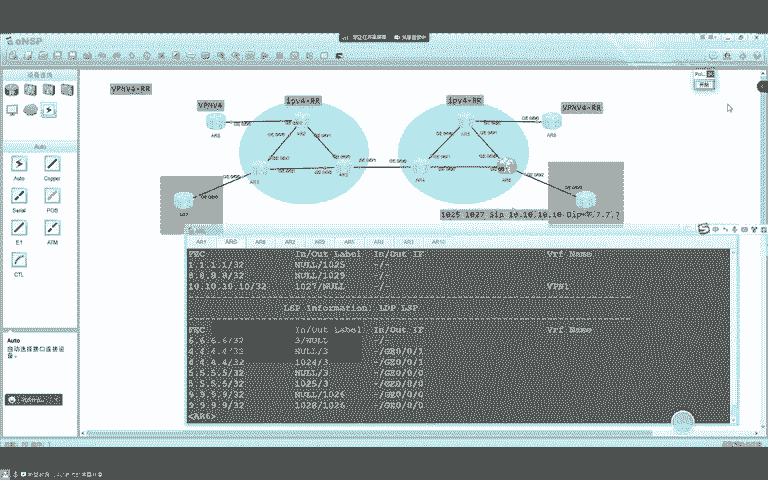

各位同学能明白这个意思吗？😡，明白的同学敲一啊，没问题吧。😡，那如果这里还有一台路由器。11。这时候还会不会打上三啊？😡，就不会了，因为这里正巧是倒数第二跳了，所以他才打上三又弹出了。

如果你这里有台11，这十一才是倒数第二跳。😡，能不能明白？

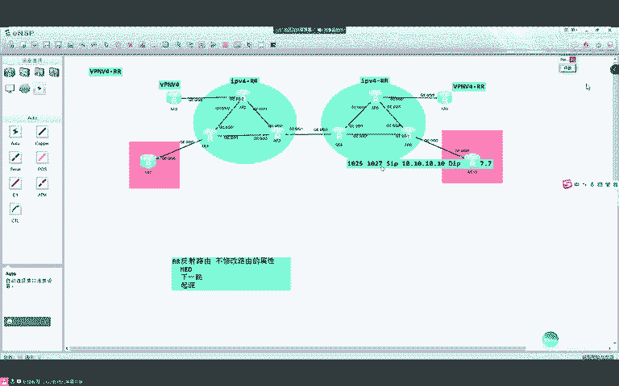

所以说这时候呢就打上3哎，给4了，四收到1025。😡，他知道怎么搞啊。😡，收到1025换成1026吗？

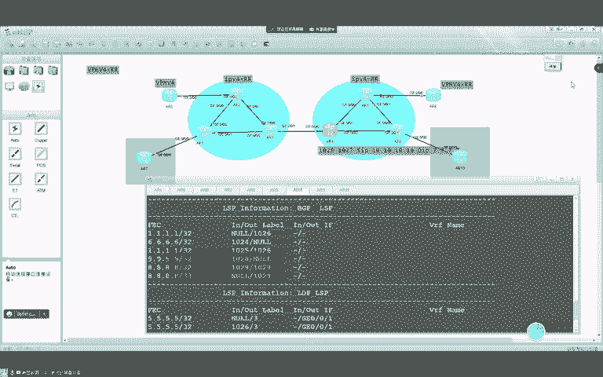

对吧啊，这样就过来了。😊。

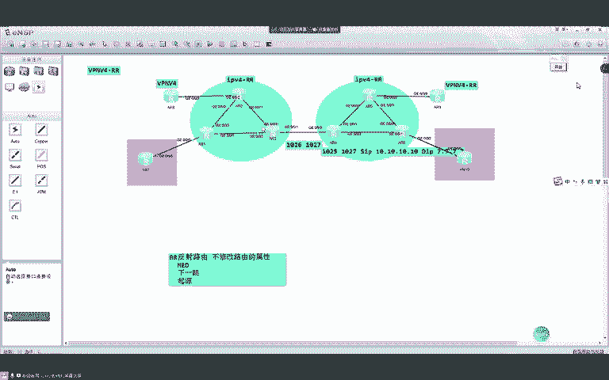

那三收到1026，他也知道怎么搞啊。😡，收到1026干掉1026对吧？然后打上1。1的LDP标签，哎，打上3不就又弹出了吗？😡。

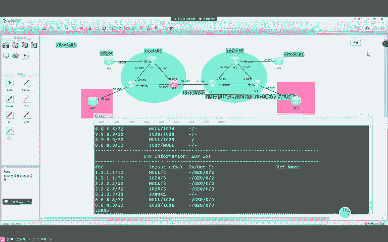

带有一层丝网标签，1027就发给一了。

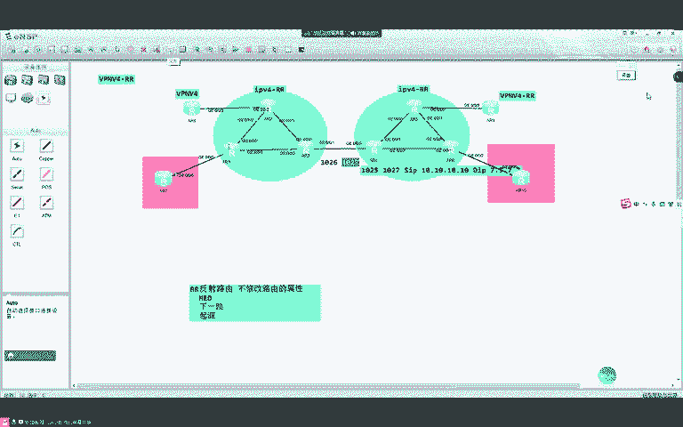

一收到1027。这不查找VP一就发过来了嘛，对吧？所以我们刚刚骗呢。😡，我们发现还能同。

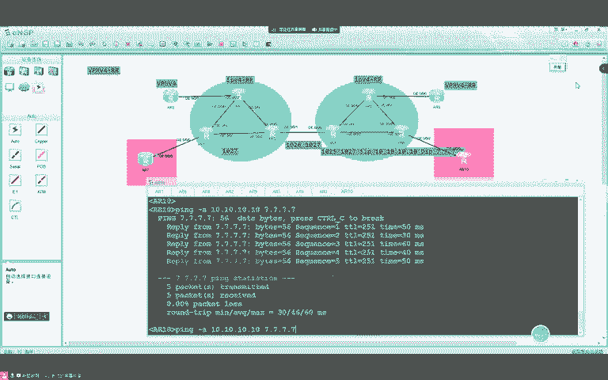

对不对？然后这时候注意啊，比如说我在G0-0-2抓个包，我们来看看它到底走的是不是这个路径。😡，好吧，然后我这里拉过来。😊，我在时上来拼一下。他走的是不是下面这个路径？是吧。

这样我们就可以绕过IPV4跟唯PV4的啊，对吧？直接从数据平面过来对吧？啊，每个R都是独立的。😡，好吧，那未来即使这条链路故障了，我们能不能过R再走一遍啊？😡，能不能比如说。😡，老师，我这条链路故障了。

😡。

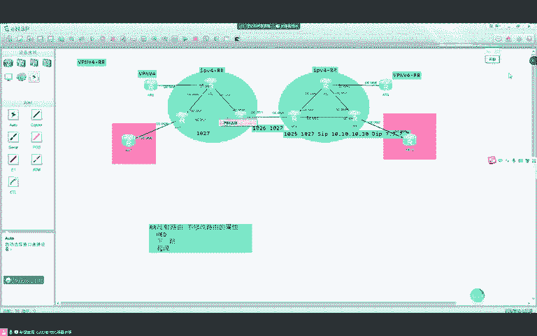

大家觉得我还能不能骗脱？😡，拿不拿？是吧一样可以拼通。啊，而我这条链路也故障了。😡，还能不能拼通啊？是吧哎哎啊还没收敛啊。😊，啊，也能骗同。😊。

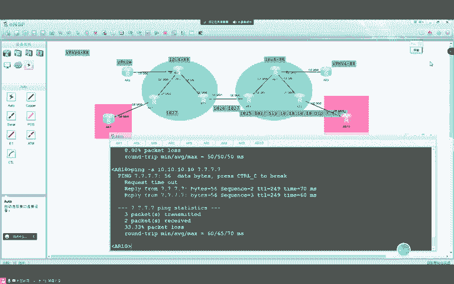

是吧哎，依然能够骗通。好吧，所以说呢这里呢我们可以看到R的多种部署方式。😡，什么样的部署方式呢？呃，来给大家说一下，你上面断了肯定不行了啊，那就一条线。😊，是吧你这种问题自己再想一下啊，小白拜同学。😡。

好吧，由大家这种问题。😡，这也。😊，也想想好吧，问之前想一下啊，你就那一条线。😡，你断了肯定不同了啊，你是说下面是好的，上面的断了是吧？😊，是这意思吗？是吧。😡，2到3段了，你觉得痛不痛啊？😡。

上面断了，你到R的路由就没了。😡，是吧。哎，但是还有一个好处啊，这里待会儿我再给大家说啊，好吧，然后刚刚我们已经说到这两条链路断了，有没有影响业务？😡，没有吧，注意各位同学，比如说我把这个链路断了。

大家觉得会影响吗？😡，会不会影响通讯啊？😡，是吧有同学觉得会啊，有同学觉得不会。😊。

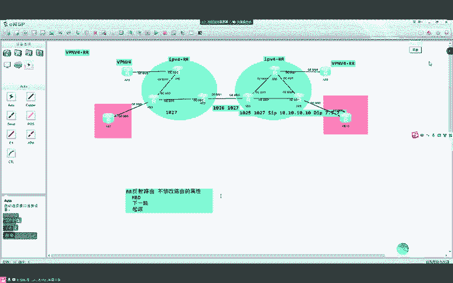

对吧实际上是不会的。😡，为什么不会呢？我们来想一下，虽然这条链路故障了。😡，但是我这样能不能环回口互通，我们有环回口建立的邻居啊。😡，老么。😡，是吧比如说我们再去骗依然是通的。😡。

但是比如说我把这条链路删了，还能通吗？😡。

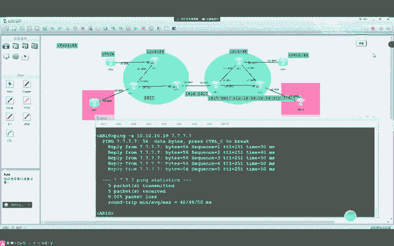

はは。还得痛吗？😡，是吧就不行了。那比如说。😡，我把这里跟这里都删了呢。😡，比如说这俩同时故障了。😡，那就不行了啊那就不行了。很简单道理嘛，你这边都独立了，你都没线连到一起了，肯定不通啊。😊。

是吧通很简单，你就有线连到一起，咱才通嘛，没有线肯定不行啊。😡，是吧。但是注意啊，你仔细看啊，我现在的R部署方式是什么呢？如果九跟6，我们采用的是膨挂式部署。😡，对不对？是吧那这样的话。

他们有没有可能在转发路径上？😡，有没有可能吓一跳都不是九跟8对吧？九跟8，我们采用的是旁挂，不是部署。那也就是说他们的作用只是反射，无论你网络怎么样去断，吓一跳都不是他们。😡。

对吧所以说这种啊永远不会作为备份路径。😡，但是比如说我们让五站在流量转发的备用链路上，有没有可能未来它经过报文转发？😡，有没有可能？对吧就当你的主链路故障，它不就走R了嘛，对吧？

那这种呢呃大家可以认为它叫。😊，啊。嗯，这个这个部署叫什么部署啊？我也记不清了啊，好吧，就两种方式啊，我们有旁挂式的。😊，对吧呃这种我们可以叫它叫做。😊，嗯。啊，这个得找华为取词啊，我可能取不出来了。

是吧？反正如果让我说的话，就是R在备份转发路径上。😊，对吧。你像这种旁挂式的话呃，我们也可以叫做独立的部署方式。😊，是吧就是他只是啊。啊你像二跟5呢。呃。他们就是在备份转发路径上，对吧？

那未来有可能呢数据流量也要经过他们。啊，那这个真正工作中怎么样去选呢？呃，你可以自己去选择对吧？呃，我们一般是推荐这种独立的方式啊，就是只做路由的反射。😊，嗯，但是呢比如说老师啊这个。😊，嗯。

公司呀节约设备。😊，是吧呃而且呢业务规模不大啊，我们可以让他在R在备份路径上。😊，所以这个大家明白了吗？明白的同学敲一啊，这里啊都没问题吧。😊，好。行，那。这个戴R的咱们就说完了啊，好吧，就说完了。😊。

呃，然后转发平面都是一样的啊，这里我就不再重复去说了。😊，嗯，option CE的解惑啊，我们来看一下吧。好吧，就是首先呢ASBR去往对端PE分配标签啊，这里是为什么给之前给大家说过了吧。😊。

是吧就是我们得有一层BGPLSP啊，要不然你送上之前标签直接到ABR，它是没办法识别的。😊，是吧。那ABRE去往P1的路由。是吧为什么要分配标签？比如说ASBRE。😡，是吧他去往P1的路游。啊。

假如说我们这边有个P1啊。他为什么要分配标签呢？实际上也是一样的。对于我们的ASBR来说呢，他不知道丝网标签，对吧？因为它不在这个丝网路由的传递嗯路径中。😊，对不对？那如果他直接收到带有丝网的数据。

他也是没有办法识别的。实际上这俩是一样的问题。ABR去往P1是吧？ABRE去往P1实际上是一样的。好吧，你ABR呢是通过CE这样收过来4万标签。ABRE呢也是一样的，收过来带4万标签。好吧。

就是2个ASBR是一样的问题。什么样的问题呢？他们没有私网路由。所以说没有办法识别死亡标签，我们得通过BDP呢去打印层标签，对吧？这就是我们为什么要去给他分配路由标签。😡。

好吧SBR1分给SBRSBR分一份给R。😊，是吧那这样你数据来的时候打这个标签，他们才能够进行识别。😊，好吧。然后解货第二个呢。嗯，这就是废话了啊，什么VPN的特征。😊，嗯嗯。我们来看一下吧啊。啊。

再回顾一下VPN的特征，专用对吧？对VPN客户使用VPN。与使用传统砖瓦没有区别。对，因为他是一个逻辑隔离的网络。一方面呢，VPN与底层承载网络之间呢保持资源独立。及一般情况下。

VPN的资源不会被其他非VPN客户使用，是吧？啊，另一方面呢，VPN足够安全，确保VPN内部不受外部干扰。这个我们可以去看到啊。诶。比如说未来我在这里再拉一个客户。对吧呃，我们可以通过VP实力区分啊。

对吧？RD路由呢可以通过RD区分啊，对吧？路由传递呢可以通过RD区分，对吧？而在数据平面呢呃我们都有各自的私网标签。也就是说我们用了同一块物理网络。实际上未来这两个用户是不是逻辑隔离的。😊。

这个大家能明白吗？明白，乔伊啊，这个没问题吧。😡，好吧，所以说在这里呢。😊，就解释到了他的一个专用性。😡，对吧虚拟。虚拟实际上就是一个逻辑网络。VPN用户内部的通讯是通过一个公共网络进行的。

是吧浙工网络也可以被其他的VPN客户使用，即VPN获得的是一个逻辑的专网，我们把它叫做啊VPN虚拟。😊，专用哈，这就来了。虚拟专用网络。😡，对吧如果你刚开始听到这个词语呢，你就觉得哎。😊，还挺厉害的。

是吧老师这什么牛逼的技术啊，虚拟专用网络。😡，那你一听到专用，你就觉得这个词儿这技术很强。😡，对吧一天虚拟，哎，这网络还能虚拟呢，那不就是路由器吗？😡，对吧。那所以说呢你只要这么一说，哎。

客户一听就高大上的感觉。对，没错。😡，是啊人家就愿意吃你这一套。啊。然后我们来看这里啊，就是为什么P2要为ASBR2分配标签。😡，P2。P2呢不知道P1的路由。当VPN携带的外层标签为BDP。

对吧P2无法识别外层标签B2则P2丢弃数据，什么意思呢？😊，我们来看一下。我来看一下啊。如果说我们没有这条链路。嗯，注意啊。如果没有这条链路啊。6、发给五的数据。他是不是还有一层LDP的标签？

我假如说是X啊。是不是还有一层LDP的？😊，是吧。😡，对吧。那有人就问了，我举个例子啊，我这里给大家说一下1025，这是什么标签？😡，这是BGP的吧。是吧。5上面能不能识别这个BDP的？

5、能不能识别告诉我。能不能够同意啊？这不就他给RR反射过来吗？55可以识别啊，他给RR反射过来。对吧。是吧。

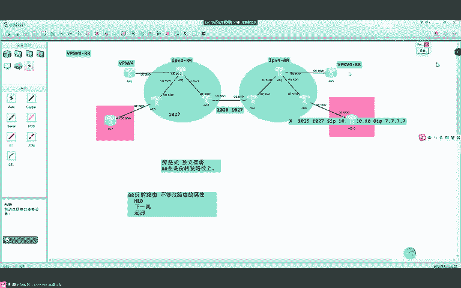

是不是呢？我们来看一下啊，实际上呢你到五上去看一下LCP。😊，你一下子就明白了。注意啊。5上面1。1出标签1025。能不能识别好像对吧？老师哎能识别。😊，但是注意啊，他有收标签吗？有没有？😡。

比如说我们给他1个1025，他有他可不是说我看一。1啊，他看收标签1025有没有？😡，啊，当然这个LDP的正好重复了啊。😡，能懂吧，不用管，就是我给他1个1025，他有没有收标签1025啊？😡。

就是BGP的1025，它有没有售标签没有。😡，收懂吗？

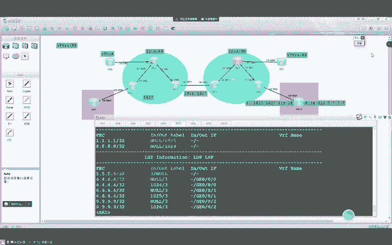

所以说如果5他没有IPV4BDP标签路由。你觉得能不能通啊？😡，大家觉得能不能通啊？😡，比如说我举个例子啊，这不是你一点一的路由吗？三给44直接传递给6。😡，那6把。BGP路由如果没有LDP啊。

他直接把BGP路由给捂了。😡，大觉得五能识别吗？😡，不能吧。是吧那不能识别怎么办呢？😊，这也就回到了我们刚刚的问题。是吧。为什么P2要？😡，为ABRR分配标签。好吧，如果我们打上LDP。

他不就可以识别了吗？😊，对，所以说我们AS内为什么要运行LDP，大家明白了吗？😊，一样的对吧？解决路由黑洞嘛。😊，对吧你六不能识别。我这样啊，我给你打上1个4。4的LDP标签。这你总能认识吧。😡。

我给你。你看LDP。转发给4。行不行？各位同学觉得行不行？😡，可以吧。好吧，这就是为什么我们第三层标签要打LDP这一层标签呢是用来解决这一段的对吧？这一层标签呢是用来解决它查找私网路由的。😊。

而在AS域内呢，为什么要有LDP呢？就是为了防止啊这种P设备，对吧？它识别不了。😡，好吧。😡，所以在这一块。呃，S跟R6呢。R4跟R6咋啦？

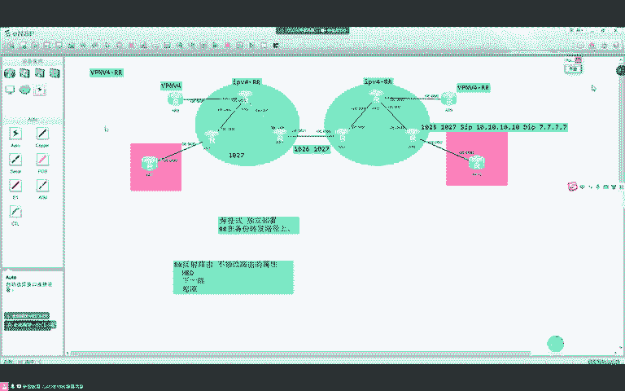

好，我给大家保存一下配置啊。😊，4。6咋啦？啊，直接连就行啊，那直接连肯定可以。😊，啊那时候你的吓一跳就是那个谁了，就直接是四了。😊。

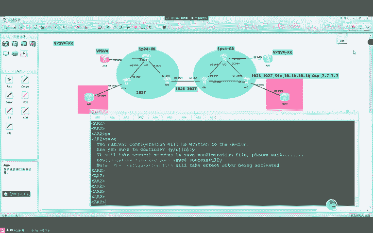

46直接LDP。啊，你意思是不要BGP的，直接跑FDP的，是这意思吗？😡，是吗？😡，哦，我懂你意思是46之间不要LDP是吧？😊，是这意思啊。呃，我试一下啊，理论上是可以啊，我试一下啊。😊，我这样啊。

我在A26的G0-0-1。安度MPS。然后我把一3的也给他连上啊。10点10点10点10到7。7。7。7。呃，那就不行啊，我看一下啊。第四类BTPVPV42rootingtable。啊，那还不行啊。

你们没有FDP，他直接吓一跳不可达了。😊，能看到吗？可以吧，这应该是强制的啊，你看你没有LDP，他是不是直接吓一跳不给来了。😡，对吧这个需要有啊需要有。你比如说我们再把LDP配上呢。😊。

interface70-0-1。啊，我把MP24开一下啊，我不开LDP时。我看是不是最优路由啊。嗯，啊好像还是不行。本没有IDP还不行啊。😊，我再看一下啊。啊，你没有LDP不行啊。

就你这个接口不开LDP的话，他会认为这个丝网路由下一跳不可达了。😊，哇，得开啊得开。😊，这样不行啊，上析啊。😡，上面直接给你下一票不给答了。😡，手动打标线。你你LDP没办法手动打啊。😡，对。

LDP没办法手动打。😊，能懂吗？比如说你给4。4打一个标签，这样不行啊，LDP这个呃IGP呢，你还打不了。😊，BP你能跟着路由发的时候去打，但ITP不行啊。😡，嗯。好，嗯，这个C一咱们就说这么多啊。

我把录屏停啊，不是录屏，就是把实验关一下啊，给大家保存一下。好吧，你们课下去做做这个实验。😊，呃。

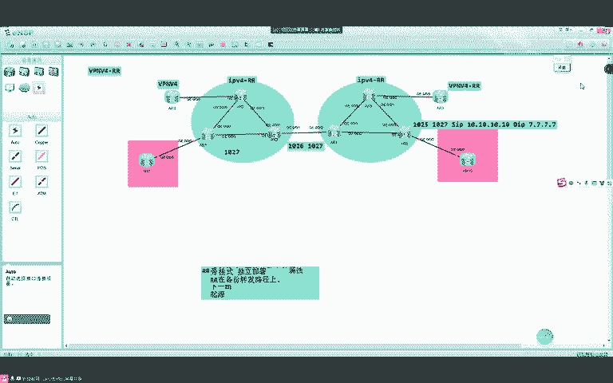

复这一份啊。啊，不是下课了，休息会吧。😊。

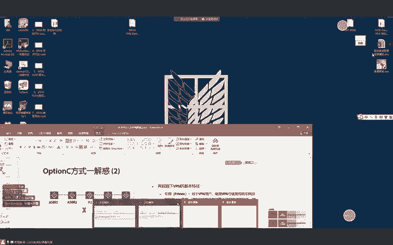

美甲克啊。呃，咱们休息会儿休息一会儿。😊，嗯。复这一份啊。噶啊。啊嗯。啊，然后这是咱们刚讲的C1带R的场景啊。嗯，咱们休息10分钟啊，休息一会儿吧。歇一会儿之后呢，我们来讲一下这个C2。

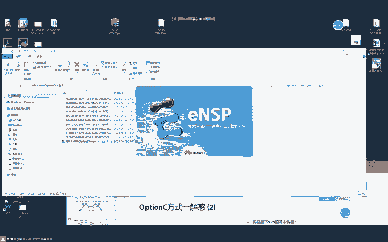

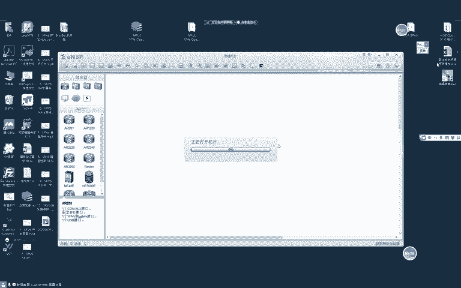

好，我们等设备开一下吧。好吧，呃，咱们休息一会儿。😊，休息10分钟嗯，十0分钟之后呢，我们来讲一下option C2啊。😊，好吧，休息一会儿啊。😊，咱们到9。03。啊，9。03继续啊。😊，嗯。啊。

不是啊，9点139点13。😊，9点13啊，同学们说错了。😊，呃，应该能打开，这次没意外啊，就这个感觉能打开啊，我们待会儿等一台设备，只要开了之后，咱们就开始休息啊。😊，嗯，应该能打开啊。

现在还是红的是吧？呃，等接口绿了，咱就走。行不行？嗯。有点不太对劲啊。😊，是吧有点不太对劲啊啊。😊，哎，怎么没开呢？确实没看啊。唉。这重启电脑还挺麻烦的。我再试一次啊，同学们，我再试一次。😊，嗯。

有没有管理员运行的？管理员运行一层。我们再开个router，开router能开。

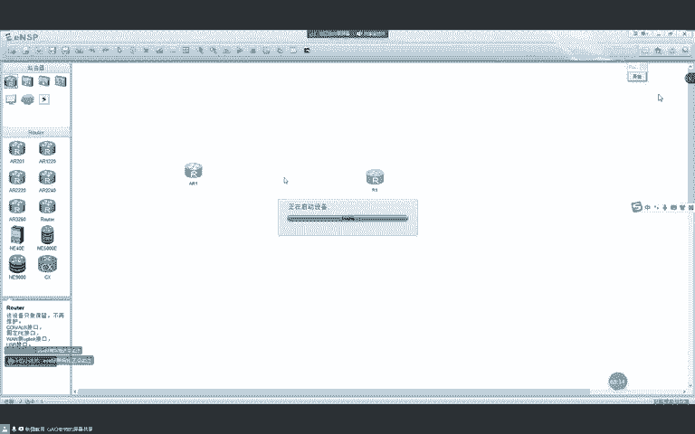

UVE好用吗？UVE电脑一一般跑不了啊，跑电脑跑UVE太卡了。嗯。roer能开。但入点开的比较快啊。哦。

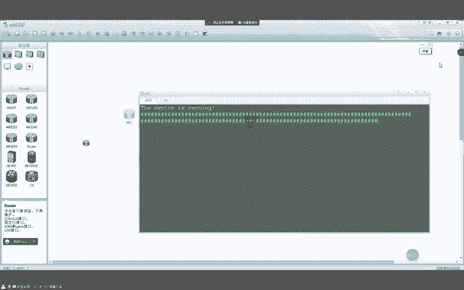

我感觉凉了呢。NE也不能开，因为NE开这个社会资源尺嘛。嗯，我重启一下电脑吧，正好趁咱们休息的时候。😊，好吧。嗯，我重启一下电脑啊。嗯。咱们这节录屏分两次啊，咱们这节课录屏分两次。😊，好吧。呃。

我重启一下电脑。嗯，MPS。嗯。Opo C。😔，嗯啊。好吧，然后再加个括号。一。唔在这。因为咱再重新搭的话，这个需要时间太久了。

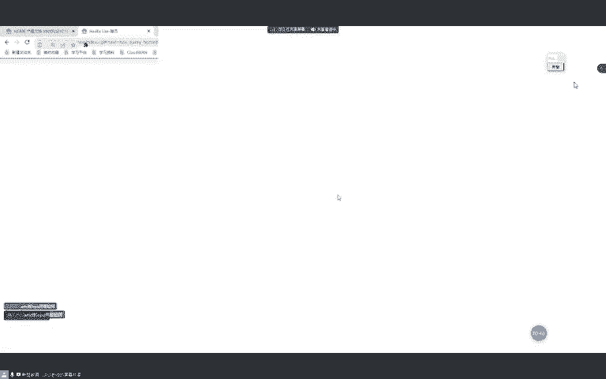

ADCPU。好，同学们，我们休息会儿吧。呃，咱们到这个。😊，呃，别03了，好吧，咱们到17吧，从现在开始计数。😊，好吧，呃，咱们到9点17啊，因为重启电脑得一会儿，因为电脑还有很多东西得开啊。😊，呃。

咱们到9点17继续上课。好吧，然后我先把这个会议退掉啊，嗯重启一下电脑。😊，那家就休息会儿吧。好吧，然后我们到十7继续上课啊。😊。

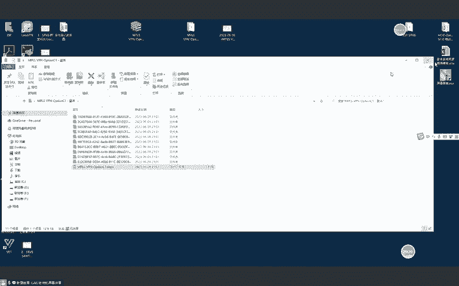

好，同学们，大家能听到吗？可以了，来音业啊，好吧。😊，嗯。行。啊呃。啊。呃，我们开始吧啊开始啦嗯。😊。

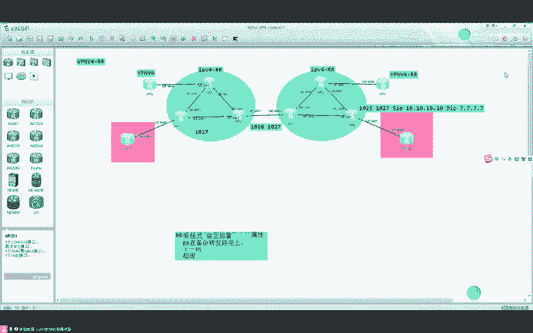

呃呃接下来我们要讲的是。哦op不是C2哦吧哦，不是C2啊。嗯，在这。啊，这都废话啊，先不用看啊，你看了你就懵了嗯。😊，呃。呃，门C2是这样的啊，就是它跟C一的这个解决方案呢啊基本类似啊。

但是呢还有点不一样。😊，呃，我们来考虑一下啊，是这样的。唉，刚我们来看啊，就是我们的C一里面呢。嗯，ABR。这个发这个带有标签的BGP录以后，主要是为了这一段。这个大家应该还记得啊，是吧？就在这里呢。

我们可以看BDP的。😊，标签呢来实现一个转发。对吧哎，那这时候我们来想一下，哎，老师那能不能这样呢？因为我们看啊在C一里面，咱们是不是这样传的不标签啊呃，他给A24A24呢把标签路由传给55传递给6。

😊，是吧哎，那在我们的这个。😊，呃。C2中啊，他的思路呢稍微有点不一样。我们来想一下啊。😊，就是能不能是这样的呢？就老师啊。😊，是啊。他把路由引入到IGP里面。那LGP可以给IAGB发标签啊，对吧？

待会儿四呢做个缝合怪啊，怎么样做缝合怪呢？他把这个BGP的。😊，跟LDP的缝到一起。是吧那我就不通过BGP给5了，我通过IGP给55再通过IGP给6。那这时候呢AS内我就不需要用IP4BGP了。😡。

对吧我直接用。IGP传路由用LDP分标签。C一呢，他用BDP传路由，用BDP粉比较钱。😡，是吧。😊，那在我的C2里面呢，我就用IGP传路由，就多了一步引入嘛，我把它引入进来，然后呢再用LDP分标签。😡。

那这就是C2的一个思路。首先这个思路大家大概听懂了吗？理解同学敲一啊，这个没问题吧。😡，可以吗？其他同学呢？可以是吧。因为你这一段确实得用B。DP传嘛，因为这里就只有BDP啊是吧？

但这一段老师我有IGP啊，我用BDP再传路由再分标签。那不如我把它导入到IGP我LDP给他分。😡，是吧我在A24上，我把LDP跟BDP它俩缝合到一起，这样转发过来就行了啊，这就是CR的一个思路。😊。

那在C2里面呢，我们就不需要什么IPV4BP了啊，用不着了啊，我给它删掉。😊，删掉之后呢，我们就把这个图啊改成op C2。😊，怎么样去改呢？😡，首先二跟5，咱们就作为纯的P设备，好吧。就直接安度BDP。

把BDP给他干掉，在5上面呢就没有BDP啊啊，不让他跑PDP。😡，好哇。呃，然后呢。这个VPV4的R，咱们也先不要。😊，好吧，也先不要啊，现在我们先做1个CR不带R的。😊，怎么说呢？

现在呢在我们的AR一上，我们把多余的配置呢。😊，BGP100。啊。刚刚做了很多多多余的配置啊，这巴拉巴拉的一大堆。😊，嗯，他跟三现在不需要电邻居了是吧？因为待时我通过IGP传路由。我们把根暗度P2。

2的邻居给它删掉，对吧？IPV4的R嘛，然后把微屏V4邻G8。8也给它删掉。暗度P28。8。好吧，别给他删掉。现在呢就是跟CE见了一个邻居。😊，然后在六上呢也一样。VDP。200。暗度皮儿。5。5。5。

5给它删掉对吧？暗度P。9。9。9。9，你也给他删掉。好吧，现在也就是给CE建了一个邻居。😊，然后我们在ASBR上呢。😊，一批。呃，100。是吧哦之前我们还针对于AS内的IPVR呢做了很多配置。

还做了一些策略啊，现在都没用了，没有IPV4。😊，BGP了暗度2。2啊，直接给它删掉。😊，好吧呃，然后在四上呢。BDP200。安度。5。5。暗度P25。5。5。5也给它删掉。好吧。那这里做完之后啊。

我们来看一下四上面呢就做了一个很简单的配置，什么样的配置呢？😊，就是啊三啊三呢。😊，发布这个现在的8。8没用啊。我把8。8也删了，好吧，咱们干脆一点。😊，然后在四上面呢，按度network把9。

9也给它删了。

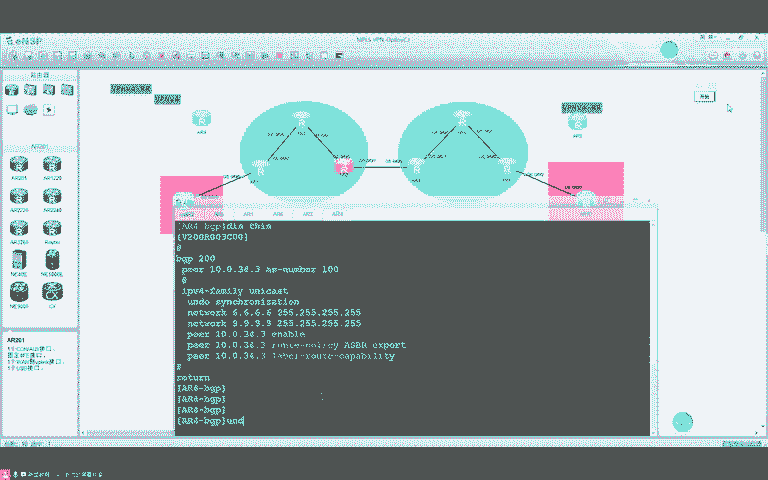

好吧，然后现在我们在三场啊，就是AS每个AS内都有IDP啊呃LDPMP啊，对吧？然后现在在我们的ASBR上呢。😊。

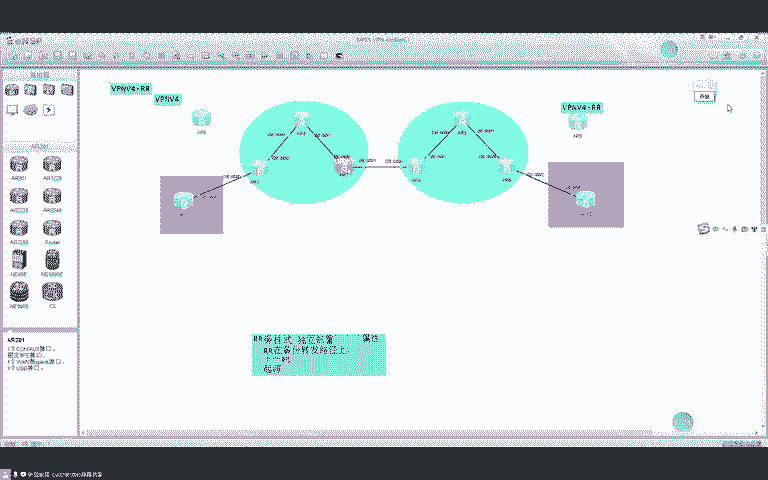

配置就简单多了。哦，我们就是跟四建1个IPV4的邻居，哎，那没删掉。😊，在四上面呢在三上面啊就是跟四建立一个邻居，然后。😊，发了一个标签路由嘛，对吧？BDP标签路由，然后协商BGP标签路由的传递能力。

然后把邻居激活。😊，对吧然后在四这边呢也是一样的。😊，对不对？然后我们在三上面。n work了1。1是，然后在4上面呢，n了6。6。😊，那这时候呢，三肯定就有对端AS的。6。6。6的路由。对不对？😡。

那这时候一有没有6。6呢？一没有在C一里面，我通过BDP呢传递给一，但是一现在没有没有怎么办呢？我们不通过BDP传了，我们在山上呢这样SS import BDP。😡。

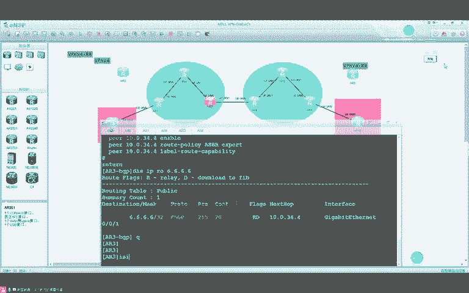

好吧，那现在一就可以学到了di四类IProing table6。6。6。6。😊。

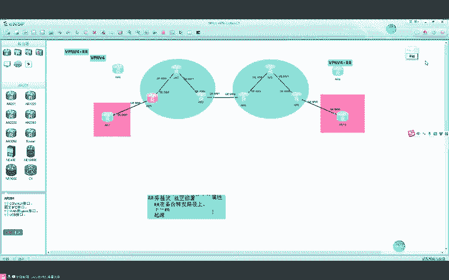

学到了吧？然后我们在四上呢也是一样IS import BTP。😊，好吧，那这时候六呢也能够学到一。1的路由。😊，啊。是不是啊？那这时候。

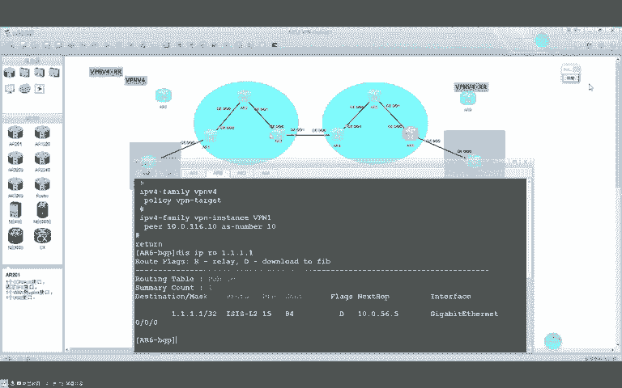

对吧老师啊，待会儿一跟三呢，就是在一上面，我们得有6的这个LP啊。首先我们来看三上。😊。

三有没有6的LP啊？有吧，这就是4通过BDP给它传过来的嘛。但是如果我们去看二或者看一的话，比如说看一下2。😊，有没有六的，没有一呢？也没有6的。

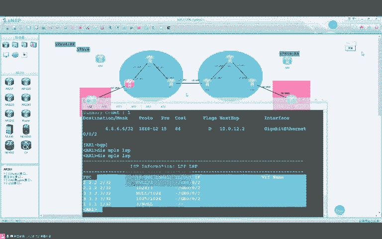

是吧这是为什么呢？因为我们刚刚有没有说啊。😡，在A23上啊，它把路由引到IP之后，我们还得做一步操作。就是他得把BDP因为你要通过这边要通过LDP去审生，他俩要不要缝到一起啊？😡，是不是需要啊？

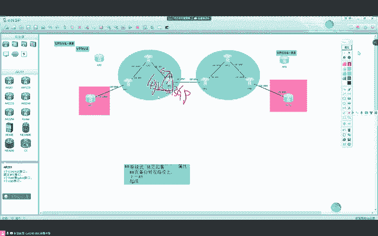

对吧。😡，那这时候怎么缝的呢？实际上就是一条命令，就是我们需要在山上。😊，在他的MP4视图下。叫做LSP的触发策略。什么呢？为BGP路由构建LDP的标签。当然你可以针对于特定的前缀列表，对吧？

就用前缀列表匹配6。6啊，单独去做也行。😡，啊，然后我们这样一旦做完之后呢，三呢。😊，他就会为这条BGP路由。6。6。6。6去构建了1个LDP的标签。所以我们来看出标签10241不一样。要嘛。😡。

然后三呢就会给二说对吧？因为三已经收到上游给他的标，下游啊，上游给他呃哎啊下游哎，上游还。😊，好，下一游是吧，三已经收到下一游牌的标签了吧？😊，对吧，只不过是BDP的。对不对？收到下游BDP标签呢。

给它往上游传递LDP的标签。😡，好吧，这就是这条命令的意思。所以这条命令各位同学明白了吗？明白同学敲个一啊。😡，没问题吧。好吧，这时候传递给二之后呢，二就来了。😡，二手的下游。

给他的1033朝上游提供1个1027。那A21呢？就有了出标签。明白了吧，那在四上也是一样的操作啊，你一。一传过来，那四也要给5，五也要给6啊。😡，对吧所以说我们在4的MPS4速度下呢，也要敲一条命令。

LP的触发策略呢就是为BGP路由构建LDP的表情。😊。

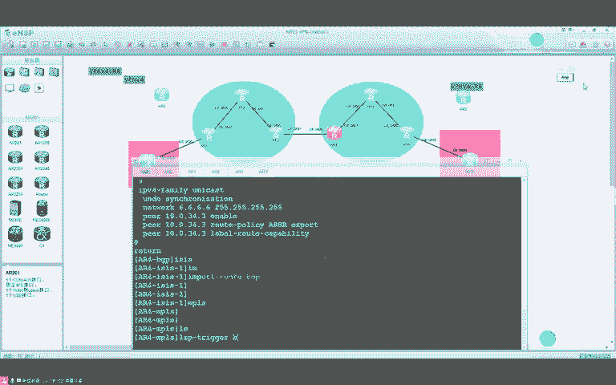

那这时候我们再到AR6上来看一下diplayM2LP。有没有一。一的标签？

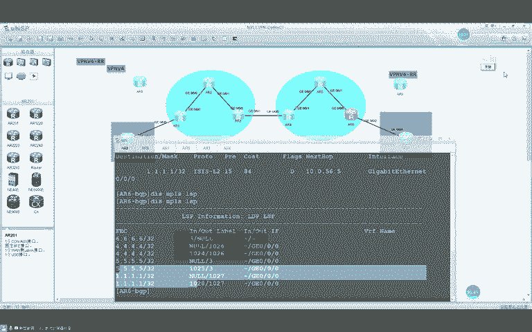

有啦。对吧有了这一。1的标签之后，比如说我们来看一下，哎，老师片杠A1。1。1。1。😊。

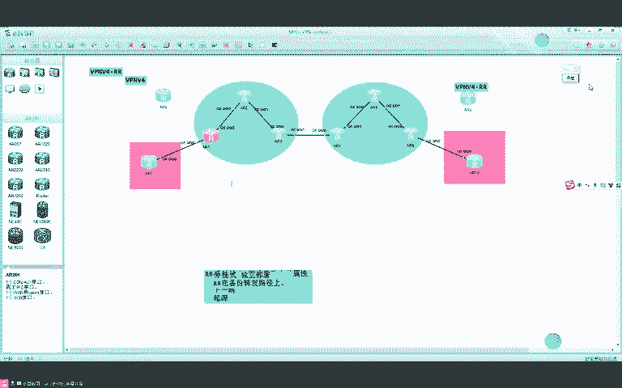

到6。6能不能通呢？可以可以通，就意味着。😡。

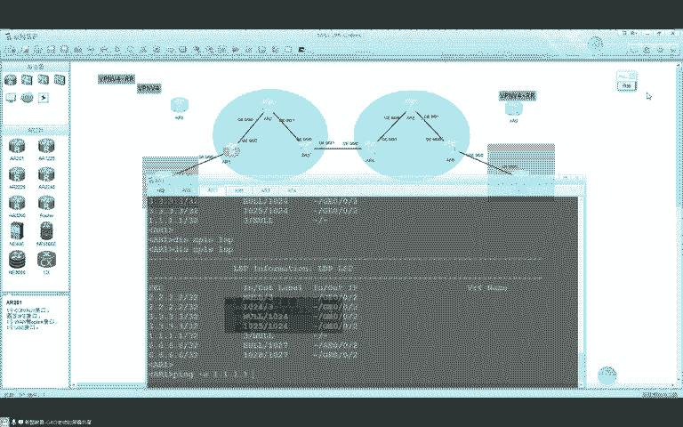

咱们可以去建立。邻居啦。

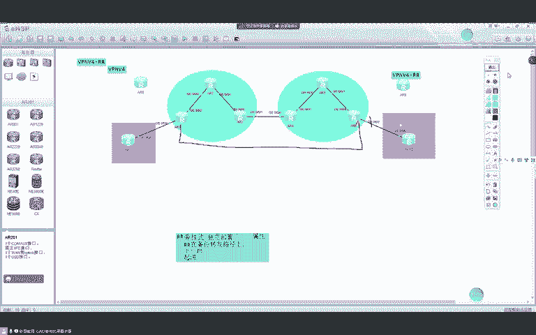

是不是啊建立VPV4的邻居了？很简单啊，就是我们直接在A21上BDP100。😊，P26。6，这跟。C一一不一样一样吗啊，第26。6。😊，这是不带R的AS200。P26。6。interface60P26。

6。呃，一比一批多跳。呃，然后IPV4familyVPV4地址数下P6。6。6。6给它激活。啊，然后在六这边呢也是一样。P21。1。1。1A100P21。1。1。1更新原地址。い来い来い来い。呃。

EBP多跳对吧？IPV4VPV4。P1。1。1。1给它激活。好吧，那这时候呢7。7就传递给一了。所以说A2一呢VPV4Rroing table它就接收到了7。7，转换成VPV4。😊。

转换成为平V4之后呢。呃，VPNV42P我们看一下，等他邻居建立起来啊，稍等一会儿。😊，哎。还得会儿啊。诶。还没起来啊，起来了。😊，对吧然后我们来看呢，这时候呢，他跟6。6建立邻居。😊。

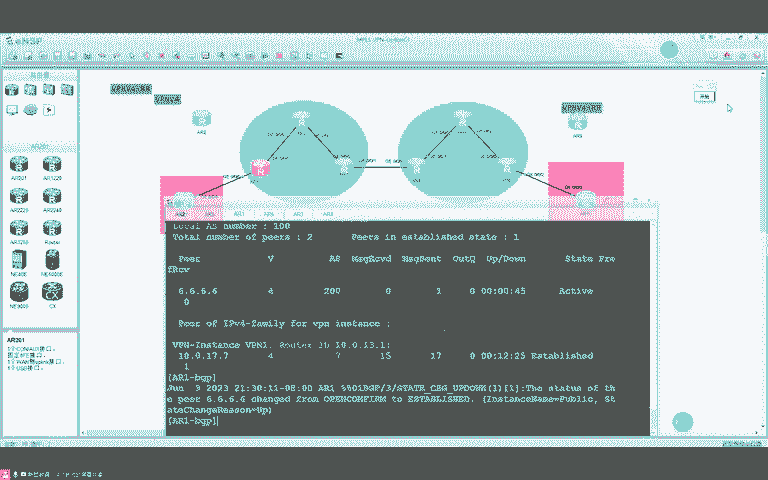

那收到了VPV4路由对吧？要传递给他自己的AR6这个邻居啊，那6就收到了。

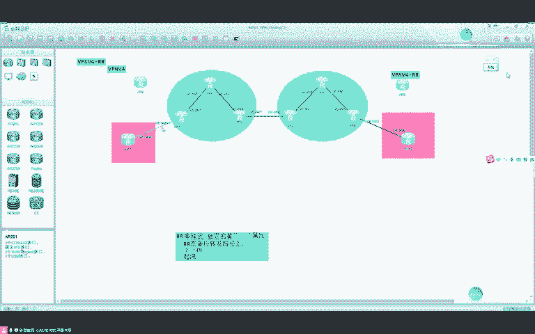

6收到之后呢，根据RT导入到VP实例中，十就收到了。

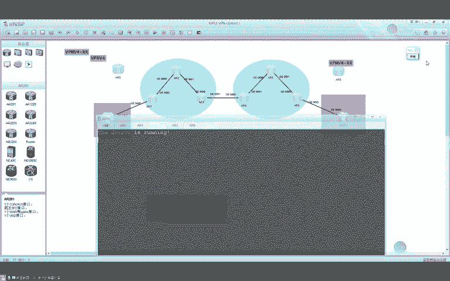

十收到了7。7，反过来7呢也能够收到10。10。是吧很简单啊。😊。

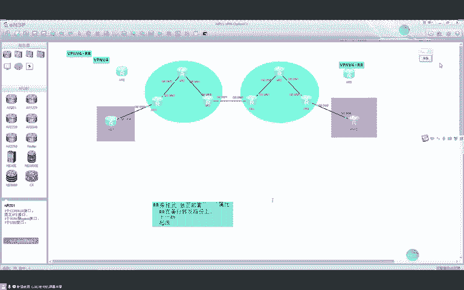

然后我们去骗一下pin杠A10点10点10点10到7。7。7。7。而且通了。是吧。这个很简单吧。对吧当你学完C一之后啊，你理解这C一的思路啊，实际上C2里面呢就很多都是类似的，这样就通了。😊，呵。

对吧哎，对，就这么快。😊。

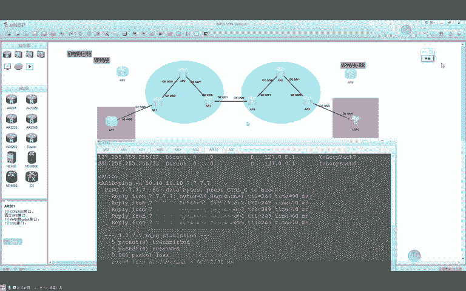

是但是你要注意啊，我这是把C一改成C2啊。😡，你要如果是重新搭的话，你也得配一会儿。你像这些接口地址啊呃ISS啊LDP啊MPS啊，呃，你也得配好一会儿。😡，是吧。

所以说啊C2呢呃相比于C1来说要简单一些。那它怎么通的呢？我们来看一下数据平面就很控制平面就很简单啊，然后他给一一给66给10嘛。😊，是吧哎那他怎么通呢？我们来分析一下。😊，10点10不是到7。7嘛。

对吧然后给遛了六一看目的IP7。7，就是你甭管身上的MPS通讯啊，他肯定都看死网标签。😊。

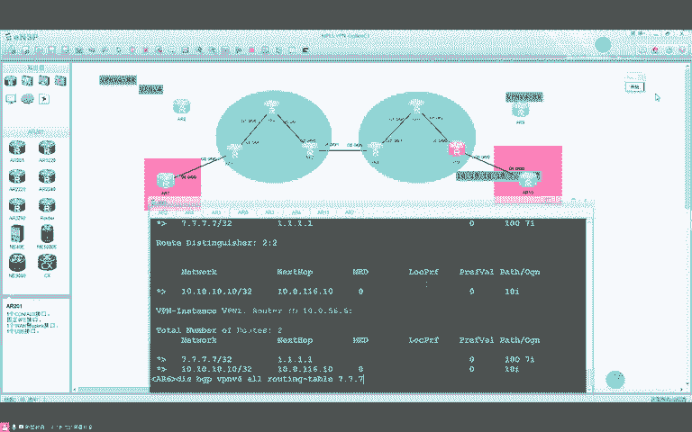

希点西哎。打4网标签1029。

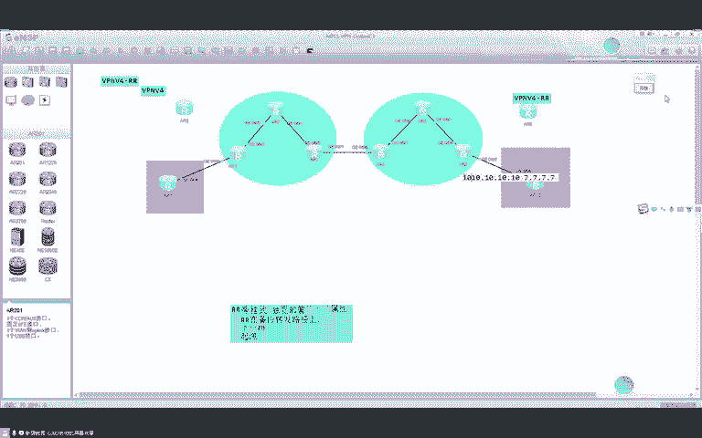

是吧。答案1029看下一票呢是1。1。😊。

1。1正好有LDP的啊。对不对？1027打上1027了。那这是LDP的，大家告诉我5能不能识别1027啊。😡。

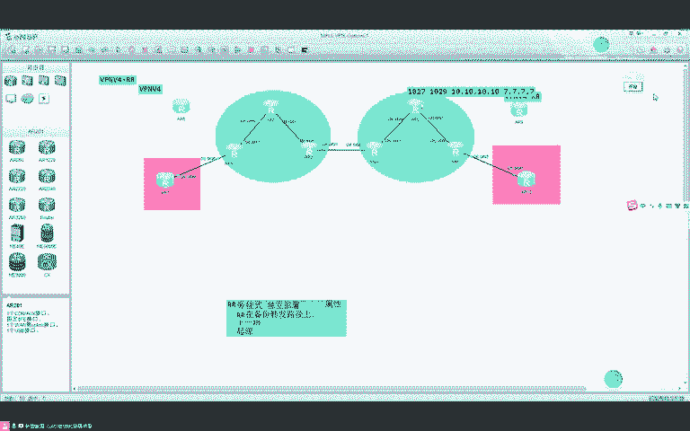

拿不拿？😡，5肯定可以，因为他也通过ATP能够学到啊，是吧？他一看1027换成1032。😡。

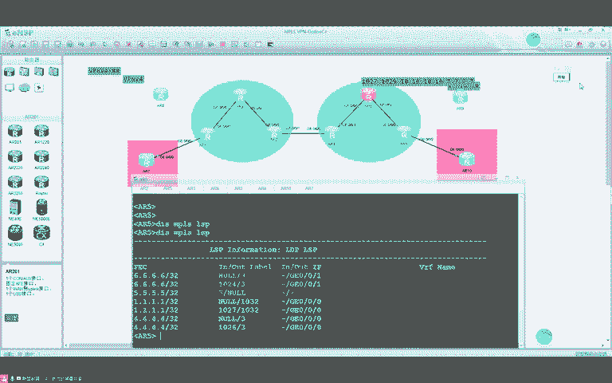

对吧所以说这里呢就换成了。

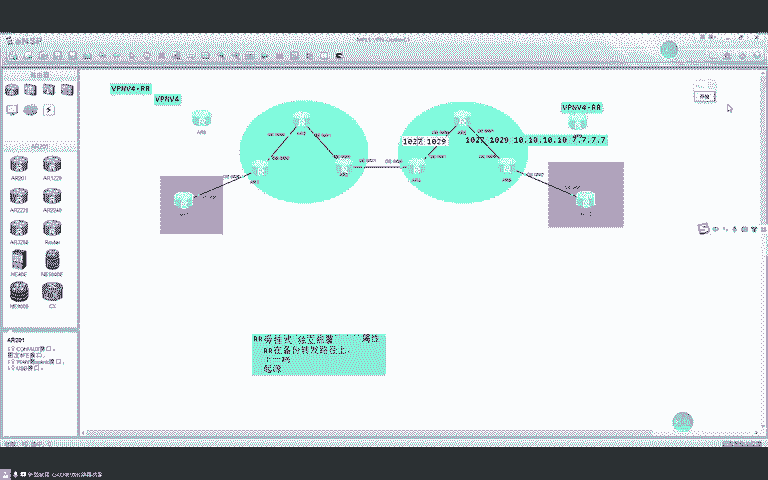

103给4了。那四收到之后，收到1032。

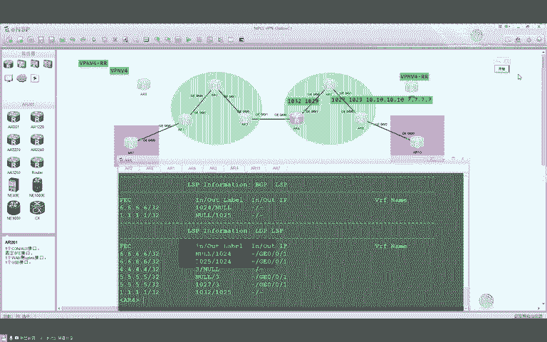

换成1025。都给删了。3、收到1025。截止了对吧？截止了之后，因为1025就是从三那里始发过来的嘛，但是三有1。1的LDP啊是吧？它再封到一块1025。😊，是吧哎，正好只不过正巧了巧了一样了。😊。

好吧，所以说在这里呢。😊。

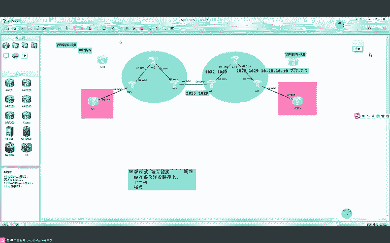

也是1025加1029就过来了。过来之后，AR2收到了。😊。

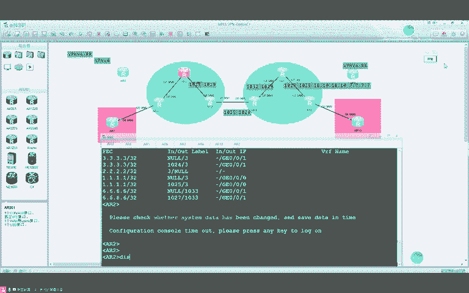

DMPSLP。收到1025倒数第二套弹出。就只有1个1029。就给一了。是吧一看美滋滋。

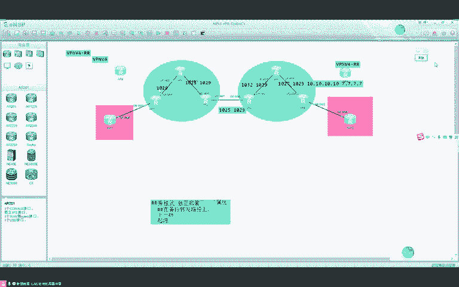

对不对？哎，1029怎么办呢？

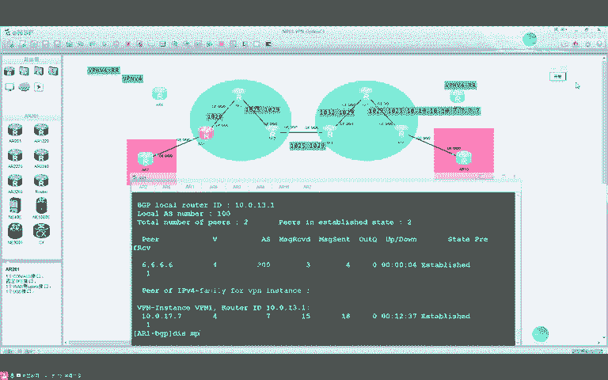

MPSRSP。VP一是吧把标签弹出把存的IPV数据。就转发过来了。是吧。那C2不仅比C一简单一些，那他还有个什么优势？大家觉得你就看这个传递的过程，它有个什么优势啊？😊，什么优势啊？

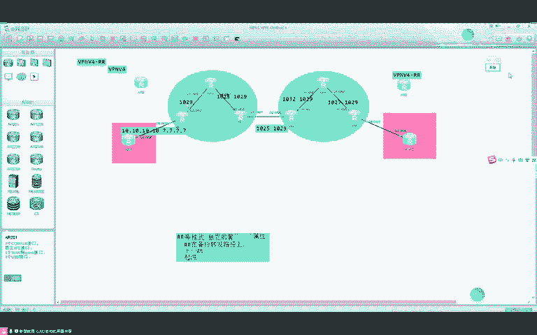

对，标签少一层。是吧我们能通，而且标签少一层就少了4个字节是吧？能承载更多的数据。比如说我们现在抓包来看一下呢。😊。

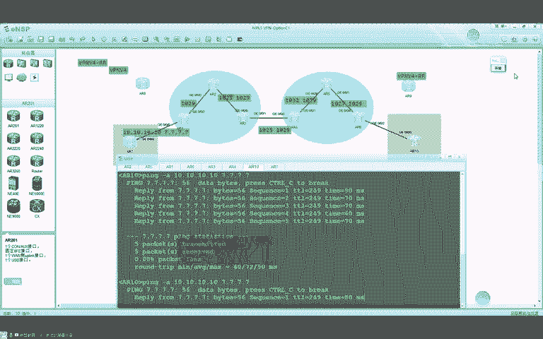

呃，然后在0-0-1也抓一个。然后在这里的0。0-1也抓一个。呃，然后在这里的0-0-0也抓一把嗯。

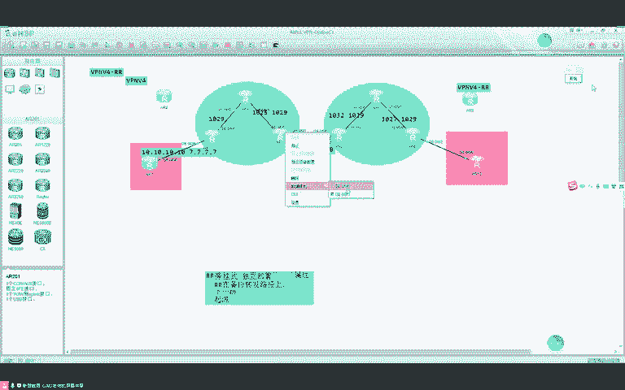

嗯，然后我们在实上去骗一下。

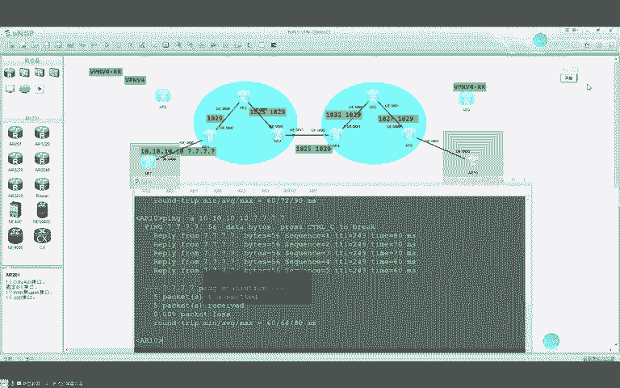

啊，然后在这条链路应该是1027跟1029。是吧10291027。然后在这条链路呢，应该是1032跟1029。10321029。啊，然后在这条链路呢是1025跟1029。10251029。

在这条链路有不一样。大觉得一样吗？标签是一样的，但是走的隧道也不一样。😡，这1025是什么标签啊？是BDP的，但是这个1025是什么标签啊？😡，对，LDP的没错，所以我们来看呢。😊。

10251029对吧？实际上它是LDP的，然后再过来就1029了，呃，再过来就IP包了。😊，啊啊，这就是C2C2很简单啊，就我们学完C一之后呢，你发现C2就非常简单了。😊，啊，这就给你学完OSPF呢。

你再学SS。😊，哎，老师这不一样吗？是吧？呃，实际上C1跟C2是差不多的。😊，所以这个实验大家明白了吗？明白的同学敲一啊。😊，喂问题话。😡，好，那接下来呢我们要讲一个呃C2里面带R的场景。

就稍微复杂一点点。😊，好吧，要稍微复杂一点。比如说现在呢我们把R给它接上。😊，对呀。所有。不管你是C1还是C2，只要你带了R，它只是在控制平面。我们建立邻居的时候发生一些改变。

就路由传递的变成了R之间传了。😡，能不能懂啊？所以说之前他俩这里的邻居呢，我们就给他干掉。😡，好吧，就是甭管你是C一还是C2呢，就是跟R建R之间建就完事了。😊。

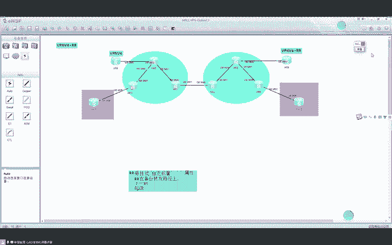

所以说我们在AR一上呢就可以暗度。😊，P尔6。6。6。6啊。对，然后在六上呢。ADP200也可以暗度P1。1。1。1了。好吧，一旦安度掉之后呢，我们再让一跟八去建，怎么建呢？😡，P尔8。8。8。8。

A100。P28。8。8。8n interfaceface low0。8。8。8。8呃。没了。是吧IPV4翻不了啊。VPV4，然后跟八呢去激活VPV4的邻居。听得不。是吧然后我们在8上呢。😊。

BDP100。8上面的配置咱们是做好的啊。😊，呃，首先。好，这也比较多啊，我给它干掉暗度。P28。8。8。8啊，不是啊暗度BDP。😊，8。当这里的IGP啊，各位同学注意啊，这里IGP我就没删了啊。

因为你他俩要建邻居，IGP肯定要互通啊。😊，好吧，然后我们只是把8的BDP给它删掉啊，然后BDP100。😊，P尔1。1。1。1。A一吧。Per1。1。1。1 interfaceface60。

然后P21应该是IPV4啊，不是P29。9。9。9。A200。P尔9。9。9。9coninface60。然后P29。9。9。9EBP多跳啊，IPV4familyVPV4关闭RT属性的路由过滤。然后把1。

1的邻居激活，然后呢，把9。9的邻居激活。呃。然后把1。1。1。1配成反射机的扣机。是吧然后在六上呢也是一样，6上面就是P29。9。9。9A200。P尔9。9。9。9。

interface娄百玲IPV4family。呃，V片V4。P29。9。9。9嗯inbel啊。然后在酒上呢。安度BDP。好吧。嗯。N度BP我们把这NBP给它删掉。呃，P26。6。6。6啊，BDP200。

P6。6。6。6S200。PR6。6。6。6。那个inface60。然后P尔8。8。8。8。S。100。P28。8。8。8。60，然后8。8。81比P多跳啊IPV4family。VPNV4。P6。6。

6。6有激活。然后P2。8。8。8。8。也给他激活，然后P6。6。6。6作为反射器的扣机。对吧然后暗度policy是吧，就去把IT属性的路由过滤给它关了。那这里做完之后呢。

嗯我们看一下AS号有没有配错啊。😊，呃，9。9的啊，那就没配错是吧？那这时候呢，我们的每个R呢都是可以跟AS内的。注意啊是AS内的。😊，PE呢去建立邻居的，现在R之间呢还没有建立啊，为什么没有建立呢？

给大家告诉我。😊，看错设备了，应该9上。是吧跟六建立了，九跟六建立了，8跟一建立了。哎，但是八九之间没有idol状态。大家还记得idol状态是因为什么吗？😊，还记不记得？

idolidol代表TCP连接都没发出去是吧？对，路由不可达。😊，为什么路由不可达呢？😡，因为刚刚我们在山上。呵。有没有把啊的地址删掉啊？有吧，现在我们的AS表都没有发布R的环回口路由。

他肯定没有办法通过BDP传过去啊。😡，是吧所以说我们需要在ASBR上。😊，把R的环回口路由给它发出去。network。9。9。9。9。好吧，那这时候呢，八跟九才是真正的路由可达了。

因为刚刚他俩都没有路由是吧？现在基于互通的基础，待会儿呢BGP邻居就会起来了。😊，起来了吧。好吧，起来之后呢，我们来看一下。首先A21呢，它收到了这个。😊，V偏V是路由。它变成啊收到IPU4路由。

变成VPV4给R。R就收到了7。7。对不对？而收到7。7给9，9也就收到了7。7。注意啊，九的下一跳是8，那九再传递给6下一跳我们来看一下。😡，他又变成了9。而我们没有R的时候，他俩直接传就了一。

还差一步什么操作？😡，各位同学还记得吗？差一步什么操作啊？😡，是吧吓一跳不变。

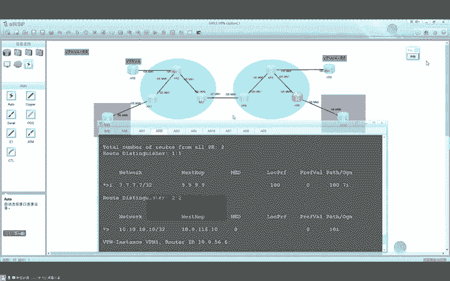

那下一跳在哪里发生改变呢？也是在这一段，这踢过来在这里边。😊，是吧然后十过去的时候呢，在哎哎。嗯嗯。这七传过来呢。是这样变的，所以说9八针等于99针等于6都得做下一条不变。

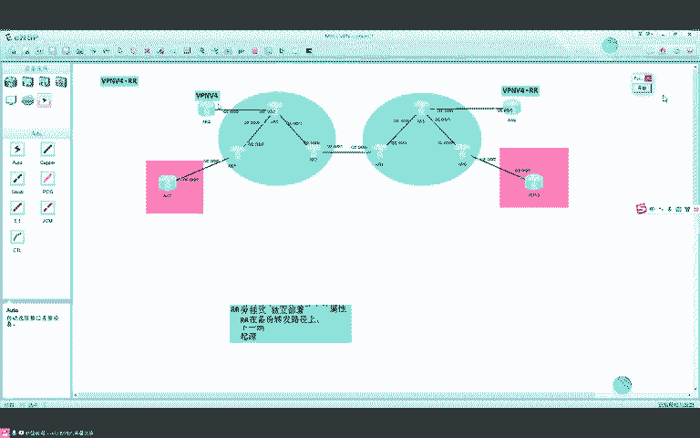

是吧所以说我们先做一个方向。V一批。100。IPV4family vPV4。PR9。9。9。9。不让他变。然后针对于9这边呢，BGP200。嗯。6。6。6。6。是吧不让他变。

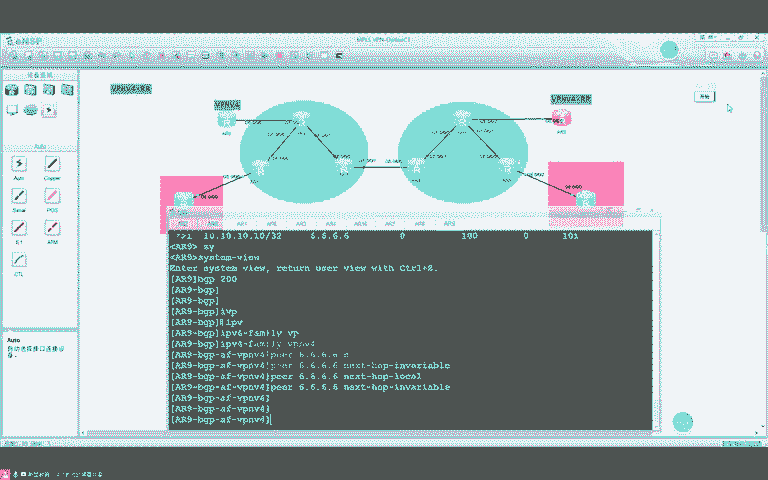

那反过来是不是也要走啊？啊，因为你十也得传过过去啊。

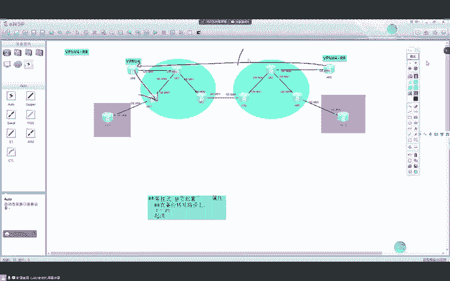

所以我们在酒上呢还得。P尔8。8。8。8。然后在8上呢，还得。721。1。1。1。是吧。做完之后，我们再到6上来看一下。嗯，吓一跳还得酒，还没刷新过来啊。呃，我们让。在R上refsh BGP哦。

你sport。Eport is part。我来一遍啊。new flash BP哦 eastport east part east part。好吧，然后我们再到六上来看一下。😊，下一跳就变成了1。1。

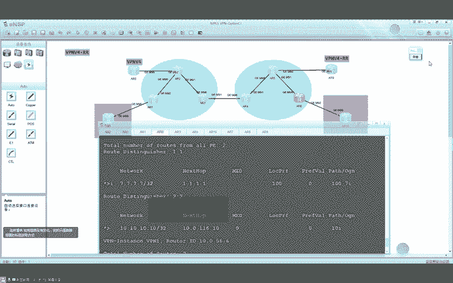

对不对？变成了1。1之后，我们再用1。比如说老师我片呀杠A10点10点10点10。

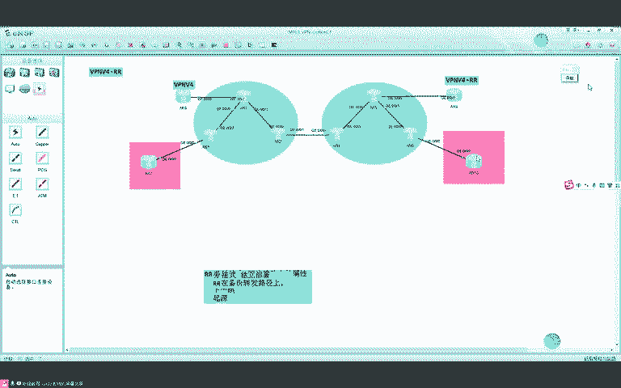

到。7。7。7。7。

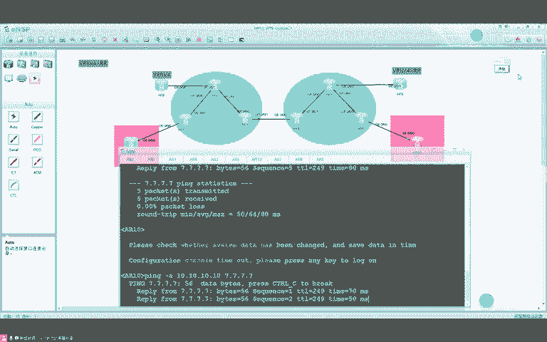

能不能通啊？可以吧。那大家告诉我数据平面有变化吗？有没有啊？没有变化啊，因为这个路由跟一直接给我传过来的没有任何区别，对吧？吓一跳还是能吓一跳。😡，对吧所以说数据平面的过程呢依然是一样的。😊，好吧。

那这就是option C带R的场景。😊，你的明白。这里明白的同学敲一啊，都没问题吧。😡，可以吗？是吧。然后我们来看一下，这时候再看C的介绍。😊，啊，你就能看懂了。对，刚刚为啥没带大家看呢？😊。

就你们要有这个实验呢，你就感受不到。😡，那首先C2呢跟C一大体相似啊，我们可以感受到了对吧？但是在C一里面呢有三层标签，有4万标签，有BDP的，还有LDP的。而C2呢只需要两层是吧？我们刚刚也看到。😊。

到。C2里面呢是ASBR收到对端ASBR发来的标签路由，这是三，这是4。四是ABRABR收到对端的ASBR给它传了一条标签路由。😡，对吧我们配置策略就是在MPS4下。😡。

未带有标签的BGP路由产生LDP的表现。😡，是吧。啊啊，不对啊，这个是范案一的啊范案一的。范一的是配置策略。😡，产生一个新标签发送给ASN的PE或R对吧？😡，我们在这里是不是要进行标签路由的协商啊。

在CE里面556。😊，这里开这里开。对吧这是在C一的解决方式。😊，而方案二中呢。让四是吧ASBR。触发MPS为BDP路由发标签，就是我们把它引用到IDP啊，把这俩一缝合。😡。

为带有BTB的标签路由呢产生LDP的标签。对不对？因此，在AS的PE上看，去往对端PE的LDPRSP。比如说就是我们在AS的AR6看对端PE的1。1的RSP。😡。

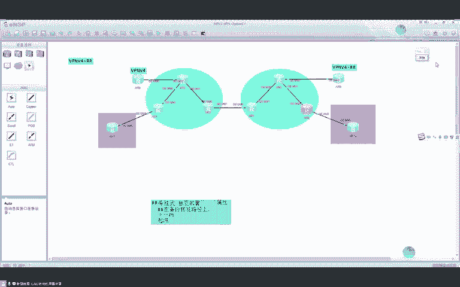

咱们看到的呢就是LDP的LSP1。1。

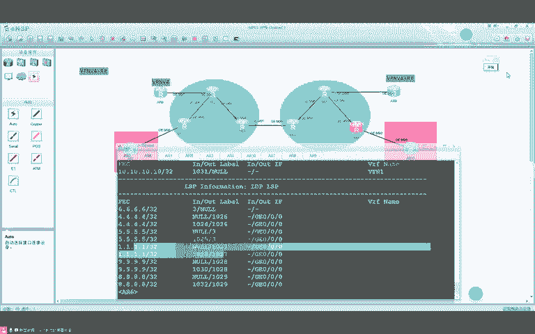

对吧这时候你再去看这句话，你就能看明白了是吧？方案二也支持R的部署啊，刚刚咱们已经很快的把它做完了。😊，好吧。呃，那。这几个大家就不用看了啊，课下可以去瞅一眼啊，实际上没啥区别啊。😊。

那我们主要来看一下C方案总体的一个特点。所有的C方案呢，无论是C1还是C2。😡，对吧无论你带不带啊。😡，啊啊啊不对啊，这是不带啊，就是在入口P和出口P之间直接进行交换。😡，啊，这里应该说是。

对吧所有的C方案。那么无论带不带啊，那么我们都是直接。啊，不是啊，都是ASBR。不传递VPV4路由的。抓。😡，所以这句话说的本身也没错啊。😡，能懂吗？就是VPN路由方案C的特点。

VPN路由在入口P和出口P之间直接交换，这是我们没有R的场景。😡，我们直接这样去传，但是有R的场景，你是不是传给RR再给对面R，对面R再给P呀。😡，是吧这句话本身呃说的没错。😊，好嘛。啊。

但是没有把带有R的场景给他。塞进去。😡，好吧，那如果带R的话，就是。P到RR到R对吧？R再到P。😡，那VPN的路由信息呢只出在PE设备上啊，这里又没有考虑到啊是吧？嗯。

这里应该是没有考虑到R所列出来的对吧？😊，G合ASBR呢只负责报容的转发，中间域的设备呢不支持MPSVPN业务，只需要支持MPS转发。ASB啊不再成为性能的瓶颈。这里主要就是因为我们的ASB啊。

它不再去储存那些VPV45了。😡，啊，因此，跨域的optionion C呢更适合跨越多个AS的时候使用。因为我们跨越的AS越多，ABR要承载的路由就越多。是吧。AB啊不承载路由。

我们就可以用option C这时候你跨多少个域呢？嗯都没问题。😡，对不对？好吧。然后同时呢更适合MP24的负载承担，这里是为什么呢？😡，这里我要给大家说一下啊，哦这是跟线网环境而定的。我举个例子。

比如说我们去往4ASBR正好有冗余的链路。6压的BDPLP或者说他压的LDPLP在AS内能不能负载？😡，他不的。可以吧。是吧他是可以进行负载分担的。能不能明白？那反之，当流量到达了这个AS之后。

三去往A21能不能也负带分担？😡，也是LDP啊，对吧？BDP的到这停了，它换成LDP的1。1。😊，这里也可以附带分担。好嘛。因为我们的吓一跳呢，直接是对端的PE。😡，对吧只要有对端PE的。

首先在AS内部呢，我可以基于LDP的负载。对吧在到达另1个AS的时候，也可以去LDP的负担。😊，对也就是说他的优势很明显。好吧，那比如说。어。我想想啊。😊，呃，如果是这样的话。啊，就是这样好吧。

我给大家说一下啊，我们来看一下啊。😡，比如说是这样的话，首先我们来考虑。😡，如果上面跟下面是等价的。注意啊。嗯，注意啊，我只是做个假设啊，上面如果跟下面是等价的。😡，我举个例子。

A21收到陆游看到吓一跳。😡，是谁啊？6。6。6。6。那这时候AR1去往6。6有没有负载分担的路由？😡，有没有？😡，假如说三给RE传了，然后这个假如说是1111也给RE传了。

如果我们在RE上开启了BDP的负载。😡，BDP的RSP有没有负载分担的路由？😡，有吧有对，没错。😡，那在这时候注意啊。哎，上面能不能去往6。6，下面能不能也去往6。6。

也就是说AS之间的链路能不能也复载啊？😡，是不是也可以啊？这个大家明白了吗？😡，可以是吧，刚刚是怎么负载的？刚是我们1个AB啊，基于LDP的在AS内负载。😊，但是当我们有多个ABR的时候。

能不能在AS之间负担？😡，是不是也行啊？😡，是吧刚刚咱们是这样的。😊，这样的话，我们只有1个AB啊，所以说A内可以负载。😡，对吧那我们有多个ASCBR的时候，AS之间啊也能够提供一个负载。😊，啊。

这就是C方的啊很大的一个优势。呃，但你缺点呢是端到端的PE管理代价比较大。😡，这里又没有把R考进去考虑进去。😡，他的意思是，比如说我这里有好多个啊。每个人都要跟AR6建立1个BDP邻居。

是吧P就要建立好多个BGP连居，负担比较重。但是如果说咱们有了R之后，大家只跟R键R去反射，这样就简单多了吧。好吧。啊，所以说课件这个场景啊，他没有把R考虑进去啊啊，但是大家要懂它的意思。😊，呃。

然后最后我们来看一下啊三种方案的一个对比嗯。😊，啊。A呢。这就是重复前面的啊，优点就是配置简单，ABR不需要运行MP24，也不要进行特殊的配置是吧？这个咱们在讲义的时候给大家说过。😊，呃。

缺点呢就是可扩展性比较差。ABR需要维护啊需要管理所有的VPN路由，为每个VPN创建VPN实例。将导致ASBR上的VPNV4路由数量过大。啊，并且呢由于ASBR之间是IP转发。

要求每个跨域的VPN呢使用不同的接口。可以是子接口，物理接口跟捆绑接口。😊，是吧也就是说在A里面，它主要的一个缺点就是可扩展性差。这之前也给大家说过，首先ABR呢呃唯凭实力，每个用户都要有一个对吧？

还得有一个接口啊，你甭管你是子接口，物理接口跟呃聚合口，反正你都要有一个是吧？就逻辑分离的接口。😊，是吧那如果我们都跑一个子接口的话，这个子接口这物理接口故障了还挺麻烦的。就所有用户的。😊。

唯品业务都端。是吧而且我们新增了这个站点之后呢，AB啊还得做重复的配置。😊，对就是它扩展性嗯非常差。😊，但是呢在需要跨域的VPN比较少的时候，咱们可以优先考虑。大家觉得为什么要优先考虑啊？😡，为什么啊？

😡，简单。能懂吗？简单啊，不是便宜啊，是简单。😊，对，没错，这就给你。😡，呃，比如说是吧啊这有10块钱。😊，嗯，跟这有1万块。是吧。啊，这样不行啊，这个钱是吧呃可能大家就选1万块了，甭管你干什么。

你肯定选1万块。😊，呃，那这个例子还有点不太合适啊，是吧，还不太合适。😊，对吧。反正这里大家体会一下，就是简单好吧，更实用。能明白？如果你有B啊，用C啊就。呃，维护啊配置啊都比较麻烦。

但是B方案呢不同于A，就是它不受互联数目的ABR互联链路的数目限制了。但是他们还有一个缺点，就是都有的是ABR负担过重。😊，是吧就是B。它相比于A来说，能够解决A的哪种问题啊？😡，哪种问题啊？

大家觉得什么问题啊？就是互联链路的占用问题。对吧其次呢就是当我们新增站点的时候，ABR如果使用B的话，ABR不需要进行重复的配置了，它直接通过VPV4路由啊，甭管你是哪个VP客户的都能传了。😊。

是吧就是扩展性稍微耗高一点。😡，对吧但是呢也有一定的问题，就是ASBR的负担重，他俩都有通病。😡，是吧不是一家人啊，不进一家门啊，到底都是A呢还是B？😊，是吧所以说呢又延伸出来C啊，这就像。😊。

这个人类的社会进步一样。对吧跟这个人是有很大关系的，就是有了AA发现了问题就有了B对吧？解决A的问题啊，B发现了问题就有了C啊，解决B的问题。😊，好吧。所以说C呢。😡，他就不再受ASBR。啊。

就不再通过ASBR传路由了。对吧直接在入口P和出口P之间交换。啊，这个刚刚带大家都看过了啊。😊，这实际上。就是刚刚这句话。啊，1234。1234对吧，中间这个两行嘛。是他俩是一样的。

这就相当于把每一个每一个方案的特点呢最后又复制到这里了。😊，好吧，那这就是三种跨愈方案啊。那这三种方案呢嗯。目前工作大家应该都能见到，但是注意一点。呃。卡是不卡？好吧。考试不考。所以说针对于这一块呃。

😡，大家课下啊去做做实验，好吧，理解一下。能不能明白？嗯。然后的话。咱就没啥了啊。如果你要想尽快考试的话，这块啊就拿不稳也不耽误啊吧。但是如果你工作中项目上有见到的话，嗯，还是最好学一下啊。

这是给大家建议啊，对吧针对性的去学。😊，好吧，因为咱们就是技术啊很难速成啊，就是大家报班呢只是省去了踩到很多坑点。😊，对吧啊你比如说老师研究技术的时候呢，可能啊研究的方向错了，对吧？

或者说踩过了很多坑啊，最后做了总结呢，把总结性的知识交给你。😊，但是呢啊你要真正的把这个东西完全掌握，这个是需要时间的。好吧，嗯，那。之前就有同学找我说啊，老师这个呃跟不上课程进度啊。

所以说大家针对性的去看啊，如果你工作中遇到啊，你就好好学。😊，然后如果工作中没遇到的话，嗯，学了之后做的实验。是，嗯然后就没啥了啊，学了之后做的实验以后用到再看看就行了。😊，好啦。呃，B。C都有R选谁？

看你跨域的这个邻居多不多啊，你要用户非常多的话，你肯定选C啊。😡，对吧。因为C它不受ASBR这个路由的限制啊。ASBI也不保存路由吗？好吧。C1C2有什么适用场景的不同吗？嗯，这倒没有啊。

就看你怎么样去用了。😡，比如说原先我AS内就有BDP全互联。😡，那这时候你用BDP就更简单一点嘛。😡，说吧你只要协商传递标签路由，然后把这个标签路由的传递能力开启不就好了。😊。

是吧比如说我现在是一块新网啊，老师我不想配BGP啊，太麻烦了之类的那这时候你可以不配嘛。😊，能不能明白？好吧，他俩之间没什么大的差别啊。😡，好吧。呃，C一有什么C2无法比较的优势吗？

C有有什么比C2无法比较的优势。这个我觉得都是一样的，他俩之间没什么大的差别啊。😡，是吧。你要C2就好理解一点。对不对？但是你涉及到BTP跟ITP的双向引入啊。😡，我举个例子啊，比如说在我们的。😡。

C一里面C一直接通过BDP试盘。我假如说啊我有两个。😡，各位同学认真听啊。😡，比如说我C一里面有2个ABR，我2个ABR都可以传出去。😡，然后我们不涉及到跟IGP的互相引入。

就是你需不需要考虑环路的问题啊。😡，需不去啊？CE里面不需要考虑吧，因为其实你这样传回来A pass防还。😡，但在C2里面，我们来看。😡，C2里面，比如说我们要把BDP导入到ISS。

那这边也把ISS导入到BDP啊。😡，是不是啊？刚刚我们是network，但是你当你的PE路由数量非常多的时候，你是不是更希望导入进去啊？那这时候它涉及到防还问题啊。😡，所以这里大家能够明白吗？

明白敲一啊，这里没问题吧。😡，对C1C2里面，因为我们涉及到双向路由引入啊。😡，对不对？那ABR比较多的时候呢。呃，那你这个侧略还得再再寻觅寻觅。OSPF也一样啊，总归就是IDP跟BDP的双向引入嘛。

😡，是吧。所以说如果你要用这个。呃。要用C2的话，SBR你连的比较多呢，你还得再寻觅寻觅是吧，别搞环路了啊。😊，嗯。呃，MP4不考跨越啊，但是普通的MP4像hbsbook啊，这些还在考。😊。

R旁观浪费钱，不旁观R压力大，怎么搞？😡，辞职吧。辞职吧啊，不干了，让领导自己干啊。😊，这种啊。单摄也很正常啊，你像小白孩说的这种。😡，呃，确实是这样啊，但是没办法你。😡，是你要解决问题。

你肯定得花钱啊。😡，但这种客户也挺多的，是吧，不愿意花钱，又想什么事都有。😊，这种你只能跟他沟通沟通啊，这个没办法啊，小白白啊。😊，是吧你想减轻R的也你想独立旁挂部署R呢呃还不想买设备。😊，嗯。

这没办法，这就想你让马儿跑，又不给马儿吃草一样。😊，嗯，是吧。行，同学们嗯，这里大家都明白了吗？😊，呃，下一跳改变跨域的啊。对，没错。😊，目前是这样啊，小白白。😊，好吧，呃，然后其他场景我还真没见过。

你比如说配置这个吓一跳不变的。😊，这我还真没见过。😡，🤧嗯。

呃，这里的拓普呢我也给大家保存一下，好吧，然后你们课下呢去做一下这个实验啊。😊，这节课可能实验有点多。最近几节课一直在做实验是吧？😊，每天敲几小时。あ。没事啊。是吧。这是实验组。

接下来我们下节课就开始讲Qs了啊。😊。

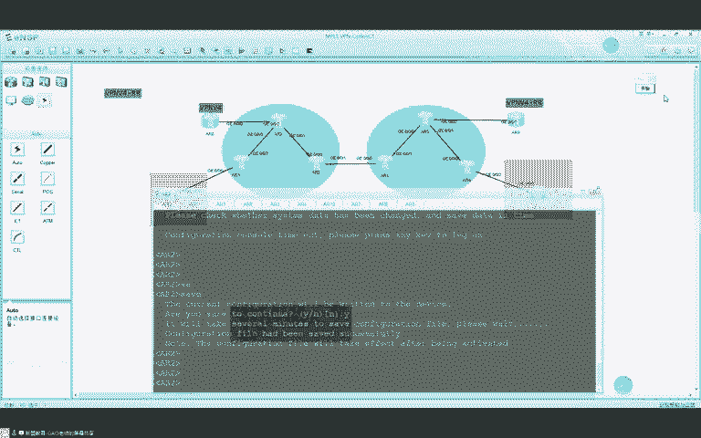

呃。Qs呢就是理论多啊，实验不多啊，理论非常多啊。😡，就跟你听天书一样，理论非常非常多啊，但是呢就做不了实验。😊，好吧，呃，下节课呢我们讲Qes啊是吧MP24大家把实验做完是吧？啊，做够啊，做够之后呢。

下节课我们来讲这个Qs啊。😊。

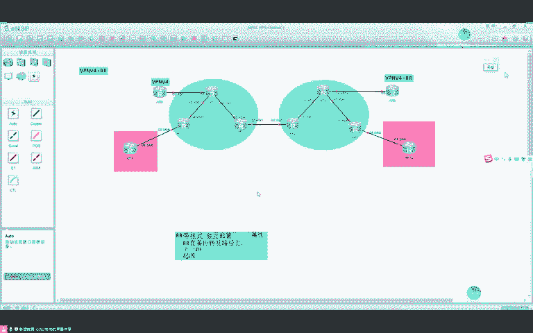

呃，票s目前在考。对，目前在考就占了3分啊，占的分值不多。😊，啊，case目前考试的时候有啊。😊，嗯啊啊，对，没错。啊，就给老板限诉的。不是给老板限速啊，你应该是给老板加速。啊，然后给你自己限速啊。

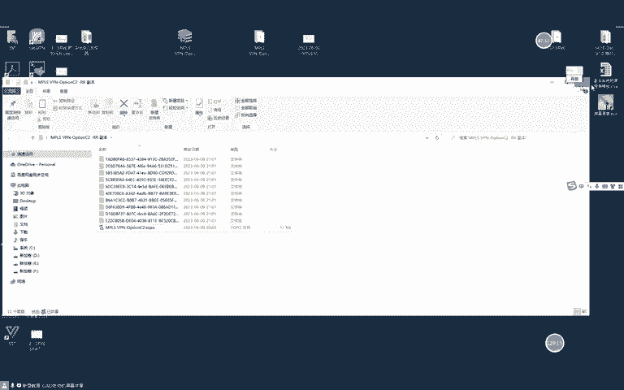

嗯。好，同学们，我们今天就讲这么多吧，准备下课吧啊。😊，到点了啊。正好周五啊啊，大家也可以休息休息啊，出去喝个啤酒。😊，是吧到季节了。对不对？你看今天来的人就比较少。😊，H。是吧应该出去喝啤酒了啊。😊。

嗯。🤢，嗯，好，同学们，咱们今天就讲这么多，好吧。呃，然后我给大家放首歌，咱们就准备下课吧。😊，我备下课了啊。😊，哎。好好，同学们，拜拜。拜拜拜拜，咱们下课吧啊。😊。

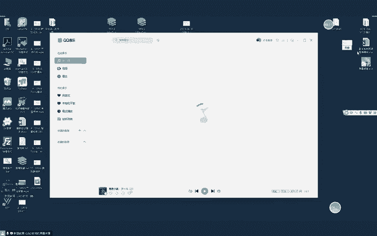

🎼假如你先生来自武钢小镇。🎼请问你是否看见我？🎼我叫着主。🎼年后。🎼就生活的那家小杂。🎼的现实。🎼爱情。🎼看着我。🎼想到。🎼你就是。🎼有生有心。🎼全成。🎼我的家我的家乡。🎼不法理解。🎼飞飞。

🎼おじちゃん。🎼你家乡。🎼你先生回到。🎼不是我想象的。🎼天他。🎼我再度。🎼都知。🎼看清楚。🎼微笑。🎼我的家。🎼小起。🎼我的歌。🎼年轻人。🎼我的家。

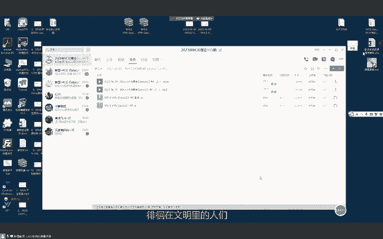

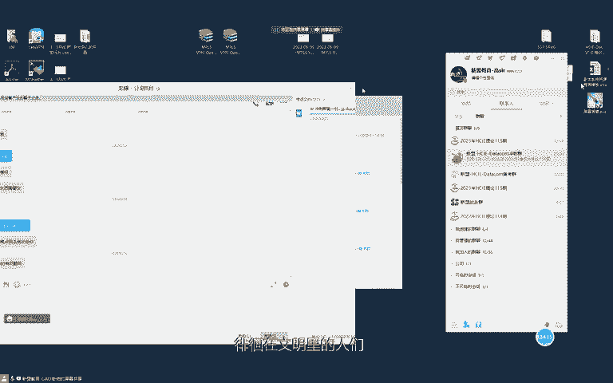

🎼假如你现身来自。🎼放手指。🎼请问你是。🎼看着我。🎼我叫着主。🎼就像活的那家小杂。🎼不现实。🎼结婚的是。🎼看着我。🎼想到。🎼你就是。🎼有一颗善良的心。🎼全唱。🎼我的家我的家乡。🎼我理解。🎼big。

🎼じゃ。🎼我的家乡。🎼我会轻福。

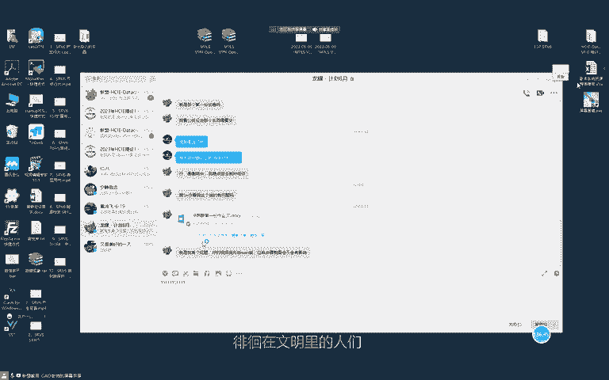

🎼你先生回到。

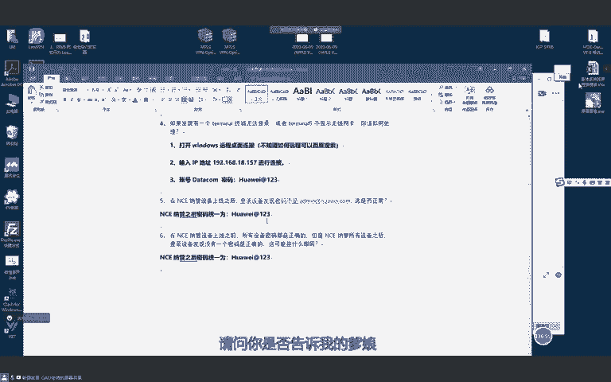

🎼不是我想象的。🎼变天堂。🎼你我再度。🎼清楚。🎼不想。

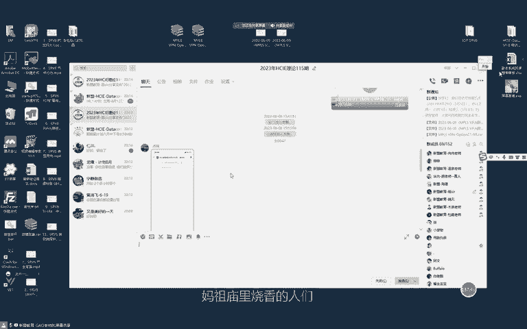

🎼我的命。🎼年轻人。🎼我的家。

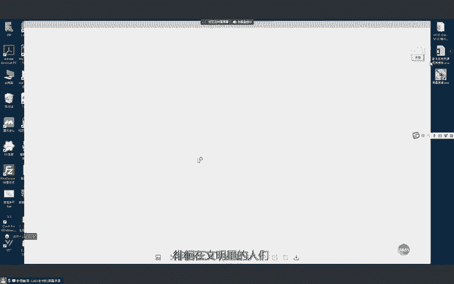

🎼假如你先生来自。🎼放守着。🎼请问你是否看见我？🎼我叫着。🎼就像。🎼回家小洒。🎼不现。🎼婚是。🎼看着我。🎼想当。🎼你就是。🎼喧场。🎼我的家我的家。🎼把你接。🎼Aとめ。🎼的。🎼飞。🎼おじちゃ。🎼在家乡。

🎼你先生回到。🎼不是我想象的。🎼点天。🎼我再度。🎼走着。🎼看清楚。

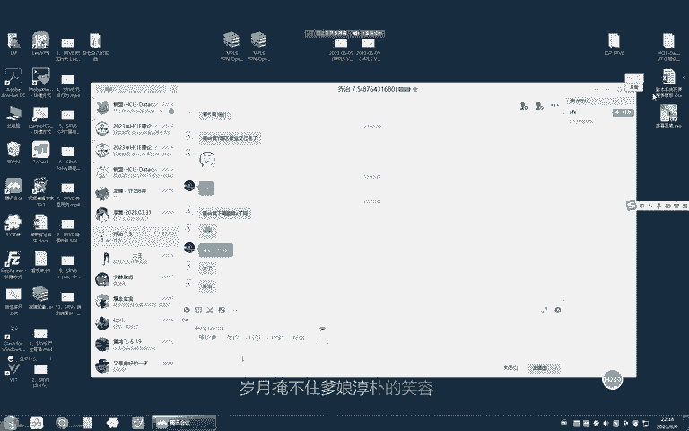

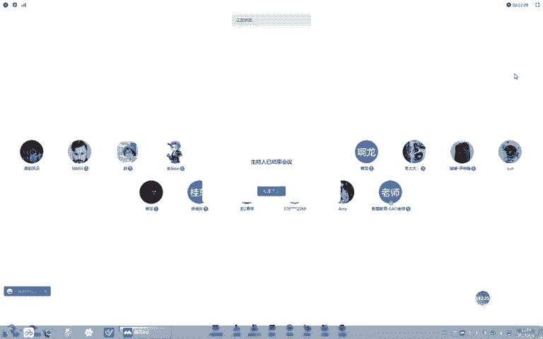