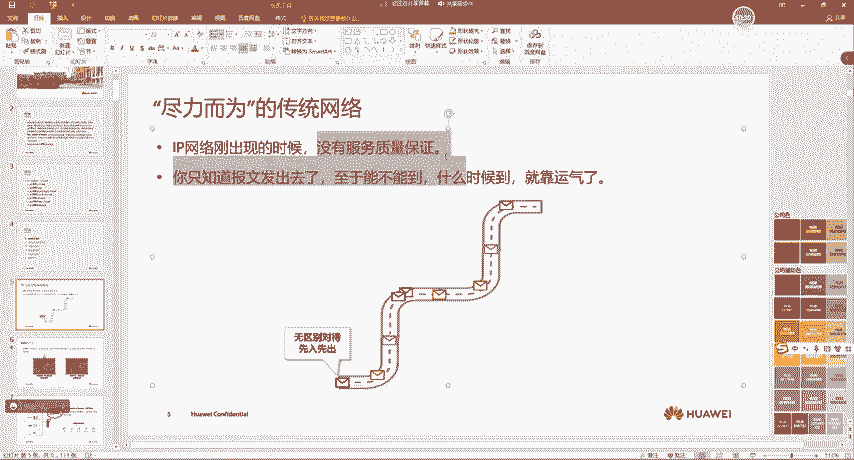
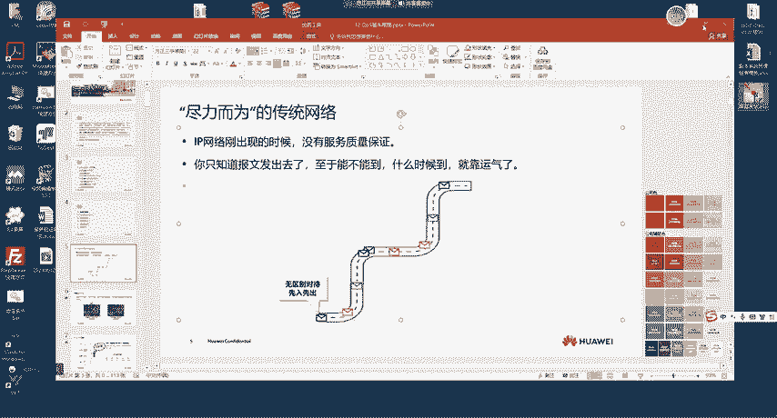
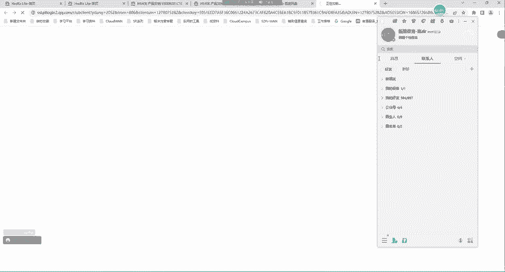
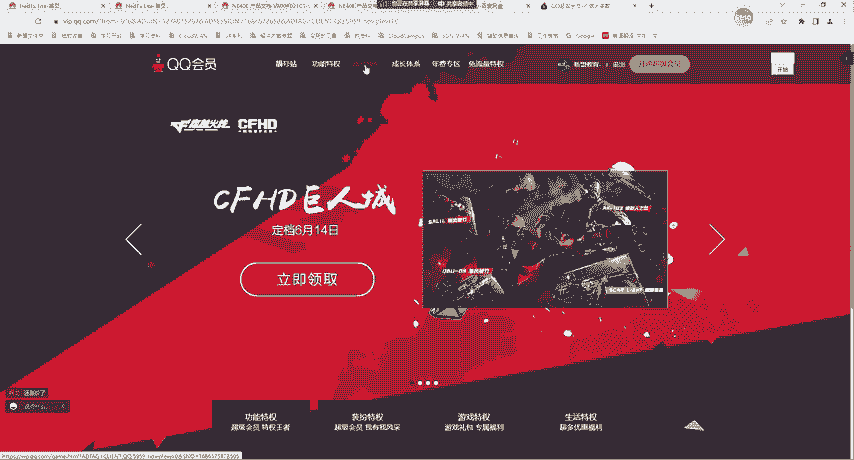
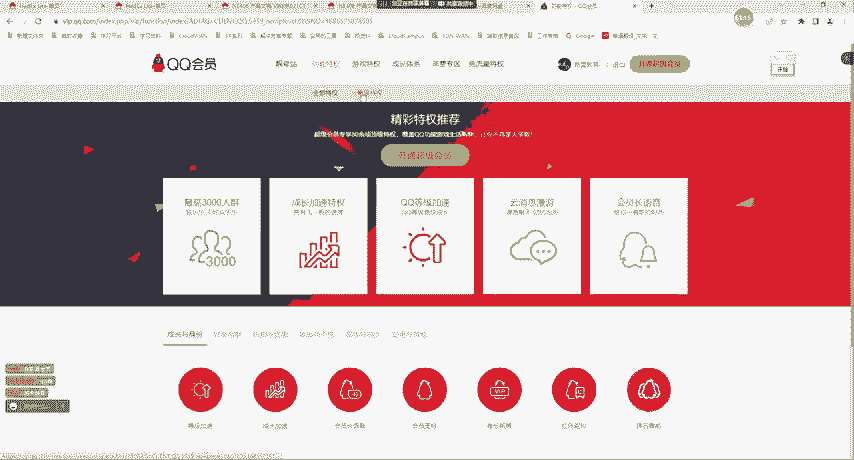
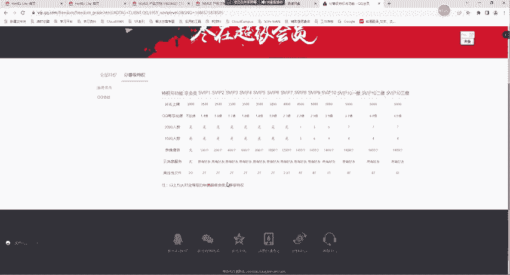
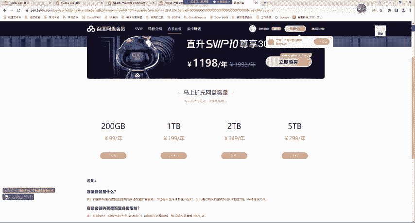
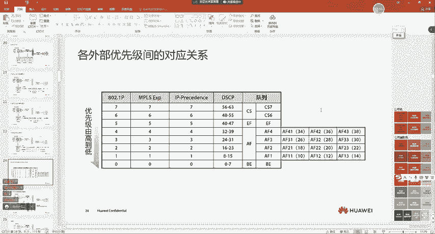
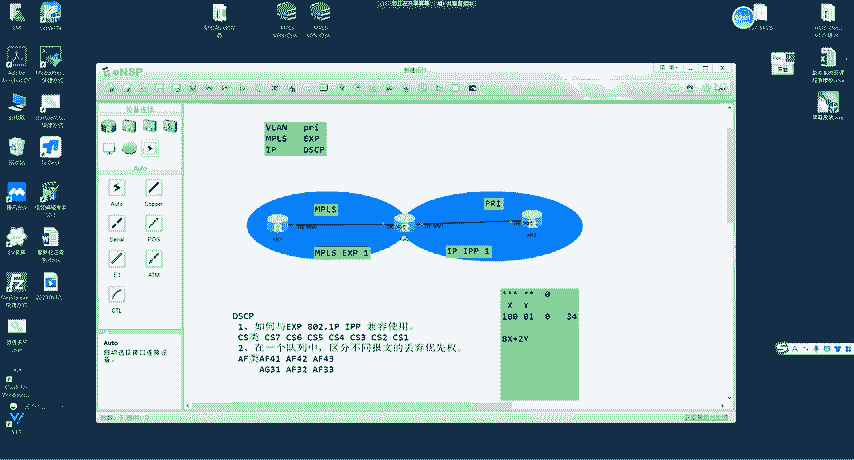
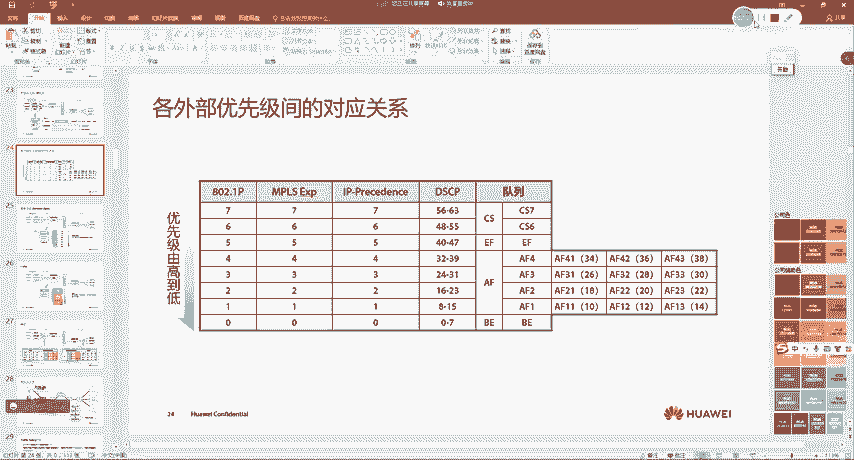

# 2023 新版华为认证HCIA+HCIP+HCIE全套视频讲解！一套视频让你从入门到精通！CCNA／CCNP／CCIE技术提升同样适用！ - P123：（持续更新）HCIE Datacom - 59.QOS-服务模型，原始标记 - -Book思议8 - BV1W8411A7z8

我刚问过了。对。好，同学们，呃，咱们接下来从这节课开始啊，就去讲一下这个Qes。好吧。呃，这个技术呢以往期的同学学习的一个经历来说啊，呃，会学得比较难啊，但这个技术呢因为它比较抽象啊，呃。

这里呢大家先做好心理准备，好吧，然后咱们1。1点来看啊。😊，嗯，我们来看一下吧啊，就是每个胶片前面呢都有一个前沿对吧？呃，Qs这个技术呢大家可能也听过很多次啊，那我们来看一下它究竟是干什么事的，好吧？

呃，这个实际上啊这个技术大家在日常生活中应该经常会接触到呃，或者说你听说过呃，比如说你在做项目的时候呢，呃或者说你在公司的时候，有时候你可能会接触到一个概念叫做限速，对不对？😊。

那这时候我们可能就去想啊，限速啊，我们通过名字呢很容易去体会到它的作用，就是把速率啊进行一定的限制，对不对？那这个限速这种技术呢，比如说我有100兆的开宽，我限制你就是是用十0兆是吧？

那这是我们平常对限速的理解。但是如果我们真正去想的话，比如说老师啊限速哎，那它是怎么样做到限制的呢？😊，是不是啊？那就相当于我们在呃有一辆车一样，对不对？比如说我们说这个车超速了。对不对？

那我们怎么样去认为他超速了呢？😡，是不是也就是说一定要对它的速率啊，你是有判断的，就是你知道它当前的速度是多少。😡，对不对？那网络流量我们也是一样啊，网络流量的速率呢，我们怎么样去计算是吧？

以及我在给它限速的时候，我靠什么去评估它的速率。对不对？那这种呢都是未来我们在Qes中会去学习到的，就是它真正的实现原理是我们通过Qs的一些技术去实现的。😡，那Qs是不是只用于限速呢？实际上并不是。😡。

就是随着网络的发展呢，有时候我们可能要求的不仅仅只是限速。😡，是不是还要求哪一些呢？嗯，就相当于这个369等1样。当出现了非常大的灾难，对不对？你发现都是老百姓呃先倒霉。😊，是不是啊老百姓先倒霉。

那然后是怎么样呢？呃，然后是呃老百姓更上一点对吧？我们把它叫做这个呃稍微的有一点的是富人是吧？然后富人在倒霉啊，哪同学的麦没关啊，自己关一下。😊，给他们。呃，大家自己注意一下啊。然后我们刚刚说的啊。

就是你会发现嗯这个富人呢倒了霉之后，然后才是这些呃上层的人，对不对？啊，我们把这些人呢叫领导是吧？那也就是一样的，我们发现其实在日常生活中啊，呃，很多东西是分369等的对吧？不管是你的阶级啊。

或者说呢你对待别人呢，也可能是分369等的，你比如说像医院是吧？医院有门诊，有急诊，你有些着急的这个病人呢，他就得首先去看病。😊，对不对？所以说我们发现啊有些的人啊。

他是有优先权的那在我们的网络中也是一样，网络中不同业务类型的豹文呢，他们的作用可能是不一样的。比如说。嗯，我的视频是吧，我公司的主要经营呢就是视频。什么视频呢？比如说公司的主要经营在直播上。对不对？

他是一个呃做直播的这么一家公司。那么在这家公司里面呢，他们对于视频流量的要求就是非常高的。好，大家稍等一下啊。😊，好，我们开始好吧，那刚刚我们说到啊，那比如说这家公司呢主要的经营是在嗯抖音直播上是吧？

嗯，可能大家比较喜欢看对不对？啊，买买买是吧啊，上链接啊，老师就平常回去看啊，有时候啊一激动就买了一些东西，但是对于这种公司啊，我也想一下，实际上对于他们公司来说，视频业务是很重要的，对不对？😊。

然后我们再去考虑，那除了这种，那比如说有些公司呢呃是吧现在有这种公司啊呃花7块钱啊，6块钱还是7块钱啊，找个焦糖小姐姐是吧？我不知道大家有没有刷着过啊，呃，我这样刷抖音刷着过，好吧。

就是你找个人呢陪你聊天，对不对啊，也有干这种事的。😊，能不能明白，就是对于不同的公司来说呢，他们发展的业务是不一样的。那么业务不一样，就造成了不同类型的流量，对于公司的助要性是吧？

那你比如说像我们在给大家讲课一样，对吧？啊，对于公司来说呢啊，比如说像我们机构对吧？那机构给大家讲课的话，那视频流量就是比较重要的，是不是？那比如说老师除了视频流量，还有逛淘宝的。

那他们对于公司来说实际上没有特别重要，但是我们要去想一点网络带宽是有限的，是吧？网络带宽是有限的啊，那为什么我们说有限的呢？有些同学可能容易会产生一个问题，就是老师啊哎比如说我网比较卡，给领导说对吧？

一个G换成10个G的行不行啊，可以，这个是可以的。但是我们从宏观角度去看的，网络带宽依然是有限的，这个大家怎么样去理解啊，呃，来给大家说一下，我们来想一下啊，在我们之前网速非常慢的时候。

大家都经历过那个时代啊，😊，那时候我们玩什么电子游戏呢？啊，玩的叫红警，对不对？是吧？那时候呃玩的是这个论坛是吧？😡，是吧你上网基本就刷论坛，对吧？啊，贴吧回帖子。对不对？

那当我们的网速呃变得越来越快之后呢，我们又玩了什么游戏啊？是吧呃玩的就是你比如说像这个呃DNF我不知道大家有没有玩过啊呃，我以前小时候特别喜欢玩是吧？啊，对，留行蝴蝶剑，对吧？你会那时候玩的呢？

多是集中于在局域网的游戏，对不对？当我们的网络带宽，我们发现慢慢的去变大，慢慢的去变大之后呢，我们的上网的方式也发生了很多改变，什么样的改变呢？比如说以前我们玩红警，只在局域网的。

那现在你可以玩什么啊啊，玩英雄联盟是吧？啊，玩这种特别大的游戏，对不对？那以前你能在网上看电视吗？不行，对吧？那所以现在我们还可以在网上对吧？腾讯视频去看电视，以前也没有直播。😊，对不对啊？

以前也没有直播，那当我们的流量是吧，或者说网速变得越来越快的时候，你还可以去看直播。是不是啊？对吧那现在甚至发展到一个什么阶段呢？呃，大家可以去看到啊，有这种VR是吧？呃，还有这种叫什么AR对吧？

就是什么虚拟现实啊，这一类的对吧？那以后当网速变得更快之后呢，呃，我们现在还有新的概念叫无人驾驶，但是无人驾驶也需要网络的支持，对吧？需要提供非常低的实验。😊，对不对？那我们会发现有一点啊。

这个网络的速率对？当我们的网速不断的在进行突破的时候，你会发现有一种东西叫什么？叫应用。新的业务也是不断的在产生。当你只有2G的时候，那时候没有网络电视，没有直播，当你有了4G5G之后，是吧？

像AR对吧？呃，VR对不对？呃，网络直播是吧？那这种这个应用也不断的去产生，它一下子就把你的网络带宽占满了，就是你的网络带宽无论有多高，无论怎么样去发展。😡，对吧总会有新产生的应用把它去占用掉。

是不是你要百度网盘这个东西。😡，你多大的带宽基本都能给你吃完，是不是这个道理啊？所以我们会发现有一点哎。😡，当我去增加了网络的速度之后呢，也会有不断产生的新应用会去给它占用掉。就像一个城市一样。

你比如说像北京对吧？比如说像上海，那这种地铁线路他们甚至都有20多条线，对吧？你发现每天还是这么堵，为什么还是这么堵呢？当你有了地铁是吧，就会有更多的人去往这个城市，所以说它会更加的拥堵。

所以这个意思大家要能够明白啊，所以总结就是一句话啊，什么样的话呢？网络带宽实际上是有限的。😡，能不能明白这里明白的同学敲一啊，都没问题吧。😡，好吧，就是无论你怎么样产生，总会有新的应用把它占用掉。😡。

但是我们要去保证一点是在哪里呢？在有限的带宽基础之上。怎么样去保证不同流量的优先程度？对不对？是吧。比如说啊出现了这个灾难，我们都说呃呃。让老人和小孩子啊，还是妇女跟小孩子对吧？先走啊吧。

男人就站在前面。是吧就是我们会有一个优先权。那在网络中不同的流量的优先权，它是怎么样去决定的呢？实际上是有我们的Qs去真正实现的，好吧，所以说大家理解Qs是什么呢？就是一个优先级别的。

就我大家可以理解成就是差分子。好吧，那这就是我们所说的cuses。😡，那我们来看一下啊，在没有Q的时候，也就是说之前我们没有接触到Qes对吧？哎，老师那时候网络是什么样的呢？我们来看一下啊。

传统的网络就是你没有做任何Qs的网络呢，它都是一种尽力而为的服务。什么叫做尽力而为的服务呢？比如说我路由器收到一个报文，对吧？嗯。😡，刚开始IP网络出现的时候是吧，没有服务质量保证。

你只知道豹文发出去了，但是能不能到呢？是吧？什么时候到啊，就看运气了啊，这就是尽力而为啊，把你生下来啊，生下来以后你长到什么样子，就看你自己的造化了。😡。

能懂吗？这就是传统网络。传统网络就是我们把包发出去，我们不保证它在一路上都是顺畅的那你丢了就丢了。😡，好吧，这就是传统的网络，没有任何担保。😡，那这个担保类似于什么呢？啊，就相当于你一样啊，比如说呃。

比如说啊呃我举个例子，比如说你入职了一家公司，对吧？这个公司许诺给你，你以后会怎么样怎么样，对吧？给了你的一种保证，那这种就相当于有服务质量的保证。对不对？那在我们的网络中报文也一样。

比如说你网络中是吧，或者说你在你自己的这个公司里面，你们向运营商去买了一条宽带，运营商给你保证是吧？每天晚上10到12点绝对不会卡。😡，是吧他给了你这么一种保证，啊，你心里就踏实多了。😡，对不对？

但这个保证他怎么样去实现呢？依然要cacus。😡，所以说在没有。这个服务质量保证的网络中呢，就是传统网络中，那它是没有服务质量保证的，就是你能不能到哪看运气吧，就是我给你拉到这儿啊。

你上网体验感呢我都不管。😡，但是随着技术的进步，对吧？竞争的加速，客户的要求越来越高。😡，网络提供有质量的保证服务呢是大势所趋。这个实际上很正常，是不是？比如说有两家运营商，一个是电信，一个是中国联通。

中国电信就给你拉网线。中国联通给你说绝对不会卡，你乐意要哪一个？你想是吧？哎，老师，我晚上还打王者荣耀呢？😡，对不对？那一卡了。是吧团战的时候一卡，那不倒霉了。是不是啊？

所以说你肯定更趋向于给你做保证的，对吧？而不是趋向于一个没有保证的服务。对不对？所以说呢你站在运营商的角度去看待。😡，他希望有更多的客户是吧？所以说给你不同的保证。呃，那如果你站到自己的角度去看呢。

你肯定需要一个更加稳定的网络。是不是啊那这就是Q的一个产生背景，对吧？就是不同的客户呢有不同的要求。😡，对吧那这时候我们可以去看到啊，现在呢有很多种流量啊，有直播的啊，有视频通讯的啊，有邮件啊。

有FTP。😊，哎，那在这说候我们怎么样去给他提供带宽，对吧？提供服务呢？是不是那这时候我们要去想一下，真正影响通讯质量。的因素。啊，到底有哪些？对不对？这里给大家说一下啊。

真正在我们网络中影响通讯质量的因素。那嗯首先第一个大家应该是比较清楚的，带宽带宽影不影响？非常影响。是不是啊？哪怕我们不是搞技术的同学。那老百姓他也知道带宽越高越好。

是吧你比如说你身边有一些他不在我们这个行业内的人，那他也知道带宽越高越好，带宽越高啊，就意味着不卡。是吧所以说带宽呢影响通讯质量。那除了带宽，还有什么呢？啊，就相当于我们对一个人的评判一样啊。

哎我认为这个人呢比较好，那你不能从一个角度去看待啊，你要从多个角度去看。那除了带宽呢，还有延迟。这延迟是什么呢？我举个例子，比如说我说了一句话。😡，一分钟之后你收到了，或者说我说了一句话。

两秒之后你收到了。那这种呢就叫做延时。好吧啊，延迟跟延时实际上是一个意思。那这种就叫延迟。能不能明白啊啊，对，打游戏的都知道。是吧延时如果一旦变低，它有点什么意思呢？我们来想一下啊，延时如果非常高的话。

就是我说了一句话，一分钟之后你收到跟我说了一句话，两秒之后，你收到一分钟之后你才能收到，代表延时是非常高的。😡，那延时高会导致什么问题呢？比如说大家想一下，你在看直播的时候，延时高一点。

好像没有什么问题是吧？因为对于你来说，画面不会少，对吧？😡，所以这里大家应该能明白。但是我举个例子，比如说你再去买彩票是吧？呃，有那种，比如说网上有那种几分钟就开一次奖的。对不对？比如说你去买彩票。

你可能刚买哎，突然开奖了，或者说你还没买呢，开奖了。能不能明白这个意思啊？就是那边已经结束了啊。对，没错，就相当于打游戏一样，对吧？别人都打完了，你这边才显示出来，就类似于这种。😡，那比如说打电话呢。

打电话我给你说了一句话。😡，是吧可能10秒之后你才能听到啊。但是在这10秒以内，我就一直在说啊，你能听到吗？是吧？😡，啊，你能听到吗？对不对？那10秒之后，你收到这句话之后，你勾了我响应。😡，那我说啊。

你能听到吗？10秒之后你又听到了是吧？你说啊，我能听到，但是我已经说下一句话了，这就叫延时。😡，所以说延时也非常影响通讯质量。对吧对于特别是语音，大家觉得他对延时的敏感度高不高？非常高吧。

我觉得大家肯定都有过这样种经历，反正我是有过啊吧，有时候我打微信电话呢，说了一句话。😡，我再说一件事，他再说另一件事。这句话我已经说了都快20秒了，他才回我这句话。大家有没有经历过这种啊。

经历过的同学敲一。😡，有没有？有吧。呃，老师是有过是吧，我是有过的。😊，那抖动相当于什么意思呢？抖动就是每个包到达目的地，它的频率是不一样的。注意啊，我举个例子，比如说我说了一句话，一分钟之后你收到了。

😡，我说了第二句话，3分钟之后你收到了。那这时候我们就认为网络出现了抖动，什么是抖动呢？就是对于同一个数据包。😡，对吧就是不同的数据包啊，它到达目的地的延时时间是不一样的。我第一句话延时1分钟。

第二句话延时2分钟。对不对？那这样的话也会影响通讯质量。那怎么样影响的呢？我举个例子。😡，比如说。呃，明天要去项目现场了。是吧咱俩打电话。😊，说谁去呢？对吧？是我。😡，还是。啊。是吧还是那个人。

然后咱俩现在打电话，我说是我。😡，注意啊。我跟你说，我说是我这是两个字儿，这俩字之间呢延迟12秒10毫秒。😡，好吧。然后不是他，这时候我是不是有停顿啊？😡，对吧。那这里呢延迟50毫秒。

那你是不是听的意思就是是我不是他。😡，对不对？那如果说这个包发出去了，发出去之后呢，它是这样的。😡，是我拨。对吧在这里呢也是10毫秒，在这里也是10毫秒。那你听的感觉就是是我播对吧？是他。😡。

那意思感觉就有点不一样了吧，特别放到我们。😡，这个中国人的一种表达习俗上，我们不同的停顿意思就是不一样的。😡，对不对？所以大家能明白这个意思吗？明白的同学敲一啊。😡，懂了吗？这就是抖动啊带来的影响。

对不对？是吧那接下来我们还要说一个丢包率啊，丢包率是什么呢？比如说老师啊现在来了丢包率了，丢包是怎么样？丢包率实际上很简单，就是丢包。😊，那这里呢40%的丢包，这俩丢了是我不？😡，我给你说的是我不是他。

然后你一听到对吧？抖动加丢包，你一听是我不那对方一听，我怎么知道啊，我打电话就是问你呢，是吧？你明明说的是我不是他，那个人问你呢，是吧？😡，对吧明天谁去啊，你说是我，不是他。😡，那反之呢他一听到是我播。

他一下子就懵了。什么玩意儿啊？我问你呢，你在这是我不。😡，所以大家也明白了吧，一旦产生了丢包之后呢，那可能有些话别人说了，你就没听着，在打微信应该都有这种感觉过，是吧？或者说你在打手机电话的时候。

应该有过这种感觉吧。😡，是吧刚掉线了啊。😊，那还有一个啊同学们叫做可用性。可用性是什么呢？它是这样的。比如说。Qs我们说它是一个服务质量。那一旦网络出现故障了，你觉得它在不在服务质量范围内？😡，在不在。

一定是在的。对吧运营商，你去给他买了一个带宽，我跟你说，带宽延迟调动丢包率都非常好是吧？满足你的体验，但是可用性呢两天断一次网是吧？这个我没跟你说，两天给你断一次，两天给你断一次对吧？

但是好的时候是真好是吧？坏的时候就没有。😡，对吧那你会觉得他的服务质量好吗？你也不会觉得对吧？所以说可用性的也是网络中服务质量的一部分。好吧，那这是影响网络通讯的一些因素。那这时候我们就想啊，对吧？

老师，我怎么样能去提高。😡，用户的对于这些，比如说用户的带宽啊、延时抖动啊、调包率啊以及可用性的一些体验感呢。是不是啊？那针对于我们用Qes，如果去提高这些体验感的话。一共会有三种服务模型。好吧。

就是三种提供的方式。能不能明白，就相当于你今天晚上你跟你同事说是吧？咱今天晚上嗨一整晚。😡，对吧啊怎么样去嗨呢？有不同的方式啊，你可以。晚上吃个烧烤，喝个啤酒是吧？那你也可以去啊，比如说你唱唱歌啊。

对吧？啊，或者说出去走走溜溜是吧？啊，到外地去看看。是不是啊？所以说呢。针对于我们在Qs中也有类似的，就是我们真正要想提高服务质量的话，也有三种服务模型。但是现在呢用到的只有一种好吧啊。

就是最后一种叫做区分服务。我们来看一下啊。这几个呢都是概念类的啊。首先第一种呢叫尽力而为的服务模型。😡，那尽力而为的服模型，大家听它的名字就能够感觉出来。这里要给大家说的一点。

就是传统的网络就是借力而为的服务模型。什么意思呢？就是说白了就是没有Qes。😡，能懂吗？就是一旦我的报文发送出去之后呢，它没有任何的保障。😡，能不能懂我的意思，这就是先力而为，有就有没有就没有。

反正你来了，对，给你送走。对，这就是呃对一种平等对吧？所有的豹纹啊，享用同等的优先权。😡，但是在这时候呢，不满足我们对网络的要求。是不是啊？那这时候大家可以想象成，你在实施Qes的时候，你就是上帝。😡。

那这个豹纹呢就相当于人一样。如果你想让每个豹纹都是平等的，你就用尽力为的服模型。说白了就是你啥也不用配。😡，能明白这意思吧？但这个呢不满足我们的要求。😡，好吧。那实际上还有一种叫做综合服务模型。

这个综合服模型呢它是这样的。我们的网络带宽不是有限的吗？对吧。那综合服务模型是当我去发送，或者说当我们的应用程序去产生一条流的时候，基于5元组去确定一条流的信息。当我想要去将这条流的流量。

在网络中发送的时候。我会通过一种协议叫做IVP协议。在所有的路径上呢，都去发一个叫做pass消息啊，大家可以理解成就是预留。好吧，就是发送一个pass呢一直往目的端去传。

比如说啊这个电脑要给这个服务器去发。他在沿途所有路径呢逐跳的去发pass。发了pass之后呢，对端再给他回回一个接收消息。那。大家可以理解成一个请求一个接收。那在这个接口上呢，就会给他预留一兆的带宽。

你具体要多少兆，实际上是由你的pass消息里面去携带的。对吧这种呢我们就把它叫做综合服务模型，为每个流预留资源就是单独的给你用了。但这种呢也没有去用，好吧。第一个缺点就是它的实现是非常复杂的。

这个SVP协议呢啊也比较复杂，好吧，也比较难。😡，那第二种呢就是不太切合实际。😡，啊，怎么样叫不太切合实际呢？嗯。因为我们是基于每一条流。去维护一个绘画。好吧，或者说去预留贷宽。

那么就会导致网络中的设备呢会产生很多针对于流到带宽的映射表。是吧他要维护很多流的信息。那第三个点是在哪里呢？它的带宽是独享的。什么叫做独享的呢？呃，就相当于是吧。站着这个坑位对，但是他什么也不做。😡。

你比如说当我们去预留了一兆带宽之后，现在我没有数据要发送。那这个带宽不能给别人用。它不能实现复用是吧？就是这个东西呢是独享的。给你预留，那就只有你自己赢了，是吧？😡，所以说呢它的资源利用率不够高。

那这是综合服务模型。所以这个大家明白了吗？明白敲一啊，那这里呢也不是我们要学习的重点。😡，好吧，我们接下来要学习的重点呢叫做区分服。什么叫做区分服务呢？我们生活中经常遇到。是吧比如说你去银行取钱。

有没有区分服务啊？有吧。普卡你就大厅里排队对吧？呃，是吧？你有什么金卡，白金卡。对不对？啊，会有大堂经理给你服务是吧？啊，有单独的VIP室。对不对？啊，还给你端茶送水。是不是啊？那如果你要是普卡啊。

我不知道大家有没有这种经历啊，就是如果你要普卡，你就是大堂里排着队。对不对啊？啊，你动不动的呢啊还被别人瞟你一眼。是吧。我不知道大家有没有，反正我是有过啊是吧？嗯，我对银行的这个印象呢就是很多人呢这个。

😊，呃，就他很不耐烦。是不是啊？当然可能大家没遇到过啊，反正我遇到过。好吧，就是你会发现呢。当你的等级不一样的时候，你拿普卡，你就得到普卡的。是吧你拿金卡，你又有金卡的服务。

是不是就相当于百度网盘的会员一样。是吧你没有会员，你下载的就是慢，你有会员，你下载的就是快，那这就是区分。😡，区分服务区分的什么呢？普通用户和VIP用户。是不是啊？

所以说啊那网络中我们的区分服模型呢跟这个是一样的。😡，就是我们把网络中的流量呢分成很多的类。这个类呢有优先级较高的类，还有优先级较低的类。那不同类的流量呢得到不同的服务。能不能明白？也就是说。

当你的优先级别是不一样的时候。😡，那么你得到的服。也是不一样的。那么这个就是区分。那区分服务有一个前提。什么样的前提呢？我们想想高铁里面你二等座就做二等座，一等座做就做一等座，对吧？商务座就做商务座。

😡，是不是啊？是吧哎，那这时候我们就想我怎么要知道你要得到商务做的服务呢？😡，是吧。乘务员是怎么知道的呢？对不对？哎，你为什么能够进商务座的车厢呢？你怎么样证明你能进商务做的车厢呢？😡。

我们需要一种东西是什么车票。啊。车票。是不是啊？你有这个车票，你就得到这种服务。😡，能不能明白？所以我们想一下啊，我们平常在去买高铁坐高铁的时候是怎么样一个过程呢？

首先高铁站要把所有的老百姓分成不懂的类，是不是？你们花商务做钱的是一类，花一等座钱的是一类，花二等座钱的是一类，这是不是先分类啊？就是先把老百姓分成不同的类。分成不同类之后，对吧？那么给你们不同的标记。

给你商务座的标记就是商务座车票。对吧给你二等座的标记就是二等座车票，给你一等座的标记啊，给你一等座的车票对吧？啊，也是给你一个标记。对不对？那我们实现Q死的时候也是这个道理。首先流量呢我们要分类。

就是把他们不同的流量加以区分。比如说有视频语音FTP的。然后给他们加以标记。就是给你们不同的流量加个记号。那这个记号怎么样去加呢？在我们后面的课程中是有的。😡，好吧。然后你不就进入到。高铁站了吗？

你进到高铁站，你拿的商务坐车票，你首先有单独的。候车室是吧？呃，你上车呢也有单独的人领你去。对不对？然后当你去坐上车之后是吧？那会有单独的人怎么样给你提供服务。那你所得到的一切好的服务，它都是在哪里呀？

都是在哪里？都是在高铁的范围内。你比如说你在车站。是吧。那你在进站的时候，以及你在车里的时候。都是是不是在高铁的覆盖范围内。对吧所以在这时候你得到的服务比较好。那我们的Qs整体的模型它也是这样的。

首先呢我有一个叫做DSU。注意啊，叫做DSU。这DS域是什么呢？😡，DS域是有所有的DS节点连接组成的一个范围。对吧那有同学又问了，老师什么是DS节点呢？我们来看一下啊。😊，首先呢。报文进入到网络中。

我们都给它分类好，分类好加个标记。那你只要带着这个标记呢，所有的DS节点都会给你提供好或差的服务。因为服务有好就有差嘛。是吧你比如说你是商务做你就比较好，那二等座啊，当然我们不能说是差啊。

就是没有那么好嘛。😡，是不是啊？所以说DS节点才会给你提供这种区分服务。不是说你拿着商务做对吧？你拿着商务做。😡，嗯。对吧你跑到天安门，你跟人家说让我进去吧，人家让你进吗？😡，不让你进吧。

但是你拿着商务座，你跑到高铁站，你到那个VIP贵宾室，你说让我进去吧，人家让你进吗？让吧是吧？谁才会给你提供这些好的服务呢？在我们的网络中就是DS节点DS节点会看这些标记给你提供服务。😡，能不能明白？

那。DS节点所组件连接到一起组成的网络范围呢，我们把它叫做DS域。DS域大家可以认为就是你在坐高铁的时候。😡，你的。这个。商务座车票对吧？在哪里生效？那么这在我们的网络中就是DS域。你在车站可以生效。

你在车上可以生效。是吧你跑到天安门，你还想要这种服务啊。😡，还能不能？不能吧。对吧你出去旅游，你拿着你的商务做，你跑到酒店，你说给我开个总统套房。😡，给不给你看啊，也不开是吧？得在覆盖范围内。

所以说我们的DS节点对吧？组建到一起，或者说连接到一起组建成的网络范围呢，我们就把它叫做DSU。😊，啊，所以这几个概念大家明白了吗？😡，明白的同学敲一啊。没问题吧。

那这里呢我们设计到一个叫做DS边界节点。什么叫做DS边界节点呢？比如说你要得到好服务了，拿着商务做车票，你的边界节点在哪里？😡，就在高铁站。是不是啊？明白了吗？就是你从哪里进入到DS域。

那个就是边界级点，好吧，啊，就类似于ASBR一样。😡，好吧，那这个呢就是我们区分服务的一个思想。总体呢。就是先分类分类打标记。打标记之后呢，你在DS域内由DS节点给你提供。中好差非常差啊，或者非常好。

就是等级有很多啊，等级有很多，就是DS节点在DS域内给你提供不同的服务。那这就是区分服模型。😡，好吧，所以这个模型大家明白了吗？明白的同学敲一啊。😡，没问题吧。然后接下来我们来看啊常用的一些分啊。

就是区分服务模型下的一些技术。呃，比如说我们做限速啊，对，当然限速只是一个大白话啊，那实际上限速是由不同的技术去完成的。比如说监管对吧啊，整形。好吧。那。呃，出入口都有。好吧，要根据流量的方向去判断。

像庸测避免啊，这里大家一看就懵了，对吧？老师什么是庸测避免啊，这里low一眼就行了，就是我们常用的技术呢有限速对吧？啊，有庸测避免啊，还有庸测管理。那这就是我们在区分服务中常用到的技术。😊，啊。

具体他们是什么呢？我们在后面的学习中。会慢慢的去携带。然后我们来看一下啊，这是整体的一个模型。这里可能很多同学一看就懵了，这里一个豹纹。只要我们做了Qs之后，他在设备上的一个处理过程。

分类之后令排筒是吧？令排统之后car卡之后remark是吧？然后其他处理啊，比如说拆封装啊，解封装啊。对吧啊查找路由表啊啊，然后WRED啊，然后进队列啊进队列之后调度啊，出队再做GTS。啊。

那这是整体的一个模型。那我们未来在学习过程呢，我们也会随着这个模型1。1点的学到后面。😊，然后我们来看啊。嗯。这里有问题，我们来看一下啊。三种服务模型分别哪些？首先，区分服务模型。综合服务模型。对吧。

见力而为的副模型。网络服模型。ABC没有D啊没有D。嗯。好。嗯，然后我们来看一下啊，刚刚我们说了。呃，首先大家要拿住一点啊，就是。任何的区分服务都要有标记。对不对？就像你进高铁站一样，你没有高铁票。

没有商务做车票呢。那都是扯淡。对吧如果说高铁站不能把你买了商务座的人给你标出来。那不是代表所有人都可以去做了吗？是不是啊？所以说Qs也是一样，设备要想对不同的豹纹加以不同的优先处理。刚开始就要进行分类。

就要把不同的流量能够识别出来。识别之后加个标记。对吧那加上标记之后呢。呃，我们根据标记在内部提供好的服务。是不是啊？那。现在我们来看对吧，为什么需要分类和标记。实际上很简单。分类和标记是Q的基础。

如果你不能把这个豹纹识别出来。能不能做区分服务？是不是不行啊？是吧肯定不行。所以说那我们怎么样去分类呢？对吧？老师又怎么样进行标记呢？我们来看一下啊。那我们在对报文进行分类和标记的时候，有两种方式。

一种呢叫简单流分类。还有一种呢。叫复杂流分类。是吧听名字大家就可以感受到，老简单利分类复杂啥意思呢？是吧？啊，简单利分类更简单一些。😊，那他简单到哪里呢？我来给大家说一下。呃。

首先微烂的包我们学过MPS的包，我们也学过IP报文的包，我们也学过。是吧但是我们学这些包的时候，大家应该都知道一个概念，就是他们里面都有一个字段啊，可能在你之前的学习过程中啊，老师会给你讲是吧？

做Qs的啊，做Qs的做Qs。😊，对吧那具体他怎么做的呢？实际上它就用于在分类中。那是怎么样的呢？在微烂的包里面有一个标记。PIS段大家还记得吧？那这个PIS端它就是一个标记。我想一下啊。

就是在不同的豹纹里面呢，微line的包里面有个PIR。那对于MPS的包呢，里面有个ESP这我们刚学过。对于IP包呢。它里面有1个DSCP值。是吧这是我们之前在学技术的时候呢，都看过这几个包是吧？

那时候就不理解做Qs的怎么做的。实际上他们就是用于分类和标记。第一种分类方式啊。是这样的，它的分类比较粗暴。他就是。注意啊，各位同学，这种我们一般把它叫做外部标记。什么叫做外部标记呢？

就是豹纹原来带的一个标记。😡，在不同的包里面呢，他。在不同的位置。是吧。那简单流分类很简单，怎么样简单的呢？它就是。根据报文。携带的。外部标记。进行分类。比如说我粗略的分类怎么样分呢？😡。

PIR等于一的，我能不能认为一类？是吧。有人就觉得哎，老师这样分的是不是太粗暴了？😡，是吧PIR等于B的那什么流量都有啊，你不要管它粗不粗暴。😡，你就管简不简单就完事了。😡，是吧。PR等于一。

你们就是一类。是吧PR等于2，你们就离类PR等于3，你们就离类啊，就这么简单。😡，好吧，那这就相当于你在一个班级一样，那老师让你把不同的人归类起来是吧？或者说不同的作业归类起来啊，交给是吧？啊。

就是不同的作业呢，你分一下类，待会儿让老师看一下，他没跟你说怎么分。😊，你简单点是什么呀？男的一类女的一类。😡，最简单吧。是吧。那还可以怎么样啊，是吧？要满足老师看的时候舒服是吧？做的好的一类。

做的坏的一类。😊，对不对？写的工整的一类，写的不工整的一类。😊，行不行？可以吧。你不要管他，先我们先不要管它合不合理，你就管它简不简单就完事儿了。😡，是吧你来了一个包有个标记。

我就认为你们标记一样的是一类。😡，对吧这就是一种非常简单的分类方式。是吧但是简单流分类，我们发现。老师不太适用吧。为什么不带适用呢？😡，有点不太适应是吧，什么意思呢？老师啊。😡。

我们公司老板发的流量跟我发的流量呢有一个标记。是吧。老板现在要网速快，哎，但是呢。如果我俩归为了一类，它的网速可能就慢了。是吧。哎，那在这时候好像有点不太合适。😊。

是吧就是有时候我们会发现啊简单流分类是不是没有办法把豹纹精确的区分啊？是不是？因为豹纹原始的标记，我们来想一下啊，之前我们接触的豹纹。😡，这些标记到底取值为多少？可能大家没有注意过，但是我可以给你们说。

😡，这些标记呢都是随机的。就是有你的应用，比如说你上谷歌浏览器。是有你的应用，或者说有你的操作系统。原生的。就是你能不能改啊，你不能改它的应用生出来，它就产生这个标记，你没有办法。😡，对不对？

但是如果我们想一下，我们只用简单流分类。是不是没有办法提供更精细化的服务？😡，是不是啊我只能粗略的分一下这种标记一类，那种标记一类。😡，但是实际上这种标记是标记唯一的，什么流量都有，有语音的。

还有逛淘宝的呢。是吧这时候我们就没有办法更好的去分。😡，那接下来我们还有一种分类方式，我们就把它叫做复杂流分类。还有一种啊就叫做复杂流分类。复杂六分类就比较灵活了。它灵活是在哪里呢？我举个例子。

比如说啊现在我给你拍了这么一项活。😡，什么活呢？我这是咱公司新来的客户。你把他的网给我调的顺畅点。这是非常重要的客户。你通过简量这个分类能不能。知道你是不是不行啊？应该想到哎。我也不知道他看什么应用啊。

😡，他看的应用标记是多少，我也不知道。😡，那我给他按照这个标记分，别人也产生这个标记怎么办？你就会想很多。但是我跟你说，就让他的玩好，其他的人不好。你怎么办呢？我希望更精细化的分类方式。

那这个更精细化的就可以用复杂的分类。流分类它可以根据很多种因素分类。比如说基于。豹文的武元祖。除了5元组啊，比如说入接口。好吧。呃，比如说呢这个。二层协议。好吧，等等。进行分类。等等以及。

他们之间的任意组合进行分类。能不能明白？那这时候如果你用复杂流分类，你直接匹配他电脑的IP给他提供非常好的服务，行不行？😡，各位同学觉得行不行？可以吧，那这就是复杂流分类的好处，它比较灵活。😡。

你想做啥就能做啥。😡，是吧。那有人就问了，老师我有复杂流分类，还要简单流分类干嘛呢？😡，是吧肯定会有同学有这样的问题。嗯，这个问题呢。他就相当于。我们有了空调啊，老师为什么还要要风扇呢？很简单。

有需要啊，他就会有作用。我们来想一下啊，如果都用复杂流分类。那设备每来了这个豹纹之后，它要匹配的是不是有很多啊？比如说我们基于5元组分类，那我得匹配它的5元组啊。是吧。那每个设备都这样执行就比较麻烦。

我来想一下啊，我们坐高铁的时候，你买票。😡，你要用身份证，当你坐高铁的时候，你有身份证吗？你不用。😡，你用的什么啊，用的高铁票。😡，他只要看到你的商务座车票。你就能够得到这种服务。很简单。

我就不需要查你是谁了。😡，你到每个环节我都再查查你，那就太麻烦了。😡，是吧。那么我们可以这样。利用复杂流分类。在网络的边界节点上。不意啊。在边界节点上进行复杂流分类。

能不能把直播视频FTP的流量给它匹配出来？可以吧。同时呢我匹配出来之后。我利用这些PIR什么ESP啊DSCP如果你是二层转发，就用PIRMPS转发用ESPIP转发，用DSCP就看你是什么网络。

比如说老师我这是1个MPS网络。对吧。直播的流量全部带个一的标记，视频带个2FTP带个3。然后我给你们打上一个标记，打上标记之后，我让这个DS节点啊一得到最好的服务。二呢得到稍微好点的服务。三呢。啊。

尽力而为就行了。那我们能不能让中间这些以及后面的设备进行简单利分类，进行更快的处理。拿不拿？可以吧。这不就给你买高铁的过程一样吗？那车站把你分类好，给你一个车票，你拿着车票在内部，你不都得到这种服务吗？

😡，是吧。所以说简单旅由分类呢，它更适用于。DS域内。而复杂流分类呢更适用于。DS。边界。好吧，那这是两种分类啊，以及他们分类的方式。那接下来我们来看一下，对吧？而师这种标记他们都在哪呢？对吧？

他们长什么样子。😡，咱们来看一下啊。首先。对于这种802。1Q的包。他在这里有个PR。一共占了3个比特。好吧。那对于MPS的包呢。在这里有个PR。占了三个比特。好吧。然后对IP包呢呃它就历史比较悠久了。

早期呢我们只有这三个比特，知懂吗？就是6765高位的三比特。用于说QS。那时候我们就把它叫做APP啊，叫做优先级。但是这时候我们来想一下啊，如果说在每一层都是三个比特，假如说我现在有这么一个环境。

什么样的环境呢？啊说我这是一个。MPS网络。注意啊，各位同学。比如说这是1个MPS2网络。这是1个IP网络。好吧。那我们假设这边发的是MPS8。里面有个ESP等于。那。IP网络没有ESP啦，它只有。

IP包啊。他IP包的。APP应该是多少呢？大家有没有这样种问题啊？有吧。哎，老师，他的APP是多少呢？😊，是吧。拿不出来。注意啊，如果说都是三个比特。你是三个比特，我也是三个比特，你的一等于我的一。

你的二等于我的2，你的三等于我的三，我们能不能直接映射ESP等于一就等于IP的一。拿不拿？可以吧。是吧ESP的2就等于我的2ESP的3就等于我的3，反正你多少我多少。😡，是吧这就像两个国家一样啊。

如果有同学经常看这个呃战国的话，我说咱们应该有同学看吧，是吧？呃，我就有时候会看看。嗯。有个电视剧叫大秦帝国啊之裂变。啊，好像不是之裂变之纵横。嗯，这电视剧呢我在看的时候，你会发现。😊。

比如说两个国家呢。成像是吧，一个国家有自己的成像。比如说赵国有个丞相啊，他去拜国拜会是吧？秦国的丞相。对不对？也就是说，成像跟成像之间呢，他们认为是对等的。是吧。国军和国军之间呢对吧？要是对等的。是吧。

对，没错，就是这意思。那之前我还看过一个电视剧。是吧嗯，咱们应该也有同学看过啊，就是这个。😊，亮件。对不对？这亮剑里有这么一个剧情。是什么呢？呃，楚云飞里面有一个国军的军官。他把共产党呃一个团一个团长。

就是国军那个也是团长。他俩之间呢就两个部队之间起冲突了。对吧呃，结果共军这边呢就去找国军那边了，对不对？结果那个团长不在。呃，有一个团长的那个警卫员。是吧。呃，就说了他。啊，你小子跟我不对等是吧。

找你们团长来。😡，啊，对，没错。是吧所以说。在我们的网络中呢也是这么一个意思，好吧，默认是这样的，默认就是你的ESP啊，一等于我的IP1那这种叫叫做对等。😡，好吧，那如果换到我们的PIR里面。

各位同学注意啊。PIR是不是三个比特呢？也是，所以说PR的EESP的EAPP的E。都是对等的，1到7都是互相对等的。这里大家明白了吗？明白的同学敲一啊，问题吧。😡，所以接下来我们来看一下。

这些对应关系是怎么样的呢？就是你802。P的0到7啊。跟ESP的0到期啊，跟IP的0到期啊。大家都是对等的。好吧，但是呢。我们来想一下啊。就是。IP网络发展是非常快的。像MPS网络啊对吧？呃，以及这个。

这个这个这个叫啥来着？二层网络。对不对？实际上你们的上层还有IP呢。而船的IP覆盖范围是非常高的。有时候我们一是这样叫的，叫做奥IP。什么叫做OIP呢？😡，就是在早期的时候，网络类型有非常多。

它不是说大家都用IP。不是呢。他就相当于这个商业竞争一样。对吧。以前。有什么百度外卖。是吧啊，有饿了么。对不对？现有大众点评，那现在我们发现基本都是美团了啊，把这些人干掉完了。😊，对不对？基本干掉完了。

是吧那在我们的网络中，以前也不是都是。😡，IP的。那以前也有很多。但是随着。技术的不断的更新迭代IP就是成本低，简单又高效。是吧更多的人愿意在IP上来进行研发。好吧，所以说IP的市场就越来越高。😡。

所以说呢后面我们就发现了一个问题。什么样的问题呢？就是三个字节的IP优先级啊，三个比特的IP优先级。不够使用了。因为我们刚刚可以看到APP就3个比特。那它最高就是8种嘛，0到7。一共8种取值。

后来呢IP觉得自己的市场越来越大了啊。是吧我得扩展一下。我扩展成了6个比特。能不能明白，扩展成了6个比特之后呢？我的取值范围就是0到63了。好吧。所以说后面呢如果有比较新的设备，它是支持。0到63。

一共64种取值。这时候我们把它叫做DSCP。那这时候我们就遇到一种问题啊，什么问题啊？😡，以前是APP大家都是对等的。但是我现在过渡成DSCP了。诶，我怎么要跟他们对等呢？大家能明白我的意思吗？

明白的同学敲一啊。问题吧。好吧，哎，我怎么要给他对等呢？那咱们休息会儿。好吧，休息10分钟啊，十0分钟之后呢，我们来讲一下。DICP我们可以去看到。0到7呢啊对应这些的0啊，8到15对应的一。老师。

他是怎么样对应到一起的呢？我们就休息10分钟。十分钟之后呢，我们来讲一下这一块。好吧，休息一会儿啊。😡，好，同学们呃，我们继续啊。那刚我们讲到了，对吧？DICP呢它发展比较快。是吧还一下子超过了802。

1P跟ESP。哎，那他怎么样向后进兼容的呢？那是这样的。我来看一下。DICP扩展成6个比特的时候呢。他取值的是后面这些。是不是啊？也就是说后面这三个比特呢。扩展成了DICP。

实际上对于IP优先级啊啊802。1P啊ESP他们是这样的。你扩展的我不管。是吧他只读你这前三个比特。所以说这三个比特最高的取值呢到7。也就是说0到7。如果换到。802。1P啊嗯或者说呢。

换到这个ESP里面。他们都认为是什么啊？都认为是。能不能明白？当你为8的时候，那你对应的DSAPP呢啊对应的APP啊，这802点P啊ESP。啊，他就认为是一。也就是说它是一个八的倍数关系。

你看0到7我就认为你是0。8到15我就读你前三个比特，你8到15的开头呢？前三个比特都是001。是吧啊，我认为你就是一。16到23呢认为都是2，然后按照这个规律呢一直顺下去，最后56到53。

认为你都是妻。所以这个规律很简单啊。这个大家看明白了吗？明白敲个一啊。没问题吧。好吧，所以说这里我们看到对，老师很简单。😊，是吧。接下来呢。还有男的。什么男的呢？我们不是说完标记了吗？😡，对不对？

那这时候呢，我们可以对。802。1PMPS啊去标记0到7。对DICP呢标记0到63。是不是啊？但是老师啊还是有问题。我们打了标记之后啊，要给他执行一个差分服务。诶。那这个服务就要有个等级啊。是不是啊？

就相当于你一样啊就相当于我举个例子，百度网盘一样。百度网盘说。VIP客户。有好服务。是吧SVIP客户呢有更好的服务。但是你得到什么样的服务？那这个怎么定的呢？我们来看一下。比如说。呃。

我们打开百度网盘的个人中心。你会发现呢在这里。会有特权的比对。是吧。就是你非VIP客户得到什么样的服务？哎。以前还有1个VIP。跟SVIP的对比吧。大家还记得吗？现在没有VIP了是吧？现在只有。

SVIP了。是吧现在没有普通会员了吧，你看好像没有。

呃，我看QQ有没有啊。

QQ应该用。

嗯。功能特权。

是吧分等级特权。

嗯。

那这里也没介绍啊，这里是等级。那我们就来看这一个。好吧，我们来看这里。比如说你普通用户。你没有极速下载，没有PDF转word啊，没有PDF导航图，反正你的服务啊非常少。是吧但是你。SVIP呢服务非常多。

什么PDF转word啊PDF转PPT啊，转excel。是吧批量上传无限制啊，云解ER8G。对吧呃，转存数提升。个十百千万5万个啊，但你非AVIP用户呢就有500个。是不是？我们发现呢它是有等级的。

也是就是说你是有服务的。是吧你得到什么样的。对不对？那在我们的网络设备中呢，也是一样的。现在才是广告时间是吧？那在我们的网络设备中啊，大家知道啊呃也是一样的。😊。

那他是怎么样的呢？我们来看一下啊。就相当于我们对一个人一样，你对人有好坏之分。是不是？你比如说这个人你的哥们儿是吧，我俩非常好，铁哥们儿。对不对？或者说这个人你俩亲兄弟啊，比铁哥们儿还高呢。是吧。

那这个人呢。你俩哎关系还行。是吧那个人呢哎一般就那回事是吧？我俩是吧，这个人跟你。😊，我俩。水火不容。是不是啊？你发现你在生活中对不同的人呢。好坏是有分的，就你俩的关系呢是分好坏的。好。

坏并不是只有这两个等。是吧。非常好非常坏是吧？水火不容，对不对啊，一般我们会发现啊。对一个人的等级有很多种。那网络设备对不同的报文所提供的服务呢？他不是说只有好坏这两种。是吧它还有什么呢？

早期一共定义了4种。这四种呢。分别有CSEFAF跟BE。其中CS呢。是最好的。好吧啊，大家可以理解成是极速。对吧就你来了之后，你就是最好的。然后EF呢稍逊色一点。AF呢啊就。嗯。确保转发好吧。

就是保证给你转发。但是呢呃延时有多少啊，这些我就不管了，对吧？CS就给你非常高的来了就走，对吧？EF加速转发。😊，啊，就给你加个速度给你催一下。但是AF呢确保给你转发BE呢就尽力而为。

啊我会发现早期的时候有4种服务。就是。嗯。就是CS反正就是最快那个非常迅速的好吧。然后EF呢啊就是加速转法AF就是确保BE呢就尽力而为啊，就是能走就走不能走算。😊，好吧，那这是早期的时候，我们网络设备。

😡，对于不同的豹纹在处理的时候。他的一个优先权早期一共有4种。好吧啊，对，就类似于邮政一样。邮政还是确保转发的啊，BE就界列为了啊，能不能发看运看命。是吧所以说早期的时候，设备一共有4种服务。

那后面呢又慢慢的衍生出来了其他的。我会发现四种服务呢很难去把所有人都衡量上。我举个例子。比如说你的家人。对你来说是一种等级。是不是？那你的好哥们儿啊对你来说是一种等级。对不对？那呃。你的这个。嗯。嗯。

男闺蜜。是吧对你来说是一种等级。😊，对不对？呃，你的这个。同事。对你来说是一种等级。是吧。那。你的小学同学。对你来说是一种等级。对不对？是吧你的舍友是，大学的时候舍友是吧，对你来说是一种等级。

还有些人呢？这个人上学的时候还打过我呢，是吧？对你来说是一种等级。😡，还有些人怎么办呢？这个人啊。血海深仇。对不对？对你来说又是一种等级。所以说我们会发现我们对不同的人这个级别分的是非常多的。😡。

大家有没有这种体会啊？是有的。是吧。啊对。是吧啊比如说这个日本人啊，哎对你来说还是一种等级。😊，对不对？那如果是我们的网络设备呢，四种等级是没有办法将所有的。

这个网络呢或者说将所有的这个业务都进行加以细化的区分的。很难。比如说我公司有语音跟视频，他们也分不到CS跟EF。我还有FTP呢。是吧。对不对？所以说你发现等级是非常多的。

早期的时候四种等级呢就不够我们使用了。那这时候怎么办呢？就进行了一些扩展。CS呢分为了两种，一个叫做CS7，一个叫做CS6。好吧。呃，没有CSgo。是吧大家可能玩过CS1。5啊，但是跟那个没关系。好吧。

CS分为了两种，7比6要高。EF呢还是一种，但是AF分为了四类。AF4AF3AF2AF1最后是B。所以后面呢我们就有了8个优先级别。就满足我们对当前网络的一些使用了。好吧。目前是只有8个。能不能明白？

那这8个呢就是我们所说的。叫什么呢？叫做内部优先级。然后我们来看。比如说我们在流分类的时候，我们不是有豹纹的外部优先级吗？对不对？那当你带了外部的优先级进入设备之后。比如说我们提供8种不同的服务。

怎么样提供呢？它就类似于我们在高速上。您发现。有应急车道，对吧？有普通车道。是不是你在有些城市呢还有公交车车道。😡，对不对？是吧我们让不同的车，对吧？他们本身得到不同服务的啊，在不同的车道上去跑。😡。

那么他们就得到了不同的服。那设备内部也是一样的。是吧。设备内部呢。8个这个服务等级，大家可以理解成叫队列。这队列怎么理解呢？就像你去医院一样，你去医院。有急诊窗口，有门诊窗口，还有什么啊？呃，有这个。

这个军人优先窗口。对不对？你为发现窗口有很多不同的窗口呢。😡，得到的服务这个级别是不一样的。是吧啊急诊就是要比门诊快啊，军人优先呢要比他们都要快。是不是啊？那在我们的网络设备里面呢，它就有8个队列。

8个队列呢对应了8种服务级别。那这个队列我们把它叫做内部优先级。内部优先级相当于什么意思呢？你带着外部标记进来，你进入到我不同内部优先级里，得到不同的服务。😡，所以这个意思大家明白了吗？

就像你带着高铁票，你二等座就剩二等车趟，你一等座就进一等车厢，你商务座就进商务车厢。好吧，然后你们在车厢里得到不同的。那这个呢就是我们所说的内部优先。内部优先级实际上就是我们所说的队列。

到这里大家都明白了吗？明白的同学敲一啊，没问题吧。😡，好吧。外部优先级外部优先级要做参考啊。😡，比如说你外部优先级等于一。你就进入到一号队列中。类似于这种。能不能明白？然后我们来看这里。

之前我们不是只有4个队列吗？后来变成了8个队列。😡，77756到63，你们都进入到CS7这个队列。这什么不用管他啊。😡，这你要一管，你就绝对废废了。好吧。66648到55，你们都进入到CS6这个队列。

EF就进入到EF队列F4321不同的外部标记，他们默认进入到不同的队列中。前提是你得开启了Q，你没开不行。好吧，所以这就是标记到队列。也就是说到内部优先级的一种映射关系。这里大家听懂了吗？来听懂过乔伊。

好吧。都可以吗？啊。那接下来我们再来一些扩展。啊，再来一些扩展什么呢？接下来我们要说的好吧，这里你不要去DS内母啊，你按照我的来，这就是队列。好吧。这就是队列号，早期有4种。所以说如果你去看产品手册。

你就会发现有些设备呢是四个队列，而有些设备是8个队列。因为早期只有4种服务级别。好吧。接下来我们再说的是什么呢？就是DS name。那DS内幕是什么呢？我们来想一下。DSCP老师有64个。是吧。

我都不知道怎么规划了，这就相当于怎么样呢？您会发现有些富人啊。😡，他非常富。他非常富，他要找个什么啊？😡，找个理财专家帮他管理财富。是不是啊？为什么呢？因为突然那么多钱，他都不知道怎么花。😡，是吧。

这么多钱到他手里。😡，干啥呢？就突然给你10个亿是吧，西红市首富。😡，你都不知道怎么画。😡，是吧让你一个月内挥霍完，你就是不知道怎么花。因为你在你的观念里面呢，你都不知道哎。

这么多的钱他怎么样才能花出去。😡，是不是啊？那在我们的网络中也是一样啊。😡，是吧网络中有一个什么样的概念呢？就是我们有了64种标记，有点多。😡，老师，我公司里没有64个业务啊。是吧。我都不知道怎么用。

这就相当于突然给你1个亿，你你都不知道怎么花，你到时候得找个专家是吧，给你说。😡，专家拿20%的佣金。是吧他说。😊，你这10个亿啊。你得现在投资房地产。是吧就是你突然你都慌了，你都不知道怎么花了。😡。

对不对？买房你真的有的时候你可能考虑的就不是这些了。是吧啊你那时候要想着怎么样去创造？对不对？所以说我们也是一样的。😡，当我突然有了64个DICP时啊。😡，你都不知道怎么用了，老师我怎么用呢？是吧？

就跟IPV6地址一样。😡，给你那么多IP6地址，你都不知道怎么用了。😡，是吧。那这时候怎么办呢？这时候又衍生出来了一种叫做DS name。就是DSCP呀。我给你几个常见的标记。教给你怎么用。

各位同学明白这意思吗？我举例一下啊。就是。突然64个。可能很多人都不知道怎么样分配了。这时候就有官方了是吧？考虑到你们不知道怎么分配。所以啊我们给出你们一种建议。对不对？建议大家。这么去使用是吧？

就相当于我们国家现在建议大家生二胎生三胎一样。对不对？我建议你这么做，但是并不是强制的。对不对？网络中也是一样，现在我们有64个DSCP。是吧。你们不知道怎么用，就相当于你人生有100年，你都不知道。

现在很多人还觉得自己是小孩呢。😡，是吧你马上都三十了，你还觉得自己是小孩呢。😡，对吧。你什么时候觉得淡了？因为国家给你建议啊，你20多岁该生孩子了，该结婚了。😊，对不对啊，你啊你才知道啊。

我到这个年龄是吧，我应该干这件事了，要不然你很多人到了三四十岁。😊，他还打着王者荣耀呢。是不是这个道理啊，是吧？你在不同的阶段呢干不同的事儿。实际上呢你在不同的阶段是吧，会有不同的建议。

那网络中我们的DICP呢也是这么一个意思，64个你不是不会用吗？我给你一个建议，我建议你这么用，但是我不强制哦。😡，是吧。就是我知道你不会用，哎，我建议你这么用。😡，这些建议呢。

他的DACCP呢就是通过另一种方式来进行表达的。我们就把它叫做DS name。好吧。DS内是什么样的？我们可以去看到啊。首先。我们在AF注意啊，这俩各位同学，这里只是队列啊，你不要跟这边关联到一起。

千万不要。这一点很重要。好吧。首先呢我的第一个建议是这样的。我考虑到啊很多人64个DSCP。他不知道怎么跟802。1P兼容。这是我们的第一个建议来了。是吧建议你20岁该买车买房了。是吧首先呢DICP啊。

你们的使用建议一。😡，什么呢？就是如何与。ESP。802。1P。是吧兼容。或者是还有APP。兼容使用，这是给的第一个建议。这个键哎。使用。这个建议怎么来呢？我建议你们啊使用一种叫做CS类。

什么叫做CS类呢？😡，就是在我的官方标准里啊，我已将DSCP分好了。😡，怎么样分的呢？你DSCP不是6个比特吗？123对吧，123。6个比特，我把前三个比特后三个比特不用，前三个比特就叫做CS。😡。

等于一，它就叫做CS1。对吧就这里之一就叫做CSE。啊，我直接这样写啊。就是000。001啊00。001好吧，它啊000应该是000啊，就001啊，001就是CS1。010就是CS2。011就是CS3。

以此类推，一直到CS7，啥意思呢？我们发现所有的CS用的都是前三个比特，正好与他们兼容啊。😡，所以这是给的第一个建议。所有的CS类啊，对吧？他们取值都是前三个比特。CS类有CS7CS6CS5CS4。

CS3CS2CS1。好吧。那我们来看一下啊。那这些正好使用前三个比特与他们进行兼容。实际上CS类呢都对应了一个实际的DACP值。怎么对应的呢？我们来看CS1，它等于001。000CS1等于多少？

如果你把它换算成DSCP001000等于多少？等于多少？各位同学。二进制不会算。等于8。是吧对，没错。所以说CS1它的DSCP竖直型的表达形式就是8。如果用命名型，就是CS1。那这就是16嘛。啊。

三八二十四四八三十二五八四十八。呃，68。五八四十。六八四十八七八五十六。是吧。所以说这是第一种建议啊，CS类各位同学明白了吗？明白的同学敲一啊。没有问题吧。是吧很简单。接下来又来建议了。什么建议呢？

第二种建议。第二种建议是这样的。就是我考虑到你们啊可能。比如说。AF4这个队列啊。是吧有三种不同的包，各位同学注意啊。有三种不同的包F4这个队列呢。他有邮件的。有FTP的。还有这个。还有什么啊？想一下。

嗯。腾讯视频啊不太至于啊，他们这些重要类型是不一样的。好吧。呃，还有这个。你们公司还有什么啊？啊啊外b的好，那就是还有web浏览器的。好吧，各位同学注意啊。就是我们会发现啊，在一个队列中。😡。

有可能有三种类型差不多相似的流量。对不对？有这种。是吧哎，那么在这时候就又遇到问题了。就是实际上呢这三种流量还是有区分的。就是我是这么分的，就AF4呢都装一些公司内的业务是吧？AF3呢装客户的。

是不是AF2呢可能装一些呃合作伙伴呢。对吧因为客户更加重要一些嘛，对吧？CS7CS6啊。呃，装自己公司比较内部比较重要的业务。但是我内部的像邮件啊、FTP啊、外b服务啊。😡，一想，实际上它还有点区分。

比如说我的邮件服务级别最高。是吧我的外部呢第二哎，我的FTP呢第三。是不是啊？哎，那未来在这个队列中呢，可能还有三种细小的服务。啥意思呢？就是正常时候我队列没有产生庸色。是吧就是大家都在这个队列中呢。

你们就正常转发就行了。😡，但是现在所有人都在这个队列中，队列排满了。是吧但是我邮件又稍微重要一点。😡，排满之后。他得丢8万。能不能我比如说我先丢FTP的呃，再丢web的，然后再丢邮件的呢。

最后再丢邮件的。😡，是吧就跟这个国难当头是吧，大头兵先死。然后才是将军。对不对？呃，然后才是什么啊？是吧啊然后才到这个宫里啊，最后死的往往才是皇上。是不是啊？所以说啊我们来看。那么在这时候是一样的。

就是我们希望有一种方式啊能够区分出来他们内部的一些优先级。比如说一是最高的二次值，三又次值。对吧那这时候怎么办呢？就有了另一种类。我们就把它叫做AF类。主要。叫做。AF类。就是。在一个队列中。

区分不同豹纹的。丢弃优先权。什么叫丢弃优先权呢？就是正常大家都能转发的时候，我们更富贵，对吧？啊，但是不是同患难。😡，这个意思各位同学明白吗？就是如果这个队列没有拥测啊，就我们都正常转发，这个没问题。

但是如果这个队列产生了拥测。是吧这于是。你们老板一样。是吧。共富啊，也不是共富贵是吧？就是你像现在很多公司出现了问题，开始裁员了。😊，是不是啊？是吧啊就是没有同换呢啊，先把一些边边角角不重要的给它踢掉。

是吧。所以说现在也是一样，我在一个队列中啊，要区分不同的优先权。😡，那这个呢就用到了AF类。AF呢我们可以看到分为了4个等级。对吧F4321，但是每个等级后面我们去看哦。AF414243。

31、32、33、21、22、23。111213。你会发现什么啊？每1个AF类的后面是不是都有1个123啊？😡，4是1是2四层。3313233对吧，2212223。对吧嗯1111213。对吧。

那这里是什么样的呢？它是这样来的。这个AF啊，它是这样的。这不是DSCP吗？是吧。我是这样的，我前三个比特啊。同意。这是AF所使用的范围。我们可以把这个AF呢看作叫AFX和Y。好吧。

前三个比特呢是X的范围，而后面注意。这个呢固定等于0。这里呢。是Y的范围。好吧。然后它是这么一种形式，比如说我的AF4，它等于多少？100。是吧。AF4141用这两个比特表示一等于多少等于。01是吧。

最后一个比特固定取值为0。然后这时候我们把它转成DSCP，它等于多少？100。010等于这是32，32加2等于34。等于34。是吧。而我们可以看到AF41。等于DSCP的多少呢？等于多少？等于34。

是吧42就是36，43就是38。就是按照这种方式呢，它有一个公式。这公式呢我们把它叫做8X加2Y。这8X加2Y怎么来的呢？因为这前三个比特没有一个一。😡，他后面有三个比特。

是不是每满8位往这三个比特加一个一啊？对吧四字节A号不是就是这个道理吗？每满65536，对吧？加个一。😡，1。0不就等于65536吗？是吧。所以说前面就是。8乘以X，你这里是多少？X等于4。

是吧那就四八三十二。加2Y，因为这里正好是。两个比特对吧？这是。第一个比特啊，不对啊，这是第一个比特，这是第二个，这是第三个。是第二个比特没有一个，就是这一段没有一个一。😡，它是不是实际上等于2啊？啊。

所以说简单的公式呢就是8X加2Y。然后我们套我一下。套一下什么呢？84八32加上2Y2乘以。二等于4。32加4等于36。然后再再挑1个2222。8X8X28116加2Y2乘以2等于4。20。

是不是这样啊？是吧。所以说这就是AF类。好吧，AF类是怎么样呢？😊，就是他有AF41AF42。AF43。然后对应的AF3也有AF31AF32。还有AF33。好吧，但是每1个AF类。注意啊。

首先4321它是一个优先级的区分。就是我们可以去看到啊AF4它比AF3的优先级要高一点，3比2高一点，2比1高一点。但是我们看后面这个X。对吧你比如说AF41、42、43。

他们就是在每个队列内部的丢弃优先级。比如说当产生了庸色之后。那。等于一的呢。先标。二的呢。次职是吧，然后再丢三的。就是在我们的一个队列中呢，有可能它是同一种类的服务。比如说都是公司的服。是吧。

所以说在这时候，当我开始丢弃的时候，我们可以给不同的类。打上不同的丢弃优先权。好吧，那这就是AF类。这里各位同学明白了吗？明白的敲一啊，问题吧。😡，好吧。然后我们以一个实际的例子，我再来给大家解释一下。

对吧？老师这几个优先级。

怎么样去用？我举个例子啊。那这是命名型的DS name形式啊。然后现在我们来看。比如说在我的一个网络中啊。😡，我是这样的。啊。我在这边呢。这样啊，我随便。这样。我拉几个路由器啊。这几个呢先不管。呃。

但我这个图可能有点丑是吧？但是大家要理解我待会要说的意思啊。😊，呃，我给他加几个板。加个加它8个啊，当然有可能是二层口，但是我们只是连线做一下标识。好吧，我们来看一下。现在呢。在我的公司内部。

比如说在这里啊。呃，有很多个这个。业务类型对吧？然后在这里呢，我们要去访问的服务有哪些呢？有哪些呢？比如说在这里啊，它是我内部的就是公司。内部的。服务器区。是吧他有什么呢？有web。有FTP有邮件。

对不对？哦，比如说我给它放这里啊。啊，比如说在这里呃，这是我的一台。这个。视频的。服务器。好吧。呃，这是我的一台语音的服务器。或者说。语音业务好吧。这是视频的业务啊。呃。

然后在这里呢是我公司内部的服务器。啊，在下面呢。这里有可能是我的这个客户。对吧。客户的一些这个。就是网络资源。好吧，因为我们有时候有一些大客户呢呃他需要在你的公司里驻手。是吧有这样的啊。嗯，然后呢。

我们还会有一些。合作伙伴的。啊，除了合作伙伴的呢。呃，还有一些。啊，这个不太重要的这个。🎼业务好吧啊，这里大家就叉叉叉好吧，就不太重要的啊。那现在呢。我们可以来看一下，现在在我的AR2里面。

我们不是说了有8个队列吗？😡，有CS7CS6对吧？那这里大家要注意啊，这是队列。那这里是CS类。他们只不过碰巧名字一样了，而我们实际上在设备上配置的时候，队列就是7。😡，6。对EFEF对应的是5。

实际上是用一个编号对应的F4F3。F2F1。然后是B1。好吧，在我们设备内部真正去配的时候，咱们实际上配的就是7654。3。2。一。0咱们配的是一个编号。那现在我可以这样。怎么样呢？首先CS7啊。

我留给我的路由协议。留给我的BDP。因为你的协议一旦产生了故障，那肯定全玩完。😡，是不是啊？大家能明白我这意思吧？我CS7，我留给BDP。😡，好吧。我让我的协议流量啊啊走这里。😡，然后CS6呢。

是吧呃我留给我的语音业务，或者说我留给我的视频啊，主要我公司里以视频业务为主。是吧留给我的视频。然后EF呢留给我的语音。我这里敲把啊手动搓表格，好吧，这里留给我的。控制协议。啊，六呢啊留给我的视频。

然后EF呢留给我的语音。但是AF4啊。就是我现在还有客户的资源，有合作伙伴的资源，我不能把他们混到一起啊。😡，F4里啊，我把我的web啊FTP啊邮件全给它放进去。然后这里这个队列单独留给客户。

这个单独留给合作伙伴。对吧然后现在我们来看啊，在这个队列四中，实际上我不同的这个服务呢，不同的公司的。服务器区的那个we部FTP的邮件，他们有区分的优先权的。是吧就优先级是不一样的。但是都是同一种类型。

如果站到大面上来看呢，都是同一个类。啊，但是站在细节上来看呢，还是有优先级别服务的啊，优先权益。是吧。这就相当于。嗯。比如说站到大面上来看，你就是老百姓。是吧啊，有富人对吧？啊，有达官贵人。

但站到每个家庭来看呢啊你在家里呢。😊，是吧。二。你可能地位还有点不一样。是吧啊有些同学可能是一家之主。嗯，有些同学呢可能家庭地位比较低。是不是啊？所以说啊如果站到大面上来看。

我们可以把整体的业务这样来进行划分。但是站到这里面去看呢，哎我公司内部的服务器优先级还不一样。那这时候我们就用到了AF类，你们都不见到AF4吗？然后我们是这样。AF4里啊。外博。

优先级我们假如说最高好吧。你就用AF43。能不能明白，最后丢马。😡，AF42，你就用油件。F41，你就用FTP这样一旦产生了问题，先丢FTP然后再丢邮件。然后再丢web。所以这里大家明白了吗？

明白的同学敲一啊。没问题吧。好吧，这实际上呢也是一种建议。😡，什么样的建议呢？因为我们每1个AF类有没有一个对应的十进制的DNCP值啊？😡，有没有？有吧。你AF41等于多少？😡，他不就等于34嘛。

36、38。所以就是通过这么一种方式。什么样的方式呢？就是我给你列几个，比如说AF414243，我告诉你怎么用。你如果真的有这样的问题，你就这么用。😡，能不能明白，这就是官方给出的一种建议。好吧。

就是64个，你不是不会用吗？但是我问你考虑到了，你可能遇到我刚画图的这种问题。😡，对吧在在每个大类里面还有细小的分类，我给你几个优先级，建议你用这几个优先级。😡，是吧。但是你不这么用，大家觉得行不行？

😡，行不行？也是可以的，注意啊也是可以的。所以这只是一种建议。好吧，那这种建议。😡，他是用。DS内幕的形式来进行表达的。好吧。所以说到这里大家明白了吗？明白的同学敲一啊。好吧。

然后DS内是不是只有这些呢？对吧？老师只有31、32、33。212223111213呢。嗯，实际上不是，但是我们已经把所有难的给大家说完了。这是12啊，这是22。是23啊，这是13。

那DS内幕呢还有一种方式。对还有1个EF，这个也能命名，这就比较固定了啊，EF就是等于46啊，这就比较固定了，没什么建议。是吧还有第四种呢就是B1，这也是灭名的啊，它就是等于0。好吧。

也就是说呢我们在所有64种DSCP中呢取出来了几种，给它命令一个名字，然后建议你怎么样去用，那这就是DS name。所以这里各位同学明白了吗？明白咱们最后敲个一好吧，然后就准备下课了。好。

那今天就讲这么多啊啊今天就讲这么多。😊，嗯。我把录屏停一下啊，好吧，然后具体咱们怎么样去标记呢？嗯。怎么样去映射？好吧，下节课呢我看能不能给大家做个实验。好吧，今天就讲这么多啊。😊，嗯。

