# 2023 新版华为认证HCIA+HCIP+HCIE全套视频讲解！一套视频让你从入门到精通！CCNA／CCNP／CCIE技术提升同样适用！ - P124：（持续更新）HCIE Datacom - 60.QOS分类标记实验、令牌桶 - -Book思议8 - BV1W8411A7z8

好呃，咱们上课了啊，上课吧。好吧，呃，咱们今天晚了半个小时啊，但是这个不拖疼好吧，嗯，可能大家还有事啊，是吧？😊，呃，咱们不拖堂，那咱们还是10点结束啊，那这节课可能这个课时稍微短一点，好吧。😊，呃。

然后我们来继续来说啊，那上节课呢咱们讲到了这个。呃，就是外部优先级对吧？以及他们怎么样去进行映射的，对不对？呃，外部优先级呢，如果你们要在设备上啊执行不同的这个Q4动作。

因为我们说了执行不同的服务质量嘛，对吧？呃，那在这时候呢，他们要映射到内部优先级，注意啊，要根据报文所携带的外部优先级啊，什么是外部优先级呢，80等于P啊对吧？ESPIP或者DSCP呢啊。

这种我们都把它叫做外部优先级。😊，那外部优先级呢，你要想得到相应的服务，那就是要进入到不同的设备中的内部优先级中。这跟我们坐个高铁是一样的意思，对不对？呃，咱们坐高铁，你带着外部优先级，这外部优先级。

就你的车票啊，你根据你的车票呢进入到不同的车厢，然后得到不同的服务，对不对？那在我们的这个路由器上也是一样。你根据你的原始的外部优先级呢，对吧？进入到设备之后，那设备呢会把你们映射到内部优先级中。

像CS7啊，CS6对吧？这就是我们说的内部优先级。那一般我们把它叫做队列，好吧，一般叫做队列啊，只不过它跟有些的这个。😊，呃，DICP内对吧？就是名字一样了。好吧，就是碰巧名字一样了。

但是一般我们就是76543210。我们一般这么说，对吧？对列7对列6对列5对列4。好吧，那这是我们的内部优先级。也就是说在设备内部呢存在了7个等级。那这7个等级呢，就是你未来需要将外部优先级呢，对吧？

把它引导到不同等级的队列中，它都得到了这个等级的服务。那这就是我们所实现Qs的一种方式。好吧，那这个就是我们所说的内部优先级啊，内部优先级就是我们说的队列。好吧，那在这里呢有一个颜色啊。

这个颜色大家先不用管好吧，不用去管它啊。😊。

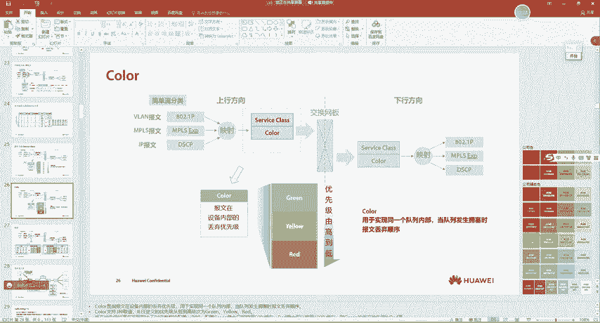

然后我们来看一下啊，那我们在豹文映射到设备内部队列的时候啊，它会经过两次映射，一个在上行方向啊，一个在下行方向。好吧，这个大家在学IP的时候应该都学过，对吧，就是我们的这个设备呢啊分为上下行啊。

中间是交换网板连接到一起的那上行大家可以理解成就是进入的接口，对吧？下行大家可以理解成是出接口，好吧，那两个接口在设备内部呢会通过交换网板连接到一起。😊，那在上行的时候呢，我们要进行一个叫做入标签映射。

好吧，啊，我们一般也叫做入映入方向映射。好吧，那这个入方向映射是什么样的呢？就是你根据你来的原始标记。😊，对吧你不是有802。1PESP跟DSCP吗？对吧你有这些外部标记，我把你映射到我的内部优先级中。

那你是不是就得到在我比如比如说我本台设备上，对吧？你得到这个队列的服务，就是把你们根据你的外部标记映射到队列里面，然后你就得到这个队列的服务。😡，好吧，那真正我们报文在发出去的时候呢。

会再把它的外部一先级给他打上。那这个我们叫做下行映射是吧？或者说叫做初象映射。好吧，那这就是上下行的一个概念啊，当然这里呢大家不用去深刻去关注他。好吧，知道有这么一个概念就行了。😊，然后上节课呢。

我们说到了简单流分类和复杂流分类是吧？呃，以及呢简单流分类和复杂流分类的一个应用点。就是我们一般在DS边界节点呢去应用复杂流分类。因为我们可以用它呢去匹配各种特征的流量啊，然后给它进行重标记。

而在我们DS域内呢，这个标记都是规划好的，对不对？你只需要带着你的标记嗯，进入到不同队列得到服务中就行了，就像你在买这个车票的时候，是吧？那卖车票的你的卖车票的人呢，要根据你的手机号啊，身份证啊，对吧？

呃，当然说家庭背景也不算。😊。

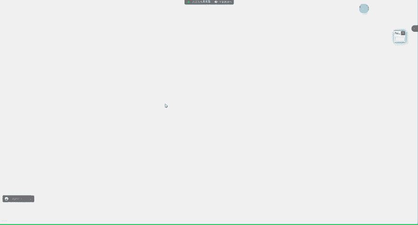

呃，也算一点是吧啊，如果你是市长，你去坐高铁，你的服务肯定不一样。能不能明白，所以说啊。就是DS边界节点呢？嗯，就类似于高铁站一样，你在买车票的时候，你要提供很多的信息是吧？

那只要高铁站把你分辨出来之后啊，他就会给你一个标记。比如说你是商务座二等座，一等座，对不对？给你一张车票。然后你在高铁内部的时候，你只凭。😊，这个标记对吧？就能够得到对应的服务。你比如说你拿着商务座。

你就进行商务座车厢是吧？商务座车厢的服务非常好，对不对嗯。是吧吃饭还不要钱，对不对？还有单独的候车室。好吧，所以说这就是复杂流分类和简单流分类的一个应用点。那这个我们怎么样去做呢？

实际上咱们这里啊啊可以去做一个简单的实验，好吧，啊，让大家能够体会一下。😊，嗯。123啊，我们拉三台设备啊。

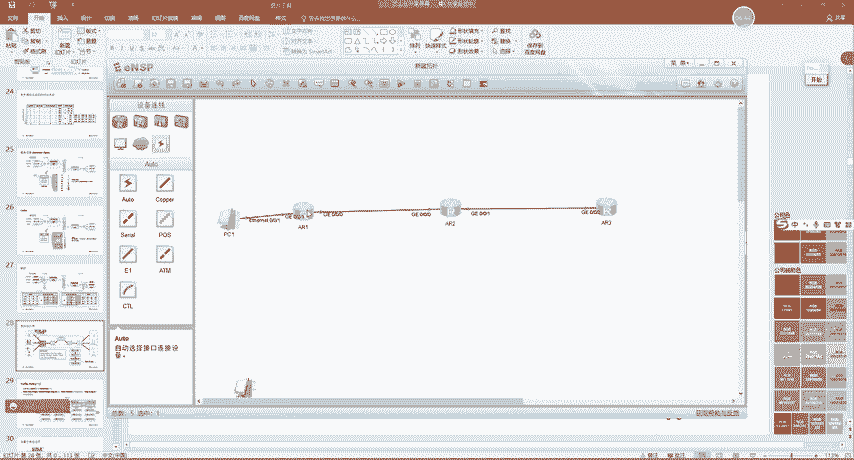

我们来配一下啊。

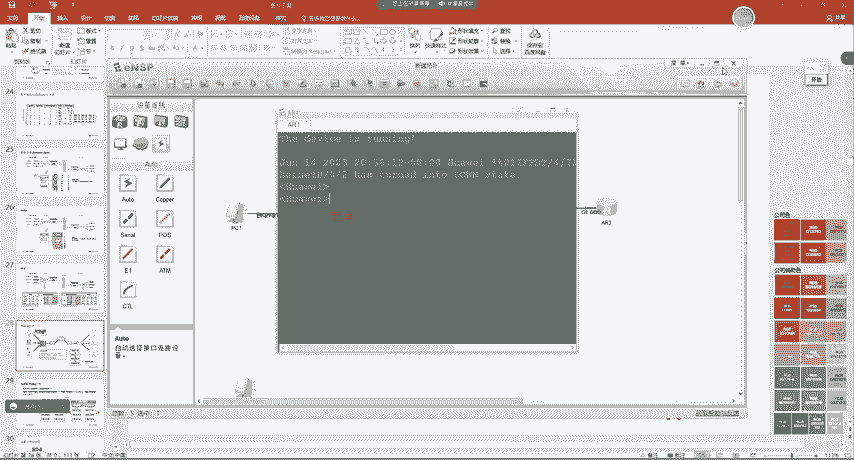

待会儿呢，我们这样来做啊，我们在山上起两个环回口。嗯，1个3。3。3。3。那一个呢是。3。3。3。4。啊，3。3呢，我们就当成这个。语言的流量。好，待会访问3。3的都是语音流量呃，3。

4呢我们都是FTP的流量。好吧。嗯。然后再起个3。3。3。5。啊。那这个我们对他不做定义啊，对吧？其他类的。好吧，然后我们现在这样，我们在123上呢，先去把基础的IP啊。

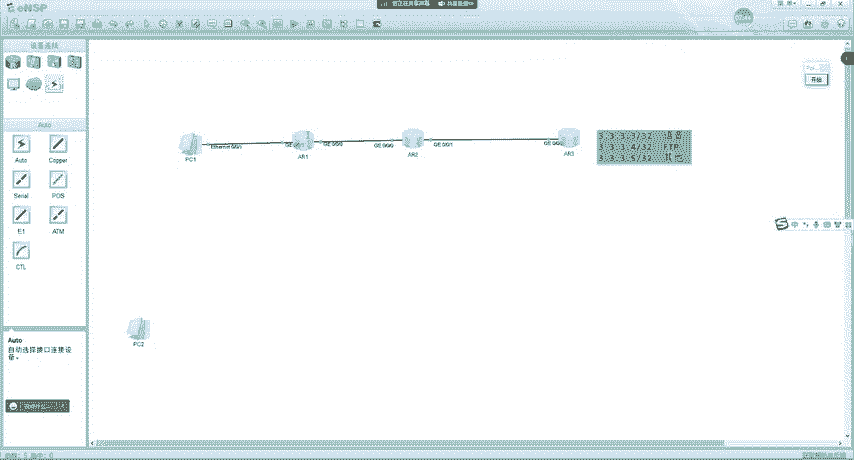

对啊。路由给他做通。0-0-1呢，我们跑1个1。254。0-0-0。咱们用。😔，12。1。二这边呢。12。2。23。2。23。3。然后我们起1个low百0。三点三。老百一。3。4。老板家。250。

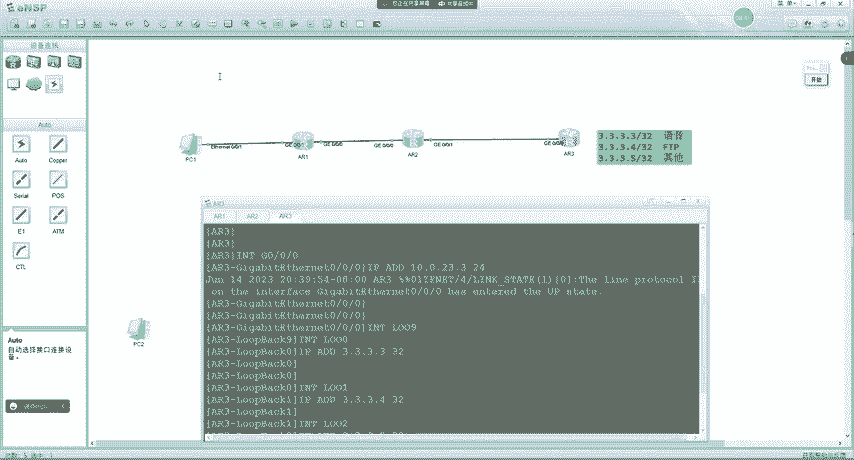

然后我们跑个OSPF1ar0。把所有网段给他通告出去。

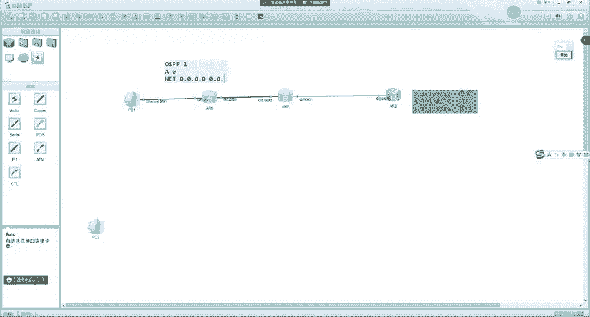

异议。

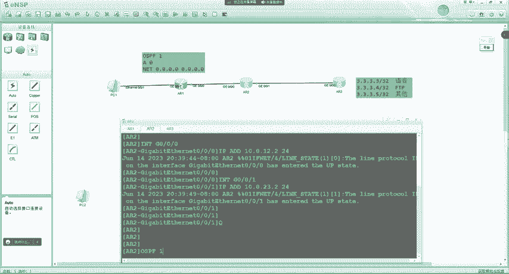

2。3。然后我们把PC来配一下啊。PC呢咱们用192。168。1。1。然后网关是1。254。

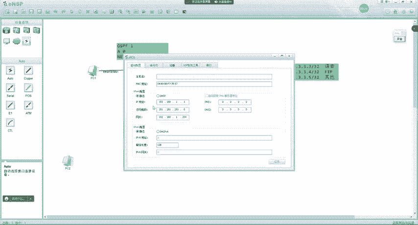

好吧。然后我们来看一下二上面邻居有没有建定完成了啊。Dsp playOSPFP。嗯，现在在推。咱们等一会儿啊。报了是吧。

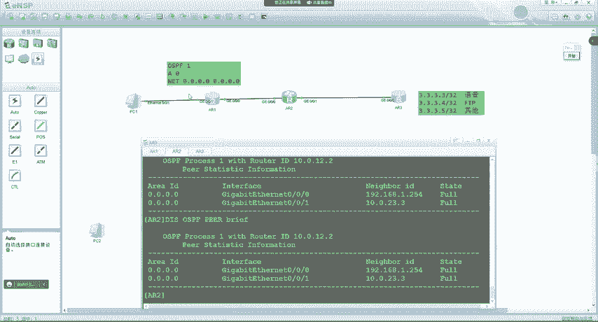

呃，现在呢我们的PCE呢。可以去骗。3。3。3。3。能通对吧？那3。4呢，3。5现在都是可以通的。对不对？

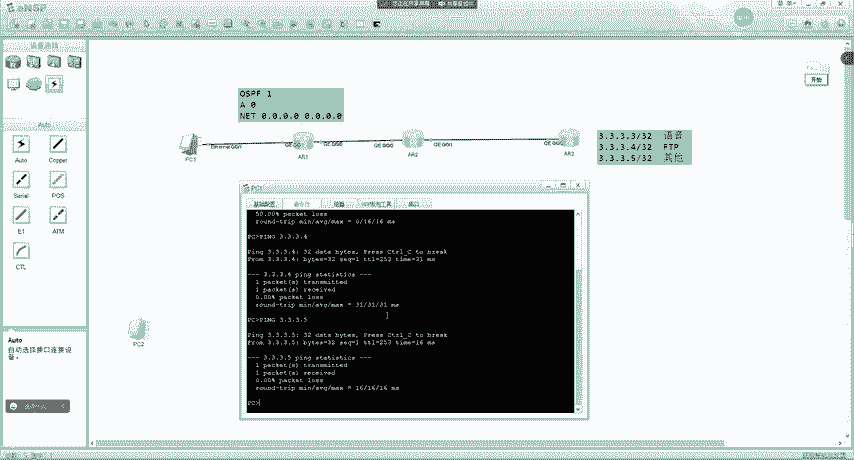

呃，也就是说呢，现在在我的整个业务中呢，我们现在是这么规划的。呃。在这里呢。他是1个DSU。好吧。然后A21呢作为我们的这个DS的边界节点。啊，那当前我们的网络中呢，我们可以去看到啊。

当一去访问这边深核网络的时候，我们有三种流。对吧啊，所以说认为是三种类型的流量啊，一种是语音的，一种FTV的，还有一种是其他类的。是吧因为网络中流量是非常多的，我们只能对当前的业务流量进行保证。对吧。

那把其他的呢对吧，其他可能还有很多啊，你像什么斗地主啊，对吧？啊，王者荣耀啊，对不对？那这种我们都认为是其他的类的流量。😊，啊，这就相当于什么一样的呃，相当于。你比如说。啊，如果。这个。有一些领导对吧？

啊，看你的话，他就认为你们就是老百姓。是吧那你看你老板呢，你觉得他老板，你是普通人。是不是啊？那如果换到领导来看呢，你们都是老百姓。是吧所以说啊呃那我们如果去看待网络中的流量的话，细分是有很多种类型的。

对不对？那我们应该站在一个什么样的视角去看待这些流量呢？实际上我们要站到对于公司的业务角度，哪些是对公司业务有利的流量是吧？就是哪些是必须的。而非必须的流量呢，我们都认为是其他流量。比如说你拼。

那我认为它就是非必须的那这时候我们可以把它归类给其他流量。是吧你逛淘宝的，还有刷抖音的那这种呢我们也认为是其他类的流。我只在去看的是什么呢？看的是在我们公司里面所做的业务性流量。

所以说现在呢业公司的业务有语音的跟FTP的。好吧，而并没有其他的业务了。那其他所有的流量呢，我们都认为是其他流量。那这时候我们现在有这样的要求，什么样的要求呢？我们就要去做规划。什么规划呢？首先。

当我们再去执行Qs的时候，大家注意执行的依据在哪呢？要有它的外部标记。对不对？那这个外部标记是由原始的应用程序去产生的那这时候我们可能很难去决定它。是吧你也不知道它产生的是多少，甚至不同的操作系统。

不同的应用，它产生的原始的Qs标记是是不一样的，就是它的外部标记不一样的。假设当前我是1个IP网络，我现在这么来规划。怎么规划呢？首先我要区分我的业务类型。哇就是你要去做一个规划表。

业务类型呢我们有VIP的。是吧有FTP的，还有其他类的。好吧， other。那在这时候呢，这些业务类型的分类依据在哪呢？对吧？分类的依据。首先呢，VIP的目的IP他们都是3。3。3。3。

而FTP的目的IP呢。都是3。3。3。4。是吧而其他所有的除去上面这些的。对吧。呃，就是其他的默认流量，只要没在我们的规划范围内的。好吧，都认为是其他流量，这是我们分类的依据。那分类完成之后。

它有很多的原始标记，就是我们通过他的目的IP呢，已经能够将不同的流量匹配出来了，这是分类的依据。那这时候我们还要去做去做什么呢？去做的就是将它标记为多少。比如说我们要去做一个重标记。目的地址3。3。

我不知道你原来的标记是多少。但是你见到我的DS域内，你们全部用55。好吧，FTP你全部用AF41。那default不管。好吧，defa我们不管，或者说你们全部用零。甭管你的外部标记是多少。

只要进了我的DIC域内。对吧。你的规矩啊就是规矩。好吧，就是在DS域内，你们就拿着这些重标记hold的，我们把它叫做车票。好吧，55就是商务座，AF41就是一等座。零呢啊就是没有座。好吧啊，你站着。😡。

那从标记完成之后，我们就可以在域内的这些路由器上。注意啊，比如说这里当然我先去写。写了之后呢，大家还看不懂，因为我们还没有去讲这一部分好吧，因为我们说了要把他们放到不同的队列中。

对吧然后得到这个队列的服务，55我们就给他扔7号，或者说扔6号。AF41，你进4号0，你就进0号。优先数值这个越大啊，级别就越高。也就是说6号队列呢，我们可以把它配置成最好的服务。对不对？

4号稍微差一点啊，0号你就最差了。那这时候我域内的所有的路由器呢，你就是在这里发过来之后，你们都是5541或者0。这些路由器呢，就根据你的标记给你提供服务。这不就跟你坐高铁进了车站之后一样。

是不是一个道理啊？对不对啊？你坐高铁一旦进了车站，你就拿车票得福。你不然怎么样呢？是吧。你拿着二等座车票，你跑到商务座去吃饭。我估计人家不一定让你吃。对不对？55为什么不是7？这个你可以自己去改。好吧。

我们可以自己去指定的。能不能明白？那这时候呢，咱们就把这个来做一下。怎么样去做呢？标记没有好坏啊，一般我们都是习惯性的让它越大啊越好。好吧，这是习惯。你比如说零，我给他最好让他扔到6号队里。

得到最好的服务行不行呢？也可以。只不过在我们的习惯上是，如果数值越大，他的服务质量就越好。

那这时候我们来看一下啊。那这些流量我们首先要在AIE上匹配出来，怎么样去匹配呢？我们需要一个工具啊，这个工具呢大家应该都学过，我们把它叫做traface policy。

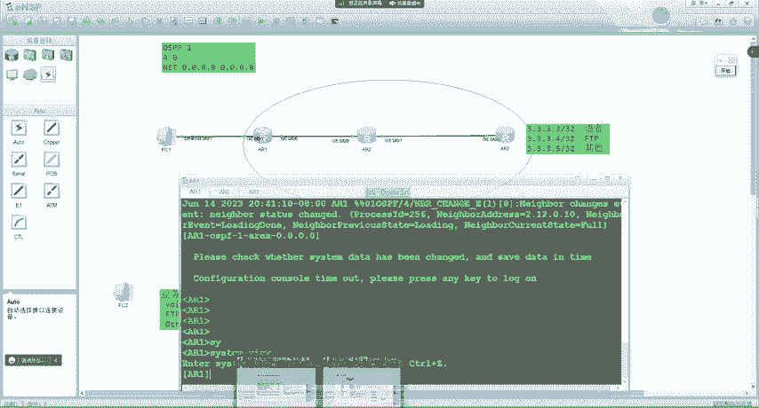

好吧，啊就是MQC大家在学PBR的时候呢，应该接触过。对不对？那也就是说，我们要利用MQC工具去将这个流量匹配出来，怎么匹配呢？我们去创建一个流分类。

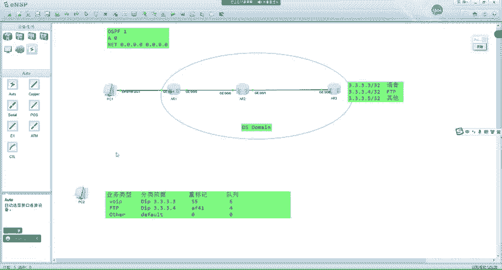

名字呢咱们可以先匹配VIP。那创建完成之后呢，我们可以发现很多匹配条件。在这里e服m你可以去匹配很多。是吧啊，目的麦克。呃，协议啊802。1P啊ACL啊，或者说所有你都可以去匹配。好吧。

那这时候怎么样去做呢？比如说我们去做一个简单的，首先呢我创建1个ACL3000。Rer。旁边一台。IP目的地址只要是3。3。3。3的流量，全部给他匹配出来。然后3001。只要是3。4的流量全部匹配出来。

3002。只要是3。5的流量全部匹配出来。也就是说，现在呢我通过ACL去把这些流量。

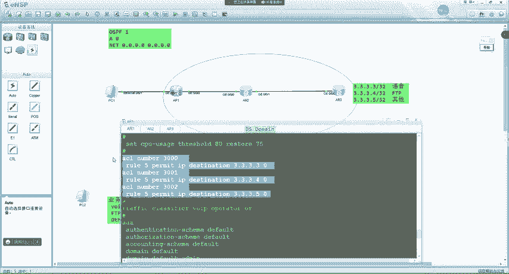

已经抓取了出来，怎么抓的呢？就按照我的规划表中分类依据去。

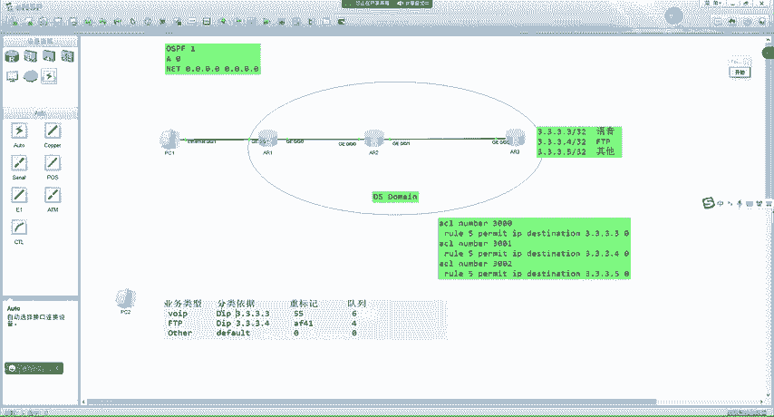

然后现在呢，我们有1个AR1。L一怎么办呢？我们这样去做。叫做。Tface。Class。嗯。V有IP。好吧，就匹配VIP。VIP是哪一个呢？就是if maxACL3000。

这样就相当于我们把语音的流量给他匹配了出来。匹配之后，按照相同的操作再去匹配其他的。FTP的。ACL3001。嗯，还有defa对吧，其他。伊副麦ACL3002。啊。

这时候我们就把不同的流量给他匹配了出来。匹配出来之后呢，这时候我们要去给他打标记啊，就是给他发车票。是吧。那怎么样去发呢？也很简单。创建一个trafacebehi。啊，行为。vivoIP。啊。

比如说我们可以不叫VIP后面只是一个名字，比如说我们就叫他55。55之后，我们remarkDSCP把他的DSCP值改成55。甭管你原来是多少，你只要从我这出去，你们就是55。然后按照相同的操作也是一样。

T face Be。AF41。然后就是。Remark。DSCP。AF41。好。然后是try face behind。我用defa。啊，默认类。Remark。DSCP0。啊。

那我们将这个不同的从标记创建完成之后，就需要将分类跟标记绑定到一起啊，就是建设他们俩之间的关联。这个怎么样去做呢？Tface policy。啊，这policy呢我们可以把它就叫做t啊用于做测试的。

首先我们有一个流分类叫做VIP。他要关联上一个行为，叫做55。我们有一个流分类叫做FTP。他要关联上一个行为，叫做AF41。我们还有一个留分类呢啊没有了。是吧。这个流分类我可没有创建哦。啊。

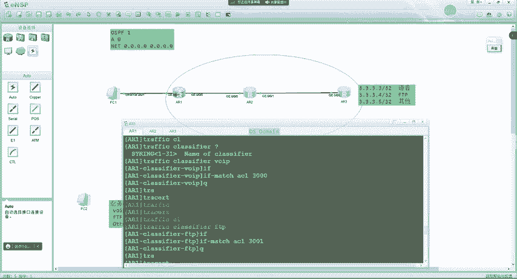

啊，我用的3。5模拟的是吧？

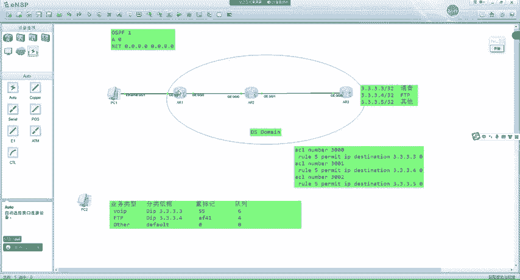

是吧。实际上这里大家注意啊。😊，这里我给大家说一下。

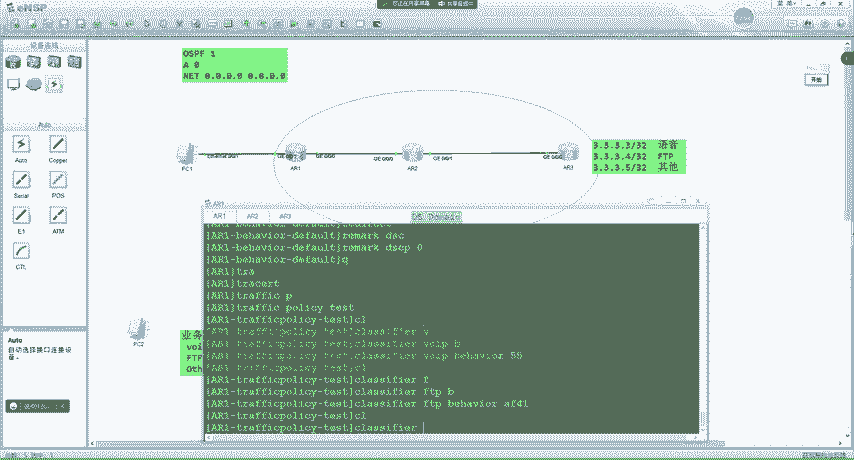

在我的环境中，3。5是其他类的流量。如果在你真实的工作中。你知不知道哪个目的地是其他类的？你知不知道？不知道。太多了。是吧只要不是我的业务，都是其他类的。那老师我不能一一去匹配啊，这时候怎么办呢？

我们可以通过一条指令。😡。

叫做我要去匹配一个defa class。注意啊，这是一个隐藏的命令。也就是说你打问号它不显示，但是你可以打个defa class，让他去补全。明白吧？这并不是我们创建的。也就是说。

当不满足VIP和FTP之外的流量。😡，都属于 defaultfa class。然后他们去执行一个行为。叫做defa。好吧。那这时候我们做了哪些呢？呃，做的实际上很简单。

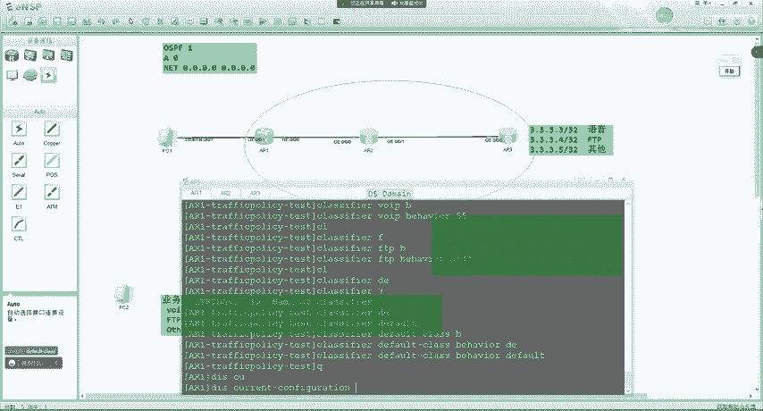

首先啊这个ACL3002在我的这里就没使用的啊。这个也没使用到。做意啊。首先呢我们用ACL还有流分类去匹配了语音和FTP的流量。匹配出来之后呢，设置了一些行为。那么一个是55，一个是AF41。好吧。

然后我们将VIP语音改成了55FTP改成了41。而在这时候呢，我们匹配了默认类，就是只要不匹配这两个的流量都属于默认类。让他们去执行了一个行为叫做default。我们把DICP呢改成了。

这里实际上就是零的意思，改成了0。那这就是我们所做的操作。好吧。那这里做完之后呢，我们就实现了流量的分类以及流量的从标的。

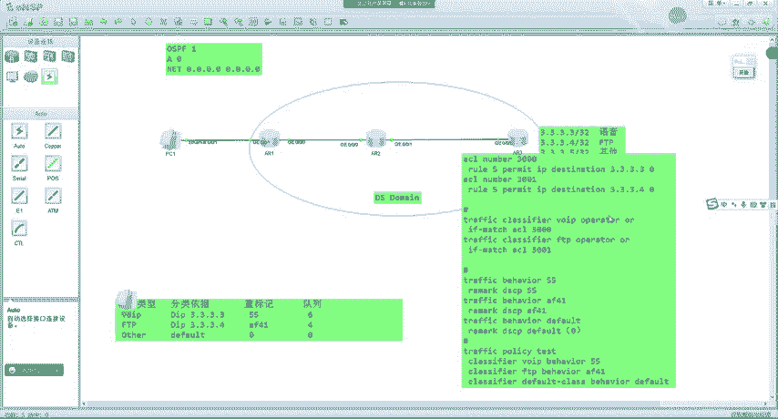

做完之后呢，我们只需要去把这个策略呃应用一下就行了。在哪里应用呢？interfaceG0-0-1。叫做tryface。policypolicy的名字叫t英镑的。

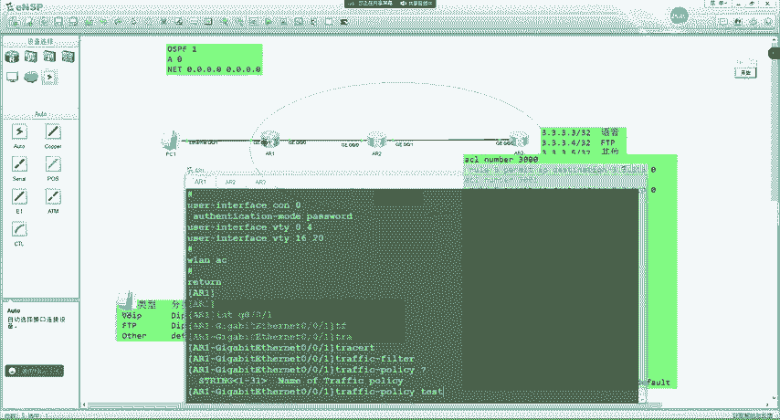

我们不带入像去调用。一旦调用完成之后，比如说现在我在G0-0-0去抓个包。

我们就可以来看一下。现在我用PCE去骗一下3。3。

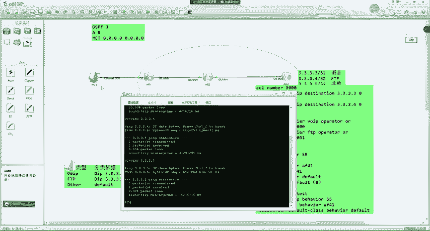

南通。

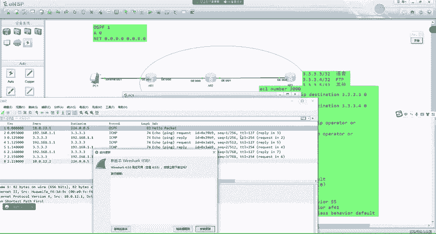

这时候我们去看他的DACCP值呢。咱们就可以去看的。有没有变成55呀？有吧。而被我们修改成了5。那比如说我们去聘3。4。3。4应该是AF41呀。我们来看一下有没有变成AF41啊。是不是也有啊？那3。

5属于默认类，而所有的默认类我们都改成了0。

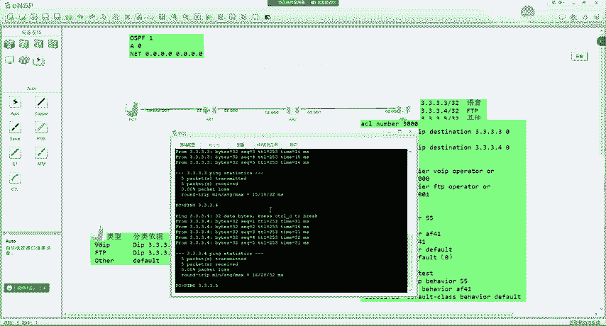

那我们来看一下。3。5是不是都变成了零啊？对吧。那这时候我们就可以通过流分类啊吧，或者说我们叫通过MQC的方式，MQC工具。实现了流量的分类，以及他们的重标记。好吧。那这是我们在边界节点上啊去做的。

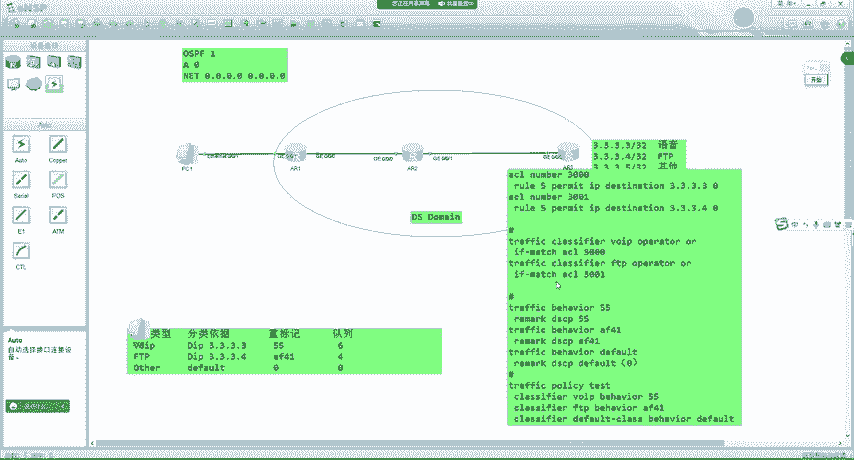

那未来呢，这些从标记就是你标记之后的流量，这些流量都会带着不同的标记往你的DS域内的路由器发。😡，我们只需要规划这些路由器，你看哪个标记执行什么行为就可以了。那这就是Q。

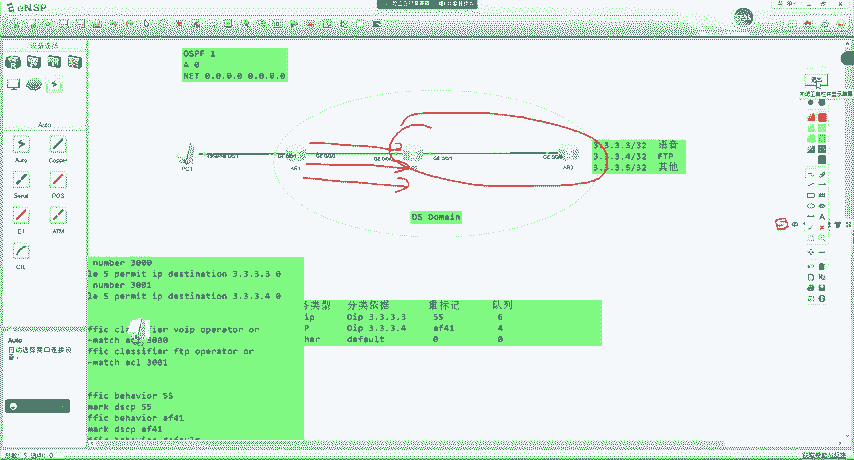

所以说到这里，各位同学明白了吗？明白，同学敲一啊。没问题吧。好吧。那这些队列我们怎么样去做呢？😡，是吧那这个我们得接着去讲。讲到后面呢，慢慢的大家就清楚了。好吧。我们来看一下啊。

刚刚我们所做的这个traface policy。那么它是由两部分组成啊吧，我们把它叫做模块化的QS命令行。啊，翻译过来啊，不是啊，就单词的缩写啊，就是MQC。那一个policy呢是由多个规则组成的。

什么是规则呢？在一个policyy下，应用了多个分类和行为。那这种每一个我们都可以叫做是一个规则。好吧。那么在我们的每一个行为里面，注意啊，比如说我衣服卖死了ACL3000。

我们还可以再去做。比如说我创建一个，我随便创建一个啊。001。啊，不对啊。001。我可以if maxACL3000。

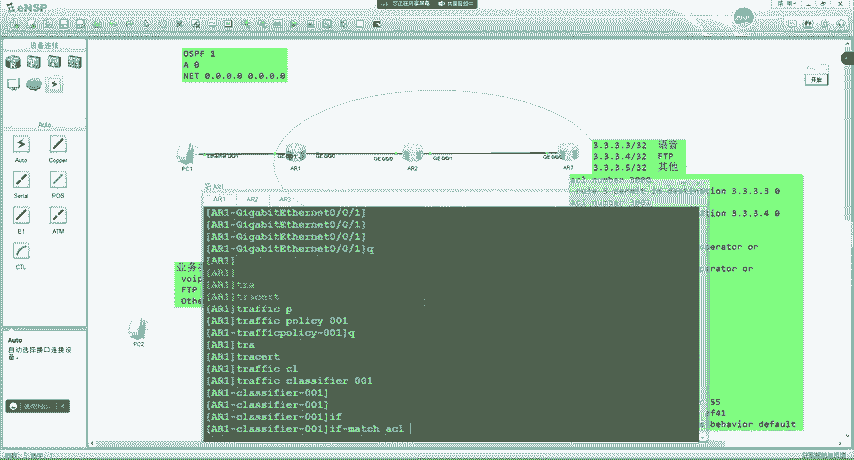

我还可以一副麦。嗯。他原来的DICP值是吧？AF33。比如说我做了两个衣副麦一句。对不对？那他们是什么意思呢？注意啊。如果当我们去配了两个伊服麦语句之后，由他的操作代码去指定。是吧OR代表货的关系。

啥呢？或就是有匹配其中一个就可以了。好吧，就逻辑货的关系。那对应的我们也可以把这个修改。修改成AND。好吧。那默认它是获得关系。如果你带了NAD之后，那它就代表逻辑与的关系。就是两个衣服麦句都要匹配。

好吧，所以这时候我们再来看这张图。如果说。流分类下面定义了多个规则，默认是逻辑货。而流行为下面呢也可以定义多个。怎么样定义多个呢？

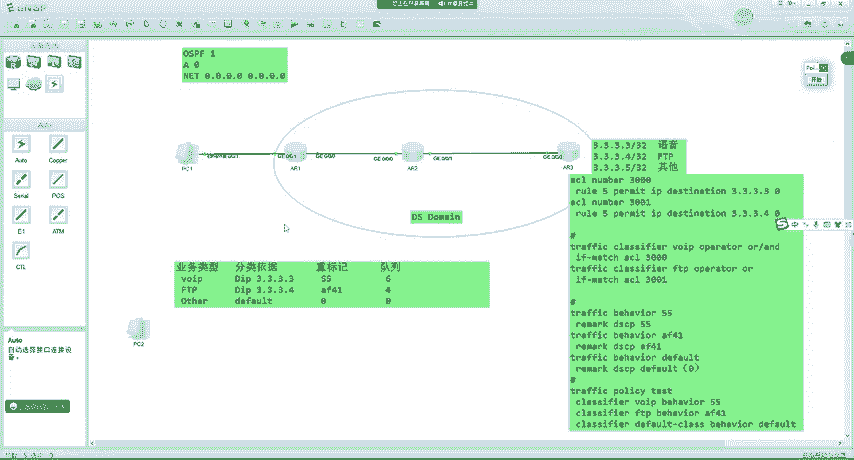

零零一。啊，不对啊。Behive我 li。刚刚我们做了remark。啊，DICP。11。那我能不能再做个重定项啊？

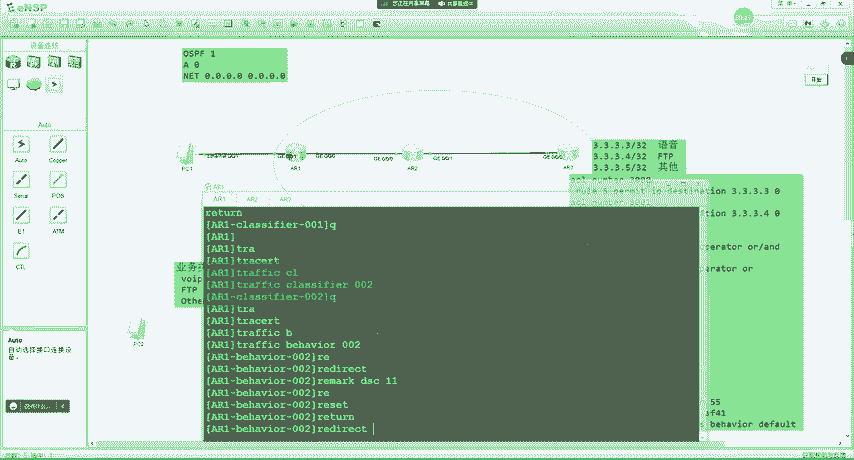

你从10。0。12。2发出去。啊。IP niceho10。0。12。2。有没有多个行为啊？有吧。那多个行为。就是同时执行，而且这个我们是没有办法修改的。比如说老师随机执行一个行不行？不行。

他是同时进行执行的。好吧，那在每一个规则里面呢，都是这样的方式。罗辑或。已同时执行。啊，默认是逻辑化，当然你可以去修改。所以我们可以去看到呢。在每一个流分类里面，我们可以定义多个if句。

它是逻辑或的关系。而每一个流行为里面呢，我们也可以多执行多个啊这个动作。那在这里呢，他就是同时执行。然后最后呢，我们甭管你执行了多少个，他们都可以被编到一个traface policy里面。好吧。

同时执行什么意思啊？

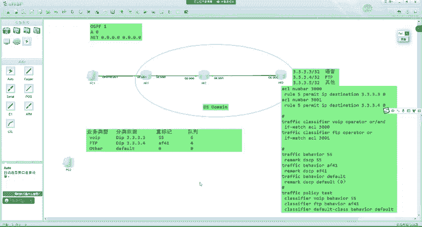

这一片片啊。你也想问。这个问题还问。啊。顺序执行。同时执行，不知道什么意思啊。

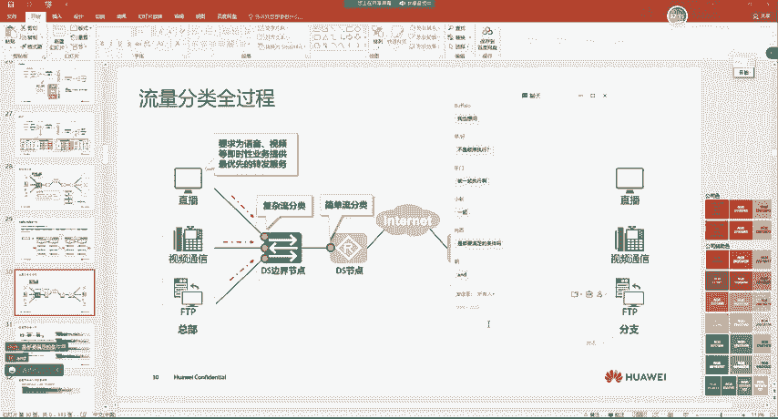

你再评评。说的跟过路费一样是吧，同时执行，不知道什么意思啊。😊，我刚刚做了是不是两个啊？

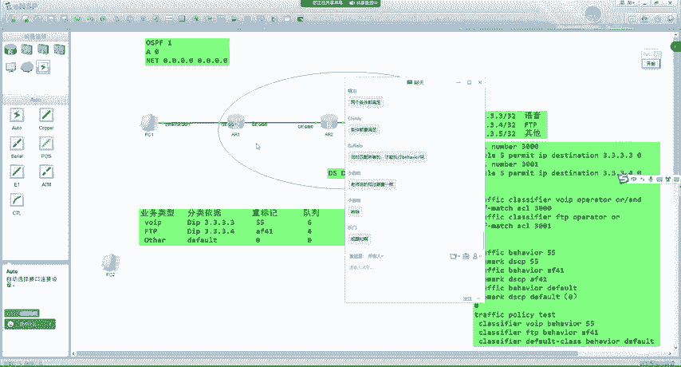

这是修改DSCP为11页。然后把它重定向哪个接口发送，他俩同时执行，这不知道什么意思吗？这不是既修改也重定向吗？😡，这没听懂啊。😡，先干哪个，那同时干的啊。😡，好吧。就是两个行为都要去做。

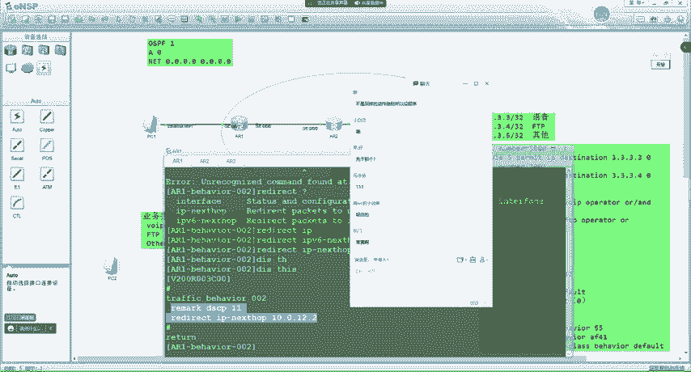

好吧，是这个意思啊。😊，嗯。

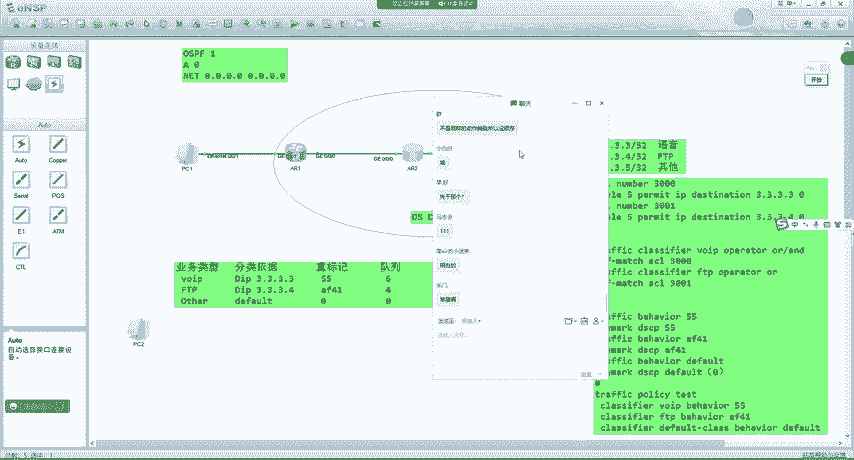

这都没理解啊。现在懂了吧。😡，懂了吗？可以了是吧。好，咱们继续啊继续。😊，嗯。分类里面。分类里面如果有多个里面。

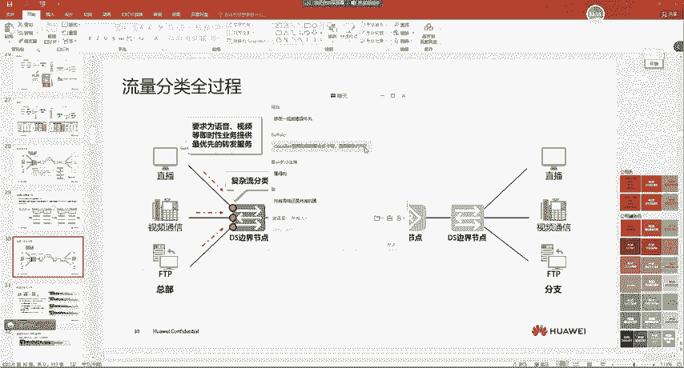

分类里面有多个分类我啊。😡，你还没听懂啊，这个谁啊。😡，呃，buff同学。你你分类它是匹配呀，你只要被匹配之后都会被执行。

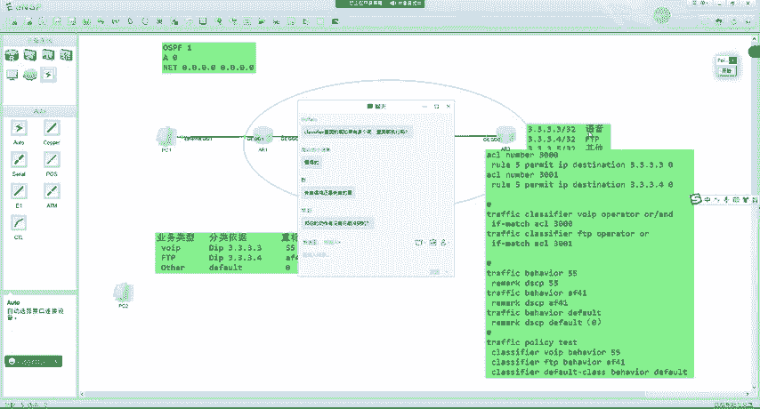

你能懂这意思吗？我举个例子啊。

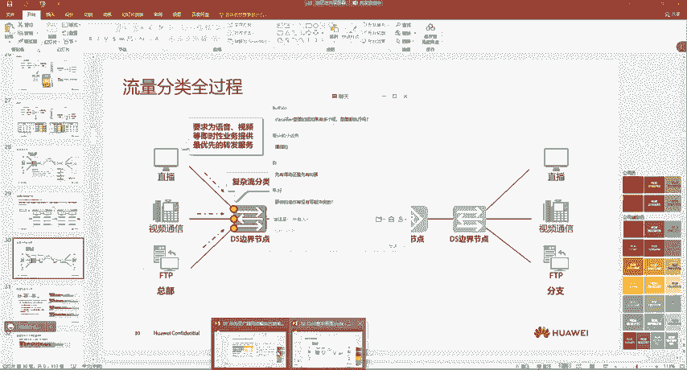

你想法就不对啊。😡，什么叫做逻辑货啊，这只是用于匹配的。😡，有可能啊。对吧我一副麦3001一副麦DICP11对吧？比如说老师我3001匹配的目的地是1。1，现在目的地址1。1的流量。

正好DSCP等于11，那就同时匹配吧。😡，对吧就代表你匹配了这个留分类啊。😡，然后你去执行刘分磊所对应的行为啊。行为永远是同时执行的。能不能明白？好吧。执行动作不会有冲突啊，你不要看他这里依次修改。😡。

这玩意儿写的不专业啊。没有冲突的可能。能不能明白这个命令它是有覆盖作用的。比如说我改成了。😡，remark DICP11。是吧啊，我再remark1个DSCP22。😊，是吧你看课件里哎。

老师依次执行是不是最后的生效？😡，他是有覆盖作用的啊，你看他最后执行的哪一个。😡，他执行的是22。能不能明白？这个面令是有覆盖作用的啊，行为绝对不会有冲突。如果你配置了不同的行为。😡。

对吧就是对于DICP这一个条件。😡，你配置了不同的行为，他绝对是会被覆盖的。但是我改了DICP，我又做了重定向，他俩之间有冲突吗？这种没有冲突的，他才可以同时执行。😡，存在冲突的是会被覆盖的。

这意思明白了吗？明白的同学敲一啊。😡，好吧。行。啊，为什么要执行多个？😡，哎。这种问题还能要问啊，我举个例子啊，我现在我想让你改DICP改成11。😡，是吧你现在有两条路，但是我就希望从这里去走。

你还要去改成DSCP11。😡，有两个需求，你不就要执行两回吗？😡，能明白吧。😡，就是我现在的需求有两个，我不仅要改成DICP11，我还要做个PBR。😡，是吧这时候你不就得改两次吗？😡，好吧。

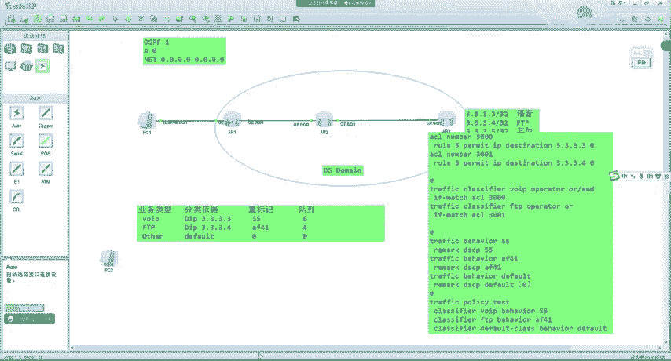

行，咱们继续啊。😡，在问问题前啊，先自己想一下，想想这个逻辑。😡，好唔好。嗯。动脑子啊动脑子。这到你考试的时候啊，我都要张嘴骂了。😡，能不能明白？好吧，考试的时候，如果你一下子像这种一出现问题。

老师这个怎么解决，这种我都要骂回去的。😡，好吧，大家一定要是自己的。😡，这个思维能力啊。😡，哎，等你们到考试的时候就知道了，好吧，一定要去养成。😡，要不然的话，到时候考试嗯很难受对吧？一旦出现问题。

自己就不知道怎么样去解决了。😊，好吧，就大家在学习的过程中啊嗯。😊，这个你们自己体会好吧呃，我是从来不教巨英的，能不能明白？当然给大家说的呢嗯可能有点难听。😡，是吧啊，但是大家要体会啊。

就是一定要去自己想想是吧。😊，行。😊，嗯，这个大家都明白了吗？😡，明白的同学再敲个一好不好？😡，可以是吧。一下子给我也干懵了是吧？同时执行。😊，好，那我们继续啊。嗯。

复杂流分类的配置命令呢啊这个刚刚我给大家演示过了，对吧？简单流分类的配置命令我们先不演示，先不管。😡，后面我们再讲到队列的时候，会给大家去讲对吧？简单六分类啊，怎么样去使用的，对不对？嗯，以及呢。😊。

简单流分类是吧，它的作用是干嘛的？所以说这一块大家先不要去管它啊，也不要去管它的命令，后面我们会去演示。😡。

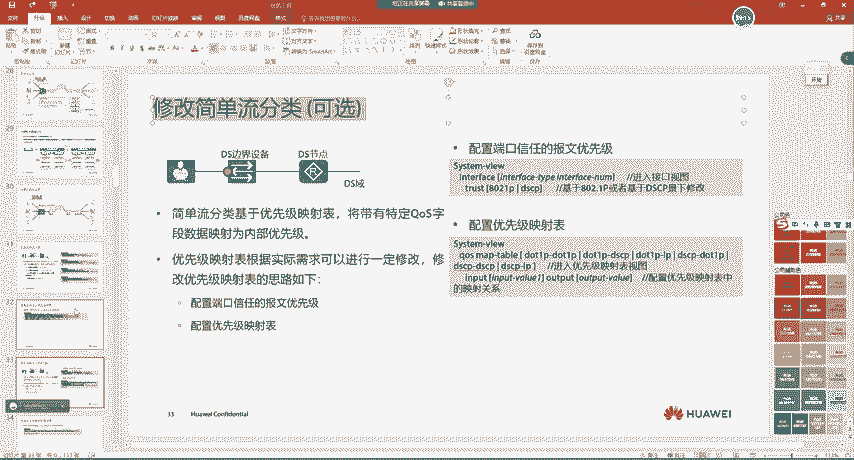

所以到这里啊，我们就已经把复杂流分类搞明白了，对吧？以及大概的去能够体会了一下Qs的一个基本逻辑。什么逻辑呢？就是你们杂七杂八的流量啊，在我这里有个门儿是吧？我们把它叫做DS边界。

你们只要进到我的域内啊，全部人都得带一个我打的标记，我给你什么样的标记，你就获得什么样的服务。😡，这就是Qes。😡，对不对？那Q是不是只有这些呢？是吧？就是我们说老师啊服务。😡，服务有很多啊。😡。

对吧比如说你今天去网吧。😡，是吧。😡，那有些人呢呃可能给你像有那种比较大的网吧是吧？呃，还能吃午饭呢。😡，对不对啊，你还能要一些，比如说湿纸巾啊。对不对？呃，有些甚至啊对皮肤特权，有些甚至还能找陪玩的。

😡，是不是？所以说啊什么样的服服务的类型有很多，你只要带着这个标记，它就象征着你能得到什么样的服务。😡，那这个服务是怎么样的呢？那也是由我们去制定的。我们学Qs，大家就认为你就是上帝。😡，是吧。

你是上帝，流量杂七杂八的进来了，你你你你们是带着什么样的标记，对吧？你在这个标记之后呢，我在后面你得到的什么样的服务，都是我们去铺拍好的。😡，能不能明白？那接下来我们再继续讲的呢。

就是他具体得到的一些服务。比如说你只能用多少流量，我给你限速。😡，是不是或者说你来了之后，比如说我现在接口堵了，你来了之后啊。😡，我让你插队，你来了直接走，那这也是服务。还有一些你来了之后，我告诉你哎。

坐不下了，对吧？你走吧你走吧是吧？丢包，这也是一种服务也就是说服务的类型有很多，我们先搞懂了，对吧？怎么样进行分类和标记，这是我们未来去提供服务的一个前提是吧？那具体服务到底有哪些呢？啊。

我们接着一下要往下来看。😡，好吧，那在这里呢有两个思考题，我们来看一下啊。😊，首先第一个复杂6分类呢，一般在DS边界设备的入方向部署，这是对还是错啊？😡，是吧这个是正确的，没错。啊，这对。是吧。

当是他说的很眼晦对吧，一般在入方向不熟是吧，他就说必须得在这部署。😡，你觉得还对不对嗯，你觉得就不对了。😡，是吧。但我不知道国外有没有这样考的，反正在我们国内啊，这种考的很多。😊，是吧你说的太绝对。😡。

你就错。嗯，然后我们看下面一个多选题啊。就是用于标记数据包Qs的优先级参数有哪些呢？😡，A是不是啊？MPS4里的是是吧，B也是C也是哦，DD也是是吧？这里呢一个是A1个ABCD。系。

那这就是学有所得了啊，哎老师，我突然感觉我还会了一点是吧？啊，就是这种感觉。😡，慢慢来啊慢慢来。😊。

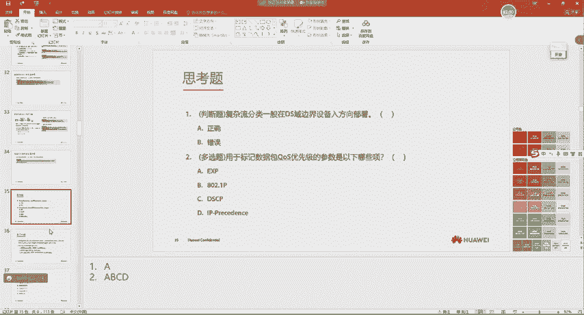

嗯，然后我们继续往下来看。对吧。呃，咱们休息会儿吧，好不好？同学们休息10分钟。😊，是吧马上到半点了。十分钟之后呢，我们来讲一个叫做限速的技术。😡，大家都经常会听说是吧，给他限个速是吧，学完限速之后。

你以后啊隔壁邻居抢你的带宽，你给他限个速，对不对？接下来我们就要讲的一个技术呢，就是限速，就你怎么样去。😊，是吧给别人做限速，怎么样做到的？😊，好唔啊。呃，我们休息10分钟。

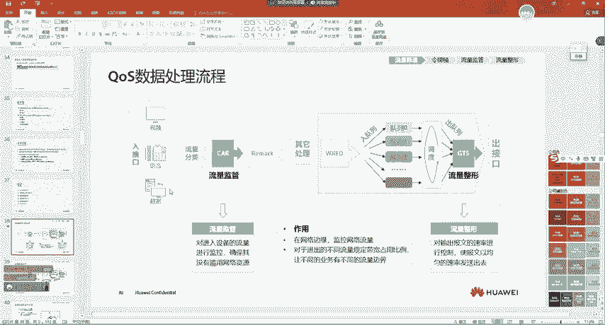

十分钟之后呢，我们来讲一下Qs里面怎么样去做限速的，好不，休息会儿啊。😊，好，同学们，我们继续吧啊，继续来上课。😊。

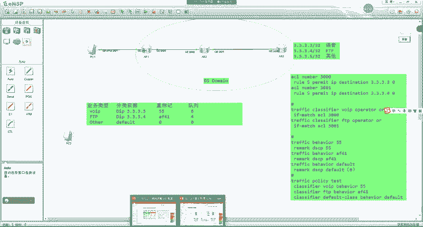

嗯，接下来呢我们要去讲一下这个限速技术。嗯，这个技术呢大家应该平常听的比较多啊，给他限个速啊，给他限个速是吧？就是防止他用的流量非常多，对不对？那这个限速它是什么样的技术呢？

一般我们用大白话说的就是限速是吧？但是在交换机或者路由器上，我们真正要去实现限速的话，它是靠两种技术的啊，一种呢叫做监管，一种呢叫做整形。对吧这时候我们可能会产生一个疑问，对不对？

老师监管能限速还要整形干嘛？😡，是吧。肯定有同学有这样的疑问。嗯，肯定有他的原因好吧，这个在后面呢我们会去讲到啊，监管跟整形呢虽然说都是限速呃，但是呢还是有区别的。😊，但是在这里呢，我们先不说它的区别。

我们需要去了解一个点。一个什么样的点呢？就像我们在高铁啊，不是在这个呃开车的时候一样是吧？开车的时候呢，我们会有时候听到这个地图给你提示对吧？前方路段限速60对吧？呃，请怎么样怎么样怎么样是吧？

减速慢行。😊，那这时候我们就会有一个问题啊。哎，他怎么样知道我就超过60了呢？是不是啊？我说我没超过60。我的表可能就在就是我们在车里面，我们可以去看到那个表已经超过60了。哎。

但是这监控摄像头他怎么知道我抄了呢？😊，是吧。那在这里呢，网络中也是一样，网络中我们要去限速，那我们怎么样知道它流量用了多少呢？或者说怎么样知道它有没有超呢？😡。

对吧生活中我们会发现我们有一个工具叫什么啊？😡，呃，反正就撤诉的有一个叫测诉仪吧，是不是啊？啊，对，叫测速仪是吧，就在那个电线杆子上。😊，啊，但有些地方可能不是电线杆子啊，就在那里挂着。

哪怕你人在那里跑啊，他都有显示。😡，什么是啊？那网络中也有一种东西啊，类似于测速仪。我们把它叫做什么呢？叫做令排统技术，好吧，叫做令排统啊，当然跟这个测速仪有点类似。😡，另排筒是什么样的？他是这样的。

呃，大家可以认为这个令牌桶它就是一个存放令牌的一个容器。这个桶很好理解啊，我们都用过水桶。是吧。这个桶大家可以理解成就是放令牌的。这个令牌有什么作用呢？😡，比如说当你一个数据包要从我这里过去。

你就得拿出一定的令牌。当我的令牌没有了。那你就没有办法从这里发包了。也就是说，我们只要控制桶里面的令牌，是不是就代表着能够控制多少豹文从我这里出去啊？😡，这个意思能够明白吗？明白的同学敲一啊。

这里没问题吧。😡，是吧你只要出去的包，你都会拿令牌，对不对？😡，是吧那在这时候，我们只要控制令牌的数量。😡，那么在这时候就能够控制你能出去多少个吧。

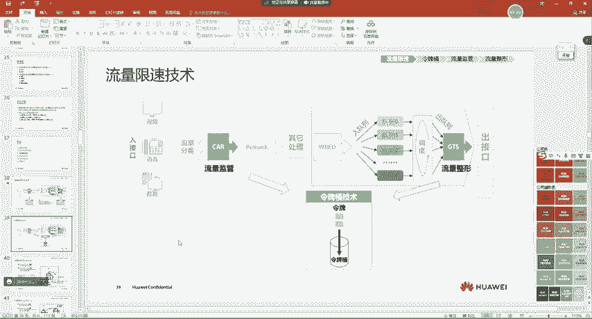

那这个控制是怎么样进行控制的呢？它是有自己的算法。😡，好吧，那我们的算法呢，一共是有3种。😡，一种呢叫做单统单数双色标记法。还有一种呢叫做双统单数三色标记法。还有一种呢叫做双统双数三色标记法。

有的人就懵了，几个桶几个数我也记不住。😡，对不对？我也没记住。😡，好吧，我给大家说我也记不住。😡，PIPB你让我看到了敲命令的时候，我还能知道是什么意思。但是你要让我什么命令都不看，让我直接给你说。

这桶那桶我也记不住。😡，好吧。那这时候呢，我们就来看一下，对吧？那这种单素单桶。双色标记法是一个最简单的。我们先来看一下这个最简单的它是怎么样去控制的。那我们在去学习单统单数双色标记法之前呢。

要了解一些术语，什么样的术语呢？第一个叫做CIR。😡，CR是什么呢？就是我们往桶理中投入令排的速率，大家可以理解成这个桶就是装水的是吧？我们有个水龙头往里面灌水，那灌水的这个速率就叫做CR。😡。

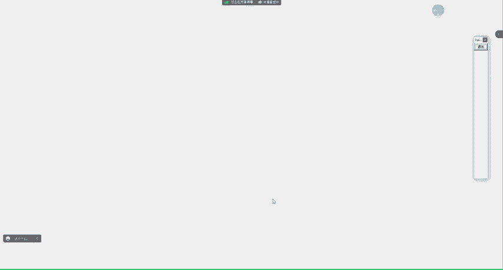

好吧。那也就是说CR呢是我们往桶里面投放令牌的速率。😡，对不对？而这个桶呢，我们就把它叫做C桶，好吧，因为我们是单桶，这个桶是谁呢？这个桶有个名字，它就叫做C桶。😡，好吧，还有一种呢叫做CBS。

CB就是这个桶的容量啊，就你能装多少个令牌，如果换成水啊，就是你能装多少个水。😡，好吧，颜色先不用管。然后在这时候呢，注意我们接触到了三个术语，什么样的术语呢？单统单数。这个桶是谁呢？是C桶。😡。

这个速度是谁呢？是CIR好吧，就是我们往桶里面注入水。😡，然后CBS就是桶的容量。那这里大家可以用水跟水桶去理解它。就是我有个水桶叫C桶，对吧？然后我往里面放水，放水的速率就是CIR好吧。

这个水桶能称多少水呢？就是它容量，我们水桶一般用几升两升啊，三升，对吧？那在这时候呢，我们叫CBS。😡，所以这几个概念大家明白了吗？明白同学敲个一。没问题吧。好吧，这个概念未来我们讲到所有的令牌筒。

大家都可以用水水桶啊，这样的概念去理解。😡，那么在这儿时候是怎么样的呢？比如说注意啊，这个速率是我们手动去配置的。😡，他是KBS。对吧这就是速率。😡，比如说我给你十兆，你能不能配出来？😡。

各位同学能不能配出来？😡，我们把单位换算一下，给你10兆，那就是。1万KBS。😡，你能不能配出来？😡，可以吧。是吧。😊，啊，1024。对吧我们用1000嘛啊，用为1000好换算一些。😊，好吧。

那么在这时候呢，我们往里面按照CIR的速率去投放这个令牌。注意啊，去投犯令牌。那如果桶没有满，它能不能装令牌呢？可以跟水一样道理，没有装满的时候呢，它就继续往里面存，什么时候能装满呢？

当我的CBS满量了之后，那这个水就溢出来了嘛。也就是说这个桶最多能够盛多少令牌啊。😡，能成多少令牌？是吧跟他的CBS有关系。CBS决定了他能装多少个令盘。比如说当我们去做了限速之后。

令牌统是怎么工作的呢？首先呢他会按照CIR的速率往里面投令牌投令牌的时候有一个规律呃，满了啊就溢出没满就继续投是吧？投投投满了就溢出来。😊，那当我的报纹是不是啊，当我的路由器收到一个包之后。

假设豹纹的大小是B，注意啊，这个单位是字节。比如说报纹的大小是B，他会跟我的桶对比一下。😡，有没有足够的令牌？好吧，那在这里呢，我们设及到一个新概念叫TCTC是当前的容量，就是C统中现在有多少个令牌。

我们就把它叫TC。😡，如果说TC大于B，就代表我有足够的令牌。大家可以理解成有足够的水管宝。😡，是吧你来了之后走吧，让你喝，喝完之后救了你，对不对？😡，所以说啊TC是当前的容量。

如果说我当前的容量大于了B。😡，那么这个报文呢就会被标记成绿色转发出去。现在大家先不要想是吧，老师报文怎么还能打颜色啊，难道是我温萨克抓到的那个颜色吗？你可不要开玩笑啊。😡，能不能明白？

他可跟这个颜色没有关系。😡，攞到吗？这个颜色。大家可以理解成是一种抽象的。好吧。😡，比如说你的标记是一，我认为你是绿色，你这样可以抽象出来颜色。😡，好吧，他给你威 check抓出来那个没关系啊。😡。

所以这里呢我们先不用去管绿色、红色的事，你现在只需要知道的是什么呢？就是这个报文就被转发出去了。😡，所以这是第一个逻辑。注意啊，各位同学，我再说一遍。😡，就是我们按照CNR往C统中投放令牌是吧？

如果令牌大于了CB，那么就溢出没有大于就继续投来了一个豹文，等于B，它会跟当前的令牌数量TC来比一下。😡，如果说。C筒就是TC大于B报文就会被转发，TC小于B就丢弃。😡，很简单的道理，就是我有令牌。

我就转发，我没有令牌就丢弃。😡，所以这里各位同学明白了吗？明白的同学乔宝一。好不好？这是非常简单的。好吧，这个很简单。😡，对的抽象是一回事，简不简单就完事了。😡，是吧当然是比较抽象。之前给大家说过啊。

Q词是比较抽象。对，但是它很简单啊。😡，是吧这里大家就可以理解成这就是一个血袋。😡，对不对？😡，血袋里在供水，在供血，你这个豹纹就相当于人一样。人来了之后啊，我有那么多血袋，那就能救活你。

你就是绿色转发了，救不活那就没办法了。😡，对不对？所以说很简单啊。这就是单统单数双色标记法。那讲到这里之后呢，我这时候给大家去敲一下命令啊，让你们能够感受一下他大概是什么样子。😡。

比如说我要在G0-0-1接口作个限速，我们就QS卡car不用管，你就认为car就是限速的。好吧，那在这时候呢，在入方向进行限速，怎么限呢？😡，CR你能不能配置啊，就这个速率，你可以自己去配。😡，对不对？

这不就是KBS吗？😡，是吧比如说限速10兆。😡，11234。是吧实张。然后。C筒CBS能不能拍？😡，CBS。是吧CB注意啊，桶是以字节为单位的。但是我们看到最小是1500。这里我问一下各位同学。

为什么最小是1500？😡，是吧对，因为你的豹文，你一旦1400，那1500多包，你就一直发不出去了，是吧？所以说最小你也要满足MTU值。😡，比如说我们配置为多少呢？呃，这个你可以随便去指定啊。

因为真正决定你速率的是什么？😡，各位同学真正决定你速率的是CIR这个C筒代表的是什么意思呢？我举个例子。😡，比如说这十0分钟啊，我没有流量，但是我一直在统着投这令牌呢啊突然来了大于10兆的流量。

能不能转发？😡，比如说那么一两。那那么几十秒啊，能不能？😊，大家觉得能不能？可以吧。是吧很简单的道理嘛，你这时候C桶一直没用着，你但是一直投着令牌呢，你把它投满了。😡，那突然来了鲍文斌。

是吧啊或者说突然来了很多包，但是我桶里有一定的缓存啊。😡，是吧。😡，那因为之前存了很多啊，那这时候是不是可以就跟你存钱一个道理嘛？😡，你存钱。你每月存500，但是。你同时也在输出啊。是吧。

比如说你我举个例子哈，比如说你每个月挣500。😊，当然有点少啊。你每个月花500，那是不是证明着你每个月只有500块钱能花？😡，但是我这样。😡，是吧比如说这两个月呢，这是你的钱罐子啊。😡。

你这两个月呢没花钱。😡，你存了500，又存了500，又存了500。你的钱罐子现在里面有1500。😡，你突然有一次是不是可以花1500啊？😡，能不能明白这个意思啊？然后换到我们的令牌不也一样吗？

你往里面一直投令牌，但是没有报文出去，你能存一定的令牌。但是突然来了一个包，比如说20秒可能在这20秒，你的速率就很快啊，但是过了20秒之后就慢下来了。😡，大家有没有这种上网经历？😡，突然流量非常快。

但是过了这一会儿真慢。😡，让我感受最深的一个就是什么啊百度网盘。😡，是不是？😡，是吧烹制一下快得很，待会0。10。2KB。😡，是吧。那这个呢就类似于令牌同在现实生活中所造成的一种影响。

所以这里各位同学明白了吗？明白的同学，咱们再敲个一好不好？接下来我们来讲第二种桶了。😡，好吧。OK那咱们继续。😊，是吧。嗯，CBS啊注意啊，如果大于了不不能大于CBSR，你CBS肯定要大于一个报文啊。

😡，是吧那如果同里没有足够多的令牌就丢弃了。但是这个CB呢，我们可以不配，它有默认值啊。你比如说我CR1000。😡，他自己后面的先不用管啊，他自己有没有1个CB啊？😡，有吧，这个我们可以不配啊。

他有默认值。😡，但是一般我们都不会去配，咱们只配个CRR就行了。后面这些呢，一般咱们呃也很少去管你在家里的宽带不就是这个道理吗？你刚开始上网嘎嘎快上了一会儿慢的很是吧？那是因为你桶里有令牌呢。😡。

是吧给你花钱一个道理，你攒了俩月，你第四个月，你第三个月就能花多点。😡，是吧。呃，没有单筒双数啊，没有。这个官方的定义中就没有啊。好吧。接下来我们来说第二个啊。😡，啊，对，相当于缓存。

接下来我们来讲第二个。第二个要什么呢？😡，叫做双统单数三色标记法。😡，很多同学懵了是吧，老师又是两个桶，一个速率，又是三个颜色的。😊，一下子就懵逼了。😡，是吧懵逼没关系，我来给你捋回来。

那我们在学这个桶的时候呢，也得学点术语。😡，是吧也得学点术语。首先呢，在我们的双桶中呢，有两个桶。😡，哪两个桶呢？这两个桶的名字呢，一个叫做C桶，一个叫做E桶。😡，好吧，有两个桶，这有两个桶的名字。

那这时候呢，单数也就是说我们会有1个CIR。😡，刚开始呢，他往C筒中投令牌啊，头啊投头啊头。好吧。投完之后呢。如果说C桶满了，这就跟你接水一个道理。😡，是吧我小时候就有这种经历啊，这个桶接满水之后呢。

我用另一个桶接。对吧C桶投满了，我再用E桶再装。😡，注意啊。所以说两个桶呢是先投C桶，然后再投一桶，就跟你有一个水龙头接满这个桶，再接这个桶一样。😡，但是有一点需要注意的。E桶它是大于C桶的。好吧。

E筒是大于C筒的。然后在这时候呢，C桶的容量我们知道了叫CBSE桶的容量呢就叫做EBS。😡，很简单，TC呢？就是C筒当前的。这个令牌数。TE呢就是一统当前的令牌书。😡，好吧。首先你你先不用管他为什么。

各位同学注意啊，是吧？什么C筒扩大点，对吧？CE筒为什么要比C筒大，你先不要管这些，为什么，你先把术语搞明白这几个术语理解的同学敲个一，接下来我们再说他的工作过程，说完工作过程。

我再来告诉你为什么这样做，好不好？😡，没问题吧。😡，接下来我们来看哦，现在是这样的。😡，刚开始啊这个路由器是这样的。😡，他按照CIR，他往C桶中投令牌，他一直投一直投。😡，是吧哎，有一天C桶投满了。

我就往E桶投。😡，啊，一桶头版呢那就没了，那就溢出了。好吧，这时候还没有包呢。😡，那突然有时候来了一个包，这个包叫B。那这时候呢，首先我会跟C统做一下对比。😡，注意。如果TC大于B报为标记成绿色转发。

比如说我是运营商。😡，是吧只要你的TC大于B豹文被标记成绿色转发，那这时候代表着什么啊？😡，代表着什么作用同西？代表比如说你就买了10兆带宽，我给你CIR配成10兆，你肯定会被标记成绿色。

就是你只要按照我给你配置的CIR发包。😡，他是不是一定就是绿色？😡，这意思能明白吧？😡，是吧但是有一天你超出速率了，就是我的CIR啊，你用完了，你把C筒你都用完了。😡，这时候我发现哎。😡。

这个B大于TC了，就是C筒已经不能满足你了。😡，是吧。然后他会去比较异统。一桶装的多啊。一统是这样的。😡，如果说B大于了TC而小于TE。豹纹被标记成黄色给你转发出去。黄色呢我可以这样，你黄色的包。

我给你提供的服务质量比较差。😡，好吧。然后如果说你大于TC也大于TE豹文被标记成红色，就给你丢弃了。😡，好吧，然后我们仔细来品一下。😡，注意啊，仔细来品一下这些有什么样的特点。评一下啊，各位同学注意。

如果说我是运营商，注意。😡，认真听啊，我是运营商，你就买了10兆贷款。😡，我给你的CIR配成10兆，你只要按照这个十0兆速率进行转发，C统中令排数够不够？😡，够不够？😡，你只要按照我给你限定的时段转发。

系统中的令牌肯定是够的。😡，所以说肯定会标记成绿色转发。😡，但是这时候客户可能这样想。哇。😮，我有时候可能需要一些突发的这个尺寸。是吧流量呢有一些短暂的突发，就是就是那一瞬间。😡，对不对？

你比如说像我们电脑刚开机CPU还嘎嘎高呢。😡，是吧那网络中可能有一些应用啊。😡，是吧他就是在那一瞬间突然流量激增了。😡，对吧有突发流量。那在这时候呢，我给运营商说，就是未来呢我可能有突发流量。😡。

就是这个流量呢买点服务也行，但是它是短暂的，就是你们有没有办法呢？呃，允许我这些突发流量。😡，是吧不要给我丢包。好吧，那这时候运营商就想啊，可以啊。我再给你来个E桶，E桶怎么办呢？你C桶装，你正常。😡。

就是CR。是吧你只能发CIR这么多，但你没发的时候，我给你装到一桶里面，一桶装的嘎嘎满。😡，是吧未来你如果按照普通的10兆速率发包。😡，我还是给你绿色，因为你在我给你买的呃。

就是你在买的10兆范围内给你绿色给你好服务。😡，对吧但是如果你把C筒用满了，代表你已经超出购买的10兆了。但是你要突发流量不是吗？那你就比E统去吧，你大于TC而小于TE。😡。

是吧这说就是在我给你允许的突发流量范围内，我给你行标记成黄色。为什么标记成黄色？😡，为什么？😡，因为绿色才是你购买的十兆服务。是吧而这个黄色是什么啊？😡，是吧超出服务范围了。对，没错。😡。

我可以给你转发。对，没错。但是呢我不保证他得到的质量。😡，能不能明白，所以说标记成黄色的，默认给你转发了。😡，但是呢他得到什么样的服务啊，我就不管了，反正我给你转了。😡，是吧转是我给你个人情分是吧。

你就是拉你客户的，我跟你说啊。😡，突发流量我也能给你转一会儿，对吧？允许你有突发的流量。😡，对不对？但是实际上呢，我不给你那么好的服务，你没花那么多钱啊。😡，所以这个意思各位同学明白了吗？

所以双统单数三色标记法，大家知道它的场景了吗？理解的同学敲边一。😡，好吧。😡，没问题吧。😡，是吧。那有人就问，那老师他大于TE了怎么办？你有点过分了啊。😡，是不是啊？我给你上标记成黄色，你还不满足。😡。

是吧你发的连。连一桶都超出了，你这人有点过分了啊。😡，是吧那我就给你丢弃。😡，对不对？那如果还大于TE了，那我就给你丢了。所以这就是双桶单数。三色标的房。好吧。但是注意对小白白问的不错啊。

如果这两个拍的一样。😡，大家告诉我他还有没有突发流量。😡，有咩啊。😡，就没有了，能不能明白？😡，没有了啊没有了。因为你只要大于TC，你也肯定大于TE了，那就直接被丢了。那还有没有黄色啊，没有。😡。

那如果这两个配的一样。他跟单筒单数双色标记法一不一样。😡，一不一样。😡，是一样的啊。好吧，所以说我说我说什么啊，刚刚我给大家说的是什么，E桶必须大于C桶，因为你不大于人家都给你都答应人家了，允许你突发。

你到时候给人家丢了。😡，是吧合同里签着呢，允许突发。😊，那你怎么办啊？都明白吧？是吧所以说E桶一定要大于C桶啊，你不允许人家突发，你就给他用单桶单数。😡，是吧你不要搞那些羊的啊，我允许你偷发。

我还把这俩配的一样。😡，是不是不要这样去做？😊，所以到这里。双统单数双三色标记法，明白，同学，咱们再敲边一，然后我们就来讲一个双统双数了。好吧。B令牌大于同怎么办？😡，你再想想小白白同学。😡。

我刚刚说了什么啊？😡，哪同学告诉他一下，B大娱乐桶怎么办？😡，哪同学能告诉一下小白白同学。😡，嗯。丢了。😡，那你俩也没学会啊。😡，😀Ha。😊，笔一筒啊，时接扔，那你们都没学会啊。

我刚刚给你们敲命令的时候，这1500忘了。😡，他最少也得有1500啊。😡，你B怎么能大于桶呢？CBS最小就是1500啊，你一个包最大就是1500。😡，有这种可能吗？😡，有没有？😡，都没学会啊。😡。

这样可不行啊。😡，好吧，认真听。😡，好不好，认真听啊。😊，CBS啊就你的桶肯定会大于一个最大的数据包。😡，嗯。啊，都学那么乱。现在明白了吗？现在大家明白了吧，明白乔伊啊，你你改也是最小1500。

阿龙同学。😡，好吧，改也是最小1500。刚刚给你们敲的面的啊。刚看过就忘了啊。😡，这要在考试的时候，我要发你抄写的。是吧。看到没啊？最小是不是1500啊？CBS问号。最小1500。好吧。好。

这里咱们说这么多啊，然后接下来我们再讲一个叫做双统双数三色标记法。注意。各位同学注意啊，这是短暂的突发流量，是不是？😡，也就是说，这个突发流量虽然运营商允许了，但你你能不能长期突发？😡，拿不拿？😡。

你把一桶用完了，你还得按照CIR用。😡，是不是啊？就是他不能长期突发。😡，那这时候呢，客户又有这种要求了。😡，我啊正常时间用不了这么多。😡，但是啊。比如说。比如说什么呢？比如说元宵节啊、植树节啊，对吧？

呃，六一儿童节啊，五一劳动节啊是吧呃，情人节啊。😮，对吧啊，什么建军节建党节，对不对？😊，我的业务比较多啊，大家都在买礼物呢。😡，是不是啊？那么在这时候。我可能这个突发啊可能需要长一段时间。

比如说可能突发个那么一两天，但是平常我用不了这么多。😡，是吧就是在这一两天啊，希望有一种长期的突发能够被允许。😡，所以大家能不能明白这个业务诉求？明白同学乔博一。好不好？可以吧，你像有些网站。

他晚上突发就比较多。😡，是吧啊，对，像这个京东618。是吧那晚上大家都在逛淘宝。😡，那他就是长期的处罚。那在这时候呢。但是我平常又用不了这么多，我又不想买那么多的带宽。😡，是吧哎，我就找运营商商量。

你能不能给我做一种就是有长期突发，但是呢大多时候还是正常的。😡，是吧。那客户提出这种业务诉求。销售就知道了，销售找老板，老板找研发，研发在熬夜。是吧研发就开始挠头了。😊，怎么搞怎么搞是吧？😊，那结果。

😡，双统双塑三色标记阀就研究出来了。😡，那这个研究出来之后啊，他就允许了长期突犯。😡，那他怎么允许的呢？我们在学习的时候依然是一样的，还得看看他的术语。😡，首先啊。双筒双数三色标记法双筒。😡。

哪两个桶呢？这俩桶一个叫做P桶。😡，一个叫做C桶。注意啊。这是两个桶，一个叫做P桶，一个叫做C桶。😡，让真听啊，一个叫P筒，一个叫C筒。😡，那双速是哪个速率呢？我们是这样的。我按照CIR往C统中投令牌。

按照PIR往P统中投令牌。然后P筒的大小呢叫PBSC筒的大小呢叫CBS。😡，TP。是屁统当前的容量。TC是C筒当前的容量。这几个术语各位同学明白了吗？很简单啊。😡，明白乔本一好不好？嗯，可以是吧。

然后我们来看。😊，那当我们用了双统双速三色标记法之后啊，是这样的。刚开始啊。刚开始怎么样呢？呃，这个。系统啊。他按照CIR往C统中投令牌，按照按照PIR呢往P统中投令牌。那令牌满了就溢出了就丢了。😡。

好吧，然后也不会注到其他桶中啊，每个桶都是独立的，就每个桶下面有每个桶上面都有一个水龙头。😡，好吧。然后在这里呢，注意PIR是大于CIR的。😡，有同学问老师为什么你家没有管，为什么啊，我们先看。😡。

他怎么工作的，然后再来看为什么。😡，偏R一定是大于CR的。😡，然后这时候我们来看来了一个包币。如果说B大于了TP。你偏R大于CR。是吧那也就是说PR是我允许你的突发。😡，你都大于你的突发了。

那报文就直接被丢弃了。😡，能不能明白我的意思啊？比如说你正常买10兆，十兆就是CR。😡，20兆就是骗啊，你来了一个包，你直接大于TP了。😡，是吧我允许你有长期的突发，允许你突发再多10兆是吧。

10到20之间嘛，但你这时候呢，你超过了20。😡，直接太过分了。这个人。😡，能不能么样直接给他丢了。但是啊注意。😡，比如说你是小于TP的。😡，就是你在我给你的20兆范围内，那这时候我得去判断一下。😡。

你是正常的时兆啊。😡，还是说10兆20兆之间的突发呢，那突发我不能给你好服务啊，你要在10兆，我就给你好服务啊。😡，是不是啊？那这时候呢，我发现啊B小于TP的时候啊，我再去比，我看看啊你大不大于TC。

😡，如果说B。小于TP而大于TC。TC是什么？😡，你就买了这10道绿色的。小于TP大于了TC代表你在突发的速率范围内啊。豹纹被标记成黄色。然后给你默认转发。好吧。然后如果。你小于了TP还小于了TC。

怎么办啊？就你在这10兆范围内被标记成绿色给你转发出去。😡，所以我们通过这个可以去看到，如果我们保证PIR大于CIR就代表着允许他有长期突发的速率。😡，但是你超出10兆范围以外的速率。有没有服务保证啊？

😡，有没有？没有吧，对吧，没有特别好的服务保证。😡，如果你在10兆范围以内啊，那你就是跌。😡，对吧我给你的非常好，把你当祖宗一样供着。😡，是吧。但是如果你两个都超了啊。

你还大于了TP大于TP就代表大于了TC啊。😡，太过分了。是不是啊？那哼。对吧。那就给你丢了。所以这就是双统双数三色标记法。所以这个各位同学明白了吗？明白同学敲波一。没问题吧。好吧。

那我们这节课就讲这么多。😡，具体对吧老师这些命令我们怎么样去配啊，以及它的限速效果怎么样去实现的。😡，那下一节课我们会去讲到监管和整形。好吧，然后通过监管和整形，我们来看一下他怎么样做到的限速效果。

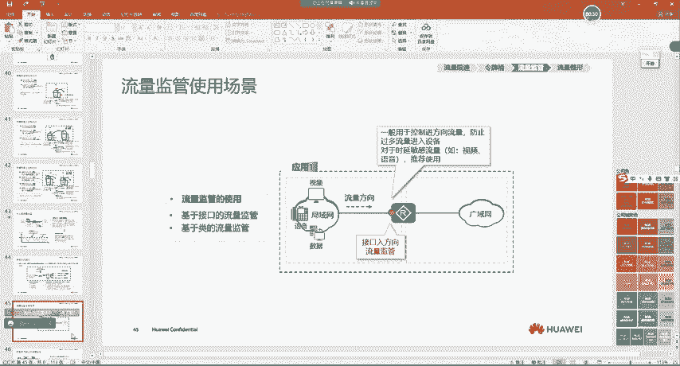

好吧。那这节课我们就讲这么多，今天就没其他内容了啊。这个比较抽象，但是你只要把它想象成水的感觉。是吧嗯，就简单多了。呃，这里先不投C筒，一直在投啊。双筒是两个桶同时在投的。没看到吗？PIR跟CR。

对吧就一个桶上面一个水龙头啊，对，没错，都有单独的。好吧。笔试也有考是吧，那通过这节课的你的学习之后，那我觉得大家笔试应该就能够看明白了。对不对啊？不得先判断嘛？来了报完之后会判断啊。😊，啊。

你意思先比C筒是吧，这不会啊，他要先比P同，先看你有没有特别过分啊，你要特别过分，直接给你干掉。😡，是吧你没有特别过分的，再向下比。😊，好吧。实际上先比C桶也行。能不能明白？比如说我先比C筒。

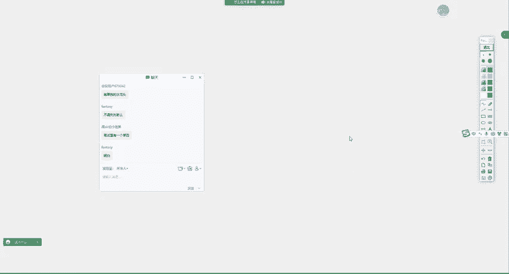

哦，我发现是C筒满足这些绿色，C筒不满足呢，我再去比P筒啊，发现C筒跟P筒都不满足，直接丢了，这样也行。啊，这就是一个顺序啊，这个我们不需要去纠结，反正你正反比啊都是一样的。😡，好吧。

P筒和一筒有什么区别吗？批筒有一个单独的自己的速率啊，叫做PR一筒是没有的。😡，能看明白吗？一桶是当你把C桶投满之后再给一桶。批筒他有自己的水龙头。😡，他有自己的片。这就是他们两个的区别啊。

如果再说区别，那这就是不同算法的区别。一个是双统单数啊，一个是双统双促。😡，好吧。行，同学们，我们今天这节课就讲这么多。然后下节课呢，我们再把监管整形说一下啊，之后给大家做个实验。😊，好吧。

我先把录屏听一下啊。😊。