# 2023 新版华为认证HCIA+HCIP+HCIE全套视频讲解！一套视频让你从入门到精通！CCNA／CCNP／CCIE技术提升同样适用！ - P125：（持续更新）HCIE Datacom - 61.QOS-整形、监管、拥塞管理 - -Book思议8 - BV1W8411A7z8

啊，空调在开啊，在开开着呢啊。行，同学们，咱们上课吧。嗯，还是接着来学技术啊。😊，好吧，接着来学技术。嗯，天气热呢，咱们也得静下来嗯去学技术对吧？好把空调打开啊。呃，上节课呢我们讲到了这个令牌筒。

对不对？呃，讲到了很多种算法，以及这个呃不同令牌统算法的它这个特征。对吧呃，但是另排土呢，我们回过头来看呢，实际上它就是一个呃对这个流量，也就是说对速率检测的一种工具啊。

或者说我们叫做对速率评估的一种工具。对不对？所以说这是令牌筒啊。呃，那我们当比如说啊比如说对流量进行评估，我们评估之后呢，会有一个结果。那这个结果啊是比如说丢弃啊是吧，呃，还是说这个转发呢，是吧。

黄色的豹纹他默认是转发，我们可以看到啊是吧，黄色默认转发哎，那还有非默认啊，对吧，那是不是我们也能让他丢弃呢？是吧所以说啊呃这里大家要注意一下。就是当我们对这个流量的速率检测出来之后。

那么还要有一些惩罚性的措施，是吧？还要有一些动作，就相当于你开车一样。你开车超速了。超速了，那测速仪他就是只检测你的速度啊，他并不能把你怎么样啊，但是呢后续就会有一些人了是吧？嗯，你得交点钱，对不对啊。

就类似于这种。是吧所以说啊我们通过令排统呢，只是对速率啊做出评估啊，就是计算出它的速率。呃，但是呢当我们计算出来速率之后。那这个报文他得到什么样的这个动作处理呢？是吧？我们是给他转发啊、丢弃啊。

或者说呃修改一些东西啊，嗯，这个都是能够进行操作的。好吧，我们是可以呃进行操作的。那怎么样进行操作呢？接下来我们要说的就是啊监管和整形两个技术。其实这两个技术呢本质上都是限速。注意啊。

本质上就都都是限速。呃，但是他们俩限速的特征是有点不一样的。我们来看一下啊。嗯，监管我们一般把它的特征呢。啊，叫做萧峰不舔谷。注意啊，监管我们把它叫做。对吧TP啊叫流量监管。好吧。

那他采用的是卡的方式来对流量进行控制。呃，有人就问了，那老师什么是ca呢？注意啊，监管是这样的。嗯。简单来说呢，就是当我们在接口上通过car进行限速之后。他有一个很简单的特征，你不符合的报文呢。

我就直接给你丢弃了。好吧，那你符合的报文呢，我就给你转发。那这是一种处理方式。好吧，所以我们来看啊，监管它是这样的。在这里呢，比如说当我们来了一个包之后，嗯，你不是要留分类吗？等等一大堆处理。

因为我们分类之后才进令牌桶嘛，是吧？这块我们先不管，比如说我们通过令牌桶呢，最终会计算出三种颜色。😊，对吧。红色呢就是丢弃。绿色呢就是转发黄色呢，我们可以通过监管去给他进行降级。啥意思呢？

黄色呢虽然不符合规定，但是呢。我们又允许他临时的突发是吧？所以说咱给他降低。提供尽力而为的转发。就是你只买了10兆，我就给你10兆。你超出来，我虽然允许了是吧，但是呢我不给你特别好的服务。😡。

所以这个就是我们通过监管。可以去做到的。那监管最终所行。成了一个。呃，我们用这种图啊来进行表示的话，我们把这种图呢啊叫做萧峰不填谷。什么叫做萧峰不舔股呢？😡，首先你的速率由我们的ca来进行限制的。

当你的速率一再升高的时候呢，就上不去了。好吧，这种呢就叫做消峰。然后你最多只能这么多。那不填股是什么意思呢？比如说当有一天我的流量下来了。那你没有达到他的速率呢，那你下来就下来呗，反正你下多少就下多少。

反正最高就是他有没有可能超出这道线啊？😡，有没有可能啊没有可能。对吧我们把它叫做萧风不填谷。那这就是监管的一个特征。啊，那有人就问了，哎，老师那。这他你都说了，不填股，那肯定有填股的是吧。

有填股的那这个呢我们到后面会去给大家讲。😡，好吧，这里先知道监管的特征，我们把它叫做。不。填股。好吧，这是他的一个特征。那什么时候我们才会使用到监管呢？嗯，实际上这个。都行。好吧，就你做个限速呢。

你就监管就行。那一般呢我们是这样的。比如说呢在我的广域广的出口侧。注意啊。现在呢我只有两张，但是我局域网以100兆的形式发给我。我去。那肯定会丢包，没有疑问。是吧肯定会丢。😊，那这时候怎么办呢？呃。

我有视频呐，有语音的，对吧？有数据的。这时候呢你就数据的流量非常多。是吧啊，或者说呢啊就是数据的流量非常多啊。对吧然后我们语音视频呢，他们可能加在一起才占了一仗。是不是啊？呃。

但是呢你的数据流量占的非常多啊，占了98兆。啊，为什么呢？呃可能有些人在那里刷抖音，对吧？因为我们发现刷抖音实际上啊用的流量还是非常多的。😊，对不对？那这时候怎么办呢？

我可以这样就是匹配所有数据的流量啊，我们通过ca给他做个限速，我就给你一张，你用去吧。能不能明白，那还有一兆呢，就让语音跟视频他们去跑。好吧，那这就是监管的一种使用方式。

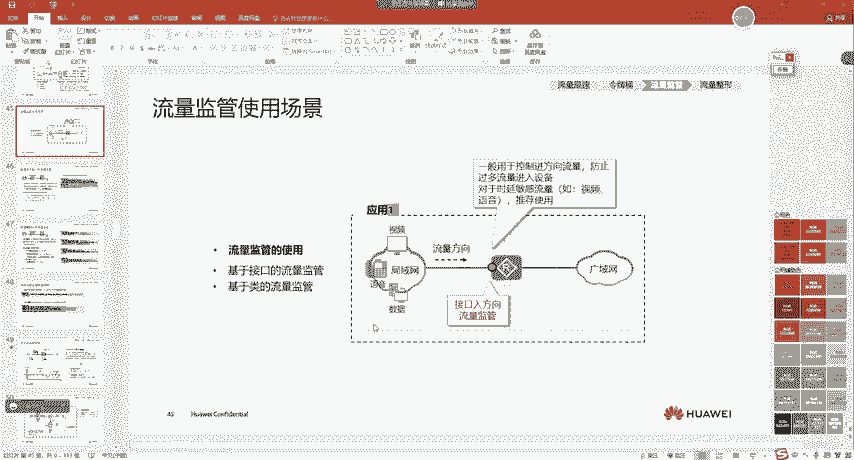

好吧，那这个呢我们可以通过一个实验啊去做一下。

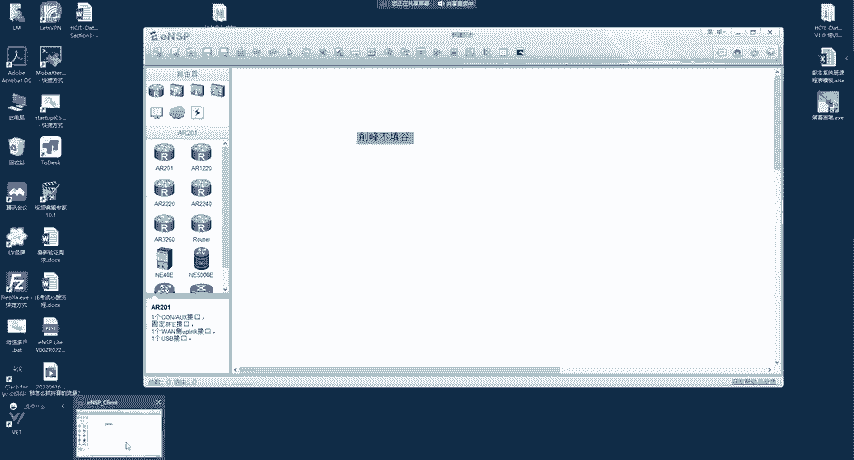

怎么样去做呢？比如说现在。123是吧，我们拉出来三台设备。怎么抓抖音呢？嗯，你还是没懂我的意思啊。数据流量非常多啊。能明白吗？数据流量非常多，你可以这样啊，你把视频跟语音的抵代掉。

然后把其他所有的抓住这些线租不就行了吗？

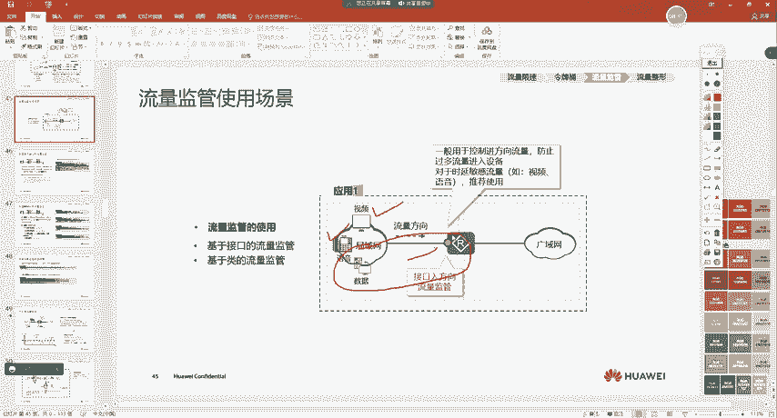

是吧嗯，单独抓抖音的应该抓不着啊，抓不着路由器至少抓不着。

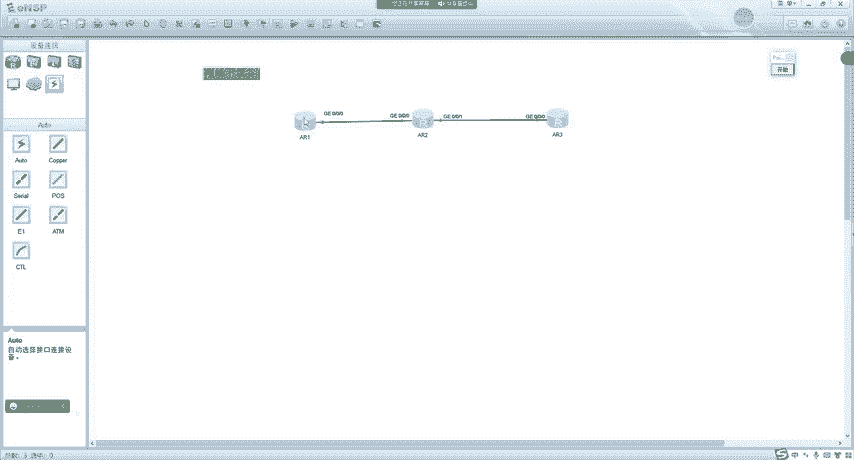

嗯，得用防火墙去做啊。呃。因为你要匹配抖音这种应用的话，那你得读7层。是吧。呃，你读七层的话，你接着用防火墙做，还得用license呢，对吧，还得用license才能做啊。呃。但路由器我印象中好像可以。

是吧你像华为的新路由器那种。呃，什么AR8000啊。是吧。那种好像像啊。但是这种得需要license啊，就是有1个SA功能。呃，就在我们的路由器上啊啊，对，你用尚行管理最好。好吧呃。

就是你得有应用识别功能才行。要识别不了应用，你抓不了抖音啊。是吧原同学可能觉得是吧老师。怎么办呢？嗯，我用这个。ACL匹配行不行啊？那你想的有点多了。ACL虽然在他只是ACL，他最多能抓到几层啊。

抓到这个应用层协议，对吧？嗯。那他读不了里面的内容吧。是不是你像抖音这种能量呢，你抓IP呢，你也抓不着。因为应用的这个IP呢经常会变。

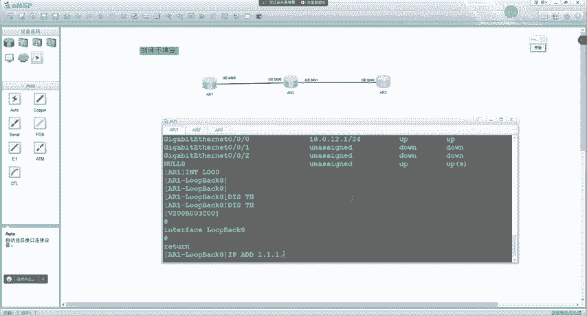

所以最好的话就你用这个像刚宇同学说的嗯，像尚雨行管理啊。是吧防火墙类的。就是你的设备具有应用识别的功能。

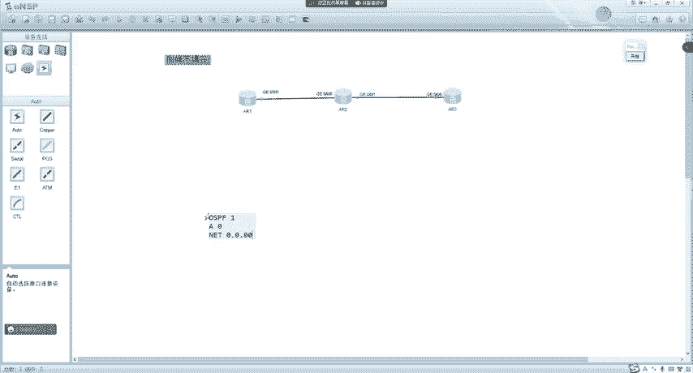

然后你才可以去。限制他所使用的应用。你比如说我们平常用这个交换机啊，路由器啊，他们就没有。是吧。

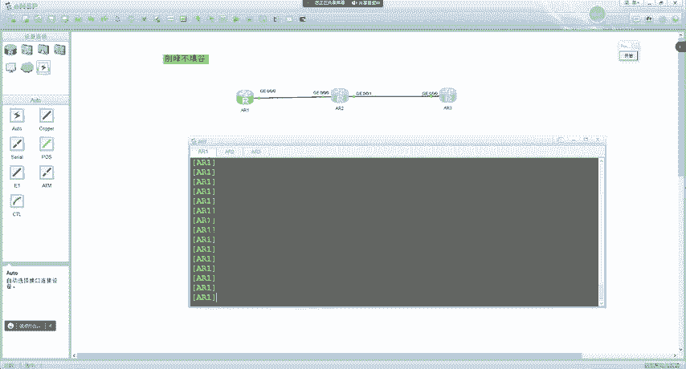

呃，我们来看一下啊，现在我做了一个网络啊，就是123，我跑了1个OSPF嗯，待会呢，他们邻居应该就起来了。

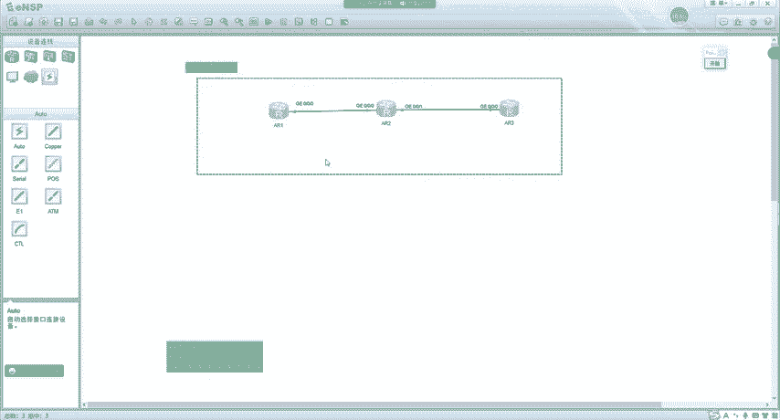

起来之后啊，我现在在一跟三上都起了一个环回口。嗯，对也都通告出去了。好吧，也都通告出去了。呃，比如说我现在是这样的，就是嗯老板有要求啊，什么样的要求呢？😊。

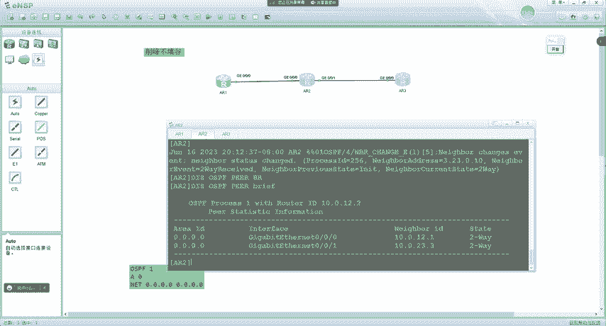

嗯，就是我们这边呢。有一个这个FTP的业务。是吧呃，他的目的地址呢是3。3。3。3。

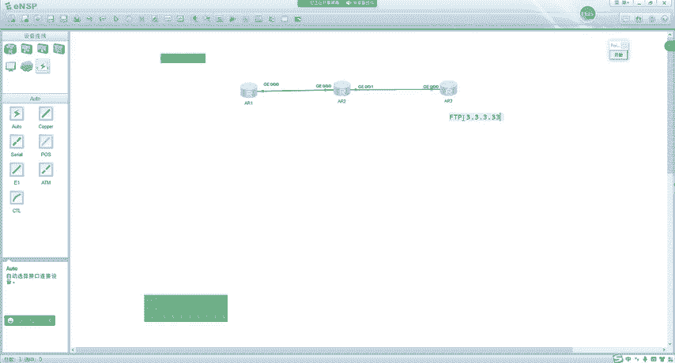

然后我们还有一个呢，interface6百一。

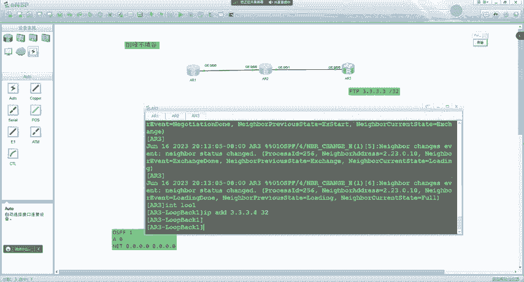

还有一个呢，就是这个。嗯。比如说语音的吧。啊，或者说邮件。呃，还有1个3。3。3。4。好吧，嗯，因为FTP呢，我们有时候需要去下载一些这个。😊，这个这个这个资料是吧，文件。那他对带宽的占用率呢就比较高。

嗯，现在我们可能是这样的，就是这里呢我们就两张。是吧啊，假如说就两兆啊。呃，然后我们的访问能达到10兆。是吧。这就相当于一个水桶一样。呃，你以每秒10升的方式往里面灌水，那出口就有两升。呃大家在这个。

呃，中学或者小学的时候应该都学过。对吧每个小时。放一升水对吧？每个小时水龙头往里面注两升水，什么时候会满？反正总有一天会买吗。是吧一样道理。那在我们的这个网络中也是一样是吧？你出口就两兆啊。

那你入口有10兆呢，他肯定会拥测对，就出口肯定会拥测。呃，现在我们希望是这样的，就是因为FTP呀，它占的流量太多了。😊，是两兆有点说的太小了，比如说八兆吧。好吧，就FTP呢，它占的流量太多了。😊。

就他把这8兆甚至都能吃满，所以就导致呢。嗯，我们在用邮件的时候呢，反正邮件服务器发邮件比较卡。是吧嗯，这是老板给你的要求。给你这要求之后呢。我们还得去想一下是吧，诶，这怎么样去做呢？

我们能不能给FTP做限速呢？是吧这很简单的道理啊。你比如说换到运营商。这是你们家A对吧？这是你隔壁老王家B。对吧。呃，这有一个C。是吧嗯。是一堆啊女同志是吧，都是你的邻居。对不对啊，你们都在一栋楼里。

所以说呢你们连接到了SP的同一个接入交换机上。嗯，但是这个接触交换机呢上行它是一个。一G的对吧，千兆的。呃，我举个例子啊，比如说呢你买了500张。呃，他买了100张。这边呢买了千兆的。直接买啊。

不是前兆的，也买了200兆。啊，或者说都是500兆吧。我想一下啊。啊，这边买了。这个300兆吧。好吧，这边买了100张。嗯，那现在呢可能就有这种。怎么样呢？因为你们最终呢都要从这个上行链路出去是吧。

这你家啊，这隔壁老王家对吧？呃，这是隔壁的这个嗯这。😊，呃，现在马上毕业了是吧啊，到了应届，就毕业季是吧？可能是一些这个学生对吧？他们租在一起啊，这是他们家呃。

现在呢因为你们的上行呢啊就是一个千兆的接口啊，大家都从这千兆接口出去。😊，但是如果运营商不对你们加以限制的话呃，你比如说。是吧啊，大学生晚上可能看电视、打游戏对吧？或者说下载资料。😊。

那有可能他占用的贷宽就比较高，他一下子把这个贷款给占用了。那就会导致你的500兆就没有体验了嘛？😡，是不是这时候我们也得需要限速，你限速500，他限速100，他限速300。是不是啊？

对吧就是不同的用户呢，防止他们之间抢占同一个公共链路的带宽。对吧所以说在这时候呢，我们得对不同的用户啊来进行限速。那换到这里也一样嘛，你FTP你就抢邮件的，太过分了，是吧？我得给你画个三八线啊。

你就能用这么多，剩下的是我的是吧？咱俩井水不犯河水。😡，是吧那这时候怎么办呢？我们就通过限速去做。

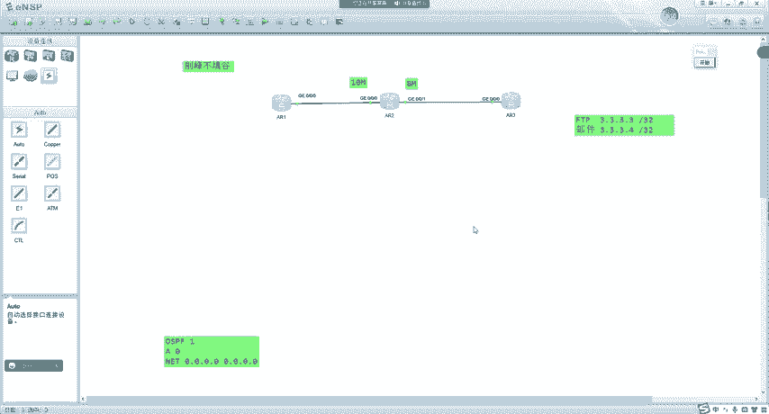

怎么样限诉呢？实际上很简单啊。😊，比如说我们现在来看一呢，去骗一下。骗杠A啊，直接去骗3。3。啊吧啊能偏通偏三。4呢啊也能拼通。是吧嗯，然后我们这样来做啊，比如说我在AR2的。

我这接在G0-0杠0接口下。在他收到流量接口下，因为现在呢是不同的流量，都从一个接口来，那我就。让你们不同的流量在同一个接口下限制一下速率。呃，我在G0-0-0呢这样做啊，叫QS卡是吧？

car就代表监管的意思。我在这个接口收到流量的时候啊。😊，呃。只要目的IP。是。3。3。3。3的流量。目的IP。啊，要要有一个范围啊，3。3。3。3。吐。3。3。3。3。好吧，只要目的IP是3。

3的流量。我都给你用CIR限个数限多少呢？呃，刚我们比如说一共出口就8兆嘛，是吧，我给你5兆。5兆是5000是吧，我们用5000来算啊。嗯，那后面的CBS呢，你可以自己去指定啊，你用到底用什么样的桶啊。

是吧？啊，你可以自己去定。比如说我PR。😊，是吧啊，叉叉叉，这你可以自己去定啊。😊，那现在呢我们只用C筒。就是单数单筒。好吧。那CBS呢，他也默认的，我就不配了。实际上正常情况下，咱们只配到CRR。

其他的就不配了啊。但是后面呢有一些面临要给大家解释一下。😡，PIR呢就是双从双速对吧？你配了PIR之后，还会让你配这个PB。啊，CBS。对吧后面还会有1个PBS。可以看到吧，就你可以用什么样的桶嗯。

你可以自己去指定这里呢我们就用个单筒单数。那未来呢，红色的流量。给丢弃。对吧然后。黄不是黄，应该是绿色的流量。啊，绿色默认就是转发，那就设置不了了是吧？然后我们回车。😊，那这样就代表着呢。

在G0-0-2入接口，只要收到目的IP是3。3的流量，给他限速是5兆啊，CBS默认产生的。对吧呃，还有1个PBS。这应该是默认的啊，正常我们不配不会有。好吧，这应该是版本之间的面临区别。啊。

但是我们不用管它好吧，虽然有了PBS，但是没有PBPIR，所以说它依然是啊单统单素的作用。好吧。然后我们绿色的流量呢就转发啊，黄色的流量转发，然后红色的流量就丢弃。那这是我们当前啊做了一个限速。

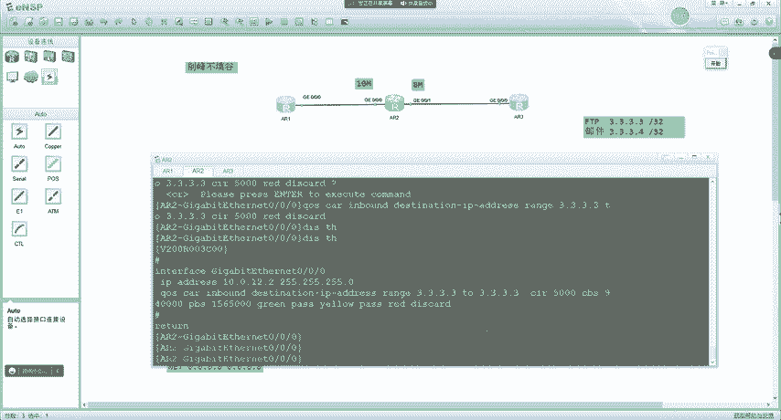

那做完之后呢，就相当于未来。我出口不是有8兆吗？是吧，把FTP限成5兆。那也就是说出口未来肯定会有3兆的空闲。😡，那这个流量呢就交给邮件去了。所以这个大家能够明白吗？明白同学敲一啊。没问题吧。

所以说一定要注意一点啊，限速它限制的是上限。😡，什么叫做限制的是上限呢？我不想你用那么多，我控制你所能用的上限，这个就叫做限速。😡。

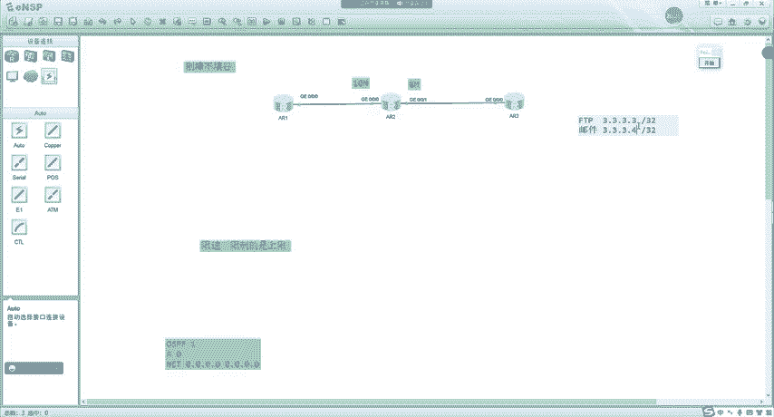

那比如说现在我在一上再去拼一下3。3。是吧有说老师还是那么快啊，那肯定还是这么快。😡，注意啊，因有5张我们在拼的时候，即使我去指定包的大小。😡，是吧我这个1400之间。呃，然后杠A。啊，杠C。

多聘几个包，3。3。3。3，他还不会卡，为什么呢？因为我们5兆，你拼包能占多少啊，对不对？比如说现在我这样。😡，我在二这里呢，QS卡音镑的啊吧，目的IP。只要是3。3的流量。好吧，然后我们给他做个限书。

最小呢就是8KBS。好吧，我就直接给他配成8。然后CBS呢？咱们给他派成1500啊，就按最小的来啊，就是看一下现象啊。😊，嗯。没有PR啊。有啊，CR这不有PR吗？是吧片R我们也配成8啊。CB。1500。

好吧，咱们都配最小的，主要看一下这个丢包的效果。好吧，然后PBS呢，我们也给他配成1500。😊，然后回车。实际上我们把PB跟。这个CBS。PR跟CCIR配的一样的时候，它类似于单筒单数的效果。

是吧是一样的啊。然后注意啊。现在我在A21上再去聘3。3的话。你发现呢？嗯，开丢8万。是吧啊，通一个挂一个。对吧，通一个又拐一个。是吧通一个又挂一个。对吧那这里是为什么呢？

是因为刚刚我们在进行了限速之后。😡，如果。就是当我们没有足够令牌的时候，是不是就代表着这个包发不出去啊？所以我们可以向他看到AR遗产啊。通了一个之后，下一个挂了，但是这个挂的包被丢弃了。

是不是没有减少对应的令牌啊？所以说攒了一会儿呢，又通了一个包啊，又挂了一个又通了一个又挂了一个。😡，好吧。所以这个意思大家能够明白吗？明白的同学敲一啊。问题吧。

这就是我们在进行限速的时候怎么样去进行使用。😡，啊，但是现在呢我们只是用看来进行限速。但这个默认的行为你可以自己去改啊。😡，比如说老师我能不能这样啊。是吧。呃，绿色的。转发黄色的转发。黄色的转发。

对吧红色的也转发。所有颜色的都转发，那大家觉得还会丢疤吗？还会不会？注意啊，这时候就不会了。好吧，是不会的。啊，因为我们把它的颜色呢嗯已经给他指定为转发了，对吧？所以说这个默认行为虽然我们可以去改。呃。

但是呢不建议大家去修改。

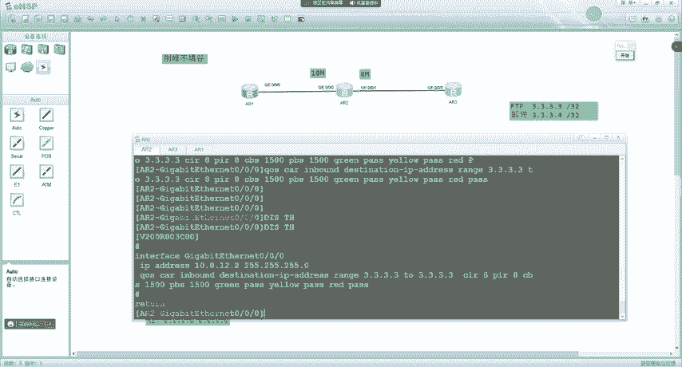

好吧，但一般我们在做实验的时候啊啊，包括你在工作的时候，一般就是QS卡。😊，CR啊叉叉叉。好吧，呃，后面的CBS呢，这些嗯反正我没有配过啊，没有配过。

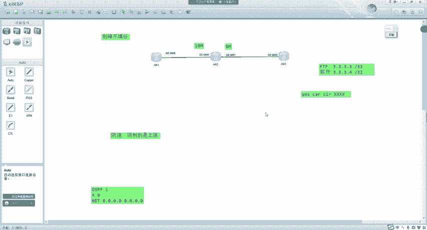

啊。所以呢这里就是我们所说的嗯监管技术。那下面呢我们还有一个整形。这整形再来给大家说一下啊。😡，整形呢实际上跟监管都是用于限速的。😡，但是整形和监管呢还稍微有点区别，啊就是它的特征呢嗯不太一样。啊。

为什么我们说不太一样呢？整形是这样的。呃，整形呢。😮，我们把它叫做薛峰舔谷。啊，季薛峰也填补。那是怎么样的呢？注意啊，整形只能在。出口方向使用。入口没有整形。好吧，为什么呢？

因为整形它是依赖于缓冲区啊来进行实现的啊，大家可以理解成就是内存。😡，好吧。在出口才有缓存啊，入口是没有缓存的。啊，比如说一个流量呢，我们这样发过去，在这里才有缓存。这个流量回来的时候呢。

在这里会有缓存。哇跟随流量的方向，在出口才是存在缓存的。所以说整形我们只能在出口去做，它本质呢也是一种限速，但是和监管稍微有点区别。😡，那他是怎么样来做的呢？是这样的。😡，比如说当我们配置了CR之后。

你流量不是正常发吗？一旦超出了CR啊，那你就只能这么多。😡，好吧。那在这段时间，如果是监管超出的这些报文，他就直接丢弃了。😡，是吧。那对于整形来说呢，超出速率的豹纹它不会丢弃。😡，各位同学要注意啊。

整形对超出速率的豹纹是不会丢弃的。他会进行缓存。缓存了之后，比如说当未来的某一个时刻，流量没有这么多了。对吧我们看到实际的流量实际上没有这么多了，我会将缓存慢慢的发出。所以说从整形我们可以看到。

它首先呢是没有办法突破峰值的。对吧，但是当我们实际流量没有这么多的时候，他将缓存的豹文不断的进行发出，是不是可以实现一个削风填谷的作用？😡，好吧。那这个就是整形。😡，那整形应在什么样的场景呢？对吧？

也就是说老师整形跟监管又有什么样的区别呢？😡，是吧我们先来慢慢的看。😊，首先我们来看啊整形它的缓存是怎么样的一种依据。比如说在这里呢呃我们有一个队列。注意啊，有一个队列。那之前我们说过。说过什么呢？

就是这个整形啊，就是我们差分服务呢，基于队列去实现。😡，是吧我们也可以给每个队列呢去做限速。比如说我给队列限速用的是整形，他就是这样的。比如说这个队列的包，我要发出来了。发出来的时候呢。

我会过一下这个令牌筒，就是我们配置的整形的令牌筒。他会过一下。如果符合呢，那这个报文就转发。如果没有符合，对吧？就是你这些红色的包整形只能用单筒单数啊，红色的包呢它会缓存到队列中。啊，就你再去排水队。

我现在呢令排筒限着速呢。能不能明白？那未来呢，当一旦有了流量之后呢，就流量的峰值没有这么高了啊，再慢慢的把队列里面的包给他发出来。那这个就是整形。整形我们可以基于队列去做的同时呢，也可以基于接口去做。

注意啊，也可以基于借口去做。比如说我们可以把整个接口里面。所有的豹纹去做一个整形。当你所有队列的包都要进行发送的时候，一旦超出了速率，就缓存到对应的队列中。那这个就是整件。好吧。

那我们来看一下整形是怎么样来配的。这里我先给大家梳理一下啊。整形跟监管的区别啊。整形什么意思啊？百度搜一下吧。整形和监管的区别啊。这个就是技术的命名啊。😡，好吧。呃。我也没办法跟你说，他就这么叫的。😡。

是吧他就这么叫的啊。😊，嗯。呃，这个整形跟监管的区别呢啊我们可以从多个角度去看是吧，首先呢。😮，呃，我错个表格，这是整形。然后这边呢是监管。第一个区别呢呃我们可以在应用方向上。来进行对比。

整形呢他只能在初方向使用。而监管呢？出入。方向都可以。出和入方向。好吧，这是第一个区别啊。嗯，第二区别呢，我们可以从这个丢包率上来进行考虑。对于整形来说呢，他的丢包率啊相比监管来说较低。对不对？

因为监管对于超出报文的这个流量呢啊直接进行丢弃是吧？所以说他丢包率会变高一点。而对于整形呢是缓存对吧？所以说它较低，而监管呢呃丢包率就较高。好吧。然后我们也可以从岩时角度去看。整形。

因为你超出速率的报文，呢要进行缓存。对吧那未来当有足够的令牌才能够发送出去。那么在这时候，他的延迟是不是就较高啊？是吧会增大这个延迟时间。而对于整形来说呢，它的延迟啊监管啊就较低。对吧因为监管很干脆。

啊，你抄了就给你丢了。是吧。那这也是他们的一个区别。嗯。那还有一个就是对。超限。豹纹的处理。对吧。整形呢嗯就是缓存。那监管呢？啊，就丢弃。是吧。所以说这就是整形跟监管的一些区别啊。呃。

这个大家能够理解吗？理解同学敲一啊。没问题吧。缓存，那不会缓存那么久啊，梦想哪有那么久的。😡，没有那么久的。你不能用你那个。😡，计量时间去理解设备啊。是吧。你比如说你觉得缓存，它可能缓存个一两分钟。😊。

没有那么久啊，你不能用你的计量时间去感知设备啊，设备就是缓存一会儿，可能就是一瞬间的事。😡，哇，你都感知不到那个时间。能懂吗？缓存版了就丢弃了啊，缓存版了就丢了。😊。

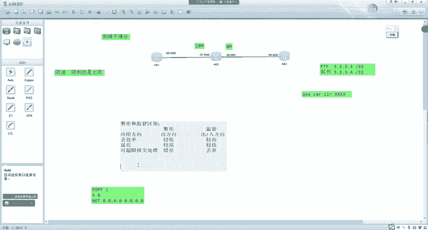

啊，是会的。队列啊，因为我们缓存是缓存到队列中的，这个队列未来满了之后呢嗯这个包依然是要丢的，但是只能从戳就是从大概率上我们来进行判断呢嗯，他的丢包率呢要比监管要少。好吧。

而且呢能够起到一个嗯薛峰不舔股啊，薛峰舔股的作用。

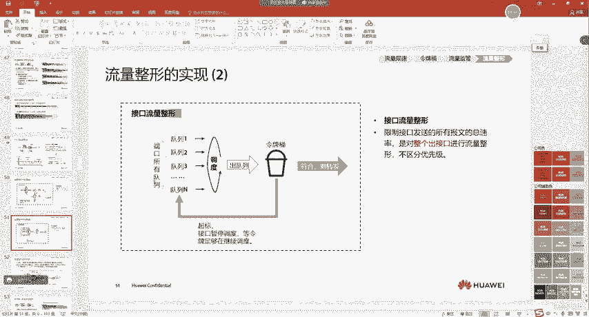

不，这就是整形跟监管的一些区别啊。

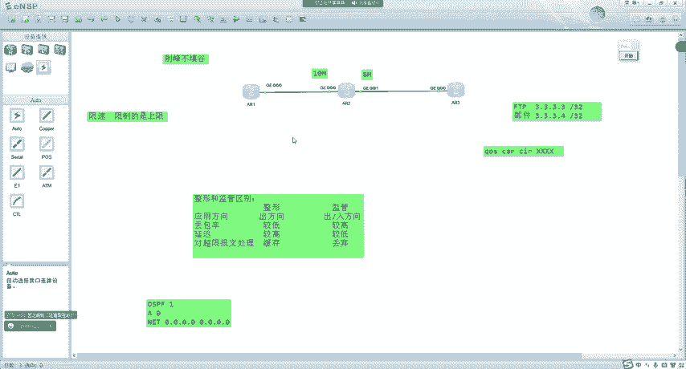

那这时候呢，我们也可以去配这个整形。整形呢我们可以在接口下去做啊。😊，比如说我在G0-0-1。啊，也可以去做啊，比如说我们用QS卡。啊，不对，不是卡GTS。呃，谁啊。能看到吧，就你可以去配置他的这个。

嗯，就是。练牌筒算法。啊。比如说你可以配个。呃，100兆。啊，然后CBS。CPS呢你可以走默认的啊。好吧，大家注意一点啊，整形只能用单素单筒。好吧，整形只有单数单筒啊，他没有这种什么呃，单数双筒是吧。

双筒双速没有。整形只有单筒单数啊，这里大家注意啊，就是绿色呢就转发啊，红色呢就已经缓存，缓存满了就直接丢了。这就是整箱啊。

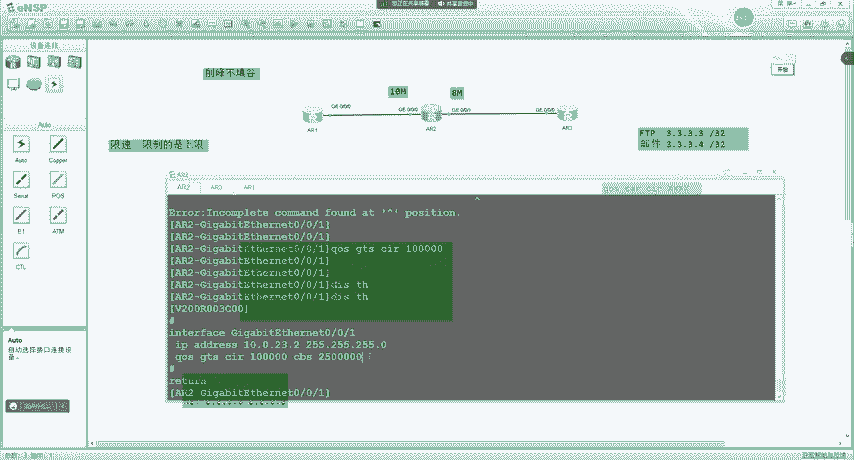

他本质呢也是用于做限速的。但是整形跟监管的应用点是不一样的。监管我们可以只要是做限速呃，没有特殊要求的话，我们就可以用监管去做。对吧那什么时候用整形呢？😡，是这样的。我们来看啊。呃，有时候可能是这样的。

就是这是我们的两个分支，对吧？这边是总部。然后我们通过SP的专线对吧，实现互房。那未来有可能是这样的。呃，当我们的分支呢去访问总部的一台服务器时。比如说访问他的外部服务器。

就有可能呢会产生一个流量的高峰期，对吧？比如说这个业务峰值。啊，你比如说在哪点几点到几点的时候。那么在这时候呢，如果我们通过SP专线进行连接。嗯，他是有这样的啊，就是有些SP呢，他按照流量给你收费。

我举个例子，比如说我们在这里用整形啊，用监管啊。你流量到了这里直接丢弃，你要不要重传啊？要不要？肯定是需要的。是吧你重传之后又来一份包，有些SP他按照流量给你收费啊。😡，对吧。你的手机流量。

那不就是按流量收费吗？你用了多少兆扣你多少钱？😡，是吧你说老师我月租无限用嗯，少吧。😡，你哪怕你用这个大王卡。对不对？那也是啥？对吧。所以在这时候啊。如果我们去用监管的话啊，就会导致很多报文可能会重传。

那这时候呢，这个成本就会变高了。但是如果我们去整形的话，可以降低部分的成本。啥意思呢？就是当我这里产生了用色之后啊，它会进行缓存。那缓存的这些包呢，未来等流量峰值小了，就是稍微一有空间的时候呢。

就是我有足够的令牌了。哎，我再慢慢的把它发送出去。好吧，那这种呢就是整形。那这样的话，豹纹重传就会比较少。😡，对不对？嗯，那也可以节约一定的成本。是吧。所以说啊那整形我们可以去发现啊。

它比较适用于一些什么呢？啊，比如说上网下载对吧，对食盐。😡，啊，对丢包比较敏感的流量。好吧，那这个就是整形。那监管适用于什么啊？你比如说丢包比较敏感，你能用监管吗？😡，能不能不行吧。

或者说我对食盐比较敏感，你能不能用整形？😡，是不是也不行？是吧也不行。那这个就是整形。那整形跟监管呢，刚刚我们给大家演示了，就是在接口下直接去配是吧？

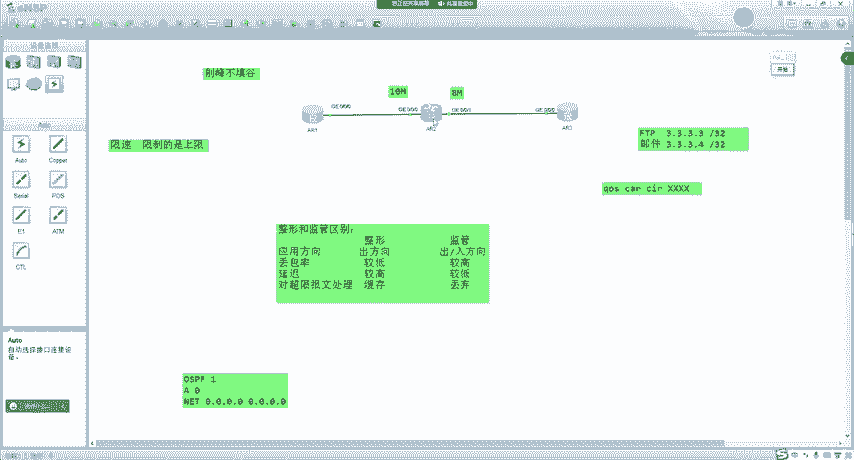

啊，你Q是GTS，它就是监管。

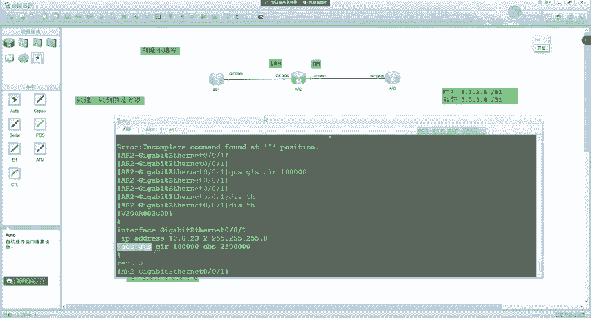

啊这就是整形。然后你Q是CIR呢？就是监管。那除了在接口下配呢，嗯还可以用其他的方式。

比如说老师我这样。tryface。对吧。匹配1个ACL3000。啊，匹配个ACL2天。我用刘行伟。对吧就是我们用刘策略，刘行伟也能去做监管跟整形。behive我一，比如说我看。能不能做啊？

我们能不能直接用刘行伟去做？可以吧。或者说我GTS能不能直接用刘行伟去做？

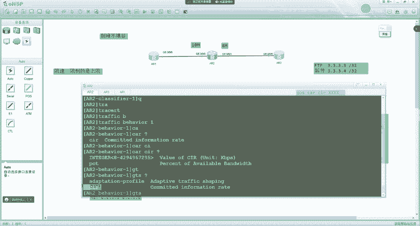

也可以吧。对不对？所以说啊这是第一种配置方式，这种叫做接口下。Zhengxing。或者。监管。他是对整个接口的流量生效。好吧。但你像卡后面有ACL呢呃你匹配ACL就是对特定的流量生效了。好吧。

但是你不做的时候，他就是对整个接口的流量生效。那我们还有一种方式。叫做。通过。这个流策略。配置整形。GTS就是整形的意思啊，通用流量整形。和监管。他是对满足特征的流量生效。

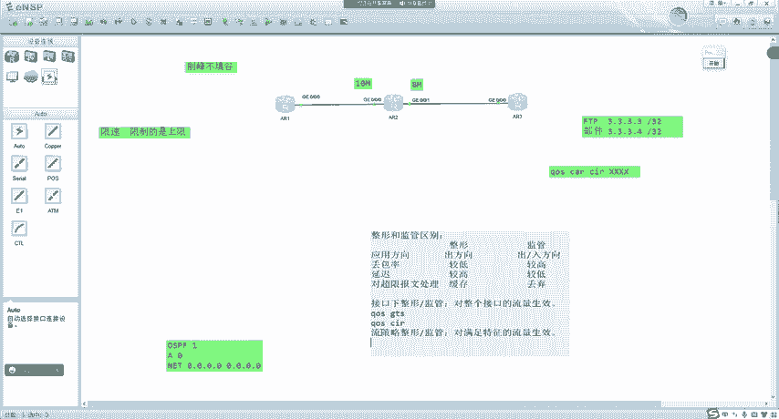

好吧，就是我们在behive这个语句中。

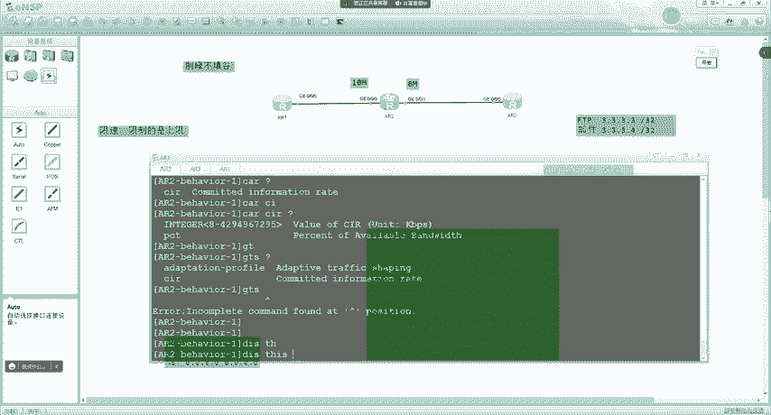

去做。谁啊。或者。啊，去说看。或者GTS。那这时候呢，他是对满足特征的流量生效。同时注意一点。

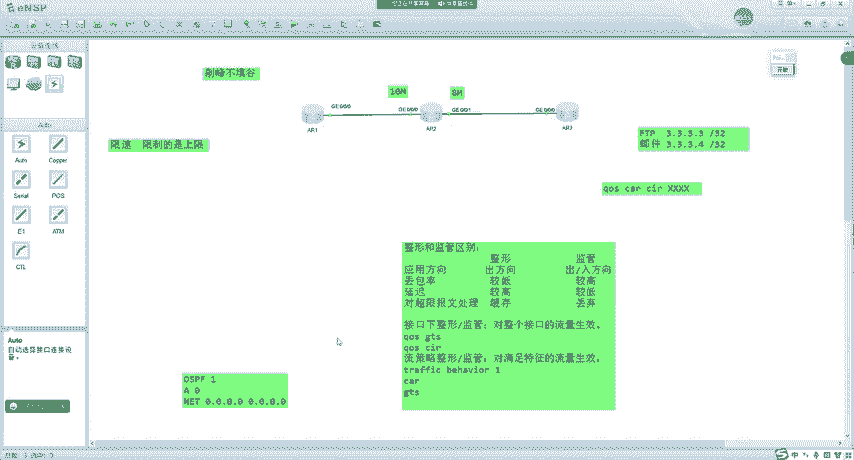

还有一种方式就是整形的，我们刚刚看到他能不能针对于队列去做。你不765432108个队列吗？我们也可以针对特定的队列去做。

怎么做呢？对列没有监管啊。我现在配的大家可能看不太懂。Ha。是吧队列一注意啊，就是我们进入到一个队列配置模板中，就创建一个队列配置模板，名字叫一。啊，然后我们给队列6，比如说我队列6呢。去给他做个整形。

GTS。好吧，CR然后你就可以去配了。比如说1000。

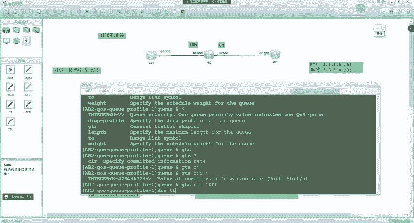

那这样的话就是基于对列去做流量整形。或者说基于队列。这线。他是针对。单个队列生效。哇。好吧，这就是整形跟监管的配置方式啊，就是除了接口下，我们还会有一些。😊，基于其他的方式，你可以做这个整形跟监管。

好吧。呃，这个大家都理解了吗？你同学乔依啊。可以是吧。呃，咱们休息会儿吧。

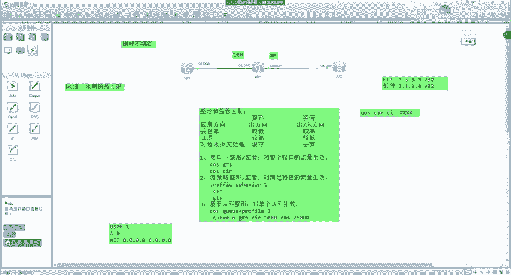

哎，哎，没到点呢是吧？嗯。呃。看俩问题啊看俩问题。😊，啊，我也到点了。咱们来看啊。呃，流量整形对于超限的流量默认进行缓存。啊，流量整形对超限的流量缓存。呃，监管呢对于超限的流量进行丢弃。这个对还是错啊？

啊。没错，都是对的啊。然后另排筒有几种类型。单筒单数。单桶三数。双桶单数双桶双数。是吧。一思啊。134。啊，对，没错，134啊。没有单桶三数啊。我记得昨天还有同学问我呢。啊老有单筒三，咋们也有三束呢？

是吧或者说怎么没有啊，对，说的什么来着，我忘了啊。😊，双素单筒是吧？我不知道哪个同学问的。😡，嗯，你学习角度有点问题啊，就这种问题呢。😡，呃，这就是规定啊。能懂吗？为啥没有，这我也给你解释不了。😡。

你就这就相当于。是吧你某天问我说，为什么秦往扫六河了？😊，是吧哎，赵王为什么不扫六合呢？我也没办法给你解释啊。好吧，规定啊。😊，就是这样。好吧。交给你是吧，老师，我怎么就不是富人呢？呃，我也不能解释。

😡，是吧。😊，好吧。嗯，行，咱们。还没到休息点。嗯。机构怎么知道GTS丢包了？啥意思啊？什么叫机构，怎么知道GTS丢8了？😡，我刚刚啥东西啊？重传他怎么知道？你TCP长时间收不到确认，他可不就重传吗？

😡，那不有序列号吗？是吧你要有底P，那就不冲转了啊。😡，要TCP那不就有重传吗？😡，对不对啊？好。嗯，行，那这个咱们就说这么多吧。😮，然后我们接下来再讲一个技术。呃，这个技术呢叫做庸色避免。好吧。

我们来看一下啊。呃，什么时候会产生用测？那这呢大家应该都是比较熟悉了。是吧。就是老师我挣钱多花钱少，那你钱包就得赌一赌。😡，是吧但你挣的少花的多啊，那你钱包呢，他就不赌。😊，是吧。呃。

一样的道理换到咱们的设备上也是一样的。😮，当我入口的流量比出口要多的时候。那就会产生庸塞。对吧。第一种是带宽不匹配啊，就是入口呢流量比较多，对吧？出口流量比较低。那第二种呢就是下行接入都是100兆。

而我上行只有一个出口，也就100兆。😡，也会产生庸塞。对不对啊？那这就是庸色的产生。总结就是当出口不能满足入口流量转发的时候。那豹纹就会或者说链路啊就会产生庸色。那庸测之后会有什么样的影响呢？是吧。

就老师庸测就庸测呗。对吧你比如说老师我饿着肚子呢，要没是吧？我们一般说饿肚子就饿肚子。😊，那你为什么觉得饿肚子不好啊？你觉得哎老师心里难受，就总想吃点东西，对不对？而且饿走了还会饿死。😡。

是吧那庸测也是一样啊，他用测会带来什么样的问题呢？我们为什么要解决它呢？😊，我来看一下庸色产生的影响。那这个影响就比较多了。比较多的有哪些呢？首先第一个。庸色增加了报文的传输延迟跟延迟。

报文的传输延迟跟延迟的抖动。是吧。一旦产生了庸色之后，那你就要排队延时就会增加。那比如说网络中有一些突发的流量，一会儿拥色，一会儿不拥色，那抖动呢也会增加。是吧。而过高的延迟呢会引起豹纹重传。啊。

比如说我们的延迟非常高，那我发个包给你，对不对？你给我缓存起来了。😡，或者说你在队列排着队呢。我这边还没收到回班，我都觉得哎，那个包是不是丢了啊，我又重传一次。😡，有没有这种可能啊？有吧。

对吧过高的延迟呢，可能会导致设备原端认为豹纹丢失了啊，它就会重传。😡，那庸色还会导致的一个问题什么呢？使网络的有效吞吐量降低。那造成了网络资源的损害。嗯，我也没太懂他的意思。网络有效吞吐量降低。

不用管他好吧，呃，我没太懂他的出发点。但是不受影响，好吧，这就是写课件的人，他可能是这么想。😡，对吧呃，但是呢我没有理解到。😊，是吧没有理解到啊。😊，那。下一个点呢叫做庸色家具会耗费大量的网络资源啊。

特别是存储资源。不合理的资源分配，甚至有可能会导致系统。陷入资源死所而崩溃。啊，这个应该是这么个意思。😮，比如说有时候。注意啊，我们再去下载一些文件的时候啊，大家应该有这种经历，就是你还没下载好呢。

这个文件已经在你硬盘上产生出来了。😡，应该有过吧。对吧。那最后当所有的包都过来之后呢，他再组合成一个完整的文件。是吧。呃，那如果庸测产生的。比较严重啊，那可能就代表有很多包在排队呢。是吧。

就会导致你这个文件呢啊一直在你的硬盘里啊，但是很久之后呢，它才能够组合完成。😡，他应该是这么个意思啊，我的理解角度啊，是这样的。😡，好吧，所以这个大家能够明白吗？😡，明白的同学敲一啊。没问题吧。

这个说的是比较官方，对吧？但是如果换到我们大白话。😡，是什么呢？老师优侧上网卡。😡，对吧打电话卡我们就是一句话，说白了就是卡是吧？这个只要一卡，客户就得找我。😡，嗯，那甚至还有可能投诉。对不对？

那我们一般把什么延迟啊、抖动啊、丢包啊全部认为是卡。所以说如果用我们大白话来说，用色呢就是网络体验感不好，会卡。😡，对不对？那怎么样去解决这个庸色的问题呢？是吧。那我们需要一种技术。

庸色避免是其中一种啊，还有一种呢叫做庸色管理。用色避免是什么呢？😡，就是我尽可能的不让他庸死。这是庸色避免。用测管理是什么呢？就相当于这个交警一样。对吧当你产生了堵车啊，交警就过来告诉你，你往那走。

你往那走，让人家先过。对不对？那这种叫做庸色管理。是吧有所避免，就是大家都有红绿灯，你们平常按照红绿灯去走。😊，是吧我们会发现，当有了红绿灯的地方。我。大家有没有这种经历，我不太清楚啊，我是有的。😡。

之前呢啊在我的老家那一段，好吧，我在回家的时候总会遇到一段路。😊，每回这个路都堵得很。后来有一次呢上红绿灯了，他就不堵了。是吧那这种相当于叫做庸色避免是吧？只不过是现实生活中的庸色避免。对不对？

那在我们的网络中呢，也有怎么样去避免庸塞呢？我们来看一下啊。优色避免呢是通过监视网络资源。比如说队列或者内存缓冲区的使用情况。在庸色有加剧趋势的时候，主动的去丢细胞纹。对吧调整网络中的流量。

解除网络过载的一种流控机制，说的太官方了。是吧我用大白话来给大家解释一下。😡，庸侧避免是什么呢？就是当我觉得可能要赌了，我先丢几个包，我不让他赌。😡，所以各位同学明白了吗？明白同学敲一啊。能懂吗？

什么流控机制啊。😡，是吧。说的比较呃高端。对不对啊，他就是这样的。好吧。那是怎么样的呢？我们来看一下啊，那对报文的丢弃策略呢，我们有很多。😡，首先第一种呢叫做伪丢器。还有一种呢。叫做IED好吧，呃。

不叫read啊，叫IED。😡，还有一种呢叫做WRED那这是一个发展历史。怎么样来进行发展的呢？啊，他是这样的。在早期的时候啊。我来看一下。比如说现在。我有呃每秒发6个数据包，但是每秒只能发出4个数据包。

是吧。啊。那后两个包就被丢了。那懂吧后续向该队列发送的报纹直接被丢弃。也就是说这个队排满了，那这两个包就被丢了。😊，这就是很简单的啊，这种就叫伪丢器。但是我们发现这个伪丢器。😡，有没有缺陷啊？有没有啊？

有吧，有什么缺陷呢？他可能是这样的。😡，老师啊。哎。这个伪丢器啊。是吧注意他的缺陷导致的。叫做缺点一。TCP的选举同步。注意啊啊什么文件损坏啊，文件损坏那里应用应该考虑的好吧，我们网络层不管啊。😡。

能懂吗？对吧甩锅找研发去是吧？我们网络层不管啊。😡，那这种伪丢器呢所导致的第一个问题。😡，是吧就叫做TCP的全局同步。那什么叫做TCP的全局同步呢？我们先来讲一下好吧，给大家讲一下啊呃，TCP啊。

它的一个启动过程。😡，呃，TCB的慢启动大家应该都学过吧。修过吗？没有。嗯，没有，你们得课下补补课啊，我简单来给大家说一下啊，因为我也忘的差不多了。😊，是这样的啊。呃，TCP这个协议啊在设计的时候嗯。

应该有同学听说过啊，就是。😊。

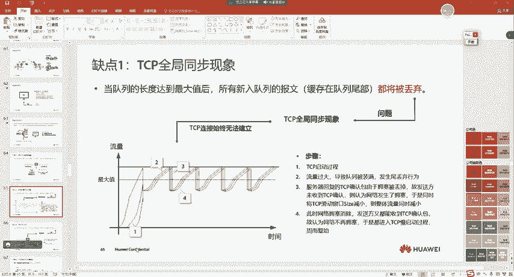

UDP呢？嗯，他有一个特点啊，他就一个劲的往前冲，对不对？TCP单应该听说过一点啊，他有自己的呃庸色避免机制。😡，对不对？呃，TCP的用测避免是怎么样的呢？嗯，是这样的啊。比如说。当我开始发流量的时候。

TCB有一个特点，它不是说一下子直接带宽打满了。😡，他不是啊，有时候你会发现呢，你访问一些网站啊，呃，他刚开始都要转两个圈呃，转两个圈之后呢，然后就变得快了。😊，是吧TCB刚开始是这样的。

就是他的流量呢啊对，还有优色窗口，但是我记不太清了啊，就我简单给大家说一下啊，在我脑子里面的TCT的慢启动过程啊。😡，嗯。他这样的啊，大家主要理解这个特征。好吧。比如说在这里呢，是我们的这个速率。

好吧呃，在这里呢，假如说是时间。😊，当我们的1个TCP应用在开始发流量的时候，他是这样的。😊，嗯。他有个单位啊，这个单位比如说就是01234。好吧，啊，01234啊，这里假如说是100。呃。

每一个单位呢，我印象中好像是512个字节。我印象中是这样啊，这个在有一本书叫做。IP服务质量啊里面好像有介绍的啊。呃，但是这里大家不需要去关注啊，就TCP刚开始它这样的，就是从刚开始的流量呢。

是从一个倍数的形式往上翻的。😡，比如说512字级对吧？假如说就是一一然翻成22翻成44翻成6，一直从成指数的形式啊，一直往上翻。😡，那翻到什么时候呢？😡，翻到会有一个叫做。慢启动门线。注意啊。

他会翻到一个叫做慢启动门线。😡，呃，我们假如说他是50。好吧。那翻到这个50之后呢，他就是每一次加一，每一次加一慢慢往上涨TCB流量。周一。如果在这时候网没有卡。😡。

对吧就是我们的路由器带宽都是满当当的。😡，对不对？那这样说这个慢启动门线是不是会一直往上涨？😡，对吧啊一直涨一直涨。涨到什么时候呢？涨到开着头包。😡，一旦产生了丢包之后呢。

比如说涨到80的时候开始丢疤了，那这个80呢，我们就把它叫做一个庸色窗口。那一旦产生了丢包之后，TCP怎么判断丢包呢？😡，没有收到ACK。啊，我记得好像是三个数据包，没有收到AACK。😊，我印象中是啊。

但大家主要理解我说的特征。😡，能明白吗？因为这个不是我们学习的重点啊，就你知道TCB有这么一个特征。😡，然后一旦没开始丢包之后呢。这个TCP啊，他就会把自己的用测窗口注意啊。😡，直接降到100。

直接砍一半啊，比如说80就砍到40。😡，谈到40之后呢，再慢慢往上涨。😡，注意。😡，TCP流量减少了。比如说在这里TCP流量一旦TCP流量砍到了一半。但然说这个接口的TCP流量会不会减少？😡，会吧。😡。

因为你TCB不发包了嘛。😡，对于路由器来说，那这个接口的TCB流量就少了。😡，是吧但是UDP就是无脑冲啊。😡，对不对？😡，跟他二愣子一样啊，UDP你管你赌不堵，我他妈就是冲。😡，是吧。😡。

那TCP流量一旦减少。😡，这个接口带宽刚释放。😡，对不对？UDP突然来了，一下子给他顶满了。😡，你顶满之后，我TCP可能刚涨到50哎。😡，又堵了。😡，是吧。😡，然后TCB坑一下子又减一半，减到25。😡。

对吧这时候这个接口又释放了20兆带宽。😡，是吧。有的片哎。😡，是吧看到机会了啊，你不要我要是吧，尤礼B又给他怼满了。😡，是吧。😡，堆满之后呢，那TCB哎又会往下降。😡，是吧所以导致的第一个问题。

我们把它叫什么呢？叫做注意啊。😡，TCP饿死。😡，是吧就是网络中的TCP越来越少。😡，对吧TCP本来想着与人为善，就是与己为善，结果呢遇到了个不要脸的对吧？那UDP你不要我要是吧？你待会儿UDP又来。

你不要我要是吧？TCP要面子啊，哎，给你给你给你给你对不对？😡，是吧慢慢的TCB就没有了自己的地位了。😡，所以说第一种现象呢，我们把它叫做TCP2。😡。

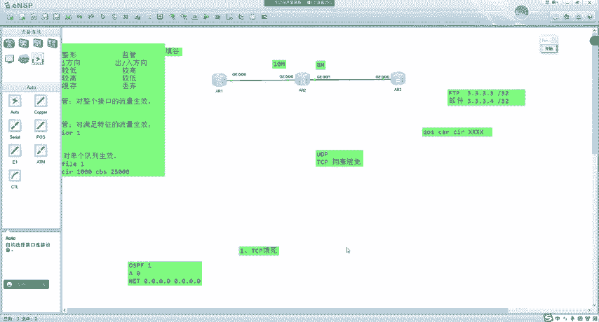

那。😡，第二种问题是在哪里呢？我们可以去看到啊，就是还有一个特点，就是TCP流量，它是不是到达峰值之后突然降少，然后慢慢的涨又突然降少，慢慢的涨又突然降少。😡。

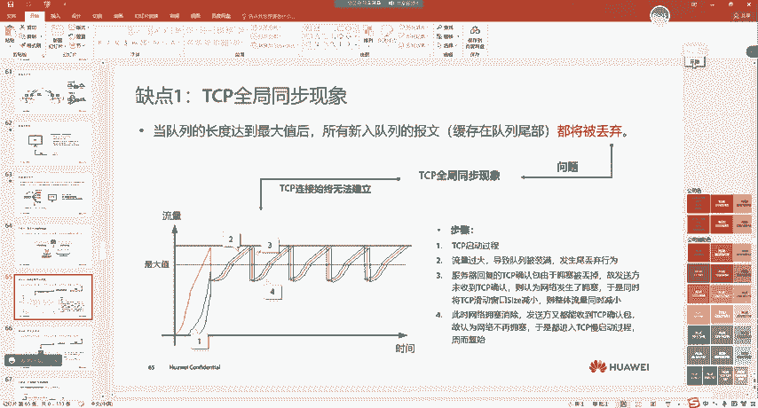

对不对啊？所以这里各位同学能明白吧？就我们发现呢TCV流量非常的不均衡啊。😡，你突然降少又加突然降少又加。😡，是吧我们把这种现象呢就叫做TCP的全局同步。😡，好吧，所以说这是他的。第二问题。叫做。

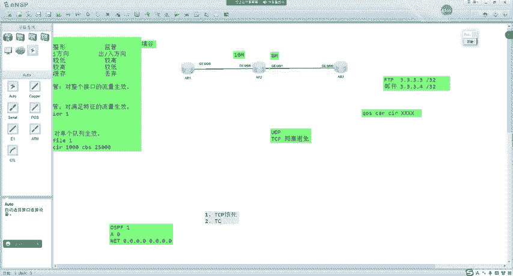

TCP的全局同步。是吧就这TCV流量呢一会儿多一会少。😡，对不对？那还有没有其他的呢？也有。😡，你是伪丢弃啊，那现在有没有可能是这样的？😡，我的五跟六啊比你的二跟三要重要一点。你让我先过吧。😡。

有没有这种可能？有吧。就像你堵车一样，你堵车的时候。😡，那比较重要的一些救护车啊，对吧？消防车啊。😡，对吧警车啊，他不就比你先过吗？为什么？因为他们的事情可能比你是要重要的。😡，对不对？是吧去晚一会儿。

可能这个待会别人的人命就没了。是吧就是我们会发现呢，有时候可能在同一个队列中。😡，他们数据包的重要程度呢还有可能有点不一样。对不对？那这时候怎么办呢？这也体现了他的一个缺点。注意啊，叫做无差别丢弃。

怎么叫做无差别丢弃呢哎。😡，他是这样的。这不。有几个关键数据包嘛是吧，我们有三个关键数据包，你伪丢器给我干掉了。但是你前面有三个非关键数据包，你却给他转发了。是不是这是如果换到你身上。

你就觉得待人不公啊是吧？比如说你急性阑尾炎，你跑到医院呢，人家让你。😡，而这有俩。是完了肚子疼的，不是再有俩呃发烧感冒的是吧？呃，36度7啊，37度2对不对？就低烧嘛也不严重。你急性阑尾炎呢。

他让你排着队。😊，那你愿不愿意啊？😡，你是不是也不愿意啊？😡，对不对？完了再来一会儿对吧，再玩一会儿马上都要死了。😊，是不是啊？所以说我们发现医院在处理的时候呢，有些重要的病人呢。😡，先给你处理。

对不对？有些不重要的呢嗯就分类。是不是？所以说网络中也一样啊。😡，对吧你会发现你越想越贫，对吧？老师这Qs怎么都是人情世故啊？😡，是不是那就是这样。😡，网络中也一样啊，他有些包就是比较重要。😡，对不对？

地位不一样。那你有一些非关键的包，你占用了资源。😡，怎么办呢？我们就得想办法去调整一下是吧，你就是那个上帝之手。😡，怎么办呢？我们现在发现了有一点非关键的包呢，它占用了队列。😡，而对于关键的数据包呢。

没有占用到队列。对吧而被丢弃了。是不是哎，那也是他的一个缺陷，就是伪丢器呢也无法对流量进行区分。😮。

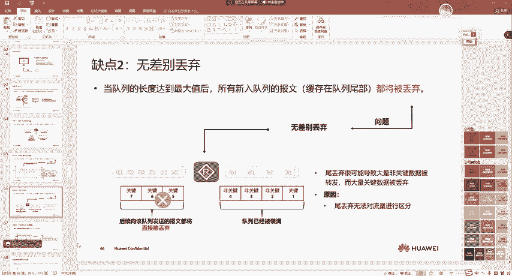

好吧，所以我们可以去看到伪丢器的三大缺陷。TCP盒。全局同步，还有一个什么叫做无差别丢弃。对不对？这是未丢弃缺陷。所以到这里，各位同学能不能明白啊？明白同学敲一。好吧。好，那咱们休息一会儿啊。

休息10分钟。十0分钟之后呢，我们来讲一下。😊。

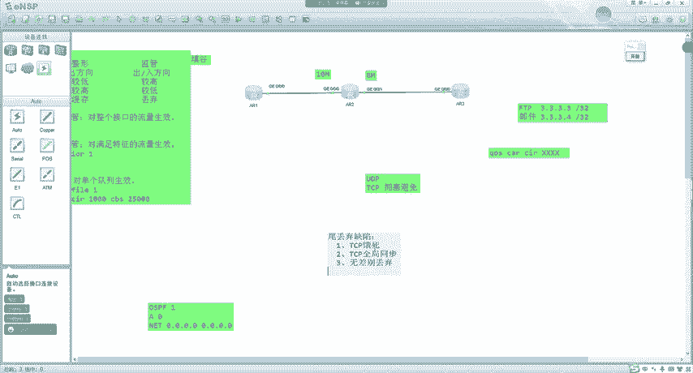

是吧老师这个问题怎么解决啊？嗯，讲一下休息会。😊，是吧这一会呢之后来讲啊。😊，呃，为什么还要庸色避免？我举个例子。😡，比如说。😡，有了红绿灯会不会堵车啊？😡，会不会？有可能吗什么有可能啊。😡，就是会。

😡，是吧那下班高峰期，那哪里都有红绿灯，哪里都堵啊。😡，对不对啊？是吧为什么呢？因为在那一个时刻。😡，车太多了。😡，是吧网络中也一样，有没有可能在某一个时刻流量太多了？😡，是吧而我们的。😡。

庸色避免避免不了了呢，你只能避免绝大多的时候，但是可能就有那么一些突法是有可能的。😡，是吧所以说网络中也是一样的。虽然我们后面会去采用，就是有庸色避免机制，但是不能完全的去解决庸色问题。😡，能不能明白？

不是说你庸色避免之后，对吧，以后就没有庸色了。嗯，不是这样啊。😊，并不是。行，同学们，我们休息一会儿，休息10分钟。😊，好吧，十分钟之后我们继续啊。😊，呃，抖音为什么？咱们继续啊呃。

刚刚给大家说了这个伪丢器的三个缺陷是吧？呃，接下来我们来看一下啊，就是之前的一种解决方案。嗯，现在呢已经不用了啊，现在已经不用了。😊，嗯，但是我们还是看看吧，看看。这种技术呢我们把它叫做早期随机检测啊。

叫做ID。

呃，他是怎么样的呢？是这样的。

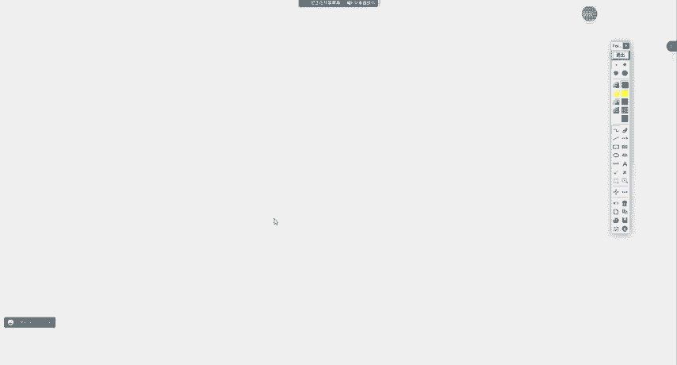

呃，早期我们有一种解决方式是这样的，就是。这个对列啊。他不是满了之后才会伪丢气吗？是吧。呃，早期有一种解决方式是这样的，就是我给这个队列啊。😊，设置几个参数。这几个参数呢？也叫做低门下。嗯。

一个叫做高门线。还有一个呢叫做丢弃概率。呃，他们之间有什么样的关系呢？就是比如说我队列。是吧刚开始的时候呢，没有到达地门县。我就不丢包。是吧。呃，但是一旦到达地门县之后。这时候呢。呃，我就开始丢包了。

这个丢包率他是怎么丢的呢？他会随着。门就是对列。越长对吧？因为一共就这么多，随着队列的使用程度使用的越多呢。啊，我就丢的越多。当到达高门县的时候。就会到达最大丢弃率。好吧，这个最大丢期率呢。

我们可以自己去设置啊，比如说你可以设置成50%。😊，到达高门县的时候呢啊他就到达了50%的丢弃率。好吧，而我们最多呢是100%，啥意思呢？未来一旦超过了高门线。😡，是吧从这里超过来了。

那我们还是会制定伪丢弃行为。好吧，那这个呢就是ID技术。😡，ID的思想呢也很简单。啥意思呢？就是我有个地门线啊，当超出了地门线呢，就相当于一个告警。😊，我就开始丢包了，就是防止未来出现大的问题啊。

防止未来出现大的问题。那这个就是ID。啊，就像我们这个国家一样啊，不是啊，但是说的有点大。😊，是吧呃，就像我们现在一样对吧？呃，现在很多说我们国家这个生育率比较低。😊，对不对？那什么时候开始的呢？嗯。

至少前些年嗯我没有听说过类似的言论。好吧，当然那时候呢，身边会有很多人。已经在出现。呃，非常晚婚的了。对不对嗯，但是到现在呢。😮，嗯，有时候我去。比如说打开抖音啊是吧，呃，刷几个视短视频。呃。

我就会发现呢。现在各种在说啊，我们国家生育率很低。对吧那也是一样的，就相当于之前我们国家有个地门线。😡，对吧呃，在这之前的生育率啊，你怎么样？😊，实际上都没有特别大的影响。但是一旦超过了这个警戒中之后。

是吧。我们就会发现呢这问题可能未来会导致的比较严重。对吧所以说各种给补贴生育率越低，我们给的补贴就越什么啊越高。😡，是吧所以说大概是这个意思，就是我们的队列IED技术也类似于这样。😡，他类似于什么呢？

😡，就是相当于。有了这么一个警界中，它就叫低门县。一旦超出了这个值之后。是吧嗯，就会慢慢的去增加丢包率，防止未来出现未丢弃行为。所以这个就是IED技术啊。那这个技术大家明白了吗？😡，明白的同学敲一啊。

没问题吧。😡，但是RED技术我们会发现有一点。😡，哎，老师啊。他是随机丢弃啊。😡，对不对啊？随机丢弃就有可能会产生一个问题。什么问题呢？他丢的有TCP的这儿没什么是吧，但有没有可能他丢的还有其他的呢？

😡，是吧我们发现啊，对，首先随机丢弃，不区分豹纹的重要程度。😡，第二点呢，他不能真正解决全局同步现象。😡，因为你丢的有TCP，那他还会有。😡，流量丢失吧，比如说我现在有3条TCB流啊。😊。

我丢了1个TCP流的，他就减一点。你看之前丢3个，他减到这里，但是现在我丢一个是不是减一半啊？😡，是吧然后慢慢涨慢慢丢涨丢涨丢。就是他虽然。能让TCP全局同步现象就是。没有那么严重了。😡，对吧能够减缓。

但是能不能真正去解决啊？不能吧。是吧不能真正去解决。😡，还有一点问题是在哪里呢？嗯，就是他还不能区分报文的优先级。是吧我来个关键的来个不关键的，你都随机给我扔了。😡，那天子犯法跟老百姓同罪。

那有这种可能吗？没有这种可能吗。😡，是吧我的就是关键的，他的就是无所谓。😡，那你能不能。是吧那能当成一样的处理吗？肯定不行。😡，是吧。那怎么办呢？然后又来了。注意啊，后来IED技术啊，咱们就不用了。哎。

这玩意呢他不讲人情。😊，是吧那明明是领导的孩子，你还要罚人家是吧？这老百姓的孩子。😊，啊，当然不能这么说啊，就是这种意思，对吧？就是他不讲人情是吧？这个人跟你关系比较好，对你来说呢比较关键。😊，嗯。

那个人呢对你来说没有这么关键，但是你一视同仁呢。😡，是吧啊就有点不太好。😊，所以说我们网络中也一样啊，它就是有一些包重要。😡，没有办法。是吧哎，那时候我们就想啊。😡，LED你是随机丢弃。😡。

那我能不能这样呢？😡，怎么样呢？我丢的时候啊，我先看。我怎么看呢？我先丢不重要的。丢不重要的实在不行了，我在丢中等的。😡，中等的实在不行了，我再丢重要的是吧，重要的最后丢。😡。

所以大家能明白这个想法了吗？就是先丢一些不是特别关键的报文。然后再丢一些。呃，就是一般一般的是吧，最后实在没有办法了，我们再去丢一些重要的报文。那这种思想一旦出来之后呢，我们就把它叫做WIED技术。

叫做加醛的早期随机检测，这加醛是在哪里呢？就我得琢磨一下啊，是吧，你先丢你后丢啊，这就是加醛的。😡，好吧。那加醛的早期随机检测WIED是什么呢？😡，比如说啊在我们这个队列里面。他有标记为零的吧。

有标记为一的吧。有标记为二的棒。对不对啊？拿这说啊。我这样来。怎么样来呢？卡了吗？现在好了吗？哦。好了是吧。啊，幼儿园照不满了。嗯。🤢，这个这跟媒体很有关系啊。小白白同学说这个呃。😊。

就是当然有些同学可能没看过啊。呃，我记得。我记得哪一年哈一几年的时候吧，有个电视剧韩国的那时候韩流突然火起来了，叫什么我的野蛮女友。😡，啊，大家有没有看过？我没看过，但是我知道在那段时间好像非常火。😊。

是吧呃，后来呢我发现身边的这个女孩子就可能凶了一点是吧？啊，有这些的啊，实际上媒体对于大众的影响是非常大的啊。😊，是吧。啊，你喜欢娇滴滴的是吧，但你也有喜。😊，长说母老虎有点过分了啊，有点凶了。😊，嗯。

但是不一样啊。是。大多都是男同胞，咱们对不对？所以说你们平常呢。呃，可能没有什么感觉到威胁是吧？但女孩不一样啊。有可能是不一样。你看前段时间那个偷拍的。啊，当是我不是说那个诬赖的啊。

但你像之前的话确实有很多，对不对？所以这个也能理解。

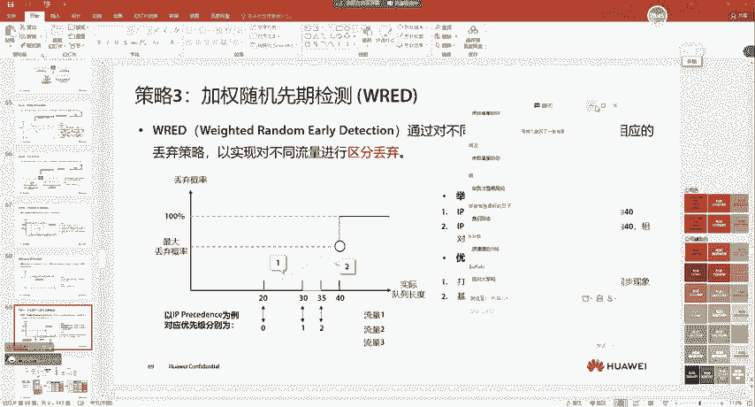

🤧嗯。啊，四川大学吗？对。嗯，这个也能理解啊，但是也看人啊也看人。是吧嗯这个女的确实有点过分了啊，是吧，她都已经证明了嗯，还有这样对吧？但是如果换到一个正常女性来说呢。😊，嗯，怀疑自己被偷拍呢。

这个也正常。啊，但是人家都证明了，确实后续的就没必要了，是吧？呃，这个我不做探讨啊，好吧，就你们可以有自己的想法。😊，得懂吗？好吧，这里我不做探讨啊。😊，呃，好，同学们，咱们继续学习啊啊。

就不要去考虑这些事情啊，跟你也没有关系。😊，好不好啊，你也不要被。对吧啊不要被网上的一些舆论呢影响你的这个观点。好吧。嗯，我们来看一下啊。WIED技术它是怎么样实现的？😡，好唔好。是这样的啊。

WID是这样的。😡，比如说呢。在我这个包里队列里面。😡，有。三种标记的豹纹。好吧，1个DICP等于01个DSCP等于1，1个DSCP等于2。现在我这样来怎么样呢？😊，当我队列到达20%的时候啊。

我先丢你标记等于一的。那20%的时候。注意啊，各位同学，20%的时候，黄色的有没有丢，标记等于一的。啊，先丢你标记等于零的啊。先丢你标记等于零的那标记等于一的有没有丢啊？有没有没有吧，标记等于二的呢。

也没有是吧，就就跟打仗了一样，你大头兵。😡，是吧大家都有自己的不同的位置嘛，是不是就有一些人是冲锋陷阵的。😡，对吧啊，有一些人呢是负责弓箭手。对不对？有一些人是开大炮的。😡，是吧就大家定位不一样。

那当到达30%的时候呢。嗯。是吧老丢人家等于零的不太合适，到达30%的时候吧，有点危机的。😊，未来有可能会更多。对不对？所以说。就相当于什么一样的？20%的时候，我们鼓励啊。大家生二胎。对不对？

到达30%多啊，我们鼓励啊大家生三台。😡，是不是到达40%的时候，我们再鼓励呀。😡，大家能明白吧，就类似于这种一样。😡，所以说呢，在到达30%的时候呢。你标记等于一的是吧，也身先士卒。

我不仅让你标记等于零的生孩子是吧？啊，你标记等于一的呢，也要去生一点啊，只想我们鼓励90后生孩子结婚是，现在我们鼓励80后生二胎是吧，生三胎。😊，对不对？也是一样道理。

所以说现在呢当你到达30%的时候呢。啊标记等于一的。嗯，也要开始丢了。那未来到达35%的时候，再丢标记等于2的。所以我们可以去看到啊，从丢弃的优先次序来说。😡，是不是优先级？

就是我们可以去控制不同报文它的一个丢新的顺序啊。😡，是吧。你先丢一些不重要的，然后实在没有办法了，我们再去丢一些重要的。😡，能明白这个意思吗？明白的同学敲一啊，没问题吧。那这种呢就考虑了报文的重要级别。

是吧？我们就把它叫做WID。😡，那这个东西我们怎么样去做呢？是吧老师你刚说了有很多。😊，是吧。

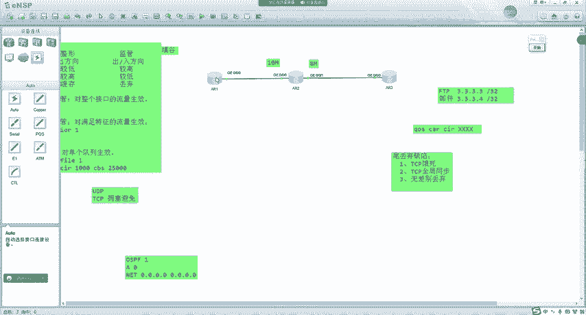

很简单，注意啊。是这样的。我们呢可以这样，我创建一个叫做丢弃模板。丢弃模板的名字，你可以自己定一。比如说他就是给。对列6用的。然后怎么样呢？😡，我们去做1个WIDDACP。什么意思呢？

就是配置这个丢弃模板啊，通过WIED的方式看照DICP的标记去丢，怎么丢呢？这时候我们就可以配了DICP等于零的。😊，第一门线是20%。高门线啊是百分之。60。好吧。丢弃率啊最多到达50%。没问题吧。

然后我们再去给他说啊，标记等于一的低门线是30%，高门线呢是70%，丢弃率啊是40%。是吧。DICP等于2的低门线呢是40%，高门线呢80%，丢弃率呢30%。是吧。😊，那越重要的包呢。

他的低一门线他丢的越晚。对吧然后他丢弃率越低。那这时候呢。我们就创建了一个丢弃模板。

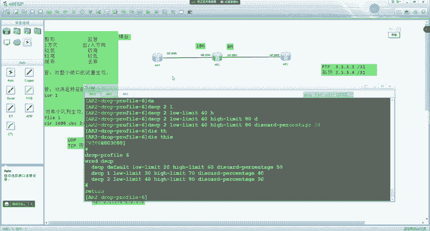

这零他默认给翻译成了 default报的啊，但你们要知道这零。那这个丢弃模板创造完成之后，我们可以这样。

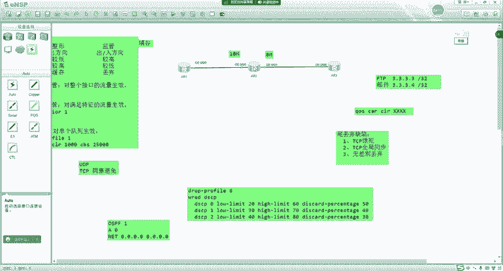

老师啊，他不是基于对列去丢吗？😡，注意啊，对砌模板，最终我们要应用到对列上，怎么应用呢？就是创建。哎，QS对列配置模板，刚我们不是有一个一吗？😡，对吧刚我们给队列六不做了一个限速嘛？现在比如说我这样。

😊，队列5。调用这个丢弃模板。叫6啊，这堆序模板的名字叫6啊。呃啊，对了，我还不让用。对列是。啊，叫咱们有同学叫六是吧？😊，呃，对联视也不让用。我改一下啊，待会要做到拍的面令，可能大家看不懂了。😊，啊。

Q是。看不懂没关系啊，先不用管。零土气。对，改一下调度算法就好了。队列。5、调用一个丢弃模板，丢弃模板的名字叫6。

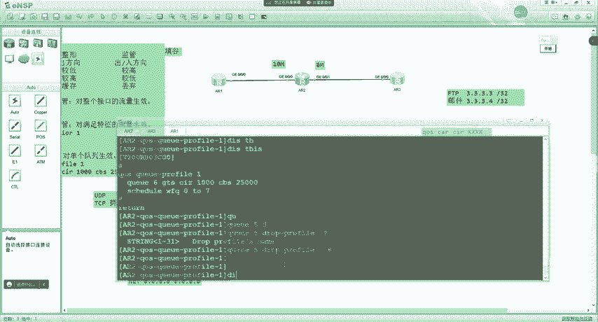

好吧。所以现在呢我们就可以去看到啊。😊，就是我现在。呃，这条命令大家先不用管啊，这里我们得下节课才能讲到了。😊，那现在我们可以去看到啊，我创建了一个队列模板，名字叫6。然后呢。我在不同的标记中啊。

就是让他不同的标记啊设置了不同的丢弃率。首先这个配置看明白的同学敲一。没问题吧。好吧啊，对，必须要堆起模板。那接下来呢，我们还可以去看到。这个不用我再解释了吧，针对于队列做了个整形。😊。

我在队列五上啊调用了这个丢漆模板，那就意味着未来队列五的长度到达20%的时候，他丢谁呀？😡，丢谁啊？丢0到达30%，丢一到达40%丢2。是吧。就跟我们这张图一样，你就把这个想成这是队列5就行了啊。

丢丢丢。对不对？那这里呢就是WID技术。好吧。那现在我还没做完啊，因为我现在对列还没有应用到接口上呢。是吧呃，怎么样应用呢？嗯，先不用管，因为真正我们还没有讲到队列的各种调度算法。啊，所以说先不用管。

知道怎么配啊，先看懂这些配置。所以我再问一遍，这些配置啊，没问题的同学，咱们敲波一。😡，好唔好。好吧。😊，高门线干啥用啊，就超出高门线，那就尾丢器了。😡，高门线就是我的上线。你20%，我开始给你丢。

你60%。是吧。😡，你还在那啥。😡，对不对？就类似于这种。门线怎么理解的？就是百分比。能懂吗？就是百分比。你可以把队列啊想象成一个就是队列，它不是有缓存吗？缓存是有大小的。😊，好吧。

当你到达一定的大小之后。那么在这时候呢，他就会开始涨，这个实际上就是百分比的概念。当你到达20%的时候。对，超过高门线就全丢了。没错。好吧。呃，26时之间随机留。超过60尾丢啊。对，没错。

就是零就尾丢弃了。能懂吗？零就围对起了啊。但是当比如说我开始尾丢起0了，但是突然发了一个包。林还能不能再进来啊？还能再进来的。听到吗？所以这个配置大家看明白了吗？明白的le一好不好？家同学呢？

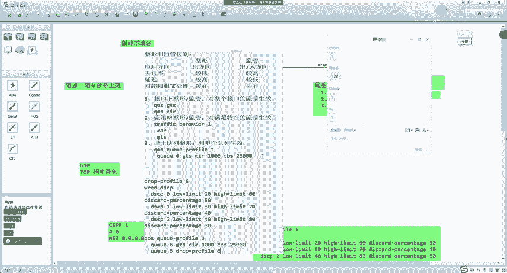

可以是吧。好，那我们继续啊。

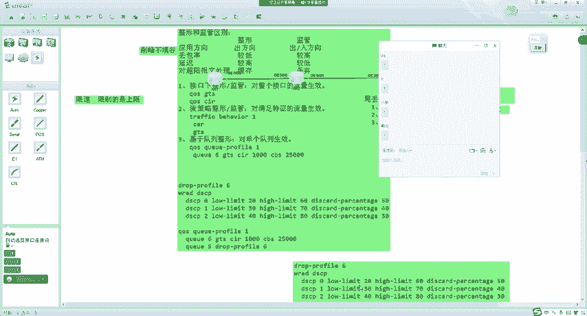

接着来。

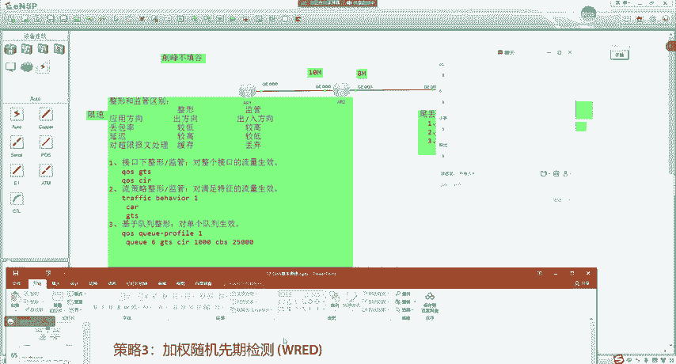

接下来的是什么呢？注意。大家可以看到啊。这个。先丢谁再丢谁再丢谁。大家还记得我们之前讲到了一个什么吗？AF414243代还记得吧？是吧。比如说确实在你这个队列中啊，他有这些包。

你官方给的建议是不是用AF414243去丢啊？对不对？你用AF4014243这种标的。然后再去设置先丢41，再丢42再丢43嘛，是吧，把这个改一下就行了。但实际上我们用012也是一样的道理啊。

这里大家知道一下。

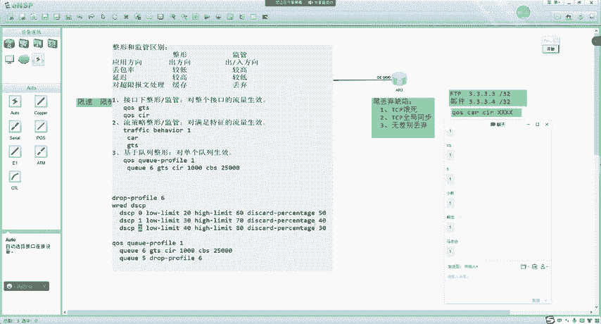

嗯，但是在交换机上啊稍微有点区别。这里我得给大家说一下啊。呃。我们来看啊。嗯，交换机上它是这样的，就我们可以看到这有几个颜色。是什么绿色、黄色、红色。对不对？嗯，然后绿色、黄色、红色。是吧。

也就是说我们基于标记丢。大觉得行不行？刚刚我们是012，我配成AF41AF42AF43。行不行？就官方给的建议，就是建议我们怎么办呢？嗯，先丢4一，再丢42，再丢43嘛。是吧这只是给的一种建议啊。好吧。

然后我们来看啊。😊，嗯。对吧这就是我们刚刚所说的那个红色先丢，对吧？而且他的丢弃概率是最高的50%。啊吧黄色后丢，然后他的丢弃概率呢40%。绿色呢最最后丢，他的丢弃概率呢30%。

是吧所以说你发现重要的不仅挽丢，它的丢弃率还小。😡，对吧这就是给你实在的保证。对不对？嗯。呃。这个现在给大家说，大家可能不太明白啊。呃，用色避免啊。在出间缝方向使用，这个不用管啊，先别管。😊，不管啊。

呃，然后给大家说一下啊。😊，这也别管啊，先不管。行，今天就讲这么多啊。然后下节课我们讲到这个。😊，用测管理的时候是吧，我再给大家去讲一个总体的一个实验好吧，什么复杂流分类啊，简单流分类是吧。

用测避免用测管理啊，到时候做个实验呢。😊，让大家能够体会啊，就理解一下这些技术之间的关联性啊。😊，呃，这些先都不用管，因为现在给你们讲也不一定能听懂。啊，因为对列我们还没有讲。好吧，这些先不用管他啊。

😊，呃，最后我们来看这个思考题啊，就是Qs主动丢弃报纹的机制有哪些？嗯，然后让我们去选。选哪一个？234。MRED啊。MRED你学过吗？啊，笔试题库还有MRED啊。没听说过啊。呃，应该是ABD啊。

但是如果他说。BD呢我也能理解，因为尾丢器它并不是主动丢钱，他是满了之后自己丢了嘛。😡，对不对？所以这题我给大家说一下我的想法啊。嗯，MIED我没听说过啊，我就不选啊。如果我考到这道题啊，伪流器呢。😊。

他说主动丢弃伪丢弃。我游写是满了之后，他。不得已丢了，那算被动吧。是吧嗯，但是我觉得他这个答案应该会是ABD，为什么呢？因为我们学的是这三种。😊，是吧我们来看一下啊。你看答案是ABD。对吧。

但是你如果解释伪丢器本身是。队列满了之后，被动的去执行尾丢级。那也能够理解吧。对吧你选BD呢？嗯，好像也对。是吧。所以这种题啊，我们不要纠结啊，我们只需要知道有这三种丢弃方式就好了。好吧。

所以大家能够明白我的意思吧，就你不要去纠结这道题的答案啊。😡，你要理解的是，这三种丢弃方式，他们之间的区别。明白了吗？好吧。所以这种题呢，我就从来。没有头疼过。啊，我为什么觉得不头疼呢？

这东西就看别人怎么想的。😡，什么意思一样呢？我举个例子。嗯。算了，我不举例子了啊，没想好张想说什么来着，忘了啊。😊，好吧，就考试呢，你最好按照答案来。😡，对不对？你也不要有自己的想法了。是吧。考试。

这就相当于。相当于什么一样的嗯。你老板长得死丑。是吧。嗯，他给你发工资发的还挺多，让你每天说一遍，他很帅。你说不说？你瞅就丑，我知道就行了。但是是吧，因为我在干活，所以我得说。😡，对不对？那考试嘛。

我们就跟着答案来就行了。嗯，你也不要有自己的想法了。😡，好吧，真正当你能控制这个考试的时候呢，你再有自己的想法。😊，好吧。嗯。🤢，呃，所以这个咱们就说这么多啊，就这么多，就我们不要去纠结啊。

不要去纠结他的答案。嗯，对，跟着规则走就行了，这就相当于什么一样的？😊，嗯，你会发现呢这个公务员还有考试呢。是吧公务员考试你会发现很多答案都是统一的。😊，是不是啊？就是有一些这个教育培训机构呢。

他就教给你怎么样考公务员。对不对？嗯，这都是。大家能懂吧？就你自己的想法呢，你可能有一些自己的想法呢，但是最好不要去说，为什么呢？因为这件事情对你本身比较重要，你就是考试的，你不是过来表达自己想法的。

😡。

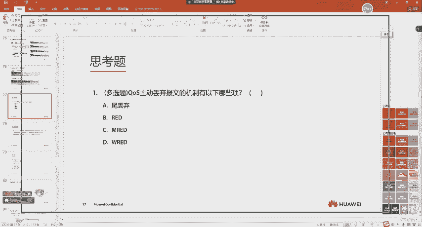

能懂吧？就是没到你发挥的时候呢，你要有那个能力的时候啊，你再自己发挥。😡，好吧。你没到那个能力，你发挥什么啊？😡，是吧你说你一下你自己的想法，首先你想法成不成熟。😡，11点。对吧第二点呢，你又不能改变。

你不要去说了。

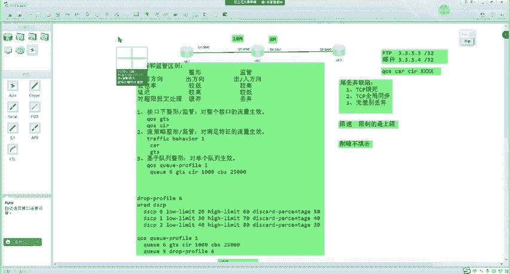

对。自己藏着就行了，憋在你的心里头。

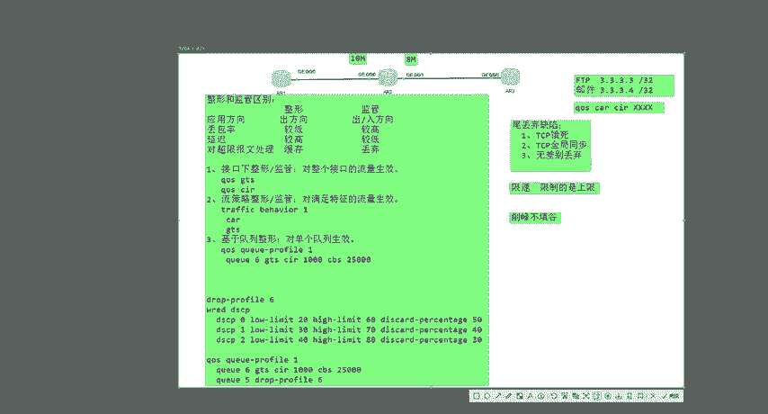

好，同学们，咱们今天就讲这么多吧，今天就聊这么多啊。😊。

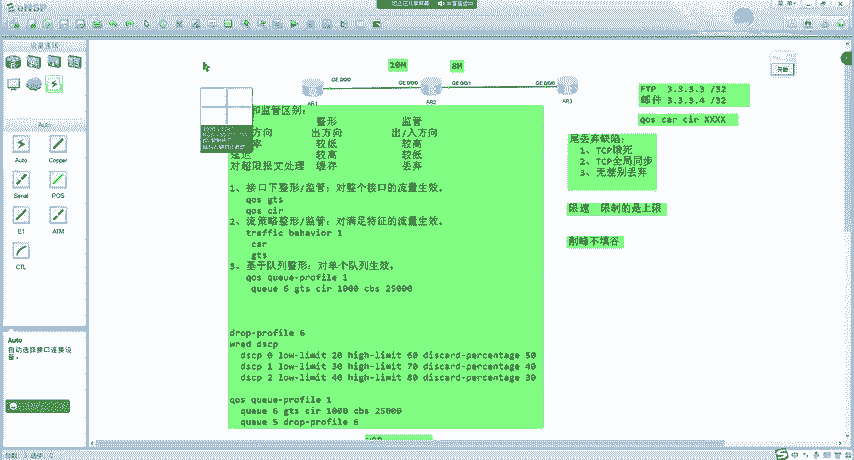

嗯。理论比较多是吧，Q的理论比较多啊。

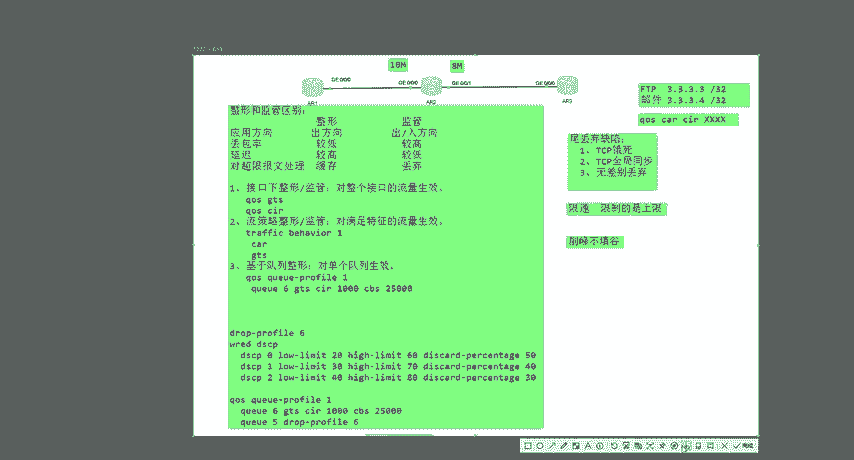

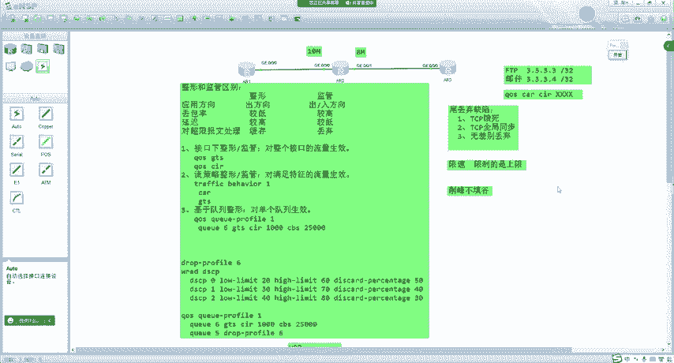

我把录屏停下啊。