# 2023 新版华为认证HCIA+HCIP+HCIE全套视频讲解！一套视频让你从入门到精通！CCNA／CCNP／CCIE技术提升同样适用！ - P126：（持续更新）HCIE Datacom - 62.QOS拥塞管理、综合实验 - -Book思议8 - BV1W8411A7z8

好，同学们，我们上课吧啊。😊，呃。咱们接下来去讲一下这个。用测管理技术啊。阳了吧是吧呃，有可能啊有可能啊呃，因为第二次阳性的时候呢，我好像没得。🤧好吧。呃，但现在还好啊啊就有点流鼻涕啊，嗓子有点疼。

其他还好。😊，我们上课吧啊上课啊。呃，这节课呢我们主要去讲一下庸测管理技术啊，嗯讲一下这个庸测管理。上节课我们不是说了庸测避免嘛？是吧？呃，前面的学习呢，我们把这个限速啊是吧，分类标记啊，都去讲完了呃。

我们把这个用测管理讲完之后呢，我们会给大家去呃罗列一个实验。好吧，就是把这些技术怎么组合到一起吧，因为Q它是一个呃整体的一套活啊，就是离开任何一个环节呢，嗯都不行，所以说我们把这个。😊。

优侧管理讲完之后呢，我们把这些。从头到尾是吧，呃，再给大家打通一下。嗯。🤢，咱们来看一下啊。呃，因测管理呢是在我们呃最后相当于最后一个阶段啊呃去执行的，好吧。用色还是用3。呃。多音字啊。

我平常是说庸测管理。啊嗯。多字啊对用塞。一样的意思吧，是吧？一样的意思啊。我们来看一下啊。呃，用测管理他是怎么样的呢？他是这样的啊，呃，就是我们要去保证不同报内个优先级，就要把不同的报文不是区分出来吗？

呃，区分出来之后呢，就咱买高铁票一样，对吧？你带着这个标记呢呃进入到不同的车厢，又带着车票进不同的车厢是吧？呃，在我们的路由器里面呢，这个车厢就是不同的队列啊，就一个一个队列。😊，呃。

队列呢我们平常用队列号来进行叫啊，一共设备上有8个队列啊，就是7到0啊，01234567。嗯，一共是有8个队列好吧呃，那不同的队列呢，他们之间就决定了自己所能够得到的服务。注意啊呃。

因为上节课我们配这个因测避免的时候，大家可以看到，比如说我们去配。呃，丢哪些豹纹啊，对吧？那配合这个丢弃模板最终要绑定到队列上。是吧呃，所以说呢。我们的队列呢才是真正去决定啊，你得到什么样的服务的啊。

然后我们把这些服务呢加到队列上面对，你在这个队列里面的包呢啊你就得到我们所添加的那些服务啊，这个就是队列。😊，好吧，呃，队列本身只是一种抽象出来的概念啊，这里大家要理解。嗯，这个怎么给大家说呢？

也就是说在我们的设备啊呃，比如说这是我的设备的一个接口。那在这个设备接口里面是不是有这种硬件上的队列呢？比如说老师啊这些队列零啊，队列一对列2对吧？到队列N他们都是有单独硬件的是吧？

队列零一块内存队列2一块队列3一块嗯，实际上并不是这样啊，队列只是抽象出来的一个概念。😊，嗯，怎么抽象出来呢？呃，大家可以理解成就是我们的报文呢。呃，都是缓存到一起的。比如说这是标记为126十4。

22对吧，33162780啊，没有8十几。呃，24。好吧，那这时候呢，比如说我们在进行分类的时候嗯，我可以这样。哦，我认为所有的偶数呢像二啊。是吧呃，6啊，1422、16、24。

只要带有这些标记的豹纹呢，他们都属于一类啊，我们就认为它是一个队列。好吧，也就是说队列本质上是抽象出来的，就所有的包呢，实际上都是在一块硬件里面的。队列只是我们抽象出来的8个队列。这意思大家能够明白吗？

明白的同学敲个一啊，都没问题吧。😊，也就是说我认为这些豹纹呢，就是我认为只要所有偶数的。标记，那么他们都属于队列一，所以基数都属于队列2。对吧啊你可以这样去分类，或者说呢。

你认为所有小于1到10这些标记啊，都属于队列一是吧？11到20都属于队列2啊，21到30都属于队列3。好吧，所以说大家要注意啊，对列只是抽象出来的一个概念。啊，那默认情况下呢。

在我们的设备里会抽象出来8个队列。那这8个队列呢，就是我们把不同的包引导到不同的队列中啊，然后去执行报文的转发。我们来看一下啊呃，什么才是队列。好吧，就是在每个端口上呢都有8个下行队列啊。

我们把它叫做CQ啊，也叫做队列啊，或者说叫端口队列。😊，那这个名字呢，之前我们给大家说过对吧，早期的时候只有4种啊，有CS啊，有EF有AF有BE。对吧。呃，早期的时候呢只有4种优先级的服务。

那这四种优先级的服务呢，后来就感觉有点不太够用吧，后来又扩展成了8个。这是对列的名字啊，就是CS7CS6EFF4321B1这只是对列的名字。那实际上对列还有一个序号。嗯，这个大家怎么理解呢？

就相当于我们人一样。呃，人你有自己的名字对，你还有一个唯一的编号啊，我们叫做身份证号。是不是啊？那换到我们的设备里面呢，也是一样的。队列呢，他们也都有名字啊，这是不同队列他们的名字。

那也有一个序号呢去唯一的进行标识，未来在我们的配制中呢，呃所有都是以这个序号的方式来进行表示的。好吧，所以说这里大家需要知道的就是呃，我们一共有8个队列，好吧啊，也叫做CQ或者说叫做P。😊，啊。

叫端口内列啊。那队列在调度的时候对吧？用测管理使用队列技术呃，它是怎么样的呢？我举个例子啊，比如说现在呢。😊，我们不是有8个对列吗？1234啊，假设说后面还有其他的。是吧呃。

我们怎么样让一的报文优先转发呢？😊，嗯，就相当于你给他配个策略一样，你告诉他一这个一呀先转发。对吧。嗯，然后再转发2，然后再转发3，然后再转发4，这是不是就相当于你在告诉这个设备？😊。

对你给他制定了一种转发策略。对吧先转哪一个，然后再转哪一个。那有没有这样的呢？呃，12同时转对吧，然后34后面转。啊，有没有这样的，也有对，就是这个侧略呢调度的侧略嗯，它可以被制定成各种各样的。对不对？

就看你怎么样去定定义，你也可以这样。是吧呃1234都是等价的，大家都调一个包。是吧每回大家都掉一个包啊，也进行转发，这样也可以。对呀。那能不能这样呢，就是。一来了先调一，我正调着二呢，但是一有来包了。

我直接不掉二了，我再调一。对吧能不能这样呢，也能对吧？我会发现啊，就是这个真正决定队列报文什么时候转发出去的，是由队列的调度算法来进行决定的。好吧，就是由队列的调度算法来进行决定。

算法它定义了你这个队列得到什么样的服务。是吧那在我们的设备上呢，一共有3种，一种叫做FFO，我们把它叫做先进先出。呃，还有一个叫做SP还有一个叫WFQ。😊，啊，一共是有三种。啊。

那我们就一个一个来看一下啊。首先第一个FFO呢这就比较简单。😊，我们把它叫做先进先出。这个是怎么样的呢？嗯，实际上呢就是没有优先级的服务。啥意思呢？比如说这是我的队列，你现在来了三个包，123。

当你们进入到这个队列之后呢，呃，我按照顺序，你一先进来，你先出对吧？二进来二出三进来三出，这就跟排队是一样的道理，没有插队的那种概念啊，谁先来对吧？谁先吃饭？😊，好吧，这就是FFO。

而在我们的一个队联内部里面呢呃都是FFO的啥意思呢？就是大家注意一点。😊，34。123。是。嗯，就类似于这个。商务座跟二等座的区别一样。队列一呢，他就是商务座。对列二呢就是二等座。

那商务座跟二等座之间得到的服务不一样，但商务座内部得到的服务都是一样的。好吧，也就是说在这个单个队列里面呢，我可能有三个吧。😊，那。谁先来啊，谁先被转发出去，那这个就叫做FFO好吧，在传统的网络中呃。

就是FFO。就先进先出来了包呢，我就转发出去。传统的网络中没有Q4的是吧啊？😡，呃，就是FF。那SP呢，我们把它叫做严格优先级。这严格优先级他是这样的，我们来看啊。嗯，比如说现在呢我们有三个队列啊。

一个就是高有先级，一个中有先级，一个低有先级的。好吧，如果我们使用的是SP来进行调度。他是这样的。就是他会先把高优先级的队列调度完，你看FFO先发2再发6嘛？是吧先发2，然后再发6。

把高级的调度完之后呢，再调中的3。45，然后最后再发报文一。好吧，那这个呢就是SP。SP呢嗯大家可以理解成它类似于一种优先级队列。就是优先级越高啊，那你所得到的调度优先权就越高。

就是当我一旦有空间的时候，我就先调度你。然后再调度6。嗯，这就相当于这个古代一样是吧，古代的时候吃不饱饭啊，有了饭谁先吃呢？嗯，这个先给重要的人。对不对？啊，就有先你比较高的人吃。

是吧所以说啊如果我们采用的是SP呢。那他能够为高优先级的对列呃提供更好的服务。好吧，那这个呢就是SP。那还有一种呢，我们把它叫做呃WFQ啊，WFQ是什么样子的？注意啊。他是按照权重。

来重新分配每个流占有的出口贷款。对呀。我们可以去发现啊。比如说FFO呢嗯实际上他有没有优先级啊？有没有啊？没有对吧，实际上没有优先级。SP呢分为了优先级，对不对？然后WFQ呢。

它类似于一种轮询的调度方式。这轮巡是怎么来的呢？我们来看一下啊。嗯。嗯。比如说现在啊我们有报文的123456。好吧，然后我们按照这个优先级映射到队列之后。好吧，现在我们可以进入到不同的队列。

比如说现在我有3个。高有先级的嗯，中有先级的还有低有先级的。好吧，而WFQ他在调度的时候，他内部有一个算法。注意啊呃这个算法呢实际上大家不用去要去关注。好吧呃，就是他会计算一个叫做SN的一个值。

这个在百度上嗯，你们去找找啊，我记得有一篇文章是讲到了这个算法的。好吧，那他会去根据这个SN的值呢。去计算。就是比如说我的豹纹越小。嗯，以及他的DS优先比越高啊，那他的SN值呢就越优先。啥意思呢？

大家抓住一个特点啊，我们来看啊。比如说我们看。先进先出的时候。他的优点在于实现机制比较简单啊，处理比较快，而没有优先级的区分是吧？FFO。而如果我们看SP的话，我们会发现有一点啊。

他虽然对高优先级的报文提供转发啊，但是低优先级呢有可能出现饿死现象，这饿死是什么样的？嗯，SP就是严格的优先级，怎么样严格呢？比如说高于优先级的队列，如果一直不断的在持续存在豹纹。

对吧那我们就会一直调度高优先级的队列，而低优先级的呢就得不到服务。对吧那这种呢我们就把它叫做对列饿死。就庸测发生的时候呢，如果较高优先级长时间存在爆纹啊，那低优先级就得不到调度机会。对吧。

这是我们说的SP。而如果我们去看WFQ的话，我们来看一下啊，它的一个优点呢在于不同队列获得公平的调度机会。从整体上均衡各个流的延迟，啥意思呢？也就是说，在我们的WFQ中，这些队列有没有优先级呢？嗯。

大家可以理解成是没有的。但是他在调度的时候注意一点啊。调度的时候，短豹纹和长豹纹获得公平的调度。如果不同队列间存在多个长豹纹和短豹纹等待发送啊，让短豹文优先的到调度，这是什么意思呢？嗯。

来给大家解释一下啊呃就是在现有我们的网络中啊呃一般比较重要的一些流量啊，你像语音啊，这种流量呢，就对延迟比较敏感的好吧，呃，他们的豹纹都比较小，这我之前给大家讲过，就是一个语音流量呢64KB的带宽啊。

就足够用了啊，当然这是一个语音流啊，比如说咱俩打电话是一个语音流，对吧？啊，但是我给别人打电话呢，还是一个语音流，这就两个了啊，那你64KB就不够用了。好吧，所以这里大家关注一点是什么呢？

就是在网络中的。😊，这个小豹纹对吧，一般都是比较重要的。好吧，那WFQ在调度的时候，他是这样的。他会给每一个报文呢去计算1个SN值。那如果报越小，对吧，它的SN值就会越优先。也就是说。

未来WFQ在调度的时候呢，他会优先调度较小的豹围来进行转发。比如说我们可以看到4比特的豹纹。是不是调度出来了？对吧那有同学可能问对吧，老师为什么后面还有一个4比特呢？这里大家要注意啊。

也就是说他在调度的时候，不仅仅只是参考SN值。😊，注意啊，并不是。还会去参考1个DSCP值。DICP越大。那么他所得到的这个调度机会也就越高。什么意思呢？就是WFQ在调度的时候，他会参考两点。

一点呢是这个豹纹的大小。第二点呢是DSCP值。那么也就是说，当你的豹纹越小的时候。对吧你得到调度优先权越高。那你的DIP呢，如果也是比较小的那你的调度优先权就会低。对不对啊？那有可能有没有这种可能呢？

就是虽然老师我这个报纹比较小，但是他DSCP呢。嗯。也比较小对吧？那这时候呢，有可能我们在调度的时候就不是他好吧，这就相当于你选女朋友一样啊吧，你看人家漂亮啊，还是看人家有钱。😡，对不对呃，漂亮又有钱。

这可能是你优先选择的对吧？但是当他只占了一样的时候。对不对？嗯，那你可能选择的是其中一种，对吧？如果非常有钱。嗯，你可能就选非常有钱这个对吧，如果非常漂亮啊，你可能就选非常漂亮。那有没有这种可能呢？

就是。😊，嗯。比如说有三个人。对吧ABC。呃，一个呢既漂亮又有钱啊，一个呢漂亮，没钱。是吧呃，一个呢这个。有钱对吧，但是不是特别漂亮。对吧那如果按照你在进行选择的时候，呃，肯定A作为你的首选。对吧。

是不是？但是当有B和C的时候呢，你选择可能就是随机的。是吧你要综合进行考量，你比如说你会想一下，哎，我缺啥呢？是吧？我可能缺点财富，对不对你就选择了一个有钱的。😊，是不是嗯，但是呢你可能不缺财富。

对吧啊，你就选择了一个年轻的，对不对？那实际上我们的WFQ也是一样的，它不仅参考大小呢，也参考DICP。那比如说我们从整体上可以去看到，就是短豹纹呢优先得到调度。😊，对不对？所以说如果报越小。

是不是在宏观上我们去考虑的话，它的调度机会就是他被得到的调度这个优先级就越高啊。到就我们从宏观角度上去考考虑的话。是不是啊，那至少你占了一项优势啊。如果你。豹文越小，DICP也越大，对吧？越优先。

那你就非常好了，既漂亮又有钱的那种。是吧所以说我们可以去看到啊，首先短报文呢优先得到了调度。😊，那为什么后面又调度了6比特跟8比特的报纹呢？是吧是因为这6比特跟8比特的豹纹。

他们有可能占用了其中的一项优势。什么优势呢？就是虽然它的豹纹没有那么小，但是他DSCP很大。😡，对吧。所以有可能呢。也把6比特跟8比特调度了。然后再去通过SN计算中比较小的。那这时候我们从宏观角度去看。

我们不要去分析每一个包，对吧？我们直接去分析整体的流。啊，我们可以去看到至少这种较小的豹纹是不是在前面优先被得到了调度啊？😡，对不对？这个各位同学能看明白吗？明白的同学敲一啊。这个没问题吧。对吧。

然后再去调度的才6比特的是吧？6比特呢，你从宏观角度去看呢，他比8比特的更要优先一点。是吧所以说这也是WFQ的一个特点，就是短报文跟传报文呢虽然有公平的调度，但是注意啊，就是优先会让短报文转发出去。😡。

好吧，那这是一点。那从统计上来看呢，权重越小，所分配的带宽越少，权重越大，所分配的带宽越多。嗯，这是什么意思呢？这是这样的，我来想一下啊，这个权重各位同学注意啊，我们说的是DSCP值。

也就是说DSCP呢，我们可以理解成它的一个调度优先权嘛。是不是啊？对因为你DSCPP越大，你的调度优先权就越高嘛。就像我们刚刚所说的，它不仅参考报文的大小，它还参考DSCP值。😊，对不对？那也就是说。

😡，权重越大，就代表你的DSCP越大。你DSCP越大，你所被得到的调度优先权啊就会更高一点，对不对？那你占用的带宽是不是就更多？😡，能明白这个意思吗？我举个例子啊，我给大家画张图啊，你们就能够明白了。

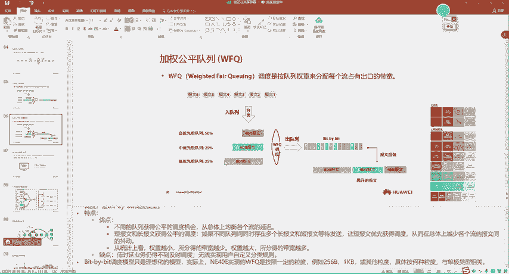

比如说我现在有两个队列啊，一个是队列一。还有一个呢是对列2。嗯，队列一中呢，我们假设它的报纹大小，注意啊，所有报纹大小都是512个字节。然后我们后面的DICP呢。嗯，这都是11。512个字节。啊。

DICP是11。512个字节DSCP是11。然后我们队列二呢，我们假设报案的大小是一样的，但是他的DICP呢是22。具体的算法大家不用去纠结它啊，不用去管他。因为这个我们涉及不到啊。好吧。

然后我们来看一下啊，如果按照WFQ的调度逻辑来说，我们刚刚也说了，首先豹纹越小。😊，卡了吗？现在好了吗？现在可以吗？可以了是吧，其他同学呢？等一下啊，同学们，我关一下空调。嗯。嗯。嗯，刚讲到。

然后我们后面是吧？嗯。

我们来看一下啊。嗯，刚我们说到这里啊。

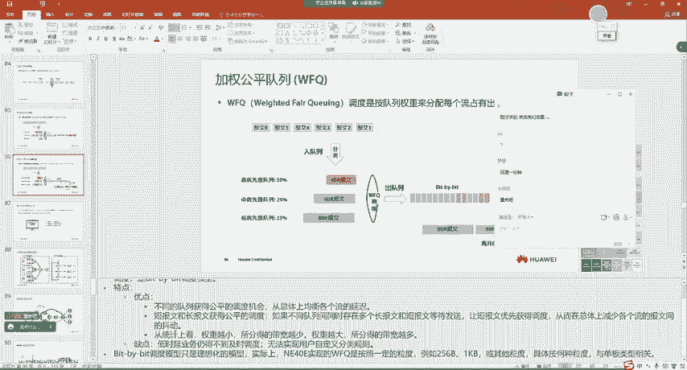

啊，512加之后是吧，我们来看啊。假如说我现在有两个队列啊。😊，嗯，512呢，就现在我们假设所有队列里面的豹纹。对吧呃，都是一样大的。啊，但是呢他们的DSCP不一样。好吧。那这个时候我们来看一下啊。

如果我们是通过WFQ来进行调度。那WFQ调度的时候呢，他有一个特点。什么样的特点呢？首先这个豹纹越小。嗯，你的优先级越高。那DSCP越大。啊，这是豹文。这是DSCP。DSCP越大啊。

你得到调度机会也越多。那我们假设。当所有的报文大小都是统一的情况下，是不是代表了DICP得到了他所就是代表了他所能得到的这个转发服务啊。对不对？那这时候我们可以去看到啊。

如果WFQ去参考这两个来进行调度，现在就有一个出接口。它在进行转发的时候，是不是DFCCP较大的这些流量？他们实际占用的带宽就更多，因为我们会更加优先的去调度DICP比较大的。这各位同学能够明白吗？

如果DICP比较大，那就代表着你所得到的调度机会就越多。

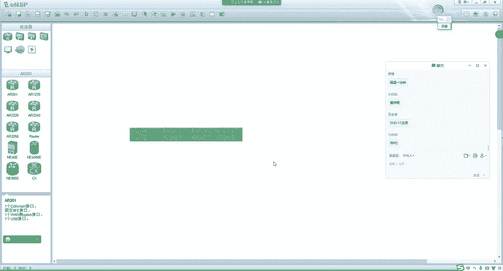

你得到的调度机会越多，是不是就代表着你所得到的带宽就越多啊？明白了吗？同学们。明白敲一啊。没问题吧。好吧。呃，这个比特跟比特啊，大家就不用去管它了啊，这跟单板有关系啊，这个我不做过多强调。😊。

那这是WFQ的一个特点啊。然后下面我们再来看一下。嗯，端口对列的调度方式。来看啊。在我们的一个接口上呢，有8个队列。对吧刚我们讲到了三种调度算法，很像FFO啊SPR跟WFQ。😊，是吧。嗯。

但是呢在我们的每一个设备上啊，它是有3个啊，就是有8个端口队列啊。嗯，这8个呢我们可以分为三组，一种呢叫做PQ队列，采用的是SP调度算法。SP就你。高有先级的啊，重有先级的、低有先级的。

是吧然后是WFQ队列采用WFQ调度。😊，然后是LPQ对联。采用的也是SP调度算法。对这里可能一下子各位同学就懵了，老师啥意思呢？我来看一下啊。😊，这里呢。我们有一张逻辑图。我们不是一共有8个队列嘛。

对吧？8个队列我这样来配，怎么配呢？嗯。前面三个。

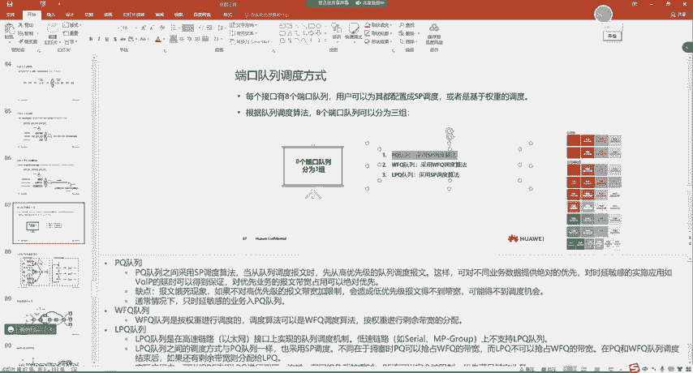

这里呢我就做PQ队列。PQ队列采用的是SP的调度算法。那也就是说我在调度的时候。是先调度谁啊，调度队列一，然后队列2，然后对列三是这样的。那比如说我们所有的队列啊，一共8个队列是这样编的嗯。

这是76543210。好吧，我们假设是这样的啊。😊，那在这时候呢。首先我们不同的对列呢，像PQ啊啊WPFQ啊呃LPQ啊。对吧。嗯，他们呢。像这个PQ，我们用的是SP调度。那也就是说我在调度的时候。

是不是对列一的豹纹优先调度出来。啊，对了7的。对不对？因为这是高额优先级啊。是吧然后六是中五是D啊。对不对？WFQ调度的时候，就在三个队列里面选这个报音小的。嗯，还有DSCP大的包来进行调度。是吧。

然后LPQ呢使用的也是SP调度方式，也是选择优先级比较高的。对不对？那这里呢有点类似于两层调度一样。当我们开始调度的时候呢，首先会调这个PQ队列的。好吧，PQ队列会使用SP优先拟行调度啊。

调度出来之后呢，注意啊。还会有1个SP调度，这个SP是怎么样的呢？假如说我这个端口现在要发流量了。我在发流量的时候呢，我是这样的，我先去看PQ队列。因为PQ队列比WFQ比LPQ的优先级都要高。

所以说我很像会去看PQ队列，然后按照SP的算法，从PQ这三个队列中7165里面调的数据吧。这里大家能够明白吗？明白敲一啊。没问题吧。因为这三个队列你使用的是SP调度算法嘛，对吧，就按照优先级调嘛。那。

未来这个PQ队列调完了，我调谁呢？啊，调WFQ。😊，好吧，这WFQ怎么调呢？😊，SP注意啊，这个PQ掉完了。通过WFK调度去调WFQ的队列。那也就是说一啊，假如说这是4。32。

那这时候如果这三个队列注意啊，这三个队列本质上是等价的。但是如果这三个队列中有豹纹比较小的。嗯，以及呢有这个。DICP比较大的，是不是他优先得到转发？能明白吗？明白敲一啊，这个没问题吧。

因为你看我们上面这种，他就是先调七的再调六的，再调五的嘛，这种他们之间队列就是等价的对吧？但是我在调的时候呢，我会考虑队列里所有的包是吧？我先调你小的，对不对。

尽量呢让你的这个呃服务呢得到的稍微更好一点。😊，对不对？那未来WFQ如果也调度完了，对吧？为空了。那我们就会去调入LPQ的。LPQ怎么样呢？LPQ用的什么算法？😊，用的什么算法？呃，并不是这三种算法。

有很多。待会我再给大家说啊，他用的是SP。那也就是说SP在调度的时候，也是严格按照优先权的。能不能明白，他也是严格按照优先权的啊。然后调这个。调这个，然后再调这个。能不能明白，也是按照优先权进行调度的。

所以这个呢就是LPQ。也就是说，三种对列呢，他们之间是有等级的关系的。先调PQ，然后调WFQ，然后再调LPQ。然后真正我调PQ的时候，我要去看PQ的算法，对吧？调度算法。去看WFQ的调度算法。

去看SP的调度算法。好吧，那这就是嗯这个用测避免技术。但是刚刚有同学问啊，这里我给大家说一下啊。嗯，这里啊大家只需要知道这几种就行了。这个在不同的设备上不一样。刚刚有同学问还有没有其他的这个对列技术？

呃，这个有非常多啊。这个也要区分设备，你像AE设备呢跟AR设备嗯差别是非常大的。好吧，那如果真的我们要具体去看的话，他是跟单板有关系的。能不能明白？比如说就是你用不同的单板呢，他所支持的调度算法不一样。

好吧，然后刚刚我们所看到的这个啊这个是NE的。能不能懂啊，这个是NE的啊，NE就是分为了三种嘛。就是像我们刚刚看的PQWFQ对吧？LPQ。是吧那还有很多呢，刚我们看到了几种队列啊，有这个。PQ。啊。

有这咱们就说调的算法啊。调度算法我们看到了SP。看到了WFQ。FFO。是吧。呃，实际上还有很多啊，有R。有DR有WR。嗯。有这个。有这个CBWFQ。啊。有FB。嗯，应该是FFB啊WFQ。呃。如果没记做。

好像还有一种叫SPT的啊。呃。反正有很多啊，就华山里面的还不一样啊。大家有兴趣可以去找找啊。如果没记错，应该叫SPT啊，还叫SP什么来着，记不太清了啊，就这调度算法有很多啊。好吧，有GTS吗。

GTS是整形啊。啊，跟这个没关系。

行，这是三种队列啊。然后我们来看一下啊，这个因素管理啊，我们是在什么时候去使用到的，它是这样的啊，咱们来看一下。😊，嗯，比如说现在呢我有三种流量。对吧。呃，那未来呢这三种流量可能都要从这个接口转发出去。

但这个接口一旦产生了拥测之后。注意啊，产生了庸色之后，就是我们的庸色避免已经。避免不了庸色了。对吧也挡不住他庸色了。嗯，但是现在呢我们又希望保证一些重要的业务流量优先进行转发。能不能明白？

我就可以把不同的流量呢指导到不同的队列中。啊，然后去给他做这个优先级的配置啊，怎么样配啊，待会我们会通过一个实验呢来给大家去演示。啊，所以说这里大家注意啊，所有我们看到的这些对列呢啊。

我们都把它叫做软件队列。只有当设备产生了庸色之后。庸色管理技术才能够生效。比如说我举个例子，现在我配了用测管理，但是我接口没有晕测啊，大家觉得有没有作用？有没有啊？实际上是没有的，这里大家注意啊。

是没有的。对吧那不多此一举嘛？你没有用色，你庸色管理什么啊？😡，你管理谁呢？那么所有这些技术啊都是网络产生拥塞之后才会去使用的。嗯。然后这是具体的配置啊。这一块先不管，好吧，我这里呢。

嗯，讲完这个之后，我给大家列个。呃。比较综合的一点Qs的实验。好吧，把这个逻辑呢再给大家贯穿一下。怎么样呢？嗯。这一台PC啊。嗯，我们给他连到一起。

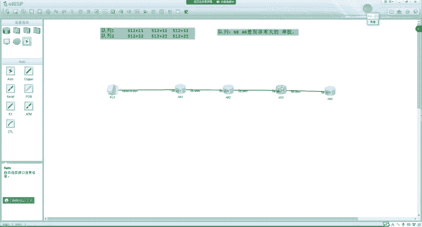

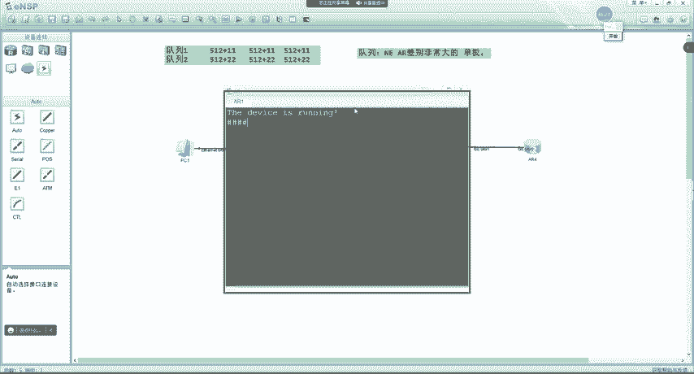

我们先把网配通啊，配通之后呢，我们再来说这个业务规划。呵。嗯。还有4。4啊。有4。5。然后配个4。6。算了，就拍这几个吧。嗯。🤢。

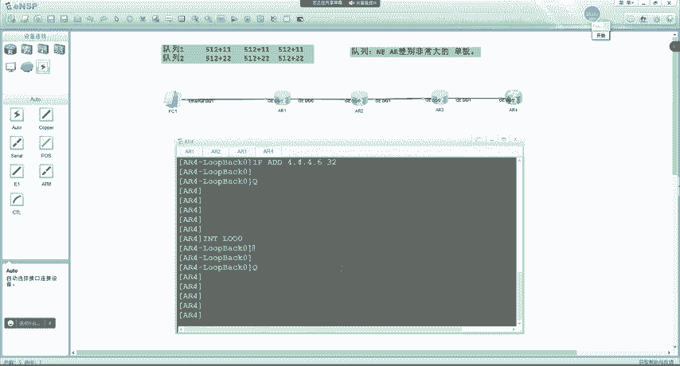

嗯。然后我们把网给他打通啊。

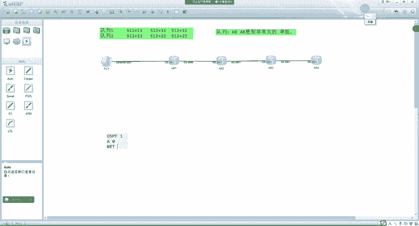

一。2。3。还有4。

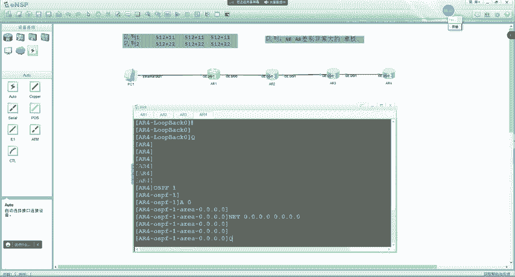

让我们来配一下PCE是。1。1。

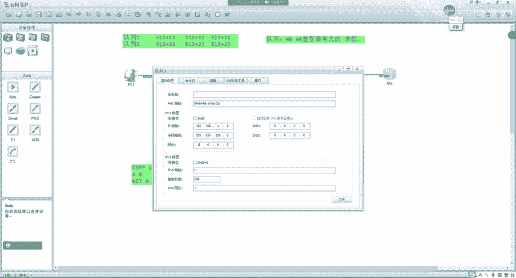

网关是1。254啊。这时候呢我们在PCE上去骗一下这个。1。254。192。168年。

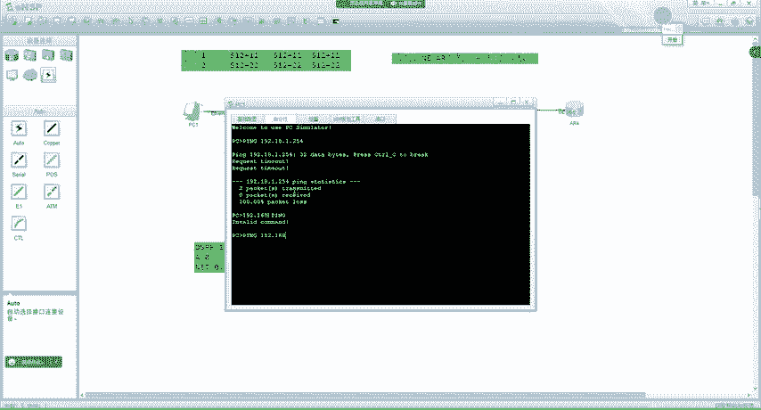

1。24。啊，能骗通。嗯，应该凭4。4。

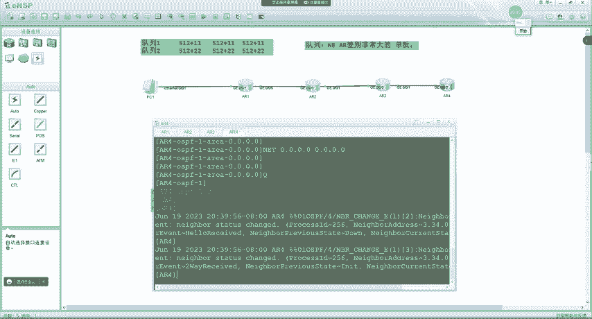

Thatro date的。邻居起来了啊。起来之后呢，我们在PCE上能够片通。

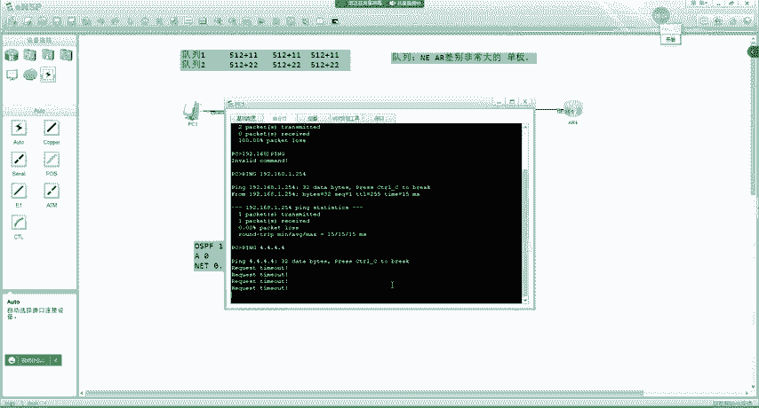

哎，我看一下二的有没有其他。嗯，二的也都放了。😔，一上面呢。嗯，没有42是。P没赔偿。啊。IP address4。4。61。4。5，然后楼板杆。

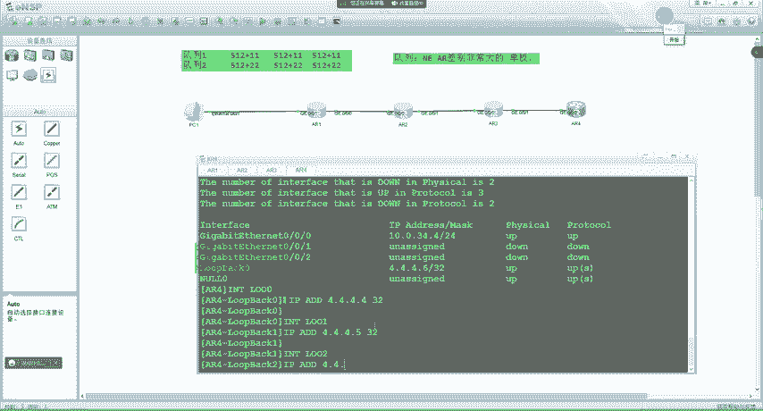

4。6。然后我们在PCE上啊去骗4。4能通。4。5呢也能通啊，然后是4。6。

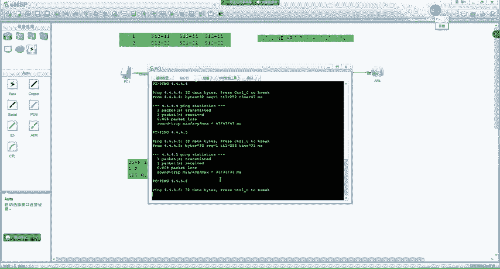

好吧。呃，现在我们的业务这样来规划啊嗯。嗯，首先呢。呃，在。23这里234。啊，23123啊。他们属于一个。DS域。呃，然后四这里呢也属于1个DS域。好吧，然后现在我们这样来做啊。😊，呃。然后怎么样呢？

我们来看啊，现在是这样的。首先在A21这里呢，我们在市场不是有几个环为口吗？我们这样来模拟。呃，首先我们的业务呢，你把它分成语音对吧？呃，FTP。嗯，还有上网类的。还有其他。啊，我们分成三种业务。呃。

然后他们的分类依据呢？我们就是基于目的IP地址区分。他的目的IP呢是4。4。4。4。FTP呢？是。4。4。4。5。然后其他类的流量呢，目的IP是这个。4点4。4。6。啊，这是我们的分类依据啊。😊，呃。

分类完成之后呢，然后我们在这里去。做一下这个呃重标记的一些策略。啊。嗯，标记呢，我们给语音呢。给他打上一个。EF的标记好吧，然后FTP呢，我给你打个AF41。呃，然后其他类的流量呢，我们就这个。

Default。好吧，说白了就标记为零啊，要给他打的标记。呃，打完标记之后呢，我们要把他们指导到不同的队列中。好吧，然后EF呢，我们给他放到7呃，服放到7了，我们给他放到5号对电。啊，放到6号吧。好吧。

我给他放到6号队列啊。嗯，然后AF41呢，我们给他放到这个AF4这个队列。AF4就是4号队联。把de放到队列零中。啊。嗯，他们的队列类型呢。嗯。队列6嗯，待会我们用PQ好吧，然后4到0呢。

我们都用WFQ队列。好吧。呃。先就这些吧。好吧，我就对着这个来做一下啊，这是我们当前的业务规划啊，就你要做之前呢，你先要把自己当前的业务规划好。😊。

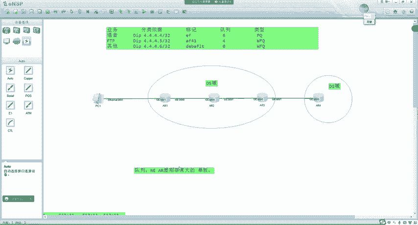

那现在呢A21作为DS边界节点，那我们要去做这个复杂流分类。来。怎么样去做呢？就在A2一上。啊，我们去创建ACL3000。入er permit的IP。目的地址呢4。4。然后ACL3001。目地是4。5。

3002。摸地值46。display a l up。现在呢我们把三种流量给他用ACL抓到了呃，抓到之后呢，我们现在这么来做。实际上这个你可以不抓啊，就默认类，你可以不抓。比如说我暗度ACL。302。啊。

这里我们直接是 default的。

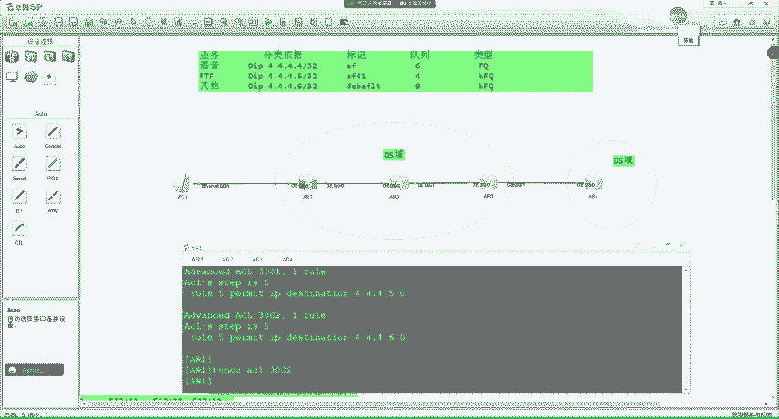

啊，其他流量分类就是de class。

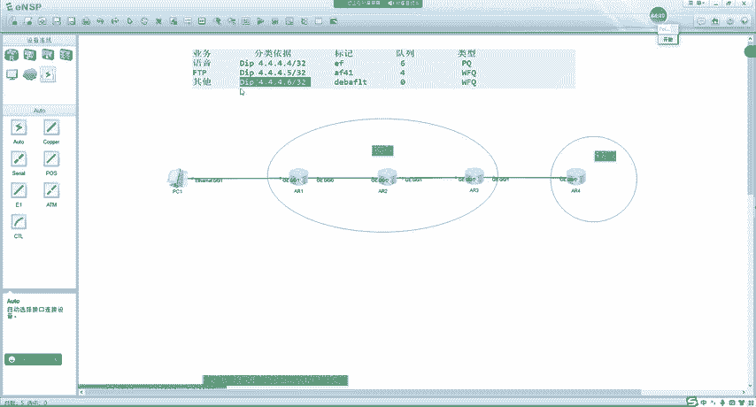

而这时候我们把这两种业务流量抓取出来之后呢。嗯，做个traface。嗯，刘飞内。匹配的一下VIP。渔幅麦ACL3000。然后tryface。嗯FTP。然后衣服mACL。3001。然后tryface。

别害我。你hi我我们用这个EF。好吧。然后。Remark。DICPEF。然后是。别害我，我们再用个AF41。Remark。DICP。AF41。然后再去将默认类去改成default嘛。第一。

default，然后remark。DICPB。啊，就零啊，零就是地方的。嗯，做完之后呢，我们再去创建一个traface policy policycy名字呢叫做。嗯。Remark。好吧，然后。

将VIP设置为。这个。EF标记。然后将FTP呢。设置为AF401的标记。然后将默认类呢defa class设置为这个defa对吧零的标记。测置完之后呢，我们在A21的70-0-0接口下。

叫做tryface。哎。查face policy。叫remark。然后音棒的方向进行调用。啊。

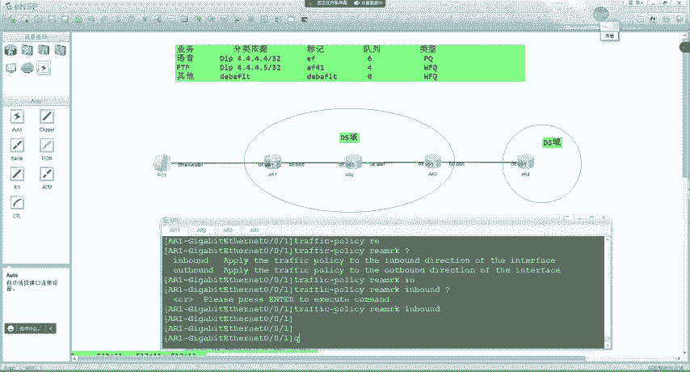

那这时候呢，就代表着未来A21收到这些流量之后。嗯，会给他们进行重标机。啊，就是我们在。

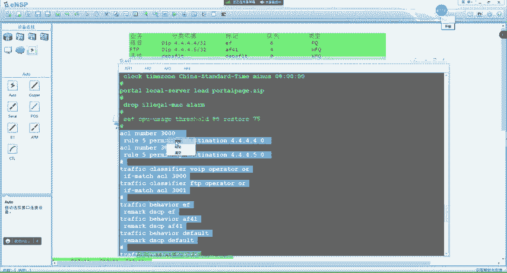

AIE上的配置。那未来将不同的流量呢，他们发送到二的时候啊，就带了不同的标记。是吧。

呃，基于这个标记呢，我们可以在二场这么来做。我们在A2一不做了复杂六分类吗？啊，在二上呢，我们就做个简单六分类。

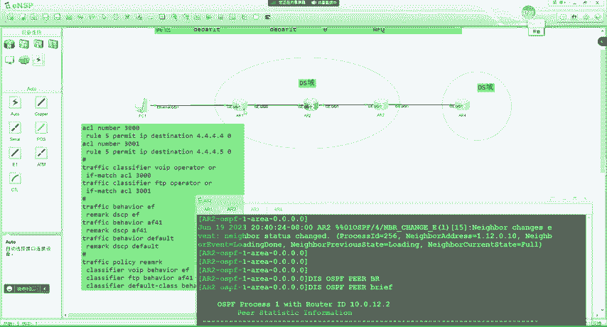

嗯，这里我们可以这样啊，怎么样呢？在A2的G0-0-0，我们敲一个叫做。Trust。啊，DSCP。好吧，主要叫创DICP。呃，这是什么意思呢？就是。注意啊。嗯。我们假设以A21来说啊。A21呢。嗯。

PCE给他发的包可能有很多原始的标记。原始的标记可能是17呀。啊，这里是16啊，这里是15，实际上15呢嗯可能就是一个上网的流量。对，但是在ARE内部呢，他可能针对于DICP等于15的流量呢。

给的这个优先权非常高。是吧。嗯，而实际上这个外部标记为15呢，不在我们的规划范围内。呃，这时候我们是把他认为是不可被信任的标记。什么意思呢？我来对比一下给二这边的。

因为A2一发送给2的EF这个标记就是很重要的包。对吧这是我们人为意图上去规划的时候，我们认为二接收到这个EF的标记呢，可以认为是可信的。就是给他放到对应的队列中啊，就是给EF很好的服务。

也就是说这个外部标记呢是在我们的规划范围内的，它是一个可以被信任的一个标记。对吧。那比如说像AR1，它在边界节点，那其他的设备可能给他发各种各样的标记。而这些标记呢是由应用程序原始去产生的啊。

它是不可被信任的。对吧所以说我们在边界节点呢会去执行复杂流分类啊，给他们进行重新的标记。标记完之后呢，你带有新标记发送到AR2上了。那在AR2上呢，我们就认为这种标记是可信任对所以说敲一个tDSCP。

啥意思呢？就是未来呢我可以基于这个接口，就是未来我从这个接口收到的包。我可以直接基于他的DICP呢去做流分类的意思。所以这个意思各位同学明白了吗？明白的同学敲一啊。没问题吧。可以是吧。对，没错。

2这里呢我们敲个traDICP。啊，就是待会儿AI一所发的这些流量呢，都是被我们标记好的，是可被信任的。

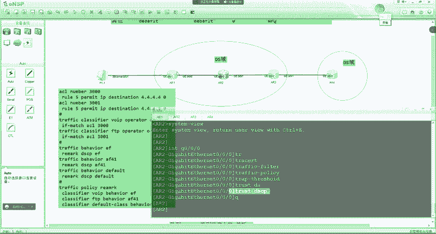

那当我们了DICP之后啊，比如说呢现在注意我在PCE上呢去聘。

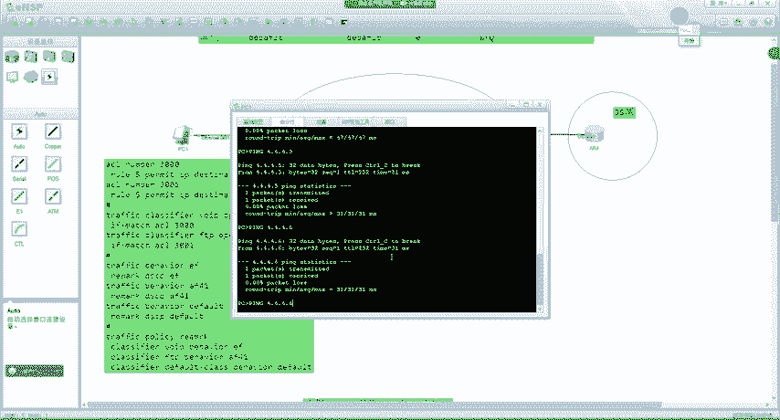

4。4。变了之后呢，我们到二审来看一下啊，就我第四play。

QS。嗯，对列。Interface。嗯，sent interfaceG0-0-1。嗯，我们来看一下啊。就EF这个报文，他进入到了有没有默认进入到5号队列呀？可以看到吧？比如说注意啊，我现在是一个包。

过了一个包，我现在在A21啊，在PC1上，我再去拼。

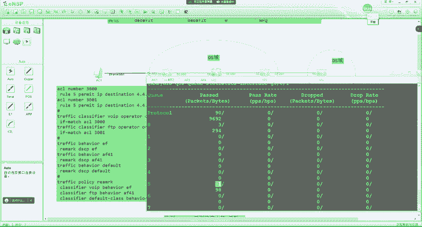

啊，我们骗5个8是吧，默认是5个1234。5。

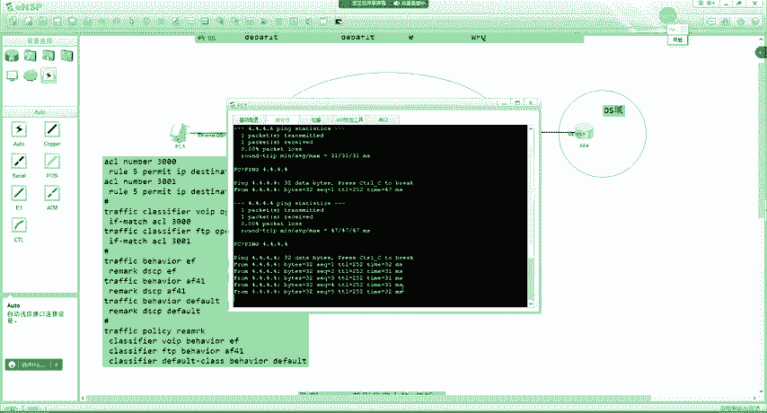

对吧5个班过来了，过来之后，我们到二场再来看一下。他的5号队列有没有过了6个吧？对，因为之前有一个嘛，对，新增加了5个。但是当我们没有去配DSCP的时候，比如说我在G0-0杠0。

and do trust。

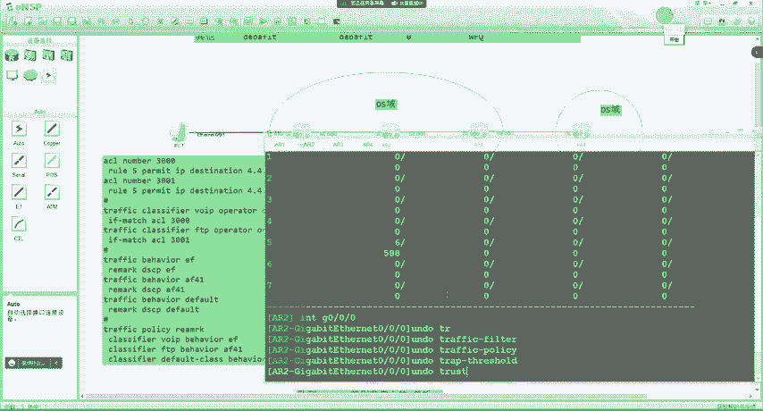

DSCP。and度 trust。

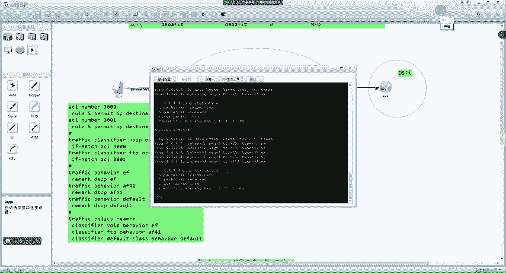

然后在PCE上再预拼。然后我们到二上来看一下。这个包是不是没有增长？啊，哪里有增长呢？0号队列增长。

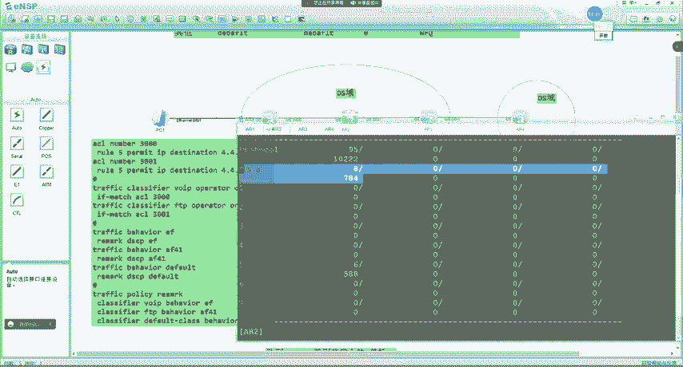

比如说这现在是8个，我们在PCE上再拼。呃，然后到二商再来看。

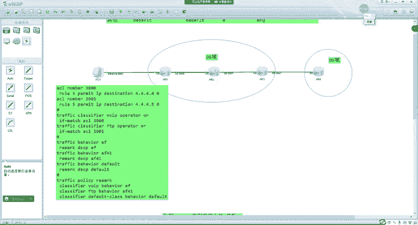

有没有增长？是不是有啊？所以这里大家记住一点啊，就是默认情况下。

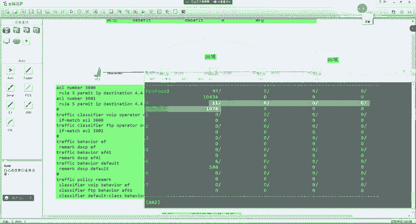

就是我们没有排着Qs的时候啊，也没有说t的时候。那么所有的报文。会按照端口优先级。进入队列。而端口优先级。优先级默认等于0。所以。所有的报文。默认都会在0号队列中。好吧，而我们之前在说的时候。

一个对联内部所有的报纹都是FIFO。是吧这就是我为什么给大家说，在传统的情况下，我们没有配置任何Qs的时候。他呢？嗯，就是一个呃，就是说白了就是没有差分符。

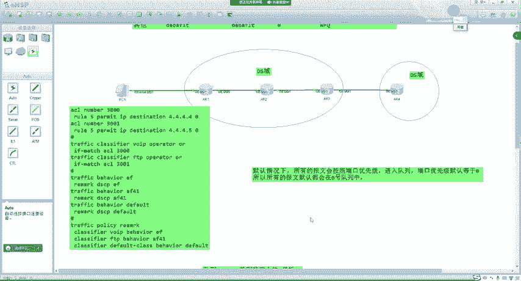

因默认情况下，大家都进都从0号队列走，0号队列又先进先出。

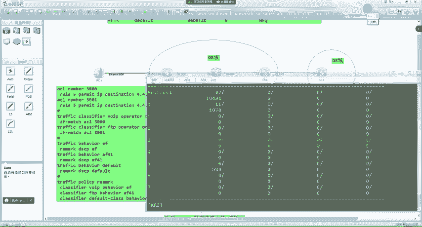

那也就是说传统网络中有没有Q？是不是没有啊？对吧没有Q是怎么决定的呢？就是因为默认情况下都会进入到一个队列0。所有报文都在这个队列中就没有Q。

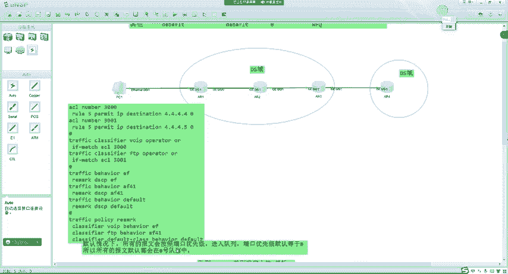

好吧。所以我们在二审呢。G0-0杠0接口trust。DICP。那tDSCP之后呢，我来看一下啊。哎，那老师EF有同学就会问他怎么样就进入到5号队列了呢？是吧比如说我display。Q死的G020杠1。

我们发现EF默认进入到5号罪点。比如说我骗4。5呢。

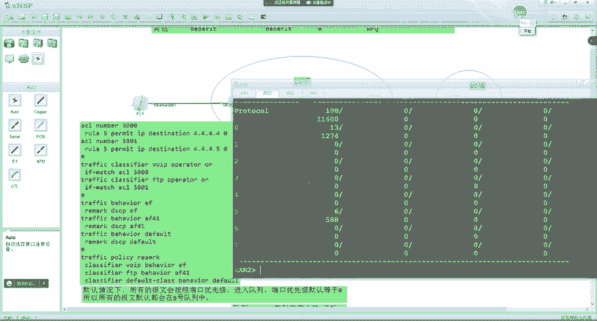

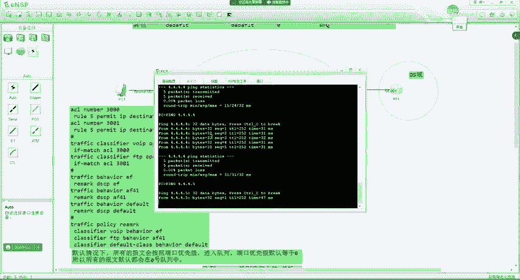

4。5携带的是什么标价？AF41。

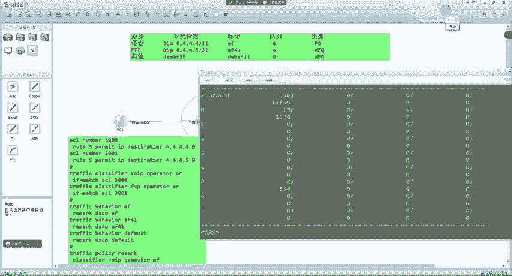

哎，4号队列加了5个吧。是吧。我们用PCE去骗4。6的时候。

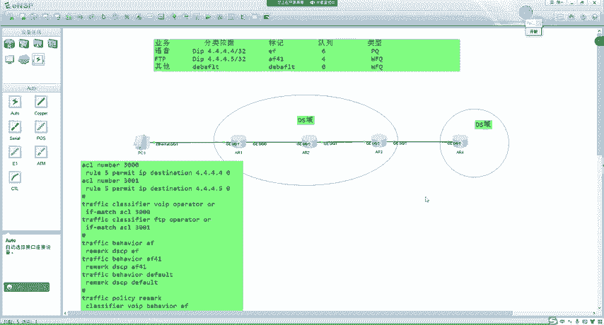

对啊，这是13。变成了18。

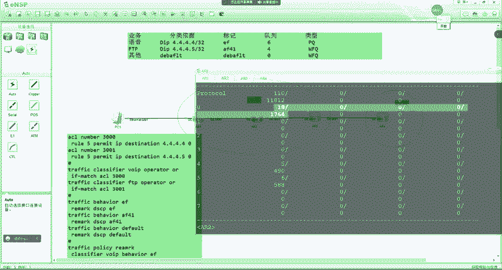

啊，0号队里又加了一些包。那也就是说当我们配成了t之后呢，有些标记它会默认进入到某些队列中。

是吧那这个对列是在哪的呢？我们可以通过一条命令去看。😊，注意啊，设备提供一条命令叫displayqS。Mb table。我们可以去看。DSCP到LP的映射。这个LP呢就是内部优先级，说白了就是队列。

我可以看到DICP。到LP的映射。默认情况下。0到7都进0号。8到16，也就是说八的进制8到15都进一。对吧AF41。你现在等于多少？8X加2Y。四八三十二。对吧34。34我们来看一下。进入到4号队列。

对不对啊？AF41吗？是吧而EF默认等于46。可不就是进入到5号队联。所以这个大家能够看明白吗？明白的同学敲一啊。

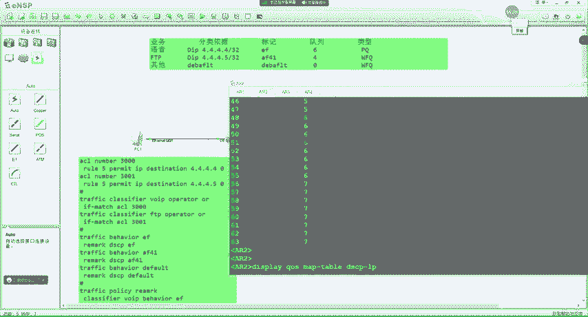

没问题吧。这是默认的啊。di displayplayqS map table啊，你后面呢可以打问号去看。啊他主要查看的就是。打卡。外部优先级到。内部优先级的。默认映射。也就是。队列啊到队列的默认映射。

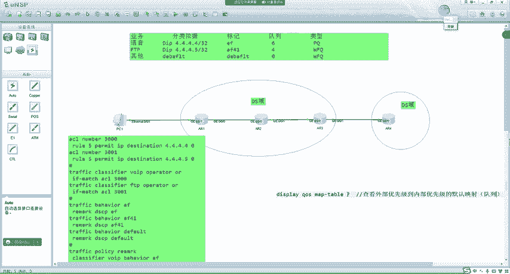

那除了可以看DICP的呢，你还可以看很多。比如说。802。1P到LP的。是吧0到01到12到23到34到4啊，5到5啊，6到67到7。

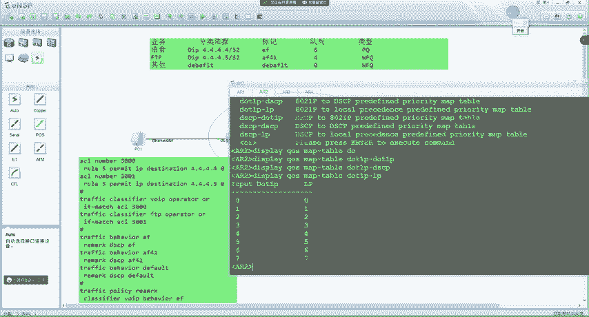

是吧这就是我们之前讲的这张表嘛。这不就我们之前讲的这张表吗？这是队列76543210。他是不是这样映射过来的？是吧这里之前我在给大家讲的时候，大家还记得吧？我把这里叫成了LP。

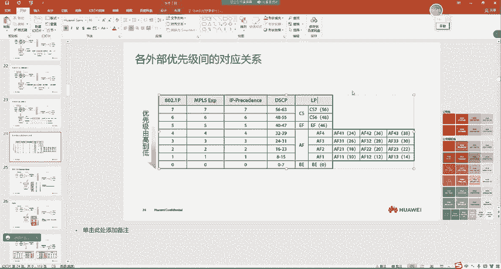

是吧这不就对列吗？是吧这就是我们之前所说的那张表。那这里看懂之后呢，我们刚还可以去看到，老师除了802。1P啊。

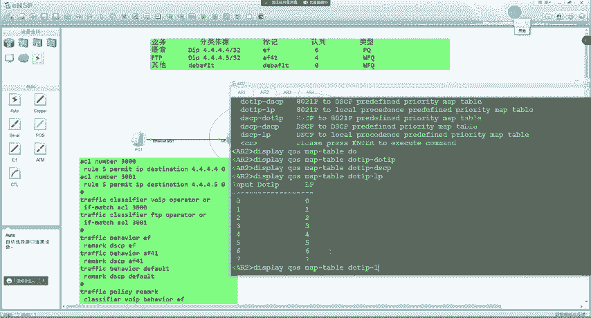

对ESP的为啥没有呢？是因为在我们这个模拟器里面没这个功能啊，这里大家知道。就除了这些呢，老师还有电。😊，80。1P到80。1P80。1P到DSCP是吧啊，DSCP到80。1P的影射。

他们又是干什么的呢？他是这样的。比如说我这是个二层网络，这是个三层网络。这有没有DICP啊？啊，不对，也就是说在三层网络中，这里有没有802。1P啊？没有吧。那这边是一个二层网络带微landt的。

他有80。1P。邱老师，我这边802。1P是1。我转发的。DSCPIP网络中。是吧他没有80。1P，那他DSCP应该映射成多少呢？

那我们也可以去看diplay map table。比如说我可以看802。1P到DIP的映射。零都断0。一都18，二都是16。3到24也是八的性止关系。这个大家看明白了吗？明白超意啊。没问题吧。

就你不仅可以去看，你还可以这样去看，还可以去看。DICP。到802。1P的影射。对老师我三层网络转发到二层网络中了。

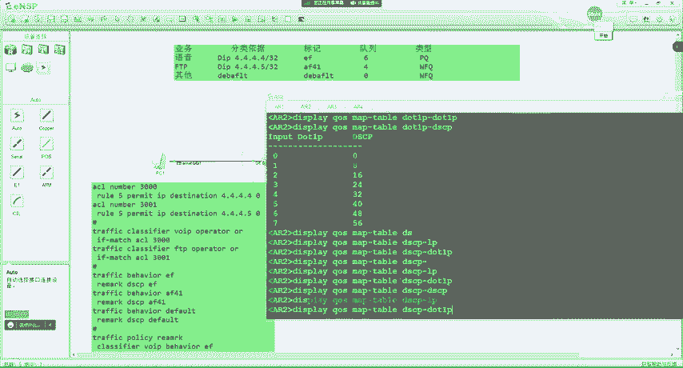

是吧呃，我这是三层，这是二层。三层开IP软发，二层他不看啊，对吧？DICP呢？也会有到802。1批的营收。好吧，这就我们讲到的QS的m table。

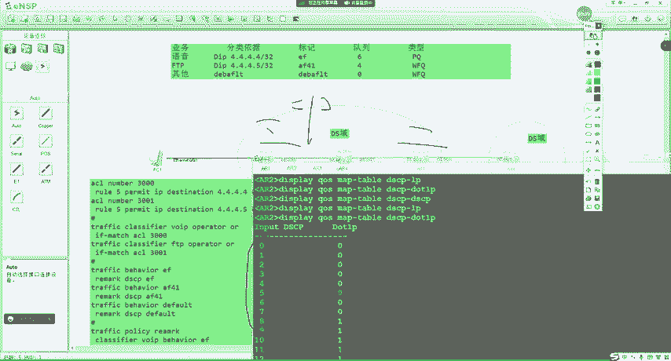

啊，我们把这个呢有时候也叫做优先泥用社。那这时候我们可以去看到啊。😊，首先，按照我们的规划，EF没有进入到队列6。那这时候有点不太符合我们想要的。

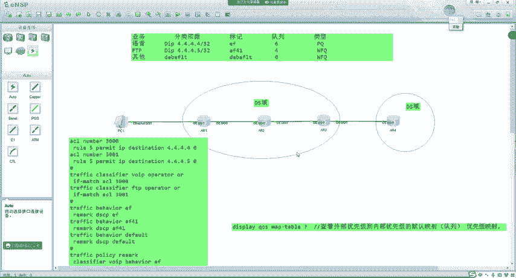

是吧。那这时候我们怎么样让EF进入到队列6呢？

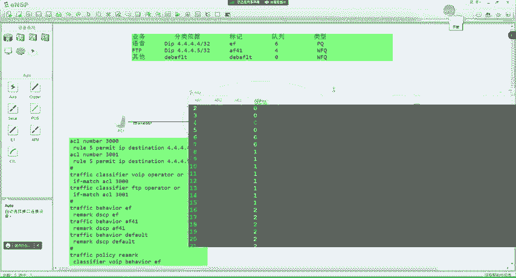

对吧也就是说各位同学认真观看啊，首先，default有没有进入到队列零啊？😊，有没有？有吧。AF设的一也进入到队列4，但是EF没到队列6。

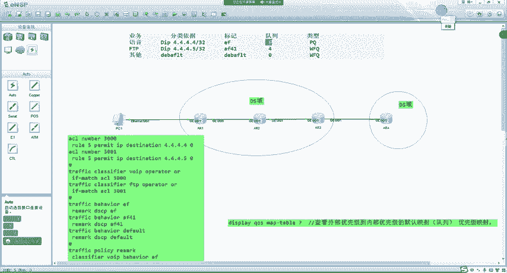

是吧那老师我们怎么样去把它指定到队列六中呢？实际上也很简单。注意啊。在二上，我们通过。QS map table我们可以去碰。DSCP到LP的映射。是吧input就是进来的是EF这个标记啊。

op普我给你指定。音谱啊，这只能打数字啊。EF等于46，对吧？output等于多少呢？我给你扔到。6号队列。那一条命令就完事了。好吧，这里只会显示你所配置的命令啊。

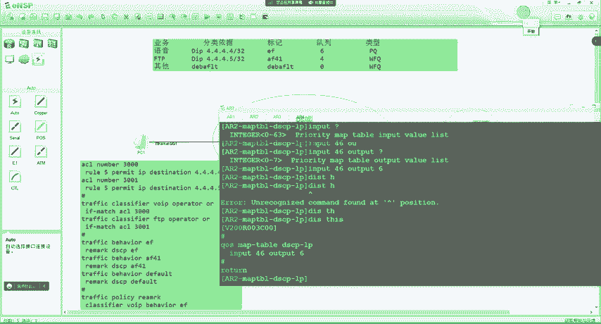

这条命令呢就是修改。DSCP到队列的映射是吧。

当你有了46的标记呢，opput就6进入到6号队联。所以这时候呢我们可以再来看一下di四playqS map table。我刚修改的是DICP到LP的，我找找这个46。有没有进入到6号队里啊？有吧。

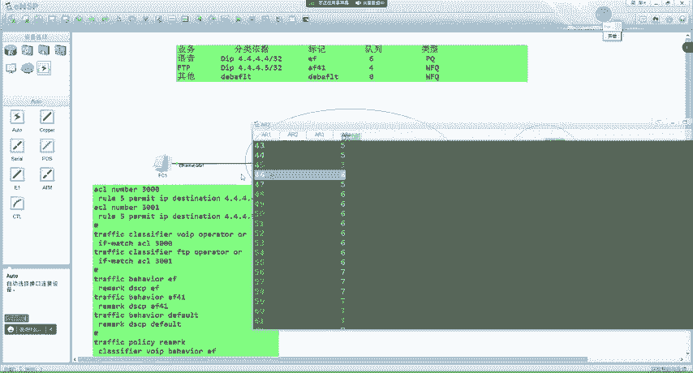

好吧。啊，那这时候呢，我们可以在一上再去拼一下。

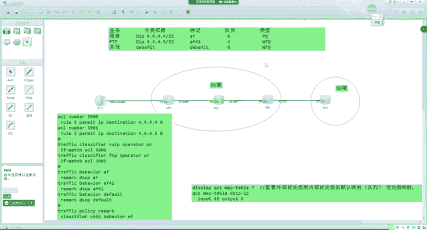

骗是的是的是的是。

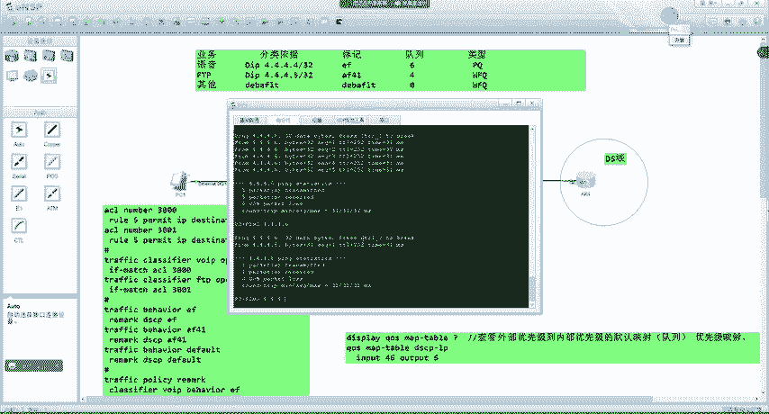

是吧，然后我们在二上呢，在diplay。Q2。嗯，队列的统计信息。Interface。70-0-1。interfaceG02021。是不是进入到了6号啊啊，是不是进入到6号，比如说现在注意啊。

6号是5个8。

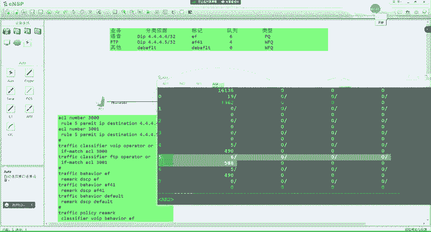

我们再去拼试点事。

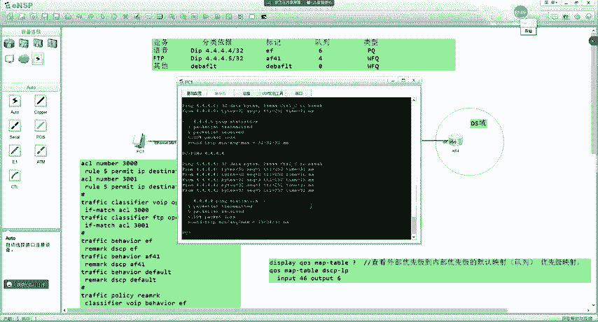

变成了9个对吧，再刷一下啊变成了10个。是吧，再刷就没了，因为我们就骗了5个吧。对，还有10个还有10个还有10个。

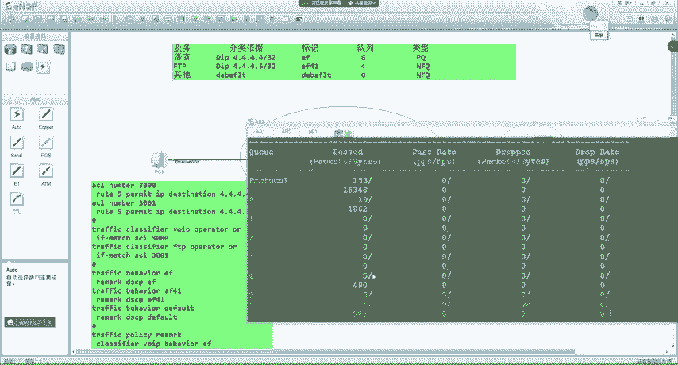

还是。好吧，所以到这里呢，我们就做完了。到这里能够理解，同学，咱们敲个一。好吧，大家都能看懂吗？那么就这个命令可能比较陌生一点啊。是吧之前没接触过。对吧呃，但这个命令大家不需要去强建啊。

你能看懂这个逻辑就行。因为在不同的型号呢，他们的命令是不一样的。啊，所以说这里不用死记硬背啊。那这个时候呢，我们把他们进入到队列做好了。那未来我们针对于他们不同队列提供的查分服务。就在在这里去做了。

好吧。呃，我们这个休息会儿吧，休息10分钟。1分钟之后呢，我们再去把6号队列呢变为PQ队列。4号呢做WFQ对吧？0号做WFQ我再去给他指定一下啊，怎么样去让不同的队列，对吧？嗯，变成不同的队列类型。呃。

咱们休息一会吧。休10分钟啊，十0分钟之后咱们再继续。嗯。🤧啊。好，同学们，我们上课吧啊。呃，刚这个网三班罗友同学问了一个问题啊。嗯。这个呢我待会再来给大家解释。好吧，待会再来解释啊。呃。

然后我们来看一下，就是在二上面，我们是不是把队列已经分好了，就是它不同的外部标记。嗯，已经进入到不同的队列中了。

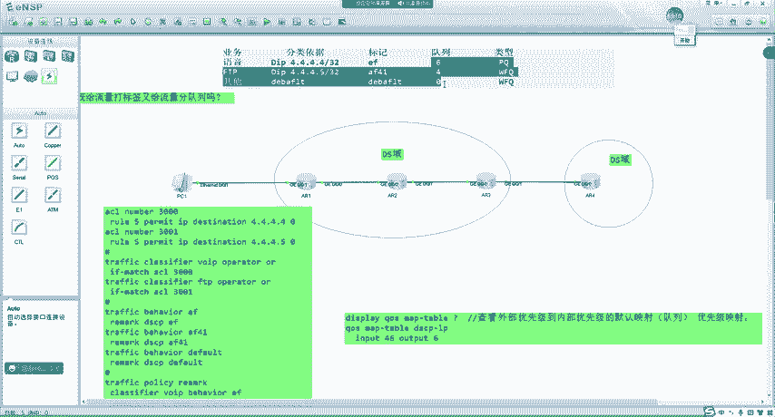

对不对？呃，这时候我们怎么样去指定这个队列的类型呢？我们是这样的啊，大家注意。呃，我们需要去创建一个啊，叫做QS。队列配置模板。好吧，嗯，这个呢就是一个名字，就像你创建流策略的时候，不也要有个名字嘛？

啊，我们创建一个对列配置模板的这个名字你可以自己去指定。嗯，假如说咱们的名字呢，就叫做这个。嗯。Q啊叫t的吧好吧，就测试。呃，现在呢我们要去指定队列的类型。好吧。嗯，然后现在呢，比如说我们要配PQ嘛。

对吧，PQ队列呢。

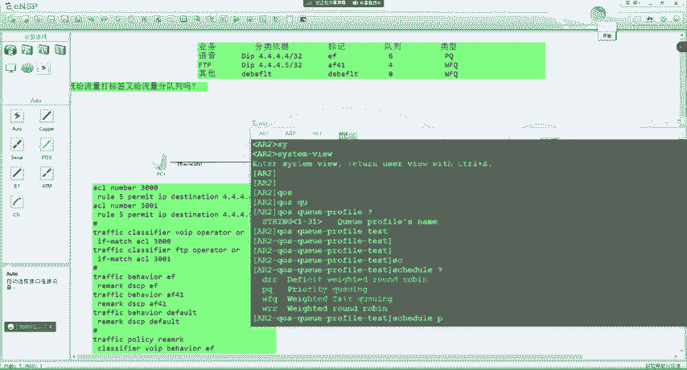

咱们可以这样。PQ队列是这个。5。wo。7啊，这样就代表567呢，这三个队列都是PQ队列。虽然在我们的规划中啊，我们只有64跟0。对不对？呃，但是呢我们依然可以去把其他的对列类型去给他配好。好吧。

所以说我们把五跟7呢配成PQ。呃，WFQ呢？我们就用0到4啊，全部做成WFQ。连拖市。好吧，他们也全部做成WFQ。那现在呢我们可以去看到。嗯，这是不同的对列类型。好吧呃，做完之后呢。

咱们这时候虽然把队列的优先级指定好了。那这样未来在调度的时候。就会首先去调度7号，然后调6号，然后调5号。啊，当然7号跟5号我们没有规划嘛，对吧？呃，然后再按照WFQ呢去调度连根四。

但是WFQ我们刚刚说了啊，他有一个权重。对不对？嗯，这个权重呢，待会我再来给大家解释啊，就是现在呢，虽然我们已经配好了。这个队列的优先级注意。啊，就是对列的类型。那这时候我们可能还有这样的需求嗯。

什么样的需求呢？就是未来啊。这样就是在我的0-0-1。对啊。呃，我们在调度的时候呢。比如说我们为了避免庸塞。嗯，有时候还要去做一些这个庸测，避免。是吧上节课我们刚讲的面龄。嗯。

PQ队列呢一般放的就是一些比较重要的业务。你像语音业务呢？是吧呃，这种呢我们就不给他做这个。嗯，丢弃模板了啊，就不做庸测避免了。像FTP这种的，我们可以去给他做一个嗯丢弃模板。啊，这个怎么样去做呢？

咱们可以这样。😊，比如说我。创建一个。对砌模板。嗯，待会呢，我们针对于这个4号队列区应用啊。好吧，然后我们可以叫做AF41。因为这个对列里面呢就只有AF41的流量。嗯。

然后WIED呢DICP然后DICP呢。嗯，AF41。啊，他的低门线呢，我们就用这个30啊。然后高门县呢用70。啊，然后堆弃率呢有30%。这时候呢我们就创建了一个丢弃模板。创建完这个丢弃模板之后呢。

我们再回到这个。队列配置模板中。不是叫test的吗？然后quarry。我去指定这个对列四去给他调用这个堆砌模板。堆砌模板的名字呢，咱们叫做AF41。然后我们把配置给他拷出来啊。

这是我们现在在AR2上做的配置。二上做了哪些配置呢？就我们不是把流量指导到进不同的队列了吗？对吧，然后给不同的队列配置他们的这队列类型，有WFQ的，对吧？有PQ的。😊，然后呢。为了防止队列4。

庸色啊出现这种伪丢器行为呢。我们给他调用了一个丢弃模板。所以到这里这个配置大家能够看明白吧。明白你同学敲一啊，这里应该没问题吧。好吧，这个上节课实际上我们演示过啊这两部配置。嗯，这里做完之后呢。

然后我们再去把这个队列配置模板呢interfaceG0-0-1。Q2对列配的模板啊，t啊，在接口下给他调用。调用代表什么意思呢？就是未来因为我们说了啊，在接口的出向啊才是有队列的。

对吧就是未来从G0-0-1发流量呢，嗯他会去参考。首先调度5到7的啊，就是当出现了庸色之后调度5到7的。呃，然后呢再去按照WFQ调度4到0的。对吧。那AF41呢，如果这个队列。

当它的长度到达30%的时候，开始丢包。啊呃，到达70%的时候就全部丢包了嗯，然后30到70之间这个增长率呢我们。从丢包率0啊涨到30%是最高的。好吧，那这里呢就是我们现在去做的。

但这个配置可能稍微多一点啊，因为我们Qs学的比较。嗯，多对吧，学了一两周了。所以说这个配置呢可能现在看着你稍微多一点啊。那这里作案之后呢。针对于我们的A23也会收到这种流量。那三的逻辑规划注意啊。

它跟二实际上是一样的。能不能明白，实际上是一样的啊，就是我们只需要把车的配置。给三刷进去就可以了。好吧。那三这边也是一样，就是未来二把这些流量发送给三了。三也是按照不同的标记呢指导进不同的队列中。

然后按照不同的调度算法呢，在这个接口转发出去。啊，然后最终到4了。那到4上之后呢，注意啊，这里我们考虑到这是1个DS域，这是1个DS域。那四是不是1个DS边界呢？大家觉得是不是？

也就是说三发送的这些标记，比如说这是联通。这是移动。三发的这些标记的流量。他有没有可能是这样的呢？注意啊。就是你这个标记为EF的标记啊。在我内部是最好的服务，但是呢你没有去买这种服务。

也就是说4的G0杠0杠0，我们能不能去做tra？能不能？不行吧。对吧所以说四上如果四后面还有5跟6。好像567啊。对要。4后面有567。那在这时候。朱页。我们要不要再去把这一套再给他来一遍？需不需要？

这里是需要的啊，这里大家注意是需要的。好吧，然后回包的话注意就是我们单向访问。虽然去的把request的优先级非常高，但是回包给你丢了也是不同。😊，那回来的路径要不要也配一遍？要不要？

回来路径你要不要重新匹配啊？也是需要的。好吧，所以说Qs呢真正部署起来是比较麻烦的啊。这里我给大家说一下。嗯，待会我们就不演示了啊，因为后面配置太多了。😊，好吧，这里我给大家说一点呢是什么呢？

就是针对于我们这种，如果换到两个不同DS域，他们在进行对接的时候。嗯，他们会签署一种叫做SLA。嗯，这个呢我们把它叫做服务等级协定。嗯，什么意思呢？😮，回去回去调用的模板不行。

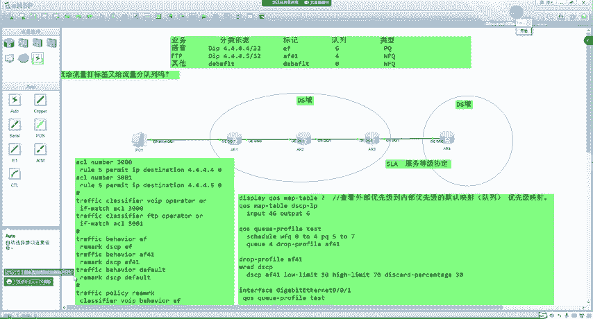

啊，可以啊，但你回来你也得把这些标记去打好啊。能懂吗？就是回来如果来回的标记是一样的，这些模板是可以通用的。好吧。就你回包，他的目的IP肯定不一样的呃，你回包这些标记你得重新做。

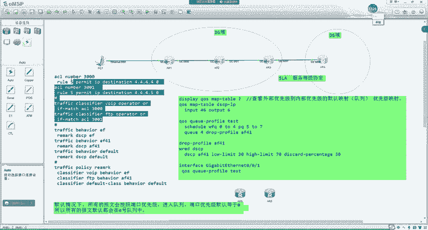

对不对？然后这里我主要给大家说的是什么呢？呃，在我们的不同DIC域对接的时候呢，可能会去参签这种服务的，你协定。嗯，他有可能是这样的。比如说这是我的联通。嗯，这是移动。现在联通呢，他有一个业务呢。

可能需要移动帮助来进行转发。对吧跟运营商给你签是一样的道理，你家里能那电信宽带吗？比如说现在呢我们要求呢。嗯。正常。是吧现在联通给移动说正常就有10兆的流量。对吧。呃。并且呢我需要允许一个长期的突发。

对这个长期的突发呢，我最高能够达到20兆。好吧。这是我们想要去就签署夫的你协定中呢，说白了就是个合同。是吧就希望你能够给我满足的。然后你要多少钱呢？咱俩再讨论讨论啊，我再发给你。是吧啊。

再给你交这么多费用。然后我们现在呢就可以在四上这么去做。比如说四是移动啊，你刚刚不是联通吗？我们就可以这样在四的。G0-0杠0接口呢？做1个QS卡。好吧，作为监管。然后针对于接收到的流量呢。

比如说我这个接口就只是连接移动的对吧？其他的我。啊，连接联通的啊，我移动内所有的内部的业务流量呢都不走这个接口，所以说我们也可以不用ACL匹配啊，可以直接针对接口做个CR。啊，CR你要10兆吗？

10123给你10兆。然后这时候你要突发嘛，对吧呃，我再配个配个片啊。PIR呢20张20123。对吧，然后CBS呢。嗯，CBS我们就不配了啊，我让他自己去产生。然后PBS我们也不配了。😊，好吧。

然后这时候呢。嗯，你正常绿色的流量呢？对吧。我就给你pass转发。但是有可能你有一些黄色的流量，黄色的流量呢，你可能就是我不给你这么好的服务了。可能在我的DS域内部呢。AF21服务就就那么回事。是吧。

就是因为你只买了10兆嘛。对不对？你10兆跟20兆之间呢，我不可能给你提供10兆的服务。所以说这时候呢我可以这样啊，黄色的呢remark。呃，黄色的呢也给你转发。然后同时呢。改你的DICP值。

你DICP值是多少呢？原本不是AF41吗？在我的内部AF21的服务就一般，我给你改成AF21。这是你在10兆到20兆之间的流量啊，就是虽然我允许你突发。对吧呃，但是呢。嗯，就是不给你特别好的服务。

这些超出的。然后如果你太过分，红色的呢就给你丢弃。这是我们在AR4上的配置。那这个命令可能比较长啊。呃，我就不写了，好吧，不删了啊，就这样啊，让他断一行。😊，所以在AR4上的配置，各位同学都看懂了吗？

问题敲一啊。可以吧。好吧，呃，这就是我们在部署Qs的时候。他整体的一个框架，我可以去看到啊。那首先我们在边界节点分类标记之后，是吧，在DS域内的所有节点呢，基于这些标记去给他们指定队列，对吧？然后呢。

去给你指定不同队列所得到的啊，比如说丢弃优先级啊，对吧？用色管理模板这些。对吧，然后我们通过不同的队列。采用不同的队列调度算法呢你PQ就SP调度。WFQ呢就是WFQ调度，对吧？那这时候呢。

不同的业务报文进入到不同的队列中。那基于不同的队列调度算法，他们得到的服务是不一样的。😊，那最终2个DSCP域对接的时候呢，我们也可以去针对于去签这种服务等级协定啊，针对你超出的流量呢给你做个降低。

但是你在规定范围内的流量呢依然是给你优先转发的啊，超出的流量就丢弃了。好吧，然后这是我们在市场的配置。这就是Qs的一个整体框架。那这里呢我再来给大家解释两个问题啊。第一个问题呢，就刚刚有同学问的。

就是老师能不能在AR一上打流量，又给他分队列。嗯，这个实际上是可以的。好吧，我们来看一下啊。就在A2一上呢。我们displayqS。嗯。Interface。啊，快ry。

s interfaceG0-0-0。我们来看啊。就是在AR一上，只要我们做了这个留分类之后。他不同的流量呢就会进入在这些队列中。也就是说我们来看啊。真正去执行，就是按照我们这套配置。

真正去执行差分服务的是不是在23？这些节点上。而ARE有没有去执行查分服务啊？有没有啊，实际上是没有的。就是虽然我们给他指定到了不同的队列中，但是我们没有去配置队列的类型，它的差分服务是来不了的，是吧？

因为真正决定。你得到什么样的服务，这不跟高铁一样吗？你进什么车厢，你得到什么样的服务？对不对？也就是说我们在AR一上虽然做了留分类，他自己也会默认进入到不同的队列中。就是根据我们改之后的标记啊。

是根据你修改之后的标记，已经在A2一自己上就进入到不同的队列了。但是对列类型我们没有指定。能不能明白？那这时候在AR一上。有没有对应的服务啊？是不是没有啊？

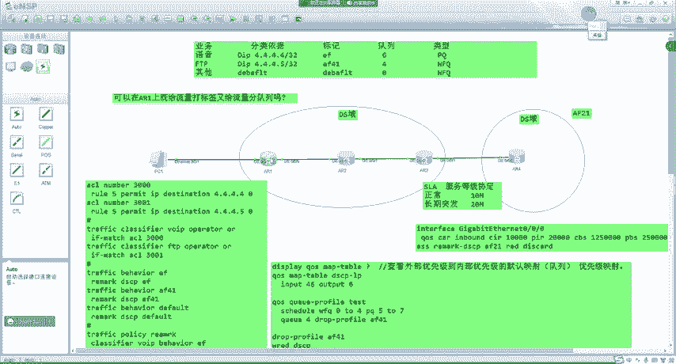

对吧。所以这时候呢我们也可以在AR一上去做下，就把这套配置呢AR1上是G0-0-0了。

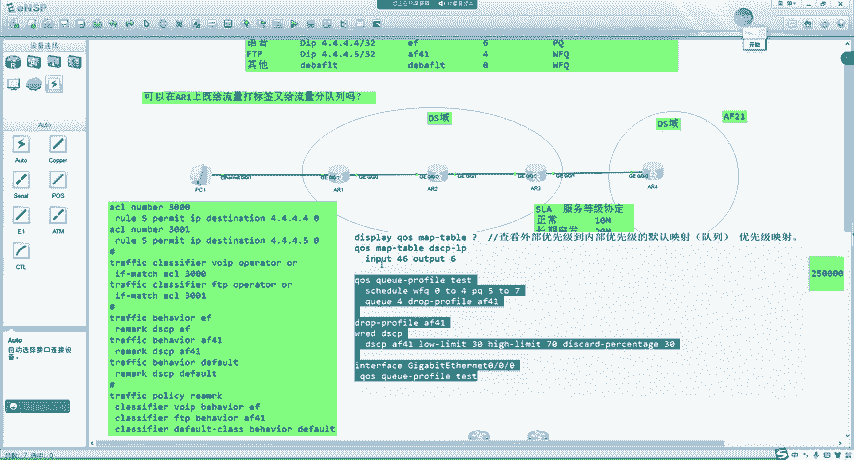

把这套配置呢，我们再给他刷到AR1上。就是A2一呢，它既是DS的边界节点，负责分类与标记。也负责去执行查分服务。所以这里大家明白了吗？明白乔伊啊。好吧。那实际上我们在AR一上呢，是可以区分的。

但是在分的时候，大家需要关注一点的是什么呢？就是。A21呢，它是根据。标记。之后的流量。进入到队列的。好吧。因为我们在聘的时吧，默认都是标记为0。如果他根据标记钱的流量进入到队列呢。他肯定不会有。

队列五啊队列六的统计。对吧你比如说像我们拼4。4，他不是进入到队列6吗？是吧比如说我现在在PCE上去拼4。4。然后我们到AR一上看，对列6现在是空白的，然后我们再刷一下。对不对啊？

他为什么进入到队列6呢？因为我们给他标记成了EF，他是根据标记后的映射进来的。好吧，然后这是给大家说的第一个问题。第二问题要注意的一点呢，就是Qs的部署呢。是端到端的。那么正向。部署的同时。反向。Y要。

进行部署。这一点是很重要的啊。我举个例子，比如说AR1，虽然我们给的非常好，A2给的非常好，到A23这里，他给你丢包了。那你这个Qs做的有没有达到业务的需求？😊，是不是没有啊？对不对啊？是没有达到的。

对吧所以说大家要注意啊。这就相当于什么一样的，就是。半路给你嘎掉了。对吧我们真正通讯的时候呢，如果要再做Qs的话，要在沿途的每一跳节点上都要去配置。不管你前面几点做的再好，你到后面几点一下子给你扔了。

那都是没有用的。就相当于这个接力赛一样。对吧那这接力赛，你前面的人跑的再快。啊，到最后一个人。他得拉后腿了，那你最后也赢不了吗？😡，能不能明白？所以说我们在部署Qs的时候啊，是端到端的。好吧。

端到端是怎么样呢？PCE去访问A24。正向部署。对吧沿途的每一个节点呢，你都要去说。因为你不做的时候，你到三这里，他给你嘎掉了。是吧。嗯，这时候实际上Q是没有作用的，因为你的业务依然质量是不好的。啊。

所以说首先要端到端的部署。第二点呢。因为我们业务是有往来的。是吧就像你打开一个浏览器，你要建立TCP绘画。业务是有往来的。那除了你正向部署的同时呢，你反向也要进行部署，就类似于语音这种业务。

你不能说了话，让别人听到很快，对吧？但是别人说话你听不到。😡，那不就谢建了吗？是，所以说啊正向部署的同时，反向也要进行部署。那这个就是QS。所以这里各位同学都明白了吗？明白的同学，咱们敲个一。好吧。

都可以吗？可以是吧。嗯，这个配置呢我保存一下啊，然后课下的话，我会把这个拓普。嗯，上传到咱们的全文件中。好吧，你们想挑命令的话，可以参考着去做一下。哦，对就跟你谈恋爱一样。啊，你自己。嗯，还不行是吧。

别人呢还得给你有点响应。就类似于这样。嗯，让我们回到刚刚的。呃，然后我们来看啊，各位同学注意。呃，这个丢弃模板上节课我们只说到了一种部署方式，实际上还有一种。那这一种呢，待会我们先讲完这个啥啊。

再来给大家说。我来看啊。我们刚在配置队列的时候，是通过一个叫做QS队列配置模板。是吧去做的不同的队列啊，你比如说PQ是谁啊，WFQ是谁？对不对？

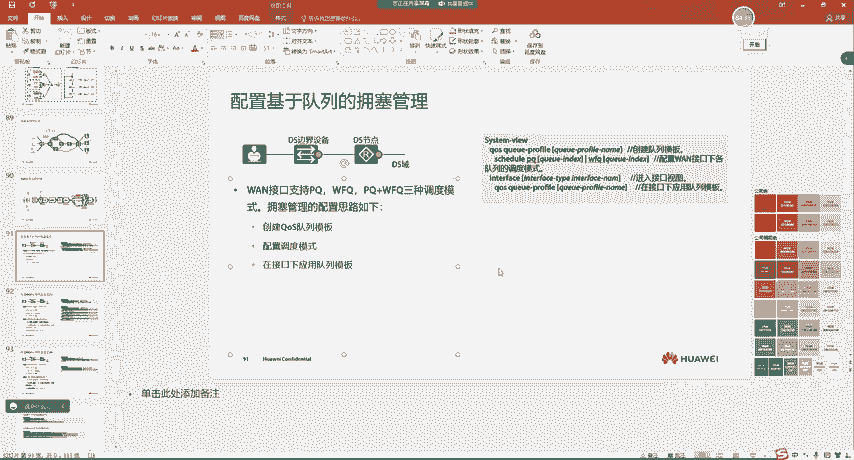

实际上这个对列呢，我们还有一种配置方式，你也可以通过流分类去做。这个就更加简单一点。这简单在哪里呢？我们发现啊。就是按照我们这种方式。就是我们要不要给流亮打标记，打印标记映收到本地有限级。

然后再进入到不同的队列，然后再针对于队列去配。是吧。就这种逻辑呢，有时候我们觉得会复杂一点，就老师有没有简单粗暴一点的？就我直接匹配流量啊，你这个流量就进这个队列就完事了。是吧我不要基于DICP了。

我就用5元组。😡，大家能懂我的意思吧？是吧因为我们看到现在所有金队列都是都按照标记的。要不然按照DSCP，要不然按照800P。对吧或者说ESP。就老师有没有粗暴一点方式呢？我直接ACL抓。

对吧我抓这个流量，我直接放到这个队列里。大家能懂我的意思吧？是吧。然我直接抓4。4的流量，我直接扔到这个对列里面就完事了。我也不做那么复杂的映射，这样行不行呢？就简单粗暴一点方式，实际上也是有的。

就是我们还可以利用一种。这种是怎么样的呢？是这样的。我们呢还可以去创建一个流分类。注意啊，创建一个流分类。然后在流行为里面呢，去配置他的队列。注意啊，各位同学。在刘行为里面去配着他队列。那配置的时候呢。

有AF，有EF有LLQ。嗯，还有WFQ。好吧。这里可能有同学就懵逼了啊，老师这是什么意思呢？注意啊。就是队列，还有另一种配置方式。那。嗯。或者说基于留分类。或者说MQC的。队列配的方式。还有一种。

那这种就很简单。怎么样呢？就这张图我就不用了啊，我就给大家演示一下面令，我开1个A25。

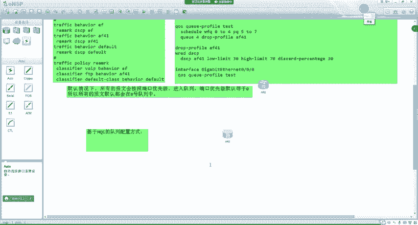

嗯嗯。我们来看啊，我们可以这样。😊，呃。ACL3000。嗯，ruler permit sauce。Commit IP。目前IP地址呢4。4。ACL3001。目的IP呢4。5，然后呢，tryface。嗯。

刘分类啊，然后VIP的。一幅麦ACL3000。然后是。FTP的。if maxACL呢。呃。3001。然后再去创建一个。查face。Be害我。啊，比如说我们是这个。嗯。VIP。啊，就直接叫VIP啊。

我可以直接去给他指定队列，这个就不按照端口队列那种了啊。因为我们说过了，所有的队列都是抽象出来的概念。对吧就我们也可以直接去按照另一种这种呢，我们把它叫做CBWFQ。他是怎么样的呢？也可以叫CBQ啊。

Qurry好吧，我们可以去指定这个豹文进入到哪种队列中。在刘行伟里直接去做。那这里呢分为三种。

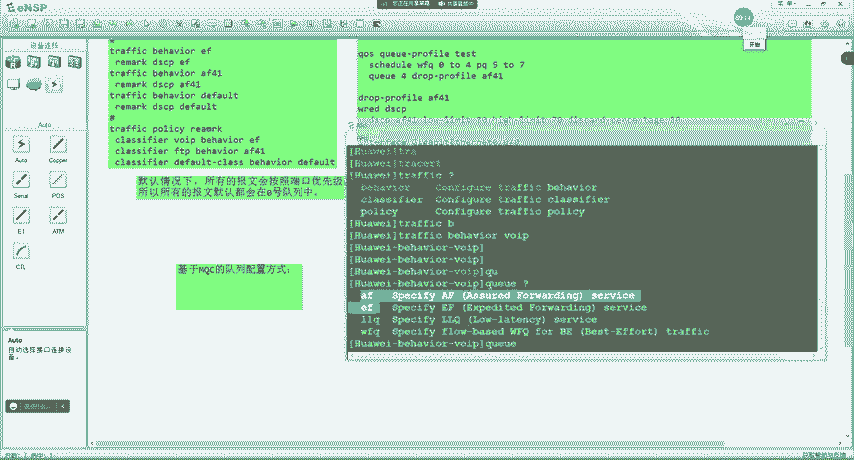

一种呢。叫EF一种呢叫做AF。还有一种叫做BE。EF呢一般我们是换一些低颜迟。低抖动。的业务流量。啊，AF呢？放一些对岩时。不敏感。贷宽。具有带宽要求的流量。这是只是给的一种建议啊。

而BE呢一般放的是默认类。啊，及。即。不在规划部署内的。好吧，就我们可以用一种简单粗暴的方式。

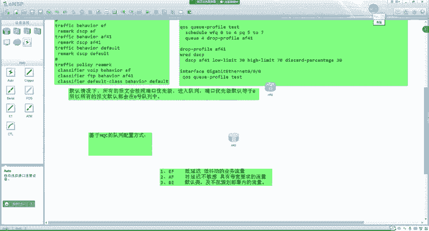

这种怎么样呢？我们看到还有一种叫做LLQ啊。😊。

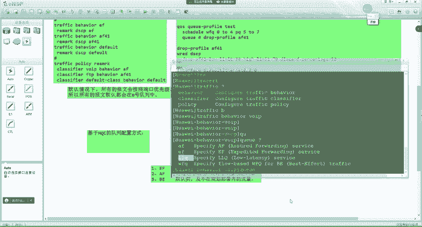

这华为对LLQ的介绍是这样的，就LLQ呢属于一种。特殊的EF队列。他能。提供。更低的。延迟。和抖动。是吧，也就是说，如果真正我们按照层级区分的，LQ是属于最好的，然后是EF，然后AF，然后B。啊。

一共提供了4种。那我们在A25上可以这样对，queryLLQ对，然后你可以去给这个LLQ呢去配了一个带宽。那这里为什么要配着带宽呢？我给大家说一下啊。就是我们看到的这几种队列呢，他们的带宽是这样的。

zyao。嗯。EF呢。他是支持就是他能够占用AF的带宽。这里各位同学认真听啊。他可以占用AF的贷款。那或者我这么来举个例子，比如说在这里呢，我有个G0-0-1LLQ的优先级是最高的。那比如说。

LQ我能不能让他使用接口百分之百的贷款，就这一季。这个链路是一G，但是我给这个LIQ对列配置的带宽也是一G。肯定是不行的。这里为什么不行呢？实际上不行的原因就是。因为有报文总是转发LLQ。

对吧那这样就会导致其他队列就已永远没有调度机会了。所以说LLQ呢，我们要配置一个上限。认能听啊。要配置一个叫做上限。这个上限呢就是我们通过ban单位去指定的。比如说我给你的带宽呢。

我们可以通过PCT去配置。占接口带宽的20%。懂了吗？比如说你是一记再宽的，就是只给你200兆，你最多只能用200，不能用的再多了。好吧。然后对于EF呢也是一样的。那你还可以去宽。EF。

EF你也可以去配摄他的带宽上限。啊，AEF这种他们都是支持对空闲贷款像AFBE啊，他们如果没用完啊，是支持对他们占用的。那比如说没有LLQ的时候，我只配EF占百分百行不行呢？也不行。所以这里大家注意啊。

所以EF我们配置的上限，它只能用这么做。这里各位同学明白了吗？

明白乔一啊，他有点类似于限速的感觉，就是我虽然给你最高的预先权，但是你只能用这么多。😡，是吧。这相当于什么一样呢？餐厅开饭了，让你第一个吃。对吧虽然我让你第一个吃，但是。是吧你不能到那里把肉全吃光了。

大家能懂我的意思吧？所以说LLQ呢跟EF就属于这种。虽然我让你第一个走，但是你不能太过分啊。😡，是吧家里开饭了，让你先吃。你到那里把肉吃光了。是吧让别人喝汤水。不太合适吧。是吧所以说这是EFF的特点。

😊，我们配置的是带宽的上限。那这时候呢，我们配置了EF之后。对吧，然后退出来。再去创建一个tryface behind。FTP。FTP呢，我们给他指定到AF队列中半单位。

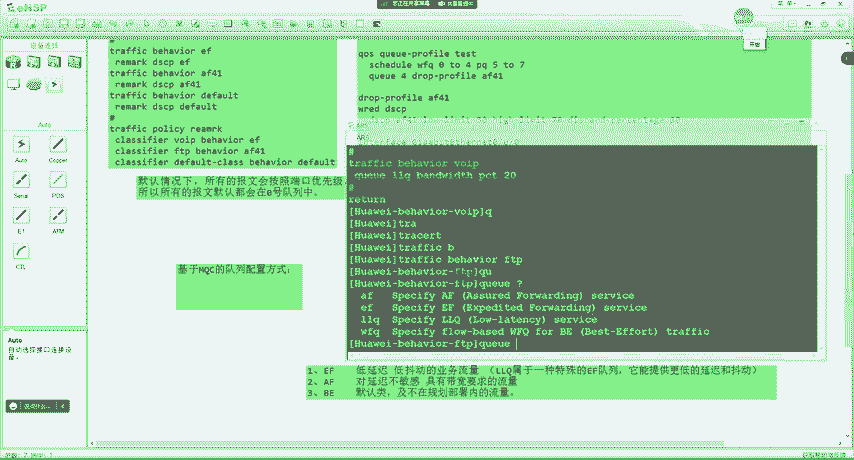

PCT百分之。50。对，那有同学就问了，老师这个PCT是什么意思呢？注意啊。😊，LLQ跟EF他们配置的。是。带宽的上限。

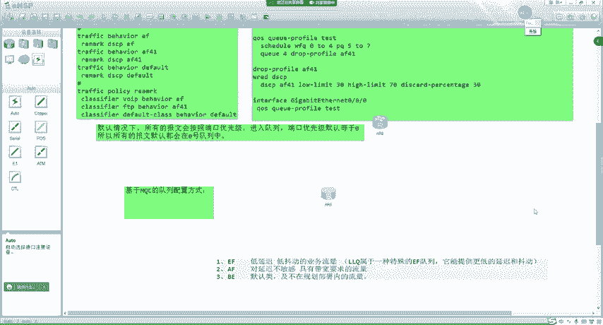

我把配置贴出来。

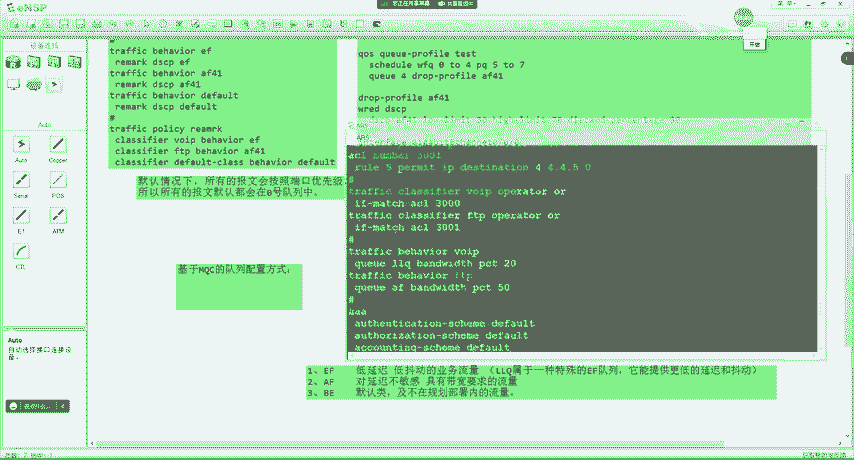

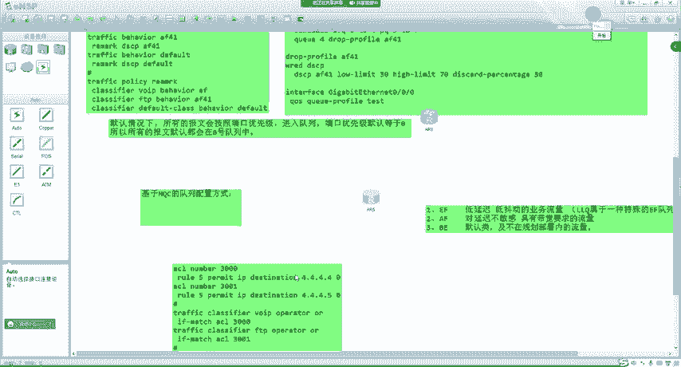

这两个呢，他配置的是。带宽的上限。也就是说只能用多少，对吧？有点类似于限速一样。但是FTP这种呢，它配置的是。带宽的下限。保证你有多少带宽能用。大家能懂我的意思吗？注意啊。这个FTP呢。

我们配置的是带宽的下限，啥意思呢？就是现在呢我给你接口50%的带宽，就保证你有50%能用。那懂吧。但你具体能用多少呢？我们不做要求。这就相当于什么一样的，就相当于这是A。😊，这是B。这是餐厅。是吧。

餐厅开饭了，A先去吃。对吧A先去吃呢，你只能吃20%。对不对？那这说下面再去B，那B可能不满意啊，H完了怎么办呢？是吧所以说如果我们通过AF队列去指定带宽呢，它是下限。啥意思呢？就是保证你有50%能吃。

但是你的优先级别没有A那么高。大家能懂我的意思吗？我举个例子啊。比如说现在我的接口已经拥塞，因为拥塞情况下，这些队列才会产生作用。是吧。当我有了20%带宽的时候。那这时候大家觉得是转发谁呀？

转发是A还是B？转发是谁啊？转发的是A，没错。好吧。当我有70%的时候。那满足A转发的同时呢，也会剩下的给B。能懂吗？他是这么一个意思啊，虽然你A有最高的优先权，但是你是有上限的，你不要太过分。

是吧B虽然你没有最高的优先权，但是我会给你一个保证，保证你有50%能用。😡，所以这个意思各位同学明白了吗？明白的敲一啊。没问题吧。好吧，所以这是两种对列不同类型之间的区别。那像上面这种。

我们一般留给语音，对吧，因为他们对带宽的占用不高啊，我们也可以保证他带宽。下面呢你可以留给视频这种业务。

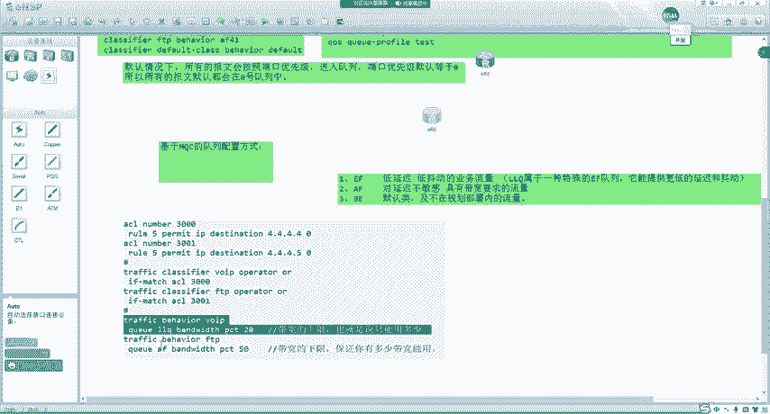

那有没有这种可能？就老是我这个AF对列呢，有时候我还要配。丢弃对吧，配庸色避免。那能不能配呢？也可以。我刚在这个流行位下面不是配了一个队列吗？我还可以做一个jo。

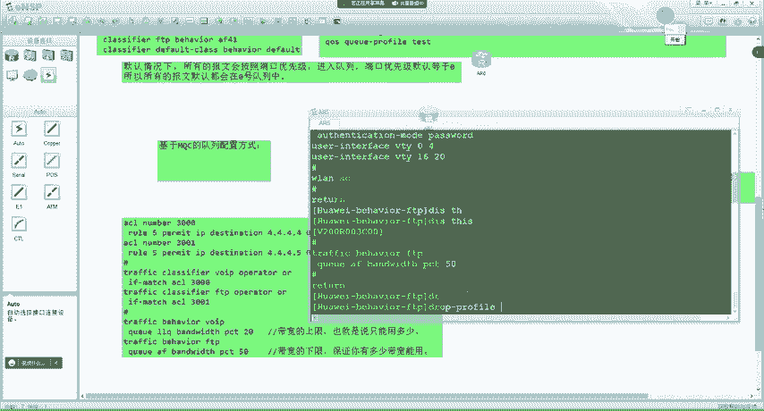

对掉一个丢弃模板。这个丢弃模板我们刚刚不是创建了1个AF41吗？我直接给他调运过来。😡，啊，他说我现在没创建，因为我现在A25啊。

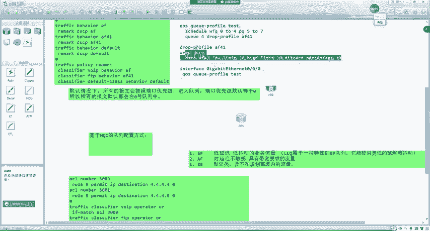

比如说我现在呢去创建一个丢弃模板。创建这个丢弃模板之后，traface be FTP。去调用这个丢弃模板。能不能也调用啊？是不是可以啊？好吧。那这就是我们配置的第二种AF对联。

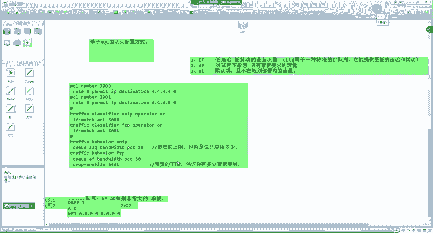

而BE就很简单了，我们现在都做完了，我们就这样。😊，Tface。厉害我。Defa。对吧其他所有不在规划内的流量呢。Qurry。WFQ。啊。说白了WFQ就是BE的意思啊，就是这些BE呢。

他们采用的是WFQ调度。那做完之后呢，我们再traface policy。啊，我们可以叫做CPQ啊，留分类呢VIP刘贤伟是VIP。刘分类呢是FTP刘贤伟是FTP。

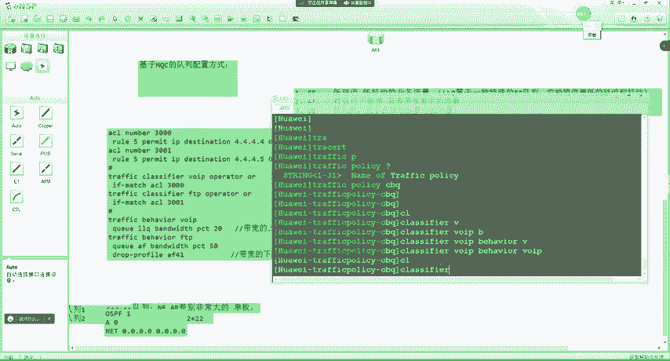

流分类默认类对吧，你们全部进人组当。默认队列中。嗯，订报了。好吧，这样就算了。抓案之后呢，我们只需要在出街口interfaceG0-0-1对吧。呃。

traface policyCBQ凹的再出相进行调用就可以了。那这就是第二种配置方式。我们把这种呢。叫做。W啊，不对啊，叫做CBQ好吧，叫做基于MQC的对列配置方式。好吧，所以说这也是一种配置方式。

那这里要给大家解释的一点是什么呢？是在这里的，我们可以去看到LLQK。😊，这个AF队列。zya。他们占用了70%的贷款。那。default占用多少？占多少？

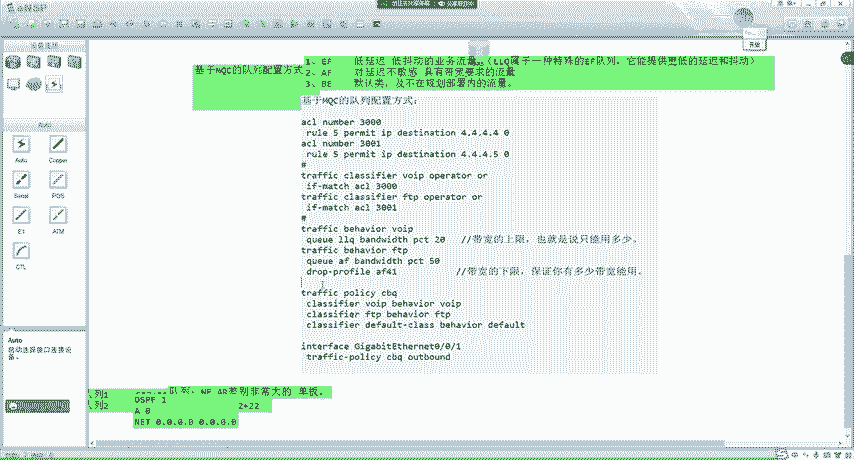

刚各位同学可以看到啊，我在default里面没有配任何的对带宽参数。

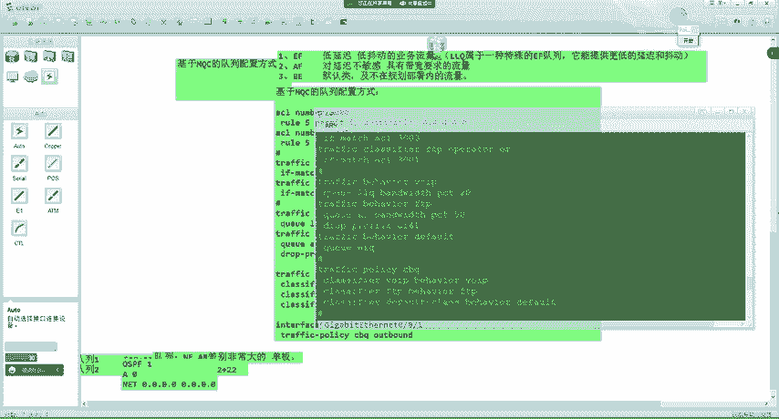

注意啊。defa的就吃他们剩下的。能懂吗？所以这一点要注意啊，低的只能吃他们剩下的。

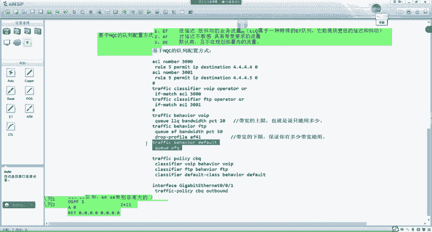

但是我们在配置的时候要注意一点，他俩能不能占百分之百。那不能。是不行的。好吧，朱意还是不行的。懂了吧？然后这里再给大家补充的一点是什么呢？是这样的。大家可以注意，我给AF配置的是下限50。

有没有它的上限？AF有没有上下？有没有？没有。是吧。没有上线吧，没有。我举个例子，比如说。LLQ用了20%，现在WFQ没有流量，注意啊。AF是可以把吃WFQ空闲的流量。也就是说，当WFQ没有流量的时候。

他最多能够到达80%。懂了吗？各位同学。懂得敲伊啊。问题吧。

好。那这就是第二种配置方式。我们叫他基于MQC的对联配置方式。

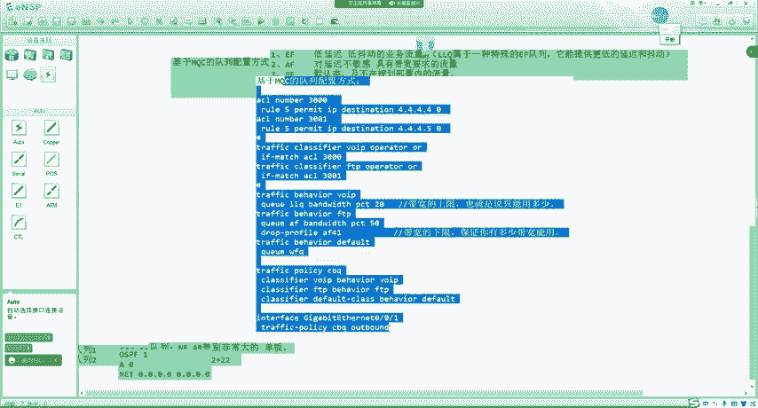

好吧。

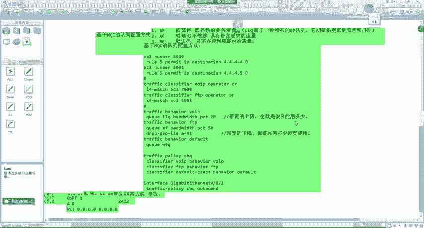

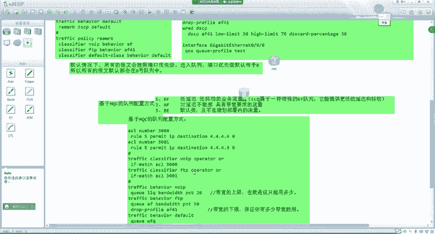

那有人可能比较疑惑，对吧？老师这个。LLQ为啥没有下限呢？😡，你觉得还需要吗？你优先级最高。假如说这一G的接口，他有了就给你了。😡，你需要配下线吗？不需要吧。你的优先级最高了，他没有。

那你就没你就没有了，他有了就给你，所以不需要赔下限。😡，能懂这意思吧？那没有的时候大家都没有啊。没有的时候，你给他配个下线也没用啊，因为这个接口堵着呢。对吧但你只要配优先级第一，他有了立刻就给你了。

所以说LL的Q跟EF呢，我们不需要去配置下限啊，好吧，只需要配置上限。😡，但FTP呢这种你可以去配个下限，就保证它有多少能用。是这么一个关系。好，那最后呢，我再提问各位同学一个问题。

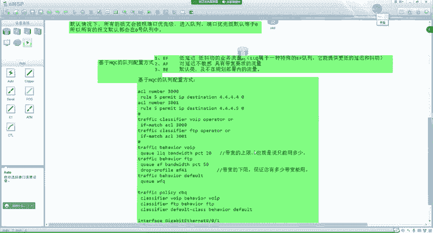

我学到了很多种队列技术。如果接口没有用色。这些队列会生效吗？会吗？注意啊，实际上是不会的。庸社管理。建立在一个什么样的前提基础下？代表你的接口已经用上了。当接口没有庸测的时候。好吧。所有的队列技术啊。

即使你配上了，他也是没有作用的。

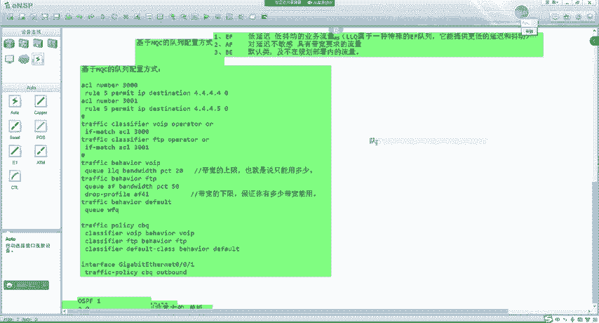

好吧。

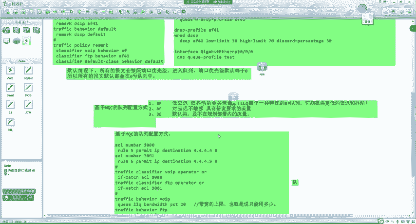

行。那这就是我们所说的这个。嗯，队列技术啊，今天这节课我们就讲这么多啊。

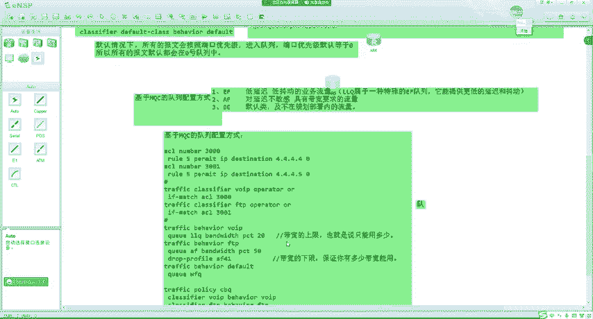

好吧，今天就讲这么多。嗯。如何判定庸色了？看丢包啊，交给你一条命来啊，叫做display interface brief。知道这条命令吗？首先这里呢有。接口带宽。占用的。百分比。好吧啊。

你那是看IP信息啊，你还可以通过display interface叉叉叉。啊，这里可以去看接口的。丢包信息。好吧，你可以去判断接口带宽的百分比当前占用了多少，去判断有没有用。

比如说接口20%的时候有用测吗？有没有？有没有啊？是不是没有啊？啊，模拟器模拟不出来，模拟器你做不了用作。好吧，所以说我大家可以看到啊，我从来没有给大家做过。是吧。比说老师我做了用色有没有啊，注意啊。

我没做过用色啊。这是没有二层接口啊。Display I interface brief。diisplay interface brief。interfaceG0-0-1。嗯。在这里能看到吧。

有一个丢包数量。好吧。那模拟器这模拟器里面可能没有interface不认。啊，那个不会啊那个不会，那个得需要你配置啊。

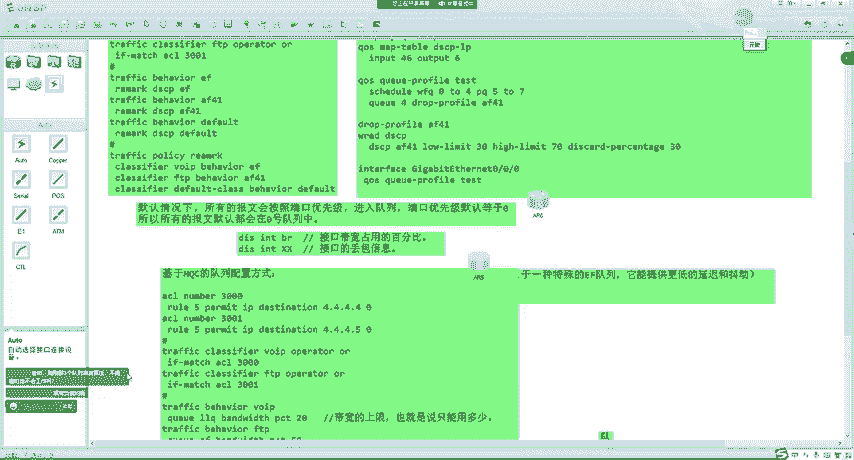

你比如说我们没有这样去指定的时候，是不会。这里大家注意一点啊。刚刚我们课里的理论呢讲到的这个SP调度啊啊，不对啊啊，这个LPQ队列啊。呃，这在NE里面是有的，能懂吗？这个理论是NE的课件啊。

但是我们模拟器用的是AR去做的实验。大家能懂我的意思吗？所以你看到我刚的配置没有LPQR。

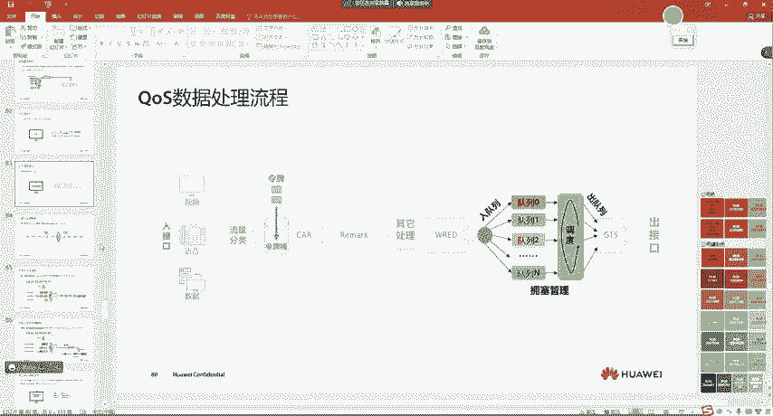

好吧，在NE的手册里面是有的。懂了吗？AR里面他是没有这个LPQ了。就你可以用。WFQ跟PQ。没有这个LPQ啊。

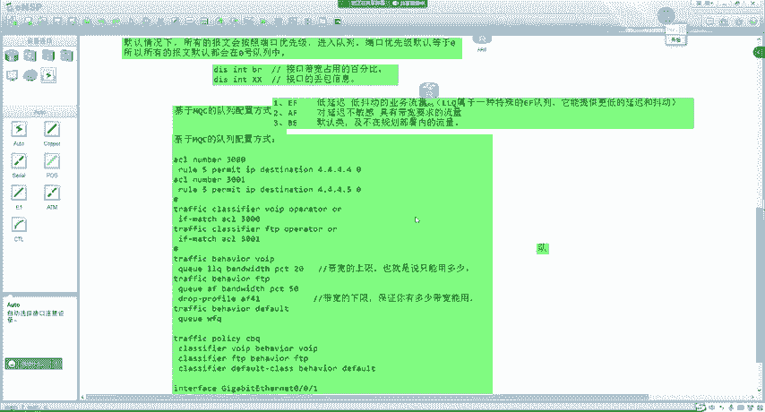

嗯，笔记我就不给大家整理了啊，然后我把这个拓谱保存一下啊，你们刻一下可以自己去做一下啊。呵。为什么有这么多对列算法？嗯。你你先品品啊，那个谁。庸色了怎么解决嗯？这两周你都白学啦，小白白。

咱们讲的所有的Qs，那不就是为了避免，就是说在庸色的时候去保证某些重要的业务吗？能懂吗？好吧，你只能去保证一些重要的业务啊，怎么解决。嗯对对，除非你再去买贷款，但是这个不太切合实际啊。

是吧除非你现在有新上的业务。对吧。嗯，要不然的话，这个不太切合实际啊，就成本太高了。啊，而且你像比如说你买了带宽。那你。接口板要不要换呢？你以前实际的光模块，你要不要换成40G100G的？这都是钱啊。

是吧。嗯。嗯，这刚给你说过了啊，buff同学。为什么要这么多的对列算法？这个在不同的设备里面是不一样的啊。好吧。实际上你不需要去考虑他为什么有这么多的算法。那懂吗？你只需要去考虑的是什么呢？

就是他们真正去都去实现的目的是什么？就是为了区分不同的业务质量。能懂吗？为什么有这么这就相当于我们中国一样啊，你说老师为什么有人吃炒菜啊，对吧？有人吃凉菜。啊，为什么要有这么多的菜？这个口味不一样。

对吧而且还有点发展性的原因。啊，你像如果一种算法。啊，他可能有一些劣势。那这时候呢，我们就要去推出新的算法。啊，但是你要关注的应该是什么呢？应该是。不同的算法，即使采用了不同算法，他们所实现的共同目的。

也是一样的。就是为了区分不同业务的质量。好吧，这是你应该去关注的。嗯，背板带宽和包转发率怎么参考的？这个根据设备啊。啊，这个不同的交换版嗯，你可以去看那个。呃，产品的介绍。这一般在产品介绍里面才会有啊。

我记得好像是按最小包介绍的。应该是按照最小报案。64比特那个计算的包转法率。背板带宽是这个。就是所有接口就是上下行带宽的累合。好吧。嗯。这个倒没有啊，这个不需要去记啊。苏州中心同学。这个我也没有记过。

能懂吗？所以说我之前多次给大家强调过，理解是很重要的。然后自己梳理一遍就好了。不需要死记硬背，因为根本记不住。就是用到的时候啊再去看看。Qs这个东西啊，我建议大家去学个框架。

不同设备之间的差别是非常高的。是非常非常高啊。嗯，这里我给大家看一下。这个只能你到项目上之后啊。你自己去评品，你就明白了。他不同单板之间的差异是非常大的。能看到吗？就是你不同的接口板LPU。啊。

他的差别是很大的。然后这些。啊，然后这些。然后这些。这是在NE上面啊，AR里面有些是支持可扎拔模块的。不同的单板之间呢还是有很大区别。这个就没有。找个妹令啊。嗯。啊，这是在HQ中啊。

你可以看到就不同的单板之间是有很大差别的。这种你要记住吗？你也记不住。我也记不住。你是如果换到AR里面，我记得差别就更大了。

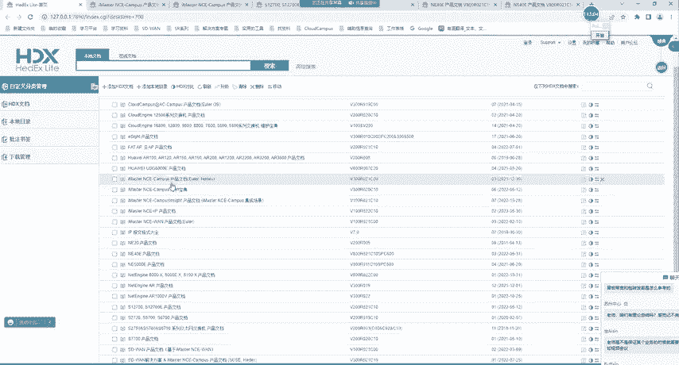

这个我建议大家啊。懂得框压。啊，就完事了。

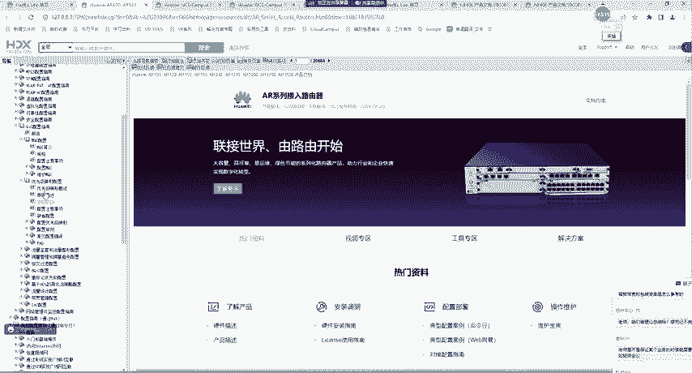

你看首先端口优先级啊，在不同的软件版本还有区别。

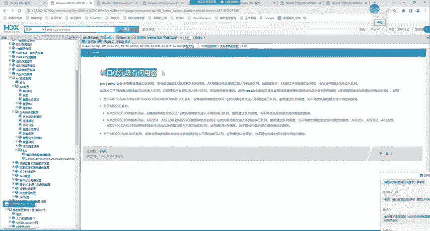

然后tras的命令呢，在不同的设备里还有区别。这是一个版本这是一个版美，这是一个版美，这有一个版本呃，还分型号。能懂吗？所以不要去记他，记他没用。就是用到的时候去查一下Qs学的就是一个框架啊。好吧。嗯。

这个没错，厚积薄发同学你的理解是对的啊。对，就是用到的时候去查一下。好，同学们，咱们今天就讲这么多吧。好吧，今天就讲这么多。呃，大家没问题的同学，咱们最后刷波一好吧，然后咱们就下课吧。行不行？呵呵。😊。

啊，这里一个同学战报啊。

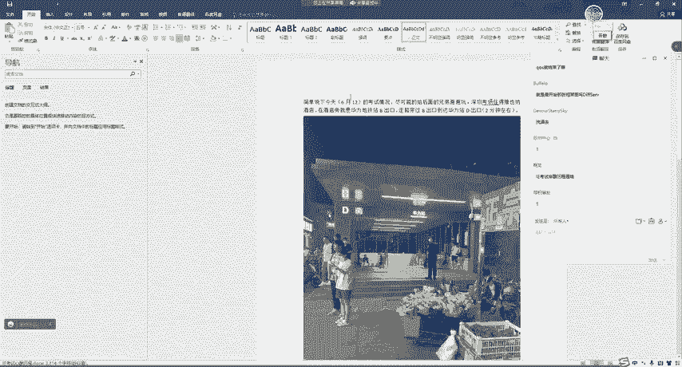

嗯，这个同学呢考一。嗯，出了很多问题。第一次考的时候呢。没做完。第二次考的时候呢。答案有一点没上传，忘了。

呃。然后第三次考的时候就。😊，当然成绩还没出啊，过几天应该就过了。呃，他就写着这么一个战报啊，叫做IE心酸历程。啊。嗯。因为他出了很多问题啊。那平常我会去给他说一些。嗯。你这他一个战报啊。啊。

就是自己的一些心得体会。对，没错。嗯，这个咱们不会发给大家啊。啊，这个在录屏里啊，你们可以去看看。可以瞅一眼。

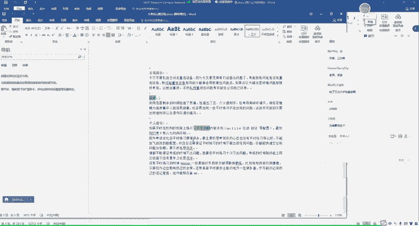

是吧。嗯，鸿门论坛。那应该没有，这是咱们自己的同学啊，自己的。

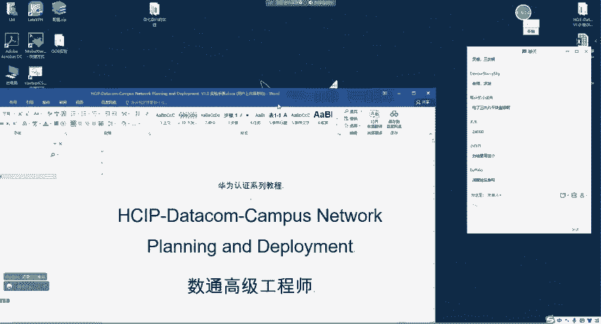

呃。刚我录到视频里啊，录到视频里了啊，同学们就你们看的话去翻翻录屏。去搂一眼，因为这个我直接发到咱们群里不太合适啊这是在备考群里的一个。这里面有一些那个啥。

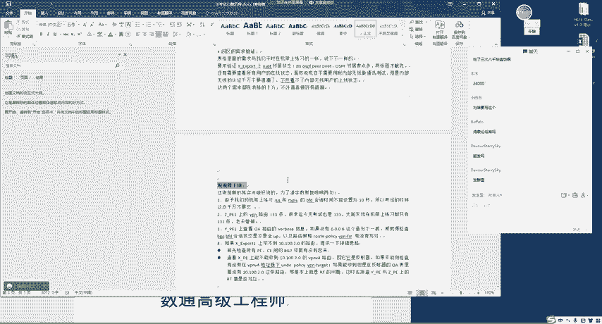

有一些那个。减法类相关的内容啊。好吧，我就不发了啊，就你们看看录屏的话啊，能看到。因为刚刚我展示的时候，录屏没关。啊，对，吃了3次。这个还是比较冤的，实际上他第二次应该就过了。嗯，第一次也比较远。

第一次他上去之后。那个考试环境有没给他清空。能懂吗？你去考试了，考试环境上个人做的蛮配。嗯，江港湾呢没给他清空啊，他又去找。嗯，去找了之后呢，下午这个控制器呢又比较卡。嗯。所以说导致自己没做完。

然后第二次呢，一切都很顺利啊，都很顺利呢，答案忘交了。好吧嗯，然后这也是一点。呃，然后第三次就。反正他这次反馈的应该还行啊。嗯，这个还没有啊SRV6现在行业内还没提，就是给大家推个解法，我也能推。嗯。

但是现在没提呀。不太好说啊，咱们最近在考虑购买设备的事啊。哼。啊，对，没错，这种就属于华为的责任。啊但是华为呢他很甩锅。那得懂吗？就是。呃，这个我不太好说啊，我给大家举个例子啊，咱们之间有一个同学。

考试的时候呢，所有的配置也是都在的，就是机架没有恢复。就是考试级价没有恢复。然后他当时心态有点炸。有点崩溃啊，他就去。找华为申请重新考试了。嗯，但是呢没有给他同意。大家能懂吧？就当场就直接申请充卡。

还是没有同意。而且华为现在有这么一句话。之前我给如果大家上这个冲刺群啊，备考的时候，我给大家讲过。华为有这么一句话叫什么呢？嗯，叫做。有很多啊。投诉没用啊，咱们也有同学投诉过没用的。嗯，这个品牌效应啊。

一旦植入到你的脑髓里。嗯，你就会觉得他比较正规。对吧实际上不是啊。嗯，我这样给大家说过。这个到冲刺里边，到时候再给大家聊啊，到时候你们会知道更多。这里我就不再给大家多说了。就华为有很多甩锅类的语言啊。

比如说。考试现在需求需要截图。啊。嗯，现在考场上有这么一句话，就截图不需要命名，那个截图非常多啊，有好几百张。截图不需要命名，就你不需要去改截图的名字。但是呢监康官没有找到截图呢，这部分就不算分。对吧。

所以这种事呢，决定权不在你，解释权归华为所有。好吧。但一般你们好好做还是没问题啊，一般好好做还没问题。这个倒不会啊。嗯，倒不会说故意没找到。这个只能说呢。人为判卷啊，他跟思科不一样。

这里我如果用我的理解来给大家说啊，就是。人工判卷。怎么样，你让阅卷的老师舒服。你就怎么样来？大家懂我的意思吗？比如说我今天心情不好，你做的乱七八糟。大家都是打工的。大家懂了吗？是吧。自己品品。啊。

我并不是一个大的品牌。个人啊，这个人只是一个打工的。嗯，你做的乱七八糟，确实我没找到是吧，或者说我没认真去看，就是有这种偏差。他跟机器判卷不一样。嗯。但你们还我还是那句话，就考试啊。嗯。

到时候你们到这个冲刺群。啊，就能听到我说的了。怎么样监考官舒服？怎么样阅卷老是舒服？啊，你就怎么样来？嗯。嗯，我先把录屏停一下啊。

