# 2023 新版华为认证HCIA+HCIP+HCIE全套视频讲解！一套视频让你从入门到精通！CCNA／CCNP／CCIE技术提升同样适用！ - P127：（持续更新）HCIE Datacom - 63.HQOS - -Book思议8 - BV1W8411A7z8

好，那我们上课了啊。嗯，我们Qs还剩最后一点啊，然后上节课我们不是做了一个实验嘛，是吧？呃，把之前学到的什么管理啊，用测避免啊是吧，什么流量分类啊，标记啊，708啦的。😊，啊，就杂七杂八的都看完了对吧。

我们把最后这一点看一下，就是HQ。嗯，这个比较简单啊。我来看一下啊呃，就是传统Qs的局限性呢，我们引入了这种呃HQ这种机制啊。然后我们来看一下HQ它是什么样的。呃，它是这样的啊，就是我们的HQ呢。

是在传统Qs中，咱们学到的。嗯。就这个。一个接口呢对吧，他只有8个嘴列。对不对啊？呃，8个队列就会有一些问题啊嗯这问题呢主要是因为呃，我们将流量分成8个队列进行这个调度。对吧啊，在多搜出场景下呢。

这个限制比较大啊，这个限制主要体现在哪里呢？我来看一下啊呃，假如说呢我们在这里innet有一个出口啊呃，我们不同的用户呢，他们可能买了不同的这个流量，对吧？你比如说在这边呢，这可能是一个小区啊。

或者说一个单元楼。😊，呃，有三位租户呢买了20兆贷款，有三位租户呢买了30兆贷款，还有两位租户买了50兆。对吧呃，分别有IP上网的，有IPTV的，还有VIP的。然后在我们这边呢，也是一样的啊。

有不同的用户呢买了不同的这个业务。啊，然后在我们下面呢，也有不同的租户是吧，或者说家庭他们买了不同的业务。那在我们传统的这个学到的Q里面呢，他没有办法基于用户进行Qs的这个策略执行。

对吧嗯这个主要是体现在因为我们的接口呢只有8个队列啊，如果我们把每一个用户划分到一个接口下呢呃。好像还保证不了是吧，就没有这么多队列给他用啊，然后就诞生出了这种HQ啊呃，HQ4是这样的啊。

就是它有点类似于这个传统Q的一种层次化。呃，怎么样进行城市化的呢？我们来看一下啊。嗯。我来看啊。呃，我们传统学到Qs，他不是。就一个接口嘛？就有8个队列。对吧LQ是这样的。首先我们可能有不同的用户。

对吧？呃，不同的用户呢，你们可能有不同的流量啊，比如说这是用户A。呃，用户A呢有自己的这个语音流量啊，对吧？呃，有自己的这个什么FTP的，或者是说视频流量。呃，那么在这时候呢。

他们要进入到HQ的一个三级队列中啊，这三级队列呢，我们就把它叫做流队列。啊，基于每一个用户呢，他都会有一个三级队列。那这里呢我们可以保证的是什么呢？就是你这个用户啊，对吧？呃。

你们都进入到自己的你的语音呢就进入到这个一个队列中。你的这个FTP呢进入到一个队列中。😊，对吧那么我们在调度的时候，每一个用户还会有一个用户队列。注意啊，还会有一个用户对联。

那也就是说未来你们在进入到用户队列的时候，就按照三级队列的层次。你比如说这SP调度啊，哦先调度这个语音的啊，然后再调度FTP的，然后进入到用户队列。那相对于来说呢，我们下面还有其他的用户队列。

这个用户队列呢，也有很多的三级队列。嗯，我看有没有比较形象的图啊。啊，就有这个这个比较形象一点啊，我们来看。来看啊。呃，在这里呢，我们不是有这个。流队列嘛，对吧，就同一个用户不同的流量进入到流队列中。

那然后呢，他们每一个用户呢，我们还都会有一个用户队列。好吧，然后这是第二个用户不同的流量进入到流队列中。那我们在这里调度的时候，我们可以用这个呃SP啊，就是设置成PQ队列是吧，或者说设置成WFQ队列。

那么我们可以执行这些用户之间的区别。😊，对吧就你这个用户呢，用户一的这个VIP的流量。对呃，或者说这里有FTP的流量。我们在这里把它调度到用户这列的时候呢，你可以通过这个WFQ啊。

或者说PQ呢嗯实现一个这个优先级的区分。😊，对吧然后下面这个用户呢，他不同的流量呢进入到自己的用户队列中，也可以实现一个优先级的区分。对不对啊？那么在这儿说我们不同的用户呢买的这个队列带宽不一样，对吧？

就是甭管你是什么样的用户啊，最终你们所有的流量呢都会进入到自己的用户队列中。好吧，然后我们还有接口对列，接口对列是什么样子呢？就是当我们再去调度某一个用户的时候啊，也可以去给他做一下。😊。

对吧比如说我去调度这个用户的流量发送出去，或者说调度这个用户的流量发送出去。好吧，就是他们最后呢也都会进入到接口对列。呃，然后接口队列之间，我们在真正调度出去的时候啊，用的就是R了，就是轮巡。啊。

就是层次化的一种模型。嗯，这个呢图如果大家还不是特别清楚啊，这个在手册里面有一张图他画的。

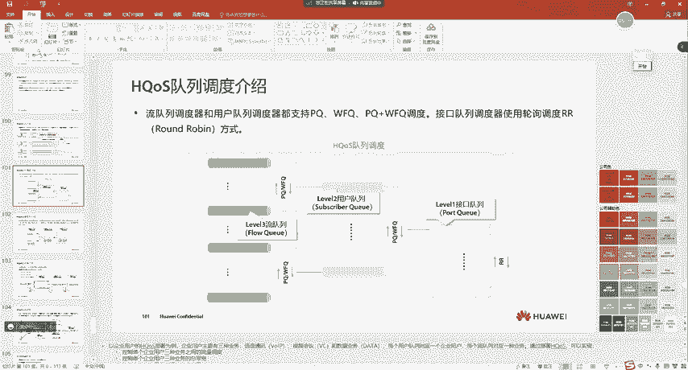

嗯，我觉得还是比较形象的啊。找一下啊。

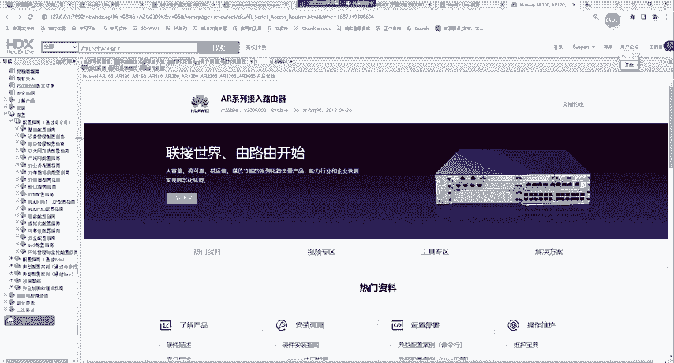

但这个HQ现在没有卡啊，嗯，我们就简单来看一下啊，他是这样的。首先呢我们有不同的流罪点是吧？呃，我们可以认为对于同一个家庭来说啊吧，他们有语音有视频对吧，那我们可以让他们的语音跟视频进入到不同的流罪点。

😊，对吧呃，在这里呢，我们可以用什么AFIBE啊，对吧？啊，或者说你用WFQ这些都行。😊，对不对？那在这时候呢，我们把它调度在用户队列里。也就是说，首先对于一个家庭来说，比如说这里家庭A。是吧啊。

我们可以通过流队列往用户队列的调度层次啊，就这种调度方式去控制一个用户不同流量的优先级。对不对。那最终呢不同的。用户的流量呢，他们都会进入到用户这列中。对不对？那有时候我们有些用户可能是比较关键的。

对意啊啊，有些用户是比较关键的呃，你比如说像VIP用户。对不对？那在这时候呢，我们可以让用户队列，对吧？在进入到端口队列的时候也做一个区分啊，我们在这里呢也可以用WFQ啊，或者说PQ来进行调度。

比如说这是用户A的所有流量，这是用户B的，这是用C的，这是用D的。啊吧A的啊，我们希望他更优先一些。对不对？然后我们把它调度到端口队列中，然后对于B呢啊也是调度到端口队列中。那这个时候呢。

我们可以用WFQ啊，或者说PQ对吧，去控制用户队列的一种优先权。那当我们去调度A的时候，肯定优先调度了嘛，是吧？假如说这是这个VIP客户。是吧那最终你们都会进入到端口队列中啊，端口队列一共就8个了。

那在端口对列中呢，它就是R调度，这R很简单啊，R就轮循的啊，这调度啊这调度这调度一份，这调度一份这调度一份，这调度一份。该理解可能R就是平均进行调度。呃，我举个例子，比如说我们是100兆的带宽。

比如说是80兆啊，一共是8个端口队列嘛啊，比如说80兆。那R在一轮调度的时候啊，比如说我们一秒能够转发80兆的包是吧？那这一秒发出去之后，下一秒又来80兆。那这时候呢，每一个队列呢都会平均分配到10兆。

😊，那这种呢就是HQ。所以说HQ很简单啊，就是他把这个对列的调度啊分为了不同的层级啊，首先。从流队列到用户队列，可以让一个用户不同的流量，对吧？啊，得到不同的优先权。那从用户队列到端口队列呢。

可以让不同用户之间对吧？啊加以区分，就是不同用户之间呢也是有优先权的区分。然后最后到端口队列，当我们端口队列调度转发出去的时候，那这时候呢，它就是一个轮巡的。好吧。

就大家都是公平的那这时候我们可以保证的是什么呢？首先对于第一一个用户来说，我们可以让他不同的流量。嗯，做一个区分的服务，对吧？对于不同的用户来说，我们可以让不同的用户来做一个区分的服务。

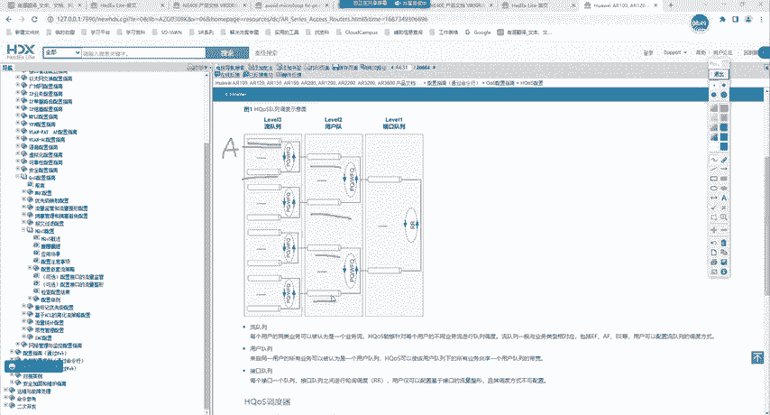

好吧，那这个就是HQ啊，它所带来的一种好处。所以我们这时候再去看呢，就是HQ呢就传统的Q是基于接口进行调度的。啊吧就接口只能区分业务的优先级。那他没有办法区分不同的用户，那传统的Q无法对接口上的。

多个用户的多个流量进行区分。是吧。那HQ呢就是基于多级队列实现层次化调度啊，不仅区分了业务啊，还区分了这个用户啊，刚我们可以看到那同一个用户他不同的流量呢啊我们可以去做一个优先级的区分。

那不同的用户之间呢，我们也可以做优先级的区分啊。那咱们这一节介绍的主要是CPE啊，我们就是AR系列路由器的HQ特性。😊，嗯，这里大家注意啊，就是不同的设备呢嗯他们的这个HQ可能会有点不一样啊吧。

因为这个跟单板是有关系的。呃，所以说这里呢大家就了解一下，好吧，以后用到的时候查一下，就HQ呢，你看框架就行了。

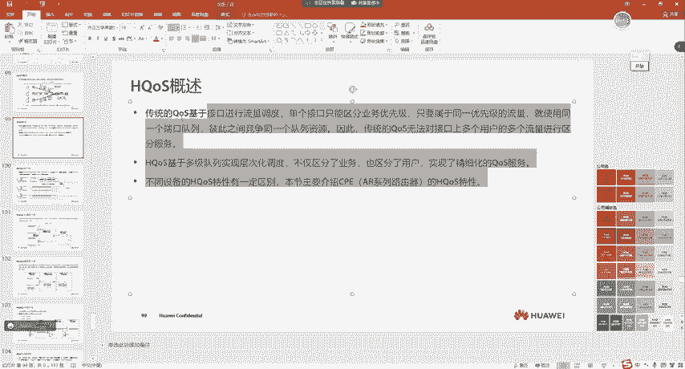

来看啊，那LQ基于队列实现层次化调度的时候呢，就是在我们的AR系列路由器上啊，一共支持三级队列呃，是有4级的啊，这里给大家说一下啊。😊，嗯，也有4级嗯，甚至可能就是按照层次我们来区分的话。

是不是还有可能会更多啊？对吧我举个例子，比如说。我视频的业务呢有爱奇艺的。是吧呃，有腾讯视频的。呃，还有什么？嗯。啊，优酷的。是吧然后他们比如说是在四级队列中。对不对？比如说他们在4级队列中，然后呢。

我还有一个语音。对不对？那这时候呢，他们两个是一对。那这时候呢，我们可以怎么样调度呢？😊，三级队列。对吧调度不同视频的。大家能懂这意思吧，然后二级队列呢？调图不同的流量，你这是视频的吧。

是吧这是语音的这是二级队列的调度是吧？然后我们可能还有不同的这个用户。啊嗯，假如说这是用户B啊，这是用户A。然后我们还有一个呃这一级对联啊，接口对联。啊，不对啊，就是我们调度不同的用户。

对吧然后用户之间再实现一个差分，然后在前面还有接口对列。好吧，所以说如果我们按照层级来分呢，能够分的很细啊，但是在我们的AR系列路由器里面就有三级啊呃，其他的这个系列路由器呢，我没有特别的去看过啊。嗯。

这里大家知道一下，就是逻辑上可以再进行这个层级的划分。大家能懂我的意思吗？嗯，这里理解的同学敲一啊都没问题吧。好吧，这就相当于人嘛，你分369等，你分三等，你还可以再分是吧啊，一等二等、三等。😊。

对不对？所以说是这么一个意思啊，就是在我们的AR系列路由器上呢，只有三级。嗯，我们可以让不同的流量呢进入到不同的三级队列。😊，对吧呃，然后呢。这个他们都属于同一个用户队列嘛啊我们用户队列再出去。对不对？

然后不同的用户呢啊再就进入到物理接口，再进行调度对吧，然后再进入到接口队列中。那这是HQ的一个模型。你看这个图呢，它就没有我们刚刚看到。

呃，这个图形象啊，这个图看着就很清晰。对的。那HQ在进行调度的时候呢，他是这样的啊。😊，嗯，在这里呢，我们可以用什么呃PQ啊对吧？啊，WFQ来进行调度啊，在这里呢也是可以用PQ或者WFQ调度。

那接口之间呢我们用的就轮巡对吧？R。呃，这个R呢可能大家没有听说过啊，嗯，这个在产品手册里实际上也找不到了啊，产品手册你能找到什么。WR啊找到DR是吧？呃，但这个R呢我简单给大家说一下啊。

嗯R也是我们早期的一种队列调度方式。嗯，因为我们之前不是有FFO吗。😊，对吧呃，后来来了PQ呃，PQ呢有有可能会导致队列饿死，所以说就延伸出来了RR在调度的时候就很均衡，就是调度你一份调度2一份。

调度3一份，调度4份调度5一份是吧？就是每个队列呢都是轮循调度的。😊，再来一份再来一份再来一份再来一份再来一份。那这样调度呢可能会导致延迟比较高。那这就是R的一个缺陷。那它主要的一个优势呢在于公平啊。

所以说我们在进入到接口队列的时候，就没有呃去区分不同的业务了。对吧？因为你们不同的用户呢都进入到接口队列了嘛。啊你在这里调度的时候就区分了不同的用户啊，所以说接口队列呢采用的就是R调度啊。

就它是很公平的。😊，然后我们在做整形的时候呢，嗯也可以去做的那整形是什么逻辑呢？就是我们每一个层级的队列呢，嗯我们也可以去做这个整形。😊，也可以去做限速啊，就是整形实现豹纹的缓存和限速功能。

那设备支持三级整形器。及。😊，队列流队列整形对吧，用户队列整形，还有接口队列整形啊，那他们在整形的时候逻辑也是一样的，就是我的报文呢。进入到流队列之后啊，我们可以针对于流队列去配置整形。好吧。

那然后进入到用户队列，那也可以针对于用户队列去做整形。那最终到接口队列，你也可以针对于接口队列啊，来自多个用户的队列在同一个接口队列中，那你也可以针对于这个接口队列去做整形。😊，啊。

那这就是HQ的一个整形。那它也是分为层级的那包括我们以前学到这个丢弃呢，它也是分的。三级队列中呢啊我们可以去配置WRED对吧？WRED在丢弃的时候呢，也是要读队列里面的标记。😊，啊，那这个标记呢。

你可以去配。因为我们之前给大家说过是吧，AF41D优先级是吧，低门线高门线。😊，对不对？然后你也可以去进行调度。那但是如果注意一点啊，不管你用什么样的技术，只要你队列满了啊，他们都会执行伪丢器。

或者你不配的时候，没有WED啊，他默认就是伪丢器满了再开着丢。啊，就是你从流队列里面呢嗯未来进到用户队列，那用户队列也有可能会满啊。用户队列满了呢，他就是只有伪流器了。好吧，啊就丢弃了。

然后用户队联进入到接口队列，也是伪丢弃的行为。啊，所以我说我们可以看到啊，只有流队联，它是支持你配置WRED的啊。但是对于用户队联跟接口对联呢嗯，它就只有伪丢器了。😊。

因为我们最终要把流量调入到队列里面，那调入到队列里面之后呢，嗯这个流量就会丢失啊，不是说丢失，就是队列会占满是吧？队列占满之后呢，会执行伪丢器这的行为。我们来看一下，他整个的一个应用举例啊。

实际上这个在。基于用户啊去做Qs的时候。我们可能才会用的。他这样的啊。比如说一栋楼呢啊有三个家庭是吧，家庭A购买了10幢。VIP。嗯，IPTV。HSI。嗯，这个就是上网的啊，好吧，就是宽带上网。呃。

购买了三种业务。比如说在家庭A，他购买了语音视频，还有上网的。啊，然后家庭B呢购买了20兆，并开通了视频跟上网是吧，看电视对不对？就你家那个大彩电啊，还有上网的。😊，呃，用户C呢购买了30张啊。

他只进行上网。对不对？那未来我们在调度的时候呢，首先不同的流量，他们在不同的流队列中。😊，是吧。进入到。用户这列那用户也可以是一个家庭嘛，是吧？啊，然后不同的家庭之间呢，我们可以用WFQ对吧。

然后再进行调度。😊，而后进入到接口对联是。然后在这时候呢。我们可以去限制。对吧比如说对于整个接口对列呢做个整形，比如说限制它为60兆。对不对？所以说整形呢，我们未来比如说你通过整形设置VIP啊。

整形我们设成两兆。那么是不是就代表着用户A就是家庭A呢，他买了三种业务。但是实际上对于他的语音业务来说，只能占用几兆贷款。虽然他优先级比较高对吧，但是他只能占用两兆的贷款。为什么只能占用两兆呢？

因为我们给他做了什么。是吧整形。能明白这意思吧？啊，这就是HQ的一种。啊，应用啊，那HQ的配置呢？😮，他跟我们传统学的呢嗯有点区别，稍微有点区别啊。它是一种嵌套关系。我来看一下啊。

就是HQ的配置呢比较复杂啊，这一块呢大家看不懂配置呢也没关系啊，因为这个没有在考啊嗯也。就是用不用呢，这个不太好说啊，就是以后啊在真正工作中用到。嗯。

目前我所知道的啊就是在SDY里面会去做这个基于VN的嗯这个HQ方案。啊，但是这个呢也是通过控制器，就你点两下就完事了。好吧，呃，这里我可以带大家看一下啊。😊。

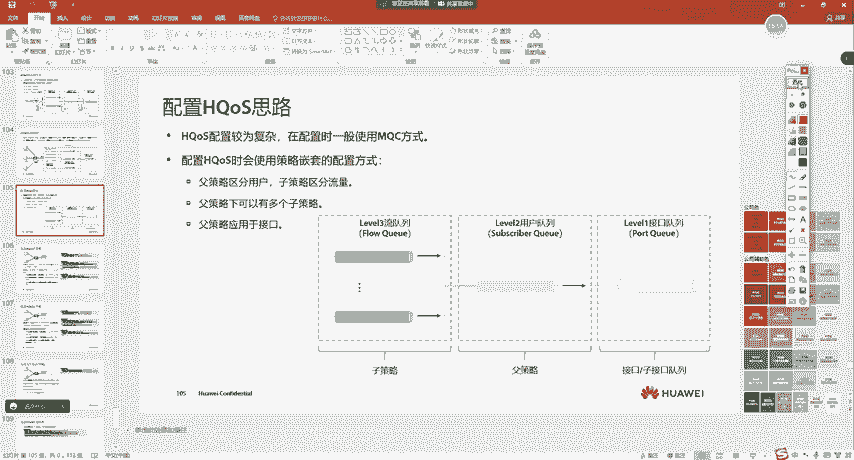

就是。在SDY里面，他是怎么样一个逻辑？嗯，在这啊我们来看一下啊。嗯，他是这样的，首先呢这个业务场景我给大家说一下。

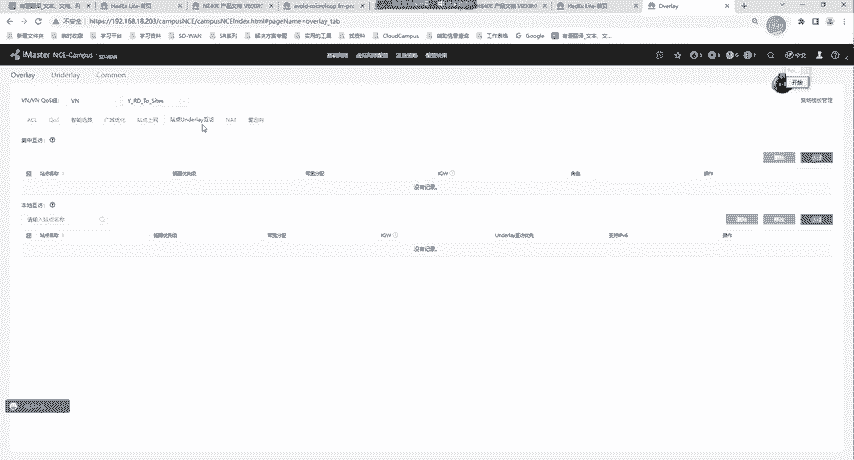

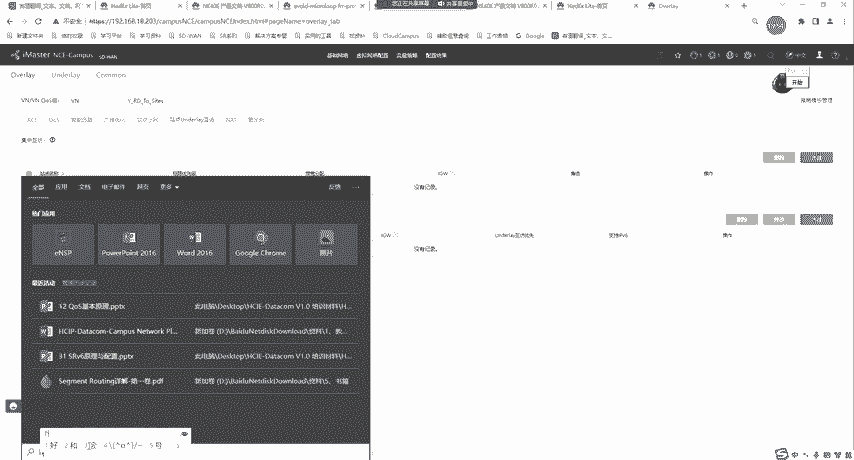

嗯，当前呢我现在有这么一个业务场景，这是我的一台出口路由器。呃，我的路由器呢呃就是通过这里我画的可能是子接口啊，就是现在呢我连接了一个这个。😊，不同的业务在我路由器后面有不同的业务。嗯。

比如说有IPTV的。啊呃，然后有VIP的。啊嗯，我就以这两个业务为例啊。好吧，然后这两个业务呢，他们之间做了隔离呃，这个隔离让我们把它叫做VN。😊，好吧，这个VN呢大家可以理解成就是一个VP实力啊。

就是一个VF嗯，它是做了隔离的，就是不同的业务进行了隔离。但是实际上呢，我画的这两根线呢，他们都属于。😊，一个物理好。能明白吗？就是我未来的出口呢也是同一个物理口。啊。也是同一个物理口。

那现在呢注意啊呃现在有一点是什么呢？就是我的IPTV呢跟我的VIP或者说我们不同的VN呢嗯我这样来画。😊，我分两个部门。好吧，就是我有这个。销售。嗯，还有这个。市场。对销售部呢，他有自己的不同的流量。

比如说有流量A流量B啊两种类型。然后市场呢。也有流量A跟流量B这种。现在我可能有这么一个业务需求。呃，这业务需求是这样的啊，就是我希望销售。😊，因为他们最终都要通过同一个物理口上网嘛。

对吧那现在我有个业务需求呢，我希望销售呢他能够占用这个接口40%的流量。好吧，而对于市场呢，希望他能够占用60%的流量啊，这是我们的一个业务需求。对，这跟我们刚看到的这个家庭宽带的。

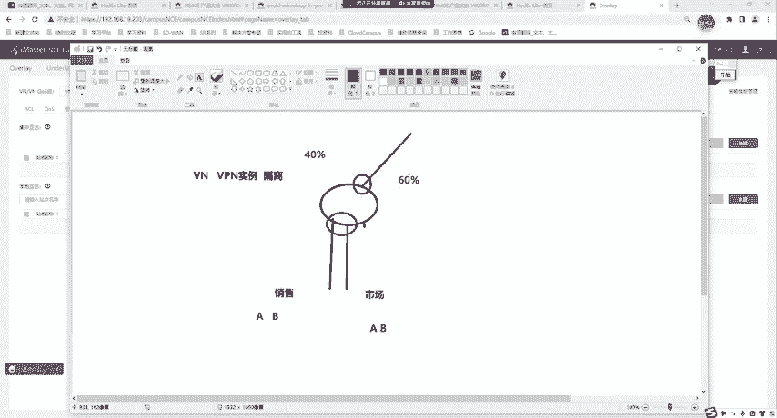

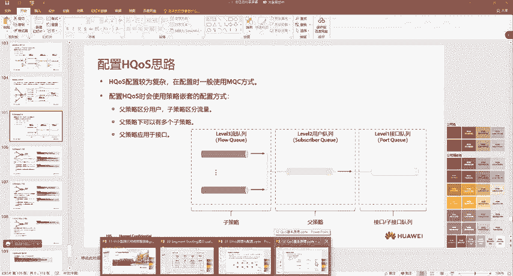

这不一个道理吗，对吧？只不过这个用户呢，我们变成了部门。对不对？那这时候在SDY里面呢，我们可以去实现这个就是通过控制器点点点，他自己就会推配置了。那这个是怎么样做的呢？就你点Qs这里。好吧呃。

你要去创建。就是首先呢注意一点啊。嗯。比如说我现在创建一个，这个策略名字呢嗯。假如说叫t啊，我随便起一个。然后在这里呢要创建一个子策略列表啊，我们可以去增加这个增加是这样的啊，呃。

策略的优先级就是你的node语句啊，你可以自己去定义啊，比如说node10是吧？留分类模板就是注意啊。😊，我们不是有不同的流量吗？是吧你要不要把AB这两股流匹配出来呢？是需要的是吧？然后这时候呢。

我们需要去匹配流分类模板。那在这里呢嗯我们可以看到有1个ORDER对吧？啊，这是现在咱们有同学在做这个SD one的实验，好吧呃，他创建的一个。这时候呢，你可以通过硫分类模板。😊。

就刘芬的模板本身也是你创建的啊，这个是在这里创建的。😊，嗯。能看到吗？就你在这里可以去创建刘飞的模板，比如说就叫与AA这个流量，对吧？然后你可以去匹配吧，原目IP是多少，DICP是多少。😊。

大家能看懂吗？对吧那这样的话，基于这个匹配或者说原目端口号等于多少。那基于这个匹配，那你能不能去把这个A流量跟B流量匹配出来？是不是可以啊？这里大家能够明白吗？明白的同学敲一啊。

比如说我现在创建一个啊呃，我A流量的原地址。😊，呃，假如说是。192。168。1。0网段。好吧，然后我们就给他匹配出来，匹配之后呢，点个确定。😊，然后再点确定。那这样的话，我就是把A流量给他匹配出来了。

啊，匹配出来之后呢，然后我们再回到刚刚的。😊，对就是未来呢你都是通过控制器去点配置，大家不用去管它啊，你不用管面令怎么配，以前我也会配啊，现在我都忘光了。比如说现在呢我们是市场部。😊。

是吧然后去创建这个子测略，比如说note10对吧？然后匹配的是A股流对吧？然后行为模板行为模板是怎么样的呢？我们再回到刚刚的。😊，策略模板这里是不是还有流行为模板，比如说我现在创建一个。是A对吧。

就是A执行A这个行为A这个行为干了什么事呢？比如说我们给他做个限速。😊，对吧大家能看到吧。😊，嗯。比如说啊我做个限速。比如说给他这个流量，我给他。我们假设是这样的。这接口呢是100兆。对吧你是40兆。

你是60兆。啊，那这边的话就是假如说A流量呢，我们给他20兆好吧啊，这里呢你就可以配成20，是监管还是整形呢，你可以自己去定。对你可以配置成整形啊，或者说监管。好吧，你是具体的值呢，还是PCT啊。

你可以自己去定。😊，然后创建完之后呢。嗯。队列优先级是吧？在这里呢有三种让你选。比如说我们现在A流量呢，希望它是最高的啊这个优先级。😊，啊，保证贷宽呢，我给他保证也是20兆好吧，最高20最低20。

问题吧。嗯，然后点击确定。那创建完成之后呢，然后我们再回到刚刚的。流量策略，比如说我们不是在这里做Qs吗？然后再回到这里，这是A啊，不是A，是市场部。对然后你可以点击添加，你就把这个优先级改成1嘛。呃。

然后A呃然后A对吧line行为模板就不用管，然后剩下时间也不用管，点个勾对吧，这时候就创建出来，然后你再点个确定啊，就创建成功了。😊，好吧，那创建成功之后呢，你可以打开来看一下。

现在我们里面有一个策略呃，策略优先级是10。那么它的流分类模板是多少啊，以及它的流行为模板是多少。😊，好吧，那最后呢，你也可以去把这个策略给他提交上。能不能明白这意思啊？啊，那在这里呢。

我们还可以再去增加。比如说我再增加一个啊，你还可以再去增加。😊，能懂吧？那在这里呢，我们的策略模板你也可以再去增加。😊，比如说我们当还有B的时候啊，你也可以去创建一个B。高级这里啊。呃。我看看啊。啊。

那你还能匹配什么微来ID等等的，这个匹配的逻辑比较多啊。嗯，还可以去匹配应用组。啊，然后在。刘策磊行为模板这里呢也比较多。啊，就是基本我们在命令行里啊能够看到的呢，基本在控制器里都可以做。

像重定向啊是吧，能做。😊，呃，流量方向是英镑的还是凹镑的？是吧啊，你可以去配着他在队列。呃，然后给他限制贷宽。啊，然后这个就没了啊。呃，对列啊对列长度还。在这长度你也能配。

对吧因为我们刚不是说到在这里吗？注意啊。我刚刚不是说到在这里。我们队列会执行伪丢弃行为是吧？那他能够缓存多少个包，你是不是也能配呀？对吧他是能缓存多少个字节，你可以以字节为单位，或者说以包为单位。

这里大家能看明白吗？看明白乔一啊。没问题吧。好吧。那。可能大家有很多问题啊，因为这个控制器你可能你们没用过，对吧？呃，就是老师这个控制器最终这个微N怎么创建啊，对吧？呃，这个业务又怎么部署的。

这一块不用管它啊，就你大概看这个逻辑，就是以后呢所有的应用，你在外b浏览器上啊就可以点点点了，这个就很简单了。😊，能懂我的意思吗？这里我先给他删掉啊，因为咱们现在有同学做实验。😊，嗯。

别待会儿再找我了啊。😊，我也给他删了啊，同学们。😊，不是在这。在这儿吧。我也给他删了啊。这实际上就是通过MQC去做Q。好吧，这里呢实际上大家可以看到留分类模板，留行为模板。😊，你比如说我创建一个留分类。

这不就是你去匹配什么东西吗？对吧是罗继货还是罗继宇？能看到吗？呃，更多的呢你还可以去匹配应用。

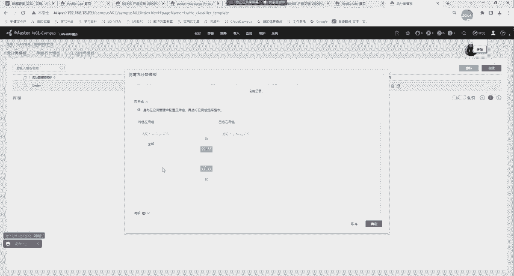

认懂吧？注意一点啊，这里我给大家说一点啊。我们在以前学到的这个MQC里面。你在留分类里面能不能匹配应用啊？不行吧。是吧不行啊，为什么不行呢？😊，呃，匹配应用需要一种功能啊，叫做IC。

我们把它叫做应用识别功能。但这种呢需要功能license在设备上，就你需要单独购买。好吧，就你们一般买的这个路由器呢，它都在基本来ense。基本软件功能license。

那他可以配什么OSPF啊BDP啊MPS啊等等之类的。是吧但是像这种应用识别，这种功能license需要单独购买的。所以说我们之前在模拟器里面呢，你就看不到。😊。

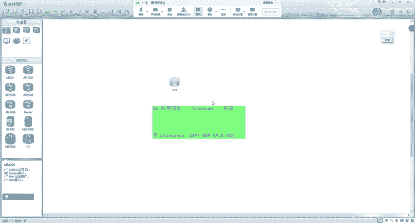

啊，比如说我创建一个。查face。哎，一。啊啊，我去匹配，所以说这时候呢我们就看不到。没有吧。没有应用啊。哇，你匹配的这是什么协议啊，这有个APPpro，你打问号，你看有什么啊。

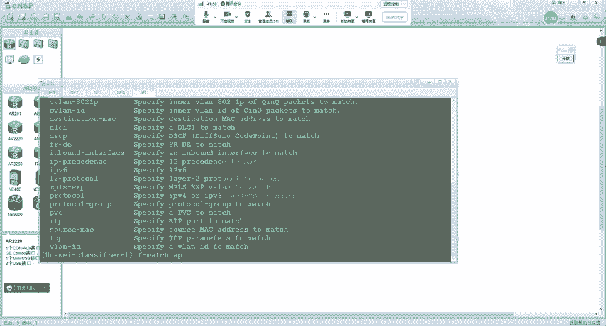

没有。是吧那在我们的这个SDY里面啊，他就很简单了。

我给大家看一下啊。未来在SDY里面呢，你买了license。嗯，应该是在营营管理这一块。呃，预地应用好吧，就是华为的SD one呢有一个叫做6000家应用库。啊，你可以去匹配各种各样的。可以看到吧。呃。

什么360。这玩意儿这协议我也没见过啊。😊，是吧。开不app。能不能匹配啊，这个应该。FTP啊，这些可以认识了。😊，是吧，这有些应用我也没见过啊，这什么。😊，这有些我也没见过。啊，就大家看看啊。😊。

能懂我的意思吧，但是大家能懂我的意思吧，就是有些6000家应用啊。😊，你现在你在你脑子里，你可能就知道200个什么抖音啊。是吧啊，QQ微信。对吧但是华为的这个SD one呢未来你可以去匹配。

6000种应用。就这玩意你都没见过，我也没见过啊，这什么应用啊？😡，对吧，反正就是能匹配的啊是非常多的。😊，啊。他就有点类似于我们在防火墙上啊去看的时候是一样的。你在防火墙上可以看到很多的这个应用。😊。

对不对？啊就有些呢你甚上都没见过什么。😊，QQ飞车对这种游戏你还好知道一点。啊还有一个是500家的应用库。就是他的应用是非常多的。那这时候呢，我们就可以去匹配应用啊，也可以做限速。

这就是华为SD one的一种优势。就未来像这些HQ等等各种功能的，我们通过控制器点点就完成了。但是通过命令行呢，嗯我们也可以去配好吧，在这里有一个例子啊，就我们把这个例子来给大家说一下。好吧。

他是这样的啊。就是首先呢我们在去配置HQ的时候呢，要创建一个叫做HQ的子策略。😊，这个子侧脸呢，大家可以理解成就是不同的用户好吧，然后子侧脸用于区分不同的业务，配置HQ的时候呢。基于业务对吧。

配置多个子测量。比如说现在呢。我有。这个IPTV的。啊，有视频的。我们就用传统的。嗯， traffic费是。啊，traect class对吧？啊，traectbe啊，还有traect policy。

对吧去匹配不同的流量啊，然后把他们指导到不同队列中，或者说你给他调丢弃策略呀，对吧？呃，或者说呢你给他做这个GPS限速。对不对？那这样的话，大家可以理解成是什么呢？首先。这是A，这是B。

他们都属于一个用户叫做。嗯，AB这个用户。好吧，然后我们通过这个子测脸呢，就是普通的MQC，我们把这些流量匹配出来。哇，然后给他们分不同的刘贤伟。那这里做完之后呢，然后我们再去配置副侧略。

副侧略是怎么样的呢？😊，对啊。这是A流。这是B流。这不是AB这个用户吗？对吧，我们去创建一个副策略。但是在这个副策略里面，注意一个比较关键的点。是在哪里呢？他在旅游行为里。注意啊。做了一个什么？

川费是 policy。去执行了一个子策略。注意啊，假如说刚刚我们的。这个子测略policy的名字叫做。C1那在这里呢，它会有1个C1。那也就是说现在注意啊。现在他的逻辑是这样的。

如果有流量匹配了我这个分类。那么他们就执行下面这个子策略的行为。能懂这个逻辑吗？听懂了吗？我再给你们说一遍啊。是吧懵逼了，我举个例子。比如说啊。现在我这有一台路由器。这台路由器呢？通过两个子接口。

比如说这里是微烂石。好吧，然后这里呢是维来20。魏俩石呢。他有两个业务。一个呢是。VIP。一个呢是IPTV。好吧，然后注意啊。首先。我通过子测略。能不能把VIP跟IPTV的流量给他匹配出来？拿不拿？

你说能不能就完事了。😡，能不能肯定可以VIP匹配出来，我给他指到AF队列啊，指到EF队列好吧，然后IPTV匹配出IPTV匹配出来。我给他指定到AF对联。没问题吧。好吧，我除了给他指定队列。

我能不能限速啊，限速你20兆。😡，能不能？能不能？GTS在这能不能做，之前讲的都忘了。😊，可以吧。假如说现在我给你，我先不限速啊，我们先以队列的形式给大家讲完。好吧，那在这的时候注意。

然后我再去创建一个策略，怎么创建呢？😊，注意啊，无论你是微IP还是IPTV，你们都带1个802。1P10对吧？都带1个微量ID10吧。首先我通过副测量。😡，能不能把这两个流量就是微量ID10。

我能不能把这两个流量都匹配出来？我甭我不管你是VIP的还是ITV的，我匹配win1是不是就代表着你这个用户？😡，这就是你家。匹配微了ID时，就把你家匹配出来。然后我怎么办呢？注意。匹配出来之后。

我再创建一个刘行伟，怎么办呢？刘行为里面做一个traface policy。啥呢？policy name他这样的。刚刚我们的VIP到AF对吧？然后这个IPTV到EF，他们未来肯定要通过一个。

poliliccy。把这个分类跟行为关联到一起。假如说这个policy的名字叫做。😊，你家。好吧，我用中文名代替了啊，现在我有这么一个policy。😊，然后现在呢，我再创建一个副侧略。

副侧略呢首先我匹配微量ID10。匹配了微量ID10之后呢，去执行这个子测量。那么是不是就代表着只要是你家的流量，微量ID10是不是就代表你家，只要是你家的流量。

我按照子测脸去执行VIP给分到EFIPTV给分到AF。😡，这个逻辑明白了吗？明白敲一啊，没问题吧。😡，好吧，刚刚你不是这里有个策略，把它绑定到一起吗？我直接把你所有的流量给你匹配出来。😡。

对吧匹配出来之后呢，你按照这个指寸来去执行。那么这种是不是就代表着用户队立？明白，同学敲个一啊。没问题吧，这不就是用户对联吗？😡，是吧然后我们再用再去创建一个副测略，对吧？把这个分类啊跟行为关联到一起。

就是你家执行。traface policy这个策略对吧，最后我们再把这个副策略应用到接口上，这不就是一种层次化的调度吗。那最终形成的样子，它是不是这样？是不是啊？首先我的指测来有没有匹配不同的流量啊？

对吧。匹配了吧。然后我通过微来ID。有没有把你们匹配出来？😡，匹配出来了吧，然后在我的副策略里面有没有去配置这里PQ什么AFEF那在这里我能不能也指定AF跟EF？😡，是不是也可以呀？对吧。

这微来ID10它进入到EF队列，那不就代表着在这里吗？对，这是微来ID10进入到。PQ啊，这是PQWFQ不用管它进入到EF对联。对吧然后这边的未来ID是进入到什么队列啊？啊，你也进入到EF好吧。

然后下面这些用户呢进入到AF队列。😊，懂了吧？这就是HQ啊，说白了他就是有点类似于那个呃俄罗斯套娃一样，对吧？啊，就是有点类似于那个关系。😡，嗯，然后就没了啊。好吧，然后就没了。😊。

那下面我们来看两个思考题啊。呃，首先第一个HQ不能区分用户和业务。嗯，这个肯定是错的对吧？因为我们XQ就是为了区分不同用户的不同业务而产生的。😊，HQ有三种队列啊，他们是以下哪些？😊，刘队的呀。

用户队列。数据队列接口队列。对吧ABD没错。没有数据的俩。这个你是见不到的，我也没听说过啊。嗯，那到这里，咱们Qs就讲完了啊。讲完了，然后我把这个录屏先停一下啊正好我们把Qs。

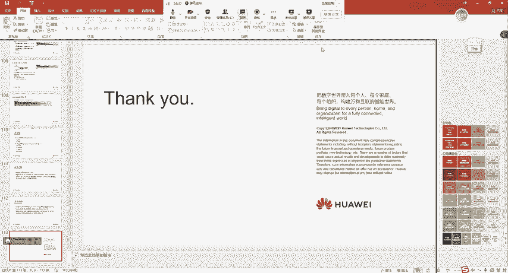

嗯，终止一下，好吧。

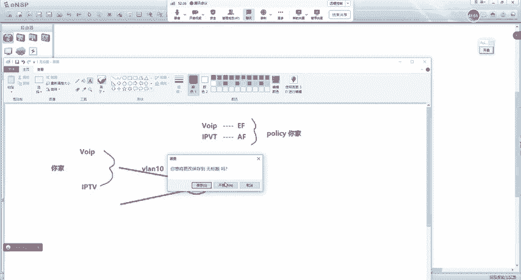