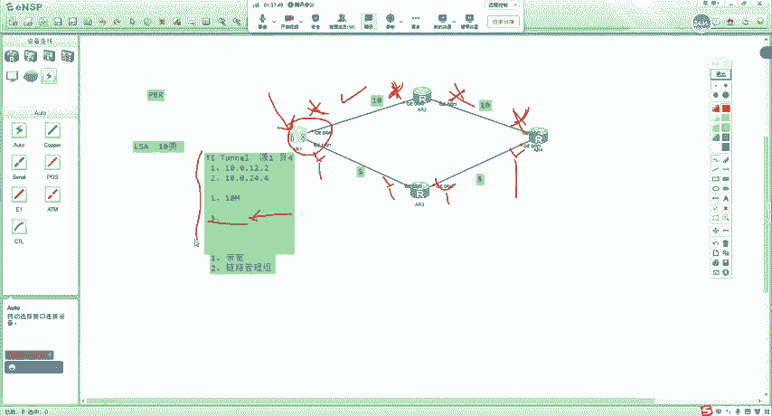
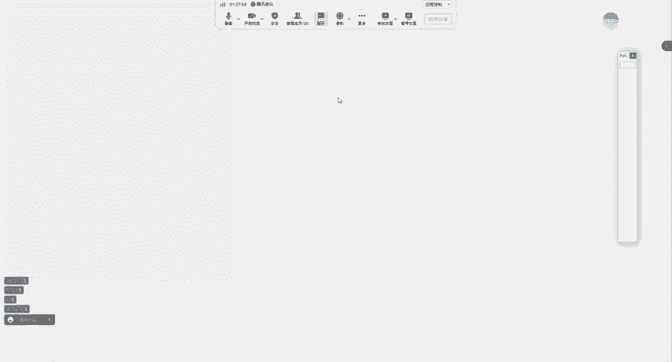
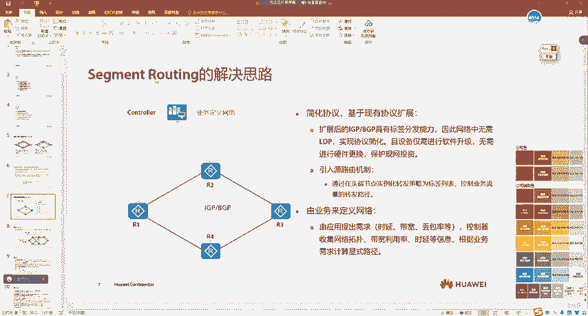
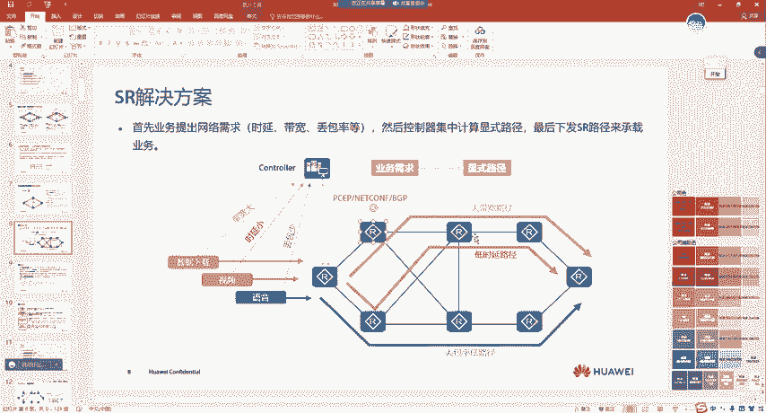
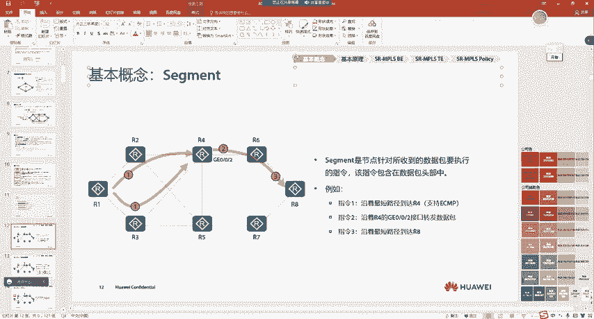
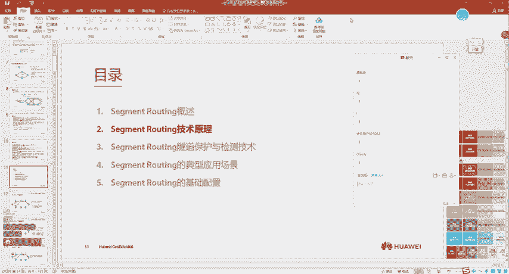

# 2023 新版华为认证HCIA+HCIP+HCIE全套视频讲解！一套视频让你从入门到精通！CCNA／CCNP／CCIE技术提升同样适用！ - P128：（持续更新）HCIE Datacom - 64.SR 产生背景 - -Book思议8 - BV1W8411A7z8

嗯，好，那我们就继续了啊。呃，当然有些同学看录屏呢嗯我给大家说一下啊呃这个。啊这个Q咱们讲完了啊，讲完了之后呢，我们来讲一下这个SR还有SRV6啊。呃，因为咱们课时比较紧。嗯。

之前呢这个教务那边也给我说呃打算想让在7月份结课，好吧，呃所以说呢因为咱们很多同学想学这个SR这个协议啊。嗯，但主播现在没有考到好吧，现在考试里面也有SRV6呃，所以说呢咱们把这个课程调了一下。

就是主播这一块呢，大家去在大黄峰里面呢去看一下录屏好吧呃，SR这一块呢，本来也准备给大家发录屏的，然后前段时间我都录完了啊，但是有两个录屏没声音啊，我又重新去录了一下，但是还有一些没录完。嗯。

到时候这SR呢也会传到这个大黄风里面啊。嗯，就是咱们把这个主播的直播课就停了啊，因为这个项目上用的不太多啊。呃，然后。这个考试也不考啊，然后我们把这个主播的就是接下来这个课时的时间呢去调成SRV6。

好吧，以及SR部分啊。嗯，大黄蜂呢是这个咱们有一些录播的课程。呃，大家可以发现啊，就是我们这个嗯IE到IE呢有很多这个。视频呢就是没有上直播课，对吧？就有些视频没有上直播课，就课程内容。嗯。

这一部分呢都上传到了这个大黄风里面，就是咱们的一个录播课的一个软件。啊，所以说这一块呢，如果大家想去看的话，对吧？你比如说你想去学某些知识点呢，嗯，如果你本身报课的时候啊，就是你跟销售老师谈的呢。

如果有这部分的这个录播，好吧，啊，就比如说你们都学IE呢，应该就是至少IE的这些录播都是有的好吧，你们就找这个嗯班主任老师好吧，去给他说一下。你说想去看一下这个大黄风的权限，对吧。

就是看一下大黄蜂的录播的课程，然后你给班主任老师说一下，他就知道了。好吧，嗯，然后这里呢我们就说这么多啊。嗯，接下来呢就是剩下的课时，咱们讲完SR之后就结束了啊。嗯所以说剩下的课时呢。

我们来把这个SR讲一下。我们来瞅一下啊嗯这个协议呢嗯它稍微难一点啊，因为大家很难一下子去把它理解掉。嗯，因为这个协议呢它还比较新啊还比较新。而且呢它需要很多的基础，就是至少这个MP4啊嗯像MP4的基础。

你是需要有的对吧？呃，除了MPS呢里面还有很多，你像我们之前讲到的这个FRR这些基础，大家也要有啊，所以说这个技术呢，它这个占的高度稍微高一点，就它还需要很多其他技术呢，作为你的底层好吧。呃。

所以说大家学习的时候呢，先要有一种这个呃这个这个这个这个这个先要有个这个。这个叫什么来着？突然词穷了啊，想不起来词了啊，就先给大家说一下，好吧啊，就是大家要知道这个技术呢理解起来嗯。

还是稍微就是你入门之后啊，你会发现这个协议很简单。但是学习起来的时候呢啊对要有一些心理准备，对吧？学习的时候呢嗯你会觉得比较难一点，而且比较难以理解，呃，它里面的术语非常多啊。😊，这是我的一个学习体会。

好吧，嗯，因为这个技术呢以前我也没接触过。好吧嗯嗯。这个呢咱们也是给大家去讲的话。嗯。怎么说呢？就是我的一个学习体会还在前去年前年那一块，因为以前在华为的这个课程中是没有的。嗯。

我的一些学习体会呢就是这个技术刚开始入门的时候，觉得理解起来比较费劲。好吧，但是学学之后呢，就觉得嗯舒服多了，就简单起来了。好吧，我们来看一下啊，因为这个技术呢大家也经常听说过嗯。

SR呢我们把它叫做sroing啊，翻译过来呢叫做段路游。😊，呃，如果你再去看后面这一句呢，就不理解了，对吧？是基于原路由理念而设计的在网络上转发数据包的一种技术架构。一下子就懵逼了。嗯。

这里呢我给大家解释两个词汇啊。嗯首先呢技术架构啊，像我们学MPS啊各种东西都涉及到技术架构。嗯，所以说呢一旦涉及到架构类的东西呢都是比较大的是吧？我们说什么网络工程师啊，初级高级。

什么最后再到架构时是吧？所以说这个技术的框架嗯稍微大一点。😊，那这里呢要给大家解释一下什么叫做原路由。嗯，原路由它是这样的。比如说我们在学MPS4的时候，我们会去发现一个特点啊，不是啊。

就是没学MP24的时候啊，就是传统的IP转发的时候，我们会发现一个特点。嗯，什么样的特点呢？就是所有的报文，那都是基于目的地址进行转发的。是吧。呃，就是你转发给这个设备之后呢，他看目的IP。

然后再转发给其他人。对吧就真正决定这个报文如何转发的呢。比如说这一这12。一给了二一个包，二看目的IP地址转发对吧？这种叫做基于目的路由的嗯转发数据包的一种技术。对吧而原路由是这样的。

就是我们在发送报文的源端，比如说一去发送这个报文。那么他已经把这个路径规定好了啊，就是我告诉你，你按照这个转发就可以了。能不能明白？然后二收到之后呢，我看这个包它带来的哪些信息，就是一已经把给二说了。

你按照这个路径转发，所以说二只看到这个路径，而不再关注报文的目的IP了。那这种就是一种基于原路由的呃转发技术。

好吧，那下面就是废话了啊。😊，我们来看一下啊嗯SR这个技术呢，它有一个产生背景。😊，这个背景呢嗯比较大，有些同学可能还理解不了，就这个背景呢，我尽量的啊给你们说明白，你像SVPTE是在MPSTE里面的。

😊，MPSTE这个技术我的一个学习体会呢嗯很复杂。这个技术我觉得反正还挺复杂的。😊，但是也没有特别复杂对吧？但是真正网络大的时候啊，我觉得MPST部署起来还是非常复杂的啊。但然这个技术可能大家没学过。

嗯，但是呢嗯我尽量啊给大家说明白，对吧？至少MPSLDP啊，大家是懂的是吧？我来看一下啊，就是在我们没有SR之前呢，嗯整个承载网，什么是承载网呢，这样我也给大家解释过，对吧？呃，就是我们承载数据包的啊。

就是比如说我们的骨干网啊，对吧？呃或者说呢在我们的这个银行啊，在全国各地都有对吧？最终呢你们都要汇聚到一起，那汇聚到一起，比如说各种省市汇聚到国家骨干上，那国家骨干，我们就可以把它认为是一种承载网。😊。

好吧。那在以前呢，我们的承载网运行的LDP啊跟SVPTE他们为了实现什么样的目的呢？LDP呢我们去构建这种MPSVPN啊等等各种之类的对吧？你像我们之前学MPS那个公网是吧？A100A200。

那就是承载网。😊，能懂吗？但是这种基于LDP的承载网会有什么样的问题呢？嗯，我们注意啊，注意一点，就是我们并不是说MP4这种技术有多差，实际上MP4这种技术是非常优秀的啊，这个要给大家说。😊。

MPS这个技术呢是非常优秀的。那他的优秀在哪里呢？就相当于。比如说注意啊呃。我们说这个。历史过了很多的朝代，对吧？啊，有些朝代是衰败的啊，有些朝代民不聊生，对吧？你像对于这个秦朝啊。

大家一直都比较有争议，对吧？秦王有很多的这个暴政啊，是吧？让买百姓过得很差，但是呢他有一个非常好的特点是在哪里呢？他统一了中国，对吧？啊，那从此以后呢，我们会发现这个。😊，呃，至少在中国对吧？呃。

古代那没有其他的这个大面积的。你像这种分割现象了。对不对？所以说MPS这种技术有点类似于这种。就早期的时候，我之前给大家说过，早期的时候我们有各种各样的网络。MPS一下子把它们全部干掉了。

实现了一种我们把它叫做OIP对吧？这个大家应该还记得。😊，对不对？叫做OIP啊，叫做所有都是基于IP互联的网络，这就是MPS为后人打下的基础。注意啊，这就是对后人打下的基础。

那也就是说我们未来用的IP升级成IPV4，对吧？然后IP啊IPV4升级到IPV6，然后再过渡的你像SRSRV6，对不对？那它就变得非常简单了，因为它本身就是基于IP的。😊，所以大家能明白我的意思吧？

待会儿我们虽然会去说基于MPS的一些这个像LDP啊这些技术，它有多差啊，但是大家要理解一点，MPS呃，我们并不是说它差。😡，懂吧？至少在当年当时对吧？MPS这个技术是非常优秀的对吧？他有自己的功击。😡。

所以这里大家能够明白吗？所以你不要认为MP4是吧，老师以后用不着了，对不对？哎，老师这个玩意很差对吧？哎，有SR了SRV6了，我还用MP4干嘛？这种想法以后通通把自己干掉，能不能明白。

VPL4是L2的VPN啊，好吧？所以说这里大家要注意嗯，虽然待会我们会去说MP4会有一些缺陷啊，但是呢这个协议在当年那个地位啊，还是很高的。😊，好吧。所以说我们来看一下啊哦，对，没错。😊，来看啊。

就是在传统的MSLDP呢，它有一个什么样的作用呢？啊，首先大家要理解一点，我们之前在接触的LDP中呢，它是没有算路能力的。你比如说我们要根据FEC去构建LSP。😊，对吧呃，或者说去产生这种标签转发路径。

那他们都依赖于一个前提是我们有路由，对不对？有路由才可以去给路由发标签，才可以构建LSP那LDP这种协议本身呢。他需要依赖于IGP进行路由计算。对吧那这是一点。那第二点是在哪里呢？就是控制平面呢。

我们要把LDP跟IGP同时运行起来。😡，嗯，还要有LTP，还要有IGP，对不对？那当你同时运行的时候呢，那我们的设备就要与去。首先。在设备角度上，我们看呢呃它就需要发送大量的这个消息是吧？

那同时呢对于CPU啊呃像内存啊啊这种占用又比较高，对不对啊？那如果换到我们这个技术人员的角度来看，呃，会有什么样的问题呢？😊，哎，他会有一个问题是在于我们学习起来觉得比较复杂。老师我都学了ISS了。

还他妈要学LDP。😊，啊，不能都让ISS全干了吗？我相信大家在学IIP的时候，肯定都有一个想法。😊，老师有IS，有OSPF有BDP有瑞斯科，还有ESRP，我都用一个不就好了吗？😡。

是吧大家肯定之前有这种想法，对不对？😡，那到MP4的时候，后来就没有了是吧？IGPLDP是吧，各干各的事是吧？啊，分工明确啊，这种也比较正常，对不对？所以说啊在以前的时候是没有这种想法的。

就是没有这种想法把IGP啊跟LDP啊全部干掉，变成一种是吧？以前没有这种，但是SR产生之后就有了。😡，好吧，所以这里大家要理解一点呢，就是IGP跟LDP呢两个控制协议，那就对于设备的消耗来说是比较高的。

😊，那第三个缺点主要体现在LDP跟IGP没有同步，可能导致数据转发问题。那这个我们在刚开始上IE的时候，IGP高级特性啊，我就给大家说过。怎么说过呢？

我们知道啊LDP它的建立是基于TCP的那比如说这条路径故障了，为了IGB收敛完，我的最短路径切换到主路径，但是LDP还没有建立起来。😡，对不对啊？那么在这时候，我的主路径没有LP。

就会导致流量转发的丢失。😡，对吧这就是没有同步所导致的数据转发问题。我们把这种呢叫做流量丢失，或者说叫做流量黑洞。是吧那这就是传统的MPSS跟LDP它所存在的一个问题。那MPSS跟LDP呢。

我们一般用在的是什么场景呢？我们把它叫做BE。注意啊，叫做BB什么呢？叫做尽力而为。😡，是吧，而见力而为是什么呢？就。反正来了就给你转，对吧？但是呢，在我们的网络转发的这个路径中有两种。😡。

一种叫做BE，还有一种叫做TTE呢，我们把它叫做流量工程。是吧有同学一听是吧，老师流量工程这么高端的词，我一下子就懵逼了，对吧？这学习起来肯定非常复杂，并不是。😡，为什么我说并不是呢？

这里我给大家解释一下啊，什么是BE还有T好吧，就你们先把BE跟T啊理解起来。😡，那在我们的这个BE里面，它就是按照最短路径。很简单，比如说我们全网跑了OSPF对吧？A21到A24就按最短路径。

那比如说上面大家都是十道。😡，都是实的。对吧下面都是5张。都是5张。啊，那按照我们的选路cos的计算啊，大家不要给我纠结是么，老师参考贷宽100怎么样出。

你不要给我纠结这个就是我们如果上面作为主路径的话，它一定是一直通过主访问到四的，而我们发现备份路径呢，就没有得到利用机会，对吧？而上面拥测了之后呢，也不会走下面，这就是我们当前网络中所面临的一些问题。

😡，那之前我们学习过类似的技术，去解决这样的问题。什么技术呢？我们来想想。😡，什么技术啊？我学过一种技术叫做PBR老师是吧？叫做策略路由，我让某些流量走上面，让某些流量走下面，对吧？

那这时候我们是不是注意啊，我们做PBR是不是就实现了一种。😡，对流量路径规划的一种能力啊。所以到这里，李解同学敲一啊，PVR是不是我们在对流量的路径来进行规划？😡，是不是？是吧是的，没错。

那这种呢就是流量工程。注意啊。😡，这种就是流量工程，我们就可以把它叫做TE。什么是流量工程呢？就是你在对网络中路径的流量的路径进行编排。😡，好吧，编排大家可以理解成就是规划。那这种呢。

我们就把它叫做流量工程。😡，如果换到我们的生活中，你在家里对吧？老是我要盖个厕所。😡，以后当所长，那这种也是工程小工程，对吧？老师我包个工地，我天天画图纸，这种也是工程大工程。

所以说工程它是不分大小的流量工程，就是我们对网络中的流量的路径来进行控制，好吧，那这种就叫有流量工程，那之前我们学的PPR呢，它是一种流量工程。但是它有很大的缺陷。比如说我们要执行复杂的策略。

并且要在每一套节点上都要去控制，对吧？而且我们没有办法去预测到当前网络流量的一个大小。😡，对吧所以说流量工程很简单，你不要被他的词汇所蒙蔽了，那是销售忽悠你了是吧？告诉你我是吧，包了你们的活。

我给你干的流量工程。那一下子客户一听。😡，对吧傻乎乎的被他忽悠了，实际上就是规划网络的流量路径。好吧，那我们之前学到的任何LDP，我们会发现它都是基于最短路径来进行转发的。我们有没有想过。

老师这最短路径已经堵塞了是吧？虽然我有备用路径，备用路径主路径故障，我走备用路径，我想着好像没有什么问题，对不对？确实它是一种部署方式是主备的部署方式，但是。😡。

我们有没有办法让备用路径也能够转发一些流量呢？对吧？我们需要对当前网络中的流量来进行一些规划呢去做流量工程是吧？我在IP网络中用PPR对不对？而如果在MPS4网络中，我应该用什么呢？

我们就接触到了另一种协议。那这种协议呢，我们就把它叫做SVPTE好吧，或者说我们叫把叫做MPST。😡，好吧，就是MPSTE需要一种技术，一种协议叫做SVPTE。😡，那这个技术呢它是这样实现的。

我大概给大家说一下逻辑。因为这个技术的框架本身是比较大的。😡，他是这样的。如果我们做流量工程呢，在我们的。MP24T议中，他遇到了一种协议，叫做SVPT议，当然也用到了ITP他这样的。

当前我不是有网络吗？对吧？我跑ISS跑OSPF。😡，跑OSS跑OSPF之后怎么办呢？我用LSA。注意啊，会扩展新的LC，我们把它叫做10列LC。😊，好吧，就是用10类LIC去把整个网络进行扩散。😡。

就是去携带每条链路的一些信息。那这个信息有很多。那比如说链路当前的带宽是多少，好吧，链路的一些其他的属性是多少啊，我们把这个叫做链路管理组。那这里可能大家不是特别懂这里我简单的好吧，就信息有很多啊呃。

我给大家说两个。😡，一个叫做带宽。那还有一个呢叫做。哎。链路管理组。好吧，我给大家说这两个，当然除了这些信息，还有很多其他的，就是说这两个呢，主要让大家理解。😡，MPSTE是怎么样一个逻辑？首先。

我用IGP把整网所有链路的信息啊，这些都给它扩散出去。扩散出去之后，一基于IGP全局泛红的特点呢，ARE就可以知道当前网络中每条链路的信息。😡，对不对啊？然后我们在A2一上可以这样。😊。

我在AR1上呢创建一个隧道，你之前不是基于LDP去创建LCP吗？对吧？MSTE中就是我们手动去敲的，创建一个叫做TE特。😡，创建了这个T turnno之后呢，我们可以对这个T turnno去做一些要求。

比如说第一种我们可以控制，只要流量进入到T tono之后，你就按照什么样的路径转发。比如说你先转发给AR，这个我们是基续吓一跳的。比如说你先转发给10。0。12。2，然后再转发给10。0。24点。😡。

10。0。24。4。好吧，我们可以这样去规划。第二点呢，除了我们可以这样规划，还可以我让这个T tono呢，我去给你配一个，就是你未来所要建立的就是所要经过的路径。因为你最终转发到市嘛，从圆到四的隧道。

因为隧道一定要有圆跟目的啊。😡，原木对吧？原是一目的是4。首先我们可以通过手动的方式告诉你，只要进到这个隧道的流量，你都从哪些链路进行转发。😡，第二种呢，我们还可以这样。就是你再去创建这个隧道，对吧？

你自己去计算，就网络中有很多的链路，你自己去计算，我人不指定。我就告诉你，你这个ton t tunnelno呢，你必须要有十0兆的带宽。😡，那在这时候呢，我们通过IGP把所有链路的带宽注意啊。

叫做正在使用的带宽都已经扩散出来了。那这时候呢，A21他能不能知道全网所有链路它目前可预留的，就是可以使用的带宽是多少，它是可以知道的。😡，所以在这时候呢，他也可以基于贷宽去计算，计算出来一条最短路径。

当有多条的时候呢，他会随机选择一条。注意啊，不会负载分担，他只会随机选择一条。好吧，然后第三个呢，我还可以去配链路管理组，啥意思呢？我们可以给这些接口呢去配置一个属性，他们也是随着IGP扩散的。

比如说这个属性呢都是X，这都是X，这都是X，这都是X。😊，我告诉你啊，你这个路径你只能通过Y计算出来。😡，那这时候是不是也能够控制流量的路径？大家能够明白吧，就相当于一个地图一样，你从北京到上海是吧？

有高速，有高铁，或者说你走高速有非常非常多的路。现在我就告诉你，你要走没有交警的路，你自己就会去找到没有交警的路，你自己就可以去计算出来。因为你当你知道全网哪里不排着交警之后，你自己是不是可以去计算啊。

😡，对不对？也就是说AR1它基于ISS或者OSPF这种全局扩散的特性，他是知道所有链路的标记的，你们都是X，这个X就是链路管理组。😡，那我就告诉你，你只能就是你不要经过X，或者说你只能通过X去走。

这就相当于我给你一张参宝图是吧？😡，我跟你说，你现在啊要去做海贼王，对吧？啊，要去找到one piece。😡，对不对？我告诉你。😡，啊，这个。日本岛啊。😡，是吧不要去，你要过，或者说日本岛啊有什么猛兽。

😡，对不对？啊，等等等等，大家能懂吧？就是有一些岛呢，你不要去走。那当你有了这个地图之后，比如说我现在告诉你，你不要去有怪兽的岛，地图上哪里有怪兽啊，都标着呢，你能不能绕开啊？😡，能不能？😡。

那么肯定是可以的。所以说AR1我们也可以告诉他这个隧道。😡，对吧你需要经过或者说你不要经过X，或者说你只能通过X去计算到目的的路径，那他也可以去计算一条。😡，所以说按照这种能力，或者说按照这种策略。

我们能不能去调整网络中它所建立的一些隧道的路径啊，那么能可以LSP我们之前学到的LDP去建立它基于最短路径。但是如果我们通过t特no去建立的话，它是不是就是我们可以随意的去编排啊。😡，大家懂我的意思吗？

懂得同学敲一。😡，没有问题吧。好吧，就我们可以随意的去编排，对吧？去控制网络中的流量路径。😡。

那么当我要从这个对吧？就老师我算出来路径之后。😡。

你把流量发给三三得知道怎么转发啊，就是虽然路径计算出来了，我们也要有隧道，一有隧道还不行，三也得有四也得有，就像LP1样，每个设备都得有对应的标签。😡，对吧所以说在这时候呢。

我们需要另一种协议叫做SVPT他去建立这种隧道。😡，好吧，就是他给二说发1个SVP的请求，然后二再给三发，最终值得到达隧道的目的终点。然后呢，在沿途回来呃，告诉你隧道建定完，隧道建定完。那这样的话。

这个隧道就建定完了。😡，但是这样的建立有很大的问题。也有一些缺陷。首先第1个SVPTE呢，它有一些仲裁规则。就是他是不支持负载分担的。😡，哎，这是一个缺陷。因为我们发现现在网络中大量的大很多的流览路径。

我们都希望能够做到负载。😊，这是一个缺陷。第二个呢，SVPTE这个协议呢。😡，我觉得很复杂啊，我为什么觉得复杂呢？有一本书。😡，嗯，我之前看过。也是cisco的一本书，叫做基于MPS的。流量。工程。

指南还是啥，带不带指南，我记不太清了。😡，就这本书我觉得写的很好，但是我看起来还是觉得比较费劲，内容量太多了，非常的复杂。SVPT它的包。😡，我去我看着都头疼。😡，好吧，这本书呢我也不建议大家看没用。

😡，好吧，我看完呢也基本都忘光了。但是我能够理解他的一个思想。是吧就这种技术呢很复杂，而且呢在我们的路径上，那你要维护这个隧道的状态，所有的路径还要周期的发SVPD的请求给你响应。😡。

是吧然后又浪费了两用贷款，还有设备资源。啊，这也是一个缺陷。第二个缺陷呢就是这种SVPT注意啊，它是分布式的架构，每个设备只知道自己的状态，设备之间要进行心理交互。这在我们的MPSLDP也一样。

就是我们没有一种叫做什么集中控制的方式。我来想一下啊。😡，对吧我给你一张地图，你没问题，你能站到上帝视角，能够俯视这个地图去看你所经过的路径。😡，但是对于路由器来说，你能不能做到？😡，你做不到吧。

就是我们去编排网络中流量路径的时候，你没有一个上帝视角。😡，对不对？是吧。所以说SVPTE这种呢，每个设备也只维护自己的状态，设备之间呢还得交互协议去同步状态。😡，那这也是他的一个缺陷。

那这就是SVPTE好吧，它也有很大的问题，就是我们会去发现呢，无论是用MPSS去做BE对吧？就是用LDP跟SVPTE。😡，无论他俩去做B还是做T的时候。😡，好像都有一些缺陷，但这些缺陷呢，如果我没讲呃。

你还体会不到，因为缺陷是有对比才会有伤害。😡，对不对？在HR里面就把这种全部干掉。😡，啊啊这个技术啊还是挺优秀的。所以说我们说IP网络经历了很多的发展时代。😊，什么样的时代呢？从传统的互通。对吧。

然后到了MPS的。时代，然后现在到了SR的时代。好吧，这是一个技术的革命。好吧，首先说到这里，大家都能够理解吧。😊，李亚同学敲一啊，没问题吧。😡，准确来说，应该是到SRV6的时代。啊，并不是挨查。

那我们来看一下。一种新的技术出现了。新的思想出现了。什么呢？就相当于我们之前对吧？😡，还大清朝的时候，那时候还在信溥仪。后来，新思想出现了。对吧孙中先先圣起义对吧？再后来马克思。😡，思想对吧？呃。

流入中国，对不对？我们有了新思想之后。就开始做了各种各样的行动。对不对？那网络也是一样，网络发展发展，我操新想法来了。😡，对不对？叫做业务驱动网络。😡，注意啊，因为我们所有的网络都是为业务而生的。😡。

对不对？你为什么要配这个网，你就是让了他能通，或者说让他能通之后，体验感变得更好。😡，是吧都是由人提出业务诉求之后，我们的人再去搬着康守线，搬着笔记本对吧，噼里啪啦一论乱敲。😡，对不对？是不是啊？

那有没有一种方式呢？是这样的。就是。😡，有一种业务，他告诉了一个大脑，这个大脑我们叫控制器。😡，注意啊。控制器跟业务进行联动。😡，然后业务把自己需要的诉求告诉给控制器，什么意思呢？比如说我是视频的对吧？

我在视频应用中去关联到控制器。😡，然后对于控制器，它直接匹配你直接识别你视频流的特征，对吧？然后开始对网络进行调整，你就走这条路，我给你调好的对吧？老爹给你铺好的路。😡，对不对？有车有房。是吧嗯。

没房贷，没车贷。😊，对不对？以后你的人生一路坦荡，就类似于这种。所以说后来来了一种新的思想叫做业务驱动网络。业务驱动网络是怎么来的呢？我们来看一下啊。😡，这里呢叫做5G和云时代的发展。

改变了网络的连接和属性范围。😡，这里可能大不了，老是5G，我手机还是4G呢，没用过，是不是？😡，5元。😊，云是啥，老师说白了我都没概念，对吧？肯定有这样的同学，或者说有同学呢稍微可能有点体会。😡。

对吧这里我给大家说一下啊，嗯对于云来说，它是有点类似于什么呢？嗯，以前在我们的企业中，它是怎么样的？就是你在公司里，你要自己去盖自己的数据机房是吧？那现在呢有很多的，你比如说你租个云主机啊。

大家可以在手机上，你甚至都能玩电脑对不对？你电脑比较卡了，如果租个云主机，对吧？ENSP启动。😡，是不是啊？😊，那这个云主机它是在哪呢？云说的就是你都不知道这个电脑，就是你在用的这个云主机。

你在网上租的这个电脑，你都不知道它在哪，但是你能用。😡，好吧，你不知道他在哪说的就是云，他就是在云上的，在天上的。大家能懂这意思吧？实际上他是在单独的数据机房里的，就是有单独干云服务的这种厂商。😡。

好吧。所以说这种就是云。那随着5G云时代的发展，就是提出了更多的连接要求。比如说以前以前你有没有见过这么多的APP？😡，以前老师我就用过QQ是吧，啊，用过微信。😡，什么支付宝还能聊天没听说过。😡。

是吧那现在各种各样的APP你发现五花八门，那相亲软件都有三四百个。😡，对不对？就是随着云的发展，我天哪，这个应用特别多。😡，是吧因为现在很小的工司，他都能搞一个应用。他没有自己的数据机房啊，是吧？😡。

可能公司里就那么二三十人，哎，他自己就有。对不对？那这里是什么呢？他可以租云福器。对不对？就是应用呢产生了更多。😊，那对连接就提出了更多的要求。比如说SLA的保证，对吧？低时盐的保证。就等等的。

就是当我们的应用不断的再去产生，那要求就越来越多，就像人一样。😡，是不是？你人五花八门的。😡，对不对啊，有些人哎他觉得这个比较重要，有些人就觉得那个比较重要。😊，是不是哎，但是网络还是老思路啊？

对吧网络意见。如果依旧按照网络适配业务的思路，就没有办法匹配业务的快速发展，而且会使网络越来越复杂，变得难以维护。是吧以前我们的网络是怎么样？😡，比如说现在啊我有个应用要上架了，对吧？你赶紧把网络调通。

我操，现在网络工程师开始连夜加班啊，啊，噼里啪啦一阵栈敲，对不对？开始写方案，对吧？嗯，开始做窗在这个规划窗口，啥时候开始上，对吧？几个人，对不对？甲方那边怎么协调，对吧？乙方这边怎么协调，对吧？

领导又怎么协调，对不对？😊，各种各样的事情特别麻烦，还得走流程，还得审批，是不是有时候你在买设备啥的，你都得走流程，时间线拉的非常长。😡，对还有公开。所以说啊。如果我们的云对吧？啊，说白了不是云。

就是应用提出诉求之后，如果我们再去配置网络调整起来就。非常慢，而且呢应用也不断的去产生，网络就会变得越来越复杂。😡，那然后我们就深称了一种思想，叫做业务驱动网络。就是由业务提出诉求。

比如说他要什么样的网络。对吧然后由控制器。😡，去就是上帝视角由控制器知道整网的拓普带宽利用率十年等等去计算出一条显示路径。😡，好吧，就是业务应用告诉给控制器我要怎么样。然后控制器呢。

他知道全网的信息对吧？控制器就是上帝，就是大脑，对吧？就是你这个人想的什么啊，我心里都清楚，对不对？你想着今天能娶几个老婆呢，我心里门清，控制器就是大脑，就是网络中间的大脑，他对网络无所不知。😡。

能懂吗？就是未来所有的这个路由器啊，各种各样的动态信息啊，什么链路的时延带宽、丢包率啊，都会上传的控制器。😊，应用只需要告诉控制器，控制器给他计算完路径，直接推到设备上。好吧，然后呢。

我们的应用就按照这个路径进行转发，就得到了他所得到的。所以业务驱动网络，他的一个思想大家理解了吗？理解同学敲一啊，没问题吧。可以吗？嗯，华为的是NCE啊。那这就是业务驱动网络的一种思想。好吧。

那当我们有了这种思想之后，我们还要去想要想什么呢？😡，哎，老师啊，我要去调整这个路径啊。😡，怎么调呢？以前我们有很多的协议，什么协议呢？有open flow。😡，是吧。对刘表之前给大家讲过，哎。

为什么没用了呢？😡，首先刘表，他跟现在的你的这个比如说我们在广域承载网上注意啊，现在的我不是说现在的，至少在当年那个阶段，承载网还都是MPSS转发呢。😊，我操，你现在你给我说，你用流眼，我现在的硬件。

😡，还不行，还得换设备。😡，运营商能接受吗？能不能？😡，肯定不行，就相当于你注意啊，你是中国移动的老总，现在怎么办呢？你们的网全国已经建设完了，跑到MPS是吧，还能用客户也挺多的。😡。

现在呢厂商突然跟你说，对吧？ATF突然定出了一种新标准，以后大家都用流表用控制器搞。😊，对不对？然后厂商就开始跟着IETF的想法开始研发。😊，是吧研发之后，他发现哎现在的网络设备啊，他硬件都是编程好的。

😊，对不对？他就是基于MPS的标签进行转发的。😡，是不是哎，那现在现在的硬件芯片转发芯片，他不支持刘表啊。😡，我操。那怎么办啊？是吧现在他给你打电话，就说中国移动啊，咱全部都得换设备，你换不换？😊。

你乐意不乐意，你不乐意，你为什么不乐意呢？如果你要换。😡，首先你的业务一定会产生中断，业务有可能会受到影响，这存在风险。对不对？第二点是在哪里呢？😊，是吧。啊，那那国家政策要换，那就没办法啊，好吧。😊。

国家政策要换，那就没办法啊，但是国家也会为民考虑嘛。😡，对不对？国家也会为老百姓考虑，你这接换那成本非常高啊。😡，嗯。🤢，是吧。那这是不行的，第二点是在哪里呢？😡，换了之后对我有什么好处吗？😡。

我的成本增加了。对不对？还有其他好处吗？😡，没有吧。首先我的市场占有率已经是这么高了。😡，对不对？换了之后成本增加，我能直接找客户。那中国移动没生钱，我突然问他要那么多钱。😡，行不行？不行，涨价。

老百姓就开始。是吧不买你的账了。对不对？所以说啊就是。😡，在这种思想下，就是我们有了这种思想啊，好吧，需要借助控制器去实现。但是控制器去实现的时候，在我们的数据转发层面上，我们不能直接做大的变更啊。

不能做革命性的改革，是吧？😡，是这意思吧，我们不能做革命性的改，我们可以做。比如说政策性的像政策性的调整一样。😡，对吧就比如说慢慢的调整，但是不能一下子把网络直接颠倒过来了，那跟开玩笑一样。😡。

老百姓受不了。对不对？就像这个房价一样，房价降啊也得慢慢降。不可能今天200万，明天给你降到50万。😡，那多少人一样受不了啊，是吧，只能慢慢的需要一个过渡时间。那当我们有了这种思想之后呢。

后来有很多的协议。那最后选择了SR注意啊，最后选择了SR为什么选择SR呢？现在可能大家还不是特别理解。这里我给大家说一下啊，第一点，SR最主要的优势是在哪里？他支持分布式的控制，啥意思啊？没有控制器。

也能用SR有控制器也能用SR。所以说有没有客户可以自己选择，这是他第一个好处。😡，第二个好处是在哪里呢？SR它不需要对硬件来进行更换，它利用的还是MP的标签转发。

所以说现有的网络设备我们只需要控制平面改成SR之后。😡，那么数据平面。你依然根据MPS的标签转发是没有任何问题的。也就是说我们要不要换设备？😡，各位同学觉得要不要，一定是不要的。😡。

对吧SR利用的也是标签转发。😡，对吧所以说在成本上也是一种优势。😡，所以说最终呢那当年就像一个大战一样，对吧？各种学术界的名流。😡，在推自己的，对不对？然后SR才是真正的广域网上的SDN的标准。

好吧，那SR才最后真正占领了市场。那SR是怎么样的呢？我们来看一下啊。😊，这个就是大概的一个逻辑。我们在网络中都爬SR，你不用管他怎么实现的，你就知道是SR就行了啊，反正M2转发。😡，好吧。

然后这些硬件设备都不需要去换。你哪怕你这个设备你不支持SR，我也能用。😡，能懂我的意思吗？比如说啊我举个例子。😡，我想规划网络中的路径，这个设备支持SR我这样规划，然后再这样你中间这些设备不支持。

没问题，支持的能规划，不支持的可以不规划，我慢慢的换行不行？可以。😡，他考虑了对线网的一种兼容性。对不对？那。大家就更容易接受。所以说他整体的思想就是由我们的应用提出诉求，对吧？

控制器也不管他这些协议啊，不用管去下发具体的配置。对吧，然后流量到达设备之后，直接匹配这个策略就转过来了。不同的流量走不同的路。有没有随单卢径转发的？没有好吧，如果非要说有也有。

就是我规划的路径故障之后，依然能够按照最短路径。😡，好吧，那这就是SR的一个整体的解决方式。SR主要它是应用在什么样的场景呢？就是作为承载网的数据平。好吧。

就数据平面依然是MPS啊啊作为承载网的控制平面去把它换成SR。😊，好吧，那这就是SR的一个背景。那接下来我们来看。SR有很多的概念啊。这概念呢？呃，我们来看一下啊，当然首先第一句话大家可以理解了。😊。

对吧基于原路由而设计的在网络上转发数据包的一种架构。那第二个呢，SR将网络分成一个一个的段啊变为这些段。😊，和网络中的转发节点分配标识是吧？对这些段和网络节点进行有序排列，可以得到一条转发路径是吧？

懵逼了，老师这什么玩意儿啊，听不懂，我这么来跟你说。😡，假如说。你从今天你从。嗯，北京。是吧。到上海。怎么办呢？现在啊。我这么跟你说，我怎么跟你说呢？你要先到河南，到了河南郑州之后啊，去做换乘。

换乘之后再换乘到南京，换乘到南京再到上海。😊，那大家告诉我，你从北京到上海，我有没有把你整个就是整个的访问路径分成了不同的段？😡，你从北京。到河南郑州，从河南郑州到南京，从南京到上海。

那这些段组合到一起，是不是你从北京到上海的整个路径？是不是？是吧。对吧网络中也是一样的，网络中怎么办呢？路由器俩路由器转发A转发给B。我告诉你A呀，你先转发给C。😡，对吧。然后再转发给D。对吧啊。

然后再转发给B。😡，那这不就是流量转发路径吗？那我怎么告诉他呢？😡，是吧那每个节点都有一个标识啊，我怎么告诉你，你得先到河南郑州，然后再到南京啊，郑州有没有自己的标识啊，我告诉你，你得去郑州市。😡。

是吧我不是说你得去这块地，我没跟你说，你得去这块地吧。😡，对不对？我跟你说，你得去这块地，你也不知道哪块地呀。你就知道那方圆五百里，我操老师去哪啊，你也不知道。但是我跟你说，你去郑州，你要的就知道了。

你应该去哪块了。😡，对不对啊？那网络中我们在编排路径的时候，SR的编排就很简单，他把网络中所有的链路都划分成了段。😡，这些段都有一个标记。😡，是吧那这个段可能是这样的。😡，怎么样的呢？这里我们来看一下。

12345678。他这样的，从1到8。对吧我现在告诉你，你得先去4，然后再去5再去8这一个路径就出来了。😡，啊，我不需要告诉你，你经过谁去死。😡，王络中就是我告诉你，你得先去四再去五再去8。

他自己就会按照最短路径去4，然后从四去5，然后再从五去吧。😡，好吧。那你怎么给他说呢？是吧，我们用人为老师，我可以跟你说，你去四去5，那网络设备他怎么读啊？😡，网络设备怎么读啊？网络设备需要有一种标记。

就是我得需要一种技术能够完全的标记住这些设备，他是不是才能知道啊，我得先去这个设备，再去这个设备，再去这个设备。那这个设备要不要有一个标记，要不要？😡，各位同学觉得需不需要？😡，一定是需要的。

是吧我们说很简单，你去四去五去八。😡，对吧那网络设备你要告诉他，你得先去哪个设备。那这个标记呢就是ID。😡，那除了对设备进行标记，我还可以给怎么跟你说，我告诉你你呀。😡，坐高速先去世。对吧，然后。去5。

然后再去拔。因为我们发现这一趋势。的时候有很多路径嘛，对吧？我们还可以指定他经过哪些路径去死。😡，也可以。那这时候我们还需要一种ID，就是链路需不需要一种ID，需不需要？😡，需不需啊？😡，我告诉你。

你坐高速去北京。😡，那高速是不是一种ID，我是不是把告诉你那些跑的嘎嘎快的那些路是吧，就ETC收钱的那些路那种。😡，标记就叫做高书。😡，对不对啊？我告诉你，你得坐高速去是吧？路径也需要1个ID。😡，是。

就是。😡，SR的思想就是把网络所有的路径全部变成了段。那这些段呢由ID进行标识。我们通过组合这些ID能不能得到一条转发路径？😡，拿不拿？可以吧。是吧那这就是SR他的一个思想。啊，来后我们来看下面这个啊。

这这这个这个就大家不用管。😊，好吧，这一块大家可能现在不好理解。好吧，这里呢大家知道SR支持负载分担就行了。好吧，这一块不用管。😊，然，接下来我们来看一下SI的特点。一个特点呢，它基于IGP进行的扩展。

我们说SR老师有没有SR这个协议呢？没有。😡，注意啊。没有SR这种协议。是吧老师我。是吧SR。是吧enable有没有呢？没有没有这种协议啊。😡，SR它是一种基于IP扩展的一种方式，它没有单独的协议啊。

它不是一个协议啊，大家可以理解呢，它是一个框架。好吧，就像我们说PPOEPPOE有这种协议吗？没有。😡，啊，不是啊PP啊，PP还有协议呢，我说IPIP赛好像也有是吧？😊，啊，IP赛没有吧啊。

我们说IP赛还有很多的什么加密算法认证算法啊，对吧？IKE啊IKVV2啊，对吧？组合到一起SR它是没有具体协议的啊。比如说你能不能看到SR的数据包呢，看不到。😊，你看不到。好吧，它是基于ITP扩展的。

所以说第一个它能够进行平滑的演进。好吧，第二个就是支持就是你可以用控制器，还有不用控制器都能做S。😡，啊吧，这就是他第二个优势。啊，第三个呢，基于原路由进行交互，什么意思呢？原路有。

就是我们只需要在数据的原节点。去告诉他怎么转发就可以了。那这些路由器他需不需要知道怎么转发，他需不需要识别这个流量。😡，比如说我现在告诉你，这是数据流量。😡，现在控制器就告诉他这个流量你怎么转？😡。

中间这些所有的设备啊，他不需要知到这些数据流量，我不只需要知不需要知道这是什么数据流量，不需要。😡，我就看转我就转，你压什么样的段，我就怎么转。😡，那懂吗？他不需要去维护这些流的信息。好吧。

那这就是SR的三优势。总结来说，第一个他能够平滑的眼睛。第二个呢，有没有控制器都型，客户可以选。第三个呢就是只需要原节点知道这个是数据流量，然后给他指导到路径中就行。中间这些节点呢只看标签转发就行。

好吧，所以到这里，各位同学能明白吗？明白敲个一啊，能题吧。😡，可以是吧。然后接下来我们来看啊。嗯，SR的一个优势。嗯，这个呢。嗯，我不建议大家看啊，看不懂，你们可能现在看不懂好吧。呃。

这节课呢我们就先说这么多啊。😊，在什么。首先。😊，简化M24的控制平面，就是这个大家还能理解对吧？就我们不需要LDPSVPDE的，只需要IDP就行了。😊，对吧转发层面没有变化。刚刚给大家说了。

依然是基于标签转发的。😡，这里首先这个大家可以理解。😡，对不对？第二个呢，TILV高效回复别管没学过呢。😡，啊，不用管。第三个呢，SR具有。网络容量的扩展能力。是吧呃。这里也不用管，现在你还看不懂。

而这里也不用管，好吧，这个优势呢，大家现在还可能理解不了。你看这TLL还没学过呢，是吧啊，都不用管它。😡，好吧，这里呢先对SR这个产生背景啊，以及它稍微的一些特点呢啊，大家有一些概念。😊，好吧。

然后下节课呢，我们再去说他具体的啊基本概念啊等等之类的。

好吧，我们今天这节课就讲这么多啊。😊，呃，大家都没问题吧，没问题，咱们再来个一行不行？😊，好，对，没错，这个谁说的不错啊，龙同学。行，我要把录屏停一下啊，咱们今天先讲这么多。😊。

