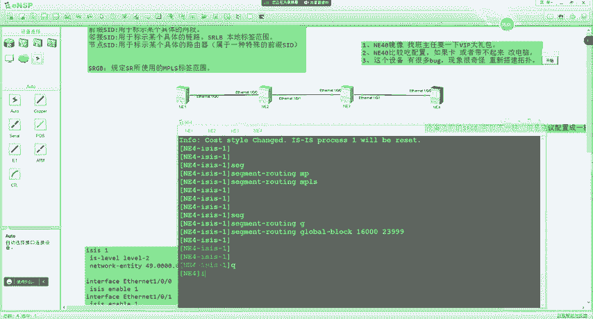
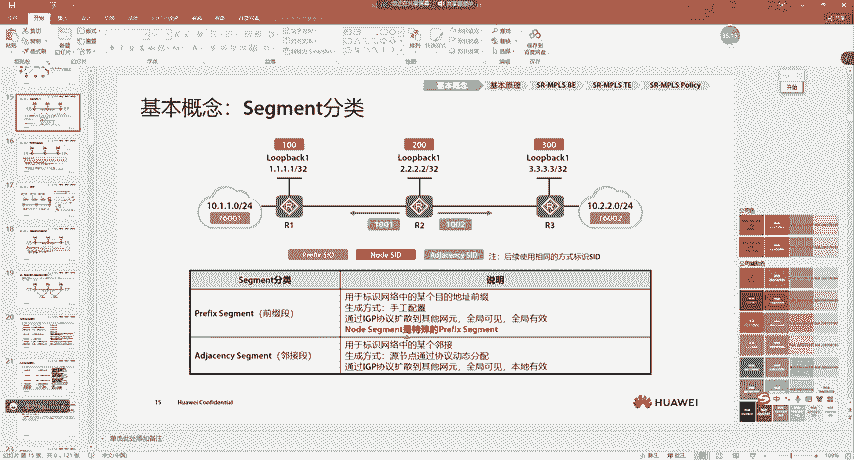
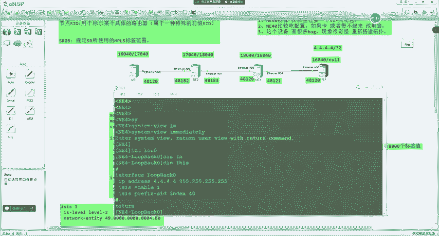
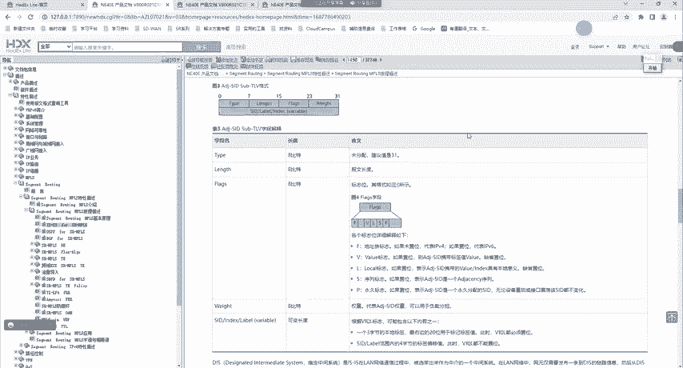
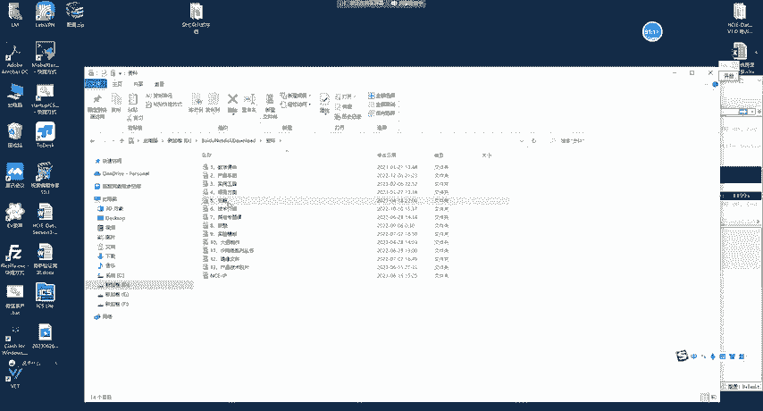
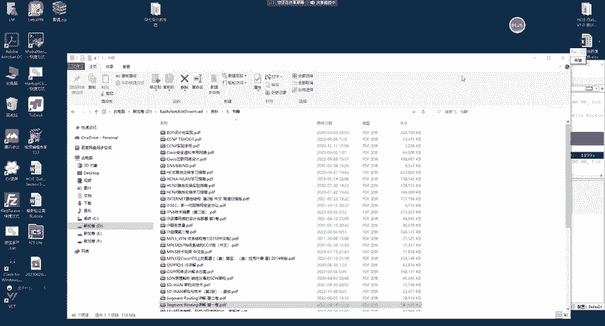
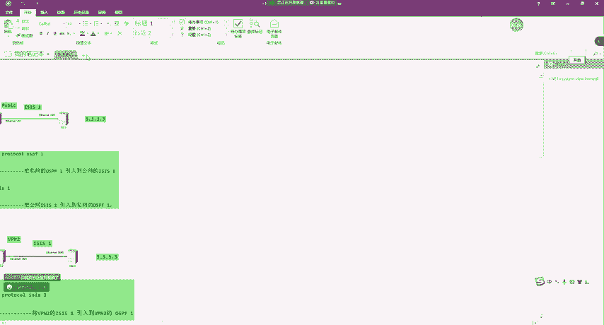
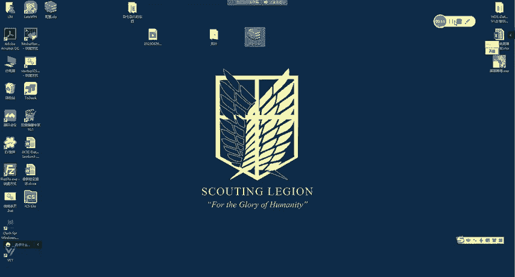

# 2023 新版华为认证HCIA+HCIP+HCIE全套视频讲解！一套视频让你从入门到精通！CCNA／CCNP／CCIE技术提升同样适用！ - P129：（持续更新）HCIE Datacom - 65.SR 基本原理、ISIS SR扩展） - -Book思议8 - BV1W8411A7z8

呃，我们今天上课吧啊上课了。嗯，上节课给大家说了一些这个SR的一些基础概念啊，嗯讲到了一些思想，对吧？呃，以及呢说了一下这个SR跟这个SDN之间的关系，对吧？就SDN本身只是一个思想。呃。

然后我们具体在广域网上对吧，配合SDN这种思想去实现的技术呢就是SR对吧？嗯，这里大家怎么样去理解SR，就是SDN呢，就像这个呃我们说呃让所有人对吧？我们要实现共同富裕一样啊，这就是一种思想对吧？啊。

这个就类似于SDN一样。呃，但是呢我们要去实现这种思想呢需要很多的这个真正的实践，对吧？你比如说我们要实现共同富裕呢，呃，我们有了这个改革开放，对吧？呃，我们这个招商对吧？啊，引入外这个外资，对不对嗯。

这都是具体的行动啊，这个行动呢，就在我们的这个技术里面呢啊就相当于SR这种技术，对吧？就你配合这种思想呢啊去实现的这个技术啊，就SR技术好吧呃，那这个落地呢对吧？我比如说我们说这个呃。😊。

刚开始做这个改革开放的时候啊，我们把这个深圳作为试点。对吧呃，那SD这种思想呢嗯配合SR这种技术它落地到了哪里呢？因为我们的网络啊就像中国地图一样，它也有很大对吧？我们有园区网对吧？呃。

有这种呃像这种政府的对吧？呃，那还有这种广域网，对吧，还有这种广域互联网络，那在我们的这个广域承载网上。去落地的呢嗯他就相当于我们把这个共同富裕啊，刚开始在深圳实践一样对那SDN思想呢呃我们就在这个。

嗯，承载网上对吧？呃，去做了一下落地。呃，接下来我们要说的呢就是SR的一些技术啊呃就是呃接下来就要讲到这个技术的一些相关概念了。好吧，我们来看一下啊。呃。首先在我们学SR里面呢。

有一个词儿啊叫做sment啊呃我一般叫做这个段好吧，翻译过来叫做段的意思啊。嗯，这个段呢大家怎么样去理解啊？嗯，这样给大家说一下，就是段是这么一个概念嗯，还是一个老例子对吧？我们从北京到上海嗯。

你可以先到郑州吧？去换乘，然后换乘到南京啊，南京再换乘啊，然后再到上海对不对？啊，也就是说我们的网络中呢是有不同的段的，比如说嗯。😊，举个例子啊，现在比如说一对吧呃，他要去访问8啊，那么在这时候呢。

比如说我们说让他去走一对吧，这个一呢啊就类似于一个段啊，就是一种指令注意啊，sigment本质就是一种指令，啥意思呢？比如说我上面给你说一对吧？啊，就是意思就是告诉你你要沿着一这条路径去转发啊。

就相当于你从北京到上海啊，我给你说高速对吧，你就知道你得跑到这个高速站啊，去做高速，所以说这就是sigment啊，好吧，那这个呢它主要是包含在数据包头部中的啊，那未来呢咱们会去做这个实验，好吧。

大家就可以去看到所以说这里呢大家理解成sment呢本身就是一个段好吧，或者说我们说它叫做一个指令注意啊，啊，或者说叫做一个指令啊，当然用指令来理解啊，相对来说啊就大家更好理解一些好吧。

就是它本质是一种指令。那这个指令呢嗯我们需要有一种标识对吧？比如说我跟你说呃，你去干什么干什么对吧？或者说我跟你说是吧呃，12对吧？那这个12呢可能代表其他的意思对吧？比如说大家工作呃。

工作的时候呢呃你老板说了一句话呃，你有时候有时候敲个一。😊，对不对？呃，敲个一呢，这个就相当于是你回复了一句收到啊，大家能明白这意思吧？对吧所以说收到呢是一种指令。

那这个指令呢需要有一种东西来进行标识啊，那这个呢就是sim的 IDD对吧？我们也把它叫做SID。能明白吗？注意啊，我也把它叫做SID。

那这个SID呢嗯大家可以理解成是s government的一个具体的标识。好吧，我们可以去看到啊，就是sigment IDD呢用于标识sigment好吧，就是我们的指令，比如说呃你有一项指令。

对吧那这个指令需要有一种具体的标识啊。是吧比如说123123就代表着你需要按照哪条路径去转发，对不对？那你需要去标识这个指令，那这个标识就是123好吧。

这就是sigma的 IDD那我们刚开始学的这个SR呢，咱们学的是SMP那在SRMP里面呢，这个sigma的 IDD啊，它就是用MPS标签啊来进行标识的好吧，但是并不是只有MPS标签啊，在SRV6里面呢。

就是IP6地址。好吧，所以说这里呢是s IDD。那比如说在这里呢有一个呃应用的例子，我们来看一下啊。比如现在呢一要去访问8。注意啊，那这时候他发送的数据包，那比如说里面有1个400的sma ID注意啊。

那这个400呢，它对应的是R4。那这个是我们在规划的时候需要去部署的那这个大家怎么样去理解呢？就是比如说你在R4上你去配置对吧？这个路由器啊，它这个标识呢就是400是吧？啊，比如说那一块地。

那块地它的标识就叫做郑州，能不能明白那这时候呢，当我们想把数据包发送到R8的时候，我就告诉你啊，你先到郑州对吧？啊，然后再上上海。对不对？那么在这时候，IE也是一样的。

I一就开始一看有1个400400就相当于我告诉你对吧？你去上海，你先去郑州。对吧那这时候R一就会先把数据包扔到R4上啊，就扔到400这台路由器上。好吧，然后对于400来说呢，他最后再去转发到R8上。

那我们可以去看到啊，R4去R8的时候，他可能有两条路径。是吧我发现他走了G0-0-2，那这是怎么控制的呢？这就相当于我跟你说一样，我跟你说，你去上海，你得先到郑州，到郑州坐飞机，飞到南京，对吧？

然后再去上海，或者说我跟你说你到郑州，对吧？你坐高铁直达上海。😊，那是不是就跟我相当于我给你规划了，就是你从北京要想到上海，你怎么去呢？你得先到郑州，你到了郑州之后，你做郑州的什么交通工具再去到上海？

😡，是吧那在我们的网络中也是一样的。现在R1要访问R8，我们想去控制这个路径的话，我们就通过这个sment IDD来进行控制的。😊，你400不就标识的是郑州吗？对吧？是R4，我告诉你，你先转发给R4。

😡，对吧到了S4之后呢，你从G0-0-2再去R8，就是你到郑州了，对吧？你坐这个大飞机是吧？你坐火箭啊，都没人管你，反正就是我指定你怎么样，对吧？从哪一个接口去上海。

那这个就是sigment IDD的一个作用。😡，好吧，那我们在压这个 ID的时候呢，可以压一个段，就相当于我再给你说你去北京一样呃，不是你从北京到上海一样是吧？我跟你说，你先去哪再去哪。

那这个路径我们发现是逐段的，对吧？就是到了郑州啊，然后再从郑州到上海是吧？这不就相当于我告诉你，你先到400对吧？到R4，然后从R4到R8。😊，对不对？实际上是一个道理啊。😊。

那接下来还有一种呢叫做原路由啊，这个原路由上节课也给大家解释过，对吧？就是我们基于原的啊路由方式，我们把它叫做原路由。注意啊，这个实际上是怎么控制的啊，就是我们怎么样去控制它的转发路径呢？

实际上就是在RE转发报文的时候，它会去给这个报文呢压上标签。😊，因为SR有一个基础呢，就是我们在全网所有的路由器啊呃以及呢这些链路呢，他们都有1个SID来进行标识。所以说IE在产生这个报纹的时候呢。

它会去压上这些SID那这个SID呢就是MPSS标签。那我们可以去看到，他首先压了1个400。压了400，就是告诉你你先要到400400是不是代表郑州啊？是吧啊告诉你，你先到郑州。那到郑州之后呢。

他又把这个400拆除掉。好吧，然后再下下面呢，10461046就相当于你要坐高铁对吧？呃，去上海一样。对不对？所以说在这时候呢，他一看1046哎，是G0-0-2，他再把1046也干掉，干掉之后呢。

只带1个800发送过去。那R6收到之后就很简单了。R6收到800，他知不知道是往哪里啊？😊，知不知道？他也是知道的。注意啊，所有的SID呢，我们最终都会通过IGP泛红出去。那么一旦泛红出去之后呢。

所有的路由器他们都是可以知道具体的目的地呃是哪里的那我们在这里可以去看到一个，对吧？老师这个包它压了很多的标签。对不对？压了很多的SID那这个SID呢，我们就把它叫做sigma list的好吧。

是由多个SID构成的有序列表。那这个就叫做sig list的那为什么叫做有序列表呢？是因为我们在处理的时候永远是先处理外层啊，外层处理完之后再处理内层。😊，好吧。

所以说这一段呢啊大家就可以认为啊叫做sigment IDD好吧，那这是一些基础概念啊。那sigment我们可以去发现啊，对吧？老师有标识从哪个接口发的对吧？有标识发给哪个路由器的。😊，对不对？

就是有这么多sigent，那实际上呢他们也有一种分类。😡，对啊。也有一种分类。那这个分类呢呃主要分为两种啊，当然有时候我们也说三种，好吧，那大体呢我们可以认为是两种啊，一种呢叫做前缀嗯Iment好吧。

还有一种呢叫做临接sment。😊，就是两种前缀sment呢，它是用于标识某一条路由的。注意啊，比如说在这里呢，我们有1个10。2。0。0。对不对？那这个路由呢，或者说这个网段它就会有一个单独的SID。

对呀，叫做16002。那比如说当我们的R1如果去访问R3的时候，那未来在他的数据包里面呢啊就会压上这个网段的sment。那压上这个标签之后呢，中间所有的路由器，它都按照这个标签来进行转发。

那这种呢我们把它叫做前缀性用的，它是用于标识某个具体的前缀啊吧呃，可以用手必须要用手工的方式配置啊啊，你得用手动配。然后他是全局可见，全局有效。对吧因为你R一，你要想压这个16002，那你得知道啊。

对吧这个网段对应了哪个SID所以说它是全局可见啊，全局有效的。还有一种呢叫做临接sment，它是用来标识某条具体的链路的。因为我们刚刚也说了，比如说在这里呢R4转发给R6。

那它不是按照0-0-2去转发嘛？对吧？那在这时候，它怎么样去标识这条链路呢？对吧怎么样去标识的那就要通过连接呃sment。呃，或者有时候我也叫临接SID啊呃，这里大家知道一下啊。好吧嗯。

以后如果我讲到啊，我就不叫林杰。这个s的啊，我叫做临件SID啊，但是大家也要知道他的意思啊。😊，那我们针对于每个邻居呢，还会分配一个临接SID。那比如说在这里呢，在我们上面这张图中。我怎么样去控制。

对吧？S从0-0-2转发到R8呢？那实际上呢R4会给R6，比如说我们跑了OSPF啊或者SS都行。好吧，我会去给他分配一个连接SID。那这个零件SID呢未来也会在LSC中泛红出去。那未来R一就收到了。

R一收到之后呢，他就知道R4的0-0-2，对吧？是这条路径。因为他可以画出全网的拓扑数啊画出拓扑数之后啊，基于拓普的邻居对吧？去补充这些SID他又知道全网的某每一条链路，对吧？

它对应的这个临接SID是多少，对吧？基于IGP泛红的原则呢，也可以知道每一个路由器，他们呢嗯这个我还没讲到啊，这个大家先不用管，好吧，就可以知道每个连接SID是多少。那么在这时候呢，他在转发的时候。

I一去访问I4。比如说我想让你从G0-0-2走。那由于IGP泛红的道理。这时候S的LC中呢会去描述这条链路是161046。好吧，所以说未来R一呢就在这里面可以去压入1个1046啊。

去控制整体报那一个转发路径。那这就是临件SID啊，那他是由我们的协议动态分配的啊。是由协议动态分配的。嗯，也就是说我们跑OSPF呢嗯或者说ISS都可以啊，那也是全局可见。但是是本地有效的啊。

就是我们的设备上，比如说。😊，R给R3分配了1个1002R1能不能给R分配个1002？拿不拿。不能可以啊可以。叫做全局可见，本地有效。能懂吗？是可以的啊是可以的。那这个就是sment的一种分类啊。

就是准确来说我们可以把它呢分为是。呃，三种呃，刚讲了两种啊，一种叫做。前缀SID好吧，后面我就说SID了啊。前缀SID还有一种呢叫做连接SID嗯，准确还有一种叫做节点，我们把它叫做nSID。啊呃。

他们之间有什么关系呢？前缀SID呢，它就是用于标识。某个具体的。网段。好吧。那零件SID呢是用于标识。某个具体的链路。就你从哪个链路嗯转发出去，对前缀SID不能冲突啊。

还有一个叫做节点SID这节点SID啊啊有时候我们也把它叫做nSID好吧啊，大家也可以叫做。😊，Not segment。好吧，那他是用于标识某个路由器的。某个具体的路由器。

啊不它是用来标识路由器的啊那这种SID呢，它是属于。一种特殊的。前缀。SID。那为什么我们这么说呢？实际上这个节点SID就是设备漏败接口分配的前缀SID。😡，能不能明白。

我们给他起了一个另外的名字叫做node SID实际上它也是前缀SID的一种。😡，好吧，就是你设备有1个1。1。1-32，有这么一个lo接口。好吧，然后我们把它叫做noode SID因为1。

1就是你的楼板接口标识你这台路由器的嘛。啊，所以说node se呢是一种特殊的前缀sment。所以在这里呢，我们接触到了啊三种对吧？sment分类啊，一种呢。叫做。前缀s对吧？

还有一种呢叫做临接sment，还有一种呢叫做n se。n se实际上就是前缀s。就是楼板接口。没有其他区别啊。那基于这三种标记呢，我们就可以在网络上去编排任意的路径。啊，怎么样去编排呢？

比如说八这边连了了1个80。1。1。0。对吧那这时候呢，他肯定有一个呃sment是吧？会有一个前缀SID啊，比如说叫X。啊，现在我们就是通过APP啊，跑完之后呢，他们泛宏到全网了啊，泛宏到全网之后呢。

所有的路由器都可以知道全网每个链路啊啊，每个路由器对吧？每个前缀对应的SIDR1现在他知道全网所有的路径了啊，他要去访问R8的话，他就可以去进行控制。我先压1个400，对吧？再压1个1046。

再压1个800。😊，那最里面呢还会有一个X。好吧，那这个报文一旦发出去之后呢，发给R了。假如说啊正常他是按最短路径转发的。😊，就负载均衡嘛。那假如说负载均衡给R了，R一看你访问的400。

R知不知道400是谁啊？😊，他一定是知道的，这不就是R4的nSID吗？因为IGB泛红他就已经知道了。对吧啊具体怎么泛红的，大家先不用管，后面我们会去讲到。所以说这时候呢他发给S4了。

S4一看这个400正好是自己的呃本地的SID是吧？他把400干掉，一看1046呢，还是自己本地的SID那他看到1046对应的是从0-02发出啊，他再把1046干掉。1046干掉之后呢。

带着800跟X发给6了，六1看800又发给8了8一看800啊，这是我的是吧？干掉，那一看呢，X是从这条链路是吧？发送的80。1。1。0。😊，就是通过这种呃，就是三种sificant呢。

我们就可以在网络上去编排任意的路径。好吧，所以说到这里。都能明白吗？明白敲一啊。没问题吧。好吧，具体怎么产生的这一块先不用管啊，后面我们会有配置。你先要理解这个思想啊，这里很重要啊。😊，好吧。嗯。

我看啊。连接sSRGB。呃，这一块先不用管啊，不用管。这都不用看啊，这都不用看。好啊，这几张照片都不用看啊都不用看。😊，呵。不用看啊呃，接下来呢我给大家做个实验啊，如果我按照这个胶片给你讲，呃。

我觉得大家就懵逼了。😊，这里呢给大家讲几个术语啊。呃，待会我们做实验的时候要用到呃，第一个术语呢，我们把它叫做SRGP。注意啊呃，这个SRGB呢，我们把它叫做是因为我们的SR它是用MPS4的标签去标识。

某个具体的段的。对吧呃，那我们之前学过MPS。嗯，我们在学MP24的时候呢，我发现有很多标签值。😊，对不对？那这个标签值呢嗯有没有可能会跟SR产生冲突呢？对吧比如说我SR分配的一个标签是一哎。

那MPS也分配了这个标签一两者会不会有冲突呢？啊，实际上是有可能的。😊，对不对啊？所以说呢SRGB它就是用于规定，用于规定，就是SR所使用的。MPS的标签范围。好吧，那这个就是SIGB。

那未来呢我们需要在每台路由器上都去配置SIGB，就是配置探头能够使用的标签范围。那这个标签范围有什么用呢？要我们说到了啊啊，像前缀sment啊零件sment啊，还有节点sment。

那么他们都是用于MP用MP4标签来进行标识的。对不对？所以说呢当我们去配置了SRGB之后呢，未来所有的SID啊都会从SRGB中来进行选择啊。当然有一些特殊的，待会我们再补充好吧。

所以说这时候呢我们先来看一下啊，怎么样去做的。嗯，我拉四台路由器啊。呃，这里先给大家说一下啊，就是NE路由器呢，如果你们没有镜像的话，嗯，你找班主任。好吧，嗯。

你们报课应该会有1个VIP大礼包啊啊会有1个VIP大礼包。之前我说过是吧，讲那个MPS的时候。对吧呃，你们找班主任要一下那个VIP大礼包啊，里面是有镜像的啊，当然还有一些其他7788的资料啊。呃。

这里还要给大家补充一点是什么呢？首先就是镜像。有。我用的是N140啊，N140的镜像呢。啊，去找班主任。要一下呃VIP大礼包。好吧，就你们报AE应该都会有这个啊，但是有些同学可能有对吧？

有些同学可能没有。对吧呃第二点呢就是这个镜像啊呃这里我要给大家说一下，就是你们在未来开的时候。呃，可能会带不起来，因为我电脑呢开四台就非常非常卡了啊，有时候还开不了。啊，这里提前给大家打个招呼啊。

如果你电脑呢嗯你比如说内存不是特别好啊，CPU也比较落后，呃，有可能会打不开啊。嗯，这时候呢你得想办法去呃买个硬件。好吧，那怎么办？买电脑。好吧，你自己去改一下啊。所以说这里给大家说一下啊。嗯。

还有一点呢，要给大家说一下呃。这个。NE系列的设备呢，未来你在做的时候会有很多的bug。啊，就是第二点呢，就是NE40呢。嗯，占用空间比较高。或者说比较吃配。嗯。如果卡。对吧啊或者带不起来。啊。

你得想办法改电脑。好吧，嗯，自己想办法买两条内存条对吧？或者说你有这种台力机呢，换个CPU之类的CPU一般大家都挺好的，就内存条呢得加一下啊。😊，呃，第三个点呢，这个设备啊啊这款设备。啊，有bug。啊。

有很多bug啊。嗯。反正就有很多bug。如果你发现啊，就是现象很奇怪。现样很奇怪。嗯，这时候你怎么办啊，你只能重新。搭建拓谱。能不能明白啊，只能重新搭建啊。因为我之前试过了。嗯。

我把模拟器关了之后重开呢还不行。嗯，重新搭建拓普，有时候就是很随机啊就像那个CE做微插烂一样。有时候能出，有时候出不来。对吧。怎么样知道是bug，就是我课上能做出来啊，你做不出来。

你只要检查自己配置没问题，那就是bug。好吧，所以说这里给大家说一下啊。嗯，你比如说现在呢我就没起来。😊，是吧。哎，起来了。对吧嗯，设备开了啊开了。😊，呃，那现在呢我们来做个实验啊。😊，嗯。

我们先以SS为例，好吧，那这里呢大家首先呢这个就不用我解释了吧。就是你首先要进入到系统视图啊，敲个立即执行对吧？因为N一系列你无论所有的配置呢，你都command提交一下。是吧。

所以说这里呢大家交个立即执行。啊，进来之后呢，我改设名字啊，命令基本都差不多N1。哎有。嗯，N3。还有N14。搞完之后呢，我们做基础的配置啊，就是你做基础配置之前呢，你要暗度DC。啊。

因为NE系列的设备呢，出厂都带DCN的配置啊，你要给它删除掉。那把DNCN功能关了之后呢，你再进入到接口下。那这个以后不要问我这样的问题啊。你就是是吧老师我interfaceE1-0-0。对吧呃。

进不进去，注意啊，NE系列设备呢，这个你只能打全称啊，1-0-0，你这样才能进去啊呃，以后大家在群里遇到这种问题呢，可以互相通告一下。好吧，嗯，常见的坑呢，我都会给大家说一下啊。

然后我们在癌医上呢创建个60啊，1。1。1。1。😊，32。R这边呢interface嗯移动net1-0。0。10。0。12。2。然后是。interface in the night。1-021。10。

0。2302。然后我们起个6外0接口。三上啊。嗯，1090。23。3。然后是1-0-1。34。3。然后是娄柏林。然后是四场啊。1-0-0。34。4。嗯，然后我们起个604。4。好吧。嗯。

现在呢就是把基本的IP配好了配完之后呢，我去做个ISS啊，我们起个ISS啊呃，然后net呢49点0000点0000点0001。00。好吧，当然你也可以用OSPF，这个是一样的。嗯，然后。

Its live。来玩。改成GB2啊，这个实际上G别12都行啊，就是我们改成GB2的目的呢，就是未来呃咱们好去看一些，好吧，因为默认它GB12的数据库呢都有，看起来就比较麻烦。嗯，改完之后呢。

interface。迪耐1-0-0。SS enable。二这边也一样。我们直接复制啊，太麻烦。这个你得保证，就你最少要有16个G啊。最少要有16个。再少就不行了。然后我们再把楼接口看一下SS上。好吧。

嗯，我们看完之后啊，注意啊，现在我们来看一下邻居能不能建立正常啊，这个大家一定要看啊，平常你们做实验的时候要去看啊，因为有时候呢你配置没问题啊，但是它直连不通，这就是设备的bug。😊，好吧，所以说。

大家自己以后做实验的时候呢一定要去看一下。啊，邻居能不能起来啊，有可能你这时候起来了，你把托普关一下啊，再开一下，可能就起不来了。就这个设备有很多bug啊这都我踩过的坑。😊，嗯。

我发现这次呢倒没什么问题啊，邻居都建起来了。呃，起来之后呢，我们在A一上看一下录由表。嗯，也已经学到了4。4的路由。对吧呃，那我们要去做SL的话啊，怎么样去做？那首先呢你要再去看一下MP4啊呃。

然后去配置MPS4的LID。这里呢我们用1。1。1。1啊，然后二这边呢MP2。MP24LRSID。2。2。2。2。然后三这边。MP24LID3。3。然后四这边。MP2423ID嗯4。4。

然后把MP24给它开起来。呃，开起来之后呢，我们在N一上注意啊啊，你要敲一个sroing回车啊，就是把SR的功能给它打开。好吧，然后二这边也是一样sroing。然后三这边。这个啊，然后4这边也是一样。

就把SI的功能给他打开。那打开之后呢，然后我们再回过来啊，在ISS视图下注意啊。要去改一下cos的风格，改成宽度量。注意啊。SS必须要使用宽度量。因为未来我们基于SS的扩展呢嗯在SS中。

如果你不使用宽度量呢，它是没有办法去携带这些信息的。所以说你必须要去使用IS的宽度量啊，在SS下呢，我们再改成宽度量。然后SS项。cos的。要的宽度量啊。那改完之后呢，我们在NEE上注意啊。

你要去敲一条叫做s的rootingMPS。好吧，回车把SRP4功能打开，然后四台设备呢都一样。分量非常多啊。那看完之后是不是完了呢？不是呃sig的主ing。MPS。啊，不对啊，不是MPS了。

然后在这里呢，我们得去做一下SIGB。好吧啊，叫做glo block去把。SR。GB好吧，把SIGB的空间范围去给他配一下。那在这里呢是有要求的。😊，吧一般我们做的就是16000。到23999。

一般我们都是这么说。呃，当然平常实验的时候啊，我们都是这样去配的。好吧。那N12这边也是一样，申请入庭。嗯。SITB。16000到23999。嗯，这里大家要注意一点啊。

就是设备的SRGB就是你可以不一样。好吧，可以不一样，但是我们建议是一样的啊，原因呢待会我再来说。😊，所以这里先给大家注释一下啊，就是。设备之间的SRGB。可以不一样。但是建议配置成。一样的。啊。

然后我们在三上呢也是一样啊。😊，16000到23999。嗯，我配着还得想着，因为我也忘光了啊。好久没配了。23999。嗯，我们做完之后啊。😊，我再看看还有没有配的。那就没了啊，没了啊呃，我们做完之后呢。

注意。😊，比如说现在我看一下NEdiplay ISLDB是吧，我查看一下他自己产本地产生的。呃，local boss。好吧呃，在这里呢，我们就可以去看到首先。啊，这里不是。注意啊啊。

这里他分配了一个连接SID。好吧，我可以看到他不是跟二建立了邻居嘛，对吧？针对于这个邻居呢，分配了一个临GSID，叫做48120。对吧那有人问了哎，老师啊。😊，那这个SIGB不是标识他所分配的范围了吗？

这个482120好像不在里面，注意点啊。我们一共是有三种SID啊，那么未来在分配的时候呢，临件SID啊，它选的叫做SRLB啊，就是本地的一个范围。好吧。那除了这个临件SID呢，前缀SID和n SID。

是需要我们手动去配的那这个配置呢是这样的，注意啊，我现在在interface楼柏林接口下。嗯，我以四为例啊，待会我们在一上来看现象。

在4的60接口下呢，因为我们刚刚可以去看到啊前缀SID有一个特点。嗯。不是。也不是。

对啊，是必须要通过手动的方式去进行配置。那我们怎么样去配呢？就叫做。呃，ISS。应带哎。我想想啊叫啥来着？嗯。嗯。SS我打问号啊，我瞅一眼。我也记不清了。都面临比较多啊。呃。cose的。啊，不是这个。

啊，不是这个啊，对对对啊，对，没错，pri fix SID。好吧，就我们要去配置呢它的1个SID值。那打问号呢，在这里有两种啊，这里我们主要学习第一种啊。第二种呢我们实际上去配置一个绝对值。

而我们实际上配置呢都叫做一个偏移值。这个偏移值怎么理解呢？我们先看一下现象，比如说index，我们给他配个40。好吧，那么配个40之后呢，注意我们可以在NE一上呢去看NE4。注意啊，你拍完之后。

我们来看一下NE4啥di四playSSLSDB local boss。他针对于4。4这条路由呢。去携带了一个prefix SID40。对吧那这个prefi SID呢。

我们可以在NE一上去看到那我们可以通过一条命令叫做display seven roing。😊，M124。第四playMP2。叫啥来着？他跟SRV6的还不一样啊，我就寻思寻思啊。😊，呃。

diplayISS。s工的入ing。也不是这个。呃，s routine嗯。Pfx MPPS好吧，否ing。那我们可以通过一条命令来去看到。就是在我们的NE1上呢，关于4。4。4。

它有一个初标签值是1004016040啊。好吧啊，有他吓一跳啊，有角色是in格川赛的。对吧还有出街口。那这里我们可以去看的啊，实际上我们在这里拍的是40。😊，这个事实呢。我们把它叫做一个叫做偏移址。

或者说呢啊大家可以也可以叫做偏移量。那这个偏移量是什么样子的呢？就是首先啊当我们去配置了SRGB之后呢，我们来看一下四产生的这个LP。对吧在这里呢它会有一个范围注意啊，在这里我们可以去看到4。4。4。

它对于SR能力的支持。那后面呢有1个SRGB的空间范围。好吧，16000润纸代表是范围是8000。那这样代表的是什么意思呢？就是他的SITB啊是从16000开始的。然后呢，这个range是代表一共有。

8000个。标签值。那这时候你就去算一下呗。16000到23999。对吧这一共呢就是8000个标签值。那这里可能有些同学哎，老师不应该到24000吗？嗯，那你就得补补数学了，好吧。😊，嗯。

01这不是两个吗？对吧012，这是3个。对不对？16000到23999。那不就代表是4000个吗？是吧啊，多打了一个球。好吧，所以这个大家能听明白吧？明白敲一啊，就是SRGB啊，它是怎么样来进行计算的？

😊，没问题吧。好吧，那我们的每个设备呢，刚刚我们都配置SIGB。😊，那么配置了之后呢，他们就进行泛红，对吧？那在NE一上呢，它就可以收到4的LSP。所以说display ISLSDB。

我们去看四产生的这一条。这是四产生的。在一上呢就可以看到四产生的那这些信息大家都不用管，好吧，都不用去管它啊。那首先它可以去计算出来4的SRRTB空间。😊，对不对？从16000到23999啊。

它是可以计算出来的。那么一旦计算出来之后呢，我们就可以去看到什么样的东西呢？在这里。4。4。4。4。在这里啊4。4。4。4。他有一个prefix SID是40，那这个40代表的就是偏移量。

那这时候他会使用R4的SIGB就是16000去加上1个40。这个事实代表的就是。16000到23999，你在哪一个位置？都懂吗？那如果你是40，他就会加个40，那就是4。4。4呢，就是16040。好吧。

那这就是他怎么样去计算出来R4的SITB。那如果我们在三上跟二上都可以都去做配置的话，那这个也是有的。那这里我先不做啊，首先我来抓个包啊，我在G0-0-0抓一个啊，我们先看一下这个访问的包，对吧？

现在大家可能有点懵了啊，待会儿呢我们再把课件对吧？把这一块看完之后呢，再去过一下课件，你就能够明白了。😊，注意啊，首先这说在NE1上是不是有R4的转发表啊？对不对？比如说我们现在去聘4。4。4。4。

我去看的啊。发出去的这个request有没有携带一个M的标签是16040啊？有没有？这跟前缀SID有什么区别吗？😡，没有吧。可以吧啊。

大家可以理解成node SID呢就是前缀SID只不过它能标识某个路由器。😊，那现在我们可以去发现，当我去访问一个具体目的前缀的时候呢，我会加上这个前缀所带的SID。那这个数据呢。

未来它就会发送到N12上。那N12收到之后，对吧，有人就问了，哎，老师N12他是怎么知道转发的呢？😊，那有没有这个问题啊？有没有？有吧。是吧。一定是有的。那随着ITP泛红。

N12知不知道N12知不知道N14的？知不知道也知道。对吧所以说在N12上会不会有这个转发表di四play。呃，施故的roingperfi MPPS啊否ing。是不是也有啊，收到1040对吧。

变成1040发送给3，然后三再转发给4。对吧那这就是他的一个转发逻辑。那这个逻辑看明白之后啊，还有一些详细的啊吧，我们再来补充一下，注意啊，现在大家注意我接下来要做的一个实验。😊，啊。

我现在在NE3上呢，SS进证一下，我这样来做一下啊啊，我不在三上做啊，我直接在二上做。我在二上呢SS鉴证下。我们把他的。SRRTB给它删掉。诶。嗯，那还不是一下子连带上的啊，暗度roing。

global。呃，16000到23999。注意啊，现在我来做一组操作。🎼嗯，待会儿二上呢，因为我们刚说了啊，就是设备之间的SRGB可以不一样，但是建议配置成一样的。刚刚我们配置成一样的。

我们可以发现一个特点，就是SRGB。所有。一样的时候。关于某个特定的前缀。特定的前缀。在所有路由器上的标签都是一样的。对不对？所以我们刚在NE1和N12上呢去看关于4。4。4，他的SID呢？

对吧都是16040。但是比如说我现在在N12上呢，我这样来赔。嗯，sonroinggbal，我不用1600啊，我用这个。17000。啊，然后到18000。啊，我拍的小一点。那这个做完之后啊。

我们再来看一下RDISLSDB。Local boss。R是不是也会去说啊，自己从17000开始，里面有1001个。对吧。那这时候注意一点啊，这时候我们到NE一上再去看一下。你去发现啊，4。4。

4的出标签变成了多少？编成了多少？变成了17040是吧？首先这个现象你先看到啊，你先不用去管为什么。对吧我们发现发生了改变。哎，老师为什么会发生这种改变呢？对吧？那如果R3的不一样，那又会怎么样呢？

比如说我们现在R上啊，R上去看D displayplay。😊，C工的入ing。R上变成多少？入标签是17040，初标签是16040。比如说我在R3上，我再来改一下。嗯，我们配1个18000。

到19000。然后我们再到R上来瞅一啊，刚刚他的出标签是16040。你发现又变成了18040。是吧就老师为什么会发生这种改变呢？就是注意啊，现在啊首先我们来观察一个现象就是。😊。

当设备上的SRGB不一样的时候。就是SR。GB不同的时候。关于某个特定的前缀。在所有路由器上的。标签可能相同。可能不同。对吧。那这是现象。首先我们为什么去建议。😡，使用相同的SITB呢？

那么这时候我们在分析的时候啊，就建议使用相同的SIPDB，他们都有一个特点。关于某一个前缀呢，在所有设备上的标签都是一样的那比如说当我们去分析故障啊，或者说在做运维和排错的时候，对吧？

相对来说在管理和维护上。就比较。简单。对吧。或者说容易一些。对不对？那不同的时候呢。嗯，那就比较麻烦一点，那麻烦他是怎么产生的呢？对吧？老是在乱七八糟的。😊，对不对？那我们来看一下，就SIRTB。呃。

他是怎么样去帮助我们的设备去计算？关于某个特定前缀啊，他所携带的标签的啊。嗯。我们来看一下啊，在这个。课件里没有。嗯，有我们来看一下啊，在这里我们来看啊SIRTB。😊，呃。

他叫做用户指定为smentroing m，就是为SIMPS呢去预留的全局标签的一个集合。每台设备呢通过扩展路由协议，通告自己的SIDB。

也就是说我们可以通过IGP嗯IS呢或者OSCPF去把这个SIDB扩散到所有的路由器上。那。😡，节点通过扩展的路由协议通告的前缀SID索引。这个刚刚我们看到了就是那个40，对吧？

每台设备呢分别计算入站和出站的标签。😊，他这个标签是这样计算的啊，比如说我们在R3上不是index30了吗？😊，对不对？index30之后呢。他的这个RSP呢呃当然又我们这些说链路状态啊。

因为包含OSPF计算方式都是一样的。那么他们会传到R上。😊，R是怎么计算的呢？首先R呢会给这个3。3分配一个入标签。因为我们在学MP4的时候，我们会不可以发现。

RSP的建立呢就在每个设备上有关于这条路由的入标签，还有出标签。去构建出来了一条LSP隧道。那在R3上，本地就很简单，它的入标签就是用自己的SRRTB。就是入标签啊。

就是用自己的SITB加上index的索引，它的入标签是20030。出标签就没有，对吧？因为它的一个节点。而对于R来说呢，它需要有一个入标签，有一个出标签。对不对？跟LLDP那不是一个道理嘛？

就是入标签出不标签去构建。😡，是吧那R它是怎么样去构建入标签的呢？它是使用自己的SRGB加上目的网络的索引值。注意啊，所以说他的入标签应该是多少？应该是多少？是吧。12030。那有问了，哎。

老师初标签是多少呢？注意啊，初标签的计算是这样的。😡，他是使用关于这条路由下一跳的。SRGB加上索引值。首先R上关于3。3的下一跳是谁啊？是谁啊？R3。对吧然后使用R3的SRRTB加上索引值。

触标签是20030。那R一收到之后也是一样的。RE的出标签是多少？😡，关于这条路由吓一跳的SRGB加上索引值。是多少？12030。所以按照这个逻辑我们来看啊，假如说R一去访问R3的时候。

它的出标签是12030，带着12030发给R了。R收到12030。能不能换成20030，有没有对到一起？对吧做一部swipe就做一部MPSS标签的交换，交换之后呢，再发给R3。那你发送的这个20030。

是不是正好等于R3的入标签？能明白这个意思吧？好吧，这就是他RSP去构建的一个过程。所以说这个构建呢是这样的啊，就是。😊，设备。我们以两个呃来电标识啊入标签。还有出标签。

入标签呢是设备使用自身的SRGB。家。音袋是的。计算出。入标签值。那么出标签是设备使用。关于。这个前缀。吓一跳的。S r g b。加上。inice的。计算出。计算出标签值啊，这个计算入标签值啊。

这个出我就不写了，计算出标签值。好吧，所以我们来分析这里。那刚刚我们可以去看到呢，在R这里我们使用的是17000到18000。A3这里呢是18000到19000。NE4呢使用的是。

16000到23999。A一呢使用的是16000到23999。注意啊，那这时候我们来计算一下。在R4上啊，如果他有1个4。4。4。4-32。对要，首先R4为他计算入标钱应该是多少？

你就按照这个逻辑去推呗。应该是多少啊，这个写反了啊，SRRTB。应该是16040。对吧。然后到R3了，R3首先计算入标签。入标签是18040。然后初标签呢使用吓一跳的4。4。

下一跳是NE4N14的SIGB加上应带色出标签是16040。对吧AR51。N2的入标签是17040，然后啊入标签初步标签是。18040，因为你使用吓一跳的嘛，然后N1呢？他是。入标签啊。160。是的。

然后出标签呢是这个17040。对吧，那首先我们来看一下这跟LDP有什么区别吗？这里就是闹文弹出吧。你想想跟LDP有区别吗？就是真正我们在数据转发层面上，就是标签到每个设备上去做更换嘛。

跟LDP有没有区别啊？没有区别吧。我之前在讲MP24的时候。不也是这样的吗？对不对？比如说现在呢我在A一上去骗一下。4。4。4。4能通肯定是能通的。对吧那N一发出的标签是多少呢？

我们可以通过一条命令叫display roprefi m folding table初标签是17040。那N12收到之后呢，就是我们看的表不一样了。MP4你看RSP对吧？那在SRMP4中呢，我们看的是。

😊，这个SR的这个转发表是吧？那入标签是17040吗，出标签18040N3收到18040怎么办呢？第四类MPS。第四个是用roing fix m。哎，倒数第二条弹出。对不对？那到市场收到的就是IP帮。

好吧，第四不对。嗯，MPS。事故的入ing。Pfi MPS发。对吧收到16040呢啊直接弹出。但实际上在NE3上，它已经执行倒数第二条弹出了。对吧那我们可以看到呢，N4是一个egress节点。

那三呢是english加川赛。二呢是eng格加川赛的，一呢是eng格加川赛的。所以这时候你在理解的时候，你就会发现实际上跟MP4实际上差不了多少。对不对？很简单。是吧实际上差不了多少。哎。

那老师区别在哪里了？我们来想一下，我们这上节课再说MP4LDP有什么缺陷？😊，还记得吗？控制平面我们要用IGP还要用LDP。对不对？那如果我们再去跑SR的时候。

我发现只通过1个IDP能不能去构建出来这么一条标签转发的隧道。能不拿？可以吧，对吧首先简化了协议。对吧我们不需要再去学LDP了，学什么？😡，LDP我们学到了很多，对吧？

老是标签分配标签的这个这个叫什么发布方式，标签的这个保持方式。是吧啊，标签的分配控制方式。之前学P4的时候绕的很，但是我们发现。😊，哎，当我去学了SR之后，很简单啊，就是这么一条规则。对不对？

那么他就能够计算出来。所以说到这里，各位同学都能理解吗？李艳同学敲伊啊。问题吧。好吧，那接下来呃，我们再来过一下。😊，好吧，我们把这两个概念看完啊呃把这一些看完之后呢。

我们再去讲这些就是OSPF到底对MPS扩展了哪些东西。呃，以及呢ISS呢对MPS到底扩展哪些东西。因为我们刚看SP呢，这个呃东西杂七杂八的对吧？我们把一些比较重要的东西呢啊可能会用到的东西来分析一下。

是吧，然后我们把胶片这一些呃其他的东西呢来过一遍，去把这个概念呢再深化一下。😊，我来看啊。呃，就如我们刚刚所说的一样，就是这个SID呢分为很多种，一种叫做前缀SID还有一种呢叫做临接SID对吧？

前缀SID我们也说了，它是具标识某个具体的网段的实际上接口也是一种网那这种呢我们把它认为是特殊的前缀ID吧只不过把它叫做ID就呢是一种特殊的前缀，它是用于标识某个特定节点的。因为口不正好标识一台设备嘛。

所以说在low拜接口下配置的。IP地址作为前缀啊，这个节点的前缀SID呢就是n SID就是我们给lo接口配置一个前缀SID那这个SID就是它的node SID。啊，那对于我们的前缀SID呢。

就是它是通过ITP扩散到其他网源啊，这个网源也是华为企的一个。有新词汇啊，在很多年前呢，我刚开始签的网源，这什么东西啊？😊，是吧。

后来我听华为有一次有华为自己的人啊呃华为那边的人有时候给我们这些呃老师会做这个呃培训，好吧，就是会给这种哈p机构做培训啊啊对，网源及网络单元。😊，啊，我才懂啊，这是网络单元啊。😊，啊。啊。

就跟这个使能的感觉差不多，对不对？这不就开启吗？嗯。我来看啊，那他是全局可见，全局有效。那比如说注意啊，我们如果。所有的设备我们使用的是相同的SITB。比如说这里我拍成40了。

那NE3上的index它的3。3，我能不能也配成40？拿不拿？这时候是不行的啊，这里大家要注意什么叫做全局可见，全局有效啊。注意啊，叫做全局可见，全局有效，意思就告诉你要什么啊，要唯一。😡，能懂吗？

我来看啊前缀s呢，它是通过前缀SID来进行标识的。好吧，是通过前缀SID来进行标识的那一般我在说的时候，我说前缀SID。😡，前缀sment哦，一般我说的都是一样的。因为我们说了，s本身只是一种指令。

300就代表你要转发的这台路由器，对不对？那它需要一个标识，所以说需要SID那前缀sment呢就叫做前缀SID来进行标识。😡，好吧，一直来在我们的课程中啊啊，以及在我给大家讲课的时候啊。

我会直接去说啊前缀SID啊，我不会再去说前缀sment啊啊，大家要知道啊，以后我在表达的时候呢，除非我重点强调啊，否则呢他俩都是一个意思。😊，好吧。那在这时候呢。

我们给R3这里呢去配置了一个index的索引。对不对？配置一个前缀SID。那他会通过IGP通告自己的SIGB。那通告了自己的SIGB之后呢，就来了下面这张图。所有的路由器呢？

他们都可以基于下一跳的SIRTB对吧？加上index的索引计算出出表钱。根据自己的SITB呢，加上indesex和索引计算出入标钱。那从而在每一台设备上呢。

我们都会去形成关于某个特定路由的入标签和出标签。那也是形成了这种LSP啊啊叫做转发隧道啊，我们就把它叫做标签转发隧道。好吧，那这就是标签产生的方式。那还有一种呢叫做连接sment。

这个临接s功呢是由我们的设备自己去分配的。啊，这里大家注意啊，就是我们也可以手动去敲。但是呢设备默认自己会去分配的。那么他的分配逻辑是这样的。就是OSPF会为。为每一个。To wei。状态的。邻居。

分配。连接ADJ。IID。SS呢会为每一个。up普状态的邻居。分批。ADJ。SID。好吧，所以我们现在可以在N一上呢，通过一条命令第一四play。simroing啊pre啊不是pref啊，就ADJ的。

好吧，MP24否ing table。我们可以说看到在NE一上。E1-0-0。这个接口。有一个邻居。10。0。12。2。对吧。那是通过ISSV4给他分配了一个连接SID。能看到吧。是48120。

那这是我们在转发的时候，我们可以去看到。实际上你在控制协议视图上呢也可以去看。display IS LSTB local boss。我们通过控制协议可以去看到的是什么呢？

针对于000000000002这个邻居有没有给他分1个48120？有没有？有吧。所以说A一给他分配了一个。48120。对吧然后在N12上也是一样的displayISS。LSDB local boss。

01是48182，02是48183。48182。这边是48183。NE3上di四playISSLDB local boss。放眼份啊放眼份。To weiji。以上状态的明确。哇，放也份啊。放部分吧。

放也分啊也分。R3这里啊注意啊，R3给二分的是多少？48120。给四分的是多少？48121。是不是。然后在N4上。也是一样的。local boss。48120。然后基于这个我们可以整体来看啊。

在每个设备上，每个段有没有一个单独的标识啊？有没有每个设备上关于每个链路。他有没有一个单独的SID啊？有吧。那关于每个设备。有没有也有一个单独的SID啊？也有吧。那假如说我们的网络如果。

大家自己可以脑补一下啊，如果我们有这些备份路径。那这些路线也会有吧。对吧这些设备呢也会有自己的标识啊。那这时候我们在转发报文的时候，只要压上不同的MS标签，能不能控制整个报文的转发路径。

这就相当于中国地图。对吧这是北京。这是上海。我告诉你，你先从这个转走到这儿，对吧？你先这么走，然后走到这个设备，对吧？然后再按最短路径走到他。😡，这时候你自己是不是可以控制啊，对吧？有点上帝视角的感觉。

😡，对不对？所以说这就是SR的一种思想。就是他把整个网络路径的编排啊变得更加的简单了。好吧。嗯，到这里大家都能理解吗？😊，李亚同学抄一啊。没问题吧。呃，如果那会冲突啊会冲突。

SR会这个在产品手册里面有描述啊，你可以去看一下。😊，好吧呃，他是会自己避免冲突的，会进行选举呃，详细选举的这个细节呢，在手册里面有啊。好吧。嗯，到这里大家都能跟上吗？😊，能样同学敲伊啊。没题吧。

有点抽象是吧啊，对这个技术。我刚开始看这个技术的是候吧，确实也感觉有点抽象。你感觉有点。嗯。连件SID你可以控制路径啊。你比如说啊。你你在这里。

比如说他有个0接SID那这时候我在这里呢也有一个0接SID比如说我把报文发给这个路由器X。那我可以加上不同的你不同的链路，有不同的连接SID可以指导就是豹纹你到了X之后啊，你最短路径到N12。

你可能这么走。对吧现在我给你加上这条链路的零件SID那就是告诉你，你要通过这条路径去访问1R就是网络的路径呢，你可以通过临件SID来进行自己的编排。能不能明白？好吧。呃，可以手动啊。

也可以由控制器去推啊。好吧。嗯，行，我把命令给大家贴一下啊，就我们刚刚做的哪些命令啊。😊，首先你在设备上啊。嗯，你得开片死。LI。1。1。1。1。多大的网络？你的视角要打开啊。

那成百上千台设备那不都很常见啊，视角要打开啊。嗯，这是我们刚刚所做的配置啊，给大家贴一下啊。然后在NE4上呢，我们刚在楼柏林街口下。嗯，这刚的派着面俩啊。行，同学们，我们休息会儿吧。😊，休息10分钟啊。

10分钟之后我们再继续来讲。嗯，接下来呢我们来讲一下就是。我刚刚可以看到各种s对吧？啊，他可以去编排整个网络中的路径啊，就是ISS跟OSPF，他们是怎么样去呃传代这些信息的啊，传递这些信息的。好。嗯。

咱们休息会儿吧，休息10分钟啊，然后10分钟之后咱们再继续。😊，好，我们继续啊。然后接下来我们来讲一下这个刚我们看到很多信息啊，对吧？就老师他稀里糊涂就计算出来了，对吧？嗯。

我们知道是通过比如说老师我知道是通过SS计算出来的。😊。

对吧啊，我们看到SS里面呢，除了这些呃零接SID呢。嗯，他还有很多其他7782的信息。是吧呃，我们把这些来给大家看一下啊。😊，嗯。呃。这是OSPF的啊。嗯，这个是SS的好吧，我们先看一下SS的啊嗯。

然后再去看OSPF的好吧。呃，这里大家知道啊，就SS呢去通告这些信息的时候，就我们刚看到是吧，我们要退通告SRGB呢嗯，要去通告这些这个。前缀SID是吧？嗯，或者说nodeSID连接SID呢等等。

就很多信息的。嗯，它实际上呢是通过去扩展SS的TRV啊来进行实现的。嗯，这里大家知道啊嗯这里呢我们看到的只是一个大面啊，好吧，我们可以去看到就是去扩展的这些TRV呢啊有前缀SID对吧？子TRV啊。

有临件SIDTRV啊，还有烂临件SICD子TRV对吧？还有一个叫做SIDlabel子TRV。😊，呃，SID label绑定TLV。呃，SR能力的TIV对吧？然后SR本地的。嗯。LB对吧？

SILB的TRV是吧？就是本地SID的变签范围。对我们发现有很多的信息。呃，这里啊要给大家说一下啊，大家去不用去关注特别多细节啊呃，就是这些TRV呢，我们可以看到他们都是指TRV指TRV是什么意思呢？

呃，我举个例子，比如说我们的1个LCP报文啊，之前我们学到了有很多对吧？呃，有TIV2有TIV22就是TLV呢还可以携带TRV。😊，啊，大家懂这个逻辑啊，就是TLV还可以携带TLV啊。

就相当于你有一个下限，对吧？啊，或者说你的下线呢还能再发展下线。😊，那吧，那他再发展的这个下限呢，我们把它叫做纸贴而已。那这些TLV呢，他们可以携带在这些TLV中。注意啊，这些都是子TLV啊。能看到吧。

他们都可以携带到这些TLV中啊，这些TLV干嘛的呢？啊，大家也不用去特别关注了啊，有的你学过啊，有的你没学过，对不对？比如说我们之前学到的啊，135对吧？235，这是用在这个像这个236237对吧？啊。

用在多拓普里面的，像这个22啊嗯。😊，也是多头普利面的是吧？嗯，23邻居对不对啊，rich141对吧？222232223扒啦啪啦就七里吧啦一大堆啊，这一块大家不用去关注他啊，嗯，记不住我也没记住啊，呃。

我也没时间是吧？呃，去每一个都去做一下这个抓个包对吧？去看一下嗯，我也没去做好吧，所以说这一块大家不用去关注他啊，啊，我们大概去看一下这些TRV好吧，以及他们的一个作用。😊。

那这里呢在我们的课件中啊啊就这么一张照片，啥也没介绍，对吧？啊，只是说了一下它大概的作用啊，细节的话大家得去看手册啊，待会我会带着大家去看一下，好吧，我们再想其他的这个。😊，信息呢再来补充一下。呃。

首先我们看到第一个呢叫做前缀SIT子TRV它是用于通告SRMPSS的前缀SID那这个呢我们可以通过在这里，比如说我 displaySLSDBloc boss对吧？

呃我们就可以去看到在这里呢会有一个前缀SID对吧？那这个前缀SID它是怎么样形成的呢，实际上我们在去抓包的时候，比如说我现在抓一下啊。然后我在N14上。interface娄柏玲。呃。

我们让他去更新一下啊。不是的。😔，呃，这里要给大家再补充一个点啊啊第四个点就是你们要想去抓包啊。就SR，你要想抓包的话。呃，你需要去更新自己的。我是 sha克。啊，呃，建议大家用4。0版本。及。以上的。

好吧啊，因为如果你用三点几呢，有可能会显示不出来。啊，就有些是没有办法显示的啊。嗯，所以说呢以前我喜欢用这个呃比较老的版本，后来发现呢这个很多这个报纹呢，它没有办法显示出来。嗯。

所以说呢这里给大家说一下，就你要去更新一下自己的word check啊，就你可以在百度上去下载一下啊，下载个新的。好吧呃，但是有一点啊再给大家说一下，就是新版的呢嗯它启动比较慢啊，有时候会卡死。

因为我之前在给大家这个上课的时候，大家可以发现，就有时候我打开wordshsha，它可能卡死了。😊，这个跟电脑有关系啊，后来我这个重装了一下。好吧呃，重装了一下就好了啊，但是如果大家升级之后。

你发现容易卡死，你自己也重装一下。呃，捣鼓捣鼓啊，或者说再换几个版本。因为我这个也是就随机性的。啊，搞了半天没搞定啊，后来随机的重装了一下，它变好了。好吧。比如说现在呢我在4上呢，我把他的ISSE给它。

啊，对，导饬导是是吧，先给它删掉啊，安度SS enable嗯，删除掉之后呢，我们这样IS enable。😊，对吧呃，这时候他发了LP对吧，然后我们等他收敛一会。

然后我在N14上去ISpreID index个40对吧？呃，当我一旦回车之后呢，他会触发更新去发个LP啊，在这里呃，我标记一下啊，然后刚刚我们不是看到有一个前缀SID嘛。注意啊。

在这里不是有一个前缀SID子TLV吗，对吧？我们来找一下啊，它是怎么样去通告的，它不是一个子TLV嘛，对吧？我们看一下它的封装结构。那这个封装结构是这样的啊，首先我们LP是由各种各样的TIV组成的。

对不对？那子TRV呢是在TRV里面啊再开发的TRV，我们把它叫做子TRV。那这个呢我们可以通过叫做。呃，135好吧，就是我们使用宽度梁扩展的这个135。比如说这里呢有个4。4。4。4。我打开之后呢。

在这里可以再去看到一个子TRV啊，叫做前缀SID子TRV。好吧，这些up down的比特位呢之前都给大家说过是吧？我们在讲宽度梁的时候都说过啊。

那现在我们可以去看到有一个前缀SID子TRV那它主要的作用呢就是携带你这个路由所携带的，就是你这个前缀啊，它的一个具体的SID是多少。我们可以在这里去看到是0X000000，反正最后是28。😊。

对吧这是1个16进之数啊，嗯，我们可以用计算器去算一下。找一下十六进制啊。嗯，这是16进制是吧？然后我们输入28，然后找他的十进制是不是等于40啊？对吧而我们刚刚配的是不是也正好是40啊？好吧。

这就是前缀SID子TRV。好吧，那在这里面呢，还有一些flag，我们可以去看到对吧？有7788的一大堆啊，这里还有一个算法。那实际上呢就是我们刚刚通过命令行去看的时候。😊，呃，前缀SID子TRV啊。

有一个算法是0啊，这个零现在也只有0啊，是SPF算法。那后面有很多的flag，那这些flag是做什么用的呢？啊，这里呢我们就得去看一下手册了。呃，大家在看手册的时候也是一样，呃，手册怎么样下载呃。😊。

大家应该都会吧，是吧，就你到官网上啊，E点华为点com是E啊，带个E啊，你直些华为点com那个是卖手机的啊。😊，呃，有产品文档。产品文档呢，你去找路由器。路由器的文档呢啊大家再去看的时候，你去找这个。

NE40啊，或者说NE8000的都可以。好吧，里面有一些免费的啊，看免费的就行了。因为我用的也是免费的，老有同学说是己下载有权限，实际上老师看的也是免费的啊，好吧，就免费的跟收费的没有什何区别。😊。

那我找到NE40之后呢，在这里有描述啊，描述你打开特性描述啊，下面有一个SRSRM好吧呃，打开之后呢，我们可以去看到一个SS放SM就是SS这种ITP协议啊。

对SR的一些扩展在这里面呢这个TRV就更多了啊描述的信息呢也就更多了好吧还有什么对吧？当然这个在我们的课程中就不涉及了啊。那我们主要来看一下前缀SIDTRV它的一个格式。😊。

那首先这个TLV的类型呢是3，对吧？这里都不需要去记啊，我就从来没有记过，我也不跟你们讲，我也不认得。😡，能懂吗？就用到的时候插一下。😡，好吧，不要去记啊。还有在这里呢有个长度，对吧？这就不用我再说了。

那flag我们来看一下啊。😊，有一个R比特啊，代表重发布标志威，然后我们打开命令行，你就一个一个去对呗。阿比特。对吧阿比特是什么意思呢？如果智位代表该前缀是从其他协议引入啊。

或者说从其他级别渗露泄露进来的啊，比如说级别一向级别二的泄露，好吧，阿尔比特就为质疑。那还有一个N比它代表是no SID。如果智为则代表这个前缀SID呢是一个node SID。所以我们看到4。4。

4N比它是之一的。😊，是吧那还有一个P，那刚刚我们可以看到三对于4。4。4，它为什么是倒数第二跳弹出呢？😡，对不对？那这个P呢啊叫做no杠PHP。如果智位代表不启用，注意啊。智位代表不启用。

那现在我们发现不智慰就是代表启用呗，对吧？所以我们刚刚可以去看到它有没有一个三的标识啊，对叫noPSP叫不开启，倒数第二条弹出。如果你智位了才是不开启，你现在没有智位，肯定是开启的意思嘛。😡，好吧。

这个就有点类似于MPS4的那个标签3。能懂吗？到这里，理解同学敲一啊，都没问题吧。😡，可以吗？家同学呢？忘了。可以是吧。这个实际上跟MPS很像啊。然后我们再来看。伊比特代表显示空标签。😡。

如果智位则启用显示空标签特性啊，对，会用就行。对，没错。那上游邻居在转发报文的时候呢，必须把标签替换为显示空标签，就是替换成零嘛。那我们在MPR4中有没有学过显示空标签啊？😊，有没有？如果意直问。

还记得吧。对吧然后下面还有V跟L。注意啊，我们来看。V呢代表如果前缀SID代表的是索引。对吧责之一。然后我们来看一下我们现在戴的是不是锁眼。啊，不对啊。啊。来看啊，V代表前缀SID代表的是值。😡，对吧。

而不是索引啊。是值是一个具体的值。因为我们刚才配的时候，大家可以去发现。我在配置这个前缀SID的时候。注意啊。SSprefix SID是不是有一个具体值啊，还有一个索引值。对不对？

我们刚刚是通过索引的方式去进行配置的。所以说当它是索引的时候。然后我们再回到这里。注意啊。当它是某一个具体索引的时候，L。啊，这是本地意，这个还不是。如果智位则代表是携带的值，对吧？如果不置位。

那就是索引呗。这个威比特你仔细品品这句话啊，叫做如果智位则前缀SID携带的是具体的值。是吧那我当前没有职位，是不是代表着这个40是一个索引啊？好吧，否则呢就是所引。对吧如果志威这里等于一。

那么我们就会携带1个16040。对吧去代替索引值，缺省是没有置位的。所以说默认情况下，它是以索引的方式。那L呢？如果智威则代表具有本地意义。是吧那什么时候L会置位呢？我们来看临间SID这里。

L有没有质疑啊？有没有？有吧，它是具有本地意义，而前缀SID的L有没有之一啊？没有吧。那他因为前缀SID全局有异议啊，你这里质疑代表本地有异议，对吧？所以说他也不会质疑。好吧。

然后下面我们还可以去看到算法对吧？那目前呢就只有SPF算法。啊，严格最短流行算法啊，目前不支持。好吧，所以说这也是一种。那接下来再具体的就是具体的SID值了。然后我们现在再来看。

这个SID值就是我们看到的这个事实。好吧，就这里啊亲和属性跟这个没关系啊，那是在MPSTE里面的。😊，好吧，那就是在这里。啊，具体的前缀的标签值。所以这一块大家都看懂了吗？看懂同学敲一啊。没问题吧。

可以吗？为什吧？然后我们接下来再来看啊，在这里有零接SID。😊，对吧注意啊，临界SID是用于通告P to P的邻居，而赖临界SID呢是用于通告。烂网络中的。这个连接SID。

对吧就是点到点跟广播型网络分别用不同的TRV来进行描述。然后我们再来看。这你都能查到。有没有连接SID的？有吧。有没有烂林JSID的？也有吧，然后具体的标记代表什么样的意思？然后我们回到这里。有没有啊？

也有吧，所以说这一块啊呃大家想详细了解的话，就你得对着手册啊，一个一个去看一下啊，具体怎么样去查的方法呢？啊，刚也给大家说过了。好吧，就这一块呢嗯你们可以去看一下，但是不用特别去记它啊。呃。

这个因为大家刚开始学习这些标记位呢。嗯，也记不住啊，因为我也没有记住啊太多了。好吧，就是我们知道怎么样去查啊，怎么样去用就可以了。好吧，然后在下面我们还可以去看到有一个路由器能力支持的。啊，那在这里4。

4。4。4啊，它是用于标识一个唯一的路由器的那这个取值的就是SR的MPS啊，就是这个IOSID。好吧，然后我们再来看在这里还有用于通告SRPSSID的。MPSla，然后我们再来往下找SID label。

字TIV。抓的包呢。在这啊。嗯，这个应该是在路由器这里。能看到吧？SID label指TRV。16000。用于通告。啊，救是他救是他这个是用于通告你的。SRP4SID或者MP24label，这都废话啊。

这里我给大家说一下啊，这个TRV呢适用于通告你SRGB的起始值。懂了吗？同学们。懂得敲伊啊。问问题吧。然后我们还有一个标签范围嘛，对吧？预留的范围是多少，是使用SR。我再找找啊。因为这个包比较多啊。

在这儿对吧，润职是不是有个8000啊，是这个TRV啊。😊，在啦。能看到吧，他是在。路由器能力TRV里面的一个。指TIV。对不对？然后我们看他的位置。是不是在路由器能力TIV里面的一个子TIV啊？对不对？

然后里面会去携带一个标签的起始值，以及一个认值范围。那你能不能计算出来SRRTB呀？拿不拿？是不是也可以啊？对吧所以在这一块啊。呃，然后还有一些标记啊。在这里呢，还有一个D啊跟X的标记。

这个我们看一下手册里面有没有介绍啊。S莎能力子TV。呃，没在这。这里也没有。嗯，SID labelingTRV这也不是。嗯，那这一块手册就没写啊，没写。

呃，没写怎么办呢？我也忘了啊。😊，我也忘了代表是多少了啊，但是我可以给大家说呢，就是用到的时候查一下。😊，呃，我找找啊。这个在有一本书里写过啊。

嗯，叫做sigma rooting详解。好吧。呃，这本书里呢我印象中是有介绍的，我们来找一下啊。

这是我之前写的标注啊。呃，在SR能力支持SSSR能力通告在这里有没有介绍这个D跟X啊？有吧。是吧。产品手册没有啊啊，但是呢在某些书里是有介绍的。呃，D跟X他们代表的什么呢？我们往下来翻一下D。😊。

如果TRV呢是从GB2泄露的级别1则置位，否则不置位是吧？此标记呢是用于防止TRV不必要的泛红。如果该标志为置位呢，则不从级别1传播到GB2。啊。这是级别2，这是级别一。

当我们把这个TIV泄露进来的时候。那么在这时候呢。D比特会标记为一。对吧SV呢如果智位则TLV在整个路由域内泛红。那。有没有D跟X的介绍啊？是不是也有啊？王王达。什么王达，开玩笑呢。😊。

王达编的书我没看过啊。但我不是说。对吧啊老师没什么意思啊，就是呃我一般看这个四科的书啊，就看一下四科写的一些。😊，好吧嗯。就你们自己就每个人看的书不一样，对吧？啊，有些人可能比较喜欢看啊。啊。

但是我看的比较少，因为我看过那个。呃，路由器学习指南是吧啊，交换机学习指南。呃。我觉得反正有点手册就是有点跟手册差不多啊，后来我就没看了。啊，所以说华为那个红皮系列的书呢，后来我就没看过了。

一般都是我看思科的，就是看思科的，去看华为的手册。好吧。呃，这个书呢等咱们这个下课之后啊呃我会发在群里啊呃百度网盘也会同步一份啊，大家想看的话，自己可以去翻翻。😊，好吧。

然后我们再来看啊SR能力TIV里面呢还有一个I跟V比特。对不对？那这个I跟威比特代表的什么意思呢？我们来看一下啊。😊，flagI如果智威则表示节点有能力在所有接口上处理MPS的。

SRMPS4封装的数据包。对不对？那维比特呢注意啊。😡，这是MPSIPV4的啊。威比特呢如果是为代表节点有能力在所有接口上处理SRMP4封装的IPV6数据包。所以说这里艾比特跟威比特。

我们现在只是用的SRMPS底层用的IP4。所以说这里有没有I啊？有没有？有吧V，因为你现在没有IPU6嘛。😡，对吧这不如用个四跟6是吧？但是他用I跟V。对不对？那这些东西呢，如果我不是给你们讲。😡。

我也忘了。能懂吗？所以说大家不需要去记啊，用到的时候查一下就可以了。😡，所以说到这里，大家懂我的意思了吗？懂的同学敲一啊。没问题吧，用到的时候查一下，不需要去接。因为我也没有去记过，就常见的一些呢。

你能看懂就行，把这个逻辑搞明白就可以了。好吧。那这是ISS的，那在这里呢还有一个label的映射。嗯，这一块呢大家就不用去管了。呃，这个是用在LDP跟SR的这个就是SR跟LDP同步的时候啊。

会去用到这个映射的TRV。这一块大家就不用管它了啊，好吧，这些也不会考。😡，那这就是ISS对SMPS的一些扩展。讲到这里，大家没问题来波一。好唔好？可以吗？可以是吧，那接下来呢我们来讲一下OSPF的。

😊，OSPF的呢嗯相对来说就会复杂一些，它就没有SS那么。嗯，好了。他就复杂一些啊。然后这个SPF要不我们下节课再说吧。😊，这一课不一定说得完啊，因为OSPF比较多。

OSPF它里面扩展了这个10类LIC的。因为我们说过1莱C属于不透明FCC嘛。对吧。呃，里面有一个不透明ID啊，他用到了4。78。呃，实际上还有11类实际上还有11类啊。呃，这一块呢。

咱们等到下节课再来讲吧。OSPF的扩展就比较多一点啊。那下节课我们再来说OSPF的扩展。这节课我们就讲这么多啊，好吧。😊，嗯，这个配置我给大家保存一下啊，就你们想做的话。自己去做一下啊。

这还有时间给大家做的笔记啊。哪天结渴？

嗯，咱们应该是在7月份啊，7月中旬。结课时间应该是在7月中旬。这个我就不给大家理了啊。算了，我就不理了啊，就你们到时候保存一下吧。这拓补回来，我传群里一份。😡，你们自己去下载一下。好吧。

因为这样你结合的拓谱也更加容易理解一些。嗯，这里我给大家说一下，就你们下课可能打开我这个拓，邻居可能他莫名其妙就起不来了。这个NE设备有一些bug。😊，嗯，就是如果有这种问题怎么样解决的，大家还记得吗？

刚刚我跟你们说的。😊，怎么解决的，还记得吗？啊，重启。重启有时候不行啊，因为我之前重启试过没起来。嗯，你得重新去搭啊。重新去搭一下。我先把录屏听一下啊。

咱们这节课就先讲这么多下节课我们再讲OSPF的过程。讲OSPF扩展之后，我们给大家做个实验啊。有有一部分啊。这个SR有些实验咱们做不了啊，可以说有很多做不了。啊，但是一般能做的呢，我会给大家演示一下啊。

