# 2023 新版华为认证HCIA+HCIP+HCIE全套视频讲解！一套视频让你从入门到精通！CCNA／CCNP／CCIE技术提升同样适用！ - P12：HCIA - 12 - OSPF（下） - -Book思议8 - BV1W8411A7z8

我们上节课呢讲了一部分的OSPF跟大家对应比较了一下我们内部网关路由协议。呃，作为我们OSPF来说，它是一种链路状态协议，对吧？作为瑞来说呢，它叫做距离使量协议。那么他们之间的区别，我们之前已经讲过了。

那么对于OSPF来说，它是依靠我们的LA进行的一些数据的交互，我们同步一个链路状态数据库叫做LDB那在我们同样的我们所说最终同步路由表或者说同步整体链路状态数据库的这样的一个区域里。

他们最终这个统是不是都是一样的呀？也就是对于每一个节点上来说，未来我宣我们还没提到宣告这个词啊，未来我们运行了OSPF之后，我们所交互的信息，最终呢在一个范围内都是同步的。

这是我们之前跟大家讲到的一部分内容。呃，关于课前呢相信大家不是暑假寒假啊，对吧？大家应该都看过了。上节课讲过的，我在这节课就不多讲了。咱们整体呢。开始进入我们今天接下来的环节了。呃。

今天的OSPF也不一定能讲完，可能会留一点尾巴。下节课再讲吧，但是不会上太多。之前呢我们首先先总结一下之前讲到的那个过程，也就是上节课的结尾。我们可以看一下上节课跟大家写的笔记。

那最后一个呢我跟大家说过，运行的OSPF协议的设备，我们会产生一些参数，对吧？首先第一个是LSA我们链路状态通告，也就是我会产生的一些信息，这样的一条路由为未来这样的信息谁产生的呀？

包括cos值是多少啊，这些信息，我们都会发送给我们相邻的设备，那这是我们的LSALSDB就是存放LSA的地点，我一个设备可能会接收到来自于多个设备，它发送过来的LSA存在哪呢？

存在我本地的链路状态数据库中，对吧？这是我们的LSDB那么以及讲了两种关系，一个是连接一个是邻居他们之间具体有什么样的区别呢？我们今天这节课也会跟大家讲到。嗯，那么学习我们所说OSPF呢。

其实就是我们根据这些LSA呀、LSDB以及相互之间的关系去进行的一个学习。所以我们今天就开始正式进入我们更细节的一些讲解了。好，那回到我们今天的课题上啊，我们今天会首先来学习OSPF的报文啊。

又到了大家不喜欢的一些阶段报文的阶段。OSPF呢一共是5种报文。咱们首先一个一个来写。第一个呢就是我们的hello包啊，叫做hello打招呼的豹文。第二个呢是弟弟豹文。

第三个呢是我们所说的LSRR是request请求的意思。第四个呢是我们的LU它是一个我们所说的up更新的意思。那么以及5是1个LSACKACK大家应该挺熟了吧。ACK是啥意思啊，是一个确认的意思。

也就是对于我们OSPF来说呢，我们会有这几种豹文类型。每一个我们今天都会讲到一个一个来看啊。好，那么我们从最基础的第一个开始跟大家讲起有声音嘛，有声音吧有声音吧。好，我们来看一下OSPF的5种豹纹。

那么名字呢先放在这儿，大家呢先记一下混个脸熟就行了我们现在不要求你们完全都掌握。那么我们首先要来看图中这样的一张图，它里边画的这是一个什么呀？这是不是一个豹纹封装的一个位置啊，在我们OSPF来说。

它封装在我们IP爆头之上，也就是它是基于我们的IP豹纹进行的封装，那么这是一个基本的封装结构，你们要知道，那前边这是多少啊，这前边是我们二层的封装啊，比如说这是E two的封装，三层使用的是IP爆头。

假设是IPV4，我们I阶段呢学习的OSPF学习的是OSPF的也就是版本2。那么在我们三层使用IPV4的情况下，我们所使用到的OSPF豹纹是2我们所说第二个版本的。未来你们到。

IE呢会学习当我们三层使用的是IPV6的这样的一个报头时，我们的OSPF使用会用到版本3。那么它们之间的报文交互呢跟我们现在IA以及IP学到的版本2是有非常大的区别的。这个大家要知道一下，好吧。

我们现在学习的是版本2等一下会带着你们看报文里面也会对于它的一个版本有一个简单的一个字节去标识。嗯，好，那么我们所说OSPF呢一共5种报文，对吧？helDDLSRLEU以ACK报文。

它这5种全部都是封装在IP层之上的。也就是我们IP协议之上。那么对于我们之前来讲到呢IP报文中会有一个pro，也就是协议号，对吧？那当我们这一层如果是SMP报文问问大家协议号是多少来着还记得吗？

如果我们在IP报头之上，我们这里是1个SMP的报文是多少啊？协议号这里应该是多少我们今天学到的OSPF。29。没有人知道吗？这里是不是一啊？当我们IP报头中协议号为一的时候。

标识我们上层所使用到的是SMP报文。非常好。有同学还是记得的这是我们的一个协议号。嗯，那么我们所说呢，再来思考一下啊，既然我们现在IPV4要在这里进行封装。那么肯定我们有一个基础的。除了协议号以外。

我们会有一个基础的原IP以及目的IP对吧？原IP呢很好理解，我们所说原IP未来发送OSPF报文，这个报文从哪个接口发出来，我的原IP就是发送这个报文的接口的IP对吧？那么我现在启动了OSPF很简单。

这就是我接口的IP我把这个给大家呢，接下来我们一起来讨论一下这个问题啊。😊，好，这是我们的第一个OSPFIP爆头这里。首先我们protocol也就是我们的协议字段，这里我就写上了89。

那对于我们这里有一个原IP原IP就是sourceIP原IP呢是我本接口，也就是未来发送报文的，我的这个出接口，我的地址就是SIP那么请请大家注意，我们所说目的IP是多少啊？

也就是dinationIP目的IP是多少？有没有同学提前复习的呀？我们的目的地址在整个OSPF中会有两个地址，它会一共用到两个地址，一个呢是224。0。05，一个是点6。咱们今天先介绍一个224。0。

0。5好，那么我写出来这样的一个地址，请同学们告诉我，这是一个什么样的地址啊。这就是我们之前所讲到的一个主播地址。之前讲IPV4的时候呢，跟大家提过，我说了在我们整个IA阶段。

你们唯一会跟主播地址打交道。的也就只在OSPF这一章中会跟大家提到。那么我们今天先讲1个224。0。0。5。那么我们所说OSPF的报文呢，在我们进行信息交互的时候，是以主播的形式进行传递和承载的。

并且我们今天所讲到的这样的豹文，它有一个特点，特点是什么呢？特点是这样的豹文，它的TTL等于一，也就是在我们OSPF中，咱们三层不是有一个生存时间吗？那默认对于不同厂商不同设备来说。

三层封装报文的TTL不一样。这之前跟你们讲过啊，在我们OSPF这个协议中，TTL值它是一也就是在我们今天所讲到的几种报文中，这是它的一个标准。好，那么请问同学们TTL值等于一这样的数据，它能传多远啊？

是不是只能传系一跳啊？我一个设备传到下一跳之后，这个设备就没有办法再转发了，请大家注意没有办法再转发了。上节课的时候，我给你们画了一个。图啊，好像不是我画的，是在我给他课件上截下来了一张图。

这里有三台设备，你们还记得吗？啊，三个设备之间呢彼此连接了起来。一张一根线啊，彼此连接连接了以后，我们进行一些我们所说数据的交互。当时我跟大家提到了一个词叫做什么叫做泛红，而不是叫做转发。

也就是当比如说我这个设备呢收到了右边这个设备发来的1个LSA我们所说的一条链路状态信息，我会首先呢在我计算之前把这个信息呢泛红出去，对吧？那么泛红跟转发，它是有区别的。三层转发。

每经过一跳TTL值必须要减一，那么我们上节课讲到的泛红，也就是我收到报文，从其他的开启了OSPF接口，并且属于今天我们会讲到一个区域的概念。同区域我会在这些接口下，把我收到的报文呢发送。

也就是泛红复制发一份，而不是进行转发，这个概念你们首先要知道，也就是对于我这个设备如果是收到了1个OSPF报文，我是不会把它转发出去的。这个你们一定要知道，是不会再转发出去的。好吧，这个是两者之间。

的区别。啊，也就是我们OSPF呢，这样的报文它会在一个广播域内传递啊，为什么这样说呀？因为我们路由器的三层接口，每一个接口属于一个不同的广播域，我之所以把TTL值设置成一。

我就是希望它不能够被我们路由器的接口收到以后再转发出去。说白了我希望它在一个接口下联的这个范围内呢进行传递，也就是一个广播域内进行传递。所以这个你们首先要知道，我写在下边了，我们OSPF整体的报文。

它是在一个广播域内进行传递的啊，进行传递的。那么广播域还记得是什么意思吗？广播域就是指我们广播报文传递的一个范围，那么我们OSPF利用主播进行交互。在我们现阶段。

大家可以理解成主播呢它就是在我们一个广播域里进行传递的。它跟广播域共享一个范围，在我们现在这个阶段，大家这样理解就没问题啊，至于呢更多一些的未来你们到IE中学主播。才会学到主播相对来说知识框架会比较大。

所以我们现在不多做设计，好吧，这是我们呃现阶段大家先这样去理解。也就是我刚才画的图三个设备。我先画一下，我再画一下，刚才没说完啊，没说完留了个尾巴，我就把那个图给删了。三个设备我们还是先放在这儿。

这三个都是路由器啊，也就是对于我们三个设备来说。😊，好，拉了个三角出来呢。对于我们这三台设备来说呢，比如说我现在从左到右，这是一啊，这是二，这是三。如果说未来我们两者之间上节课我们讲了两两之间的关系啊。

比如说我现在呢R一和R2，我们之间可以建立OSPF的邻居或者今天我们会讲的邻接这样的关系。那么如果对于我们现在来说，一跟22跟三之间肯定是跨网段了，对吧？这个能理解吧？同学们因为二这是不是两个接口啊。

R2的两个接口肯定是不同网段。那么对于我们这两条链路来说，它们肯定是跨网段了。那么一2之间，它们只会一会把信息给2，那么二本地算完信息以后呢，12建立邻居关系，2三建立邻居关系。

那么他们之间的信息呢会由中间的这个设备帮助两端进行信息的交互，这是我们所说OSPF。其实它的这个特性呢叫做什么呢？我们称之为叫做逐跳传递。也就是一跳一跳的传递，每一跳是我们路由器的一个三层接口。呃。

我这样讲，大家能明白吗？因为先跟大家说一个大的概念哈，这是我们基本的一个封装形式，或者说一个豹文传递的形式。嗯，当我们说完这一点以后呢，我们就要开始研究我们OSPF到底是怎么建立关系的呀。

这就是我们今天这节课的主要内容。嗯，首先呢我们得根据两个设备，嗯，咱们今天先搭一个最简单的啊，我们今天可能呃今天不会给大家留太多配置的实验，但是有一些小的需要你们注意的地方。咱们首先先拖两台设备出来。

呃，两台设备呢，我们等一下。要讲一些我们OSPF基础的一些概念性的东西。首先呢跟大家讲一些，今天咱们先来这两台设备啊，先不加第三台设备。咱们首先来讨论一下我们OSPF的配置。呃。

所有的报文以及我们整体关系的一些选举也好，或者说报文的传递也好，邻居状态的迁移也好，我们都边配置边跟大家说，对于OSPF它的配置，我们会在配置中有几个参数。咱们一个一个来讲，第一个参数。

有没有同学知道是什么呀？比较关键的。我们OSPF它是有一个process IDD的。有同学知道这是啥吗？CESS这个叫做这个叫做进程号，也就是进程号。听过吗？啊，没错，非常好啊，这叫做进程号。

我把这个稍微给它往下点，我下边的那个格式怎么都给大写了呢？叫做进程号。那么这个进程号是什么意思呢？第一个叫做进程号。进程号呢，它就是我们本设备，它去标识OSPF进程的。嗯，我不知道，我想一下。

我应该没给你们大家讲过进程的这个概念。嗯，对于进程来说，首先请大家注意，在一个设备上OSPF协议是可以运行多个的。也就是我可以在我就俗称这就像什么呢？就像你一个游戏可以双开三开四开。

大家有的时候刷副本啊，或者说你网上买个外挂呀。呃，应该我我说一个比较老式的啊，就在我还打游戏的时候，应该是非常非常多年前那时候玩QQ炫舞，像同样一个游戏，我是可以在电脑上四开的4个账号买同样一个外挂。

然后呢四个同时刷，你会发现你打开了同样的一个我们所说同样一款软件，但我可以多开，对于OSPF来说也是一样。即使对于同样的一个协议OSPF来说，那它也可以多同时开启多个OSPF的进程。

只不过这个进程号有区别，能明白我的意思吗？同学们，你在一个设备上，一个电脑上，你多开，也就是同时比如说双开吧啊，双开一个游戏。它是一款游戏，但你可以登录不同的账号。

那它在你电脑上属于不同进程OSPF也一样。我们如何去理解一款我们所说动态路由协议呢？你可以把它就想象成是电脑上的一个软件。它也有自己的进程号，那么你未来OSPF中所有数据的处理，所有信息的同步。

都在该进程下进行。啊，你不能说怎么去标识这个进程的概念呢？跟你们说一个很简单的，就是你说呢我在设备上运行了个微烂啊，在设备上运行了个OSPF你说谁来处理这些数据呢？都是设备处理吗？一锅粥。

你在上边做的所有配置都是设备本身不做任何它的一些分区处理，都是在同样一个进程下处理，那不是乱套了吗？所以它肯定是要有进程号标识的。并且对于我们一个设备来说，首先你可以开启多个OSPF进程。其次。

不同进程之间它是相互隔离的，相当于是完全两款协议。也就。他们互不影响，只不过协议的算法机制一致。但是你里边的信息数据是不共享的。我这样说，你们能明白吗？所以未来你们再去做OSPF所有的实验的时候。

如果你们希望因为我们做的实验肯定是一个设备一个进程啊，尤其是在我们IIP阶段都是这样的IE阶段也没有必要开多进程。因为但是它有自己的适用条件，未来到了IE呢会跟你们讲到什么时候呢可能会开多个进程。

我们现阶段设计不到。所以你们在做IA的实验的时候，不要比如说啊一个设备，两个接口，我两个接口都要未来宣告进OSPF我就呢一个宣告进进程十里，一个20里。然后问老师这怎么互相不通呢？不要出现这种情况。

好吧，不同进程之间在同设备上是互相隔离的。那么如果你一个设备运行了多个进程，就用进程号来区分。那么进程号来说，注意同学们进程号，它有一个四个字，你们一定要记住，叫做本地有效。什么叫做本地有效。

我一个设备R一跟一个设备R2，我们互相开启OSPF宣告。等一下会讲到宣告啊我们同步一些信息。那么你设备上的OSPF进程号跟它不需要一致，你们也能互相通信，这就像什么呢？

就像我在我电脑上开了个QQ的客户端，你在你电脑上开了个QQ客户端。咱俩呢QQ客户端在本地的进程号不一定一致吧，但是不影响咱们通信啊，你们这样去理解就可以了。只在我本地进行一个标识，仅此而已。

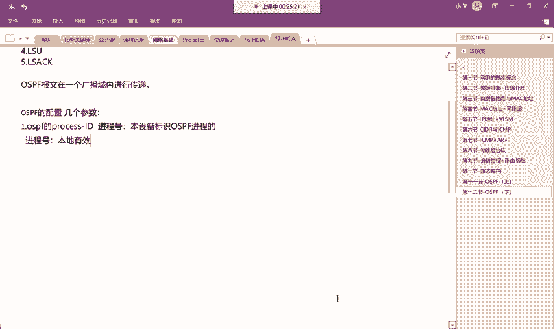

这是进程号，那么它长什么样呢？我们可以来看一下。嗯，这是我们的R1。那么R1，首先我们给它命个名吧，命名就叫R121。首先我们OSPF敲一个问号。

我们可以在这里看到一个我们所说process IDD看到了吗？这就是进程号。对于进程号来说，我们可以写1到65535之间的任意一个数字数字。

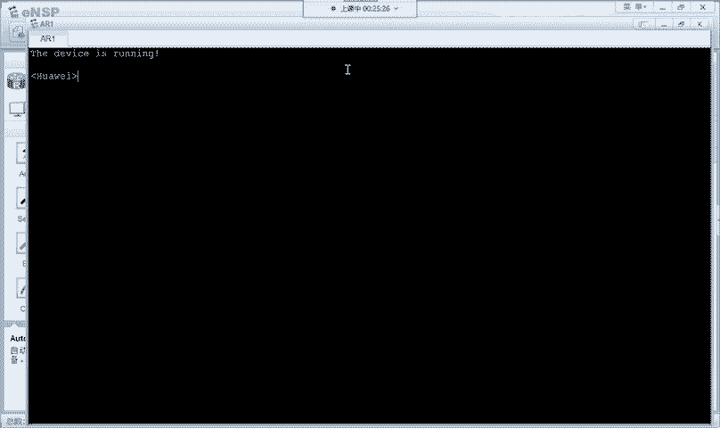

数字数字。那么我们通常来说呢会写十或者写100，这是比较常见的。通常咱们就从十开始吧。呃，对于很多协议来说，咱们都会有默认的一些大家的配置习惯。因为这样比较好记，能明白吗？这是我们所说OSPF10呃。

我们现在呢首先在十以后，我们敲个空格再敲个问号。我们可以在这里看到一个新的参数。这个参数是什么呢？叫做rotor IDD这个rotor ID呢是我们要讲到的第二个参数。

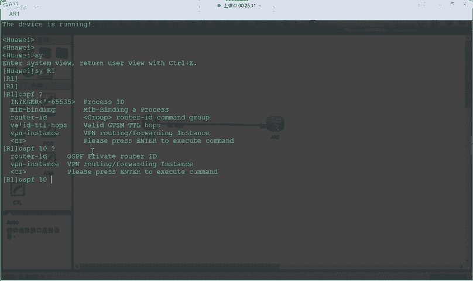

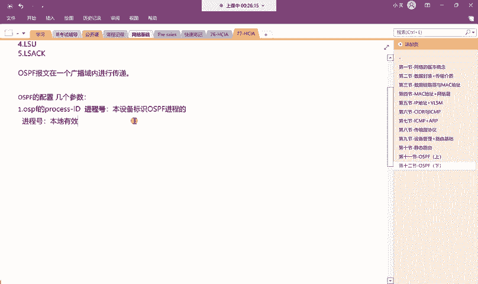

啊，我直接复制吧，我实在是不想敲这个英文啊，叫做rotor IDD。那么它是一个什么意思呢？

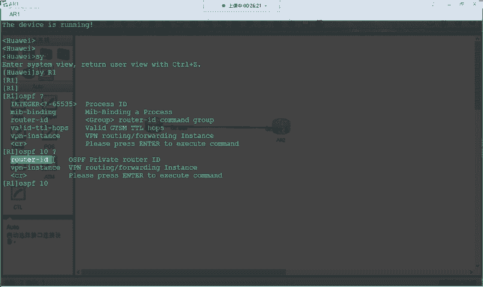

好，我给他复制出来ro IDro ID为何意啊。同学们是我们ro是什么？是路由器。那么它的I就是标识我们现在路由器它的一个I号吧，一个名字说白了我们就叫做路由器I。

就叫做路由器 ID那么我们指的是OSPF的ro ID啊啊，为什么这样强调呢？未来你们会学到其他的我们所其他的路由协议中也会有ro ID的概念，我们今天讲的是OSPF里的啊。

那你说老师这个ro ID我是不是必须要进行配置啊，或者说咱先讲配置之前我先问问大家，你们觉得ro ID为什么要有这个东西，大家知道吗？嗯上节课的时候呢，跟大家画了几个图。

之前我我说过写了一个什么信息的产生者冒号R1，你们还有印象吗？信息的产生者冒号R2然后这个信息通告的是什么信息，那个路由好像是3333，我不太记得了，总之呢这里我们会有一个我们所说名字的标识。😊。

那你说老师这个名字的标识怎么去标啊，是不是我这个设备给它命名成R1ro ID这个详细内容就是R一产生的呀。不是我们设备必须要有一个专门的数值来去标识每一个设备，他们的ID号。

为什么因为未来你是不是设备上要产生相应的LSA呀，那么你现在有一个ID号，你未来所发送出去或者说通告出去的所有数据都是跟你的名字挂钩的，这就相当于是你们很多人在一个在一个屋子里相互说话啊。

交流一些情报共享。那么你们每一个人共享的情报必须是要有源头的。我的周围有一个苍蝇啊，必须是要有源头的。那么你们每个人要为你们最终共享出来的信息负责。那么我未来呢计算路由表，我也得找到你啊。

所以这个信息是很关键的。那么它标识了你这个设备未来啊，你们学到IP会学习这个设备怎么去计算拓扑啊，它处于什么位置啊，这是一个非常关键的参数，所以对。我们OSPF来说，对它是有严格的定义的。

也就是信息由谁产生这个产生者的ID是多少，我们是必须要有一个ID号的。那么也同样，因为我们每一个设备，未来产生出的LSA肯定是不同的。所以我们ID号肯定不能相同。你不能说呢。

我未来这里我跟大家举个简单的例子。我未来这里我这儿有一条路由，我呢产生我所说呢我要通告这样的一条信息跟你们进行共享，结果我的名字呢，比如说啊我的名字叫什么，我叫2。2。2。2，这个是一个固定的格式。

等一下跟你们讲然后呢，这台设备叫什么呢？这个设备也叫2。2。2。2。好，那么我现在呢通告了一条这样的信息。好，通告出来未来呢设备之间我们彼此进行交互。然后我们R一收到了啊，我们总之呢我也看到了。

看到了一条LSA唉，是我自己通告出来的。但是我一看我设备后方并没有这个信息啊，那我就会认为呢我实际上没这个信息，我就会重。进行一些信息的更改。呃，你们未来呢学到一个学到IP阶段会有一个震荡的问题。

那么整体的LOSSA信息它也是会有LSDB也会有一个震荡的概念，就是我们同样两个设备名字如果一样的话，那么首先整体的进程它就是会出现错误的，就相当于你在一个环境下，俩设备不能重名是一样的。呃。

这是说的比较多了，以后慢慢学吧。那在IA中你们就知道两个设备呢不能root ID一样，不能一个名字就O了。因为这是作为身份的一个标识。好吗？如果是一样的话，这信息究竟是你产生的，还是我产生的呀。

这是要有一个我们所有一个概念的，也就是未来我们产生的LOSA会跟你的ro ID关联，所以不能一致。那但是这个东西必须要我们来配置吗？同学们我们来看一看啊，首先如果我们要配置的话，它的格式是什么呢？

我们敲一个问号，敲一个问号，大家会看到我们现在有一个什么呀？我们现在是不是整。

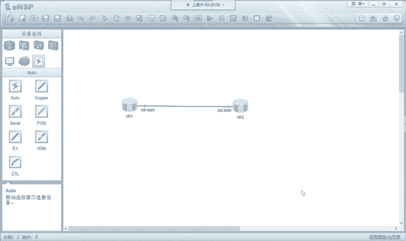

整体来说，它会有一个这样的格式啊，它让你写1个IP addressdress，也就是IP地址的格式，也就是差点差点差点差，这是什么格式？点分十进制四位的二进制数吧，对吧？跟你的IP地址是一样的。

但是请大家注意，对于我们整个设备而言，对于我们整个。root IDD而言呢，它跟我们的配置格式是这样的，但它跟IP地址没有关系。嗯，但是呢首先我在这里呢，首先咱们先把干什么呢？

我先给这两个设备配个互联地址吧。12跟我们所说R122。首先我们先把他们的地址给大家配上。比如说左边这个地址呢是12。1。1。1好，那么右边这个设备，我也给他写一下吧，先写一下吧。呃。

右边这是我们的R2刚才忘配地址了，0-0-0如果不配地址的话，这点还没法跟大家说，呃，address12。1。1。2好，俩给它配成通网段的，咱先不看R2啊，先看R1地址呢，我们已经配上了之后呢。

我们再去看OSPF好ro ID我们敲个问号，他需要让你配，但是我们这先不配好吧，我们先把这条给它删掉，我们直接呢进到OSPF咱们看能不能进来。我现在呢没有配置ro ID但是我们好像进来了，对吧？

那么进来了以后有同请问同学们，我没配，但是请问现在我的设备有没有ro ID。😊。

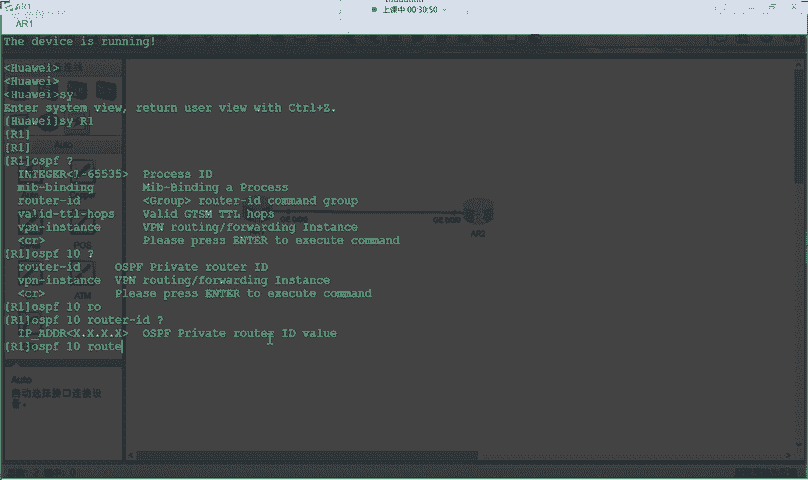

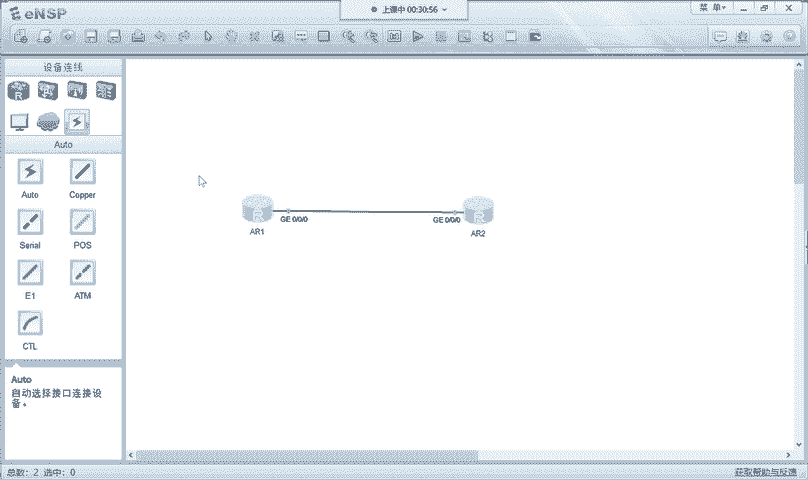

いや。大家想一下这个问题，我没配默认1。11。1吗？好，我们来看一下啊，那如何去看我的ro ID是多少呢？我们有一条简单的命令，我们可以简单的去看一下display我们的peerOSPF。

不好意思diplay我们的OSPF我们简单查看一下我现在OSPF的邻居那你说老师查看邻居就能看我的ro ID嘛？可以，因为我看的是不是我本设备的OSPF进程中我的ro ID啊，所以我们现在是可以看到的。

他这里写了OSPF进程号10，我现在呢是我这样的一个ro ID12。1。1点1，我的邻居的状态啊当然了，我现在没有邻居，我还没写呢，对吧？还没进行配置。

大家会发现我们这里是不是有一个我们所说有一个默认的ro ID呀，那么这个ro ID我想大家也能看出来它跟我们什么有关系啊，跟刚刚我配置的R1的右接口有关系，对吧？所以我们ro ID呢它有两种方式，😊。

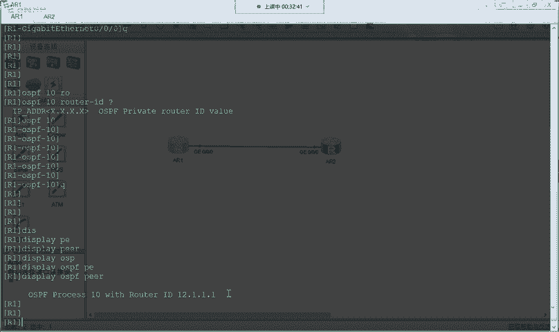

啊，也就是我们的RID它有两种生成的方式。那么两种方式分别是什么呢？首先来说第一种，第一种呢它是我们人为配置的。呃，第二种，当然咱们没人为配，一会儿呢咱们再配。第二种呢就是我们自动产生的。

那么自动产生如何产生呢？是由我们系统的root ID去决定的。好，这会又提到一个新的词，叫做系统的ro ID好，那么我请问同学们，刚才有同学说默认是接口的那大家知不知道为什么要有这样的一个规则呀？

系统的root ID就是我们设备呢，它自动产生的，注意是设备自动产生的root ID但为什么我们要有这样的一条规则呢。跟大家说一下，那么系统的rota ID呢，这是华为它特有的一个参数是自动产生的。

那么如果你在一个路由协议中没有人为的指定root ID它就会借用系统的root ID来进行标识。嗯，大家要想一下，我们今天所讲到呢只是OSPF但是未来你们会学到其他的路由协议。比如说ISIS啊。

比如说BGP啊，那包括未来呢你们如果学思科的话，会学到。EIGRP那每个路由协议，他们实际上都会有一个root ID的概念。这个首先要跟你们清呃说清楚啊。因为所有我们所说呢路由来说，我们产生了一些信息。

最终通过我们不同的协议机制进行数据库的同步。那么最终我们每一个设备都会产生信息，所以各种不同的协议之间，它都会有一个相同的概念，即使它不叫这个名，但实际上他们也是同样的名字。

都叫root ID这样的概念以及名字都是不会变的，是有这种可能性的，并且确实是这样的。他们在其他协议中呢，每一个设备进程中也是要有不同标识的。所以呢华为为了方便我们每一个协议。

再去进行我们root ID配置的时候，为了方便。那么如果你没有人为指定root ID它就用设备本身的root ID来去进行处理。呃，那么我们所说对于系统的root ID怎么看呢？我们可以直接回到视图下。

因为你大家请看。

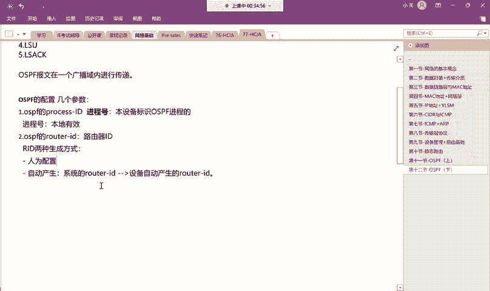

啊，现在对于设备的还是一个接root ID当然是设备的。大家请看啊，对于2一上来说，我们刚才查看的是OSPF的邻居，也就相当于我们其实看的是OSPF进程时中，我设备的root ID叫12。1。1。1。

那怎么去看我的设备本身的root ID呢？在我们系统试图下，我直接displaydiplay。displayroot ID我们就能看了啊，可以看一下啊，我们这是两者不同的命令。在设备系统试图下。

直接查看设备的root ID现在也是12。1。1。1，也就相当于我们刚才没有给OSPF进程时指定root ID那么它这里的OI这里的root ID就是从我们系统的root ID中借用的。

这个你们要知道是借用的。那么这样的一个地址，它是怎么产生的呢？我们来看一下啊这样的一个地址它是如何产生的呀？非常的简单，它是我们设备上第一个up的接口。请大家注意我这句话啊，这个笔记我就课下再写了。

我整台设备上第一个up的接口，会成为我们现在设备的ro ID那甭管你这个接口是一个物理接口还是一个还回接口，只要这个接口第一时间up，那么它就是我设备默认的root ID这是我们的一个规则。

那么有同学可能说老师如果我多个接口同时up呢，对吧？我一个设备本身比如说路由器要重启了，设备所有接口本身都插好的，我开机所有接口都up了，那么怎么办？我们会优选IP地址最大的。

成为我们整体设备全局的root ID是我设备的root ID选IP地址最大的谁第一个up的就是它如果多个接口同时up谁的地址最大就是谁，因为这个其实没有太大的，我们所说它并没有太大的一个必要性。

也就是它的。大小地址的多少，只作为一个设备标识，所以他选举的规则也很简单啊，选最大的好吧，这点呢你们要首先知道一下。嗯，对于我们root ID来说，它有一个特点，请大家注意啊。

root ID来说它有一个特点，这个特点是什么呢？特点就是root ID一经确定哈，一经确定我指的是OSPF的root ID啊。我这里跟你们写清楚OSPF的root ID它的特点就是一经确定。

我们必须干嘛，我们是除非你的进程重置。

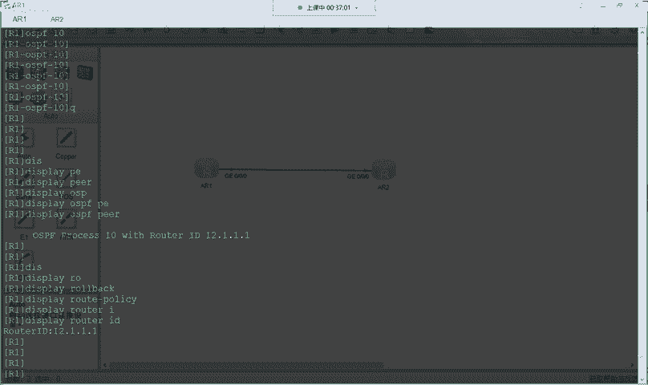

一旦经过确定，除非我们所说进程重置，或者说设备重置吧，设备重启或者我们OSPF整体你的进程重置。那么在此之前，否则啊它是不会改变的。大家知道为什么不会改变吗？你们想一下这个问题。

其实我刚才跟大家说了很多啊，IP地址最大后8位还是一位最多的，整体来说最大的同学们整体来说是最大的呃，能明白我的意思吗？当然是从第一位开始往后去比了呃。😊，这个同学们。

我们所说呢并不是后八位还是一位最多的，因为它是32位的二进制数，能理解吗？同学们32位的二进制数在每一位我标识的数值是不是不同的呀？这比大小简单的这个很困难嘛。同学们，我们以每8位为组来说。

每一位0101，我们就这样去比就可以了。你当然可以直接比十进制十进制。如果你觉得呢不够形象，你就去比二进制也是OK的。这大小。这个大小有嗯，我没太明白啊，没错。

就是这个下边贵阳的这个同学说的就是这个意思。好吧，这这个没有什么可争议的点，也就是一经确定，除非我们设备重置或者OSPF协议重置了。那么否则这个号呢，我们所谓ro IDD是不会改变的。

我们来验证一下我刚才的说法。

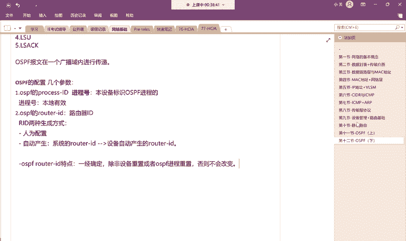

也就是现在呢我OSPFro ID呢是12。1。1。1，我希望呢给它进行一个变化。也就是我们通常呢对于OSPF来说，我希望我的root ID一般都是比较简单的。我们在做实验的时候，通常是这样的。

如果是设备一，我们就把它的ID写成1。1。1。12的话，就是2。2。22。因为未来呢你们做实验可能里边会有七八台啊，甚至说十几台设备，你们都可能要做进行实验。那么你们要看大量的LSA信息。

看LSDB检查里边各种数据，谁产生了几类的LSA啊，你们要看很多的数据，到了IP中啊都会看的。所以呢你们要确定的就是一旦我看到第一眼看到这个root ID我要立刻知道这个信息是谁产生的。那么为了方便。

我们通常都是直接去把R一的写成1。1。1。1好，我们向下回车。这里呢他给我们谈了一些消息，他说什么呀？唉现在你的配置已经成功了。但是你需要。

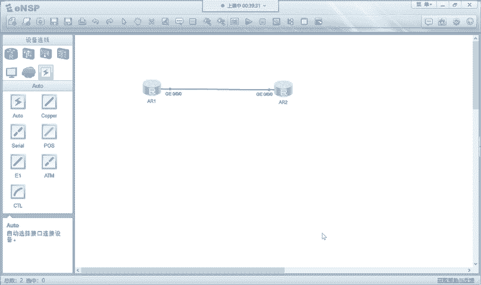

干restar需要重置我们重启OSPF的进程，然后才能修改成我们新的ro ID。那我现在很明显我还没有进行重置，对吧？如果我没有进行重置的话，我现在依旧还是去看一下我们OSPF我整体的邻居。

我们看一下我现在是多少，我还是12。1。11，看得到吗？我是没有修改的，虽然我这里已经改成了4个1。但我这里还是12。1。1。1。那么现在我怎么办呢？现在我需要进行重置。那么对于OSPF进程重置的时候。

我们需要退回到我们最最基础的用户视图进行我们所说的重置叫做reset。好，看一下re我们OSPF我的整体所有的进程，我是需要把它进行重置的啊。processPD了，我打错了是吧，我说怎么出不来呢？

process现在他要问你是否确定呢我们输入y确定即可，那么我当我们修改完了以后，我们进入我们现在所说我们进入到系统图下，依旧我们还是去查看刚才的这样的一条命令，我们可以看到我的I已经修改了。

但是我们如果去查看我们现在刚刚所说到的root ID呢，也就是我设备上本身我设备本身上的ro ID我们来看一下啊，我们还是12。1。1。1看得到吗？

也就是我设备接口呢依旧还是我设备的ro ID但是呢我们OSPF进程的ro ID此时跟我设备ro ID就不同了。是这个意思能理解我的意思吗？同学们能的话给我刷个一comit呃。

我们现在这个设备不需要comit这是比较咱们现在还没讲到比较高级。的一些设备啊，咱们IA中呢接触不到嗯。之前呢还讲BFD的时候会接触到这个命令。现在整体咱们I阶段见不到提交了啊，因为我们讲的设备也好。

命令也好，比较基础。OK那么我们说了这么多，告诉你们的就是只配IP地址，你不开启任何协议进程，它也有ro ID，但建议大家手动配置，好吧，建议你们手动配置好，那么现在请大家注意啊。

我们现在整体我们OSPF进程已经打开了。我们今天呢在这个设备的接口下抓个包我们来看看是什么效果首先抓个包抓个包，我们可以看看啊，这个设备上现在是不是已经开始往外发报文了呢？大家猜一猜开始发了嘛？

也就是我现在设备你看进程都打开了，按理来说大家都听过，好像呢他得发一些什么哈lo包，哎，现在好像没法对吧？抓包没有任何内容，为什么？因为我们协议还没有真正工作。虽然你打开了进程没有工作。

那么我们所还要接着配置，接着配配什么呢？我们这里会有一个区域的概念。嗯，对于我们现在这个图中来说呢？R一和R2最终我们要建立一些邻居关系，同步一些相应信息，最终建立一些拓扑啊数据库啊等。

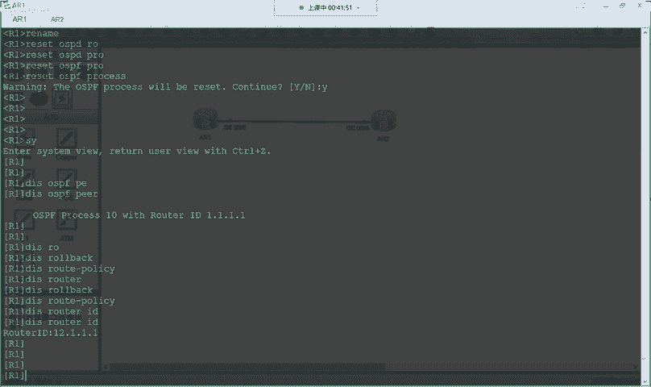

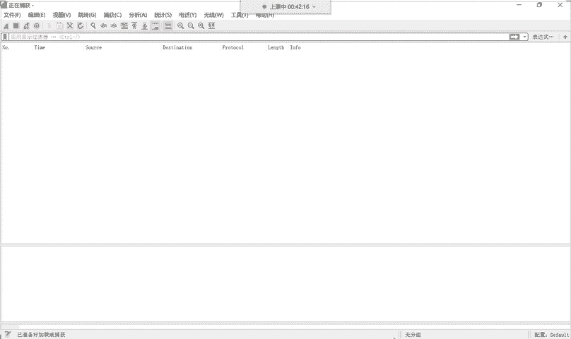

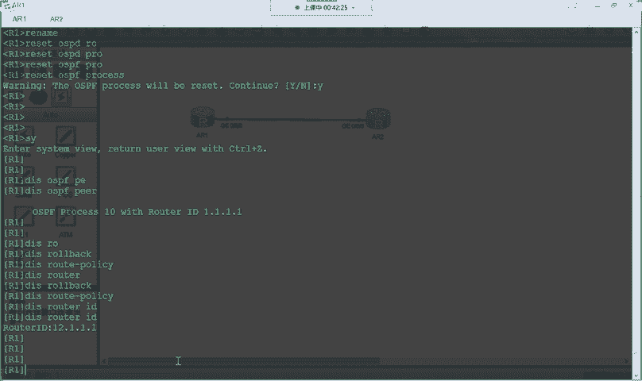

等的但我们能够同步数据库的前提条件是这我这是我们所说两个设备。之前呢我们画的图是三个设备，对吧？这两个设备呢，我必须要属于同一个区域。如果在不同的区域中注意我划一个范围，它们必须属于同一个区域啊。

但是请他注意，我划的是一个接口的范围。也就是我彼此之间想要去同步数据未来互相我们所说要发送数据的这个接口，我们如果想要去同步数据库，我们的前提条件，我们要在一个区域内，如果不在一个区域。

我们信息是无法同步的。那么这是我们注意的第一点，其次就是我们运行OSPF协议的时候，它并不是说说什么呢？嗯R2它呢属于一个区域，属于区域几呢，区域0R一属于一个区域，属于区域几呢？比如说属于区域一。

不是这样的。对于我们设备来说，我们OSPF是通过接口划分信息的。我们OSPF也是通过接口划分区域的。那么如果现在相邻的两个这两个我们所说设备，它的两个接口要去建立邻居关系，必须保证这两个接口。

他们所属的区域号是一致的。如果不一致，没有办法建立邻居关系，这是我们所说的第三个概念，我把这个给你们合并一下啊。以接口为单位，可以这样理解。第三个就是我们OSPF它的一个区域号，我们叫做area啊。

我不知道这个怎么念，应该是这样吧，area这是一个区域号的概念，叫做区域号。啊，区域号。那么这样的一个号呢，如果我们的区域号相同，大家别给我发音标了啊。如果之前我念到这儿有个同学给我发了个音标。

我觉得贼贼有意思。区域号相同，我们则为相同区域啊，则为相同区域。那么对于我们整体LSA这是上节课跟大家提到的这节课呢，首先咱们再来看一下，对于我们LSA来说呢？如果我们要进行同步同步的前提条件，注意啊。

同步的前提条件我就是必须要在相同的区域中如果处于不同区域，我们是不会进行数据同步的。那么大家知道为什么是这样吗？老去查英语是什么意思啊，这就是区域的意思。这这个就是正正常的翻译，没有任何呃技术上的。

我们所说网络中的这种特殊翻译，没有，它本身就叫做这个如平时打游戏的话不会常见这个词吗？呃，我们来说一下，为什么OSPF要划分区域，它有什么样的意义，你们知道吗？作为路由协议来说。

我们都知道不同设备可能是设备多了。咱们之前讲静态。我想要设备之间互相通信啊，或者说我希望最终我们实现一些比如说路由，我要进行通告啊，我设备身上有一条，我希望其他设备都能过来。

我难道要在每一个设备上都写静态指到我这吗？一一条一条的纸太麻烦了。所以我们要运行动态路由协议。我们呢彼此之间一开启协议啊，我们今天学到宣告的方式，一宣告啊，大家呢都会进行数据的同步。

那么独立计算路由表多么好的一个方式。也就是它本身就是适用于我们大型的网络中的。但是大家也要知道，作为我们所说一个大型的网络，如果你现在所有的设备全部都要在一个我们所一个范围内，大家都要交互信息。

比如说我现在30台设备，40台设备，50台设备啊，甚至再多一些的设备。我每一个设备都会产生自己的LA吧，以及我所知道的其他网段的LSA我。要通告出去啊，都要告诉其他的设备。

那么每一个设备都会接收到大量的LSA那么每个人我们都要进行最终LSDB的同步吧。所有整个区域内数十台设备最终同步的都是一模一样的。那么大家请请思考一下它的计算量会不会很大呀。

我的设备本身要发送要接收的报文都非常多，并且我要进行计算的时候，我也要计算非常非常多的信息。那么最终对于我们设备来说负载负负担或者说负载有些大。并且对于我们未来的一些业务而言。

其实我们没必要让每一台设备都要跟所有其他设备进行同步啊当然我们I不会讲这么深，大家就要知道，我们此时对于我们整体的区域如何做一个控制呢？我希望呢不同。比如说呢未来你们面对一些大型的项目。

你会发现一部分的设备可能模拟某一块的业务，它负责某一块的业务。彼此之间呢，我们只希望在一个小型的范围内，他们比。此同步就好了。那作为我可以把整体的范围缩小一些。你的LSDB呢整体要同步的地方小一些。

为什么？因为我们只有在同区域下才会进行LSDB的同步。如果不同区域，即使我们处在同样的1个OSPF整体的进程，或者说整体OSPF的协议当中，我们是不会同步LSDB的。这个你们要知道。

它是为了去优化我们设备的性能。嗯，骨干区域什么什么的，如何相同区域如何定义会有区域号啊，如果属于同一个区域，你看区域号相同，则为相同区域，区域号会有一个数值。这等一下命令我们会讲到，好吧。

这是一个how概念。在我们IA中，骨干区域什么什么的防环防环这个概念，未来你们会学习到OSPF你大家所说的防环，如果是区域间防环，我们是用骨干和非骨干进行的区域间的防环。

区域内的防环指的就是我们FPF算法，在我们同区域内，基于这样的算法本身就可以实现防环。因为你们计算的是一个树形路径。但是我们IA中不会讲到，因为最终你们所有的路径，你们最终计算出来都是这样的一种方式。

什么叫环路啊，同学们环路一定是你里边的某个节点最终是不是出现了闭环，它才可能出现环路啊，但是对于OSPF来说，每一个节点都会保证你去往每一个节点不会产生环路。就相当于你看你想去往。

我给大家举一个简单的例子啊，比如说你从这个节点想要去往这样的一个节点。那对于你现在这个设备计算的整体的树形路径来说，你只有这一条路可走。但如果说呢你看啊咱们只是简单。打个比方啊。

如果你这里边有这样的一个我们所说这样的一个路径连起来了啊，如果说连起来了，最终如果出现了闭环，它就有可能产生环路。但是SPF算法它是不会产生这样的闭环的。

所以域内也就是我们所说一个区域内它是通过算法进行防环的啊。不同区域间我们会有不同区域号。骨干和非骨干之间可以去防还。那么它会有一个非骨干非区域零必须跟区域零挨着，不然的话呢会产生环路。

到时候你们会学习到序连接啊等等。我们IA中不会讲那么多啊。嗯，好，我们现在说一下，对于我们IA阶段，我们只会学习一个区域叫做骨干区域，叫做骨干区域。骨干区域其实指的就是我们的区域0。

那么区域零是我们整个OSPF必须要有的区域，注意必须要有的区域，可不是说因为它数值小，所以它我们所说必须要有，而是区域零就是规定的。OSPF的第一个区域必须是区域0。

因为未来你不同的区域都要求跟区域零相连。那么你们中间会有个ABR这样的设备，也就是必须要紧贴区域0，这是最最标准的OSPF配置的方式。区域零是第一个区域，叫做骨干区域。

那么其他区域叫做非骨干区域非骨干区域中呢，我们就可以自动的定义一些其他的，我们所说其他的一些区域，区域内呢自动的进行LDB的同步，他们跟其他区域，比如说啊一个设备区域0一个网络规划啊。

区域一区域零区域2，那么三个区域之间，它们彼此的数。数据库不会同步，能理解我的这个意思吗？同学们，那你说老师如果不同步的话，未来我们怎么进行信息交互啊啊。

以后我们会学习到其他的LSA那在你们IP阶段呢会学到三类的LSA我跟你们简单一说啊，简单说一下啊，免得呢很多同学总是好奇这个问题，也就是未来我们设备可能啊比如说十几台设备啊。

我们每一个区域中呢可能放六七台。啊，六七台设备。那么你说老师这个每一个区域内，比如说这个是区域0，好吧，这个是区域一，这个呢是区域2，咱不做细讲，只是跟你们简单说一下。那么他们彼此之间呢。

数据是可以同步的啊。还有一个概念要告诉你们，我们一个区域内呢，你可以多台路由器可以有多个我们所说多个广播域，你可以选择任意连接的方式，包括你这里还可以连接一个交换机。

连接完交换机呢会有一些其他的我们所说会有一些其他的连接方式，网络拓扑形式。那么在我们整个区域内设备是会同步LSDB的。那么它们中区域一中，他们之间彼此同步，区域二中，他们彼此之间同步。但是请大家注意。

未来不同区域之间，我们会有一台设备，唉，在这个位置我们会有一台设备，一个接口呢属于区域2一个接口属于区域0。这里也会有一个设备，一个接口属于零，一个接口属于一，那么它们也会彼此之间连接起来。

那么设备我们所说。不同区域间未来进行交互，我们会由这个设备呢下发一个三类的LSA，但是我们现在不会细讲啊，也就是它会实现你这个设备虽然不跟这个设备同步路由信息，但你去访问到它也是没有任何问题的。

能明白我的意思吗？你也能找到，只不过你不跟它同步而已。区域间如何访问这个你们到了IP会学好吧啊，到了IP呢我们OSPF大概要讲七八节课，也就是大概20小时左右的课时。

专门就去讲各种LSA我之前跟大家说OSPF我应该说过了。学OSPF就是学LSA它远远不像我们IA学的这么简单，以大家不不需要着急，好吧好，不需要找直接访问直接访问啊，非常好啊。

因为我们所说协议本身呢它机制都做完了，对你来说真的就是直接访问啊，不需要你进行更多的配置。你宣告完了，它自动就交互了，只不过机制，你们未来会学非骨干区域我们通常就称之为叫做非零区域，统称叫做非骨干。

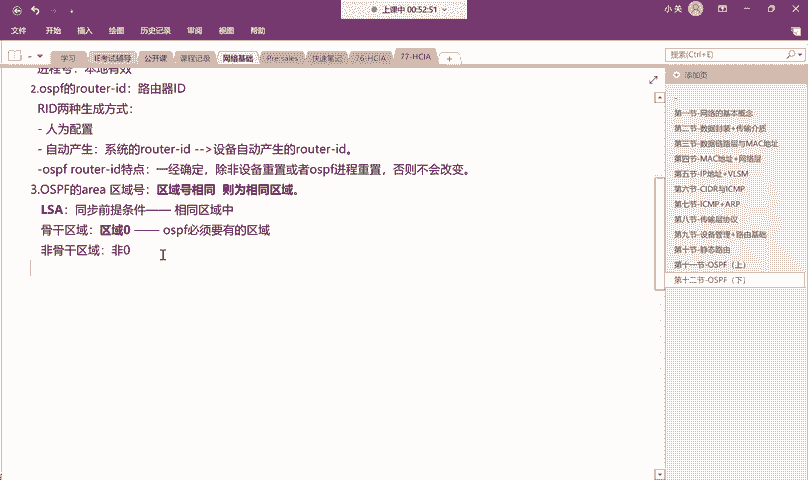

甭管你是几，只要不是零，就是非骨干。所以我们对于设备来说，开启进程号以后，我们是需要去把我们整体这个进程去给它进入到它的一个区域的。有我们所说进入这个过程，实际上就是创建的过程叫做ar0。

那么们敲下回车，大家会发现我们现在就已经进到了R1上OSPF进程时的区域零中。好，现在我们才算是真正开始OSPF的配置了。好，那么我们所说好要开始配置了，但怎么配呀，这又是一个新的问题。请大家注意。

我们OSPF如果我们要去建立邻居关系，或者说呢我们要去生成一些信息，对吧？我们所有的信息都是借助接口的。这个我刚才说的时候，大家还有印象吗？都是借助接口的。那么换言言之。

实际上我们所有的我们所说所有的操作，或者说未来所有信息的交互都基于接口。好，那么有了我们这样的一句话的支撑那。那我们就接着说接下来的一些内容。啊，对于我们接下来呢就会要讲到OSPF我如何呢？

既然我是通过接口进行我们所说通过接口来进行我们整体的建立，或者说通过它帮助我们完成OSPF的交互。那么我怎么把这个接口放到OSPF里啊啊，我通过它建立关系，但是我如何把它放进去呢？

这就是我们第四个参数了，我写在这儿了，第四个参数，也就是我们现在呢OSPF我去建立邻居关系，或者说建立关系吧。我们建立关系是需要借助接口的，需要借助接口，那么也就是通过接口建立关系。

那么如何通过它我们所说变成好，我把这个改一下啊。

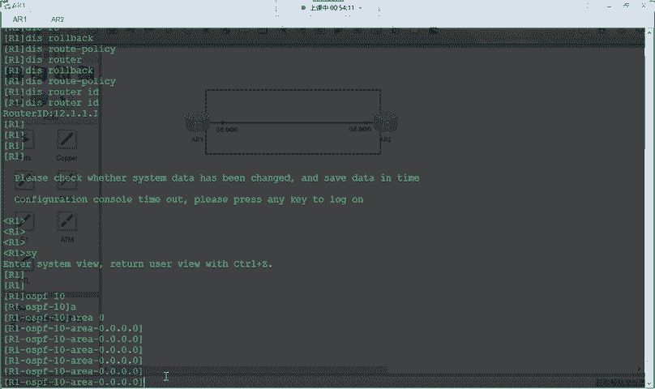

好，如何通过接口去建立关系呢？我们会有一个词儿，有没有同学知道是什么呀？叫做network。呃，我在打的时候 network这个词呢叫做什么叫做宣告，也就是OSPF实际上它的配置很简单。

就一条这样的一条就叫做宣告。甭管呢我是要去建立关系，还是未来传递一些信息，我们都只通过network这样的一条命令就可以完成所有OSPF的基本配置了，这个是非常简单的，宣告两种形式，一个一个来讲。

第一个呢叫做我们的区域下宣告，注意叫做区域下宣告，什么叫区域下宣告啊，也就是我在区域下我可以宣告当前我的一个信息。比如说啊举一个简单的例子，我现在设备一上这个接口我是不是已经指定了地址啊，啊，12。1。

1点1，那么我实际上下联我想要宣告出去的，不就是我现在有一个这样的网段吗？我有一个什么网段，12。1。1。0网段。所以我们在区域下宣告呢。

就可以去宣告我们现在整体我们所说的我我可以宣告我们接口的地址加上掩码也是OK的。宣告我们的网段加上掩码也是O的。那么我们这里就写接口信息。比如说我现在呢要去network宣告一下，宣告谁呢？

我现在这个接口12。1。1。1。比如说我要去宣告。那么除了接口以外，我还要去宣告一个新的参数叫做反言码，嗯，什么叫反言码呢？我们来写在这儿来看一下啊，对于我现在来说呢，我是12。1。1。1，对吧？

我是24位的掩码，咱写成呃这里不是通配符，同学们，这里就是一个非常简单的反言码通配符这个概念呢，我们在讲ACL的时候会给你们讲到，我们今天呢就是反言码，好吧，255。255。255。0，这是24位掩码。

它的一个标准的，我们称之为叫做正掩码，也是我们最熟悉的一个掩码。你在宣告地址的时候就是这样的。那么何为反言码呀，同学们。

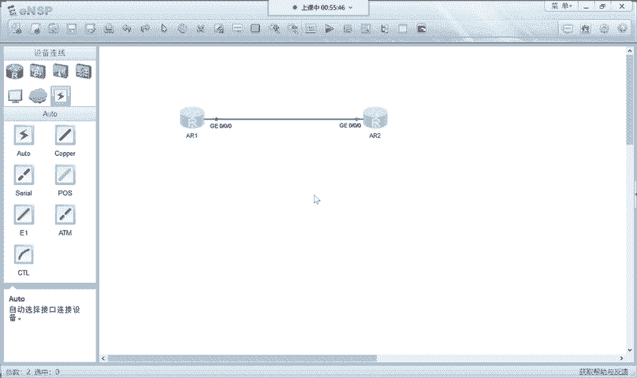

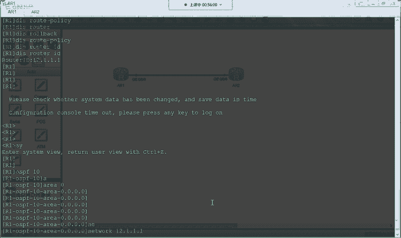

反言码非常的简单，反言码呢就是如果我的证言码是这样的，那么我的反言码就是拿4个255减去这样的一个言码信息得到的。为什么要反言码？这就是一个规定呃，乌龟的屁股听过吗？同学们，这就是一个规定而已。

没有什么为什么啊，0。0。0。255。那么关于未来讲的ACL中呢，我们会讲到一个通配符，但是到时候我们也会拿反言码这样的一个形式呢，在IA中跟大家讲，因为对于通配符来说呢？

以后你们接触到从细讲这个概念会到你们IP学BGP的时候才会细讲通配符了。所以对于我们IA中呢，你们去了解OSPF中反言码也好，ACL的通配符也好，大家可以先都按照反言码去记。

那么它的算法就是拿4个25减去证言码得到的就是反言码。所以我们今天在这里宣告的时候，我们也是很简单的。直接我们去宣告这样的一个我们所这样的一个信息就行，也就是0。0。0。255。我现在宣。

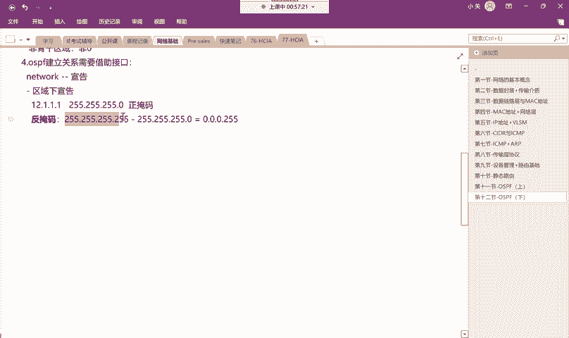

宣告了这样的一个网段信息。那么我们现在呢查看一下。好，这个之前这条命令呢没跟大家讲过啊，没错，01互变啊，因为要拿所有32位的一，你去减去现在的你也可以理解成零1互变也是OK的。因为反页码来说。

我们是不是要求零跟一是连续的呀。未来你们学到通配符的时候呢，会知道它呢可以要求零跟一不连续，这些呢以后再说吧，现阶段呢IA中学到的还是少，所以大家呢简单的东西一定要理解的深刻才行。好。

这是我教跟大家说一条新的命令叫做display this，对吧？这个好像之前讲基础命令的时候，没跟你们讲过，比如说现在我在区域零中执行了一条宣告，哎，相当于我现在是不是宣告了这样的一条。

我们所说这样的一条信息呀。那么我现在可以使用display this查看当前的我的一个配置。好，我们就可以看到我现在宣告了这样的一条信息。没错吧，这是我们这样的一个信息。那么我把它。😊。

格式呢给大家写下来，也就是我们今天会写到的。

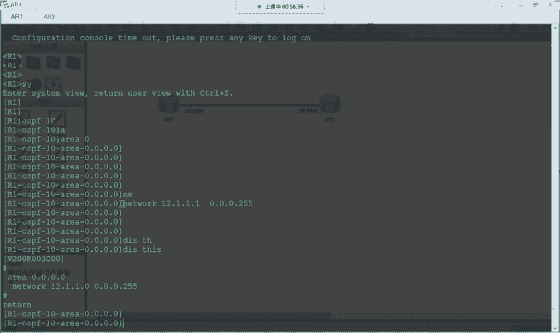

嗯，我想想放在哪儿，需放在这儿吧，nettwork，然后是我们的什么呀？前边就是我们整体你的一个接口信息，我写在这儿吧，接口信息。那么以及后边这个是什么？后边就是一个接口，我的反言码信息。好。

这是我们宣告的一个格式。接口所属网段的反言码是这样的。嗯，包括呢还有另外一种呃通配符这是什么意思？通配符这是什么意思？包括还有另外一种方式，也可以跟大家说，如果未来你们想比如说单独宣告某一个接口。

我控制这个接口启用OSPF协议，一个简单的宣告方法，我可以宣告，你们回去可以试一试啊，我可以宣告12。1。1。1哦，我甚至不需要去计算，我这样跟大家说啊，我说的几种方式，你们都可以尝试。

这里我可以宣告12。1。1。10。0。0。255，我也可以是12点1。1。00。0。255。包括还有一种方式是12。1。1。10。0。0。0，精确的宣告这样的一个地址就行。那么它也可以自动的帮你匹配上。

我们所说你下联的这个网段，大家知道为什么吗？也就是实际上大家会发现你的这条配置是。

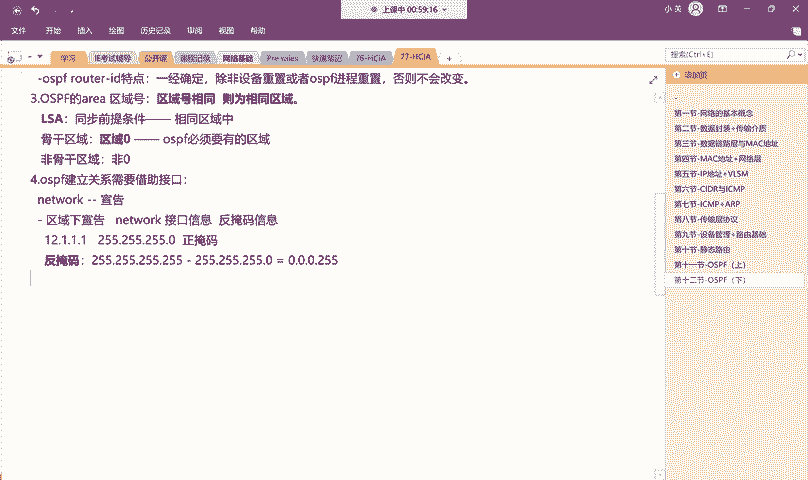

不是你需要没有什么区别。同学们啊，宣告接口跟宣告接口IP地址，宣告接口跟宣告接口IP地址没有什么本质的区别。同学们，我跟大家说一下是为什么，因为在你进行接口地址配置的时候。

你是不是已经配过我们所说我们所说的掩码了呀？虽然你写的是24，那你回去可以自己看一下你给一个接口配了IP地址，它里边是不是给你写成255点255。255点0啊，你们有印象吗？这个我之前跟你们说过啊。

也就是你虽然宣告了个24，但自动它其实就是这样的格式吧。那实际上你现在宣告的时候，是不是就是通过4个255减去的这个呀，其实这个计算设备自己是能算出来的。所以你可以宣告精确的这样的一个地址。

后边你不想算就4个零就行了。好吧，也就是未来你们可能会遇到一些23位的掩码呀，24位呀，27位啊，你觉得呢不好算，你不想算，那你就精确的IP地址加上4个零，它自动就会帮你计算你的反映码信息了。

是这个呃路由器每个接口。须属于一个网段。当然了，每个接口必须配地址，不是必须属于一个网段，每个接口必须配IP地址。那么你接口才能up物理状态协议状态双up。同时我们所说不同的接口属于不同网段。

这是路由器它本身的一个机制，因为路由器执行的就是跨网段转发，它查询路由表进行转发。不同接口未来我发送的数据肯定是不能属于同网段的。不然我怎么把它从另外一个我们所接口发出去呢。嗯，有事好的好的好的。

可以可以，没事，咱们也讲了一半了，回去补后半截就行了。走吧走吧。好吧，这是我们这一点。呃，那么讲完这种方式呢，我们再来看一下啊，我们现在呢可以把这样的一条宣告取消。因为我要给你们讲另外一种宣告形式。

怎么取消呢？我们需要and度啊，也是同样的一条命令，and do network就可以取消了。比如说呢我我这里我以为是192的12。1。1。0，然后呢0。0。0。255。我们先把这样的一条取消。

我们看一下取消了吗？取消了。现在区域零下没有没错啊，我们要在进行第二种宣告的方式叫做接口下宣告。呃，包括呢在区域零中还有另外一种宣告的形式，也跟你们说一下，回去你们可以自己尝试，但不推荐啊。

也就是在宣告的时候，哎，我我就不看这个and度啊，宣告的时候，你们可以一次性宣告设备上所有的接口怎么宣告啊，你可以宣告0。0。0。0啊，0。0。0。0，并且呢宣告我们的多少宣告0。0。0。0。

代表呢你可以把所有这个设备里所有的接口全部都宣告进。OSPF中呃，我的这句话大家能理解吗？也就是我可以把所有的接口都宣告进来，这样这样不推荐啊，因为呢我们所说这样的方式是很不灵活的。

OSPF之所以优秀呢优秀在我们可以对于不同的接口做不同的我们所说做不同的相应，我可以给它划分不同的区域做不同的事情，但如果呢你想偷懒，你全宣告也是O的。但是不推荐只是告诉你们有这种方法。好吧。

咱们先退出来啊，对于我们现在设备来说，我们已经创建了我们进程时，并且创建了区域0。那么我们有另外一种宣告形式。刚才这个呢叫做区域下宣告，这是第一种，我们还有第二种宣告形式，叫做什么呢？

叫做我们的接口下宣告。什么叫做接口下宣告啊。也就是我可以不在OSPF的进程中去宣告这样的一条信息，而在接口下哪个接口，我21，我现在就一个接口啊，0-0-0接口，进到这个接口下。

我在接口下可以启用OSPF。

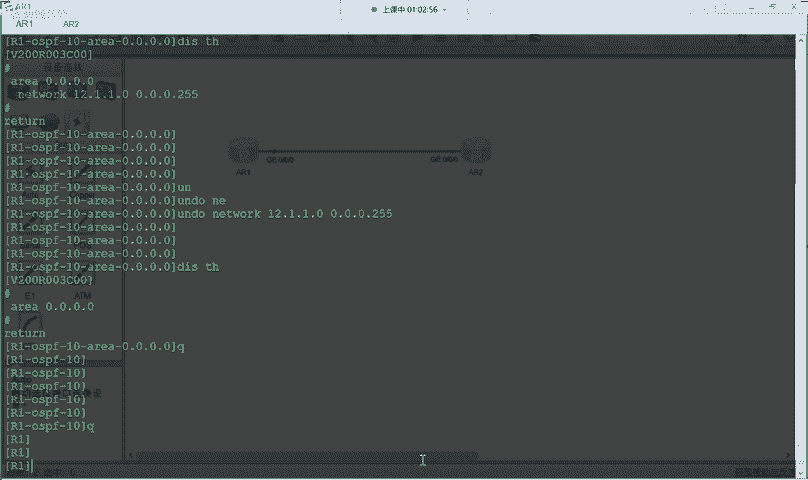

OSPF enable我要写上后缀进程号10，并且把它宣告进进程十中的区域零里。当我现在敲下这条命令，大家会发现我现在也已经宣告成功了。那对于我现在整个接口来说，你会发现接口的IP地址12。1。1。1。

那我接口现在在OSPF进程十的区域零中，我把它呢启用了，我们所接口下启用了这样的一条命令。呃，所以呢这是它的。

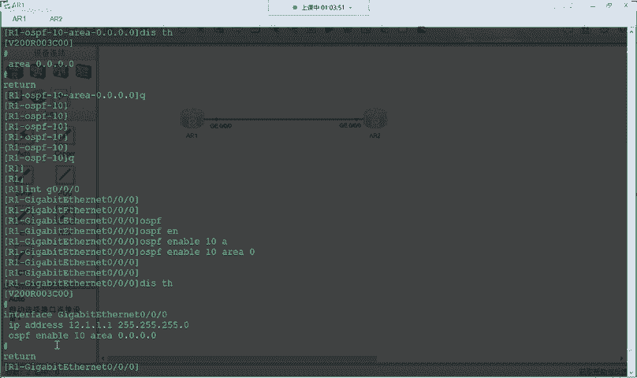

给他给大家复制一下啊，这是它的一条命令，我就写在这儿了。进入接口下，然后呢进到我们所说它的配置，就是我现在后边所写的OSPF加上我们所说十，这是什么，就是进程号。好，进程号。首先呢之后是区域0。

那么请大家注意，如果你要采用接口下宣告，它有一个前提，这个是你们必须注意的。呃。如果回去呢没有看我这个前提，你们会发现做不出来现象，到时候再来问我，我就前提跟你们说一下，如果你要使用接口下宣告。

必须先保证你要必须先保证全局开启了OSPF啊，开启了OSPF协议，并且呢你建立了该进程，并且呢你要创建啊创建注意创建区域0。可不是说呢你在一个接口下你一写OSPF10，然后0。

我在全局下就不需要开启进程了。你说老师为什么这样不需要呢？之前同学问过我这个问题。你说老师为什么我还需要这样呢？你看我在接口下已经把它OSPF进程号10了，不就代表我设备上有个1吗？

我也写了区域零就代表有区域零了。我设备上没有在全局创建OSPF over。0行不行不行，你们可以自己回去尝试一下，好吧。也就是你必须要先创建，你才能在接口下进行这样的宣告。

必须要先保健啊呃保证LSA和LSA这个是的是的啊。啊，没有，当然了，没错啊，如果你未来要先去划分微line，对吧？每个接口呢划分到不同微line里，你前提设备上得有这个微烂才行吧。那不然的话。

对于设备来说，他怎么知道你这个命令是什么意思的，是这个意思好，那么我们现在整体配置已经完成了。大家可以看到一些简单的。咱们说完这一点呢，稍微休息一会儿啊。呃。

我们现在只在我们所说只在我们设备一这个接口下开启了OSPF对吧？设备二干嘛了？设备二只是配了个地址，没有进行任何OSPF相关的操作。所以大家会发现我们在这个接口下进行了抓包，那么抓到的报文里。

大家可以看到，我们有一个protocol协议，这里标识这是我们OSPF的报文destination这里我们有一个目的地为224。0。0。5，这是一个目的地址，原地址就是我开启了OSPF这个协议，12。

1。1。1喝口水，等一会吸休息的时候就喝。这是我们的原地址，这是目的地址，大家会发现这是我们的一个主播地址。😊。

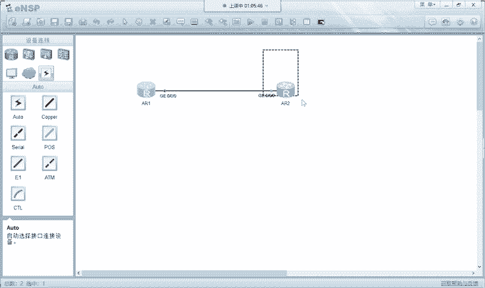

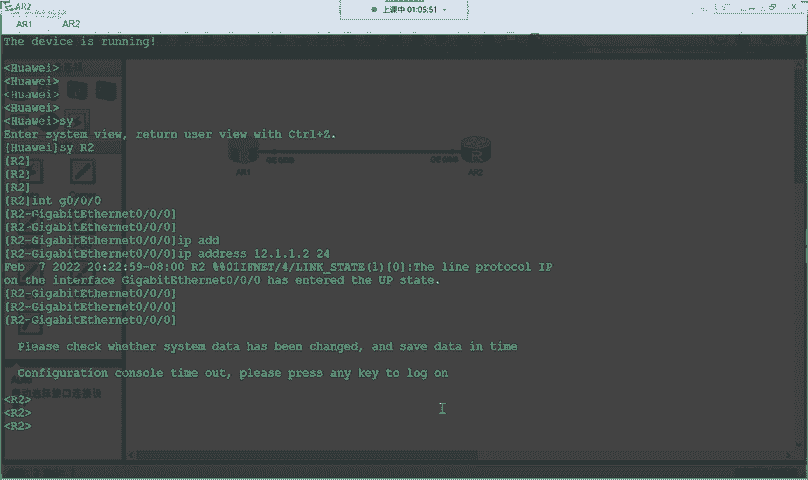

呃，对于我们OSPF来说呢，224。0。0。5，这是所有的设备，或者说所有的接口。我再去跟其他接口建立邻居关系的时候，我都会去发送的一个地址。这样的一个主播目的地址啊，当然了呃这句话呢放在IP中说呢。

它就不严谨了，因为还要区分网络类型啊，但咱们IA阶段中来说呢，就是我们标准的现在以太网广播型网络，我们是这样的。按照这个图来说啊。好，也就是我如果作为设备来说呢，我刚才在这个接口下启用了OSPF。

或者呢我在区域下宣告了OSPF。那么我现在整个设备或者说这个接口就可以接收224。0。0。5的数据了，我能接收了。啊，那么我们简单看一下报文的内容。咱我们不需要说太多啊，咱们简单一看就行。

我先把这个停了，发太多了啊。

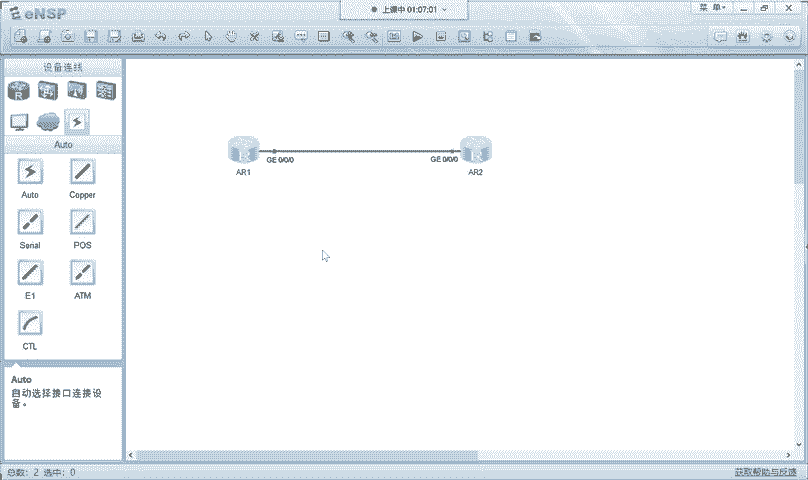

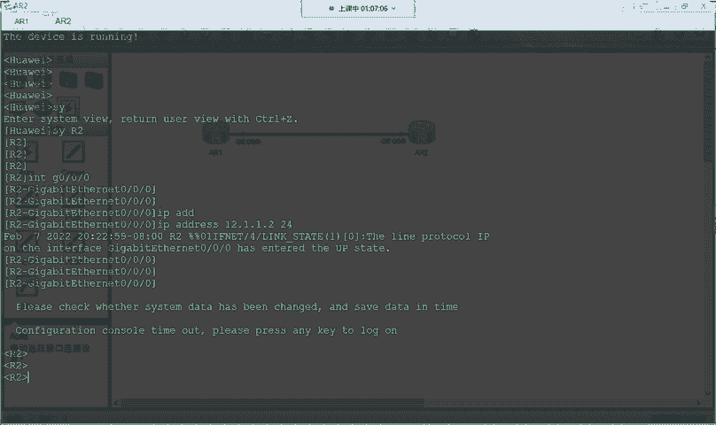

嗯，78不是79，78是什么意思？什么78什么79。你说的是什么意思？同学们我没没太明白78呃，78、89。我说78这个概念了吗？你是说什么？78呢？😡，啊，你是说这个78吗？这是什么呀？同学们。

这是不是ar呀？这是里边的一个长度啊，这并不是协议号啊。同学们，我们这个89在哪啊？89是不是在我们IP报头中啊，我给你们看一下啊，对于我们上层来说呢，是不是在这里啊。

我们OSPF我们作为一个IGP也就是我们内部网关协议协议字段，这是89，能能明白吗？是这个意思。协议号它是不会出现在我们这里的。好吧，因为这只是我们报文中一个小的标识而已，它没有必要展示在外边啊。

展示在外边的，一般就只有目的啊，时间，这是肯定的。原目IP协议，也就是我们现在这是一个什么报文啊，以及长度以及简单的一些信息。作为一个我们所谓协议号来说，它不太有资格出现在大型的展示中。😊，嗯，好。

我们看一下哈lo包啊。因为我们现在只讲到了我们所说今天讲的第一个哈lo豹文，对吧？咱们先看哈lo包，其他的豹文我就不会讲的太细了啊。因为这东西是你们IP学的东西，但是简单带你们看看哈lo包吧。因为这个。

其他的都大同小异。先看一个OSPFopen shortage pass first这叫什么呀？开放式的最短路径优先就是它。那么里边你们可以看到两种啊，看两种，一个呢叫做OSPFder看到吗？

head是什么意思啊，叫做头部的意思。主播地址在哪个接口，主播地址没有办法配置在路由器的三层接口上，没有接口，也没有任何。我们所说你能够把它配置在你的网卡上是不可以的，能理解吗？

这之前讲IPV4的时候跟大家讲过啊。呃，version4不是version two嘛？这不是version two吗？同学们version4在哪儿，你们说的我都有点懵，我还没没说到呢。😡，呃。

IAIPIE课程会详细讲rape吗？不会嗯，跟大家说一下啊，对于我们现在考试以及项目中来说呢，raip它都不会再作为一款值得我们学习的协议存在了。我们只会学习它的部分。呃，它确实没有太多值得学的地方哈。

我们只会把它当成一个相对来说比较反面的案例来去讲我们新型的我们所说的技术。呃，就像呢就像什么呢？就像现在已经不会跟你们讲真中剂这样的网络了。已经讲交换的时候，不会跟你们讲hab细讲它的一些使用场景了。

因为现在这些设备在逐步的淘汰，对于raip来说，使用场景也在逐步的变少，甚至来说呢，除了极小型的网络你已经很难见到ra了。那么你们现在学到的，为什么你们听过raip呢，是因为现在还有一些地方确实还在用。

但是非常少。其次它有值得拿出来说一说的东西，就像现在用hab也有地方用啊，等等下讲交换的时候会跟你们讲，比如说一些机械臂呀哈，一些工业场景下，还会用到这样的设备，但是面对于我们大型的组网组网环境来说。

这样的设备或者说这样的技术已经慢慢被淘汰了。你们想学旧技术是永远学不完的，能理解吗？同学们比如说。未来对接运营商，我们现在所使用的是PPPOE那么在之前我们用的是PPP以及HDLC。

那么HDLC后来经过思科的改良叫做cisicalHDLC但原本的HDLC没有学习的必要了，这技术还在，那学的话呢，你想查资料也有，但是这东西不会再用了，明白吧？就不会再用了，所以没有必要专门花时间去学。

我们学习为了学以致用嘛，你要会并且工作中掌握，那新的东西都学不完，为什么一定要把眼光着重于以前呢对吧？啊，说到这吧，咱咱不说太远啊，我们看一下，首先呢OSPFheadder这叫做OSPF的头部。

那么这个头部。名字打出来，它叫做头部，这个头部呢它是一个通用头部。什么叫做通用头部啊，也就是甭管你是OSPF的什么包纹，你后边可以是个滴D包，你是个LRULCCK或者是hello包。

你们都是有一个通用的头部的，能理解吗？呃，也就是我们所说不同的消息类型，头部它都是没有什么区别的。这是一个头。那么我们来看一下，对于下边来说，这个叫做OSPF的哈lo叫做hello包，就是很简单的翻译。

很直白哈lo包。我们现在所发的就是hello包。我们简单来看一下头部里都有什么内容啊。首先这里有一个2，我们用的是OSPF的版本。2，那么它是适用在我们IPV4网络里的协议版本。

其次这里有一个message type这叫什么呀？消息类型。如果消息类型，这里是一代表是个hello二是DD三是LSR啊，以此类推，45一共是123455个这里的44的它代表的是我们OSPF包纹的长度。

你们刚才在外边看到的78，那是我们整个报文总长度。再跟大家说一下啊，这里的我们所说partet lens是我们OSPF包的长度，头部加上hello的总长度总长度。好吧。

以及呢ro ID我们已经修改过来了，4个11。111我现在是谁发送的我们所说我现在发送这个接口发送数据的接口属于区域几啊，区域0一个接口只能属于一个区域，这个我要跟大家说，一个接口只能属于一个区域。

我们属于区域0下边这里check some校验和校验我们OSPF报文的数据，在下边这两个你们现在不需要知道这两个是做认证的。那么首先上边这是认证类型，那就代表现在没有做认证是空的，下边是认证数据。

也就是密码，现在也是空的，我们I中不谈认证，也就是所以这个呢你们作为了解就行。好吧，你们只需要知道OSPF可以提供认证就行了。那么未来为了避免乱接设备接入进来。一个非法设备。

他要跟我交互OSPF要跟我同步路由表，我不希望这样的一个设备接入进来。那么我们在预先配置的时候，可以作为我们所说先有的配置，我们可以做认证如果未来呢发送来的一个哈lo包，他想跟我建邻居。

他发的哈lo包里通过不了我的认证，那么很抱歉，你没有办法跟我建立邻居，所以这是OSPF比较优秀的一个地方，我这样说，大家能明白吗？那包括你去学习其他的协议也是OK的啊，这跟3A不一样啊。

同学们这跟3A不一样。3A指的是我们的肉认证授权以及计费，对吧？认证授权审计。那么它关于审计这样的一个服务，你是要需要上专门的认证服务器的。呃，认证这个东西呢。

其实你只需要提供认证方式以及认证密码就行了啊，不是3A啊，好吧，只是说呢大家听过这个词儿，不过还是非常好的好。咱们接着往下说，说完这点休息会儿，现在几点了，05了，已经好休息一下啊，讲完这点休息一下。

看一下哈lo包。哈lo包。首先这里有一个network mask，什么意思呀？我现在这个接口下联的网段，我的网段掩码是多少？24位的言码，这里有一个hello interval。

我们的hello时间hello豹文的间隔是10秒什么意思？我呢一个接口往外界发送hello包，我呢10秒发送一次啊，10秒发送一次，这是默认的时间间隔，这里有一个option选项位，那么选项位中。

我们在A阶段中不做讨论，所以也不展开给你们看了。rotor，我们所说路由器的优先级，也就是我们将来会讲到这节课我可能讲不到了，可能得下节课讲会讲一个DR这样的一个概念啊。

DR也就是我们未来呢会有一个我们所说这个接口我向外界发送报文。我这个接口是有一个优先级的。那么标识我现在这个路由器通。😊，或本接口发送数据的优先级，为了用于将来选一个叫做DRBDR的东西。

这两个参数呢可能要放在下节课讲，所以你们要知道哈lo包里边就可以携带优先级未来作为选举的一个参数。你们要知道在这里有这个东西就行，好吧。好，咱们饭得1。1点吃，下边呢是一个rotor带的in叫做什么呀？

我们哈lo包的死亡时间，上边呢是我们哈lo时间，打招呼的时间，下边是一个死亡时间，也就是哈lo报文的失效时间。这个之后会跟你们讲到什么叫做失效，也就是我每秒每10秒发送一次哈lo包。

如果未来呢我们建立了邻居，我们要互相发哈lo包，互相收吧。40秒我都没收到我的邻居给我发的哈lo包。我认为这个邻居挂了，他就不存在了。那么我要把他的信息从我现在的设备中删除，这是一个失效时间。

他们之间是一个4倍的关系。可以调。好，那么我们接着往再往下看好，接着再往下看呢，这里这两个参数。😊，这两个参数呢就是我们刚才跟大家提到的两个角色，一个叫做DR，一个叫做BDR。那么初始的时候。

请大家注意初始的时候，在我设备刚刚开机的时候，我要运行了OSPF向外界发，你会发现我承认这个环境中呢，现在是没有任何的角色的，看得到吗？也就是DRBDR都是空的，那我可以给你们往下看个报文。哎。

比如说我给你们看这个还是我自己发，但是你会发现在这儿我就把它填上我自己了，能看到我这脑共享密号，我们IA中不会讲这些东西啊。同学们抱歉这跟课程本课程无关的东西，我就不放在课上跟你们讲了。

感兴趣群里直接问吧，会有答疑老师给你们答呃，能看得到他们之间的区别吗？同学们，我给你们简单拉出来这俩报文，也就是我这是分组一发的第一个包，你会发现呢这里有1个0。0。0发现了吗？代表0。0。

0代表什么呀？代表未知还记得这个我说的这个参数吧。一个4个零代表全网所有路由啊，是这个意思吧。但是。😊，我们今天如果你们认为我刚才说的听进去了，就代表你们没好好思考啊。

我们这里的rotor IDD指的就是rotor ID就是我们所说它跟地址是无关的。我现在认为呢我们现在整体这样的一个。他的地址不能说跟地址无关，指的就是我们的接口地址。

所以你会发现刚开始他承认不是接口VIP啊，接口没IP怎么往外发包啊，同学们，我们报文是不是要进行原木IP的封装啊，我的接口没IP我怎么往外发包，我们三层封装完了才能封装OSPF吧。

三层的原IP怎么封装啊，这是不是有IP啊，同学们我三层肯定是有原IP的吧？原IP是不是我接口的IP啊，这不能学着学着回去了啊，这是我们IP层，为什么没有呢？是因为我们会有一个选举原则，那在最开始的时候。

我认为是没有的，但是如果过了我们超时的时间，还没有人跟我来建立关系，那么很抱歉，我就认为自己呢就是我们环境中的老大了，这个老大我们之后会再讲好吧，之后会再讲，也就是这是一个简单区别。

你们简单先知道一下就行。因为我设备中现在没有人来跟我竞选嘛？😊。

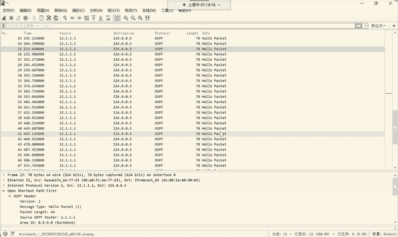

呃，行，咱们先休息一会儿吧，现在是不说时间了，正好我要打开我之前的那个计时器，咱们休息10分钟。

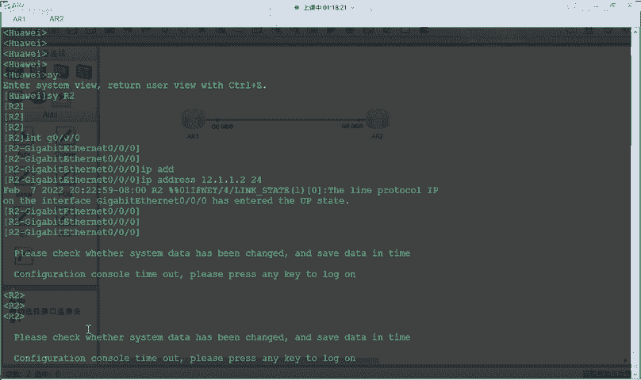

嗯，休息10分钟啊。呃，稍等一下啊。好。休息10分钟回来接着讲OSPF今天应该是讲不完啊，所以也不着急。重新开始OK咱们休息10分钟吧，休息10分钟回来，咱们接着说啊。是不是第五个就是自己了。

第五个就是自。把录屏开一下。

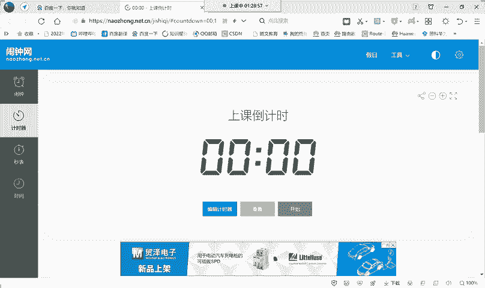

好。嗯，我们接着刚才的来讲，刚才呢给大家看了一下豹文，也就是OSPF中它的一些呃头部以及hello包，它的一些基本参数，对吧？也就是起初呢我们所说参数中它会有一些呃固定的一些参数，是需要你们简单的去。

掌握或者说简单的去记忆的。好，我刚才手跟我的电脑有了静电，然后我的扩展屏一下就闪灭了，现在又好了。好，嗯，我们刚才呢讲了几种我们所说的5种豹纹。那么在我们现在整个OSPF中呢，除了5种豹纹。

它还会有另外的一些参数叫做7个状态。这个大家听过吗？OSPF呢是5种豹纹7种状态，需要大家去了解OSPF的7种状态。

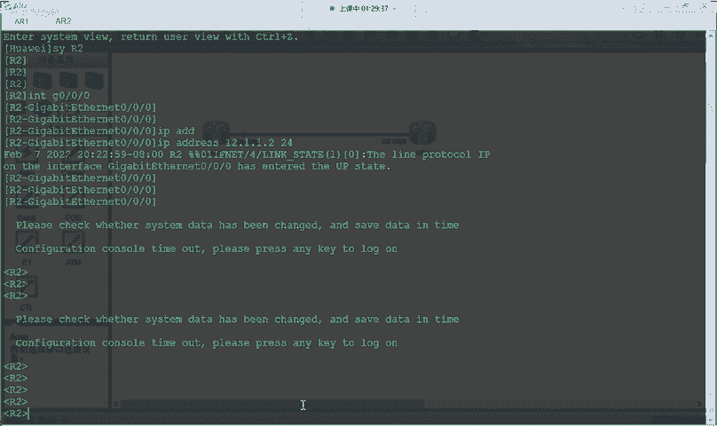

这个呢是要求你们每一种都必须要知道的。换言之，你们是必须要记住的。因为如果记不住的话，很多东西你们会比较难理解。包括以后你们可能去面试的时候啊，这个也是很不是说考试的面试啊，是去公司面试的话啊。

对于很多这也是很多面试的关喜欢问的问题。因为这是属于OSPF中比较基础的啊如果这个答不上来呢，基本上OSPF你就没学，就是这个意思。好，我们简单看一下啊，对于我们OSPF中啊。

我们邻居关系的建立以及维护都是刚才我们所讲到的哈lo包，这句话我就课下再给你们呃总结了，我们所说建立关系维护关系都是通过哈喽来实现的。那么OSPF中除了哈喽包，它还除了5种报文会有7种状态。

我们称之为叫做邻居状态机。那么大家首先要知道这7种状态指的是你在本设备上看其他的设备的状态啊，你们一定要记住我这句话啊，7种状态并不是指的我本设备现在的状态而。我再去看其他设备的时候，它的一个状态。

说白了就是当前对于我这个设备来说，我这个设备上的OSPF协议，我与其他设备的OSPF协议。在这儿其他设备的OSPF协议处于什么样的状态？处于什么状态，也就是我看对端，而不是我自己。好。

这一点你们首先一定要理解处于什么状态，是对端。对于我来说它是什么状态。那么我们一共有7种，这7种呢分别从最简单的啊，也就是最原始的down，到我们第二种叫做init到我们第三种叫做to位啊，to位。呃。

以及呢第四个呢叫做exstar。嗯，叫做ext TART哈ext以及我们所说的exchange。啊，打这个实在是太浪费时间了。同学们啊，因为可能是我的英文真的很差。

exchange以及loading和 for啊，好在不多loading和fo。负呢就是我们所说最终的一个状态了。一共是这7种。那么这7种呢，我们会从中间有一个分割线。也就是前三种呢。

如果未来设备和设备之间，我们处于to位状态，也就是第三种状态。那么我们就称之为我们设备和设备间，我们建立了邻居关系，注意建立的是邻居关系。那么如果最终呢我们处于的是负状态。

那么就处于我们设备和设备之间呢，我们建立的是临接关系。这两种关系呢，上节课我跟大家简单的说过，但是具体呢两种关系，我们会有交互不一样不一样的报纹，并且去同步不一样的数据，它们之间的区别。

我们是放在之后来讲的临接关系。啊，但是首先它们之间的不同之处。你们要知道啊，那么我们刚才呢只是让我们的设备一去发送了我们OSPF的报文，对吧？我们现在呢让设备二也去发一下，这是我们的R2。

对于R2来说呢，我们也去采用我们希望我把这个。

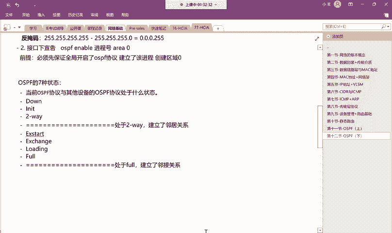

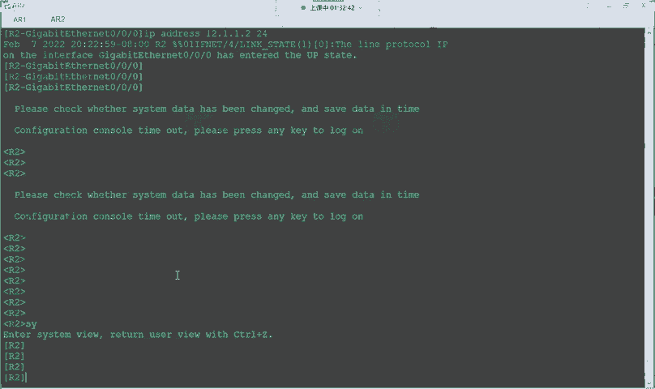

啊，我先把这个给打开啊啊，我现在先把它给打开，标记一下，并且不行，没法儿。我们我想一下啊，先我先在这开启，开启之后我再打开吧。

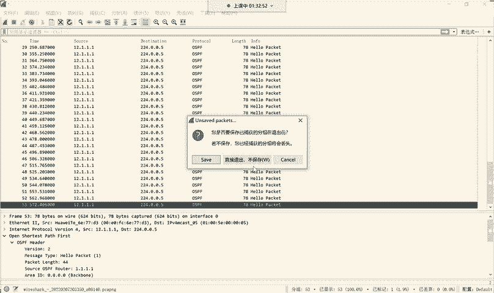

呃，对于22而言，首先我们让他也发送OSPF。那首先给他建立OSPF的进程。比如说呢我在这想进程20，给他直接命名root ID给它改成2。2。2。2，我们通常都是这样的4个2之后呢，我们进到去域零中。

那么我们现在宣告直连网段12。1。1。00。0。0。25，我们就再去一下宣告就行了。好，当我们宣告完毕以后，我们依旧这这次在这抓包吧。我们依旧呢在我们设备上接口上进行抓包。

那么现在我们就可以看到两个设备发送的OSPF的哈lo包，我们都能看到了。我们首先来看一下啊。

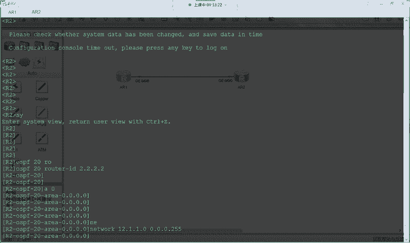

首先来看一下。呃，也就实际上呢，对于因为今天呢嗯好，对于我们今天所讲，我们在这里可以看到LU跟ACK知道为什么没有之前那几个报文吗？同学们，因为我在我打开他们的过程中，前边报文的交互已经结束了。

但这个不重要，也不作为我们今天呢主要讲的这些报文呢感兴趣，你们可以自己去看报文的内容，我就不展开来讲了。因为这不属于我们现在的授课部分啊，呃，我们现在呢大家可以看到我呢既可以看到12。1。1。1。

也就是ro一吧。我们的1。1。1。1这样的一个ro ID的设备发出来的数据OSPF的哈lo包，同时也能看到原IP是点2的，也就是22发的hello包，这样没问题吧。

12呢都在向我们同样的主播地址发送哈lo包，并且由于我们之前讲主播的时候，也跟大家说过了，我们不需要去现在理解组主播具体的工作机制。但你们要知道的是，我们对OSPF协议来说。

我们提前加进了这样的一个主播组中。那么对于这样的。😊，地址来说，我是可以接收这样地址的数据的，也就相当于现在12他们之间互发我们所发送的hello包互相是可以接收到的。这个你们是要知道的。

也就是我们现在呢可以来看到一2呢都在向外界发送hello豹文。那么我们可以在R一上看一下啊，对R一来说，我们首先可以看一下刚才给大家看的那条命令检查一下我们现在OSPF我的一个邻居关系。

那么这是我的ro ID啊，但太太长了，我们写个小点的，我们看一个摘要就可以了，不需要看这么多我现在设备ro ID是1。1，我现在呢在区域零里啊，我给你们画一下啊。

也就是为什么我们所说接口划分进不同的区域呢，以后你们再检查的时候，你会发现啊，在我现在区域零中，我这样的一个接口0-0属于区域0，我在区域零里有一个邻居它的ro ID是2。2，我跟它的状态是。

也就是最终的临接。

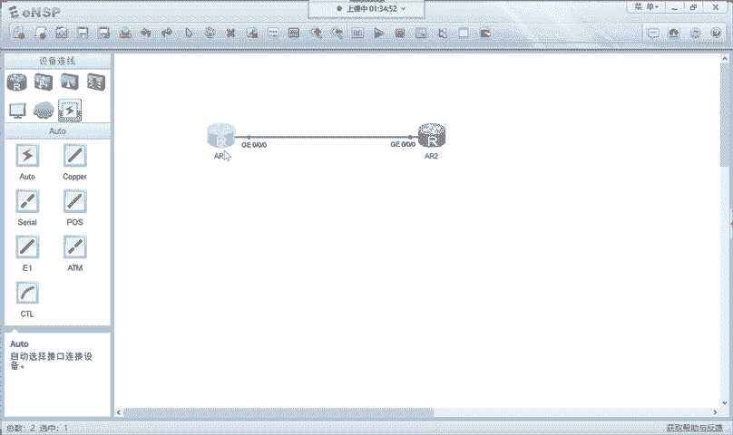

关系好，这是我们所说邻居，我已经能够在我本设备上看到我有这样的一个邻居了。那么说明我们之间关系就建立成功了。那么究竟我们是怎么建立的呀？我们就要研究刚才我所说的7种状态了。

它会跟我们的报文以及我们最后的这个负状态，你看这个for眼熟不眼熟啊，是不是我们这里这个fo啊，指的就是我现在这个设备，我在区域零中，我跟这样的一个设备，我俩的状态，我看它是f。那么我看它是for。

他看我也是一样的啊，因为最终我们互相看对方都是最终的临接状态，我们才能够称之为叫做临接关系，所以这是我们相互的，我们也可以在R2上查看一下好吗？为了验证一下，我们在这里也查看一下OSPF呃。

我们检查一下P brief。

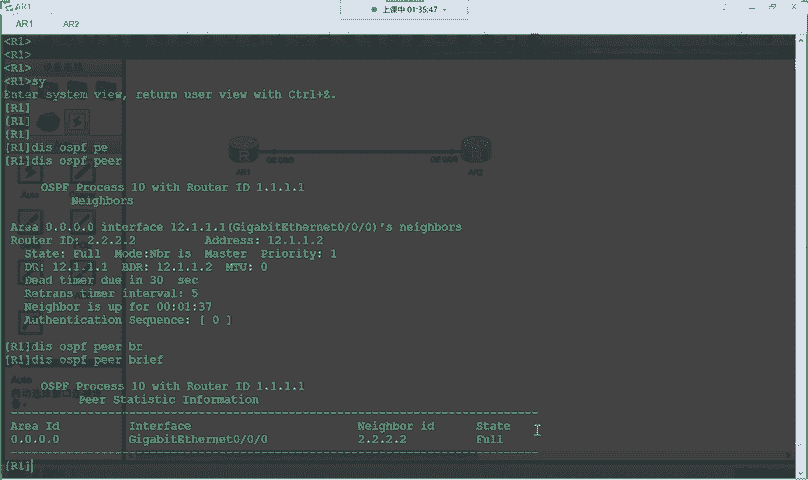

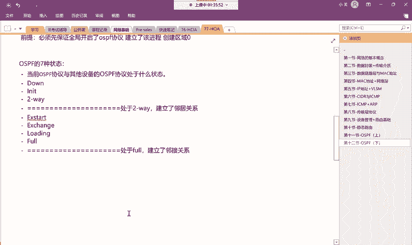

你可以看到我在区域零中呢也是一个接口，0-0接口，在区域零里，我有一个邻居1。1，我跟他的状态呢，我看他也是f。那么我们来总结一下他之间的流程，这个我就就删了啊，就删了。好。

那么我比如说啊我把这两个设备呢给他们拿出来呃，好拿出来，放在我们的话图板里，咱们一起来讲一下。对于两台设备来说呢，我们现在已经知道关系他们已经建完了，但是究竟怎么建的呀，跟我们的状态有什么关系。

我们要一个一个来看。那么首先大家要注意，对于我设备而言呢，我设备呢刚开机刚运行了OSPF协议刚进行我们所说OSPF的协议的宣告吧，刚刚开启这样的一个协议的时候，请注意我们都处于一个状态，叫做荡状态。好。

请大家注意一定要处于啊处于一个状态叫做当状态。也就是我协议刚刚开启的时候，我还没收到任何报文，我也没发送报文。那么很显然，我呢在这个环境中，我很陌生吧。😊。

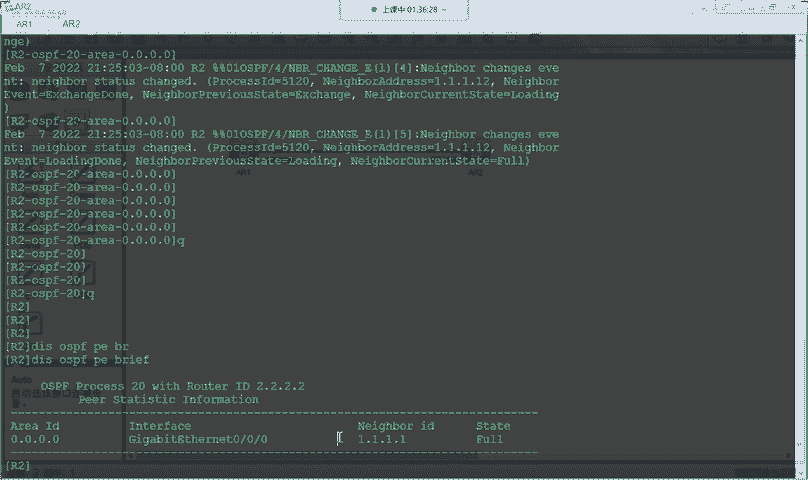

我不知道这个环境有没有其他的设备运行了OSPF那对我来说，我现在看谁都是down吧。我甚至不确定这个环境中是否有其他设备，或者说其他要运行OSPF这样的设备存在，我这样说，大家能理解吗？叫做down。

这是最原始的一个状态，他们之间的地址，我也给大家写出来啊，地址就不用写了。咱们直接写ro IDD左边呢是1。1。1。1，对吧？右边是多少，右边是2。2。2。2。没问题吧，这是他们的ro ID啊。

那么现在我设备是不是要去往外界发送报文了？假设咱们今天还是就像讲我想想就像讲什么一样，就像讲之前讲TCP的时候一样，我们也是以一个单向的那个时候是一个客户端一个服务器，我们单向的请求回复请求回复对吧？

我们今天讲依旧以单项来讲，这样大家会比较方便去理解假设我设备呢开机开机呢两端呢看对方都是这是没问题的。好，那我现在R一首先要向外界发送报文了，发报文我都发什么呀？咱们首先来看一下我发一个OSPF的包。

那么这个包首先有一个通用的头部，对吧？这个没问题吧，刚才看过了，通用头部内容咱就不写了头部里边我接着呢发了一个hel包OSPF包那么这这个hel包中，刚才是不是会携带我自己的ro ID呀，这个还记得吗？

也就是我这个报文是谁发出来的，我是不是有一个ro ID我自己肯定要知道我。这是谁发的？就像我跟大家说过的啊，我们所有所发送的OSPF的报文都会标识这个数据是由哪个设备发出来的这是肯定的啊。

所以因为包括我们邻居关系的建立啊，最终路由的计算啊，跟他都是息息相关的。有root ID的参数啊。那么一旦请大家注意我发送出来的哈lo包中，这个数据发送到了咱们就不提主播了啊。

咱们就直接不说发送到一个主播地址上，他能接收主播地址，所以能收到，咱就不这样说了。R一发送的数据，我们R2当收到了这个哈lo包的时候，他会看到这个哈lo包中有一个root ID他会发现哦。

现在原来整个环境中有一个设备运行了OSPF，他在给我发哈lo呢，也就是他在哈喽包中呢写上了一个ro ID这是他自己的I也就是他自己的I也就是这个时候R2收到了OSPF的哈lo包。

那么请大家注意他就会对于我们他跟一。1来说，也就是我们在2。2看1。1。1。1这个设备此时对于R2来说，它跟我呀就处于init状态，注意就处于init状态。那么请大家注意，是因为我只收到了哈lo豹文。

看到了对端的root IDD那么此时我认为它就跟我是init状态。好，是这样的一个关系。好，那么我们来设想一下，同学们，对于我们R2而言，对于R2而言，我们收到了R1的哈lo包之后。

请大家注意它会干什么呢？你看唉，现在网络中原来有一个1。1。1点1这个设备存在呀。所以于是呢我们就会在R2这里把它发送的OSPF的报文里填充一个参数。

这个参数叫做active neighbor我给大家简单看一下。如果你们好，我在这里就简单说一下，这假设这就是R2，对吧？我们在这里会有一个字段，这里有一个字段叫做active neighbor。

如果刚才我给大家看报文的时候，那个时候啊就是在这节课开始之前，我给你们看那个如果你们仔细看的话，你们会发现在我们刚刚展示的只有R1右接口运行了OSPF的时候，这个位置是没有这个字段的。

如果你们刚才没注意回去可以看看录屏或者自己可以做实验研究一下，你们还有人记得吗？如果记得可以给我刷个一，刚才呢我就不讲了，这里是不是。😊，我们讲完这四个以后，我说了DDRBDR这是我们选举出来大哥。

这是另外一个角色。当然我没提，我说他是二哥。这句话我没说，但是是不是没有下边这个字段啊，如果有人记得可以给我刷个一没人记得就算了，没注意是吧？有同学可能看到了，有同学没看到什么意思呢？

刚才对于我们设备来说，刚才只有R1开启了我们所说OSPFR2是没有进行宣告的，那R2没有进行宣告，对于R一来说，整个环境里没有任何的邻居能理解吗？但是对于我们现在来说就不一样了。

你现在点开一你会发现这里边有个2也就是现在他发现2。2的出现了，发现一说就印象了，对吧？这里会有一个新的字段叫做active neighbor那么这个字段在你收到别的设备给你发的哈包之前这个字段是没有的。

只有当你收到了以后，你才会认为哦，原来现在这个环境里啊，有一个人他的报文发给我了。他想跟我建立邻居关系，所以你才会把他填充。😊，来好，有印象就有没也无所谓。啊，这个点呢就是学习东西呢。

其实OSPF很多东西以后呢，刚才有个同学说感觉还挺复杂的。这台哪儿到哪啊啊，IA里的OSPF很简单，可能我说的有点多吧。IP中的OSPF是很复杂的，慢慢学。😊，现在呢我们把对方呢置为init。

那么其中我会在我也要向外界发送报文。注意我还是说单向啊，这我收到了以后，我向外界发的时候，我也就是R2，请注意，我就不写了R2收到对方，也就是R一的哈lo包，我会把R一哈lo包中ro ID1。1啊。

添加到我自己的hello包的哈lo包中，添到我的active number中，也就叫做活跃的邻居。也就是告诉R一，我现在发现你了。因为我现在这里呢看到了我呢现在收到了1个1。1的报文。

我有一个活跃的邻居叫做1。1。也就是我除了刚刚我们所发送的你的这个报文以外，我会发送这样的一个hello包给你多出来了一个字段。那么在R一收到了这样的一个字段的时候，请大家注意。

R一就会自己迁移到我们所说的to位状态。但是请大家注意啊，有个同学刚才说它是从当直接变成突位了，你说这样准确吗？其实不准确，为什么？因为在你R一给R2发的时候，R2刚开机。

我们所说刚运行完OSPF他是不是也没收到R1的报文啊，在没收到之前，那么他也是会去发送一个里边没有active neighbor的报文的，所以当R一收到的时候，他看R2是不是也是init呀。

他只知道现在2。2呢给我发了个报文，但是发了个哈lo包，我知道他在，但是他好像没认识我呀，我也不认识他他也不认识我，我们现在看对方都是init。😡，我说到这儿能理解吗？同学们。

但是我不就不每次都把两个方向都给你们说了，这样的话呢就说不完了，咱们就以一个方向为例。同样的啊，我现在收到了，我们一收到了二发的，我也把它填到我这里边，也给他发过去。那二是不是也是突V了，就是这个意思。

那你说老师对于我们现在所说，邻居，如果多了邻居怎么办呢？什么叫做如果多了邻居怎么办呢？还是街口的邻居，还是设备的邻居，还是这是街口的邻居，还是设备的邻居。是我们作为一个设备上来说。首先啊严格意义上来说。

我这样跟大家讲，我拿着这个命令行跟你们说吧。

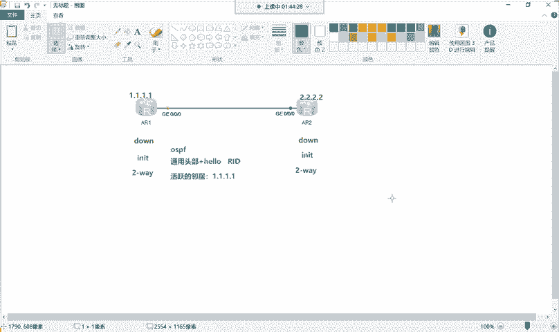

怎么去强调这个邻居是谁呢？是在我本设备上OSPF进程20root ID这是不会变的。因为我进程20的root ID是2。2。那首先这肯定是我该进程下，我在区域零中，我这个接口。

我的root ID也就是我的邻居他的root ID我跟他处于的状态。呃，能明白我的意思吗？同学们，因为首先啊我跟大家讲一下，作为我们所说路由器而言，我们等一下会讲到一个选举。

也就是讲到一个我们所说OSPF豹文的传播范围在一个广播域内，这句话你们首先要理解，对于我们今天讲的这张图中，一根线就是连接的对端吧，一根线连接的就是对端吧，能理解我的意思吗？那对于我们对端来说呢。

我就是现在我的这个接口下连的这样的一个设备，我跟它的关系。那么未来我们会讲到一个比较复杂的图啊，比如说我给你们讲一个啊啊，简单先画一下。😊。

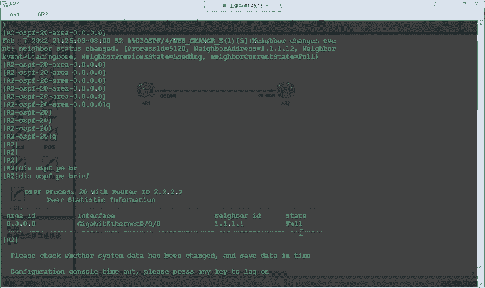

这个咱们本节课讲不到，下节课再说吧啊，比如说是这样的啊。😊，交换机我们现在也没讲，咱们先讲路由再讲交换。但是大家要知道，作为交换机而言，交换机呢，它所有的接口默认来说呢，我们首先它是个二层设备。

不给它配IP那么对于通过交换机相连的，我们可以处在同一个广播域内，也就是比如说我现在都在192。168。1。0网段，你说的就是这个意思，对吧？比如说我现在呢这几个设备的接口都宣告进了区域零中。

然后我们是不是都处于相同网段啊，对吧？我现在要跟它也有关系，跟它也有关系，跟它也有关系，你是不是这个意思呀？也就是我会跟不同的我们所不同的设备，它划分进来的接口处于什么样的关系，是这个意思吧？

但是请大家注意我们所说OSPF的关系中，在我们今天所讲到的这里边，我们是不是在一个广播域内进行的选举以及进行的相应的一些交互啊，我们没有讨论这样的形式，能明白吗？我们不会先没有讨论这样的一种形式。

这在我们IA中呢也不。😊，作为去讨论，因为它会有其他的一些相应的知识，不是我们现阶段去学的那我可以告诉大家的是，未来它会跟其他这三个设备呢处于不同的关系状态下，你是这个意思吗？啊。

不同的关系咱们先讨论两种。能理解吧？同学们，咱们讲状态呢，如果四个设备同时跟大家讲没有什么意义。因为知识来说呢，各种知识你们最终一定是1块1块的学，自己把它汇总出来啊，我们没有必要一上来呢。

就自己给自己增加难度。😡，嗯，然后就DRB没错，那个咱们还没讲到那个概念呢。好吧，还没讲到这个概念。好，我们现在所说呢进到to位。那么现在我们就会发现init跟 two卫，他们两个之间的区别是什么呀？

自己能总结出来吗？同学们如果现在我收到了对方的哈lo包，但是呢你看我没收到任何人的哈喽包，我认为我现在没邻居，我是down。如果我收到了一个人发给我的哈lo包，但是这个哈喽包中呢，只有他自己的。

比如说是2。2，我就认为我现在跟这个2。2呢，是什么呀，是init，我看他是init，为啥因为他不知道他不认识我呀，他不认为我是他的一个活跃的邻居，但当未来我收到了一个哈lo包哈lo包中呢。

这是谁发的2。2发的，他里边携带了一个东西，他觉得自己有个活跃的邻居，我一看哎这不是我吗？我就认为哦原来他是2。2，他也认识我了，他觉得我一。1就是他活跃的邻居，那么现在我就会看他变成。😊。

我认为我跟他就是to位二来说也是一样的。好，那么到我们现在这个阶段，请大家注意，我们就到了to位的阶段。那么以我们这个阶段为我们的一个变化。换个颜色啊，到这里为止。

我们相当于两台设备就已经认识了就已经认识了。我们现在呢就已经处于一个叫做邻居状态下了。就处于叫做邻居状态，呃会不会存在当直接到init的状态？

init的状态必须收到来自于其他我们所说必须收到hello包才会到init，这是一个协议机制。因为如果我没有收到hello包，我不会认为此我现在所处的环境中有人运行OSPF那么OSPF中状态的迁移。

一定是根据豹文去走的，能理解我的意思吗？同学们呃，但是未来呢。呃，我在这里就不提了啊，对于我们当直接到to的状态会的啊。比如说我跟大家讲一下啊，比如说现在对于我们设备啊对于设备来说啊。

我设备有的时候发送报文并不像大家想象的，可能由于我某个时间，我的设备本身出现了一些物理上的问题，甭管什么原因啊，如果在我收到，比如说啊我现在发送了一个报文，哎，二认识我了，对吧？

那么他可能给我发送的报文中本身啊我在给他发的时候，他还没给我发，能明白吗？还没给我发。那么我在发送的时候，他直接看我就变成了init，就是我直接发送给他了，那么他把携带着他的ro发给我。

但是这个报文我有可能没有收到，这是有可能的，我可能没有收到这样的一个报文。那么现在呢他恰巧他提前收到了我的报文，是这个意思。我现在设备开机，他还没给我发，我再跟大家说一下啊。

也就是他还没有给我发hello包可能。他发的慢，他呢直接收到了我们所说我发送的报文中已经有了我自己。那么他在看我的时候是不是先变成init呀，变成init，他发送给我的就带着2。2跟1。1过来了。

那么我收到的第一个报文，直接就有它也有我，那我就会直接变成图为，这是有可能存在的，能理解吧？是有可能存在的，能明白我的意思吗？我没有收到只有2。2没1。

1的报文直接收到了两个参数都有的那我就会直接变成图位，这是可以的。啊，包括你们如果感兴趣状态，你们可以私下去看产品手册。对这里块呢，别看它只是个小知识点啊，讲的非常非常的详细，可以私下呢了解一下。嗯。

行啊，包括你们未来也会看到一个突位，你们也可以可以了解了解一位啊，但是这个我就不在课上讲了。好吧，也就是单方面分手。你认为你们两个还是，但他认为他已经不认识你了。那在我们如果说设备重置的情况下。

当然它不属于我们完整的7个状态啊，只是说有这种可能性。某一个时刻，他的OSPF进程重置了，你认为他还是你的邻居呢，但是他已经不认识你了。本来你们两个好好的发送的报文中互相都有一也有2某一个时刻。

他发送的报文中忽然不承认他有你这个邻居了。那么现在你们的变变化，你说我现在状态是不是就不是to位了呀？哎，留给你们一个思考题吧。这个东西呢到了IP中，你们会去讲的更详细一些，咱们现在就不说那么多了。😊。

to的状态it跟to最大的区别就在于活跃的邻居字段中是否能够看到自己的ro ID看到的话就是to位就相当于我们建立了邻居关系啊，讲到这儿没问题吧，啊，嗯，这是我们所说它的一些参数。

那么对于刚才我画了一个图，唉，刚才我拉的那个设备算了，已经已经删了就不说了，好吧，咱们还紧着这个来说啊，现在呢对于我们两个设备来说，我们只是建立了关系，对吧？到了我们to位状态还只是我认识你，你认识我。

但是我们之间更深层次的一些交流。比如说LSA信息的同步啊，比如说LSDB的最终的同步啊啊，我们数形透扑的计算啊，最后计算路由表是不是还没开始啊，哎，整个状态我们还没有开始，对吧？

这是我们之前只说了三个状态，我们把下边的说完嗯，我们现在先给大家看一眼课件，这个里边有一个att，那么这样的一个我们所这样的一个状态，它只有未来。你们会可能了解到的一个状态。

一个网络环境叫做NBMA的网络中才会出现。但是默认我们没有任何的一个网络属于NBMA那么它必须你要手动进行调整，但现在用的也非常少了。所以我们学OSPF你只会听到啊经常是7种邻居状态机。

我们att基基本上不做讨论呃，现实中你也不会见到考试也不考也没有什么意义，这是很早期的一个概念了，能理解吧？同学们OSPF呢它的兼容性是非常强的。那么它兼容很多老式的一些网络环境。

但是对于一些比较古老的网络环境呢，现在已经不用了，所以相当于这部分知识呢，我们就不需要去学了啊。对啊，如果感兴趣私下了解吧，课上我就不说了，只是怕你们觉得呢这个我没提，你们觉得有点疑惑。

这东西现在感兴趣可以私下说。因为你要去了解它还要讲跟它相关的场景。但是这个东西已经不属于我们现在讲解的范围了那所以你可以完全的忽略它就可以了。IP中呢。可能会简单提一下，但也不会跟大家讲了。嗯，行。

那我们接着说OSPF啊，对于OSPF来说，到这儿是我们的邻居。那么我们的状态就是依次往下进行的。好，那么到达邻居关系的时候，我们现在是不是还没有任何可以表达，或者说最终计算路由的那个东西呀？

我们计算路由用的是什么东西啊？同学们用的是什么东西啊，同学们。想一下这个问题用的是什么东西？呃，关于这个回退呢，也就是从突位如何回退的init。这个我刚才跟大家说到了，比如说当某一个时刻。

你对端的设备重置了，你呢某一个时刻是不是收不到他的哈lo包了，或者你收到的哈喽包中，他是不是不再去承认你是他的邻居了。此时你的状态会回退。哈喽包作为一个饱和协议。

你必须时时刻刻通过哈lo时间间隔一直持续收到邻居的哈喽包，你才会跟他一直保持突位状态。某一时刻他不给你发送了，那么你认为对他来说，你跟他可能就变成当了啊，那并且比如说你设备对端OSPF整体就重置了。

那么你跟他之间OSPF的关系就不存在了，你就不会承认他是你的邻居了。如果呢对于他来说，对方重启了，在哈喽时间死亡时间间隔内重置了，这就说的太多了。同学们我们现在你想把某一个箭每一个箭头都搞懂，不太容易。

我只能简单跟你说一下。你收到了某一时刻，他进程重置，他呢不知道你是他的邻居。因为。重启了，他要往外界发hello包，你收到了以后，你发现他不再承认你了。那么你现在跟他肯定无法保持脱位状态。

你只能进行回退了，就是这样的一个原因。嗯。哦，好，我看一下。好，有同学说了LSA对吧？啊，咱们别12345类啊，如果说的话，请把7也带上，那为什么不说最后一个呢？啊，45竟然都出来了。行。

我们现在说一下啊，对于我们最终计算路由的时候依靠的是LA。那么我们通过彼此详细的LSA才能计算路由，那么但是到了我们邻居状态，大家会发现我们现在有LOSA任何的一些信息吗？好像没有吧，我只是告诉你呢。

我的ro ID哎，我运行了OSPF你也一样，但是呢我们好像没有继续向下进行了，对吧？也就是我们邻居状态下，请大家注意，我们仅仅只知道啊，我们我们所说呢仅仅只是两个设备知道彼此属于我自己的邻居。

他也运行了OSPF我们未来呢可能会跟他但是并不是直接跟他啊，我们会同步一些数据，但是到此刻为止，我们还没开始同步，对吧？好，那么我们就要往下开始看了。嗯，在邻居状态这里，首先跟大家说，在邻居关系这里。

我们会选举出来两个比较关键的角色，一个叫做DR，一个叫做BDR。这节课我们讲不到了。但是你们首先要知道，在这个状态下，也就是先进入邻居状态之后，我们会进行角色的选举。但是得得等我们讲完7种状态。

再回过头来看，好吧。说一下啊，下一个状态呢，我们就到exstar了，我就直接截图吧，我实在是懒得呃懒得再敲一下这个英文了。直接截图啊。我们现在呢下一个状态就是exstar。

也就是我现在呢要进行下一个状态，那么怎么到呢？首先请大家注意呃，这个状态是干嘛的呢？通过上边三个状态，我们已经可以发现并且确定中网络中的设备了。那接下来我就要知道我要跟谁传递LSA了，对吧？

那么接下来就是开始同步我们数据库了。那在exstar状态下，我们今天会讲到一个概念叫做主从选举啊，这个大家听过吗？叫做主从选举，我们要选举一个角色叫做主和从，哎，这是什么意思呢？什么叫做主从呢？

那么我们先来想一个问题，想一个什么问题呢？我们现在要同步LSDB中的LSA啊，对吧？哈，这个概念上节课说过了，那么请问同学们每一台设备，我在没有交互之前各自。

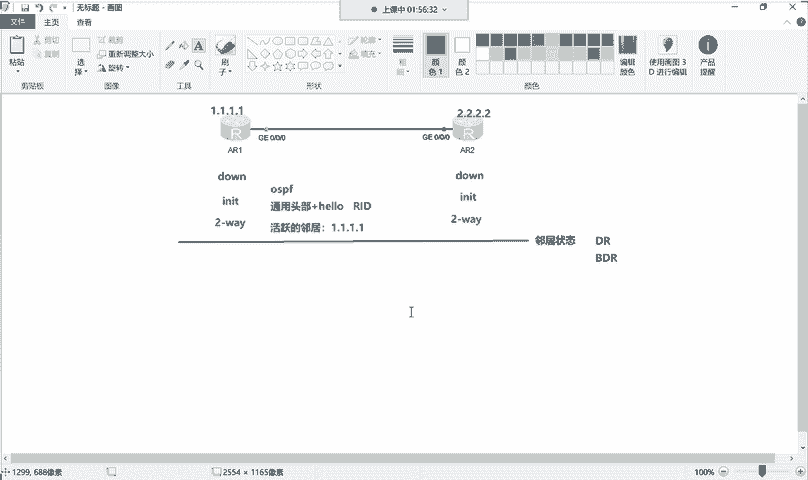

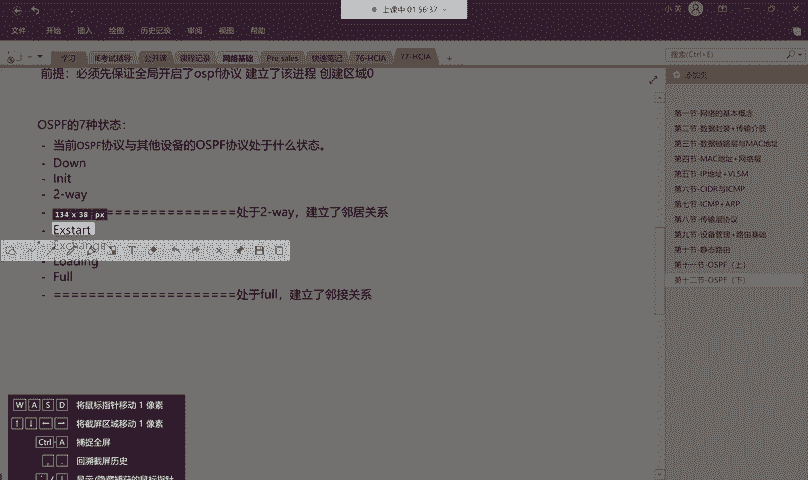

我的数据库中有一些信息构成了我自己的LSDB对吧？我本地要产生LSA嘛，我把它们存在哪儿，存在我本地里边有很多的信息。那请问同学们，我现在要跟对方同步，我是不是一次把我的信息都给他呀？

你们想一下这个问题，比如说我R一后边简单来说啊，我R一后边连接了非常多的网段。因为我路由器嘛，路由器这边我可能连接了很多个网段啊。😡，哎，我现在呢要把这些信息是不是都告诉你啊？二这边也连了很多吧啊。

拓扑怎么连呢，咱们就无化了。也就是我现在有一条、两条、3条、4条，我都是一次性给你吗？啊，同学们来思考一下这个问题，都是一次性给你吗？😡，是不是不会的呀？也就是我如果从邻居状态刚切换到下一个状态。

我就直接把所有的都给对方。那如果对于对方来说有一些重复的东西，我们有必要接收吗？比如说我们可能哎举一个简单的例子啊，我们有可能呢未来连接到了同样的，比如说啊不能这样话，比如我们连接在同样的一个网络中。

你看啊，比如说我们通过中间这个线就不看了，这不看了，我们通过一台交换机可能连接到了同样的一个网段里。比如说我们现在接口的地址呢，就不是12网段了啊，或者还是12网段，我这边还有个12。1。1。3哎。

12。1。1。4，这对于我们来说，是不是实际上对于这些数据来说，我们都是共享的呀。也就是有一些东西可能你知道我也知道那么我如果都给你发，那是不是稍微有点多余啊，对于一些重复性的内容。

你知道我也知道的东西，我们是不是不太需要交互啊，这就像我上课呢再讲一些知识，A同学听呢，10个点，8个点都听懂啊。B同学听吗？10个点听懂了9个知识点呃，那么两人之间都彼此欠缺一些内容，对吧？

那么可能其他的同学呢也是知道，比如说你知道1到9，他是1到8，那个人呢只听懂了8到10，你们三个互相切磋，大家都都知道了。那么你1到9跟1到8，你们互相需要你把所有的1到8跟他讲了，他也跟你讲了吧。

没有这个必要。所以我们呢需要希望去有一种方法，什么方法呢？在LSDB同步的时候，我们尽量不同步冲突的信息，这是第一点啊，也就是进行LSDB。这东西是啥？你们就如果不知道的话呢，就课下再看了啊。

这之前讲过了，进行LDB的同步式，我们尽量啊只能说尽量啊这是我们的设想，看看能不能实现。尽量不去同步冲突的信息，你知道的就别再给我了，这是第一点。好，这是第一个问题。那么第二个问题。

我们OSPF封装在哪一层之上啊。同学们，我们IP层之上吧。网络层之上，那么网络层问大家他有没有可以保证可靠性的一些机制啊。有吗？同学们有的话刷个一，没的话，刷个2。

网络层能不能给我们提供数据的可靠性传输啊？有好有，那是什么呀？有的话可以给我打出来，同学们让我看一看。有好。大家都认为有吗？我说的是什么呀？网络层可以提供可靠性的传输机制吗？什么叫可靠性？

我给你一个报文，我确定你收到了，这叫可靠性，你给我回复，你确定我回复了，我收到了，这是可靠性。如果网络层能够提供可靠性的传输，那还要传输层干嘛呀。同学们这一看之前的东西，大家得慢慢消化啊。嗯。

咱不能说只是理解了一个大概，这是不行的。好吧，这是我们所说网络层。嗯，所以说呢首先网络层没有办法提供可靠性的传输机制。我不能够通过某些手段确定对方收到了报文，所以才有传输层的出现。那么对于OSPF来说。

它是基于网络层的。而网络层又没有保证可靠性的机制，对吧？但是我们上节课又说过了OSPF它之所以这个协议能够去使用。它有一个前提，前提是什么呀？前提就是我们同区域内我们最终LSDB它是不是必须同步啊？

同学们，也就是我发送出来的LSA或者说我发的OSPF报文，你是不是必须收到，那我如何确定你必须收到呢？如果现在我发送出去的数据，其他设备却没有完整的收到，那么你跟我的信息就会出现不一致的情况。

我们认为各自都已经发送了，但你却没有办法收到我全部的信息，我也不知道我们最终在通过SPF算法去计算我们整体拓扑的时候，是不是会出现问题。可能我作为我22给你发了一个关于3。3啊。

这样的一个我们所这样的一个信息，你根本没收到。那么对于你来说，这个环境中就没有3。3。那么请问你这是一个路由协议该有的一种机制吗？同学们啊，我宣告吗？你说我们关系建立了，OK这步没问题。我宣告了。

我把我这边的一个关系通告给你了，但你却没有学到，那么这很明显它是不优化的。能理解吗？我的意思，同学们，也就是我们要保证信息同步，也就是我要保证我发的数据，对方一定收到了。这是在我们数据传输中很可靠。

或者说很重要的一步。也就是如何我们去保证同步时的可靠你们一定要清楚这一点，如何保证同步的可靠啊？啊，我这点就删了啊，两个问题大家需要思考啊，有同学可能会觉得说老师啊，为什么会有这俩东西啊啊，是吧？

为啥会有这俩东西啊？那这个跟你说的主从选举有什么关系？啊，那么我跟大家举一个例子。举个例子，什么例子呢？我先把它们往下挪点啊，往下挪算了啊，我把他们想不到好的方法，我只能把它们往边上挪吧。嗯。

现在对于我们这两个设备来说呢，假设啊这就像什么呢？就像是一个菜单一样。对于一设备来说，它现在有一些信息是多少呢？123啊1234，这是他的一些信息。对于我们二设备来说，他这有一个菜单，什么菜单呢？

他有12345，比如说这是他知道的哎，这是一知道的很明显，那就相当于是什么呢？他呢会做，就是你们两个人啊，这两个人呃，左边这是你右边呢这是一个饭馆，左边这是你吃过的菜，右边呢这是他的菜单。

你会发现你在点菜的时候呢，你发现12345，好像他有5个菜单前四个我都吃过，那么我是不是想看一下第五个是什么味道，我呢就希望我只要这个5，那如果有一种机制，可以保证在我们进行交互之前。

彼此先看看对方都知道什么，是不是就可以针对性的拿到我没有的东西了。我说的这点，大家能理解吗？怎么保证不同步冲突的信息。呀我们先看看你都知道啥，我们彼此先切磋一下。如果你知道的，我没有。

我再单独去要我没有的这个而不需要一次性的，你把1234给他，他把12345给你。你们一看货四个全都是重复的，就没有任何的必要。因为你们要想到啊，对于我们数据来说，你要传递这个菜单也好，还是说传递数据。

最终都是报文的形式吧。我通过链路发送，我都要占用链路带宽，所以对于我们协议来说，我们的优化一定是会考虑进去的。所以你要根据你想不想要主动进行选择。所以我们就可以去发送一个什么东西呢。

发送一个我们称之为叫做我没才知道是啥呀，叫做摘要。好，我给大家写着叫做摘要。我为什么以菜单举例呀？就是以摘要的形式举例，就相当于呢你不需要直接把菜做好5个盘子端上来，然后直接给他他一看都吃过了。

这是不是很麻烦，我们称之为叫做摘要，也就是我们在正式发送数据信息之前，比如说这个五肯定不是一个数字吧，我代表的是一串信息，我再给你发送信息之前，我要先把整体信息，我先给你一些哦。

先给你看看你知不知道这个。如果你知道的话呢，我就不给你讲，就像呢我会加法减法乘法除法。我先问问你会除法吗？你说你会，那么或者说呢你不问我要，你不说你不会，那不就是你会吗？我就不给你讲了。是这个意思。

同学们，所以你现在呢你会发现这是我们摘要的一个概念，我们可以发送LSA的摘要，避免去发送重复的LSA真实的内容。LSA内容是很长的，还记得是什么吗？同学们上节课都给大家说的什么呀。我们发送者的信息。

co值，然后发送的具体内容。😊，对吧详细信息等等，这些那是一条，它是很大的。所以呢它是比较多的这是第一个问题的解决。我们可以通过摘要的形式，先看看你都知道什么。好，第二步，如何保证同步时的可靠。

第一个问题解决了，来看第二个怎么保证可靠啊。我怎么保证我发的数据你一定能收到，咱们先参考一下TCP同学们TCP中怎么保证呢？想一下TCP里是怎么实现的呀？我们是不是有一个叫做什么以及什么来着？

S开头的跟A开头的，有一个什么序列号，有一个什么确认号吧，一个什么SEQ一个什么ACK吧。我给你一个SEQ如果你收到了，你就在我原本的SEQ上加一，哎，你确认一下你收到了我的报文。

你给我回复的ACK加一，对吧？在我原本的基础上加一，是希望我下一次再发的时候，以你发送的ACK为值发送下一组报文，这是我们一个保证的传输性，对OSPF来说，它也可以利用相同的或者说差不多的一种机制。

也就是我们说白了如何保证可靠啊，我们就是需要一种确认机制呗，对吧？那至于这个确认机制具体它是什么样子的，那么就会说到我们的主从了。哎，所以铺垫了这么多。

实际上就是想说下边这一个在我们正式发送摘要信息之前，我们会先去选举一个主从关系，何为主何为从啊。那么并且主从关系的选举，请大家注意，我们是在ext状态下进行发送的。那么我们所使用到的报文就不是哈喽包了。

而是地地报文。那么我们在正式发送目录之前，请大家注意，我们会发送一组空地地报文。也就是在这个报文中，我们不会携带摘要信息。呃，首先啊对于弟地报文来说，它有两个概念。第一个就是交互目录啊。

大家可以这样去看，交互目录或者说交互摘要。那么在正式交互摘要之前，他会先有第一组叫做空地地。那么这个空地地是用来选举主从的那这一点说起来可能有点绕。但你们要知道啊，选举主从。那么这个主从。

因为这节课我们不会讲到DRBDR，我首先告诉你们，这个跟DRBDR完全没有关系，没有半毛钱的关系。你们千万不要弄混。很多同学学到这儿都会觉得主从唉，主就是DR从就是BDR啊。

其他呢都是啥也不是不是这样的呃呃DD报文是在突位状态下发送嘛？是在我们主从，是在我们。to位状态结束的时候，进入到我们eststar状态以后，我们才会去发送第一组空地地能理解吗？也就是to位状态下。

我们建立了邻居关系以后，接下来我们再去进行。因为为什么是这样说呢？同学们，因为主从的选举来说，它并不是所有设备之间都会选举主从。也就是对于设备来说，两个设备我们可以进入到to位状态。

并不意味着我们会选举主从，我这样讲，你们能听明白吗？啊并不意味着我们会选举，所以它并不是在to位状态下发送的，它是在我们exstar状态下发送的。好，第一组叫做空地地。那么对于这个来说呢。

就直接给大家看我们PPT了。我简单跟你们说一下就行了。这个不需要你们去记啊什么动作出发to位到est呃，这个这个我们将来会学习到我们DR和BDR讲完了以后。

大家才能知道DR other之间我们是不会进入最终就停在突位了。那么我们D跟DR。dther跟BDRDR跟BDR之间，我们会去进行to位到ext这个状态，能明白吗？我现在没讲到的东西呢。

之后都会跟你们讲，不需要着急啊，因为啥讲过啥没讲，我是知道的。好吧，这一点呢首先跟大家说一下。嗯，看一下我们的数据库啊，这一点说完，把最后的7种状态简单说完，咱们今天就到这儿了。首先来看一下，当我们。

呃，我们今天还没有讲DRBDR，我再跟你们强调一下啊。好，所以说呢咱们知识。呃，我跟大家说一下OSPF之所以大家觉得呢听起来不太好理解，就是因为它的很多交互是同时进行的那在某一个时刻中。

对于大家来说没有很清晰的一些层次概念。所以我不可能停留在某个状态，把它所有的知识全给你们讲到，这不可能，你们一定会混。所以我们的流程就跟着我的节奏来就可以了。好吧，不然的话呢，如果大家自己去看这些知识。

其实手册里都有，但是你看还是看不懂，就是因为我们刚上去学的话，你一口气想把所有的东西都学完是不可能的啊，再跟大家强调一下，所以跟着我的节奏来就行了。嗯，对于我们现在来说。

从突位到excel的状态进入该状态下，我们会发送地地报文。那么第一组地地报文。注意第一组是一个空地地。也就是在这个里边我们不会去携带我设备中的摘要，就像我刚才写的12344条LRC它的123455条。

我们不会去携带摘要信息，而只作为主从的选举。在这个选举中。我会认为自己是主，我想当老大，我会给你发送一个序列号，序列号是X。这个序列号其实跟我们所说呢呃跟我们TCP中的序列号。

你们可以理解成是差不多的概念啊，标识我现在发起一个随机数值，这是一个序列号。同时在我们同等时刻下，B也会发送DD报文，里边也写一个序列号。这序列号是我本地产生的一个随机的，是Y。好。

那么对于我们设备来说，AB现在都已经收到了对方发送的DD报文了。那么我们就要去查看，我们都认为自己是主，但是由谁去真正成为主呢？请大家注意。

我们会去比较两者的ro ID因为在我们整体发送的OSPF的报文中，我们是不是会标识自己的root ID呀。那么对于rota ID来说，B是4个2A是4个1，那么我们所说root ID大的为主好。

能理解吧？rote ID大的为主。也就是在这个关系中，我们RTB会成为主。因为A收到了2。2，它会自动的知道这个比自己大，所以B就成为主。那么当A请大家注意啊，这个过程一定要好好听。

当A我们收到了这样的一个报文以后，我发现对端它的rote ID比我大，我会承认它是主，认为自己是从。也就是现在它是主，它是从。那么我会以本地我要发送出来一。个新的弟弟报文注意啊，新的弟弟报文。

那么在这个弟弟报文中，我会承认他是主如何承认呢？承认的方式就是我会用他刚刚发给我的序列号，以我的序列号发送给他，代表我向你干嘛呀？就是你他你发送了一个X，他发送一个Y。现在你发的时候，你以Y发了。

就代表你认怂了。那么同时情况下，这个报文当B收到，他可以确定两个信息。第一，他发送的Y，你收到了，就上一个空弟弟，你收到了，你给他首先做了一次确认，你收到了。其次，他认为作为我们A来说啊。

B就知道A认为B是主了。那没错，我确实就是主，是这个意思。能理解我的意思吗？同学们。😡，好，这是我们这一点。那么同样啊同理。对于我们两设备之间来说，它只有这一种情况啊，我收到的要么比我大，要么比我小。

那么当我们收到的对端只要比我小比我大，我认为它是主的时候，我就会把对端置为exchange状态。也就是在我们2。2携带着这样的字段发给A的时候，A再去看B，它就会变成exchange了。

当这个报文被B收到以后，它就会把B也看成把A也看成exchange进行状态的迁移，再往下我们才会真实交付我们的D地中的摘要，我收到这儿，你们能明白吗？同学们我们才会交互D地中的摘要，我把我的摘要给他。

它把它的摘要给我。那么其中我在发起的时候，序列号我就会进行一次加一。所以说呢标识我这下一个豹文。那么即使现在你会发现啊。我在这里跟大家写，对于从弟D来说，这样的一个报文中。

除了确认B是主以它为序列号以外，他也会发送摘要。也就是这两个报文中都是会有摘要的。那么最后大家会发现BA既然已经发完摘要了，为什么还要再给B一次，我们所发送一个报文呢？就是为了做最后的一次确认呢？

这叫做一个隐示确认啊，我跟你们说一下啊，叫做隐释确认。呃，你们未来呢到了IP中会接触到很多这个词儿，什么叫隐视啊？就是你说吧它的号呢叫做序列号，它也不是ACK啊。你说它怎么去确认呢？叫做隐视确认啊。

它虽然不叫做确认号，但它却可以达到一个确认的功能。我们称这样的确认叫做隐视确认。嗯，我讲到这儿，你们有啥问题吗？如果有的话，可以问我有吗？因为这样听着会比较绕啊，如果有问题就赶紧问。有问题吗？同学们。

嗯。行。没有问题是吧？我给你们点时间啊，如果你们有啥问题可以回去再总结总结。下一节课我们还会再讲。如果下一节课讲之前，你们可以在课上接着问我好吧，回去给你们点思考的时间啊，因为说的会比较多。

我怕你们课上现在你们甚至想不到自己有啥问题，就课下慢慢想，好吧，群里这边直接就可以问考题什么样，有没有上课这么难。😊，考题什么样？考题。HIA的考题在这次放假的时候，其实挺多同学问了一些关于考题的问题。

但实际上跟大家说实话，IA你去考试的话，建议大家如果你想拿证书还是背题库比较好。呃，因为IA题库的量会比较大，但是IA中要求你掌握的东西会比较少，所以它题库会比知识稍微难一些。呃。

两者分别第一次交互摘要在哪一步啊？哎，我这个问题回答一下啊。好，在哪一步？在我们选举完主从这一步好。呃，我们所说第一次交互完了以后，当我B发送的这个序列号A收到了以后，A会发现B是不是比自己大呀。

那么他在发送这次，也就是第三个报文的时候，首先他要承认B是主。那么我是从看得到吗？我是从。那么当我承认你是主的这一刻，我就会首先跟你开始同步我本地的摘要了。也就是在这里就会有摘要。好，这点能听懂吗？

然后B收到B收到了以后，首先他能看到A的摘要，确定我他都是知道一些什么内容了。其次，他也知道，现在A承认我了，那么我现在如何去确认我们所说刚才A发的报文，我收到了呀，序列号我加一代表这个我收到了。

那我再给你发的时候，我从加一开始发。并且在这里我会发送我自己也就是B，我身上的摘要发给你A。A收到了以后，你会发现，但是我A刚才已经发送过自己的摘要了呀，我是不是没有必要再发送一次了，对吧？

我已经发送过了，但是我还是要再发送一次报文。那么这次报文中，如果我已经发送过摘要了，我这里边就没有摘要了，我该知道的都告诉你了。但是我要给你进行一次确认。因为呢你给我发了一个序列号。

我现在依旧序列号发送一个跟你等同的，承认我是从，并且你发的外加一的这个报文啊，我收到了。嗯，是这个意思，能理解我的意思吗？这个。😊，摘要包括什么？摘要包括什么呀？

同学们摘要只会包括呃下一节课给大家给大家直接看吧。好吧，下一节课给你们看一个报文。摘要就包括他现在所知道的一个基础的啊一个摘要信息，网段的信息，他所要去未来宣告进来的信息是这个意思，他都知道点什么呀。

他会先告诉你是这个意思。呃，咱们就不说LSA的头部了。同学们呃，LSA的头部，我们在IA就讲不到了。没有这么多了，嗯，跟听天书差不多了，回去就再反复的听一下就好了啊。怎么说呢？OSPF讲讲的少呢？

其实可以讲的很少，但是讲的少，大家很多东西都容易犯迷糊。因为之前呢最开始讲的时候讲的这点就讲的很简单，大家总是分不清主从跟DRBDR。所以这次我打算把它完全分开讲，这样你们就不会听混了。

现在先完全割裂开DRBDR的概念。如果你们之前听过的话，先把主从给理解了。主从是为了干什么呀，两个方向。第一个呢同步摘要的，我们所说同步摘要中从设备先给注意这是一定的，从设备先发起。从设备先发目录。

你们一定要知道，从设备先发目录主设备后发。因为我两端互相交互一个序列号，一定是从设备认怂，谁先认怂谁先发主设备作为我们所说呢主设备作为一个主，它是后同步目录的啊，大家别觉得是主先发起，那这就不对了。

从先发目录后主后发从再来做确认，这是主从关系中，他们的讲的少就几条命令啊，没错，讲的少OSPF没有什么命令。呃，创建一个进程号，创建一个区域network没有了，这就是OSPF的全部命令。

但是他学的东西会非常非常多啊，之所以命令简单，是因为人家协议做的好。嗯，好吧，这是我们所说主从主从就是为了保证我们同步时可靠的。因为它需要有一种确认机制，谁先发报文，发完报文做确认。

保证LSEB能够顺利同步，这是我们在ex star以及次状态下，我们的一个报文交互，咱们把最后两点也说完，因为最后两点非常的简单好吧，非常的简单。那当我们现在整体交互完成，我以刚才的为例啊。

比如说B上他知道12345。好，那A上他知道1234好，那么对于我们这两个设备来说呢？B是不是收到了三这个这个报文，他看到了一知道A知道1234，那我是不是不用知道这些呀，我都知道那但是我发给A的时候。

他看到这个5，我是不是不知道啊，所以接下来请大家一定务必注意，接下来他们的一个过程。当如果我们的RTB收到了A发来的我们所说的报文以后啊，我一看你的发送的目录里没有我需要的东西，那么此时我就。

会把这样的一个设备跟它的状态置为loading了。这个你们也要知道置为loading。那么我们同样的啊置为loading以后，我们也就相当于什么呢？我收我收到了以后啊，我发现置为loading以后。

没有我需要的。那么我来看它的时候，请大家注意，我来看它的时候，其实我就会置为fo了。当然了，这是我们所说没有我需要的内容的时候才会这样。呃，但是当我们A收到了我们所说B他发送的报文以后啊。

也就是发送完最后一次滴滴报文。收到了以后，我发出去这个报文，我就会把对方置为loading了。也就回到我们下边一张PPT上来看。好，发送到这儿啊，也就是现在我会发现五呢我没有，我就要向他请求，对吧？

我1234，他是12345，我会发送1个LSRrequest请求5这条LSA它的具体信息。我把目录发给你B收到了以后，它会给我发送详细的信息，我们称之为叫做LSUU是更新update的意思。

我再把这个给你。最后当我们收到了以后，我会给RTB发送一次LSACK确认我收到了这条数据以后，我才会把B置为负。嗯，在这个过程中，首先我要跟大家讲啊，在这个过程中，我们课件上它画的是这个意思。

画的呢是比较简单的。也就是就像我给你们画的图一样，B知道的呢，A不知道A知道的B都知道的情况下，那么B会首先看A，首先变成否。他们不一定必须是同步的哦，这是你们一定要知道的。但当然了。

也可能你A呢只知道个123B知道什么，B知道234，你们都有互相不知道的，那么你们需要互相请求，互相确认，最终才能知为否。呃，我说到这儿，大家能理解吗？也就是在loading状态下。

我们会去进行后边的这些交互。最终当我们同步完成看对端才会成为负。那如果你们两端都有彼此不知道的东西，那么在你们刚才进行完看好啊，刚才进行完目录交互以后，你们看对方都是loading。我说到这儿。

你们能理解吗？谁先获取全部信息呃，是这样的，什么叫fo啊？同学们fo就是当两个设备，我看你你知道的，我全知道，那就意味着你对我已经没有利用价值了。我个人认为我跟你我看你就是否了。

你知道的我都知道是这个意思，能理解吧，也就是什么情况下，我们都知道OSPF什么情况下，是不是我们所有需要交互数据库的设备，彼此看都是fo的时候才能确认我们交互完了呀。也就是状态全是fo的时候。

我们OSPF才算交互完成。但是对于我们设备而言，你知道的我都知道了。那么我看你就是fo了，代表满了，你呢我都知道了，就是这个意思，没错，满足的意思。😡，好，这是我们自己的状态，是看对方嘛。呃。

这个我跟大家说过了啊，我们OSPF7种状态机，我们叫做邻居状态机。什么意思呀？我看邻居是什么状态，而不是我是什么状态。所以我们所说的当也好，init也好，都是我看别人是什么状态。它对我而言是个什么状态。

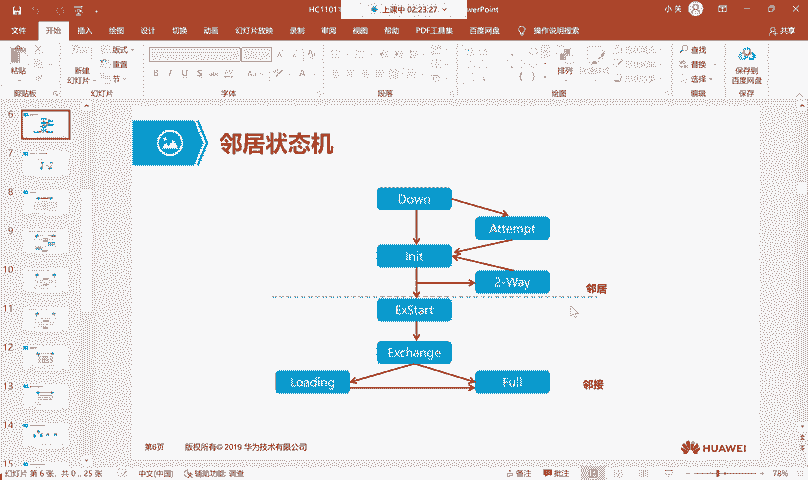

行吧，这是我们今天的这部分内容。